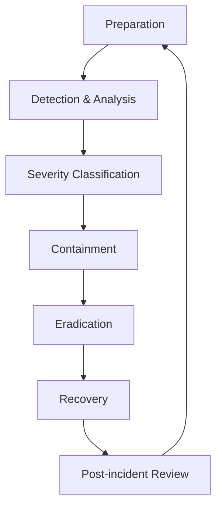
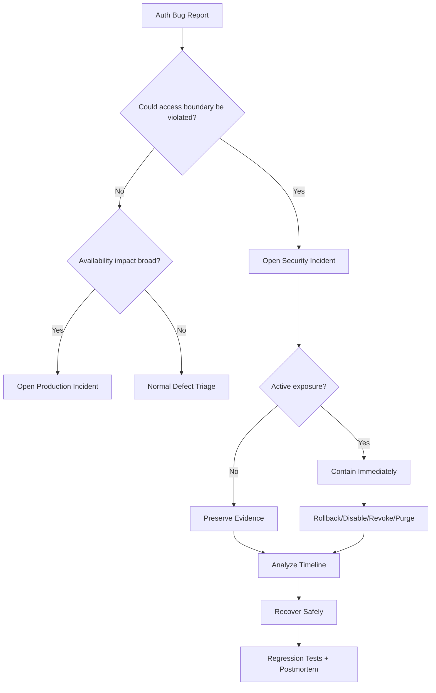

# Part 104 — Incident Response for Auth Bugs

An auth bug is not always a security incident, but every auth bug must be triaged as if it could become one.

A broken spinner after login is annoying.

A stale permission cache after role revocation can be serious.

A bad route guard is usually UX exposure.

A missing server-side object-level check can become data breach.

An open redirect in OAuth flow can become account compromise.

A leaked access token in logs can become lateral movement.

This part turns the architecture we built so far into operational response.

The goal is not panic. The goal is controlled response:

1. classify impact,
2. contain blast radius,
3. preserve evidence,
4. restore safe behavior,
5. communicate accurately,
6. prevent recurrence.

Reference anchors:

- NIST SP 800-61 Rev. 2 Computer Security Incident Handling Guide: https://csrc.nist.gov/pubs/sp/800/61/r2/final
- OWASP Incident Response resources: https://owasp.org/
- OWASP Logging Cheat Sheet: https://cheatsheetseries.owasp.org/cheatsheets/Logging_Cheat_Sheet.html
- OWASP Authorization Cheat Sheet: https://cheatsheetseries.owasp.org/cheatsheets/Authorization_Cheat_Sheet.html
- OWASP Authentication Cheat Sheet: https://cheatsheetseries.owasp.org/cheatsheets/Authentication_Cheat_Sheet.html
- OWASP Top 10 A01 Broken Access Control: https://owasp.org/Top10/A01_2021-Broken_Access_Control/
- OAuth 2.0 Security Best Current Practice RFC 9700: https://www.rfc-editor.org/info/rfc9700

---

## 1. Auth Incident vs Auth Defect

Not every defect is an incident.

| Case | Defect? | Incident? | Why |
|---|---:|---:|---|
| Login button disabled after deploy | Yes | Usually no | Availability/UX bug unless preventing critical access. |
| Route guard hides valid menu | Yes | Usually no | UI projection issue. |
| Server allows unauthorized mutation | Yes | Yes | Broken access control. |
| User sees another tenant’s data | Yes | Yes | Potential data exposure. |
| Tokens logged to central logs | Yes | Yes | Credential exposure. |
| Refresh endpoint outage logs out everyone | Yes | Possibly | Availability/security posture issue. |
| OAuth open redirect exploitable | Yes | Possibly/yes | Could enable phishing or token/code attack chain. |
| Auth SDK supply-chain compromise | Yes | Yes | Browser runtime compromise risk. |

Triage principle:

> If confidentiality, integrity, privilege boundary, tenant isolation, credential secrecy, or audit integrity may be affected, treat it as a security incident until disproven.

---

## 2. Incident Response Lifecycle for Auth

NIST SP 800-61 describes incident handling guidance including preparation, detection/analysis, containment, eradication/recovery, and post-incident activity. For React auth, map those phases to product/security engineering actions.



For auth systems, each phase has specific artifacts.

| Phase | Auth artifact |
|---|---|
| Preparation | runbooks, kill switches, forced logout path, permission rollback, audit schema, contact list. |
| Detection | alerts, user reports, denial spike, token reuse detection, tenant anomaly. |
| Analysis | timeline, affected actors/resources/tenants, release/policy version, logs. |
| Containment | revoke sessions/tokens, disable feature, rollback release/policy, block route/action. |
| Eradication | patch server enforcement, remove bad SDK, rotate keys, purge cache. |
| Recovery | re-enable safely, monitor SLOs, validate regression tests. |
| Lessons learned | root cause, missing invariant, test gap, runbook update. |

---

## 3. Severity Model

Use a simple severity model that engineering, security, support, and leadership understand.

| Severity | Description | Examples | Initial action |
|---|---|---|---|
| SEV-1 | Active or likely unauthorized access / credential leak / cross-tenant exposure | Server-side authz bypass, token leak, tenant data exposure | Immediate incident commander, containment, legal/security escalation. |
| SEV-2 | High-impact auth availability or stale privilege risk | Mass logout, refresh storm, role revocation not taking effect | War room, mitigation, customer comms if needed. |
| SEV-3 | Limited auth degradation or incorrect denial | Some users denied valid access | Triage, patch/rollback, support guidance. |
| SEV-4 | Low-risk UI projection defect | Menu hidden but direct route correctly denied/allowed | Normal defect workflow. |

Severity is based on impact, not code elegance.

A one-line missing object check can be SEV-1.
A complicated React state bug can be SEV-4.

---

## 4. First 15 Minutes Runbook

When an auth incident is suspected:

```md
## First 15 Minutes

- [ ] Assign incident commander.
- [ ] Freeze speculative changes unless needed for containment.
- [ ] Identify symptom and first report time.
- [ ] Determine whether confidentiality/integrity/availability/credential secrecy is impacted.
- [ ] Capture affected release, policy version, region, tenant, route/action.
- [ ] Preserve logs and audit evidence.
- [ ] Decide if immediate containment is needed:
  - [ ] rollback frontend release,
  - [ ] rollback backend release,
  - [ ] rollback policy version,
  - [ ] disable feature/action,
  - [ ] revoke sessions/tokens,
  - [ ] block route,
  - [ ] disable compromised integration.
- [ ] Start timeline.
- [ ] Avoid sharing secrets in chat/tickets.
```

The first goal is not perfect diagnosis. It is preventing additional harm.

---

## 5. Incident Timeline Template

Use a timeline from the beginning.

```md
# Auth Incident Timeline

## Metadata
- Incident ID:
- Severity:
- Commander:
- Start time:
- Detection source:
- Affected release:
- Affected policy version:
- Affected tenant(s):
- Affected route/action/resource type:

## Timeline
- 10:04 First user report: cannot approve case.
- 10:07 Support provides correlation ID req_123.
- 10:10 Engineering finds spike in AUTHZ_ALLOW where expected DENY for case.approve.
- 10:14 Containment: disabled approve action via server-side policy override.
- 10:22 Root cause narrowed to policy migration v42.
- 10:40 Policy rollback completed.
- 10:55 Validation: golden auth matrix passed.
- 11:20 Monitoring stable.

## Open Questions
- Were any unauthorized approvals performed?
- Which tenants/resources affected?
- Did audit logs capture all attempts?
```

Without a timeline, incident response becomes chat archaeology.

---

## 6. Containment Strategy Matrix

Containment must match the failure type.

| Incident type | Best containment | Avoid |
|---|---|---|
| Bad frontend exposure only | Hide/disable UI, but verify server enforcement | Assuming hiding button fixes backend issue. |
| Server authz bypass | Disable action or rollback server/policy | Waiting for frontend deploy. |
| Token leak | Revoke affected token family/session, rotate keys if needed | Merely deleting logs. |
| Cross-tenant cache leak | Disable cache/CDN/service worker path, purge cache, rollback | Keeping stale cache alive. |
| Bad role grant sync | Freeze grants, rollback sync job, revoke affected privileges | Manually editing random user roles. |
| Refresh storm | Disable aggressive refresh, increase threshold, circuit breaker | Infinite retry from clients. |
| OAuth open redirect | Disable unsafe redirect param, allowlist return URL | Blocking login entirely unless necessary. |
| Compromised SDK | Remove/rollback dependency, block script via CSP, rotate secrets/tokens if exposed | Waiting for vendor statement before containment. |
| IdP outage | Activate degraded login/session continuity runbook | Retrying login endlessly. |

Containment should be reversible, auditable, and targeted where possible.

---

## 7. Kill Switches for Auth Systems

A serious auth platform should have prebuilt kill switches.

Examples:

```ts
type AuthKillSwitch =
  | { kind: 'disable_action'; action: string; reason: string }
  | { kind: 'force_step_up'; action: string; reason: string }
  | { kind: 'deny_resource_type'; resourceType: string; reason: string }
  | { kind: 'disable_impersonation'; reason: string }
  | { kind: 'disable_bulk_export'; reason: string }
  | { kind: 'force_session_revalidation'; reason: string }
  | { kind: 'disable_third_party_widget'; widget: string; reason: string };
```

Kill switch rules:

- evaluated server-side,
- versioned,
- audited,
- scoped by tenant/region/action if possible,
- visible to support as degraded mode,
- automatically expires or requires renewal,
- tested regularly.

A kill switch that only hides React buttons is not enough for security containment.

---

## 8. Scenario: Token Leak

Token leak examples:

- access token logged to frontend telemetry,
- refresh token logged by BFF,
- OAuth authorization code stored in access logs,
- magic link pasted into support ticket,
- HAR file uploaded with cookies,
- token included in URL and leaked via referrer.

Response:

```md
## Token Leak Runbook

1. Classify token type:
   - access token,
   - refresh token,
   - ID token,
   - auth code,
   - session cookie,
   - reset/magic token.
2. Identify scope:
   - one user,
   - tenant,
   - environment,
   - all users.
3. Contain:
   - revoke affected session/token family,
   - invalidate authorization code transaction,
   - rotate signing/encryption keys if compromise requires it,
   - disable affected logging pipeline if still leaking.
4. Remove exposure:
   - redact logs where possible,
   - restrict access to log index/ticket,
   - purge unsafe artifacts according to policy.
5. Investigate use:
   - suspicious requests after leak time,
   - token reuse detection,
   - anomalous IP/device/tenant/action.
6. Recover:
   - force reauth where needed,
   - notify affected parties per policy,
   - add regression test for redaction.
```

Key question:

> Could an unauthorized party have used the leaked credential before revocation?

If yes, analyze access logs as potential compromise, not just exposure.

---

## 9. Scenario: Bad Permission Deploy

A bad permission deploy can either over-deny or over-allow.

Over-deny hurts availability.
Over-allow is a security incident.

Detection signals:

- sudden drop in `403` for sensitive action,
- sudden increase in `allow` decisions,
- sudden spike in successful high-risk mutations,
- golden auth matrix failing in production shadow evaluation,
- support reports “users can see actions they normally cannot,”
- audit logs show unusual role/action combinations.

Containment:

1. Roll back policy version or backend release.
2. Disable high-risk action server-side if rollback is not immediate.
3. Preserve decision logs and audit logs.
4. Identify affected action/resource/tenant/time window.
5. Query successful mutations during exposure window.
6. Re-run authorization check against corrected policy for each mutation.
7. Mark suspicious mutations for review/remediation.

Example query shape:

```sql
SELECT actor_id, tenant_id, action, resource_type, resource_id, occurred_at, request_id
FROM audit_events
WHERE action IN ('case.approve', 'case.close')
  AND occurred_at BETWEEN :incident_start AND :incident_end;
```

Then replay decision against fixed policy in analysis mode.

---

## 10. Scenario: Cross-tenant Data Exposure

Treat any credible cross-tenant report as high severity.

Containment:

- disable affected route/action/export if needed,
- disable problematic cache layer,
- purge CDN/service worker/app caches,
- rollback release,
- block affected API endpoint if exposure active.

Investigation:

| Evidence | Question |
|---|---|
| API logs | Which tenant context was used? |
| DB query | Was tenant predicate missing? |
| Policy logs | Did policy evaluate tenant constraint? |
| CDN cache | Was response shared without tenant/user variation? |
| Query keys | Did frontend cache omit tenant? |
| GraphQL cache | Did normalized ID collide across tenant? |
| Audit logs | Did user perform action or only view? |

Cross-tenant incident root causes are often boring:

- missing `tenant_id` in query,
- cache key missing tenant,
- resource ID globally unique assumption,
- admin route reusing non-admin endpoint,
- service worker caching authenticated response,
- CDN caching `Set-Cookie`/authenticated response incorrectly.

Boring root cause does not mean low impact.

---

## 11. Scenario: Refresh Storm

Refresh storm incident signs:

- auth service CPU spike,
- token endpoint saturation,
- `401`/refresh attempts spike,
- frontend request volume increases suddenly,
- browser tabs all retry at once,
- refresh token reuse detection false positives,
- users forced to login repeatedly.

Containment options:

- deploy client config increasing proactive refresh jitter,
- disable retry after refresh failure,
- add server-side rate limit/circuit breaker,
- temporarily extend session grace window if safe,
- disable non-critical polling,
- rollback release with new interceptor/session logic.

Client-side emergency pattern:

```ts
const AUTH_RETRY_BUDGET = 1;

export async function guardedRequest(input: RequestInfo, init?: RequestInit) {
  let attempts = 0;

  while (true) {
    const response = await fetch(input, init);

    if (response.status !== 401) return response;
    if (attempts >= AUTH_RETRY_BUDGET) return response;

    attempts++;
    await ensureFreshSession();
  }
}
```

Never let every failing query trigger independent refresh loops.

---

## 12. Scenario: Compromised Dependency or Auth SDK

A compromised browser dependency can observe UI state, call same-origin APIs, initiate actions as the user, and exfiltrate data allowed to the page.

Containment:

1. Remove or pin dependency version.
2. Roll back build artifact if compromised package is bundled.
3. Block external script via CSP if loaded remotely.
4. Rotate exposed secrets if any were bundled or exfiltrated.
5. Revoke sessions/tokens if browser runtime compromise likely.
6. Search logs for suspicious actions during exposure window.
7. Review what data the compromised script could access.

Do not assume `HttpOnly` cookies fully solve compromised JS. XSS or malicious JS may not read the cookie, but it can still make authenticated requests from the browser.

---

## 13. Scenario: Open Redirect in Auth Flow

Open redirect in auth flow can be used for phishing, login confusion, or chained OAuth attacks.

Response:

- disable unsafe `returnTo` processing,
- force internal-only redirects,
- block callback/login/logout paths as return targets,
- review OAuth redirect URI configuration,
- search access logs for suspicious external return targets,
- rotate/revoke sessions if exploit evidence exists,
- add test cases for URL parser confusion.

Test payloads:

```txt
https://evil.example
//evil.example
/%2f%2fevil.example
https://app.example.evil.test
https://app.example@evil.example/path
\evil.example\path
/login?returnTo=/auth/callback
/logout?returnTo=/login
```

Open redirect is often not the final exploit. It is a link in the chain.

---

## 14. Scenario: Mass Forced Logout

Mass logout can be caused by:

- cookie name/path/domain change,
- session signing key rotation error,
- refresh endpoint deploy bug,
- clock skew,
- IdP outage,
- session store outage,
- incompatible session serialization,
- aggressive revocation script,
- bad feature flag.

Response:

1. Determine if logout is intentional or accidental.
2. Check release/config/key changes.
3. Check session store health.
4. Check refresh endpoint status.
5. Check browser cookie attributes.
6. Stop retry storm.
7. Communicate clearly to support/users.
8. Avoid emergency hacks that weaken authorization.

Availability incidents can become security incidents if engineers bypass session validation to restore access.

---

## 15. Evidence Preservation

During auth incidents, evidence is fragile.

Preserve:

- relevant logs,
- audit events,
- policy versions,
- deployed artifacts,
- feature flag state,
- database migration version,
- session/token revocation records,
- provider webhook events,
- support reports,
- screenshots of user-facing errors,
- timeline decisions.

Do not preserve by copying secrets into the incident document.

Use restricted storage for sensitive evidence. Apply least privilege to incident artifacts.

---

## 16. Communication Model

Auth incidents need precise language.

Bad:

> “Users were hacked.”

Bad:

> “No data was impacted” before evidence review.

Better:

> “We identified an authorization defect affecting `case.approve` between 10:04 and 10:40 UTC. We have disabled the action, preserved logs, and are analyzing whether any unauthorized approvals occurred.”

Communication states:

| State | Safe wording |
|---|---|
| Investigating | “We are investigating reports of unexpected access behavior.” |
| Contained | “We have disabled/rolled back the affected path.” |
| No evidence yet | “We have not found evidence of unauthorized access so far.” |
| Confirmed impact | “We confirmed impact to these actions/resources/time window.” |
| Remediated | “Fix deployed and monitoring is stable.” |
| Follow-up | “We are completing post-incident review and additional hardening.” |

Avoid premature certainty.

---

## 17. Recovery Validation

Do not declare recovery because the patch deployed.

Validate:

- golden authorization matrix passes,
- affected route/action E2E tests pass,
- denial/allow rates return to baseline,
- no refresh storm remains,
- cache purged or invalidated,
- stale tabs recover safely,
- support can verify with correlation IDs,
- audit events continue flowing,
- feature flags/kill switches are returned to normal state intentionally.

Recovery checklist:

```md
## Auth Recovery Checklist

- [ ] Containment no longer needed or intentionally kept.
- [ ] Server-side authorization verified.
- [ ] Frontend projection verified.
- [ ] Cache invalidation completed.
- [ ] Session/token revocation completed if needed.
- [ ] Audit/log pipelines healthy.
- [ ] Metrics stable for agreed window.
- [ ] Support runbook updated.
- [ ] Regression tests added.
- [ ] Incident owner assigned for postmortem.
```

---

## 18. Post-incident Review

A good postmortem asks how the system allowed the incident, not which engineer to blame.

Template:

```md
# Auth Incident Postmortem

## Summary
What happened in user/system terms?

## Impact
- Confidentiality:
- Integrity:
- Availability:
- Tenants/users/resources affected:
- Time window:

## Detection
- How was it detected?
- Could we have detected it earlier?

## Timeline
Key events and decisions.

## Root Cause
- Technical root cause:
- Process root cause:
- Missing invariant/test/alert:

## What Worked

## What Failed

## Action Items
- Prevent:
- Detect:
- Respond:
- Recover:

## Regression Tests

## Runbook Updates
```

Every auth incident should produce at least one stronger invariant, test, alert, or runbook.

---

## 19. Incident-driven Regression Tests

After an incident, write tests in the language of the failure.

If the incident was:

> “Users with role viewer could approve cases in closed state.”

Do not write only:

```ts
expect(can(user, 'approve', case)).toBe(false);
```

Write a regression matrix:

```ts
describe('incident-2026-07-case-approve-closed-state', () => {
  const closedCase = { type: 'case', state: 'closed', tenantId: 't1' };

  it.each([
    ['viewer', false],
    ['case_worker', false],
    ['case_supervisor', false],
    ['system_admin', false],
  ])('denies %s from approving closed case', (role, expected) => {
    const actor = actorWithRole(role, { tenantId: 't1' });

    expect(can(actor, 'case.approve', closedCase, { tenantId: 't1' })).toMatchObject({
      allowed: expected,
      reason: 'CASE_STATE_CLOSED',
    });
  });
});
```

Capture the business invariant, not just the implementation patch.

---

## 20. Preparedness Checklist

Before incidents happen, build these.

```md
## Auth Incident Preparedness

- [ ] Server-side kill switch for sensitive actions.
- [ ] Policy rollback mechanism.
- [ ] Forced logout/session revocation mechanism.
- [ ] Token family revocation for refresh token rotation.
- [ ] Ability to rotate signing/encryption keys.
- [ ] Safe correlation ID visible to users.
- [ ] Support auth-debug view without secrets.
- [ ] Auth event logs with actor/tenant/action/resource/reason/policy version.
- [ ] Golden authorization matrix in CI.
- [ ] Open redirect tests.
- [ ] CSRF tests for cookie auth.
- [ ] Cross-tenant isolation tests.
- [ ] Cache purge procedure.
- [ ] Dependency/Auth SDK rollback plan.
- [ ] Security/legal/comms escalation path.
- [ ] Incident postmortem template.
```

Preparedness is the difference between “we need to build a revocation tool during an incident” and “revoke affected sessions now.”

---

## 21. React-specific Incident Concerns

React itself is rarely the authority, but React-specific behaviors shape impact and recovery.

| React/browser concern | Incident risk |
|---|---|
| Stale query cache | User sees outdated permission/resource data. |
| Hydration mismatch | Server and client disagree about auth state. |
| Service worker cache | Authenticated responses persist after logout or deploy. |
| Multi-tab state | Old tab replays stale session/action. |
| Optimistic UI | User sees success before denial is processed. |
| Hidden DOM | Sensitive data rendered then hidden by CSS/JS. |
| Third-party scripts | Same-origin API calls can be made by compromised runtime. |
| Feature flags | Rollout control confused with access control. |
| Route guard only | Direct API/mutation bypass if server enforcement missing. |

Incident response must check the client projection and the server authority separately.

---

## 22. Decision Tree



Use this tree to avoid debating labels while exposure continues.

---

## 23. The Mental Model

Auth incident response is permission boundary repair under uncertainty.

You rarely know everything in the first minutes. You do not need to.

You need to know:

```txt
Is unauthorized access possible or active?
What can we disable, revoke, rollback, or purge to stop harm?
What evidence must be preserved?
What invariant failed?
How do we prevent this class from recurring?
```

The mature React auth organization does not rely on heroic debugging.

It has:

- observable decisions,
- safe logs,
- force logout,
- token revocation,
- policy rollback,
- cache purge,
- kill switches,
- golden auth matrix,
- incident runbooks,
- post-incident hardening.

That is what separates a login implementation from an authorization platform.
