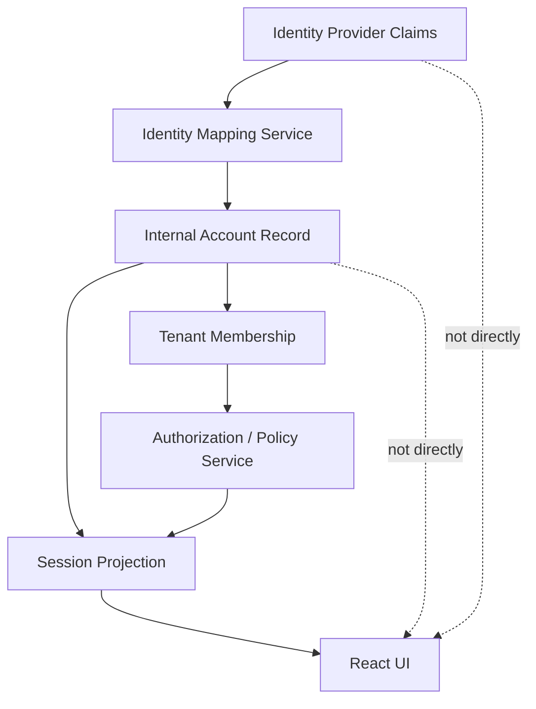
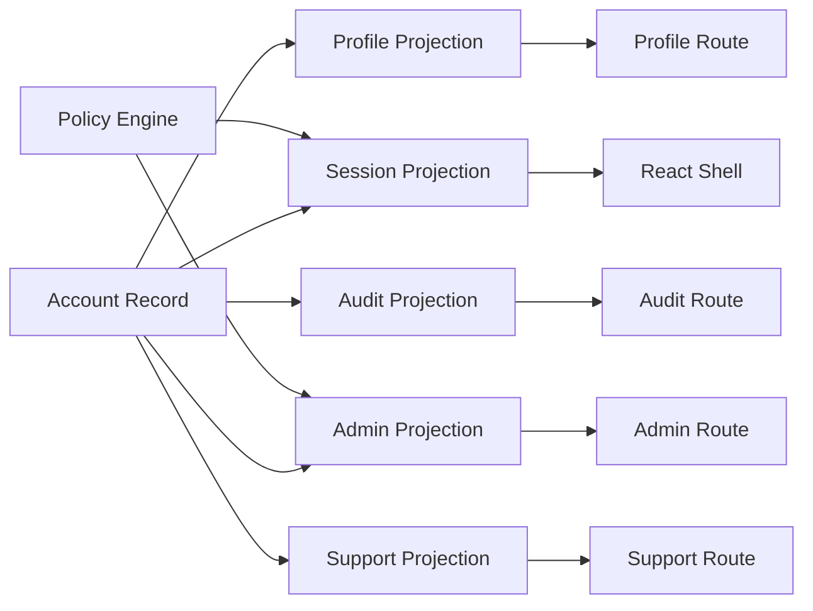

# Part 105 — Privacy and PII in Auth UI

Auth UI is where security, product clarity, supportability, and privacy collide.

A login screen wants to tell the user what happened. A support screen wants to show enough identity context to debug. An admin console wants to expose who has access. An audit screen wants to prove who did what. A React component wants convenient props. Analytics wants identifiers. Error monitoring wants context. Logs want correlation.

Privacy engineering begins when we stop asking:

> “Can the frontend show this?”

and start asking:

> “What is the minimum identity projection this surface needs to complete its job, and what damage happens if it leaks?”

React auth systems frequently leak PII because they treat the authenticated user object as harmless UI state. It is not harmless. It is often the densest privacy object in the client: email, full name, phone, tenant memberships, roles, groups, avatar URLs, feature entitlements, jurisdiction, support notes, impersonation state, and sometimes raw identity provider claims.

This part builds the mental model and implementation discipline for privacy-preserving auth UI.

---

## 1. Core thesis

The authenticated frontend should not receive the identity record. It should receive a **purpose-built session projection**.

Bad model:

```ts
// Everything downstream can accidentally access everything.
type User = {
  id: string;
  email: string;
  fullName: string;
  phone: string;
  address: string;
  governmentId: string;
  dateOfBirth: string;
  roles: string[];
  idpClaims: Record<string, unknown>;
  groups: string[];
  tenantMemberships: TenantMembership[];
};
```

Better model:

```ts
type SessionProjection = {
  sessionIdHash: string;
  subject: {
    userId: string;
    displayName: string;
    avatarUrl?: string;
  };
  tenant: {
    tenantId: string;
    displayName: string;
  };
  auth: {
    authenticated: true;
    assuranceLevel: 'aal1' | 'aal2' | 'aal3';
    authenticatedAt: string;
    expiresAt: string;
  };
  permissions: PermissionSnapshotSummary;
  flags: PublicFeatureFlagSnapshot;
};
```

The difference is not cosmetic. The second object is designed for UI purpose, cache behavior, debugging, audit correlation, and blast radius control.

---

## 2. Define PII in frontend terms

PII is not only government ID or legal name. In frontend auth, a value becomes privacy-sensitive when it can identify, track, profile, classify, or expose a person or their relationship to an organization.

Common auth-related PII:

| Data | Why it matters |
|---|---|
| Email address | Direct identifier, often used for account takeover attempts and phishing. |
| Phone number | Direct identifier; can expose MFA channel. |
| Full name | Direct or quasi identifier. |
| Avatar URL | Can leak identity, provider, or signed resource URL. |
| Tenant/org membership | Reveals employment, investigation, customer relationship, or jurisdiction. |
| Roles/groups | Reveals power, seniority, clearance, workflow responsibility. |
| Permission grants | Can reveal internal operational structure. |
| Login timestamps | Behavioral data. |
| IP/device/user-agent | Security telemetry but also tracking data. |
| IdP claims | Often overloaded; may contain department, manager, employee ID, group IDs. |
| Audit events | High-value behavioral history. |
| Impersonation traces | Sensitive support/security evidence. |

A mature React auth architecture treats these as **privacy-classified fields**, not generic JSON.

---

## 3. Identity record vs account record vs session projection

Do not collapse identity data into one `user` object.



### Identity provider claims

These are protocol/provider data. They are not your product data model.

Examples:

```json
{
  "sub": "auth0|abc123",
  "email": "alex@example.com",
  "email_verified": true,
  "groups": ["finance-admin", "case-review-l2"],
  "department": "Enforcement"
}
```

Do not dump this into React. Map it server-side.

### Internal account record

This is your durable account entity.

```ts
type Account = {
  accountId: string;
  primaryEmail: string;
  legalName?: string;
  displayName: string;
  status: 'active' | 'suspended' | 'closed';
  createdAt: string;
  identityLinks: IdentityLink[];
};
```

This is not automatically safe for frontend.

### Session projection

This is the minimum UI contract.

```ts
type SessionProjection = {
  accountId: string;
  displayName: string;
  activeTenantId: string;
  activeTenantName: string;
  authenticatedAt: string;
  assuranceLevel: AssuranceLevel;
  permissionEpoch: number;
};
```

The projection is intentionally smaller than the account record.

---

## 4. The privacy invariant

Use this invariant in every auth review:

> A React component may only receive identity data that is necessary for its visible behavior, and that behavior must be safe under screenshots, browser extensions, analytics capture, error reporting, cache persistence, and support tooling.

This is stricter than “do not show passwords.” It means:

- do not pass full user records to generic layout components;
- do not include raw IdP claims in client-side session context;
- do not send hidden PII to the DOM and rely on CSS to hide it;
- do not attach PII to analytics events by default;
- do not put PII in URLs;
- do not persist PII in local storage unless the explicit product/privacy decision accepts that risk;
- do not expose full denial reasons when the reason reveals sensitive workflow or membership facts.

---

## 5. Auth UI surfaces and their privacy needs

Different screens need different identity projections.

| Surface | Needed identity | Usually not needed |
|---|---|---|
| Header avatar | display name, avatar URL | email, phone, roles, IdP claims |
| Account menu | display name, email maybe | groups, permissions, login history |
| Tenant switcher | tenant display names | all memberships' internal metadata |
| Admin user list | display name, email, status | raw provider claims, MFA secret data |
| Permission editor | target user, role/grant summary | full audit history by default |
| Audit viewer | actor/subject/resource/action/time | raw tokens, session IDs, IP unless privileged |
| Support console | pseudonymous user ID, safe account summary | unmasked PII unless justified |
| Error boundary | correlation ID | email, token, raw response body |
| Analytics | pseudonymous stable ID or session cohort | email, name, role details |

If every surface consumes the same `currentUser`, the app will eventually leak.

---

## 6. Build privacy classes into the type system

A useful pattern is to classify fields at type level.

```ts
type PrivacyClass =
  | 'public_ui'
  | 'internal_ui'
  | 'sensitive_pii'
  | 'security_secret'
  | 'audit_only';

type Classified<T, C extends PrivacyClass> = T & { readonly __privacyClass?: C };

type PublicDisplayName = Classified<string, 'public_ui'>;
type EmailAddress = Classified<string, 'sensitive_pii'>;
type SessionIdHash = Classified<string, 'audit_only'>;
type AccessToken = Classified<string, 'security_secret'>;
```

You do not need to make this perfectly enforced at runtime. The value is architectural pressure: reviewers can see when sensitive data crosses a boundary.

A more practical DTO approach:

```ts
type PublicUserSummary = {
  userId: string;
  displayName: string;
  avatarUrl?: string;
};

type InternalUserAdminRow = PublicUserSummary & {
  email: string;
  status: 'active' | 'suspended' | 'invited';
  lastLoginAt?: string;
};

type UserSecurityDetail = InternalUserAdminRow & {
  mfaEnabled: boolean;
  activeSessionCount: number;
  recentAuditEvents: AuditEventSummary[];
};
```

Expose the smallest DTO that matches the route permission.

---

## 7. Never expose raw tokens or session IDs to UI components

Tokens and session IDs are not PII only. They are credentials or credential-adjacent identifiers.

Never do this:

```ts
<AuthDebugPanel accessToken={accessToken} refreshToken={refreshToken} />
```

Avoid this too:

```ts
logger.info('session', { sessionId, userEmail });
```

Prefer:

```ts
logger.info('session_bootstrap_completed', {
  sessionIdHash,
  actorId,
  tenantId,
  authEpoch,
  permissionEpoch,
});
```

The server can hash session identifiers with a secret salt before logging.

```ts
import crypto from 'node:crypto';

export function sessionLogId(sessionId: string, salt: string): string {
  return crypto
    .createHmac('sha256', salt)
    .update(sessionId)
    .digest('hex')
    .slice(0, 24);
}
```

This preserves correlation without exposing the bearer credential.

---

## 8. Session projection endpoint design

A privacy-preserving `/session` endpoint should be intentionally boring.

```ts
type GetSessionResponse =
  | {
      state: 'anonymous';
    }
  | {
      state: 'authenticated';
      actor: {
        id: string;
        displayName: string;
        avatarUrl?: string;
      };
      tenant: {
        id: string;
        displayName: string;
      };
      auth: {
        assuranceLevel: 'aal1' | 'aal2' | 'aal3';
        authenticatedAt: string;
        expiresAt: string;
      };
      authorization: {
        permissionEpoch: number;
        globalActions: string[];
      };
    };
```

Avoid:

```json
{
  "idpClaims": { "groups": ["..."], "employeeId": "..." },
  "accessToken": "...",
  "refreshToken": "...",
  "allTenantMemberships": ["..."],
  "allPermissions": ["..."]
}
```

A good `/session` response answers:

1. Is there a session?
2. Who is the visible actor?
3. Which tenant is active?
4. What is the assurance level?
5. What cache/version epoch should frontend use?
6. What global UI actions can be shown?

It should not be a general user profile API.

---

## 9. `/me` is not always the same as `/session`

Many applications use `/me` as a kitchen sink. This becomes a privacy problem.

Recommended separation:

| Endpoint | Purpose | Typical payload |
|---|---|---|
| `/api/session` | Current auth/session projection | minimal actor, tenant, auth epoch |
| `/api/me/profile` | User profile screen | display name, email, preferences |
| `/api/me/security` | Security settings screen | MFA status, devices, sessions |
| `/api/me/tenants` | Tenant switcher | tenant summaries user can access |
| `/api/permissions` | Permission projection | allowed actions, constraints, epochs |

This lets each endpoint apply route-specific authorization, cache control, audit logging, and privacy minimization.

---

## 10. Do not put PII in URLs

URLs leak through:

- browser history;
- server logs;
- reverse proxy logs;
- analytics tools;
- referrer headers;
- screenshots;
- support recordings;
- copy-paste;
- bookmarks.

Bad:

```txt
/users/alex@example.com/cases
/reset-password?email=alex@example.com
/invite?fullName=Alex%20Kim&email=alex@example.com
```

Better:

```txt
/users/usr_2Shf8w/cases
/reset-password/requested
/invite/inv_9x2...
```

If the user must type an email into a form, keep it in the request body, not the URL.

---

## 11. Referrer policy for auth flows

Auth flows are full of URLs: login return URLs, OAuth callback URLs, invite links, reset links, step-up redirects.

At minimum, sensitive pages should avoid leaking full path/query to external origins.

Useful baseline:

```http
Referrer-Policy: strict-origin-when-cross-origin
```

For particularly sensitive auth-related pages:

```http
Referrer-Policy: no-referrer
```

This does not replace not putting secrets/PII in URLs. It is a damage-reduction layer.

---

## 12. Privacy-aware error boundaries

Error boundaries often leak because they render raw error messages, failed response bodies, or serialized context.

Bad:

```tsx
export function ErrorBoundary({ error }: { error: unknown }) {
  return <pre>{JSON.stringify(error, null, 2)}</pre>;
}
```

Better:

```tsx
type PublicError = {
  title: string;
  message: string;
  correlationId: string;
};

export function AuthErrorBoundary({ error }: { error: unknown }) {
  const publicError = toPublicError(error);

  return (
    <section role="alert">
      <h1>{publicError.title}</h1>
      <p>{publicError.message}</p>
      <p className="text-muted">Reference: {publicError.correlationId}</p>
    </section>
  );
}
```

The user sees a safe message. Support gets a correlation ID. The detailed error remains in restricted logs.

---

## 13. Permission denial reason can be privacy-sensitive

Consider:

```json
{
  "allowed": false,
  "reason": "Case belongs to Financial Crime Unit. User is assigned to Market Abuse Unit."
}
```

This is useful for engineers. It may be inappropriate for the end user.

Use two reason layers:

```ts
type PermissionDecision = {
  allowed: boolean;
  publicReason?: string;
  supportReasonCode?: string;
  internalReason?: string;
  correlationId: string;
};
```

Example:

```json
{
  "allowed": false,
  "publicReason": "You do not have access to this case.",
  "supportReasonCode": "CASE_UNIT_MISMATCH",
  "correlationId": "corr_7c2ad9"
}
```

Internal policy trace belongs in logs or admin-only diagnostics, not general UI.

---

## 14. Analytics without identity leakage

Auth UI is often instrumented poorly.

Bad event:

```ts
analytics.track('login_failed', {
  email: form.email,
  reason: error.message,
  tenant: tenantName,
});
```

Better event:

```ts
analytics.track('login_failed', {
  loginMethod: 'password',
  reasonCode: 'INVALID_CREDENTIALS_OR_ACCOUNT',
  tenantDiscoveryMode: 'email_domain',
});
```

For authenticated analytics:

```ts
analytics.identify(pseudonymousUserId, {
  accountType: 'enterprise',
  tenantPlan: 'regulated',
});
```

Avoid direct identifiers unless there is a well-reviewed reason, consent/legal basis, retention policy, and access control around analytics data.

---

## 15. Error monitoring redaction

Error monitoring SDKs can capture:

- URLs;
- request headers;
- response bodies;
- breadcrumbs;
- component props;
- console logs;
- local storage/session storage;
- user metadata;
- screenshots/session replay.

Create an explicit scrubber.

```ts
const SENSITIVE_KEYS = [
  'authorization',
  'cookie',
  'set-cookie',
  'accessToken',
  'refreshToken',
  'idToken',
  'email',
  'phone',
  'governmentId',
  'ssn',
];

export function redact(value: unknown): unknown {
  if (Array.isArray(value)) return value.map(redact);

  if (value && typeof value === 'object') {
    return Object.fromEntries(
      Object.entries(value as Record<string, unknown>).map(([key, val]) => [
        key,
        SENSITIVE_KEYS.includes(key.toLowerCase()) ? '[REDACTED]' : redact(val),
      ]),
    );
  }

  return value;
}
```

Also redact by pattern, not only by key. PII appears in arbitrary field names.

---

## 16. Session replay tools are dangerous around auth

Session replay can capture:

- typed login identifiers;
- MFA recovery screens;
- profile pages;
- admin permission editor;
- case notes;
- audit timeline;
- error messages;
- authorization denial reasons.

Default policy:

1. Disable session replay on login, signup, password reset, MFA, and security settings pages.
2. Mask all text inputs by default.
3. Mask all admin/security/audit screens by default.
4. Never capture tokens, cookies, headers, raw network bodies, or local storage.
5. Make replay access restricted and audited.

In regulated applications, treat session replay as a data processing system, not a debugging toy.

---

## 17. Auth context should not become a global PII store

React Context makes it easy to overexpose data.

Bad:

```tsx
<AuthContext.Provider value={{ user, tokens, idpClaims, permissions }}>
  {children}
</AuthContext.Provider>
```

Better:

```tsx
type AuthContextValue = {
  session: SessionProjection;
  can: CanFunction;
  logout: () => Promise<void>;
  requestStepUp: (intent: StepUpIntent) => Promise<void>;
};
```

If a route needs detailed profile data, load it at that route with its own authorization, cache policy, and privacy boundary.

---

## 18. Split hooks by privacy level

Avoid one powerful hook:

```ts
const { user } = useAuth();
```

Prefer purpose-specific hooks:

```ts
const actor = useCurrentActor();          // public UI-safe
const tenant = useActiveTenant();         // tenant UI-safe
const decision = useCan('case.approve');  // permission decision
const profile = useMyProfile();           // profile route only
const security = useMySecuritySettings(); // security route only
```

This prevents accidental access and makes code review easier.

---

## 19. Admin views need privacy mode, not just permission

Having permission to administer users does not mean every PII field should be visible by default.

Design admin screens with progressive disclosure:

| Interaction | Example |
|---|---|
| Default list | display name, masked email, status |
| Reveal action | show full email after explicit click |
| Justification | require reason for sensitive field reveal |
| Audit | log actor, field, target, reason, time |
| Expiry | temporary reveal only |

Example:

```tsx
function MaskedEmail({ value, targetUserId }: { value: string; targetUserId: string }) {
  const [revealed, setRevealed] = useState(false);

  if (!revealed) {
    return (
      <button onClick={() => setRevealed(true)}>
        {maskEmail(value)} · Reveal
      </button>
    );
  }

  auditClient.record('pii.email.revealed', { targetUserId });
  return <span>{value}</span>;
}
```

In production, record the audit server-side, not only client-side. The UI event is a hint, not the source of truth.

---

## 20. Tenant switcher privacy

Tenant membership can be sensitive. A tenant switcher can reveal all organizations a user belongs to.

Design choices:

```ts
type TenantSwitcherItem = {
  tenantId: string;
  displayName: string;
  shortLabel?: string;
  badge?: 'current' | 'requires_mfa' | 'suspended';
};
```

Avoid exposing:

- internal tenant classification;
- all role grants;
- hidden/sensitive org names to browser if not needed;
- tenant-specific permission traces;
- inactive/historical memberships by default.

For high-sensitivity domains, consider search-based tenant switching instead of rendering all memberships.

---

## 21. Impersonation privacy

Impersonation is a privacy hazard because it gives one human a view into another human’s workspace.

Minimum UI contract:

```ts
type ImpersonationSession = {
  actor: PublicUserSummary;
  subject: PublicUserSummary;
  mode: 'view_only' | 'support_limited';
  reasonCode: string;
  expiresAt: string;
  auditId: string;
};
```

UI rules:

- show persistent banner;
- block sensitive actions unless explicitly allowed;
- mask highly sensitive fields by default;
- log every reveal and every attempted mutation;
- prevent analytics from identifying actor as subject;
- never silently merge actor and subject identity.

Analytics bug example:

```ts
// Wrong: support agent becomes the customer in analytics.
analytics.identify(subject.id);
```

Better:

```ts
analytics.identify(actor.id, {
  impersonating: true,
  subjectClass: 'customer',
});
```

---

## 22. Avatar URLs and signed media URLs

Avatar URLs look harmless. They can leak:

- user ID;
- tenant ID;
- signed storage token;
- provider host;
- private bucket path;
- email hash;
- tracking pixels.

Avoid raw private storage URLs in session projection.

Better:

```ts
type ActorAvatar = {
  kind: 'initials' | 'public_image' | 'proxied_image';
  url?: string;
  initials?: string;
};
```

If the avatar requires authentication, serve it through an authorized endpoint or image proxy with strict cache rules.

---

## 23. Cache rules for PII

General baseline for sensitive user/profile/session responses:

```http
Cache-Control: no-store
Pragma: no-cache
```

For public static shell assets:

```http
Cache-Control: public, max-age=31536000, immutable
```

For user-specific API responses, do not rely on frontend cache cleanup alone. Server headers matter.

React query/cache libraries should also be scoped:

```ts
const queryKey = ['profile', session.actor.id, session.auth.authEpoch];
```

On logout:

```ts
queryClient.clear();
sessionStore.reset();
permissionStore.reset();
```

For shared devices, back button behavior matters. Sensitive authenticated responses should not reappear after logout from browser history cache.

---

## 24. Local storage privacy risk

Local storage is often used for “remember user” convenience. It is also readable by any JavaScript executing in the origin.

Do not store:

- access tokens;
- refresh tokens;
- ID tokens;
- raw user profile;
- tenant memberships;
- permission snapshots with sensitive resource names;
- MFA state;
- support notes;
- audit filters containing user names/emails.

Safer local storage candidates:

- theme preference;
- last selected non-sensitive tab;
- feature-tour completion;
- locale;
- UI density.

Even these can become sensitive depending on domain.

---

## 25. Privacy-preserving “remember me”

Bad:

```ts
localStorage.setItem('rememberedEmail', email);
```

Better options:

1. Use browser/password manager autocomplete.
2. Store only a non-identifying hint.
3. Store hashed domain/classification only if actually useful.
4. Let the IdP handle account chooser.
5. Keep remembered account server-side behind a secure session cookie.

For enterprise apps, even showing the previous tenant or email on a shared machine can leak sensitive affiliation.

---

## 26. Search and command palette privacy

Global search often crosses data boundaries.

Bad behavior:

- user with no permission sees forbidden resource titles;
- command palette lists admin actions before permission resolves;
- search suggestions expose tenant names;
- recently visited items persist across logout;
- search index caches PII in service worker.

Safe pattern:

```ts
type SearchResult = {
  id: string;
  type: 'case' | 'person' | 'organization';
  title: string;
  subtitle?: string;
  allowedActions: string[];
};
```

Server must filter results by authorization. Frontend should not receive forbidden results and hide them.

---

## 27. Audit viewer privacy

Audit logs are necessary. They are also privacy-dense.

Audit viewer should support:

- role-based field masking;
- export permission separate from view permission;
- purpose-of-access or justification for sensitive logs;
- query limits;
- redaction for tokens/session IDs;
- retention-aware UI;
- correlation ID search;
- admin actions on audit export;
- clear distinction between actor, subject, resource, and tenant.

Do not expose raw request/response bodies in audit UI by default.

---

## 28. Privacy-aware support tooling

Support needs to solve problems without becoming a universal surveillance interface.

Recommended layers:

1. **Account lookup** by safe identifiers.
2. **Safe account summary** with masked fields.
3. **Security summary** without raw secrets.
4. **Session diagnostics** with hashed session IDs.
5. **Permission explanation** with public/support reason codes.
6. **Sensitive reveal** requiring permission, justification, and audit.
7. **Impersonation** only when necessary and constrained.

Support UI should be built like an admin system, not like a debug panel.

---

## 29. PII and authorization are coupled

You may have permission to perform an action but not permission to see every field.

Example:

```ts
type CaseSummary = {
  id: string;
  referenceNo: string;
  status: string;
  subjectName?: RedactedField;
  assignedOfficer?: PublicUserSummary;
  allowedActions: string[];
};

type RedactedField =
  | { state: 'visible'; value: string }
  | { state: 'masked'; reason: string }
  | { state: 'hidden' };
```

This is important in regulated case management, HR, healthcare, finance, and enforcement systems. Object access and field access are not the same.

---

## 30. Data minimization by route

Model route-level data needs explicitly.

```ts
type RouteDataPolicy = {
  routeId: string;
  purpose: string;
  requiredFields: string[];
  sensitiveFields: string[];
  cachePolicy: 'public' | 'private' | 'no-store';
  analyticsAllowed: boolean;
  sessionReplayAllowed: boolean;
};
```

Example:

```ts
const profileRoutePolicy: RouteDataPolicy = {
  routeId: 'settings.profile',
  purpose: 'allow user to edit own display profile',
  requiredFields: ['displayName', 'email', 'locale'],
  sensitiveFields: ['email'],
  cachePolicy: 'no-store',
  analyticsAllowed: true,
  sessionReplayAllowed: false,
};
```

This looks heavy, but for high-risk apps it becomes design documentation and review artifact.

---

## 31. Do not rely on CSS to protect PII

Bad:

```tsx
<div className="hidden">{user.email}</div>
```

Bad:

```tsx
<option hidden value={user.email}>{user.email}</option>
```

Bad:

```tsx
<input type="hidden" name="approverEmail" value={approver.email} />
```

If data is in the DOM, it is exposed to browser devtools, extensions, scripts, screenshots, and sometimes accessibility tools. If the user/session should not see it, do not send it.

---

## 32. Source maps and environment variables

Source maps can expose:

- internal route names;
- comments;
- debug strings;
- error messages;
- feature flag names;
- policy names;
- environment variable names;
- endpoint shapes.

They should not contain secrets, but they can still reveal operational information.

Rules:

- never put secrets in frontend env variables;
- treat `NEXT_PUBLIC_*`, `VITE_*`, and similar public env prefixes as public;
- publish source maps only to restricted error monitoring where appropriate;
- do not expose production source maps publicly without review;
- scan bundles for secret/PII patterns.

---

## 33. Auth-related copy can leak too

Enumeration-resistant login copy:

Bad:

```txt
No account exists for alex@example.com.
```

Better:

```txt
If an account exists, we sent instructions.
```

Authorization denial copy:

Bad:

```txt
You cannot approve this because only Senior Enforcement Manager Jane Doe can approve cases in Unit 5.
```

Better:

```txt
You do not have permission to approve this case.
Reference: corr_7c2ad9
```

Then support can use the correlation ID if necessary.

---

## 34. React implementation: privacy boundary module

Create an explicit module for session projection.

```ts
export type SessionProjection = {
  state: 'anonymous' | 'authenticated';
  actor?: {
    id: string;
    displayName: string;
    avatar?: ActorAvatar;
  };
  tenant?: {
    id: string;
    displayName: string;
  };
  auth?: {
    authEpoch: number;
    permissionEpoch: number;
    assuranceLevel: 'aal1' | 'aal2' | 'aal3';
  };
};

export function assertNoRawClaims(value: unknown): void {
  const serialized = JSON.stringify(value);

  const forbiddenPatterns = [
    'access_token',
    'refresh_token',
    'id_token',
    'idpClaims',
    'authorization',
    'set-cookie',
  ];

  for (const pattern of forbiddenPatterns) {
    if (serialized.includes(pattern)) {
      throw new Error(`Unsafe session projection contains ${pattern}`);
    }
  }
}
```

Use this in tests and development builds.

---

## 35. Test cases

### Session projection tests

```ts
describe('/api/session projection', () => {
  it('does not expose raw tokens or idp claims', async () => {
    const response = await getSessionAs('active-user');

    expect(response).not.toHaveProperty('accessToken');
    expect(response).not.toHaveProperty('refreshToken');
    expect(response).not.toHaveProperty('idToken');
    expect(response).not.toHaveProperty('idpClaims');
  });

  it('returns only active tenant, not all tenant memberships', async () => {
    const response = await getSessionAs('multi-tenant-user');

    expect(response.tenant.id).toBeDefined();
    expect(response).not.toHaveProperty('allTenantMemberships');
  });
});
```

### Error boundary tests

```ts
it('renders correlation ID but not email/token', () => {
  render(<AuthErrorBoundary error={newAuthErrorWithSensitiveContext()} />);

  expect(screen.getByText(/Reference:/)).toBeInTheDocument();
  expect(screen.queryByText(/alex@example.com/)).not.toBeInTheDocument();
  expect(screen.queryByText(/eyJ/)).not.toBeInTheDocument();
});
```

### Analytics tests

```ts
it('does not send PII in login failure analytics', async () => {
  await submitInvalidLogin('alex@example.com');

  expect(analytics.track).toHaveBeenCalledWith('login_failed', {
    loginMethod: 'password',
    reasonCode: 'INVALID_CREDENTIALS_OR_ACCOUNT',
  });
});
```

---

## 36. Privacy review checklist

Use this checklist before shipping auth-related UI.

### Session and identity projection

- [ ] Does `/session` return only what the shell needs?
- [ ] Are raw IdP claims hidden from React?
- [ ] Are tokens/session IDs never exposed to UI code?
- [ ] Are session IDs logged only as salted hashes?
- [ ] Are tenant memberships minimized?
- [ ] Are permissions projected as actions/decisions, not raw internal policy traces?

### Storage and cache

- [ ] Is PII absent from local storage/session storage?
- [ ] Are sensitive responses `Cache-Control: no-store`?
- [ ] Is query cache cleared on logout and tenant switch?
- [ ] Is persisted cache disabled or scoped for sensitive data?
- [ ] Are service worker caches reviewed?

### UI surfaces

- [ ] Are hidden fields not used to protect sensitive data?
- [ ] Are admin fields masked by default?
- [ ] Is sensitive reveal audited server-side?
- [ ] Is impersonation visually obvious and constrained?
- [ ] Are permission denial reasons safe for end users?

### Observability

- [ ] Are analytics events free of direct identifiers by default?
- [ ] Are error monitoring payloads redacted?
- [ ] Is session replay disabled/masked on auth/security/admin screens?
- [ ] Are logs structured but not privacy-invasive?

### Auth flows

- [ ] Are emails/PII absent from URLs?
- [ ] Are reset/invite links opaque and short-lived?
- [ ] Is referrer policy set appropriately?
- [ ] Is login/reset copy enumeration-resistant?

---

## 37. Anti-pattern catalog

| Anti-pattern | Why it fails |
|---|---|
| `currentUser` contains entire DB user row | Every component becomes a privacy leak candidate. |
| Raw IdP claims passed to React | Provider data is not product-safe projection. |
| Email in route path | Leaks through history/logs/referrers. |
| Tokens in error monitoring | Converts observability vendor into credential store. |
| Hidden DOM for sensitive fields | Hidden is still delivered to browser. |
| Permission trace shown to user | Reveals internal org/policy/resource information. |
| Support console with unrestricted PII | Creates surveillance/admin abuse risk. |
| Session replay on auth pages | Captures credentials, MFA, security data. |
| Analytics identified by email | Spreads direct identifiers into analytics systems. |
| Local storage profile cache | Persistent PII exposed to XSS/local compromise. |

---

## 38. Mental model: privacy as blast radius control

Privacy-preserving auth UI is not only about compliance. It is about reducing blast radius.

If XSS happens, what can it read?

If analytics is misconfigured, what does it receive?

If error monitoring captures an exception, what gets uploaded?

If a support agent opens a user record, what can they see?

If a screenshot is shared, what is visible?

If a browser extension inspects the page, what is in the DOM?

If a user logs out and presses Back, what remains?

A good React auth system assumes some surfaces will fail and minimizes what each failure can expose.

---

## 39. Final architecture rule

Do not design auth UI around `User`.

Design it around projections:



Each projection has a purpose, authorization check, cache policy, telemetry policy, and privacy review.

That is the difference between “we have auth” and “we have an auth system that is safe to operate.”

---

## 40. References

- OWASP Top 10 Privacy Risks — https://owasp.org/www-project-top-10-privacy-risks/
- OWASP Logging Cheat Sheet — https://cheatsheetseries.owasp.org/cheatsheets/Logging_Cheat_Sheet.html
- OWASP Authorization Cheat Sheet — https://cheatsheetseries.owasp.org/cheatsheets/Authorization_Cheat_Sheet.html
- OWASP Session Management Cheat Sheet — https://cheatsheetseries.owasp.org/cheatsheets/Session_Management_Cheat_Sheet.html
- OWASP HTML5 Security Cheat Sheet — https://cheatsheetseries.owasp.org/cheatsheets/HTML5_Security_Cheat_Sheet.html
- OWASP Testing for Browser Cache Weaknesses — https://owasp.org/www-project-web-security-testing-guide/latest/4-Web_Application_Security_Testing/04-Authentication_Testing/06-Testing_for_Browser_Cache_Weaknesses
- MDN Referrer-Policy — https://developer.mozilla.org/en-US/docs/Web/HTTP/Reference/Headers/Referrer-Policy
- MDN Cache-Control — https://developer.mozilla.org/en-US/docs/Web/HTTP/Reference/Headers/Cache-Control
