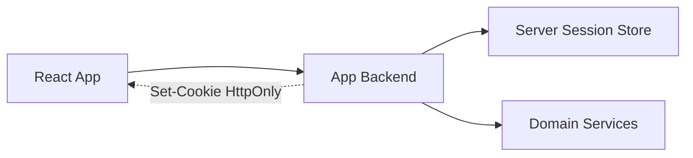
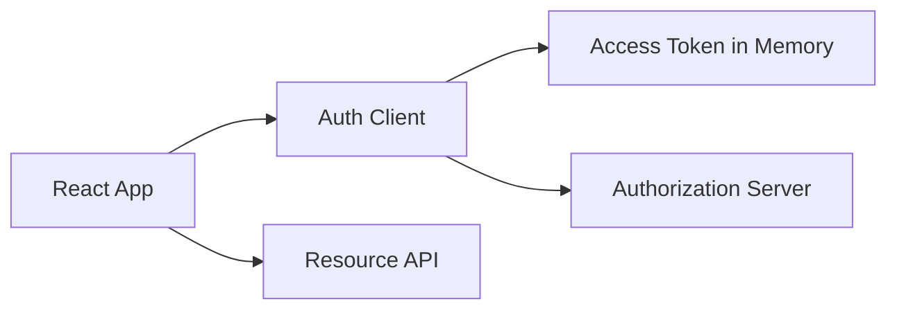
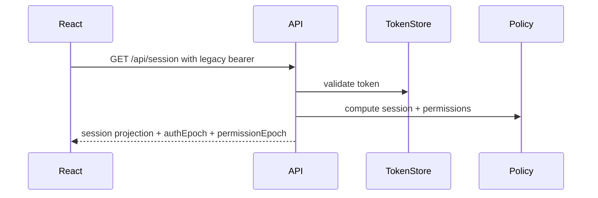
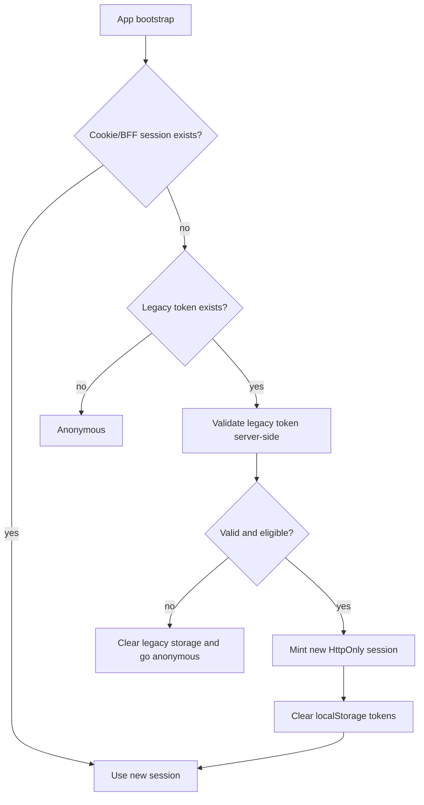
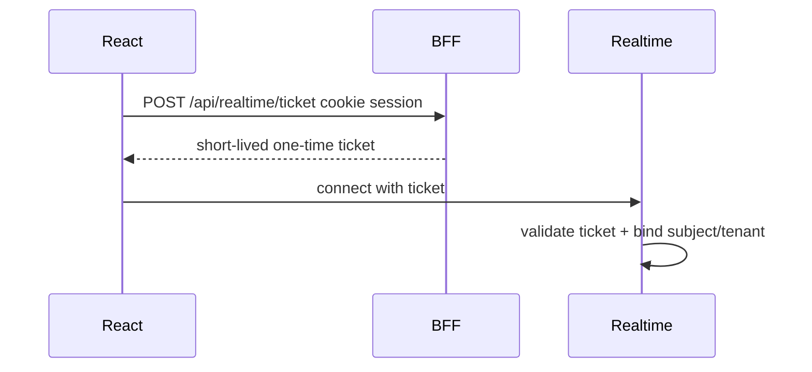
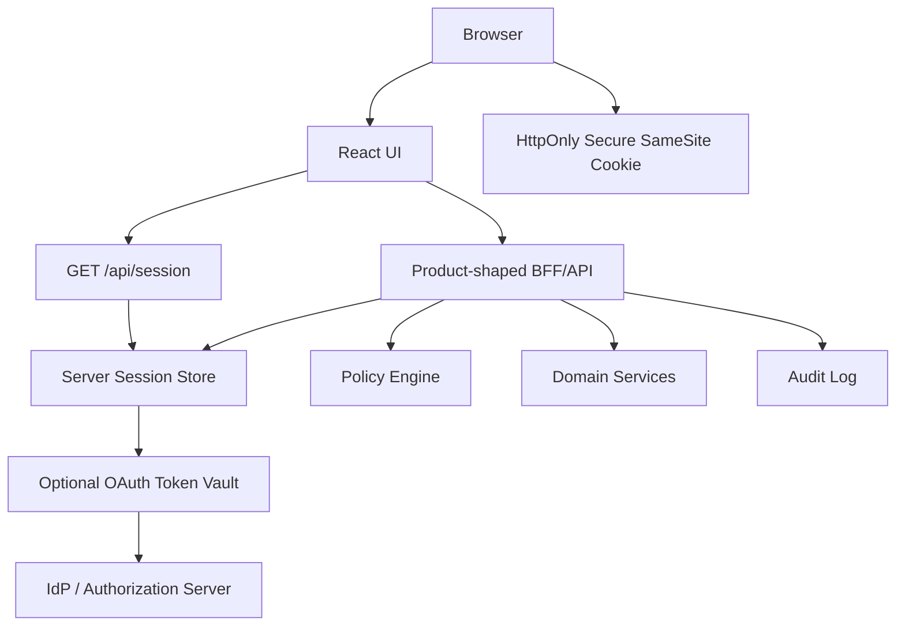
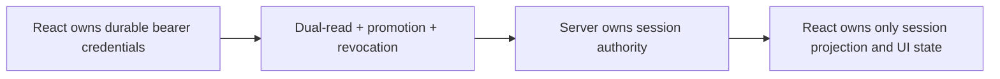

# Part 106 — Migration from LocalStorage Token Auth

Many React apps start like this:

```ts
localStorage.setItem('access_token', token);
localStorage.setItem('refresh_token', refreshToken);
```

It works. It survives reload. It is easy to demo. It makes API clients simple.

It also creates a long-lived bearer credential sitting in JavaScript-readable persistent storage. If XSS happens, the attacker can read it. If a malicious dependency runs, it can read it. If a browser extension has sufficient access, it can read page/storage data. If support tooling captures local storage, it can leak it. If the same origin hosts less-trusted apps, they may access the same storage namespace.

The goal of migration is not to chase a perfect storage primitive. There is no perfect browser primitive. The goal is to move from:

> “React owns durable bearer credentials”

into:

> “The browser owns only the minimum session projection needed for UI, while durable credentials are either hidden behind HttpOnly cookies/BFF or kept short-lived and memory-only.”

This part gives a production migration plan.

---

## 1. The source problem

LocalStorage token auth usually combines several risks:

1. **Persistent bearer credential** — stolen token remains useful until expiry/revocation.
2. **JavaScript readability** — any script in the origin can read it.
3. **Shared origin blast radius** — all same-origin code shares access.
4. **Poor logout semantics** — clearing localStorage does not revoke server token.
5. **Weak rotation** — refresh tokens are often long-lived and not rotation-protected.
6. **Cache confusion** — query cache and token storage get out of sync.
7. **Multi-tab race** — refresh/logout behavior becomes nondeterministic.
8. **Observability leakage** — tokens can appear in logs/errors if not redacted.
9. **Authorization misconception** — decoded JWT claims become frontend policy.
10. **Migration debt** — mobile/native/SPA/server flows get mixed without explicit contract.

Do not frame migration as “cookies are always secure.” Frame it as boundary redesign.

---

## 2. Target architecture choices

There are three common migration targets.

### Option A — Backend-for-Frontend with HttpOnly session cookie

```mermaid
sequenceDiagram
    participant Browser
    participant React
    participant BFF
    participant IdP
    participant API

    Browser->>BFF: GET /login
    BFF->>IdP: Redirect Authorization Code + PKCE
    IdP-->>BFF: Callback with code
    BFF->>IdP: Exchange code for tokens
    BFF->>BFF: Store tokens server-side
    BFF-->>Browser: Set-Cookie: __Host-app_session; HttpOnly; Secure; SameSite=Lax
    React->>BFF: GET /api/session
    BFF-->>React: Session projection
    React->>BFF: POST /api/cases/123/approve
    BFF->>API: Authorized downstream request
```

Best for high-risk apps, SSR apps, enterprise SaaS, regulated workflows, and apps that can operate same-origin with a BFF.

### Option B — HttpOnly cookie session directly against app backend



Best when your backend is already the product API and can own session lifecycle.

### Option C — Memory-only access token with rotation-aware refresh strategy



Can be acceptable for pure SPA constraints, but it requires strong XSS controls, PKCE, refresh token rotation or backend-mediated refresh, token lifetime discipline, and careful multi-tab coordination.

---

## 3. Decision matrix

| Constraint | Prefer |
|---|---|
| High-risk app / regulated data | BFF or server session |
| Need SSR/RSC | BFF or server session |
| Multiple downstream APIs | BFF token vault |
| Third-party API requires bearer token from browser | Memory token, short lifetime, strong CSP |
| No backend available | SPA PKCE + memory token; consider adding token-mediating backend |
| Heavy cross-origin API | Cookie needs CORS/CSRF design; BFF can simplify |
| Need immediate revocation | Server-side session or opaque token introspection |
| Existing refresh tokens in localStorage | Prioritize rotation/revocation migration |
| Strong mobile/native sharing | Keep protocol boundary separate; do not let SPA constraints define all clients |

---

## 4. Migration invariant

During migration:

> The app must never enter a state where both the old localStorage credential and the new session credential are valid but disagree about actor, tenant, assurance level, or permission version.

This is the failure mode that causes ghost sessions, cross-tenant state, stale authorization, or impossible support tickets.

Use an auth epoch.

```ts
type SessionProjection = {
  state: 'authenticated';
  actorId: string;
  tenantId: string;
  authEpoch: number;
  permissionEpoch: number;
  migrationMode: 'legacy_token' | 'dual_read' | 'cookie_session' | 'bff_session';
};
```

Every cache key that depends on auth should include relevant epoch/tenant.

---

## 5. Discovery phase

Before changing anything, inventory the old auth behavior.

### Storage inventory

Search for:

```txt
localStorage
sessionStorage
access_token
refresh_token
id_token
authorization
Bearer
jwtDecode
decodeJwt
```

Example static scan:

```bash
rg "localStorage|sessionStorage|access_token|refresh_token|id_token|Bearer|jwtDecode|decodeJwt" src
```

Classify every usage:

| Usage | Risk | Migration action |
|---|---|---|
| access token storage | high | remove; memory/BFF/cookie |
| refresh token storage | very high | revoke/rotate; move server-side if possible |
| ID token storage | high | remove; session projection only |
| decoded role claims | authz drift | replace with permission API |
| remembered email | privacy | remove or replace with safer UX |
| profile cache | privacy | route-specific fetch/cache policy |
| token in logs | critical | redaction incident review |

### Network inventory

Map all calls using `Authorization: Bearer`.

```ts
fetch('/api/cases', {
  headers: {
    Authorization: `Bearer ${localStorage.getItem('access_token')}`,
  },
});
```

Create an API boundary abstraction before migration.

```ts
export type AuthTransport = 'legacy_bearer' | 'cookie' | 'bff' | 'memory_bearer';

export async function apiFetch(input: RequestInfo, init: RequestInit = {}) {
  return authTransport.fetch(input, init);
}
```

Do not migrate dozens of call sites manually.

---

## 6. Build a migration adapter

The migration adapter lets the app run old and new strategies behind one contract.

```ts
type AuthSession =
  | { state: 'anonymous' }
  | {
      state: 'authenticated';
      actorId: string;
      tenantId: string;
      authEpoch: number;
      permissionEpoch: number;
      strategy: 'legacy_token' | 'cookie_session' | 'bff_session';
    };

interface AuthRuntime {
  bootstrap(): Promise<AuthSession>;
  fetch(input: RequestInfo, init?: RequestInit): Promise<Response>;
  logout(reason?: string): Promise<void>;
  onChange(listener: (session: AuthSession) => void): () => void;
}
```

Legacy implementation:

```ts
class LegacyTokenRuntime implements AuthRuntime {
  async bootstrap(): Promise<AuthSession> {
    const token = localStorage.getItem('access_token');
    if (!token) return { state: 'anonymous' };

    const response = await fetch('/api/session/from-token', {
      headers: { Authorization: `Bearer ${token}` },
    });

    if (!response.ok) return { state: 'anonymous' };

    const session = await response.json();
    return { ...session, strategy: 'legacy_token' };
  }

  async fetch(input: RequestInfo, init: RequestInit = {}) {
    const token = localStorage.getItem('access_token');
    return fetch(input, {
      ...init,
      headers: {
        ...init.headers,
        ...(token ? { Authorization: `Bearer ${token}` } : {}),
      },
    });
  }

  async logout() {
    localStorage.removeItem('access_token');
    localStorage.removeItem('refresh_token');
    localStorage.removeItem('id_token');
    await fetch('/api/logout', { method: 'POST' }).catch(() => undefined);
  }

  onChange(listener: (session: AuthSession) => void) {
    return legacyAuthBus.subscribe(listener);
  }
}
```

New BFF implementation:

```ts
class BffSessionRuntime implements AuthRuntime {
  async bootstrap(): Promise<AuthSession> {
    const response = await fetch('/api/session', {
      credentials: 'include',
      headers: { Accept: 'application/json' },
    });

    if (response.status === 401) return { state: 'anonymous' };
    if (!response.ok) throw new Error('session_bootstrap_failed');

    return { ...(await response.json()), strategy: 'bff_session' };
  }

  async fetch(input: RequestInfo, init: RequestInit = {}) {
    return fetch(input, {
      ...init,
      credentials: 'include',
      headers: {
        ...init.headers,
        Accept: 'application/json',
      },
    });
  }

  async logout() {
    await fetch('/api/logout', {
      method: 'POST',
      credentials: 'include',
    });
  }

  onChange(listener: (session: AuthSession) => void) {
    return sessionBus.subscribe(listener);
  }
}
```

---

## 7. Phase 0: harden before migration

Before introducing the new system, reduce existing blast radius.

### Shorten access token lifetime

If old access tokens live for hours/days, reduce them gradually.

### Revoke on logout

Logout must notify server/IdP where possible, not just clear storage.

### Add token redaction

```ts
function redactAuthHeaders(headers: Record<string, string>) {
  return Object.fromEntries(
    Object.entries(headers).map(([key, value]) =>
      key.toLowerCase() === 'authorization' ? [key, '[REDACTED]'] : [key, value],
    ),
  );
}
```

### Remove JWT claim-based authorization

Bad:

```ts
const role = decodeJwt(token).role;
if (role === 'admin') showAdminPanel();
```

Better:

```ts
const decision = useCan('admin.panel.view');
if (decision.allowed) showAdminPanel();
```

### Add CSP reporting

Even before moving tokens, start discovering unsafe scripts and inline behavior.

### Add refresh token reuse detection

If refresh tokens exist, make replay visible before migration.

---

## 8. Phase 1: introduce server session projection

Create `/api/session` before changing login.

For legacy users, it may accept a bearer token temporarily and return the new projection.



Important: do not return the token back.

```ts
app.get('/api/session', requireEitherLegacyTokenOrCookie, async (req, res) => {
  const actor = req.auth.actor;
  const tenant = req.auth.tenant;

  const projection = await buildSessionProjection({ actor, tenant });

  res.setHeader('Cache-Control', 'no-store');
  res.json(projection);
});
```

This lets React stop decoding tokens first.

---

## 9. Phase 2: centralize API transport

All API calls must go through one boundary.

Bad:

```ts
fetch('/api/a', withToken());
axios.get('/api/b', withToken());
graphqlClient.request(query, vars, { Authorization: token });
```

Better:

```ts
apiClient.get('/cases');
apiClient.post('/cases/123/approve', body);
graphqlApi.request(query, vars);
```

Migration transport:

```ts
type TransportMode = 'legacy_bearer' | 'cookie';

class AuthAwareApiClient {
  constructor(private getMode: () => TransportMode) {}

  async request(path: string, init: RequestInit = {}) {
    if (this.getMode() === 'legacy_bearer') {
      return legacyTokenRequest(path, init);
    }

    return fetch(path, {
      ...init,
      credentials: 'include',
      headers: {
        ...init.headers,
        'X-Requested-With': 'fetch',
      },
    });
  }
}
```

This is the seam that prevents a migration from becoming a thousand-line rewrite.

---

## 10. Phase 3: dual-read bootstrap

Dual-read is a temporary phase:

1. Try new cookie/BFF session.
2. If absent, try legacy token.
3. If legacy token valid, create new session.
4. Clear legacy tokens after successful promotion.



Client bootstrap:

```ts
export async function bootstrapSession(): Promise<AuthSession> {
  const newSession = await tryNewSession();
  if (newSession.state === 'authenticated') {
    clearLegacyTokens();
    return newSession;
  }

  if (!hasLegacyTokens()) return { state: 'anonymous' };

  const promoted = await promoteLegacySession();
  clearLegacyTokens();

  return promoted;
}
```

Server promotion endpoint:

```ts
app.post('/api/auth/promote-legacy-session', async (req, res) => {
  const legacyToken = extractBearer(req);

  const legacySession = await validateLegacyToken(legacyToken);
  if (!legacySession.valid) {
    return res.status(401).json({ type: 'legacy_session_invalid' });
  }

  const appSession = await createAppSession({
    actorId: legacySession.actorId,
    tenantId: legacySession.tenantId,
    assuranceLevel: legacySession.assuranceLevel,
    migratedFrom: 'legacy_localstorage_token',
  });

  setSessionCookie(res, appSession.id);
  await revokeLegacyTokenFamily(legacySession.tokenFamilyId);

  res.setHeader('Cache-Control', 'no-store');
  res.status(204).end();
});
```

Promotion must be server-authoritative.

---

## 11. Phase 4: clear legacy storage safely

Clearing localStorage is not enough, but it is still necessary.

```ts
const LEGACY_AUTH_KEYS = [
  'access_token',
  'refresh_token',
  'id_token',
  'expires_at',
  'token_type',
  'user',
  'profile',
];

export function clearLegacyTokens() {
  for (const key of LEGACY_AUTH_KEYS) {
    localStorage.removeItem(key);
    sessionStorage.removeItem(key);
  }
}
```

Also clear namespaced variants:

```ts
export function clearLegacyAuthNamespace() {
  for (const key of Object.keys(localStorage)) {
    if (key.startsWith('auth.') || key.startsWith('oidc.') || key.includes('token')) {
      localStorage.removeItem(key);
    }
  }
}
```

Be careful not to delete unrelated user preferences unless intended.

---

## 12. Phase 5: cache invalidation during promotion

When migrating auth mode, clear all auth-scoped caches.

```ts
async function onSessionPromoted(newSession: AuthSession) {
  queryClient.clear();
  permissionStore.reset();
  routeCache.reset();
  clearLegacyTokens();

  authStore.set(newSession);
}
```

Never keep old query cache under a new session.

Bad:

```ts
// User promoted from legacy token to cookie, but old query data remains.
authStore.set(newSession);
```

Better:

```ts
queryClient.clear();
authStore.set(newSession);
```

For tenant-scoped apps, include tenant and auth epoch in keys.

```ts
const casesKey = ['cases', session.actorId, session.tenantId, session.authEpoch];
```

---

## 13. Phase 6: revoke legacy token families

A migration is incomplete if old refresh tokens remain valid.

Server-side actions:

1. Store legacy token family ID.
2. On successful promotion, revoke token family.
3. Reject old refresh tokens after cutoff date.
4. Log token reuse after promotion as suspicious.
5. Force reauth for ambiguous legacy sessions.

```ts
async function revokeLegacyTokenFamily(tokenFamilyId: string) {
  await db.legacyTokenFamily.update({
    where: { id: tokenFamilyId },
    data: {
      status: 'revoked',
      revokedReason: 'migrated_to_cookie_session',
      revokedAt: new Date(),
    },
  });
}
```

If using external IdP refresh tokens, use provider-supported revocation where available and design for eventual consistency.

---

## 14. Phase 7: cookie session hardening

Set cookie attributes intentionally.

```http
Set-Cookie: __Host-app_session=<opaque>; Path=/; Secure; HttpOnly; SameSite=Lax; Max-Age=3600
```

Recommended properties:

| Attribute | Reason |
|---|---|
| `HttpOnly` | Not readable through JavaScript. |
| `Secure` | Sent only over HTTPS, except localhost handling. |
| `SameSite=Lax` or `Strict` | Reduces CSRF exposure depending on app flow. |
| `Path=/` | Required for `__Host-` prefix. |
| no `Domain` with `__Host-` | Prevents broad subdomain scoping. |
| short idle/absolute expiry | Limits stolen session lifetime. |
| server-side revocation | Enables logout/incident response. |

Cookie auth requires CSRF design for unsafe methods. `HttpOnly` protects confidentiality from JavaScript reads; it does not make state-changing requests safe by itself.

---

## 15. Phase 8: CSRF migration

Moving from bearer header to cookie changes the threat model.

Bearer header model:

```http
Authorization: Bearer <token>
```

Cookie model:

```http
Cookie: __Host-app_session=<opaque>
```

Because cookies are automatically attached by the browser, unsafe methods need CSRF protection.

Typical BFF pattern:

```http
POST /api/cases/123/approve
Cookie: __Host-app_session=...
X-CSRF-Token: <token>
X-Requested-With: fetch
```

Server checks:

```ts
function requireCsrf(req: Request) {
  if (['GET', 'HEAD', 'OPTIONS'].includes(req.method)) return;

  const session = req.session;
  const csrfHeader = req.headers['x-csrf-token'];

  if (!session || !csrfHeader || !verifyCsrf(session.id, csrfHeader)) {
    throw new HttpError(403, 'csrf_failed');
  }
}
```

Also validate `Origin`/`Referer` where appropriate.

---

## 16. Phase 9: deploy with feature flags, but not as security control

Use feature flags to roll out migration. Do not use feature flags as authorization.

Example rollout dimensions:

- internal users;
- low-risk tenants;
- new sessions only;
- specific browser versions;
- percentage rollout;
- forced migration for selected accounts;
- rollback capable.

```ts
type AuthMigrationMode =
  | 'legacy_only'
  | 'dual_read_promote'
  | 'new_only_with_legacy_logout'
  | 'new_only';
```

Server should decide migration mode. Client feature flags can be tampered with and are not security boundaries.

---

## 17. Phase 10: observability

Migration must be measurable.

Metrics:

| Metric | Meaning |
|---|---|
| `auth_legacy_bootstrap_success_total` | users still using old token bootstrap |
| `auth_session_promote_success_total` | successful legacy-to-new conversion |
| `auth_session_promote_failure_total` | failed promotion by reason |
| `auth_legacy_token_reuse_after_promotion_total` | suspicious stale token usage |
| `auth_cookie_session_bootstrap_success_total` | new session bootstraps |
| `auth_csrf_failure_total` | CSRF protection failures |
| `auth_401_rate` | session failures |
| `auth_403_rate` | authorization failures |
| `auth_logout_success_total` | logout completion |
| `auth_storage_legacy_keys_detected_total` | client saw old keys |

Log events:

```json
{
  "event": "auth.session.promoted",
  "actorId": "usr_123",
  "tenantId": "ten_456",
  "from": "legacy_localstorage_token",
  "to": "bff_session",
  "sessionIdHash": "sesslog_abc",
  "correlationId": "corr_789"
}
```

Never log raw tokens.

---

## 18. Rollback strategy

Rollback must not resurrect unsafe long-lived tokens.

Bad rollback:

> “If cookie session fails, start using the old localStorage refresh token again.”

Better rollback options:

1. Keep legacy validation during dual-read window but revoke on promotion.
2. If promotion fails, fall back to re-login, not token resurrection.
3. Keep old login endpoint disabled for migrated users after cutoff.
4. Add account/session flag: `migrationCompletedAt`.
5. Reject legacy tokens when account is marked migrated.

```ts
if (account.authMigrationCompletedAt && request.usesLegacyToken) {
  throw new HttpError(401, 'legacy_token_no_longer_accepted');
}
```

---

## 19. Handling active users

You have three user experience options.

### Silent promotion

User opens app, session promotes automatically.

Good when legacy token is valid and confidence is high.

### Soft reauth

User sees:

```txt
We updated your session security. Please sign in again to continue.
```

Good when assurance or token state is ambiguous.

### Forced logout

Use for critical incidents, compromised tokens, or broken legacy validation.

Be honest in UX but avoid leaking security details.

---

## 20. Multi-tab migration

All tabs must agree.

Use `BroadcastChannel`:

```ts
const channel = new BroadcastChannel('auth-migration');

export function publishSessionPromoted() {
  channel.postMessage({ type: 'SESSION_PROMOTED', at: Date.now() });
}

channel.onmessage = async (event) => {
  if (event.data.type === 'SESSION_PROMOTED') {
    clearLegacyTokens();
    queryClient.clear();
    await authStore.rebootstrap();
  }
};
```

Use `storage` event fallback if needed.

Never let one tab keep old bearer token while another tab uses new cookie session.

---

## 21. Service worker and offline caches

If the app has a service worker, migration must include it.

Risks:

- cached authenticated API responses;
- offline queue with old Authorization headers;
- background sync using old tokens;
- stale app shell with old auth client;
- cached `/session` response;
- stored profile/permission snapshots.

Migration actions:

```ts
if ('serviceWorker' in navigator) {
  const registrations = await navigator.serviceWorker.getRegistrations();
  for (const registration of registrations) {
    registration.active?.postMessage({ type: 'AUTH_MIGRATION_CLEAR_CACHES' });
  }
}
```

Inside service worker:

```ts
self.addEventListener('message', async (event) => {
  if (event.data?.type === 'AUTH_MIGRATION_CLEAR_CACHES') {
    const names = await caches.keys();
    await Promise.all(names.filter((name) => name.includes('auth')).map(caches.delete));
  }
});
```

Do not cache `/api/session`, `/api/permissions`, or sensitive API responses.

---

## 22. GraphQL migration

Legacy GraphQL often sets auth like this:

```ts
const client = new GraphQLClient('/graphql', {
  headers: {
    Authorization: `Bearer ${localStorage.getItem('access_token')}`,
  },
});
```

Cookie/BFF mode:

```ts
const client = new GraphQLClient('/graphql', {
  credentials: 'include',
});
```

If using Apollo or urql, centralize auth links/exchanges. Do not let individual operations attach tokens manually.

Also review GraphQL cache:

- reset store on logout;
- clear normalized cache on tenant switch;
- avoid storing sensitive field results after permission downgrade;
- handle partial data + auth errors explicitly.

---

## 23. WebSocket/SSE migration

Do not send long-lived localStorage token in query params:

```txt
wss://example.com/realtime?token=<access_token>
```

Better patterns:

1. Same-origin cookie-authenticated WebSocket handshake.
2. Short-lived one-time connection ticket minted by BFF.
3. Channel subscription authorization server-side.

Connection ticket flow:



During migration, invalidate old socket connections after promotion.

---

## 24. Mobile/native clients are a separate migration

Do not force browser migration assumptions onto native apps.

Browser app:

- BFF/cookie may be best.
- Tokens hidden from JavaScript is valuable.
- CSRF must be handled.

Native app:

- Uses platform secure storage.
- No browser cookie CSRF model in the same way.
- OAuth redirect/PKCE handling differs.

Keep client types explicit:

```ts
type OAuthClientKind = 'browser_spa' | 'browser_bff' | 'native_mobile' | 'machine_to_machine';
```

---

## 25. Permission migration: remove role claims from JWT

Old model:

```json
{
  "sub": "usr_123",
  "role": "admin",
  "permissions": ["*"]
}
```

New model:

- token/session proves identity/session;
- `/api/permissions` or resource endpoint provides permission projection;
- server enforces authorization on every request.

Frontend:

```ts
const decision = useCan('case.approve', { caseId });
```

Backend:

```ts
await authorize(actor, 'case.approve', { caseId });
```

Never let token migration preserve frontend-only authorization checks.

---

## 26. Cutover plan

Example cutover stages:

| Stage | Client behavior | Server behavior |
|---|---|---|
| 0 observe | legacy only | log token/storage usage |
| 1 projection | legacy token + `/session` projection | validate legacy, return minimal session |
| 2 central transport | all calls through API client | support both auth modes |
| 3 dual-read | cookie first, legacy fallback | promote legacy to cookie |
| 4 promoted default | new login creates cookie session | legacy only for existing sessions |
| 5 revoke migrated | clear/revoke legacy after promotion | reject legacy for migrated accounts |
| 6 new only | no localStorage token code path | legacy endpoints disabled |
| 7 cleanup | remove legacy code and keys | remove legacy token tables/jobs |

Do not skip cleanup. Temporary dual-mode auth that never dies becomes permanent complexity and attack surface.

---

## 27. Testing matrix

### Unit tests

- token clearing removes all known legacy keys;
- session bootstrap prefers new session;
- legacy token promotion clears old cache;
- API client does not attach Authorization header in cookie mode;
- logout clears query cache and legacy storage;
- auth epoch changes invalidate queries.

### Integration tests

- valid legacy token promotes to cookie session;
- invalid legacy token clears storage and returns anonymous;
- migrated account cannot use old token;
- CSRF required for unsafe cookie-authenticated methods;
- `/session` does not return raw token/profile claims;
- token reuse after promotion logs suspicious event.

### E2E tests

- old user opens app and remains logged in after promotion;
- user logs out after promotion and back button does not show sensitive data;
- two tabs promote consistently;
- tenant switch after promotion clears cache;
- browser reload after promotion uses cookie session;
- stale app version with old JS cannot resurrect token;
- service worker cache cleared.

---

## 28. Example E2E scenario

```ts
test('legacy localStorage token is promoted to cookie session', async ({ page }) => {
  await page.addInitScript(() => {
    localStorage.setItem('access_token', 'legacy-valid-access-token');
    localStorage.setItem('refresh_token', 'legacy-valid-refresh-token');
  });

  await page.goto('/app');

  await expect(page.getByText('Dashboard')).toBeVisible();

  const legacyToken = await page.evaluate(() => localStorage.getItem('access_token'));
  expect(legacyToken).toBeNull();

  const cookies = await page.context().cookies();
  expect(cookies.some((c) => c.name === '__Host-app_session')).toBe(true);
});
```

---

## 29. Production guardrails

### Build-time guardrail

Fail CI if token storage appears again.

```bash
rg "localStorage\.setItem\(['\"](access_token|refresh_token|id_token)" src && exit 1
```

### Runtime guardrail

In development/staging:

```ts
export function assertNoLegacyTokenStorage() {
  const forbidden = ['access_token', 'refresh_token', 'id_token'];

  for (const key of forbidden) {
    if (localStorage.getItem(key) || sessionStorage.getItem(key)) {
      console.warn(`Legacy auth key detected: ${key}`);
    }
  }
}
```

### Server guardrail

Reject Authorization headers on endpoints that should be cookie-only.

```ts
function rejectBearerOnCookieOnlyEndpoints(req: Request) {
  if (req.headers.authorization?.startsWith('Bearer ')) {
    throw new HttpError(400, 'bearer_not_accepted_here');
  }
}
```

This detects stale clients and hidden call sites.

---

## 30. Handling third-party SDKs

Some auth SDKs abstract token storage. You need to know where tokens live.

Review:

- storage mode configuration;
- refresh token rotation support;
- silent renew mechanism;
- iframe usage;
- cookie/domain settings;
- CSP requirements;
- cache persistence;
- logout behavior;
- token exposure APIs;
- provider-specific migration docs.

Do not accept “the SDK handles auth” as an architecture answer. SDKs implement flows; your app still owns threat model, UI projection, cache cleanup, and authorization boundary.

---

## 31. Communication plan

For most users, this migration should be invisible. But prepare copy for forced reauth.

Safe copy:

```txt
We updated how sessions work to improve account security. Please sign in again to continue.
```

Avoid:

```txt
Your localStorage token was unsafe and has been revoked.
```

For enterprise admins:

```txt
We are rolling out improved session security. Existing browser sessions may be refreshed or require reauthentication. API integrations and native clients are not affected unless separately notified.
```

---

## 32. Incident-sensitive migration

If migration is driven by suspected token exposure, treat it as incident response:

1. Freeze legacy token issuance.
2. Revoke refresh token families.
3. Force reauth for affected users.
4. Clear storage client-side where possible.
5. Invalidate service worker/offline queues.
6. Monitor token reuse attempts.
7. Rotate signing keys if necessary.
8. Notify users/admins according to policy/legal requirements.
9. Add regression tests preventing reintroduction.

Do not silently promote compromised tokens into new sessions.

---

## 33. Common migration failure modes

| Failure | Symptom | Fix |
|---|---|---|
| Old and new sessions active | User sees wrong tenant/data | auth epoch, clear caches, reject legacy after promotion |
| Token still attached | Cookie endpoint accepts stale bearer | reject bearer on cookie-only endpoints |
| CSRF forgotten | Cookie auth introduces unsafe mutation risk | CSRF token + Origin validation |
| Query cache kept | User sees data after logout/switch | queryClient.clear on auth transition |
| Service worker stale | Offline queue uses old token | clear SW cache/queues |
| JWT roles still used | UI allows stale admin actions | permission API + server authorization |
| Rollback resurrects tokens | Migrated users become legacy again | account migration flag |
| Debug logs leak tokens | Observability becomes credential leak | redaction, scanners, incident review |
| Multi-tab inconsistency | One tab logged out, another still active | BroadcastChannel/storage event coordination |
| Third-party SDK hidden cache | Tokens remain in vendor cache keys | SDK storage audit and cleanup |

---

## 34. Cleanup phase

After migration reaches stable adoption:

- remove legacy token runtime;
- remove localStorage token keys;
- remove legacy token promotion endpoint;
- remove old refresh token tables/jobs after retention period;
- remove fallback tests except migration archive tests;
- remove legacy feature flags;
- keep CI guardrails against token storage reintroduction;
- update architecture decision records;
- update incident runbooks;
- update onboarding docs.

Migration is complete only when the old path is gone.

---

## 35. Reference architecture: final state



React receives:

- session projection;
- allowed actions;
- safe user display info;
- typed auth errors;
- auth/permission epoch.

React does not receive:

- refresh token;
- durable access token;
- raw IdP claims;
- session ID;
- internal policy trace;
- full account record.

---

## 36. Migration checklist

### Preparation

- [ ] Inventory all localStorage/sessionStorage auth usage.
- [ ] Inventory all manual Authorization header attachments.
- [ ] Add API client boundary.
- [ ] Add `/api/session` projection.
- [ ] Add token/log redaction.
- [ ] Add auth metrics.
- [ ] Add CI scan for forbidden token storage.

### Server session/BFF

- [ ] Define cookie attributes.
- [ ] Implement session store.
- [ ] Implement session revocation.
- [ ] Implement CSRF defense for unsafe methods.
- [ ] Implement logout endpoint.
- [ ] Implement permission projection.
- [ ] Ensure `Cache-Control: no-store` for sensitive endpoints.

### Dual migration

- [ ] New session first, legacy fallback.
- [ ] Legacy promotion endpoint.
- [ ] Revoke legacy token family on promotion.
- [ ] Clear local/session storage after promotion.
- [ ] Clear query/router/permission cache after promotion.
- [ ] Broadcast promotion across tabs.
- [ ] Handle service worker caches.

### Cutover

- [ ] New login path creates new session only.
- [ ] Migrated accounts reject legacy token.
- [ ] Legacy refresh disabled after cutoff.
- [ ] Rollback cannot resurrect old tokens.
- [ ] Old code path removed.
- [ ] ADR/runbook/docs updated.

---

## 37. Final rule

Migration from localStorage token auth is not a storage refactor.

It is an auth boundary migration:



If, at the end of the migration, React still needs a durable bearer credential to function, the migration did not complete. It merely renamed the storage location.

The target is not “cookie instead of localStorage.”

The target is:

- no durable bearer credential readable by JavaScript;
- server-side session authority;
- explicit CSRF defense;
- minimized session projection;
- cache cleanup on every auth transition;
- revoke old credentials;
- deny-by-default authorization on every request;
- observable migration and incident-ready rollback.

That is the difference between safer auth architecture and cosmetic security cleanup.

---

## 38. References

- OWASP HTML5 Security Cheat Sheet — https://cheatsheetseries.owasp.org/cheatsheets/HTML5_Security_Cheat_Sheet.html
- OWASP Session Management Cheat Sheet — https://cheatsheetseries.owasp.org/cheatsheets/Session_Management_Cheat_Sheet.html
- OWASP CSRF Prevention Cheat Sheet — https://cheatsheetseries.owasp.org/cheatsheets/Cross-Site_Request_Forgery_Prevention_Cheat_Sheet.html
- OAuth 2.0 Security Best Current Practice, RFC 9700 — https://www.rfc-editor.org/rfc/rfc9700.html
- OAuth 2.0 for Browser-Based Applications — https://datatracker.ietf.org/doc/html/draft-ietf-oauth-browser-based-apps
- MDN Set-Cookie — https://developer.mozilla.org/en-US/docs/Web/HTTP/Reference/Headers/Set-Cookie
- MDN BroadcastChannel — https://developer.mozilla.org/en-US/docs/Web/API/Broadcast_Channel_API
- MDN Cache-Control — https://developer.mozilla.org/en-US/docs/Web/HTTP/Reference/Headers/Cache-Control
