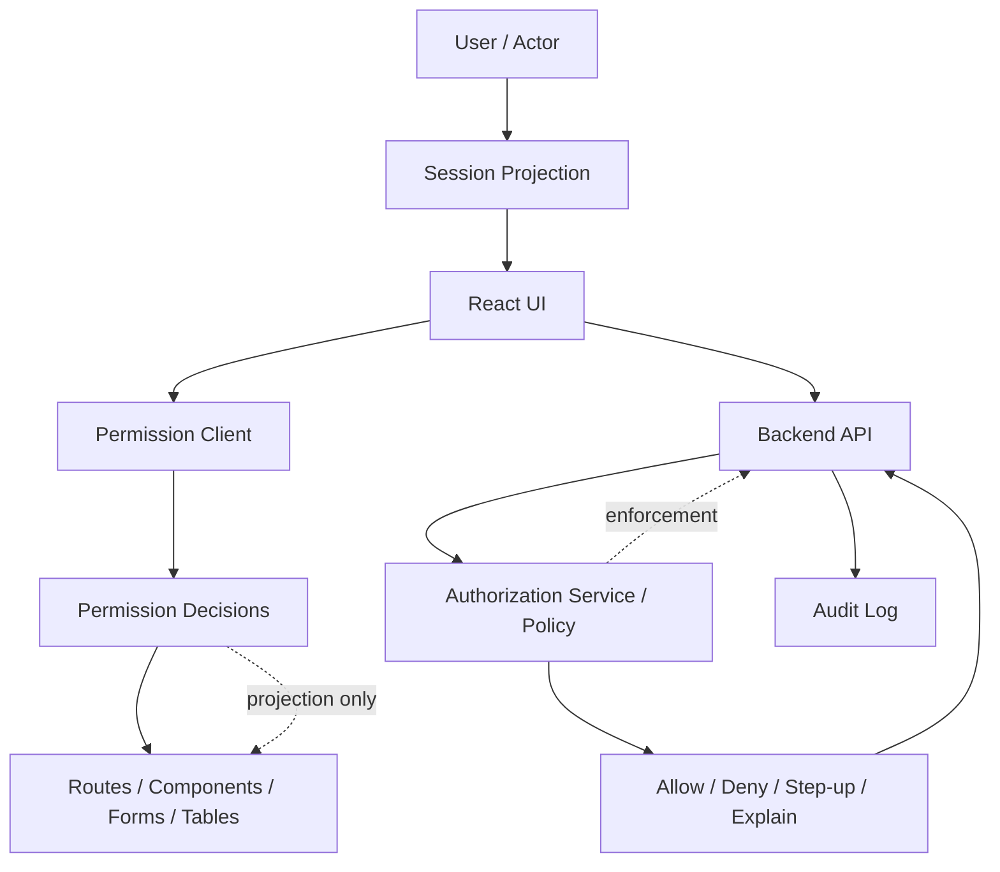
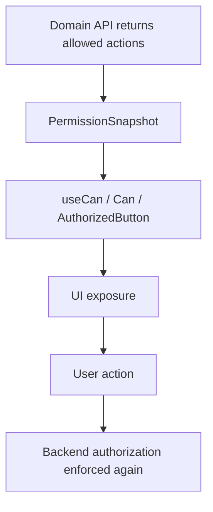
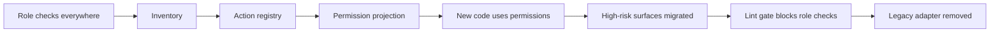
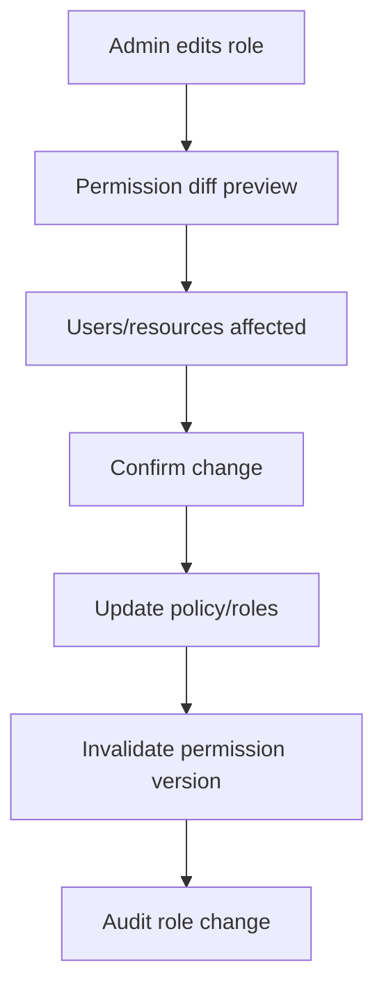

# Part 107 — Migration from Role Checks to Permission Contract

Most React applications start with role checks.

```tsx
if (user.role === 'admin') {
  return <DeleteButton />;
}
```

This is attractive because it is simple, visible, and easy to ship. It also becomes one of the most expensive forms of authorization debt.

A role is a business grouping. A permission is an allowed capability. A route, button, form field, table row action, export operation, or workflow transition usually needs a **capability decision**, not a role label.

The goal of this migration is to move from:

> “React knows roles and guesses what they imply.”

into:

> “React receives an explicit, server-projected permission contract and renders UI from capability decisions.”

The migration is not cosmetic. It changes the contract between frontend and backend.

It also closes a common engineering gap: the backend evolves authorization logic, but the frontend keeps stale role assumptions.

---

## 1. Why role checks decay

A role check looks harmless until the product grows.

```tsx
const canApprove = user.role === 'admin' || user.role === 'supervisor';
```

Then the business adds:

- tenant-scoped roles;
- temporary access;
- delegated administration;
- object-level grants;
- workflow-state constraints;
- separation of duties;
- step-up authentication;
- feature entitlements;
- read-only support access;
- regional/legal restrictions;
- impersonation mode;
- emergency break-glass access;
- role exceptions for one customer.

The frontend role check becomes an implicit policy engine.

That is the wrong place for policy.

---

## 2. Role check vs permission contract

| Concern | Role check | Permission contract |
|---|---|---|
| Input | `user.role` | `can(action, resource, context)` or server-projected decisions |
| Meaning | Group membership | Capability decision |
| Scope | Often global | Tenant/resource/context scoped |
| Evolvability | Poor | Strong if versioned |
| UI clarity | Ambiguous | Explicit |
| Backend alignment | Easy to drift | Contract-testable |
| Object-level permission | Hard | Natural |
| Workflow constraint | Hard | Natural |
| Denial reason | Usually absent | First-class |
| Audit | Weak | Decision-aware |
| Security boundary | Still backend | Still backend |

The key point: a permission contract does not make frontend an enforcement boundary. It makes frontend an accurate **projection** of backend authorization.

---

## 3. The source smell catalogue

Search your React codebase for these patterns.

```tsx
user.role === 'admin'
user.roles.includes('manager')
profile.isAdmin
account.type === 'enterprise'
claims.scope.includes('delete:case')
jwtDecode(token).roles
if (tenant.ownerId === user.id)
if (user.email.endsWith('@company.com'))
```

Some are not always wrong. But they are suspicious when used to control product capability.

### Smell 1 — role name inside component

```tsx
function CaseToolbar({ caseId }: Props) {
  const { user } = useAuth();

  return user.role === 'case_manager'
    ? <ApproveButton caseId={caseId} />
    : null;
}
```

The component now encodes business policy. If policy changes, you need to grep UI code.

### Smell 2 — role name inside route metadata

```ts
export const handle = {
  allowedRoles: ['admin', 'supervisor'],
};
```

Better than ad-hoc component checks, but still role-shaped.

### Smell 3 — frontend decodes JWT and authorizes

```ts
const claims = jwtDecode(accessToken);
const canExport = claims.roles.includes('admin');
```

Decoded claims are not fresh policy. They are at best a stale identity/session hint.

### Smell 4 — role determines object ownership

```tsx
const canEdit = user.role === 'admin' || record.ownerId === user.id;
```

This mixes RBAC and object-level ACL in a component.

### Smell 5 — role check hides button but API permits/denies differently

The frontend says allowed. The backend says forbidden. Or worse, the frontend hides something but the backend permits direct API access.

That is policy drift.

---

## 4. The migration invariant

During migration, enforce this invariant:

> Role checks may exist temporarily as compatibility code, but all new product capability decisions must go through a named permission contract.

This gives you a ratchet.

Do not attempt a big-bang migration across the whole app unless the app is small. Migrate by action vocabulary and surface area.

---

## 5. Target mental model



React uses permission decisions to render accurately. Backend enforces the same policy when the user actually acts.

---

## 6. Define an action vocabulary

A permission contract starts with action names.

Bad action names:

```txt
admin
manager
canEdit
allowed
caseAccess
```

Good action names:

```txt
case.read
case.update_summary
case.assign
case.approve
case.reject
case.escalate
case.close
case.reopen
case.export
case.download_attachment
case.add_note
case.delete_note
case.request_extension
```

The action name should describe product capability, not role, implementation, or UI widget.

### Naming rules

| Rule | Example |
|---|---|
| Use domain noun + verb | `case.approve` |
| Prefer exact action over broad action | `case.update_due_date` over `case.edit` |
| Avoid UI terms | `case.close` not `button.close.visible` |
| Separate read/write/export | `case.read`, `case.update`, `case.export` |
| Separate sensitive actions | `case.delete`, `case.bulk_export` |
| Use stable names | Do not rename casually; deprecate |

---

## 7. Define resource shapes

Permissions are not just actions. They are actions on resources.

```ts
export type ResourceRef =
  | { type: 'case'; id: string; tenantId: string; state?: CaseState; ownerId?: string }
  | { type: 'case_attachment'; id: string; caseId: string; tenantId: string }
  | { type: 'tenant'; id: string }
  | { type: 'user'; id: string; tenantId: string };
```

For list pages, the resource may be a collection.

```ts
const resource = {
  type: 'case_collection',
  tenantId,
  filters: { status: 'open' },
};
```

For creation, the resource may be a creation context.

```ts
const resource = {
  type: 'case',
  tenantId,
  operation: 'create',
  category: 'enforcement',
};
```

---

## 8. Decision object, not boolean

A boolean cannot explain enough.

```ts
type PermissionDecision =
  | {
      allowed: true;
      action: string;
      resource: ResourceRef;
      source: 'server-projection' | 'local-snapshot';
      permissionVersion: string;
      evaluatedAt: string;
    }
  | {
      allowed: false;
      action: string;
      resource: ResourceRef;
      reason:
        | 'not_authenticated'
        | 'missing_permission'
        | 'tenant_mismatch'
        | 'resource_not_found'
        | 'resource_state_forbidden'
        | 'requires_step_up'
        | 'impersonation_restricted'
        | 'separation_of_duties'
        | 'stale_permission_snapshot'
        | 'unknown';
      userMessage?: string;
      requestAccess?: {
        eligible: boolean;
        target: string;
      };
      stepUp?: {
        required: boolean;
        level: 'mfa' | 'fresh_login' | 'webauthn';
      };
      permissionVersion?: string;
      evaluatedAt?: string;
    };
```

In React, the decision object powers:

- render/not render;
- disabled/explained state;
- request access CTA;
- step-up flow;
- telemetry;
- debugging;
- tests.

On the server, the decision object powers:

- response semantics;
- audit event;
- support tooling;
- policy regression tests.

---

## 9. Permission contract endpoint

Start with a session projection.

```http
GET /api/session
Cache-Control: no-store
```

```json
{
  "authState": "authenticated",
  "actor": {
    "id": "user_123",
    "displayName": "Ari",
    "email": "ari@example.com"
  },
  "tenant": {
    "id": "tenant_456",
    "name": "Acme RegTech"
  },
  "permissionVersion": "pv_2026_07_08_09_12_00",
  "globalActions": [
    "case.create",
    "case.search",
    "case.bulk_export.request"
  ],
  "constraints": {
    "maxExportRows": 10000,
    "requiresMfaFor": ["case.bulk_export.request", "tenant.invite_user"]
  }
}
```

For resource pages, return resource-specific actions with the resource payload.

```http
GET /api/cases/case_123
Cache-Control: no-store
```

```json
{
  "case": {
    "id": "case_123",
    "tenantId": "tenant_456",
    "status": "UNDER_REVIEW",
    "assigneeId": "user_123",
    "version": 17
  },
  "authorization": {
    "permissionVersion": "pv_2026_07_08_09_12_00",
    "allowedActions": [
      "case.read",
      "case.add_note",
      "case.approve",
      "case.request_extension"
    ],
    "deniedActions": {
      "case.close": {
        "reason": "resource_state_forbidden",
        "userMessage": "This case cannot be closed while under review."
      },
      "case.delete": {
        "reason": "missing_permission",
        "requestAccess": {
          "eligible": true,
          "target": "case.delete"
        }
      }
    }
  }
}
```

This contract removes the need for React to infer policy from role names.

---

## 10. `can()` over projection

A frontend permission helper should be deliberately boring.

```ts
export function can(
  snapshot: PermissionSnapshot | null,
  action: ActionName,
  resource?: ResourceRef,
): PermissionDecision {
  if (!snapshot) {
    return {
      allowed: false,
      action,
      resource: resource ?? { type: 'unknown', id: 'unknown' } as ResourceRef,
      reason: 'unknown',
    };
  }

  if (snapshot.globalActions.has(action)) {
    return {
      allowed: true,
      action,
      resource: resource ?? { type: 'global', id: 'global' } as ResourceRef,
      source: 'server-projection',
      permissionVersion: snapshot.permissionVersion,
      evaluatedAt: snapshot.loadedAt,
    };
  }

  const resourceKey = resource ? toResourceKey(resource) : null;
  const resourceActions = resourceKey
    ? snapshot.resourceActions.get(resourceKey)
    : undefined;

  if (resourceActions?.has(action)) {
    return {
      allowed: true,
      action,
      resource: resource!,
      source: 'server-projection',
      permissionVersion: snapshot.permissionVersion,
      evaluatedAt: snapshot.loadedAt,
    };
  }

  return {
    allowed: false,
    action,
    resource: resource ?? { type: 'unknown', id: 'unknown' } as ResourceRef,
    reason: 'missing_permission',
    permissionVersion: snapshot.permissionVersion,
    evaluatedAt: snapshot.loadedAt,
  };
}
```

This local `can()` evaluates a server-projected snapshot. It does not replace server-side authorization.

---

## 11. Compatibility adapter

You rarely replace every role check in one PR. Build a compatibility adapter.

```ts
const legacyRoleToActions: Record<string, ActionName[]> = {
  admin: [
    'case.read',
    'case.create',
    'case.assign',
    'case.approve',
    'case.close',
    'tenant.invite_user',
  ],
  reviewer: [
    'case.read',
    'case.add_note',
    'case.approve',
  ],
  viewer: [
    'case.read',
  ],
};

export function projectLegacyRoles(user: LegacyUser): PermissionSnapshot {
  return {
    subjectId: user.id,
    tenantId: user.tenantId,
    permissionVersion: `legacy:${user.role}:${user.updatedAt}`,
    loadedAt: new Date().toISOString(),
    globalActions: new Set(legacyRoleToActions[user.role] ?? []),
    resourceActions: new Map(),
    source: 'legacy-role-adapter',
  };
}
```

This adapter is temporary. Mark it as deprecated.

```ts
/**
 * @deprecated Use server-projected /api/session permission contract.
 * Temporary migration adapter only.
 */
export function projectLegacyRoles(...) { ... }
```

---

## 12. Add a typed action registry

A registry prevents accidental permission vocabulary drift.

```ts
export const Actions = {
  CaseRead: 'case.read',
  CaseCreate: 'case.create',
  CaseAssign: 'case.assign',
  CaseApprove: 'case.approve',
  CaseReject: 'case.reject',
  CaseClose: 'case.close',
  CaseExport: 'case.export',
  TenantInviteUser: 'tenant.invite_user',
  TenantManageRoles: 'tenant.manage_roles',
} as const;

export type ActionName = typeof Actions[keyof typeof Actions];
```

Never scatter string permissions everywhere.

Bad:

```tsx
<Can action="case.approvee" />
```

Good:

```tsx
<Can action={Actions.CaseApprove} />
```

---

## 13. Replace role checks with capability checks

Before:

```tsx
if (user.role !== 'admin') return null;
return <InviteUserButton />;
```

After:

```tsx
const decision = useCan(Actions.TenantInviteUser, {
  type: 'tenant',
  id: activeTenantId,
});

return (
  <AuthorizedButton decision={decision}>
    Invite user
  </AuthorizedButton>
);
```

For one-off rendering:

```tsx
<Can
  action={Actions.CaseApprove}
  resource={{ type: 'case', id: caseId, tenantId, state }}
  fallback={<DisabledWithReason reason="You cannot approve this case." />}
>
  <ApproveCaseButton caseId={caseId} />
</Can>
```

---

## 14. Route metadata migration

Before:

```ts
export const handle = {
  allowedRoles: ['admin', 'supervisor'],
};
```

After:

```ts
export const handle = {
  auth: {
    required: true,
    action: Actions.CaseRead,
    resource: ({ params, context }) => ({
      type: 'case',
      id: params.caseId,
      tenantId: context.tenantId,
    }),
  },
};
```

Better yet, route loader enforces the same server policy.

```ts
export async function loader({ params, request }: LoaderArgs) {
  const session = await requireSession(request);
  const result = await api.getCase({
    session,
    caseId: params.caseId!,
  });

  if (result.status === 403) {
    throw forbidden(result.problem);
  }

  return result.body;
}
```

Route metadata is useful for navigation exposure. Loader/API authorization remains the enforcement path.

---

## 15. Component migration pattern

Use a three-layer pattern.



The same action name appears in:

- backend policy;
- API response contract;
- frontend action registry;
- component guard;
- tests;
- audit events.

That alignment is the point of the migration.

---

## 16. Step-by-step migration plan

### Phase 0 — Freeze the damage

Add a lint rule or static grep gate for new role checks.

Forbidden examples:

```txt
user.role
user.roles
isAdmin
role ===
roles.includes
jwtDecode(*).roles
```

Do not fail existing code immediately. Start with warning mode.

### Phase 1 — Inventory role checks

Create an inventory table.

| Location | Role check | Capability implied | Resource scope | Backend endpoint | Risk |
|---|---|---|---|---|---|
| `CaseToolbar.tsx` | `role === admin` | `case.approve` | case | `POST /cases/:id/approve` | high |
| `Sidebar.tsx` | `roles.includes(manager)` | `case.search` | tenant | `GET /cases` | medium |
| `UserInvite.tsx` | `isAdmin` | `tenant.invite_user` | tenant | `POST /tenant/invites` | high |

### Phase 2 — Define action vocabulary

For each role check, name the capability.

```txt
admin can approve case -> case.approve
manager can assign case -> case.assign
viewer can see cases -> case.read
support can view tenant in impersonation -> tenant.support_view
```

### Phase 3 — Build permission projection

Add `/api/session` and resource-specific `authorization` blocks.

### Phase 4 — Build frontend permission primitives

Implement:

- `Actions` registry;
- `PermissionSnapshot`;
- `can()`;
- `useCan()`;
- `<Can />`;
- `<AuthorizedButton />`;
- permission-aware menu/table/form wrappers.

### Phase 5 — Migrate high-risk surfaces first

Prioritize:

- destructive actions;
- exports/downloads;
- approval/rejection workflows;
- admin tools;
- tenant membership management;
- impersonation;
- object-level access.

### Phase 6 — Add contract tests

Ensure backend and frontend agree on:

- action names;
- resource type names;
- denial reason enum;
- permission version semantics;
- cache headers;
- typed `403` problem response.

### Phase 7 — Delete legacy adapter

Only after no runtime surfaces depend on role checks.

---

## 17. Migration ratchet

A ratchet allows only forward progress.



Ratchet rules:

1. no new role checks;
2. new UI must use `Actions` registry;
3. new API must return authorization projection when UI needs capability rendering;
4. all high-risk mutation buttons must have backend denial tests;
5. old role adapter has an expiry date.

---

## 18. Server-side permission projection

A simple implementation can start as RBAC.

```ts
const rolePermissions: Record<RoleName, ActionName[]> = {
  tenant_admin: [
    Actions.CaseRead,
    Actions.CaseCreate,
    Actions.CaseAssign,
    Actions.CaseApprove,
    Actions.TenantInviteUser,
  ],
  case_reviewer: [
    Actions.CaseRead,
    Actions.CaseApprove,
  ],
  case_viewer: [
    Actions.CaseRead,
  ],
};

export function projectTenantPermissions(membership: Membership) {
  return rolePermissions[membership.role] ?? [];
}
```

Then grow into ABAC/object-level checks.

```ts
export async function getCaseAuthorization({ actor, tenantId, caseRecord }) {
  const actions = new Set<ActionName>();

  if (await canServer(actor, Actions.CaseRead, caseRecord)) {
    actions.add(Actions.CaseRead);
  }

  if (
    caseRecord.status === 'UNDER_REVIEW' &&
    caseRecord.assigneeId === actor.userId &&
    await canServer(actor, Actions.CaseApprove, caseRecord)
  ) {
    actions.add(Actions.CaseApprove);
  }

  return {
    permissionVersion: await currentPermissionVersion(tenantId, actor.userId),
    allowedActions: [...actions],
  };
}
```

The frontend does not need to know whether the decision came from RBAC, ABAC, ACL, ReBAC, or policy-as-code.

---

## 19. Permission response versioning

A permission contract is an API.

Version it.

```json
{
  "schemaVersion": "authz.projection.v2",
  "permissionVersion": "pv_84921",
  "allowedActions": ["case.read", "case.approve"],
  "deniedActions": {
    "case.close": {
      "reason": "resource_state_forbidden"
    }
  }
}
```

Versioning protects you from accidental breaking changes like:

- renaming `case.approve` to `case.review.approve`;
- changing denial reason shape;
- removing `permissionVersion`;
- changing resource type names;
- changing global vs resource action semantics.

---

## 20. Permission cache invalidation during migration

Role checks are usually synchronous and stale by nature. Permission projections are also stale unless invalidated.

Use explicit invalidation triggers:

| Event | Frontend response |
|---|---|
| login | fetch session projection |
| logout | clear permission snapshot |
| tenant switch | clear tenant-scoped permission cache |
| role changed | invalidate session and resource permissions |
| object ACL changed | invalidate affected resource permissions |
| policy version changed | invalidate all permission decisions using older version |
| `403 stale_permission_snapshot` | refetch projection and retry only if safe |

React Query keys should include auth/tenant/permission version.

```ts
const key = ['case', tenantId, caseId, authEpoch, permissionVersion];
```

---

## 21. `403` as a synchronization signal

The backend should return typed authorization errors.

```json
{
  "type": "https://example.com/problems/forbidden",
  "title": "Forbidden",
  "status": 403,
  "code": "MISSING_PERMISSION",
  "action": "case.approve",
  "resource": {
    "type": "case",
    "id": "case_123"
  },
  "permissionVersion": "pv_84922",
  "correlationId": "req_abc"
}
```

React can then respond correctly:

- show denial reason;
- clear stale optimistic update;
- invalidate permission cache;
- trigger step-up;
- offer request access;
- avoid retry loops.

---

## 22. Permission-aware admin UX

Migration changes admin tools too.

Old admin UI:

```txt
User -> Role: Admin | Manager | Viewer
```

Better admin UI:

```txt
Role: Case Reviewer
Permissions:
- case.read
- case.add_note
- case.approve
Constraints:
- only assigned cases
- only UNDER_REVIEW state
- cannot approve own submission
```

Admin UX must show capability impact.



Do not let role management remain a magic dropdown.

---

## 23. Role explosion pressure

If every exception becomes a role, you get role explosion.

```txt
case_admin
case_admin_readonly
case_admin_export
case_admin_no_export
case_admin_region_a
case_admin_region_b
case_admin_temp
case_admin_escalation
```

A permission contract helps you separate:

- role membership;
- capability;
- resource scope;
- attribute constraint;
- temporary grant;
- entitlement;
- feature flag;
- workflow state.

Do not solve a policy dimension by inventing another role name.

---

## 24. Migration examples

### Example A — Delete button

Before:

```tsx
{user.role === 'admin' && <DeleteCaseButton caseId={case.id} />}
```

After:

```tsx
const decision = useCan(Actions.CaseDelete, {
  type: 'case',
  id: case.id,
  tenantId: case.tenantId,
  state: case.status,
});

return <AuthorizedButton decision={decision}>Delete case</AuthorizedButton>;
```

Server:

```ts
await authorize(actor, Actions.CaseDelete, caseRecord);
await deleteCase(caseRecord.id);
```

### Example B — Export menu

Before:

```tsx
{user.roles.includes('manager') && <ExportCsvMenuItem />}
```

After:

```tsx
<Can
  action={Actions.CaseExport}
  resource={{ type: 'case_collection', tenantId, filters }}
  fallback={<MenuItem disabled>Export unavailable</MenuItem>}
>
  <ExportCsvMenuItem />
</Can>
```

Server must check export permission again with the exact filter set.

### Example C — Read-only support mode

Before:

```tsx
const canEdit = user.role === 'support_admin';
```

After:

```tsx
const decision = useCan(Actions.CaseUpdateSummary, {
  type: 'case',
  id: case.id,
  tenantId: case.tenantId,
});

if (session.impersonation?.mode === 'support_view') {
  return <ReadOnlyField value={case.summary} reason="Support view is read-only." />;
}
```

Support mode becomes a constraint in the session/permission contract, not an ad-hoc role.

---

## 25. Form-level migration

Role-based form:

```tsx
<input disabled={user.role !== 'admin'} />
```

Permission contract form:

```tsx
type FieldPermission = 'hidden' | 'masked' | 'readonly' | 'editable' | 'requires_step_up';

const fieldAuth = caseProjection.fieldPermissions.summary;

return (
  <TextField
    value={summary}
    readOnly={fieldAuth.mode === 'readonly'}
    disabled={fieldAuth.mode === 'hidden'}
  />
);
```

Submit must send only allowed changes.

```ts
const patch = buildAuthorizedPatch(formValues, fieldPermissions);
await api.updateCase(caseId, patch);
```

Server must enforce field-level authorization again.

---

## 26. Table-level migration

Before:

```tsx
const actions = user.role === 'admin'
  ? ['view', 'edit', 'delete']
  : ['view'];
```

After:

```ts
type CaseRow = {
  id: string;
  status: string;
  allowedActions: ActionName[];
  deniedActions?: Record<ActionName, DenialReason>;
};
```

React:

```tsx
<RowActions
  row={row}
  actions={[
    Actions.CaseRead,
    Actions.CaseAssign,
    Actions.CaseApprove,
    Actions.CaseClose,
  ]}
/>
```

Bulk actions need eligibility preview.

```json
{
  "action": "case.approve",
  "eligible": ["case_1", "case_2"],
  "ineligible": [
    {
      "id": "case_3",
      "reason": "resource_state_forbidden"
    }
  ]
}
```

---

## 27. Feature flag interaction

Feature flags and permissions must remain separate.

```ts
const featureEnabled = useFeatureFlag('bulk-export-v2');
const decision = useCan(Actions.CaseBulkExport, collectionResource);

if (!featureEnabled) return null;
return <AuthorizedButton decision={decision}>Bulk export</AuthorizedButton>;
```

Feature flag controls release exposure. Permission controls access.

Backend still enforces permission.

---

## 28. Token claims migration

Do not replace role checks with frontend token scope checks and call it done.

Bad:

```ts
const canApprove = claims.scope.includes('case:approve');
```

Better:

```ts
const decision = useCan(Actions.CaseApprove, caseResource);
```

The token may contain coarse API scopes. Product authorization needs current tenant/resource/workflow context.

---

## 29. Separation of duties

Some denials depend on relationships between actor and resource.

Example:

> A reviewer cannot approve a case they submitted.

Do not put this in React as:

```tsx
const canApprove = case.submittedBy !== user.id && user.role === 'reviewer';
```

Represent it in the decision contract.

```json
{
  "allowed": false,
  "action": "case.approve",
  "reason": "separation_of_duties",
  "userMessage": "You cannot approve a case you submitted."
}
```

React renders the reason. Server enforces it.

---

## 30. Step-up migration

Role checks cannot express authentication freshness.

```json
{
  "allowed": false,
  "action": "case.bulk_export",
  "reason": "requires_step_up",
  "stepUp": {
    "required": true,
    "level": "webauthn"
  }
}
```

React can render:

```tsx
<AuthorizedButton decision={decision} onStepUp={startStepUp}>
  Export sensitive data
</AuthorizedButton>
```

After step-up, refresh session projection and retry the action only if idempotent or explicitly confirmed.

---

## 31. Impersonation migration

Role checks are especially dangerous in impersonation.

```tsx
user.role === 'admin'
```

Which user? The support actor? The impersonated subject?

The permission contract must separate actor and subject.

```json
{
  "actor": { "id": "support_1", "type": "support_user" },
  "subject": { "id": "customer_9", "type": "end_user" },
  "impersonation": {
    "active": true,
    "mode": "support_view",
    "restrictedActions": ["case.approve", "case.export"]
  }
}
```

React renders a banner and denies restricted actions by projection. Backend enforces actor/subject rules.

---

## 32. Testing migration correctness

### Unit test the vocabulary

```ts
expect(Object.values(Actions)).toMatchInlineSnapshot();
```

Snapshot action names deliberately. Renames should be reviewed.

### Test old role-to-permission adapter

```ts
it('projects tenant admin legacy role to explicit actions', () => {
  const snapshot = projectLegacyRoles(makeUser({ role: 'tenant_admin' }));
  expect(snapshot.globalActions).toContain(Actions.TenantInviteUser);
});
```

### Test UI rendering

```tsx
renderWithPermissions(<CaseToolbar case={caseRecord} />, {
  allowedActions: [Actions.CaseRead, Actions.CaseApprove],
});

expect(screen.getByRole('button', { name: /approve/i })).toBeEnabled();
expect(screen.queryByRole('button', { name: /delete/i })).not.toBeInTheDocument();
```

### Test backend enforcement

```ts
await expect(
  api.approveCase({ actor: reviewerWhoSubmittedCase, caseId }),
).rejects.toMatchObject({ code: 'SEPARATION_OF_DUTIES' });
```

### Test contract drift

```ts
expect(frontendActionRegistry).toEqual(serverActionRegistryProjection);
```

---

## 33. CI guardrails

Add automated gates.

```bash
# fail new role checks in React surfaces
rg "user\.role|roles\.includes|isAdmin|jwtDecode\(.*role" src --glob "*.tsx"
```

Use an allowlist for legacy files.

```txt
legacy-role-check-allowlist.txt
```

Every PR must reduce or preserve the count, never increase it.

---

## 34. Observability during migration

Track:

- number of legacy role checks remaining;
- number of permission contract decisions rendered;
- frontend `403` after visible allowed action;
- hidden action direct API attempts;
- stale permission snapshot denials;
- permission version mismatch;
- action names missing from frontend registry;
- request access events;
- step-up required events;
- support tickets caused by changed authorization UI.

Metrics reveal drift.

---

## 35. Failure modes

| Failure | Cause | Mitigation |
|---|---|---|
| Button shown but API denies | stale projection or policy drift | include permission version, typed 403, invalidate |
| Button hidden but user should access | incomplete projection | access request/reload, contract test |
| Role adapter grants too much | naive role mapping | migrate high-risk actions first, server enforcement |
| Tenant role leaks globally | missing tenant scope | tenant-scoped snapshots and query keys |
| Token claim used as policy | shortcut migration | lint forbid JWT authorization |
| Feature flag treated as permission | conflated release/access | separate flag and permission checks |
| Denial reason leaks sensitive data | raw policy trace exposed | public reason enum + internal trace id |
| New action missing from registry | backend/frontend drift | generated schema or CI registry diff |

---

## 36. Anti-patterns

### Anti-pattern: `isAdmin` abstraction

```ts
function isAdmin(user: User) {
  return user.roles.includes('admin');
}
```

This hides the smell instead of fixing it.

### Anti-pattern: permission strings inside components

```tsx
<Can action="delete_everything" />
```

Use a typed registry.

### Anti-pattern: server sends role and frontend expands it

```json
{
  "role": "admin"
}
```

If React expands roles, React owns policy drift.

### Anti-pattern: decoded JWT as permission source

JWT claims may be stale, coarse, or intended for a different audience.

### Anti-pattern: only hiding UI

Hiding UI is exposure control. Backend authorization remains mandatory.

---

## 37. A realistic migration timeline

### Week 1 — Inventory and freeze

- grep all role checks;
- document capability implied by each;
- add warning lint;
- design action vocabulary.

### Week 2 — Core permission primitives

- add action registry;
- add permission snapshot type;
- add `can()` and `useCan()`;
- add design-system wrappers;
- add testing helpers.

### Week 3 — Server projection

- extend `/session`;
- extend one resource endpoint;
- add typed `403` problem;
- add permission version.

### Week 4 — High-risk migration

- admin user management;
- export/download;
- destructive actions;
- workflow approvals;
- impersonation.

### Week 5+ — Broad migration

- tables;
- forms;
- navigation;
- route metadata;
- low-risk read-only areas;
- remove old adapter.

---

## 38. Design review questions

Ask these before approving a migration PR:

1. What action name represents this capability?
2. Is the action global, tenant-scoped, or resource-scoped?
3. Does backend enforce the same action?
4. Does the UI consume a server projection or infer from role?
5. What happens if the permission snapshot is stale?
6. What denial reason should the user see?
7. Is request access eligible?
8. Does this action require step-up?
9. Is the decision affected by impersonation?
10. Are tests covering allow, deny, stale, and tenant mismatch?

---

## 39. Production checklist

- [ ] All new UI uses action registry.
- [ ] No new role checks allowed in React code.
- [ ] `/api/session` includes permission version.
- [ ] Resource endpoints return `allowedActions` when UI needs row/resource actions.
- [ ] Backend enforces every sensitive action.
- [ ] Typed `403` problem response exists.
- [ ] Query keys include tenant/auth/permission version where needed.
- [ ] Logout clears permission cache.
- [ ] Tenant switch clears tenant-scoped permission cache.
- [ ] Role change invalidates affected sessions/permission projections.
- [ ] Admin role editor shows permission impact.
- [ ] Permission vocabulary is tested.
- [ ] Legacy adapter has deletion date.
- [ ] Security review confirms frontend remains projection only.

---

## 40. Final rule

Do not ask React:

> “What role does the user have?”

Ask:

> “For this actor, in this tenant, against this resource, for this action, what decision did the authorization boundary project?”

Role checks are shortcuts. Permission contracts are interfaces.

The migration is complete when:

- React no longer expands roles into product capability;
- action names are stable and typed;
- backend returns permission projection for UI exposure;
- backend still enforces on every request;
- denial is typed, observable, and recoverable;
- stale permission states fail closed;
- admin tooling explains role-to-permission impact;
- tests protect the contract.

That is how React auth UI grows from brittle role-gated screens into a capability-aware system.

---

## 41. References

- OWASP Authorization Cheat Sheet — https://cheatsheetseries.owasp.org/cheatsheets/Authorization_Cheat_Sheet.html
- OWASP API Security Top 10 2023: Broken Object Level Authorization — https://owasp.org/API-Security/editions/2023/en/0xa1-broken-object-level-authorization/
- NIST RBAC model — https://csrc.nist.gov/projects/role-based-access-control
- NIST SP 800-162, Guide to Attribute Based Access Control — https://csrc.nist.gov/pubs/sp/800/162/upd2/final
- Google Zanzibar paper — https://research.google/pubs/zanzibar-googles-consistent-global-authorization-system/
- OpenFGA Concepts — https://openfga.dev/docs/concepts
- React Conditional Rendering — https://react.dev/learn/conditional-rendering
