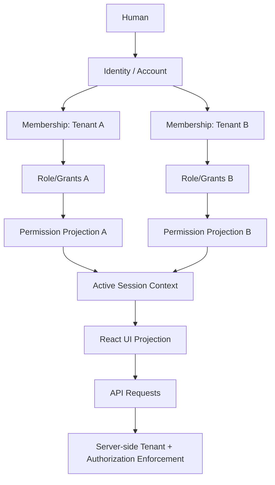
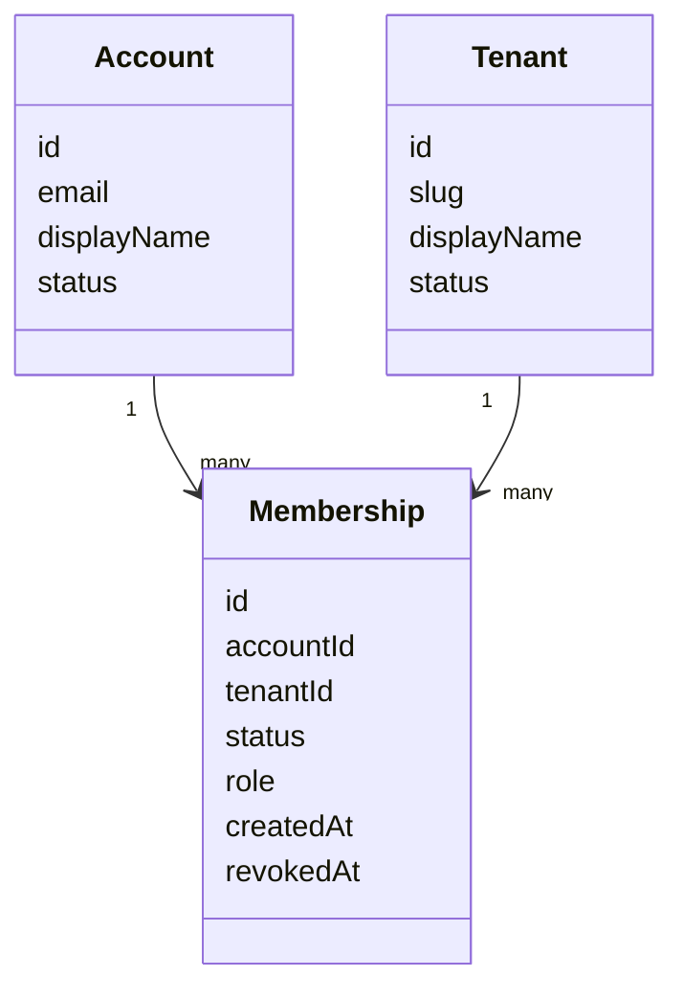
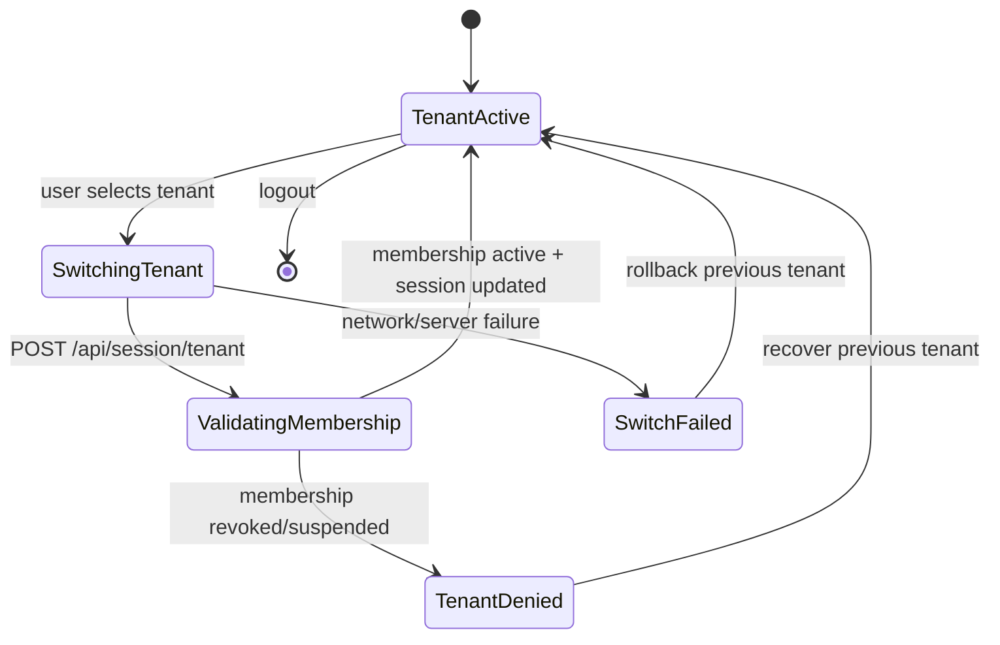
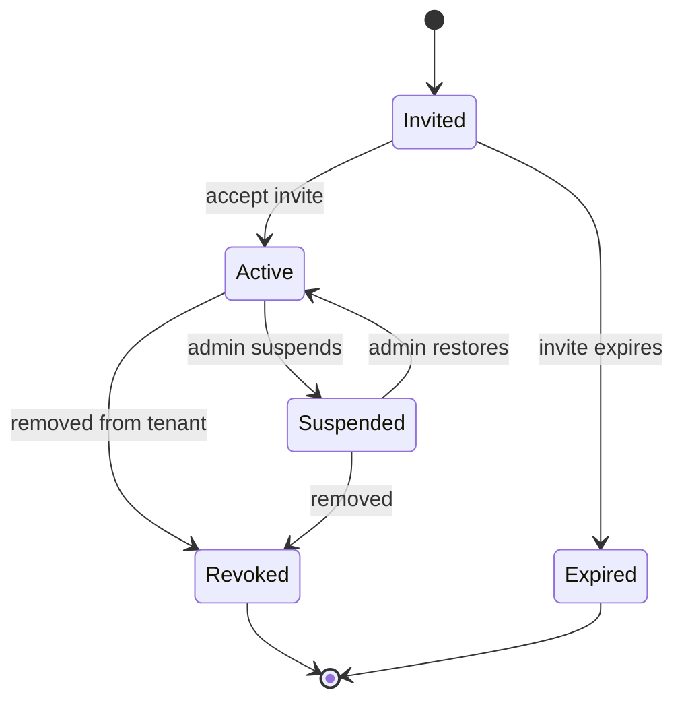
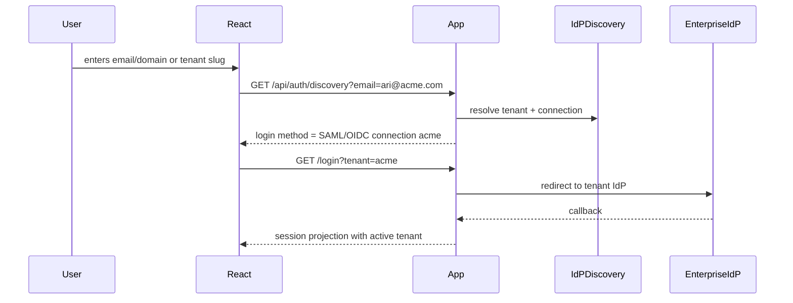
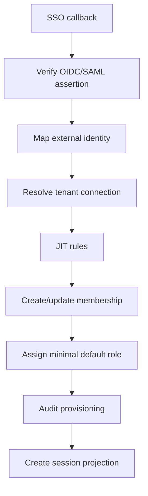
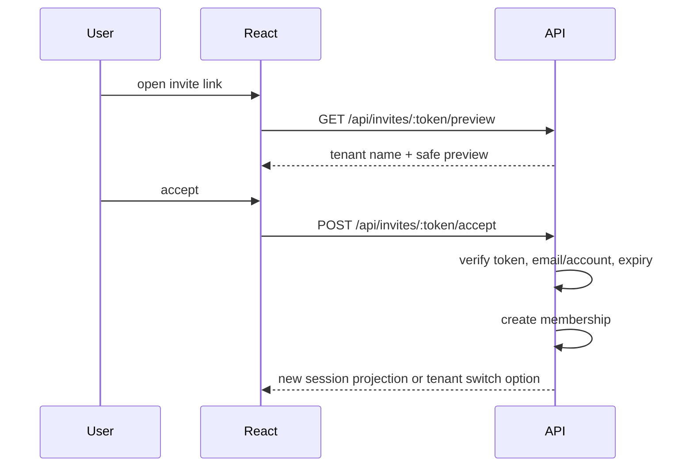

# Part 108 — Multi-tenant Auth Operations

Multi-tenancy is not a dropdown in the header.

It is an authorization boundary.

A tenant switch can change:

- identity projection;
- membership;
- roles;
- permissions;
- active policy version;
- data scope;
- SSO provider;
- branding;
- feature entitlements;
- audit context;
- support visibility;
- cache namespace;
- legal/regional controls;
- workflow rules.

If React treats tenant as UI preference, you will eventually leak data across tenants.

The goal of this part is to design multi-tenant auth operations as a system: session context, tenant context, membership sync, cache invalidation, SSO routing, authorization enforcement, audit, and incident response.

---

## 1. Core mental model

A user is not simply “logged in.”

A user is logged in as an **actor**, operating within an **active tenant context**, using a **membership**, under a **permission version**, through a **session**, against **tenant-scoped resources**.



The same human may have completely different powers in different tenants.

---

## 2. Tenant is not organization name

Tenant is a boundary for:

- data isolation;
- identity membership;
- authorization policy;
- audit log;
- billing/entitlement;
- admin delegation;
- SSO configuration;
- custom domain;
- regional/legal constraints;
- incident blast radius.

Do not model tenant as just:

```ts
type Tenant = {
  id: string;
  name: string;
};
```

Model operational properties.

```ts
type TenantContext = {
  tenantId: string;
  slug: string;
  displayName: string;
  membershipId: string;
  membershipState: 'active' | 'pending' | 'suspended' | 'revoked';
  authzModelVersion: string;
  permissionVersion: string;
  identityProvider?: {
    type: 'oidc' | 'saml' | 'passwordless' | 'local';
    connectionId: string;
  };
  entitlements: string[];
  region?: string;
  supportMode?: 'none' | 'view_only' | 'delegated_admin';
};
```

---

## 3. The tenant context invariant

Every authenticated request must answer:

> Which actor, in which tenant, using which membership, is attempting which action on which resource?

If any part is ambiguous, fail closed.

```ts
type AuthzInput = {
  actorId: string;
  tenantId: string;
  membershipId: string;
  action: ActionName;
  resource: ResourceRef;
  context: {
    sessionId: string;
    authTime: string;
    assuranceLevel: string;
    impersonation?: ImpersonationContext;
    permissionVersion?: string;
  };
};
```

---

## 4. Identity account vs tenant membership

Do not conflate account and membership.



The account authenticates the person. The membership authorizes participation in a tenant.

A user can be:

- active in Tenant A;
- suspended in Tenant B;
- invited to Tenant C;
- removed from Tenant D;
- support actor in Tenant E;
- read-only external auditor in Tenant F.

One `user.role` cannot represent this.

---

## 5. Session shape for multi-tenancy

The session should not imply global tenant access.

```json
{
  "authState": "authenticated",
  "actor": {
    "id": "acct_123",
    "email": "ari@example.com",
    "displayName": "Ari"
  },
  "activeTenant": {
    "tenantId": "tenant_acme",
    "membershipId": "mem_001",
    "role": "case_reviewer",
    "membershipState": "active",
    "permissionVersion": "pv_acme_412"
  },
  "availableTenants": [
    {
      "tenantId": "tenant_acme",
      "displayName": "Acme RegTech",
      "membershipState": "active"
    },
    {
      "tenantId": "tenant_zen",
      "displayName": "Zen Compliance",
      "membershipState": "active"
    }
  ],
  "authEpoch": 29,
  "tenantEpoch": 8
}
```

The frontend uses this as projection. Backend still verifies tenant access on every request.

---

## 6. Tenant resolution strategies

There are several ways to determine tenant context.

| Strategy | Example | Benefit | Risk |
|---|---|---|---|
| path tenant | `/t/acme/cases` | explicit, bookmarkable | slug spoofing if not verified |
| subdomain | `acme.app.com` | good B2B UX | custom domain complexity |
| header | `X-Tenant-Id` | API-friendly | easy to forget/forge |
| session active tenant | cookie/session stores active tenant | simple app UX | stale context if not switched atomically |
| resource-derived | `caseId` maps to tenant | strong server-side | UI must still display context |

The safest APIs do not rely solely on frontend-provided tenant id. They derive and verify tenant from the resource where possible.

---

## 7. Tenant switch as state machine

Tenant switch is not a `setState` call.



Tenant switch must update:

- active tenant in server session;
- session projection;
- permission projection;
- query cache namespace;
- router location/state;
- navigation/menu projection;
- realtime subscriptions;
- background polling;
- open modals/forms;
- audit context.

---

## 8. Tenant switch API

```http
POST /api/session/tenant
Content-Type: application/json
Cache-Control: no-store
```

```json
{
  "tenantId": "tenant_zen"
}
```

Response:

```json
{
  "authState": "authenticated",
  "activeTenant": {
    "tenantId": "tenant_zen",
    "membershipId": "mem_zen_123",
    "membershipState": "active",
    "permissionVersion": "pv_zen_884"
  },
  "authEpoch": 29,
  "tenantEpoch": 9
}
```

Server-side logic:

```ts
export async function switchTenant(session: Session, tenantId: string) {
  const membership = await membershipRepo.findActive({
    accountId: session.actorId,
    tenantId,
  });

  if (!membership) {
    throw forbidden({ code: 'TENANT_MEMBERSHIP_NOT_ACTIVE' });
  }

  await sessionStore.update(session.id, {
    activeTenantId: tenantId,
    activeMembershipId: membership.id,
    tenantEpoch: session.tenantEpoch + 1,
  });

  await audit.log({
    event: 'tenant.switched',
    actorId: session.actorId,
    fromTenantId: session.activeTenantId,
    toTenantId: tenantId,
  });

  return projectSession(session.id);
}
```

Do not switch tenant purely in local React state.

---

## 9. React tenant switch flow

```tsx
async function switchTenant(nextTenantId: string) {
  await cancelInFlightTenantRequests();

  const previous = session.activeTenant.tenantId;

  setTenantSwitchState({ status: 'switching', from: previous, to: nextTenantId });

  try {
    const nextSession = await api.switchTenant(nextTenantId);

    authStore.replaceSession(nextSession);
    queryClient.clear();
    router.navigate(`/t/${nextSession.activeTenant.tenantId}/home`, {
      replace: true,
    });
    realtime.disconnectAndReconnect(nextSession.activeTenant.tenantId);
  } catch (error) {
    authStore.restoreTenant(previous);
    queryClient.clear();
    showTenantSwitchFailure(error);
  } finally {
    setTenantSwitchState({ status: 'idle' });
  }
}
```

In high-risk systems, close active edit forms or force explicit confirmation before switching tenant.

---

## 10. Tenant-scoped query keys

Never cache authenticated data without tenant context.

Bad:

```ts
useQuery({ queryKey: ['cases'], queryFn: fetchCases });
```

Good:

```ts
useQuery({
  queryKey: ['tenant', tenantId, 'cases', filters, authEpoch, tenantEpoch],
  queryFn: ({ signal }) => fetchCases({ tenantId, filters, signal }),
});
```

For resource detail:

```ts
useQuery({
  queryKey: ['tenant', tenantId, 'case', caseId, permissionVersion],
  queryFn: () => fetchCase({ tenantId, caseId }),
});
```

If query keys are not tenant-scoped, cross-tenant UI leakage is a matter of time.

---

## 11. Tenant-scoped Zustand/Redux state

Global client state needs the same discipline.

Bad:

```ts
const useCaseStore = create(() => ({ selectedCaseId: null }));
```

Better:

```ts
type TenantStore = {
  tenantId: string;
  selectedCaseId: string | null;
  draftByCaseId: Record<string, Draft>;
};

const storesByTenant = new Map<string, StoreApi<TenantStore>>();
```

Or clear on tenant switch.

```ts
authEvents.on('tenant:switching', () => {
  caseStore.reset();
  formDraftStore.reset();
  tableSelectionStore.reset();
});
```

---

## 12. URL design

Prefer tenant-visible URLs for product surfaces.

```txt
/t/:tenantSlug/cases
/t/:tenantSlug/cases/:caseId
/t/:tenantSlug/settings/members
```

But never trust slug alone.

Server must verify:

1. slug resolves to tenant;
2. actor has active membership;
3. resource belongs to tenant;
4. action is allowed.

```ts
const tenant = await tenantRepo.findBySlug(params.tenantSlug);
const caseRecord = await caseRepo.findById(params.caseId);

if (caseRecord.tenantId !== tenant.id) {
  throw notFound();
}

await authorize(actor, Actions.CaseRead, caseRecord);
```

---

## 13. Resource tenant verification

Every object-level API should verify tenant/resource relationship.

Bad:

```ts
await authorize(actor, 'case.read', { tenantId: request.tenantId });
return caseRepo.findById(request.caseId);
```

Better:

```ts
const caseRecord = await caseRepo.findById(request.caseId);

if (!caseRecord) throw notFound();

if (caseRecord.tenantId !== session.activeTenantId) {
  throw notFound(); // or forbidden based on policy
}

await authorize(actor, Actions.CaseRead, caseRecord);
return projectCase(caseRecord);
```

BOLA/IDOR often appears when server trusts object IDs from path/body without checking object ownership/tenant membership.

---

## 14. `403` vs `404` in multi-tenant APIs

| Case | Recommended response |
|---|---|
| Resource does not exist | `404` |
| Resource exists in another tenant | often `404` to avoid enumeration |
| Resource exists in active tenant but action denied | `403` |
| Membership missing/revoked | `403` or forced tenant selection |
| Tenant suspended | `403` with safe reason |
| Not authenticated | `401` |

The response strategy depends on enumeration risk and supportability. Be consistent.

---

## 15. Multi-tenant permission projection

Session-level projection:

```json
{
  "activeTenant": {
    "tenantId": "tenant_acme",
    "permissionVersion": "pv_acme_412"
  },
  "globalTenantActions": [
    "case.search",
    "case.create",
    "member.invite"
  ]
}
```

Resource-level projection:

```json
{
  "case": {
    "id": "case_123",
    "tenantId": "tenant_acme"
  },
  "authorization": {
    "allowedActions": ["case.read", "case.add_note"],
    "deniedActions": {
      "case.approve": {
        "reason": "missing_permission"
      }
    },
    "permissionVersion": "pv_acme_412"
  }
}
```

Do not mix permissions across tenants.

---

## 16. Membership lifecycle



Frontend implications:

- invited user may see onboarding but not tenant data;
- suspended user should not continue using cached data;
- revoked membership should force tenant switch or logout;
- active membership still needs permission checks;
- invite acceptance should create membership and refresh session projection.

---

## 17. Revocation propagation

When membership is revoked:

1. update membership status server-side;
2. increment tenant/user permission version;
3. revoke or update active sessions if needed;
4. push event via WebSocket/SSE if connected;
5. next request returns `403 MEMBERSHIP_REVOKED`;
6. React clears tenant-scoped cache;
7. React redirects to tenant picker or safe landing page;
8. audit event records actor/admin/reason.

Do not rely on the user refreshing the page.

---

## 18. SSO and tenant routing

In enterprise SaaS, tenant may determine identity provider.



The login route may need tenant discovery before authentication.

---

## 19. Domain-based discovery pitfalls

Email domain discovery is convenient but not always authoritative.

Pitfalls:

- personal email domains shared by many users;
- contractors using different domains;
- acquired companies with multiple domains;
- users belonging to multiple tenants with same email;
- domain takeover risk;
- tenant enumeration through discovery endpoint;
- account linking confusion;
- old email after identity provider change.

Discovery responses should be privacy-preserving.

Bad:

```json
{
  "tenantExists": true,
  "tenantName": "Acme Secret Investigation Unit"
}
```

Better:

```json
{
  "nextStep": "continue_with_sso"
}
```

---

## 20. JIT provisioning

Just-in-time provisioning creates membership during SSO login.

Do not blindly make users active admins because the IdP says so.

A safer JIT pipeline:



JIT should be explicit about:

- allowed domains/connections;
- external subject identifier;
- default role;
- group mapping;
- admin approval requirement;
- suspension/deprovision behavior;
- audit trail.

---

## 21. Group mapping

Enterprise IdPs often send groups.

Do not expose raw IdP groups directly to React policy.

Better pipeline:

```txt
IdP group -> tenant mapping rule -> membership/grants -> app permission projection
```

Example:

```json
{
  "idpGroup": "acme-case-reviewers",
  "mapsTo": {
    "role": "case_reviewer",
    "constraints": {
      "caseRegion": "APAC"
    }
  }
}
```

React sees app capabilities, not IdP group names.

---

## 22. Deprovisioning

Deprovisioning is more important than provisioning.

If a user leaves a company, access must end.

Controls:

- SCIM or admin webhook if available;
- periodic membership reconciliation;
- session revocation on deprovision;
- permission version increment;
- refresh token/session invalidation;
- cache cleanup on next request;
- audit event;
- access review reports.

React behavior:

```ts
if (problem.code === 'MEMBERSHIP_REVOKED') {
  clearTenantCache(problem.tenantId);
  await refetchSession();
  navigate('/tenants', { replace: true });
}
```

---

## 23. Tenant invitations

Invitation flow creates membership risk.

A robust invite has:

- tenant id;
- invited email;
- role/grants;
- inviter id;
- expiration;
- single-use token;
- acceptedBy account id;
- audit event;
- optional admin approval;
- domain restriction if required;
- preview of granted permissions.

Accept flow:



Never trust the invite token alone for all future access. It is a bootstrap credential, not a permanent membership proof.

---

## 24. Tenant-scoped audit

Every auth event should carry tenant context when applicable.

```json
{
  "event": "case.approve.denied",
  "actorId": "acct_123",
  "tenantId": "tenant_acme",
  "membershipId": "mem_001",
  "action": "case.approve",
  "resourceType": "case",
  "resourceId": "case_123",
  "decision": "deny",
  "reason": "missing_permission",
  "permissionVersion": "pv_acme_412",
  "correlationId": "req_abc",
  "occurredAt": "2026-07-08T10:01:45.000Z"
}
```

For cross-tenant admin/support operations, record both actor context and target tenant.

---

## 25. Tenant switch audit

```json
{
  "event": "tenant.switched",
  "actorId": "acct_123",
  "fromTenantId": "tenant_acme",
  "toTenantId": "tenant_zen",
  "fromMembershipId": "mem_acme_1",
  "toMembershipId": "mem_zen_9",
  "sessionIdHash": "sess_hash",
  "correlationId": "req_switch_1",
  "occurredAt": "2026-07-08T10:02:00.000Z"
}
```

Tenant switch is security-relevant because it changes data boundary.

---

## 26. Multi-tenant realtime subscriptions

Realtime channels must be tenant scoped.

Bad:

```ts
socket.emit('subscribe', { channel: 'cases' });
```

Better:

```ts
socket.emit('subscribe', {
  tenantId,
  channel: 'cases',
  permissionVersion,
});
```

Server:

```ts
await authorize(actor, Actions.CaseSubscribe, {
  type: 'case_collection',
  tenantId,
});

socket.join(`tenant:${tenantId}:cases`);
```

On tenant switch:

- unsubscribe old tenant channels;
- clear old event buffers;
- reconnect with new session projection;
- reject late events from previous tenant;
- audit subscription denial if suspicious.

---

## 27. Background polling and tenant switch

Polling must stop when tenant changes.

```ts
useEffect(() => {
  const controller = new AbortController();

  pollTenantJobs({ tenantId, signal: controller.signal });

  return () => controller.abort();
}, [tenantId, authEpoch, tenantEpoch]);
```

Never let old tenant polling update new tenant UI.

Use stale response suppression.

```ts
const requestTenantEpoch = authStore.getState().tenantEpoch;
const result = await fetchJobs();

if (requestTenantEpoch !== authStore.getState().tenantEpoch) {
  return; // suppress stale response
}
```

---

## 28. Tenant-scoped service worker cache

Service worker cache is easy to forget.

Key cache entries by tenant and auth epoch, or avoid caching authenticated responses.

```ts
const cacheKey = new Request(
  `/tenant-cache/${tenantId}/${authEpoch}/${url.pathname}${url.search}`,
);
```

For sensitive data, prefer no service worker cache.

On logout or tenant switch, message the service worker to purge tenant-scoped caches.

```ts
navigator.serviceWorker.controller?.postMessage({
  type: 'PURGE_TENANT_CACHE',
  tenantId,
});
```

---

## 29. Cross-tenant UI leakage patterns

Common leaks:

- previous tenant's table rows remain during switch;
- command palette still lists old tenant resources;
- breadcrumb shows stale tenant name;
- recently viewed list mixes tenants;
- browser title leaks old tenant case name;
- notification toast from old tenant appears in new tenant;
- file preview iframe remains open;
- form draft from Tenant A submitted to Tenant B;
- persisted query cache hydrates old tenant data;
- support impersonation banner misses target tenant.

Mitigation:

- block UI during switch;
- clear tenant-scoped stores;
- close modals;
- cancel requests;
- reset router state;
- include tenant in query keys;
- deny stale responses;
- render tenant name visibly in sensitive areas.

---

## 30. Multi-tenant error taxonomy

```ts
type TenantAuthErrorCode =
  | 'TENANT_NOT_FOUND'
  | 'TENANT_MEMBERSHIP_REQUIRED'
  | 'TENANT_MEMBERSHIP_REVOKED'
  | 'TENANT_MEMBERSHIP_SUSPENDED'
  | 'TENANT_CONTEXT_REQUIRED'
  | 'TENANT_CONTEXT_MISMATCH'
  | 'RESOURCE_TENANT_MISMATCH'
  | 'TENANT_SSO_REQUIRED'
  | 'TENANT_SSO_CONNECTION_DISABLED'
  | 'TENANT_SUSPENDED'
  | 'TENANT_POLICY_VERSION_STALE';
```

Each code should map to:

- safe user message;
- frontend recovery action;
- audit severity;
- support runbook;
- retry policy.

---

## 31. Safe recovery actions

| Error | React recovery |
|---|---|
| `TENANT_MEMBERSHIP_REVOKED` | clear tenant cache, refetch session, redirect tenant picker |
| `TENANT_CONTEXT_MISMATCH` | clear cache, refetch session, reload route |
| `RESOURCE_TENANT_MISMATCH` | show not found/forbidden, report correlation id |
| `TENANT_SSO_REQUIRED` | redirect to tenant login flow |
| `TENANT_SUSPENDED` | show support/billing-safe page |
| `TENANT_POLICY_VERSION_STALE` | refetch session/permissions, retry safe read only |

---

## 32. Tenant-aware access request

Access request must include tenant.

```json
{
  "tenantId": "tenant_acme",
  "requesterId": "acct_123",
  "target": {
    "action": "case.approve",
    "resourceType": "case",
    "resourceId": "case_123"
  },
  "reason": "Need to approve assigned escalation case",
  "expiresAt": "2026-07-15T00:00:00.000Z"
}
```

Approval routing should use tenant admins or policy owners, not global admins by default.

---

## 33. Tenant-aware impersonation

Support impersonation must be tenant-targeted.

```json
{
  "impersonation": {
    "active": true,
    "actorId": "support_1",
    "subjectId": "acct_123",
    "targetTenantId": "tenant_acme",
    "mode": "view_only",
    "expiresAt": "2026-07-08T11:00:00.000Z"
  }
}
```

Rules:

- visible banner;
- target tenant visible;
- no cross-tenant switching unless explicitly allowed;
- no sensitive mutation by default;
- audit every viewed resource if needed;
- short expiry;
- exit button always visible;
- cache separated from real user session.

---

## 34. Multi-tenant admin delegation

Tenant admins can manage tenant-local users. They should not automatically become platform admins.

Model delegation:

```txt
tenant.manage_members
tenant.manage_roles
tenant.view_audit_log
tenant.configure_sso
tenant.manage_billing
```

Each admin action needs server enforcement and audit.

Do not use:

```ts
user.role === 'admin'
```

Use tenant-scoped action checks.

---

## 35. Entitlements vs permissions

Tenant entitlements are product/package capability.

Permissions are actor/resource authorization.

Example:

```ts
const featureAvailable = tenant.entitlements.includes('advanced_exports');
const decision = can(permissionSnapshot, Actions.CaseBulkExport, collection);

if (!featureAvailable) return <UpgradeRequired />;
return <AuthorizedButton decision={decision}>Bulk export</AuthorizedButton>;
```

Backend enforces both entitlement and authorization.

---

## 36. Multi-tenant testing matrix

Minimum matrix:

| Test | Expectation |
|---|---|
| user active in A, not in B | cannot access B route/API |
| user active in A and B with different roles | permissions change after switch |
| stale request from A returns after switch to B | response suppressed |
| query cache after switch | old tenant rows not shown |
| direct API with B resource while active A | deny/not found |
| revoked membership while tab open | cache cleared and tenant picker shown |
| SSO tenant requires connection | login routes to correct IdP |
| invite accepted | membership appears after session refresh |
| support impersonation | target tenant locked and banner visible |
| resource id from another tenant | BOLA test denies |

---

## 37. Contract tests

Contract for `/api/session`:

```ts
expect(session).toMatchObject({
  authState: 'authenticated',
  activeTenant: {
    tenantId: expect.any(String),
    membershipId: expect.any(String),
    membershipState: 'active',
    permissionVersion: expect.any(String),
  },
  availableTenants: expect.any(Array),
});
```

Contract for resource API:

```ts
expect(caseResponse.case.tenantId).toBe(activeTenantId);
expect(caseResponse.authorization.permissionVersion).toBeDefined();
```

Contract for denial:

```ts
expect(problem).toMatchObject({
  status: 403,
  code: 'TENANT_MEMBERSHIP_REVOKED',
  correlationId: expect.any(String),
});
```

---

## 38. Operational metrics

Track:

- tenant switch success/failure rate;
- membership revoked while active session count;
- cross-tenant access denied count;
- resource tenant mismatch count;
- stale tenant response suppression count;
- tenant-scoped cache leak bug count;
- SSO discovery failures;
- JIT provisioning success/failure;
- deprovision-to-session-revocation latency;
- access request approval latency;
- support impersonation sessions by tenant;
- `403` rates by tenant/action/resource type.

High `RESOURCE_TENANT_MISMATCH` could indicate probing or frontend bug.

---

## 39. Incident response: suspected cross-tenant leak

First actions:

1. freeze risky endpoints or feature flag exposure;
2. identify affected tenants/resources/users;
3. preserve logs/audit/query traces;
4. revoke affected sessions if needed;
5. purge CDN/browser/service-worker sensitive cache if relevant;
6. patch server-side authorization first;
7. patch frontend cache/routing second;
8. add regression tests for the exact tenant leak;
9. communicate through approved incident channel;
10. review permission/query key design.

Do not spend the first hour fixing button visibility if the API leaks data.

---

## 40. Production checklist

### Tenant context

- [ ] Every authenticated request has active tenant context or explicitly tenantless route.
- [ ] Server verifies membership status.
- [ ] Server verifies resource belongs to tenant.
- [ ] Tenant switch happens server-side, not only in React state.
- [ ] Tenant switch increments tenant epoch/version.

### React cache/state

- [ ] Query keys include tenant id where needed.
- [ ] Tenant switch clears tenant-scoped stores.
- [ ] In-flight requests cancel on tenant switch/logout.
- [ ] Stale responses are suppressed.
- [ ] Service worker cache does not mix tenants.
- [ ] Realtime subscriptions are tenant scoped.

### Authorization

- [ ] Permission projection is tenant scoped.
- [ ] Backend enforces every action.
- [ ] Typed tenant auth errors exist.
- [ ] Membership revocation invalidates permissions/session.
- [ ] Access request includes tenant.

### Identity operations

- [ ] SSO discovery is privacy-preserving.
- [ ] JIT provisioning has explicit rules.
- [ ] IdP group mapping maps to app roles/grants, not raw UI policy.
- [ ] Deprovisioning revokes active access.
- [ ] Tenant invitations are single-use, expiring, and audited.

### Observability and audit

- [ ] Tenant switch is audited.
- [ ] Authorization denials include tenant context.
- [ ] Support impersonation is tenant-targeted and audited.
- [ ] Cross-tenant mismatch has alerting threshold.
- [ ] Incident runbook exists for tenant data leak.

---

## 41. Final rule

A tenant is a security boundary.

React can display tenant context. React can help users switch tenant. React can clear caches and render tenant-specific navigation. React can show permission-aware UI.

But React must not be the only place tenant isolation exists.

The production-grade rule is:

> Every data access must be authorized against actor, membership, tenant, resource, action, and context at the server boundary.

The frontend's job is to make that boundary visible and hard to misuse:

- tenant visibly displayed;
- tenant switch explicit;
- cache keys tenant scoped;
- state cleared on switch;
- stale responses suppressed;
- realtime subscriptions tenant scoped;
- permission projection tenant scoped;
- denial recoveries safe;
- audit context complete.

Multi-tenant auth is not “login plus organization dropdown.”

It is operational isolation.

---

## 42. References

- OWASP Authorization Cheat Sheet — https://cheatsheetseries.owasp.org/cheatsheets/Authorization_Cheat_Sheet.html
- OWASP API Security Top 10 2023: Broken Object Level Authorization — https://owasp.org/API-Security/editions/2023/en/0xa1-broken-object-level-authorization/
- OWASP API Security Top 10 2023 — https://owasp.org/API-Security/editions/2023/en/0x11-t10/
- Auth0 Multi-Tenant Applications Best Practices — https://auth0.com/docs/get-started/auth0-overview/create-tenants/multi-tenant-apps-best-practices
- NIST SP 800-162, Guide to Attribute Based Access Control — https://csrc.nist.gov/pubs/sp/800/162/upd2/final
- OpenID Connect Core 1.0 — https://openid.net/specs/openid-connect-core-1_0.html
- SCIM Protocol RFC 7644 — https://www.rfc-editor.org/rfc/rfc7644
- React Conditional Rendering — https://react.dev/learn/conditional-rendering
