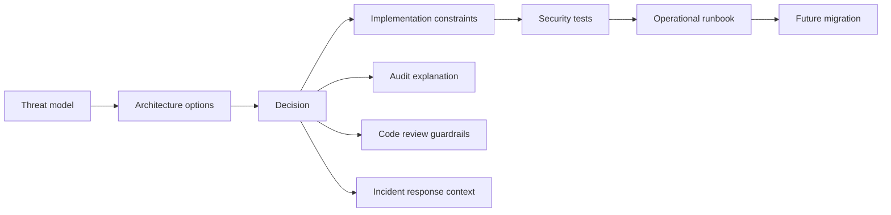
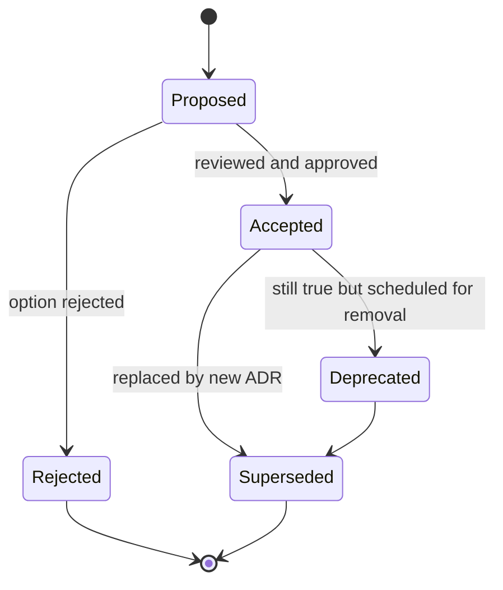
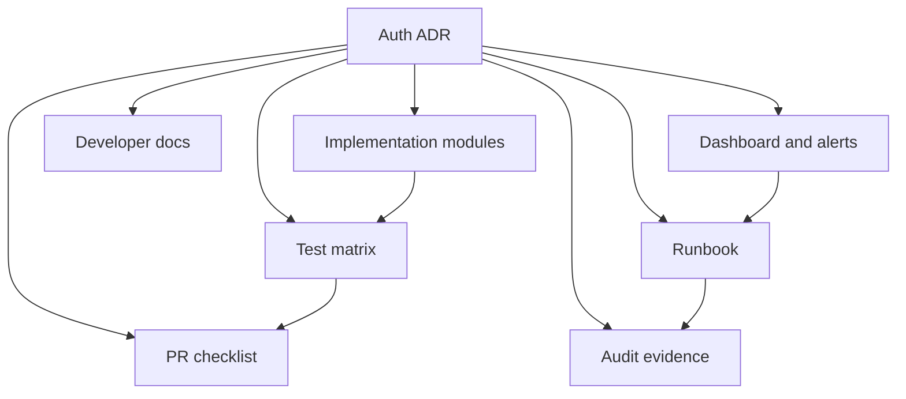

# Part 109 — Auth Architecture Decision Records

Auth decisions rot when they live only in Slack threads, code review comments, vendor setup screens, or the memory of one engineer.

Authentication and authorization architecture is full of decisions that look small when made:

- Should the browser keep access tokens in memory, local storage, or never see them?
- Should the app use a BFF, pure SPA, or SSR-first session model?
- Should route guards run in components, loaders, middleware, or all of them?
- Should UI check roles, permissions, object grants, relationship tuples, or server-projected actions?
- Should tenants be part of session state, URL state, JWT claims, or server-side lookup?
- Should the app return `403` or `404` when a resource exists but the user cannot access it?
- Should refresh token reuse force logout only one device, all sessions, or the whole account?

Those decisions have security consequences, operational consequences, developer-experience consequences, and audit consequences. If they are not written down, the system will slowly drift into local exceptions. One team will add `localStorage` because it is easy. Another will check `user.role === "admin"` because the permission contract was not obvious. A third will cache `/permissions` forever because no one documented invalidation.

An **Auth Architecture Decision Record** is a small, durable artifact that captures a significant auth decision, its context, options, consequences, invariants, rollout plan, and reversal plan.

The goal is not bureaucracy. The goal is to preserve the reasoning behind security-sensitive architecture so future engineers can operate the system without rediscovering the same failure modes.

## Mental model

An ADR is not a design document. A design document explores a solution space. An ADR records a decision after enough analysis has happened.

For auth systems, the ADR is the bridge between:



A good auth ADR answers:

> Given these threats, requirements, and constraints, why did we choose this auth design, what must remain true, and how will we know if it breaks?

That is different from:

> We use Auth0.

or:

> We store token in cookie.

Those are implementation statements. They do not explain the decision.

## Why auth decisions deserve ADRs

Auth architecture is not just feature architecture. Auth decisions influence:

1. **Blast radius** — what happens when a token, cookie, SDK, cache, or policy is compromised.
2. **Revocation latency** — how quickly permission changes take effect.
3. **Incident response** — whether the team can force logout, revoke sessions, rotate keys, and diagnose abuse.
4. **Regulatory defensibility** — whether access decisions are explainable and auditable.
5. **Developer behavior** — whether future code follows the intended boundary or creates bypasses.
6. **Migration cost** — whether changing IdP, session model, or permission model is possible without rewriting the app.

Security-sensitive decisions that are not documented become folklore. Folklore does not survive team growth, incident stress, or audit pressure.

## What qualifies as an auth ADR

Do not create ADRs for every minor implementation detail. Create one when the decision changes a security boundary, a data boundary, a user journey boundary, or an operational boundary.

### Strong ADR candidates

| Decision area | Example decision | Why it matters |
|---|---|---|
| Session transport | Use BFF + HttpOnly cookie instead of browser-stored bearer tokens | Changes token exposure, CSRF/XSS trade-off, SSR compatibility, incident response |
| OAuth/OIDC flow | Use Authorization Code with PKCE; reject Implicit Flow | Changes redirect/callback security and token delivery path |
| Token shape | Use opaque app session IDs; keep provider tokens server-side | Changes revocation model and token leakage blast radius |
| Cookie profile | Use `__Host-` cookies with `Secure`, `HttpOnly`, `SameSite=Lax/Strict` | Changes origin/path/domain security boundary |
| Permission model | Move from RBAC role checks to capability/permission contract | Changes frontend/backend authorization coupling |
| Object-level auth | Require server-projected `allowedActions` for row actions | Changes BOLA/IDOR defense and UI consistency |
| Multi-tenancy | Tenant context must be server-validated per request | Prevents tenant confusion and cross-tenant data exposure |
| Cache strategy | Clear query/router/cache state on logout and tenant switch | Prevents stale data and sensitive data exposure |
| Step-up auth | Require fresh auth for export, privilege changes, destructive actions | Changes assurance-level boundary |
| Impersonation | Support view-only impersonation with audit banner and action allowlist | Changes support/admin risk model |
| Observability | Log typed denial events with correlation ID and redacted subject | Changes supportability and audit evidence |
| Incident response | Support forced logout via session epoch | Changes containment ability during compromise |

### Weak ADR candidates

These are usually better as code comments or small docs:

- Naming a React hook.
- Choosing a UI icon for locked actions.
- Choosing one CSS layout over another.
- Adding one more test fixture.
- Internal refactor that does not change behavior or boundary.

A useful question:

> If this decision is wrong, could it create a security incident, audit gap, major migration, or persistent developer misunderstanding?

If yes, write an ADR.

## Auth ADR lifecycle

ADRs should be lightweight but alive. They should move through states.



Recommended statuses:

- `Proposed` — under review, not yet implementation authority.
- `Accepted` — decision is active and should guide implementation.
- `Rejected` — documented because the rejected option may return later.
- `Deprecated` — still present but intentionally being phased out.
- `Superseded` — replaced by another ADR.

Never silently edit the meaning of an accepted ADR. If the decision changes, create a new ADR and mark the old one superseded.

## Auth ADR repository layout

A simple layout works best.

```txt
/docs
  /adr
    0001-use-bff-http-only-cookie-session.md
    0002-use-authorization-code-pkce.md
    0003-permission-contract-not-role-checks.md
    0004-tenant-context-server-validated.md
    0005-session-epoch-for-forced-logout.md
    README.md
```

The `README.md` should contain:

- ADR index.
- Active auth decisions.
- Superseded decisions.
- ADR template.
- Link from ADR to runbook/checklist/tests.

Example index:

```md
# Auth ADR Index

| ADR | Status | Area | Decision | Supersedes |
|---|---|---|---|---|
| 0001 | Accepted | Session | Use BFF + HttpOnly cookie app session | - |
| 0002 | Accepted | OAuth | Use Authorization Code with PKCE | - |
| 0003 | Accepted | Authorization | Use permission contract instead of role checks | - |
| 0004 | Accepted | Multi-tenancy | Validate tenant context server-side per request | - |
| 0005 | Proposed | Incident response | Introduce session epoch for forced logout | - |
```

## Auth ADR template

This template is adapted for security-sensitive React auth decisions.

```md
# ADR-XXXX: <Decision title>

## Status

Proposed | Accepted | Rejected | Deprecated | Superseded

## Date

YYYY-MM-DD

## Owners

- Engineering owner:
- Security owner:
- Product/domain owner:
- Operations owner:

## Decision

State the decision in one or two paragraphs.

## Context

Explain why this decision is needed now.
Include business, security, operational, and migration context.

## Threat model

List relevant threats:

- XSS
- CSRF
- BOLA/IDOR
- open redirect
- stale privilege
- tenant confusion
- token replay
- session fixation
- audit gap
- provider outage

## Requirements

### Functional requirements

- ...

### Security requirements

- ...

### Operational requirements

- ...

### Regulatory/audit requirements

- ...

## Options considered

### Option A: ...

Pros:

- ...

Cons:

- ...

### Option B: ...

Pros:

- ...

Cons:

- ...

## Decision criteria

| Criterion | Weight | Option A | Option B | Notes |
|---|---:|---:|---:|---|
| Token leakage blast radius | 5 |  |  |  |
| CSRF exposure | 4 |  |  |  |
| Revocation latency | 5 |  |  |  |
| SSR/BFF compatibility | 3 |  |  |  |
| Developer ergonomics | 3 |  |  |  |
| Migration cost | 2 |  |  |  |

## Consequences

### Positive consequences

- ...

### Negative consequences

- ...

### New failure modes

- ...

## Invariants

These must remain true after implementation:

- ...

## Implementation plan

1. ...
2. ...
3. ...

## Rollout plan

- Feature flag / cohort / environment strategy.
- Backward compatibility.
- Monitoring.
- Rollback trigger.

## Rollback/reversal plan

Explain how to undo or supersede the decision.

## Testing requirements

- Unit tests:
- Integration tests:
- E2E tests:
- Security tests:
- Contract tests:

## Observability

Metrics, logs, traces, audit events, alerts.

## Runbooks impacted

- Link to runbook(s).

## References

- OWASP / RFC / provider docs / internal docs.
```

## Decision scoring is a tool, not a replacement for judgment

A scoring matrix can reveal disagreements, but it should not pretend security decisions are purely numeric.

Example for **token storage strategy**:

| Criterion | Weight | localStorage bearer | memory bearer + refresh | BFF + HttpOnly cookie |
|---|---:|---:|---:|---:|
| XSS token theft resistance | 5 | 1 | 3 | 5 |
| CSRF exposure | 4 | 5 | 5 | 3 |
| Server-side revocation | 5 | 2 | 3 | 5 |
| SSR compatibility | 3 | 1 | 2 | 5 |
| API gateway compatibility | 3 | 4 | 4 | 3 |
| Implementation complexity | 2 | 5 | 3 | 2 |
| Incident containment | 5 | 2 | 3 | 5 |

The matrix should trigger discussion:

- Are we over-optimizing ease of implementation?
- Are we accepting XSS blast radius knowingly?
- Are we forcing every frontend engineer to handle refresh logic correctly?
- Do we have the infrastructure to run a BFF reliably?
- What happens during IdP outage?

## Auth-specific ADR invariants

Every auth ADR should include invariants. They are the most important part of the document because they become review and testing rules.

Examples:

### Session invariants

- Access tokens are never stored in `localStorage` or `sessionStorage`.
- Provider refresh tokens never enter the browser runtime.
- Logout clears browser projection state and revokes server session state.
- Session expiry is enforced server-side, not only by React timers.
- Session bootstrap returns a projection, not raw provider tokens.

### Authorization invariants

- Every protected API request performs server-side authorization.
- Frontend permission checks only control exposure and UX.
- Unknown permission state is treated as denied.
- Permission cache is scoped by subject, tenant, policy version, and resource version where applicable.
- Route metadata and backend permission vocabulary must not drift.

### Tenant invariants

- Tenant context is validated server-side for every request.
- Tenant switch clears tenant-scoped caches.
- A user identity is not equivalent to a tenant membership.
- Tenant ID from URL/header/body is never trusted without membership verification.

### Audit invariants

- Denied sensitive actions emit typed audit events.
- Permission changes include actor, subject, target, before/after, reason, and correlation ID.
- Impersonation actions preserve both actor and subject identity.
- Audit logging failure has an explicit fail-open/fail-closed policy.

## ADR example 1 — Use BFF + HttpOnly cookie session

```md
# ADR-0001: Use BFF with HttpOnly cookie app session

## Status

Accepted

## Decision

We will use a Backend-for-Frontend session model for the React application.
The browser receives an opaque app session cookie with `HttpOnly`, `Secure`, and `SameSite` attributes.
OAuth provider access/refresh tokens are stored server-side in the BFF token vault and are never exposed to React runtime code.

## Context

The application handles regulated case data, tenant-scoped resources, file downloads, and privileged administrative workflows.
The previous SPA prototype stored access tokens in browser storage.
This increased the blast radius of XSS and made token revocation and incident response harder.

## Threat model

- XSS may execute JavaScript within the app origin.
- CSRF may target cookie-authenticated mutation endpoints.
- Browser extensions may observe page state.
- Stale tokens may survive role/tenant changes.
- OAuth refresh token compromise requires containment.

## Options considered

### Option A: localStorage bearer token

Pros:

- Simple to implement.
- Works with cross-origin APIs.
- Easy developer debugging.

Cons:

- Token is readable by any successful XSS.
- Logout/revocation is harder.
- Every frontend API path must handle refresh correctly.
- Sensitive credential can be exposed through browser debugging artifacts.

### Option B: in-memory access token with refresh rotation

Pros:

- Access token is not persisted in browser storage.
- Better than localStorage for XSS persistence.
- Works with cross-origin APIs.

Cons:

- Refresh token/session continuity remains complex.
- Multi-tab coordination is error-prone.
- Harder SSR story.
- Browser still handles bearer capability.

### Option C: BFF + HttpOnly cookie app session

Pros:

- Provider tokens are hidden from browser JavaScript.
- Server controls refresh, revocation, downstream authorization, and audit.
- Works well with SSR and route handlers.
- Centralizes CSRF, token refresh, and downstream API policy.

Cons:

- Requires BFF infrastructure.
- Cookie auth needs CSRF defense.
- API calls generally flow through same-origin BFF endpoints.
- Operational outage of BFF affects app access.

## Decision criteria

The decisive criteria were token leakage blast radius, revocation, auditability, SSR compatibility, and incident containment.

## Consequences

Positive:

- React runtime receives only session projection, not raw tokens.
- Refresh token rotation is handled server-side.
- Forced logout is possible through server-side session invalidation.

Negative:

- We must build and operate BFF endpoints.
- CSRF defense becomes mandatory for unsafe methods.
- BFF latency and availability become product concerns.

## Invariants

- Provider access tokens and refresh tokens never enter React runtime.
- React app calls same-origin BFF endpoints for protected operations.
- Unsafe methods require CSRF protection.
- Logout revokes the app session server-side and clears browser projection state.
- `/api/session` returns only safe projection fields.

## Testing requirements

- Assert no provider token appears in HTML, JS, logs, or `/api/session`.
- Test CSRF rejection on unsafe methods.
- Test logout invalidates BFF session server-side.
- Test forced logout through session epoch.
- Test tenant switch clears query/cache state.
```

## ADR example 2 — Use permission contract, not role checks

```md
# ADR-0003: Use permission contract instead of frontend role checks

## Status

Accepted

## Decision

React components and route metadata must use a permission decision contract instead of checking raw roles.
The backend remains the enforcement authority.
The frontend consumes server-projected capabilities such as `allowedActions`, field modes, constraints, and denial reasons.

## Context

The app began with `user.role === "admin"` checks.
That pattern caused drift because roles differ by tenant, workflow state, object ownership, and temporary grants.

## Options considered

### Option A: Continue role checks

Pros:

- Simple.
- Familiar.

Cons:

- Causes role explosion.
- Cannot express object-level grants or workflow constraints.
- Encourages frontend-only authorization mistakes.

### Option B: Permission contract

Pros:

- UI speaks in product actions.
- Works with RBAC, ABAC, ACL, or ReBAC behind the scenes.
- Supports denial reasons and access request workflows.
- Easier to test with golden matrices.

Cons:

- Requires action vocabulary governance.
- Requires contract testing.
- Requires cache invalidation policy.

## Invariants

- Components do not check raw roles for access decisions.
- Components check product actions such as `case.close`, `case.assign`, or `document.export`.
- Backend validates every protected action regardless of UI state.
- Unknown permission state renders denied or loading-safe UI.
- Permission projection includes version/epoch metadata for invalidation.
```

## ADR example 3 — Use signed double-submit CSRF tokens

```md
# ADR-0006: Use signed double-submit CSRF token for cookie-authenticated BFF mutations

## Status

Accepted

## Decision

Cookie-authenticated unsafe BFF requests must include a CSRF token in a custom header.
The CSRF token is generated server-side, signed, and bound to the app session.
The BFF validates the header token against the signed session-bound value for unsafe methods.

## Context

The BFF uses cookies for session continuity.
Cookie authentication introduces CSRF risk for unsafe methods.
SameSite cookies reduce but do not fully replace explicit CSRF protection for sensitive applications.

## Invariants

- `GET`, `HEAD`, and safe methods do not mutate server state.
- `POST`, `PUT`, `PATCH`, and `DELETE` require valid CSRF token.
- Token validation happens before business mutation.
- CORS does not allow arbitrary origins to send credentialed unsafe requests.
- Sensitive operations may require additional step-up authentication.
```

## ADR example 4 — Route loaders perform authentication, server performs authorization

```md
# ADR-0007: Use route loaders for authentication gate and server-side authorization for resource access

## Status

Accepted

## Decision

React Router route loaders perform early authentication and safe session projection before render.
Resource authorization remains server-side at API/BFF/resource boundary.
Route metadata may declare required product capabilities for UI exposure, but it does not replace backend checks.

## Context

Component-only protected routes caused data flash and late redirects.
Loader-level auth prevents sensitive UI/data from rendering before session state is known.

## Invariants

- Protected routes must not render before session bootstrap resolves.
- Loaders may redirect anonymous users to login.
- Loaders must not fetch protected resource data before authentication is known.
- Resource APIs must still authorize every request.
- Route metadata and backend permission vocabulary are contract-tested.
```

## ADR example 5 — Use session epoch for forced logout

```md
# ADR-0010: Use session epoch for forced logout and stale privilege containment

## Status

Accepted

## Decision

Each user/session has a server-controlled session epoch.
The React app receives the current epoch in session projection.
When the server increments the epoch due to forced logout, password reset, token leak, role revocation, or incident containment, existing sessions become invalid and the frontend must clear projection state.

## Context

We need a way to invalidate sessions across devices and tabs without relying only on client-side logout.

## Invariants

- Server compares request session epoch with authoritative user/session epoch.
- Epoch mismatch invalidates the request.
- Client treats epoch mismatch as forced logout, not generic network failure.
- Query/cache/router state is cleared after forced logout.
- Forced logout emits audit and security telemetry.
```

## ADR quality checklist

Before accepting an auth ADR, check:

### Decision clarity

- Is the decision stated plainly?
- Is the alternative explicitly rejected?
- Does the ADR explain why now?
- Is the scope clear?

### Security clarity

- Does it name the threat model?
- Does it identify new failure modes?
- Does it state invariants?
- Does it define what must never happen?

### Operational clarity

- Does it define observability?
- Does it link to runbooks?
- Does it define rollback?
- Does it identify incident response impact?

### Implementation clarity

- Does it define affected modules?
- Does it define migration steps?
- Does it define test requirements?
- Does it define feature flag or rollout plan?

### Audit clarity

- Would an auditor understand the rationale?
- Does it define evidence to retain?
- Does it identify logs/audit events affected?
- Does it preserve actor/subject/tenant semantics?

## ADR anti-patterns

### Anti-pattern 1 — Decision without alternatives

Bad:

```md
We will use JWT because it is standard.
```

Better:

```md
We considered JWT access tokens, opaque tokens with introspection, and server-side app sessions.
We chose opaque app sessions because revocation latency and incident containment matter more than stateless validation in this application.
```

### Anti-pattern 2 — Decision without threat model

Bad:

```md
We store tokens in browser storage for simplicity.
```

Better:

```md
We explicitly accept that XSS can read tokens from browser storage.
This is rejected for regulated environments; browser storage is allowed only for low-risk internal tools with short-lived tokens and no refresh token persistence.
```

### Anti-pattern 3 — ADR as vendor justification

Bad:

```md
We use Provider X because it is popular.
```

Better:

```md
We use Provider X because it supports OIDC Authorization Code with PKCE, organization-scoped SSO, SCIM provisioning, MFA policy, signed webhooks, and tenant discovery that matches our enterprise SaaS requirements.
```

### Anti-pattern 4 — No reversal plan

Bad:

```md
We will migrate to BFF.
```

Better:

```md
If BFF latency or outage rate exceeds threshold, we can temporarily route read-only calls through existing API gateway while keeping provider refresh tokens server-side. Full rollback requires keeping the legacy token exchange endpoint for 30 days.
```

### Anti-pattern 5 — Hiding business authorization in frontend text

Bad:

```md
Disable button when case is closed.
```

Better:

```md
Case closure is enforced server-side by workflow policy. The frontend receives `allowedActions.close = false` with reason `workflow_state_denied` to avoid exposing a misleading action.
```

## ADR-to-code traceability

A strong auth ADR can be traced to code, tests, dashboards, and runbooks.



Example traceability table:

| ADR invariant | Code location | Test | Dashboard | Runbook |
|---|---|---|---|---|
| Tokens never enter browser | `bff/session.ts`, `api/session.ts` | `no-token-projection.test.ts` | token leak sentinel | token leak runbook |
| Unsafe methods require CSRF | `csrf-middleware.ts` | `csrf.contract.test.ts` | CSRF rejection rate | CSRF incident runbook |
| Unknown permission denies | `permission-store.ts` | `useCan.test.tsx` | frontend denied unknown count | permission outage runbook |
| Tenant switch clears cache | `tenant-switch.ts` | `tenant-cache.e2e.ts` | tenant mismatch count | cross-tenant leak runbook |

## TypeScript schema for ADR metadata

You can lint ADR metadata so decision logs remain searchable.

```ts
export type AdrStatus =
  | "proposed"
  | "accepted"
  | "rejected"
  | "deprecated"
  | "superseded";

export type AuthDecisionArea =
  | "session"
  | "oauth-oidc"
  | "token"
  | "cookie"
  | "csrf"
  | "authorization"
  | "permission-contract"
  | "tenant"
  | "cache"
  | "observability"
  | "incident-response"
  | "privacy"
  | "provider";

export interface AuthAdrMetadata {
  id: string;
  title: string;
  status: AdrStatus;
  date: string;
  owners: string[];
  areas: AuthDecisionArea[];
  supersedes?: string[];
  supersededBy?: string;
  affectedServices: string[];
  affectedPackages: string[];
  relatedRunbooks: string[];
  relatedTests: string[];
  invariants: string[];
}
```

Then scan ADRs in CI:

```ts
function validateAdr(metadata: AuthAdrMetadata) {
  if (metadata.status === "accepted" && metadata.invariants.length === 0) {
    throw new Error(`${metadata.id} has no invariants`);
  }

  if (metadata.status === "accepted" && metadata.relatedTests.length === 0) {
    throw new Error(`${metadata.id} has no related tests`);
  }

  if (metadata.areas.includes("incident-response") && metadata.relatedRunbooks.length === 0) {
    throw new Error(`${metadata.id} impacts incident response but links no runbook`);
  }
}
```

## PR checklist integration

Every PR that changes auth boundaries should link an ADR.

```md
## Auth impact

- [ ] No auth impact.
- [ ] Changes authentication/session behavior. ADR linked: ___
- [ ] Changes authorization/permission behavior. ADR linked: ___
- [ ] Changes tenant context/cache behavior. ADR linked: ___
- [ ] Changes audit/logging/observability. ADR linked: ___

## Required checks

- [ ] Existing ADR covers this change.
- [ ] New ADR added or old ADR superseded.
- [ ] Invariants updated.
- [ ] Tests updated.
- [ ] Runbook updated if operational behavior changed.
```

The checklist prevents silent boundary changes.

## Auth ADR review meeting format

Keep meetings short and decision-oriented.

Recommended agenda:

1. Decision statement.
2. Threat model.
3. Options and rejected alternatives.
4. Invariants.
5. Operational impact.
6. Migration/rollback.
7. Test and observability obligations.
8. Approval or follow-up.

Questions to ask:

- What is the worst plausible incident if this decision is wrong?
- Which attacker capability are we assuming?
- What data becomes reachable in the browser?
- What credential becomes reachable in the browser?
- What does logout revoke?
- How quickly can we revoke stale privilege?
- What happens during provider outage?
- How will support debug failures without seeing secrets?
- What does audit need to prove?

## ADRs for regulated case management

For complex case management platforms, auth ADRs should include workflow and lifecycle semantics.

Example decision areas:

- Who can view a case before assignment?
- Who can assign a case across teams?
- Who can override escalation?
- Who can reopen a closed case?
- Who can view evidence attachments?
- Who can export case history?
- Who can approve enforcement action?
- Who can impersonate a case officer?
- Which actions require step-up authentication?
- Which denials must be auditable?

The ADR should capture business rules as security boundaries, not just UI features.

Example invariant:

```txt
A user who can view a case summary is not automatically allowed to view evidence attachments, export documents, edit enforcement recommendations, or approve final action.
```

That one sentence prevents a common authorization shortcut.

## ADRs and threat modelling

Auth ADRs should not replace threat models. They should consume threat models.

A useful lightweight threat section:

| Threat | Relevant? | Mitigation in decision | Residual risk |
|---|---|---|---|
| XSS token theft | Yes | BFF hides provider tokens; CSP; no localStorage tokens | XSS can still perform session-riding actions |
| CSRF | Yes | SameSite + signed CSRF header for unsafe methods | XSS can bypass CSRF token |
| BOLA/IDOR | Yes | Server-side object authorization; no trust in route params | Policy bug can still expose resource |
| Tenant confusion | Yes | Server validates tenant membership per request | Misconfigured tenant mapping still possible |
| Stale privilege | Yes | permission epoch; short cache TTL; server check | UI may briefly show stale action |
| Provider outage | Yes | degraded session bootstrap; cached safe profile | New login unavailable during outage |

## ADRs and operational readiness

An accepted auth ADR should produce operational artifacts.

For example, if ADR says:

> Use refresh token rotation.

Then operational artifacts should include:

- Metric: refresh success rate.
- Metric: refresh reuse detection count.
- Alert: refresh error spike.
- Runbook: refresh storm.
- Runbook: suspected refresh token replay.
- Test: concurrent refresh single-flight.
- Test: refresh token reuse forces session revocation.
- Dashboard: refresh latency and error class.

Without those, the ADR is incomplete.

## Auth ADR reference set

For this series, a mature React auth platform should eventually have ADRs covering at least:

1. Session architecture.
2. OAuth/OIDC flow.
3. Token storage and token purpose.
4. Cookie profile and CSRF strategy.
5. Session bootstrap contract.
6. Logout and forced logout.
7. React Router auth boundary.
8. SSR/BFF/RSC boundary.
9. Permission model.
10. Permission projection contract.
11. Tenant context model.
12. Cache invalidation policy.
13. Step-up authentication policy.
14. Impersonation policy.
15. Audit event model.
16. Security headers and CSP baseline.
17. Provider integration and exit strategy.
18. Incident response authority.
19. Privacy/PII projection policy.
20. Testing/CI gates.

## Final model

Auth ADRs are not documentation theater. They are a control plane for engineering decisions.

A good auth ADR says:

- what was decided,
- why it was decided,
- what threats shaped it,
- what alternatives were rejected,
- what must remain true,
- how it will be tested,
- how it will be observed,
- how it can be reversed,
- and what runbooks depend on it.

In weak teams, auth decisions are tribal knowledge.

In strong teams, auth decisions are durable engineering artifacts.

## References

- OWASP Application Security Verification Standard: https://owasp.org/www-project-application-security-verification-standard/
- OWASP Authorization Cheat Sheet: https://cheatsheetseries.owasp.org/cheatsheets/Authorization_Cheat_Sheet.html
- OWASP Session Management Cheat Sheet: https://cheatsheetseries.owasp.org/cheatsheets/Session_Management_Cheat_Sheet.html
- OWASP Cross-Site Request Forgery Prevention Cheat Sheet: https://cheatsheetseries.owasp.org/cheatsheets/Cross-Site_Request_Forgery_Prevention_Cheat_Sheet.html
- RFC 9700 — OAuth 2.0 Security Best Current Practice: https://www.rfc-editor.org/rfc/rfc9700.html
- MADR — Markdown Architectural Decision Records: https://adr.github.io/madr/
- Architecture Decision Record project: https://adr.github.io/
- Google SRE Workbook — Incident Response: https://sre.google/workbook/incident-response/
