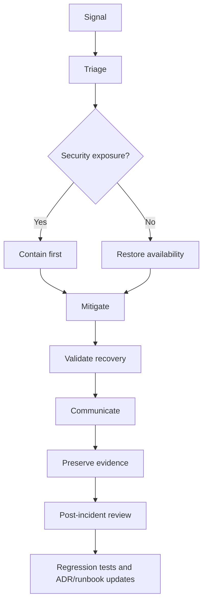
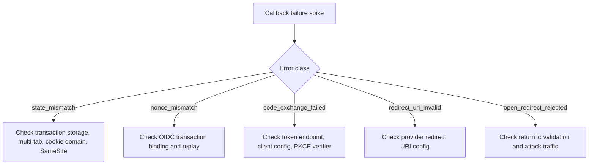

# Part 110 — Auth Runbooks

Auth incidents are bad because they combine product outage, security risk, user confusion, and audit pressure.

When login breaks, users cannot enter the product. When authorization breaks, users may enter places they should not. When session refresh breaks, the app can create a traffic storm. When tenant isolation breaks, the incident becomes a data exposure. When audit logging breaks, you may lose the evidence needed to understand what happened.

A runbook is the operating manual for those moments.

It does not replace engineering judgment. It reduces cognitive load under pressure.

## Mental model

An auth runbook answers:

> When this class of auth failure happens, how do we detect it, classify it, contain it, mitigate it, validate recovery, communicate clearly, and prevent recurrence?

Good runbooks are concrete. They name metrics, dashboards, commands, owners, rollback levers, and decision points.

Bad runbooks say:

> Investigate the issue.

That is not a runbook. That is a wish.

## Auth incident lifecycle



The key distinction:

- **Availability-first incident**: login outage, IdP outage, session bootstrap failure.
- **Security-first incident**: cross-tenant exposure, token leak, permission bypass, compromised SDK.

In availability incidents, you usually restore service quickly.

In security incidents, you contain first even if that means worsening availability temporarily.

## Severity model for auth incidents

Use a severity model that reflects both availability and exposure.

| Severity | Example | Primary objective |
|---|---|---|
| SEV-1 Security | Cross-tenant data exposure, permission bypass for sensitive actions, leaked signing key | Contain exposure immediately |
| SEV-1 Availability | Majority of users cannot login or use sessions | Restore access quickly |
| SEV-2 Security | Limited privilege escalation, stale permission after role revoke | Contain and assess blast radius |
| SEV-2 Availability | High refresh failure rate, one IdP connection broken | Restore affected cohort |
| SEV-3 | Elevated 403 due to config drift, non-sensitive audit delay | Fix and monitor |
| SEV-4 | Minor UX regression in denial reason or access request state | Normal fix path |

Severity is not only number of users. A single cross-tenant exposure can be more severe than a large login slowdown.

## Incident roles

For serious auth incidents, assign roles explicitly.

| Role | Responsibility |
|---|---|
| Incident commander | Coordinates response, decisions, timeline |
| Technical lead | Owns diagnosis and mitigation path |
| Security lead | Assesses exposure, containment, evidence |
| Comms lead | Internal/external updates |
| Scribe | Timeline, decisions, commands, affected systems |
| Customer/support liaison | Support guidance and affected user handling |
| Legal/privacy liaison | Required for possible data exposure |

Do not let one engineer do everything during a high-severity auth incident.

## Runbook anatomy

Every auth runbook should have the same shape:

```md
# Runbook: <incident class>

## Symptoms

## Severity triggers

## Dashboards and queries

## Immediate containment

## Diagnosis steps

## Mitigation options

## Validation

## Communication notes

## Evidence to preserve

## Follow-up actions

## Related ADRs

## Related tests
```

Consistency matters. During incidents, people should not have to learn the document structure.

## Core observability signals

A React auth platform should expose at least these signals:

| Signal | Why it matters |
|---|---|
| login start/success/failure rate | Login outage or provider issue |
| OAuth callback error class | Bad callback, state mismatch, provider error |
| session bootstrap success/failure | App entry health |
| refresh success/failure/reuse detection | Token/session continuity and replay detection |
| `401` rate by route/API | Expired/revoked/invalid session spike |
| `403` rate by action/resource | Permission drift or attack attempts |
| redirect loop count | Auth state machine bug |
| tenant mismatch count | Tenant confusion or attack attempt |
| permission version mismatch | Stale permission cache |
| CSRF rejection count | Attack attempt or broken frontend token plumbing |
| forced logout count | Incident containment or admin action |
| audit write failure count | Loss of evidence risk |

## Runbook 1 — Identity provider outage

### Symptoms

- New login attempts fail.
- OAuth callback returns provider error.
- SSO users report being unable to authenticate.
- Existing sessions may continue if app session is still valid.
- Refresh may fail if refresh depends on provider availability.

### Severity triggers

- SEV-1 Availability if most users cannot login.
- SEV-2 if only one tenant/connection/provider region is affected.
- SEV-1 Security if provider compromise is suspected.

### Immediate actions

1. Confirm whether existing app sessions still work.
2. Confirm whether failure affects login only, refresh only, or both.
3. Disable repeated auto-login loops.
4. Show a safe degraded login message.
5. Preserve provider error payloads with secrets redacted.
6. Check provider status page and internal health checks.

### Diagnosis

Ask:

- Is DNS/TLS failing?
- Is the provider authorization endpoint failing?
- Is the token endpoint failing?
- Is JWK discovery failing?
- Is one enterprise connection failing?
- Are callbacks failing due to redirect URI mismatch?
- Did we deploy IdP config changes?
- Did certificate rotation occur?

### Mitigation

Options:

- Keep existing sessions alive if safe.
- Disable forced reauth unless security requires it.
- Temporarily pause non-critical step-up prompts.
- Route affected tenants to fallback IdP only if configured and tested.
- Roll back recent IdP configuration changes.
- Communicate login degradation clearly.

### Validate recovery

- New login succeeds.
- Callback state/nonce validation succeeds.
- Session bootstrap succeeds.
- Refresh succeeds.
- No redirect loop after login.
- Affected tenant/connection tested directly.

### Evidence

- Provider status timeline.
- Callback error classes.
- Correlation IDs.
- Deployment/config changes.
- Affected tenants/users count.

## Runbook 2 — OAuth callback failure spike

### Symptoms

- Login redirects back with error.
- Users see callback error screen.
- Metrics show state mismatch, nonce mismatch, code exchange failure, or invalid redirect URI.

### Immediate containment

1. Stop automatic retry loops.
2. Preserve failed transaction metadata without secrets.
3. Roll back callback route or provider config if recently changed.
4. Disable affected login entrypoint if it creates loops.

### Diagnosis tree



### Validation

- Login works from clean browser.
- Login works with multiple tabs.
- Login works after session expiry.
- Login works for tenant-specific IdP.
- Malicious `returnTo` remains rejected.

## Runbook 3 — Refresh storm

### Symptoms

- Sudden spike in refresh endpoint traffic.
- Many simultaneous refresh attempts per user/session.
- Increased `401` followed by refresh retry.
- BFF or IdP token endpoint saturation.
- Users experience repeated logout or loading spinner.

### Likely causes

- Access token expiry threshold too aggressive.
- Missing single-flight refresh.
- Multi-tab refresh lock broken.
- Token endpoint latency causing retry overlap.
- Reactive refresh retry loop after persistent `401`.
- Clock skew bug.
- Bad deploy changing expiry interpretation.

### Immediate containment

1. Disable proactive refresh if feature-flagged and switch to reactive refresh with backoff.
2. Enforce server-side per-session refresh lock.
3. Add temporary rate limit per session/user.
4. Stop retrying refresh after terminal errors.
5. Roll back recent auth client/API client changes.

### Diagnosis

Check:

- refresh requests per session per minute,
- refresh error classes,
- token endpoint latency,
- client version distribution,
- tab count patterns,
- clock skew metrics,
- `expiresAt` parsing changes,
- retry count per request.

### Validation

- Refresh rate returns to baseline.
- Login/session bootstrap success remains stable.
- `401` rate returns to baseline.
- No increase in forced logout.
- IdP token endpoint latency recovers.

## Runbook 4 — `401` spike

### Symptoms

- API responses show increased `401 Unauthorized`.
- Session bootstrap fails.
- Users are logged out unexpectedly.
- API client enters refresh/retry path.

### Diagnosis questions

- Are cookies missing from requests?
- Did cookie domain/path/SameSite change?
- Did CORS credentials behavior change?
- Did signing key/JWK change?
- Did server session store become unavailable?
- Did session epoch increment unexpectedly?
- Is token expiry parsing wrong?
- Is the spike limited to one browser, app version, tenant, or region?

### Containment

- Roll back cookie/session middleware changes.
- Disable broken client version if possible.
- Pause forced logout jobs unless security-related.
- If signing keys changed incorrectly, restore previous valid key set while preserving rotation plan.

### Validation

- `/api/session` succeeds.
- Existing session remains valid.
- New login succeeds.
- Refresh succeeds.
- Logout still revokes session.

## Runbook 5 — `403` spike

### Symptoms

- Authenticated users suddenly cannot perform actions.
- UI shows many disabled actions.
- Server denies previously allowed operations.
- Access request volume increases.

### Likely causes

- Bad permission deploy.
- Policy engine outage/degraded mode.
- Role/group sync issue.
- Tenant membership sync delay.
- Permission cache invalidation bug.
- Resource state transition changed allowed actions.

### Immediate containment

1. Determine if denials are false positives or correct security denials.
2. Roll back recent policy/role mapping changes if false positives.
3. Avoid broad admin override unless approved by security/product owner.
4. Preserve decision logs and policy version.

### Diagnosis

Compare:

- old policy version vs new policy version,
- role/group assignments,
- tenant membership data,
- permission projection payload,
- backend decision trace,
- route metadata required permission,
- resource workflow state.

### Validation

- Golden permission matrix passes.
- Representative users regain expected access.
- Deny-by-default remains intact for unauthorized users.
- No opposite regression: unauthorized users gaining access.

## Runbook 6 — Bad permission deploy / privilege escalation

### Symptoms

- Users can access actions/resources they should not.
- Audit logs show unusual access.
- Support reports unexpected admin UI visibility.
- Security test/regression gate failure after deploy.

### Severity

Treat as SEV-1 Security if sensitive data/action exposure is possible.

### Immediate containment

1. Freeze permission-related deploys.
2. Roll back policy/config/code to known-good version.
3. If rollback is not enough, force deny for affected action/resource class.
4. Invalidate permission caches.
5. Consider forced logout if stale sessions carry elevated privilege.
6. Preserve logs, audit events, policy bundle, and affected user list.

### Blast radius analysis

Determine:

- affected tenants,
- affected users/roles/groups,
- affected resources,
- affected actions,
- time window,
- whether data was viewed/exported/mutated,
- whether audit trail is complete.

### Recovery validation

- Unauthorized persona receives `403`.
- Authorized persona still succeeds.
- UI exposure matches backend permission projection.
- Query/cache state cleared.
- Audit evidence retained.

### Follow-up

- Add regression tests for exact bypass.
- Add CI gate for policy diff.
- Update ADR if boundary assumption changed.
- Update access review if grants were wrong.

## Runbook 7 — Cross-tenant exposure suspected

### Symptoms

- User sees resource from another tenant.
- Tenant switcher shows wrong data.
- API returns object with mismatched tenant ID.
- Query cache leaks previous tenant data.
- Support screenshot shows tenant inconsistency.

### Severity

Default to SEV-1 Security until disproven.

### Immediate containment

1. Disable affected endpoint/feature if exposure is active.
2. Invalidate tenant-scoped caches.
3. Force logout affected tenant/user cohorts if needed.
4. Freeze tenant-related deploys.
5. Preserve logs, cache keys, request IDs, screenshots, audit events.
6. Notify privacy/legal/security according to internal policy.

### Diagnosis

Check:

- backend tenant authorization checks,
- resource query filters,
- cache key includes tenant ID,
- CDN/shared cache headers,
- service worker cache,
- React Query keys,
- route params vs session tenant,
- BFF tenant context validation,
- server-side rendered cache.

### Validation

- Cross-tenant request returns `403` or safe `404`.
- Switching tenants clears old tenant data.
- Direct object ID access across tenants fails.
- Cached UI does not show previous tenant.
- Audit event captures denial and tenant mismatch.

## Runbook 8 — Token leak suspected

### Symptoms

- Token appears in logs, analytics, error reports, screenshots, URL, local storage, or browser devtools artifact.
- Unusual token reuse detected.
- Provider reports compromised credential.
- Refresh token reuse detection fires.

### Severity

- SEV-1 Security if provider refresh token/signing key leaked.
- SEV-2 Security if short-lived access token leaked without evidence of abuse.

### Immediate containment

1. Stop the leakage path.
2. Revoke affected tokens/sessions.
3. Rotate secrets/keys if needed.
4. Remove token from logs/analytics if possible.
5. Force logout affected sessions if necessary.
6. Preserve evidence before deletion where policy allows.

### Diagnosis

Find:

- token type: access, refresh, ID token, app session, signed URL, CSRF token,
- token audience and scope,
- expiry,
- storage/leak channel,
- affected users/tenants,
- evidence of use after leak,
- whether refresh token family was reused.

### Validation

- Leaked token no longer works.
- Logs no longer contain token-like values.
- Secret scanner catches recurrence.
- Regression test prevents projection/logging of token.

## Runbook 9 — JWT signing key/JWK incident

### Symptoms

- Token validation fails for many users.
- JWK endpoint returns unexpected keys.
- Tokens signed by unknown key appear.
- Key rotation deploy failed.
- Provider key compromise notification.

### Immediate containment

1. Determine if this is validation outage or key compromise.
2. If compromise suspected, revoke trust in affected key.
3. Rotate keys according to provider/application procedure.
4. Force logout sessions if token trust cannot be established.
5. Preserve suspicious tokens and validation logs securely.

### Validation

- New tokens validate.
- Old compromised tokens fail.
- JWK cache refresh behavior works.
- No stale edge/server cache trusts removed key.
- Session bootstrap stable.

## Runbook 10 — CSRF rejection spike

### Symptoms

- Unsafe methods fail with CSRF error.
- Users can view pages but cannot submit forms.
- CSRF rejection metric spikes after deploy.

### Diagnosis

Check:

- CSRF cookie/header name mismatch,
- token endpoint not issuing token,
- frontend not attaching header,
- SameSite/cookie path/domain issue,
- CORS preflight behavior,
- cached HTML contains stale CSRF bootstrap,
- service worker serving old app shell.

### Containment

- Roll back CSRF plumbing change.
- Do not disable CSRF globally for authenticated unsafe methods.
- If emergency bypass is approved, scope it narrowly by route/tenant/time and add compensating monitoring.

### Validation

- Legitimate unsafe requests succeed.
- Cross-site unsafe request without token fails.
- Token rotation works after login/logout.

## Runbook 11 — XSS suspected in authenticated app

### Symptoms

- CSP violation reports spike.
- User reports unexpected UI/action.
- Suspicious script source appears.
- Token/session abuse follows page visit.
- Third-party SDK compromise suspected.

### Immediate containment

1. Disable affected feature or route.
2. Tighten CSP if possible.
3. Remove/rollback suspicious dependency or content path.
4. Force logout affected users if session abuse possible.
5. Revoke tokens/sessions if exposed.
6. Preserve payload, CSP reports, request logs, audit events.

### Diagnosis

Check:

- `dangerouslySetInnerHTML`, markdown/rich text renderer,
- third-party scripts,
- compromised dependency,
- user-generated content,
- unsafe URL rendering,
- source map exposure,
- CSP bypass,
- sanitizer version/config.

### Validation

- Payload no longer executes.
- CSP report rate normalizes.
- Regression test covers payload.
- Dependency/version locked or patched.

## Runbook 12 — Cookie scope/SameSite bug

### Symptoms

- Users randomly appear logged out.
- Login works in one browser but not another.
- CSRF token/session cookie missing.
- Cross-subdomain auth broken.
- OAuth callback loses transaction state.

### Diagnosis

Check:

- `Domain`, `Path`, `Secure`, `HttpOnly`, `SameSite`, `Max-Age`, `Expires`,
- whether app uses `__Host-` prefix correctly,
- HTTP vs HTTPS environment,
- reverse proxy header handling,
- callback domain mismatch,
- third-party cookie restrictions,
- iframe/embedded flow behavior.

### Validation

- Cookie appears only on intended host/path.
- Cookie is sent on intended same-site requests.
- Unsafe cross-site request remains protected.
- Callback transaction survives expected redirect.
- Logout clears cookie correctly.

## Runbook 13 — Cache leak after logout or tenant switch

### Symptoms

- User logs out and sees previous sensitive data via back button.
- Tenant switch shows old tenant data.
- Shared device shows stale authenticated UI.
- CDN serves authenticated content incorrectly.
- Service worker cache returns protected response.

### Immediate containment

1. Disable affected cache layer if possible.
2. Purge CDN cache for affected routes.
3. Invalidate query/cache state on client.
4. Deploy `Cache-Control: no-store` for sensitive endpoints.
5. Consider `Clear-Site-Data` on logout for affected origin.

### Diagnosis

Check:

- HTTP cache headers,
- CDN cache key and `Vary`,
- service worker route matching,
- React Query persisted cache,
- SSR/RSC cache boundaries,
- browser bfcache behavior,
- tenant/session in query keys.

### Validation

- Logout clears protected UI/data.
- Back button does not reveal sensitive data.
- Tenant switch does not show previous tenant rows.
- CDN no longer caches authenticated response.

## Runbook 14 — Auth provider webhook lag or provisioning drift

### Symptoms

- User removed from group but still has access.
- New enterprise user cannot access tenant.
- Role/group mapping delayed.
- SCIM or webhook delivery errors.

### Containment

- Force membership sync for affected tenant.
- Lower permission projection TTL temporarily.
- Invalidate permission/session caches.
- For high-risk removals, force logout user sessions.

### Diagnosis

Check:

- provider webhook delivery,
- signature validation,
- retry/dead-letter queue,
- group mapping transform,
- tenant membership table,
- permission cache version,
- event ordering.

### Validation

- Removed user denied.
- Added user granted expected access.
- Audit event records membership change.
- Cache invalidation event reached frontend/backend.

## Runbook 15 — Audit pipeline outage

### Symptoms

- Audit write errors increase.
- Security events missing from audit viewer.
- Denial/action logs present but audit store delayed.

### Severity

Depends on affected action class.

- SEV-1/2 if sensitive operations continue without audit evidence.
- SEV-3 if low-risk events are delayed but durably queued.

### Decision point: fail-open or fail-closed?

This must be pre-decided in ADR/policy.

| Action class | Audit unavailable behavior |
|---|---|
| Login success/failure | Usually queue/fail-open with fallback logs |
| View low-risk data | Queue/fail-open |
| Export sensitive data | Fail-closed or require explicit emergency approval |
| Privilege change | Fail-closed |
| Impersonation | Fail-closed |
| Enforcement approval | Fail-closed |

### Mitigation

- Route audit events to fallback queue.
- Disable sensitive audited actions if durability cannot be guaranteed.
- Preserve application logs with correlation IDs.
- Backfill audit events after recovery if possible.

### Validation

- Audit writes recover.
- Queued events drain.
- No sensitive action occurred without trace.
- Audit viewer shows correct timeline.

## Runbook 16 — Forced logout campaign

Forced logout is both a mitigation and a user-impacting event.

### Use cases

- token leak,
- credential compromise,
- password reset,
- signing key compromise,
- stale privilege risk,
- tenant exposure containment,
- incident-wide session invalidation.

### Execution steps

1. Define scope: user, tenant, role, provider connection, all sessions.
2. Record reason and approver.
3. Increment session epoch or revoke sessions server-side.
4. Broadcast logout/epoch invalidation where applicable.
5. Clear refresh token families/app sessions.
6. Monitor re-login success and support volume.
7. Preserve audit event for each forced logout action.

### Validation

- Affected sessions fail on next request.
- Unaffected sessions remain valid.
- Client clears query/router/projection cache.
- User receives safe explanation.
- Re-login path works.

## Runbook 17 — Open redirect exploit attempt

### Symptoms

- Many login attempts with suspicious `returnTo` or redirect target.
- Redirect validation rejects external URLs.
- Phishing report mentions app login URL.

### Immediate actions

1. Confirm validation rejects external/ambiguous URLs.
2. Block known malicious redirect patterns at edge/WAF if needed.
3. Preserve request samples and source IP/user agent.
4. Check whether any accepted redirect was unsafe.

### Diagnosis

Check:

- URL canonicalization,
- scheme-relative URLs,
- encoded URLs,
- backslash handling,
- nested redirect parameters,
- tenant subdomain allowlist,
- OAuth callback `state` binding.

### Validation

- Malicious redirect samples are rejected.
- Legitimate internal return paths still work.
- Login flow does not expose tokens/codes to attacker URL.

## Runbook 18 — WebSocket/SSE auth failure

### Symptoms

- Users see stale realtime data.
- WebSocket reconnect loops.
- Subscription denied unexpectedly.
- User receives events for wrong tenant/resource.

### Severity

- SEV-1 Security if cross-tenant/resource event leak occurs.
- SEV-2 Availability if realtime channel unavailable but polling fallback works.

### Diagnosis

Check:

- handshake auth,
- channel subscription authorization,
- tenant/resource scoping,
- session expiry handling,
- permission revocation disconnect,
- reconnect backoff,
- server event filtering,
- cache/event replay.

### Validation

- Unauthorized channel subscription denied.
- Revoked permission disconnects or stops event delivery.
- Tenant switch closes old connection.
- Reconnect does not storm.

## Runbook 19 — Access request workflow stuck

### Symptoms

- Users cannot request access.
- Approvals do not grant permission.
- Temporary grants do not expire.
- Duplicate requests flood approvers.

### Diagnosis

Check:

- request target precision,
- approval routing,
- separation-of-duties rule,
- grant creation,
- permission cache invalidation,
- grant expiry job,
- audit events,
- notification/webhook delivery.

### Mitigation

- Requeue stuck approvals.
- Manually revoke expired temporary grants.
- Temporarily disable duplicate request creation.
- Backfill audit events if grant events were missed.

### Validation

- Approved request grants expected action only.
- Denied request grants nothing.
- Temporary grant expires.
- Permission projection updates.

## Runbook 20 — Permission engine degraded/outage

### Symptoms

- Permission checks time out.
- UI shows unknown/denied actions.
- Backend returns permission service unavailable.
- Policy decision latency increases.

### Decision point

Predefine degradation behavior:

| Action class | Permission service unavailable |
|---|---|
| Public/anonymous content | Continue if no auth required |
| Authenticated low-risk read | Depends on cached server-side decision policy |
| Sensitive read | Fail-closed |
| Mutation | Fail-closed |
| Admin/privilege change | Fail-closed |
| Export | Fail-closed |

### Immediate containment

- Fail closed for sensitive actions.
- Disable UI actions with `permission_unknown` reason.
- Restore policy service or switch to last-known-good policy only if designed and approved.
- Monitor user impact.

### Validation

- Unauthorized access is not granted during outage.
- Recovery restores expected permissions.
- Cached decisions do not exceed allowed TTL.
- Stale privilege is invalidated.

## Communication templates

### Login outage internal update

```txt
We are investigating an authentication issue affecting login for <scope>.
Existing sessions are <working/not working/unknown>.
Current impact: <impact>.
Mitigation in progress: <mitigation>.
Next update: <time/cadence>.
```

### Permission incident internal update

```txt
We are investigating a potential authorization issue involving <action/resource/scope>.
We have <contained/not yet contained> active exposure.
Current containment: <rollback/feature disabled/session revoked>.
Security/legal/privacy have been engaged: <yes/no>.
Evidence preservation is active.
```

### User-facing safe denial text

```txt
You do not currently have access to this action.
Your session is still active, but this operation requires additional permission.
Contact your administrator or request access if you believe this is unexpected.
```

Avoid exposing internal policy names, role names, object existence, or tenant identifiers in public-facing error text unless the product explicitly allows it.

## Evidence preservation checklist

For auth incidents, preserve:

- deployment timeline,
- feature flag changes,
- ADRs in force,
- policy versions,
- permission matrices,
- IdP configuration changes,
- affected tenants/users/resources,
- server logs with correlation IDs,
- frontend telemetry,
- audit events,
- token/session revocation logs,
- cache/CDN invalidation actions,
- screenshots or support reports,
- commands executed during incident,
- communication timeline.

Evidence should be redacted and access-controlled. Do not copy raw tokens, session IDs, passwords, or sensitive PII into general incident channels.

## Post-incident review template

```md
# Auth Incident Review: <title>

## Summary

## Severity

## Timeline

## Impact

- Users:
- Tenants:
- Resources:
- Actions:
- Data exposure:

## Detection

How was it detected?
Could it have been detected earlier?

## Root cause

## Contributing factors

## What worked

## What did not work

## Containment actions

## Recovery validation

## Evidence retained

## User/customer communication

## Follow-up actions

| Action | Owner | Due date | Tracking link |
|---|---|---|---|

## Tests added

## ADRs updated

## Runbooks updated
```

## Runbook testing

Runbooks must be tested. Untested runbooks are assumptions.

Recommended exercises:

| Exercise | Frequency | What to test |
|---|---:|---|
| Login outage tabletop | Quarterly | IdP outage, callback error, support messaging |
| Permission bypass tabletop | Quarterly | containment, rollback, blast radius, evidence |
| Forced logout drill | Twice yearly | session epoch, cache cleanup, user messaging |
| Cross-tenant leak drill | Twice yearly | severity, privacy/legal escalation, cache analysis |
| Refresh storm game day | Twice yearly | single-flight, rate limiting, rollback |
| Audit outage drill | Yearly | fail-open/fail-closed policy and fallback queue |
| Key rotation drill | Yearly | signing key/JWK cache behavior |

## Runbook automation ideas

Automate the safe parts:

- Generate incident timeline from deploys, alerts, feature flags, and audit events.
- Link dashboard panels to each runbook.
- Provide one-click query templates.
- Provide scoped forced logout command with approval gates.
- Provide permission policy rollback command.
- Provide tenant cache purge command.
- Provide suspicious token/session lookup with redaction.
- Provide affected-user export with privacy controls.

Do not automate dangerous containment without approval gates. Forced logout, policy rollback, tenant-wide disablement, and key revocation should require explicit operator confirmation and audit.

## Command design principles

Operational commands should be scoped and auditable.

Bad:

```bash
revoke-all-sessions
```

Better:

```bash
authctl sessions revoke \
  --scope tenant \
  --tenant-id ten_123 \
  --reason "suspected-cross-tenant-cache-leak" \
  --approved-by sec_lead@example.com \
  --dry-run
```

Then:

```bash
authctl sessions revoke \
  --scope tenant \
  --tenant-id ten_123 \
  --reason "suspected-cross-tenant-cache-leak" \
  --approved-by sec_lead@example.com \
  --execute
```

Every destructive auth operation should support:

- dry run,
- scoped execution,
- explicit reason,
- approver,
- audit event,
- output of affected count,
- rollback note if possible.

## Runbook-to-ADR linkage

Runbooks should link to ADRs because incidents require context.

Example:

| Runbook | Related ADR |
|---|---|
| Refresh storm | ADR: Refresh token rotation and server-side refresh lock |
| Token leak | ADR: BFF + HttpOnly app session |
| Permission bypass | ADR: Permission contract and server-side enforcement |
| Cross-tenant exposure | ADR: Server-validated tenant context |
| Audit outage | ADR: Audit event fail-open/fail-closed policy |
| Forced logout | ADR: Session epoch |
| CSRF spike | ADR: Signed double-submit CSRF token |

If a runbook reveals the ADR was incomplete, update or supersede the ADR after the incident.

## Production readiness checklist for auth operations

Before considering auth production-ready, confirm:

### Detection

- [ ] Login funnel dashboard exists.
- [ ] Session bootstrap dashboard exists.
- [ ] Refresh error dashboard exists.
- [ ] `401`/`403` dashboard exists.
- [ ] Tenant mismatch dashboard exists.
- [ ] CSRF rejection dashboard exists.
- [ ] Audit write failure alert exists.

### Containment

- [ ] Can revoke one session.
- [ ] Can revoke all sessions for one user.
- [ ] Can revoke all sessions for one tenant.
- [ ] Can increment session epoch.
- [ ] Can rollback permission policy.
- [ ] Can disable sensitive feature/action.
- [ ] Can purge tenant-scoped cache.
- [ ] Can rotate signing keys/provider secrets.

### Validation

- [ ] Representative personas exist for validation.
- [ ] Golden permission matrix can run quickly.
- [ ] Login smoke test exists.
- [ ] Forced logout smoke test exists.
- [ ] Tenant isolation smoke test exists.
- [ ] Audit event validation exists.

### Communication

- [ ] Internal incident template exists.
- [ ] Support guidance template exists.
- [ ] Security/privacy escalation path exists.
- [ ] Status page criteria exist.

### Documentation

- [ ] Related ADRs exist.
- [ ] Runbooks are linked from dashboards.
- [ ] Owner rotation is clear.
- [ ] Last drill date recorded.

## Phase 11 closeout

Phase 11 moved the series from implementation to operations.

The key shift is this:

> Auth architecture is not production-grade until the team can observe it, audit it, debug it, and contain it under failure.

A React auth system that works in demos but has no runbooks is incomplete.

A mature auth platform has:

- clear ADRs,
- typed events,
- safe logs,
- dashboards,
- alerts,
- audit trails,
- forced logout capability,
- permission rollback,
- incident roles,
- runbooks,
- drills,
- and regression tests after every auth incident.

This is where auth becomes operationally real.

## References

- NIST SP 800-61 Rev. 2 — Computer Security Incident Handling Guide: https://csrc.nist.gov/pubs/sp/800/61/r2/final
- Google SRE Workbook — Incident Response: https://sre.google/workbook/incident-response/
- Google SRE Incident Management Guide: https://sre.google/resources/practices-and-processes/incident-management-guide/
- OWASP Logging Cheat Sheet: https://cheatsheetseries.owasp.org/cheatsheets/Logging_Cheat_Sheet.html
- OWASP Logging Vocabulary Cheat Sheet: https://cheatsheetseries.owasp.org/cheatsheets/Logging_Vocabulary_Cheat_Sheet.html
- OWASP Authorization Cheat Sheet: https://cheatsheetseries.owasp.org/cheatsheets/Authorization_Cheat_Sheet.html
- OWASP Session Management Cheat Sheet: https://cheatsheetseries.owasp.org/cheatsheets/Session_Management_Cheat_Sheet.html
- OWASP Application Security Verification Standard: https://owasp.org/www-project-application-security-verification-standard/
