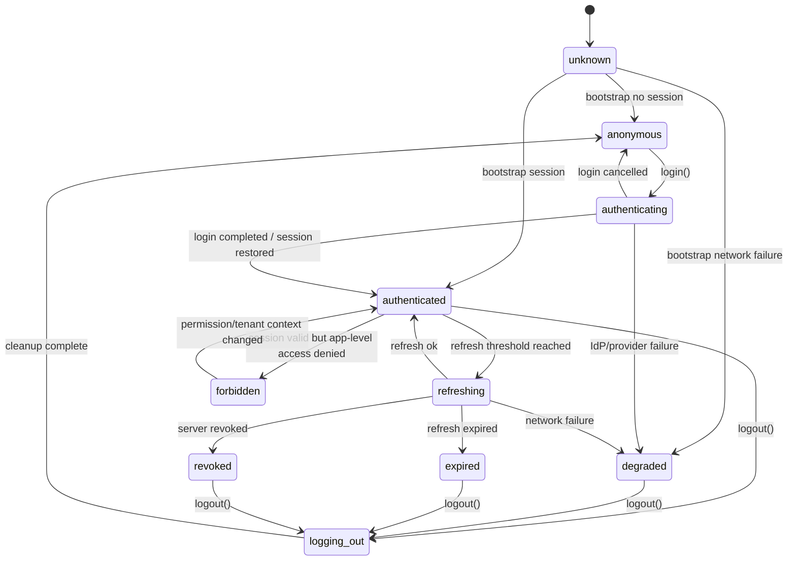

# Part 111 — Build Auth Client from Scratch

We now move from handbook knowledge into implementation.

This part builds the core auth client. Not a provider SDK wrapper. Not a route guard. Not a login form. The goal is to build the **client-side auth control plane** that the rest of a React application can depend on.

A production React app needs one small, boring, deterministic module that answers:

- What auth state is the app in right now?
- Is the session known, unknown, expired, revoked, or degraded?
- How does login start?
- How does callback/session bootstrap complete?
- How does logout propagate?
- How do components subscribe without tearing or inconsistent snapshots?
- How do route loaders, API clients, query caches, and UI gates react to auth changes?

That module is the auth client.

## What we are building

We will build a framework-agnostic TypeScript auth client with a React binding.

It will not own server-side authorization. It will not validate JWT signatures in the browser. It will not make frontend state authoritative.

It will own the **client-side projection** of auth state.

```mermaid
flowchart TD
    UI[React Components] --> Hook[useAuth / useSession]
    Loader[Router Loader / Middleware] --> Client[AuthClient]
    Api[API Client] --> Client
    Query[TanStack Query / Cache Coordinator] --> Client
    Client --> Store[External Auth Store]
    Client --> Transport[Auth Transport Adapter]
    Transport --> SessionAPI[/api/session]
    Transport --> LoginAPI[/auth/login]
    Transport --> LogoutAPI[/auth/logout]
    SessionAPI --> Server[Server Session Authority]
    LoginAPI --> IdP[Identity Provider]
```

The core principle:

> The auth client manages state transitions and side effects. The server remains the authority.

If a React component says the user is admin, that is only a rendering hint. If the server says the request is forbidden, the server wins.

## Why build this from scratch?

Most applications use an auth SDK. That is usually correct. But top-level engineers need to understand the shape underneath the SDK because most production incidents happen in the seams:

- SDK says authenticated, `/api/session` says expired.
- One tab logs out, another keeps writing.
- Token refresh races and creates a storm.
- Route guard redirects while callback route is still processing.
- Query cache leaks data after tenant switch.
- A component reads stale user claims from storage.
- The app treats decoded JWT claims as authorization.
- A provider outage creates infinite login redirects.

Building the minimal client forces us to define the invariants explicitly.

## Non-goals

This client will not implement:

- password verification,
- OAuth code exchange,
- JWT signature validation,
- refresh token rotation server logic,
- permission policy evaluation on the server,
- database session storage,
- IdP federation.

Those belong server-side or provider-side.

The client will implement:

- state machine,
- event stream,
- subscription model,
- session bootstrap,
- login orchestration,
- logout orchestration,
- session refresh trigger hook points,
- cache invalidation signals,
- safe error taxonomy,
- React integration.

## Auth client invariants

Before code, define the rules.

| Invariant | Meaning |
|---|---|
| Server authority | Client auth state is a projection of server/session state. |
| Unknown is not authenticated | During bootstrap, protected UI must not render as allowed. |
| Deny by default | Missing auth state must not grant access. |
| Typed failures | `unauthenticated`, `expired`, `forbidden`, `revoked`, and `network_error` are different. |
| No token authority in UI | Token claims may inform display, not enforce access. |
| Session epoch | Every login/logout/tenant switch increments an epoch for cache invalidation. |
| Single source of client truth | Components, loaders, and API clients read the same auth client snapshot. |
| Effects are explicit | State transitions describe side effects instead of hiding them in random hooks. |
| Logout is destructive | Logout clears session projection, cache, sensitive memory, and broadcasts. |
| Recovery is intentional | Redirects, retries, and reauth prompts are controlled, not accidental loops. |

You can build a bad auth system with beautiful React components if these invariants are absent.

## State model

A common mistake is to store auth as this:

```ts
const [user, setUser] = useState<User | null>(null);
```

That loses important states.

`null` could mean:

- not loaded yet,
- anonymous,
- expired,
- revoked,
- network failure,
- tenant mismatch,
- logout in progress,
- callback processing,
- corrupted local projection.

Use explicit states.

```ts
export type AuthStatus =
  | 'unknown'
  | 'anonymous'
  | 'authenticating'
  | 'authenticated'
  | 'refreshing'
  | 'expired'
  | 'revoked'
  | 'forbidden'
  | 'degraded'
  | 'logging_out';
```

Now define the session projection.

```ts
export type UserProfile = {
  id: string;
  displayName: string;
  email?: string;
};

export type TenantRef = {
  id: string;
  slug: string;
  name: string;
};

export type PermissionProjection = {
  version: string;
  actions: string[];
  expiresAt?: number;
};

export type SessionProjection = {
  sessionId: string;
  user: UserProfile;
  tenant?: TenantRef;
  permissions?: PermissionProjection;
  issuedAt: number;
  expiresAt?: number;
  authTime?: number;
  assuranceLevel?: 'aal1' | 'aal2' | 'aal3';
};
```

Keep it intentionally small. Do not mirror the whole user database into the browser.

## Snapshot shape

The auth client exposes a snapshot.

```ts
export type AuthErrorCode =
  | 'network_error'
  | 'invalid_session'
  | 'expired_session'
  | 'revoked_session'
  | 'forbidden'
  | 'tenant_mismatch'
  | 'callback_error'
  | 'unknown_error';

export type AuthError = {
  code: AuthErrorCode;
  message: string;
  retryable: boolean;
  correlationId?: string;
};

export type AuthSnapshot = {
  status: AuthStatus;
  session: SessionProjection | null;
  epoch: number;
  permissionEpoch: number;
  lastChangedAt: number;
  error: AuthError | null;
};
```

Why `epoch`?

Because caches need a simple invalidation key.

- Login increments epoch.
- Logout increments epoch.
- Session restore increments epoch if identity changes.
- Tenant switch increments epoch.
- Permission update increments permission epoch.

The UI does not need to infer this from random user fields.

## Events

State changes should be observable by non-React systems.

```ts
export type AuthEvent =
  | { type: 'BOOTSTRAP_STARTED' }
  | { type: 'BOOTSTRAP_SUCCEEDED'; session: SessionProjection | null }
  | { type: 'BOOTSTRAP_FAILED'; error: AuthError }
  | { type: 'LOGIN_STARTED'; returnTo?: string }
  | { type: 'LOGIN_REDIRECT_REQUIRED'; url: string }
  | { type: 'LOGIN_COMPLETED'; session: SessionProjection }
  | { type: 'REFRESH_STARTED' }
  | { type: 'REFRESH_SUCCEEDED'; session: SessionProjection }
  | { type: 'REFRESH_FAILED'; error: AuthError }
  | { type: 'PERMISSIONS_CHANGED'; version: string }
  | { type: 'TENANT_CHANGED'; tenant: TenantRef }
  | { type: 'LOGOUT_STARTED'; reason: LogoutReason }
  | { type: 'LOGOUT_COMPLETED'; reason: LogoutReason }
  | { type: 'SESSION_REVOKED'; reason?: string }
  | { type: 'ERROR_CLEARED' };

export type LogoutReason =
  | 'user_clicked_logout'
  | 'session_expired'
  | 'server_revoked'
  | 'tenant_changed'
  | 'security_event'
  | 'local_reset';
```

Events are not just for debugging. They coordinate:

- API client request cancellation,
- TanStack Query cache clearing,
- route revalidation,
- analytics redaction,
- cross-tab broadcast,
- user-facing toast policy,
- forced logout handling.

## State transition diagram



The diagram matters. Without it, each hook invents its own behavior.

## Reducer first

Build the reducer before building effects.

```ts
const initialSnapshot: AuthSnapshot = {
  status: 'unknown',
  session: null,
  epoch: 0,
  permissionEpoch: 0,
  lastChangedAt: Date.now(),
  error: null,
};

function now() {
  return Date.now();
}

export function reduceAuth(
  state: AuthSnapshot,
  event: AuthEvent,
): AuthSnapshot {
  switch (event.type) {
    case 'BOOTSTRAP_STARTED':
      return {
        ...state,
        status: 'unknown',
        error: null,
        lastChangedAt: now(),
      };

    case 'BOOTSTRAP_SUCCEEDED':
      if (!event.session) {
        return {
          ...state,
          status: 'anonymous',
          session: null,
          epoch: state.epoch + 1,
          lastChangedAt: now(),
          error: null,
        };
      }

      return {
        ...state,
        status: 'authenticated',
        session: event.session,
        epoch: state.epoch + 1,
        permissionEpoch: state.permissionEpoch + 1,
        lastChangedAt: now(),
        error: null,
      };

    case 'BOOTSTRAP_FAILED':
      return {
        ...state,
        status: 'degraded',
        error: event.error,
        lastChangedAt: now(),
      };

    case 'LOGIN_STARTED':
      return {
        ...state,
        status: 'authenticating',
        error: null,
        lastChangedAt: now(),
      };

    case 'LOGIN_COMPLETED':
      return {
        ...state,
        status: 'authenticated',
        session: event.session,
        epoch: state.epoch + 1,
        permissionEpoch: state.permissionEpoch + 1,
        error: null,
        lastChangedAt: now(),
      };

    case 'REFRESH_STARTED':
      if (state.status !== 'authenticated') return state;
      return {
        ...state,
        status: 'refreshing',
        lastChangedAt: now(),
      };

    case 'REFRESH_SUCCEEDED':
      return {
        ...state,
        status: 'authenticated',
        session: event.session,
        epoch: state.epoch + 1,
        permissionEpoch: state.permissionEpoch + 1,
        error: null,
        lastChangedAt: now(),
      };

    case 'REFRESH_FAILED':
      if (event.error.code === 'expired_session') {
        return {
          ...state,
          status: 'expired',
          session: null,
          epoch: state.epoch + 1,
          error: event.error,
          lastChangedAt: now(),
        };
      }

      if (event.error.code === 'revoked_session') {
        return {
          ...state,
          status: 'revoked',
          session: null,
          epoch: state.epoch + 1,
          error: event.error,
          lastChangedAt: now(),
        };
      }

      return {
        ...state,
        status: 'degraded',
        error: event.error,
        lastChangedAt: now(),
      };

    case 'PERMISSIONS_CHANGED':
      return {
        ...state,
        permissionEpoch: state.permissionEpoch + 1,
        lastChangedAt: now(),
      };

    case 'TENANT_CHANGED':
      if (!state.session) return state;
      return {
        ...state,
        session: {
          ...state.session,
          tenant: event.tenant,
        },
        epoch: state.epoch + 1,
        permissionEpoch: state.permissionEpoch + 1,
        lastChangedAt: now(),
      };

    case 'LOGOUT_STARTED':
      return {
        ...state,
        status: 'logging_out',
        lastChangedAt: now(),
      };

    case 'LOGOUT_COMPLETED':
      return {
        ...state,
        status: 'anonymous',
        session: null,
        epoch: state.epoch + 1,
        permissionEpoch: state.permissionEpoch + 1,
        error: null,
        lastChangedAt: now(),
      };

    case 'SESSION_REVOKED':
      return {
        ...state,
        status: 'revoked',
        session: null,
        epoch: state.epoch + 1,
        permissionEpoch: state.permissionEpoch + 1,
        lastChangedAt: now(),
        error: {
          code: 'revoked_session',
          message: 'The session was revoked.',
          retryable: false,
        },
      };

    case 'ERROR_CLEARED':
      return {
        ...state,
        error: null,
        lastChangedAt: now(),
      };

    default:
      return state;
  }
}
```

Notice what the reducer does not do:

- no network request,
- no redirect,
- no local storage write,
- no cookie manipulation,
- no query cache clearing,
- no React hook usage.

That separation makes auth testable.

## Transport adapter

The auth client should not know whether auth is cookie-based, token-based, BFF-based, or provider-SDK-based.

Define an adapter.

```ts
export type LoginOptions = {
  returnTo?: string;
  prompt?: 'login' | 'none';
};

export type LogoutOptions = {
  reason: LogoutReason;
  global?: boolean;
  returnTo?: string;
};

export type AuthTransport = {
  bootstrap(signal?: AbortSignal): Promise<SessionProjection | null>;
  login(options: LoginOptions): Promise<{ redirectUrl?: string; session?: SessionProjection }>;
  logout(options: LogoutOptions): Promise<void>;
  refresh?(signal?: AbortSignal): Promise<SessionProjection>;
};
```

A BFF implementation might look like this:

```ts
export function createBffAuthTransport(baseUrl = ''): AuthTransport {
  async function parseSessionResponse(response: Response) {
    if (response.status === 204 || response.status === 401) return null;

    if (!response.ok) {
      throw toAuthError(response);
    }

    return (await response.json()) as SessionProjection;
  }

  return {
    async bootstrap(signal) {
      const response = await fetch(`${baseUrl}/api/session`, {
        method: 'GET',
        credentials: 'include',
        headers: { Accept: 'application/json' },
        signal,
      });

      return parseSessionResponse(response);
    },

    async login(options) {
      const response = await fetch(`${baseUrl}/auth/login`, {
        method: 'POST',
        credentials: 'include',
        headers: {
          Accept: 'application/json',
          'Content-Type': 'application/json',
        },
        body: JSON.stringify({ returnTo: options.returnTo }),
      });

      if (!response.ok) throw toAuthError(response);

      return (await response.json()) as { redirectUrl?: string; session?: SessionProjection };
    },

    async logout(options) {
      const response = await fetch(`${baseUrl}/auth/logout`, {
        method: 'POST',
        credentials: 'include',
        headers: {
          Accept: 'application/json',
          'Content-Type': 'application/json',
        },
        body: JSON.stringify({ reason: options.reason, global: options.global }),
      });

      if (!response.ok) throw toAuthError(response);
    },

    async refresh(signal) {
      const response = await fetch(`${baseUrl}/auth/refresh`, {
        method: 'POST',
        credentials: 'include',
        headers: { Accept: 'application/json' },
        signal,
      });

      if (!response.ok) throw toAuthError(response);
      return (await response.json()) as SessionProjection;
    },
  };
}
```

The adapter uses `credentials: 'include'` because this example is cookie/BFF-oriented. A bearer-token adapter would inject an `Authorization` header inside the API client layer, not expose raw tokens to arbitrary UI code.

## Error normalization

Do not let every transport throw random errors.

```ts
async function toAuthError(response: Response): Promise<AuthError> {
  const correlationId = response.headers.get('x-correlation-id') ?? undefined;

  let body: unknown = null;
  try {
    body = await response.clone().json();
  } catch {
    // Ignore non-JSON error body.
  }

  if (response.status === 401) {
    return {
      code: 'invalid_session',
      message: 'Authentication is required.',
      retryable: false,
      correlationId,
    };
  }

  if (response.status === 403) {
    return {
      code: 'forbidden',
      message: 'You are not allowed to perform this action.',
      retryable: false,
      correlationId,
    };
  }

  if (response.status >= 500) {
    return {
      code: 'network_error',
      message: 'Authentication service is temporarily unavailable.',
      retryable: true,
      correlationId,
    };
  }

  return {
    code: 'unknown_error',
    message: 'Authentication failed.',
    retryable: false,
    correlationId,
  };
}
```

A better version would parse RFC 7807 problem details. The important point is that callers get typed errors.

## External store

React components should subscribe to a stable external store.

```ts
type Listener = () => void;

export class AuthStore {
  private snapshot: AuthSnapshot;
  private listeners = new Set<Listener>();
  private eventListeners = new Set<(event: AuthEvent, snapshot: AuthSnapshot) => void>();

  constructor(initial: AuthSnapshot = initialSnapshot) {
    this.snapshot = initial;
  }

  getSnapshot = () => this.snapshot;

  subscribe = (listener: Listener) => {
    this.listeners.add(listener);
    return () => this.listeners.delete(listener);
  };

  onEvent(listener: (event: AuthEvent, snapshot: AuthSnapshot) => void) {
    this.eventListeners.add(listener);
    return () => this.eventListeners.delete(listener);
  }

  dispatch(event: AuthEvent) {
    const next = reduceAuth(this.snapshot, event);

    if (Object.is(next, this.snapshot)) {
      return;
    }

    this.snapshot = next;

    for (const listener of this.listeners) {
      listener();
    }

    for (const listener of this.eventListeners) {
      listener(event, next);
    }
  }
}
```

This is intentionally simple. You do not need Redux to model auth. You need deterministic transitions and clear effects.

## Auth client class

Now build the orchestrator.

```ts
export type AuthClientOptions = {
  transport: AuthTransport;
  store?: AuthStore;
  onRedirect?: (url: string) => void;
  logger?: Pick<Console, 'debug' | 'warn' | 'error'>;
};

export class AuthClient {
  readonly store: AuthStore;
  private transport: AuthTransport;
  private onRedirect: (url: string) => void;
  private logger: Pick<Console, 'debug' | 'warn' | 'error'>;
  private bootstrapAbort?: AbortController;

  constructor(options: AuthClientOptions) {
    this.transport = options.transport;
    this.store = options.store ?? new AuthStore();
    this.onRedirect = options.onRedirect ?? ((url) => window.location.assign(url));
    this.logger = options.logger ?? console;
  }

  getSnapshot() {
    return this.store.getSnapshot();
  }

  subscribe(listener: Listener) {
    return this.store.subscribe(listener);
  }

  onEvent(listener: (event: AuthEvent, snapshot: AuthSnapshot) => void) {
    return this.store.onEvent(listener);
  }

  async bootstrap() {
    this.bootstrapAbort?.abort();
    this.bootstrapAbort = new AbortController();

    this.store.dispatch({ type: 'BOOTSTRAP_STARTED' });

    try {
      const session = await this.transport.bootstrap(this.bootstrapAbort.signal);
      this.store.dispatch({ type: 'BOOTSTRAP_SUCCEEDED', session });
      return session;
    } catch (error) {
      if (isAbortError(error)) return this.getSnapshot().session;

      const authError = normalizeUnknownAuthError(error);
      this.store.dispatch({ type: 'BOOTSTRAP_FAILED', error: authError });
      return null;
    }
  }

  async login(options: LoginOptions = {}) {
    this.store.dispatch({ type: 'LOGIN_STARTED', returnTo: options.returnTo });

    try {
      const result = await this.transport.login(options);

      if (result.session) {
        this.store.dispatch({ type: 'LOGIN_COMPLETED', session: result.session });
        return;
      }

      if (result.redirectUrl) {
        this.store.dispatch({ type: 'LOGIN_REDIRECT_REQUIRED', url: result.redirectUrl });
        this.onRedirect(result.redirectUrl);
        return;
      }

      throw new Error('Auth transport returned neither session nor redirectUrl.');
    } catch (error) {
      const authError = normalizeUnknownAuthError(error);
      this.store.dispatch({ type: 'BOOTSTRAP_FAILED', error: authError });
      throw authError;
    }
  }

  async logout(options: Partial<LogoutOptions> = {}) {
    const reason = options.reason ?? 'user_clicked_logout';

    this.store.dispatch({ type: 'LOGOUT_STARTED', reason });

    try {
      await this.transport.logout({ reason, global: options.global, returnTo: options.returnTo });
    } catch (error) {
      this.logger.warn('Logout request failed; clearing local projection anyway.', error);
    } finally {
      this.store.dispatch({ type: 'LOGOUT_COMPLETED', reason });
    }
  }

  async refresh() {
    if (!this.transport.refresh) return this.getSnapshot().session;

    const snapshot = this.getSnapshot();
    if (snapshot.status !== 'authenticated') return snapshot.session;

    this.store.dispatch({ type: 'REFRESH_STARTED' });

    try {
      const session = await this.transport.refresh();
      this.store.dispatch({ type: 'REFRESH_SUCCEEDED', session });
      return session;
    } catch (error) {
      const authError = normalizeUnknownAuthError(error);
      this.store.dispatch({ type: 'REFRESH_FAILED', error: authError });
      return null;
    }
  }
}
```

Utility functions:

```ts
function isAbortError(error: unknown) {
  return error instanceof DOMException && error.name === 'AbortError';
}

function normalizeUnknownAuthError(error: unknown): AuthError {
  if (isAuthError(error)) return error;

  return {
    code: 'unknown_error',
    message: error instanceof Error ? error.message : 'Unknown authentication error.',
    retryable: false,
  };
}

function isAuthError(value: unknown): value is AuthError {
  return Boolean(
    value &&
      typeof value === 'object' &&
      'code' in value &&
      'message' in value &&
      'retryable' in value,
  );
}
```

This is not the final production client. It is the core shape.

## React binding

React should not own the auth state. It should subscribe to it.

```tsx
import React, { createContext, useContext, useMemo, useSyncExternalStore } from 'react';

const AuthClientContext = createContext<AuthClient | null>(null);

export function AuthProvider({
  client,
  children,
}: {
  client: AuthClient;
  children: React.ReactNode;
}) {
  return <AuthClientContext.Provider value={client}>{children}</AuthClientContext.Provider>;
}

export function useAuthClient() {
  const client = useContext(AuthClientContext);
  if (!client) {
    throw new Error('useAuthClient must be used within AuthProvider.');
  }
  return client;
}

export function useAuthSnapshot() {
  const client = useAuthClient();

  return useSyncExternalStore(
    client.subscribe.bind(client),
    client.getSnapshot.bind(client),
    client.getSnapshot.bind(client),
  );
}

export function useSession() {
  const snapshot = useAuthSnapshot();
  return snapshot.session;
}

export function useIsAuthenticated() {
  const snapshot = useAuthSnapshot();
  return snapshot.status === 'authenticated' || snapshot.status === 'refreshing';
}
```

The key hook is `useSyncExternalStore`. It gives React a consistent subscription model for state stored outside React.

Do not create an auth client inside a component render. Create one at app composition time.

```tsx
const authClient = new AuthClient({
  transport: createBffAuthTransport(),
});

export function AppRoot() {
  return (
    <AuthProvider client={authClient}>
      <App />
    </AuthProvider>
  );
}
```

## Bootstrap component

Now you need a bootstrap boundary.

```tsx
export function AuthBootstrap({ children }: { children: React.ReactNode }) {
  const client = useAuthClient();
  const snapshot = useAuthSnapshot();

  React.useEffect(() => {
    if (snapshot.status === 'unknown') {
      void client.bootstrap();
    }
  }, [client, snapshot.status]);

  if (snapshot.status === 'unknown') {
    return <FullPageSkeleton label="Checking session" />;
  }

  if (snapshot.status === 'degraded') {
    return (
      <AuthDegradedScreen
        error={snapshot.error}
        onRetry={() => void client.bootstrap()}
        onContinueAsGuest={() => client.store.dispatch({ type: 'BOOTSTRAP_SUCCEEDED', session: null })}
      />
    );
  }

  return <>{children}</>;
}
```

Do not render protected application shells before bootstrap. Unknown is not authenticated.

## Guard component

A simple guard can be built on top.

```tsx
export function RequireAuth({ children }: { children: React.ReactNode }) {
  const snapshot = useAuthSnapshot();
  const client = useAuthClient();

  if (snapshot.status === 'unknown') {
    return <FullPageSkeleton label="Checking session" />;
  }

  if (snapshot.status === 'anonymous' || snapshot.status === 'expired' || snapshot.status === 'revoked') {
    return (
      <LoginRequired
        reason={snapshot.status}
        onLogin={() => void client.login({ returnTo: window.location.pathname + window.location.search })}
      />
    );
  }

  if (snapshot.status === 'degraded') {
    return <AuthDegradedScreen error={snapshot.error} onRetry={() => void client.bootstrap()} />;
  }

  return <>{children}</>;
}
```

This is still not the enforcement boundary. It is UI exposure control.

Route loaders, server endpoints, and resource operations must enforce access independently.

## Event integrations

A good auth client emits enough events for the rest of the app to coordinate.

Example: clear query cache on logout.

```ts
authClient.onEvent((event, snapshot) => {
  if (event.type === 'LOGOUT_COMPLETED') {
    queryClient.clear();
  }

  if (event.type === 'TENANT_CHANGED' || event.type === 'PERMISSIONS_CHANGED') {
    void queryClient.invalidateQueries();
  }
});
```

Example: cancel protected requests on logout.

```ts
authClient.onEvent((event) => {
  if (event.type === 'LOGOUT_STARTED') {
    protectedRequestRegistry.abortAll('logout');
  }
});
```

Example: revalidate router after session bootstrap.

```ts
authClient.onEvent((event) => {
  if (
    event.type === 'BOOTSTRAP_SUCCEEDED' ||
    event.type === 'LOGIN_COMPLETED' ||
    event.type === 'LOGOUT_COMPLETED' ||
    event.type === 'PERMISSIONS_CHANGED'
  ) {
    router.revalidate?.();
  }
});
```

Do not hide these integrations inside unrelated components.

## Login orchestration

Login is not just redirect.

A robust login call must:

1. validate and normalize `returnTo`,
2. persist short-lived login transaction state if needed,
3. request server/provider login,
4. redirect or complete locally,
5. restore session after callback,
6. clear transaction state,
7. avoid redirect loops.

For BFF/server-driven OAuth:

```ts
async function startLogin(client: AuthClient, rawReturnTo: string) {
  const returnTo = normalizeInternalReturnTo(rawReturnTo);
  await client.login({ returnTo });
}

function normalizeInternalReturnTo(value: string) {
  const url = new URL(value, window.location.origin);

  if (url.origin !== window.location.origin) {
    return '/';
  }

  if (url.pathname.startsWith('/auth/callback')) {
    return '/';
  }

  return url.pathname + url.search + url.hash;
}
```

Login should not accept arbitrary external redirect targets.

## Callback completion

In BFF mode, callback completion usually happens server-side. The React app receives the user back after the server has established an app session.

The client should then bootstrap:

```tsx
export function AuthCallbackPage() {
  const client = useAuthClient();
  const snapshot = useAuthSnapshot();

  React.useEffect(() => {
    void client.bootstrap().then((session) => {
      const returnTo = readAndClearSafeReturnTo();
      window.history.replaceState(null, '', returnTo ?? '/');
    });
  }, [client]);

  if (snapshot.status === 'degraded') {
    return <AuthCallbackError error={snapshot.error} />;
  }

  return <FullPageSkeleton label="Completing sign in" />;
}
```

Avoid keeping authorization codes, tokens, or OAuth errors in visible URLs after processing.

## Permission facade

The auth client can expose permission projection helpers, but it should not become the policy engine unless the policy is intentionally client-side and non-security-critical.

```ts
export type PermissionDecision =
  | { allowed: true; source: 'projection'; reason?: string }
  | { allowed: false; source: 'projection'; reason: string };

export function canFromProjection(
  snapshot: AuthSnapshot,
  action: string,
): PermissionDecision {
  if (snapshot.status !== 'authenticated' && snapshot.status !== 'refreshing') {
    return { allowed: false, source: 'projection', reason: 'not_authenticated' };
  }

  const permissions = snapshot.session?.permissions;

  if (!permissions) {
    return { allowed: false, source: 'projection', reason: 'permission_unknown' };
  }

  if (permissions.expiresAt && permissions.expiresAt <= Date.now()) {
    return { allowed: false, source: 'projection', reason: 'permission_stale' };
  }

  return permissions.actions.includes(action)
    ? { allowed: true, source: 'projection' }
    : { allowed: false, source: 'projection', reason: 'missing_permission' };
}
```

This is good for UI exposure. The server still checks the real policy when the user submits the action.

## Avoid a giant auth context

Do not put mutable methods and huge data in React context directly:

```tsx
// Avoid this pattern in large apps.
<AuthContext.Provider value={{ user, permissions, login, logout, refresh, setUser, setPermissions }}>
```

It creates broad rerender surfaces, encourages ad-hoc mutations, and makes non-React integration difficult.

Prefer:

- stable `AuthClient` in context,
- snapshot subscription via `useSyncExternalStore`,
- typed actions via methods,
- event bus for integrations.

## Handling degraded state

Degraded means the app cannot prove the latest session state because a dependency is unavailable.

Examples:

- `/api/session` times out,
- IdP metadata is unavailable,
- permission service is down,
- network is offline,
- BFF cannot reach token vault.

Do not silently treat degraded as authenticated. Do not silently treat degraded as logged out unless the server clearly rejected the session.

A safe default:

| Area | Behavior in degraded state |
|---|---|
| Public pages | Render normally. |
| Protected shell | Show degraded auth recovery screen. |
| Sensitive actions | Block. |
| Cached read-only data | Optional, if explicitly allowed and clearly stale. |
| Mutations | Block or queue as non-authorized intent only. |

## Lifecycle cleanup

Auth client logout should be wired to cleanup systems.

```ts
function installAuthCleanup(client: AuthClient, deps: {
  queryClient: { clear(): void };
  router?: { revalidate(): void };
  requestRegistry?: { abortAll(reason: string): void };
  analytics?: { resetIdentity(): void };
}) {
  return client.onEvent((event) => {
    if (event.type === 'LOGOUT_STARTED') {
      deps.requestRegistry?.abortAll('logout');
    }

    if (event.type === 'LOGOUT_COMPLETED') {
      deps.queryClient.clear();
      deps.analytics?.resetIdentity();
      deps.router?.revalidate();
    }
  });
}
```

Logout is not a screen transition. It is data destruction.

## Test the reducer

The reducer is easy to test.

```ts
import { describe, expect, it } from 'vitest';

const session: SessionProjection = {
  sessionId: 's1',
  user: { id: 'u1', displayName: 'Ari' },
  issuedAt: Date.now(),
};

describe('reduceAuth', () => {
  it('denies by default through unknown state', () => {
    expect(initialSnapshot.status).toBe('unknown');
    expect(initialSnapshot.session).toBeNull();
  });

  it('moves to authenticated after successful bootstrap', () => {
    const next = reduceAuth(initialSnapshot, {
      type: 'BOOTSTRAP_SUCCEEDED',
      session,
    });

    expect(next.status).toBe('authenticated');
    expect(next.session?.user.id).toBe('u1');
    expect(next.epoch).toBe(1);
  });

  it('clears session on logout completion', () => {
    const authed = reduceAuth(initialSnapshot, {
      type: 'BOOTSTRAP_SUCCEEDED',
      session,
    });

    const next = reduceAuth(authed, {
      type: 'LOGOUT_COMPLETED',
      reason: 'user_clicked_logout',
    });

    expect(next.status).toBe('anonymous');
    expect(next.session).toBeNull();
    expect(next.epoch).toBe(2);
  });
});
```

## Test the client with fake transport

```ts
function createFakeTransport(session: SessionProjection | null): AuthTransport {
  return {
    bootstrap: async () => session,
    login: async () => {
      if (!session) throw new Error('no fake session configured');
      return { session };
    },
    logout: async () => undefined,
  };
}

it('bootstraps a session', async () => {
  const client = new AuthClient({ transport: createFakeTransport(session) });

  await client.bootstrap();

  expect(client.getSnapshot().status).toBe('authenticated');
});
```

Do not mock auth as a boolean. Mock the state machine.

## Common anti-patterns

### Anti-pattern: auth as `user !== null`

This collapses too many states.

Use explicit status.

### Anti-pattern: SDK state everywhere

Provider SDK state is useful, but do not leak provider-specific vocabulary into every component.

Wrap it in an application auth boundary.

### Anti-pattern: decoded JWT as app session

A decoded token is not a server-verified current session. It can be stale, revoked, wrong audience, or missing domain authorization context.

### Anti-pattern: login redirect inside render

Render should describe UI. Redirects should be effects or router-level responses.

### Anti-pattern: logout only clears React state

Logout must coordinate server revocation, local projection, cache, in-flight requests, analytics identity, and other tabs.

### Anti-pattern: `unknown` renders protected shell

This creates sensitive UI flash and route layout leaks.

## Production checklist

- [ ] Auth state has explicit statuses.
- [ ] Reducer is pure and unit-tested.
- [ ] Transport adapter is replaceable.
- [ ] Bootstrap does not render protected shell before completion.
- [ ] Login `returnTo` is normalized and internal-only.
- [ ] Logout clears local projection even if server logout fails.
- [ ] Auth events clear query cache on logout.
- [ ] Auth events revalidate router on login/logout/permission changes.
- [ ] Auth snapshot has epoch and permission epoch.
- [ ] Components subscribe through `useSyncExternalStore` or equivalent.
- [ ] Errors are typed and safe for UI.
- [ ] Degraded state is not treated as authenticated.
- [ ] Permission helpers are clearly projection-only.
- [ ] Tests cover bootstrap, login, logout, refresh failure, revocation, and degraded state.

## What this client gives us

By the end of this part, we have a stable auth client skeleton:

- framework-agnostic core,
- typed state machine,
- typed event stream,
- transport adapter,
- React provider/hook binding,
- bootstrap boundary,
- guard component,
- cache cleanup integration,
- permission projection helper,
- testable reducer.

This is the foundation for Part 112.

The next problem is session continuity.

A simple auth client can know the session. A production auth client must keep session state coherent over time:

- access token expiry,
- refresh queue,
- refresh race,
- multi-tab coordination,
- scheduled refresh,
- forced logout,
- network ambiguity,
- session revocation,
- and stale response suppression.

That is the session manager.

## References

- React `useSyncExternalStore`: https://react.dev/reference/react/useSyncExternalStore
- React Context: https://react.dev/reference/react/createContext
- OWASP Session Management Cheat Sheet: https://cheatsheetseries.owasp.org/cheatsheets/Session_Management_Cheat_Sheet.html
- OWASP Authentication Cheat Sheet: https://cheatsheetseries.owasp.org/cheatsheets/Authentication_Cheat_Sheet.html
- OWASP Authorization Cheat Sheet: https://cheatsheetseries.owasp.org/cheatsheets/Authorization_Cheat_Sheet.html
- RFC 9700 — Best Current Practice for OAuth 2.0 Security: https://www.rfc-editor.org/info/rfc9700
