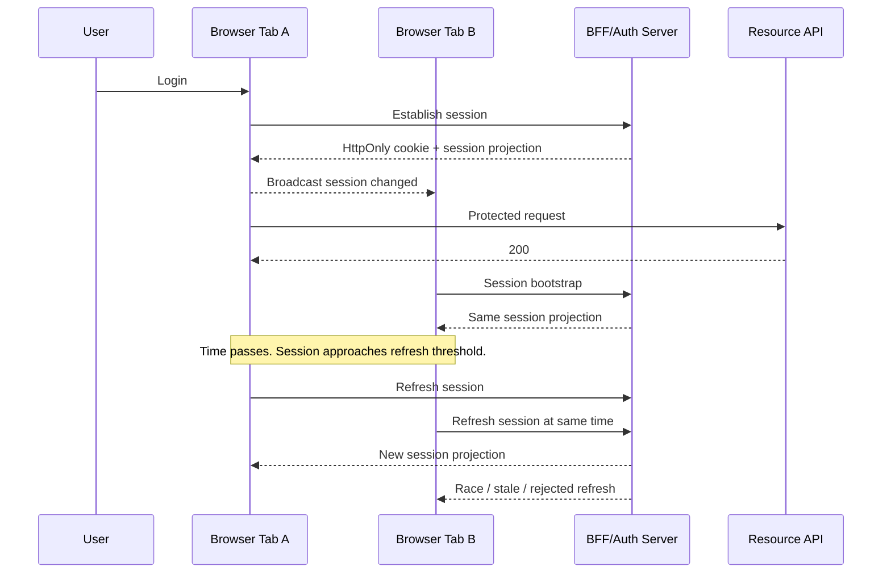
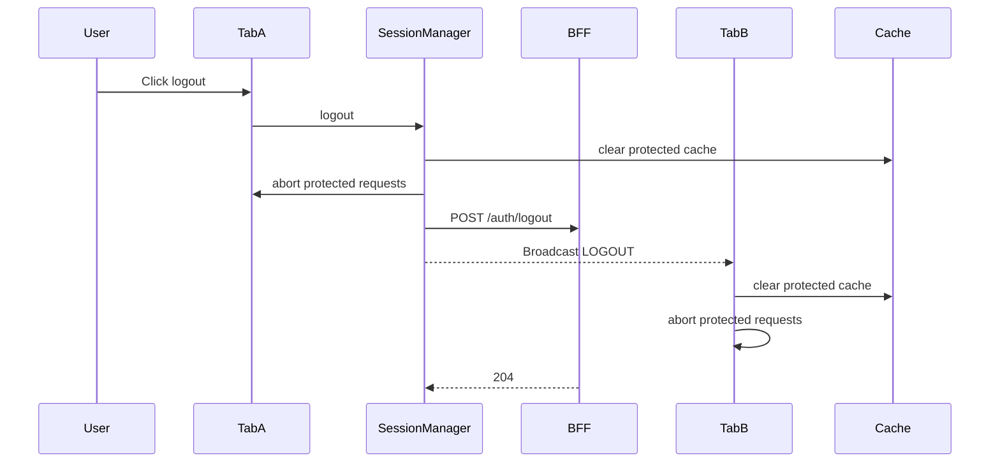

# Part 112 — Build Session Manager from Scratch

Part 111 built the auth client: a deterministic state machine and React subscription boundary.

Now we build the component that makes auth survivable over time: the **session manager**.

A session manager is not a hook. It is not a random Axios interceptor. It is not a timer hidden inside a component.

It is the part of the frontend auth system responsible for:

- scheduling refresh,
- deduplicating refresh requests,
- coordinating tabs,
- suppressing stale responses,
- detecting revocation,
- propagating logout,
- preserving session epoch consistency,
- and keeping the app fail-closed when session continuity is uncertain.

## The core problem

Login is a moment.

Session is a lifecycle.



If you do nothing, every tab, route loader, query retry, and API interceptor can decide to refresh independently. That creates a refresh storm and sometimes causes valid refresh token rotation to look like token theft.

## Session manager invariants

| Invariant | Meaning |
|---|---|
| One refresh per browser context group | Multiple callers await the same refresh promise. |
| Refresh is not authorization | Refresh only proves session continuity; server still authorizes each request. |
| Unknown refresh outcome is unsafe | Network ambiguity must not silently grant new privilege. |
| Logout wins over refresh | If logout starts, pending refresh responses must be ignored. |
| Epoch suppresses stale work | Responses from old epochs must not mutate new auth state. |
| Cross-tab state is advisory | Broadcast helps coordination; server remains authority. |
| Refresh has jitter | Avoid synchronized refresh spikes. |
| Failure is typed | expired, revoked, network, forbidden, and malformed responses differ. |
| Sensitive storage is minimized | No refresh token in JavaScript-readable storage. |
| Cleanup is destructive | Logout aborts protected requests and clears caches/projections. |

## Architecture

```mermaid
flowchart TD
    AuthClient[AuthClient] --> SessionManager[SessionManager]
    SessionManager --> Scheduler[Expiry Scheduler]
    SessionManager --> RefreshQueue[Single-flight Refresh Queue]
    SessionManager --> CrossTab[Cross-tab Coordinator]
    SessionManager --> RequestRegistry[Request Registry]
    SessionManager --> Transport[Auth Transport]
    CrossTab --> BroadcastChannel[BroadcastChannel]
    CrossTab --> StorageEvent[localStorage event fallback]
    Transport --> BFF[/auth/refresh, /api/session, /auth/logout]
```

The session manager sits beside the auth client. It listens to auth events and triggers auth client transitions through public methods.

## Session metadata

The session projection from Part 111 had `expiresAt`. For scheduling, we need a bit more metadata.

```ts
export type SessionTiming = {
  issuedAt: number;
  expiresAt?: number;
  refreshAfter?: number;
  absoluteExpiresAt?: number;
  serverNow?: number;
};

export type ManagedSessionProjection = SessionProjection & {
  timing?: SessionTiming;
};
```

Use server time if the server provides it. Browser clocks drift.

A server can return:

```json
{
  "sessionId": "s_123",
  "user": { "id": "u_123", "displayName": "Ari" },
  "issuedAt": 1783490000000,
  "expiresAt": 1783493600000,
  "timing": {
    "issuedAt": 1783490000000,
    "refreshAfter": 1783493000000,
    "expiresAt": 1783493600000,
    "absoluteExpiresAt": 1783576400000,
    "serverNow": 1783490060000
  }
}
```

`refreshAfter` is useful because it lets the server choose refresh policy.

## Refresh policy

Do not refresh at the exact expiry time.

```ts
export type RefreshPolicy = {
  minRefreshDelayMs: number;
  defaultRefreshBeforeExpiryMs: number;
  maxJitterMs: number;
  networkTimeoutMs: number;
};

export const defaultRefreshPolicy: RefreshPolicy = {
  minRefreshDelayMs: 5_000,
  defaultRefreshBeforeExpiryMs: 60_000,
  maxJitterMs: 10_000,
  networkTimeoutMs: 15_000,
};
```

The scheduler should compute:

1. use `refreshAfter` if present,
2. else use `expiresAt - defaultRefreshBeforeExpiryMs`,
3. apply jitter,
4. clamp to minimum delay,
5. cancel on logout/session epoch change.

```ts
function computeRefreshDelay(
  session: ManagedSessionProjection,
  policy: RefreshPolicy,
  nowMs = Date.now(),
) {
  const timing = session.timing;
  const expiresAt = timing?.expiresAt ?? session.expiresAt;
  const refreshAfter = timing?.refreshAfter;

  if (!expiresAt && !refreshAfter) return null;

  const target = refreshAfter ?? (expiresAt! - policy.defaultRefreshBeforeExpiryMs);
  const jitter = Math.floor(Math.random() * policy.maxJitterMs);
  const delay = target - nowMs + jitter;

  return Math.max(policy.minRefreshDelayMs, delay);
}
```

Jitter prevents a fleet of browser tabs from refreshing at the same millisecond.

## Single-flight refresh

The most important session manager rule:

> If refresh is already in progress, every caller awaits the same promise.

```ts
export class SingleFlightRefresh {
  private inFlight: Promise<SessionProjection | null> | null = null;

  run(factory: () => Promise<SessionProjection | null>) {
    if (this.inFlight) return this.inFlight;

    this.inFlight = factory().finally(() => {
      this.inFlight = null;
    });

    return this.inFlight;
  }

  isRefreshing() {
    return this.inFlight !== null;
  }
}
```

This solves duplicate refresh inside one tab.

It does not solve duplicate refresh across tabs. We handle that later.

## Request registry

Logout must abort protected requests.

```ts
type AbortReason = 'logout' | 'tenant_change' | 'session_revoked' | 'epoch_changed';

export class ProtectedRequestRegistry {
  private controllers = new Set<AbortController>();

  createController() {
    const controller = new AbortController();
    this.controllers.add(controller);

    const cleanup = () => this.controllers.delete(controller);
    controller.signal.addEventListener('abort', cleanup, { once: true });

    return controller;
  }

  complete(controller: AbortController) {
    this.controllers.delete(controller);
  }

  abortAll(reason: AbortReason) {
    for (const controller of this.controllers) {
      controller.abort(reason);
    }
    this.controllers.clear();
  }
}
```

An API client can use this registry:

```ts
async function protectedFetch(input: RequestInfo | URL, init: RequestInit = {}) {
  const controller = requestRegistry.createController();

  try {
    const signal = mergeAbortSignals(init.signal, controller.signal);
    return await fetch(input, { ...init, signal, credentials: 'include' });
  } finally {
    requestRegistry.complete(controller);
  }
}
```

A simple signal merger:

```ts
function mergeAbortSignals(...signals: Array<AbortSignal | null | undefined>) {
  const active = signals.filter(Boolean) as AbortSignal[];
  if (active.length === 0) return undefined;
  if (active.length === 1) return active[0];

  const controller = new AbortController();

  for (const signal of active) {
    if (signal.aborted) {
      controller.abort(signal.reason);
      return controller.signal;
    }

    signal.addEventListener('abort', () => controller.abort(signal.reason), { once: true });
  }

  return controller.signal;
}
```

## Cross-tab coordinator

The browser can have multiple same-origin contexts. A logout in one tab should affect all tabs. A refresh in one tab should not cause every other tab to refresh simultaneously.

Use `BroadcastChannel` when available.

```ts
export type SessionBroadcastMessage =
  | { type: 'SESSION_REFRESH_STARTED'; epoch: number; at: number; tabId: string }
  | { type: 'SESSION_REFRESH_SUCCEEDED'; epoch: number; at: number; tabId: string }
  | { type: 'SESSION_REFRESH_FAILED'; epoch: number; at: number; tabId: string; code: AuthErrorCode }
  | { type: 'LOGOUT'; epoch: number; at: number; tabId: string; reason: LogoutReason }
  | { type: 'SESSION_REVOKED'; epoch: number; at: number; tabId: string; reason?: string }
  | { type: 'PERMISSIONS_CHANGED'; epoch: number; permissionEpoch: number; at: number; tabId: string };

export class CrossTabSessionChannel {
  private channel?: BroadcastChannel;
  private listeners = new Set<(message: SessionBroadcastMessage) => void>();
  readonly tabId = crypto.randomUUID();

  constructor(private name = 'app.auth.session') {
    if ('BroadcastChannel' in globalThis) {
      this.channel = new BroadcastChannel(name);
      this.channel.onmessage = (event) => {
        const message = event.data as SessionBroadcastMessage;
        if (message.tabId !== this.tabId) {
          this.emit(message);
        }
      };
    }
  }

  post(message: Omit<SessionBroadcastMessage, 'tabId' | 'at'>) {
    const full = { ...message, tabId: this.tabId, at: Date.now() } as SessionBroadcastMessage;
    this.channel?.postMessage(full);
  }

  subscribe(listener: (message: SessionBroadcastMessage) => void) {
    this.listeners.add(listener);
    return () => this.listeners.delete(listener);
  }

  close() {
    this.channel?.close();
    this.listeners.clear();
  }

  private emit(message: SessionBroadcastMessage) {
    for (const listener of this.listeners) {
      listener(message);
    }
  }
}
```

Broadcast messages are advisory. They improve coordination, but a malicious script in the same origin can also post messages. The server remains authority.

## Cross-tab refresh lock

A full cross-tab lock is tricky. You can approximate it with a short-lived localStorage lease, but it is not a security primitive.

```ts
type RefreshLease = {
  ownerTabId: string;
  expiresAt: number;
  epoch: number;
};

export class RefreshLeaseStore {
  constructor(
    private key = 'app.auth.refreshLease',
    private ttlMs = 20_000,
  ) {}

  tryAcquire(tabId: string, epoch: number, nowMs = Date.now()) {
    const existing = this.read(nowMs);

    if (existing && existing.ownerTabId !== tabId && existing.epoch === epoch) {
      return false;
    }

    const lease: RefreshLease = {
      ownerTabId: tabId,
      epoch,
      expiresAt: nowMs + this.ttlMs,
    };

    localStorage.setItem(this.key, JSON.stringify(lease));

    const afterWrite = this.read(nowMs);
    return afterWrite?.ownerTabId === tabId && afterWrite.epoch === epoch;
  }

  release(tabId: string) {
    const existing = this.read();
    if (existing?.ownerTabId === tabId) {
      localStorage.removeItem(this.key);
    }
  }

  read(nowMs = Date.now()): RefreshLease | null {
    const raw = localStorage.getItem(this.key);
    if (!raw) return null;

    try {
      const lease = JSON.parse(raw) as RefreshLease;
      if (lease.expiresAt <= nowMs) {
        localStorage.removeItem(this.key);
        return null;
      }
      return lease;
    } catch {
      localStorage.removeItem(this.key);
      return null;
    }
  }
}
```

This prevents many accidental duplicate refreshes. It does not protect against XSS. If XSS exists, auth is already in a much worse state.

## Session manager class

Now wire the pieces together.

```ts
export type SessionManagerOptions = {
  authClient: AuthClient;
  policy?: Partial<RefreshPolicy>;
  channel?: CrossTabSessionChannel;
  leaseStore?: RefreshLeaseStore;
  requestRegistry?: ProtectedRequestRegistry;
  logger?: Pick<Console, 'debug' | 'warn' | 'error'>;
};

export class SessionManager {
  private authClient: AuthClient;
  private policy: RefreshPolicy;
  private channel: CrossTabSessionChannel;
  private leaseStore: RefreshLeaseStore;
  private requestRegistry?: ProtectedRequestRegistry;
  private singleFlight = new SingleFlightRefresh();
  private refreshTimer: ReturnType<typeof setTimeout> | null = null;
  private unsubscribeAuth?: () => void;
  private unsubscribeChannel?: () => void;
  private logger: Pick<Console, 'debug' | 'warn' | 'error'>;

  constructor(options: SessionManagerOptions) {
    this.authClient = options.authClient;
    this.policy = { ...defaultRefreshPolicy, ...options.policy };
    this.channel = options.channel ?? new CrossTabSessionChannel();
    this.leaseStore = options.leaseStore ?? new RefreshLeaseStore();
    this.requestRegistry = options.requestRegistry;
    this.logger = options.logger ?? console;
  }

  start() {
    this.unsubscribeAuth = this.authClient.onEvent((event, snapshot) => {
      this.handleAuthEvent(event, snapshot);
    });

    this.unsubscribeChannel = this.channel.subscribe((message) => {
      this.handleCrossTabMessage(message);
    });

    this.rescheduleFromSnapshot();
  }

  stop() {
    this.clearTimer();
    this.unsubscribeAuth?.();
    this.unsubscribeChannel?.();
    this.channel.close();
  }

  async refresh(reason: 'scheduled' | 'manual' | 'api_401' = 'manual') {
    const startSnapshot = this.authClient.getSnapshot();

    if (startSnapshot.status !== 'authenticated' && startSnapshot.status !== 'refreshing') {
      return startSnapshot.session;
    }

    const epoch = startSnapshot.epoch;
    const tabId = this.channel.tabId;

    return this.singleFlight.run(async () => {
      const acquired = this.leaseStore.tryAcquire(tabId, epoch);

      if (!acquired) {
        this.logger.debug('Another tab owns refresh lease; rebootstraping after wait.');
        await delay(750);
        return this.authClient.bootstrap();
      }

      this.channel.post({ type: 'SESSION_REFRESH_STARTED', epoch });

      try {
        const result = await this.refreshWithTimeout();
        const current = this.authClient.getSnapshot();

        if (current.epoch !== epoch && reason !== 'scheduled') {
          this.logger.warn('Ignoring refresh result from stale epoch.');
          return current.session;
        }

        this.channel.post({ type: 'SESSION_REFRESH_SUCCEEDED', epoch: current.epoch });
        return result;
      } catch (error) {
        const authError = normalizeUnknownAuthError(error);
        this.channel.post({
          type: 'SESSION_REFRESH_FAILED',
          epoch,
          code: authError.code,
        });
        throw authError;
      } finally {
        this.leaseStore.release(tabId);
      }
    });
  }

  private async refreshWithTimeout() {
    const controller = new AbortController();
    const timeout = setTimeout(() => controller.abort('refresh_timeout'), this.policy.networkTimeoutMs);

    try {
      // The AuthClient.refresh method shown in Part 111 did not accept a signal.
      // A production version should thread this signal through the transport.
      return await this.authClient.refresh();
    } finally {
      clearTimeout(timeout);
    }
  }

  private handleAuthEvent(event: AuthEvent, snapshot: AuthSnapshot) {
    switch (event.type) {
      case 'BOOTSTRAP_SUCCEEDED':
      case 'LOGIN_COMPLETED':
      case 'REFRESH_SUCCEEDED':
        this.rescheduleFromSnapshot();
        break;

      case 'LOGOUT_STARTED':
        this.clearTimer();
        this.requestRegistry?.abortAll('logout');
        this.channel.post({ type: 'LOGOUT', epoch: snapshot.epoch, reason: event.reason });
        break;

      case 'LOGOUT_COMPLETED':
      case 'SESSION_REVOKED':
        this.clearTimer();
        this.requestRegistry?.abortAll(event.type === 'SESSION_REVOKED' ? 'session_revoked' : 'logout');
        break;

      case 'PERMISSIONS_CHANGED':
        this.channel.post({
          type: 'PERMISSIONS_CHANGED',
          epoch: snapshot.epoch,
          permissionEpoch: snapshot.permissionEpoch,
        });
        break;
    }
  }

  private handleCrossTabMessage(message: SessionBroadcastMessage) {
    const snapshot = this.authClient.getSnapshot();

    if (message.type === 'LOGOUT') {
      if (snapshot.status !== 'anonymous' && snapshot.status !== 'logging_out') {
        void this.authClient.logout({ reason: message.reason });
      }
      return;
    }

    if (message.type === 'SESSION_REVOKED') {
      this.authClient.store.dispatch({ type: 'SESSION_REVOKED', reason: message.reason });
      return;
    }

    if (message.type === 'SESSION_REFRESH_SUCCEEDED') {
      // Another tab refreshed. Re-bootstrap to fetch the latest server projection.
      if (snapshot.status === 'authenticated' || snapshot.status === 'refreshing') {
        void this.authClient.bootstrap();
      }
      return;
    }

    if (message.type === 'PERMISSIONS_CHANGED') {
      if (message.permissionEpoch > snapshot.permissionEpoch) {
        this.authClient.store.dispatch({
          type: 'PERMISSIONS_CHANGED',
          version: String(message.permissionEpoch),
        });
      }
    }
  }

  private rescheduleFromSnapshot() {
    this.clearTimer();

    const snapshot = this.authClient.getSnapshot();
    const session = snapshot.session as ManagedSessionProjection | null;

    if (!session || snapshot.status !== 'authenticated') {
      return;
    }

    const delayMs = computeRefreshDelay(session, this.policy);
    if (delayMs == null) return;

    this.refreshTimer = setTimeout(() => {
      void this.refresh('scheduled').catch((error) => {
        this.logger.warn('Scheduled refresh failed.', error);
      });
    }, delayMs);
  }

  private clearTimer() {
    if (this.refreshTimer) {
      clearTimeout(this.refreshTimer);
      this.refreshTimer = null;
    }
  }
}

function delay(ms: number) {
  return new Promise((resolve) => setTimeout(resolve, ms));
}
```

This class is intentionally conservative.

It does not assume BroadcastChannel messages are truth. It reboots from the server after another tab refreshes. It clears timers on logout and revocation. It ignores stale work using epoch checks.

## API client integration

Now connect API `401` handling.

You need a rule:

- `401` may trigger refresh once.
- `403` never triggers refresh as a generic policy.
- Mutating requests should not be blindly replayed unless idempotent.
- Logout/revocation wins.

```ts
export async function authAwareFetch(
  input: RequestInfo | URL,
  init: RequestInit & { replayable?: boolean } = {},
  deps: {
    authClient: AuthClient;
    sessionManager: SessionManager;
    registry: ProtectedRequestRegistry;
  },
) {
  const controller = deps.registry.createController();

  try {
    const response = await fetch(input, {
      ...init,
      credentials: 'include',
      signal: mergeAbortSignals(init.signal, controller.signal),
    });

    if (response.status !== 401) return response;

    const method = (init.method ?? 'GET').toUpperCase();
    const replayable = init.replayable ?? ['GET', 'HEAD', 'OPTIONS'].includes(method);

    if (!replayable) {
      return response;
    }

    const refreshed = await deps.sessionManager.refresh('api_401');
    if (!refreshed) return response;

    const afterRefreshSnapshot = deps.authClient.getSnapshot();
    if (afterRefreshSnapshot.status !== 'authenticated') return response;

    return fetch(input, {
      ...init,
      credentials: 'include',
      signal: init.signal,
    });
  } finally {
    deps.registry.complete(controller);
  }
}
```

Do not replay POST/PUT/PATCH/DELETE automatically unless you have idempotency keys and explicit replay safety.

## Handling refresh failure

Refresh can fail for different reasons.

| Failure | Meaning | UI behavior |
|---|---|---|
| `expired_session` | Session can no longer continue | Move to expired, prompt login. |
| `revoked_session` | Server revoked session | Forced logout or revoked screen. |
| `network_error` | Cannot determine state | Degraded state, retry. |
| `forbidden` | Session valid but not allowed for context | Do not refresh-loop. Show forbidden. |
| timeout | Outcome unknown | Degraded; maybe bootstrap. |
| malformed response | Server/client contract bug | Degraded + telemetry. |

A good session manager does not treat all refresh failures as logout.

If the network is temporarily down, forcing logout can destroy user work unnecessarily. If the server says revoked, keeping stale UI is unsafe.

## Stale response suppression

Epoch prevents old requests from mutating new state.

```ts
async function runWithEpoch<T>(client: AuthClient, task: () => Promise<T>) {
  const epoch = client.getSnapshot().epoch;
  const result = await task();
  const current = client.getSnapshot();

  if (current.epoch !== epoch) {
    return { stale: true as const, result };
  }

  return { stale: false as const, result };
}
```

Use this around long-running work:

```ts
const outcome = await runWithEpoch(authClient, () => loadSensitiveDashboard());

if (outcome.stale) {
  // Do not write to cache or render protected data.
  return;
}

writeDashboardCache(outcome.result);
```

This is critical during logout, tenant switch, and impersonation exit.

## Logout propagation

Logout should be destructive and distributed.



Important detail: local cleanup should happen even if the logout request fails.

Why?

Because if the user clicked logout, the local browser must stop presenting the session. Server cleanup can retry or complete later. The local projection should not remain authenticated because `/auth/logout` timed out.

## Forced logout

Server may force logout through:

- `401` with `revoked_session`,
- SSE/WebSocket message,
- polling `/session`,
- permission epoch mismatch,
- admin security action.

The session manager handles it the same way:

```ts
function forceLogout(client: AuthClient, reason: string) {
  client.store.dispatch({ type: 'SESSION_REVOKED', reason });
}
```

Then cleanup systems react to `SESSION_REVOKED`.

## Permission epoch integration

Permission changes are not always session changes.

A user can keep the same session but lose `case.approve` permission.

The session manager should support permission invalidation without forcing logout.

```ts
export async function revalidatePermissions(client: AuthClient) {
  const response = await fetch('/api/permissions', {
    credentials: 'include',
    headers: { Accept: 'application/json' },
  });

  if (response.status === 401) {
    client.store.dispatch({
      type: 'REFRESH_FAILED',
      error: {
        code: 'expired_session',
        message: 'Session expired while refreshing permissions.',
        retryable: false,
      },
    });
    return;
  }

  if (!response.ok) return;

  const projection = (await response.json()) as PermissionProjection;

  client.store.dispatch({
    type: 'PERMISSIONS_CHANGED',
    version: projection.version,
  });
}
```

In a full implementation, `REFRESH_SUCCEEDED` would replace the session projection with updated permissions. The key idea is that permission epoch invalidates UI and query cache even when identity remains the same.

## Tenant switch integration

Tenant switch is effectively a session-context mutation.

Rules:

- abort current protected requests,
- clear tenant-scoped query cache,
- rebootstrap session projection,
- increment epoch,
- update router/navigation,
- do not reuse object caches across tenants.

```ts
async function switchTenant(client: AuthClient, registry: ProtectedRequestRegistry, tenantId: string) {
  registry.abortAll('tenant_change');

  const response = await fetch('/api/session/tenant', {
    method: 'POST',
    credentials: 'include',
    headers: { 'Content-Type': 'application/json' },
    body: JSON.stringify({ tenantId }),
  });

  if (!response.ok) {
    throw await toAuthError(response);
  }

  await client.bootstrap();
}
```

Never implement tenant switch as only `setCurrentTenantId()` in React state.

## Browser lifecycle handling

The browser can sleep, resume, go offline, restore from bfcache, or hide tabs.

The session manager should observe:

- `visibilitychange`,
- `online`,
- `offline`,
- `pageshow` with `persisted`,
- focus/resume.

```ts
export function installBrowserLifecycleHooks(manager: SessionManager, client: AuthClient) {
  async function revalidateOnResume() {
    const snapshot = client.getSnapshot();
    if (snapshot.status === 'authenticated' || snapshot.status === 'refreshing') {
      await client.bootstrap();
    }
  }

  document.addEventListener('visibilitychange', () => {
    if (document.visibilityState === 'visible') {
      void revalidateOnResume();
    }
  });

  window.addEventListener('online', () => {
    void revalidateOnResume();
  });

  window.addEventListener('pageshow', (event) => {
    if (event.persisted) {
      void revalidateOnResume();
    }
  });
}
```

Do not assume timers fired while the tab was suspended. Revalidate on resume.

## Service worker caveat

If your app uses a service worker, the session manager must be aligned with cache strategy.

Rules:

- `/api/session` should not be served from stale service worker cache.
- `/api/permissions` should not be stale after role change.
- protected API responses should be carefully scoped or not cached.
- logout should message the service worker to clear protected caches.

Example:

```ts
async function clearServiceWorkerProtectedCaches() {
  if (!navigator.serviceWorker.controller) return;

  navigator.serviceWorker.controller.postMessage({
    type: 'CLEAR_PROTECTED_CACHES',
  });
}
```

The service worker is part of the auth threat model. It can accidentally preserve data after logout if ignored.

## Testing the session manager

Use fake timers for scheduling.

```ts
import { beforeEach, describe, expect, it, vi } from 'vitest';

describe('SessionManager scheduling', () => {
  beforeEach(() => {
    vi.useFakeTimers();
    vi.setSystemTime(new Date('2026-07-08T00:00:00Z'));
  });

  it('schedules refresh before expiry', async () => {
    const session: ManagedSessionProjection = {
      sessionId: 's1',
      user: { id: 'u1', displayName: 'Ari' },
      issuedAt: Date.now(),
      expiresAt: Date.now() + 5 * 60_000,
    };

    const transport = createFakeTransport(session);
    const client = new AuthClient({ transport });
    const manager = new SessionManager({
      authClient: client,
      policy: {
        defaultRefreshBeforeExpiryMs: 60_000,
        maxJitterMs: 0,
      },
    });

    manager.start();
    await client.bootstrap();

    await vi.advanceTimersByTimeAsync(4 * 60_000);

    expect(client.getSnapshot().status).toBe('authenticated');
  });
});
```

Test single-flight behavior.

```ts
it('deduplicates concurrent refresh calls', async () => {
  let refreshCount = 0;

  const transport: AuthTransport = {
    bootstrap: async () => session,
    login: async () => ({ session }),
    logout: async () => undefined,
    refresh: async () => {
      refreshCount += 1;
      await delay(10);
      return session;
    },
  };

  const client = new AuthClient({ transport });
  await client.bootstrap();

  const manager = new SessionManager({ authClient: client });

  await Promise.all([
    manager.refresh('manual'),
    manager.refresh('manual'),
    manager.refresh('manual'),
  ]);

  expect(refreshCount).toBe(1);
});
```

Test logout wins.

```ts
it('ignores refresh outcome after logout epoch change', async () => {
  let resolveRefresh!: (session: SessionProjection) => void;

  const transport: AuthTransport = {
    bootstrap: async () => session,
    login: async () => ({ session }),
    logout: async () => undefined,
    refresh: () => new Promise((resolve) => {
      resolveRefresh = resolve;
    }),
  };

  const client = new AuthClient({ transport });
  await client.bootstrap();

  const manager = new SessionManager({ authClient: client });
  const pending = manager.refresh('manual');

  await client.logout({ reason: 'user_clicked_logout' });
  resolveRefresh(session);
  await pending;

  expect(client.getSnapshot().status).toBe('anonymous');
  expect(client.getSnapshot().session).toBeNull();
});
```

## Common anti-patterns

### Anti-pattern: refresh in every Axios interceptor

Every failed request tries refresh independently. This creates refresh storms and duplicate token rotation.

Use single-flight refresh.

### Anti-pattern: replay every request after refresh

Safe for GET sometimes. Dangerous for mutations.

Use idempotency keys and explicit replay policy.

### Anti-pattern: localStorage refresh token

A JavaScript-readable refresh token has high blast radius under XSS.

Prefer BFF/HttpOnly cookie/session or other designs that minimize token exposure.

### Anti-pattern: timer-only session management

Timers do not reliably fire while a tab sleeps. Revalidate on resume, visibility change, online, and bfcache restore.

### Anti-pattern: BroadcastChannel as authority

BroadcastChannel is useful coordination. It is not security authority.

After cross-tab messages that matter, re-bootstrap from server.

### Anti-pattern: logout waits for perfect server response

Local logout should clear local projection and cache even if the network request fails.

## Production checklist

- [ ] Refresh is single-flight within a tab.
- [ ] Cross-tab refresh has a best-effort lease.
- [ ] Logout propagates to other tabs.
- [ ] Logout aborts protected requests.
- [ ] Logout clears query cache and sensitive memory.
- [ ] Refresh uses jitter.
- [ ] Refresh is scheduled before expiry.
- [ ] Browser resume triggers session revalidation.
- [ ] `401` triggers at most one refresh attempt.
- [ ] `403` does not trigger generic refresh loop.
- [ ] Mutations are not blindly replayed.
- [ ] Epoch suppresses stale responses after logout/tenant switch.
- [ ] Permission epoch invalidates permission-dependent UI/cache.
- [ ] Service worker protected cache is cleared on logout.
- [ ] Tests cover concurrent refresh, refresh failure, logout race, tab broadcast, and browser resume.
- [ ] Refresh failure taxonomy is observable in metrics/logs.

## Where we are now

After Part 111 and Part 112, we have:

- an auth client,
- a pure state machine,
- a React external-store binding,
- a transport adapter boundary,
- session bootstrap,
- login/logout orchestration,
- session manager,
- scheduled refresh,
- single-flight refresh,
- cross-tab coordination,
- logout propagation,
- protected request cancellation,
- stale response suppression,
- and a test strategy.

The next part moves from session continuity to authorization evaluation.

Part 113 will build a permission engine from scratch:

```ts
can(subject, action, resource, context)
```

That engine will not replace server-side enforcement. It will model the frontend-safe projection and deterministic policy evaluation needed for UI exposure, tests, admin previews, and authorization reasoning.

## References

- OWASP Session Management Cheat Sheet: https://cheatsheetseries.owasp.org/cheatsheets/Session_Management_Cheat_Sheet.html
- OWASP HTML5 Security Cheat Sheet: https://cheatsheetseries.owasp.org/cheatsheets/HTML5_Security_Cheat_Sheet.html
- RFC 9700 — Best Current Practice for OAuth 2.0 Security: https://www.rfc-editor.org/info/rfc9700
- MDN Broadcast Channel API: https://developer.mozilla.org/en-US/docs/Web/API/Broadcast_Channel_API
- MDN BroadcastChannel: https://developer.mozilla.org/en-US/docs/Web/API/BroadcastChannel
- MDN Page Visibility API: https://developer.mozilla.org/en-US/docs/Web/API/Page_Visibility_API
- MDN AbortController: https://developer.mozilla.org/en-US/docs/Web/API/AbortController
