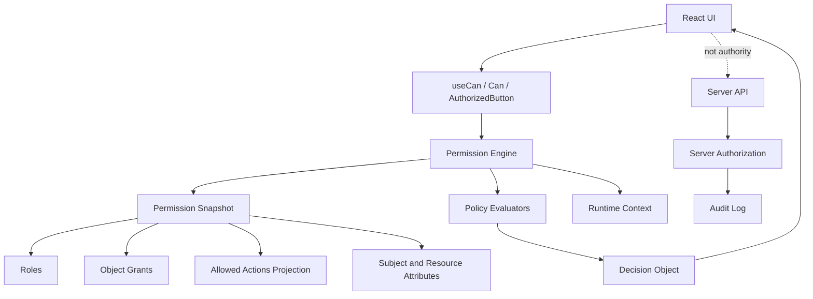

# Part 113 — Build Permission Engine from Scratch

Part 111 built the auth client.

Part 112 built the session manager.

Now we build the authorization core that the React UI can use without lying to itself: a **permission engine**.

A permission engine answers one question:

```txt
Can subject S perform action A on resource R in context C?
```

But a production-grade answer is not just `true` or `false`.

It needs to know:

- whether the decision is known, allowed, denied, or requires step-up authentication,
- why the decision happened,
- whether the decision is safe to show to the user,
- which policy version produced it,
- which tenant/resource boundary it was scoped to,
- whether the decision is cacheable,
- and whether the result came from stale projection data.

This part builds a frontend permission engine from scratch.

Important boundary: this engine is for **UI exposure control and interaction shaping**. It is not the final enforcement point. The server must still authorize every protected request.

## Why build one at all?

The naïve React approach is this:

```tsx
{user.role === "admin" && <DeleteButton />}
```

That is compact, but it hides several design failures:

- it ties UI behavior to role names instead of domain actions,
- it cannot express object-level permission,
- it cannot explain denial,
- it cannot handle tenant scope,
- it cannot handle stale permission projection,
- it cannot represent step-up requirements,
- it cannot test authorization as a matrix,
- and it encourages engineers to copy role checks everywhere.

A permission engine gives the UI one disciplined primitive:

```ts
can("case.close", { type: "case", id: "case_123" })
```

The UI no longer asks, “is this user an admin?”

It asks, “is this action available for this resource in this context?”

That is the shift from role-thinking to capability-thinking.

## Mental model



The frontend engine evaluates a **projection** of server-side authorization state.

That projection may contain roles, permissions, object grants, allowed actions, resource state, policy version, tenant membership, or precomputed decisions.

The engine must treat that projection as useful but not authoritative.

## Core invariants

| Invariant | Meaning |
|---|---|
| Deny by default | Unknown, missing, stale, malformed, or tenant-mismatched state denies UI exposure. |
| Server remains authority | The engine never replaces API/resource authorization. |
| Action names are domain language | Prefer `case.close` over `admin` or `write`. |
| Decision is typed | `allowed`, `denied`, `unknown`, `requires_step_up`, and `stale` differ. |
| Tenant scope is explicit | No permission is evaluated without tenant context when the product is multi-tenant. |
| Resource scope is explicit | Object-level actions need resource identity and type. |
| Role names do not leak everywhere | Roles can exist inside snapshots but should not be scattered through components. |
| Explanations are safe | Internal policy traces are not automatically user-facing. |
| Cache keys include policy version | Permission cache must invalidate when policy, tenant, subject, or resource changes. |
| Tests are matrix-first | Authorization logic is validated with allow and deny cases, not happy-path snapshots. |

## What we are building

We will build a small but production-shaped engine with these capabilities:

- typed action vocabulary,
- subject/resource/context model,
- decision contract,
- deny-overrides evaluation,
- RBAC evaluator,
- ACL evaluator,
- ABAC/workflow evaluator,
- precomputed allowed-actions evaluator,
- optional relationship tuple evaluator,
- batch checks,
- safe reason mapping,
- decision cache,
- React-friendly subscription integration,
- and deterministic tests.

We are not building a full Zanzibar, OpenFGA, OPA, or Cedar implementation in the browser.

Those systems belong on the server side or in a policy service. The frontend engine should consume their results or projections.

## Action vocabulary

Start with the action vocabulary.

Poor action vocabulary:

```ts
"read"
"write"
"admin"
"edit"
```

Better action vocabulary:

```ts
"case.view"
"case.update_summary"
"case.assign_investigator"
"case.escalate"
"case.close"
"case.reopen"
"case.export_evidence"
"comment.create"
"comment.delete_own"
"attachment.download"
"user.impersonate"
"access_request.approve"
```

Why this matters:

- actions become searchable,
- policies become reviewable,
- tests become meaningful,
- audit events become precise,
- and UI components can request capabilities without knowing role internals.

Define action as a branded string type if your codebase is strict.

```ts
export type Action =
  | "case.view"
  | "case.update_summary"
  | "case.assign_investigator"
  | "case.escalate"
  | "case.close"
  | "case.reopen"
  | "case.export_evidence"
  | "attachment.download"
  | "access_request.approve";
```

In larger systems, action definitions should come from a shared contract package or generated schema.

## Resource reference

A resource is not always a full object.

For a UI check, often you only need a reference:

```ts
export type ResourceRef = {
  type: string;
  id?: string;
  tenantId?: string;
  ownerId?: string;
  state?: string;
  attributes?: Record<string, unknown>;
};
```

Examples:

```ts
const caseResource: ResourceRef = {
  type: "case",
  id: "case_123",
  tenantId: "tenant_001",
  ownerId: "user_777",
  state: "under_review",
  attributes: {
    severity: "high",
    assignedTeamId: "team_enforcement",
    jurisdiction: "ID-JK",
  },
};
```

Do not pass the entire server entity to generic permission logic unless you have strict redaction. A permission engine should not become a shadow data leak.

## Subject projection

The subject is the currently authenticated actor as understood by the frontend.

```ts
export type Subject = {
  id: string;
  tenantId?: string;
  actorId?: string;
  roles: string[];
  permissions: string[];
  groups?: string[];
  attributes?: Record<string, unknown>;
  assurance?: {
    level?: "low" | "medium" | "high";
    authTime?: number;
    methods?: string[];
  };
  impersonation?: {
    active: boolean;
    actorId: string;
    subjectId: string;
    mode: "view_only" | "support_actions";
  };
};
```

Distinguish `actorId` from `subject.id` when impersonation exists.

For example:

```txt
actorId  = support engineer performing the operation
subject  = customer account being viewed
```

If the UI collapses these into one identity, audit and authorization logic become ambiguous.

## Runtime context

Authorization is not just subject and resource.

Context matters.

```ts
export type AuthzContext = {
  tenantId?: string;
  now: number;
  routeId?: string;
  sessionEpoch: number;
  permissionEpoch: number;
  policyVersion?: string;
  networkMode?: "online" | "offline" | "degraded";
  requestSource?: "route_loader" | "component" | "action" | "background";
};
```

Context examples:

- Is the app offline?
- Is this operation coming from a route loader or background poller?
- Has the permission snapshot been invalidated?
- Is the session fresh enough for a sensitive action?
- Is the user acting inside the same tenant as the resource?

## Decision contract

Do not return a boolean.

Return a decision.

```ts
export type DecisionStatus =
  | "allowed"
  | "denied"
  | "unknown"
  | "stale"
  | "requires_step_up";

export type DecisionReasonCode =
  | "NO_SESSION"
  | "UNKNOWN_PERMISSION"
  | "TENANT_MISMATCH"
  | "MISSING_PERMISSION"
  | "ROLE_DENIED"
  | "ACL_DENIED"
  | "RESOURCE_STATE_DENIED"
  | "ASSURANCE_TOO_LOW"
  | "IMPERSONATION_RESTRICTED"
  | "POLICY_STALE"
  | "EXPLICIT_DENY"
  | "ALLOWED_BY_PERMISSION"
  | "ALLOWED_BY_ROLE"
  | "ALLOWED_BY_ACL"
  | "ALLOWED_BY_RESOURCE_OWNER"
  | "ALLOWED_BY_PRECOMPUTED_ACTION";

export type Decision = {
  status: DecisionStatus;
  allowed: boolean;
  reason: DecisionReasonCode;
  userMessage?: string;
  internalMessage?: string;
  policyVersion?: string;
  cacheable: boolean;
  stale: boolean;
  requires?: {
    assuranceLevel?: "medium" | "high";
    reauth?: boolean;
  };
  debug?: {
    evaluator?: string;
    matchedRuleId?: string;
  };
};
```

The `allowed` field is convenient.

The `status` field is meaningful.

A denied action may be denied because the user lacks permission.

A stale action may be denied because the UI cannot trust its projection.

A step-up decision may be denied until the user reauthenticates.

Those should produce different UX.

## Permission snapshot

The engine needs a snapshot.

```ts
export type PermissionSnapshot = {
  subject: Subject | null;
  tenantId?: string;
  version: string;
  epoch: number;
  issuedAt: number;
  expiresAt?: number;

  rolePermissions: Record<string, string[]>;

  grants?: Array<{
    resourceType: string;
    resourceId: string;
    subjectId: string;
    actions: string[];
    expiresAt?: number;
  }>;

  allowedActionsByResource?: Record<string, string[]>;

  relationships?: Array<{
    object: string;
    relation: string;
    user: string;
  }>;

  resourcePolicies?: Array<{
    id: string;
    resourceType: string;
    action: string;
    when: ResourceCondition;
    effect: "allow" | "deny" | "step_up";
    reason?: DecisionReasonCode;
  }>;
};
```

This snapshot is a projection. It may be produced by `/api/session`, `/api/permissions`, a route loader, or a BFF endpoint.

Avoid a projection that returns everything the policy service knows. Give React the minimal shape it needs for UI exposure and interaction shaping.

## Resource condition

For a build-from-scratch engine, keep conditions simple and explicit.

```ts
export type ResourceCondition =
  | { type: "always" }
  | { type: "resource_state_is"; state: string }
  | { type: "resource_state_in"; states: string[] }
  | { type: "owner_is_subject" }
  | { type: "subject_has_attribute"; key: string; value: unknown }
  | { type: "resource_attribute_equals"; key: string; value: unknown }
  | { type: "assurance_at_least"; level: "medium" | "high" }
  | { type: "impersonation_mode_is"; mode: "view_only" | "support_actions" };
```

Do not invent a half-secure expression language in the browser.

If you need complex policy logic, put it in a real policy engine or server-side authorization service.

## Engine skeleton

```ts
export type PermissionCheck = {
  action: Action | string;
  resource?: ResourceRef;
  context?: Partial<AuthzContext>;
};

export type PermissionEngineOptions = {
  getSnapshot: () => PermissionSnapshot | null;
  getContext: () => AuthzContext;
  mapReasonToUserMessage?: (decision: Decision) => string | undefined;
};

export class PermissionEngine {
  constructor(private readonly options: PermissionEngineOptions) {}

  can(action: Action | string, resource?: ResourceRef, context?: Partial<AuthzContext>): Decision {
    const snapshot = this.options.getSnapshot();
    const baseContext = this.options.getContext();
    const ctx: AuthzContext = { ...baseContext, ...context };

    const decision = this.evaluate({ action, resource, context: ctx }, snapshot);

    return {
      ...decision,
      userMessage: this.options.mapReasonToUserMessage?.(decision),
    };
  }

  batch(checks: PermissionCheck[]): Record<string, Decision> {
    const result: Record<string, Decision> = {};

    for (const check of checks) {
      const key = makeDecisionKey(check.action, check.resource, check.context);
      result[key] = this.can(check.action, check.resource, check.context);
    }

    return result;
  }

  private evaluate(check: PermissionCheck & { context: AuthzContext }, snapshot: PermissionSnapshot | null): Decision {
    if (!snapshot?.subject) return deny("NO_SESSION", "no subject in snapshot");

    const stale = isSnapshotStale(snapshot, check.context.now);
    if (stale) return staleDeny("POLICY_STALE", "permission snapshot expired");

    const tenantDecision = evaluateTenantBoundary(snapshot, check);
    if (tenantDecision) return tenantDecision;

    const impersonationDecision = evaluateImpersonation(snapshot.subject, check);
    if (impersonationDecision) return impersonationDecision;

    const stepUpDecision = evaluateAssurance(snapshot.subject, check);
    if (stepUpDecision) return stepUpDecision;

    const explicitDeny = evaluateExplicitDeny(snapshot, check);
    if (explicitDeny) return explicitDeny;

    const precomputed = evaluateAllowedActions(snapshot, check);
    if (precomputed) return precomputed;

    const rbac = evaluateRbac(snapshot, check);
    if (rbac) return rbac;

    const acl = evaluateAcl(snapshot, check);
    if (acl) return acl;

    const resourcePolicy = evaluateResourcePolicies(snapshot, check);
    if (resourcePolicy) return resourcePolicy;

    const relationship = evaluateRelationships(snapshot, check);
    if (relationship) return relationship;

    return deny("MISSING_PERMISSION", "no evaluator allowed the action");
  }
}
```

The order is deliberate.

First eliminate invalid context.

Then evaluate hard denials.

Then evaluate allow rules.

This is a deny-overrides model.

## Decision helpers

```ts
function allow(reason: DecisionReasonCode, internalMessage?: string): Decision {
  return {
    status: "allowed",
    allowed: true,
    reason,
    internalMessage,
    cacheable: true,
    stale: false,
  };
}

function deny(reason: DecisionReasonCode, internalMessage?: string): Decision {
  return {
    status: "denied",
    allowed: false,
    reason,
    internalMessage,
    cacheable: true,
    stale: false,
  };
}

function staleDeny(reason: DecisionReasonCode, internalMessage?: string): Decision {
  return {
    status: "stale",
    allowed: false,
    reason,
    internalMessage,
    cacheable: false,
    stale: true,
  };
}

function stepUp(reason: DecisionReasonCode, level: "medium" | "high", internalMessage?: string): Decision {
  return {
    status: "requires_step_up",
    allowed: false,
    reason,
    internalMessage,
    cacheable: false,
    stale: false,
    requires: {
      assuranceLevel: level,
      reauth: true,
    },
  };
}
```

Do not encode `requires_step_up` as a normal denial. It has a distinct recovery path.

## Tenant boundary evaluator

Tenant mismatch is a hard denial.

```ts
function evaluateTenantBoundary(snapshot: PermissionSnapshot, check: PermissionCheck & { context: AuthzContext }): Decision | null {
  const subjectTenant = snapshot.subject?.tenantId ?? snapshot.tenantId;
  const contextTenant = check.context.tenantId;
  const resourceTenant = check.resource?.tenantId;

  if (!subjectTenant && !contextTenant && !resourceTenant) {
    return null;
  }

  const expectedTenant = contextTenant ?? subjectTenant;

  if (!expectedTenant) {
    return deny("TENANT_MISMATCH", "tenant-scoped action without tenant context");
  }

  if (subjectTenant && subjectTenant !== expectedTenant) {
    return deny("TENANT_MISMATCH", "subject tenant does not match context tenant");
  }

  if (resourceTenant && resourceTenant !== expectedTenant) {
    return deny("TENANT_MISMATCH", "resource tenant does not match context tenant");
  }

  return null;
}
```

In multi-tenant applications, missing tenant context is not neutral.

It is a bug.

## Snapshot staleness

Permission snapshots must expire or be versioned.

```ts
function isSnapshotStale(snapshot: PermissionSnapshot, now: number): boolean {
  if (snapshot.expiresAt && snapshot.expiresAt <= now) return true;
  if (!snapshot.version) return true;
  return false;
}
```

A stale permission snapshot should not keep showing powerful actions.

This is especially important after:

- role changes,
- tenant membership changes,
- object grant revocation,
- workflow state transition,
- policy version deployment,
- logout/login as different user,
- and impersonation exit.

## Impersonation evaluator

Impersonation must be constrained.

```ts
const SUPPORT_ACTIONS = new Set([
  "case.view",
  "attachment.download",
]);

function evaluateImpersonation(subject: Subject, check: PermissionCheck): Decision | null {
  const imp = subject.impersonation;
  if (!imp?.active) return null;

  if (imp.mode === "view_only" && !String(check.action).endsWith(".view")) {
    return deny("IMPERSONATION_RESTRICTED", "view-only impersonation blocks non-view action");
  }

  if (imp.mode === "support_actions" && !SUPPORT_ACTIONS.has(String(check.action))) {
    return deny("IMPERSONATION_RESTRICTED", "support impersonation action not allowlisted");
  }

  return null;
}
```

Do not let impersonation inherit the full permissions of the impersonated subject by default.

That creates dangerous support tooling.

## Assurance evaluator

Some actions require fresh or stronger authentication.

```ts
const STEP_UP_ACTIONS: Partial<Record<string, "medium" | "high">> = {
  "case.export_evidence": "high",
  "user.impersonate": "high",
  "access_request.approve": "medium",
};

function assuranceRank(level?: "low" | "medium" | "high"): number {
  if (level === "high") return 3;
  if (level === "medium") return 2;
  if (level === "low") return 1;
  return 0;
}

function evaluateAssurance(subject: Subject, check: PermissionCheck): Decision | null {
  const required = STEP_UP_ACTIONS[String(check.action)];
  if (!required) return null;

  if (assuranceRank(subject.assurance?.level) < assuranceRank(required)) {
    return stepUp("ASSURANCE_TOO_LOW", required, "action requires stronger authentication");
  }

  return null;
}
```

Step-up is not a role.

It is a condition on authentication assurance.

## Explicit deny evaluator

Deny rules should override allow rules.

```ts
function evaluateExplicitDeny(snapshot: PermissionSnapshot, check: PermissionCheck): Decision | null {
  const policies = snapshot.resourcePolicies ?? [];

  for (const policy of policies) {
    if (policy.effect !== "deny") continue;
    if (policy.action !== check.action) continue;
    if (policy.resourceType !== check.resource?.type) continue;
    if (!matchesCondition(policy.when, snapshot.subject!, check.resource, check.context as AuthzContext)) continue;

    return deny(policy.reason ?? "EXPLICIT_DENY", `explicit deny policy matched: ${policy.id}`);
  }

  return null;
}
```

Deny-overrides is useful because some constraints must win:

- suspended account,
- closed case cannot be edited,
- conflict-of-interest restriction,
- separation of duties,
- impersonation restriction,
- legal hold,
- tenant mismatch,
- or policy stale state.

## Precomputed allowed actions evaluator

Often the server can return allowed actions for a resource.

Example response:

```json
{
  "case": {
    "id": "case_123",
    "title": "Investigation A",
    "allowedActions": [
      "case.view",
      "case.update_summary",
      "case.escalate"
    ]
  }
}
```

Frontend check:

```ts
function resourceKey(resource?: ResourceRef): string | null {
  if (!resource?.type || !resource?.id) return null;
  return `${resource.type}:${resource.id}`;
}

function evaluateAllowedActions(snapshot: PermissionSnapshot, check: PermissionCheck): Decision | null {
  const key = resourceKey(check.resource);
  if (!key) return null;

  const actions = snapshot.allowedActionsByResource?.[key];
  if (!actions) return null;

  if (actions.includes(String(check.action))) {
    return allow("ALLOWED_BY_PRECOMPUTED_ACTION", `allowedActions contained ${check.action}`);
  }

  return null;
}
```

Precomputed allowed actions are excellent for UI tables and detail pages.

They avoid forcing React to reconstruct complex backend policy.

But they must be invalidated when resource state or permission version changes.

## RBAC evaluator

RBAC uses roles assigned to the subject and role-to-permission mapping.

```ts
function evaluateRbac(snapshot: PermissionSnapshot, check: PermissionCheck): Decision | null {
  const subject = snapshot.subject;
  if (!subject) return null;

  if (subject.permissions.includes(String(check.action))) {
    return allow("ALLOWED_BY_PERMISSION", "subject direct permission matched");
  }

  for (const role of subject.roles) {
    const permissions = snapshot.rolePermissions[role] ?? [];
    if (permissions.includes(String(check.action))) {
      return allow("ALLOWED_BY_ROLE", `role ${role} allowed action`);
    }
  }

  return null;
}
```

RBAC is useful when actions are coarse and stable.

It becomes insufficient when access depends on:

- object ownership,
- resource lifecycle state,
- region/jurisdiction,
- case assignment,
- separation of duties,
- requester/approver distinction,
- or tenant-specific grants.

## ACL evaluator

ACL grants are object-specific.

```ts
function evaluateAcl(snapshot: PermissionSnapshot, check: PermissionCheck): Decision | null {
  const subject = snapshot.subject;
  const resource = check.resource;
  if (!subject || !resource?.type || !resource.id) return null;

  if (resource.ownerId && resource.ownerId === subject.id) {
    return allow("ALLOWED_BY_RESOURCE_OWNER", "subject owns resource");
  }

  const now = (check.context as AuthzContext | undefined)?.now ?? Date.now();

  const grant = snapshot.grants?.find((g) => {
    return g.subjectId === subject.id
      && g.resourceType === resource.type
      && g.resourceId === resource.id
      && g.actions.includes(String(check.action))
      && (!g.expiresAt || g.expiresAt > now);
  });

  if (grant) {
    return allow("ALLOWED_BY_ACL", "object grant allowed action");
  }

  return null;
}
```

ACL evaluator should never fetch all grants for all resources in the browser.

Use targeted grants or allowed-action projection.

## Resource policy evaluator

Some rules depend on resource state.

Example:

```txt
case.close requires case.state in ["under_review", "awaiting_decision"]
case.update_summary denied when case.state == "closed"
case.export_evidence requires high assurance
```

Evaluator:

```ts
function evaluateResourcePolicies(snapshot: PermissionSnapshot, check: PermissionCheck): Decision | null {
  const policies = snapshot.resourcePolicies ?? [];

  for (const policy of policies) {
    if (policy.action !== check.action) continue;
    if (policy.resourceType !== check.resource?.type) continue;
    if (!matchesCondition(policy.when, snapshot.subject!, check.resource, check.context as AuthzContext)) continue;

    if (policy.effect === "allow") {
      return allow(policy.reason ?? "ALLOWED_BY_PERMISSION", `resource policy matched: ${policy.id}`);
    }

    if (policy.effect === "step_up") {
      return stepUp(policy.reason ?? "ASSURANCE_TOO_LOW", "high", `resource policy requires step-up: ${policy.id}`);
    }
  }

  return null;
}
```

Condition matcher:

```ts
function matchesCondition(
  condition: ResourceCondition,
  subject: Subject,
  resource: ResourceRef | undefined,
  context: AuthzContext,
): boolean {
  switch (condition.type) {
    case "always":
      return true;

    case "resource_state_is":
      return resource?.state === condition.state;

    case "resource_state_in":
      return !!resource?.state && condition.states.includes(resource.state);

    case "owner_is_subject":
      return !!resource?.ownerId && resource.ownerId === subject.id;

    case "subject_has_attribute":
      return subject.attributes?.[condition.key] === condition.value;

    case "resource_attribute_equals":
      return resource?.attributes?.[condition.key] === condition.value;

    case "assurance_at_least":
      return assuranceRank(subject.assurance?.level) >= assuranceRank(condition.level);

    case "impersonation_mode_is":
      return subject.impersonation?.mode === condition.mode;
  }
}
```

This is intentionally limited.

Complex policy logic should not become a hidden mini-language in React.

## Relationship tuple evaluator

A ReBAC-style projection can be represented with tuples:

```ts
{
  object: "case:case_123",
  relation: "viewer",
  user: "user:user_777"
}
```

Map actions to relations:

```ts
const ACTION_RELATIONS: Record<string, string[]> = {
  "case.view": ["viewer", "editor", "owner"],
  "case.update_summary": ["editor", "owner"],
  "case.close": ["owner"],
};

function evaluateRelationships(snapshot: PermissionSnapshot, check: PermissionCheck): Decision | null {
  const subject = snapshot.subject;
  const resource = check.resource;
  if (!subject || !resource?.type || !resource.id) return null;

  const acceptedRelations = ACTION_RELATIONS[String(check.action)];
  if (!acceptedRelations?.length) return null;

  const object = `${resource.type}:${resource.id}`;
  const user = `user:${subject.id}`;

  const matched = snapshot.relationships?.some((tuple) => {
    return tuple.object === object
      && tuple.user === user
      && acceptedRelations.includes(tuple.relation);
  });

  if (matched) {
    return allow("ALLOWED_BY_ACL", "relationship tuple allowed action");
  }

  return null;
}
```

This is a local projection.

It is not a replacement for a real relationship authorization service.

A real service handles graph traversal, inheritance, consistency, model versioning, and tuple storage.

## Decision key and caching

Permission checks can be frequent.

But caching authorization is dangerous if keys are incomplete.

```ts
function makeDecisionKey(
  action: string,
  resource?: ResourceRef,
  context?: Partial<AuthzContext>,
): string {
  return JSON.stringify({
    action,
    resourceType: resource?.type,
    resourceId: resource?.id,
    resourceTenantId: resource?.tenantId,
    resourceState: resource?.state,
    tenantId: context?.tenantId,
    sessionEpoch: context?.sessionEpoch,
    permissionEpoch: context?.permissionEpoch,
    policyVersion: context?.policyVersion,
  });
}
```

A permission cache key should include:

- subject id,
- actor id when impersonating,
- tenant id,
- action,
- resource type,
- resource id,
- resource state/version if relevant,
- permission epoch,
- session epoch,
- policy version,
- assurance level,
- and impersonation mode.

A bad permission cache is worse than no cache.

## Cached engine wrapper

```ts
export class CachedPermissionEngine {
  private cache = new Map<string, Decision>();

  constructor(private readonly engine: PermissionEngine) {}

  can(action: string, resource?: ResourceRef, context?: Partial<AuthzContext>): Decision {
    const key = makeDecisionKey(action, resource, context);
    const cached = this.cache.get(key);
    if (cached) return cached;

    const decision = this.engine.can(action, resource, context);

    if (decision.cacheable && !decision.stale) {
      this.cache.set(key, decision);
    }

    return decision;
  }

  clear(): void {
    this.cache.clear();
  }
}
```

Clear the cache on:

- login,
- logout,
- tenant switch,
- session epoch change,
- permission epoch change,
- policy version change,
- step-up completion,
- impersonation start/exit,
- resource mutation that changes state,
- and access request approval/revocation.

## Safe reason mapping

Internal reason:

```txt
subject lacks case.close on case:case_123 because tuple case:case_123#owner@user:777 is absent
```

User-facing reason:

```txt
You do not have permission to close this case.
```

Mapping:

```ts
export function mapReasonToUserMessage(decision: Decision): string | undefined {
  switch (decision.reason) {
    case "NO_SESSION":
      return "Sign in to continue.";

    case "TENANT_MISMATCH":
      return "This item is not available in the selected workspace.";

    case "ASSURANCE_TOO_LOW":
      return "Confirm your identity to continue.";

    case "POLICY_STALE":
      return "Access information changed. Refresh and try again.";

    case "MISSING_PERMISSION":
    case "ACL_DENIED":
    case "ROLE_DENIED":
    case "EXPLICIT_DENY":
      return "You do not have permission to perform this action.";

    default:
      return undefined;
  }
}
```

Never show raw policy traces to normal users.

Expose trace details only in internal admin/debug tooling with audit controls.

## Example: regulated case management policy

Domain:

- investigator can view assigned cases,
- supervisor can assign cases within their region,
- case closer can close cases only after review,
- same user cannot request and approve closure,
- export evidence requires high assurance,
- support impersonation is view-only.

Action set:

```ts
const actions = [
  "case.view",
  "case.assign_investigator",
  "case.request_closure",
  "case.approve_closure",
  "case.close",
  "case.export_evidence",
] as const;
```

Resource policies:

```ts
const resourcePolicies: PermissionSnapshot["resourcePolicies"] = [
  {
    id: "case-close-only-after-review",
    resourceType: "case",
    action: "case.close",
    when: { type: "resource_state_is", state: "awaiting_decision" },
    effect: "allow",
    reason: "ALLOWED_BY_PERMISSION",
  },
  {
    id: "closed-case-summary-is-read-only",
    resourceType: "case",
    action: "case.update_summary",
    when: { type: "resource_state_is", state: "closed" },
    effect: "deny",
    reason: "RESOURCE_STATE_DENIED",
  },
  {
    id: "evidence-export-requires-high-assurance",
    resourceType: "case",
    action: "case.export_evidence",
    when: { type: "always" },
    effect: "step_up",
    reason: "ASSURANCE_TOO_LOW",
  },
];
```

A frontend engine can represent these for UI behavior.

The backend still enforces them before changing the case.

## Batch decisions for tables

Tables often need many decisions.

Do not call `can()` in uncontrolled loops with unstable objects.

Prefer batch input:

```ts
const decisions = engine.batch(
  rows.flatMap((row) => [
    { action: "case.view", resource: toCaseResource(row) },
    { action: "case.close", resource: toCaseResource(row) },
    { action: "case.export_evidence", resource: toCaseResource(row) },
  ]),
);
```

Then render:

```tsx
const closeDecision = decisions[makeDecisionKey("case.close", toCaseResource(row), context)];

return (
  <button disabled={!closeDecision.allowed} title={closeDecision.userMessage}>
    Close
  </button>
);
```

For very large tables, ask the server to return `allowedActions` per row.

## React integration boundary

The engine should not be recreated on every render.

Bad:

```tsx
function CasePage() {
  const engine = new PermissionEngine(...);
  return <Button disabled={!engine.can("case.close", resource).allowed} />;
}
```

Better:

```tsx
const permissionEngine = createPermissionEngine(authStore);

function CasePage() {
  const decision = useCan("case.close", resource);
  return <Button disabled={!decision.allowed}>Close</Button>;
}
```

The provider in Part 114 will wire this into React.

## Testing the engine

Unit tests should be table-driven.

```ts
type PermissionCase = {
  name: string;
  subject: Subject | null;
  resource: ResourceRef;
  action: string;
  expectedStatus: DecisionStatus;
  expectedReason?: DecisionReasonCode;
};

const cases: PermissionCase[] = [
  {
    name: "denies without session",
    subject: null,
    resource: { type: "case", id: "case_1", tenantId: "t1" },
    action: "case.view",
    expectedStatus: "denied",
    expectedReason: "NO_SESSION",
  },
  {
    name: "denies tenant mismatch",
    subject: { id: "u1", tenantId: "t1", roles: ["investigator"], permissions: [] },
    resource: { type: "case", id: "case_1", tenantId: "t2" },
    action: "case.view",
    expectedStatus: "denied",
    expectedReason: "TENANT_MISMATCH",
  },
  {
    name: "allows role permission",
    subject: { id: "u1", tenantId: "t1", roles: ["investigator"], permissions: [] },
    resource: { type: "case", id: "case_1", tenantId: "t1" },
    action: "case.view",
    expectedStatus: "allowed",
    expectedReason: "ALLOWED_BY_ROLE",
  },
];
```

Test runner:

```ts
for (const tc of cases) {
  test(tc.name, () => {
    const snapshot: PermissionSnapshot = {
      subject: tc.subject,
      tenantId: "t1",
      version: "v1",
      epoch: 1,
      issuedAt: 1,
      expiresAt: Date.now() + 60_000,
      rolePermissions: {
        investigator: ["case.view"],
      },
    };

    const engine = new PermissionEngine({
      getSnapshot: () => snapshot,
      getContext: () => ({
        tenantId: "t1",
        now: Date.now(),
        sessionEpoch: 1,
        permissionEpoch: 1,
        policyVersion: "v1",
      }),
    });

    const decision = engine.can(tc.action, tc.resource);

    expect(decision.status).toBe(tc.expectedStatus);
    if (tc.expectedReason) expect(decision.reason).toBe(tc.expectedReason);
  });
}
```

Your test matrix should include at least:

| Case | Expected |
|---|---|
| no session | deny |
| unknown permission snapshot | deny |
| stale snapshot | stale deny |
| tenant mismatch | deny |
| direct permission | allow |
| role permission | allow |
| object grant | allow |
| expired grant | deny |
| resource state disallows action | deny |
| explicit deny overrides role allow | deny |
| step-up required | requires_step_up |
| impersonation view-only mutation | deny |
| policy version changed | deny/cache clear |
| resource owner | allow when policy permits owner rule |
| missing resource id for object action | deny |

## Property-like invariants

Beyond examples, assert invariants:

```ts
expect(engine.can("case.close", resourceWithoutTenant).allowed).toBe(false);
expect(engine.can("unknown.action", resource).allowed).toBe(false);
expect(engine.can("case.export_evidence", resource).status).not.toBe("allowed");
```

Useful invariants:

- unknown action never allows,
- missing tenant does not allow tenant-scoped action,
- stale snapshot never allows sensitive action,
- explicit deny overrides all allow sources,
- impersonation cannot escalate,
- step-up action does not become allowed without assurance,
- decisions from old epoch cannot update cache,
- policy version mismatch clears cache,
- internal messages are not shown to user-facing components.

## Common anti-patterns

### Anti-pattern: Boolean-only can

```ts
const canDelete = can("case.delete", resource);
```

This loses reason, stale state, step-up requirements, and debugging context.

### Anti-pattern: Role checks inside components

```tsx
{user.roles.includes("admin") && <ApproveButton />}
```

This spreads authorization semantics across UI.

### Anti-pattern: Decoded JWT as permission source

```ts
const permissions = decodeJwt(accessToken).permissions;
```

Decoded tokens may be stale, intended for another audience, or insufficient to represent object-level authorization.

### Anti-pattern: frontend-only permission engine

```ts
if (engine.can("case.close", resource).allowed) {
  await api.closeCase(resource.id);
}
```

The API must still authorize `closeCase`.

### Anti-pattern: unsafely explaining denial

```tsx
<Tooltip>{decision.internalMessage}</Tooltip>
```

Internal policy traces can leak resource existence, relationship names, role names, or security structure.

### Anti-pattern: cache without permission epoch

```ts
cache.set(`${action}:${resource.id}`, decision);
```

This leaks stale privilege across tenant switch, login as another user, or policy update.

## Performance model

Most UI permission checks are cheap.

The expensive parts are:

- unstable resource objects causing unnecessary recompute,
- per-row checks across thousands of table rows,
- large permission snapshots,
- heavy condition evaluators,
- and permission checks inside render paths that allocate repeatedly.

Guidelines:

- memoize `ResourceRef` objects,
- prefer server-projected `allowedActions` for large lists,
- cache decisions only with complete keys,
- clear cache on auth/tenant/permission events,
- avoid dynamic expression evaluation in the browser,
- and measure before adding complexity.

## Server contract alignment

The frontend action vocabulary should match the backend action vocabulary.

Good:

```txt
frontend: can("case.close", caseRef)
backend: authorize(subject, "case.close", caseId, context)
audit: action = "case.close"
```

Bad:

```txt
frontend: user.role === "manager"
backend: permission = "CASE_CLOSE"
audit: event = "updateCase"
```

When the action language drifts, incidents become harder to diagnose.

## Production checklist

Before using the engine broadly:

- [ ] Action vocabulary is reviewed and versioned.
- [ ] Engine denies by default.
- [ ] Decision result is typed, not boolean-only.
- [ ] Tenant boundary is explicit.
- [ ] Resource identity is explicit for object actions.
- [ ] Step-up state is distinct from denial.
- [ ] Impersonation restrictions are hard-denied.
- [ ] Stale snapshots deny sensitive UI exposure.
- [ ] Permission cache keys include subject, tenant, resource, policy version, session epoch, and permission epoch.
- [ ] Denial explanations separate user-safe messages from internal traces.
- [ ] Backend uses the same action vocabulary.
- [ ] Tests include allow and deny cases.
- [ ] CI fails on direct role checks in React components.
- [ ] Server authorization remains the enforcement boundary.

## Summary

A permission engine is not a security boundary by itself.

It is a **discipline boundary**.

It prevents React from scattering ad hoc role checks across components. It gives UI, router, design system, tables, forms, command palette, and access-request flows a single consistent authorization vocabulary.

The core shape is simple:

```ts
can(subject, action, resource, context) -> decision
```

The rigor is in the details:

- deny-by-default,
- tenant scope,
- stale state,
- explicit resource references,
- typed decisions,
- safe reasons,
- permission epochs,
- and matrix tests.

Part 114 will bind the auth client, session manager, and permission engine into a React provider that does not leak implementation details into every component.

## References

- OWASP Authorization Cheat Sheet — https://cheatsheetseries.owasp.org/cheatsheets/Authorization_Cheat_Sheet.html
- OpenFGA Concepts — https://openfga.dev/docs/concepts
- OpenFGA Modeling: Getting Started — https://openfga.dev/docs/modeling/getting-started
- Open Policy Agent Documentation — https://openpolicyagent.org/docs
- Google Zanzibar paper — https://research.google/pubs/zanzibar-googles-consistent-global-authorization-system/
