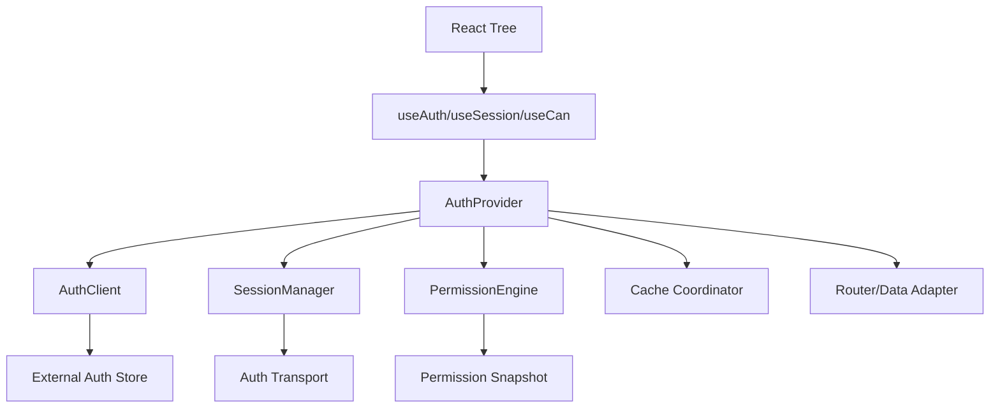
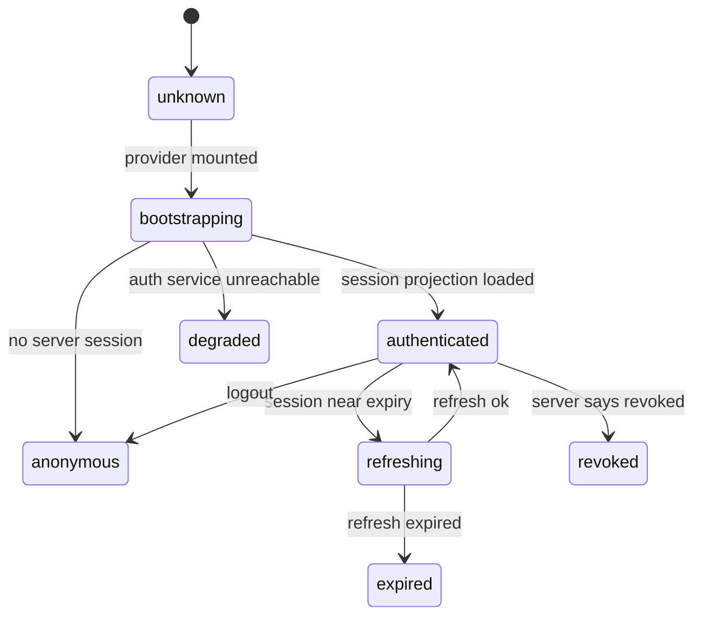

# Part 114 — Build React Auth Provider from Scratch

Part 111 built the auth client.

Part 112 built the session manager.

Part 113 built the permission engine.

Now we bind them into React.

The goal is not to create a fancy context wrapper.

The goal is to create a **stable auth boundary** that lets the React tree observe auth state, permission decisions, session lifecycle, and logout/tenant changes without turning every component into an auth subsystem.

A production-grade React Auth Provider must avoid:

- global mutable auth state hidden behind random imports,
- hooks that perform login or refresh as render side effects,
- role checks scattered across components,
- stale permissions after tenant switch,
- hydration mismatches,
- infinite bootstrap loops,
- unbounded re-renders,
- optimistic UI that survives logout,
- and provider code that cannot be tested without a browser.

## Provider responsibility

The provider is an adapter.

It adapts auth infrastructure to React.

It should not become the place where every product rule lives.



The provider should expose:

- a snapshot of auth state,
- stable commands like `login`, `logout`, `refresh`, `switchTenant`,
- permission helpers like `can`, `batchCan`, and `useCan`,
- session lifecycle events,
- and cache cleanup coordination.

It should not expose:

- access tokens unless architecture explicitly requires it,
- raw refresh token state,
- internal policy traces,
- auth provider SDK internals,
- or mutable objects that components can accidentally modify.

## Core invariants

| Invariant | Meaning |
|---|---|
| React observes snapshots | React components read immutable snapshots, not mutable auth internals. |
| Commands are stable | `login`, `logout`, `refresh`, and `switchTenant` do not change identity every render. |
| Bootstrap is explicit | Provider startup is a state, not an accidental loading boolean. |
| No auth side effects during render | Login, refresh, logout, and redirects happen in effects/actions/loaders, not render logic. |
| Permission is deny-by-default | `useCan()` returns a typed denied/unknown decision before data is ready. |
| Token exposure is architecture-gated | Provider does not leak tokens by default. |
| Tenant switch is destructive | Caches and permission projections are invalidated before new tenant UI is shown. |
| Logout wins | Logout aborts in-flight work and suppresses stale async responses. |
| SSR snapshot is reconciled | Server-provided session projection is not blindly trusted forever. |
| Tests can inject fake clients | Provider is wired through interfaces, not hardcoded SDK globals. |

## Contract first

Define interfaces before implementation.

```ts
export type AuthStatus =
  | "unknown"
  | "bootstrapping"
  | "anonymous"
  | "authenticating"
  | "authenticated"
  | "refreshing"
  | "expired"
  | "revoked"
  | "forbidden"
  | "degraded";

export type UserProjection = {
  id: string;
  displayName?: string;
  email?: string;
  avatarUrl?: string;
};

export type TenantProjection = {
  id: string;
  name: string;
};

export type AuthSnapshot = {
  status: AuthStatus;
  user: UserProjection | null;
  tenant: TenantProjection | null;
  sessionEpoch: number;
  permissionEpoch: number;
  policyVersion?: string;
  bootstrapped: boolean;
  error?: {
    code: string;
    message: string;
  };
};
```

Keep this projection small.

The provider should not dump the entire IdP profile or JWT claims into the tree.

## Auth commands

```ts
export type LoginOptions = {
  returnTo?: string;
  tenantHint?: string;
  stepUp?: boolean;
};

export type LogoutOptions = {
  reason?: "user" | "expired" | "revoked" | "forced";
  returnTo?: string;
};

export type AuthCommands = {
  login: (options?: LoginOptions) => Promise<void>;
  logout: (options?: LogoutOptions) => Promise<void>;
  refresh: () => Promise<AuthSnapshot>;
  switchTenant: (tenantId: string) => Promise<void>;
  revalidateSession: () => Promise<AuthSnapshot>;
};
```

Commands should be safe to call from UI event handlers, route actions, or controlled effects.

They should not be called during render.

## External store shape

React Context is not the best place for high-frequency mutable state by itself.

Use an external store and let React subscribe to snapshots.

```ts
export type Listener = () => void;

export class AuthStore {
  private snapshot: AuthSnapshot;
  private listeners = new Set<Listener>();

  constructor(initialSnapshot: AuthSnapshot) {
    this.snapshot = Object.freeze({ ...initialSnapshot });
  }

  getSnapshot = (): AuthSnapshot => {
    return this.snapshot;
  };

  subscribe = (listener: Listener): (() => void) => {
    this.listeners.add(listener);
    return () => this.listeners.delete(listener);
  };

  setSnapshot(next: AuthSnapshot): void {
    this.snapshot = Object.freeze({ ...next });
    for (const listener of this.listeners) listener();
  }
}
```

React can consume this store with `useSyncExternalStore`.

## Auth client interface

The provider should not depend on a concrete SDK.

```ts
export type AuthClientPort = AuthCommands & {
  getSnapshot: () => AuthSnapshot;
  subscribe: (listener: Listener) => () => void;
};
```

An Auth0, Clerk, Cognito, custom BFF, or test fake can implement this port.

The React Provider stays stable.

## Permission service interface

```ts
export type PermissionServicePort = {
  can: (action: string, resource?: ResourceRef, context?: Partial<AuthzContext>) => Decision;
  batch: (checks: PermissionCheck[]) => Record<string, Decision>;
  clearCache: () => void;
};
```

The provider does not need to know whether permission comes from:

- role mapping,
- precomputed allowed actions,
- OpenFGA-like projection,
- OPA/Cedar decision projection,
- or a backend `/permissions/check` endpoint.

## Cache coordinator interface

Logout and tenant switch must clean up product caches.

```ts
export type CacheCoordinator = {
  clearAllAuthScopedData: (reason: string) => Promise<void> | void;
  clearTenantScopedData: (tenantId: string, reason: string) => Promise<void> | void;
  invalidatePermissionScopedData: (reason: string) => Promise<void> | void;
};
```

Examples:

- TanStack Query `queryClient.clear()`,
- Apollo cache reset,
- Redux slices reset,
- service worker cache cleanup,
- IndexedDB namespace cleanup,
- router revalidation,
- and local UI state reset.

## Context design

Avoid putting changing snapshots and stable commands in the same context value if that causes unnecessary rerenders.

Use separate contexts:

```tsx
import React, { createContext, useContext, useMemo, useSyncExternalStore } from "react";

const AuthClientContext = createContext<AuthClientPort | null>(null);
const PermissionContext = createContext<PermissionServicePort | null>(null);
const CacheCoordinatorContext = createContext<CacheCoordinator | null>(null);
```

The client object is stable.

The snapshot is read via subscription.

## Provider props

```ts
export type AuthProviderProps = {
  authClient: AuthClientPort;
  permissionService: PermissionServicePort;
  cacheCoordinator?: CacheCoordinator;
  children: React.ReactNode;
};
```

Implementation:

```tsx
export function AuthProvider({
  authClient,
  permissionService,
  cacheCoordinator,
  children,
}: AuthProviderProps) {
  const stableCacheCoordinator = useMemo<CacheCoordinator>(() => {
    return cacheCoordinator ?? {
      clearAllAuthScopedData: () => undefined,
      clearTenantScopedData: () => undefined,
      invalidatePermissionScopedData: () => undefined,
    };
  }, [cacheCoordinator]);

  return (
    <AuthClientContext.Provider value={authClient}>
      <PermissionContext.Provider value={permissionService}>
        <CacheCoordinatorContext.Provider value={stableCacheCoordinator}>
          <AuthLifecycleCoordinator />
          {children}
        </CacheCoordinatorContext.Provider>
      </PermissionContext.Provider>
    </AuthClientContext.Provider>
  );
}
```

The provider includes a lifecycle coordinator component for effects.

## Snapshot hook

```tsx
export function useAuthSnapshot(): AuthSnapshot {
  const client = useContext(AuthClientContext);
  if (!client) throw new Error("useAuthSnapshot must be used within AuthProvider");

  return useSyncExternalStore(
    client.subscribe,
    client.getSnapshot,
    client.getSnapshot,
  );
}
```

The third argument is the server snapshot getter for server rendering compatibility.

If your app uses SSR and has a serialized initial auth projection, pass a getter that returns that exact server snapshot during hydration.

## Convenience hooks

```tsx
export function useAuthStatus(): AuthStatus {
  return useAuthSnapshot().status;
}

export function useUser(): UserProjection | null {
  return useAuthSnapshot().user;
}

export function useTenant(): TenantProjection | null {
  return useAuthSnapshot().tenant;
}

export function useIsAuthenticated(): boolean {
  const status = useAuthStatus();
  return status === "authenticated" || status === "refreshing";
}
```

Be careful with `refreshing`.

A user can remain authenticated while the session manager refreshes in the background, but sensitive actions may need to pause until refresh outcome is known.

## Command hooks

```tsx
export function useAuthCommands(): AuthCommands {
  const client = useContext(AuthClientContext);
  if (!client) throw new Error("useAuthCommands must be used within AuthProvider");

  return useMemo(() => ({
    login: client.login,
    logout: client.logout,
    refresh: client.refresh,
    switchTenant: client.switchTenant,
    revalidateSession: client.revalidateSession,
  }), [client]);
}
```

Do not expose raw client internals unless necessary.

## Permission hook

```tsx
export function useCan(
  action: string,
  resource?: ResourceRef,
  context?: Partial<AuthzContext>,
): Decision {
  const snapshot = useAuthSnapshot();
  const permission = useContext(PermissionContext);

  if (!permission) throw new Error("useCan must be used within AuthProvider");

  return useMemo(() => {
    if (!snapshot.bootstrapped) {
      return {
        status: "unknown",
        allowed: false,
        reason: "UNKNOWN_PERMISSION",
        cacheable: false,
        stale: false,
      } satisfies Decision;
    }

    return permission.can(action, resource, {
      ...context,
      tenantId: context?.tenantId ?? snapshot.tenant?.id,
      sessionEpoch: snapshot.sessionEpoch,
      permissionEpoch: snapshot.permissionEpoch,
      policyVersion: snapshot.policyVersion,
    });
  }, [permission, action, stableResourceKey(resource), stableContextKey(context), snapshot.bootstrapped, snapshot.tenant?.id, snapshot.sessionEpoch, snapshot.permissionEpoch, snapshot.policyVersion]);
}
```

The dependency list uses stable keys.

In real code, prefer memoized `ResourceRef` objects or a small custom hook to avoid repeated serialization.

## Stable key helpers

```ts
function stableResourceKey(resource?: ResourceRef): string {
  if (!resource) return "none";
  return JSON.stringify({
    type: resource.type,
    id: resource.id,
    tenantId: resource.tenantId,
    ownerId: resource.ownerId,
    state: resource.state,
    attributes: resource.attributes,
  });
}

function stableContextKey(context?: Partial<AuthzContext>): string {
  if (!context) return "none";
  return JSON.stringify({
    tenantId: context.tenantId,
    routeId: context.routeId,
    requestSource: context.requestSource,
    networkMode: context.networkMode,
  });
}
```

For high-frequency components, avoid JSON stringification by requiring stable resource references.

## `Can` component

```tsx
export type CanProps = {
  action: string;
  resource?: ResourceRef;
  children: React.ReactNode | ((decision: Decision) => React.ReactNode);
  fallback?: React.ReactNode | ((decision: Decision) => React.ReactNode);
};

export function Can({ action, resource, children, fallback = null }: CanProps) {
  const decision = useCan(action, resource);

  if (decision.allowed) {
    return <>{typeof children === "function" ? children(decision) : children}</>;
  }

  return <>{typeof fallback === "function" ? fallback(decision) : fallback}</>;
}
```

Usage:

```tsx
<Can
  action="case.close"
  resource={caseResource}
  fallback={<DisabledAction reason="You cannot close this case." />}
>
  <CloseCaseButton caseId={caseId} />
</Can>
```

`Can` is useful, but do not overuse it inside large lists.

For tables, batch decisions or use server-projected `allowedActions`.

## Authorized button

```tsx
export type AuthorizedButtonProps = React.ButtonHTMLAttributes<HTMLButtonElement> & {
  action: string;
  resource?: ResourceRef;
  deniedMode?: "hide" | "disable";
  deniedLabel?: string;
};

export function AuthorizedButton({
  action,
  resource,
  deniedMode = "disable",
  deniedLabel,
  children,
  disabled,
  ...props
}: AuthorizedButtonProps) {
  const decision = useCan(action, resource);

  if (!decision.allowed && deniedMode === "hide") return null;

  return (
    <button
      {...props}
      disabled={disabled || !decision.allowed}
      aria-disabled={disabled || !decision.allowed}
      title={!decision.allowed ? deniedLabel ?? decision.userMessage : props.title}
    >
      {children}
    </button>
  );
}
```

Disabling can be better than hiding when the user needs to understand that an action exists but requires access.

Hiding can be better when exposure itself leaks sensitive workflow existence.

This is product/security policy, not just component preference.

## Lifecycle coordinator

The provider needs effectful coordination for cache cleanup and permission cache invalidation.

```tsx
function AuthLifecycleCoordinator() {
  const snapshot = useAuthSnapshot();
  const permission = useContext(PermissionContext);
  const cache = useContext(CacheCoordinatorContext);

  const previous = React.useRef<AuthSnapshot | null>(null);

  React.useEffect(() => {
    const prev = previous.current;
    previous.current = snapshot;

    if (!prev) return;

    if (prev.sessionEpoch !== snapshot.sessionEpoch) {
      permission?.clearCache();
      void cache?.clearAllAuthScopedData("session_epoch_changed");
    }

    if (prev.permissionEpoch !== snapshot.permissionEpoch) {
      permission?.clearCache();
      void cache?.invalidatePermissionScopedData("permission_epoch_changed");
    }

    if (prev.tenant?.id && snapshot.tenant?.id && prev.tenant.id !== snapshot.tenant.id) {
      permission?.clearCache();
      void cache?.clearTenantScopedData(prev.tenant.id, "tenant_switched");
    }

    if (snapshot.status === "anonymous" || snapshot.status === "revoked" || snapshot.status === "expired") {
      permission?.clearCache();
      void cache?.clearAllAuthScopedData(`auth_status_${snapshot.status}`);
    }
  }, [snapshot, permission, cache]);

  return null;
}
```

This component centralizes cleanup policy.

Without this, every feature team invents its own cleanup behavior.

## Bootstrap model

Provider bootstrap should be explicit.



Do not show authenticated layouts while status is `unknown`.

Use skeletons or public shells.

Bad:

```tsx
if (!user) return <Login />;
return <SensitiveDashboard />;
```

Better:

```tsx
switch (snapshot.status) {
  case "unknown":
  case "bootstrapping":
    return <AppShellSkeleton />;
  case "anonymous":
    return <PublicLanding />;
  case "authenticated":
  case "refreshing":
    return <AuthenticatedApp />;
  case "expired":
  case "revoked":
    return <SessionEnded />;
  case "degraded":
    return <DegradedAuthExperience />;
}
```

## Bootstrap component

If your auth client does not bootstrap before provider mount, add a bootstrapper.

```tsx
export function AuthBootstrap({ children }: { children: React.ReactNode }) {
  const snapshot = useAuthSnapshot();
  const { revalidateSession } = useAuthCommands();

  React.useEffect(() => {
    if (snapshot.status !== "unknown") return;
    void revalidateSession();
  }, [snapshot.status, revalidateSession]);

  if (snapshot.status === "unknown" || snapshot.status === "bootstrapping") {
    return <AppShellSkeleton />;
  }

  return <>{children}</>;
}
```

Do not start bootstrap from arbitrary feature pages.

Auth bootstrap should happen at the top boundary or route loader layer.

## Suspense-compatible pattern

You can integrate Suspense, but do not turn auth errors into invisible promise loops.

A simple resource wrapper:

```ts
export type BootstrapResource = {
  read: () => AuthSnapshot;
};

export function createBootstrapResource(promise: Promise<AuthSnapshot>): BootstrapResource {
  let status: "pending" | "success" | "error" = "pending";
  let value: AuthSnapshot;
  let error: unknown;

  const suspender = promise.then(
    (snapshot) => {
      status = "success";
      value = snapshot;
    },
    (err) => {
      status = "error";
      error = err;
    },
  );

  return {
    read() {
      if (status === "pending") throw suspender;
      if (status === "error") throw error;
      return value;
    },
  };
}
```

Use Suspense when your route/framework architecture supports it cleanly.

For many auth flows, explicit state machine rendering is easier to debug.

## Route integration

The provider should work with route-level auth.

React Router Data Mode can load session before render.

```ts
export async function protectedLoader({ request }: LoaderFunctionArgs) {
  const session = await sessionApi.getSession(request);

  if (!session.authenticated) {
    throw redirect(`/login?returnTo=${encodeURIComponent(new URL(request.url).pathname)}`);
  }

  return { session };
}
```

Then hydrate provider from loader data:

```tsx
export function AuthenticatedLayout() {
  const { session } = useLoaderData() as { session: AuthSnapshot };

  return (
    <AuthProvider
      authClient={createAuthClient({ initialSnapshot: session })}
      permissionService={createPermissionService(session)}
    >
      <Outlet />
    </AuthProvider>
  );
}
```

This avoids protected content rendering before auth state is known.

## Next.js integration shape

In a server-rendered app, the provider should receive a minimal initial projection.

```tsx
export async function AuthenticatedShell({ children }: { children: React.ReactNode }) {
  const session = await getSessionProjectionFromCookies();

  return (
    <AuthProvider
      authClient={createBrowserAuthClient({ initialSnapshot: session })}
      permissionService={createPermissionServiceFromProjection(session)}
    >
      {children}
    </AuthProvider>
  );
}
```

Never pass tokens or raw sensitive claims into Client Component props.

Pass the minimum session projection needed for rendering.

## Tenant switch flow

Tenant switch is not a dropdown state change.

It is a destructive auth-context transition.

```ts
async function switchTenant(tenantId: string): Promise<void> {
  authStore.setSnapshot({
    ...authStore.getSnapshot(),
    status: "bootstrapping",
  });

  await cacheCoordinator.clearAllAuthScopedData("tenant_switch_start");
  permissionService.clearCache();

  const next = await transport.switchTenant(tenantId);

  authStore.setSnapshot({
    ...next,
    sessionEpoch: authStore.getSnapshot().sessionEpoch + 1,
    permissionEpoch: authStore.getSnapshot().permissionEpoch + 1,
  });
}
```

Do not keep old tenant data visible while new tenant auth is unresolved.

## Logout flow

Logout must clear UI state, permission state, and data caches.

```ts
async function logout(options?: LogoutOptions): Promise<void> {
  const current = authStore.getSnapshot();

  authStore.setSnapshot({
    ...current,
    status: "anonymous",
    user: null,
    tenant: null,
    sessionEpoch: current.sessionEpoch + 1,
    permissionEpoch: current.permissionEpoch + 1,
    bootstrapped: true,
  });

  permissionService.clearCache();
  await cacheCoordinator.clearAllAuthScopedData(options?.reason ?? "logout");

  try {
    await transport.logout(options);
  } finally {
    crossTab.broadcast({ type: "logout", reason: options?.reason ?? "logout" });
  }
}
```

UI cleanup should not wait forever for the network.

Server revocation is still required, but React should stop exposing authenticated UI immediately.

## Token exposure boundary

The provider should not expose tokens by default.

Bad:

```tsx
const { accessToken } = useAuth();
```

Better:

```tsx
const api = useApiClient();
await api.get("/cases");
```

Token attachment belongs in the API client boundary, not random components.

If your architecture is pure SPA and must use bearer tokens, expose a narrow `getAccessTokenSilently()` only through infrastructure code, not general UI components.

## Error boundary integration

Auth errors should be typed.

```ts
export class AuthError extends Error {
  constructor(
    public readonly code:
      | "SESSION_EXPIRED"
      | "SESSION_REVOKED"
      | "AUTH_SERVICE_UNAVAILABLE"
      | "FORBIDDEN"
      | "STEP_UP_REQUIRED",
    message: string,
  ) {
    super(message);
  }
}
```

Render safe recovery:

```tsx
export function AuthErrorView({ error }: { error: AuthError }) {
  const { login, logout } = useAuthCommands();

  if (error.code === "SESSION_EXPIRED") {
    return <SessionEnded onSignIn={() => login()} />;
  }

  if (error.code === "STEP_UP_REQUIRED") {
    return <StepUpPrompt onContinue={() => login({ stepUp: true })} />;
  }

  if (error.code === "FORBIDDEN") {
    return <Forbidden />;
  }

  return <AuthUnavailable onRetry={() => window.location.reload()} onSignOut={() => logout()} />;
}
```

Avoid dumping raw errors into UI.

## Provider testing

Use fake ports.

```ts
function createFakeAuthClient(initial: AuthSnapshot): AuthClientPort & { emit(next: AuthSnapshot): void } {
  const store = new AuthStore(initial);

  return {
    getSnapshot: store.getSnapshot,
    subscribe: store.subscribe,
    emit: (next) => store.setSnapshot(next),
    login: vi.fn(async () => undefined),
    logout: vi.fn(async () => undefined),
    refresh: vi.fn(async () => store.getSnapshot()),
    switchTenant: vi.fn(async () => undefined),
    revalidateSession: vi.fn(async () => store.getSnapshot()),
  };
}
```

Test hook rendering:

```tsx
function Probe() {
  const snapshot = useAuthSnapshot();
  return <div data-testid="status">{snapshot.status}</div>;
}

test("renders auth status from external store", () => {
  const client = createFakeAuthClient({
    status: "anonymous",
    user: null,
    tenant: null,
    sessionEpoch: 1,
    permissionEpoch: 1,
    bootstrapped: true,
  });

  render(
    <AuthProvider authClient={client} permissionService={fakePermissionService()}>
      <Probe />
    </AuthProvider>,
  );

  expect(screen.getByTestId("status")).toHaveTextContent("anonymous");

  act(() => client.emit({
    status: "authenticated",
    user: { id: "u1" },
    tenant: { id: "t1", name: "Tenant 1" },
    sessionEpoch: 2,
    permissionEpoch: 2,
    bootstrapped: true,
  }));

  expect(screen.getByTestId("status")).toHaveTextContent("authenticated");
});
```

## Testing `useCan`

```tsx
function CloseButton({ resource }: { resource: ResourceRef }) {
  const decision = useCan("case.close", resource);
  return <button disabled={!decision.allowed}>Close</button>;
}

test("denies action before permission is available", () => {
  render(
    <AuthProvider
      authClient={createFakeAuthClient({
        status: "bootstrapping",
        user: null,
        tenant: null,
        sessionEpoch: 1,
        permissionEpoch: 1,
        bootstrapped: false,
      })}
      permissionService={fakePermissionService()}
    >
      <CloseButton resource={{ type: "case", id: "c1", tenantId: "t1" }} />
    </AuthProvider>,
  );

  expect(screen.getByRole("button", { name: /close/i })).toBeDisabled();
});
```

The test should verify deny-by-default behavior, not just the happy path.

## Performance concerns

Provider performance problems usually come from unstable values.

Avoid this:

```tsx
<AuthProvider
  authClient={createAuthClient()}
  permissionService={createPermissionService()}
>
  {children}
</AuthProvider>
```

That recreates infrastructure every render.

Create clients outside render or memoize them:

```tsx
function AppProviders({ initialSession, children }: Props) {
  const authClient = React.useMemo(
    () => createAuthClient({ initialSnapshot: initialSession }),
    [initialSession.sessionEpoch],
  );

  const permissionService = React.useMemo(
    () => createPermissionService(authClient),
    [authClient],
  );

  return (
    <AuthProvider authClient={authClient} permissionService={permissionService}>
      {children}
    </AuthProvider>
  );
}
```

Keep snapshots immutable and small.

A provider should not cause the whole app to rerender every time a background refresh updates a non-render-relevant timestamp.

## Split snapshot from diagnostics

Do not include volatile diagnostics in the main render snapshot.

Bad:

```ts
{
  status: "authenticated",
  lastRefreshStartedAt: 123,
  lastRefreshCompletedAt: 124,
  lastRequestId: "req_..."
}
```

This can trigger app-wide rerenders.

Keep diagnostics in observability/logging channels.

## SSR and hydration rules

SSR auth is fragile when server and client disagree.

Rules:

- server snapshot and first client snapshot must match for hydration,
- sensitive data should not be serialized into Client Component props,
- permission projection should be minimal,
- client should revalidate after hydration when session is near expiry,
- logout in another tab should invalidate SSR-visible data after hydration,
- cache keys must include tenant/session/permission epoch,
- do not use `suppressHydrationWarning` to hide auth design bugs.

Example initial snapshot:

```html
<script id="__AUTH_SESSION__" type="application/json">
{"status":"authenticated","user":{"id":"u1"},"tenant":{"id":"t1","name":"Tenant 1"},"sessionEpoch":12,"permissionEpoch":9,"bootstrapped":true}
</script>
```

Do not include access token, refresh token, raw ID token, or sensitive claims in this script.

## Auth provider with API client

The provider can also expose an API client, but keep it separate.

```tsx
const ApiClientContext = createContext<ApiClient | null>(null);

export function ApiProvider({ apiClient, children }: { apiClient: ApiClient; children: React.ReactNode }) {
  return <ApiClientContext.Provider value={apiClient}>{children}</ApiClientContext.Provider>;
}

export function useApiClient(): ApiClient {
  const api = useContext(ApiClientContext);
  if (!api) throw new Error("useApiClient must be used within ApiProvider");
  return api;
}
```

Why separate?

Because auth state and API transport evolve differently.

The API client can depend on auth infrastructure, but product components should not manipulate auth transport directly.

## End-to-end composition

```tsx
export function RootProviders({ children, initialSession }: RootProvidersProps) {
  const authClient = React.useMemo(
    () => createBrowserAuthClient({ initialSnapshot: initialSession }),
    [initialSession.sessionEpoch, initialSession.permissionEpoch],
  );

  const sessionManager = React.useMemo(
    () => createSessionManager({ authClient }),
    [authClient],
  );

  const permissionService = React.useMemo(
    () => createPermissionService({ authClient }),
    [authClient],
  );

  const queryClient = React.useMemo(() => createQueryClient(), []);

  const cacheCoordinator = React.useMemo<CacheCoordinator>(() => ({
    clearAllAuthScopedData: async () => {
      queryClient.clear();
      await clearAuthScopedIndexedDb();
    },
    clearTenantScopedData: async () => {
      queryClient.clear();
    },
    invalidatePermissionScopedData: async () => {
      await queryClient.invalidateQueries({ predicate: (query) => query.queryKey.includes("permissionScoped") });
    },
  }), [queryClient]);

  React.useEffect(() => {
    sessionManager.start();
    return () => sessionManager.stop();
  }, [sessionManager]);

  return (
    <QueryClientProvider client={queryClient}>
      <AuthProvider
        authClient={authClient}
        permissionService={permissionService}
        cacheCoordinator={cacheCoordinator}
      >
        {children}
      </AuthProvider>
    </QueryClientProvider>
  );
}
```

This is the shape you want: infrastructure composed at the app boundary, feature components reading stable hooks.

## Common anti-patterns

### Anti-pattern: provider does everything

A provider that contains SDK wiring, permission policy, API client, router redirects, analytics, feature flags, and product logic becomes impossible to test.

Keep ports separate.

### Anti-pattern: login on render

```tsx
if (snapshot.status === "anonymous") login();
```

Rendering must be pure.

Perform redirects in route loaders, effects, or user actions.

### Anti-pattern: exposing token through context

```tsx
const { token } = useAuth();
```

This spreads credential handling across UI.

### Anti-pattern: context value recreated every render

```tsx
<AuthContext.Provider value={{ snapshot, login, logout }}>
```

This can rerender too much if not memoized and split carefully.

### Anti-pattern: ambiguous loading state

```ts
loading: boolean
```

Auth has multiple states: unknown, bootstrapping, refreshing, expired, revoked, degraded.

Use typed states.

### Anti-pattern: permission hook returns boolean

```ts
const allowed = useCan("case.close", resource);
```

You lose denial reason, stale state, and step-up recovery.

### Anti-pattern: provider bypasses router auth

Component-level provider guard does not replace route loader/action authorization.

## Production checklist

Before shipping the provider:

- [ ] Auth snapshot is immutable and small.
- [ ] Provider does not expose tokens by default.
- [ ] Commands are stable and testable.
- [ ] Auth bootstrap has explicit states.
- [ ] `useSyncExternalStore` or equivalent external-store subscription is used for snapshot consistency.
- [ ] Permission hook returns typed decisions.
- [ ] Permission is deny-by-default before bootstrap.
- [ ] Tenant switch clears auth-scoped caches.
- [ ] Logout clears permission cache and data caches immediately.
- [ ] Provider supports fake clients in tests.
- [ ] SSR initial snapshot does not include sensitive tokens/claims.
- [ ] Hydration mismatch is handled by design, not suppressed blindly.
- [ ] Router loader/action authorization still exists.
- [ ] Server-side enforcement still exists for every protected request.

## Summary

A React Auth Provider is not a security product by itself.

It is the composition layer that lets the React tree observe auth infrastructure safely.

The provider should:

- expose immutable snapshots,
- expose stable commands,
- integrate a permission engine,
- coordinate cache cleanup,
- avoid token exposure,
- support SSR/hydration constraints,
- preserve deny-by-default behavior,
- and stay testable through ports.

Once this provider exists, feature code can become boring:

```tsx
const user = useUser();
const decision = useCan("case.close", caseResource);
```

Boring is the goal.

Boring means the risky auth logic lives in one reviewed place instead of leaking across every component.

Part 115 will build route guards from scratch using the same primitives: auth snapshot, permission decision, safe redirect, route metadata, and loader/action boundaries.

## References

- React `useSyncExternalStore` — https://react.dev/reference/react/useSyncExternalStore
- React Context — https://react.dev/reference/react/createContext
- React Rules of Hooks — https://react.dev/reference/rules/rules-of-hooks
- React Router Data Loading — https://reactrouter.com/start/framework/data-loading
- OWASP Authorization Cheat Sheet — https://cheatsheetseries.owasp.org/cheatsheets/Authorization_Cheat_Sheet.html
