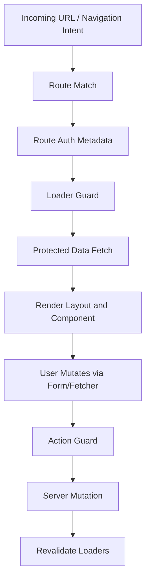

# Part 115 — Build Route Guards from Scratch

A route guard is often introduced as a small wrapper:

```tsx
return user ? <Outlet /> : <Navigate to="/login" />;
```

That is fine for a demo.

It is not enough for a production auth system.

A real route guard must decide **before protected data is fetched**, **before protected layout is rendered**, and **before mutation is accepted**.

It must also handle redirect safety, tenant scope, permission metadata, step-up authentication, cache invalidation, and typed denial responses.

This part builds route guards from scratch using the primitives created in the previous build-from-scratch parts:

- Part 111: `AuthClient`
- Part 112: `SessionManager`
- Part 113: `PermissionEngine`
- Part 114: `AuthProvider`

The goal is not a clever `ProtectedRoute` component.

The goal is a **route authorization boundary**.

## Mental model

A route is not just a component.

A route is a product capability boundary.



If a guard only wraps `Render`, it is late.

The application may already have:

- fetched protected data,
- rendered protected shell fragments,
- cached unauthorized data,
- constructed unsafe return URLs,
- or let a mutation reach the wrong backend endpoint.

Route guards must exist at three levels:

| Level | Purpose | Security role |
|---|---|---|
| Loader guard | AuthN/AuthZ before route data fetch | Prevent data exposure and unsafe route entry |
| Action guard | AuthZ before mutation | Prevent unauthorized writes and state transitions |
| Component guard | UI exposure control | Hide/disable/explain visible affordances |

The frontend guard is still not the final enforcement boundary.

The server/API must authorize every protected request.

But the route guard is still important because it prevents accidental frontend data leaks, reduces broken UX, gives consistent redirect behavior, and makes the auth boundary reviewable.

## Guard invariants

A production route guard should satisfy these invariants:

| Invariant | Meaning |
|---|---|
| No protected data before auth | Route data fetch waits until session/tenant/permission is known. |
| Deny by default | Unknown auth or permission state does not render protected UI. |
| Redirects are safe | Return URLs are internal, normalized, and not user-controlled absolute destinations. |
| 401 and 403 are different | Unauthenticated users login; authenticated users receive denial/explanation. |
| Route metadata is typed | Route policy is explicit and statically discoverable. |
| Loader and action align | A route that renders a capability must not mutate it without a corresponding action policy. |
| Tenant is part of auth | Tenant mismatch is not a normal 404; it is an auth/context failure. |
| Step-up is explicit | Sensitive actions can demand stronger assurance without conflating it with permission. |
| Logout wins | Logout cancels/suppresses pending loader/action results. |
| Server still enforces | Client guards optimize safety/UX; backend remains authoritative. |

## Define route auth metadata

Start with a small typed policy model.

Do not store arbitrary booleans like `adminOnly` across routes.

Booleans do not scale.

Define the product capability required by the route.

```ts
export type RouteAuthMode =
  | "public"
  | "anonymousOnly"
  | "authenticated"
  | "authorized";

export type AssuranceLevel = "aal1" | "aal2" | "aal3";

export type RouteAuthMeta = {
  mode: RouteAuthMode;

  /** Permission needed to enter this route. */
  permission?: {
    action: string;
    resource?: ResourceDescriptor;
  };

  /** Tenant context required by this route. */
  tenant?: {
    required: boolean;
    source: "url" | "session" | "routeParam";
    paramName?: string;
  };

  /** Sensitive route/action needs recent or stronger authentication. */
  assurance?: {
    minLevel?: AssuranceLevel;
    maxAgeSeconds?: number;
  };

  /** UX behavior when denied. */
  denial?: {
    strategy: "redirect" | "errorBoundary" | "notFound";
    reasonCode?: string;
  };
};

export type ResourceDescriptor = {
  type: string;
  id?: string;
  tenantId?: string;
  attributes?: Record<string, unknown>;
};
```

Example route metadata:

```ts
export const caseDetailRouteAuth: RouteAuthMeta = {
  mode: "authorized",
  tenant: {
    required: true,
    source: "routeParam",
    paramName: "tenantId",
  },
  permission: {
    action: "case.read",
    resource: {
      type: "case",
    },
  },
  denial: {
    strategy: "errorBoundary",
    reasonCode: "case_read_denied",
  },
};
```

The metadata is intentionally not tied to React Router internals.

This lets the same policy drive:

- React Router route `handle`,
- Next.js route segment config,
- tests,
- generated navigation,
- access matrix docs,
- and CI guardrails.

## Define guard results

A guard should not return random booleans.

Return a typed result.

```ts
export type GuardResult =
  | {
      kind: "allow";
      session: SessionProjection;
      tenantId?: string;
      permission?: PermissionDecision;
    }
  | {
      kind: "redirect";
      to: string;
      status?: 302 | 303 | 307;
      reason: AuthRedirectReason;
    }
  | {
      kind: "deny";
      status: 401 | 403 | 404 | 428;
      code: string;
      publicMessage: string;
      internalReason?: string;
      correlationId?: string;
    };

export type AuthRedirectReason =
  | "login_required"
  | "anonymous_only"
  | "step_up_required"
  | "tenant_selection_required";
```

A guard result can be adapted to any routing framework.

For React Router:

- `allow` means continue loader/action,
- `redirect` means `throw redirect(to)`,
- `deny` means throw a typed `Response` or framework-specific error.

For Next.js:

- `allow` means render or continue handler,
- `redirect` means `redirect(to)`,
- `deny` means `notFound()` or custom error response depending on route type.

## Safe return URL handling

Do not pass raw `location.href` into login.

Do not trust `?returnTo=`.

Define a canonicalizer.

```ts
export function normalizeInternalReturnTo(input: string | null | undefined): string {
  if (!input) return "/";

  let url: URL;

  try {
    url = new URL(input, "https://app.example.internal");
  } catch {
    return "/";
  }

  const isSameOrigin = url.origin === "https://app.example.internal";
  if (!isSameOrigin) return "/";

  if (!url.pathname.startsWith("/")) return "/";

  const forbiddenPrefixes = ["/auth/callback", "/logout", "/api"];
  if (forbiddenPrefixes.some((prefix) => url.pathname.startsWith(prefix))) {
    return "/";
  }

  return `${url.pathname}${url.search}${url.hash}`;
}
```

In browser code, use the real application origin:

```ts
export function safeReturnToFromLocation(location: Location): string {
  const url = new URL(location.href);
  return normalizeInternalReturnTo(`${url.pathname}${url.search}${url.hash}`);
}
```

Rule:

> Return URLs are product navigation hints, not protocol authority.

OAuth/OIDC callback state should be separate from product return URL.

## Build the core guard evaluator

The evaluator receives route metadata and a request context.

It does not import React.

It does not import React Router.

```ts
export type RouteGuardContext = {
  url: URL;
  params: Record<string, string | undefined>;
  authClient: AuthClient;
  permissionEngine: PermissionEngine;
  now: Date;
  correlationId: string;
};

export async function evaluateRouteGuard(
  meta: RouteAuthMeta,
  context: RouteGuardContext,
): Promise<GuardResult> {
  const session = await context.authClient.getSessionSnapshot();

  if (meta.mode === "public") {
    return allow(session, undefined);
  }

  if (meta.mode === "anonymousOnly") {
    if (session.status === "authenticated") {
      return {
        kind: "redirect",
        to: "/",
        status: 302,
        reason: "anonymous_only",
      };
    }

    return allow(session, undefined);
  }

  if (session.status !== "authenticated") {
    const returnTo = normalizeInternalReturnTo(
      `${context.url.pathname}${context.url.search}${context.url.hash}`,
    );

    return {
      kind: "redirect",
      to: `/login?returnTo=${encodeURIComponent(returnTo)}`,
      status: 302,
      reason: "login_required",
    };
  }

  const tenantResult = resolveTenant(meta, context, session);
  if (tenantResult.kind !== "allow") return tenantResult;

  const assuranceResult = evaluateAssurance(meta, session, context.now);
  if (assuranceResult.kind !== "allow") return assuranceResult;

  if (meta.mode === "authenticated") {
    return allow(session, tenantResult.tenantId);
  }

  if (!meta.permission) {
    return {
      kind: "deny",
      status: 403,
      code: "route_permission_missing",
      publicMessage: "This route is not available.",
      internalReason: "Route mode is authorized but permission metadata is missing.",
      correlationId: context.correlationId,
    };
  }

  const resource = materializeResource(meta.permission.resource, context, tenantResult.tenantId);

  const decision = await context.permissionEngine.can({
    subject: session.subject,
    action: meta.permission.action,
    resource,
    context: {
      tenantId: tenantResult.tenantId,
      authTime: session.authTime,
      assuranceLevel: session.assuranceLevel,
      correlationId: context.correlationId,
      requestSource: "route-loader",
    },
  });

  if (!decision.allowed) {
    return {
      kind: "deny",
      status: decision.requiresStepUp ? 428 : 403,
      code: decision.reasonCode ?? "route_forbidden",
      publicMessage: decision.publicReason ?? "You do not have access to this page.",
      internalReason: decision.internalReason,
      correlationId: context.correlationId,
    };
  }

  return {
    kind: "allow",
    session,
    tenantId: tenantResult.tenantId,
    permission: decision,
  };
}

function allow(session: SessionProjection, tenantId?: string): GuardResult {
  return {
    kind: "allow",
    session,
    tenantId,
  };
}
```

The evaluator is the core.

Everything else is adapter code.

## Tenant resolution

Tenant resolution is not cosmetic.

In SaaS and regulated platforms, tenant context is part of authorization.

```ts
function resolveTenant(
  meta: RouteAuthMeta,
  context: RouteGuardContext,
  session: SessionProjection,
):
  | { kind: "allow"; tenantId?: string }
  | Extract<GuardResult, { kind: "redirect" | "deny" }> {
  if (!meta.tenant?.required) {
    return { kind: "allow" };
  }

  const tenantId = (() => {
    if (meta.tenant.source === "session") return session.activeTenantId;
    if (meta.tenant.source === "url") return context.url.searchParams.get("tenantId") ?? undefined;
    if (meta.tenant.source === "routeParam") return context.params[meta.tenant.paramName ?? "tenantId"];
    return undefined;
  })();

  if (!tenantId) {
    return {
      kind: "redirect",
      to: "/select-tenant",
      reason: "tenant_selection_required",
    };
  }

  if (!session.memberships.some((m) => m.tenantId === tenantId)) {
    return {
      kind: "deny",
      status: 404,
      code: "tenant_not_found_or_not_accessible",
      publicMessage: "The requested workspace was not found.",
      internalReason: `Subject is not a member of tenant ${tenantId}.`,
      correlationId: context.correlationId,
    };
  }

  return { kind: "allow", tenantId };
}
```

Returning `404` for inaccessible tenant may be appropriate when you do not want to confirm tenant existence.

But internally, log it as an authorization denial.

Do not lose the security signal.

## Step-up evaluation

Step-up is not permission.

A user may be allowed to approve payment, but still need stronger or fresher authentication before doing it.

```ts
function evaluateAssurance(
  meta: RouteAuthMeta,
  session: SessionProjection,
  now: Date,
): { kind: "allow" } | Extract<GuardResult, { kind: "redirect" }> {
  if (!meta.assurance) return { kind: "allow" };

  const min = meta.assurance.minLevel;
  const maxAgeSeconds = meta.assurance.maxAgeSeconds;

  const levelRank: Record<AssuranceLevel, number> = {
    aal1: 1,
    aal2: 2,
    aal3: 3,
  };

  if (min && levelRank[session.assuranceLevel] < levelRank[min]) {
    return {
      kind: "redirect",
      to: `/step-up?returnTo=${encodeURIComponent("/current")}`,
      reason: "step_up_required",
    };
  }

  if (maxAgeSeconds) {
    const age = Math.floor((now.getTime() - new Date(session.authTime).getTime()) / 1000);
    if (age > maxAgeSeconds) {
      return {
        kind: "redirect",
        to: `/step-up?returnTo=${encodeURIComponent("/current")}`,
        reason: "step_up_required",
      };
    }
  }

  return { kind: "allow" };
}
```

In real code, pass the actual normalized return URL into this function.

The example keeps the shape small.

## React Router adapter: loader guard

React Router route data is loaded through loaders.

That makes loaders the right place to guard protected route data.

```ts
import { redirect } from "react-router";

export function guardedLoader<T>(options: {
  auth: RouteAuthMeta;
  load: (context: GuardedLoaderContext) => Promise<T>;
}) {
  return async function loader(args: LoaderFunctionArgs): Promise<T> {
    const url = new URL(args.request.url);
    const correlationId = getOrCreateCorrelationId(args.request);

    const result = await evaluateRouteGuard(options.auth, {
      url,
      params: args.params,
      authClient: serverAuthClientFromRequest(args.request),
      permissionEngine: permissionEngineFromRequest(args.request),
      now: new Date(),
      correlationId,
    });

    if (result.kind === "redirect") {
      throw redirect(result.to, { status: result.status ?? 302 });
    }

    if (result.kind === "deny") {
      throw jsonAuthError(result);
    }

    return options.load({
      request: args.request,
      params: args.params,
      session: result.session,
      tenantId: result.tenantId,
      permission: result.permission,
      correlationId,
    });
  };
}
```

The protected loader receives a `session` and `tenantId` that are already known.

It should not rediscover identity through globals.

```ts
export const loader = guardedLoader({
  auth: {
    mode: "authorized",
    tenant: {
      required: true,
      source: "routeParam",
      paramName: "tenantId",
    },
    permission: {
      action: "case.read",
      resource: {
        type: "case",
      },
    },
    denial: {
      strategy: "errorBoundary",
    },
  },

  async load({ params, tenantId, session }) {
    const caseId = requireParam(params, "caseId");

    // Server/API must still authorize this object-level read.
    const caseDto = await caseApi.getCase({
      caseId,
      tenantId: requireValue(tenantId),
      actorId: session.subject.id,
    });

    return {
      case: caseDto,
    };
  },
});
```

Notice the comment.

The loader guard does not replace object-level authorization in `caseApi.getCase`.

It prevents obvious route entry/data fetch mistakes.

The data layer still enforces object access.

## React Router adapter: action guard

Actions mutate data.

Actions need their own guard.

Never assume that because a route was visible, the mutation is allowed.

```ts
export function guardedAction<T>(options: {
  auth: RouteAuthMeta;
  action: (context: GuardedActionContext) => Promise<T>;
}) {
  return async function action(args: ActionFunctionArgs): Promise<T> {
    const url = new URL(args.request.url);
    const correlationId = getOrCreateCorrelationId(args.request);

    const result = await evaluateRouteGuard(options.auth, {
      url,
      params: args.params,
      authClient: serverAuthClientFromRequest(args.request),
      permissionEngine: permissionEngineFromRequest(args.request),
      now: new Date(),
      correlationId,
    });

    if (result.kind === "redirect") {
      throw redirect(result.to, { status: result.status ?? 303 });
    }

    if (result.kind === "deny") {
      throw jsonAuthError(result);
    }

    return options.action({
      request: args.request,
      params: args.params,
      session: result.session,
      tenantId: result.tenantId,
      permission: result.permission,
      correlationId,
    });
  };
}
```

Example action:

```ts
export const action = guardedAction({
  auth: {
    mode: "authorized",
    tenant: {
      required: true,
      source: "routeParam",
      paramName: "tenantId",
    },
    permission: {
      action: "case.close",
      resource: {
        type: "case",
      },
    },
    assurance: {
      minLevel: "aal2",
      maxAgeSeconds: 600,
    },
    denial: {
      strategy: "errorBoundary",
      reasonCode: "case_close_denied",
    },
  },

  async action({ request, params, session, tenantId, correlationId }) {
    const form = await request.formData();
    const reason = String(form.get("reason") ?? "");
    const caseId = requireParam(params, "caseId");

    return caseApi.closeCase({
      actorId: session.subject.id,
      tenantId: requireValue(tenantId),
      caseId,
      reason,
      idempotencyKey: request.headers.get("Idempotency-Key") ?? undefined,
      correlationId,
    });
  },
});
```

Action guards should include:

- permission check,
- tenant check,
- CSRF check when cookie auth is used,
- idempotency for sensitive mutation,
- and audit/correlation metadata.

## Typed auth errors

Error boundaries are only useful if errors are typed.

```ts
export type AuthProblem = {
  type: "https://example.com/problems/auth";
  title: string;
  status: number;
  code: string;
  publicMessage: string;
  correlationId: string;
};

export function jsonAuthError(result: Extract<GuardResult, { kind: "deny" }>) {
  const body: AuthProblem = {
    type: "https://example.com/problems/auth",
    title: result.status === 401 ? "Authentication required" : "Access denied",
    status: result.status,
    code: result.code,
    publicMessage: result.publicMessage,
    correlationId: result.correlationId ?? crypto.randomUUID(),
  };

  return new Response(JSON.stringify(body), {
    status: result.status,
    headers: {
      "Content-Type": "application/problem+json",
      "Cache-Control": "no-store",
    },
  });
}
```

Do not put internal policy traces in frontend-visible error bodies.

Use correlation IDs to connect frontend support experience with backend logs.

## Route handle integration

React Router supports route metadata through `handle`.

You can attach auth metadata there.

```ts
export const handle = {
  auth: {
    mode: "authorized",
    tenant: {
      required: true,
      source: "routeParam",
      paramName: "tenantId",
    },
    permission: {
      action: "case.read",
      resource: {
        type: "case",
      },
    },
  } satisfies RouteAuthMeta,
};
```

Then navigation, breadcrumbs, or tests can read route metadata from matches.

```ts
export function useCurrentRouteAuthMeta(): RouteAuthMeta[] {
  const matches = useMatches();

  return matches
    .map((match) => (match.handle as { auth?: RouteAuthMeta } | undefined)?.auth)
    .filter((auth): auth is RouteAuthMeta => Boolean(auth));
}
```

This is useful for UI projection.

It is not enough for enforcement.

The loader/action still needs to execute the guard.

## Route policy inheritance

Nested layouts often share auth policy.

Example:

- `/app` requires authenticated session,
- `/app/:tenantId` requires tenant membership,
- `/app/:tenantId/cases/:caseId` requires `case.read`,
- `/app/:tenantId/cases/:caseId/close` requires `case.close` and step-up.

Define merge rules explicitly.

```ts
export function mergeRouteAuth(parent: RouteAuthMeta, child: Partial<RouteAuthMeta>): RouteAuthMeta {
  return {
    ...parent,
    ...child,
    tenant: child.tenant ?? parent.tenant,
    assurance: child.assurance ?? parent.assurance,
    permission: child.permission ?? parent.permission,
    denial: {
      ...parent.denial,
      ...child.denial,
    },
  };
}
```

Be careful.

Permission inheritance can be dangerous.

A child route that mutates should almost always define its own permission action.

Prefer inheritance for:

- tenant requirement,
- authentication requirement,
- common assurance baseline,
- layout shell requirements.

Be cautious with inheritance for:

- mutation permission,
- object-level permission,
- export/download permission,
- admin actions,
- impersonation-sensitive routes.

## Component guard fallback

You still need a component-level guard.

It handles cases where route-level guard is not enough:

- conditional tabs,
- nested feature panels,
- resource-specific actions inside a loaded page,
- command palette entries,
- optimistic product UX,
- and permission-aware design system wrappers.

```tsx
export function RoutePermissionBoundary(props: {
  action: string;
  resource?: ResourceDescriptor;
  children: React.ReactNode;
  fallback?: React.ReactNode;
}) {
  const decision = useCan(props.action, props.resource);

  if (decision.status === "unknown" || decision.status === "loading") {
    return null;
  }

  if (!decision.allowed) {
    return props.fallback ?? <ForbiddenPanel reason={decision.publicReason} />;
  }

  return <>{props.children}</>;
}
```

This is UI exposure control.

The action mutation still needs `guardedAction`.

## Safe login route

Login route should be anonymous-compatible.

It should also handle `returnTo` safely.

```ts
export async function loginLoader({ request }: LoaderFunctionArgs) {
  const url = new URL(request.url);
  const returnTo = normalizeInternalReturnTo(url.searchParams.get("returnTo"));

  const session = await serverAuthClientFromRequest(request).getSessionSnapshot();

  if (session.status === "authenticated") {
    throw redirect(returnTo);
  }

  return {
    returnTo,
  };
}
```

Do not redirect authenticated users to an unvalidated `returnTo`.

Do not allow `returnTo=/auth/callback`.

Do not allow `returnTo=https://evil.example`.

## Step-up route

Step-up is a special route.

It should require an existing authenticated session but not require the sensitive permission directly.

```ts
export const stepUpAuth: RouteAuthMeta = {
  mode: "authenticated",
  denial: {
    strategy: "redirect",
  },
};

export const loader = guardedLoader({
  auth: stepUpAuth,
  async load({ request }) {
    const url = new URL(request.url);
    return {
      returnTo: normalizeInternalReturnTo(url.searchParams.get("returnTo")),
    };
  },
});
```

After successful step-up, re-evaluate the original route/action.

Do not simply trust the original UI intent.

The permission, resource state, and tenant may have changed.

## Avoid redirect loops

Redirect loops happen when route states are ambiguous.

Common loop:

```txt
/app -> /login -> /app -> /login -> ...
```

Guard against it with explicit mode and safe exclusions.

```ts
const neverReturnToPrefixes = [
  "/login",
  "/logout",
  "/auth/callback",
  "/step-up",
  "/select-tenant",
];

export function sanitizeReturnToForAuthFlow(path: string): string {
  const normalized = normalizeInternalReturnTo(path);

  if (neverReturnToPrefixes.some((prefix) => normalized.startsWith(prefix))) {
    return "/";
  }

  return normalized;
}
```

Also instrument loops.

```ts
export function detectRedirectLoop(previous: string[], next: string): boolean {
  const last = previous.slice(-4);
  return last.filter((entry) => entry === next).length >= 2;
}
```

Do not hide redirect loops with endless loading screens.

Fail visibly, safely, and observably.

## Loader guard and cache safety

Authenticated loader responses should not be cached by shared caches unless explicitly safe.

Use `no-store` by default for session-sensitive route data.

```ts
export function jsonPrivate<T>(data: T, init?: ResponseInit) {
  const headers = new Headers(init?.headers);
  headers.set("Content-Type", "application/json");
  headers.set("Cache-Control", "no-store");

  return new Response(JSON.stringify(data), {
    ...init,
    headers,
  });
}
```

If you deliberately cache, include the full security key in the cache design:

- subject,
- tenant,
- permission version,
- resource id,
- policy version,
- and data classification.

Most teams should avoid custom authenticated route caching until they can prove it is safe.

## Guard composition

Route guards often need multiple checks.

Do not create one giant guard that knows everything.

Compose small guard functions.

```ts
export type GuardStep = (
  input: GuardStepInput,
) => Promise<{ kind: "continue"; input: GuardStepInput } | GuardResult>;

export async function runGuardSteps(
  initial: GuardStepInput,
  steps: GuardStep[],
): Promise<GuardResult> {
  let input = initial;

  for (const step of steps) {
    const result = await step(input);

    if (result.kind !== "continue") {
      return result;
    }

    input = result.input;
  }

  return {
    kind: "allow",
    session: input.session,
    tenantId: input.tenantId,
    permission: input.permission,
  };
}
```

Possible steps:

```ts
const routeGuardSteps = [
  requireSession,
  requireTenant,
  requireAssurance,
  requirePermission,
];
```

The important part is deterministic ordering.

Run authentication before tenant membership.

Run tenant membership before resource permission.

Run assurance before sensitive mutation.

## Guard testing

Test the pure evaluator first.

```ts
it("redirects anonymous user to login with safe returnTo", async () => {
  const result = await evaluateRouteGuard(
    {
      mode: "authenticated",
    },
    fakeGuardContext({
      url: new URL("https://app.example.com/app/cases?filter=open"),
      session: anonymousSession(),
    }),
  );

  expect(result).toEqual({
    kind: "redirect",
    to: "/login?returnTo=%2Fapp%2Fcases%3Ffilter%3Dopen",
    status: 302,
    reason: "login_required",
  });
});
```

Test forbidden permission.

```ts
it("denies authenticated user without route permission", async () => {
  const result = await evaluateRouteGuard(
    {
      mode: "authorized",
      permission: {
        action: "case.read",
        resource: {
          type: "case",
          id: "case_123",
        },
      },
    },
    fakeGuardContext({
      session: authenticatedSession(),
      can: denied("missing_case_read"),
    }),
  );

  expect(result.kind).toBe("deny");
  if (result.kind === "deny") {
    expect(result.status).toBe(403);
    expect(result.code).toBe("missing_case_read");
  }
});
```

Test open redirect defense.

```ts
it.each([
  "https://evil.example/phish",
  "//evil.example/phish",
  "/auth/callback?code=abc",
  "/logout",
])("rejects unsafe returnTo %s", (input) => {
  expect(normalizeInternalReturnTo(input)).toBe("/");
});
```

Test action guard separately from loader guard.

```ts
it("requires stronger assurance for sensitive action", async () => {
  const result = await evaluateRouteGuard(
    {
      mode: "authorized",
      permission: {
        action: "payment.approve",
        resource: { type: "payment", id: "pay_123" },
      },
      assurance: {
        minLevel: "aal2",
        maxAgeSeconds: 300,
      },
    },
    fakeGuardContext({
      session: authenticatedSession({ assuranceLevel: "aal1" }),
    }),
  );

  expect(result.kind).toBe("redirect");
  if (result.kind === "redirect") {
    expect(result.reason).toBe("step_up_required");
  }
});
```

## Route guard anti-patterns

Avoid these:

```tsx
// Anti-pattern: too late, render-level only.
<Route element={user?.role === "admin" ? <Admin /> : <Navigate to="/" />} />
```

```ts
// Anti-pattern: role check instead of capability.
if (session.user.role !== "admin") throw redirect("/");
```

```ts
// Anti-pattern: action trusts hidden form field.
const userId = formData.get("userId");
await deleteUser(userId);
```

```ts
// Anti-pattern: unsafe returnTo.
throw redirect(`/login?returnTo=${request.url}`);
```

```ts
// Anti-pattern: loader fetches data before guard.
const data = await api.getCase(params.caseId);
await requireAuth(request);
return data;
```

```ts
// Anti-pattern: frontend route guard treated as server authorization.
if (frontendGuardPassed) {
  await api.updateResourceWithoutServerPermissionCheck();
}
```

## Production checklist

Before accepting a route guard architecture, verify:

- Every protected route declares auth metadata.
- Every protected loader uses a loader guard before protected fetch.
- Every protected action uses an action guard before mutation.
- Route metadata is typed and testable.
- Login return URL is normalized and internal-only.
- OAuth callback routes are excluded from product return paths.
- Anonymous-only routes are explicit.
- Tenant requirement is explicit.
- Permission action vocabulary is not role-based.
- Sensitive actions define assurance requirements.
- `401`, `403`, `404`, and step-up responses are distinguishable.
- Auth errors use `Cache-Control: no-store`.
- Internal policy reasons are not sent to the browser.
- Navigation/menu exposure derives from metadata but does not replace loader/action guard.
- Server APIs still enforce authorization per request.
- Tests cover redirect, deny, tenant mismatch, step-up, logout, and stale permission cases.

## Final mental model

A route guard is not a component.

A route guard is a **decision boundary for navigation and mutation intent**.

The route guard decides whether this navigation/action should proceed with the current session, tenant, assurance, and permission snapshot.

It should be:

- typed,
- deterministic,
- deny-by-default,
- metadata-driven,
- testable without React,
- adapted into loaders/actions/components,
- and backed by server-side authorization.

If a route guard cannot be reviewed from a single file or contract, it is probably too implicit.

Part 116 will build permission-aware components from scratch using the same decision contract, so design system primitives can expose, hide, disable, explain, and escalate access safely.

## References

- React Router Actions — https://reactrouter.com/start/framework/actions
- React Router Route Module — https://reactrouter.com/start/framework/route-module
- React Router `useMatches` — https://reactrouter.com/api/hooks/useMatches
- OWASP Authorization Cheat Sheet — https://cheatsheetseries.owasp.org/cheatsheets/Authorization_Cheat_Sheet.html
- OWASP Unvalidated Redirects and Forwards Cheat Sheet — https://cheatsheetseries.owasp.org/cheatsheets/Unvalidated_Redirects_and_Forwards_Cheat_Sheet.html
