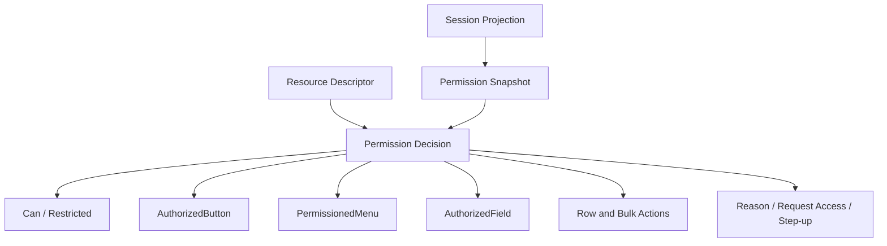

# Part 116 — Build Permission-aware Components

Part 115 built route guards.

Route guards protect route entry and route mutation boundaries.

Now we build permission-aware components.

These components are not the final authorization boundary.

They are the **UI projection layer**.

They decide what the user can see, click, edit, request, or understand based on a permission decision that must still be enforced by the server.

The purpose is not to hide buttons randomly.

The purpose is to make the product interface consistent with the permission model.

## Mental model

A permission-aware component has one job:

> Project an authorization decision into safe, understandable UI.



A good permission-aware component keeps five concerns separate:

| Concern | Meaning |
|---|---|
| Decision | Is the action allowed, denied, unknown, loading, or requires step-up? |
| Exposure | Should the UI hide, disable, explain, or redirect? |
| Action | What happens if the user interacts? |
| Enforcement | What will the server validate when the request arrives? |
| Recovery | Can the user request access, switch tenant, or perform step-up? |

Most frontend auth bugs come from collapsing these concerns into one boolean.

```tsx
// Too weak for real systems.
{isAdmin && <button>Delete</button>}
```

This says nothing about resource, tenant, assurance, stale permission, step-up, or server enforcement.

## Decision object

The component layer should consume a typed decision object.

```ts
export type UiPermissionDecision =
  | {
      status: "unknown" | "loading";
      allowed: false;
    }
  | {
      status: "allowed";
      allowed: true;
      action: string;
      resource?: ResourceDescriptor;
    }
  | {
      status: "denied";
      allowed: false;
      action: string;
      resource?: ResourceDescriptor;
      reasonCode: string;
      publicReason: string;
      canRequestAccess?: boolean;
    }
  | {
      status: "requires_step_up";
      allowed: false;
      action: string;
      resource?: ResourceDescriptor;
      publicReason: string;
      stepUpUrl: string;
    }
  | {
      status: "stale";
      allowed: false;
      action: string;
      resource?: ResourceDescriptor;
      publicReason: string;
    };
```

Default behavior:

- `unknown`: do not show protected affordance,
- `loading`: do not show protected affordance unless skeleton is safe,
- `denied`: hide, disable, or explain depending on product policy,
- `requires_step_up`: show secure escalation flow,
- `stale`: revalidate before showing action,
- `allowed`: render the affordance.

Do not use `allowed?: boolean`.

Ambiguity is dangerous.

## Build `useCan()` adapter

Part 114 already introduced `useCan()` at provider level.

For component primitives, assume this hook:

```ts
export function useCan(
  action: string,
  resource?: ResourceDescriptor,
  options?: {
    suspense?: boolean;
    explain?: boolean;
  },
): UiPermissionDecision {
  const auth = useAuthStoreSnapshot();

  if (auth.status === "unknown" || auth.status === "bootstrapping") {
    return { status: "unknown", allowed: false };
  }

  if (auth.status !== "authenticated") {
    return {
      status: "denied",
      allowed: false,
      action,
      resource,
      reasonCode: "login_required",
      publicReason: "You need to sign in first.",
    };
  }

  return auth.permissionEngine.evaluateUiDecision({
    subject: auth.session.subject,
    action,
    resource,
    context: {
      tenantId: auth.session.activeTenantId,
      permissionVersion: auth.session.permissionVersion,
      explain: options?.explain ?? false,
    },
  });
}
```

This hook is a frontend projection.

The server/API still authorizes the action.

## Build `Can`

`Can` renders children only when allowed.

```tsx
type CanProps = {
  action: string;
  resource?: ResourceDescriptor;
  children: React.ReactNode | ((decision: Extract<UiPermissionDecision, { status: "allowed" }>) => React.ReactNode);
  fallback?: React.ReactNode;
  loadingFallback?: React.ReactNode;
};

export function Can(props: CanProps) {
  const decision = useCan(props.action, props.resource);

  if (decision.status === "unknown" || decision.status === "loading") {
    return <>{props.loadingFallback ?? null}</>;
  }

  if (!decision.allowed) {
    return <>{props.fallback ?? null}</>;
  }

  if (typeof props.children === "function") {
    return <>{props.children(decision)}</>;
  }

  return <>{props.children}</>;
}
```

Example:

```tsx
<Can action="case.close" resource={{ type: "case", id: caseId }}>
  <CloseCaseButton caseId={caseId} />
</Can>
```

Use `Can` when hidden UI is appropriate.

Do not use `Can` when the user needs to understand why something is unavailable.

## Build `Restricted`

`Restricted` is explicit about denied state.

It is useful for panels, pages, field groups, and explainable flows.

```tsx
type RestrictedProps = {
  action: string;
  resource?: ResourceDescriptor;
  children: React.ReactNode;
  denied?: (decision: Exclude<UiPermissionDecision, { status: "allowed" }>) => React.ReactNode;
};

export function Restricted(props: RestrictedProps) {
  const decision = useCan(props.action, props.resource, { explain: true });

  if (decision.allowed) return <>{props.children}</>;

  if (props.denied) {
    return <>{props.denied(decision)}</>;
  }

  return <PermissionDeniedPanel decision={decision} />;
}
```

Example:

```tsx
<Restricted
  action="case.audit.read"
  resource={{ type: "case", id: caseId }}
  denied={(decision) => <AuditAccessDenied decision={decision} />}
>
  <AuditTrail caseId={caseId} />
</Restricted>
```

Use `Restricted` when hiding the area would create confusion.

## Build `PermissionDeniedPanel`

Denial UI should be safe and actionable.

```tsx
export function PermissionDeniedPanel({ decision }: { decision: UiPermissionDecision }) {
  if (decision.status === "unknown" || decision.status === "loading") {
    return null;
  }

  if (decision.status === "requires_step_up") {
    return (
      <section role="status" aria-live="polite">
        <h2>Additional verification required</h2>
        <p>{decision.publicReason}</p>
        <a href={decision.stepUpUrl}>Verify and continue</a>
      </section>
    );
  }

  if (decision.status === "stale") {
    return (
      <section role="status" aria-live="polite">
        <h2>Checking access</h2>
        <p>{decision.publicReason}</p>
      </section>
    );
  }

  return (
    <section role="status" aria-live="polite">
      <h2>Access unavailable</h2>
      <p>{decision.publicReason}</p>
      {decision.status === "denied" && decision.canRequestAccess ? (
        <RequestAccessButton action={decision.action} resource={decision.resource} />
      ) : null}
    </section>
  );
}
```

Do not expose internal policy names like:

```txt
policy.case.close.rule_17.failed: user.department != resource.owner.department
```

That belongs in internal logs.

The UI gets a safe public reason and correlation path.

## Build `AuthorizedButton`

A button has more states than allowed/hidden.

You need to decide:

- hide when denied,
- disable when denied,
- show reason when denied,
- show step-up CTA,
- or show access request CTA.

```tsx
type DeniedBehavior = "hide" | "disable" | "explain" | "requestAccess" | "stepUp";

type AuthorizedButtonProps = Omit<React.ButtonHTMLAttributes<HTMLButtonElement>, "disabled"> & {
  action: string;
  resource?: ResourceDescriptor;
  deniedBehavior?: DeniedBehavior;
  pending?: boolean;
  onAuthorizedClick?: (event: React.MouseEvent<HTMLButtonElement>) => void;
};

export function AuthorizedButton({
  action,
  resource,
  deniedBehavior = "disable",
  pending = false,
  onAuthorizedClick,
  children,
  ...buttonProps
}: AuthorizedButtonProps) {
  const decision = useCan(action, resource, { explain: deniedBehavior !== "hide" });

  if (decision.status === "unknown" || decision.status === "loading") {
    return null;
  }

  if (!decision.allowed) {
    if (deniedBehavior === "hide") return null;

    if (deniedBehavior === "stepUp" && decision.status === "requires_step_up") {
      return <a href={decision.stepUpUrl}>Verify to continue</a>;
    }

    if (deniedBehavior === "requestAccess" && decision.status === "denied" && decision.canRequestAccess) {
      return <RequestAccessButton action={action} resource={resource} />;
    }

    if (deniedBehavior === "explain") {
      return (
        <span>
          <button {...buttonProps} disabled aria-disabled="true">
            {children}
          </button>
          <small>{"publicReason" in decision ? decision.publicReason : "Access unavailable."}</small>
        </span>
      );
    }

    return (
      <button {...buttonProps} disabled aria-disabled="true" title={"publicReason" in decision ? decision.publicReason : undefined}>
        {children}
      </button>
    );
  }

  return (
    <button
      {...buttonProps}
      disabled={pending || buttonProps.disabled}
      onClick={(event) => {
        if (pending) return;
        onAuthorizedClick?.(event);
      }}
    >
      {children}
    </button>
  );
}
```

Important:

The button still does not authorize the mutation.

The server action/API must re-check.

## Build `PermissionedMenu`

Menus are where auth drift becomes visible.

A user may see a menu item, then permission changes, then the click fails.

Design for that.

```ts
export type MenuItemSpec = {
  id: string;
  label: string;
  href?: string;
  onSelect?: () => void;
  permission?: {
    action: string;
    resource?: ResourceDescriptor;
    deniedBehavior?: "hide" | "disable" | "explain";
  };
};
```

```tsx
export function PermissionedMenu({ items }: { items: MenuItemSpec[] }) {
  return (
    <ul role="menu">
      {items.map((item) => (
        <PermissionedMenuItem key={item.id} item={item} />
      ))}
    </ul>
  );
}

function PermissionedMenuItem({ item }: { item: MenuItemSpec }) {
  if (!item.permission) {
    return <RawMenuItem item={item} />;
  }

  const decision = useCan(item.permission.action, item.permission.resource, {
    explain: item.permission.deniedBehavior !== "hide",
  });

  if (decision.status === "unknown" || decision.status === "loading") {
    return null;
  }

  if (!decision.allowed) {
    const behavior = item.permission.deniedBehavior ?? "hide";
    if (behavior === "hide") return null;

    return (
      <li role="none">
        <button role="menuitem" disabled aria-disabled="true" title={"publicReason" in decision ? decision.publicReason : undefined}>
          {item.label}
        </button>
      </li>
    );
  }

  return <RawMenuItem item={item} />;
}
```

Do not derive menu items from raw roles.

Derive them from allowed capabilities.

## Build `AuthorizedField`

Fields are harder than buttons.

A field may be:

- hidden,
- masked,
- read-only,
- editable,
- or editable only after step-up.

```ts
export type FieldPermissionMode =
  | "hidden"
  | "masked"
  | "readonly"
  | "editable"
  | "requires_step_up";

export type FieldPolicy = {
  readAction: string;
  writeAction?: string;
  resource?: ResourceDescriptor;
  deniedReadMode?: "hidden" | "masked";
};
```

```tsx
type AuthorizedFieldProps = {
  policy: FieldPolicy;
  label: string;
  value: string;
  onChange?: (value: string) => void;
};

export function AuthorizedField({ policy, label, value, onChange }: AuthorizedFieldProps) {
  const read = useCan(policy.readAction, policy.resource);
  const write = policy.writeAction ? useCan(policy.writeAction, policy.resource) : undefined;

  if (read.status === "unknown" || read.status === "loading") return null;

  if (!read.allowed) {
    if (policy.deniedReadMode === "masked") {
      return <MaskedField label={label} />;
    }
    return null;
  }

  const writable = write?.allowed === true;

  if (!policy.writeAction || !writable) {
    return <ReadonlyField label={label} value={value} />;
  }

  return (
    <label>
      <span>{label}</span>
      <input value={value} onChange={(event) => onChange?.(event.target.value)} />
    </label>
  );
}
```

Do not submit unauthorized fields just because they exist in React state.

Patch generation should include only fields the user is allowed to write.

```ts
export function buildAuthorizedPatch(fields: Record<string, FieldState>): Record<string, unknown> {
  const patch: Record<string, unknown> = {};

  for (const [name, field] of Object.entries(fields)) {
    if (!field.dirty) continue;
    if (!field.writeDecision.allowed) continue;
    patch[name] = field.value;
  }

  return patch;
}
```

The server must still validate field-level writes.

## Build table row actions

Rows need resource-specific permission.

```tsx
export function RowActions({ row }: { row: CaseRow }) {
  const resource = { type: "case", id: row.id, tenantId: row.tenantId };

  return (
    <div aria-label={`Actions for case ${row.reference}`}>
      <AuthorizedButton action="case.read" resource={resource} deniedBehavior="hide">
        View
      </AuthorizedButton>

      <AuthorizedButton action="case.assign" resource={resource} deniedBehavior="disable">
        Assign
      </AuthorizedButton>

      <AuthorizedButton action="case.close" resource={resource} deniedBehavior="explain">
        Close
      </AuthorizedButton>
    </div>
  );
}
```

For large tables, avoid one network permission check per cell.

Ask the server for row action projection.

```ts
export type CaseRow = {
  id: string;
  tenantId: string;
  reference: string;
  status: string;
  allowedActions: string[];
};

export function rowCan(row: CaseRow, action: string): UiPermissionDecision {
  return row.allowedActions.includes(action)
    ? { status: "allowed", allowed: true, action, resource: { type: "case", id: row.id } }
    : {
        status: "denied",
        allowed: false,
        action,
        resource: { type: "case", id: row.id },
        reasonCode: "row_action_denied",
        publicReason: "This action is not available for this case.",
      };
}
```

This is still projection.

The row action API must authorize again.

## Build bulk action eligibility

Bulk action is not simply `selectedRows.length > 0`.

You need to know which selected rows are eligible.

```ts
export type BulkEligibility = {
  action: string;
  totalSelected: number;
  allowedIds: string[];
  denied: Array<{
    id: string;
    reasonCode: string;
    publicReason: string;
  }>;
};

export function evaluateBulkEligibility(
  action: string,
  rows: CaseRow[],
): BulkEligibility {
  const allowedIds: string[] = [];
  const denied: BulkEligibility["denied"] = [];

  for (const row of rows) {
    const decision = rowCan(row, action);

    if (decision.allowed) {
      allowedIds.push(row.id);
    } else if (decision.status === "denied") {
      denied.push({
        id: row.id,
        reasonCode: decision.reasonCode,
        publicReason: decision.publicReason,
      });
    }
  }

  return {
    action,
    totalSelected: rows.length,
    allowedIds,
    denied,
  };
}
```

Render with explicit policy.

```tsx
export function BulkCloseButton({ selectedRows }: { selectedRows: CaseRow[] }) {
  const eligibility = evaluateBulkEligibility("case.close", selectedRows);

  if (eligibility.totalSelected === 0) {
    return <button disabled>Close selected</button>;
  }

  if (eligibility.allowedIds.length === 0) {
    return <button disabled title="None of the selected cases can be closed.">Close selected</button>;
  }

  return (
    <button>
      Close {eligibility.allowedIds.length} of {eligibility.totalSelected}
    </button>
  );
}
```

Be explicit whether the operation is:

- all-or-nothing,
- partial allowed-only,
- or requires user confirmation when some rows are denied.

## Build command palette entries

Command palettes often bypass menu visibility because they search everything.

Make command registration permission-aware.

```ts
export type CommandSpec = {
  id: string;
  label: string;
  run: () => void;
  permission?: {
    action: string;
    resource?: ResourceDescriptor;
  };
};

export function usePermissionedCommands(commands: CommandSpec[]) {
  return commands.flatMap((command) => {
    if (!command.permission) return [command];

    const decision = useCan(command.permission.action, command.permission.resource);

    if (!decision.allowed) return [];

    return [command];
  });
}
```

The example is conceptually simple but watch out: hooks cannot be called in loops with dynamic length in production code.

A safer implementation should batch permission checks before rendering:

```ts
export function useBatchPermissionedCommands(commands: CommandSpec[]) {
  const checks = commands
    .filter((command) => command.permission)
    .map((command) => ({
      id: command.id,
      action: command.permission!.action,
      resource: command.permission!.resource,
    }));

  const decisions = useBatchCan(checks);

  return commands.filter((command) => {
    if (!command.permission) return true;
    return decisions[command.id]?.allowed === true;
  });
}
```

Command palettes must not expose admin-only or cross-tenant actions just because the route is not visible.

## Build request access button

Access request should capture precise intent.

```tsx
export function RequestAccessButton(props: {
  action: string;
  resource?: ResourceDescriptor;
}) {
  const { openAccessRequest } = useAccessRequestDialog();

  return (
    <button
      type="button"
      onClick={() => {
        openAccessRequest({
          action: props.action,
          resource: props.resource,
          source: "permission-aware-component",
        });
      }}
    >
      Request access
    </button>
  );
}
```

Do not let users request vague access like:

```txt
Please give me admin.
```

Prefer:

```txt
Request permission: case.close
Resource: case_123
Tenant: tenant_456
Duration: 7 days
Reason: Need to close duplicate enforcement case.
```

## Step-up component

Step-up is not an access request.

The user already has permission but needs stronger/fresher authentication.

```tsx
export function StepUpPrompt({ decision }: { decision: Extract<UiPermissionDecision, { status: "requires_step_up" }> }) {
  return (
    <section role="status" aria-live="polite">
      <h2>Verify your identity</h2>
      <p>{decision.publicReason}</p>
      <a href={decision.stepUpUrl}>Continue verification</a>
    </section>
  );
}
```

Use this for:

- approving payments,
- changing MFA settings,
- exporting sensitive data,
- impersonating a user,
- closing regulated cases,
- deleting resources,
- granting permissions.

## Design-system integration

Permission-aware primitives should live near the design system.

That gives product teams safe defaults.

```tsx
export function DangerActionButton(props: AuthorizedButtonProps) {
  return (
    <AuthorizedButton
      {...props}
      deniedBehavior={props.deniedBehavior ?? "explain"}
      data-variant="danger"
    />
  );
}
```

```tsx
export function PermissionedTab(props: {
  action: string;
  resource?: ResourceDescriptor;
  label: string;
  children: React.ReactNode;
}) {
  return (
    <Can action={props.action} resource={props.resource}>
      <Tab label={props.label}>{props.children}</Tab>
    </Can>
  );
}
```

Do not rely on every product engineer remembering auth rules manually.

Put the safe behavior in reusable primitives.

## Accessibility considerations

Permission-aware UI must still be accessible.

Use the right semantics:

- hidden elements should not be reachable by keyboard,
- disabled buttons should be truly disabled when they cannot be activated,
- explanations should be associated with the control when possible,
- status changes should use `aria-live` when appropriate,
- links that trigger step-up should be real links if they navigate,
- request-access buttons should be keyboard reachable.

Example with described-by:

```tsx
export function DisabledWithReason(props: {
  id: string;
  label: string;
  reason: string;
}) {
  const reasonId = `${props.id}-reason`;

  return (
    <span>
      <button id={props.id} disabled aria-describedby={reasonId}>
        {props.label}
      </button>
      <small id={reasonId}>{props.reason}</small>
    </span>
  );
}
```

## Telemetry

Permission-aware UI should emit product-safe telemetry.

Not every hidden button needs telemetry.

But important denial experiences should be observable.

```ts
export function emitPermissionUiEvent(event: {
  type: "permission_ui_denied_shown" | "permission_ui_request_access_clicked" | "permission_ui_step_up_clicked";
  action: string;
  resourceType?: string;
  reasonCode?: string;
  correlationId?: string;
}) {
  analytics.track(event.type, {
    action: event.action,
    resourceType: event.resourceType,
    reasonCode: event.reasonCode,
    correlationId: event.correlationId,
  });
}
```

Do not send:

- access tokens,
- raw policy traces,
- sensitive resource IDs unless approved,
- PII,
- full URLs containing sensitive params,
- or internal denial messages.

## Testing `Can`

Use user-observable assertions.

```tsx
it("hides children when permission is unknown", () => {
  renderWithAuth(
    <Can action="case.close">
      <button>Close case</button>
    </Can>,
    { decision: { status: "unknown", allowed: false } },
  );

  expect(screen.queryByRole("button", { name: /close case/i })).not.toBeInTheDocument();
});
```

```tsx
it("renders children when permission is allowed", () => {
  renderWithAuth(
    <Can action="case.close">
      <button>Close case</button>
    </Can>,
    { decision: { status: "allowed", allowed: true, action: "case.close" } },
  );

  expect(screen.getByRole("button", { name: /close case/i })).toBeEnabled();
});
```

## Testing `AuthorizedButton`

```tsx
it("disables button with public reason when denied", async () => {
  renderWithAuth(
    <AuthorizedButton action="case.close" deniedBehavior="explain">
      Close case
    </AuthorizedButton>,
    {
      decision: {
        status: "denied",
        allowed: false,
        action: "case.close",
        reasonCode: "workflow_state_denied",
        publicReason: "This case cannot be closed in its current state.",
      },
    },
  );

  expect(screen.getByRole("button", { name: /close case/i })).toBeDisabled();
  expect(screen.getByText(/cannot be closed/i)).toBeInTheDocument();
});
```

```tsx
it("does not call click handler when pending", async () => {
  const onAuthorizedClick = vi.fn();

  renderWithAuth(
    <AuthorizedButton action="case.close" pending onAuthorizedClick={onAuthorizedClick}>
      Close case
    </AuthorizedButton>,
    { decision: { status: "allowed", allowed: true, action: "case.close" } },
  );

  await userEvent.click(screen.getByRole("button", { name: /close case/i }));

  expect(onAuthorizedClick).not.toHaveBeenCalled();
});
```

## Testing field-level permission

```tsx
it("renders readonly value when read allowed but write denied", () => {
  renderWithAuth(
    <AuthorizedField
      label="Resolution"
      value="Duplicate"
      policy={{
        readAction: "case.resolution.read",
        writeAction: "case.resolution.write",
        resource: { type: "case", id: "case_123" },
      }}
    />,
    {
      decisions: {
        "case.resolution.read": { status: "allowed", allowed: true, action: "case.resolution.read" },
        "case.resolution.write": {
          status: "denied",
          allowed: false,
          action: "case.resolution.write",
          reasonCode: "missing_permission",
          publicReason: "You can view but not edit this field.",
        },
      },
    },
  );

  expect(screen.getByText("Duplicate")).toBeInTheDocument();
  expect(screen.queryByRole("textbox", { name: /resolution/i })).not.toBeInTheDocument();
});
```

## Component anti-patterns

Avoid:

```tsx
// Anti-pattern: raw role check.
{user.role === "admin" && <DeleteButton />}
```

```tsx
// Anti-pattern: disabled button without server enforcement.
<button disabled={!canDelete}>Delete</button>
```

```tsx
// Anti-pattern: hidden field used as authority.
<input type="hidden" name="canApprove" value="true" />
```

```tsx
// Anti-pattern: decision defaults to allowed while loading.
const allowed = decision?.allowed ?? true;
```

```tsx
// Anti-pattern: internal policy reason in UI.
<p>Denied by rule customer.region != actor.region</p>
```

```tsx
// Anti-pattern: command palette registers all commands before filtering.
registerCommand("delete-user", deleteUser);
```

```tsx
// Anti-pattern: access request without resource/action.
<button>Request admin</button>
```

## Production checklist

Before adopting permission-aware components, verify:

- `unknown` and `loading` states deny by default.
- `allowed` is explicit.
- `denied` has safe public reason.
- Step-up is distinct from missing permission.
- Access request is precise and auditable.
- Buttons do not become enforcement boundary.
- Forms submit only authorized dirty fields, but server still enforces.
- Table row actions are resource-specific.
- Bulk actions define all-or-nothing vs partial behavior.
- Command palette uses permission filtering before execution.
- Menus, tabs, breadcrumbs, and search do not expose unauthorized actions.
- Design-system primitives encode safe defaults.
- Accessibility semantics are preserved.
- Telemetry is redacted.
- Tests cover hidden, disabled, explain, request-access, step-up, stale, and allowed states.
- Backend/API tests still validate real authorization.

## Final mental model

Permission-aware components are not about hiding UI.

They are about **making authorization visible, consistent, safe, and recoverable**.

The component layer answers:

- should this affordance be shown,
- should it be disabled,
- should the user see why,
- should they request access,
- should they perform step-up,
- and how should the UI behave while permission is unknown or stale?

It does not answer the final security question.

The server still asks:

> Is this subject allowed to perform this action on this resource in this context right now?

If both layers share the same action vocabulary and decision contract, the system becomes easier to reason about.

Part 117 will build the access request workflow from scratch: request creation, approval routing, temporary grants, expiry, audit trail, and integration with permission-aware UI.

## References

- React Conditional Rendering — https://react.dev/learn/conditional-rendering
- React Hooks Reference — https://react.dev/reference/react/hooks
- React `useSyncExternalStore` — https://react.dev/reference/react/useSyncExternalStore
- OWASP Authorization Cheat Sheet — https://cheatsheetseries.owasp.org/cheatsheets/Authorization_Cheat_Sheet.html
- OWASP Logging Cheat Sheet — https://cheatsheetseries.owasp.org/cheatsheets/Logging_Cheat_Sheet.html
