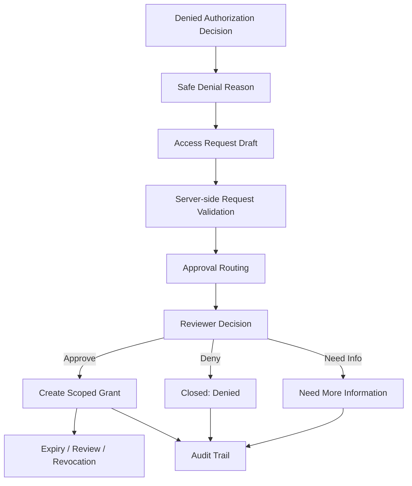
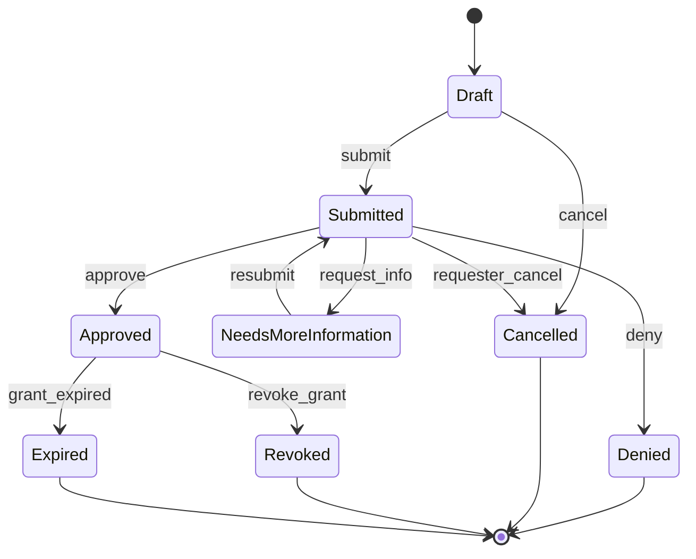
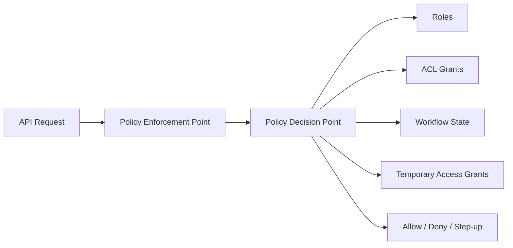

# Part 117 — Build Access Request Workflow

Part 116 built permission-aware components.

Those components can render **allowed**, **denied**, **unknown**, **loading**, and **requires step-up** states.

Now we build the next layer: **what happens when a user is denied but has a legitimate business need**.

That is the access request workflow.

This workflow is not a bypass.

It is a controlled authorization lifecycle.

The goal is not:

> “User cannot access something, so let them ask an admin manually.”

The real goal is:

> Turn a denied authorization decision into a precise, auditable, scoped, reviewable, expiring access change.

A good access request system improves security because it prevents out-of-band permission changes, vague Slack approvals, permanent over-grants, and undocumented admin actions.

## Mental model

An access request workflow converts a **denied decision** into a **permission change proposal**.



The important word is **proposal**.

The request does not grant anything by itself.

The request describes:

| Dimension | Example |
|---|---|
| Subject | `user:maya` |
| Action | `case.review` |
| Resource | `case:CASE-9231` or `project:alpha` |
| Scope | one case, one folder, one tenant, one workflow queue |
| Duration | 24 hours, 7 days, until case closure |
| Reason | “Assigned as backup reviewer during leave coverage” |
| Reviewer | case owner, team lead, data owner, security officer |
| Constraints | view-only, no export, no reassignment |
| Audit | who requested, who approved, what changed, why, when |

Without these dimensions, access requests become a hidden privilege escalation channel.

## Access request invariants

Before code, define invariants.

These are more important than UI.

| Invariant | Reason |
|---|---|
| A denied user can request access, but cannot approve their own request. | Prevent self-escalation. |
| Approval creates the smallest possible grant. | Prevent broad permanent permissions. |
| Every request has a specific subject, action, resource, reason, and duration. | Prevent vague “make me admin” requests. |
| Requests are validated server-side. | Frontend request payload is not trusted. |
| Approvers are derived from policy, not chosen freely by requester. | Prevent approval shopping. |
| Grants expire by default. | Prevent privilege accumulation. |
| Request and approval decisions are auditable. | Support security, compliance, and debugging. |
| Approval does not bypass final enforcement. | Server still checks permission on every request. |
| Access can be revoked independently of request state. | Support incident response and role changes. |
| Permission cache invalidates after approval/revocation. | Prevent stale denied/allowed UI. |

OWASP's authorization guidance is the key baseline: permission must be validated on every request and access should be deny-by-default. The access request workflow lives around that rule; it does not replace it.

## Domain model

Start with explicit domain types.

```ts
type SubjectRef = {
  type: 'user' | 'service_account' | 'group';
  id: string;
};

type ResourceRef = {
  type: 'case' | 'project' | 'tenant' | 'folder' | 'document' | 'queue';
  id: string;
  tenantId: string;
};

type ActionId =
  | 'case.view'
  | 'case.review'
  | 'case.approve'
  | 'case.export'
  | 'document.view'
  | 'document.edit'
  | 'project.admin'
  | 'queue.assign';

type AccessDuration =
  | { kind: 'hours'; value: number }
  | { kind: 'days'; value: number }
  | { kind: 'until_resource_state'; state: string }
  | { kind: 'until_date'; isoDate: string };

type AccessConstraint =
  | { kind: 'no_export' }
  | { kind: 'read_only' }
  | { kind: 'requires_step_up'; acr: string }
  | { kind: 'ip_range'; cidr: string }
  | { kind: 'business_hours_only'; timezone: string };
```

Do not model access request as free text.

Free text belongs in `businessJustification`, not in the permission semantics.

The permission semantics must be structured enough to evaluate, diff, audit, and expire.

```ts
type AccessRequestTarget = {
  subject: SubjectRef;
  action: ActionId;
  resource: ResourceRef;
  duration: AccessDuration;
  constraints: AccessConstraint[];
};

type AccessRequestStatus =
  | 'draft'
  | 'submitted'
  | 'needs_more_information'
  | 'approved'
  | 'denied'
  | 'cancelled'
  | 'expired'
  | 'revoked';

type AccessRequest = {
  id: string;
  status: AccessRequestStatus;
  requester: SubjectRef;
  target: AccessRequestTarget;
  businessJustification: string;
  approverPolicy: ApproverPolicySnapshot;
  approvals: ApprovalDecision[];
  createdAt: string;
  updatedAt: string;
  submittedAt?: string;
  decidedAt?: string;
  grantId?: string;
  correlationId: string;
  policyVersion: string;
  permissionEpoch: number;
};
```

`ApproverPolicySnapshot` is important.

Approval routing must be reproducible later.

When someone audits why `user:maya` received `case.review`, you should be able to explain which approval policy was evaluated at the time.

```ts
type ApproverPolicySnapshot = {
  policyId: string;
  policyVersion: string;
  requiredApprovals: number;
  requiredReviewerRelations: Array<
    | 'resource_owner'
    | 'team_lead'
    | 'tenant_security_admin'
    | 'data_steward'
    | 'workflow_supervisor'
  >;
  separationOfDuties: {
    requesterCannotApprove: boolean;
    existingAssigneeCannotApprove?: boolean;
    sameDepartmentApprovalRequired?: boolean;
  };
};
```

## State machine

The workflow must be state-machine driven.

Do not allow arbitrary status changes.



Represent transitions explicitly.

```ts
type AccessRequestEvent =
  | { type: 'draft_created'; actor: SubjectRef }
  | { type: 'submitted'; actor: SubjectRef; reason: string }
  | { type: 'more_information_requested'; actor: SubjectRef; question: string }
  | { type: 'resubmitted'; actor: SubjectRef; answer: string }
  | { type: 'approved'; actor: SubjectRef; comment?: string }
  | { type: 'denied'; actor: SubjectRef; reason: string }
  | { type: 'cancelled'; actor: SubjectRef; reason?: string }
  | { type: 'grant_created'; actor: SubjectRef; grantId: string }
  | { type: 'grant_revoked'; actor: SubjectRef; reason: string }
  | { type: 'grant_expired'; actor: { type: 'system'; id: 'access-expirer' } };
```

Then enforce transitions with code.

```ts
const allowedTransitions: Record<AccessRequestStatus, AccessRequestEvent['type'][]> = {
  draft: ['submitted', 'cancelled'],
  submitted: ['more_information_requested', 'approved', 'denied', 'cancelled'],
  needs_more_information: ['resubmitted', 'cancelled'],
  approved: ['grant_revoked', 'grant_expired'],
  denied: [],
  cancelled: [],
  expired: [],
  revoked: [],
};

function assertTransitionAllowed(
  current: AccessRequestStatus,
  eventType: AccessRequestEvent['type'],
): void {
  if (!allowedTransitions[current].includes(eventType)) {
    throw new AccessRequestError(
      'invalid_transition',
      `Cannot apply ${eventType} to access request in ${current}`,
    );
  }
}
```

Do not trust UI buttons to prevent invalid transitions.

The server must reject illegal transitions.

## Access grant model

Approval should create a grant.

The grant is what the authorization engine consumes.

```ts
type AccessGrant = {
  id: string;
  source: {
    kind: 'access_request';
    requestId: string;
  };
  subject: SubjectRef;
  action: ActionId;
  resource: ResourceRef;
  constraints: AccessConstraint[];
  startsAt: string;
  expiresAt: string;
  createdBy: SubjectRef;
  createdAt: string;
  revokedAt?: string;
  revokedBy?: SubjectRef;
  revokeReason?: string;
  tenantId: string;
  policyVersion: string;
};
```

The authorization engine should evaluate grants as one input among many.



Temporary access does not mean “skip policy”.

It means “there is a time-bounded policy input that may allow this action”.

## Database shape

Use append-friendly tables.

```sql
CREATE TABLE access_requests (
  id UUID PRIMARY KEY,
  tenant_id TEXT NOT NULL,
  requester_type TEXT NOT NULL,
  requester_id TEXT NOT NULL,
  subject_type TEXT NOT NULL,
  subject_id TEXT NOT NULL,
  resource_type TEXT NOT NULL,
  resource_id TEXT NOT NULL,
  action_id TEXT NOT NULL,
  status TEXT NOT NULL,
  business_justification TEXT NOT NULL,
  duration_json JSONB NOT NULL,
  constraints_json JSONB NOT NULL,
  approver_policy_json JSONB NOT NULL,
  policy_version TEXT NOT NULL,
  permission_epoch BIGINT NOT NULL,
  grant_id UUID NULL,
  correlation_id TEXT NOT NULL,
  created_at TIMESTAMPTZ NOT NULL,
  updated_at TIMESTAMPTZ NOT NULL,
  submitted_at TIMESTAMPTZ NULL,
  decided_at TIMESTAMPTZ NULL
);

CREATE INDEX idx_access_requests_tenant_subject
  ON access_requests (tenant_id, subject_type, subject_id, status);

CREATE INDEX idx_access_requests_resource
  ON access_requests (tenant_id, resource_type, resource_id, action_id, status);
```

Store events separately.

```sql
CREATE TABLE access_request_events (
  id UUID PRIMARY KEY,
  request_id UUID NOT NULL REFERENCES access_requests(id),
  tenant_id TEXT NOT NULL,
  event_type TEXT NOT NULL,
  actor_type TEXT NOT NULL,
  actor_id TEXT NOT NULL,
  payload_json JSONB NOT NULL,
  created_at TIMESTAMPTZ NOT NULL,
  correlation_id TEXT NOT NULL
);
```

Store grants separately.

```sql
CREATE TABLE access_grants (
  id UUID PRIMARY KEY,
  tenant_id TEXT NOT NULL,
  source_kind TEXT NOT NULL,
  source_id UUID NOT NULL,
  subject_type TEXT NOT NULL,
  subject_id TEXT NOT NULL,
  resource_type TEXT NOT NULL,
  resource_id TEXT NOT NULL,
  action_id TEXT NOT NULL,
  constraints_json JSONB NOT NULL,
  starts_at TIMESTAMPTZ NOT NULL,
  expires_at TIMESTAMPTZ NOT NULL,
  created_by_type TEXT NOT NULL,
  created_by_id TEXT NOT NULL,
  created_at TIMESTAMPTZ NOT NULL,
  revoked_at TIMESTAMPTZ NULL,
  revoked_by_type TEXT NULL,
  revoked_by_id TEXT NULL,
  revoke_reason TEXT NULL,
  policy_version TEXT NOT NULL
);

CREATE INDEX idx_access_grants_active
  ON access_grants (tenant_id, subject_type, subject_id, resource_type, resource_id, action_id, expires_at)
  WHERE revoked_at IS NULL;
```

In real systems, also add optimistic concurrency:

```sql
ALTER TABLE access_requests ADD COLUMN version BIGINT NOT NULL DEFAULT 1;
```

Every transition update should include `WHERE id = ? AND version = ?`.

That avoids duplicate approvals racing into duplicate grants.

## API contract

The React app should not submit arbitrary grants.

It submits an access request.

```http
POST /api/access-requests
Content-Type: application/json
```

```json
{
  "subject": { "type": "user", "id": "user_123" },
  "action": "case.review",
  "resource": { "type": "case", "id": "case_9231", "tenantId": "tenant_acme" },
  "duration": { "kind": "days", "value": 7 },
  "constraints": [{ "kind": "no_export" }],
  "businessJustification": "Assigned as backup reviewer for this case while primary reviewer is on leave."
}
```

The server responds with normalized request state.

```json
{
  "id": "ar_01J...",
  "status": "submitted",
  "target": {
    "action": "case.review",
    "resource": { "type": "case", "id": "case_9231", "tenantId": "tenant_acme" },
    "duration": { "kind": "days", "value": 7 },
    "constraints": [{ "kind": "no_export" }]
  },
  "approval": {
    "requiredApprovals": 1,
    "currentApprovals": 0,
    "reviewers": [
      { "kind": "relation", "relation": "case_owner" }
    ]
  },
  "correlationId": "corr_..."
}
```

Review endpoint:

```http
POST /api/access-requests/:id/decision
Content-Type: application/json
```

```json
{
  "decision": "approve",
  "comment": "Approved for temporary backup review."
}
```

Deny endpoint uses same endpoint:

```json
{
  "decision": "deny",
  "reason": "Requester is not assigned to the investigation team."
}
```

Do not expose internal policy traces to requester.

Expose safe reasons only.

## Server-side request validation

The request create path must validate:

1. requester is authenticated;
2. requester belongs to target tenant;
3. subject is requestable;
4. action is requestable;
5. resource exists in tenant;
6. requested duration is within policy limit;
7. constraints are allowed for that action;
8. request is not duplicate active request;
9. requester is not blocked by SoD rules;
10. approval route can be resolved.

```ts
async function createAccessRequest(input: CreateAccessRequestInput, ctx: RequestContext) {
  const requester = await requireAuthenticatedSubject(ctx);

  assertSameTenant(ctx.tenantId, input.resource.tenantId);

  const resource = await resourceRepo.get(input.resource);
  if (!resource) {
    throw new ProblemError(404, 'resource_not_found');
  }

  const requestability = await policy.canRequestAccess({
    requester,
    subject: input.subject,
    action: input.action,
    resource,
    duration: input.duration,
    constraints: input.constraints,
  });

  if (!requestability.allowed) {
    throw new ProblemError(403, 'access_request_not_allowed', {
      reason: requestability.publicReason,
    });
  }

  const duplicate = await accessRequestRepo.findActiveDuplicate({
    tenantId: ctx.tenantId,
    subject: input.subject,
    action: input.action,
    resource: input.resource,
  });

  if (duplicate) {
    return duplicate;
  }

  const approverPolicy = await approvalRouter.resolve({
    requester,
    subject: input.subject,
    action: input.action,
    resource,
  });

  if (!approverPolicy.reviewers.length) {
    throw new ProblemError(409, 'approval_route_unresolvable');
  }

  return accessRequestRepo.createSubmitted({
    requester,
    input,
    approverPolicy,
    policyVersion: requestability.policyVersion,
    correlationId: ctx.correlationId,
  });
}
```

Notice that `canRequestAccess` is not the same as `canDoAction`.

A user might not be allowed to review a case, but may be allowed to request review access.

That distinction matters.

## Approval routing

Approval routing should be policy-driven.

Bad design:

```ts
// Too weak.
const approverId = input.approverId;
```

This allows approval shopping.

Better design:

```ts
type ApprovalRouteInput = {
  requester: SubjectRef;
  subject: SubjectRef;
  action: ActionId;
  resource: ResourceRecord;
};

type ResolvedApprovalRoute = {
  policyId: string;
  policyVersion: string;
  requiredApprovals: number;
  reviewers: Array<{
    subject: SubjectRef;
    reason: 'resource_owner' | 'team_lead' | 'security_admin' | 'data_steward';
  }>;
  constraints: {
    requesterCannotApprove: true;
    approverCannotBeTargetSubject: boolean;
  };
};
```

Example resolver:

```ts
async function resolveApprovalRoute(input: ApprovalRouteInput): Promise<ResolvedApprovalRoute> {
  if (input.action === 'case.export') {
    return {
      policyId: 'high-risk-case-export',
      policyVersion: '2026-07-08.1',
      requiredApprovals: 2,
      reviewers: [
        ...(await findCaseOwners(input.resource.id)),
        ...(await findTenantSecurityAdmins(input.resource.tenantId)),
      ],
      constraints: {
        requesterCannotApprove: true,
        approverCannotBeTargetSubject: true,
      },
    };
  }

  if (input.action === 'case.review') {
    return {
      policyId: 'case-review-temporary-access',
      policyVersion: '2026-07-08.1',
      requiredApprovals: 1,
      reviewers: await findCaseOwners(input.resource.id),
      constraints: {
        requesterCannotApprove: true,
        approverCannotBeTargetSubject: true,
      },
    };
  }

  return {
    policyId: 'default-access-request-policy',
    policyVersion: '2026-07-08.1',
    requiredApprovals: 1,
    reviewers: await findTenantAdmins(input.resource.tenantId),
    constraints: {
      requesterCannotApprove: true,
      approverCannotBeTargetSubject: true,
    },
  };
}
```

For regulated systems, approval routing often depends on workflow state:

| Resource state | Action requested | Reviewer |
|---|---|---|
| Draft | `case.view` | case owner |
| Investigation | `case.review` | investigation lead |
| Enforcement recommendation | `case.approve` | supervisor outside preparer chain |
| Closed | `case.export` | data steward or records manager |

This is where access request workflow becomes more than RBAC.

It becomes workflow-aware authorization.

## Separation of duties

Separation of duties is not optional in serious systems.

At minimum:

```ts
function assertReviewerAllowed(params: {
  reviewer: SubjectRef;
  request: AccessRequest;
  route: ResolvedApprovalRoute;
}) {
  if (params.route.constraints.requesterCannotApprove) {
    assertNotSameSubject(params.reviewer, params.request.requester, 'requester_cannot_approve');
  }

  if (params.route.constraints.approverCannotBeTargetSubject) {
    assertNotSameSubject(params.reviewer, params.request.target.subject, 'target_subject_cannot_approve');
  }

  const reviewerInRoute = params.route.reviewers.some((r) => sameSubject(r.subject, params.reviewer));
  if (!reviewerInRoute) {
    throw new ProblemError(403, 'not_authorized_reviewer');
  }
}
```

More advanced checks:

| Rule | Example |
|---|---|
| Preparer cannot approve own case escalation. | Investigator cannot approve their own enforcement recommendation. |
| Reviewer must be outside requester department. | Sensitive data access needs independent approval. |
| Approver must have higher assurance session. | Approval action requires recent MFA. |
| Approver cannot approve access that benefits them indirectly. | Team lead cannot approve access to their own conflict-of-interest case. |
| High-risk action needs two approvals. | Export, delete, impersonate, grant admin. |

Do not bolt these into UI.

Put them in server policy.

## Approval handler

Approval must be atomic.

Approval and grant creation should happen in one transaction.

```ts
async function decideAccessRequest(
  requestId: string,
  input: { decision: 'approve' | 'deny'; reason?: string; comment?: string },
  ctx: RequestContext,
) {
  const actor = await requireAuthenticatedSubject(ctx);

  return db.transaction(async (tx) => {
    const request = await accessRequestRepo.getForUpdate(tx, requestId);
    if (!request) throw new ProblemError(404, 'access_request_not_found');

    assertTransitionAllowed(request.status, input.decision === 'approve' ? 'approved' : 'denied');

    const route = request.approverPolicy;
    assertReviewerAllowed({ reviewer: actor, request, route });

    if (input.decision === 'deny') {
      const denied = await accessRequestRepo.markDenied(tx, {
        requestId,
        actor,
        reason: requireReason(input.reason),
        correlationId: ctx.correlationId,
      });

      await audit.emit(tx, buildAccessRequestDeniedEvent(denied, actor, ctx));
      return denied;
    }

    const grant = await grantRepo.create(tx, buildGrantFromRequest(request, actor));

    const approved = await accessRequestRepo.markApproved(tx, {
      requestId,
      actor,
      grantId: grant.id,
      comment: input.comment,
      correlationId: ctx.correlationId,
    });

    await permissionEpoch.bump(tx, request.target.resource.tenantId);
    await audit.emit(tx, buildAccessRequestApprovedEvent(approved, grant, actor, ctx));

    return approved;
  });
}
```

The `permissionEpoch.bump` call is not decorative.

It lets clients and caches know the permission projection changed.

## Grant expiry

Temporary grants should expire automatically.

Do not rely only on background jobs.

The authorization check must also treat expired grants as inactive.

```ts
async function findActiveGrant(input: {
  subject: SubjectRef;
  action: ActionId;
  resource: ResourceRef;
  now: Date;
}) {
  return grantRepo.findFirst({
    subject: input.subject,
    action: input.action,
    resource: input.resource,
    revokedAt: null,
    startsAtLte: input.now,
    expiresAtGt: input.now,
  });
}
```

Background expiry job is for cleanup, audit events, notifications, and UI state.

```ts
async function expireGrants(now = new Date()) {
  const expired = await grantRepo.findExpiredUnmarked(now);

  for (const grant of expired) {
    await db.transaction(async (tx) => {
      await grantRepo.markExpired(tx, grant.id, now);
      await accessRequestRepo.markExpiredByGrant(tx, grant.id, now);
      await permissionEpoch.bump(tx, grant.tenantId);
      await audit.emit(tx, {
        type: 'access_grant.expired',
        tenantId: grant.tenantId,
        grantId: grant.id,
        sourceRequestId: grant.source.sourceId,
        occurredAt: now.toISOString(),
      });
    });
  }
}
```

## React integration

The access request workflow starts from a denied decision.

From Part 116, assume `useCan()` returns a decision object.

```ts
type PermissionDecision =
  | { state: 'allowed' }
  | { state: 'denied'; reason: string; requestable?: AccessRequestTemplate }
  | { state: 'requires_step_up'; acr: string; requestable?: AccessRequestTemplate }
  | { state: 'unknown' }
  | { state: 'loading' };

type AccessRequestTemplate = {
  action: ActionId;
  resource: ResourceRef;
  suggestedDuration: AccessDuration;
  allowedDurations: AccessDuration[];
  constraints: AccessConstraint[];
  reasonPrompt: string;
};
```

A denied UI can render request access.

```tsx
function CaseReviewAction({ caseId, tenantId }: { caseId: string; tenantId: string }) {
  const decision = useCan('case.review', {
    type: 'case',
    id: caseId,
    tenantId,
  });

  if (decision.state === 'allowed') {
    return <button>Start Review</button>;
  }

  if (decision.state === 'denied' && decision.requestable) {
    return (
      <AccessRequestButton
        template={decision.requestable}
        deniedReason={decision.reason}
      />
    );
  }

  return null;
}
```

The request button opens a controlled form.

```tsx
function AccessRequestButton(props: {
  template: AccessRequestTemplate;
  deniedReason: string;
}) {
  const [open, setOpen] = React.useState(false);

  return (
    <>
      <button type="button" onClick={() => setOpen(true)}>
        Request access
      </button>

      {open && (
        <AccessRequestDialog
          template={props.template}
          deniedReason={props.deniedReason}
          onClose={() => setOpen(false)}
        />
      )}
    </>
  );
}
```

## Access request dialog

The dialog should not ask for raw permission fields if they were already known from denial context.

The user should provide justification and select allowed duration.

```tsx
function AccessRequestDialog({
  template,
  deniedReason,
  onClose,
}: {
  template: AccessRequestTemplate;
  deniedReason: string;
  onClose: () => void;
}) {
  const [duration, setDuration] = React.useState(template.suggestedDuration);
  const [justification, setJustification] = React.useState('');
  const mutation = useCreateAccessRequestMutation();

  const canSubmit = justification.trim().length >= 20 && !mutation.isPending;

  return (
    <div role="dialog" aria-modal="true" aria-labelledby="access-request-title">
      <h2 id="access-request-title">Request access</h2>

      <p>You do not currently have access for this action.</p>
      <p>{deniedReason}</p>

      <AccessTargetSummary action={template.action} resource={template.resource} />

      <label>
        Duration
        <select
          value={serializeDuration(duration)}
          onChange={(event) => setDuration(parseDuration(event.target.value))}
        >
          {template.allowedDurations.map((option) => (
            <option key={serializeDuration(option)} value={serializeDuration(option)}>
              {formatDuration(option)}
            </option>
          ))}
        </select>
      </label>

      <label>
        Business justification
        <textarea
          value={justification}
          onChange={(event) => setJustification(event.target.value)}
          placeholder={template.reasonPrompt}
        />
      </label>

      {mutation.error && <AccessRequestError error={mutation.error} />}

      <button type="button" onClick={onClose}>Cancel</button>
      <button
        type="button"
        disabled={!canSubmit}
        onClick={() => {
          mutation.mutate(
            {
              action: template.action,
              resource: template.resource,
              duration,
              constraints: template.constraints,
              businessJustification: justification,
            },
            { onSuccess: onClose },
          );
        }}
      >
        Submit request
      </button>
    </div>
  );
}
```

The UI should not allow the user to edit `subject`, `tenantId`, or raw `action` unless the product explicitly supports requesting on behalf of someone else.

For on-behalf-of requests, add a separate permission:

```ts
can(actor, 'access_request.create_on_behalf', targetSubject, context)
```

## Mutation and cache invalidation

With TanStack Query:

```ts
function useCreateAccessRequestMutation() {
  const queryClient = useQueryClient();
  const auth = useAuthSnapshot();

  return useMutation({
    mutationFn: createAccessRequest,
    onSuccess: (request) => {
      queryClient.invalidateQueries({
        queryKey: ['access-requests', auth.tenantId, 'mine'],
      });

      queryClient.invalidateQueries({
        queryKey: ['permission-denials', auth.tenantId],
      });

      toast.success('Access request submitted');
    },
  });
}
```

Do not optimistically grant access after submit.

The request is pending.

Only approval and active grant should update permission snapshot.

## Reviewer inbox

Build a reviewer inbox as a separate route.

```tsx
function AccessReviewInbox() {
  const { data, isLoading } = useQuery({
    queryKey: ['access-requests', 'reviewable'],
    queryFn: fetchReviewableAccessRequests,
  });

  if (isLoading) return <AccessReviewInboxSkeleton />;

  return (
    <table>
      <thead>
        <tr>
          <th>Requester</th>
          <th>Action</th>
          <th>Resource</th>
          <th>Duration</th>
          <th>Reason</th>
          <th />
        </tr>
      </thead>
      <tbody>
        {data.items.map((request) => (
          <AccessReviewRow key={request.id} request={request} />
        ))}
      </tbody>
    </table>
  );
}
```

Reviewer row:

```tsx
function AccessReviewRow({ request }: { request: ReviewableAccessRequest }) {
  return (
    <tr>
      <td>{request.requester.displayName}</td>
      <td>{request.target.action}</td>
      <td>{request.resourceLabel}</td>
      <td>{formatDuration(request.target.duration)}</td>
      <td>{request.businessJustification}</td>
      <td>
        <a href={`/access-requests/${request.id}`}>Review</a>
      </td>
    </tr>
  );
}
```

Review detail must show blast radius.

```tsx
function AccessRequestReviewDetail({ request }: { request: ReviewableAccessRequest }) {
  return (
    <section>
      <h1>Review access request</h1>

      <AccessTargetSummary action={request.target.action} resource={request.target.resource} />
      <RequesterSummary requester={request.requester} />
      <DurationSummary duration={request.target.duration} />
      <ConstraintList constraints={request.target.constraints} />
      <BlastRadiusPreview preview={request.blastRadiusPreview} />
      <PolicyExplanation explanation={request.safePolicyExplanation} />
      <AuditHistory events={request.events} />

      <AccessReviewDecisionPanel request={request} />
    </section>
  );
}
```

Blast radius preview is mandatory for high-risk actions.

Example:

```ts
type BlastRadiusPreview = {
  affectedResources: number;
  affectedTenants: number;
  includesExport: boolean;
  includesPII: boolean;
  grantsAdminCapability: boolean;
  riskLevel: 'low' | 'medium' | 'high' | 'critical';
  warnings: string[];
};
```

## Approval decision panel

```tsx
function AccessReviewDecisionPanel({ request }: { request: ReviewableAccessRequest }) {
  const [comment, setComment] = React.useState('');
  const approve = useDecideAccessRequestMutation(request.id);
  const deny = useDecideAccessRequestMutation(request.id);

  const highRiskNeedsComment = request.blastRadiusPreview.riskLevel !== 'low';
  const commentRequired = highRiskNeedsComment && comment.trim().length < 20;

  return (
    <div>
      <label>
        Decision comment
        <textarea value={comment} onChange={(e) => setComment(e.target.value)} />
      </label>

      <button
        type="button"
        disabled={commentRequired || approve.isPending}
        onClick={() => approve.mutate({ decision: 'approve', comment })}
      >
        Approve temporary access
      </button>

      <button
        type="button"
        disabled={deny.isPending}
        onClick={() => deny.mutate({ decision: 'deny', reason: comment })}
      >
        Deny
      </button>
    </div>
  );
}
```

Still, the server is the authority.

The UI can require a comment, but the server must enforce it for high-risk requests.

## Notification model

Access requests need notifications.

But notifications should not contain sensitive details unless appropriate.

| Recipient | Safe content |
|---|---|
| Requester | Request submitted, approved, denied, expired, revoked. |
| Reviewer | Request target, justification, blast radius summary. |
| Security team | High-risk grant approved, emergency grant, export capability. |
| Resource owner | Access granted to their resource. |

Example event:

```json
{
  "type": "access_request.submitted",
  "requestId": "ar_123",
  "tenantId": "tenant_acme",
  "requesterId": "user_123",
  "action": "case.review",
  "resource": { "type": "case", "id": "case_9231" },
  "reviewerSubjects": ["user_owner_1"],
  "correlationId": "corr_123"
}
```

Notifications are side effects.

Do not use notifications as the source of truth.

## Audit events

Every major transition emits audit.

```ts
type AccessAuditEvent =
  | {
      type: 'access_request.submitted';
      requestId: string;
      requester: SubjectRef;
      target: AccessRequestTarget;
      occurredAt: string;
      correlationId: string;
    }
  | {
      type: 'access_request.approved';
      requestId: string;
      approver: SubjectRef;
      grantId: string;
      target: AccessRequestTarget;
      occurredAt: string;
      correlationId: string;
    }
  | {
      type: 'access_request.denied';
      requestId: string;
      approver: SubjectRef;
      publicReason: string;
      occurredAt: string;
      correlationId: string;
    }
  | {
      type: 'access_grant.revoked';
      grantId: string;
      actor: SubjectRef;
      reason: string;
      occurredAt: string;
      correlationId: string;
    };
```

Audit should answer:

| Question | Required fields |
|---|---|
| Who requested access? | requester subject, tenant, timestamp |
| What did they request? | action, resource, constraints, duration |
| Why? | business justification |
| Who approved or denied? | approver subject, policy snapshot |
| What grant was created? | grant id, expiry, constraints |
| Was access later revoked or expired? | revoke/expiry event |
| Which app/session/request caused it? | correlation id, user agent hash, IP metadata if allowed |

## Request access from forbidden API response

Sometimes the user reaches a route directly and receives `403`.

The API response can include a request template.

```json
{
  "type": "https://example.com/problems/forbidden",
  "title": "Access denied",
  "status": 403,
  "code": "permission_denied",
  "reason": "case_review_permission_required",
  "requestable": {
    "action": "case.review",
    "resource": { "type": "case", "id": "case_9231", "tenantId": "tenant_acme" },
    "allowedDurations": [
      { "kind": "days", "value": 1 },
      { "kind": "days", "value": 7 }
    ],
    "suggestedDuration": { "kind": "days", "value": 1 },
    "constraints": [{ "kind": "no_export" }],
    "reasonPrompt": "Explain why you need to review this case."
  },
  "correlationId": "corr_123"
}
```

The error boundary can render `RequestAccessFromProblem`.

```tsx
function ForbiddenBoundary({ problem }: { problem: ForbiddenProblem }) {
  if (problem.requestable) {
    return (
      <div>
        <h1>Access denied</h1>
        <p>{formatPublicReason(problem.reason)}</p>
        <AccessRequestButton
          template={problem.requestable}
          deniedReason={formatPublicReason(problem.reason)}
        />
      </div>
    );
  }

  return <GenericForbidden correlationId={problem.correlationId} />;
}
```

Do not put hidden internal policy details in this response.

## Revocation

Access can be revoked before expiry.

Revocation triggers:

| Trigger | Example |
|---|---|
| Manual revocation | Owner revokes temporary access. |
| User leaves team | Membership sync invalidates grants. |
| Resource state changes | Case closes; review access no longer valid. |
| Security incident | Forced permission revocation. |
| Policy change | Old temporary grant no longer allowed. |

Server handler:

```ts
async function revokeGrant(grantId: string, input: { reason: string }, ctx: RequestContext) {
  const actor = await requireAuthenticatedSubject(ctx);

  return db.transaction(async (tx) => {
    const grant = await grantRepo.getForUpdate(tx, grantId);
    if (!grant) throw new ProblemError(404, 'grant_not_found');

    const decision = await policy.can(actor, 'access_grant.revoke', grant, ctx);
    if (!decision.allowed) throw new ProblemError(403, 'forbidden');

    const revoked = await grantRepo.revoke(tx, {
      grantId,
      actor,
      reason: input.reason,
      correlationId: ctx.correlationId,
    });

    await permissionEpoch.bump(tx, grant.tenantId);
    await audit.emit(tx, buildGrantRevokedEvent(revoked, actor, ctx));

    return revoked;
  });
}
```

## Permission cache invalidation

After approval, denial, revocation, or expiry:

```ts
type AuthEvent =
  | { type: 'permission_epoch_changed'; tenantId: string; epoch: number }
  | { type: 'access_request_updated'; requestId: string; status: AccessRequestStatus }
  | { type: 'access_grant_revoked'; grantId: string };
```

Client handler:

```ts
function handleAccessWorkflowEvent(event: AuthEvent, queryClient: QueryClient) {
  if (event.type === 'permission_epoch_changed') {
    queryClient.invalidateQueries({ queryKey: ['permissions', event.tenantId] });
    queryClient.invalidateQueries({ queryKey: ['session', event.tenantId] });
    queryClient.invalidateQueries({ queryKey: ['navigation', event.tenantId] });
  }

  if (event.type === 'access_request_updated') {
    queryClient.invalidateQueries({ queryKey: ['access-request', event.requestId] });
    queryClient.invalidateQueries({ queryKey: ['access-requests'] });
  }
}
```

If you use WebSocket/SSE, this event can be pushed.

If not, refetch on navigation/focus is acceptable for many systems.

## Access request UX rules

Use these rules as design review checklist.

| Rule | Why |
|---|---|
| Show request access only when policy says requestable. | Not every denial should be requestable. |
| Pre-fill action/resource from denial context. | Avoid overbroad ambiguous requests. |
| Require specific business justification. | Support review and audit. |
| Show duration and expiry clearly. | Prevent accidental permanent access. |
| Show constraints. | User should know if access is read-only/no-export. |
| Show status after submit. | Avoid duplicate requests. |
| Notify requester on decision. | Close loop. |
| Allow requester to cancel pending request. | Reduce stale approval queue. |
| Provide safe denial reason after rejection. | Reduce support load without leaking policy internals. |
| Link approved request to access grant. | Preserve traceability. |

## Anti-patterns

### Anti-pattern 1: “Ask admin” button with no target

```tsx
<button>Ask admin for access</button>
```

This creates vague work.

Better:

```tsx
<AccessRequestButton
  template={{
    action: 'case.review',
    resource: { type: 'case', id: caseId, tenantId },
    suggestedDuration: { kind: 'days', value: 1 },
    allowedDurations: [{ kind: 'days', value: 1 }, { kind: 'days', value: 7 }],
    constraints: [{ kind: 'no_export' }],
    reasonPrompt: 'Explain why you need to review this case.',
  }}
/>
```

### Anti-pattern 2: approving creates role assignment

Temporary object access should not become tenant-wide role assignment.

Bad:

```ts
await roles.assign(userId, 'case_admin');
```

Better:

```ts
await grants.create({
  subject: user,
  action: 'case.review',
  resource: caseRef,
  expiresAt,
  constraints: [{ kind: 'no_export' }],
});
```

### Anti-pattern 3: permanent access by default

If the duration field defaults to “never expires”, your system will accumulate risk.

Default to the shortest useful duration.

### Anti-pattern 4: reviewer chosen by requester

The requester can suggest context, but approval routing belongs to policy.

### Anti-pattern 5: Slack approval as system of record

Slack/email can notify.

The application must still store the decision, approver, policy snapshot, grant, expiry, and audit event.

## Testing matrix

| Test | Expected result |
|---|---|
| Denied decision with requestable template renders request button. | User can open request dialog. |
| Denied decision without requestable template does not render request button. | No request path exposed. |
| Request with vague justification rejected. | `400` or validation problem. |
| Request with unrequestable action rejected. | `403 access_request_not_allowed`. |
| Request for resource outside tenant rejected. | `404` or `403` depending concealment policy. |
| Duplicate active request returns existing request. | No duplicate queue spam. |
| Requester attempts self-approval. | `403 requester_cannot_approve`. |
| Non-reviewer attempts approval. | `403 not_authorized_reviewer`. |
| Approval creates grant and bumps permission epoch. | User permission projection refreshes. |
| Expired grant no longer authorizes action. | Server denies action. |
| Revoked grant no longer authorizes action. | Server denies action. |
| Permission cache stale after approval. | Client invalidates or reconciles. |
| High-risk request without comment. | Server rejects approval. |
| Audit store receives submit/approve/grant events. | Traceability preserved. |

Example unit test:

```ts
it('prevents requester from approving their own request', async () => {
  const request = await seedAccessRequest({
    requester: user('maya'),
    subject: user('maya'),
    action: 'case.review',
    resource: caseRef('CASE-1'),
    status: 'submitted',
  });

  await expect(
    decideAccessRequest(request.id, { decision: 'approve' }, contextFor(user('maya'))),
  ).rejects.toMatchObject({ code: 'requester_cannot_approve' });
});
```

Example integration test:

```ts
it('approved temporary grant allows action until expiry', async () => {
  const request = await createAccessRequest(
    {
      subject: user('maya'),
      action: 'case.review',
      resource: caseRef('CASE-1'),
      duration: { kind: 'days', value: 1 },
      constraints: [],
      businessJustification: 'Backup reviewer for scheduled leave coverage.',
    },
    contextFor(user('maya')),
  );

  await decideAccessRequest(
    request.id,
    { decision: 'approve', comment: 'Approved as backup reviewer.' },
    contextFor(user('owner')),
  );

  await expect(can(user('maya'), 'case.review', caseRef('CASE-1'))).resolves.toMatchObject({
    allowed: true,
  });

  vi.setSystemTime(addDays(new Date(), 2));

  await expect(can(user('maya'), 'case.review', caseRef('CASE-1'))).resolves.toMatchObject({
    allowed: false,
  });
});
```

## Production checklist

Before shipping access requests:

- [ ] Every request includes subject, action, resource, tenant, duration, constraints, and justification.
- [ ] Requestability is checked server-side.
- [ ] Approvers are resolved by policy, not requester input.
- [ ] Requester cannot approve their own request.
- [ ] Approval creates scoped grant, not broad role assignment.
- [ ] Grants expire by default.
- [ ] Authorization engine checks grant expiry and revocation at enforcement time.
- [ ] Approval/revocation bumps permission epoch.
- [ ] Request lifecycle emits audit events.
- [ ] High-risk requests show blast radius preview.
- [ ] Reviewer UI has safe denial and approval comments.
- [ ] Duplicate active requests are deduplicated.
- [ ] Cache invalidates after approval/revocation/expiry.
- [ ] Test suite covers denial, approval, expiry, revocation, SoD, tenant mismatch, and stale cache.

## Key takeaways

Access request workflow is an authorization lifecycle tool.

It should not weaken deny-by-default.

It should make access safer by forcing precision:

- exact subject;
- exact action;
- exact resource;
- exact duration;
- exact constraints;
- exact approver;
- exact audit trail.

If an access request creates broad permanent admin roles, the workflow is not a control.

It is an escalation path.

If it creates scoped, expiring, auditable grants, it becomes a strong part of a production-grade auth system.

## References

- OWASP Authorization Cheat Sheet — permission validation and deny-by-default guidance: https://cheatsheetseries.owasp.org/cheatsheets/Authorization_Cheat_Sheet.html
- OWASP Logging Cheat Sheet — security event logging and audit context: https://cheatsheetseries.owasp.org/cheatsheets/Logging_Cheat_Sheet.html
- OWASP Top 10 2021 A01 Broken Access Control — access control failure patterns: https://owasp.org/Top10/A01_2021-Broken_Access_Control/
- NIST RBAC model paper — role, user, permission assignment concepts: https://csrc.nist.gov/CSRC/media/Publications/conference-paper/2000/07/26/the-nist-model-for-role-based-access-control-towards-a-unified-/documents/sandhu-ferraiolo-kuhn-00.pdf
- OpenFGA Concepts — relationship-based authorization checks and tuples: https://openfga.dev/docs/concepts
