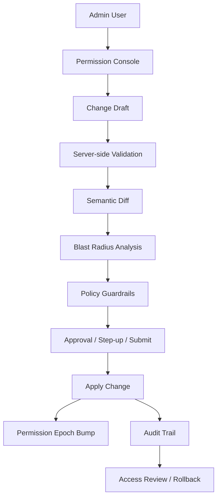
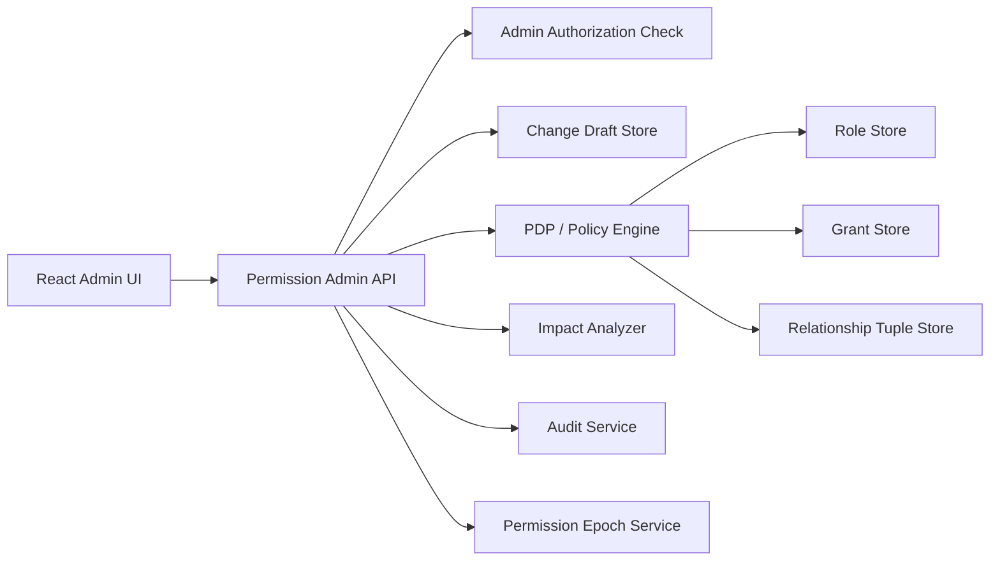
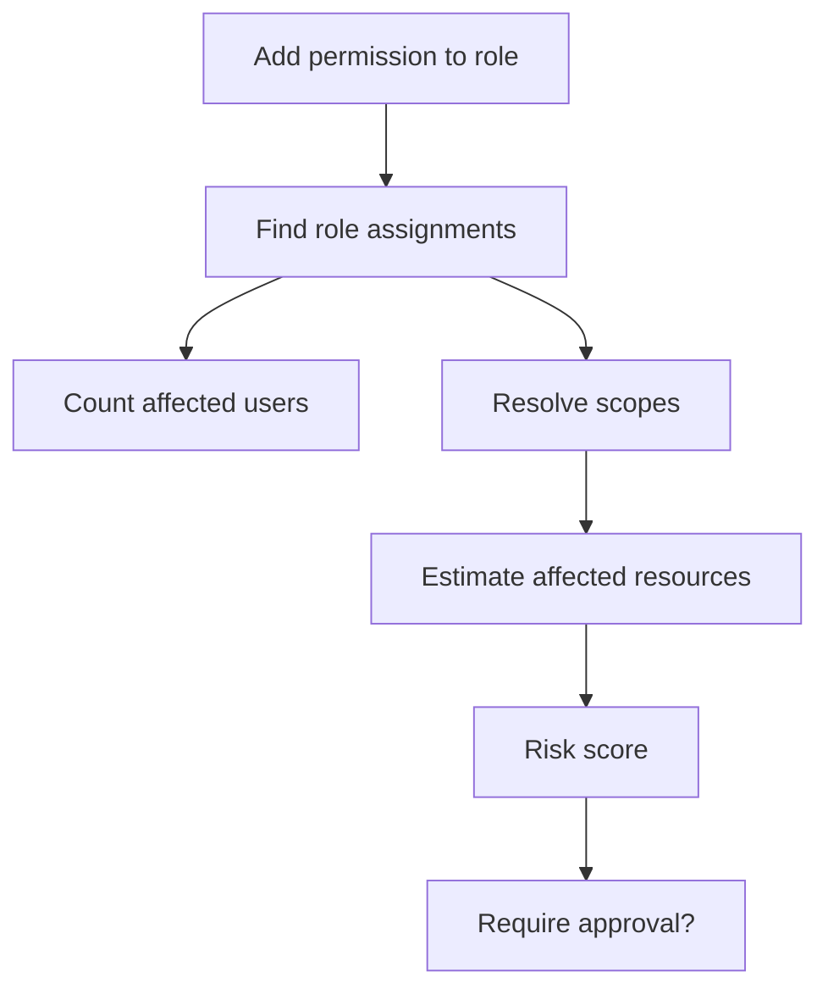
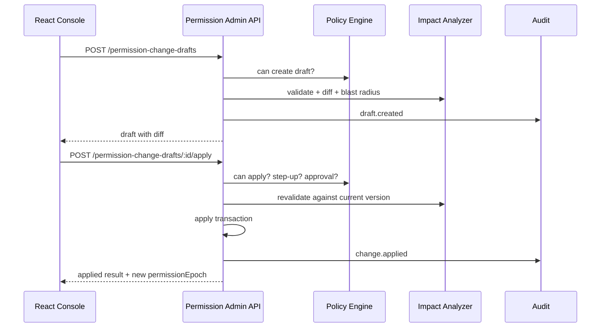
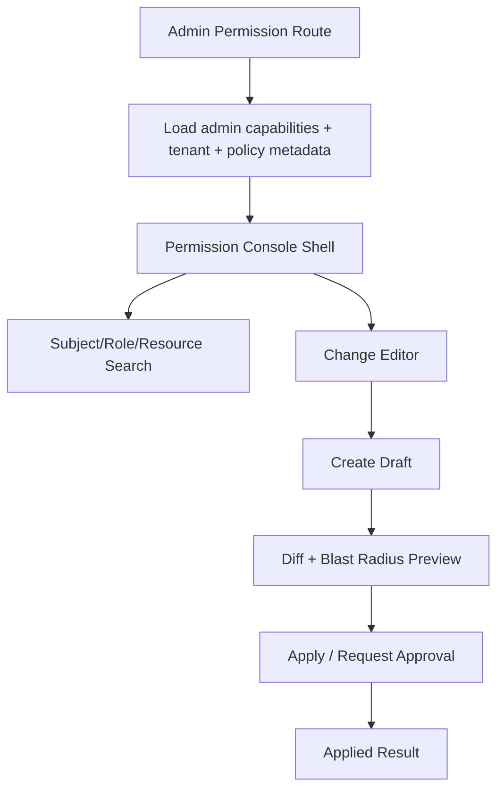
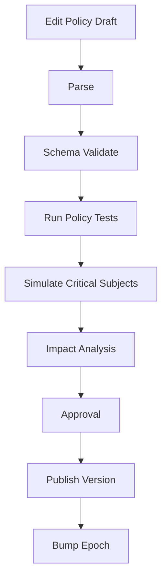

# Part 118 — Build Admin Permission Console

Part 117 built access request workflows.

Now we build the most dangerous UI in the system: the admin permission console.

A permission console is not just an admin CRUD page.

It is a **policy mutation surface**.

If built carelessly, it becomes the easiest way to create broken access control at scale.

The console can:

- grant access;
- revoke access;
- change roles;
- edit role permissions;
- assign users to groups;
- create temporary grants;
- delegate administration;
- alter policy behavior;
- affect many tenants, resources, and users at once.

So the console must be designed like an operational control plane.

A good admin permission console does not merely ask:

> “Can this admin save this form?”

It asks:

> “What exactly will change, who will be affected, what is the blast radius, does this violate policy, who approved it, can we roll it back, and can we explain it later?”

## Mental model



The console has three jobs:

| Job | Meaning |
|---|---|
| Author | Let authorized admins propose permission changes. |
| Explain | Show semantic diff and blast radius before applying. |
| Control | Enforce guardrails, approval, audit, rollback, and cache invalidation. |

It is not enough to render a form and call `POST /roles`.

## What the console manages

A mature console usually manages several authorization primitives.

| Primitive | Example | Risk |
|---|---|---|
| Role | `case_supervisor`, `tenant_admin` | Role explosion, overbroad permissions. |
| Role assignment | assign `case_supervisor` to `user:maya` in tenant `acme` | Excess privilege. |
| Permission | `case.approve`, `case.export` | Dangerous action exposure. |
| ACL grant | `user:maya viewer case:123` | Object-level leak. |
| Relationship tuple | `case:123#reviewer@user:maya` | Inherited graph access. |
| Temporary grant | `case.review` for 7 days | Expiry/revocation drift. |
| Delegation rule | team lead can grant queue reviewer | Admin privilege expansion. |
| Policy version | update condition for `case.approve` | Global behavior change. |

Do not force all of these into one table.

Build a control plane with typed change operations.

## Console invariants

| Invariant | Reason |
|---|---|
| Admin UI is not an enforcement boundary. | Server validates every mutation. |
| Admin can only edit within delegated scope. | Prevent global admin creep. |
| Every change is represented as a draft before apply. | Enables diff, validation, approval. |
| Every change has semantic diff. | Avoid hidden policy mutations. |
| High-risk changes require step-up or multi-approval. | Reduce accidental/compromised admin risk. |
| No admin can silently grant themselves high-risk access. | Prevent self-escalation. |
| Every change bumps permission epoch. | Prevent stale client/server caches. |
| Every change emits audit events. | Support compliance and incident response. |
| Policy changes are versioned. | Support rollback and explanation. |
| Delete is usually revoke/deactivate, not physical delete. | Preserve auditability. |

## Permission console architecture



The UI calls admin APIs.

Admin APIs do not directly mutate policy from UI payload.

They create, validate, preview, approve, and apply change drafts.

## Change draft model

Everything starts as a draft.

```ts
type PermissionChangeKind =
  | 'role_assignment.add'
  | 'role_assignment.remove'
  | 'role_definition.update'
  | 'acl_grant.add'
  | 'acl_grant.revoke'
  | 'relationship_tuple.add'
  | 'relationship_tuple.delete'
  | 'temporary_grant.create'
  | 'delegation_rule.update'
  | 'policy_version.publish';

type PermissionChangeDraft = {
  id: string;
  tenantId: string;
  kind: PermissionChangeKind;
  status: 'draft' | 'validated' | 'awaiting_approval' | 'approved' | 'applied' | 'rejected' | 'cancelled';
  createdBy: SubjectRef;
  createdAt: string;
  updatedAt: string;
  payload: unknown;
  semanticDiff?: SemanticDiff;
  blastRadius?: BlastRadiusAnalysis;
  validation?: ValidationResult;
  approval?: ApprovalRequirement;
  correlationId: string;
  policyVersion: string;
  idempotencyKey: string;
};
```

Why draft-first?

Because permission changes are not ordinary form edits.

They need preview, approval, validation, and traceability.

## Typed operations

Do not expose arbitrary `policyJson` unless the user is in an expert policy editor with strong validation.

Use typed operations.

```ts
type AddRoleAssignmentPayload = {
  user: SubjectRef;
  roleId: string;
  scope: {
    type: 'tenant' | 'project' | 'case_queue';
    id: string;
    tenantId: string;
  };
  expiresAt?: string;
  reason: string;
};

type RemoveRoleAssignmentPayload = {
  assignmentId: string;
  reason: string;
};

type AddAclGrantPayload = {
  subject: SubjectRef;
  relation: 'viewer' | 'editor' | 'reviewer' | 'owner';
  object: ResourceRef;
  expiresAt?: string;
  reason: string;
};

type UpdateRoleDefinitionPayload = {
  roleId: string;
  expectedVersion: string;
  addPermissions: ActionId[];
  removePermissions: ActionId[];
  reason: string;
};
```

A typed operation makes validation possible.

A raw JSON editor makes mistakes easy.

## Semantic diff

A textual diff is insufficient.

You need semantic diff.

```ts
type SemanticDiff = {
  summary: string;
  addedCapabilities: CapabilityRef[];
  removedCapabilities: CapabilityRef[];
  addedSubjects: SubjectRef[];
  removedSubjects: SubjectRef[];
  affectedResources: ResourceRef[] | { kind: 'many'; estimate: number };
  affectedTenants: string[];
  riskChanges: RiskChange[];
  reversible: boolean;
};

type CapabilityRef = {
  action: ActionId;
  scope: 'tenant' | 'project' | 'resource' | 'global';
  sensitivity: 'low' | 'medium' | 'high' | 'critical';
};

type RiskChange = {
  kind:
    | 'adds_export'
    | 'adds_delete'
    | 'adds_admin'
    | 'adds_pii_access'
    | 'broadens_scope'
    | 'removes_approval_gate'
    | 'extends_duration'
    | 'cross_tenant_risk';
  severity: 'low' | 'medium' | 'high' | 'critical';
  message: string;
};
```

Example diff response:

```json
{
  "summary": "Assign case_supervisor role to Maya in tenant_acme for 7 days.",
  "addedCapabilities": [
    { "action": "case.approve", "scope": "tenant", "sensitivity": "high" },
    { "action": "case.assign", "scope": "tenant", "sensitivity": "medium" }
  ],
  "removedCapabilities": [],
  "affectedTenants": ["tenant_acme"],
  "affectedResources": { "kind": "many", "estimate": 842 },
  "riskChanges": [
    {
      "kind": "broadens_scope",
      "severity": "high",
      "message": "Role applies to all cases in tenant_acme."
    }
  ],
  "reversible": true
}
```

The console should show this before applying.

## Blast radius analysis

Blast radius is the question:

> If we apply this change, how much authority changes?

```ts
type BlastRadiusAnalysis = {
  riskLevel: 'low' | 'medium' | 'high' | 'critical';
  affectedUsers: number;
  affectedGroups: number;
  affectedResources: number;
  affectedTenants: number;
  addsHighRiskActions: boolean;
  addsExportCapability: boolean;
  addsAdminCapability: boolean;
  grantsSelfAccess: boolean;
  affectsProductionData: boolean;
  requiresStepUp: boolean;
  requiresApproval: boolean;
  warnings: string[];
};
```

For role definition changes, blast radius can be large.

Adding `case.export` to `case_reviewer` affects every user assigned to `case_reviewer`.



Implementation sketch:

```ts
async function analyzeRoleDefinitionChange(payload: UpdateRoleDefinitionPayload) {
  const role = await roleRepo.get(payload.roleId);
  const assignments = await roleRepo.findAssignments(payload.roleId);

  const added = payload.addPermissions.map((action) => classifyCapability(action));
  const affectedScopes = summarizeAssignmentScopes(assignments);

  const affectedResources = await estimateAffectedResources(affectedScopes);

  const riskLevel = calculateRiskLevel({
    addedCapabilities: added,
    affectedUsers: assignments.length,
    affectedResources,
  });

  return {
    riskLevel,
    affectedUsers: assignments.length,
    affectedResources,
    affectedTenants: countTenants(assignments),
    addsHighRiskActions: added.some((x) => x.sensitivity === 'high' || x.sensitivity === 'critical'),
    addsExportCapability: payload.addPermissions.some((x) => x.endsWith('.export')),
    addsAdminCapability: payload.addPermissions.some((x) => x.includes('.admin')),
    grantsSelfAccess: false,
    affectsProductionData: true,
    requiresStepUp: riskLevel !== 'low',
    requiresApproval: riskLevel === 'high' || riskLevel === 'critical',
    warnings: buildWarnings(added, assignments, affectedResources),
  } satisfies BlastRadiusAnalysis;
}
```

Estimates do not have to be perfect.

They must be honest and conservative.

When uncertain, mark risk higher.

## Admin authorization

The admin console must authorize admin operations by action and scope.

Examples:

```ts
can(actor, 'role_assignment.add', {
  roleId: 'case_supervisor',
  scope: { type: 'tenant', id: 'tenant_acme' },
});

can(actor, 'role_definition.update', {
  roleId: 'case_reviewer',
  tenantId: 'tenant_acme',
});

can(actor, 'acl_grant.revoke', {
  grantId: 'grant_123',
  tenantId: 'tenant_acme',
});
```

Do not use one broad permission like:

```ts
can(actor, 'admin.permissions.manage', tenant)
```

That is too coarse for serious systems.

Use fine-grained admin capabilities.

| Admin action | Meaning |
|---|---|
| `role_assignment.add` | Assign role to subject. |
| `role_assignment.remove` | Remove role assignment. |
| `role_definition.update` | Change permissions inside role. |
| `acl_grant.add` | Grant object relation. |
| `acl_grant.revoke` | Revoke object relation. |
| `temporary_grant.create` | Create temporary grant. |
| `delegation_rule.update` | Change who can delegate. |
| `policy_version.publish` | Publish policy version. |
| `permission_change.approve` | Approve high-risk permission change. |

Then add constraints:

```ts
type AdminConstraint =
  | { kind: 'within_tenant'; tenantId: string }
  | { kind: 'cannot_assign_roles_above_own_level' }
  | { kind: 'cannot_grant_self' }
  | { kind: 'requires_step_up_for_high_risk' }
  | { kind: 'requires_second_approval_for_critical' }
  | { kind: 'max_duration_days'; value: number };
```

## Prevent self-escalation

Self-escalation is a top console risk.

Examples:

- admin assigns themselves `tenant_admin`;
- admin adds `case.export` to a role they already have;
- admin changes group membership of a group they belong to;
- admin modifies delegation rule that lets them approve their own future access;
- admin removes approval gate for high-risk permissions.

Self-escalation detection must analyze indirect effects.

```ts
async function detectsSelfEscalation(draft: PermissionChangeDraft, actor: SubjectRef) {
  const before = await permissionSimulator.snapshot(actor, draft.tenantId, 'before');
  const after = await permissionSimulator.snapshotWithDraft(actor, draft);

  const addedHighRisk = difference(after.capabilities, before.capabilities).filter(
    (cap) => cap.sensitivity === 'high' || cap.sensitivity === 'critical',
  );

  return addedHighRisk.length > 0;
}
```

If detected:

- block outright for critical changes;
- require independent approval for high-risk changes;
- require step-up for medium-risk changes;
- emit audit event either way.

## Admin API lifecycle

Use a multi-step API.



Draft creation:

```http
POST /api/admin/permission-change-drafts
Content-Type: application/json
Idempotency-Key: 6b918...
```

```json
{
  "kind": "role_assignment.add",
  "payload": {
    "user": { "type": "user", "id": "user_123" },
    "roleId": "case_supervisor",
    "scope": { "type": "tenant", "id": "tenant_acme", "tenantId": "tenant_acme" },
    "expiresAt": "2026-07-15T00:00:00.000Z",
    "reason": "Temporary supervisor coverage."
  }
}
```

Apply:

```http
POST /api/admin/permission-change-drafts/draft_123/apply
Content-Type: application/json
```

```json
{
  "expectedDraftVersion": 3,
  "confirmationText": "ASSIGN CASE_SUPERVISOR TO MAYA FOR 7 DAYS",
  "stepUpToken": "stepup_..."
}
```

The confirmation text is not security by itself.

It prevents accidental clicks.

The server still validates authorization, step-up, approval, concurrency, and policy version.

## Create draft handler

```ts
async function createPermissionChangeDraft(
  input: CreatePermissionChangeDraftInput,
  ctx: RequestContext,
) {
  const actor = await requireAuthenticatedSubject(ctx);
  const normalized = normalizePermissionChange(input);

  const adminDecision = await policy.can(actor, `${normalized.kind}.draft`, normalized.payload, ctx);
  if (!adminDecision.allowed) {
    throw new ProblemError(403, 'admin_permission_denied', {
      reason: adminDecision.publicReason,
    });
  }

  const validation = await validatePermissionChange(normalized, ctx);
  if (!validation.valid) {
    throw new ProblemError(400, 'invalid_permission_change', { issues: validation.publicIssues });
  }

  const semanticDiff = await diffService.diff(normalized, ctx);
  const blastRadius = await impactAnalyzer.analyze(normalized, ctx);
  const approval = await approvalPolicy.resolvePermissionChangeApproval({
    actor,
    change: normalized,
    semanticDiff,
    blastRadius,
  });

  const draft = await draftRepo.create({
    actor,
    normalized,
    validation,
    semanticDiff,
    blastRadius,
    approval,
    correlationId: ctx.correlationId,
    idempotencyKey: ctx.idempotencyKey,
  });

  await audit.emit(buildPermissionDraftCreatedEvent(draft, actor, ctx));

  return draft;
}
```

## Apply draft handler

```ts
async function applyPermissionChangeDraft(
  draftId: string,
  input: ApplyDraftInput,
  ctx: RequestContext,
) {
  const actor = await requireAuthenticatedSubject(ctx);

  return db.transaction(async (tx) => {
    const draft = await draftRepo.getForUpdate(tx, draftId);
    if (!draft) throw new ProblemError(404, 'draft_not_found');

    assertVersion(draft.version, input.expectedDraftVersion);
    assertDraftApplyable(draft);

    const decision = await policy.can(actor, `${draft.kind}.apply`, draft.payload, ctx);
    if (!decision.allowed) throw new ProblemError(403, 'admin_permission_denied');

    if (draft.blastRadius?.requiresStepUp) {
      await stepUpVerifier.requireRecentStepUp(actor, input.stepUpToken, 'admin_permission_change');
    }

    if (draft.approval?.required && !draft.approval.satisfied) {
      throw new ProblemError(409, 'approval_required');
    }

    const stillValid = await validatePermissionChange(draft, ctx);
    if (!stillValid.valid) {
      throw new ProblemError(409, 'draft_no_longer_valid', { issues: stillValid.publicIssues });
    }

    const result = await permissionChangeApplier.apply(tx, draft);

    await permissionEpoch.bump(tx, draft.tenantId);
    await draftRepo.markApplied(tx, draft.id, result);
    await audit.emit(tx, buildPermissionChangeAppliedEvent(draft, result, actor, ctx));

    return result;
  });
}
```

## React page architecture



Route loader should check admin access before rendering console shell.

```ts
export async function loader({ request }: LoaderFunctionArgs) {
  const session = await requireSession(request);
  const tenantId = await resolveTenant(request);

  const decision = await can(session.subject, 'permission_console.view', {
    type: 'tenant',
    id: tenantId,
  });

  if (!decision.allowed) {
    throw forbiddenProblem(decision);
  }

  return {
    tenantId,
    adminCapabilities: await loadAdminCapabilities(session.subject, tenantId),
    policyVersion: await loadPolicyVersion(tenantId),
  };
}
```

Console shell:

```tsx
function PermissionConsolePage() {
  const data = useLoaderData<typeof loader>();

  return (
    <PermissionConsoleProvider
      tenantId={data.tenantId}
      adminCapabilities={data.adminCapabilities}
      policyVersion={data.policyVersion}
    >
      <h1>Permission console</h1>
      <PermissionConsoleTabs />
    </PermissionConsoleProvider>
  );
}
```

## Role assignment editor

```tsx
function RoleAssignmentEditor() {
  const [user, setUser] = React.useState<SubjectRef | null>(null);
  const [roleId, setRoleId] = React.useState('');
  const [scope, setScope] = React.useState<PermissionScope | null>(null);
  const [expiresAt, setExpiresAt] = React.useState<string | undefined>();
  const [reason, setReason] = React.useState('');

  const createDraft = useCreatePermissionChangeDraft();

  const canSubmit = user && roleId && scope && reason.trim().length >= 20;

  return (
    <section>
      <h2>Assign role</h2>

      <SubjectPicker value={user} onChange={setUser} />
      <RolePicker value={roleId} onChange={setRoleId} />
      <ScopePicker value={scope} onChange={setScope} />
      <ExpiryPicker value={expiresAt} onChange={setExpiresAt} />

      <label>
        Reason
        <textarea value={reason} onChange={(event) => setReason(event.target.value)} />
      </label>

      <button
        type="button"
        disabled={!canSubmit || createDraft.isPending}
        onClick={() => {
          if (!user || !scope) return;

          createDraft.mutate({
            kind: 'role_assignment.add',
            payload: {
              user,
              roleId,
              scope,
              expiresAt,
              reason,
            },
          });
        }}
      >
        Preview change
      </button>

      {createDraft.data && <PermissionChangePreview draft={createDraft.data} />}
    </section>
  );
}
```

Notice the button says **Preview change**, not **Save**.

Permission changes should be previewed before applied.

## Permission change preview

```tsx
function PermissionChangePreview({ draft }: { draft: PermissionChangeDraftView }) {
  return (
    <section aria-labelledby="permission-change-preview">
      <h2 id="permission-change-preview">Review permission change</h2>

      <DiffSummary diff={draft.semanticDiff} />
      <BlastRadiusPanel analysis={draft.blastRadius} />
      <ValidationPanel validation={draft.validation} />
      <ApprovalRequirementPanel approval={draft.approval} />
      <AuditPreview draft={draft} />

      <ApplyPermissionChangePanel draft={draft} />
    </section>
  );
}
```

The preview should be opinionated.

High-risk changes should look high-risk.

```tsx
function BlastRadiusPanel({ analysis }: { analysis: BlastRadiusAnalysis }) {
  return (
    <aside data-risk={analysis.riskLevel}>
      <h3>Blast radius</h3>
      <dl>
        <dt>Risk level</dt>
        <dd>{analysis.riskLevel}</dd>

        <dt>Affected users</dt>
        <dd>{analysis.affectedUsers}</dd>

        <dt>Affected resources</dt>
        <dd>{analysis.affectedResources}</dd>

        <dt>Affected tenants</dt>
        <dd>{analysis.affectedTenants}</dd>
      </dl>

      {analysis.warnings.length > 0 && (
        <ul>
          {analysis.warnings.map((warning) => (
            <li key={warning}>{warning}</li>
          ))}
        </ul>
      )}
    </aside>
  );
}
```

Do not hide warnings below the fold.

## Apply panel

```tsx
function ApplyPermissionChangePanel({ draft }: { draft: PermissionChangeDraftView }) {
  const [confirmation, setConfirmation] = React.useState('');
  const [stepUpToken, setStepUpToken] = React.useState<string | null>(null);
  const applyDraft = useApplyPermissionChangeDraft(draft.id);

  const requiredConfirmation = draft.requiredConfirmationText;
  const confirmationOk = confirmation === requiredConfirmation;
  const requiresStepUp = draft.blastRadius.requiresStepUp;
  const approvalBlocked = draft.approval.required && !draft.approval.satisfied;

  return (
    <div>
      {requiresStepUp && (
        <StepUpPrompt
          purpose="admin_permission_change"
          onComplete={(token) => setStepUpToken(token)}
        />
      )}

      {approvalBlocked && <ApprovalRequiredNotice approval={draft.approval} />}

      <label>
        Type confirmation text
        <input value={confirmation} onChange={(event) => setConfirmation(event.target.value)} />
      </label>

      <code>{requiredConfirmation}</code>

      <button
        type="button"
        disabled={
          !confirmationOk ||
          approvalBlocked ||
          (requiresStepUp && !stepUpToken) ||
          applyDraft.isPending
        }
        onClick={() => {
          applyDraft.mutate({
            expectedDraftVersion: draft.version,
            confirmationText: confirmation,
            stepUpToken: stepUpToken ?? undefined,
          });
        }}
      >
        Apply permission change
      </button>
    </div>
  );
}
```

The apply button is intentionally friction-heavy.

For low-risk changes, you can reduce friction.

For high-risk changes, friction is a feature.

## Delegated administration

Not every admin should be global admin.

Delegated admin means an actor can manage specific permission surfaces within limited scope.

Examples:

| Delegated admin | Allowed actions |
|---|---|
| Team lead | assign queue reviewer within their queue |
| Project owner | add project viewer/editor |
| Data steward | approve export access |
| Tenant security admin | revoke suspicious grants |
| Support lead | approve constrained impersonation |

Model delegation explicitly.

```ts
type DelegationRule = {
  id: string;
  tenantId: string;
  delegatorRole: string;
  allowedAdminActions: AdminActionId[];
  targetConstraints: AdminConstraint[];
  maxDurationDays?: number;
  requiresApprovalAboveRisk?: 'medium' | 'high' | 'critical';
  createdAt: string;
  createdBy: SubjectRef;
};
```

Delegation is itself a permission change.

Changing delegation rules should be treated as high-risk.

## Policy simulation

Admins need to preview effective access.

Build a simulation feature:

```http
POST /api/admin/permission-simulations
Content-Type: application/json
```

```json
{
  "subject": { "type": "user", "id": "user_123" },
  "action": "case.approve",
  "resource": { "type": "case", "id": "case_9231", "tenantId": "tenant_acme" },
  "draftId": "draft_123"
}
```

Response:

```json
{
  "withoutDraft": {
    "allowed": false,
    "reason": "missing_case_supervisor_role"
  },
  "withDraft": {
    "allowed": true,
    "reason": "role_assignment.case_supervisor"
  },
  "explanation": [
    "Draft adds case_supervisor role scoped to tenant_acme.",
    "case_supervisor includes case.approve."
  ]
}
```

The explanation shown to admins can be richer than user-facing denial reasons.

Still avoid leaking secrets, raw internal IDs beyond scope, or sensitive policy internals to admins without need.

## Search and browsing UX

Permission consoles need powerful search.

But search must be scoped.

| Search | Required boundary |
|---|---|
| User search | tenant/directory scope |
| Role search | tenant/global policy scope |
| Resource search | tenant/resource visibility |
| Grant search | admin permission scope |
| Audit search | audit viewer permission |

Do not let tenant admin search all users globally unless policy allows it.

Subject picker should show safe identity projection:

```ts
type AdminSubjectSearchResult = {
  subject: SubjectRef;
  displayName: string;
  emailMasked?: string;
  department?: string;
  status: 'active' | 'suspended' | 'deprovisioned';
  tenantMembershipsVisibleToActor: string[];
};
```

Do not expose unnecessary PII in admin search results.

## Audit model

Every admin operation should emit audit.

```ts
type PermissionAdminAuditEvent =
  | {
      type: 'permission_change.draft_created';
      draftId: string;
      actor: SubjectRef;
      kind: PermissionChangeKind;
      tenantId: string;
      semanticDiff: SemanticDiff;
      blastRadius: BlastRadiusAnalysis;
      occurredAt: string;
      correlationId: string;
    }
  | {
      type: 'permission_change.applied';
      draftId: string;
      actor: SubjectRef;
      kind: PermissionChangeKind;
      tenantId: string;
      resultId: string;
      permissionEpoch: number;
      occurredAt: string;
      correlationId: string;
    }
  | {
      type: 'permission_change.rejected';
      draftId: string;
      actor: SubjectRef;
      reason: string;
      occurredAt: string;
      correlationId: string;
    };
```

Audit should include diff and blast radius summary.

Do not only log:

```txt
Admin updated role.
```

That is useless during incident response.

Log:

```json
{
  "type": "permission_change.applied",
  "actor": { "type": "user", "id": "user_admin_1" },
  "tenantId": "tenant_acme",
  "kind": "role_definition.update",
  "roleId": "case_reviewer",
  "addedPermissions": ["case.export"],
  "removedPermissions": [],
  "affectedUsers": 142,
  "affectedResourcesEstimate": 12040,
  "riskLevel": "critical",
  "approvalIds": ["approval_1", "approval_2"],
  "permissionEpoch": 9842,
  "correlationId": "corr_123"
}
```

## Rollback

Not every permission change is safely reversible.

The draft should say whether it is reversible.

| Change | Reversible? | Notes |
|---|---|---|
| Add role assignment | Usually yes | Remove assignment. |
| Remove role assignment | Maybe | Re-add if old scope/expiry known. |
| Add ACL grant | Usually yes | Revoke grant. |
| Delete relationship tuple | Maybe | Recreate if old tuple known. |
| Update role definition | Maybe risky | Could affect many users and conflict with later changes. |
| Publish policy version | Needs migration plan | Rollback may break new state. |

Create rollback plan at apply time.

```ts
type RollbackPlan = {
  changeId: string;
  reversible: boolean;
  operations: PermissionChangeKind[];
  constraints: string[];
  expiresAt?: string;
};
```

For critical changes, require a rollback plan before apply.

## Permission epoch

Any permission change that can alter decisions must bump permission epoch.

```ts
async function applyRoleAssignmentAdd(tx: Tx, draft: PermissionChangeDraft) {
  const assignment = await roleAssignmentRepo.create(tx, draft.payload);
  const epoch = await permissionEpoch.bump(tx, draft.tenantId);

  return {
    kind: 'role_assignment.added',
    assignmentId: assignment.id,
    permissionEpoch: epoch,
  };
}
```

The client should reconcile:

```ts
function onPermissionChangeApplied(result: PermissionChangeResult) {
  queryClient.invalidateQueries({ queryKey: ['permissions', result.tenantId] });
  queryClient.invalidateQueries({ queryKey: ['admin-permissions', result.tenantId] });
  queryClient.invalidateQueries({ queryKey: ['navigation', result.tenantId] });
}
```

Admin consoles often create stale-cache bugs because the admin expects immediate effect.

Make permission epoch visible in debugging tools.

## Policy editor mode

Some teams need raw policy editing.

Treat it as a separate expert mode.

Minimum guardrails:

- schema validation;
- syntax validation;
- semantic validation;
- test case runner;
- simulation before publish;
- blast radius estimate;
- approval for publish;
- versioned rollout;
- rollback plan;
- audit event;
- no direct edit in production without draft.

Policy editor flow:



Policy tests should be first-class objects.

```ts
type PolicyTestCase = {
  name: string;
  subject: SubjectRef;
  action: ActionId;
  resource: ResourceRef;
  context?: Record<string, unknown>;
  expected: 'allowed' | 'denied' | 'requires_step_up';
};
```

## Admin console route structure

Example React Router routes:

```txt
/admin/permissions
/admin/permissions/users/:userId
/admin/permissions/roles
/admin/permissions/roles/:roleId
/admin/permissions/grants
/admin/permissions/requests
/admin/permissions/drafts/:draftId
/admin/permissions/simulate
/admin/permissions/audit
```

Route metadata:

```ts
export const handle = {
  auth: {
    requiresAuth: true,
    permission: {
      action: 'permission_console.view',
      resourceFrom: 'tenant',
    },
  },
};
```

Action metadata:

```ts
export const roleAssignmentActionPolicy = {
  action: 'role_assignment.add',
  requiresStepUpWhen: ['high_risk', 'self_escalation'],
  requiresApprovalWhen: ['critical_risk'],
};
```

## Admin table design

Role assignment table columns:

| Column | Purpose |
|---|---|
| Subject | Who has access. |
| Role | What role. |
| Scope | Where it applies. |
| Source | Direct, group, access request, sync. |
| Expiry | Temporary/permanent. |
| Last used | Helps remove stale access. |
| Created by | Audit context. |
| Actions | Revoke, extend, inspect, simulate. |

`Last used` is useful but must be interpreted carefully.

Absence of use is not proof of no business need.

It is a signal for access review.

## Access review integration

The console should support periodic access reviews.

```ts
type AccessReviewItem = {
  id: string;
  subject: SubjectRef;
  grantOrAssignmentId: string;
  accessSummary: string;
  riskLevel: 'low' | 'medium' | 'high' | 'critical';
  lastUsedAt?: string;
  reviewer: SubjectRef;
  decision?: 'keep' | 'revoke' | 'modify';
  decisionReason?: string;
};
```

Access review is not the same as one-off access request approval.

It asks:

> Should this existing access still exist?

For regulated systems, this is critical.

## Error and denial UX

Admin errors must be specific enough to recover but not leak unnecessary data.

| Error | UX |
|---|---|
| `admin_permission_denied` | You cannot manage this permission in this scope. |
| `self_escalation_blocked` | This change would grant you new high-risk access and requires independent approval. |
| `approval_required` | This change requires approval before it can be applied. |
| `draft_no_longer_valid` | The underlying role/resource changed. Re-preview the change. |
| `policy_version_conflict` | Policy changed since preview. Re-run impact analysis. |
| `subject_not_in_tenant` | Selected user is not a member of this tenant. |
| `role_not_assignable` | This role cannot be assigned manually. |
| `max_duration_exceeded` | Duration exceeds allowed policy limit. |

Do not show stack traces, raw SQL, or internal policy paths.

## Anti-patterns

### Anti-pattern 1: admin role can do everything

```ts
if (user.role === 'admin') {
  allow();
}
```

This destroys least privilege.

Use delegated admin capabilities.

### Anti-pattern 2: save without preview

```tsx
<button onClick={saveRole}>Save</button>
```

Permission changes need diff and blast radius preview.

### Anti-pattern 3: role definition changes without affected-user count

Adding one permission to one role may affect thousands of users.

Always show affected assignments.

### Anti-pattern 4: physical delete of grants

Revocation should be auditable.

Use `revokedAt`, not hard delete.

### Anti-pattern 5: no version conflict handling

A draft created against policy version `12` may be unsafe under policy version `13`.

Revalidate before apply.

### Anti-pattern 6: no self-escalation detection

Direct assignment checks are not enough.

Analyze effective permission change for the actor.

## Testing matrix

| Test | Expected result |
|---|---|
| Admin without console view permission opens route. | Loader returns `403`. |
| Admin creates role assignment outside delegated tenant. | Server rejects. |
| Draft creation returns semantic diff. | UI shows preview, not save. |
| Role definition update affecting many users. | Blast radius shows affected user/resource count. |
| High-risk permission added. | Step-up required. |
| Critical permission added. | Approval required. |
| Admin grants themselves high-risk permission. | Block or require independent approval. |
| Draft applied after policy version changed. | Revalidation fails; re-preview required. |
| Apply draft bumps permission epoch. | Client invalidates permission cache. |
| Revoke assignment preserves audit. | Assignment/grant marked revoked, not deleted. |
| Policy editor syntax error. | Publish blocked. |
| Policy test failure. | Publish blocked. |
| Audit log missing. | Apply fails or raises incident depending policy. |

Example test:

```ts
it('requires approval when role definition update adds critical permission', async () => {
  const draft = await createPermissionChangeDraft(
    {
      kind: 'role_definition.update',
      payload: {
        roleId: 'case_reviewer',
        expectedVersion: 'v12',
        addPermissions: ['case.export'],
        removePermissions: [],
        reason: 'Need export for quarterly compliance reporting.',
      },
    },
    contextFor(user('tenant-admin')),
  );

  expect(draft.blastRadius.riskLevel).toBe('critical');
  expect(draft.approval.required).toBe(true);

  await expect(
    applyPermissionChangeDraft(
      draft.id,
      {
        expectedDraftVersion: draft.version,
        confirmationText: draft.requiredConfirmationText,
      },
      contextFor(user('tenant-admin')),
    ),
  ).rejects.toMatchObject({ code: 'approval_required' });
});
```

Self-escalation test:

```ts
it('detects indirect self-escalation through role definition update', async () => {
  await assignRole(user('admin-1'), 'case_reviewer', tenant('acme'));

  const draft = await createPermissionChangeDraft(
    {
      kind: 'role_definition.update',
      payload: {
        roleId: 'case_reviewer',
        expectedVersion: 'v1',
        addPermissions: ['case.approve'],
        removePermissions: [],
        reason: 'Adjust reviewer role.',
      },
    },
    contextFor(user('admin-1')),
  );

  expect(draft.blastRadius.grantsSelfAccess).toBe(true);
  expect(draft.validation.issues).toContainEqual(
    expect.objectContaining({ code: 'potential_self_escalation' }),
  );
});
```

## Production checklist

Before shipping admin permission console:

- [ ] Route loader checks `permission_console.view`.
- [ ] Every mutation is server-authorized by fine-grained admin action.
- [ ] Mutations use draft → preview → apply lifecycle.
- [ ] Drafts include semantic diff.
- [ ] Drafts include blast radius analysis.
- [ ] High-risk changes require step-up.
- [ ] Critical changes require approval.
- [ ] Self-escalation detection exists.
- [ ] Delegated admin scope is enforced server-side.
- [ ] Apply revalidates draft against current policy/version.
- [ ] Apply uses optimistic concurrency or row locks.
- [ ] Apply bumps permission epoch.
- [ ] Revocation preserves audit history.
- [ ] Audit events include actor, target, diff, risk, and correlation ID.
- [ ] Policy editor mode has tests, validation, simulation, approval, rollback.
- [ ] Admin search is tenant/scoped and PII-minimized.
- [ ] E2E tests cover route denial, draft preview, approval required, apply, rollback/revoke.

## Key takeaways

The admin permission console is a control plane.

Treat it like one.

A safe console is not defined by having many form fields.

It is defined by:

- precise admin authorization;
- delegated scope;
- draft-first workflow;
- semantic diff;
- blast radius preview;
- self-escalation detection;
- approval and step-up for high-risk changes;
- permission epoch invalidation;
- auditability;
- rollback planning;
- strong tests.

The more powerful the console, the more it must explain and constrain itself.

If a permission console can silently create broad permanent access, it is not an admin tool.

It is an access-control vulnerability with a UI.

## References

- OWASP Authorization Cheat Sheet — validate permissions on every request and deny-by-default principles: https://cheatsheetseries.owasp.org/cheatsheets/Authorization_Cheat_Sheet.html
- OWASP Logging Cheat Sheet — application security logging and audit guidance: https://cheatsheetseries.owasp.org/cheatsheets/Logging_Cheat_Sheet.html
- OWASP Top 10 2021 A01 Broken Access Control — least privilege and access-control failure modes: https://owasp.org/Top10/A01_2021-Broken_Access_Control/
- NIST RBAC model paper — role/user/permission model foundations: https://csrc.nist.gov/CSRC/media/Publications/conference-paper/2000/07/26/the-nist-model-for-role-based-access-control-towards-a-unified-/documents/sandhu-ferraiolo-kuhn-00.pdf
- OpenFGA Concepts — relationship tuples and authorization checks: https://openfga.dev/docs/concepts
