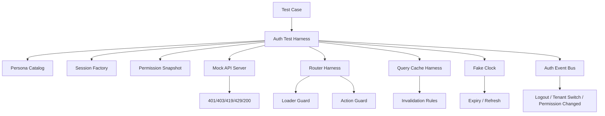

# Part 119 — Build Auth Test Harness

Part 118 built the admin permission console.

Now we build the thing that keeps the whole auth system honest: an **auth test harness**.

A test harness is not just a collection of mocks.

It is a controlled runtime for auth scenarios.

It must let us say:

> “Render this screen as a case worker in tenant A, with a valid session, stale permissions, one pending refresh, and a server that revokes access during submit.”

And then assert the correct result without writing fragile, ad-hoc setup in every test.

A good auth test harness gives us repeatability.

A great auth test harness gives us **security regression memory**.

It remembers every auth bug class we have already seen and makes it cheap to prove the bug does not return.

## Why auth needs its own harness

Most React tests are written around components:

- render component;
- click button;
- assert output.

That is not enough for auth.

Auth behavior emerges from the interaction of:

- browser state;
- session state;
- token expiry;
- route loaders;
- route actions;
- data caches;
- API clients;
- permission snapshots;
- tenant context;
- cross-tab events;
- server errors;
- redirect intent;
- step-up challenges;
- policy version changes.

A login form can be tested like a component.

An auth system must be tested like a small distributed system.



The harness is the place where we make auth states explicit.

Without it, tests silently rely on hidden defaults.

Hidden defaults are where broken access control bugs hide.

## Design goal

The harness must satisfy these properties:

| Property | Meaning |
|---|---|
| Deterministic | No real time, real network, or random auth data unless explicitly requested. |
| Deny-by-default | Unknown permission and unknown session state must fail closed. |
| Scenario-oriented | Test setup should describe user/session/tenant/permission/server behavior. |
| Realistic enough | Mocks must preserve real auth semantics: 401, 403, CSRF, expiry, role drift, tenant mismatch. |
| Cheap to compose | Unit, component, route, integration, and E2E tests should share vocabulary. |
| Safe | Test auth state must not leak real credentials into repo, logs, snapshots, or CI artifacts. |
| Auditable | Regression scenarios should be named after security behaviors, not implementation details. |

The harness should not hide auth complexity.

It should make auth complexity controllable.

## What we are building

We will build a TypeScript-first harness with these modules:

```txt
src/test-auth/
  personas.ts
  session-factory.ts
  permission-fixtures.ts
  auth-scenarios.ts
  auth-clock.ts
  auth-server.ts
  auth-store-harness.ts
  render-with-auth.tsx
  router-harness.tsx
  query-harness.tsx
  scenario-runner.ts
  e2e-auth.ts
  assertions.ts
```

Each module has one responsibility.

The harness should not become a magical test god object.

## Core model

Start with the smallest model that captures auth behavior.

```ts
type TenantId = string;
type UserId = string;
type Role = 'case_worker' | 'supervisor' | 'admin' | 'auditor' | 'support';
type AuthAssurance = 'aal1' | 'aal2' | 'step_up_required';

type Persona = {
  id: UserId;
  displayName: string;
  email: string;
  roles: Record<TenantId, Role[]>;
  defaultTenantId: TenantId;
  assurance: AuthAssurance;
};

type SessionFixture = {
  sessionId: string;
  userId: UserId;
  tenantId: TenantId;
  issuedAtMs: number;
  expiresAtMs: number;
  authEpoch: number;
  permissionEpoch: number;
  csrfToken?: string;
  status: 'active' | 'expired' | 'revoked';
};

type PermissionDecision = {
  allowed: boolean;
  reason?:
    | 'not_authenticated'
    | 'forbidden'
    | 'tenant_mismatch'
    | 'step_up_required'
    | 'permission_stale'
    | 'resource_locked'
    | 'policy_unavailable';
  requiredAssurance?: AuthAssurance;
};

type PermissionSnapshot = {
  tenantId: TenantId;
  userId: UserId;
  permissionEpoch: number;
  decisions: Record<string, PermissionDecision>;
};
```

The important idea is not the exact shape.

The important idea is that test auth is explicit.

There is no “current user” floating in hidden global state.

## Persona catalog

Personas are not just users.

They are stable representatives of access patterns.

```ts
export const tenants = {
  alpha: 'tenant_alpha',
  beta: 'tenant_beta',
} as const;

export const personas = {
  anonymous: null,

  caseWorker: {
    id: 'user_case_worker',
    displayName: 'Case Worker',
    email: 'case.worker@example.test',
    defaultTenantId: tenants.alpha,
    assurance: 'aal1',
    roles: {
      [tenants.alpha]: ['case_worker'],
    },
  },

  supervisor: {
    id: 'user_supervisor',
    displayName: 'Supervisor',
    email: 'supervisor@example.test',
    defaultTenantId: tenants.alpha,
    assurance: 'aal2',
    roles: {
      [tenants.alpha]: ['supervisor'],
    },
  },

  auditor: {
    id: 'user_auditor',
    displayName: 'Auditor',
    email: 'auditor@example.test',
    defaultTenantId: tenants.alpha,
    assurance: 'aal1',
    roles: {
      [tenants.alpha]: ['auditor'],
      [tenants.beta]: ['auditor'],
    },
  },

  supportAgent: {
    id: 'user_support',
    displayName: 'Support Agent',
    email: 'support@example.test',
    defaultTenantId: tenants.alpha,
    assurance: 'aal2',
    roles: {
      [tenants.alpha]: ['support'],
    },
  },
} satisfies Record<string, Persona | null>;
```

Good persona design is domain-specific.

For a regulated case management system, useful personas include:

| Persona | Why it exists |
|---|---|
| Anonymous | Proves unauthenticated users cannot access protected screens. |
| Case worker | Normal operational actor. |
| Supervisor | Escalation actor. |
| Auditor | Read-heavy actor with write restrictions. |
| Support agent | Impersonation/support boundary. |
| Tenant admin | Delegated administration. |
| Global admin | Dangerous control-plane actor. |
| Suspended user | Session exists but account/membership changed. |
| Former member | Tests deprovisioning and stale session denial. |
| Cross-tenant member | Tests tenant switch and tenant isolation. |

Avoid personas named after individual tests.

Bad:

```ts
const userWhoCanClickButton = { ... };
```

Good:

```ts
const supervisorWithAAL2 = personas.supervisor;
```

Personas should be reusable vocabulary.

## Session factory

The harness must create sessions with precise time and epoch behavior.

```ts
let sessionSeq = 0;

export function makeSession(input: {
  persona: Persona;
  tenantId?: TenantId;
  nowMs?: number;
  ttlMs?: number;
  status?: SessionFixture['status'];
  authEpoch?: number;
  permissionEpoch?: number;
  csrf?: boolean;
}): SessionFixture {
  const now = input.nowMs ?? Date.UTC(2026, 0, 1, 9, 0, 0);
  const ttl = input.ttlMs ?? 15 * 60_000;
  const tenantId = input.tenantId ?? input.persona.defaultTenantId;

  return {
    sessionId: `test_session_${++sessionSeq}`,
    userId: input.persona.id,
    tenantId,
    issuedAtMs: now,
    expiresAtMs: now + ttl,
    authEpoch: input.authEpoch ?? 1,
    permissionEpoch: input.permissionEpoch ?? 1,
    csrfToken: input.csrf ? `csrf_${sessionSeq}` : undefined,
    status: input.status ?? 'active',
  };
}
```

The factory must make expiry easy to test.

```ts
const session = makeSession({
  persona: personas.caseWorker!,
  nowMs: clock.now(),
  ttlMs: 30_000,
});
```

Then the test can advance time.

```ts
clock.advanceBy(31_000);
await expectSessionExpired();
```

Do not let tests rely on real `Date.now()`.

Real time creates flakes.

Fake time creates repeatable expiry tests.

## Auth clock

Wrap the test clock.

```ts
export type AuthClock = {
  now(): number;
  set(ms: number): void;
  advanceBy(ms: number): Promise<void>;
  reset(): void;
};

export function createAuthClock(): AuthClock {
  return {
    now: () => Date.now(),
    set(ms) {
      vi.useFakeTimers();
      vi.setSystemTime(ms);
    },
    async advanceBy(ms) {
      await vi.advanceTimersByTimeAsync(ms);
    },
    reset() {
      vi.useRealTimers();
    },
  };
}
```

Use this clock for:

- session expiry;
- refresh threshold;
- permission TTL;
- retry backoff;
- access request expiry;
- temporary grant expiry;
- lockout cooldown;
- signed URL expiry.

Time is part of auth.

So time must be part of the harness.

## Permission fixture builder

Permissions should be built from actions, not roles.

```ts
type Action =
  | 'case.read'
  | 'case.update'
  | 'case.assign'
  | 'case.close'
  | 'case.export'
  | 'permission.admin.read'
  | 'permission.admin.write'
  | 'audit.read';

type ResourceRef = {
  type: 'case' | 'permission_console' | 'audit_log';
  id?: string;
  tenantId: TenantId;
  state?: 'draft' | 'open' | 'escalated' | 'closed' | 'locked';
  ownerId?: UserId;
};

export function permissionKey(action: Action, resource: ResourceRef): string {
  return `${action}:${resource.tenantId}:${resource.type}:${resource.id ?? '*'}`;
}

export function makePermissionSnapshot(input: {
  persona: Persona;
  tenantId?: TenantId;
  epoch?: number;
  grants?: Array<{ action: Action; resource: ResourceRef; decision?: PermissionDecision }>;
  denies?: Array<{ action: Action; resource: ResourceRef; reason?: PermissionDecision['reason'] }>;
}): PermissionSnapshot {
  const tenantId = input.tenantId ?? input.persona.defaultTenantId;
  const decisions: Record<string, PermissionDecision> = {};

  for (const grant of input.grants ?? []) {
    decisions[permissionKey(grant.action, grant.resource)] = grant.decision ?? { allowed: true };
  }

  for (const deny of input.denies ?? []) {
    decisions[permissionKey(deny.action, deny.resource)] = {
      allowed: false,
      reason: deny.reason ?? 'forbidden',
    };
  }

  return {
    tenantId,
    userId: input.persona.id,
    permissionEpoch: input.epoch ?? 1,
    decisions,
  };
}
```

Then scenario setup becomes readable.

```ts
const caseA = {
  type: 'case',
  id: 'case_123',
  tenantId: tenants.alpha,
  state: 'open',
} satisfies ResourceRef;

const permissions = makePermissionSnapshot({
  persona: personas.caseWorker!,
  grants: [{ action: 'case.read', resource: caseA }],
  denies: [{ action: 'case.close', resource: caseA, reason: 'forbidden' }],
});
```

Do not encode authorization tests as role names.

Role names are implementation detail.

The test should say what action is allowed or denied.

## Scenario object

The scenario is the main interface used by test authors.

```ts
type AuthScenario = {
  name: string;
  persona: Persona | null;
  tenantId?: TenantId;
  session?: Partial<SessionFixture> | 'none';
  permissions?: PermissionSnapshot;
  server?: {
    sessionStatus?: number;
    permissionStatus?: number;
    nextMutationStatus?: number;
    forceRefreshFailure?: boolean;
    revokeAfterFirstRead?: boolean;
  };
  browser?: {
    startPath?: string;
    returnTo?: string;
    storedAuthEpoch?: number;
    storedPermissionEpoch?: number;
  };
};
```

Example:

```ts
export const scenarios = {
  anonymousVisitsProtectedRoute: {
    name: 'anonymous visits protected route',
    persona: null,
    session: 'none',
    browser: { startPath: '/cases/case_123' },
  },

  stalePermissionDuringSubmit: {
    name: 'permission revoked between render and submit',
    persona: personas.caseWorker,
    session: { permissionEpoch: 1 },
    permissions: caseWorkerCanUpdateCase,
    server: { nextMutationStatus: 403 },
  },

  expiredSessionRefreshesBeforeLoader: {
    name: 'expired session refreshes before route loader fetch',
    persona: personas.caseWorker,
    session: { status: 'expired' },
    server: { sessionStatus: 200 },
  },
} satisfies Record<string, AuthScenario>;
```

Scenario names should read like incident prevention.

- “permission revoked between render and submit”;
- “anonymous user cannot access tenant route”;
- “tenant switch clears previous tenant cache”;
- “logout cancels in-flight mutation”;
- “return URL rejects absolute external URL”.

These names are useful even outside the test suite.

They are living documentation.

## Mock API server

Use a mock server that preserves auth semantics.

MSW is a good fit because the same mental model can be used in browser-like and Node.js tests.

```ts
import { http, HttpResponse } from 'msw';
import { setupServer } from 'msw/node';

export function createAuthServer(scenario: AuthScenario) {
  let session = scenario.persona
    ? makeSession({
        persona: scenario.persona,
        tenantId: scenario.tenantId,
        ...scenario.session,
      })
    : null;

  const server = setupServer(
    http.get('/api/session', () => {
      if (!session || scenario.session === 'none') {
        return HttpResponse.json(
          { type: 'not_authenticated', title: 'Not authenticated' },
          { status: 401 }
        );
      }

      if (session.status === 'revoked') {
        return HttpResponse.json(
          { type: 'session_revoked', title: 'Session revoked' },
          { status: 401 }
        );
      }

      if (session.status === 'expired') {
        return HttpResponse.json(
          { type: 'session_expired', title: 'Session expired' },
          { status: 401 }
        );
      }

      return HttpResponse.json({
        user: {
          id: session.userId,
          displayName: scenario.persona!.displayName,
        },
        tenantId: session.tenantId,
        authEpoch: session.authEpoch,
        permissionEpoch: session.permissionEpoch,
        expiresAt: new Date(session.expiresAtMs).toISOString(),
      });
    }),

    http.get('/api/permissions', () => {
      if (!session || !scenario.permissions) {
        return HttpResponse.json({ decisions: {} });
      }

      return HttpResponse.json(scenario.permissions);
    }),

    http.patch('/api/cases/:caseId', async ({ params }) => {
      if (!session) {
        return HttpResponse.json({ type: 'not_authenticated' }, { status: 401 });
      }

      if (scenario.server?.nextMutationStatus === 403) {
        return HttpResponse.json(
          {
            type: 'forbidden',
            title: 'Forbidden',
            reason: 'permission_stale',
            resource: String(params.caseId),
          },
          { status: 403 }
        );
      }

      return HttpResponse.json({ id: params.caseId, status: 'updated' });
    })
  );

  return {
    server,
    getSession: () => session,
    revokeSession: () => {
      if (session) session.status = 'revoked';
    },
    expireSession: () => {
      if (session) session.status = 'expired';
    },
    bumpPermissionEpoch: () => {
      if (session) session.permissionEpoch += 1;
    },
  };
}
```

A good mock server must be able to return:

| Status | Test purpose |
|---|---|
| `200` | Happy path. |
| `204` | Successful logout/delete/no body. |
| `400` | Invalid request shape. |
| `401` | Missing/expired/revoked authentication. |
| `403` | Authenticated but not authorized. |
| `409` | Conflict/resource state changed. |
| `419`/custom | Session expired if your product uses a non-standard convention. |
| `429` | Rate-limited login/resend/export. |
| `503` | IdP/policy/session service unavailable. |

Do not let every test invent response shapes.

Centralize problem details.

```ts
type Problem = {
  type: string;
  title: string;
  status: number;
  detail?: string;
  reason?: string;
  correlationId?: string;
};

export function problem(status: number, type: string, extra: Partial<Problem> = {}) {
  return HttpResponse.json(
    {
      type,
      title: extra.title ?? type,
      status,
      correlationId: extra.correlationId ?? 'test-correlation-id',
      ...extra,
    },
    { status }
  );
}
```

This keeps frontend error handling realistic.

## Render with auth

Most component tests should not manually wrap every provider.

Create one `renderWithAuth` helper.

```tsx
import { render } from '@testing-library/react';
import { QueryClient, QueryClientProvider } from '@tanstack/react-query';
import { AuthProvider } from '@/auth/AuthProvider';
import { createAuthClientHarness } from './auth-store-harness';

export function renderWithAuth(
  ui: React.ReactElement,
  scenario: AuthScenario
) {
  const queryClient = new QueryClient({
    defaultOptions: {
      queries: {
        retry: false,
        staleTime: 0,
      },
      mutations: {
        retry: false,
      },
    },
  });

  const auth = createAuthClientHarness(scenario);

  const result = render(
    <QueryClientProvider client={queryClient}>
      <AuthProvider client={auth.client}>
        {ui}
      </AuthProvider>
    </QueryClientProvider>
  );

  return {
    ...result,
    auth,
    queryClient,
    async logout() {
      await auth.client.logout();
      queryClient.clear();
    },
  };
}
```

The helper should expose the minimum test control surface:

- current auth state;
- ability to expire session;
- ability to revoke session;
- ability to bump permission epoch;
- query client access;
- user event helper;
- auth event bus.

Do not expose internals that tests should not depend on.

## Auth store harness

The real app has an auth client.

The harness should drive that client with controlled transport.

```ts
export function createAuthClientHarness(scenario: AuthScenario) {
  const transport = createScenarioTransport(scenario);
  const events: Array<{ type: string; payload?: unknown }> = [];

  const client = createAuthClient({
    transport,
    now: () => Date.now(),
    onEvent(event) {
      events.push(event);
    },
  });

  return {
    client,
    events,
    getState: () => client.getSnapshot(),
    async bootstrap() {
      await client.bootstrap();
    },
    expireSession() {
      transport.expireSession();
      client.__testOnlyDispatch?.({ type: 'SESSION_EXPIRED' });
    },
    revokeSession() {
      transport.revokeSession();
      client.__testOnlyDispatch?.({ type: 'SESSION_REVOKED' });
    },
    bumpPermissionEpoch() {
      transport.bumpPermissionEpoch();
      client.__testOnlyDispatch?.({ type: 'PERMISSION_CHANGED' });
    },
  };
}
```

A test-only hook is acceptable if it is clearly isolated.

Do not ship `__testOnlyDispatch` in the production build.

## Route harness

Route auth tests should exercise loaders and actions, not just components.

```tsx
import { createRoutesStub } from 'react-router';
import { render, screen } from '@testing-library/react';

export async function renderRouteWithAuth(input: {
  scenario: AuthScenario;
  path: string;
  routes: Array<any>;
}) {
  const auth = createAuthClientHarness(input.scenario);

  const Stub = createRoutesStub(input.routes.map((route) => ({
    ...route,
    loader: route.loader
      ? (args: any) => route.loader({ ...args, context: { auth: auth.client } })
      : undefined,
    action: route.action
      ? (args: any) => route.action({ ...args, context: { auth: auth.client } })
      : undefined,
  })));

  const result = render(<Stub initialEntries={[input.path]} />);

  return { ...result, auth, screen };
}
```

Example loader guard test:

```ts
it('redirects anonymous user before protected route renders', async () => {
  await renderRouteWithAuth({
    scenario: scenarios.anonymousVisitsProtectedRoute,
    path: '/cases/case_123',
    routes: [
      {
        path: '/cases/:caseId',
        loader: requireAuthenticatedLoader,
        Component: () => <div>Secret case screen</div>,
        ErrorBoundary: AuthErrorBoundary,
      },
      {
        path: '/login',
        Component: () => <div>Login page</div>,
      },
    ],
  });

  expect(screen.queryByText('Secret case screen')).not.toBeInTheDocument();
  expect(await screen.findByText('Login page')).toBeInTheDocument();
});
```

Example action guard test:

```ts
it('returns 403 when permission is revoked before submit', async () => {
  const { user } = await renderRouteWithAuth({
    scenario: scenarios.stalePermissionDuringSubmit,
    path: '/cases/case_123/edit',
    routes: caseEditRoutes,
  });

  await user.click(screen.getByRole('button', { name: /save/i }));

  expect(await screen.findByText(/you no longer have access/i)).toBeInTheDocument();
});
```

Route tests are where “protected route” myths die.

You can prove that data does not load before auth succeeds.

## Query/cache harness

Auth and cache bugs are common.

Create utilities that assert cache scope.

```ts
export function expectNoTenantDataInCache(
  queryClient: QueryClient,
  tenantId: TenantId
) {
  const queries = queryClient.getQueryCache().findAll();

  const leaking = queries.filter((query) => {
    const key = JSON.stringify(query.queryKey);
    return key.includes(tenantId) && query.state.data != null;
  });

  expect(leaking).toHaveLength(0);
}

export function expectOnlyAuthScopedQueries(queryClient: QueryClient, authEpoch: number) {
  const queries = queryClient.getQueryCache().findAll();

  for (const query of queries) {
    const key = query.queryKey;
    expect(JSON.stringify(key)).toContain(`authEpoch:${authEpoch}`);
  }
}
```

Also provide cleanup helpers.

```ts
export async function logoutAndAssertClean(input: {
  auth: AuthClient;
  queryClient: QueryClient;
  tenantId: TenantId;
}) {
  await input.auth.logout();

  expect(input.auth.getSnapshot().status).toBe('anonymous');
  expectNoTenantDataInCache(input.queryClient, input.tenantId);
}
```

Cache correctness is security correctness.

A test harness should make cache leaks visible.

## Scenario runner

A scenario runner executes the same case across layers.

```ts
type ScenarioAssertion = (ctx: {
  scenario: AuthScenario;
  auth: ReturnType<typeof createAuthClientHarness>;
  queryClient: QueryClient;
}) => Promise<void> | void;

export async function runAuthScenario(
  scenario: AuthScenario,
  assertion: ScenarioAssertion
) {
  const queryClient = new QueryClient({ defaultOptions: { queries: { retry: false } } });
  const auth = createAuthClientHarness(scenario);

  try {
    await auth.bootstrap();
    await assertion({ scenario, auth, queryClient });
  } finally {
    queryClient.clear();
    await auth.client.dispose?.();
  }
}
```

Use it for matrix tests.

```ts
describe.each([
  scenarios.anonymousVisitsProtectedRoute,
  scenarios.expiredSessionRefreshesBeforeLoader,
  scenarios.stalePermissionDuringSubmit,
])('$name', (scenario) => {
  it('preserves auth invariants', async () => {
    await runAuthScenario(scenario, async ({ auth }) => {
      const state = auth.getState();

      if (scenario.persona === null) {
        expect(state.status).not.toBe('authenticated');
      }
    });
  });
});
```

This gives you an executable auth specification.

## Permission matrix runner

Permission regression tests should be table-driven.

```ts
type PermissionCase = {
  name: string;
  persona: Persona;
  action: Action;
  resource: ResourceRef;
  expected: PermissionDecision;
};

export function runPermissionMatrix(cases: PermissionCase[]) {
  describe('permission matrix', () => {
    for (const testCase of cases) {
      it(testCase.name, () => {
        const decision = can({
          subject: subjectFromPersona(testCase.persona),
          action: testCase.action,
          resource: testCase.resource,
          context: { tenantId: testCase.resource.tenantId, now: new Date() },
        });

        expect(decision).toMatchObject(testCase.expected);
      });
    }
  });
}
```

Example matrix:

```ts
runPermissionMatrix([
  {
    name: 'case worker can read open case in own tenant',
    persona: personas.caseWorker!,
    action: 'case.read',
    resource: { type: 'case', id: 'case_1', tenantId: tenants.alpha, state: 'open' },
    expected: { allowed: true },
  },
  {
    name: 'case worker cannot read case in another tenant',
    persona: personas.caseWorker!,
    action: 'case.read',
    resource: { type: 'case', id: 'case_2', tenantId: tenants.beta, state: 'open' },
    expected: { allowed: false, reason: 'tenant_mismatch' },
  },
  {
    name: 'auditor cannot close case',
    persona: personas.auditor!,
    action: 'case.close',
    resource: { type: 'case', id: 'case_3', tenantId: tenants.alpha, state: 'open' },
    expected: { allowed: false, reason: 'forbidden' },
  },
]);
```

Permission tests should bias toward denial cases.

Most access-control bugs are not “user cannot do allowed thing”.

They are “user can do forbidden thing”.

## Testing stale privilege

Stale privilege is one of the highest-value auth test classes.

```ts
it('denies mutation when permission is revoked after page render', async () => {
  const scenario = scenarios.caseWorkerCanEditCase;
  const { auth, queryClient, user } = renderWithAuth(<CaseEditPage caseId="case_123" />, scenario);

  await screen.findByRole('button', { name: /save/i });

  auth.bumpPermissionEpoch();
  server.use(
    http.patch('/api/cases/case_123', () => problem(403, 'permission_stale'))
  );

  await user.click(screen.getByRole('button', { name: /save/i }));

  expect(await screen.findByText(/access changed/i)).toBeInTheDocument();
  expect(queryClient.getQueryData(['case', 'case_123'])).not.toMatchObject({ saved: true });
});
```

This tests multiple invariants:

- UI action was initially available;
- server remained authoritative;
- stale permission caused denial;
- optimistic UI rolled back;
- query cache did not persist unauthorized state;
- user received recoverable feedback.

## Testing multi-tab auth

Auth bugs often happen across tabs.

The harness can fake channel events.

```ts
class FakeBroadcastChannel {
  private listeners = new Set<(event: MessageEvent) => void>();

  postMessage(message: unknown) {
    for (const listener of this.listeners) {
      listener({ data: message } as MessageEvent);
    }
  }

  addEventListener(_type: 'message', listener: (event: MessageEvent) => void) {
    this.listeners.add(listener);
  }

  removeEventListener(_type: 'message', listener: (event: MessageEvent) => void) {
    this.listeners.delete(listener);
  }

  close() {
    this.listeners.clear();
  }
}
```

Test:

```ts
it('propagates logout across tabs', async () => {
  const channel = new FakeBroadcastChannel();

  const tabA = createAuthClientHarness({ ...scenarios.authenticatedCaseWorker, channel });
  const tabB = createAuthClientHarness({ ...scenarios.authenticatedCaseWorker, channel });

  await tabA.bootstrap();
  await tabB.bootstrap();

  await tabA.client.logout();

  expect(tabA.getState().status).toBe('anonymous');
  expect(tabB.getState().status).toBe('anonymous');
});
```

If your app supports refresh lock across tabs, add tests for:

- one tab performs refresh;
- second tab waits;
- failed refresh logs both tabs out;
- stale refresh result is ignored after logout;
- tenant switch invalidates old tenant cache in all tabs.

## Testing redirect safety

A harness should include malicious return URLs.

```ts
const maliciousReturnUrls = [
  'https://evil.example/phish',
  '//evil.example/phish',
  '/\\evil.example',
  '/login?returnTo=https://evil.example',
  '/%2F%2Fevil.example',
  'javascript:alert(1)',
  'data:text/html,<script>alert(1)</script>',
];

describe.each(maliciousReturnUrls)('returnTo=%s', (returnTo) => {
  it('rejects external or dangerous return URL', () => {
    expect(normalizeReturnTo(returnTo)).toBe('/');
  });
});
```

This is small but powerful.

Redirect bugs are often introduced by helper refactors.

A matrix test makes the safe behavior sticky.

## Testing CSRF behavior

For cookie-based auth, mutation tests should require CSRF.

```ts
it('rejects cookie-auth mutation without CSRF header', async () => {
  server.use(
    http.post('/api/cases', ({ request }) => {
      const csrf = request.headers.get('x-csrf-token');

      if (!csrf) {
        return problem(403, 'csrf_required');
      }

      return HttpResponse.json({ id: 'case_new' });
    })
  );

  const result = await apiClient.post('/api/cases', { title: 'New case' });

  expect(result.status).toBe(403);
});
```

Also test:

- wrong CSRF token;
- token from old session;
- token from old tenant;
- safe methods do not mutate;
- `Origin`/`Referer` validation failure;
- logout CSRF policy.

## Testing BOLA/IDOR from frontend

The harness should never pretend hidden buttons secure APIs.

```ts
it('server denies direct resource mutation even if button is absent', async () => {
  const scenario = scenarios.caseWorkerCanReadButCannotClose;
  const { api } = createApiHarness(scenario);

  const response = await api.post('/api/cases/case_other_user/close', {});

  expect(response.status).toBe(403);
});
```

For frontend tests, assert both:

- UI does not expose forbidden action;
- direct API request is denied.

```ts
expect(screen.queryByRole('button', { name: /close case/i })).not.toBeInTheDocument();
expect(await directCloseAttempt()).toMatchObject({ status: 403 });
```

This keeps the distinction clear.

Frontend permission UI is exposure control.

Backend authorization is enforcement.

## E2E harness

E2E auth setup must avoid real credentials in tests.

Create seeded test users and authenticated browser states.

```ts
// playwright/auth.setup.ts
import { test as setup, expect } from '@playwright/test';
import path from 'node:path';

const authFile = path.join(__dirname, '../playwright/.auth/case-worker.json');

setup('authenticate as case worker', async ({ page }) => {
  await page.goto('/test-login?persona=case_worker');
  await expect(page.getByText('Signed in as Case Worker')).toBeVisible();
  await page.context().storageState({ path: authFile });
});
```

Project config:

```ts
export default defineConfig({
  projects: [
    { name: 'setup', testMatch: /auth\.setup\.ts/ },
    {
      name: 'chromium-case-worker',
      use: { storageState: 'playwright/.auth/case-worker.json' },
      dependencies: ['setup'],
    },
  ],
});
```

Security rules:

- Store E2E auth state under an ignored directory.
- Use seeded non-production accounts.
- Never record real tokens in screenshots/videos/traces for shared artifacts.
- Expire/recreate auth state often enough to catch auth drift.
- Do at least one full-login smoke test per pipeline or scheduled run.

E2E auth state reuse is a test optimization.

It is not a substitute for testing login/session flows.

## Harness assertions

Centralize auth-specific assertions.

```ts
export function expectDeniedUI(input: {
  actionName: RegExp | string;
  reason?: string | RegExp;
}) {
  expect(screen.queryByRole('button', { name: input.actionName })).not.toBeInTheDocument();

  if (input.reason) {
    expect(screen.getByText(input.reason)).toBeInTheDocument();
  }
}

export function expectForbiddenProblem(problem: unknown, reason?: string) {
  expect(problem).toMatchObject({
    status: 403,
    type: expect.stringContaining('forbidden'),
  });

  if (reason) {
    expect(problem).toMatchObject({ reason });
  }
}

export function expectNoSensitiveValues(text: string) {
  expect(text).not.toMatch(/eyJ[A-Za-z0-9_-]+\./); // JWT-like
  expect(text).not.toMatch(/refresh[_-]?token/i);
  expect(text).not.toMatch(/session[_-]?secret/i);
}
```

Auth tests should fail loudly when logs/snapshots contain tokens.

## Test fixture hygiene

Test fixtures can accidentally encode bad practice.

Rules:

| Rule | Reason |
|---|---|
| Do not use real emails/domains unless reserved. | Avoid accidental external communication. |
| Do not use real JWTs from real IdPs. | Prevent credential leakage. |
| Do not snapshot full session payloads. | Snapshots often outlive intent. |
| Do not make `admin` the default persona. | It hides denial paths. |
| Do not use allow-all permission fixtures. | It erases the test value. |
| Do not make route tests bypass loaders. | It misses auth boundary behavior. |
| Do not use real time for expiry. | It creates flake. |
| Do not use broad regex asserts for denial. | It misses wrong error semantics. |

A harness should make the safe path the easy path.

## Example test: protected page lifecycle

```tsx
it('renders protected case page only after session and permission bootstrap', async () => {
  const scenario = {
    name: 'case worker reads open case',
    persona: personas.caseWorker,
    permissions: makePermissionSnapshot({
      persona: personas.caseWorker!,
      grants: [
        {
          action: 'case.read',
          resource: { type: 'case', id: 'case_123', tenantId: tenants.alpha, state: 'open' },
        },
      ],
    }),
  } satisfies AuthScenario;

  const { auth } = renderWithAuth(<CasePage caseId="case_123" />, scenario);

  expect(screen.getByText(/checking session/i)).toBeInTheDocument();

  await auth.bootstrap();

  expect(await screen.findByText(/case 123/i)).toBeInTheDocument();
  expect(screen.queryByText(/checking session/i)).not.toBeInTheDocument();
});
```

This test proves:

- no protected data before bootstrap;
- component responds to auth state;
- permission snapshot controls allowed UI;
- unknown state is not treated as allow.

## Example test: tenant switch cleanup

```ts
it('clears tenant-scoped cache on tenant switch', async () => {
  const { auth, queryClient } = renderWithAuth(<AppShell />, scenarios.auditorInTenantAlpha);

  queryClient.setQueryData(['tenant', tenants.alpha, 'case', 'case_1'], { title: 'Alpha Case' });

  await auth.client.switchTenant(tenants.beta);

  expect(queryClient.getQueryData(['tenant', tenants.alpha, 'case', 'case_1'])).toBeUndefined();
  expect(auth.getState()).toMatchObject({ tenantId: tenants.beta });
});
```

This catches a common multi-tenant leak.

## Example test: refresh single-flight

```ts
it('performs a single refresh for concurrent 401 responses', async () => {
  const refreshSpy = vi.fn().mockResolvedValue({ ok: true });

  const api = createApiClient({
    refreshSession: refreshSpy,
  });

  await Promise.all([
    api.get('/api/cases/1'),
    api.get('/api/cases/2'),
    api.get('/api/cases/3'),
  ]);

  expect(refreshSpy).toHaveBeenCalledTimes(1);
});
```

Refresh bugs are often invisible until production traffic.

This test makes the invariant executable.

## Security regression catalog

Keep a catalog of named regressions.

```ts
export const authRegressionCatalog = [
  'anonymous-cannot-load-protected-route',
  'expired-session-does-not-render-sensitive-data',
  'revoked-session-clears-query-cache',
  'role-change-invalidates-permission-cache',
  'tenant-switch-clears-old-tenant-cache',
  'direct-api-denies-hidden-action',
  'return-url-rejects-external-url',
  'logout-cancels-inflight-mutation',
  'optimistic-update-rolls-back-on-403',
  'csrf-required-for-cookie-mutation',
  'refresh-single-flight-under-concurrency',
  'step-up-required-for-sensitive-action',
  'impersonation-cannot-perform-sensitive-action',
  'audit-event-emitted-for-denied-mutation',
] as const;
```

Each item should map to at least one test.

When an incident happens, add a new catalog item.

Do not only patch the bug.

Teach the harness the bug class.

## CI integration

Run auth tests in layers.

| Layer | Cadence | Purpose |
|---|---|---|
| Unit permission matrix | Every PR | Catch policy regressions fast. |
| Component auth UI | Every PR | Catch exposure/control drift. |
| Router loader/action auth | Every PR | Catch route/data boundary issues. |
| Contract auth API tests | Every PR or provider build | Catch frontend/backend mismatch. |
| Security regression suite | Every PR touching auth/policy/router/API. |
| E2E auth smoke | Every PR. |
| Full E2E auth matrix | Nightly or release. |

Do not run every expensive test on every edit.

But never let auth changes bypass the security regression layer.

## Minimal package stack

A practical harness commonly uses:

- Vitest or Jest for unit/integration tests;
- Testing Library for user-observable React tests;
- MSW for HTTP API mocking;
- React Router test utilities for loader/action routes;
- TanStack Query test query clients if the app uses query cache;
- Playwright or Cypress for E2E auth flows;
- fake timers for expiry/refresh tests;
- schema validation for fixture/contracts.

The exact tools can change.

The harness principles should not.

## Anti-patterns

### Anti-pattern: `mockUser({ role: 'admin' })` everywhere

This hides denial paths.

Default tests should use least-privileged personas.

### Anti-pattern: frontend-only auth tests

A hidden button does not prove server denial.

Test both UI exposure and API enforcement.

### Anti-pattern: mocking successful refresh always

Refresh failure is a first-class state.

Test refresh failure, timeout, reuse detection, and revoked session.

### Anti-pattern: snapshotting auth payloads

Snapshots often leak tokens, emails, claims, and implementation details.

Assert semantics instead.

### Anti-pattern: test-only auth behavior that production lacks

If the test harness bypasses route loaders or uses different permission vocabulary, it creates false confidence.

### Anti-pattern: no explicit tenant in fixtures

Multi-tenant bugs happen when tenant context is implicit.

Every auth fixture should include tenant scope.

## Checklist

Before adopting the harness, verify:

- [ ] personas are named after domain access patterns;
- [ ] anonymous/expired/revoked/stale/forbidden states exist;
- [ ] session factory supports expiry, revocation, auth epoch, permission epoch, CSRF;
- [ ] permission fixture uses action/resource decisions, not raw role checks;
- [ ] route harness exercises loaders and actions;
- [ ] API server returns realistic `401`, `403`, `409`, `429`, `503` responses;
- [ ] fake time is used for expiry/refresh/retry tests;
- [ ] query/cache harness can assert tenant data cleanup;
- [ ] redirect safety matrix exists;
- [ ] CSRF mutation tests exist for cookie mode;
- [ ] BOLA/IDOR direct API denial tests exist;
- [ ] E2E auth state files are ignored and never committed;
- [ ] logs/snapshots are checked for sensitive values;
- [ ] CI gates auth changes through security regression tests;
- [ ] incident fixes add named regression scenarios.

## Key takeaway

The auth test harness is a product security primitive.

It is where auth assumptions become executable.

If your auth system depends on:

- session expiry;
- permission cache invalidation;
- route loaders;
- tenant context;
- role changes;
- object-level authorization;
- step-up authentication;
- logout cleanup;
- refresh token rotation;
- direct API denial;

then your tests need a shared language for those states.

That language is the harness.

Build it once.

Use it everywhere.

## References

- OWASP Authorization Cheat Sheet — authorization validation, deny-by-default, per-request checks.
- OWASP Authentication Cheat Sheet — authentication lifecycle and abuse controls.
- OWASP Session Management Cheat Sheet — session identifiers, timeout, revocation, cache guidance.
- OWASP API Security Top 10 — Broken Object Level Authorization.
- MSW documentation — request interception and API mocking for browser/Node.js tests.
- Playwright authentication documentation — authenticated browser state reuse in tests.
- Vitest fake timers documentation — deterministic time and date control.
- React Router testing documentation — testing route modules, loaders, actions, and components.
- Testing Library documentation — user-observable queries and interaction testing.
