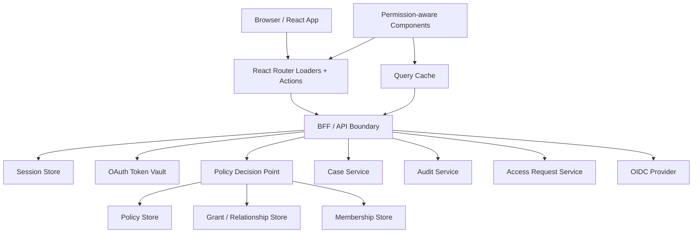
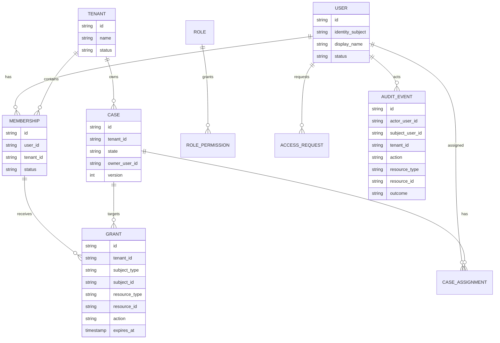
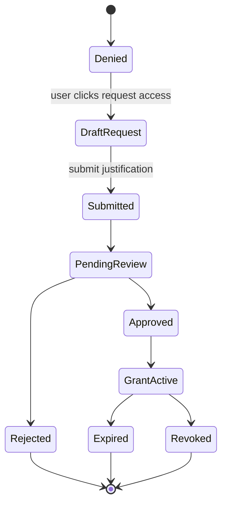
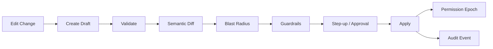
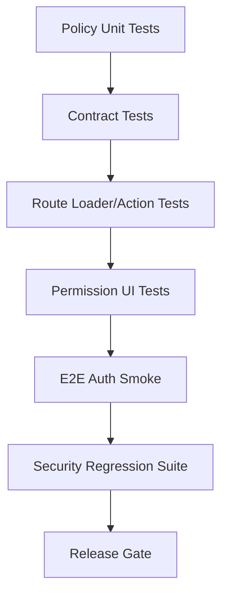
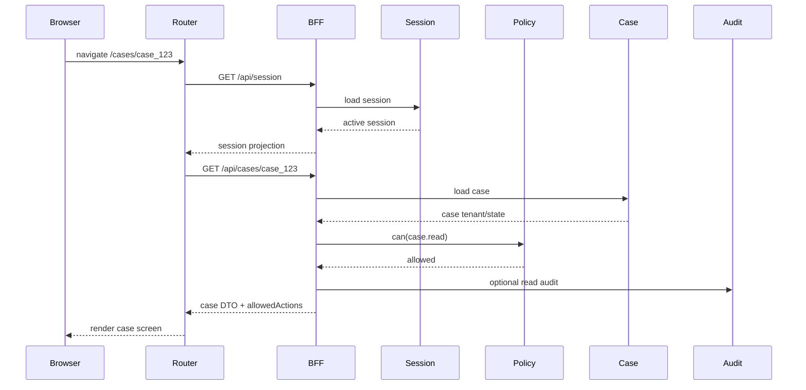
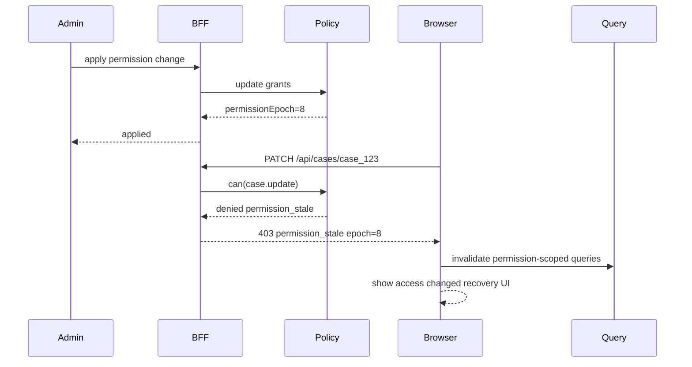

# Part 120 — Build Reference Auth Platform

Part 119 built the auth test harness.

Now we build the reference platform that ties Phase 12 together.

This is not a toy “login demo”.

It is a compact production-style architecture for:

- React app;
- BFF/API boundary;
- HttpOnly session;
- OAuth/OIDC callback;
- session projection;
- permission projection;
- route loaders/actions;
- policy decision service;
- admin permission console;
- access request workflow;
- audit trail;
- test harness;
- operational guardrails.

The goal is not to copy-paste this platform into every product.

The goal is to build a mental model that can survive real product constraints.

## Platform scope

We will build a small case-management platform.

Domain:

- users belong to tenants;
- tenants own cases;
- cases have workflow states;
- users can read/update/assign/close/export cases based on role, object relationship, workflow state, and assurance level;
- some actions require step-up authentication;
- denied users can request access;
- admins can manage grants through a controlled console;
- all sensitive auth and permission changes are audited.

The domain is intentionally auth-heavy.

A simple todo app does not stress authentication and authorization enough.

## Platform architecture



Boundary rule:

> The browser receives projections. The server keeps authority.

React can know:

- current user display name;
- current tenant;
- session expiry hint;
- allowed actions for visible resources;
- denial reasons safe for display;
- access request status.

React must not own:

- refresh tokens;
- client secrets;
- authoritative role assignment;
- policy evaluation authority;
- cross-tenant enforcement;
- object-level authorization authority;
- audit truth.

## Repository layout

Use a monorepo layout for clarity.

```txt
reference-auth-platform/
  apps/
    web/
      src/
        auth/
        routes/
        components/
        api/
        test-auth/
    bff/
      src/
        http/
        auth/
        session/
        policy/
        cases/
        access-requests/
        audit/
        test/
  packages/
    auth-contracts/
      src/
        session.ts
        permission.ts
        problem.ts
        audit.ts
    policy-core/
      src/
        can.ts
        model.ts
        fixtures.ts
    test-auth-harness/
      src/
        personas.ts
        scenario-runner.ts
        msw.ts
        playwright.ts
  infra/
    docker-compose.yml
    nginx.conf
    migrations/
  docs/
    adr/
    runbooks/
    threat-model.md
```

The important separation:

| Package | Responsibility |
|---|---|
| `auth-contracts` | Shared DTOs and problem response types. |
| `policy-core` | Deterministic policy logic and tests. |
| `test-auth-harness` | Personas, scenarios, mocks, auth state factories. |
| `apps/web` | React UI and router integration. |
| `apps/bff` | Session, OAuth, API, policy enforcement, audit. |

Do not share server secrets or server-only adapters into `apps/web`.

Shared type packages must stay pure.

## Shared contracts

Start with contracts.

### Session projection

```ts
export type SessionProjection = {
  status: 'authenticated';
  user: {
    id: string;
    displayName: string;
    emailMasked?: string;
  };
  tenant: {
    id: string;
    name: string;
  };
  authEpoch: number;
  permissionEpoch: number;
  assurance: 'aal1' | 'aal2';
  expiresAt: string;
};

export type AnonymousSessionProjection = {
  status: 'anonymous';
};

export type SessionResponse = SessionProjection | AnonymousSessionProjection;
```

The session projection is intentionally small.

It is not the user profile.

It is not the access token.

It is not the policy graph.

### Permission decision

```ts
export type PermissionDecision = {
  allowed: boolean;
  reason?:
    | 'not_authenticated'
    | 'forbidden'
    | 'tenant_mismatch'
    | 'step_up_required'
    | 'permission_stale'
    | 'resource_locked'
    | 'workflow_state_denied'
    | 'policy_unavailable';
  requiredAssurance?: 'aal2';
  constraint?: {
    maxItems?: number;
    expiresAt?: string;
    fields?: Record<string, 'hidden' | 'masked' | 'readonly' | 'editable'>;
  };
};

export type PermissionProjection = {
  subjectId: string;
  tenantId: string;
  permissionEpoch: number;
  decisions: Record<string, PermissionDecision>;
};
```

### Problem response

```ts
export type ProblemResponse = {
  type: string;
  title: string;
  status: number;
  detail?: string;
  reason?: string;
  correlationId: string;
  authEpoch?: number;
  permissionEpoch?: number;
};
```

Keep auth failure typed.

Do not make the UI parse arbitrary error strings.

## Data model

Minimal relational model:



This is not the only data model.

It is a reference model that supports:

- tenant membership;
- roles;
- direct grants;
- case assignments;
- temporary access;
- access requests;
- audit events;
- workflow state authorization.

## Policy model

Use a layered decision model.

```ts
type Subject = {
  userId: string;
  tenantId: string;
  roles: string[];
  assurance: 'aal1' | 'aal2';
  actingAs?: {
    actorUserId: string;
    subjectUserId: string;
    mode: 'support_view' | 'support_action';
  };
};

type Resource = {
  type: 'case' | 'audit_log' | 'permission_console' | 'access_request';
  id?: string;
  tenantId: string;
  state?: 'draft' | 'open' | 'escalated' | 'closed' | 'locked';
  assignedUserId?: string;
  ownerUserId?: string;
  version?: number;
};

type AuthzContext = {
  now: Date;
  requestId: string;
  permissionEpoch: number;
};

export function can(input: {
  subject: Subject;
  action: string;
  resource: Resource;
  context: AuthzContext;
}): PermissionDecision {
  if (input.subject.tenantId !== input.resource.tenantId) {
    return { allowed: false, reason: 'tenant_mismatch' };
  }

  if (input.subject.actingAs?.mode === 'support_view' && input.action !== 'case.read') {
    return { allowed: false, reason: 'forbidden' };
  }

  if (input.action === 'case.export' && input.subject.assurance !== 'aal2') {
    return {
      allowed: false,
      reason: 'step_up_required',
      requiredAssurance: 'aal2',
    };
  }

  if (input.resource.type === 'case' && input.resource.state === 'locked') {
    if (input.action !== 'case.read') {
      return { allowed: false, reason: 'resource_locked' };
    }
  }

  if (input.subject.roles.includes('admin')) {
    return { allowed: true };
  }

  if (input.subject.roles.includes('supervisor')) {
    return supervisorPolicy(input);
  }

  if (input.subject.roles.includes('case_worker')) {
    return caseWorkerPolicy(input);
  }

  if (input.subject.roles.includes('auditor')) {
    return auditorPolicy(input);
  }

  return { allowed: false, reason: 'forbidden' };
}
```

The reference platform should use this policy in three places:

1. server API enforcement;
2. permission projection generation;
3. test matrix verification.

Do not maintain separate frontend and backend policy logic that drift silently.

The frontend can have a projection evaluator.

The backend must have the authoritative evaluator.

## Session architecture

Use BFF-style session.

```mermaid
sequenceDiagram
    participant Browser
    participant BFF
    participant IdP
    participant SessionStore
    participant TokenVault

    Browser->>BFF: GET /login?returnTo=/cases
    BFF->>BFF: create oauth transaction state+pkce+nonce
    BFF-->>Browser: 302 IdP authorization endpoint
    Browser->>IdP: authenticate
    IdP-->>Browser: 302 /auth/callback?code=...&state=...
    Browser->>BFF: GET /auth/callback?code=...&state=...
    BFF->>BFF: validate state, nonce, pkce transaction
    BFF->>IdP: exchange code
    IdP-->>BFF: tokens
    BFF->>TokenVault: store provider tokens server-side
    BFF->>SessionStore: create app session
    BFF-->>Browser: Set-Cookie __Host-app_session; HttpOnly; Secure; SameSite=Lax
    BFF-->>Browser: 302 safe returnTo
```

Browser gets only an app session cookie.

The BFF stores provider refresh tokens server-side.

This reduces token exposure in JavaScript.

Cookie baseline:

```http
Set-Cookie: __Host-app_session=<opaque>; Path=/; Secure; HttpOnly; SameSite=Lax
```

For cross-site embedding or advanced federation cases, cookie design may differ.

But the reference baseline is same-site app + BFF.

## BFF endpoints

Auth endpoints:

| Endpoint | Purpose |
|---|---|
| `GET /login` | Start OAuth/OIDC login. |
| `GET /auth/callback` | Complete OAuth/OIDC callback. |
| `POST /logout` | Revoke app session and clear cookie. |
| `GET /api/session` | Return session projection. |
| `POST /api/session/refresh` | Optional explicit session refresh depending architecture. |
| `POST /api/session/step-up` | Start step-up flow for sensitive action. |

Permission endpoints:

| Endpoint | Purpose |
|---|---|
| `GET /api/permissions` | Return global/contextual permission projection. |
| `POST /api/permissions/check` | Batch check resource/action decisions. |
| `GET /api/cases/:id/permissions` | Return allowed actions for one case. |

Domain endpoints:

| Endpoint | Purpose |
|---|---|
| `GET /api/cases` | Tenant-scoped list with server-side filtering. |
| `GET /api/cases/:id` | Object-level read. |
| `PATCH /api/cases/:id` | Object-level update. |
| `POST /api/cases/:id/assign` | Workflow/role-based mutation. |
| `POST /api/cases/:id/close` | Sensitive mutation requiring authorization and maybe step-up. |
| `POST /api/cases/export` | Bulk export, strongly audited. |

Control-plane endpoints:

| Endpoint | Purpose |
|---|---|
| `POST /api/access-requests` | Request access. |
| `GET /api/access-requests/inbox` | Reviewer inbox. |
| `POST /api/access-requests/:id/approve` | Approve scoped grant. |
| `POST /api/admin/permission-changes/draft` | Create admin permission change draft. |
| `POST /api/admin/permission-changes/:id/apply` | Apply validated permission change. |
| `GET /api/audit` | Audit search with strict authorization. |

Every mutating endpoint validates:

- session;
- CSRF token if cookie-auth browser request;
- tenant context;
- object existence and tenant ownership;
- authorization decision;
- workflow precondition;
- idempotency if needed;
- audit event.

## BFF middleware chain

```ts
app.use(requestIdMiddleware);
app.use(securityHeadersMiddleware);
app.use(cookieParserMiddleware);
app.use(sessionMiddleware);
app.use(csrfMiddleware.forMutations());
app.use(tenantContextMiddleware);
app.use(auditContextMiddleware);
```

Per route:

```ts
app.patch('/api/cases/:caseId', async (req, res) => {
  const session = requireSession(req);
  const tenant = requireTenant(req);
  const caseRecord = await caseRepo.findById(req.params.caseId);

  assertSameTenant(caseRecord, tenant);

  const decision = await policy.check({
    subject: subjectFromSession(session),
    action: 'case.update',
    resource: resourceFromCase(caseRecord),
    context: contextFromRequest(req),
  });

  if (!decision.allowed) {
    await audit.denied(req, { action: 'case.update', resource: caseRecord, decision });
    return res.status(403).json(problem('forbidden', decision));
  }

  const updated = await caseService.update(caseRecord.id, req.body, {
    expectedVersion: req.header('if-match'),
    actor: session.userId,
  });

  await audit.success(req, { action: 'case.update', resource: updated });

  res.json(toCaseDto(updated));
});
```

Authorization is close to the resource operation.

Do not check permission only at route group level.

Route group checks are useful but insufficient for object-level operations.

## React auth boundary

Web app modules:

```txt
apps/web/src/auth/
  AuthProvider.tsx
  auth-client.ts
  auth-store.ts
  permission-client.ts
  useSession.ts
  useCan.ts
  PermissionGate.tsx
  auth-events.ts
```

Auth provider receives a client.

```tsx
export function AppProviders({ children }: { children: React.ReactNode }) {
  const queryClient = useMemo(() => createQueryClient(), []);
  const authClient = useMemo(() => createBrowserAuthClient(), []);

  return (
    <QueryClientProvider client={queryClient}>
      <AuthProvider client={authClient} queryClient={queryClient}>
        {children}
      </AuthProvider>
    </QueryClientProvider>
  );
}
```

Session hook:

```ts
export function useSession() {
  return useAuthStore((s) => ({
    status: s.status,
    user: s.user,
    tenant: s.tenant,
    authEpoch: s.authEpoch,
    permissionEpoch: s.permissionEpoch,
  }));
}
```

Permission hook:

```ts
export function useCan(action: string, resource: ResourceRef): PermissionDecision {
  const { status, permissionSnapshot } = useAuthState();

  if (status !== 'authenticated') {
    return { allowed: false, reason: 'not_authenticated' };
  }

  if (!permissionSnapshot) {
    return { allowed: false, reason: 'permission_stale' };
  }

  return evaluateProjection(permissionSnapshot, action, resource);
}
```

Again: this is projection evaluation.

The API still checks authoritatively.

## Router structure

```txt
routes/
  root.tsx
  login.tsx
  logout.tsx
  auth.callback.tsx
  app.layout.tsx
  tenant.layout.tsx
  cases.index.tsx
  cases.$caseId.tsx
  cases.$caseId.edit.tsx
  admin.permissions.tsx
  access-requests.inbox.tsx
  audit.index.tsx
```

Root loader loads session projection.

```ts
export async function rootLoader({ request }: LoaderArgs) {
  const session = await api.getSession({ request });

  return json(
    { session },
    {
      headers: {
        'Cache-Control': 'no-store',
      },
    }
  );
}
```

Protected layout loader requires auth.

```ts
export async function appLayoutLoader(args: LoaderArgs) {
  const session = await requireAuthenticatedSession(args);

  return { session };
}
```

Case loader checks read permission before returning data.

```ts
export async function caseLoader({ params, request }: LoaderArgs) {
  const session = await requireAuthenticatedSession({ request });

  const result = await api.getCase(params.caseId!, {
    headers: authHeadersFromRequest(request),
  });

  if (result.status === 403) {
    throw json(await result.json(), { status: 403 });
  }

  return result.json();
}
```

Case action checks mutation permission server-side.

```ts
export async function caseEditAction({ params, request }: ActionArgs) {
  const form = await request.formData();

  const result = await api.updateCase(params.caseId!, form, {
    csrf: await getCsrfToken(),
  });

  if (result.status === 403) {
    return json(await result.json(), { status: 403 });
  }

  return redirect(`/cases/${params.caseId}`);
}
```

The UI may hide the button.

The action still validates.

## Permission-aware components

Example case actions:

```tsx
function CaseActionBar({ caseRecord }: { caseRecord: CaseDto }) {
  const resource = toCaseResource(caseRecord);
  const canUpdate = useCan('case.update', resource);
  const canClose = useCan('case.close', resource);
  const canExport = useCan('case.export', resource);

  return (
    <div className="actions">
      <AuthorizedButton decision={canUpdate} to="edit">
        Edit
      </AuthorizedButton>

      <AuthorizedButton decision={canClose} explain>
        Close Case
      </AuthorizedButton>

      <AuthorizedButton decision={canExport} explain stepUpLabel="Verify to export">
        Export
      </AuthorizedButton>
    </div>
  );
}
```

Authorized button policy:

| Decision | UI behavior |
|---|---|
| `allowed: true` | Show enabled action. |
| `not_authenticated` | Hide in authenticated layout; redirect at route boundary. |
| `forbidden` | Hide or disabled depending UX need. |
| `step_up_required` | Show verify action if safe. |
| `permission_stale` | Disable and trigger refresh. |
| `resource_locked` | Disable with safe explanation. |
| `policy_unavailable` | Fail closed and show retry. |

Do not show sensitive internal policy traces.

## Query key design

All protected query keys include auth and tenant scope.

```ts
function caseQueryKey(input: {
  tenantId: string;
  caseId: string;
  authEpoch: number;
  permissionEpoch: number;
}) {
  return [
    'tenant',
    input.tenantId,
    'authEpoch',
    input.authEpoch,
    'permissionEpoch',
    input.permissionEpoch,
    'case',
    input.caseId,
  ] as const;
}
```

On logout:

```ts
await auth.logout();
queryClient.clear();
router.navigate('/login');
```

On tenant switch:

```ts
queryClient.removeQueries({
  predicate(query) {
    return query.queryKey.includes(previousTenantId);
  },
});

await auth.switchTenant(nextTenantId);
```

On permission epoch bump:

```ts
queryClient.invalidateQueries({
  predicate(query) {
    return query.queryKey.includes('permissionEpoch');
  },
});
```

Cache design is part of auth design.

## Access request workflow

Denied UI can start a request.



Request payload:

```ts
type AccessRequestCreate = {
  action: string;
  resource: ResourceRef;
  reason: string;
  duration?: '1h' | '1d' | '7d';
};
```

Server validates:

- requester identity;
- tenant membership;
- resource existence;
- requested action vocabulary;
- duplicate pending requests;
- reviewer eligibility;
- maximum duration;
- separation-of-duties rules.

Grant activation bumps permission epoch.

The browser invalidates permission projection.

## Admin permission console

The console uses draft-first mutation.



No direct “save role” endpoint.

Instead:

1. create draft;
2. compute semantic diff;
3. compute blast radius;
4. enforce guardrails;
5. require step-up/approval for risky changes;
6. apply atomically;
7. bump permission epoch;
8. emit audit event.

This turns the permission console into a controlled plane, not a dangerous CRUD UI.

## Audit event model

Every sensitive action emits an audit event.

```ts
type AuditEvent = {
  id: string;
  occurredAt: string;
  requestId: string;
  actor: {
    userId: string;
    tenantId: string;
    impersonating?: boolean;
    subjectUserId?: string;
  };
  action: string;
  resource: {
    type: string;
    id?: string;
    tenantId?: string;
  };
  outcome: 'success' | 'denied' | 'failed';
  reason?: string;
  authEpoch?: number;
  permissionEpoch?: number;
  metadata?: Record<string, unknown>;
};
```

Audit events should exist for:

- login success/failure where appropriate;
- logout;
- session revoke;
- tenant switch;
- authorization denial;
- sensitive action success;
- step-up challenge;
- access request submit/approve/reject/revoke;
- permission change draft/apply;
- impersonation start/end;
- export/download.

Audit is not console logging.

Audit is product evidence.

## Security headers

Reference baseline:

```http
Strict-Transport-Security: max-age=31536000; includeSubDomains
X-Content-Type-Options: nosniff
Referrer-Policy: strict-origin-when-cross-origin
Content-Security-Policy: default-src 'self'; base-uri 'self'; object-src 'none'; frame-ancestors 'none'
Cache-Control: no-store
```

Route-specific refinement:

| Route type | Cache policy |
|---|---|
| Static assets with hash | Long immutable cache. |
| Public marketing pages | Normal public cache if no user data. |
| Login/callback/session pages | `no-store`. |
| Authenticated HTML/RSC responses | `no-store` or carefully scoped private cache. |
| API session/permissions | `no-store`. |
| Case data | `no-store` unless a deliberate private-cache strategy exists. |
| File download | Short-lived, tenant/object authorized, no shared cache. |

Do not let CDN defaults decide auth cache behavior.

## Deployment modes

The reference platform can be deployed in three modes.

### Mode A — Same-origin BFF

```txt
https://app.example.com
  /              -> React app
  /api/*         -> BFF API
  /login         -> BFF login start
  /auth/callback -> BFF callback
```

Benefits:

- simpler cookies;
- easier CSRF policy;
- lower CORS complexity;
- clear browser boundary.

### Mode B — App + API subdomain

```txt
https://app.example.com
https://api.example.com
```

Requires:

- explicit CORS;
- credentialed requests;
- careful cookie domain policy;
- CSRF protection;
- clear environment separation.

### Mode C — Edge proxy + internal BFF

```txt
Browser -> Edge -> BFF -> Services
```

Useful for:

- coarse route gating;
- tenant routing;
- geo/latency;
- request normalization;
- security headers.

But do not move full auth authority to edge unless the runtime supports the required operations safely.

## Local development

Use local dev that preserves auth semantics.

```txt
localhost:3000  web
localhost:3000/api  proxied BFF
localhost:4000  BFF direct
localhost:5432  Postgres
localhost:6379  Redis/session store
localhost:9000  local mock IdP
```

Avoid dev-only auth shortcuts that bypass authorization.

Allowed dev shortcuts:

- seeded test personas;
- local mock IdP;
- short-lived fake sessions;
- admin-only debug panel in local environment;
- test-only login endpoint disabled outside test/dev.

Forbidden shortcuts:

- allow-all policy in dev;
- frontend-only role checks;
- no CSRF in dev if production uses cookie auth;
- no tenant isolation in dev fixtures;
- storing real tokens in local fixtures.

Development should be faster, not less truthful.

## Test strategy

Use the harness from Part 119.



Minimum gates:

| Gate | Required coverage |
|---|---|
| Policy unit tests | Role, tenant, object, workflow, step-up, impersonation. |
| API authorization tests | Direct request denial, BOLA/IDOR, mutation denial. |
| Route tests | Loader redirect, action 403, return URL safety. |
| Component tests | Permission-aware buttons/forms/menus/tables. |
| Cache tests | Logout, tenant switch, permission epoch. |
| E2E smoke | Login, protected route, denied action, logout. |
| Security regression | XSS/CSRF/open redirect/cache leak/token leak checks. |

The platform is not production-ready until these gates exist.

## Example end-to-end flow

### User opens a protected case



### Permission revoked while page is open



This is the kind of flow the platform must handle.

Not as an edge case.

As normal operation.

## Production readiness checklist

Before calling the reference platform production-ready:

- [ ] OAuth/OIDC callback validates `state`, `nonce`, PKCE transaction, and exact redirect URI.
- [ ] app session cookie is `HttpOnly`, `Secure`, path-scoped, and same-site appropriate.
- [ ] refresh tokens are never exposed to browser JavaScript.
- [ ] `/api/session` returns minimal projection only.
- [ ] permission projection is deny-by-default and versioned by permission epoch.
- [ ] every API route validates tenant/object/action authorization server-side.
- [ ] mutating cookie-auth requests require CSRF defense.
- [ ] direct object access tests cover BOLA/IDOR cases.
- [ ] route loaders prevent protected data render before auth.
- [ ] route actions handle `401`, `403`, `409`, and step-up decisions.
- [ ] query/cache keys include tenant/auth/permission scope where needed.
- [ ] logout clears app state, query cache, session cookie, and relevant browser state.
- [ ] tenant switch clears previous tenant cache.
- [ ] admin permission changes are draft-first with diff, blast-radius, approval, and audit.
- [ ] access requests create scoped temporary grants with expiry and review.
- [ ] impersonation is visible, constrained, audited, and easy to exit.
- [ ] CSP/security headers are deployed and monitored.
- [ ] logs and telemetry redact tokens and sensitive claims.
- [ ] audit events exist for sensitive success and denial paths.
- [ ] runbooks exist for IdP outage, bad permission deploy, token leak, refresh storm, and cross-tenant exposure.
- [ ] CI gates include permission matrix, route auth, API denial, contract tests, and E2E auth smoke.

## Common failure modes

### Failure: policy projection says allow, API says deny

This is acceptable if handled.

Projection can become stale.

The UI must treat server denial as authoritative, invalidate permissions, rollback optimistic UI, and show recovery.

### Failure: API says allow, UI says deny

This is a UX/contract bug.

It may block legitimate work but is safer than the reverse.

Fix by aligning projection vocabulary and tests.

### Failure: old tenant data appears after tenant switch

This is a security bug.

Clear cache and include tenant in query keys.

### Failure: logout leaves page visible via back button

This is a cache/session cleanup bug.

Use appropriate cache headers, clear query cache, revalidate on visibility/pageshow, and server-enforce session.

### Failure: admin can grant themselves dangerous permission

This is a control-plane authorization bug.

Add separation-of-duties, approval, step-up, and guardrail tests.

### Failure: support impersonation can perform destructive action

This is an impersonation boundary bug.

Support view mode must have explicit restrictions, visible banner, and audit.

## What this reference platform proves

By completing this platform, we prove that React auth can be designed as a coherent system:

- browser is a projection runtime;
- server is enforcement authority;
- session is a lifecycle;
- token handling is a boundary decision;
- permission is an action/resource/context decision;
- route loaders/actions are auth boundaries;
- UI permission is exposure control;
- cache invalidation is security logic;
- admin permissions are a control plane;
- audit is product evidence;
- tests are executable auth assumptions;
- runbooks are part of the system.

## Phase 12 closeout

Phase 12 built the platform from scratch:

| Part | Built |
|---|---|
| 111 | Auth client core. |
| 112 | Session manager. |
| 113 | Permission engine. |
| 114 | React Auth Provider. |
| 115 | Route guards. |
| 116 | Permission-aware components. |
| 117 | Access request workflow. |
| 118 | Admin permission console. |
| 119 | Auth test harness. |
| 120 | Reference auth platform. |

This completes the implementation-heavy build-from-scratch phase.

The remaining phases shift from building blocks to capstone architecture and final synthesis.

## Key takeaway

A mature React auth platform is not a login page plus route guard.

It is a composition of:

- protocol boundary;
- session boundary;
- route/data boundary;
- API enforcement boundary;
- permission contract;
- UI projection;
- cache lifecycle;
- admin control plane;
- audit trail;
- test harness;
- operational runbooks.

If any one of those pieces is missing, the system may still look functional.

But it will not be defensible.

A top-tier engineer does not ask only:

> “Can the user log in?”

They ask:

> “What exactly is trusted, where is access enforced, how does privilege change propagate, what happens under failure, how do we prove it, and how do we recover when it breaks?”

That is the platform mindset.

## References

- OWASP Authentication Cheat Sheet — authentication lifecycle and secure handling.
- OWASP Authorization Cheat Sheet — deny-by-default, least privilege, authorization validation.
- OWASP Session Management Cheat Sheet — session identifiers, timeout, secure cookie properties.
- OWASP CSRF Prevention Cheat Sheet — CSRF mitigations for cookie-authenticated apps.
- OWASP API Security Top 10 — Broken Object Level Authorization and API authorization risks.
- OAuth 2.0 Security Best Current Practice RFC 9700 — modern OAuth security guidance.
- OpenID Connect Core — identity layer and ID Token concepts.
- React Router documentation — loaders, actions, route modules, and testing.
- TanStack Query documentation — query invalidation, cancellation, and cache management.
- MSW documentation — API mocking for tests.
- Playwright authentication documentation — authenticated browser state reuse.
