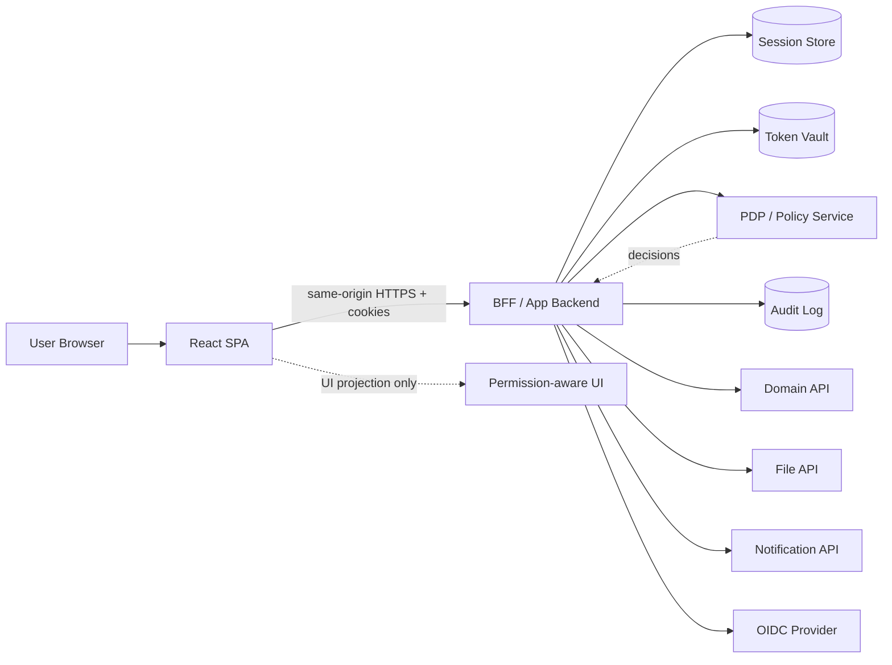
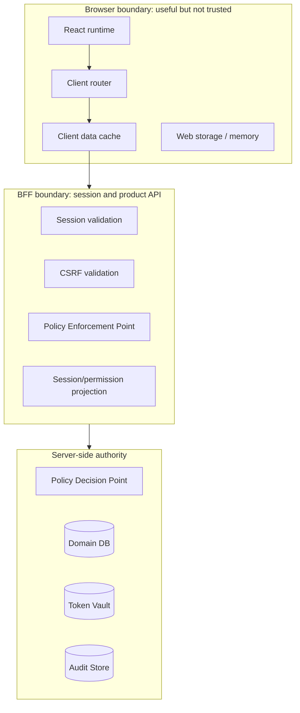
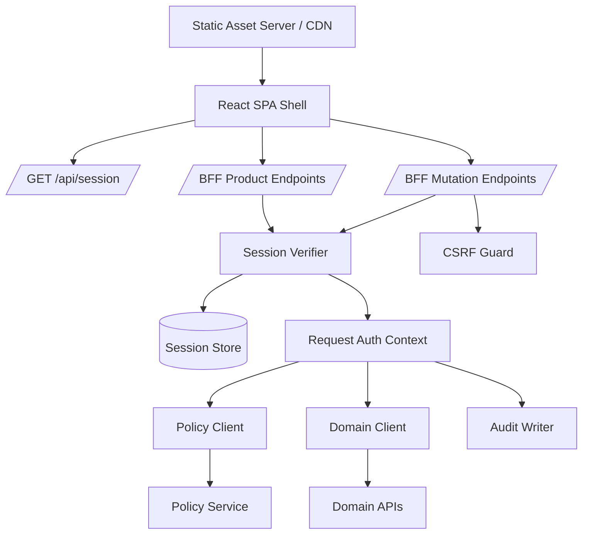
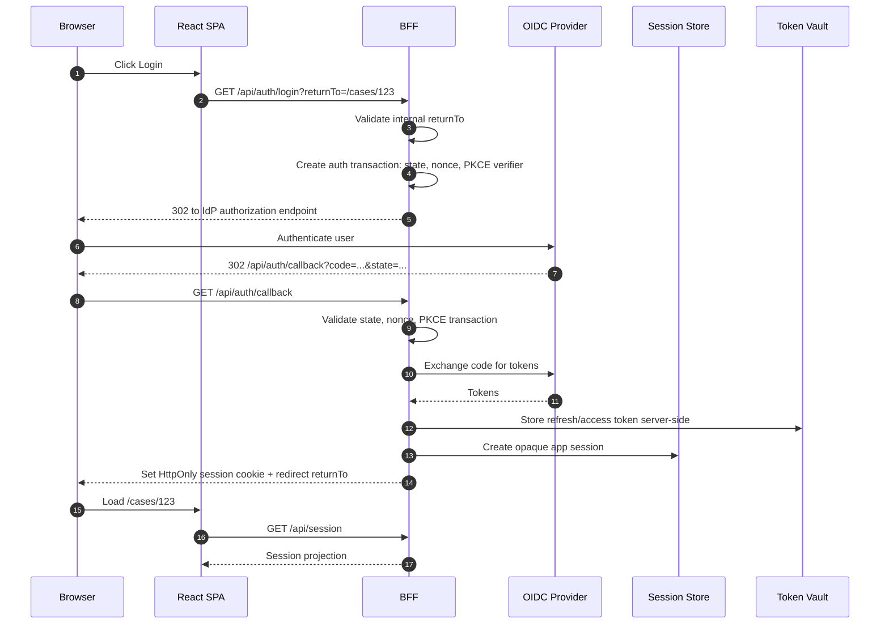
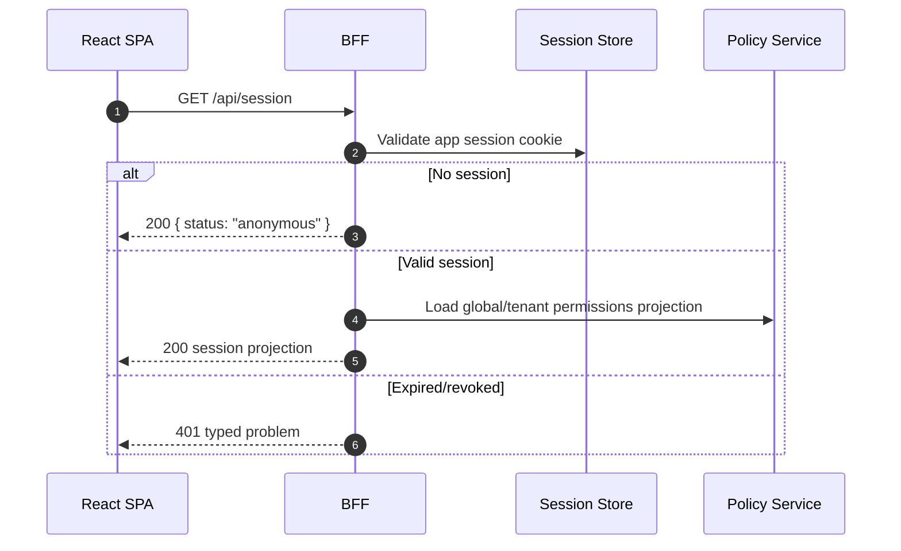
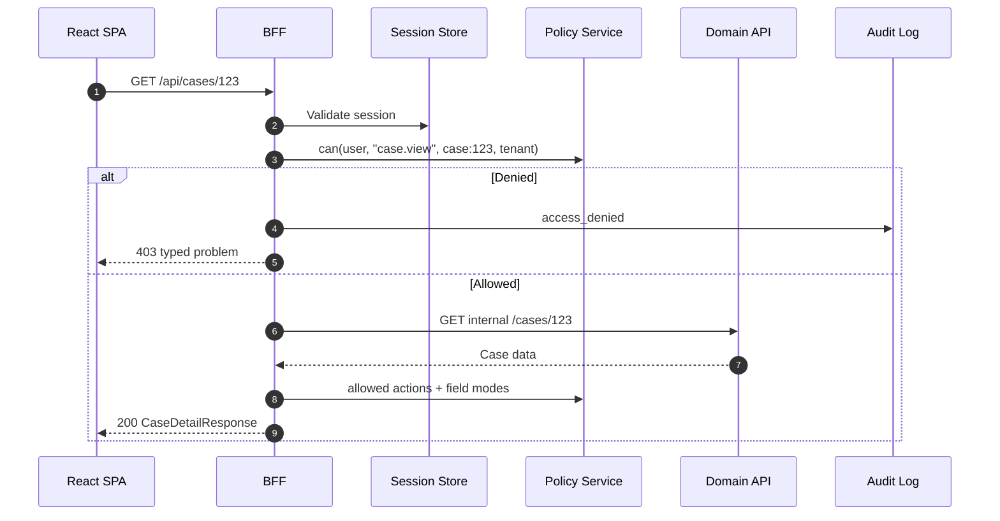
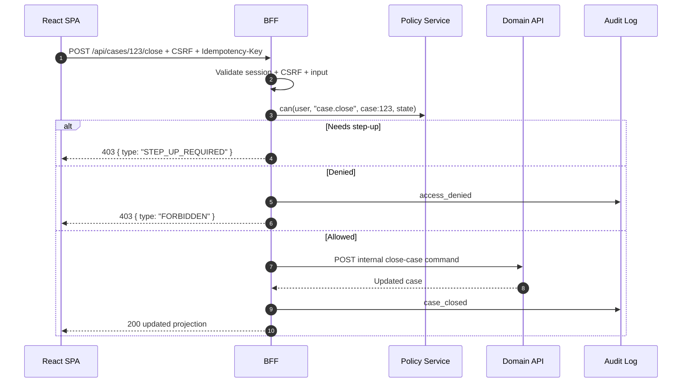
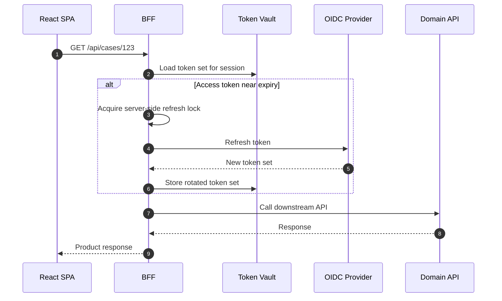

# Part 121 — Reference Architecture: SPA with BFF

Part 120 built the reference auth platform.

Now we turn it into a production reference architecture.

This part is not a new pattern catalog. It is the first capstone architecture: **a React SPA backed by a Backend-for-Frontend (BFF)**.

The goal is simple:

> keep the browser useful for interaction, but remove long-lived security authority from the browser.

A production React SPA often wants fast client-side navigation, optimistic UX, rich tables, long forms, realtime updates, command palettes, and offline-tolerant reads. But security-sensitive authority should not live in the JavaScript runtime if the application has meaningful risk: enterprise SaaS, regulated workflows, case management, financial operations, administration consoles, tenant-scoped data, or sensitive personal data.

The BFF architecture gives us a strong compromise:

- React keeps UI composition, routing, pending UI, and component orchestration.
- The BFF owns app session continuity.
- OAuth/OIDC tokens stay server-side.
- Browser receives only a minimal session projection.
- Permission projection is explicit, cacheable for UX, and never treated as final enforcement.
- API calls become same-origin product calls instead of direct browser-to-many-backends calls.

This is the architecture you reach for when a pure SPA token model starts producing too many security and operational compromises.

---

## 1. Architecture intent

The SPA+BFF architecture solves a specific problem:

> how to keep React SPA ergonomics while reducing token exposure, centralizing session policy, and making authorization observable.

It is not automatically “more secure” just because there is a backend. A badly implemented BFF can still leak tokens, mis-handle CSRF, cache sensitive responses, skip authorization, or become a confused deputy.

The architecture only works when the BFF is designed as a **policy enforcement and session mediation boundary**, not as a thin proxy.

### What the browser is allowed to know

The browser may know:

- whether there is an active app session;
- the display-safe user identity projection;
- the active tenant/org/project context;
- the allowed UI actions projected for the current screen/resource;
- whether a sensitive action requires step-up;
- denial reasons safe enough for user display;
- correlation IDs for support/debugging.

The browser must not know:

- refresh tokens;
- client secrets;
- downstream service credentials;
- policy internals that reveal hidden grants or sensitive hierarchy;
- all roles/groups when only a few UI decisions are needed;
- unmasked PII irrelevant to the current screen;
- raw OAuth/OIDC artifacts beyond what the client legitimately needs for UI.

### What the BFF owns

The BFF owns:

- OAuth/OIDC callback handling;
- token exchange if the system uses OAuth/OIDC;
- refresh token storage or provider session mediation;
- app session cookie issuance;
- CSRF validation for state-changing requests;
- session projection endpoint;
- permission projection endpoint or product endpoint embedding of permissions;
- authorization checks before downstream calls;
- audit events for sensitive flows;
- cache-control headers for authenticated responses;
- security header profile for auth-sensitive pages/endpoints;
- observability around auth failures.

---

## 2. High-level topology



The important shape is not the boxes. It is the direction of authority.

The browser calls the BFF. The BFF decides what the browser is allowed to do with the current session. The BFF calls downstream services with server-held credentials or delegated tokens. Downstream services should still enforce their own resource authorization; the BFF is not an excuse to make domain APIs blind.

### Deployment shape

A common deployment:

```txt
https://app.example.com/
  /                 -> static SPA shell
  /assets/*         -> hashed static assets
  /api/session      -> BFF session projection
  /api/auth/login   -> starts OAuth/OIDC login
  /api/auth/callback-> OAuth/OIDC callback handled by BFF
  /api/auth/logout  -> app logout and optional IdP logout
  /api/*            -> product-shaped BFF endpoints
```

Prefer same-origin when possible. Same-origin keeps cookie and CSRF policy easier to reason about than cross-origin browser-to-API calls.

---

## 3. Trust boundaries



### Boundary rules

| Boundary | Trusted for | Not trusted for |
|---|---|---|
| React components | UI composition, intent capture, optimistic UX | access enforcement |
| Client route guards | early redirect, UX shaping | protecting resources |
| Browser storage | low-sensitivity UI preferences | tokens, PII, permission authority |
| BFF | session mediation, request-level enforcement, projection shaping | bypassing downstream ownership checks |
| Policy service | decision evaluation | UX copy, product orchestration |
| Domain service | resource mutation, domain invariants | browser state |

The architecture should be reviewed by following the request path and asking:

> where is the final server-side authorization check for this specific subject, action, resource, and context?

If the answer is “the button is hidden”, the system is broken.

---

## 4. Core invariants

These invariants are non-negotiable.

### Invariant 1 — Browser never stores refresh tokens

A React SPA may cache UI projection, but it must not hold refresh tokens in localStorage/sessionStorage/IndexedDB. In the BFF architecture, refresh tokens are stored server-side or delegated entirely to the IdP/session provider.

### Invariant 2 — App session cookie is opaque

The browser receives an opaque session identifier, not a self-contained authorization database.

Prefer:

```txt
Set-Cookie: __Host-app_session=<opaque>; Path=/; Secure; HttpOnly; SameSite=Lax
```

Avoid:

```txt
Set-Cookie: app_session=<base64-json-with-roles-and-groups>
```

Opaque sessions make revocation, rotation, server-side expiry, and incident response easier.

### Invariant 3 — `/api/session` is a projection, not the source of truth

The session endpoint returns a display-safe snapshot. It is useful for bootstrap and UI, but every product endpoint still validates the session and authorizes the request.

### Invariant 4 — CSRF is explicit for state-changing requests

If the BFF uses cookies, state-changing endpoints need CSRF defense. SameSite helps, but it is not the whole design. Use synchronizer token or signed double-submit token, plus origin checks for sensitive operations.

### Invariant 5 — Permission projection is versioned

The frontend should receive `permissionVersion`, `sessionEpoch`, or equivalent. Without a version, stale permission bugs are hard to detect and hard to invalidate.

### Invariant 6 — Product endpoints are shaped for the UI but enforce domain policy

A BFF endpoint may aggregate data for a screen. That does not mean it can skip resource-level authorization. Aggregation expands blast radius when a check is wrong.

### Invariant 7 — All auth failures are typed

The browser should be able to distinguish:

- unauthenticated;
- session expired;
- forbidden;
- step-up required;
- tenant mismatch;
- stale permission;
- CSRF failed;
- provider unavailable;
- policy service unavailable.

Typed errors are what make recovery flows reliable.

---

## 5. Reference component model



### Frontend modules

Recommended frontend module boundaries:

```txt
src/auth/
  auth-store.ts
  session-client.ts
  auth-provider.tsx
  use-auth.ts
  use-can.ts
  auth-events.ts

src/api/
  api-client.ts
  problem.ts
  csrf.ts

src/routes/
  root.tsx
  login.tsx
  forbidden.tsx
  tenant.tsx

src/features/
  cases/
    api.ts
    permissions.ts
    components.tsx
```

The frontend should not import provider SDK internals everywhere. Provider-specific logic belongs behind `session-client.ts` or the BFF.

### BFF modules

Recommended BFF module boundaries:

```txt
src/auth/
  oauth-callback.ts
  session-cookie.ts
  session-store.ts
  token-vault.ts
  csrf.ts
  auth-context.ts

src/policy/
  policy-client.ts
  permission-projection.ts
  decision.ts

src/http/
  problem.ts
  cache-control.ts
  security-headers.ts
  request-id.ts

src/features/
  cases/
    case.routes.ts
    case.policy.ts
    case.mapper.ts
```

Do not build a BFF as a blind reverse proxy. A BFF should encode product-level API contracts and security boundaries.

---

## 6. Login flow



### Login design choices

The BFF starts the OAuth transaction because it can safely store transaction state and perform the token exchange without exposing refresh tokens to browser JavaScript.

The SPA can still initiate login, but it should not assemble arbitrary redirect parameters from untrusted state.

Bad:

```ts
window.location.href = `/api/auth/login?returnTo=${location.href}`;
```

Better:

```ts
const returnTo = toInternalReturnPath(location.pathname + location.search);
window.location.assign(`/api/auth/login?returnTo=${encodeURIComponent(returnTo)}`);
```

Best:

```ts
await authClient.startLogin({ returnTo: router.currentInternalPath() });
```

Where `startLogin` validates intent and delegates to the BFF.

---

## 7. Session bootstrap flow

After static assets load, React needs to know what auth state it is in.



### Session projection contract

```ts
type SessionProjection =
  | {
      status: "anonymous";
      csrfToken?: string;
      serverTime: string;
    }
  | {
      status: "authenticated";
      session: {
        id: string; // safe public session handle, not raw server key
        epoch: number;
        expiresAt: string;
        idleExpiresAt?: string;
        assuranceLevel: "aal1" | "aal2" | "aal3";
        actor?: ActorProjection; // present during impersonation
        subject: SubjectProjection;
        tenant?: TenantProjection;
      };
      permissions: PermissionProjection;
      csrfToken: string;
      serverTime: string;
    }
  | {
      status: "degraded";
      reason: "POLICY_UNAVAILABLE" | "SESSION_STORE_UNAVAILABLE";
      recoverable: boolean;
      serverTime: string;
    };
```

Keep this object intentionally small. It is not a user profile dump.

### Permission projection contract

```ts
type PermissionProjection = {
  version: string;
  evaluatedAt: string;
  scope: {
    tenantId?: string;
    projectId?: string;
  };
  globalActions: string[];
  navigation: Array<{
    id: string;
    visible: boolean;
    reason?: PublicDenialReason;
  }>;
  constraints?: Record<string, unknown>;
};
```

For resource-specific screens, prefer embedding `allowedActions` into the resource response:

```ts
type CaseDetailResponse = {
  case: CaseView;
  allowedActions: Array<"case.comment" | "case.assign" | "case.close" | "case.export">;
  fieldModes: Record<string, "hidden" | "masked" | "readonly" | "editable">;
  permissionVersion: string;
};
```

This keeps the frontend from recomputing resource authorization from stale global claims.

---

## 8. Product API flow

A BFF endpoint should validate session, enforce policy, shape data, and return cache-safe output.



### BFF route skeleton

```ts
type AuthContext = {
  requestId: string;
  session: SessionRecord;
  subject: Subject;
  tenant?: TenantContext;
  assuranceLevel: "aal1" | "aal2" | "aal3";
  permissionVersion: string;
};

async function requireAuth(req: Request): Promise<AuthContext> {
  const sessionId = readOpaqueSessionCookie(req);
  if (!sessionId) throw problem.unauthenticated("NO_SESSION");

  const session = await sessionStore.get(sessionId);
  if (!session) throw problem.unauthenticated("SESSION_NOT_FOUND");
  if (session.revokedAt) throw problem.unauthenticated("SESSION_REVOKED");
  if (session.expiresAt <= now()) throw problem.unauthenticated("SESSION_EXPIRED");

  return buildAuthContext(req, session);
}

async function getCaseDetail(req: Request, params: { caseId: string }) {
  const auth = await requireAuth(req);

  const decision = await policy.can({
    subject: auth.subject,
    action: "case.view",
    resource: { type: "case", id: params.caseId },
    context: { tenantId: auth.tenant?.id, assuranceLevel: auth.assuranceLevel },
  });

  if (!decision.allowed) {
    await audit.accessDenied({ auth, action: "case.view", resourceId: params.caseId, reason: decision.reason });
    throw problem.forbidden(decision.publicReason ?? "FORBIDDEN");
  }

  const caseRecord = await domainCases.getCase(params.caseId, { tenantId: auth.tenant?.id });
  const projection = await permissionProjection.forCase(auth, caseRecord);

  return json(
    { case: mapCase(caseRecord, projection.fieldModes), ...projection },
    { headers: privateJsonHeaders(auth.permissionVersion) }
  );
}
```

The key is that the BFF checks permission using server-side inputs. It does not trust a client-submitted `allowedActions` array.

---

## 9. Mutation flow

State-changing BFF endpoints must combine:

- session validation;
- CSRF validation if using cookies;
- input validation;
- resource authorization;
- workflow/state validation;
- idempotency;
- audit.



### Mutation endpoint skeleton

```ts
async function closeCase(req: Request, params: { caseId: string }) {
  const auth = await requireAuth(req);
  await requireCsrf(req, auth.session);

  const body = await parseJson(req, CloseCaseSchema);
  const idempotencyKey = requireIdempotencyKey(req);

  const caseRecord = await domainCases.getCase(params.caseId, { tenantId: auth.tenant?.id });

  const decision = await policy.can({
    subject: auth.subject,
    action: "case.close",
    resource: { type: "case", id: caseRecord.id, state: caseRecord.state },
    context: {
      tenantId: auth.tenant?.id,
      assuranceLevel: auth.assuranceLevel,
      actorId: auth.session.actorId,
    },
  });

  if (decision.requiresStepUp) {
    throw problem.stepUpRequired({ requiredAal: decision.requiredAal, returnTo: req.url });
  }

  if (!decision.allowed) {
    await audit.accessDenied({ auth, action: "case.close", resourceId: caseRecord.id, reason: decision.reason });
    throw problem.forbidden(decision.publicReason);
  }

  const result = await idempotency.run(idempotencyKey, async () => {
    return domainCases.closeCase({ caseId: caseRecord.id, reason: body.reason, by: auth.subject.id });
  });

  await audit.caseClosed({ auth, caseId: caseRecord.id, commandId: result.commandId });
  return json(await mapCaseWithPermissions(auth, result.case), { headers: privateJsonHeaders() });
}
```

---

## 10. CSRF model

In this architecture, the browser authenticates to the BFF using cookies. That means CSRF must be handled.

Recommended layered model:

1. `SameSite=Lax` or `Strict` for session cookies, depending on login/product flow.
2. `Secure`, `HttpOnly`, `Path=/`, preferably `__Host-` prefix for session cookie.
3. CSRF token for state-changing requests.
4. `Origin` validation for unsafe methods.
5. No CORS wildcard for credentialed endpoints.
6. User interaction or step-up for high-risk operations.

### CSRF token pattern

The BFF returns a CSRF token in `/api/session`:

```ts
{
  "status": "authenticated",
  "csrfToken": "signed-token-bound-to-session",
  "session": { "epoch": 42 }
}
```

The API client attaches it:

```ts
async function apiJson<T>(path: string, init: RequestInit = {}): Promise<T> {
  const method = init.method?.toUpperCase() ?? "GET";
  const unsafe = !["GET", "HEAD", "OPTIONS"].includes(method);

  const headers = new Headers(init.headers);
  headers.set("Accept", "application/json");

  if (unsafe) {
    headers.set("Content-Type", "application/json");
    headers.set("X-CSRF-Token", authStore.getSnapshot().csrfToken ?? "");
  }

  const res = await fetch(`/api${path}`, {
    ...init,
    headers,
    credentials: "same-origin",
  });

  return parseApiResponse<T>(res);
}
```

CSRF token validation belongs in the BFF, not in React.

---

## 11. Cache-control profile

Authenticated responses need conservative cache policy.

### Static assets

Hashed static assets can be aggressively cached:

```txt
Cache-Control: public, max-age=31536000, immutable
```

### SPA shell

The HTML shell should not be cached too aggressively if it includes deployment-sensitive bootstrapping:

```txt
Cache-Control: no-cache
```

### Session and authenticated data

Session projection and sensitive product data should generally be non-store:

```txt
Cache-Control: no-store
Pragma: no-cache
```

For less-sensitive tenant-scoped data, carefully consider:

```txt
Cache-Control: private, max-age=30
Vary: Cookie
```

But do not default to shared cache for authenticated user-specific responses.

### Logout cleanup

On logout, clear server session and frontend cache:

```txt
Clear-Site-Data: "cache", "storage"
```

Use carefully. Clearing all cookies may accidentally clear IdP or unrelated subdomain state depending on deployment.

---

## 12. BFF as product API, not generic proxy

A generic proxy leaks backend topology into the frontend and spreads authorization semantics.

Bad BFF:

```txt
GET /api/proxy/service-a/cases/123
POST /api/proxy/service-b/workflows/999/transitions/close
GET /api/proxy/service-c/users/current/groups
```

Better BFF:

```txt
GET  /api/session
GET  /api/cases/123
POST /api/cases/123/close
GET  /api/cases/123/timeline
POST /api/cases/123/access-requests
```

A product-shaped BFF can:

- check policy with product vocabulary;
- return field-level modes;
- aggregate data without exposing internal topology;
- shape errors for React recovery;
- emit audit events with domain semantics;
- hide provider/downstream token complexity.

---

## 13. Permission projection strategy

There are three layers of permission projection.

### Layer 1 — global/session projection

Used for:

- app shell;
- navigation;
- tenant switcher;
- feature entrance points;
- command palette baseline.

Example:

```ts
type GlobalPermissionProjection = {
  version: string;
  navigation: {
    cases: "visible" | "hidden";
    admin: "visible" | "hidden";
    reports: "visible" | "hidden";
  };
  globalActions: Array<"tenant.switch" | "case.create" | "access.request">;
};
```

### Layer 2 — resource projection

Used for detail pages and row actions.

```ts
type ResourcePermissionProjection = {
  resource: { type: "case"; id: string; state: string };
  allowedActions: string[];
  deniedActions?: Array<{ action: string; reason: PublicDenialReason }>;
  fieldModes: Record<string, FieldMode>;
  permissionVersion: string;
};
```

### Layer 3 — mutation enforcement

The server rechecks permission during mutation.

Do not submit resource projection back as proof:

```ts
// Bad
await api.post(`/cases/${id}/close`, { allowedActions });
```

Submit intent only:

```ts
await api.post(`/cases/${id}/close`, { reason: "Resolved" });
```

---

## 14. Frontend auth store

The React app should treat `/api/session` as the bootstrap source.

```ts
type AuthSnapshot = {
  status: "unknown" | "anonymous" | "authenticated" | "degraded";
  session?: SessionProjection["session"];
  permissions?: PermissionProjection;
  csrfToken?: string;
  error?: PublicAuthProblem;
};

class AuthStore {
  private snapshot: AuthSnapshot = { status: "unknown" };
  private listeners = new Set<() => void>();

  getSnapshot = () => this.snapshot;

  subscribe = (listener: () => void) => {
    this.listeners.add(listener);
    return () => this.listeners.delete(listener);
  };

  async bootstrap() {
    this.set({ status: "unknown" });
    try {
      const projection = await api.getSession();
      this.set(mapProjection(projection));
    } catch (err) {
      this.set(mapBootstrapError(err));
    }
  }

  private set(next: AuthSnapshot) {
    this.snapshot = next;
    for (const listener of this.listeners) listener();
  }
}
```

The store should expose state and commands, not raw token mechanics.

---

## 15. API client policy

The SPA API client should be boring and explicit.

```ts
async function parseApiResponse<T>(res: Response): Promise<T> {
  if (res.ok) return res.json() as Promise<T>;

  const problemBody = await safeReadProblem(res);

  switch (res.status) {
    case 401:
      authEvents.emit({ type: "SESSION_INVALID", problem: problemBody });
      throw new UnauthenticatedError(problemBody);
    case 403:
      if (problemBody.code === "STEP_UP_REQUIRED") throw new StepUpRequiredError(problemBody);
      throw new ForbiddenError(problemBody);
    case 419:
      authEvents.emit({ type: "CSRF_INVALID", problem: problemBody });
      throw new CsrfError(problemBody);
    default:
      throw new ApiError(problemBody);
  }
}
```

No hidden refresh loop is needed in the SPA if the BFF owns session refresh. The browser only sees app session validity.

---

## 16. Session refresh in BFF

The BFF may refresh upstream access tokens before calling downstream services.



Refresh race belongs on the server, where locks, token vault, and audit logs are available.

---

## 17. Security headers profile

At minimum:

```txt
Strict-Transport-Security: max-age=31536000; includeSubDomains
Content-Security-Policy: default-src 'self'; object-src 'none'; base-uri 'self'; frame-ancestors 'none'
X-Content-Type-Options: nosniff
Referrer-Policy: strict-origin-when-cross-origin
Permissions-Policy: camera=(), microphone=(), geolocation=()
```

For authenticated JSON:

```txt
Cache-Control: no-store
Content-Type: application/json
```

For OAuth callback:

```txt
Cache-Control: no-store
Referrer-Policy: no-referrer
```

The exact CSP depends on third-party SDKs, analytics, error reporting, and payment widgets. But every exception should be reviewed as a security decision.

---

## 18. Observability model

Minimum events:

| Event | Producer | Why it matters |
|---|---|---|
| `auth.login.started` | BFF | login funnel baseline |
| `auth.login.completed` | BFF | successful login |
| `auth.login.failed` | BFF | IdP/callback/config failure |
| `session.bootstrap.failed` | BFF/SPA | broken session startup |
| `session.revoked` | BFF | forced logout / incident response |
| `authz.denied` | BFF | permission issues / attacks / product confusion |
| `authz.step_up_required` | BFF | sensitive action protection |
| `csrf.failed` | BFF | suspicious or broken client behavior |
| `permission.version.changed` | Policy/BFF | invalidation source |
| `tenant.switch.completed` | BFF/SPA | tenant context trace |

Attach:

- request ID;
- session public handle;
- actor/subject IDs, hashed or internal IDs where appropriate;
- tenant ID;
- action/resource type;
- decision code;
- public error code;
- provider correlation ID when available.

Never log raw tokens, raw cookies, CSRF tokens, authorization codes, password fields, or full PII profile.

---

## 19. Failure taxonomy

### BFF session store unavailable

Fail closed for protected endpoints.

React may show:

```txt
We cannot verify your session right now. Please retry.
```

Do not silently assume authenticated.

### Policy service unavailable

For high-risk apps, fail closed.

For low-risk read-only screens, a deliberately designed degraded mode may exist, but it must be explicit, cached with strict TTL, and audited.

### IdP unavailable

Existing app sessions may continue until local expiry if policy allows. New logins and step-up may fail. The UI should distinguish:

- cannot login;
- cannot step-up;
- session still valid;
- session near expiry.

### Downstream API denies a call that BFF allowed

Treat as a contract or policy drift.

Return typed problem to React and emit an observability event:

```txt
authz.downstream_denial_mismatch
```

### BFF allows but downstream should have denied

This is an incident.

Downstream services should not rely only on the BFF. Defense-in-depth matters because BFF bugs happen.

---

## 20. Testing strategy

### Unit tests

- session cookie parser;
- CSRF token validation;
- return URL normalization;
- permission projection mapper;
- problem response mapper;
- cache header builder.

### Integration tests

- `/api/session` anonymous/authenticated/degraded;
- OAuth callback state/nonce/PKCE validation;
- app session creation;
- product endpoint authorization;
- mutation CSRF and authorization;
- logout cleanup;
- permission version invalidation.

### E2E tests

- anonymous user redirected to login;
- authenticated user sees tenant-scoped navigation;
- forbidden user cannot access direct URL;
- hidden button does not imply API allowed;
- logout in one tab invalidates another;
- role change invalidates stale UI;
- step-up required for sensitive action;
- `returnTo` cannot redirect outside origin.

### Security tests

- CSRF POST without token fails;
- malicious `Origin` fails;
- open redirect payloads fail;
- direct object ID manipulation fails;
- stale permission projection fails on mutation;
- session cookie has expected attributes;
- authenticated JSON returns `Cache-Control: no-store`;
- callback URL does not leak code/token through logs/referrer.

---

## 21. Deployment checklist

### Cookie checklist

- `HttpOnly` session cookie;
- `Secure` in production;
- `SameSite` explicitly chosen;
- narrow `Path` when possible;
- no domain-wide cookie unless required;
- `__Host-` prefix when compatible;
- server-side expiry and revocation;
- session ID regeneration after login/step-up.

### BFF checklist

- OAuth callback validates `state`, `nonce`, PKCE transaction;
- no refresh token in browser;
- token vault encrypts sensitive values;
- product endpoints validate session;
- product endpoints validate authorization;
- unsafe methods validate CSRF;
- typed problem responses;
- audit events for sensitive operations;
- no sensitive data in logs.

### React checklist

- `/api/session` bootstrap before protected UI;
- unknown auth state renders deny-by-default shell;
- query/cache cleared on logout and tenant switch;
- permission-aware UI uses server projection;
- direct route access is handled by loader/API denial;
- no tokens in localStorage;
- no secret environment variables exposed to client bundle;
- no protected data hidden only by CSS.

### Infrastructure checklist

- TLS everywhere;
- security headers configured;
- CDN does not cache authenticated JSON;
- WAF/rate limit configured for auth endpoints;
- IdP callback URL exact allowlist;
- logs redact auth artifacts;
- alerts for login failure spike, 401/403 spike, CSRF spike, refresh storm;
- forced logout runbook tested.

---

## 22. Decision matrix

Use SPA+BFF when:

| Condition | Recommendation |
|---|---|
| Sensitive data | Strongly prefer BFF |
| Enterprise SSO | Prefer BFF |
| Refresh token needed | Prefer BFF/token vault |
| Multi-tenant SaaS | Prefer BFF |
| Complex authorization | Prefer BFF or server-first framework |
| Offline-first low-risk app | Pure SPA may be acceptable |
| Static public marketing app | BFF unnecessary |
| Direct third-party API from browser required | Reconsider API mediation or use constrained tokens |

A BFF adds operational complexity. But that complexity is often cheaper than debugging token leakage, stale permission, CORS/CSRF confusion, and inconsistent downstream authorization.

---

## 23. Minimal reference implementation map

```txt
bff/
  auth/
    login.ts
    callback.ts
    logout.ts
    session.ts
    csrf.ts
    cookies.ts
  policy/
    can.ts
    projection.ts
  routes/
    cases.ts
    access-requests.ts
  platform/
    audit.ts
    problem.ts
    headers.ts
    request-context.ts

spa/
  auth/
    auth-store.ts
    auth-provider.tsx
    use-auth.ts
    use-can.ts
  api/
    client.ts
    problem.ts
  routes/
    root.tsx
    login.tsx
    forbidden.tsx
  features/
    cases/
      case-detail.tsx
      case-actions.tsx
```

Keep the auth boundary small. Make every auth-sensitive module boring, typed, and testable.

---

## 24. Architecture review questions

Use these questions before approving the architecture:

1. Where are refresh tokens stored?
2. Can JavaScript read any long-lived credential?
3. What happens if `/api/session` returns stale permissions?
4. How does a role change invalidate the UI?
5. How does logout clear in-memory, query, service worker, and browser state?
6. Which endpoints require CSRF validation?
7. Which endpoints are allowed during degraded policy service mode?
8. Can an attacker manipulate `returnTo` to leave the origin?
9. Can a hidden table row action still be called directly?
10. What audit event proves that a sensitive action was allowed or denied?
11. What alert fires during a refresh storm?
12. What runbook handles token leak or bad permission deploy?
13. Does every product endpoint validate session and authorization independently?
14. Do downstream services still enforce ownership/tenant boundary?
15. Are authenticated responses protected from browser/CDN cache leaks?

If these answers are vague, the architecture is not ready.

---

## 25. What this architecture gives you

A well-designed SPA+BFF gives you:

- React SPA UX without browser-held refresh tokens;
- centralized OAuth/OIDC integration;
- same-origin session cookies;
- explicit CSRF model;
- typed session projection;
- server-side permission enforcement;
- product-shaped API contracts;
- consistent observability;
- safer incident response;
- clearer testing boundaries.

It does not remove the need for backend authorization.

The BFF is not a magic shield. It is a place to concentrate policy mediation, session continuity, and frontend-specific API shaping so that React can stay fast without becoming the security authority.

---

## 26. References

- OAuth 2.0 for Browser-Based Applications, IETF draft.
- RFC 9700, OAuth 2.0 Security Best Current Practice.
- OWASP Authorization Cheat Sheet.
- OWASP Session Management Cheat Sheet.
- OWASP CSRF Prevention Cheat Sheet.
- OWASP HTTP Headers Cheat Sheet.
- MDN Set-Cookie and cookie security attributes.
- React documentation.
