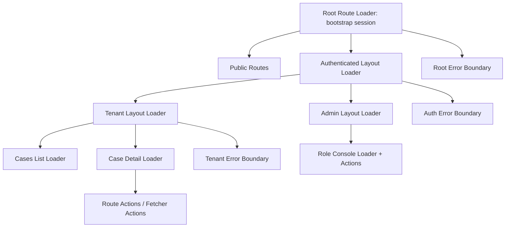
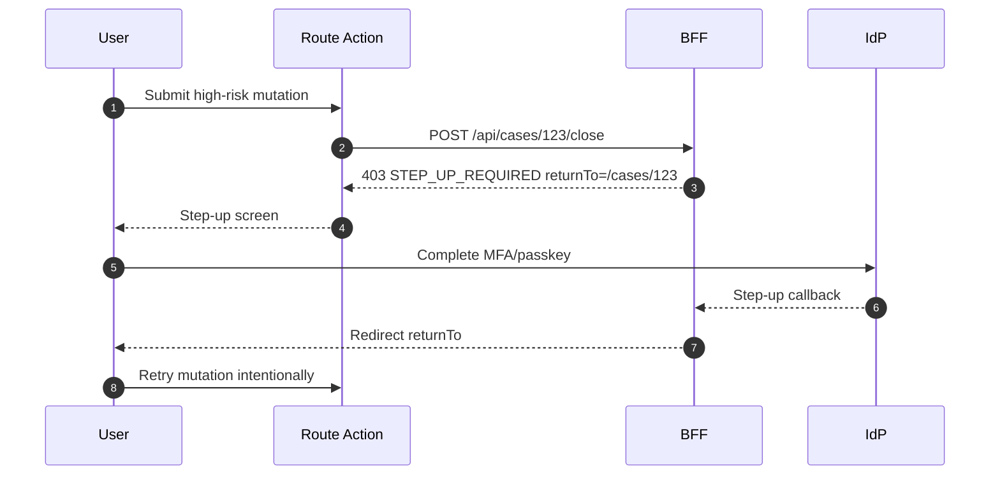

# Part 122 — Reference Architecture: React Router Data Mode

Part 121 described a SPA+BFF architecture.

Now we specialize the frontend architecture using **React Router Data Mode**.

This part is not about “protected routes”. We already established why protected route components are too late. In Data Mode, the route tree is not just UI composition. It becomes a structured place to define:

- what data is loaded;
- which auth state is required;
- what mutation is allowed;
- what pending/error/revalidation behavior exists;
- how route metadata drives navigation and permission-aware layout.

React Router Data Mode lets auth move closer to the request lifecycle:

- `loader` protects data before component render;
- `action` protects mutation before state changes;
- `handle`/route metadata can describe auth requirements;
- error boundaries can recover from typed `401`/`403`/step-up states;
- revalidation can refresh session and permission projection;
- fetchers can submit forms without losing route-level policy.

Used well, Data Mode gives React an auth architecture that feels more like a server request pipeline than a pile of client-side guards.

---

## 1. Architecture intent

The goal of this reference architecture:

> make the route tree a map of auth boundaries, not a collection of components that conditionally hide things.

React Router Data Mode does not replace server-side authorization. It improves frontend correctness by ensuring protected data is not fetched and rendered before auth checks run.

The backend still validates every request.

### What Data Mode gives us

| Capability | Auth value |
|---|---|
| `loader` | authenticate before reading data |
| `action` | authorize before mutation intent completes |
| route object tree | model nested auth boundaries |
| `handle` metadata | attach permission requirements and nav metadata |
| error boundary | typed recovery for auth failures |
| revalidation | refresh session/permission snapshots |
| `useNavigation`/pending UI | show secure transition states |
| `useFetcher` | mutation without route transition, still action-protected |

### What Data Mode does not give us

It does not make frontend authorization authoritative. A direct API call can bypass the route tree. The API/BFF must enforce session, CSRF, authorization, tenant boundary, and domain invariants.

---

## 2. High-level route auth topology



The route tree creates nested auth checkpoints:

1. root loads session projection;
2. authenticated layout requires valid session;
3. tenant layout requires active tenant membership;
4. resource route requires resource-level access;
5. action requires mutation-level authorization.

This is not redundant. Each layer protects a different assumption.

---

## 3. Reference folder structure

```txt
src/
  router/
    router.tsx
    auth-policy.ts
    route-handles.ts
    errors.ts

  auth/
    session-client.ts
    session-store.ts
    auth-context.tsx
    use-auth.ts
    use-can.ts

  api/
    client.ts
    problem.ts
    csrf.ts

  routes/
    root.tsx
    public/
      login.tsx
    app/
      layout.tsx
      tenant-layout.tsx
      dashboard.tsx
      forbidden.tsx
    cases/
      list.tsx
      detail.tsx
      actions.ts
    admin/
      layout.tsx
      role-console.tsx
```

The route files should stay thin. Put reusable policy checks in `router/auth-policy.ts` and API calls in feature modules.

---

## 4. Route policy model

A route can declare auth metadata.

```ts
export type AuthRequirement =
  | { kind: "public" }
  | { kind: "anonymous-only" }
  | { kind: "authenticated" }
  | {
      kind: "permission";
      action: string;
      resource?: "tenant" | "case" | "admin";
      assurance?: "aal1" | "aal2" | "aal3";
    };

export type RouteAuthHandle = {
  auth: AuthRequirement;
  nav?: {
    id: string;
    label: string;
    icon?: string;
    order?: number;
  };
};
```

Example route handle:

```ts
export const handle = {
  auth: { kind: "permission", action: "case.list", resource: "tenant" },
  nav: { id: "cases", label: "Cases", order: 10 },
} satisfies RouteAuthHandle;
```

Route metadata is a projection and coordination mechanism. The backend still enforces the same action on the API endpoint.

---

## 5. Router setup

```tsx
import { createBrowserRouter, RouterProvider } from "react-router";
import { RootRoute, rootLoader } from "~/routes/root";
import { AppLayout, appLoader } from "~/routes/app/layout";
import { TenantLayout, tenantLoader } from "~/routes/app/tenant-layout";
import { caseDetailAction, caseDetailLoader } from "~/routes/cases/detail";
import { AuthErrorBoundary } from "~/router/errors";

export const router = createBrowserRouter([
  {
    id: "root",
    path: "/",
    Component: RootRoute,
    loader: rootLoader,
    ErrorBoundary: AuthErrorBoundary,
    children: [
      {
        path: "login",
        lazy: () => import("~/routes/public/login"),
      },
      {
        id: "app",
        Component: AppLayout,
        loader: appLoader,
        ErrorBoundary: AuthErrorBoundary,
        children: [
          {
            id: "tenant",
            path: "t/:tenantSlug",
            Component: TenantLayout,
            loader: tenantLoader,
            children: [
              {
                path: "cases/:caseId",
                lazy: () => import("~/routes/cases/detail"),
                loader: caseDetailLoader,
                action: caseDetailAction,
              },
            ],
          },
        ],
      },
    ],
  },
]);

export function AppRouter() {
  return <RouterProvider router={router} />;
}
```

The route tree describes nested assumptions. A case detail route does not need to rediscover the current tenant from scratch if the tenant layout loader already resolved it and passed it down through loader data or shared auth context.

---

## 6. Root loader: session bootstrap

The root loader should bootstrap the session projection.

```ts
import { json } from "react-router";
import { sessionClient } from "~/auth/session-client";

export async function rootLoader() {
  const session = await sessionClient.getSessionProjection();

  return json(
    { session },
    {
      headers: {
        "Cache-Control": "no-store",
      },
    }
  );
}
```

The root loader should not load large user profiles, tenant details, or resource data. Keep it small and fast.

### Root route component

```tsx
import { Outlet, useLoaderData } from "react-router";
import { AuthProvider } from "~/auth/auth-context";

export function RootRoute() {
  const { session } = useLoaderData<typeof rootLoader>();

  return (
    <AuthProvider initialSession={session}>
      <Outlet />
    </AuthProvider>
  );
}
```

The AuthProvider hydrates a client-side external store from the loader snapshot. It should reconcile with `/api/session` after visibility changes, logout events, tenant switch, or typed `401`/`403` responses.

---

## 7. Authenticated layout loader

The authenticated layout enforces app session.

```ts
import { redirect } from "react-router";
import { getSafeReturnTo } from "~/router/auth-policy";
import { sessionClient } from "~/auth/session-client";

export async function appLoader({ request }: { request: Request }) {
  const session = await sessionClient.getSessionProjection(request);

  if (session.status === "anonymous") {
    const returnTo = getSafeReturnTo(new URL(request.url));
    throw redirect(`/login?returnTo=${encodeURIComponent(returnTo)}`);
  }

  if (session.status === "degraded") {
    throw new Response("Session temporarily unavailable", { status: 503 });
  }

  return { session };
}
```

The redirect target must be internal. Never use a raw `returnTo` from the URL without validation.

---

## 8. Tenant layout loader

Tenant context is not just a URL parameter. It is an authorization scope.

```ts
export async function tenantLoader({ params, request }: LoaderArgs) {
  const auth = await requireAuthenticatedSession(request);
  const tenant = await api.getTenantBySlug(params.tenantSlug!);

  const decision = await api.checkPermission({
    action: "tenant.enter",
    resource: { type: "tenant", id: tenant.id },
  });

  if (!decision.allowed) {
    throw forbiddenProblem(decision);
  }

  return {
    tenant,
    permissionVersion: decision.permissionVersion,
  };
}
```

Tenant loader responsibilities:

- resolve tenant slug to canonical tenant ID;
- ensure current subject has membership;
- update active tenant context if your architecture supports it;
- invalidate tenant-scoped cache on switch;
- expose tenant-safe metadata to nested routes;
- deny direct URL access to other tenants.

---

## 9. Resource loader

A case detail loader should fetch product-shaped data from the BFF.

```ts
export async function caseDetailLoader({ params, request }: LoaderArgs) {
  const auth = await requireAuthenticatedSession(request);
  const tenant = await requireTenantContext(request);

  const res = await api.getCaseDetail({
    caseId: params.caseId!,
    tenantId: tenant.id,
    signal: request.signal,
  });

  return res;
}
```

The loader should not independently compute object-level access from stale client state. It asks the BFF, and the BFF enforces policy.

The returned data should already be shaped:

```ts
type CaseDetailLoaderData = {
  case: CaseView;
  allowedActions: string[];
  fieldModes: Record<string, FieldMode>;
  permissionVersion: string;
};
```

---

## 10. Route action

An action handles mutation intent.

```ts
export async function caseDetailAction({ request, params }: ActionArgs) {
  const formData = await request.formData();
  const intent = String(formData.get("intent"));

  switch (intent) {
    case "close":
      return closeCaseAction(request, params, formData);
    case "assign":
      return assignCaseAction(request, params, formData);
    default:
      throw new Response("Unknown action", { status: 400 });
  }
}

async function closeCaseAction(request: Request, params: Params, formData: FormData) {
  const reason = String(formData.get("reason") ?? "");

  const result = await api.closeCase({
    caseId: params.caseId!,
    reason,
    csrfToken: await getCsrfToken(),
    idempotencyKey: crypto.randomUUID(),
    signal: request.signal,
  });

  return result;
}
```

The action does not rely on a hidden button. It submits intent. The BFF decides whether the intent is allowed.

---

## 11. Auth policy helper

Centralize frontend auth handling.

```ts
export async function requireAuthenticatedSession(request: Request) {
  const session = await sessionClient.getSessionProjection(request);

  if (session.status === "authenticated") return session;

  if (session.status === "anonymous") {
    throw redirect(`/login?returnTo=${encodeURIComponent(getSafeReturnTo(new URL(request.url)))}`);
  }

  throw typedAuthProblem("SESSION_UNAVAILABLE", 503);
}

export function requireAllowedAction(data: { allowedActions: string[] }, action: string) {
  if (!data.allowedActions.includes(action)) {
    throw typedAuthProblem("FORBIDDEN", 403);
  }
}
```

Be careful: `requireAllowedAction` is useful to prevent impossible UI flows, but it is still not final authorization.

---

## 12. Error boundary model

React Router error boundaries are extremely useful for auth recovery.

```tsx
import { isRouteErrorResponse, Link, useRouteError } from "react-router";

export function AuthErrorBoundary() {
  const error = useRouteError();

  if (isRouteErrorResponse(error)) {
    if (error.status === 401) {
      return <SessionExpiredScreen />;
    }

    if (error.status === 403) {
      const code = getProblemCode(error);
      if (code === "STEP_UP_REQUIRED") return <StepUpRequiredScreen />;
      if (code === "TENANT_FORBIDDEN") return <TenantForbiddenScreen />;
      return <ForbiddenScreen />;
    }
  }

  return <GenericRouteError />;
}
```

The error boundary should avoid leaking sensitive resource existence. For some resources, `404` may be safer than `403` depending on product/security policy.

---

## 13. Route metadata-driven navigation

Use route handles to drive navigation, not duplicated menu config.

```ts
export const handle = {
  auth: { kind: "permission", action: "case.list", resource: "tenant" },
  nav: { id: "cases", label: "Cases", order: 10 },
} satisfies RouteAuthHandle;
```

Then derive navigation:

```tsx
function Sidebar() {
  const matches = useMatches();
  const { can } = usePermissionProjection();

  const items = matches
    .flatMap((match) => {
      const handle = match.handle as RouteAuthHandle | undefined;
      if (!handle?.nav) return [];
      if (!isRouteVisible(handle.auth, can)) return [];
      return [handle.nav];
    })
    .sort((a, b) => (a.order ?? 0) - (b.order ?? 0));

  return <SidebarItems items={items} />;
}
```

This reduces drift between route accessibility and sidebar visibility.

Still, direct URL access must be protected by loaders and server endpoints.

---

## 14. Pending UI for auth transitions

Pending UI should distinguish data loading from security transition.

```tsx
import { useNavigation } from "react-router";

export function GlobalPendingIndicator() {
  const navigation = useNavigation();
  const auth = useAuthSnapshot();

  if (auth.status === "unknown") return <FullPageSessionBootstrap />;

  if (navigation.state === "loading" && isAuthSensitiveTransition(navigation.location)) {
    return <SecureRouteSkeleton />;
  }

  if (navigation.state !== "idle") return <TopBarProgress />;

  return null;
}
```

Avoid showing stale sensitive content under a spinner during logout, tenant switch, or role change.

---

## 15. Revalidation strategy

Revalidation matters because auth state changes outside route navigation:

- session expiry;
- logout in another tab;
- permission update;
- tenant switch;
- step-up completion;
- impersonation start/stop;
- policy version bump.

```ts
export function shouldRevalidateAuth(args: ShouldRevalidateFunctionArgs) {
  const currentEpoch = authStore.getSnapshot().session?.epoch;
  const nextEpoch = readEpochFromLastResponse(args.actionResult);

  if (nextEpoch && nextEpoch !== currentEpoch) return true;
  if (authEvents.hasPending("PERMISSION_VERSION_CHANGED")) return true;
  if (args.formMethod && args.formMethod !== "GET") return true;

  return args.defaultShouldRevalidate;
}
```

Do not revalidate everything on every navigation. That creates performance problems and can amplify auth outages. Revalidate by event, scope, and version.

---

## 16. Fetchers and auth

`useFetcher` is powerful for forms that mutate without navigation. It also creates auth edge cases.

```tsx
function CloseCaseButton({ caseId, allowedActions }: Props) {
  const fetcher = useFetcher();
  const allowed = allowedActions.includes("case.close");

  if (!allowed) return <DisabledAction reason="You cannot close this case." />;

  return (
    <fetcher.Form method="post" action={`/t/current/cases/${caseId}`}>
      <input type="hidden" name="intent" value="close" />
      <button disabled={fetcher.state !== "idle"}>Close case</button>
    </fetcher.Form>
  );
}
```

Rules:

- every fetcher mutation goes through an action;
- action calls BFF mutation endpoint;
- BFF revalidates authorization;
- optimistic UI rolls back on `403`;
- stale permission invalidates route data;
- session expiry redirects or shows recoverable error.

---

## 17. Step-up flow in Data Mode

Sensitive routes/actions may require stronger authentication.



Do not automatically replay high-risk mutations after step-up unless the product has explicitly designed idempotency, confirmation, and audit semantics. Usually the safer pattern is:

1. preserve intent;
2. complete step-up;
3. ask user to confirm again;
4. submit new authorized request.

---

## 18. Integration with BFF session projection

In Data Mode, session projection can be read by loaders through the BFF.

```ts
export async function getSessionProjection(request?: Request): Promise<SessionProjection> {
  const headers = request ? { Cookie: request.headers.get("Cookie") ?? "" } : undefined;

  const res = await fetch(`${BFF_ORIGIN}/api/session`, {
    headers,
    credentials: "include",
  });

  if (!res.ok) throw await toRouteProblem(res);
  return res.json();
}
```

In a pure browser SPA, `request.headers.get("Cookie")` is not available in client loaders. In SSR/framework environments, server loaders can read request cookies. This is why the same auth architecture needs adapters per runtime.

For browser-only Data Mode, loaders call same-origin `/api/session` using browser credentials.

---

## 19. Query cache interaction

If you use TanStack Query alongside React Router loaders, define ownership clearly.

Recommended:

- route loader owns critical route data and authorization boundary;
- TanStack Query owns interactive subresources, polling, and background refresh;
- auth events invalidate both router data and query cache;
- logout clears query cache;
- tenant switch removes tenant-scoped cache;
- permission version mismatch invalidates resource queries.

Example:

```ts
authEvents.on("LOGOUT", () => {
  queryClient.clear();
  router.navigate("/login", { replace: true });
});

authEvents.on("PERMISSION_VERSION_CHANGED", ({ scope }) => {
  queryClient.invalidateQueries({ queryKey: ["tenant", scope.tenantId] });
  router.revalidate();
});
```

Do not allow client cache to outlive auth scope.

---

## 20. SSR compatibility note

React Router Data Mode can exist in browser-only apps or framework/server-rendered contexts. The auth boundary changes depending on runtime.

| Runtime | Loader authority |
|---|---|
| Browser-only Data Mode | loader improves UX and data timing; BFF/API remains authority |
| SSR Data/Framework Mode | server loader can read cookies and perform stronger pre-render auth |
| Edge middleware + Data Mode | edge can coarse-gate; loader/action still enforce route-level auth |

Do not write runtime-ambiguous auth code. A browser loader cannot protect secrets that should only exist server-side.

---

## 21. Direct URL behavior

For direct URL entry:

```txt
GET /t/acme/cases/123
```

The route pipeline should do:

1. root loader bootstraps session;
2. app loader requires authenticated session;
3. tenant loader resolves `acme` and checks membership;
4. case loader fetches `/api/cases/123` from BFF;
5. BFF checks `case.view` against subject, tenant, resource;
6. UI renders case detail with allowed actions.

No step should assume that because the sidebar hid the route, the user cannot reach it.

---

## 22. Error response contract

Use typed problem responses that route boundaries can interpret.

```ts
type AuthProblem = {
  type: string;
  title: string;
  status: 401 | 403 | 419 | 423 | 428 | 503;
  code:
    | "NO_SESSION"
    | "SESSION_EXPIRED"
    | "FORBIDDEN"
    | "STEP_UP_REQUIRED"
    | "TENANT_FORBIDDEN"
    | "CSRF_INVALID"
    | "PERMISSION_STALE"
    | "POLICY_UNAVAILABLE";
  correlationId: string;
  returnTo?: string;
  requiredAal?: string;
};
```

The route error boundary can map these to recovery screens without parsing arbitrary text.

---

## 23. Route-level cache headers

If Data Mode runs server-side, loaders should return cache-safe headers.

```ts
return json(data, {
  headers: {
    "Cache-Control": "no-store",
    "Vary": "Cookie",
  },
});
```

If loaders run in the browser, the BFF response headers still matter. Authenticated JSON should not be cached by shared infrastructure.

---

## 24. Testing architecture

### Route loader tests

- anonymous user redirected to login;
- expired session throws typed `401`;
- degraded session throws typed `503`;
- tenant membership failure throws `403`;
- resource forbidden handles direct URL;
- safe return URL is preserved;
- unsafe return URL is rejected.

### Route action tests

- missing CSRF fails;
- stale permission returns `403`;
- step-up required returns typed problem;
- idempotency key prevents duplicate mutation;
- forbidden mutation emits correct UI error;
- successful mutation revalidates loader data.

### Component tests

- resource allowed actions render correct buttons;
- forbidden action is hidden/disabled/explained per design rule;
- fetcher pending state does not show stale success;
- error boundary maps `401` and `403` separately;
- route metadata drives nav correctly.

### E2E tests

- direct protected URL when anonymous;
- login return path after callback;
- tenant switch clears previous tenant data;
- role update invalidates sidebar and route access;
- forbidden direct API call fails even if UI is manipulated;
- logout in one tab invalidates another.

---

## 25. Reference route matrix

| Route | Loader auth | Data source | UI permission | Action auth |
|---|---|---|---|---|
| `/login` | anonymous/public | none | login form | none |
| `/t/:tenant/dashboard` | authenticated + tenant | BFF dashboard | nav projection | none |
| `/t/:tenant/cases` | `case.list` | BFF list | create/export actions | create/export action |
| `/t/:tenant/cases/:id` | `case.view` | BFF detail | allowed actions/field modes | close/assign/comment |
| `/t/:tenant/admin/roles` | `admin.role.manage` | BFF admin | admin action projection | grant/revoke/change role |
| `/forbidden` | public/auth-aware | none | recovery | access request |

This matrix should live with the codebase. It becomes both documentation and regression-test input.

---

## 26. Common mistakes

### Mistake 1 — loader checks only authentication

```ts
if (!session) redirect("/login");
return api.getCase(params.caseId);
```

The loader fetched protected data but never checked route/resource authorization. The BFF should deny, but the frontend boundary is still weak.

### Mistake 2 — action trusts hidden form fields

```ts
const canClose = formData.get("canClose") === "true";
if (canClose) await api.closeCase(...);
```

Form fields are user-controlled. This is not authorization.

### Mistake 3 — sidebar is the route policy

```tsx
{user.role === "admin" && <Link to="/admin">Admin</Link>}
```

A hidden link does not protect `/admin`.

### Mistake 4 — global user role drives resource actions

```tsx
const canClose = user.role === "manager";
```

Resource actions often depend on tenant, case state, assignment, separation of duties, assurance level, and object grants.

### Mistake 5 — route metadata drifts from API policy

Route says `case.close`; API expects `case.transition.close`; UI and server diverge. Use shared action vocabulary and contract tests.

---

## 27. Production checklist

### Route design

- root loader bootstraps session;
- app layout requires authenticated session;
- tenant layout validates membership;
- resource loaders fetch server-shaped data;
- actions submit intent only;
- route metadata declares auth/nav requirements;
- error boundaries handle typed auth problems;
- redirect targets are internal-only.

### Security

- backend/BFF validates every request;
- unsafe methods use CSRF defense when cookies authenticate requests;
- no sensitive data stored in route metadata;
- no protected data hidden only with CSS;
- authenticated JSON is `no-store`;
- tenant switch clears tenant-scoped cache;
- logout clears route/query/client state;
- `403` messages avoid leaking sensitive resource existence.

### Testing

- route loader tests cover `401/403/503`;
- action tests cover CSRF and stale permission;
- direct URL tests exist;
- role/permission matrix regression tests exist;
- return URL attack cases exist;
- step-up flow tests exist;
- logout/tenant switch cache cleanup tests exist.

---

## 28. What this architecture gives you

React Router Data Mode gives the frontend a coherent auth pipeline:

```txt
navigation intent
  -> route match
  -> loader authentication/authorization
  -> data projection
  -> component render
  -> action mutation intent
  -> server enforcement
  -> revalidation
  -> error recovery
```

That is much stronger than:

```txt
render component
  -> check user.role
  -> maybe redirect
```

The route tree becomes a security-oriented product map. Loaders prevent unauthorized data from being handed to components. Actions prevent mutation intent from bypassing route logic. Error boundaries provide reliable recovery. Metadata keeps layout, navigation, and permission projection aligned.

But the final rule remains the same:

> React Router shapes user experience; the server enforces access.

---

## 29. References

- React Router Data Loading documentation.
- React Router Actions documentation.
- React Router Middleware documentation.
- React Router Route Module documentation.
- React Router Error Boundary documentation.
- OWASP Authorization Cheat Sheet.
- OWASP CSRF Prevention Cheat Sheet.
- OWASP Session Management Cheat Sheet.
- React documentation.
