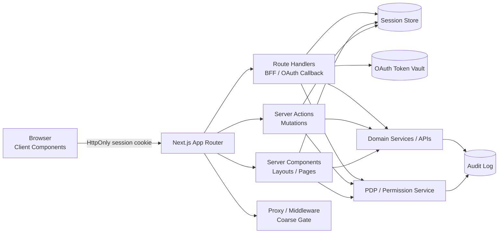
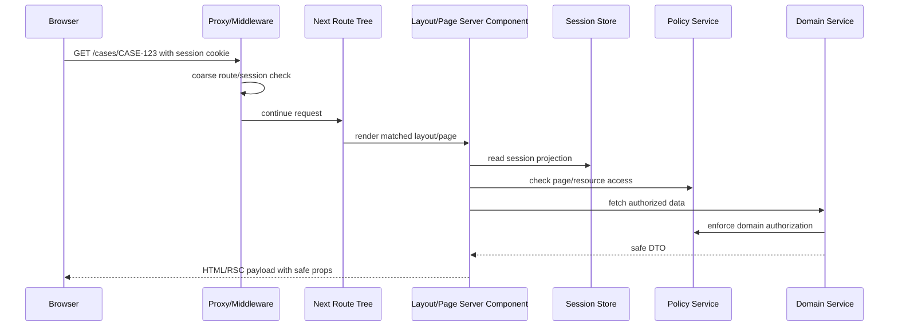
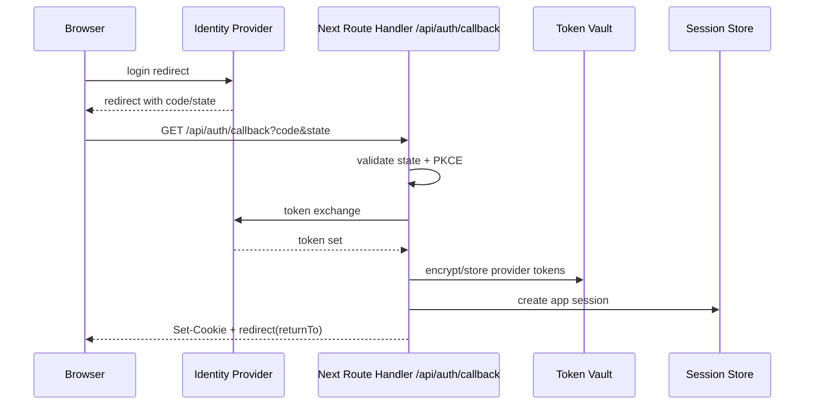
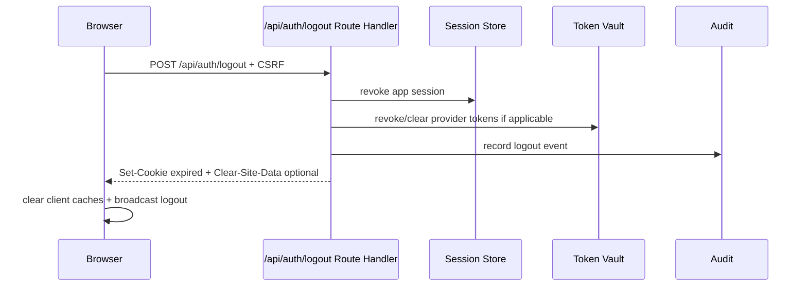

# Part 123 — Reference Architecture: Next.js App Router

Part 121 gave us SPA+BFF.

Part 122 gave us React Router Data Mode.

Now we build the same level of reference architecture for **Next.js App Router**.

This part is not a checklist of “where to put login code”. In App Router, auth is a **multi-runtime, server-first composition problem**:

- Server Components can read session-derived data before client hydration.
- Client Components can render interactive permission-aware UI.
- Route Handlers can implement BFF-style API and OAuth callbacks.
- Server Actions can mutate data from forms and components.
- Middleware/Proxy can do coarse request gating before route handling.
- Caching and revalidation can accidentally turn auth into data leakage if not designed explicitly.

The architecture we want is simple in principle:

> Keep credentials and enforcement on the server. Send the browser only a minimal, typed, cache-safe projection of the current session and permissions.

That one sentence prevents most Next.js auth bugs.

---

## 1. Architecture intent

The goal is to build a Next.js App Router architecture where:

1. the browser never needs raw OAuth tokens;
2. session continuity is handled by HttpOnly cookies and server-side token/session storage;
3. Server Components never serialize sensitive server-only objects to Client Components;
4. Route Handlers and Server Actions enforce authorization per request;
5. layouts/navigation are permission-aware but never authoritative;
6. cache behavior is explicit for authenticated content;
7. logout, tenant switch, permission change, and session revocation have deterministic cleanup semantics;
8. observability can explain auth failures without leaking secrets.

### What Next.js changes compared to a pure SPA

In a pure SPA, the browser often owns session restoration, API token attachment, and permission cache.

In App Router, the server can own more of the auth lifecycle:

| Concern | Pure SPA tendency | App Router target |
|---|---|---|
| OAuth callback | browser route | Route Handler/BFF |
| token storage | browser memory/localStorage/cookie | server token vault + HttpOnly app session |
| first session read | `/session` after load | server-side session read before render |
| permission projection | client fetch after render | server projection before layout/page |
| mutation | client API request | Route Handler or Server Action |
| redirect | client router | server redirect where possible |
| cache | browser/query cache heavy | explicit server/client cache split |
| enforcement | backend API | Route Handler/API/domain service/server action |

This does not mean Client Components disappear. It means Client Components become **interaction surfaces**, not credential owners.

---

## 2. High-level reference architecture



### Boundary rule

Every box has a different responsibility:

| Layer | Responsibility | Must not do |
|---|---|---|
| Browser | interaction, navigation, optimistic UI, permission display | store raw OAuth refresh tokens, enforce final authorization |
| Server Component | read safe server-side session projection, render initial UI | pass secrets/raw claims to Client Components |
| Client Component | render interactive UI from safe props/hooks | infer domain authorization from role strings |
| Route Handler | BFF endpoints, OAuth callback, session API | trust request body for subject/tenant/permission |
| Server Action | mutation boundary for forms/components | skip CSRF/session/authorization because “it is server-side” |
| Proxy/Middleware | coarse routing gate, redirect, header normalization | become complete permission engine |
| Domain service | enforce business authorization and invariants | rely on frontend hidden buttons |
| Policy engine | decide `subject-action-resource-context` | leak internal policy traces to UI |
| Audit log | record security-relevant events | store tokens, passwords, unnecessary PII |

---

## 3. Request lifecycle mental model

A Next.js request can touch multiple auth-sensitive stages.



The important point: **authorization happens more than once, at different strengths**.

- Proxy/Middleware: cheap coarse check.
- Layout/Page: safe projection and early user experience.
- Domain/API/Server Action: authoritative decision.
- Client UI: exposure control.

A well-designed system accepts this duplication because each check protects a different failure mode.

---

## 4. Session model

For production-grade App Router auth, prefer this baseline:

```txt
Browser stores: HttpOnly, Secure, SameSite cookie with opaque app session id.
Server stores: app session record + OAuth token set + tenant membership snapshot reference.
Client receives: safe session projection, not raw tokens.
```

### Session cookie

Use a cookie like:

```txt
__Host-app_session=<opaque-random-id>;
Path=/;
Secure;
HttpOnly;
SameSite=Lax
```

For highly sensitive apps, pair this with:

- server-side session lookup;
- session rotation after privilege boundary changes;
- CSRF protection for unsafe methods;
- short idle timeout and absolute timeout;
- explicit revocation on logout and security events;
- device/session management UI where appropriate.

### Session store shape

```ts
export type AppSessionRecord = {
  sessionIdHash: string;
  userId: string;
  actorUserId?: string; // impersonation actor
  activeTenantId?: string;
  authTime: string;
  assuranceLevel: 'aal1' | 'aal2' | 'aal3';
  createdAt: string;
  lastSeenAt: string;
  idleExpiresAt: string;
  absoluteExpiresAt: string;
  revokedAt?: string;
  permissionEpoch: number;
  tokenFamilyId?: string;
};
```

Do not store session id in plaintext. Store a hash.

Do not store raw session ids in logs.

### Token vault shape

```ts
export type TokenVaultRecord = {
  userId: string;
  tenantId?: string;
  provider: 'oidc' | 'saml-bridge' | 'custom';
  accessTokenCiphertext: string;
  refreshTokenCiphertext?: string;
  expiresAt: string;
  scopes: string[];
  audience: string;
  rotationFamilyId?: string;
};
```

The browser does not need this object.

---

## 5. Server-only auth modules

Keep server-only auth modules away from Client Components.

A useful directory structure:

```txt
src/
  app/
    (public)/
    (authenticated)/
    api/
      auth/
      bff/
  auth/
    server/
      session.ts
      cookies.ts
      oauth.ts
      csrf.ts
      policy.ts
      audit.ts
    shared/
      types.ts
      problem.ts
      permission-vocabulary.ts
    client/
      AuthProvider.tsx
      useSession.ts
      useCan.ts
```

### Server-only helper

```ts
// src/auth/server/session.ts
import 'server-only';
import { cookies } from 'next/headers';

export async function requireSession(): Promise<ServerSession> {
  const cookieStore = await cookies();
  const raw = cookieStore.get('__Host-app_session')?.value;

  if (!raw) {
    throw new AuthProblem('UNAUTHENTICATED');
  }

  const session = await findActiveSession(raw);

  if (!session) {
    throw new AuthProblem('SESSION_EXPIRED');
  }

  return session;
}
```

The key idea is not the exact function. The key idea is import boundaries.

If `session.ts` imports `next/headers`, token vault code, or database secrets, mark it server-only and never import it into Client Components.

---

## 6. Session projection

The browser should not receive the session record. It should receive a **projection**.

```ts
export type SessionProjection = {
  status: 'authenticated';
  user: {
    id: string;
    displayName: string;
    avatarUrl?: string;
  };
  tenant?: {
    id: string;
    slug: string;
    name: string;
  };
  assurance: {
    level: 'aal1' | 'aal2' | 'aal3';
    authTime: string;
  };
  permissionEpoch: number;
  sessionEpoch: number;
  actor?: {
    id: string;
    displayName: string;
  };
};
```

Keep out:

- refresh tokens;
- access tokens;
- provider raw claims unless explicitly needed;
- full group list if not needed;
- internal role names if the app uses permission contracts;
- policy traces;
- user email if display name is enough;
- tenant membership list if only active tenant is needed.

### `/api/session` route handler

```ts
// app/api/session/route.ts
import { NextResponse } from 'next/server';
import { getOptionalSessionProjection } from '@/auth/server/session';

export async function GET() {
  const projection = await getOptionalSessionProjection();

  if (!projection) {
    return NextResponse.json(
      { status: 'anonymous' },
      {
        status: 200,
        headers: {
          'Cache-Control': 'no-store',
        },
      }
    );
  }

  return NextResponse.json(projection, {
    headers: {
      'Cache-Control': 'no-store',
    },
  });
}
```

Authenticated session endpoints should usually be `no-store`.

---

## 7. App Router layout strategy

A robust route organization:

```txt
app/
  (public)/
    login/
    callback/
    page.tsx
  (authenticated)/
    layout.tsx
    dashboard/
      page.tsx
    tenants/
      [tenantSlug]/
        layout.tsx
        cases/
          [caseId]/
            layout.tsx
            page.tsx
            actions.ts
  api/
    auth/
      callback/route.ts
      logout/route.ts
    bff/
      cases/[caseId]/route.ts
```

### Public layout

Public pages must not attempt to render authenticated data.

Examples:

- marketing home;
- login start;
- OAuth callback handler page if it only shows transition UI;
- password reset request page;
- invitation landing page before session.

### Authenticated layout

The authenticated layout is the first strong projection boundary.

```tsx
// app/(authenticated)/layout.tsx
import { requireSessionProjection } from '@/auth/server/session';
import { AuthShell } from '@/auth/client/AuthShell';

export default async function AuthenticatedLayout({
  children,
}: {
  children: React.ReactNode;
}) {
  const session = await requireSessionProjection();

  return (
    <AuthShell session={session}>
      {children}
    </AuthShell>
  );
}
```

This layout should pass only safe data to the Client Component shell.

Do not pass the raw server session.

Do not pass raw provider claims.

Do not pass complete permission graph unless the UI truly needs it.

---

## 8. Tenant layout strategy

Enterprise apps often fail because tenant context is implicit.

Make tenant context explicit in route structure:

```txt
/tenants/[tenantSlug]/cases/[caseId]
```

The tenant layout should:

1. resolve `tenantSlug` to tenant id;
2. verify membership for current user;
3. compare active tenant in session;
4. prevent cross-tenant cache reuse;
5. load tenant navigation projection;
6. expose tenant switch metadata;
7. set cache behavior safely.

```tsx
// app/(authenticated)/tenants/[tenantSlug]/layout.tsx
import { notFound, redirect } from 'next/navigation';
import { requireSession } from '@/auth/server/session';
import { requireTenantMembership } from '@/auth/server/tenant';

export default async function TenantLayout({
  children,
  params,
}: {
  children: React.ReactNode;
  params: Promise<{ tenantSlug: string }>;
}) {
  const { tenantSlug } = await params;
  const session = await requireSession();

  const tenant = await findTenantBySlug(tenantSlug);
  if (!tenant) notFound();

  const membership = await requireTenantMembership({
    userId: session.userId,
    tenantId: tenant.id,
  });

  if (!membership.active) {
    redirect('/choose-tenant');
  }

  return (
    <TenantShell tenant={toTenantProjection(tenant)}>
      {children}
    </TenantShell>
  );
}
```

The domain service still checks tenant access when reading or mutating resources.

The layout improves UX and reduces accidental data loading. It is not the final enforcement point.

---

## 9. Resource page strategy

A resource page such as a case detail page should not fetch by id and then filter in React.

Bad:

```tsx
const caseRecord = await db.case.findUnique({ where: { id: caseId } });
if (!canView(caseRecord)) redirect('/forbidden');
```

Better:

```ts
const caseRecord = await caseService.getCaseForViewer({
  viewer: session.subject,
  tenantId,
  caseId,
});
```

The service owns authorization.

The page owns rendering.

The policy engine owns decisions.

The audit system owns records of sensitive events.

### Page skeleton

```tsx
// app/(authenticated)/tenants/[tenantSlug]/cases/[caseId]/page.tsx
export default async function CasePage({ params }: PageProps) {
  const { tenantSlug, caseId } = await params;
  const session = await requireSession();
  const tenant = await requireTenantFromSlugForUser(tenantSlug, session.userId);

  const view = await caseReadModel.getCasePageView({
    subject: toSubject(session),
    tenantId: tenant.id,
    caseId,
  });

  return <CasePageClient initialView={view} />;
}
```

`initialView` must be a safe DTO.

---

## 10. Authorization in Server Actions

Server Actions are convenient. Convenience does not remove authorization.

A Server Action is still an untrusted request boundary:

- user-controlled form fields;
- stale browser state;
- malicious direct invocation attempt;
- CSRF-like concern depending on architecture;
- tenant/resource id manipulation;
- missing workflow-state recheck;
- stale permission projection.

### Action shape

```ts
'use server';

import { requireSession } from '@/auth/server/session';
import { requireCsrf } from '@/auth/server/csrf';
import { caseCommands } from '@/domain/cases/commands';

export async function closeCaseAction(input: CloseCaseInput) {
  const session = await requireSession();
  await requireCsrf();

  const result = await caseCommands.closeCase({
    actor: toActor(session),
    tenantId: input.tenantId,
    caseId: input.caseId,
    reason: input.reason,
    expectedVersion: input.expectedVersion,
  });

  return result;
}
```

The command handler performs authorization again.

```ts
export async function closeCase(command: CloseCaseCommand) {
  const caseRecord = await repo.getForUpdate(command.caseId);

  await policy.requireAllowed({
    subject: command.actor,
    action: 'case.close',
    resource: {
      type: 'case',
      id: caseRecord.id,
      tenantId: caseRecord.tenantId,
      state: caseRecord.state,
      ownerTeamId: caseRecord.ownerTeamId,
    },
    context: {
      tenantId: command.tenantId,
      expectedVersion: command.expectedVersion,
    },
  });

  return repo.closeCase(command);
}
```

### Invariant

> A Server Action is a better place to enforce than a button, but the final enforcement should live in the domain/API boundary, not in the component that imports the action.

---

## 11. Route Handlers as BFF boundary

Route Handlers are a natural place to build BFF endpoints.

Example:

```ts
// app/api/bff/cases/[caseId]/route.ts
import { NextResponse } from 'next/server';
import { requireSession } from '@/auth/server/session';
import { caseReadModel } from '@/domain/cases/read-model';

export async function GET(
  _request: Request,
  { params }: { params: Promise<{ caseId: string }> }
) {
  const session = await requireSession();
  const { caseId } = await params;

  const view = await caseReadModel.getCaseForViewer({
    subject: toSubject(session),
    caseId,
  });

  return NextResponse.json(view, {
    headers: {
      'Cache-Control': 'no-store',
    },
  });
}
```

BFF endpoints should be product-shaped, not a blind proxy:

| Endpoint style | Risk |
|---|---|
| `/api/proxy?url=...` | SSRF, auth bypass, broad attack surface |
| `/api/bff/cases/:id` | narrow resource/action boundary |
| `/api/bff/cases/:id/allowed-actions` | explicit permission projection |
| `/api/bff/export/cases` | dedicated export policy/audit |

---

## 12. OAuth/OIDC callback in App Router

Use a Route Handler for callback processing.

```txt
GET /api/auth/callback?code=...&state=...
```

The callback handler should:

1. validate `state` against stored transaction;
2. validate PKCE verifier;
3. exchange authorization code server-side;
4. validate ID token if using OIDC;
5. map external identity to internal user/account;
6. resolve tenant/org context if needed;
7. create app session;
8. store provider token set server-side if needed;
9. set HttpOnly session cookie;
10. redirect only to safe internal `returnTo`.



### Callback anti-patterns

Do not:

- put access token in URL fragment;
- set session from unvalidated `state`;
- allow arbitrary external `returnTo`;
- decode ID token in browser and trust it;
- store provider refresh token in localStorage;
- skip nonce validation for OIDC;
- return raw provider claims to the browser.

---

## 13. Proxy/Middleware strategy

Use Proxy/Middleware for coarse checks only.

Good uses:

- block unauthenticated access to obviously protected route groups;
- redirect anonymous users to login;
- attach normalized request headers for downstream server code;
- prevent public routes from being accessed with invalid auth transaction state;
- coarse tenant slug validation;
- logging/correlation id;
- bot/rate-limit integration.

Poor uses:

- full object-level authorization;
- database-heavy permission graph traversal;
- token refresh with complex rotation;
- policy decisions requiring full resource state;
- long-running network calls;
- audit-critical business mutation.

### Coarse gate example

```ts
// proxy.ts or middleware.ts depending on project/version convention
import { NextResponse, type NextRequest } from 'next/server';

const AUTHENTICATED_PREFIXES = ['/dashboard', '/tenants'];

export function proxy(request: NextRequest) {
  const { pathname } = request.nextUrl;
  const protectedPath = AUTHENTICATED_PREFIXES.some((p) => pathname.startsWith(p));

  if (!protectedPath) return NextResponse.next();

  const hasCookie = request.cookies.has('__Host-app_session');

  if (!hasCookie) {
    const url = new URL('/login', request.url);
    url.searchParams.set('returnTo', safeInternalReturnTo(pathname));
    return NextResponse.redirect(url);
  }

  return NextResponse.next();
}
```

Do not treat `hasCookie` as proof of valid session. It is only a cheap routing signal.

---

## 14. Cache strategy for authenticated App Router

Caching is where Next.js auth bugs become subtle.

### Authenticated data default

Use:

```txt
Cache-Control: no-store
```

for:

- session projection;
- permission projection;
- user-specific dashboards;
- tenant-specific data;
- object detail pages;
- admin consoles;
- audit views;
- exports;
- sensitive forms.

### Server fetches

For protected server-side fetches, prefer explicit no-store semantics.

```ts
await fetch(url, {
  headers: buildInternalAuthHeaders(session),
  cache: 'no-store',
});
```

Do not rely on defaults.

### Mixed public/private layout problem

Bad:

```tsx
// Public marketing layout accidentally imports user-aware nav
<MarketingLayout>
  <MaybeUserMenu />
</MarketingLayout>
```

If a public layout becomes user-aware, its cache behavior becomes harder to reason about.

Prefer separate route groups:

```txt
(public)          cacheable marketing pages
(authenticated)   no-store session-bound pages
```

### Permission projection cache

If you cache permissions, key by:

```txt
subjectId + tenantId + permissionEpoch + policyVersion + resourceScope
```

Never key only by user id.

---

## 15. RSC serialization boundary

Server Components can accidentally leak data by passing props to Client Components.

Bad:

```tsx
<ClientCaseEditor caseRecord={caseRecordFromDb} />
```

Better:

```tsx
<ClientCaseEditor view={toCaseEditorView(caseRecord, decision)} />
```

### DTO projection

```ts
export type CaseEditorView = {
  caseId: string;
  title: string;
  status: string;
  fields: {
    summary: { value: string; mode: 'readonly' | 'editable' };
    enforcementNotes?: { value: string; mode: 'readonly' | 'editable' };
  };
  allowedActions: Array<'case.update' | 'case.close' | 'case.request-access'>;
};
```

This shape contains what the UI needs.

It does not contain:

- internal policy trace;
- hidden fields the user cannot see;
- unrelated tenant data;
- raw audit notes;
- full owner graph;
- provider claims;
- access tokens.

---

## 16. Error semantics

Use typed auth problems across Route Handlers, Server Actions, and Server Components.

```ts
export type AuthProblemCode =
  | 'UNAUTHENTICATED'
  | 'SESSION_EXPIRED'
  | 'FORBIDDEN'
  | 'TENANT_REQUIRED'
  | 'TENANT_FORBIDDEN'
  | 'STEP_UP_REQUIRED'
  | 'CSRF_FAILED'
  | 'POLICY_UNAVAILABLE';
```

### User-facing mapping

| Problem | HTTP | User-facing behavior |
|---|---:|---|
| `UNAUTHENTICATED` | 401 | redirect login or show login CTA |
| `SESSION_EXPIRED` | 401 | re-login with safe return path |
| `FORBIDDEN` | 403 | explain insufficient access, request access if allowed |
| `TENANT_FORBIDDEN` | 403/404 | switch tenant or show not found depending sensitivity |
| `STEP_UP_REQUIRED` | 403 | start MFA/reauth challenge |
| `CSRF_FAILED` | 403 | refresh page/session, do not retry mutation silently |
| `POLICY_UNAVAILABLE` | 503 | fail closed; show degraded/auth unavailable state |

### Server Action response

For Server Actions, prefer returning typed results instead of throwing generic errors for expected denial states.

```ts
export type ActionResult<T> =
  | { ok: true; value: T }
  | { ok: false; problem: PublicProblem };
```

Unexpected errors still go to error boundaries and observability.

---

## 17. Step-up authentication architecture

Sensitive actions need assurance, not just authentication.

Examples:

- export case data;
- approve enforcement action;
- change user permissions;
- impersonate user;
- view highly sensitive PII;
- close a regulated workflow;
- rotate integration secrets.

### Step-up decision

```ts
const decision = await policy.check({
  subject: toSubject(session),
  action: 'case.export',
  resource: { type: 'case', id: caseId, tenantId },
  context: {
    assuranceLevel: session.assuranceLevel,
    authTime: session.authTime,
  },
});

if (decision.effect === 'step_up_required') {
  redirect(`/reauth?returnTo=${encodeURIComponent(currentPath)}`);
}
```

After step-up, update:

- `authTime`;
- assurance level;
- session epoch if needed;
- audit event;
- permission/session projection.

Do not implement step-up as a boolean in local React state.

---

## 18. Client Auth Provider in App Router

A Client Auth Provider still has value, but it should receive safe projection.

```tsx
'use client';

export function AuthShell({
  session,
  children,
}: {
  session: SessionProjection;
  children: React.ReactNode;
}) {
  return (
    <AuthProvider initialSession={session}>
      <GlobalAuthEvents />
      <ImpersonationBanner />
      <MainLayout>{children}</MainLayout>
    </AuthProvider>
  );
}
```

Client provider responsibilities:

- expose `useSession()`;
- expose `useCan()` for projected decisions;
- coordinate logout UI;
- listen for cross-tab logout;
- clear query cache on logout/tenant switch;
- show impersonation banner;
- manage access request CTA;
- render step-up prompts.

Client provider should not:

- refresh OAuth tokens;
- store refresh tokens;
- validate ID tokens as authority;
- own final authorization decisions;
- mutate permission grants directly without server action/API.

---

## 19. Logout flow

A robust logout flow:



### Logout checklist

- POST, not GET, for state-changing local logout.
- CSRF protection if cookie-authenticated.
- Revoke server session.
- Revoke provider refresh token if supported and required.
- Expire cookie with exact same path/domain properties.
- Clear query/cache/session projection.
- Broadcast logout to other tabs.
- Avoid redirect to untrusted external URL.
- Do not log tokens.

---

## 20. Permission-aware navigation

Navigation in App Router should come from server projection.

```ts
export type NavItem = {
  id: string;
  label: string;
  href: string;
  visible: boolean;
  reason?: string;
};
```

Generate navigation from:

- active tenant;
- current subject;
- permission projection;
- feature availability;
- impersonation constraints;
- assurance level.

Do not generate navigation from raw roles in the Client Component.

### Direct URL invariant

Even if a nav item is hidden, direct URL access must still be blocked by server-side session and authorization checks.

Hidden navigation is not security.

---

## 21. Enterprise-grade audit integration

Audit every meaningful auth lifecycle event:

| Event | Actor | Subject | Resource | Notes |
|---|---|---|---|---|
| login success | user | user | session | provider, tenant, assurance |
| login failure | unknown/user | user? | auth attempt | no credential leak |
| logout | user | session | session | user-initiated/forced |
| step-up success | user | user | session | assurance transition |
| permission denied | user | user | resource | safe action/resource id |
| tenant switch | user | user | tenant | from/to tenant |
| impersonation start | admin | target user | session | reason/ticket |
| permission grant | admin | target user/group | permission | diff and expiry |
| export | user | resource set | data export | count/filter/hash |

In App Router, audit can be triggered from:

- Route Handlers;
- Server Actions;
- domain command handlers;
- auth callback;
- policy decision layer for denial events.

Avoid relying on client telemetry for audit-critical events.

---

## 22. Deployment profile

### Recommended baseline

```txt
Browser
  - HttpOnly app session cookie
  - no raw OAuth tokens
  - safe session projection only

Next.js App Router
  - Server Components for initial session-aware rendering
  - Route Handlers for BFF/API/OAuth callback
  - Server Actions for form mutations with domain authorization
  - Proxy/Middleware for coarse gating

Backend/data layer
  - domain services enforce authorization
  - policy service evaluates permissions
  - audit service records security events
  - token vault stores provider tokens encrypted
```

### Runtime placement

| Workload | Prefer |
|---|---|
| OAuth callback | Node runtime Route Handler |
| token refresh | Node runtime/server-side token vault |
| session projection | Server Component or Route Handler |
| object-level authorization | domain service / policy service |
| coarse redirect | Proxy/Middleware |
| Server Action mutation | Node runtime if DB/token/crypto heavy |
| static public marketing page | static/cacheable |
| authenticated dashboard | dynamic/no-store |

---

## 23. Production failure modes

| Failure | Symptom | Desired behavior |
|---|---|---|
| session store down | many session bootstrap failures | fail closed; show auth unavailable |
| policy service down | `POLICY_UNAVAILABLE` | fail closed for protected actions |
| token vault down | callback/refresh failure | no token leak; typed outage |
| IdP down | login fails | public status; preserve safe return intent |
| cookie config bug | login loop | alert on redirect loop metric |
| RSC cache leak | wrong user data rendered | incident; disable cache; revoke sessions if needed |
| bad permission deploy | spike in 403/over-allow | rollback policy; run regression matrix |
| tenant mapping bug | cross-tenant access | Sev-1 incident; audit reconstruction |
| CSRF token bug | mutation failures | typed `CSRF_FAILED`; no silent retry |
| Server Action bypass assumption | unauthorized mutation | move enforcement to command/domain layer |

---

## 24. Security review checklist

Before shipping a Next.js App Router auth architecture, verify:

### Session and cookie

- [ ] Session cookie is `HttpOnly`, `Secure`, appropriately `SameSite`, and scoped safely.
- [ ] Session id is opaque and high entropy.
- [ ] Server stores only hashed session identifiers.
- [ ] Session timeout is enforced server-side.
- [ ] Session rotates after privilege boundary changes.
- [ ] Logout revokes server session and clears client caches.

### Token handling

- [ ] Browser does not store provider refresh tokens.
- [ ] Access tokens are not serialized to Client Components.
- [ ] Token vault encrypts tokens at rest.
- [ ] Refresh rotation/reuse detection is handled server-side where applicable.

### App Router boundaries

- [ ] Server Components project safe DTOs only.
- [ ] Client Components receive no secrets/raw claims.
- [ ] Server Actions perform session, CSRF, tenant, and authorization checks.
- [ ] Route Handlers enforce auth per request.
- [ ] Proxy/Middleware is not treated as full authorization.

### Authorization

- [ ] Domain services enforce `subject-action-resource-context`.
- [ ] Object-level authorization is checked per request.
- [ ] Mutations re-check workflow state and ownership.
- [ ] UI permission projection is deny-by-default.
- [ ] Route/nav visibility is not considered enforcement.

### Cache

- [ ] Authenticated responses use safe cache policy.
- [ ] Session and permission endpoints are `no-store`.
- [ ] Server fetches for protected data are explicit about cache behavior.
- [ ] Tenant and user data are never cached under global keys.

### Observability

- [ ] Auth failures have typed problem codes.
- [ ] Logs have correlation IDs.
- [ ] Logs redact tokens, cookies, PII, and raw claims.
- [ ] Dashboards track login loops, refresh failures, `401/403`, tenant mismatches.
- [ ] Audit events are server-side and immutable enough for investigations.

---

## 25. Reference architecture summary

The Next.js App Router reference architecture is strong when it follows these principles:

1. **Server owns credentials.** Browser receives projection.
2. **Server Components project data.** They do not leak domain objects.
3. **Route Handlers are BFF boundaries.** They are not blind proxies.
4. **Server Actions are request boundaries.** They still need authorization.
5. **Proxy/Middleware is coarse.** It is not a policy engine.
6. **Layouts are exposure boundaries.** They improve UX but do not enforce final access.
7. **Domain services enforce.** Every mutation/read is authorized per request.
8. **Cache is explicit.** Authenticated data is not accidentally static/shared.
9. **Audit is server-side.** Client telemetry is supporting evidence only.
10. **Failure is typed.** Auth outages and denials are not generic errors.

The App Router gives us excellent primitives for auth. It also gives us many places to make subtle mistakes.

A top-tier implementation is not the one with the most framework magic. It is the one where every boundary has a clear responsibility and no layer silently trusts the wrong layer.

---

## 26. What comes next

Part 124 moves from framework architecture to **enterprise SaaS architecture**:

- multi-tenant identity;
- enterprise SSO;
- tenant membership;
- RBAC + ABAC + ReBAC hybrid;
- delegated administration;
- audit and compliance;
- access request workflows;
- lifecycle/deprovisioning;
- regulated operational controls.
