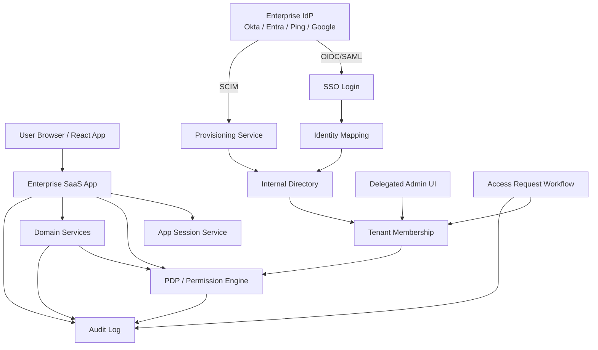
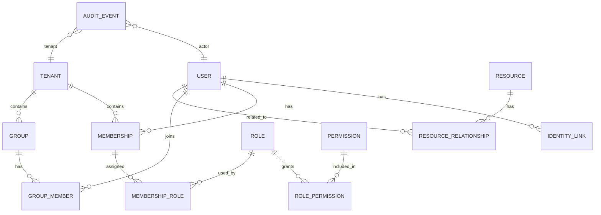
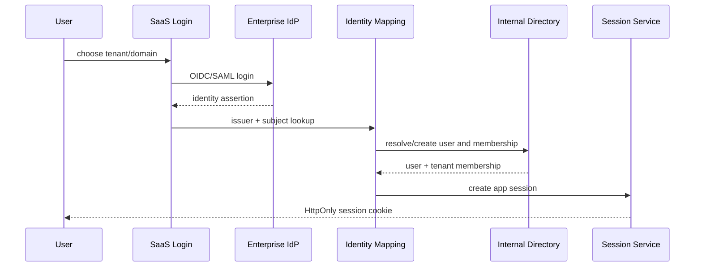
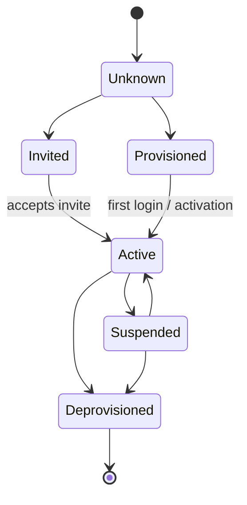
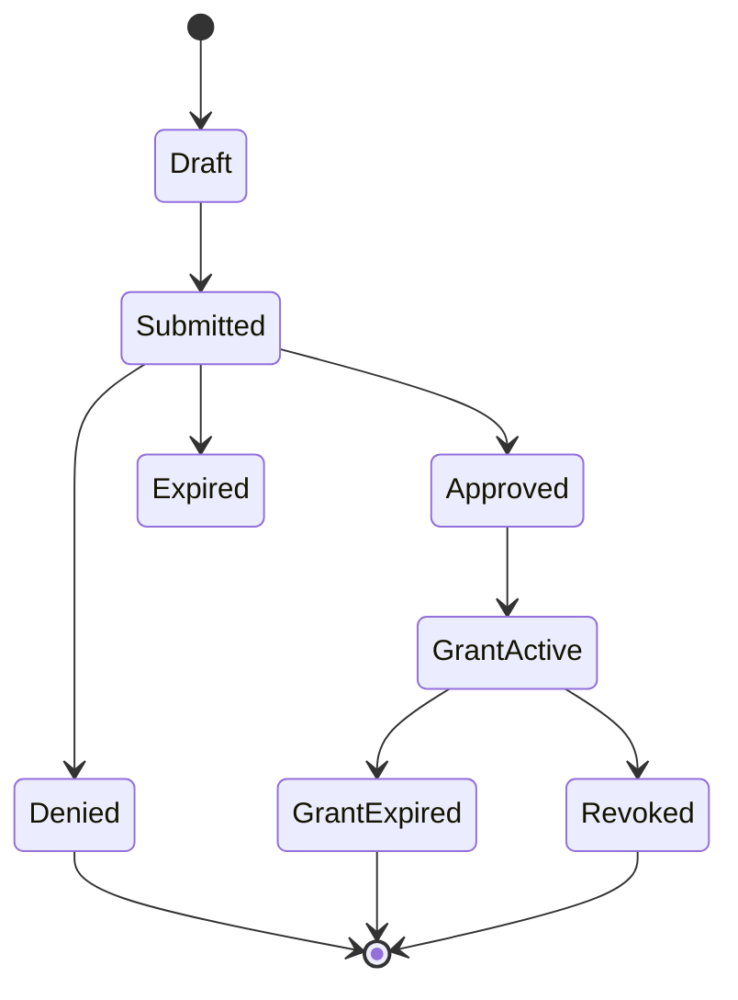
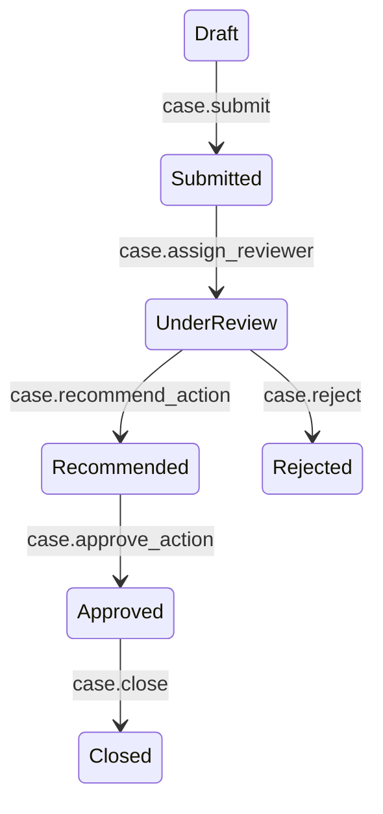
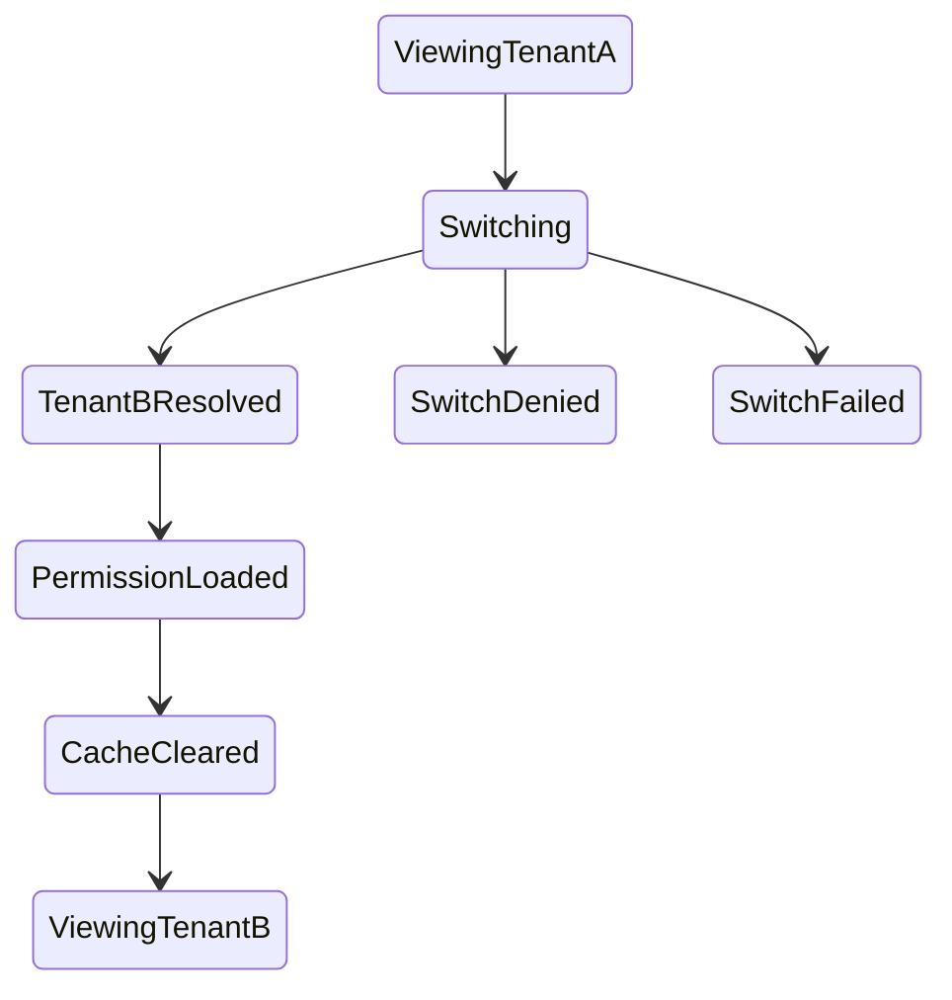

# Part 124 — Reference Architecture: Enterprise SaaS

Enterprise SaaS auth is not “add SSO”.

It is the coordination of:

- external identity providers;
- internal user/account records;
- tenant membership;
- roles, permissions, and policies;
- lifecycle provisioning and deprovisioning;
- delegated administration;
- access requests;
- auditability;
- break-glass operations;
- compliance requirements;
- React UI projection;
- server-side enforcement.

A top-tier enterprise SaaS auth architecture must answer this question on every request:

> Who is acting, under which tenant, with which assurance level, against which resource, under which policy version, and why is the decision defensible?

If the system cannot answer that, the UI may look professional but the authorization model is weak.

---

## 1. Architecture intent

The goal is to design enterprise SaaS auth where:

1. identity is federated but application authorization remains owned by the product;
2. users can belong to many tenants with different roles and relationships;
3. SSO/JIT/SCIM synchronize identity lifecycle without blindly trusting external groups;
4. RBAC, ABAC, ReBAC, and ACL are composed intentionally;
5. permissions are projected to React as safe capabilities, not raw IdP claims;
6. admin delegation is constrained and auditable;
7. access request workflows produce scoped, temporary, reviewable grants;
8. impersonation is visible, limited, and audited;
9. deprovisioning and permission revocation propagate predictably;
10. security incidents can be reconstructed from audit events.

Enterprise customers do not just buy features. They buy control, traceability, and assurance.

---

## 2. High-level architecture



The important split:

| Layer | Owns |
|---|---|
| Enterprise IdP | external authentication and enterprise identity assertions |
| SaaS identity mapping | linking external subject to internal user/account |
| Tenant membership service | who belongs to which tenant/org/workspace |
| Policy engine | authorization decisions |
| Domain services | business invariants and object ownership |
| React UI | safe projection and workflow UX |
| Audit system | defensible event record |

---

## 3. Core domain model

Enterprise SaaS auth needs precise nouns.



### User

The internal product-level person/account.

```ts
export type User = {
  id: string;
  primaryEmail?: string;
  displayName: string;
  status: 'active' | 'suspended' | 'deleted';
  createdAt: string;
};
```

A user is not the same as an IdP subject.

### Identity link

Mapping between external identity and internal user.

```ts
export type IdentityLink = {
  id: string;
  userId: string;
  providerType: 'oidc' | 'saml' | 'password' | 'passkey';
  issuer: string;
  externalSubject: string;
  emailAtLinkTime?: string;
  createdAt: string;
  lastLoginAt?: string;
};
```

Use `issuer + subject` as the stable identity tuple for OIDC-like providers.

Do not treat email as a permanent identity key.

### Tenant

The enterprise customer boundary.

```ts
export type Tenant = {
  id: string;
  slug: string;
  name: string;
  status: 'active' | 'suspended' | 'offboarding';
  plan: 'standard' | 'enterprise' | 'regulated';
  defaultAssuranceLevel: 'aal1' | 'aal2';
};
```

### Membership

The relation between user and tenant.

```ts
export type Membership = {
  id: string;
  tenantId: string;
  userId: string;
  status: 'active' | 'invited' | 'suspended' | 'deprovisioned';
  source: 'manual' | 'jit' | 'scim' | 'invitation' | 'support';
  createdAt: string;
  deprovisionedAt?: string;
  permissionEpoch: number;
};
```

Most enterprise auth bugs happen because code checks `user.status` but forgets `membership.status`.

### Role assignment

```ts
export type RoleAssignment = {
  membershipId: string;
  roleId: string;
  scope: {
    type: 'tenant' | 'project' | 'caseQueue' | 'resource';
    id: string;
  };
  assignedBy: string;
  assignedAt: string;
  expiresAt?: string;
  source: 'admin' | 'scim_group' | 'access_request' | 'system';
};
```

Roles without scope create role explosion.

Roles without expiry create stale privilege.

Roles without source destroy auditability.

---

## 4. Identity provider integration

Enterprise customers usually bring one of:

- OIDC;
- SAML 2.0;
- directory provisioning through SCIM;
- domain-based discovery;
- group/role assertions;
- MFA/conditional access policies;
- IdP-initiated login.

### Product rule

> Use IdP assertions to authenticate and bootstrap context. Do not let IdP group names become the final authorization model.

IdP groups are external inputs.

Application permissions are product decisions.

### Identity mapping flow



### Mapping invariants

- `issuer + subject` is the primary external identity tuple.
- Email can be verified and useful, but it can change.
- Domain ownership does not automatically prove user membership.
- JIT provisioning must obey tenant policy.
- Suspended/deprovisioned membership must block login even if IdP still authenticates user.
- Group mapping must be reviewed and versioned.

---

## 5. Organization discovery

Enterprise login often starts before the app knows which IdP to use.

Common strategies:

| Strategy | Example | Risk |
|---|---|---|
| email domain discovery | user enters `alice@corp.com` | domain collision, consumer aliases |
| tenant slug | `/login/acme` | enumeration risk |
| invite link | signed invite token | stale invite or wrong tenant |
| IdP-initiated | login starts at IdP | weak return path and tenant binding if careless |
| home realm discovery | external discovery service | complexity |

### Safe discovery object

```ts
export type LoginDiscoveryResult = {
  tenantId: string;
  tenantSlug: string;
  loginMethod: 'oidc' | 'saml' | 'passwordless' | 'invite_only';
  authorizationServerId?: string;
  displayName: string;
};
```

Do not reveal too much:

- do not disclose all configured IdPs for a domain;
- do not reveal whether a specific email is a member;
- do not return admin contact emails to anonymous users;
- rate limit discovery endpoints.

---

## 6. SSO configuration model

```ts
export type SsoConnection = {
  id: string;
  tenantId: string;
  type: 'oidc' | 'saml';
  status: 'draft' | 'enabled' | 'disabled' | 'error';
  issuer: string;
  clientId?: string;
  metadataUrl?: string;
  entityId?: string;
  acsUrl?: string;
  defaultRoleIds: string[];
  jitProvisioningEnabled: boolean;
  groupMappingEnabled: boolean;
  requiredAssuranceLevel?: 'aal1' | 'aal2' | 'aal3';
  createdBy: string;
  updatedAt: string;
};
```

### Admin UI design

The SSO admin page should include:

- setup status;
- metadata URLs;
- test connection button;
- last successful login;
- last failed login;
- certificate expiration warning for SAML;
- group mapping preview;
- JIT provisioning policy;
- fallback admin policy;
- audit history;
- emergency disable button.

### React state machine

```ts
type SsoSetupState =
  | { tag: 'draft' }
  | { tag: 'testing' }
  | { tag: 'test_failed'; reason: string }
  | { tag: 'ready_to_enable' }
  | { tag: 'enabled' }
  | { tag: 'disabled' };
```

Do not let a user enable SSO without a recovery/fallback plan.

---

## 7. Provisioning lifecycle

Enterprise SaaS cannot rely only on login-time JIT provisioning.

It needs lifecycle synchronization.

### Provisioning sources

| Source | Creates user | Updates membership | Deprovisions | Notes |
|---|---:|---:|---:|---|
| manual admin | yes | yes | yes | small tenants |
| invite | yes | yes | limited | user-driven activation |
| JIT SSO | yes | yes | no/limited | happens only on login |
| SCIM | yes | yes | yes | enterprise lifecycle |
| support override | controlled | controlled | controlled | high audit requirement |

### User lifecycle state machine



### Deprovisioning invariant

When a membership is deprovisioned:

1. mark membership inactive;
2. revoke active sessions for that tenant or user depending policy;
3. invalidate permission epoch;
4. remove or disable role assignments;
5. revoke pending access requests;
6. stop background jobs owned by membership if needed;
7. emit audit event;
8. prevent login reactivation unless provisioning source says active again.

Do not wait for user logout.

---

## 8. Permission model: hybrid by design

Enterprise SaaS usually needs a hybrid model:

| Model | Best for | Weakness |
|---|---|---|
| RBAC | coarse job functions | role explosion |
| ABAC | contextual rules | difficult UI projection |
| ACL | per-object sharing | hard to manage globally |
| ReBAC | relationship graph/inheritance | complex checks/listing |
| workflow state rules | regulated lifecycle | must be domain-specific |

### Recommended composition

```txt
Tenant membership establishes base access.
Scoped roles provide broad capabilities.
Resource relationships grant object-specific access.
Attributes constrain decisions by context.
Workflow state controls allowed transitions.
Step-up enforces assurance for sensitive actions.
```

### Decision function

```ts
export type EnterpriseAuthzInput = {
  subject: {
    userId: string;
    membershipId: string;
    tenantId: string;
    actorUserId?: string;
    assuranceLevel: 'aal1' | 'aal2' | 'aal3';
  };
  action: string;
  resource: {
    type: string;
    id: string;
    tenantId: string;
    ownerUserId?: string;
    ownerTeamId?: string;
    state?: string;
    sensitivity?: 'normal' | 'restricted' | 'regulated';
  };
  context: {
    requestTime: string;
    sourceIpRisk?: 'low' | 'medium' | 'high';
    expectedVersion?: number;
    purpose?: string;
  };
};
```

### Decision output

```ts
export type EnterpriseDecision =
  | {
      effect: 'allow';
      obligations?: Array<'audit' | 'mask_fields' | 'require_justification'>;
      decisionId: string;
      policyVersion: string;
    }
  | {
      effect: 'deny';
      reason: 'no_membership' | 'missing_permission' | 'wrong_tenant' | 'state_forbidden' | 'sod_violation';
      decisionId: string;
      policyVersion: string;
    }
  | {
      effect: 'step_up_required';
      requiredAssuranceLevel: 'aal2' | 'aal3';
      decisionId: string;
      policyVersion: string;
    };
```

---

## 9. Frontend permission projection

React should receive permission projection shaped around product actions.

Bad:

```json
{
  "roles": ["ADMIN", "CASE_MANAGER"],
  "groups": ["okta-prod-app-admins"]
}
```

Better:

```json
{
  "tenantId": "ten_acme",
  "permissionEpoch": 42,
  "policyVersion": "2026-07-08.3",
  "capabilities": {
    "cases": {
      "create": true,
      "export": false,
      "administerQueues": false
    },
    "users": {
      "invite": true,
      "suspend": false
    }
  },
  "denialReasons": {
    "cases.export": "step_up_required"
  }
}
```

### Projection endpoint

```ts
GET /api/session
GET /api/permissions?tenantId=...
GET /api/resources/:id/allowed-actions
```

Use different projections for:

- global navigation;
- tenant shell;
- resource detail;
- admin console;
- form field modes;
- bulk operation eligibility.

Do not send the whole permission graph to the browser.

---

## 10. Delegated administration

Enterprise tenants want their own admins.

But tenant admins should not become global superusers.

### Delegated admin invariants

- A tenant admin can only administer their tenant.
- A tenant admin cannot grant permissions they do not have authority to grant.
- A tenant admin cannot self-escalate into stronger admin permissions without separate approval.
- Sensitive grants require step-up and audit reason.
- High-risk grants can require approval from another admin.
- Grants should support expiry.
- All changes need diff-style audit.

### Grant command

```ts
export type GrantRoleCommand = {
  actorUserId: string;
  tenantId: string;
  targetUserId: string;
  roleId: string;
  scope: RoleScope;
  expiresAt?: string;
  justification: string;
  expectedPolicyVersion: string;
};
```

### Server-side check

```ts
await policy.requireAllowed({
  subject: actorSubject,
  action: 'tenant.role.assign',
  resource: {
    type: 'role',
    id: command.roleId,
    tenantId: command.tenantId,
    scope: command.scope,
  },
  context: {
    targetUserId: command.targetUserId,
    justification: command.justification,
    assuranceLevel: session.assuranceLevel,
  },
});
```

The UI can show a role dropdown. The server decides whether assigning that role is allowed.

---

## 11. Access request workflow

Enterprise SaaS often needs “request access” instead of dead-end `403`.

### Request model

```ts
export type AccessRequest = {
  id: string;
  tenantId: string;
  requesterUserId: string;
  target: {
    type: 'role' | 'resource' | 'action' | 'field' | 'export';
    id: string;
    action?: string;
  };
  reason: string;
  status: 'draft' | 'submitted' | 'approved' | 'denied' | 'expired' | 'revoked';
  requestedDuration?: string;
  approverUserIds: string[];
  decidedBy?: string;
  decidedAt?: string;
  grantId?: string;
};
```

### Workflow



### Separation of duties

Do not allow the requester to approve their own access request unless policy explicitly allows low-risk self-service.

For high-risk permissions:

- require different approver;
- require step-up;
- require justification;
- require expiry;
- notify security/admins;
- audit decision and grant.

---

## 12. Impersonation and support access

Support impersonation is dangerous because it intentionally crosses identity boundaries.

### Correct identity model

```ts
export type ActorContext = {
  actorUserId: string;   // support/admin performing action
  subjectUserId: string; // user being viewed/impersonated
  tenantId: string;
  mode: 'support_view' | 'impersonation';
  reason: string;
  ticketId?: string;
  expiresAt: string;
};
```

Never overwrite `userId` and forget the actor.

### UI requirements

- persistent banner;
- different visual mode;
- visible target user;
- visible actor/support identity where appropriate;
- clear exit button;
- disabled sensitive actions by default;
- reason/ticket display;
- audit event stream;
- timeout indicator.

### Server requirements

- explicit impersonation session/context;
- support allowlist of actions;
- deny high-risk actions unless separately permitted;
- mask sensitive fields if policy says so;
- log both actor and subject;
- expire impersonation automatically;
- notify tenant/admins if policy requires.

---

## 13. Multi-tenant data isolation

Enterprise SaaS authorization fails catastrophically when tenant scoping is inconsistent.

### Data access invariant

Every tenant-scoped table and query needs tenant scoping.

Bad:

```ts
await db.case.findUnique({ where: { id: caseId } });
```

Better:

```ts
await db.case.findFirst({
  where: {
    id: caseId,
    tenantId: subject.tenantId,
  },
});
```

Better still: enforce through repository/service boundary.

```ts
await caseRepo.getCaseForSubject({
  tenantId: subject.tenantId,
  caseId,
  subject,
});
```

### React cache invariant

Cache keys must include tenant context.

```ts
['tenant', tenantId, 'case', caseId, 'permissionEpoch', permissionEpoch]
```

Bad:

```ts
['case', caseId]
```

This can leak data across tenant switch or impersonation.

---

## 14. Group mapping

Enterprise customers often want IdP groups mapped to product roles.

### Mapping model

```ts
export type GroupRoleMapping = {
  id: string;
  tenantId: string;
  externalGroupId: string;
  externalGroupDisplayName: string;
  roleId: string;
  scope: RoleScope;
  status: 'active' | 'disabled';
  createdBy: string;
  updatedAt: string;
};
```

### Risks

- group names change;
- group ids differ by provider;
- nested groups may not be emitted consistently;
- IdP token group claims can be truncated;
- relying only on login-time groups makes revocation stale;
- SCIM and SSO assertions can conflict;
- group mapping can grant too much by accident.

### UI pattern

The group mapping UI should show:

- external group id and display name;
- mapped product role;
- scope;
- last sync time;
- number of affected users;
- preview diff;
- warnings for high-risk roles;
- approval requirement;
- audit history.

---

## 15. Entitlements vs permissions

Enterprise SaaS often has both:

| Concept | Meaning | Example |
|---|---|---|
| entitlement | what the customer purchased/enabled | “Advanced Audit Module” |
| permission | what a user may do | `audit.view` |
| feature flag | rollout/control switch | enable new audit UI for beta |
| license limit | quantity/usage bound | 50 seats |

Do not conflate them.

A user can have permission for a feature that the tenant is not entitled to.

A tenant can be entitled to a feature but the user lacks permission.

A feature flag can expose UI, but it must not override authorization.

### Effective capability

```ts
effectiveAllow = tenantEntitled && featureEnabled && permissionAllowed && resourceAllowed;
```

Each part has a different owner and audit meaning.

---

## 16. Audit architecture

Enterprise SaaS audit events should be structured and queryable.

```ts
export type AuditEvent = {
  id: string;
  occurredAt: string;
  tenantId?: string;
  actor: {
    type: 'user' | 'system' | 'support';
    id: string;
  };
  subject?: {
    type: 'user' | 'membership' | 'resource';
    id: string;
  };
  action: string;
  resource?: {
    type: string;
    id: string;
  };
  outcome: 'success' | 'failure' | 'denied';
  reasonCode?: string;
  correlationId: string;
  ipHash?: string;
  userAgentHash?: string;
  metadata?: Record<string, unknown>;
};
```

### Audit principles

- record decision-relevant metadata;
- avoid raw secrets and tokens;
- avoid unnecessary PII;
- keep actor and subject separate;
- include tenant id whenever applicable;
- include policy version/decision id for authz events;
- preserve enough detail to reconstruct incidents;
- protect audit logs from tenant admins if they include sensitive security metadata.

---

## 17. Compliance-driven UI features

Enterprise customers often ask for:

- audit log viewer;
- exportable audit trail;
- user access review;
- role assignment history;
- session/device list;
- SSO configuration history;
- access request history;
- admin activity log;
- data export controls;
- retention policy configuration.

### React UI architecture

These screens are not ordinary CRUD.

They need:

- strict permission checks;
- field-level redaction;
- high-performance filtering;
- immutable event display;
- export authorization;
- step-up for sensitive exports;
- correlation id drill-down;
- no client-side-only filtering for sensitive data;
- careful pagination and query scoping.

---

## 18. Regulated workflow authorization

In complex case management or enforcement systems, permissions depend on workflow state.

Example:

```ts
canCloseCase =
  membership.active &&
  hasPermission('case.close') &&
  case.tenantId === subject.tenantId &&
  case.state in ['review_ready', 'pending_finalization'] &&
  case.assignedTeamId in subject.teamIds &&
  subject.userId !== case.createdByUserId &&
  assuranceLevel >= 'aal2';
```

This cannot be represented by role alone.

### State transition authorization



Each transition needs:

- action permission;
- resource state check;
- actor eligibility;
- separation of duties;
- tenant boundary;
- version check;
- audit event;
- optional step-up.

React should display allowed transitions from the server, not recalculate the full policy graph from raw roles.

---

## 19. API contract for enterprise auth

A realistic enterprise SaaS app often has these auth-related endpoints:

```txt
GET  /api/session
GET  /api/tenants
POST /api/tenants/switch
GET  /api/permissions
GET  /api/resources/:id/allowed-actions
POST /api/auth/logout
GET  /api/sso/connections
POST /api/sso/connections/:id/test
POST /api/access-requests
GET  /api/access-requests/inbox
POST /api/access-requests/:id/approve
POST /api/access-requests/:id/deny
GET  /api/admin/users
POST /api/admin/users/:id/suspend
POST /api/admin/roles/assign
GET  /api/audit/events
```

### Contract invariant

Every endpoint must answer:

- who is actor?
- what tenant context applies?
- what resource is touched?
- what action is attempted?
- what policy decision is required?
- what audit event is emitted?
- what cache behavior applies?

---

## 20. React shell architecture

A strong enterprise React shell is context-rich but not authority-rich.

```tsx
<EnterpriseAuthProvider session={sessionProjection}>
  <TenantProvider tenant={activeTenantProjection}>
    <PermissionProvider snapshot={permissionProjection}>
      <AuditContextProvider correlationId={correlationId}>
        <EnterpriseShell>
          {children}
        </EnterpriseShell>
      </AuditContextProvider>
    </PermissionProvider>
  </TenantProvider>
</EnterpriseAuthProvider>
```

### Shell responsibilities

- tenant switcher;
- user menu;
- impersonation banner;
- access request notifications;
- permission-aware navigation;
- global denial handling;
- session expiry warning;
- SSO required notice;
- audit-safe telemetry correlation;
- query cache invalidation on tenant/session/permission epoch changes.

### Shell non-responsibilities

- final authorization;
- policy evaluation with sensitive data;
- token refresh if using BFF;
- group mapping authority;
- lifecycle provisioning;
- audit-critical decisions.

---

## 21. Tenant switch lifecycle

Tenant switch is not a dropdown state update.

It is an auth context transition.



### Switch steps

1. user requests switch;
2. server validates membership;
3. session active tenant changes or new tenant session context is issued;
4. permission epoch/projection changes;
5. client clears tenant-scoped caches;
6. route redirects to safe landing page;
7. audit event is emitted.

Do not keep resource detail pages open across tenant switch.

---

## 22. Threat model highlights

Enterprise SaaS threat model includes:

| Threat | Defense |
|---|---|
| cross-tenant IDOR | tenant-scoped queries + object authorization |
| stale deprovisioned user | server-side membership check + session revocation |
| IdP group overgrant | mapping review + preview + scoped roles |
| admin self-escalation | separation of duties + approval |
| support abuse | impersonation constraints + audit + expiry |
| hidden UI bypass | server-side authorization per request |
| stale permission cache | permission epoch + typed denial recovery |
| invite link abuse | signed token + expiry + tenant binding |
| SSO misconfig lockout | fallback admin policy + test mode |
| audit tampering | append-only/event integrity controls |
| token leakage | server-side token vault + HttpOnly session cookie |
| tenant switch cache leak | tenant-scoped cache keys + clear on switch |

---

## 23. Operational controls

Enterprise auth needs operations, not just code.

### Dashboards

Track:

- login success/failure by tenant and IdP;
- SSO callback errors;
- JIT provisioning failures;
- SCIM sync errors;
- deprovision latency;
- active sessions by tenant;
- `401`/`403` rates;
- permission denied by action/resource;
- access request backlog;
- high-risk grants;
- impersonation sessions;
- audit ingestion lag;
- cross-tenant denial anomalies.

### Alerts

Alert on:

- sudden login failure spike for one tenant;
- SAML certificate near expiration;
- SCIM deprovision failures;
- abnormal permission grant volume;
- impersonation outside business hours;
- tenant mismatch attempts spike;
- audit pipeline failure;
- policy engine unavailable;
- refresh storm.

---

## 24. Enterprise SaaS rollout plan

### Phase A — Baseline

- internal user model;
- tenant membership;
- app session cookie;
- `/session` projection;
- permission vocabulary;
- route/API deny-by-default;
- audit log foundation.

### Phase B — SSO

- tenant-specific OIDC/SAML;
- organization discovery;
- identity link;
- JIT provisioning;
- SSO admin UI;
- fallback admin strategy.

### Phase C — Authorization maturity

- scoped RBAC;
- object-level grants;
- permission projection;
- access request workflow;
- admin role console;
- permission epoch invalidation.

### Phase D — Enterprise operations

- SCIM provisioning;
- deprovisioning runbook;
- access review;
- audit viewer/export;
- impersonation controls;
- policy simulation;
- SLO dashboards.

### Phase E — Regulated readiness

- separation of duties;
- step-up auth;
- immutable audit controls;
- high-risk workflow approvals;
- incident response drills;
- compliance evidence export.

---

## 25. Production checklist

### Identity

- [ ] External identities are mapped by stable issuer+subject, not email only.
- [ ] Identity links are tenant-aware where needed.
- [ ] Account linking requires explicit verification and audit.
- [ ] Suspended/deprovisioned users cannot reactivate accidentally.

### Tenant

- [ ] Every request has explicit tenant context or is explicitly tenantless.
- [ ] Tenant switch validates membership server-side.
- [ ] Tenant-scoped caches include tenant id and permission epoch.
- [ ] Cross-tenant access attempts are observable.

### SSO

- [ ] SSO config has draft/test/enabled lifecycle.
- [ ] Callback validates state/nonce/issuer/audience.
- [ ] JIT provisioning obeys tenant policy.
- [ ] Group mapping has preview, approval, audit, and rollback.
- [ ] Fallback admin plan exists.

### Authorization

- [ ] Roles are scoped.
- [ ] Permissions are action/resource oriented.
- [ ] Object-level authorization is enforced per request.
- [ ] Workflow-state authorization is domain-enforced.
- [ ] Permission projection is not final authority.
- [ ] Permission changes invalidate sessions/caches as needed.

### Administration

- [ ] Delegated admins cannot self-escalate.
- [ ] High-risk grants require step-up and possibly approval.
- [ ] Grants can expire.
- [ ] Admin changes produce diff-style audit.

### Access request

- [ ] Requests are scoped and justified.
- [ ] Approver eligibility is enforced server-side.
- [ ] Temporary grants expire automatically.
- [ ] Denied/expired/revoked states are explicit.

### Impersonation

- [ ] Actor and subject are distinct everywhere.
- [ ] Banner is persistent.
- [ ] Sensitive actions are blocked or separately approved.
- [ ] Impersonation expires.
- [ ] Every action is audited with actor and subject.

### Audit and operations

- [ ] Audit events have actor, subject, tenant, action, resource, outcome, correlation id.
- [ ] Logs do not contain tokens or unnecessary PII.
- [ ] Auth dashboards exist.
- [ ] SSO/SCIM/policy/audit failure runbooks exist.
- [ ] Incident reconstruction is possible.

---

## 26. Common enterprise SaaS anti-patterns

### Anti-pattern: IdP groups as app permissions

```ts
if (claims.groups.includes('Okta-Prod-Admin')) allowAdmin();
```

Why it fails:

- group names are external implementation detail;
- group membership can be stale;
- group claims may be incomplete;
- product authorization becomes unreviewable;
- tenant scope may be missing.

Better:

```ts
const permissions = await permissionProjection.forMembership(membershipId);
can(permissions, 'tenant.user.invite');
```

### Anti-pattern: global admin role

A single `ADMIN` role eventually means:

- tenant admin;
- billing admin;
- security admin;
- support admin;
- super admin;
- workflow approver;
- export permission;
- policy manager.

Split authority by action and scope.

### Anti-pattern: tenant switch only changes React state

Tenant switch must update server-side context, invalidate permission projection, clear caches, and emit audit.

### Anti-pattern: deprovision on next login

Deprovisioning must revoke current access, not wait for next authentication.

### Anti-pattern: audit as client telemetry

Client telemetry is useful, but audit-critical events must be emitted server-side.

---

## 27. Reference architecture summary

Enterprise SaaS auth is strong when the architecture makes these separations explicit:

1. **External identity authenticates.** Product authorization decides.
2. **User is not membership.** Membership is tenant-scoped and lifecycle-sensitive.
3. **Roles are not enough.** Enterprise auth composes RBAC, ABAC, ACL, ReBAC, and workflow rules.
4. **React receives projection.** The server owns policy and enforcement.
5. **Tenant context is explicit.** Every cache, query, route, and audit event respects it.
6. **Admin power is constrained.** Delegation, step-up, approval, and audit prevent silent escalation.
7. **Access request is lifecycle.** Request, approval, grant, expiry, revocation, audit.
8. **Impersonation separates actor and subject.** Always.
9. **Deprovisioning is active.** Sessions and permissions are invalidated.
10. **Audit is product infrastructure.** Not a logging afterthought.

Enterprise auth is not just security. It is part of the product contract with serious customers.

The React engineer’s job is not to reimplement all authorization logic in the browser. It is to expose the right controls, explanations, and recovery workflows while respecting server-side authority.

---

## 28. What comes next

Part 125 applies this architecture to a more demanding domain:

**regulated case management**.

That means:

- enforcement lifecycle states;
- escalation logic;
- state-based authorization;
- separation of duties;
- case assignment;
- evidence access;
- audit defensibility;
- exception handling;
- workflow transition authorization;
- UI design for regulated decisions.
