# Part 125 — Reference Architecture: Regulated Case Management

A regulated case management system is not a CRUD app with roles.

It is a workflow engine where every read, write, transition, assignment, disclosure, and export may have legal, operational, or evidentiary consequences.

For React engineers, the trap is to treat authorization as UI convenience:

```tsx
{user.role === "supervisor" && <ApproveButton />}
```

That line may be acceptable in a toy admin screen.

It is not acceptable in a regulated case platform.

In a regulated system, access control must answer more precise questions:

- Who is the actor?
- Which legal identity or delegated authority are they acting under?
- Which case are they touching?
- Which case state is it in?
- Which action is being attempted?
- Which evidence, subject, organization, jurisdiction, disclosure restriction, conflict rule, and workflow deadline applies?
- Is the actor assigned, supervising, reviewing, auditing, or temporarily delegated?
- Is the action normal, exceptional, emergency, or break-glass?
- What should be recorded so the decision remains defensible later?

The frontend cannot enforce all of this.

But the frontend must model it accurately enough to avoid misleading users, leaking information, and generating unsafe workflow intents.

This part gives a production-grade reference architecture for React applications used in regulated case management, enforcement lifecycle modelling, investigations, complaints, claims, inspections, supervision, appeals, compliance review, or high-stakes workflow systems.

---

## 1. Core mental model

A regulated case system is a coordination point between:

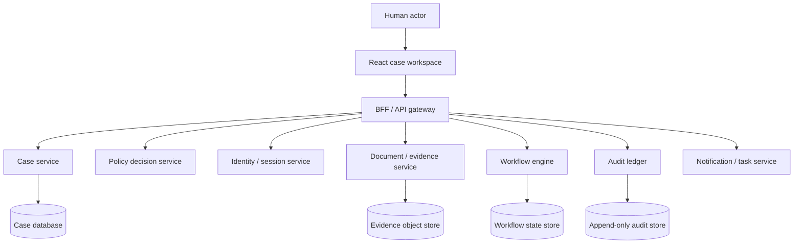

The React app is the operator cockpit.

It should help users understand:

- what they are allowed to see;
- what they are allowed to do;
- why an action is blocked;
- which route to take next;
- which escalation path exists;
- which action will be audited;
- which action requires step-up authentication or approval.

But the React app must never be the final authority.

The enforcement boundary is server-side, ideally close to the resource and transition logic.

---

## 2. What makes regulated case management different?

Normal SaaS authorization often asks:

> Can user X edit project Y?

Regulated case management asks:

> Can actor X, acting under role R in organization O, while assigned to queue Q, at workflow state S, perform action A on case C, whose subject belongs to jurisdiction J, where case C has confidentiality marker M, evidence lock L, conflict flag F, legal hold H, and pending review constraint P?

That is not role-based authorization alone.

It is a combination of:

| Concern | Example |
|---|---|
| Identity | The logged-in user is Jane Doe. |
| Authority | Jane acts as investigator, supervisor, legal reviewer, auditor, or delegate. |
| Assignment | Jane is assigned to this case, queue, region, or unit. |
| State | The case is in intake, triage, investigation, enforcement review, appeal, closed. |
| Resource | The object is a case, allegation, evidence document, note, decision, sanction, disclosure. |
| Context | Time, emergency mode, jurisdiction, conflict-of-interest, confidentiality marker. |
| Obligation | Redact, log, require reason, require supervisor approval, require step-up auth. |
| Audit | Record who did what, when, why, and under which authority. |

This is why a regulated case platform usually needs a hybrid authorization model:

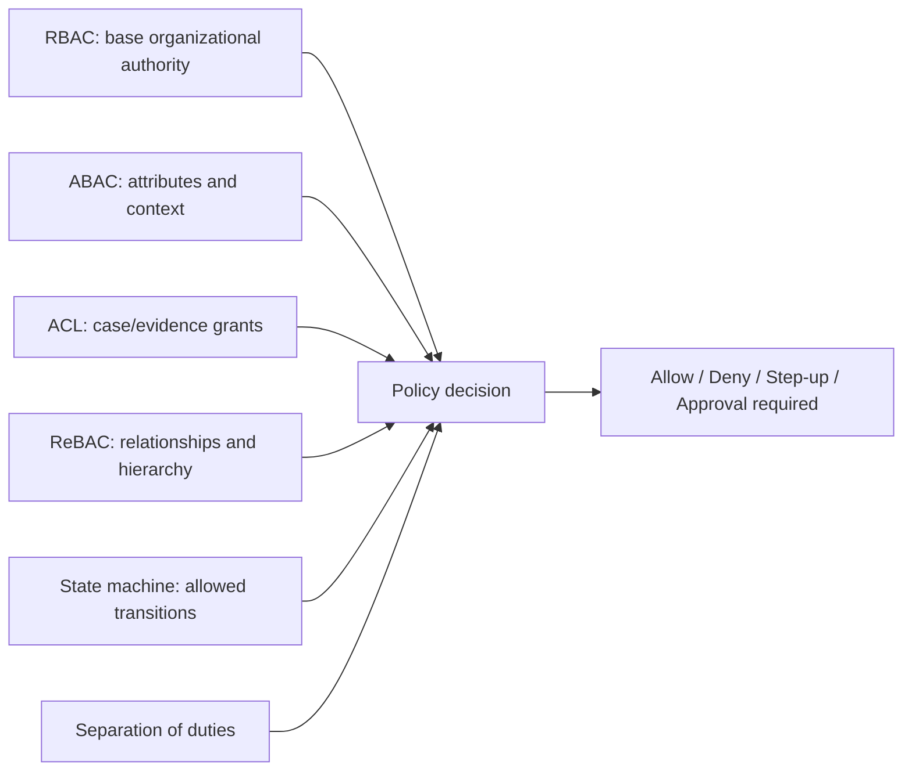

---

## 3. Non-negotiable invariants

A regulated case platform should be built around explicit invariants.

These are not coding preferences.

They are system properties.

### 3.1 Authorization invariants

| Invariant | Meaning |
|---|---|
| Deny by default | Unknown permission state must block sensitive action. |
| Server decides | React can hide/explain; API must enforce. |
| Case state matters | Workflow state is part of authorization. |
| Assignment matters | Case access is not equivalent to organization membership. |
| Resource ownership is insufficient | The system may restrict actors even if they created a record. |
| Permission is contextual | Same actor may be allowed in one case and denied in another. |
| No stale privilege | Role, assignment, state, or confidentiality change invalidates permissions. |
| Reason is required for exceptional access | Break-glass, override, reassignment, and reopening need explanation. |
| Every sensitive decision is auditable | The system must explain access decisions after the fact. |

### 3.2 React invariants

| Invariant | React implication |
|---|---|
| Do not render sensitive data before authorization resolves | Use loader/server projection and deny-by-default skeleton. |
| Do not infer permission from route visibility | Direct URL access must go through loader/action/API checks. |
| Do not trust cached case data after tenant/role/assignment change | Include auth epoch, tenant id, and permission version in query keys. |
| Do not treat hidden button as protection | Mutations must return typed 403 or approval-required response. |
| Do not leak restricted existence through UI copy | Use safe denial messages and resource-specific disclosure policy. |

---

## 4. Domain model

A simplified regulated case model may look like this:

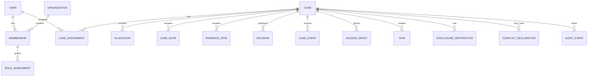

Important distinction:

- `USER` is identity.
- `MEMBERSHIP` is organizational participation.
- `ROLE_ASSIGNMENT` is coarse authority.
- `CASE_ASSIGNMENT` is case-level work authority.
- `ACCESS_GRANT` is explicit case/object access.
- `DISCLOSURE_RESTRICTION` constrains visibility.
- `CONFLICT_DECLARATION` may deny otherwise valid access.
- `CASE_EVENT` is workflow history.
- `AUDIT_EVENT` is security/evidentiary history.

Do not collapse these into a single `role` string.

---

## 5. Case lifecycle state machine

Regulated authorization is often state-dependent.

Example:

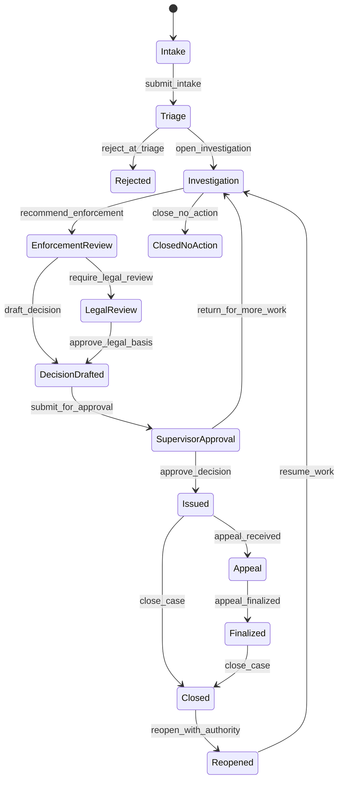

Each transition must have:

- source state;
- target state;
- required action;
- required actor authority;
- required assignment or relationship;
- required reason/comment;
- required evidence or decision artifact;
- audit event type;
- side effects;
- notification requirements;
- revocation/invalidation effects.

A workflow transition is not just a database update.

It is a controlled authorization decision.

---

## 6. State-based permission table

A simple example:

| Action | Intake | Triage | Investigation | Enforcement Review | Legal Review | Issued | Closed |
|---|---:|---:|---:|---:|---:|---:|---:|
| `case.read` | assigned | queue | assigned/supervisor | assigned/supervisor/legal | legal/supervisor | restricted | restricted |
| `case.update_summary` | intake officer | triage officer | investigator | denied | denied | denied | denied |
| `case.add_evidence` | denied | denied | investigator | denied | denied | denied | denied |
| `case.recommend_enforcement` | denied | denied | lead investigator | denied | denied | denied | denied |
| `case.approve_decision` | denied | denied | denied | supervisor | denied | denied | denied |
| `case.legal_approve` | denied | denied | denied | denied | legal reviewer | denied | denied |
| `case.reopen` | denied | denied | denied | denied | denied | delegated authority | delegated authority |
| `case.export` | denied | restricted | restricted | restricted | restricted | restricted | restricted |

This table is still incomplete.

Real systems also include:

- case sensitivity;
- subject category;
- jurisdiction;
- team/unit;
- conflict declarations;
- evidence lock;
- appeal window;
- legal hold;
- retention policy;
- disclosure restrictions;
- emergency override.

That is why the real policy engine should not be hardcoded into React components.

React should consume a projection.

---

## 7. Authorization decision contract

A regulated frontend needs more than boolean permission.

Use a decision object:

```ts
export type DecisionEffect =
  | "allow"
  | "deny"
  | "requires_step_up"
  | "requires_approval"
  | "requires_assignment"
  | "requires_reason"
  | "conflict_blocked"
  | "legal_hold_blocked";

export type DecisionReasonCode =
  | "not_authenticated"
  | "not_assigned"
  | "wrong_case_state"
  | "missing_role"
  | "conflict_of_interest"
  | "confidential_case"
  | "legal_hold"
  | "separation_of_duties"
  | "stale_permission_snapshot"
  | "step_up_required"
  | "approval_required";

export interface AuthzDecision {
  effect: DecisionEffect;
  action: string;
  resourceType: string;
  resourceId?: string;
  reasonCode?: DecisionReasonCode;
  publicMessage: string;
  correlationId: string;
  permissionVersion: string;
  obligations?: Array<
    | { type: "collect_reason"; minLength: number }
    | { type: "redact_fields"; fields: string[] }
    | { type: "require_step_up"; acr: string }
    | { type: "require_approval"; approverGroup: string }
    | { type: "audit"; eventType: string }
  >;
}
```

A boolean cannot express:

- user can proceed after MFA;
- user can proceed after supervisor approval;
- user can read summary but not evidence;
- user can approve only if they were not the investigator;
- user can export only with redaction;
- user can break glass only with reason and audit marker.

The frontend needs these distinctions for safe UX.

The server needs these distinctions for defensible enforcement.

---

## 8. Resource-specific projection

A regulated case detail endpoint should not return raw everything.

It should return a safe projection:

```ts
export interface CaseWorkspaceProjection {
  case: {
    id: string;
    referenceNumber: string;
    state: CaseState;
    title: string;
    sensitivity: "normal" | "restricted" | "highly_restricted";
    assignedTeam?: string;
    assignedTo?: string;
    version: number;
  };

  visibleSections: {
    overview: boolean;
    parties: boolean;
    allegations: boolean;
    evidence: boolean;
    notes: boolean;
    decision: boolean;
    auditTrail: boolean;
  };

  fieldModes: Record<string, "hidden" | "masked" | "readonly" | "editable">;

  allowedActions: Record<string, AuthzDecision>;

  workflow: {
    availableTransitions: Array<{
      action: string;
      label: string;
      decision: AuthzDecision;
      requiredFields?: string[];
    }>;
  };

  auditContext: {
    viewEventId: string;
    correlationId: string;
  };

  permissionVersion: string;
  authEpoch: string;
}
```

This projection is more useful than forcing React to reconstruct policy from raw role/claim data.

React should render the workspace from the projection.

The API still validates every mutation.

---

## 9. Case workspace architecture

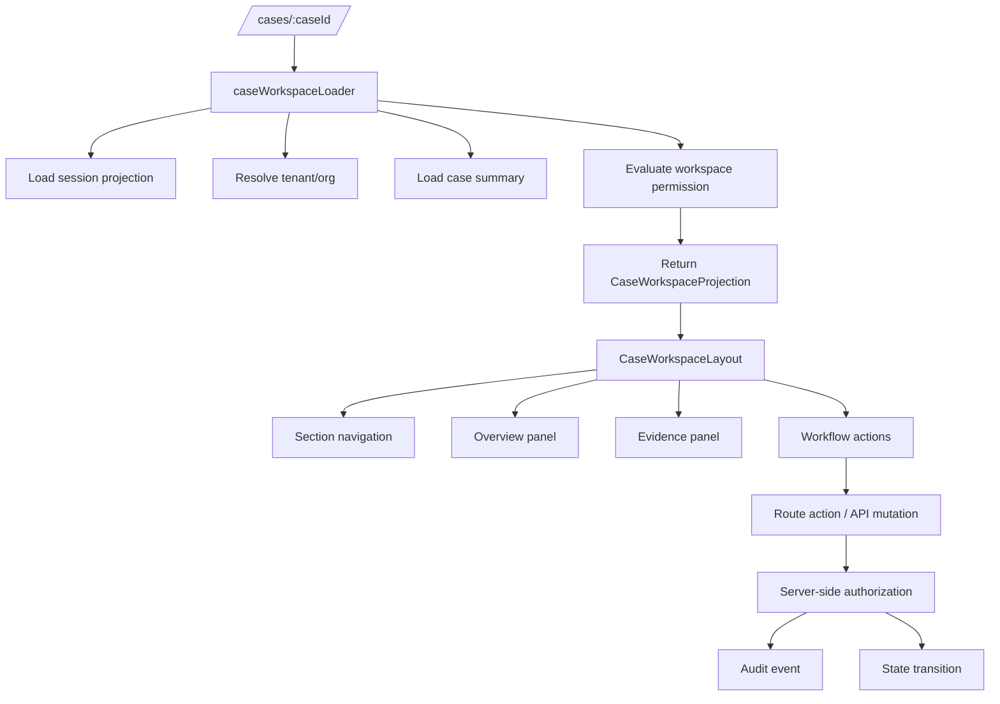

The loader gates the initial projection.

The action gates every mutation.

The server owns the final decision.

---

## 10. React Router loader example

```ts
import { redirect } from "react-router";

export async function caseWorkspaceLoader({ params, request, context }) {
  const session = await context.auth.requireSession(request);
  const tenantId = await context.tenant.resolve(request, session);

  const caseId = params.caseId;
  if (!caseId) throw new Response("Missing case id", { status: 400 });

  const projection = await context.caseApi.getWorkspaceProjection({
    sessionId: session.id,
    actorId: session.actorId,
    tenantId,
    caseId,
    requestId: context.requestId,
  });

  if (projection.effect === "not_authenticated") {
    throw redirect(`/login?returnTo=${encodeURIComponent(new URL(request.url).pathname)}`);
  }

  if (projection.effect === "deny") {
    throw new Response(JSON.stringify(projection.problem), {
      status: projection.disclosureMode === "hide_existence" ? 404 : 403,
      headers: {
        "Content-Type": "application/problem+json",
        "Cache-Control": "no-store",
      },
    });
  }

  return projection;
}
```

Notice what is *not* happening:

- no `if user.role === "admin"` in the component;
- no assumption that route access implies action access;
- no raw full case object before authorization;
- no browser-side policy reconstruction from JWT claims.

---

## 11. Action-level transition enforcement

Workflow transition actions should use a server-side command endpoint.

```ts
export interface TransitionCaseCommand {
  caseId: string;
  expectedCaseVersion: number;
  action:
    | "submit_intake"
    | "open_investigation"
    | "recommend_enforcement"
    | "submit_for_approval"
    | "approve_decision"
    | "return_for_more_work"
    | "reopen";
  reason?: string;
  evidenceIds?: string[];
  clientMutationId: string;
}
```

Server validation order:

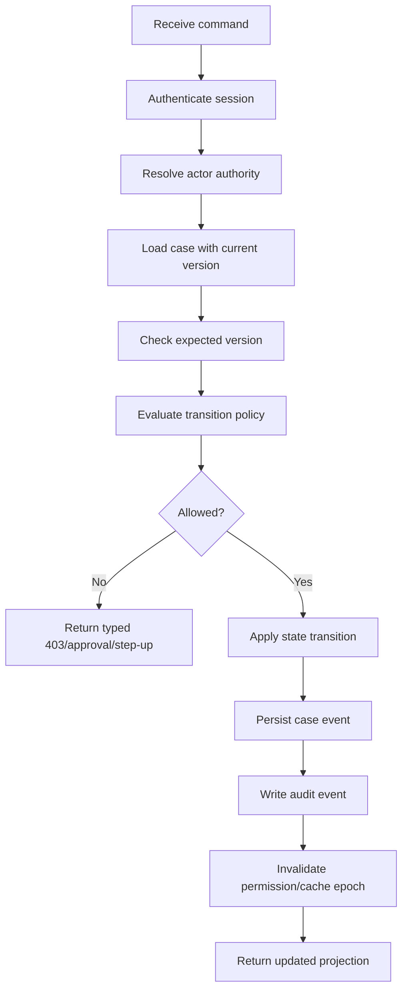

React may submit the command.

React does not decide whether the command is legal.

---

## 12. Versioning and stale decisions

Case management systems often have concurrent work.

Two users may open the same case.

One user may change case state while another still sees old actions.

Use optimistic concurrency:

```ts
export interface CaseMutationRequest {
  caseId: string;
  expectedCaseVersion: number;
  expectedPermissionVersion: string;
  command: TransitionCaseCommand;
}
```

Server responses:

| Condition | Response |
|---|---|
| Case version changed | `409 case_version_conflict` |
| Permission version changed | `403 stale_permission_snapshot` or `409 permission_snapshot_stale` |
| Session expired | `401 session_expired` |
| User still authenticated but no longer allowed | `403 permission_revoked` |
| Step-up needed | `403 step_up_required` or `428 precondition_required` depending API convention |
| Approval needed | `202 approval_pending` or `403 approval_required` depending workflow semantics |

React recovery should be explicit:

- refresh workspace projection;
- show what changed;
- avoid silently resubmitting sensitive action;
- preserve draft input only if safe;
- require user confirmation after state changes.

---

## 13. Assignment and work queue model

Regulated case access often flows through assignment, not ownership.

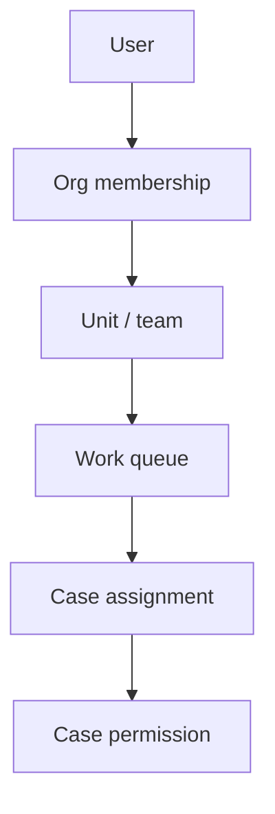

Assignment rules may include:

- assigned investigator can update investigation fields;
- queue member can claim case;
- supervisor can reassign case;
- legal reviewer can see legal review section only after handoff;
- auditor can read audit view but cannot modify evidence;
- conflicted user cannot access case even if in correct team;
- prior investigator cannot approve their own decision;
- emergency access bypasses assignment but requires reason and elevated audit marker.

React should show assignment state clearly:

```tsx
function AssignmentBanner({ projection }: { projection: CaseWorkspaceProjection }) {
  const assign = projection.allowedActions["case.assign_to_self"];

  if (assign?.effect === "allow") {
    return <button>Assign to me</button>;
  }

  if (assign?.reasonCode === "conflict_of_interest") {
    return <Alert severity="error">You cannot claim this case because a conflict is recorded.</Alert>;
  }

  if (assign?.reasonCode === "not_in_queue") {
    return <Alert severity="info">This case belongs to another work queue.</Alert>;
  }

  return null;
}
```

Again: this is UX.

The claim endpoint must enforce the same rule.

---

## 14. Separation of duties

A regulated system often has rules like:

- investigator cannot approve their own enforcement recommendation;
- supervisor who reassigned a case cannot review the appeal;
- legal reviewer cannot be the same person who drafted the legal basis;
- user who performed emergency override cannot later self-certify the action;
- admin who grants temporary access cannot use that grant for themselves.

This requires historical facts.

Not just current role.

Example policy input:

```ts
interface SeparationOfDutiesFacts {
  actorId: string;
  caseId: string;
  action: string;
  currentRoleIds: string[];
  priorEvents: Array<{
    eventType: string;
    actorId: string;
    at: string;
  }>;
  delegatedBy?: string;
}
```

React implication:

- show denial reason safely;
- explain escalation path;
- avoid rendering approval buttons solely based on supervisor role;
- use fresh transition projection before rendering final submit dialog.

---

## 15. Conflict-of-interest model

Conflict rules can override all normal authorization.

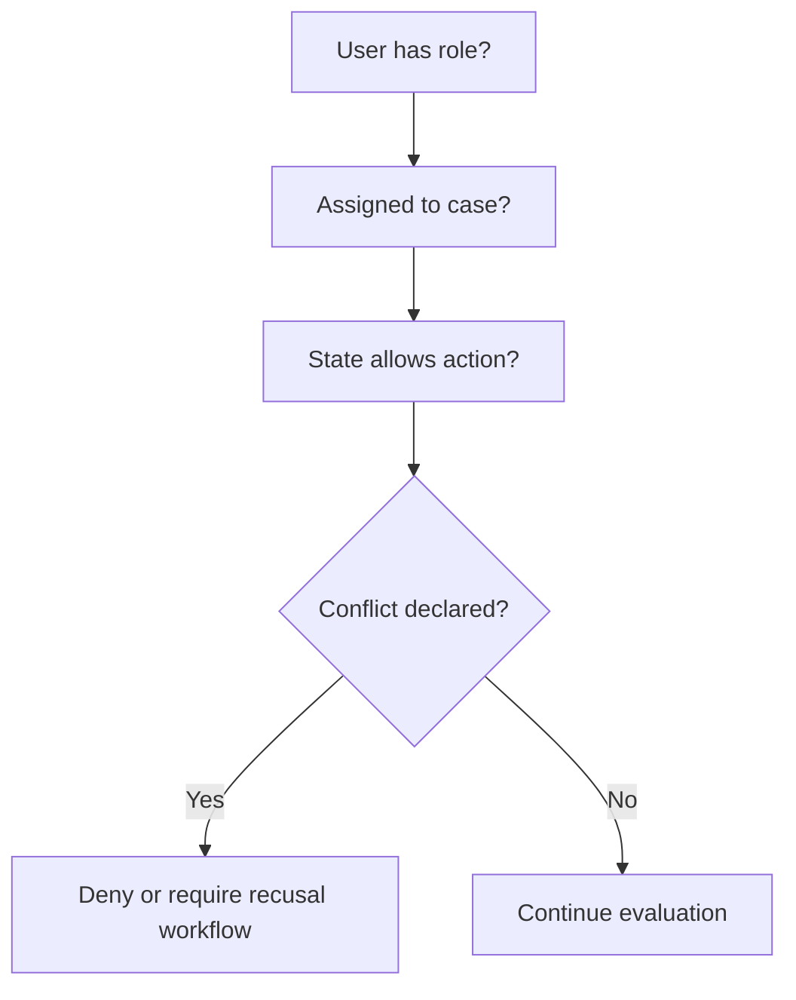

Conflict may be:

- self-declared;
- discovered by system matching;
- declared by supervisor;
- inherited from organization/team;
- triggered by prior involvement;
- triggered by personal relationship or financial interest.

The frontend should treat conflict as a first-class state:

- red conflict banner;
- no sensitive data preview if conflict blocks access;
- clear recusal workflow;
- supervisor escalation link;
- audit event when user attempts access despite conflict notice.

Do not show sensitive case details before conflict evaluation finishes.

---

## 16. Confidentiality and disclosure restrictions

Regulated systems often have case markers:

- restricted case;
- highly restricted case;
- sealed case;
- vulnerable person involved;
- law-enforcement-sensitive;
- legal privilege;
- whistleblower protected;
- embargoed decision;
- appeal-in-progress;
- litigation hold.

These markers should affect projection:

```ts
interface DisclosureRestriction {
  marker:
    | "restricted"
    | "sealed"
    | "legal_privilege"
    | "whistleblower_protected"
    | "embargoed"
    | "litigation_hold";
  effect: "hide_case" | "mask_fields" | "hide_section" | "watermark" | "require_reason";
  publicLabel: string;
}
```

React must not receive fields it should only hide.

Prefer server-side projection:

```json
{
  "case": {
    "id": "case_123",
    "referenceNumber": "ENF-2026-000123",
    "title": "Restricted case",
    "sensitivity": "highly_restricted"
  },
  "fieldModes": {
    "subject.name": "masked",
    "subject.address": "hidden",
    "whistleblower.identity": "hidden"
  }
}
```

Do not send raw whistleblower identity to the browser and rely on CSS to hide it.

That is data exposure, not access control.

---

## 17. Evidence and document authorization

Evidence is usually more sensitive than case metadata.

Evidence access may differ by:

- file classification;
- case state;
- evidence lock;
- chain-of-custody rule;
- redaction status;
- document type;
- disclosure marker;
- legal privilege;
- user assignment;
- export permission.

Architecture:

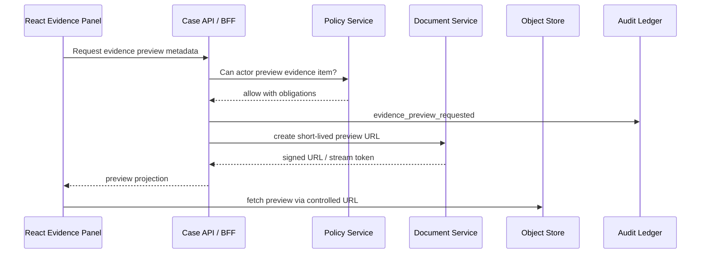

Important rules:

- signed URLs must be short-lived;
- downloads need separate permission from previews;
- exports need separate permission from downloads;
- original evidence access may differ from redacted copy access;
- object store path must not encode sensitive data;
- preview generation must be audited;
- cache headers must prevent unauthorized reuse;
- document service must check access, not only the case service.

---

## 18. Notes, comments, and internal deliberation

Case notes often have categories:

| Note type | Visibility |
|---|---|
| Public case note | Visible to assigned staff. |
| Internal deliberation | Restricted to decision team. |
| Legal advice | Legal privilege. |
| Supervisor instruction | Supervisor + assignee. |
| Audit observation | Auditor only. |
| System-generated note | Depends on event. |

Do not implement notes as one table with `visible: boolean` in React.

Use server-side note projection:

```ts
interface CaseNoteProjection {
  id: string;
  category: "public" | "internal" | "legal" | "supervisor" | "audit" | "system";
  createdByLabel: string;
  createdAt: string;
  body?: string;
  redactedBody?: string;
  visibilityMode: "visible" | "redacted" | "hidden";
  allowedActions: {
    edit: AuthzDecision;
    delete: AuthzDecision;
    disclose: AuthzDecision;
  };
}
```

React renders what the server projects.

Mutation endpoints still validate.

---

## 19. Break-glass access

Break-glass is exceptional access for urgent circumstances.

It should be designed as a controlled emergency workflow, not as a hidden admin bypass.

Break-glass minimum controls:

- explicit user confirmation;
- reason required;
- step-up authentication;
- limited duration;
- limited scope;
- high-severity audit event;
- notification to supervisors/compliance;
- visible banner while active;
- no ability to perform some irreversible actions;
- post-access review;
- automatic expiry.

React flow:

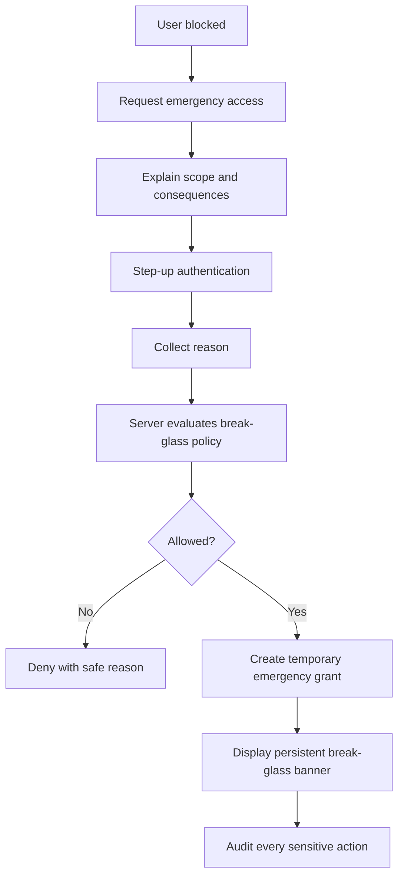

Do not let React generate emergency grants locally.

---

## 20. Audit defensibility

Audit in regulated systems has two jobs:

1. support operational security monitoring;
2. support later defensibility of case decisions.

Security log events answer:

- who accessed the system;
- what action was attempted;
- what was denied;
- what suspicious behavior occurred.

Case audit events answer:

- what changed in the case;
- what state transition occurred;
- which evidence was relied on;
- why a decision was made;
- who approved or overrode a decision;
- what access was granted and revoked.

Use separate concepts, even if stored in the same platform.

```ts
interface CaseAuditEvent {
  eventId: string;
  caseId: string;
  eventType:
    | "case_viewed"
    | "case_updated"
    | "state_transitioned"
    | "evidence_added"
    | "evidence_previewed"
    | "decision_submitted"
    | "decision_approved"
    | "access_denied"
    | "break_glass_started"
    | "break_glass_ended";
  actor: {
    userId: string;
    membershipId: string;
    actingRole: string;
    impersonatorId?: string;
  };
  authority: {
    roleIds: string[];
    assignmentId?: string;
    delegationId?: string;
    emergencyGrantId?: string;
  };
  decision?: {
    action: string;
    effect: string;
    reasonCode?: string;
    policyVersion: string;
  };
  before?: unknown;
  after?: unknown;
  reason?: string;
  correlationId: string;
  occurredAt: string;
}
```

Avoid logging raw secrets, tokens, sensitive evidence content, or full personal data unless explicitly required and protected.

---

## 21. Audit viewer authorization

Audit logs are sensitive.

Do not assume everyone who can read a case can read all audit events.

Audit viewer should have its own permission model:

| Audit event | Investigator | Supervisor | Auditor | Legal | Admin |
|---|---:|---:|---:|---:|---:|
| Case viewed | no | partial | yes | partial | metadata |
| Evidence previewed | own actions | team | yes | legal-scope | metadata |
| Access denied | no | partial | yes | partial | metadata |
| Break-glass | no | yes | yes | yes | yes |
| Permission grant | no | yes | yes | no | yes |
| Legal note access | no | no | restricted | yes | no |

React implication:

- render audit tab only when allowed;
- filter event types server-side;
- redact actor or subject fields when required;
- provide export permission separately;
- watermark sensitive audit exports;
- log audit-log access itself.

---

## 22. Search and list authorization

Case search is a common leak point.

The detail route may be protected, but search results can leak existence.

Search must be authorization-aware.

Bad pattern:

```ts
GET /cases?query=john
// returns all matching cases, then React hides restricted rows
```

Correct pattern:

```ts
GET /cases?query=john
// server applies tenant, assignment, confidentiality, jurisdiction, and disclosure filters
```

Search result projection:

```ts
interface CaseSearchResult {
  id: string;
  referenceNumber: string;
  title: string;
  state: CaseState;
  sensitivityLabel?: string;
  visibleFields: string[];
  allowedActions: {
    open: AuthzDecision;
    assignToSelf: AuthzDecision;
  };
}
```

For high sensitivity cases, even existence may be hidden.

This affects:

- list endpoints;
- autocomplete;
- global search;
- notifications;
- dashboard counts;
- reports;
- exports;
- URL preview cards;
- breadcrumb labels.

---

## 23. Notification and task authorization

Notifications can leak restricted information.

A notification should not include more than the recipient is allowed to know at delivery time.

Better:

```json
{
  "type": "task_assigned",
  "title": "A case task has been assigned to you",
  "target": "/cases/case_123/tasks/task_456"
}
```

Risky:

```json
{
  "type": "task_assigned",
  "title": "Whistleblower complaint against ACME CEO assigned to you"
}
```

React notification panel should:

- fetch notification projection from server;
- not render sensitive payload from stale push event;
- revalidate target permission on click;
- handle revoked tasks gracefully;
- clear notifications on tenant switch/logout;
- avoid push notification text leaking restricted content.

---

## 24. Regulated UX: denial is part of workflow

In normal software, denial is often an error.

In regulated systems, denial is often a valid workflow state.

Examples:

- user needs assignment;
- case needs supervisor review;
- legal hold blocks edit;
- separation-of-duties blocks approval;
- state transition must happen first;
- access request must be approved;
- step-up authentication is required;
- conflict declaration requires recusal.

React should not render all denials as:

```txt
You do not have permission.
```

Use structured recovery:

```tsx
function DenialCallout({ decision }: { decision: AuthzDecision }) {
  switch (decision.effect) {
    case "requires_assignment":
      return <RequestAssignment decision={decision} />;
    case "requires_approval":
      return <RequestApproval decision={decision} />;
    case "requires_step_up":
      return <StepUpPrompt decision={decision} />;
    case "conflict_blocked":
      return <ConflictNotice />;
    case "legal_hold_blocked":
      return <LegalHoldNotice />;
    default:
      return <GenericForbidden correlationId={decision.correlationId} />;
  }
}
```

---

## 25. Regulated case UI layout

A typical case workspace:

```txt
Case Workspace
├── Case Header
│   ├── reference number
│   ├── state badge
│   ├── sensitivity badge
│   ├── assignment badge
│   ├── conflict/legal hold banners
│   └── audit/view trace indicator
├── Navigation
│   ├── Overview
│   ├── Parties
│   ├── Allegations
│   ├── Evidence
│   ├── Notes
│   ├── Decision
│   ├── Tasks
│   └── Audit
├── Main Panel
├── Workflow Action Bar
└── Right Rail
    ├── next required action
    ├── blockers
    ├── access request status
    └── related deadlines
```

Every visible section should come from projection.

Every action should carry decision metadata.

Every mutation should include expected state/version.

---

## 26. Route structure

Example route tree:

```txt
/app
  /cases
    index.tsx                    # search/list loader applies access filter
    /:caseId
      layout.tsx                 # case workspace projection
      overview.tsx
      parties.tsx
      allegations.tsx
      evidence.tsx
      notes.tsx
      decision.tsx
      tasks.tsx
      audit.tsx                  # audit-specific authorization
      actions/transition.ts      # route action / API command
      actions/request-access.ts
      actions/break-glass.ts
```

Each route should specify metadata:

```ts
export const handle = {
  auth: {
    resource: "case",
    action: "case.read",
    sensitivity: "case_workspace",
  },
};
```

But metadata is not enforcement alone.

It drives loader/action guard configuration.

---

## 27. Permission-aware workflow action bar

```tsx
function WorkflowActionBar({ projection }: { projection: CaseWorkspaceProjection }) {
  const transitions = projection.workflow.availableTransitions;

  if (transitions.length === 0) {
    return <p>No actions are currently available for this case.</p>;
  }

  return (
    <div aria-label="Case workflow actions">
      {transitions.map((transition) => (
        <WorkflowActionButton
          key={transition.action}
          action={transition.action}
          label={transition.label}
          decision={transition.decision}
          requiredFields={transition.requiredFields}
        />
      ))}
    </div>
  );
}
```

The action button should not silently hide every denial.

For regulated users, seeing why an action is blocked often matters.

---

## 28. Handling exports

Exports are high-risk.

Export authorization is not the same as screen read authorization.

Export policy may require:

- separate permission;
- redaction;
- reason;
- approval;
- watermark;
- format restrictions;
- recipient restrictions;
- time-limited download;
- audit event;
- DLP scanning;
- legal hold check.

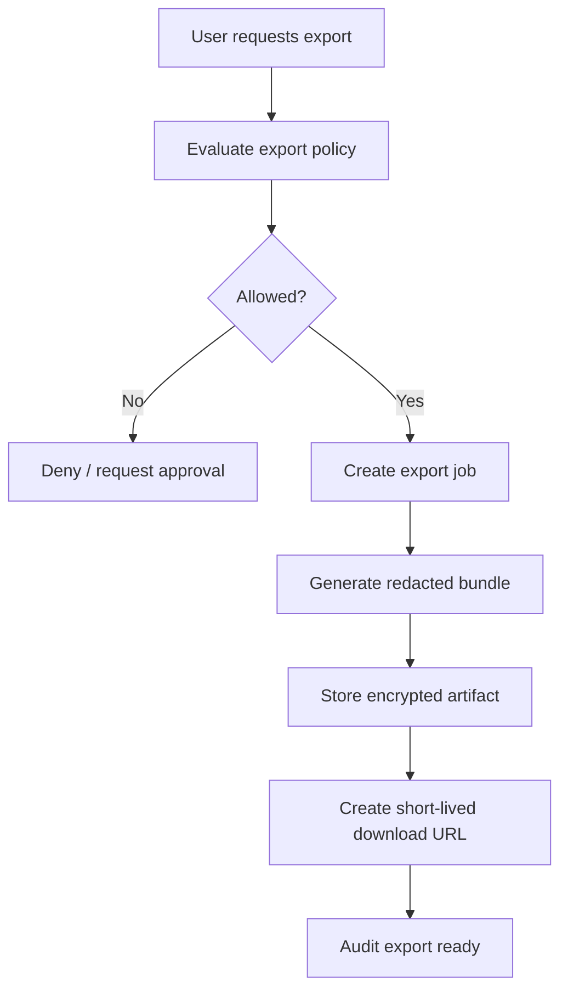

React should display export as a job, not as instant client-side JSON serialization.

Do not let the browser assemble sensitive exports from cached data.

---

## 29. Metrics and operational signals

A regulated case platform should monitor:

| Signal | Why it matters |
|---|---|
| Access denied rate by action | Detect broken policy or attack probing. |
| Case view by sensitivity | Monitor restricted case access. |
| Break-glass count | Detect operational stress or abuse. |
| Permission stale errors | Detect cache invalidation bugs. |
| Transition conflicts | Detect concurrency/workflow race. |
| Export requests | Monitor data exfiltration risk. |
| Search result denials | Detect enumeration attempts. |
| Cross-tenant denied attempts | Detect tenant isolation issues. |
| Policy engine latency | Avoid UI and workflow degradation. |
| Audit write failure | Critical operational incident. |

React telemetry should include correlation IDs, action names, route names, and public reason codes.

Do not include raw evidence content, tokens, or restricted PII.

---

## 30. Testing matrix

Minimum tests:

| Test class | Cases |
|---|---|
| State transition | Allowed/denied transition per state. |
| Assignment | Assigned, unassigned, queue member, wrong queue. |
| Conflict | Conflict blocks read/write/approve. |
| Separation of duties | Investigator cannot approve own recommendation. |
| Confidentiality | Restricted case hidden/masked per role. |
| Evidence | Preview/download/export require separate permission. |
| Search | Restricted existence not leaked. |
| Notifications | Notification text does not leak sensitive data. |
| Break-glass | Requires reason, step-up, expiry, audit. |
| Audit | Every sensitive action emits expected event. |
| Stale permission | Role/assignment/state changes invalidate UI. |
| Tenant isolation | Case ID from another tenant denied. |
| Cache | Logout/tenant switch clears sensitive projection. |
| Error handling | 401/403/404/409 mapped correctly. |

---

## 31. Implementation checklist

Use this checklist before shipping a regulated case workspace.

### Authorization

- [ ] Every read endpoint enforces case/resource authorization.
- [ ] Every mutation endpoint enforces action/resource/state authorization.
- [ ] Search/list endpoints filter server-side.
- [ ] Field-level and section-level permissions are server-projected.
- [ ] Evidence preview/download/export have separate permissions.
- [ ] Audit viewer has separate authorization.
- [ ] Permission cache includes tenant, auth epoch, permission version, and resource version.
- [ ] Stale permission responses are typed and recoverable.

### Workflow

- [ ] Case transitions are explicit commands.
- [ ] Every command validates source state and expected version.
- [ ] Separation-of-duties rules use historical facts.
- [ ] Conflict-of-interest blocks access before sensitive data projection.
- [ ] Break-glass is time-limited, scoped, reasoned, and audited.
- [ ] Access request workflows are auditable and deny-by-default.

### React

- [ ] Route loader does not return sensitive data before authorization.
- [ ] Components render from permission projection.
- [ ] Direct URL access is handled by loader/API, not sidebar visibility.
- [ ] Query keys include tenant/auth/permission version.
- [ ] Logout and tenant switch clear case/evidence/query caches.
- [ ] Denial UI is safe, specific, and does not reveal restricted details.
- [ ] Export is server-side job-based, not client-side data dump.

### Audit and operations

- [ ] Sensitive reads/writes emit audit events.
- [ ] Audit events include actor, authority, resource, action, reason, policy version, and correlation ID.
- [ ] Audit write failure has explicit fail-open/fail-closed policy.
- [ ] High-risk actions have alertable telemetry.
- [ ] Restricted case access is monitorable.
- [ ] Incident runbooks exist for policy bugs, cross-tenant leak, and audit outage.

---

## 32. Common architecture smell

You are building a dangerous system if your regulated case app has these properties:

- one `role` string controls everything;
- case state is only visual, not part of permission;
- UI hides restricted fields after receiving raw data;
- search returns all matching cases and filters in React;
- export builds a ZIP in the browser from cached data;
- audit is an afterthought;
- admin can impersonate without banner or audit;
- break-glass is just `isAdmin`;
- case assignment does not affect permission;
- evidence download uses long-lived public URLs;
- approval is a button visible to supervisors regardless of prior involvement;
- React stores full case projection across tenant switches;
- permission change does not invalidate loaded case screens.

Fix these before optimizing UI polish.

---

## 33. Summary

Regulated case management authorization is not a frontend pattern.

It is a system architecture.

React participates by rendering a safe, explainable, permission-aware workspace.

The backend enforces every read, mutation, transition, export, assignment, disclosure, and audit-sensitive operation.

The most important idea is this:

> In regulated workflows, authorization is part of the domain model.

It is not infrastructure glue.

It belongs beside case state, assignment, evidence, decision, audit, escalation, and review.

The best React architecture accepts this and becomes a precise projection layer over a server-enforced workflow and policy model.
