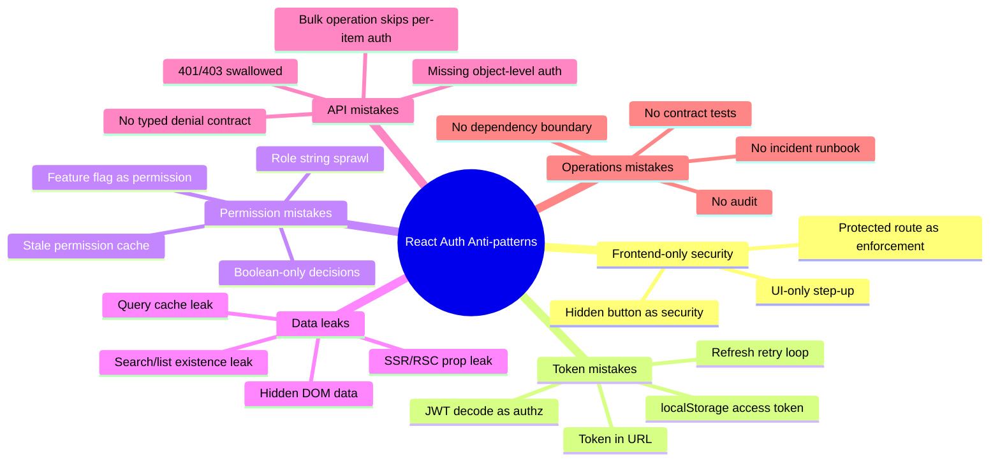
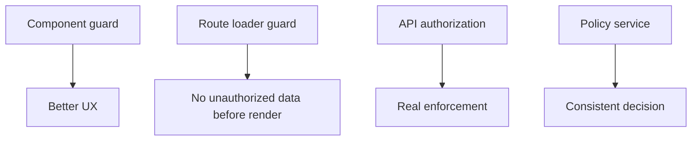
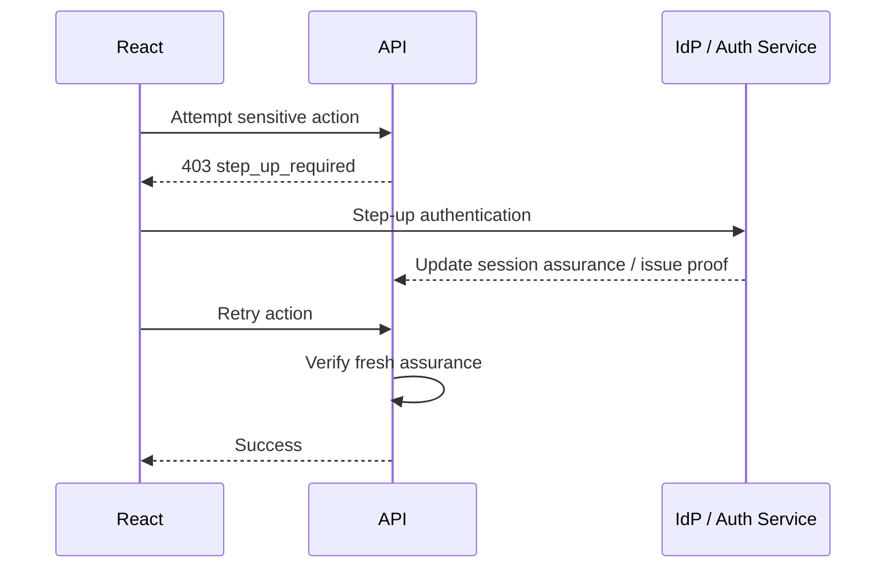
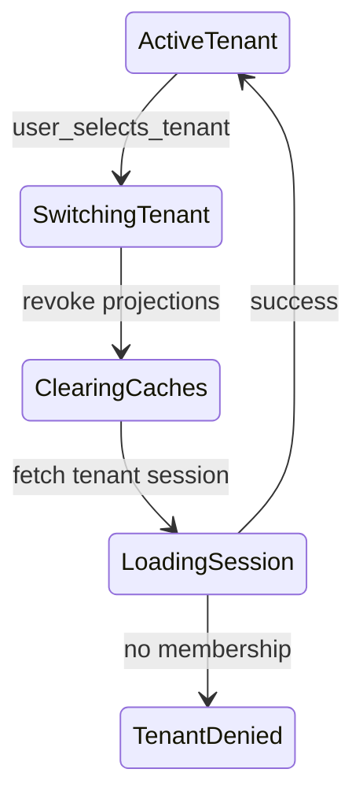
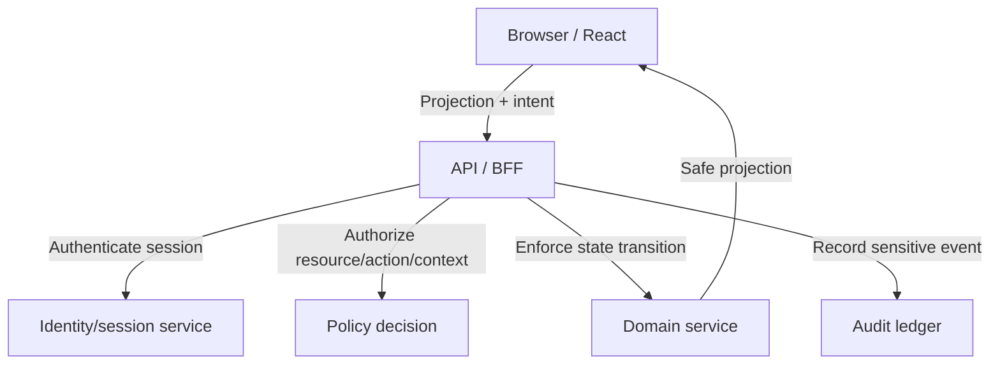

# Part 126 — Auth Anti-pattern Catalog

This part is a catalog of mistakes.

Not because mistakes are fun.

Because auth systems usually fail through ordinary-looking shortcuts that become architectural habits.

A React codebase can look clean while being insecure:

```tsx
if (user.role === "admin") {
  return <AdminPage />;
}
```

Clean syntax does not mean correct security.

Auth anti-patterns usually share the same root causes:

- confusing UI exposure with enforcement;
- treating identity claims as fresh permissions;
- using browser storage without a threat model;
- caching authorization decisions without invalidation;
- collapsing domain authorization into roles;
- failing to test denial paths;
- hiding sensitive data after already sending it;
- letting SDK convenience replace system boundaries.

Use this catalog as a design review checklist.

---

## 1. Anti-pattern map



---

## 2. How to read this catalog

Each anti-pattern has:

- symptom;
- why engineers do it;
- why it fails;
- safer design;
- detection heuristic;
- remediation path.

The goal is not to memorize rules.

The goal is to develop instinct.

---

# Category A — Frontend-only security

## 3. Anti-pattern: protected route as the enforcement boundary

### Symptom

```tsx
<Route
  path="/admin"
  element={user?.role === "admin" ? <Admin /> : <Navigate to="/forbidden" />}
/>
```

### Why engineers do it

It is easy.

It gives immediate UX benefit.

It prevents casual navigation.

### Why it fails

A route guard protects only rendering.

It does not protect:

- direct API calls;
- stale query cache;
- prefetched data;
- server-rendered data;
- hidden child routes;
- action endpoints;
- object-level access;
- bulk operations;
- exports;
- files;
- GraphQL fields;
- WebSocket channels.

A protected route is exposure control.

It is not authorization enforcement.

### Safer design

Use layered control:



Use:

- route loader guard for early data denial;
- route action guard for mutations;
- API/resource authorization for enforcement;
- typed `403` decision contract;
- component guard only for exposure and explanation.

### Detection heuristic

Search for:

```txt
ProtectedRoute
RequireAuth
PrivateRoute
role ===
permissions.includes
```

Then ask:

> Does the API enforce the same rule if I bypass React?

### Remediation

1. Keep the route guard for UX.
2. Add loader/action authorization.
3. Add server-side endpoint authorization.
4. Add tests that call API directly without UI.
5. Add `403`/`404` response handling.

---

## 4. Anti-pattern: hidden button as security

### Symptom

```tsx
{canDelete && <button onClick={deleteCase}>Delete</button>}
```

The button disappears.

The endpoint still accepts the request.

### Why it fails

The browser is not the authority.

Users can:

- call API manually;
- replay request;
- modify JS state;
- use stale UI;
- trigger hidden action from command palette or keyboard shortcut;
- call bulk endpoint with unauthorized item IDs.

### Safer design

Button visibility is UX.

Endpoint authorization is security.

```ts
app.delete("/api/cases/:caseId", async (req, res) => {
  const actor = await requireSession(req);
  const decision = await policy.can(actor, "case.delete", { id: req.params.caseId });

  if (decision.effect !== "allow") {
    return res.status(403).json(toProblem(decision));
  }

  await deleteCase(req.params.caseId);
  return res.status(204).end();
});
```

### Detection heuristic

A feature is dangerous if:

- button visibility checks permission;
- API endpoint does not;
- no test exists for denied direct API call.

---

## 5. Anti-pattern: disabled control as security

### Symptom

```tsx
<button disabled={!canApprove}>Approve</button>
```

### Why it fails

Disabled controls prevent normal UI interaction.

They do not prevent network calls.

Also, disabled UI can hide denial reasons from keyboard and assistive technology users.

### Safer design

Use disabled controls for UX only.

For important actions, pair with:

- server authorization;
- safe denial reason;
- access request path;
- step-up/auth freshness prompt;
- audit event on denied sensitive attempt if relevant.

---

## 6. Anti-pattern: frontend-only step-up authentication

### Symptom

```tsx
if (needsMfa) {
  showMfaModal();
}
```

After the modal closes, the frontend enables sensitive action.

### Why it fails

The server has not verified a fresh authentication event.

An attacker can bypass the modal and call the endpoint.

### Safer design

Step-up must create server-verifiable freshness.



---

# Category B — Token mistakes

## 7. Anti-pattern: storing long-lived access tokens in localStorage

### Symptom

```ts
localStorage.setItem("access_token", token);
```

### Why engineers do it

It survives refresh.

It is easy to use in API clients.

It works in demos.

### Why it fails

Any JavaScript running in the origin can read localStorage.

If XSS lands, token theft is straightforward.

Browser extensions, compromised dependencies, unsafe analytics scripts, and third-party script compromise also matter.

### Safer design

Prefer one of:

| Architecture | Token exposure |
|---|---|
| BFF + HttpOnly session cookie | OAuth tokens stay server-side. |
| Server-rendered app + session cookie | Browser receives projection, not tokens. |
| SPA with in-memory access token + refresh rotation | Reduces persistence but still requires XSS hardening. |
| Opaque session cookie | Server owns session state and revocation. |

### Detection heuristic

Search for:

```txt
localStorage.setItem("token"
localStorage.getItem("access"
sessionStorage.setItem("refresh"
jwt in localStorage
```

### Remediation

1. Inventory token storage.
2. Shorten token lifetime.
3. Move refresh capability out of localStorage first.
4. Introduce BFF/session endpoint.
5. Rotate/revoke legacy tokens.
6. Clear old storage on bootstrap/logout.
7. Add CSP and dependency guardrails.

---

## 8. Anti-pattern: decoding JWT in React as authorization

### Symptom

```ts
const claims = jwtDecode(token);
return claims.roles.includes("admin");
```

### Why it fails

Decoding is not validation.

Even when the JWT is valid, claims may be stale.

Even when claims are fresh, role claims are usually not enough for object-level authorization.

A token may tell you who the user is or what broad scopes exist.

It does not answer:

> Can this actor approve this specific case in this state right now?

### Safer design

Use JWT decoding only for non-authoritative hints.

Use server projection for permission:

```ts
GET /api/cases/:caseId/workspace
// returns allowedActions based on server-side policy
```

### Detection heuristic

Search for:

```txt
jwtDecode
atob(token.split
claims.role
claims.permissions
```

Then check whether decoded claims affect rendering only, or whether they become final permission decisions.

---

## 9. Anti-pattern: token in URL

### Symptom

```txt
https://app.example.com/callback#access_token=...
https://app.example.com/reset?token=...
https://app.example.com/invite?jwt=...
```

### Why it fails

URLs leak through:

- browser history;
- screenshots;
- logs;
- analytics;
- referrer headers;
- support tickets;
- proxy logs;
- shared links.

### Safer design

- Use Authorization Code with PKCE for OAuth/OIDC.
- Exchange short-lived one-time codes server-side where possible.
- For magic links/invites, use short-lived single-use opaque codes.
- Clean callback URLs immediately after processing.
- Use `Referrer-Policy`.
- Do not put bearer credentials in route params.

---

## 10. Anti-pattern: refresh retry loop

### Symptom

```ts
api.interceptors.response.use(undefined, async (error) => {
  if (error.response.status === 401) {
    await refreshToken();
    return api.request(error.config);
  }
});
```

### Why it fails

This can create:

- infinite retry loop;
- refresh storm;
- duplicate mutations;
- token family invalidation race;
- stale session resurrection;
- confusing UX;
- hidden security incident.

### Safer design

Use explicit refresh state machine:

```ts
type RefreshResult =
  | { type: "refreshed" }
  | { type: "session_expired" }
  | { type: "reuse_detected" }
  | { type: "network_unknown" }
  | { type: "not_refreshable" };
```

Rules:

- single-flight refresh;
- no automatic replay of unsafe mutations unless idempotent;
- max one retry per request;
- logout on refresh token reuse detection;
- typed error propagation;
- observability for refresh failure.

---

# Category C — Permission model mistakes

## 11. Anti-pattern: role string sprawl

### Symptom

```tsx
user.role === "admin"
user.role === "manager"
user.role !== "viewer"
role === "supervisor" || role === "legal"
```

### Why it fails

Role checks spread policy across UI.

Over time, no one knows what `admin` means.

Role checks do not express:

- object ownership;
- case assignment;
- tenant scope;
- state transition rules;
- separation of duties;
- field-level restrictions;
- temporary grants;
- delegated authority;
- emergency access;
- step-up requirements.

### Safer design

Use action/resource permission checks.

```ts
can("case.approve", { type: "case", id: caseId, state: "SupervisorApproval" });
```

Better yet, use server-projected decisions:

```ts
projection.allowedActions["case.approve"].effect === "allow"
```

### Detection heuristic

Make a CI rule for:

```txt
.role ===
.role !==
roles.includes
isAdmin
isSupervisor
```

Not all occurrences are wrong.

But each should be reviewed.

---

## 12. Anti-pattern: feature flag as permission

### Symptom

```tsx
if (flags.newAdminPage) {
  return <AdminPage />;
}
```

### Why it fails

Feature flags answer:

> Is this capability released/enabled?

Permissions answer:

> Is this actor allowed to perform this action on this resource?

A feature flag system is often optimized for rollout, experimentation, and targeting.

It is not necessarily designed as an authorization enforcement system.

### Safer design

Use both:

```ts
const visible = flags.caseExport && can("case.export", caseResource).effect === "allow";
```

Server must still enforce `case.export`.

### Detection heuristic

Search for feature flags around sensitive actions:

```txt
flag
variation
isEnabled
useFeature
```

Ask:

> If the flag is enabled for this user, does the server still check permission?

---

## 13. Anti-pattern: boolean-only permission decision

### Symptom

```ts
const canApprove = true;
```

### Why it fails

A boolean cannot express:

- requires MFA;
- requires approval;
- requires assignment;
- wrong workflow state;
- conflict of interest;
- stale permission snapshot;
- legal hold;
- access request available;
- hide existence vs show forbidden;
- redaction required.

### Safer design

Use a typed decision object.

```ts
interface Decision {
  effect: "allow" | "deny" | "requires_step_up" | "requires_approval";
  reasonCode?: string;
  publicMessage?: string;
  obligations?: unknown[];
  permissionVersion: string;
}
```

---

## 14. Anti-pattern: permit-by-default unknown state

### Symptom

```tsx
const canEdit = permissionMap?.edit ?? true;
```

### Why it fails

Unknown permission state is common:

- session bootstrapping;
- slow permission API;
- tenant switching;
- stale cache;
- policy service outage;
- offline/degraded mode.

If unknown becomes allow, transient failures become access grants.

### Safer design

```ts
const canEdit = decision?.effect === "allow";
```

Unknown should render:

- skeleton;
- disabled with loading state;
- safe fallback;
- explicit degraded mode;
- retry action.

Never allow by default.

---

## 15. Anti-pattern: unscoped permissions

### Symptom

```json
{
  "permissions": ["case.read", "case.update", "case.approve"]
}
```

No tenant, org, state, resource, assignment, or condition.

### Why it fails

The permission is too broad to be useful.

It invites confused authorization like:

```tsx
if (permissions.includes("case.approve")) {
  showApproveButton();
}
```

### Safer design

Permission checks should be scoped:

```ts
can("case.approve", {
  tenantId,
  caseId,
  state,
  assignmentId,
  caseVersion,
});
```

For UI projection:

```json
{
  "caseId": "case_123",
  "allowedActions": {
    "case.approve": {
      "effect": "deny",
      "reasonCode": "separation_of_duties"
    }
  }
}
```

---

# Category D — Data exposure mistakes

## 16. Anti-pattern: hiding sensitive data after sending it to the browser

### Symptom

```tsx
<div style={{ display: canViewSsn ? "block" : "none" }}>{user.ssn}</div>
```

or:

```tsx
{canView ? <SensitivePanel data={data} /> : null}
```

But `data` already contains sensitive fields.

### Why it fails

Hidden DOM, React props, query cache, devtools, memory snapshots, logs, analytics, and browser extensions may still see the data.

### Safer design

Server-side projection:

```json
{
  "name": "Jane Doe",
  "ssn": null,
  "fieldModes": {
    "ssn": "hidden"
  }
}
```

Or masked projection:

```json
{
  "ssnMasked": "***-**-1234",
  "fieldModes": {
    "ssn": "masked"
  }
}
```

Do not send raw restricted data unless the actor is authorized to receive it.

---

## 17. Anti-pattern: query cache not scoped by auth context

### Symptom

```ts
useQuery({ queryKey: ["case", caseId], queryFn: fetchCase });
```

### Why it fails

The same case ID may mean different projection for:

- different tenant;
- different role;
- different assignment;
- impersonation session;
- step-up state;
- permission version;
- case state;
- field-level authorization.

### Safer design

```ts
useQuery({
  queryKey: [
    "caseWorkspace",
    tenantId,
    authEpoch,
    permissionVersion,
    caseId,
  ],
  queryFn: fetchCaseWorkspace,
});
```

Also clear cache on:

- logout;
- tenant switch;
- role/permission change;
- impersonation start/end;
- session revoked;
- sensitive state transition.

---

## 18. Anti-pattern: SSR/RSC leaking data through client props

### Symptom

```tsx
// Server Component
const user = await loadFullUserWithSecrets();
return <ClientProfile user={user} />;
```

### Why it fails

Props passed to Client Components must be serialized to the browser.

If the object includes secrets, restricted fields, or internal policy traces, those values can leak.

### Safer design

Pass explicit DTOs:

```ts
const profileDto = {
  displayName: user.displayName,
  email: canViewEmail ? user.email : undefined,
};

return <ClientProfile profile={profileDto} />;
```

Use DTO mappers and code review rules.

Do not pass ORM entities or policy internals into Client Components.

---

## 19. Anti-pattern: search/list leaks existence

### Symptom

A user cannot open a restricted case, but it appears in:

- search results;
- dashboard counts;
- autocomplete;
- notifications;
- breadcrumbs;
- related-case list;
- export list.

### Why it fails

Existence is often sensitive.

In some domains, knowing that a case exists is itself restricted information.

### Safer design

Apply authorization at producer side:

- search service filters by actor scope;
- count APIs apply same visibility policy;
- autocomplete returns only visible entities;
- notifications use safe generic copy;
- breadcrumbs fetch authorized labels;
- related lists do not reveal hidden objects.

---

# Category E — API authorization mistakes

## 20. Anti-pattern: missing object-level authorization

### Symptom

```ts
GET /api/cases/:caseId
```

The server checks only that the user is logged in.

It does not check whether the user can access that specific case.

### Why it fails

Attackers can manipulate object IDs.

This is the classic BOLA/IDOR family.

Sequential IDs, UUIDs, slugs, global IDs, and encoded IDs are all still object references.

### Safer design

Every endpoint that accepts an object identifier must check object-level authorization.

```ts
const caseRecord = await caseRepo.get(caseId);
const decision = await policy.can(actor, "case.read", caseRecord);
if (decision.effect !== "allow") return deny(decision);
```

### Detection heuristic

Inventory endpoints with:

```txt
/:id
caseId
userId
orgId
documentId
fileId
assignmentId
noteId
```

For each endpoint, identify the authorization interval:

> Which resource is loaded, and exactly where is object-level authorization checked?

---

## 21. Anti-pattern: bulk operation skips per-item authorization

### Symptom

```ts
POST /api/cases/bulk-close
{ "caseIds": ["case_1", "case_2", "case_3"] }
```

Server checks only whether user has `case.close` generally.

### Why it fails

Bulk requests mix resources with different states, tenants, assignments, and restrictions.

### Safer design

Return per-item decision:

```json
{
  "accepted": ["case_1"],
  "rejected": [
    {
      "caseId": "case_2",
      "reasonCode": "wrong_case_state"
    },
    {
      "caseId": "case_3",
      "reasonCode": "not_assigned"
    }
  ]
}
```

Policy choices:

- all-or-nothing;
- allowed-only;
- preview-before-commit;
- approval-required for mixed cases.

Pick explicitly.

---

## 22. Anti-pattern: swallowing 401/403 in API client

### Symptom

```ts
catch (e) {
  return null;
}
```

or:

```ts
if (status === 403) return [];
```

### Why it fails

You erase security signal.

The UI cannot distinguish:

- session expired;
- permission denied;
- resource hidden;
- stale permission;
- step-up needed;
- legal hold;
- server outage.

### Safer design

Use typed errors:

```ts
type ApiAuthError =
  | { type: "unauthenticated"; status: 401 }
  | { type: "forbidden"; status: 403; reasonCode: string }
  | { type: "hidden"; status: 404 }
  | { type: "stale_permission"; status: 409 };
```

Let route error boundaries and components recover intentionally.

---

## 23. Anti-pattern: inconsistent 403/404 disclosure policy

### Symptom

Sometimes unauthorized resource returns 403.

Sometimes 404.

Sometimes empty object.

Sometimes redirect.

No clear rule.

### Why it fails

Inconsistent responses leak existence and create impossible UX/debugging.

### Safer design

Define disclosure policy by resource type:

| Resource | Unauthorized response |
|---|---|
| Own profile | 403 with reason. |
| Case in same tenant but not assigned | 403 or request-access, depending domain. |
| Highly restricted case | 404 or generic denial. |
| Public-ish project | 403 with safe message. |
| Evidence item | 404 unless case context already authorized. |

Document and test it.

---

# Category F — Session and lifecycle mistakes

## 24. Anti-pattern: logout only clears React state

### Symptom

```ts
setUser(null);
navigate("/login");
```

### Why it fails

The session may still exist in:

- server session store;
- refresh token family;
- cookies;
- query cache;
- service worker cache;
- IndexedDB;
- localStorage/sessionStorage;
- open WebSocket;
- other tabs;
- bfcache page.

### Safer design

Logout is a distributed cleanup operation:

1. revoke server session;
2. clear cookie/session token;
3. clear query/cache/storage;
4. broadcast logout to other tabs;
5. close realtime connections;
6. abort in-flight requests;
7. clear service worker sensitive caches;
8. redirect to safe logged-out route;
9. prevent back-button sensitive data exposure.

---

## 25. Anti-pattern: tenant switch without cache isolation

### Symptom

```ts
setTenant(newTenantId);
navigate("/dashboard");
```

Existing query cache remains.

### Why it fails

Data from tenant A can appear in tenant B.

Permission from tenant A can incorrectly affect tenant B.

### Safer design

Tenant switch should be a state transition:



Clear or scope:

- query cache;
- router cache;
- permission cache;
- WebSocket subscriptions;
- service worker caches;
- form drafts;
- upload/download jobs.

---

## 26. Anti-pattern: stale permission cache without epoch/version

### Symptom

```ts
const permissions = await getPermissions();
cache.set("permissions", permissions);
```

Permissions live until page reload.

### Why it fails

Roles and assignments change.

Cases move state.

Temporary grants expire.

Break-glass ends.

Tenant changes.

Impersonation starts or ends.

### Safer design

Use permission versioning:

```ts
interface SessionProjection {
  authEpoch: string;
  tenantId: string;
  permissionVersion: string;
}
```

Include it in cache keys.

Invalidate on typed events:

- `role_changed`;
- `assignment_changed`;
- `case_state_changed`;
- `permission_version_changed`;
- `impersonation_started`;
- `tenant_switched`;
- `session_revoked`.

---

# Category G — OAuth/OIDC mistakes

## 27. Anti-pattern: treating OAuth access token as login identity

### Symptom

```ts
const userId = accessToken.sub;
```

### Why it fails

OAuth access tokens are for resource access.

OIDC ID tokens are for identity assertions to the client.

Even then, the app usually needs an internal user/account/membership mapping.

### Safer design

- Use OIDC ID Token or userinfo/session projection for identity.
- Validate issuer/audience/nonce server-side where applicable.
- Map external subject to internal user account.
- Resolve tenant membership separately.
- Do not use provider role claims as final app authorization.

---

## 28. Anti-pattern: accepting arbitrary return URL

### Symptom

```ts
navigate(searchParams.get("returnTo") ?? "/");
```

### Why it fails

This creates open redirect risk.

In auth flows, open redirect can become part of phishing or token theft chains.

### Safer design

Allow internal paths only:

```ts
export function safeReturnTo(input: string | null): string {
  if (!input) return "/";

  try {
    const url = new URL(input, "https://app.example.com");
    if (url.origin !== "https://app.example.com") return "/";
    if (!url.pathname.startsWith("/")) return "/";
    if (url.pathname.startsWith("//")) return "/";
    return `${url.pathname}${url.search}${url.hash}`;
  } catch {
    return "/";
  }
}
```

Also exclude OAuth callback routes from arbitrary redirects.

---

## 29. Anti-pattern: mixing ID token, access token, and refresh token purpose

### Symptom

- ID token sent to resource API as bearer token.
- Access token decoded by React as profile source.
- Refresh token sent to every API request.
- Token audience ignored.

### Why it fails

Token confusion can cause acceptance of a token by the wrong component.

### Safer design

| Token | Intended use |
|---|---|
| ID Token | Identity assertion for client/RP. |
| Access Token | Authorize resource server call. |
| Refresh Token | Obtain new access tokens; highly sensitive. |
| Session cookie | Maintain app session. |

Validate purpose, issuer, audience, expiry, and binding at the correct boundary.

---

# Category H — SSR, RSC, and cache mistakes

## 30. Anti-pattern: server-rendering protected data with shared cache

### Symptom

Protected route response is cacheable by CDN or shared cache.

### Why it fails

User A's data may be served to User B.

### Safer design

For authenticated personalized responses:

```txt
Cache-Control: no-store
Vary: Cookie, Authorization
```

Where caching is needed, cache only non-sensitive public fragments or use user/tenant-scoped server cache with strict keys.

---

## 31. Anti-pattern: service worker caches authenticated responses blindly

### Symptom

```ts
cache.put(request, response.clone());
```

### Why it fails

Service worker cache can persist across logout.

It can replay sensitive data offline or after permission revocation.

### Safer design

- Do not cache sensitive authenticated responses unless explicitly designed.
- Namespace caches by auth epoch/tenant where unavoidable.
- Clear sensitive caches on logout/tenant switch.
- Never cache token-bearing requests.
- Honor `Cache-Control: no-store`.

---

# Category I — Operations and governance mistakes

## 32. Anti-pattern: no audit for impersonation

### Symptom

Admin can “view as user”.

No banner.

No audit.

No scope.

No expiry.

### Why it fails

Impersonation collapses accountability.

You cannot later distinguish:

- user action;
- support action;
- admin misuse;
- bug;
- malicious insider.

### Safer design

- persistent impersonation banner;
- actor and subject identity separated;
- scoped/limited actions;
- sensitive action restrictions;
- reason required;
- start/end audit events;
- per-action audit includes impersonator;
- expiry and supervisor review.

---

## 33. Anti-pattern: no auth incident runbook

### Symptom

Team discovers token leak or bad permission deploy.

Nobody knows whether to:

- revoke sessions;
- rotate keys;
- disable provider;
- invalidate caches;
- notify users;
- preserve logs;
- block exports;
- force logout;
- rollback policy;
- run access review.

### Why it fails

Auth bugs are time-sensitive.

Improvisation creates more damage.

### Safer design

Have runbooks for:

- token leak;
- cross-tenant data exposure;
- bad permission deploy;
- refresh storm;
- IdP outage;
- open redirect exploit;
- compromised dependency;
- audit logging outage;
- mass forced logout;
- permission engine outage.

---

## 34. Anti-pattern: no denial path tests

### Symptom

Tests verify only happy path:

```ts
it("can approve case", async () => {});
```

No tests for:

- wrong tenant;
- wrong state;
- unassigned user;
- stale permission;
- conflict of interest;
- direct API bypass;
- bulk mixed permissions;
- restricted evidence;
- export denial.

### Why it fails

Most serious auth bugs live in denial paths.

### Safer design

For every sensitive action, test:

| Test | Meaning |
|---|---|
| allow | Correct actor can perform action. |
| deny unauthenticated | No session blocked. |
| deny wrong role | Coarse authority blocked. |
| deny wrong resource | Object-level auth blocked. |
| deny wrong tenant | Tenant isolation holds. |
| deny wrong state | Workflow state enforced. |
| deny stale permission | Revocation applies. |
| deny direct API call | UI bypass blocked. |
| audit emitted | Decision recorded. |

---

## 35. Anti-pattern: Auth SDK everywhere

### Symptom

Auth provider SDK is imported across:

- components;
- API client;
- router loaders;
- tests;
- design system;
- business modules;
- admin console;
- route guards.

### Why it fails

The SDK becomes your architecture.

Provider migration becomes expensive.

Testing becomes harder.

Policy and session concepts leak everywhere.

### Safer design

Create an app auth boundary:

```ts
interface AuthGateway {
  getSession(): Promise<SessionProjection>;
  login(options?: LoginOptions): Promise<void>;
  logout(): Promise<void>;
  getAccessTokenForApi?(): Promise<string>;
}
```

Only adapter modules import provider SDK.

The rest of the app uses your domain auth contract.

---

## 36. Anti-pattern: policy logic hidden inside components

### Symptom

```tsx
const canEdit =
  user.role === "supervisor" &&
  case.state !== "closed" &&
  case.assignedTeam === user.team &&
  !case.legalHold;
```

### Why it fails

You now have policy duplicated in:

- components;
- API;
- tests;
- admin UI;
- mobile app;
- reporting;
- exports;
- workflows.

They will drift.

### Safer design

Move policy to a shared server-side decision function/service.

Expose projection to React.

Use component code only to interpret decisions.

---

## 37. Anti-pattern: one giant `/me` response

### Symptom

```json
{
  "user": { ...allProfileData },
  "roles": [...],
  "permissions": [...],
  "tenants": [...],
  "settings": [...],
  "featureFlags": [...],
  "groups": [...],
  "rawClaims": {...}
}
```

### Why it fails

The response becomes:

- overexposed;
- stale;
- hard to cache safely;
- hard to invalidate;
- privacy-heavy;
- used as universal authority;
- difficult to evolve.

### Safer design

Separate projections:

| Endpoint | Purpose |
|---|---|
| `/session` | Minimal auth/session state. |
| `/me` | Profile projection. |
| `/tenants` | Membership/tenant switcher projection. |
| `/permissions?resource=...` | Contextual permission projection. |
| `/features` | Release flags, not auth. |

---

## 38. Anti-pattern: authorization by frontend route name

### Symptom

```ts
if (route.path.startsWith("/admin")) requireAdmin();
```

### Why it fails

Sensitive actions may live outside `/admin`.

Admin routes may contain read-only pages.

APIs may not map 1:1 to routes.

Nested routes may inherit incorrectly.

### Safer design

Use route metadata:

```ts
export const handle = {
  auth: {
    action: "case.read",
    resource: "case",
  },
};
```

Then still enforce at loader/action/API level.

---

## 39. Anti-pattern: optimistic UI assumes authorization success

### Symptom

React immediately changes state:

```ts
setCase({ ...case, state: "approved" });
```

The server later rejects the action.

### Why it fails

Users may see or act on a state that never existed.

For regulated workflow, this can be damaging.

### Safer design

Treat optimistic state as provisional.

- show pending state;
- disable dependent actions;
- use idempotency key;
- include expected case version;
- rollback on denial/conflict;
- show authoritative server result;
- audit only committed action as committed.

---

## 40. Anti-pattern: permission vocabulary drift

### Symptom

Frontend uses:

```txt
case.edit
case.update
edit_case
CASE_UPDATE
```

Backend uses:

```txt
case.write
case.modify
```

### Why it fails

Policy becomes ambiguous.

Tests cannot cover all names.

Developers guess.

### Safer design

Define action vocabulary as schema/codegen:

```ts
export const Actions = {
  CaseRead: "case.read",
  CaseUpdateSummary: "case.update_summary",
  CaseAddEvidence: "case.add_evidence",
  CaseApprove: "case.approve",
} as const;
```

Use contract tests and CI guardrails.

---

## 41. Anti-pattern: treating admin as omnipotent

### Symptom

```ts
if (user.role === "admin") return true;
```

### Why it fails

Real systems need:

- least privilege;
- tenant boundaries;
- support vs security admin distinction;
- separation of duties;
- legal restrictions;
- emergency access workflow;
- audit access restriction;
- data minimization.

### Safer design

Split admin authorities:

| Authority | Capabilities |
|---|---|
| User admin | Manage users/memberships. |
| Support admin | View support-safe projections. |
| Security admin | Review logs and sessions. |
| Policy admin | Manage roles/grants with approval. |
| Data admin | Operate data jobs, not read sensitive content. |
| Break-glass authority | Temporary emergency access with strict audit. |

---

## 42. Anti-pattern: no safe error contract

### Symptom

Backend returns inconsistent errors:

```json
{ "error": "No permission" }
```

or stack traces.

or empty response.

### Why it fails

React cannot recover safely.

Support cannot debug.

Attackers may learn too much.

### Safer design

Use typed problem responses:

```json
{
  "type": "https://example.com/problems/authorization-denied",
  "title": "Action not allowed",
  "status": 403,
  "reasonCode": "not_assigned",
  "publicMessage": "You need to be assigned to this case before you can update it.",
  "correlationId": "req_123"
}
```

---

## 43. Anti-pattern: analytics receives auth-sensitive data

### Symptom

```ts
analytics.track("Case Viewed", {
  caseTitle,
  subjectName,
  allegation,
  denialReasonInternal,
});
```

### Why it fails

Analytics systems are often broader access surfaces.

They may not have the same security, retention, or deletion model.

### Safer design

Track safe metadata:

```ts
analytics.track("Case Viewed", {
  caseSensitivity: "restricted",
  route: "case.overview",
  actorRoleCategory: "investigator",
  correlationId,
});
```

No raw PII, secrets, evidence text, token values, internal policy trace, or restricted names.

---

## 44. Anti-pattern: no dependency boundary around auth provider SDK

### Symptom

Provider APIs and claim shapes are used everywhere.

```tsx
const { user, getAccessTokenSilently } = useAuth0();
```

inside product components.

### Why it fails

Provider-specific details become business logic.

Migration is hard.

Testing is brittle.

Security review is scattered.

### Safer design

Use adapter pattern:

```txt
Provider SDK -> AuthAdapter -> AppAuthClient -> React Provider / API Client
```

Only the adapter knows provider-specific behavior.

---

## 45. Anti-pattern: no source-map and build artifact policy

### Symptom

Production sourcemaps expose:

- internal route names;
- policy vocabulary;
- comments;
- API URLs;
- feature flag keys;
- stack traces;
- occasionally embedded secrets due to build mistakes.

### Safer design

- never embed secrets in frontend env vars;
- upload source maps privately to error monitoring if needed;
- do not publicly serve sensitive source maps;
- scan bundles for secrets;
- gate releases on artifact review;
- use safe error reporting.

---

## 46. Anti-pattern: no policy change review

### Symptom

Permission model changes are merged like ordinary UI changes.

No matrix diff.

No reviewer requirement.

No blast-radius analysis.

### Why it fails

A one-line policy change can expose thousands of resources.

### Safer design

Policy changes should require:

- semantic diff;
- affected roles/resources;
- allow/deny delta;
- test matrix update;
- security or domain owner review;
- rollout plan;
- rollback plan;
- audit note.

---

## 47. Anti-pattern: fallback to allow during policy outage

### Symptom

```ts
try {
  return await policy.can(...);
} catch {
  return { effect: "allow" };
}
```

### Why it fails

Policy outage becomes unauthorized access.

### Safer design

Choose per action:

| Action type | Failure mode |
|---|---|
| Sensitive write | fail closed |
| Export/download | fail closed |
| Read restricted data | fail closed |
| Public metadata | maybe degraded cached response |
| Operational dashboard | degraded read-only with warning |

Document fail-open exceptions explicitly.

---

## 48. Anti-pattern: CORS as authorization

### Symptom

Team believes API is safe because CORS blocks other websites.

### Why it fails

CORS is browser-enforced.

It does not stop:

- server-to-server requests;
- curl/Postman;
- compromised same-origin JavaScript;
- native apps;
- browser extensions;
- direct API calls with valid credentials.

### Safer design

Use CORS to control browser sharing.

Use authentication and authorization to protect resources.

---

## 49. Anti-pattern: CSRF ignored because “we use React”

### Symptom

Cookie-authenticated app has mutating endpoints without CSRF controls.

### Why it fails

React does not prevent cross-site form/request attacks.

If browser automatically sends cookies, CSRF is relevant unless mitigated by SameSite and additional controls appropriate to the risk.

### Safer design

Use:

- `SameSite` cookies;
- CSRF token for unsafe methods where needed;
- Origin/Referer validation;
- custom header policy;
- step-up for sensitive actions;
- no GET mutations;
- proper CORS policy.

---

## 50. Anti-pattern: XSS treated as solved by React

### Symptom

Team believes React escaping means XSS cannot happen.

### Why it fails

XSS can still enter through:

- `dangerouslySetInnerHTML`;
- unsafe markdown rendering;
- rich text editors;
- third-party scripts;
- DOM APIs;
- URL injection;
- template injection outside React;
- compromised dependencies;
- browser extension interaction.

### Safer design

Use layered XSS defense:

- avoid dangerous sinks;
- sanitize rich text;
- strict CSP;
- Trusted Types where applicable;
- dependency governance;
- no long-lived JS-readable tokens;
- secure coding review;
- XSS regression tests for risky surfaces.

---

## 51. Anti-pattern review checklist

Use this in pull requests.

### UI and routing

- [ ] Is this only hiding UI, or is server enforcing the same rule?
- [ ] Does direct URL access go through loader/API authorization?
- [ ] Does the route receive sensitive data before authorization resolves?
- [ ] Are denial reasons safe and structured?
- [ ] Are unknown permission states deny-by-default?

### Tokens and session

- [ ] Are tokens stored in JS-readable persistent storage?
- [ ] Is refresh retry bounded and single-flight?
- [ ] Does logout revoke/clear server and browser state?
- [ ] Are cookies configured with secure attributes?
- [ ] Is CSRF addressed for cookie-authenticated mutation?

### Permission model

- [ ] Are role checks spreading through components?
- [ ] Is permission scoped to resource/action/context?
- [ ] Are feature flags being used as access control?
- [ ] Is policy vocabulary shared and tested?
- [ ] Are permission caches versioned and invalidated?

### Data exposure

- [ ] Does the browser receive data it should not show?
- [ ] Are query keys scoped by tenant/auth/permission version?
- [ ] Are SSR/RSC DTOs explicit and minimal?
- [ ] Are search/list/count endpoints authorization-aware?
- [ ] Are analytics/logs redacted?

### API and operations

- [ ] Does every object ID endpoint enforce object-level auth?
- [ ] Do bulk operations check per item?
- [ ] Are `401/403/404/409` semantics consistent?
- [ ] Are sensitive actions audited?
- [ ] Are policy changes reviewed with blast-radius analysis?
- [ ] Do incident runbooks exist?

---

## 52. Migration priority

If a system already has many anti-patterns, fix in risk order.

Recommended sequence:

1. Add server-side authorization to sensitive endpoints.
2. Add object-level authorization for ID-bearing endpoints.
3. Stop sending restricted data to browser.
4. Remove localStorage refresh tokens or long-lived access tokens.
5. Add typed `401/403/409` contract.
6. Add logout/cache cleanup.
7. Scope query keys by tenant/auth/permission version.
8. Replace component role checks with permission projection.
9. Add denial-path tests.
10. Add audit for sensitive actions.
11. Harden redirect/callback/CSRF/XSS surfaces.
12. Create policy review and incident runbooks.

Do not start with cosmetic cleanup.

Start where unauthorized access or data leakage can happen.

---

## 53. Final mental model

Most auth anti-patterns are boundary errors.

The wrong component is trusted.

The wrong layer stores the secret.

The wrong cache keeps the decision.

The wrong token is used for the wrong purpose.

The wrong data is sent to the browser.

The wrong test verifies only the happy path.

A strong React auth architecture is not defined by clever hooks.

It is defined by correct boundaries:



React is responsible for truthful, safe, explainable UI.

The server is responsible for enforcement.

The policy model is responsible for decisions.

The audit model is responsible for defensibility.

The tests are responsible for proving denial paths.

When those boundaries are clear, the common anti-patterns become easy to spot.
