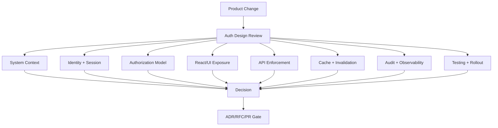
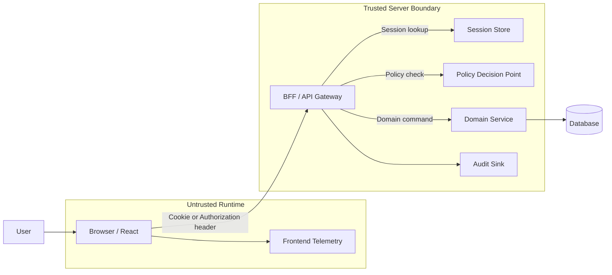
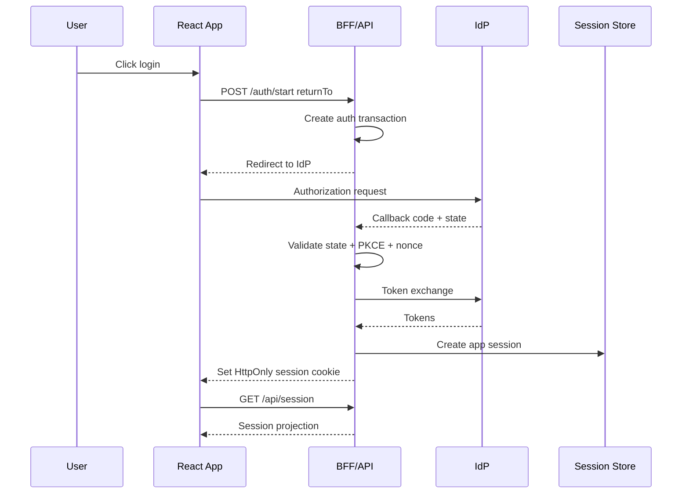
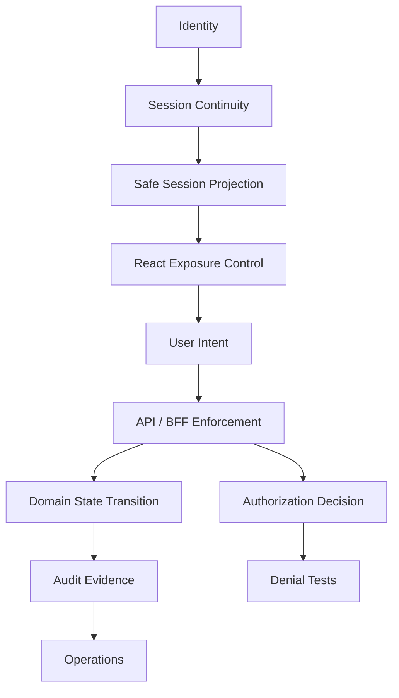

# Part 127 — Auth Design Review Template

Auth design review is not a meeting where people ask, “Do we have login?”

It is a structured attempt to prevent an architecture from trusting the wrong thing.

A good review answers:

- what identity is being asserted;
- how the session is continued;
- where authorization is decided;
- where authorization is enforced;
- what the UI is allowed to reveal;
- how permissions change;
- how stale state is invalidated;
- how failures are recovered;
- how sensitive events are audited;
- how denial paths are tested.

If a review does not produce concrete invariants, it is not finished.

This part gives a production-ready design review template for React auth systems.

Use it for:

- RFC review;
- ADR review;
- PR design review;
- security sign-off;
- migration planning;
- vendor integration review;
- incident-driven redesign;
- regulated workflow review.

The goal is not bureaucracy.

The goal is to make the system hard to misunderstand.

---

## 1. Review output

Every auth design review should produce three artifacts:

1. **A decision** — approve, approve with constraints, reject, or require redesign.
2. **A risk register** — accepted, mitigated, transferred, or unresolved risks.
3. **A test and rollout plan** — what must pass before release.

A review without explicit output becomes oral history.

Oral history does not protect production systems.

Recommended review decision format:

```mdx
## Decision

Status: Approved with constraints

Constraints:
- Do not store refresh tokens in localStorage.
- All case mutation endpoints must enforce object-level authorization server-side.
- Route-level guards are allowed only as UI/data-loading protection, not as enforcement.
- `/api/session` and `/api/permissions` must return `authEpoch` and `permissionEpoch`.
- Logout must clear React Query cache and broadcast to same-origin tabs.

Required before release:
- Authorization matrix tests for case actions.
- E2E tenant isolation tests.
- Security review of OAuth callback and return URL normalization.
- Audit event coverage for role change, case assignment, denial, and break-glass access.
```

---

## 2. Review map



The review must cover both design and operation.

Auth design that cannot be operated safely is incomplete.

---

## 3. When a design review is mandatory

Do not review every button.

Do review every boundary shift.

A formal auth design review is mandatory when a change includes any of these:

| Change | Why review is needed |
|---|---|
| New login flow | Changes identity/session establishment. |
| OAuth/OIDC callback change | Redirect and token exchange risks. |
| New auth provider | SDK, token, claims, SSO, deprovisioning risk. |
| Session storage change | Token/cookie/browser threat model changes. |
| Permission model change | Access semantics can drift silently. |
| New role or privileged permission | Blast radius and escalation risk. |
| Tenant/org model change | Cross-tenant isolation risk. |
| New object-sharing feature | ACL/ReBAC/listing/search risk. |
| New admin console | Self-escalation, delegation, audit risk. |
| Impersonation/support access | Actor/subject confusion and privacy risk. |
| New export/download feature | Data exfiltration risk. |
| New realtime channel | Subscription and event-level authorization risk. |
| New offline/cache feature | Stale privilege and data leakage risk. |
| SSR/RSC/BFF migration | Runtime boundary and cache risk. |
| Security incident remediation | Regression prevention and evidence quality. |

A simple rule:

> If a user can gain, lose, delegate, impersonate, export, mutate, or reveal access, review it.

---

## 4. Minimum review participants

Auth review fails when only frontend engineers attend.

Required participants depend on risk:

| Role | Required when |
|---|---|
| Frontend engineer | Always. |
| Backend/API engineer | Always when data or mutation is involved. |
| Security engineer | OAuth, session, admin, regulated, multi-tenant, high-risk changes. |
| Product owner | Access semantics affect user experience or business policy. |
| Domain expert | Workflow/state-based authorization. |
| SRE/platform | Cache, BFF, edge, incident, observability, rate limit, token vault. |
| Privacy/compliance | PII, audit, regulated workflow, impersonation, export. |

Do not let review ownership become ambiguous.

One person owns closure.

---

## 5. The one-page review summary

Every review starts with a one-page summary.

```mdx
# Auth Design Review Summary

Feature / change:
Owner:
Date:
Reviewers:
Risk level: Low | Medium | High | Critical
Status: Draft | In review | Approved | Rejected | Superseded

## What is changing?

## Who are the subjects?

## What resources are protected?

## What actions are introduced or changed?

## What contexts matter?

## Where is authorization decided?

## Where is authorization enforced?

## What does React render differently?

## What data is sent to the browser?

## What is cached?

## What must be audited?

## What can go wrong?

## Required tests before release

## Open risks / accepted risks
```

If this summary is hard to fill out, the design is probably still vague.

---

## 6. System context section

Start with the system boundary.

Auth decisions are impossible to review without seeing request paths.

Required context:

- deployment mode: SPA, SSR, BFF, Next.js, React Router, hybrid;
- identity provider: internal, Auth0, Cognito, Clerk, WorkOS, Entra ID, custom;
- session model: cookie, bearer token, BFF session, hybrid;
- API shape: REST, GraphQL, BFF endpoints, server actions;
- data sensitivity: public, internal, PII, regulated, financial, case/evidence;
- tenant model: single-tenant, multi-tenant, org/project/resource hierarchy;
- permission model: RBAC, ABAC, ReBAC, ACL, workflow-state rules;
- runtime: browser, Node, Edge, service worker;
- cache layers: browser, query cache, CDN, service worker, server cache;
- audit requirements.

Template:

```mdx
## System Context

Runtime:
- Browser:
- Server runtime:
- Edge runtime:
- Service worker:

Architecture:
- SPA / SSR / BFF:
- Router/data loading:
- API boundary:
- Token/session owner:

Identity:
- IdP:
- Protocol:
- User mapping:
- Tenant mapping:

Protected data:
- Resource types:
- Sensitivity:
- Export/download allowed:

Authorization:
- Model:
- PDP:
- PEP:
- Policy source:
- Permission projection endpoint:

Cache:
- Browser cache:
- Query cache:
- Server cache:
- CDN cache:
- Service worker cache:
```

---

## 7. Trust boundary diagram

Every review must include a diagram.

Not a decorative diagram.

A trust boundary diagram.

Example:



Review questions:

- Which component receives untrusted input?
- Which component stores secrets?
- Which component validates session?
- Which component enforces permission?
- Which component can mutate resources?
- Which component writes audit events?
- Which component can leak sensitive data to logs/analytics?

The browser is a useful runtime.

It is not the authority.

---

## 8. Identity review

Identity review answers one question:

> Who is this subject in our domain?

Not “what did the IdP say?”

The IdP provides claims.

The application maps those claims into domain identity.

Required review items:

| Item | Question |
|---|---|
| Stable subject ID | What IdP claim maps to internal user? |
| Account linking | Can multiple IdP identities map to one account? |
| Email trust | Is email verified? Is email used as identifier? |
| Tenant membership | Where does tenant membership come from? |
| Deprovisioning | How does access disappear? |
| Disabled account | How is local disable enforced? |
| JIT provisioning | What defaults are assigned? |
| Profile claims | Which claims are safe to show? |
| External groups | Are groups trusted as roles or only inputs? |
| Assurance | Do we track MFA/step-up/auth freshness? |

Bad design smell:

```ts
const userId = idToken.email;
```

Better:

```ts
type IdentityBinding = {
  internalUserId: UserId;
  idpIssuer: string;
  idpSubject: string;
  email?: string;
  emailVerified: boolean;
  createdAt: Instant;
  lastSeenAt: Instant;
};
```

Email changes.

Subject identifiers should be stable.

---

## 9. Authentication flow review

Authentication review checks how the user becomes authenticated.

Required flow diagram:



Review questions:

- Is this OAuth/OIDC, SAML, password, magic link, passkey, or custom auth?
- Is Authorization Code with PKCE used for browser/OIDC flows?
- Where is `state` generated and validated?
- Where is `nonce` generated and validated?
- Where is the PKCE verifier stored?
- Is the callback route excluded from normal auth redirect guards?
- Is `returnTo` internal-only and normalized?
- Are protocol errors handled without leaking sensitive details?
- Is the callback URL cleaned after completion?
- Is there redirect-loop detection?
- Is authentication separated from authorization?

A login flow is a protocol boundary.

Do not treat it as a page transition.

---

## 10. Session review

Session review answers:

> How does the system remember the authenticated subject?

Required questions:

| Area | Questions |
|---|---|
| Session identifier | Opaque? Random? Rotated at privilege boundaries? |
| Storage | HttpOnly cookie, memory token, BFF token vault, other? |
| Cookie attributes | `Secure`, `HttpOnly`, `SameSite`, path/domain, `__Host-` prefix? |
| Expiry | Idle timeout, absolute timeout, refresh policy? |
| Revocation | How is logout/revoke enforced server-side? |
| Refresh | Rotation? Reuse detection? Single-flight refresh? |
| Multi-tab | Logout broadcast? Refresh lock? Tenant switch broadcast? |
| Back button | Sensitive page after logout? bfcache handling? |
| Cache cleanup | Query cache, storage, service worker, browser cache? |
| Forced logout | How do we invalidate all sessions? |

Template:

```mdx
## Session Model

Session strategy:
- Cookie session / BFF / bearer / hybrid:

Session owner:
- Browser can read session secret? yes/no
- Server can revoke session? yes/no

Lifetime:
- Access token TTL:
- Refresh token/session TTL:
- Idle timeout:
- Absolute timeout:

Rotation:
- On login:
- On privilege elevation:
- On tenant switch:
- On refresh:

Revocation:
- Logout:
- Admin forced revoke:
- Password reset:
- Role/permission critical change:
```

If the frontend can read a long-lived credential, the review must explicitly accept that risk or redesign.

---

## 11. Authorization model review

Authorization review uses the core tuple:

```ts
can(subject, action, resource, context) -> decision
```

Required model:

```ts
type AuthorizationDecision = {
  allowed: boolean;
  reason?:
    | 'not_authenticated'
    | 'missing_permission'
    | 'not_resource_member'
    | 'wrong_tenant'
    | 'invalid_state'
    | 'requires_step_up'
    | 'conflict_of_interest'
    | 'separation_of_duties'
    | 'policy_unavailable';
  obligations?: Array<'audit' | 'mask_pii' | 'require_comment' | 'require_step_up'>;
  policyVersion: string;
  evaluatedAt: string;
};
```

Review questions:

- What are the protected resource types?
- What are the protected actions?
- Are actions domain-specific or CRUD-only?
- What subject attributes matter?
- What resource attributes matter?
- What environment/context attributes matter?
- Are there workflow-state rules?
- Are there separation-of-duties rules?
- Are there conflict-of-interest rules?
- Are there temporary grants?
- Are there inherited permissions?
- Are there delegated admin rules?
- Are there break-glass rules?
- Is deny-by-default implemented?
- Are denial reasons safe to expose?

Bad smell:

```ts
if (user.role === 'admin') allow();
```

Better:

```ts
can(user, 'case.assign', caseResource, {
  tenantId,
  workflowState: caseResource.state,
  actorAssignment: currentAssignment,
  requestTime: now,
});
```

Roles may be inputs.

They should not be the entire policy.

---

## 12. Enforcement review

This is the most important part.

Ask:

> Where is the access actually denied?

Possible enforcement points:

| Layer | Can enforce? | Notes |
|---|---:|---|
| React component | No | Exposure control only. |
| Route loader | Partly | Can block data load/navigation, not API bypass. |
| Route action | Partly | Useful for framework-managed mutations, not all APIs. |
| BFF/API endpoint | Yes | Primary enforcement boundary. |
| Domain service | Yes | Strong place for business authorization. |
| Database/RLS | Sometimes | Useful defense-in-depth; not enough alone. |
| Storage object policy | Sometimes | Required for file/object access. |
| Policy engine | Decides | PDP, not necessarily enforcement. |

Required evidence:

```mdx
## Enforcement Map

| Action | UI projection | Route guard | API/BFF enforcement | Domain enforcement | Audit |
|---|---|---|---|---|---|
| case.view | menu + route | loader | GET /cases/:id | CaseService.view | optional |
| case.assign | button | action guard | POST /cases/:id/assign | CaseService.assign | required |
| case.export | button | action guard | POST /cases/:id/export | ExportService.create | required |
```

If the table says “UI only”, reject the design.

---

## 13. React exposure review

React is responsible for truthful exposure.

Not enforcement.

Review questions:

- What is hidden?
- What is disabled?
- What is shown with explanation?
- What requires step-up?
- What triggers access request?
- What data is omitted from the browser entirely?
- What data is masked?
- What data remains in DOM after being hidden?
- What data is cached in query cache?
- What data appears in URL, logs, analytics, or error messages?

Permission-aware UI matrix:

| State | UI behavior |
|---|---|
| Unknown permission | Deny-by-default skeleton or no action. |
| Allowed | Render action normally. |
| Denied with safe reason | Disable/explain or hide based on sensitivity. |
| Requires step-up | Render step-up affordance. |
| Pending access request | Show status, not privileged UI. |
| Stale permission | Revalidate or deny action. |

Do not render sensitive data and hide it with CSS.

That is not protection.

---

## 14. Route and data-loading review

React Router/Next.js route design should be reviewed because auth frequently leaks through data loading.

Required questions:

- Does the protected route fetch data before auth is known?
- Is auth checked in loader/server boundary before component render?
- Are route actions authorized before mutation?
- Is route metadata aligned with server policy?
- Are direct URLs handled correctly?
- Are nested layouts safe?
- Does pending UI reveal sensitive resource names?
- Does error boundary leak existence of forbidden resources?
- Are `401`, `403`, `404`, `409`, and step-up errors typed?
- Is `returnTo` normalized and internal-only?

Route metadata example:

```ts
export const handle = {
  auth: {
    requiresAuth: true,
    tenantScoped: true,
    permissions: ['case.view'],
  },
};
```

Server enforcement still must exist.

Route metadata is a projection and navigation aid.

---

## 15. API contract review

An auth design must include API contracts.

Minimum contracts:

```ts
type SessionProjection = {
  status: 'anonymous' | 'authenticated' | 'expired' | 'degraded';
  authEpoch: string;
  permissionEpoch?: string;
  user?: {
    id: string;
    displayName: string;
  };
  tenant?: {
    id: string;
    name: string;
  };
  assurance?: {
    level: 'aal1' | 'aal2' | 'aal3';
    authTime: string;
  };
};
```

```ts
type PermissionProjection = {
  subjectId: string;
  tenantId: string;
  permissionEpoch: string;
  policyVersion: string;
  actions: Record<string, AuthorizationDecision>;
};
```

Review questions:

- Does `/session` expose only necessary identity data?
- Does `/permissions` include version/epoch?
- Are permission names stable and domain-specific?
- Are denied responses typed?
- Are cache headers safe?
- Does the API avoid exposing internal policy traces?
- Are problem details safe for user-visible errors?
- Are correlation IDs available for support?

Bad contract:

```json
{
  "role": "admin"
}
```

Better contract:

```json
{
  "permissionEpoch": "perm_2026_07_08_001",
  "actions": {
    "case.assign": {
      "allowed": false,
      "reason": "separation_of_duties"
    },
    "case.comment": {
      "allowed": true
    }
  }
}
```

---

## 16. Token and claim review

Review every token by purpose.

| Token | Intended consumer | Browser readable? | Used for authorization? |
|---|---|---:|---:|
| ID Token | Client/RP | Sometimes | No, not API authorization. |
| Access Token | Resource server | Sometimes | Server-side validation only. |
| Refresh Token | Authorization server/client backend | Prefer no | No direct resource access. |
| App session cookie | App server/BFF | No if HttpOnly | Session lookup only. |

Questions:

- What is the token audience?
- Who validates issuer/audience/signature/expiry?
- Is any token stored in localStorage/sessionStorage?
- Are refresh tokens rotated?
- Are tokens ever placed in URLs?
- Are claims used only as hints in React?
- Are authorization decisions derived server-side from fresh policy?
- Are token errors distinguishable from permission errors?

Reject designs where:

- ID Token is sent to API as access credential;
- frontend decodes JWT and grants UI/admin access from claims;
- refresh token is long-lived in localStorage;
- token appears in URL query/hash;
- token expiry is ignored until random failures occur.

---

## 17. Cache and invalidation review

Auth bugs often survive in cache.

Review every cache layer:

| Cache | Risk | Required control |
|---|---|---|
| React state | Stale session/permission | Auth epoch, logout reset. |
| Query cache | Cross-user/tenant leak | Scope keys by auth/tenant/permission epoch. |
| Browser cache | Sensitive page after logout | `Cache-Control: no-store`. |
| CDN cache | Shared private response | `private`, `no-store`, `Vary`. |
| Service worker cache | Persistent sensitive data | Avoid or partition and purge. |
| SSR/RSC cache | Cross-user render leak | Dynamic rendering, session-scoped cache discipline. |
| Local/session storage | Sensitive leakage | Avoid secrets; clear on logout. |

Required questions:

- Which auth projections are cached?
- What key dimensions include tenant/user/permission version?
- What invalidates permission cache?
- What happens on role change?
- What happens on tenant switch?
- What happens on logout?
- What happens on forced revocation?
- What happens on browser back/forward cache restore?
- Are sensitive responses `no-store`?

A safe design does not rely on the user closing the tab.

---

## 18. Multi-tenant review

For multi-tenant systems, tenant isolation is part of auth.

Required questions:

- Is tenant selected explicitly or inferred?
- Can a user belong to multiple tenants?
- Does session projection include active tenant?
- Are all query keys tenant-scoped?
- Are all API routes tenant-scoped server-side?
- Can tenant ID be tampered with in URL/body/header?
- Is tenant membership checked on every request?
- Is tenant switch audited?
- Are permissions recalculated on tenant switch?
- Is SSO tenant routing safe?
- Are invitations tenant-scoped?
- Are exports tenant-scoped?
- Are search/list endpoints tenant-scoped?

Tenant review table:

```mdx
| Resource | Tenant source | Server verifies membership? | Cache scoped? | Audit includes tenant? |
|---|---|---|---|---|
| Case | path param | yes | yes | yes |
| Document | case relation | yes | yes | yes |
| Export | server lookup | yes | yes | yes |
```

If tenant isolation is left to frontend filtering, reject the design.

---

## 19. Workflow authorization review

Regulated and complex products rarely have static permissions.

Access depends on state.

Example:

```ts
can(user, 'case.approve', case, {
  workflowState: 'ready_for_approval',
  actorCreatedCase: false,
  actorAssignedToCase: true,
  tenantId,
});
```

Review questions:

- What workflow states exist?
- What actions are legal per state?
- Which actions require assignment?
- Which actions require supervisor role?
- Which actions are prohibited by separation of duties?
- Which actions require a reason/comment?
- Which transitions require audit?
- Which transitions require step-up auth?
- Which transitions are irreversible?
- What happens if resource state changes between render and submit?

State/action matrix:

```mdx
| State | Action | Permission | Extra condition | Audit | UI |
|---|---|---|---|---|---|
| draft | submit | case.submit | owner or assignee | yes | enabled if allowed |
| submitted | approve | case.approve | not creator | yes | disabled with reason |
| approved | reopen | case.reopen | supervisor | yes | step-up |
```

Workflow authorization belongs in the domain service.

React can only mirror it.

---

## 20. Admin and delegation review

Admin features are authorization systems for authorization systems.

They need stronger review.

Required questions:

- Who can grant permissions?
- Can an admin grant permissions they do not possess?
- Can an admin grant themselves privileged access?
- Are grants scoped by tenant/resource?
- Are grants temporary or permanent?
- Are grants approved before activation?
- Is there blast-radius preview?
- Is there diff preview?
- Is every grant/revoke audited?
- Is rollback possible?
- Is step-up required?
- Are dangerous roles protected by two-person approval?

Admin console rejection criteria:

- no audit trail;
- no preview of affected users/resources;
- self-escalation allowed silently;
- no tenant scope;
- no rollback plan;
- no test matrix;
- role names hardcoded in many components.

---

## 21. Impersonation review

Impersonation is high-risk.

Required questions:

- Is actor identity separate from subject identity?
- Is impersonation view-only or action-capable?
- Are sensitive actions blocked?
- Is a persistent banner shown?
- Is every action audited with actor and subject?
- Is PII masked when possible?
- Is user consent required?
- Is there an expiry?
- Can impersonation be delegated?
- Is step-up required before starting?
- Does logout end impersonation only or the whole session?
- Are caches isolated between actor and subject?

Audit event shape:

```ts
type ImpersonationAuditEvent = {
  eventType: 'impersonation.started' | 'impersonation.ended' | 'impersonated.action';
  actorUserId: string;
  subjectUserId: string;
  tenantId: string;
  reason: string;
  supportTicketId?: string;
  correlationId: string;
  occurredAt: string;
};
```

If impersonation cannot be explained later, do not ship it.

---

## 22. Access request review

Access request is not a workaround for denial.

It is a controlled workflow.

Required questions:

- What exact access is requested?
- What resource is in scope?
- Is the request temporary?
- Who approves?
- Can requester approve their own request?
- Are duplicate requests collapsed?
- Is expiry enforced?
- Is revocation available?
- Is approval audited?
- Does permission cache invalidate after approval?
- Does UI distinguish pending vs granted?
- Are denial reasons safe?

Request access data model:

```ts
type AccessRequest = {
  id: string;
  requesterId: string;
  tenantId: string;
  resourceType: string;
  resourceId?: string;
  action: string;
  reason: string;
  status: 'pending' | 'approved' | 'denied' | 'expired' | 'cancelled';
  requestedAt: string;
  expiresAt?: string;
};
```

---

## 23. Threat model review

Threat modeling is the bridge between “works” and “survives abuse”.

Minimum auth threat categories:

| Threat | Example |
|---|---|
| Spoofing | Forged identity, callback manipulation. |
| Tampering | Changing resource ID, tenant ID, role field. |
| Repudiation | No audit for privileged action. |
| Information disclosure | Hidden DOM data, cache leak, forbidden object existence. |
| Denial of service | Lockout abuse, refresh storm, redirect loop. |
| Elevation of privilege | Role drift, self-grant, stale permission cache. |

Threat model template:

```mdx
## Threat Model

Assets:
- Session credentials
- PII/profile data
- Case/document data
- Permission grants
- Audit events

Trust boundaries:
- Browser -> BFF/API
- BFF/API -> policy service
- BFF/API -> domain service
- Domain service -> database/storage

Threats:
| Threat | Scenario | Impact | Mitigation | Test |
|---|---|---|---|---|
| BOLA | User changes case ID | data leak | object-level auth | direct API test |
| CSRF | Cross-site POST | unauthorized mutation | CSRF token + SameSite | CSRF test |
| XSS | Malicious rich text | session abuse | sanitize + CSP | XSS fixture |
```

Do not demand a 50-page threat model.

Demand a useful one.

---

## 24. Security controls review

Map the design to controls.

Example:

```mdx
| Control area | Design control | Evidence |
|---|---|---|
| Authentication | OIDC Authorization Code + PKCE | callback test + provider config |
| Session | HttpOnly `__Host-` cookie | response header test |
| CSRF | signed CSRF token + SameSite | mutation test |
| Authorization | server-side `can()` on every mutation | API tests |
| Object-level auth | resource lookup scoped by tenant/member | BOLA tests |
| Cache | `no-store` on sensitive responses | header tests |
| Audit | privileged action audit event | event contract tests |
| Observability | correlation ID across frontend/backend | trace tests |
```

Use control mapping to catch missing implementation evidence.

A control without evidence is a wish.

---

## 25. Privacy review

Auth systems frequently process PII.

Review questions:

- What PII is included in session projection?
- Is email needed in React state?
- Is profile data sent to analytics?
- Are denial messages leaking membership/resource existence?
- Are audit events over-collecting PII?
- Are screenshots/session replay tools enabled on auth screens?
- Is PII masked during impersonation/support?
- Is retention defined for audit/support logs?
- Are source maps publicly accessible?
- Are error boundaries redacting sensitive context?

Default rule:

> Send the smallest identity projection needed for the current UI.

Do not treat `/me` as a dumping ground.

---

## 26. Observability review

Auth observability must answer:

- is login broken?
- is refresh storming?
- are users being denied unexpectedly?
- is one tenant seeing another tenant’s resources?
- did a permission change produce a spike?
- did a deployment break callback handling?
- did a provider outage degrade the app?

Required signals:

| Signal | Example |
|---|---|
| Login funnel | start, callback, exchange, session created. |
| Session bootstrap | success, anonymous, expired, degraded. |
| Refresh | success, failure, reuse detection, storm. |
| Authorization | allow/deny by action/resource/tenant. |
| Route denial | route, reason, user safe identifier. |
| Callback error | invalid state, nonce mismatch, provider error. |
| Tenant switch | success/failure/cache reset. |
| Audit sink | write success/failure. |
| Cache cleanup | logout/query reset/service worker purge. |

Do not log tokens.

Do not log raw ID tokens.

Do not log full policy traces to client telemetry.

---

## 27. Audit review

Audit is not debug logging.

Audit records accountability.

Required audit events:

- login success/failure if appropriate;
- logout;
- session revoked;
- tenant switched;
- role granted/revoked;
- permission granted/revoked;
- access request created/approved/denied/expired;
- admin impersonation started/ended;
- privileged action attempted;
- privileged action denied;
- break-glass access;
- sensitive export/download;
- policy changed;
- configuration changed.

Audit event contract:

```ts
type AuditEvent = {
  id: string;
  eventType: string;
  actorUserId?: string;
  subjectUserId?: string;
  tenantId?: string;
  resourceType?: string;
  resourceId?: string;
  action?: string;
  outcome: 'success' | 'failure' | 'denied';
  reasonCode?: string;
  correlationId: string;
  occurredAt: string;
  metadata?: Record<string, unknown>;
};
```

Review questions:

- Who is actor?
- Who is subject?
- What changed?
- What resource was affected?
- What policy allowed or denied it?
- Can the event be correlated to API request?
- Is metadata safe and redacted?
- Is audit write failure handled deliberately?

---

## 28. Testing review

Every design must include denial tests.

Minimum test categories:

| Test type | Required coverage |
|---|---|
| Unit | `can()` matrix, deny-by-default, state rules. |
| Component | hidden/disabled/explained UI, field permission. |
| Router | loader redirect, action 403, return URL safety. |
| Contract | `/session`, `/permissions`, typed errors, headers. |
| API | object-level auth, tenant isolation, mutation denial. |
| E2E | login/logout/session expiry/tenant switch/step-up. |
| Security | XSS, CSRF, open redirect, BOLA/IDOR, cache leak. |
| Operations | forced logout, provider outage, permission change. |

Required design review output:

```mdx
## Required Tests

- [ ] API denies case update when user lacks `case.update`.
- [ ] API denies cross-tenant case read by changing `caseId`.
- [ ] Route loader redirects anonymous user to login with safe `returnTo`.
- [ ] Action returns typed `403` and does not mutate resource.
- [ ] Logout clears query cache and broadcasts to other tabs.
- [ ] Permission grant increments `permissionEpoch` and invalidates UI.
- [ ] Export endpoint audits success and denial.
```

If tests only prove the happy path, the design is not ready.

---

## 29. Rollout review

Auth changes need cautious rollout.

Review questions:

- Can the change be rolled out gradually?
- Is there a shadow evaluation mode?
- Is there a kill switch?
- What metrics prove safety?
- What is the rollback path?
- Are old and new permission models compatible during migration?
- What happens to existing sessions?
- Is cache invalidation required at deploy time?
- Does the rollout require user re-auth?
- Is support prepared for denial changes?

Rollout plan template:

```mdx
## Rollout Plan

Phase 1: Shadow evaluate policy
- Log new decision without enforcement.
- Compare old/new decisions.

Phase 2: Internal tenants only
- Enforce new policy for internal tenant.
- Monitor 403 rate and support tickets.

Phase 3: Gradual tenant rollout
- Enable by tenant cohort.
- Watch deny spike, latency, error budget.

Rollback:
- Disable new policy flag.
- Restore old projection endpoint.
- Invalidate permission cache.
```

Do not ship a new authorization model with no rollback plan.

---

## 30. Decision scoring rubric

Use a scoring rubric for high-risk changes.

| Dimension | 0 | 1 | 2 |
|---|---|---|---|
| Boundary clarity | unclear | partial | explicit |
| Server enforcement | missing | partial | complete |
| Permission model | role-only | mixed | action/resource/context |
| Object-level auth | missing | partial | complete |
| Tenant isolation | missing | partial | complete |
| Cache invalidation | missing | partial | complete |
| Denial handling | generic | partial | typed + recoverable |
| Audit | missing | partial | complete |
| Testing | happy path | partial denial | full denial/security matrix |
| Rollout | big bang | partial | staged + rollback |

Suggested decision:

- **0–9:** reject/redesign.
- **10–15:** approve only with blocking constraints.
- **16–20:** approve with normal follow-up.

Do not let scoring replace judgment.

Use it to expose gaps.

---

## 31. Common review traps

### Trap 1: “The frontend hides the button.”

Ask: what happens if I call the API directly?

### Trap 2: “The route is protected.”

Ask: what happens if cached data already exists?

### Trap 3: “The JWT contains the role.”

Ask: is the claim fresh, scoped, and authoritative for this resource?

### Trap 4: “Only admins can access the page.”

Ask: which admin, in which tenant, for which resource, in which workflow state?

### Trap 5: “It is internal only.”

Ask: does internal mean authenticated, authorized, auditable, and least privilege?

### Trap 6: “We will add audit later.”

Ask: how will you prove what happened before later?

### Trap 7: “This is only a temporary migration.”

Ask: what is the deletion date for the old path?

---

## 32. Reusable review checklist

Use this as the final review gate.

### Identity

- [ ] Stable internal user ID exists.
- [ ] IdP subject mapping is explicit.
- [ ] Email is not used as sole immutable identity.
- [ ] Tenant membership source is defined.
- [ ] Deprovisioning path is defined.
- [ ] Disabled users are denied server-side.

### Session

- [ ] Session secret is not readable by React unless explicitly accepted.
- [ ] Cookie attributes are correct if cookies are used.
- [ ] Session expiry is defined.
- [ ] Revocation is server-enforced.
- [ ] Logout clears browser and app caches.
- [ ] Multi-tab logout works.
- [ ] Refresh is single-flight and race-safe.

### Authorization

- [ ] Protected resources are listed.
- [ ] Protected actions are listed.
- [ ] Context attributes are listed.
- [ ] Permission model is deny-by-default.
- [ ] Server enforces every protected request.
- [ ] Object-level authorization is implemented.
- [ ] Tenant isolation is server-enforced.
- [ ] Workflow-state rules are represented.
- [ ] Separation-of-duties rules are represented where needed.

### React/UI

- [ ] UI is projection only.
- [ ] Unknown permission state is deny-by-default.
- [ ] Sensitive data is not sent to unauthorized clients.
- [ ] Menus/tables/forms/routes use consistent permission projection.
- [ ] Denial reasons are safe.
- [ ] Access request and step-up flows are explicit.

### API

- [ ] `/session` contract is minimal and typed.
- [ ] `/permissions` contract includes version/epoch.
- [ ] `401/403/404/409` semantics are consistent.
- [ ] Cache headers are safe.
- [ ] CSRF defense exists for cookie-backed mutations.
- [ ] Direct object ID manipulation is tested.

### Cache

- [ ] Query keys include user/tenant/permission dimensions.
- [ ] Logout clears query cache.
- [ ] Tenant switch clears scoped cache.
- [ ] Permission changes invalidate permission projection.
- [ ] Sensitive responses use `no-store`.
- [ ] Service worker cache is safe or disabled for sensitive data.

### Audit and observability

- [ ] Privileged actions are audited.
- [ ] Permission changes are audited.
- [ ] Impersonation is audited with actor and subject.
- [ ] Denials are observable without leaking sensitive details.
- [ ] Correlation ID connects frontend/backend/audit.
- [ ] Logs do not contain tokens or PII unnecessarily.

### Testing

- [ ] Unit permission matrix exists.
- [ ] Component denial tests exist.
- [ ] Route loader/action auth tests exist.
- [ ] API object-level auth tests exist.
- [ ] E2E login/logout/expiry tests exist.
- [ ] Security tests cover XSS, CSRF, open redirect, BOLA/IDOR.
- [ ] CI blocks dangerous auth anti-patterns.

### Rollout

- [ ] Migration plan exists.
- [ ] Rollback path exists.
- [ ] Metrics/alerts exist.
- [ ] Support runbook exists.
- [ ] Incident runbook exists.

---

## 33. Review decision template

```mdx
# Auth Design Review Decision

Feature:
Owner:
Review date:
Reviewers:
Decision: Approved | Approved with constraints | Rejected | Deferred

## Summary

## Approved architecture

## Required invariants

1.
2.
3.

## Required implementation changes

- [ ]
- [ ]
- [ ]

## Required tests

- [ ]
- [ ]
- [ ]

## Accepted risks

| Risk | Impact | Reason accepted | Expiry / revisit date |
|---|---|---|---|

## Rejected alternatives

## Follow-up ADRs

## Release gate

This feature cannot be released until:

- [ ]
- [ ]
- [ ]
```

Risk acceptance must expire.

Permanent risk acceptance is usually forgotten risk.

---

## 34. Example: reviewing a new “assign case” feature

Feature:

> Supervisors can assign a case to an investigator.

Naive review:

```tsx
{user.role === 'supervisor' && <AssignCaseButton />}
```

Correct review questions:

- Is the actor a supervisor in the active tenant?
- Is the case in an assignable state?
- Is the actor allowed to see this case?
- Is the selected investigator a member of the tenant?
- Is the selected investigator eligible for this case type?
- Does assignment violate conflict-of-interest rules?
- Does assignment require audit?
- Does assignment invalidate list/detail/cache permissions?
- What if the case state changes between render and submit?
- What if the actor loses supervisor role before submit?

Decision table:

```mdx
| Check | Layer |
|---|---|
| Button visibility | React permission projection |
| Route/action guard | React Router action |
| Subject tenant membership | API/BFF |
| Case object-level access | Domain service |
| Workflow state | Domain service |
| Investigator eligibility | Domain service |
| Separation of duties | Policy/domain service |
| Audit event | API/domain/audit sink |
```

Required tests:

- allowed supervisor can assign eligible case;
- non-supervisor sees no assign action;
- direct API call by non-supervisor returns 403;
- supervisor from another tenant returns 404 or 403 by policy;
- assignment to ineligible investigator fails;
- stale state transition fails with 409;
- successful assignment writes audit event;
- permission epoch invalidates affected views.

This is the difference between a UI feature and a defensible system.

---

## 35. Final mental model

Auth design review is boundary review.

It asks:

- What is trusted?
- Why is it trusted?
- Where is it verified?
- Where can it go stale?
- How does it fail?
- How do we prove it fails safely?

A strong React auth design is not the one with the most abstractions.

It is the one where every layer has a narrow job:



React shows what the user can attempt.

The server decides what the user can do.

The domain enforces what is valid.

Audit proves what happened.

Tests prove what must never happen.

That is the review standard.
