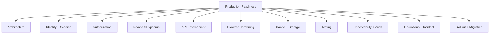
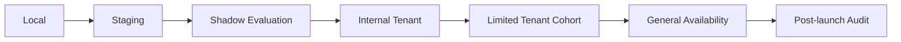
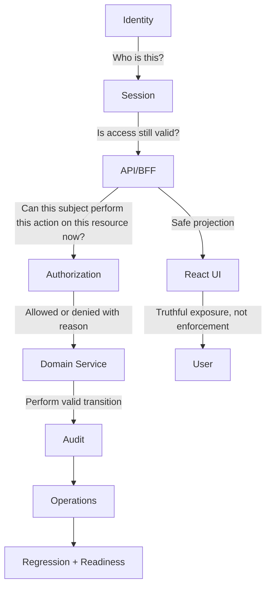

# Part 128 — Production Readiness Checklist

A React auth system is production-ready when it fails safely.

Not when login works.

Not when the protected route redirects.

Not when the demo user can see the dashboard.

Production-ready means:

- unauthorized access is denied server-side;
- stale privilege does not silently persist;
- tokens and sessions have bounded lifetime;
- sensitive data is not cached in the wrong place;
- logout actually removes usable access;
- tenant isolation is enforced under direct API calls;
- denial paths are typed, tested, observable, and supportable;
- incidents have runbooks;
- rollback does not require guessing.

This checklist is intentionally operational.

Use it before launch, migration, security review, or major auth refactor.

---

## 1. Readiness model



Do not treat these as independent.

Example:

- session expiry requires API behavior;
- API behavior requires React recovery UI;
- React recovery UI requires typed error contracts;
- typed error contracts require tests;
- tests require fixtures;
- production debugging requires telemetry;
- telemetry requires redaction.

Auth readiness is systemic.

---

## 2. Release status levels

Use explicit status.

| Status | Meaning |
|---|---|
| Not ready | Known critical gaps. |
| Dev-ready | Works locally; not hardened. |
| Staging-ready | Integrated with realistic provider/session/policy. |
| Limited production | Safe for selected tenants/users behind controls. |
| Production-ready | Meets security, reliability, testing, and operational gates. |
| High-risk production-ready | Meets extra controls for regulated/admin/multi-tenant/high-value data. |

Do not call a system production-ready because happy-path E2E passes.

---

## 3. Non-negotiable gates

These are blocking.

If any fail, do not launch.

### Blocking security gates

- [ ] Every protected API request enforces authorization server-side.
- [ ] Object-level authorization is tested for ID-bearing endpoints.
- [ ] Tenant isolation is enforced server-side.
- [ ] React route/component guards are not treated as enforcement.
- [ ] Tokens are not placed in URLs.
- [ ] Refresh tokens are not stored in localStorage.
- [ ] Session revocation works server-side.
- [ ] Logout invalidates server session and clears client caches.
- [ ] Sensitive authenticated responses are not publicly cacheable.
- [ ] Cookie-backed mutations have CSRF protection.
- [ ] OAuth/OIDC callback validates `state` and PKCE; OIDC flows validate nonce where applicable.
- [ ] Open redirect through `returnTo` or callback is prevented.
- [ ] Deny-by-default behavior exists for unknown permission state.
- [ ] Audit exists for privileged permission changes and impersonation.

### Blocking operational gates

- [ ] Production telemetry distinguishes `401`, `403`, expired session, tenant mismatch, and policy unavailable.
- [ ] Incident runbook exists for token leak/session revocation.
- [ ] Incident runbook exists for bad permission deploy.
- [ ] Rollback plan exists.
- [ ] Support can debug access denial without seeing secrets.
- [ ] Alerts exist for auth outage patterns.

---

## 4. Architecture readiness

### Required architecture artifacts

- [ ] Trust boundary diagram exists.
- [ ] Sequence diagram exists for login/session bootstrap.
- [ ] Sequence diagram exists for logout.
- [ ] Sequence diagram exists for permission-sensitive mutation.
- [ ] Authorization model is documented.
- [ ] Session model is documented.
- [ ] Token purpose is documented.
- [ ] Cache layers are documented.
- [ ] Audit event model is documented.
- [ ] ADR exists for session/token strategy.
- [ ] ADR exists for permission model.
- [ ] ADR exists for auth provider integration.

### Required architecture invariants

- [ ] Browser is not the authority for authorization.
- [ ] Frontend permission is projection only.
- [ ] Backend/API/domain service enforces access.
- [ ] Identity is mapped to internal subject before domain authorization.
- [ ] Tenant context is explicit and verified.
- [ ] Permission decisions include resource/action/context, not only role.
- [ ] Deny-by-default is documented and tested.
- [ ] Stale permission has a recovery path.
- [ ] Audit evidence exists for privileged changes.

Architecture is not ready if developers cannot explain where access is denied.

---

## 5. Identity readiness

### Identity mapping

- [ ] IdP issuer is recorded.
- [ ] IdP subject is mapped to stable internal user ID.
- [ ] Email is not the only immutable identifier.
- [ ] Email verification status is respected.
- [ ] Account linking rules are explicit.
- [ ] Duplicate account handling exists.
- [ ] Disabled user state is enforced server-side.
- [ ] Deleted/deprovisioned user state is enforced server-side.
- [ ] JIT provisioning defaults are least privilege.
- [ ] External groups are mapped deliberately, not blindly trusted.

### Tenant and organization identity

- [ ] User-to-tenant membership is explicit.
- [ ] Active tenant is part of session/projection.
- [ ] Tenant switch revalidates membership.
- [ ] Tenant switch invalidates scoped caches.
- [ ] SSO/org discovery cannot route user into wrong tenant.
- [ ] Invitations are tenant-scoped.
- [ ] Deprovisioned tenant membership immediately removes access or has a documented bounded delay.

### Profile data

- [ ] Session projection returns minimal profile data.
- [ ] `/me` does not expose unnecessary PII.
- [ ] Profile claims are not used as fresh authorization facts.
- [ ] Analytics/logs do not collect unnecessary identity fields.

---

## 6. Authentication flow readiness

### OAuth/OIDC readiness

- [ ] Authorization Code with PKCE is used for browser-based OAuth/OIDC flows.
- [ ] Implicit Flow is not used for new browser apps.
- [ ] `state` is cryptographically random and transaction-bound.
- [ ] PKCE verifier is single-use and bound to transaction.
- [ ] `nonce` is used and validated for OIDC ID Token flows.
- [ ] Redirect URI is exact and allowlisted at provider.
- [ ] Callback route is excluded from normal auth redirect loops.
- [ ] Callback errors are handled safely.
- [ ] Callback URL is cleaned after completion.
- [ ] Provider config is environment-specific.
- [ ] Provider secrets are never exposed to browser.

### Password/passkey/MFA readiness

- [ ] Password login, if used, has rate limiting and enumeration-resistant messaging.
- [ ] Password reset flow has replay/expiry protection.
- [ ] MFA enrollment/recovery is tested.
- [ ] Step-up auth exists for sensitive actions.
- [ ] Authentication freshness is represented in session or server-side context.
- [ ] Passkey/WebAuthn challenge is generated server-side and single-use.
- [ ] Recovery flows are audited.

### Error handling

- [ ] Login failure messages do not reveal account existence unnecessarily.
- [ ] Provider outage has degraded-state UX.
- [ ] Redirect-loop detector exists.
- [ ] Support can correlate login failure with safe correlation ID.

---

## 7. Session readiness

### Session storage

- [ ] Chosen session strategy is documented: cookie, BFF, bearer, hybrid.
- [ ] Long-lived credentials are not readable by JavaScript unless explicitly accepted and mitigated.
- [ ] HttpOnly cookies are used when browser should not read session secret.
- [ ] Cookies use `Secure` in production.
- [ ] Cookies use appropriate `SameSite` value.
- [ ] Cookie domain/path is narrowly scoped.
- [ ] `__Host-` prefix is used where applicable.
- [ ] Session identifiers are opaque and high entropy.

### Session lifecycle

- [ ] Session is created only after successful authentication.
- [ ] Session ID is regenerated at privilege boundaries.
- [ ] Idle timeout exists.
- [ ] Absolute timeout exists.
- [ ] Refresh behavior is defined.
- [ ] Server enforces session expiry.
- [ ] Server enforces revocation.
- [ ] Password reset/credential compromise revokes relevant sessions.
- [ ] Admin forced logout exists for incident response.

### Multi-tab/session coordination

- [ ] Logout propagates to same-origin tabs.
- [ ] Tenant switch propagates to same-origin tabs.
- [ ] Refresh is single-flight or race-safe.
- [ ] Hidden tab resumes with revalidation.
- [ ] Browser back/forward cache restore is handled.

### Session projection

- [ ] `/session` or equivalent exists.
- [ ] Projection includes auth status.
- [ ] Projection includes auth epoch/version.
- [ ] Projection includes permission epoch/version if permission projection is cached.
- [ ] Projection is minimal and PII-aware.
- [ ] Projection response has safe cache headers.

---

## 8. Token readiness

### Token purpose

- [ ] ID Token is not used as API access token.
- [ ] Access Token is used only for intended resource server/audience.
- [ ] Refresh Token is used only by appropriate client/backend boundary.
- [ ] Token audience is validated by server.
- [ ] Token issuer is validated by server.
- [ ] Token expiry is validated by server.
- [ ] Token signature is validated by server where applicable.
- [ ] Token scopes are not confused with product permissions.

### Token storage

- [ ] Access token storage is documented.
- [ ] Refresh token storage is documented.
- [ ] Token storage threat model is documented.
- [ ] Token is not stored in localStorage unless risk is explicitly accepted.
- [ ] Token is not logged.
- [ ] Token is not placed in URL.
- [ ] Token is not sent to analytics/telemetry.

### Token lifecycle

- [ ] Access tokens are short-lived.
- [ ] Refresh token rotation is enabled where applicable.
- [ ] Refresh token reuse detection exists where applicable.
- [ ] Token refresh handles multi-tab race.
- [ ] Token refresh handles network ambiguity.
- [ ] Token revocation path exists.
- [ ] Key rotation/JWKS caching behavior is tested.

---

## 9. Authorization model readiness

### Permission model

- [ ] Protected resource types are listed.
- [ ] Protected actions are listed.
- [ ] Subject attributes are listed.
- [ ] Resource attributes are listed.
- [ ] Context/environment attributes are listed.
- [ ] Permission model is not only raw role checks.
- [ ] Role-to-permission mapping exists if RBAC is used.
- [ ] Object-level grants exist if ACL is used.
- [ ] Attribute freshness is handled if ABAC is used.
- [ ] Relationship tuple consistency is handled if ReBAC is used.
- [ ] Workflow-state authorization is modeled where applicable.
- [ ] Separation-of-duties rules are modeled where applicable.
- [ ] Conflict-of-interest rules are modeled where applicable.

### Decision contract

- [ ] `allowed` is explicit.
- [ ] Denial reason is typed.
- [ ] Public denial reason is safe.
- [ ] Internal policy trace is not exposed to browser.
- [ ] Decision includes policy version.
- [ ] Decision includes evaluated time or epoch.
- [ ] Decision can represent step-up required.
- [ ] Decision can represent policy service unavailable.
- [ ] Decision can represent tenant mismatch.
- [ ] Decision can represent invalid resource state.

### Deny-by-default

- [ ] Unknown permission state denies privileged UI.
- [ ] Missing permission data denies privileged action.
- [ ] Policy service unavailable fails closed for high-risk actions.
- [ ] New actions are denied until mapped.
- [ ] New routes are denied until classified.
- [ ] New resource types are denied until policy exists.

---

## 10. API enforcement readiness

### Endpoint enforcement

- [ ] Every protected GET checks authorization.
- [ ] Every protected POST/PUT/PATCH/DELETE checks authorization.
- [ ] Every GraphQL resolver/business action checks authorization.
- [ ] Every file download checks object authorization.
- [ ] Every file upload intent checks authorization.
- [ ] Every export/report checks authorization.
- [ ] Every realtime subscription checks authorization.
- [ ] Every background job status endpoint checks authorization.
- [ ] Every admin endpoint checks authorization.

### Object-level authorization

- [ ] Resource lookup is tenant/member-scoped.
- [ ] Direct ID manipulation is denied.
- [ ] Bulk operations check each item.
- [ ] Search/list endpoints filter by authorization.
- [ ] Count endpoints do not reveal forbidden resources.
- [ ] Related objects inherit or verify access correctly.
- [ ] Signed URL generation requires authorization.
- [ ] Signed URL TTL is short and scoped.

### Error semantics

- [ ] `401` means unauthenticated or invalid/expired credentials.
- [ ] `403` means authenticated but not allowed.
- [ ] `404` is used deliberately to hide existence where policy requires.
- [ ] `409` is used for state/version conflicts.
- [ ] Step-up required has a typed response.
- [ ] Policy unavailable has a typed response.
- [ ] Error responses do not leak sensitive resource details.
- [ ] Correlation ID is included or available.

---

## 11. React/UI readiness

### Auth state UI

- [ ] Anonymous state is handled.
- [ ] Authenticating state is handled.
- [ ] Authenticated state is handled.
- [ ] Session refreshing state is handled.
- [ ] Session expired state is handled.
- [ ] Session revoked state is handled.
- [ ] Forbidden state is handled.
- [ ] Degraded auth state is handled.

### Permission-aware components

- [ ] `Can`/`Restricted`/`useCan` or equivalent exists.
- [ ] Authorized buttons use central permission primitives.
- [ ] Menus/sidebar use permission projection.
- [ ] Command palette uses permission projection.
- [ ] Table row actions use per-row decisions.
- [ ] Bulk actions handle mixed eligibility.
- [ ] Forms handle field-level permission.
- [ ] Hidden vs disabled vs explain policy is consistent.
- [ ] Access request UI exists where needed.
- [ ] Step-up UI exists where needed.

### Data exposure

- [ ] Restricted data is not sent to browser just because it is hidden.
- [ ] Restricted fields are omitted or masked server-side.
- [ ] Sensitive props are not passed into Client Components unnecessarily.
- [ ] Sensitive error details are not rendered.
- [ ] Sensitive data does not appear in URL.
- [ ] Sensitive data does not appear in analytics events.
- [ ] Sensitive data does not remain in DOM after permission loss.

### UX recovery

- [ ] User can recover from expired session.
- [ ] User can understand safe denial reasons.
- [ ] User can request access where product allows.
- [ ] User can retry after step-up.
- [ ] User can switch tenant safely.
- [ ] User is warned before losing unsaved work due to auth expiry where appropriate.

---

## 12. Routing and data loading readiness

### React Router/Data Router style

- [ ] Auth is checked in loaders for protected data.
- [ ] Mutations are authorized in actions.
- [ ] Protected route metadata is explicit.
- [ ] Nested layout access is reviewed.
- [ ] Pending UI does not reveal sensitive data.
- [ ] Error boundaries handle typed auth errors.
- [ ] Return URL is normalized and internal-only.
- [ ] Callback route avoids auth guard redirect loop.
- [ ] Revalidation after login/logout/tenant switch is correct.

### Next.js/App Router style

- [ ] Server Components do not pass secrets/sensitive objects to client boundary.
- [ ] Route Handlers enforce API authorization.
- [ ] Server Actions validate authorization server-side.
- [ ] Cookie reads/writes happen at valid runtime boundary.
- [ ] Middleware/Proxy only performs coarse auth where appropriate.
- [ ] RSC/SSR cache is session-safe.
- [ ] Layouts do not leak protected navigation/data.
- [ ] Hydration mismatch for auth state is handled.

---

## 13. Browser hardening readiness

### XSS

- [ ] No unsafe rich text rendering without sanitization.
- [ ] `dangerouslySetInnerHTML` usage is reviewed.
- [ ] Markdown rendering is sanitized.
- [ ] User-generated content is encoded/sanitized by context.
- [ ] CSP is deployed or rollout plan exists.
- [ ] Trusted Types is considered for high-risk apps.
- [ ] Third-party scripts are inventoried.
- [ ] Auth tokens are not accessible to injected JavaScript where avoidable.

### CSRF

- [ ] Cookie-backed state-changing requests have CSRF defense.
- [ ] SameSite policy is documented.
- [ ] CSRF token is session-bound or signed.
- [ ] Origin/Referer validation is used where appropriate.
- [ ] CORS does not accidentally authorize cross-origin mutation.
- [ ] Logout, file upload, GraphQL mutation, and admin endpoints are covered.

### Open redirect

- [ ] `returnTo` accepts only internal relative paths or allowlisted URLs.
- [ ] URL normalization prevents parser tricks.
- [ ] OAuth callback is not used as general redirect endpoint.
- [ ] Logout redirect is restricted.
- [ ] Step-up return URL is restricted.

### Headers

- [ ] `Content-Security-Policy` exists or has phased rollout.
- [ ] `Strict-Transport-Security` is enabled in production.
- [ ] `X-Content-Type-Options: nosniff` is set.
- [ ] `frame-ancestors` or `X-Frame-Options` prevents clickjacking.
- [ ] `Referrer-Policy` is set.
- [ ] `Permissions-Policy` is set where useful.
- [ ] `Cache-Control` is correct for sensitive responses.

---

## 14. Cache and storage readiness

### Browser and application cache

- [ ] Authenticated sensitive responses use `Cache-Control: no-store` where appropriate.
- [ ] Query cache is scoped by user/tenant/permission epoch.
- [ ] Query cache clears on logout.
- [ ] Query cache clears on tenant switch.
- [ ] Permission cache invalidates on permission epoch change.
- [ ] Local/session storage contains no secrets.
- [ ] IndexedDB contains no unprotected sensitive data.
- [ ] Service worker cache avoids sensitive authenticated data or partitions/purges safely.
- [ ] Back/forward cache restore triggers auth revalidation where needed.

### Server/CDN cache

- [ ] Personalized responses are not cached publicly.
- [ ] `Vary` headers are correct when using cookies/authorization headers.
- [ ] SSR/RSC cache does not reuse user-specific data across sessions.
- [ ] Edge cache does not cache authenticated private responses.
- [ ] Logout/forced logout has cache invalidation plan.

---

## 15. File and export readiness

- [ ] Upload intent endpoint checks authorization.
- [ ] File finalize endpoint checks authorization.
- [ ] File download endpoint checks authorization.
- [ ] Signed URLs are short-lived.
- [ ] Signed URLs are scoped to object/action/content disposition where possible.
- [ ] File previews obey same authorization as original file.
- [ ] Derived artifacts/thumbnails are protected.
- [ ] Export jobs are authorized at creation.
- [ ] Export status/download is authorized.
- [ ] Large exports are audited.
- [ ] Export includes tenant/resource scope in audit.
- [ ] Sensitive export has rate limiting or approval if needed.

---

## 16. Realtime readiness

- [ ] WebSocket/SSE handshake authenticates session.
- [ ] Channel subscription authorizes resource access.
- [ ] Event payloads are filtered by authorization.
- [ ] Permission revocation can disconnect or stop events.
- [ ] Logout closes connection.
- [ ] Tenant switch closes/reopens scoped connection.
- [ ] Reconnect revalidates authorization.
- [ ] Connection tickets are short-lived if used.
- [ ] Realtime commands are authorized like normal mutations.
- [ ] Realtime errors are typed and safe.

---

## 17. Offline/degraded readiness

- [ ] Offline reads are limited to safe cached data.
- [ ] Offline writes are queued as intent, not assumed authorized.
- [ ] Queued writes re-authenticate/re-authorize before sync.
- [ ] Stale permissions have bounded TTL.
- [ ] IdP outage degraded mode is defined.
- [ ] Policy service outage behavior is defined.
- [ ] Audit sink outage behavior is defined.
- [ ] Service worker behavior is reviewed.
- [ ] Offline logout cleanup is defined.
- [ ] Reconnect reconciliation handles conflicts.

---

## 18. Admin and privileged operation readiness

- [ ] Admin routes require explicit permissions.
- [ ] Admin API endpoints enforce server-side permissions.
- [ ] Admin mutations require audit.
- [ ] Dangerous admin actions require step-up.
- [ ] Permission grant/revoke has diff preview.
- [ ] Permission grant/revoke has blast-radius preview.
- [ ] Self-escalation is prevented or requires stronger approval.
- [ ] Delegated admin scope is enforced.
- [ ] Break-glass access is time-limited and audited.
- [ ] Admin console has rollback path.
- [ ] Admin data export is controlled.

---

## 19. Impersonation readiness

- [ ] Actor and subject are separate in session/context.
- [ ] Persistent impersonation banner exists.
- [ ] Impersonation has expiry.
- [ ] Impersonation requires reason/ticket.
- [ ] Sensitive actions are blocked or separately approved.
- [ ] Step-up is required before impersonation.
- [ ] Impersonation start/end is audited.
- [ ] Impersonated actions include actor and subject.
- [ ] Caches are isolated between actor and subject.
- [ ] Logout/exit behavior is clear.
- [ ] Support tooling masks PII where possible.

---

## 20. Access request readiness

- [ ] Access request targets exact resource/action/scope.
- [ ] Request reason is required.
- [ ] Approval routing is defined.
- [ ] Requester cannot approve own request where separation is required.
- [ ] Temporary grants have expiry.
- [ ] Revocation path exists.
- [ ] Approval/denial is audited.
- [ ] Permission epoch invalidates after grant/revoke.
- [ ] Duplicate requests are handled.
- [ ] Pending status is visible.
- [ ] Access request cannot bypass server authorization.

---

## 21. Privacy readiness

- [ ] PII in session projection is minimized.
- [ ] PII in logs is redacted or hashed.
- [ ] PII in analytics is minimized.
- [ ] PII in audit has retention policy.
- [ ] Error messages do not expose PII unnecessarily.
- [ ] Session replay/screenshot tools exclude sensitive pages/fields.
- [ ] Source maps are not publicly exposing sensitive code/config context.
- [ ] Support views mask PII where appropriate.
- [ ] Export/download privacy risks are reviewed.
- [ ] Data subject/regulatory requirements are captured where applicable.

---

## 22. Testing readiness

### Unit tests

- [ ] Auth state machine transitions are tested.
- [ ] Session manager refresh/logout transitions are tested.
- [ ] Permission `can()` matrix is tested.
- [ ] Deny-by-default cases are tested.
- [ ] Role mapping is tested.
- [ ] ACL/object-level cases are tested.
- [ ] ABAC condition cases are tested.
- [ ] ReBAC relationship cases are tested if used.

### Component tests

- [ ] Authorized UI renders only when allowed.
- [ ] Unknown permission state is deny-by-default.
- [ ] Disabled/hidden/explained states are tested.
- [ ] Field-level permission is tested.
- [ ] Table row actions are tested.
- [ ] Bulk mixed eligibility is tested.
- [ ] Step-up prompt is tested.
- [ ] Access request CTA is tested.

### Router tests

- [ ] Anonymous protected route redirects.
- [ ] Authenticated forbidden route renders safe 403.
- [ ] Loader does not fetch protected data before auth.
- [ ] Action denies unauthorized mutation.
- [ ] Return URL is safe.
- [ ] Callback route handles errors.
- [ ] Logout route clears state.

### API tests

- [ ] Direct API call without auth returns 401.
- [ ] Direct API call without permission returns 403/404 by policy.
- [ ] Cross-tenant ID manipulation fails.
- [ ] Bulk operation checks every item.
- [ ] Mutation with stale state returns 409.
- [ ] File download authorization is enforced.
- [ ] Export authorization is enforced.
- [ ] Audit event is written for privileged actions.

### E2E tests

- [ ] Login works with production-like provider or test IdP.
- [ ] Logout clears access and cache.
- [ ] Session expiry recovers safely.
- [ ] Tenant switch invalidates data.
- [ ] Permission revocation is reflected.
- [ ] Step-up flow works.
- [ ] Open redirect attacks fail.
- [ ] CSRF scenario fails.
- [ ] BOLA/IDOR scenario fails.

### Security tests

- [ ] XSS fixture cannot steal readable auth secret or perform unexpected privileged flow beyond documented XSS impact.
- [ ] CSRF token/origin defense blocks cross-site mutation.
- [ ] Open redirect payloads are rejected.
- [ ] Token in URL is prevented.
- [ ] Sensitive data is not retained after logout.
- [ ] Source maps/headers/cache are checked.

---

## 23. CI/CD readiness

- [ ] Auth unit tests run on every PR.
- [ ] Permission matrix tests run on every PR.
- [ ] API authorization tests run before merge or deploy.
- [ ] E2E auth smoke runs on release candidate.
- [ ] Dependency vulnerability scanning exists.
- [ ] Secret scanning exists.
- [ ] Source map/public artifact check exists.
- [ ] Forbidden pattern check exists for `localStorage` token usage and `user.role ===` checks.
- [ ] Contract tests validate `/session` and `/permissions`.
- [ ] Security header tests run in staging.
- [ ] Rollback pipeline is tested.
- [ ] Migrations are backward compatible with active sessions.

Example forbidden pattern gate:

```bash
git grep -n "localStorage.*token" -- ':!**/*.test.*' && exit 1
git grep -n "user\.role\s*===" -- 'src/**/*.{ts,tsx}' && exit 1
```

Pattern gates are not full security.

They are cheap guardrails against known regressions.

---

## 24. Observability readiness

### Metrics

- [ ] Login start/success/failure rate.
- [ ] Callback success/failure rate.
- [ ] Session bootstrap success/failure rate.
- [ ] Refresh success/failure/reuse detection rate.
- [ ] 401 rate by route/API.
- [ ] 403 rate by action/resource/tenant.
- [ ] Step-up challenge success/failure rate.
- [ ] Permission projection latency/error rate.
- [ ] Policy engine latency/error rate.
- [ ] Logout success/failure rate.
- [ ] Audit write success/failure rate.
- [ ] Auth-related support ticket rate.

### Logs/traces

- [ ] Correlation ID flows from frontend to API to audit.
- [ ] Auth errors are typed.
- [ ] Tokens are redacted.
- [ ] PII is redacted/minimized.
- [ ] Tenant ID and safe user ID are included where appropriate.
- [ ] Policy version/permission epoch is visible in safe logs.
- [ ] Frontend telemetry captures safe auth state transitions.
- [ ] Sensitive denial details are not sent to client telemetry.

### Dashboards

- [ ] Auth health dashboard exists.
- [ ] Permission denial dashboard exists.
- [ ] OAuth provider/callback dashboard exists.
- [ ] Refresh storm dashboard exists.
- [ ] Tenant isolation anomaly dashboard exists for high-risk systems.
- [ ] Audit sink dashboard exists.

---

## 25. Alert readiness

Recommended alerts:

| Alert | Trigger |
|---|---|
| Login failure spike | Callback/session creation error above baseline. |
| Redirect loop | Repeated login redirects per session/user. |
| Refresh storm | Refresh attempts per session/user above threshold. |
| 401 spike | Auth/session failures above baseline. |
| 403 spike | Permission denial rate above baseline after deploy. |
| Cross-tenant anomaly | Forbidden tenant mismatch attempts above baseline. |
| Audit sink failure | Privileged audit writes failing. |
| Token reuse detection | Refresh token reuse detected. |
| Provider outage | IdP errors or latency above threshold. |
| Policy engine outage | PDP latency/errors above threshold. |

Alerts must include runbook links.

An alert without a runbook is a panic generator.

---

## 26. Audit readiness

- [ ] Audit event schema is versioned.
- [ ] Privileged actions are audited.
- [ ] Permission grants/revokes are audited.
- [ ] Role changes are audited.
- [ ] Access requests are audited.
- [ ] Impersonation is audited with actor and subject.
- [ ] Tenant switch is audited where required.
- [ ] Sensitive export/download is audited.
- [ ] Denied privileged attempts are audited where useful.
- [ ] Audit writes are resilient.
- [ ] Audit failure policy is defined.
- [ ] Audit data is tamper-resistant or protected appropriately.
- [ ] Audit retention is defined.
- [ ] Audit viewer access is itself authorized.

---

## 27. Incident readiness

### Required runbooks

- [ ] IdP outage.
- [ ] OAuth callback failure.
- [ ] Refresh storm.
- [ ] Bad permission deploy.
- [ ] Cross-tenant data exposure.
- [ ] Token leak.
- [ ] Session fixation/replay suspicion.
- [ ] Compromised dependency/Auth SDK.
- [ ] CSRF bypass.
- [ ] XSS in authenticated page.
- [ ] Cache leak after logout.
- [ ] Audit sink outage.
- [ ] Forced global logout.

### Required capabilities

- [ ] Revoke one session.
- [ ] Revoke all sessions for one user.
- [ ] Revoke all sessions for one tenant.
- [ ] Force global logout if needed.
- [ ] Disable one user.
- [ ] Disable one tenant.
- [ ] Disable one permission/feature flag safely.
- [ ] Roll back policy version.
- [ ] Rotate OAuth client secret if applicable.
- [ ] Rotate signing keys if applicable.
- [ ] Disable compromised SDK/version.
- [ ] Preserve audit/log evidence.

### Incident communication

- [ ] Severity definitions exist.
- [ ] Incident commander role exists.
- [ ] Security contact exists.
- [ ] Product/support communication path exists.
- [ ] Customer communication template exists for high-risk incidents.
- [ ] Post-incident review template exists.

---

## 28. Rollout readiness

- [ ] Feature can be enabled by environment.
- [ ] Feature can be enabled by tenant/cohort where applicable.
- [ ] Policy can run in shadow mode if replacing existing authorization.
- [ ] Old/new decision divergence is observable.
- [ ] Rollback switch exists.
- [ ] Permission cache invalidation is part of rollout.
- [ ] Existing sessions are handled.
- [ ] Existing tokens are handled.
- [ ] Existing localStorage/sessionStorage data is migrated or cleared.
- [ ] Support team knows expected denial changes.
- [ ] Error budget/SLO impact is defined.

Rollout phases:



---

## 29. Migration readiness

Use this when migrating from:

- localStorage token auth;
- role checks to permission contract;
- SPA token auth to BFF session;
- custom auth to provider-backed auth;
- single-tenant to multi-tenant;
- RBAC to ABAC/ReBAC/ACL hybrid.

Checklist:

- [ ] Old and new auth models can coexist safely.
- [ ] Migration has dual-read or compatibility strategy.
- [ ] Migration does not grant broader access by default.
- [ ] Legacy sessions are upgraded or revoked safely.
- [ ] Legacy tokens are revoked or expired.
- [ ] Legacy frontend branches are removed by a deadline.
- [ ] Legacy role checks are blocked in CI after migration.
- [ ] Divergence metrics exist.
- [ ] Rollback does not reintroduce known critical vulnerability.
- [ ] User communication is prepared if re-login is required.

---

## 30. Performance readiness

Auth must be secure and operationally sane.

- [ ] Session bootstrap latency is acceptable.
- [ ] Permission projection latency is acceptable.
- [ ] Policy decision latency is acceptable.
- [ ] Batch permission check exists for list/table views.
- [ ] Permission projection is not over-fetching.
- [ ] React UI does not issue N+1 permission calls.
- [ ] Refresh logic does not create thundering herd.
- [ ] Multi-tab coordination avoids duplicate refresh storms.
- [ ] Retry policy avoids auth endpoint overload.
- [ ] Policy engine degradation behavior is defined.
- [ ] Dashboards include latency percentiles.

Bad performance often becomes bad security when teams bypass checks.

Design for both.

---

## 31. Documentation readiness

Required docs:

- [ ] Auth architecture overview.
- [ ] Session lifecycle doc.
- [ ] Permission model doc.
- [ ] Action vocabulary doc.
- [ ] Tenant isolation doc.
- [ ] API auth error contract doc.
- [ ] Frontend permission component guide.
- [ ] Auth provider configuration doc.
- [ ] Local development auth guide.
- [ ] Testing guide.
- [ ] Incident runbooks.
- [ ] ADRs for major decisions.
- [ ] Support debugging guide.

Docs must include examples of denial.

Only documenting successful flows leaves engineers guessing where security lives.

---

## 32. Example production readiness scorecard

```mdx
# Auth Production Readiness Scorecard

System:
Date:
Owner:
Reviewer:
Release target:

| Area | Status | Notes | Blocker? |
|---|---|---|---|
| Architecture | Green | Trust boundaries documented | No |
| Identity | Yellow | Deprovisioning delay not tested | Yes |
| Session | Green | BFF HttpOnly session | No |
| OAuth/OIDC | Green | PKCE + state validated | No |
| Authorization | Yellow | Bulk export per-item check missing | Yes |
| React UI | Green | Permission-aware DS in use | No |
| API | Yellow | Search count endpoint not reviewed | Yes |
| Browser hardening | Green | CSP report-only, rollout planned | No |
| Cache | Red | Service worker caches `/api/cases` | Yes |
| Testing | Yellow | CSRF tests missing | Yes |
| Observability | Green | Dashboards ready | No |
| Audit | Green | Privileged actions covered | No |
| Incident | Yellow | Token leak runbook drafted only | Yes |
| Rollout | Green | Tenant cohort rollout | No |

Release decision: Not ready

Blocking items:
- Stop service worker from caching authenticated case responses.
- Add bulk export per-item authorization test.
- Add CSRF tests for cookie-backed mutations.
- Finalize token leak runbook.
```

A scorecard makes launch risk visible.

---

## 33. High-risk app addendum

Use this extra checklist for regulated, financial, healthcare, legal, enforcement, investigation, critical infrastructure, or enterprise admin systems.

- [ ] Break-glass access is time-limited, justified, and audited.
- [ ] Separation of duties is enforced server-side.
- [ ] Conflict-of-interest rules are enforced server-side.
- [ ] Sensitive workflow transitions require reason/comment.
- [ ] Sensitive workflow transitions require step-up auth.
- [ ] Evidence/document access is object-level and state-aware.
- [ ] Exports are approved or rate-limited where needed.
- [ ] Audit logs are tamper-resistant or protected appropriately.
- [ ] Audit review workflow exists.
- [ ] Access review/recertification exists for privileged roles.
- [ ] Permission change approval requires two-person review where appropriate.
- [ ] Incident evidence preservation is defined.
- [ ] Data retention and legal hold rules are defined where applicable.
- [ ] Support impersonation is tightly controlled.

High-risk systems should optimize for defensibility, not only convenience.

---

## 34. Launch-day checklist

Before enabling production traffic:

- [ ] Confirm provider configuration for production callback URLs.
- [ ] Confirm cookie flags in production environment.
- [ ] Confirm CSP/security headers in production.
- [ ] Confirm no public source maps if policy disallows them.
- [ ] Confirm secret scanning passed.
- [ ] Confirm dependency scan passed or risk accepted.
- [ ] Confirm test suite green.
- [ ] Confirm auth dashboards live.
- [ ] Confirm alerts enabled.
- [ ] Confirm on-call has runbooks.
- [ ] Confirm rollback command/path.
- [ ] Confirm support known issues doc.
- [ ] Confirm tenant/user allowlist if limited rollout.
- [ ] Confirm audit sink receiving events.
- [ ] Confirm sample login/logout/session expiry manually in production.
- [ ] Confirm direct API denial manually in production-like account.

Do not discover missing cookie flags after users are live.

---

## 35. Post-launch checklist

Within 24–72 hours after release:

- [ ] Review login/callback error rate.
- [ ] Review session bootstrap latency/error rate.
- [ ] Review refresh failure rate.
- [ ] Review 401/403 rates by route/action.
- [ ] Review support tickets related to access denial.
- [ ] Review audit event completeness.
- [ ] Review cache/log/telemetry for accidental sensitive data.
- [ ] Review policy divergence if shadow mode exists.
- [ ] Review tenant isolation anomalies.
- [ ] Review error boundary events.
- [ ] Review access request volume.
- [ ] Review admin permission changes.
- [ ] Run post-launch security smoke tests.
- [ ] Create follow-up issues for any accepted risks.

Production readiness is not a point in time.

It is a feedback loop.

---

## 36. Final release decision template

```mdx
# Auth Production Readiness Decision

System:
Release:
Date:
Owner:
Reviewers:
Decision: Go | No-Go | Limited Go | Go with accepted risks

## Summary

## Blocking gates

- [ ] No blocking security gates remain.
- [ ] No blocking operational gates remain.

## Risk acceptance

| Risk | Severity | Mitigation | Expiry | Owner |
|---|---|---|---|---|

## Required follow-up

- [ ]
- [ ]
- [ ]

## Rollout plan

## Rollback plan

## Runbooks verified

## Sign-off

- Engineering:
- Security:
- Product:
- Operations:
- Compliance/privacy if required:
```

Do not sign off vaguely.

Make the risk visible.

---

## 37. Final mental model

Production-ready auth means every layer can answer its own question.



React is ready when it does not lie.

The API is ready when it denies correctly.

The policy is ready when it is explicit and testable.

The session model is ready when it expires, refreshes, and revokes safely.

The organization is ready when it can observe, respond, roll back, and explain.

That is production readiness.
