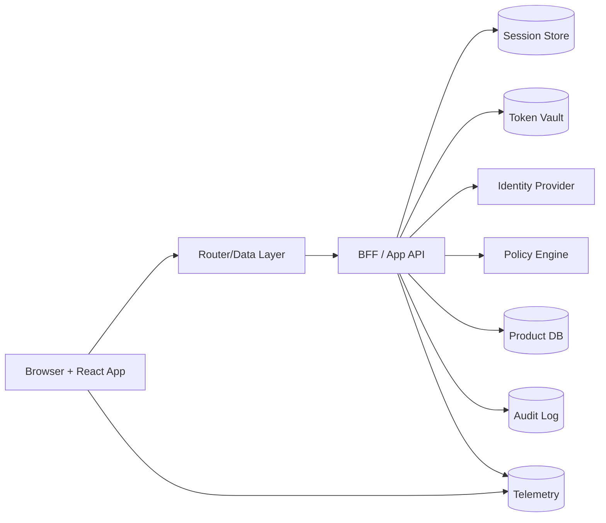
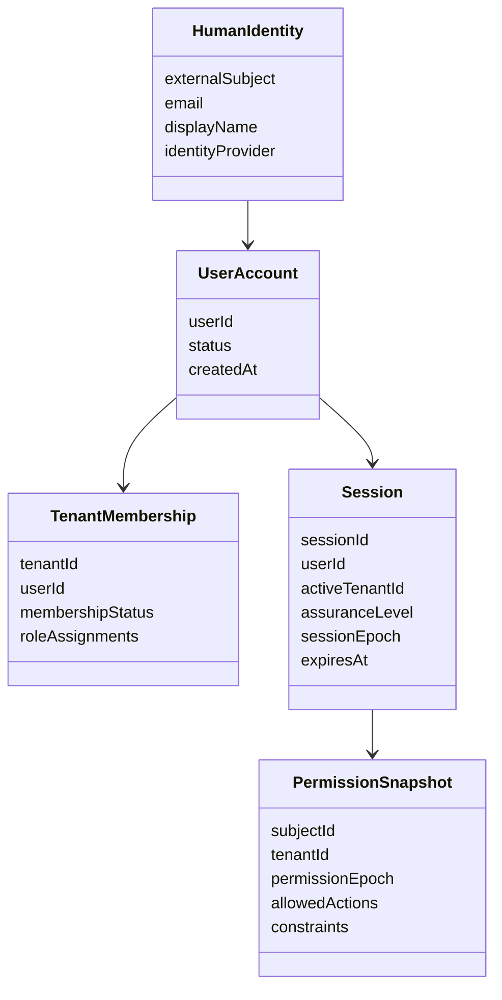
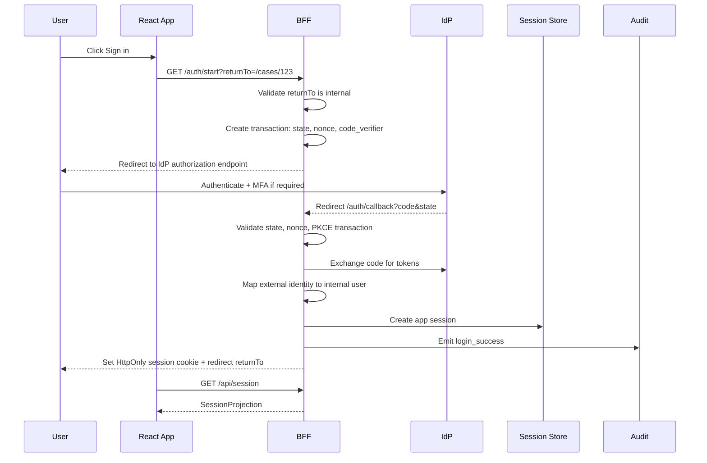
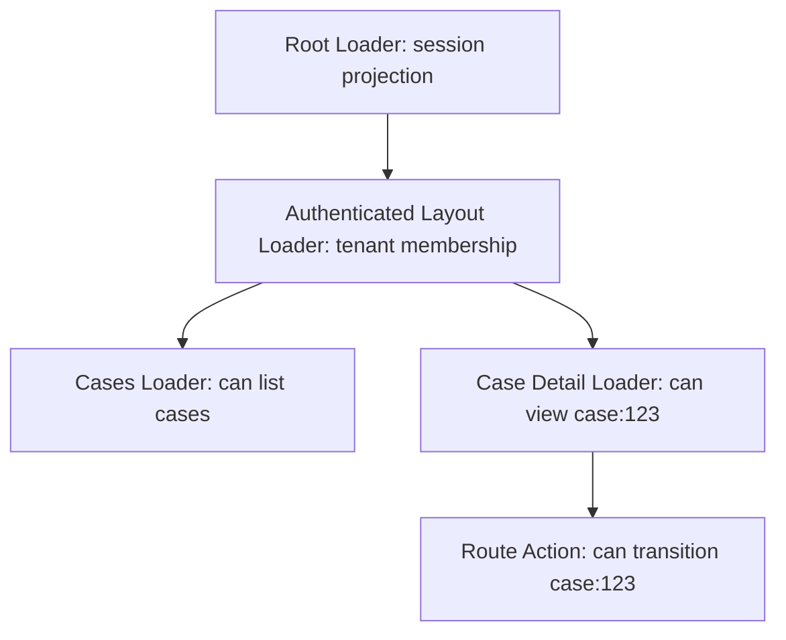
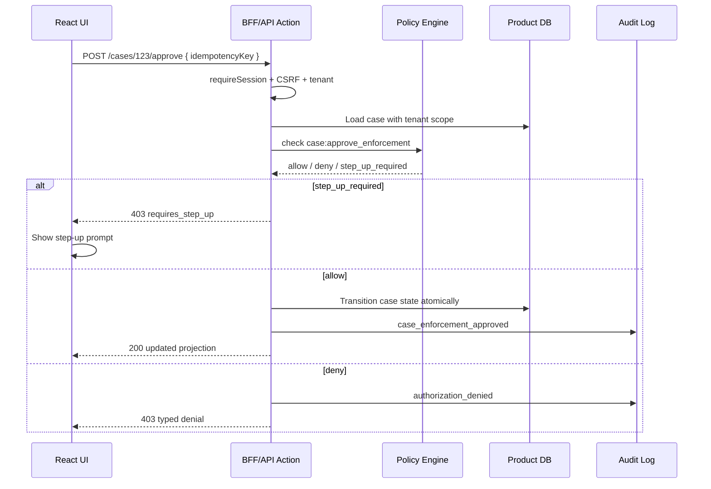
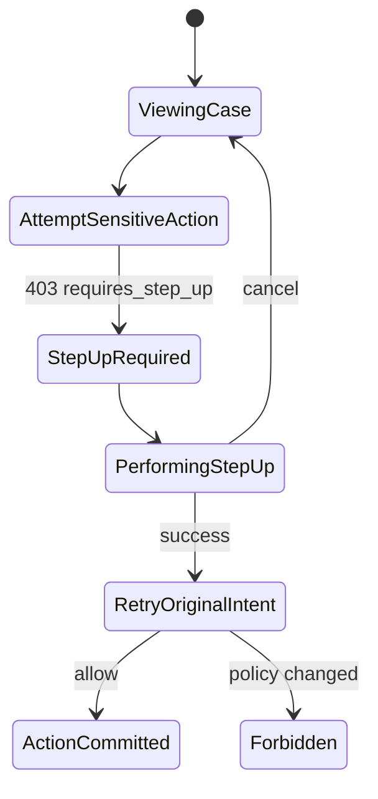
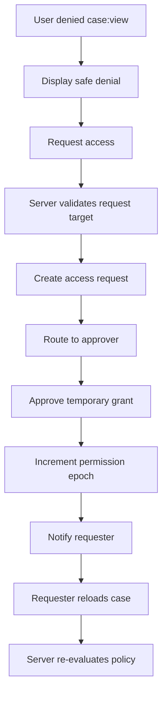
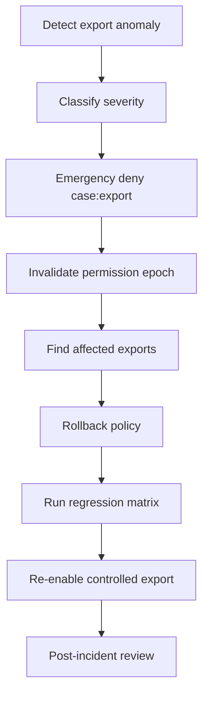
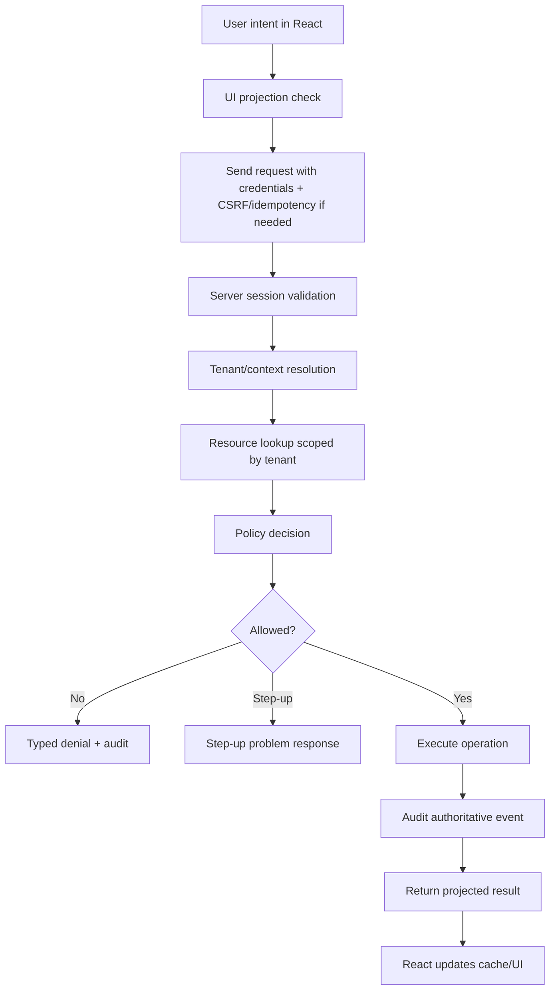

# Part 129 — Capstone System Walkthrough

This part walks through the complete system.

Not as isolated patterns.

Not as a list of components.

As one production auth flow moving through browser, React, router, session layer, BFF/API, policy engine, audit log, and operations.

The goal is to make the whole system feel mechanical.

When a user logs in, every subsystem should have a narrow responsibility. When access is denied, every subsystem should fail safely. When an incident happens, the system should leave enough evidence to understand what happened.

We will use a regulated case management product as the example because it forces the right constraints:

- multi-tenant identity;
- enterprise SSO;
- session continuity;
- state-based authorization;
- object-level permission;
- field-level permission;
- access requests;
- impersonation;
- audit trails;
- revocation;
- incident recovery.

If the design works here, it can be simplified for a normal SaaS dashboard.

---

## 1. The capstone system

The example product is called **CaseFlow**.

It is a React application used by investigators, reviewers, supervisors, legal staff, and administrators.

Users can:

- view cases;
- create case notes;
- upload evidence;
- assign cases;
- escalate cases;
- approve enforcement actions;
- export case packages;
- request access to restricted cases;
- impersonate users for support, under strict controls.

The important part is not the domain.

The important part is the auth shape.



The design uses a **Backend-for-Frontend session**.

The browser receives an opaque, `HttpOnly`, `Secure`, `SameSite` cookie. The browser does not receive refresh tokens. The BFF owns OAuth/OIDC token exchange and downstream API token management.

React receives only a **session projection**.

That projection answers UI questions:

- is there a user?
- which tenant is active?
- which product capabilities are visible?
- which assurance level is current?
- which route shell should render?
- which actions can be displayed?

It is not the source of authority.

The BFF/API remains the enforcement boundary.

---

## 2. System invariants

Before walking through the system, lock the invariants.

These are non-negotiable.

| Invariant | Meaning |
|---|---|
| Frontend is not enforcement | React can hide, disable, explain, and recover. It cannot authorize. |
| Deny by default | Unknown, stale, missing, or failed auth state renders no sensitive access. |
| Every mutation is authorized server-side | Buttons, forms, route actions, and bulk operations all hit server enforcement. |
| Tenant context is explicit | Tenant is never inferred only from URL or UI state. |
| Permission projection is disposable | `/permissions` can optimize UI, but server policy decides. |
| Session state has an epoch | Login, logout, tenant switch, revocation, and permission change invalidate stale client state. |
| Audit follows authority | Audit is emitted by the enforcing server boundary, not by React alone. |
| Errors are typed | `401`, `403`, step-up required, tenant mismatch, stale permission, and policy outage are distinct. |
| Sensitive data is projected minimally | Session/bootstrap responses do not include unnecessary PII or claims. |
| Incident response is designed | Forced logout, revocation, rollback, and audit search are operational features. |

The rest of the architecture is just a way of preserving these invariants under browser reality.

---

## 3. Identity model

CaseFlow distinguishes identity concepts that many apps accidentally merge.



The distinction matters.

A user can authenticate successfully and still have no product access.

A user can belong to multiple tenants and have different permissions in each tenant.

A user can have a valid session but insufficient assurance level for a sensitive action.

A user can be globally active but disabled inside one tenant.

The React app should never collapse these into one boolean called `isAuthenticated`.

A better projection is:

```ts
export type SessionProjection = {
  state: 'anonymous' | 'authenticated' | 'degraded';
  user: null | {
    id: string;
    displayName: string;
    emailMasked: string;
  };
  tenant: null | {
    id: string;
    name: string;
    membershipStatus: 'active' | 'suspended' | 'pending';
  };
  assurance: {
    level: 'aal1' | 'aal2' | 'aal3';
    authenticatedAt: string;
    stepUpRequiredAfterMinutes: number;
  };
  sessionEpoch: number;
  permissionEpoch: number;
  flags: {
    impersonating: boolean;
    supportMode: boolean;
  };
};
```

Notice what is missing:

- no refresh token;
- no access token;
- no raw ID token;
- no unbounded claims;
- no giant role list unless the UI really needs it;
- no policy trace;
- no secrets;
- no broad PII.

React should receive a product projection, not an identity dump.

---

## 4. Login sequence

The login path uses Authorization Code with PKCE through the BFF.



The browser never handles the authorization code transaction details as authority.

The callback route is server-owned.

The BFF validates:

- transaction exists;
- transaction is single-use;
- `state` matches;
- `nonce` matches expected ID token nonce;
- redirect URI is exact;
- code exchange happens server-side;
- identity provider and tenant routing are expected;
- user can map to an internal account;
- tenant membership exists or JIT provisioning is allowed;
- session cookie is set with safe attributes.

React only needs to handle user experience around transition states:

- logging in;
- returning from login;
- session bootstrap pending;
- login failed;
- tenant selection required;
- membership pending;
- step-up required.

Do not make the callback page a general-purpose error dump.

It is a protocol boundary.

---

## 5. Session bootstrap

After login, page refresh, new tab open, or bfcache restore, React asks the server for the session projection.

```ts
export async function loadSession(signal?: AbortSignal): Promise<SessionProjection> {
  const response = await fetch('/api/session', {
    method: 'GET',
    credentials: 'include',
    headers: {
      Accept: 'application/json',
    },
    signal,
  });

  if (response.status === 401) {
    return {
      state: 'anonymous',
      user: null,
      tenant: null,
      assurance: {
        level: 'aal1',
        authenticatedAt: new Date(0).toISOString(),
        stepUpRequiredAfterMinutes: 0,
      },
      sessionEpoch: 0,
      permissionEpoch: 0,
      flags: {
        impersonating: false,
        supportMode: false,
      },
    };
  }

  if (!response.ok) {
    throw new Error('session_bootstrap_failed');
  }

  return response.json();
}
```

The session endpoint should be safe to call often.

It should not perform heavy authorization for every possible object. It should return the minimum top-level projection needed to decide which app shell can render.

Good `/api/session` response:

```json
{
  "state": "authenticated",
  "user": {
    "id": "usr_123",
    "displayName": "A. Reviewer",
    "emailMasked": "a***@agency.example"
  },
  "tenant": {
    "id": "ten_456",
    "name": "North Region Enforcement",
    "membershipStatus": "active"
  },
  "assurance": {
    "level": "aal2",
    "authenticatedAt": "2026-07-08T02:10:00Z",
    "stepUpRequiredAfterMinutes": 15
  },
  "sessionEpoch": 42,
  "permissionEpoch": 17,
  "flags": {
    "impersonating": false,
    "supportMode": false
  }
}
```

Bad `/api/session` response:

```json
{
  "idToken": "eyJ...",
  "accessToken": "eyJ...",
  "refreshToken": "...",
  "groups": ["all-enterprise-groups-ever"],
  "fullPolicyTrace": "...",
  "rawIdpProfile": {
    "everything": "..."
  }
}
```

The session endpoint is not a dump truck.

It is a projection boundary.

---

## 6. Root route loading

In React Router Data Mode, the root loader can bootstrap the session before rendering sensitive layouts.

```ts
// routes/root.tsx
export async function loader({ request }: LoaderFunctionArgs) {
  const session = await serverSideOrClientSideSessionLoad(request);

  return {
    session,
    securityHeaders: {
      cachePolicy: 'private-no-store-for-session-projection',
    },
  };
}

export default function RootRoute({ loaderData }: Route.ComponentProps) {
  return (
    <AuthProvider initialSession={loaderData.session}>
      <AppShell />
    </AuthProvider>
  );
}
```

The root loader does not authorize every object.

It establishes session state.

Nested route loaders authorize route-specific data.

That separation prevents both over-fetching and under-enforcement.



Each deeper layer has more context.

The root loader knows the session.

The tenant loader knows the tenant.

The resource loader knows the case.

The action knows the mutation intent.

Authorization should happen as late as necessary to have enough context, but as early as possible to prevent unnecessary data exposure.

---

## 7. Route-level authorization

Consider this route:

```txt
/tenants/:tenantId/cases/:caseId
```

The loader performs:

1. session validation;
2. tenant membership validation;
3. case existence lookup scoped by tenant;
4. `case:view` authorization;
5. field-level projection;
6. allowed action projection;
7. audit for access if required by domain policy.

```ts
export async function caseDetailLoader({ params, request }: LoaderFunctionArgs) {
  const session = await requireSession(request);
  const tenant = await requireTenantMembership(session, params.tenantId);

  const caseRecord = await casesRepository.findById({
    tenantId: tenant.id,
    caseId: params.caseId,
  });

  if (!caseRecord) {
    throw notFound();
  }

  const decision = await policy.check({
    subject: session.subject,
    action: 'case:view',
    resource: {
      type: 'case',
      id: caseRecord.id,
      tenantId: tenant.id,
      attributes: {
        state: caseRecord.state,
        sensitivity: caseRecord.sensitivity,
        assignedTeamId: caseRecord.assignedTeamId,
      },
    },
    context: {
      assuranceLevel: session.assuranceLevel,
      impersonating: session.impersonating,
      requestId: request.headers.get('x-request-id'),
    },
  });

  if (!decision.allow) {
    throw forbidden({
      code: decision.code,
      publicReason: decision.publicReason,
      correlationId: decision.correlationId,
    });
  }

  const projection = projectCaseForSubject(caseRecord, decision);

  return json({
    case: projection.case,
    allowedActions: projection.allowedActions,
    fieldPermissions: projection.fieldPermissions,
    permissionEpoch: decision.permissionEpoch,
  }, {
    headers: {
      'Cache-Control': 'private, no-store',
    },
  });
}
```

The loader does not trust the route parameter.

The parameter is only a requested identifier.

The server decides whether that identifier is visible under the active subject, tenant, resource state, and context.

---

## 8. Permission projection

The case detail response includes allowed actions.

```json
{
  "case": {
    "id": "case_123",
    "title": "Unlicensed Activity Investigation",
    "state": "under_review",
    "assignee": "Team Alpha",
    "sensitivity": "restricted"
  },
  "allowedActions": {
    "case:add_note": {
      "allow": true
    },
    "case:assign": {
      "allow": false,
      "reason": "not_supervisor"
    },
    "case:approve_enforcement": {
      "allow": false,
      "reason": "requires_step_up",
      "requiredAssuranceLevel": "aal2_recent"
    },
    "case:export": {
      "allow": false,
      "reason": "restricted_case_export_not_allowed"
    }
  },
  "fieldPermissions": {
    "internalLegalNotes": "hidden",
    "subjectPersonalIdentifier": "masked",
    "publicSummary": "editable"
  },
  "permissionEpoch": 17
}
```

React uses this projection to render.

It does not use the projection to enforce.

```tsx
function CaseActions({ caseId, allowedActions }: Props) {
  return (
    <ActionBar>
      <AuthorizedButton
        decision={allowedActions['case:add_note']}
        onClick={() => openNoteDialog(caseId)}
      >
        Add note
      </AuthorizedButton>

      <AuthorizedButton
        decision={allowedActions['case:approve_enforcement']}
        deniedMode="explain"
        onDenied={(decision) => openStepUpOrExplanation(decision)}
      >
        Approve enforcement
      </AuthorizedButton>
    </ActionBar>
  );
}
```

The design rule is simple:

- projection controls affordance;
- server controls authority.

If the user tampers with the UI, sends a request manually, replays an old request, changes a route parameter, or calls the API from another client, the server still evaluates policy.

---

## 9. Mutation enforcement

Approving enforcement is sensitive.

It requires:

- authenticated session;
- active tenant membership;
- case visibility;
- case state allows approval;
- user has approval permission;
- user is not the original investigator if separation of duties applies;
- recent MFA/step-up authentication;
- no active support impersonation;
- idempotency key;
- audit event.



Server action shape:

```ts
export async function approveEnforcement(request: Request, caseId: string) {
  const session = await requireSession(request);
  await requireCsrf(request, session);

  const body = await parseJson(request);
  const idempotencyKey = requireIdempotencyKey(body);

  return idempotency.run({ key: idempotencyKey, subjectId: session.userId }, async () => {
    const caseRecord = await casesRepository.findForUpdate({
      tenantId: session.activeTenantId,
      caseId,
    });

    if (!caseRecord) throw notFound();

    const decision = await policy.check({
      subject: session.subject,
      action: 'case:approve_enforcement',
      resource: caseResource(caseRecord),
      context: {
        assuranceLevel: session.assuranceLevel,
        authenticatedAt: session.authenticatedAt,
        impersonating: session.impersonating,
        requestIpRisk: session.requestRisk,
      },
    });

    if (!decision.allow) {
      await audit.authorizationDenied({
        subject: session.subject,
        action: 'case:approve_enforcement',
        resourceId: caseId,
        reason: decision.code,
        correlationId: decision.correlationId,
      });

      throw forbidden(decision.toProblemJson());
    }

    const updated = await workflow.transition({
      caseId,
      from: caseRecord.state,
      to: 'approved_for_enforcement',
      actorId: session.userId,
      expectedVersion: body.expectedVersion,
    });

    await audit.caseApproved({
      subject: session.subject,
      caseId,
      previousState: caseRecord.state,
      newState: updated.state,
      correlationId: decision.correlationId,
    });

    return projectCaseMutationResult(updated, decision);
  });
}
```

Notice what the UI cannot skip:

- CSRF check;
- current session check;
- tenant scoping;
- current case state;
- current policy;
- current assurance level;
- current impersonation restriction;
- atomic state transition;
- audit.

That is the difference between product behavior and security behavior.

---

## 10. Step-up authentication

A user can be logged in but not fresh enough for a sensitive action.

That is not anonymous.

That is not forbidden forever.

That is a typed recovery path.

```json
{
  "type": "https://caseflow.example/problems/step-up-required",
  "title": "Additional verification required",
  "status": 403,
  "code": "requires_step_up",
  "requiredAssuranceLevel": "aal2_recent",
  "returnTo": "/tenants/ten_456/cases/case_123?action=approve_enforcement",
  "correlationId": "req_abc123"
}
```

React handles it as a state transition:



Important edge case:

After step-up, the original permission may no longer hold.

The retry must re-run policy.

Step-up proves freshness.

It does not grant authorization by itself.

---

## 11. Tenant switch

Tenant switch is not cosmetic.

It changes the authorization universe.

When the user switches tenant:

1. server validates membership;
2. session active tenant changes;
3. session epoch increments;
4. permission epoch changes;
5. React clears tenant-scoped query cache;
6. route redirects to safe tenant landing page;
7. cross-tab session event is broadcast;
8. audit event records tenant switch.

```ts
async function switchTenant(tenantId: string) {
  const result = await api.post('/api/session/tenant', { tenantId });

  authStore.applySessionProjection(result.session);

  queryClient.removeQueries({
    predicate(query) {
      return query.queryKey.includes('tenant-scoped');
    },
  });

  sessionChannel.postMessage({
    type: 'tenant-switched',
    tenantId,
    sessionEpoch: result.session.sessionEpoch,
  });

  router.navigate(`/tenants/${tenantId}/home`, { replace: true });
}
```

Do not keep the user on the same resource URL after tenant switch unless the resource is explicitly re-resolved under the new tenant.

Cross-tenant leakage often comes from stale caches and stale route state, not only from missing SQL predicates.

---

## 12. Access request flow

When a user cannot view a restricted case, the UI should not simply dead-end.

But access request must not become a bypass.



The request itself is authorized.

The approval is authorized.

The final access is still authorized.

Temporary grants have:

- scope;
- reason;
- approver;
- expiry;
- revocation path;
- audit trail;
- permission epoch invalidation.

A good access request is narrow:

```json
{
  "action": "case:view",
  "resource": {
    "type": "case",
    "id": "case_123"
  },
  "reason": "Assigned as secondary reviewer for enforcement package",
  "requestedDurationHours": 48
}
```

A bad access request is broad:

```json
{
  "role": "admin",
  "reason": "Need access"
}
```

The first asks for a capability.

The second asks for power.

---

## 13. Impersonation flow

Support impersonation is one of the easiest places to accidentally destroy audit quality.

CaseFlow uses actor/subject separation.

```ts
export type EffectiveActor = {
  actorUserId: string;      // support/admin user operating the session
  subjectUserId: string;    // user being viewed/impersonated
  mode: 'self' | 'support_view' | 'support_limited_action';
  startedAt: string;
  expiresAt: string;
  reason: string;
  approvalId?: string;
};
```

The UI renders a persistent banner.

The server enforces restrictions.

Audit records both actor and subject.

```json
{
  "eventType": "case_note_viewed",
  "actorUserId": "support_001",
  "subjectUserId": "investigator_234",
  "effectiveMode": "support_view",
  "tenantId": "ten_456",
  "resourceType": "case_note",
  "resourceId": "note_789",
  "correlationId": "req_abc123"
}
```

Rules:

- impersonation cannot approve enforcement;
- impersonation cannot export restricted packages;
- impersonation cannot modify the subject user's own permissions;
- impersonation has expiry;
- impersonation has reason;
- impersonation is visible in UI;
- impersonation is searchable in audit;
- impersonation can be force-ended.

If audit only says “investigator_234 viewed note”, the system lied.

The correct event says support acted as or viewed as investigator.

---

## 14. Permission cache invalidation in the capstone

Permission invalidation happens when:

- role assignment changes;
- ACL grant changes;
- case state changes;
- tenant membership changes;
- temporary grant expires;
- impersonation starts or ends;
- policy version changes;
- assurance level changes;
- user is suspended;
- session is revoked.

The capstone uses two version numbers:

```ts
export type AuthVersionVector = {
  sessionEpoch: number;
  permissionEpoch: number;
  policyVersion: string;
  tenantId: string;
};
```

Cache keys include them when appropriate.

```ts
const caseQueryKey = [
  'tenant-scoped',
  tenantId,
  'case',
  caseId,
  {
    sessionEpoch,
    permissionEpoch,
    policyVersion,
  },
];
```

This is not free.

More version dimensions mean more cache churn.

But auth-sensitive data should prefer correctness over stale convenience.

For low-risk public-ish data, use coarser keys.

For regulated data, include the version context.

---

## 15. Cache and storage cleanup

On logout:

- server revokes session;
- BFF clears session cookie;
- React clears in-memory auth state;
- query cache is cleared;
- persisted cache is deleted;
- service worker cache is purged if used;
- BroadcastChannel notifies other tabs;
- in-flight requests are aborted;
- router navigates to anonymous shell;
- audit records logout.

```ts
async function logout() {
  abortProtectedRequests();

  try {
    await fetch('/auth/logout', {
      method: 'POST',
      credentials: 'include',
      headers: csrfHeader(),
    });
  } finally {
    authStore.resetToAnonymous();
    queryClient.clear();
    await deletePersistedAuthCaches();

    sessionChannel.postMessage({
      type: 'logout',
      reason: 'user_initiated',
      at: new Date().toISOString(),
    });

    router.navigate('/login', { replace: true });
  }
}
```

Client cleanup is not a substitute for server revocation.

Server revocation is not a substitute for client cleanup.

You need both.

---

## 16. Error taxonomy

The capstone uses typed errors.

| Status | Code | Meaning | React behavior |
|---|---|---|---|
| 401 | `session_missing` | No valid session | Show login path. |
| 401 | `session_expired` | Session expired | Offer re-login, preserve safe intent. |
| 403 | `forbidden` | Authenticated but not allowed | Show safe denial. |
| 403 | `requires_step_up` | Fresh assurance required | Start step-up flow. |
| 403 | `tenant_mismatch` | Resource not in active tenant or no membership | Redirect tenant selector or safe denial. |
| 403 | `impersonation_restricted` | Support mode cannot perform action | Explain support-mode limit. |
| 404 | `not_found` | Resource unavailable or hidden | Show not-found without leaking existence. |
| 409 | `state_conflict` | Workflow state changed | Refetch and explain stale action. |
| 429 | `rate_limited` | Abuse/rate threshold | Respect retry policy. |
| 503 | `policy_unavailable` | PDP unavailable | Fail closed for protected action. |

Typed errors prevent the UI from converting every auth problem into “please login again”.

That matters for supportability.

It also matters for security.

An authorization denial is not an authentication failure.

A step-up requirement is not a permanent denial.

A policy outage is not permission.

---

## 17. Observability walkthrough

For every protected request, log enough to reconstruct the decision without logging secrets.

```json
{
  "timestamp": "2026-07-08T02:30:00Z",
  "event": "authorization_decision",
  "correlationId": "req_abc123",
  "subjectIdHash": "sub_hash",
  "tenantId": "ten_456",
  "action": "case:approve_enforcement",
  "resourceType": "case",
  "resourceIdHash": "case_hash",
  "decision": "deny",
  "reason": "requires_step_up",
  "sessionEpoch": 42,
  "permissionEpoch": 17,
  "policyVersion": "2026.07.08-1"
}
```

Do not log:

- session ids;
- bearer tokens;
- refresh tokens;
- authorization codes;
- raw ID tokens;
- CSRF tokens;
- full personal identifiers;
- unrestricted policy traces.

Useful dashboards:

- login success rate;
- callback error rate;
- session bootstrap latency;
- refresh failure rate;
- `401` rate by route;
- `403` rate by action;
- step-up challenge completion rate;
- tenant switch errors;
- permission cache invalidation lag;
- policy engine latency;
- audit write failure rate;
- forced logout count;
- open redirect rejection count;
- CSRF rejection count.

Good auth operations are boring because the system tells you what is happening.

Bad auth operations are noisy because every issue looks like “random logout”.

---

## 18. Incident walkthrough: bad permission deploy

Scenario:

A policy change accidentally allows `case:export` for reviewers on restricted cases.

Detection:

- audit anomaly: export spike;
- alert on restricted export count;
- support report;
- policy canary/shadow evaluation diff.

Immediate response:

1. freeze export endpoint using emergency deny policy;
2. revoke affected temporary grants if involved;
3. invalidate permission epoch globally or per tenant;
4. clear frontend permission projections;
5. identify exported packages;
6. preserve audit evidence;
7. notify incident lead and privacy/legal if required;
8. deploy policy rollback;
9. run authorization regression matrix;
10. re-enable export after verification.



The React app participates by:

- receiving permission epoch invalidation;
- hiding export buttons;
- showing safe degraded messaging;
- clearing stale allowed-action cache;
- preserving correlation IDs in support reports.

The React app does not fix the incident alone.

The enforcement boundary must deny.

---

## 19. Incident walkthrough: token/session leak

Scenario:

A logging bug records access tokens in frontend telemetry.

Immediate response:

1. disable offending telemetry field or pipeline;
2. rotate or revoke affected tokens/sessions;
3. purge logs if policy allows and preserve necessary forensic metadata;
4. force logout affected users if token scope/session risk requires it;
5. deploy redaction patch;
6. add regression test for telemetry payload;
7. review SDK/dependency boundary;
8. update runbook.

React changes:

```ts
function sanitizeTelemetry(payload: Record<string, unknown>) {
  return deepRedact(payload, [
    /token/i,
    /authorization/i,
    /cookie/i,
    /csrf/i,
    /session/i,
    /code_verifier/i,
    /id_token/i,
    /access_token/i,
    /refresh_token/i,
  ]);
}
```

But do not rely only on regex.

The stronger control is architectural:

- do not expose refresh tokens to browser;
- do not put access tokens into React state if BFF can avoid it;
- do not put raw auth objects into telemetry context;
- do not log request headers by default;
- use allowlist telemetry schemas.

---

## 20. End-to-end test scenario

A capstone E2E scenario should verify the system, not only the happy path.

Example scenario:

1. login as reviewer;
2. open assigned restricted case;
3. verify restricted fields are masked/hidden;
4. verify `Add note` visible;
5. verify `Approve enforcement` requires step-up;
6. attempt direct API approval without step-up;
7. assert server returns typed `403 requires_step_up`;
8. complete step-up;
9. retry approval;
10. assert server either allows or returns workflow conflict if state changed;
11. verify audit event exists;
12. switch tenant;
13. verify case cache is cleared;
14. attempt old case URL under new tenant;
15. assert safe denial/not found;
16. logout;
17. verify back button does not show sensitive case detail.

The test proves boundaries.

It does not just prove components render.

---

## 21. The full request lifecycle

Every protected request follows the same skeleton.



This is the mental model to keep.

The UI begins the intent.

The server validates authority.

The audit log records authority.

The UI renders the result.

---

## 22. What makes this architecture durable

The capstone architecture is not durable because it has many components.

It is durable because its boundaries are clear.

| Boundary | Responsibility |
|---|---|
| IdP | Authenticate external identity and assurance. |
| BFF | Own browser session, token vault, OAuth callback, product API boundary. |
| Session store | Track app session lifecycle and revocation. |
| Policy engine | Produce authorization decisions. |
| Product API | Enforce decisions with resource context. |
| React app | Render safe projection and recover from typed failures. |
| Router/data layer | Move auth checks before data exposure where possible. |
| Query/cache layer | Cache only under correct auth/tenant/version context. |
| Audit | Record authoritative security-relevant actions. |
| Observability | Detect failure modes early. |

When boundaries are unclear, bugs hide in assumptions.

When boundaries are explicit, bugs become testable.

---

## 23. Capstone checklist

Use this as the final system walkthrough checklist.

### Identity and session

- [ ] External identity maps to internal user explicitly.
- [ ] Tenant membership is separate from authentication.
- [ ] App session is opaque to browser.
- [ ] Refresh token is not exposed to React when BFF architecture is used.
- [ ] Session bootstrap returns minimal projection.
- [ ] Logout revokes server session and cleans client cache.
- [ ] Session epoch changes on login/logout/tenant switch/revocation.

### Authorization

- [ ] Policy uses subject/action/resource/context.
- [ ] API validates authorization on every protected request.
- [ ] Route loaders authorize data before render.
- [ ] Route actions authorize mutations before write.
- [ ] Field-level projection is enforced server-side.
- [ ] Bulk operations check each item or use a clearly defined all-or-nothing policy.
- [ ] Step-up is freshness, not permission.
- [ ] Impersonation restrictions are server-enforced.

### React UI

- [ ] Unknown permission state fails closed.
- [ ] Menus, buttons, tabs, forms, tables, and command palette use the same permission contract.
- [ ] Denial reasons are safe and actionable.
- [ ] Access request flow is scoped and auditable.
- [ ] Sensitive data is not hidden in DOM as a security mechanism.
- [ ] Hydration mismatch does not reveal protected data.

### Data and cache

- [ ] Query keys include tenant/auth version where necessary.
- [ ] Tenant switch clears tenant-scoped cache.
- [ ] Logout clears query and persisted cache.
- [ ] Sensitive responses use safe cache headers.
- [ ] Service worker does not cache protected data unless explicitly designed.
- [ ] Back button/bfcache behavior is tested.

### Operations

- [ ] `401`, `403`, step-up, tenant mismatch, and policy outage are observable separately.
- [ ] Audit logs record actor, subject, action, resource, tenant, decision, and correlation ID.
- [ ] Security logs redact tokens and secrets.
- [ ] Forced logout exists.
- [ ] Permission epoch invalidation exists.
- [ ] Bad permission deploy runbook exists.
- [ ] Token/session leak runbook exists.
- [ ] Regression tests cover known incidents.

---

## 24. Final mental compression

If you need one compressed model, use this:

```txt
AuthN proves identity.
Session preserves continuity.
AuthZ decides capability.
React projects affordance.
Server enforces authority.
Audit proves what happened.
Observability tells when it breaks.
Runbooks make recovery repeatable.
```

A top-tier React auth system is not a clever `ProtectedRoute`.

It is a set of small, explicit, boring boundaries that keep working when:

- a token expires;
- a role changes;
- a user opens three tabs;
- an IdP is slow;
- a tenant is switched;
- a policy is rolled back;
- an object moves state;
- a support user impersonates someone;
- a browser restores old page state;
- an attacker changes a route parameter;
- an incident begins at 02:00.

That is the real system.

---

## References

- OWASP Authorization Cheat Sheet — permission validation on every request, least privilege, deny-by-default.
- OWASP Session Management Cheat Sheet — session lifecycle and server-side expiration.
- OWASP Logging Cheat Sheet — security event logging and sensitive data handling.
- OAuth 2.0 Security Best Current Practice, RFC 9700.
- OAuth 2.0 for Browser-Based Applications draft.
- OpenID Connect Core 1.0.
- React Router documentation for loaders, actions, route modules, and data loading.
- Next.js App Router authentication documentation.
- React documentation for components, hooks, and hydration.
