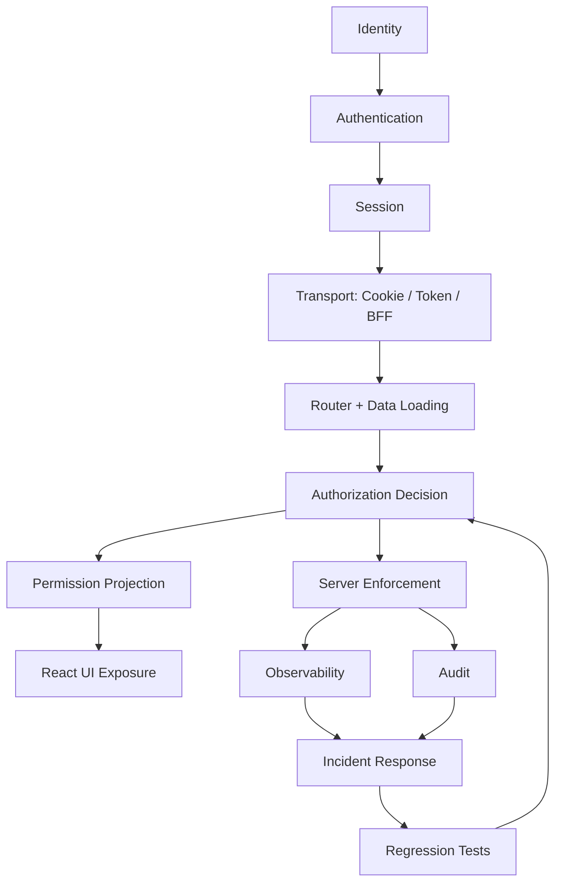
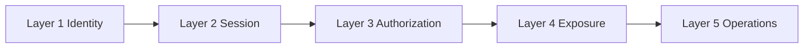
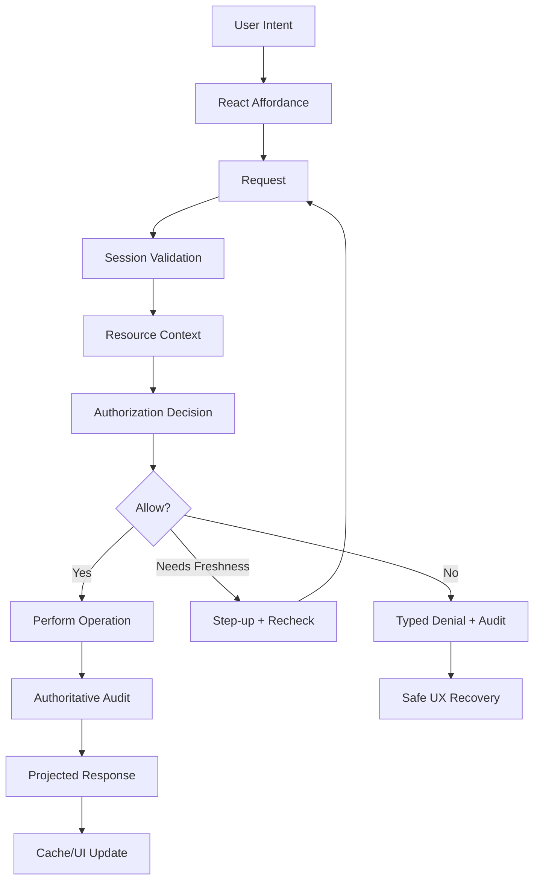

# Part 130 — Final Review and Next Steps

This is the final part of the series.

The point of the series was not to memorize auth recipes.

The point was to build the ability to design, review, implement, debug, and operate React authentication and authorization systems under real production constraints.

A basic engineer asks:

> How do I protect this route?

A senior engineer asks:

> Where is the enforcement boundary?

A strong staff-level engineer asks:

> Which invariants must survive stale state, multi-tab concurrency, IdP failure, token expiry, tenant switching, object state transition, policy drift, rollback, and incident response?

That is the difference.

---

## 1. The final map

The full series can be compressed into one system map.



The critical edge is this one:

```txt
Permission Projection != Server Enforcement
```

React can help users understand what they can do.

React cannot be the reason they are allowed to do it.

---

## 2. The five-layer mental model

A useful mental model is five layers.



### Layer 1 — Identity

Identity answers:

- who authenticated?
- which IdP asserted it?
- which internal user does it map to?
- which tenant membership exists?
- what assurance level was achieved?
- what was the authentication time?

Identity is not permission.

A valid identity can still be forbidden.

### Layer 2 — Session

Session answers:

- how is continuity preserved across requests?
- where is the session authority?
- how does expiry work?
- how does revocation work?
- what happens across tabs?
- what happens after browser resume?
- what happens after tenant switch?

Session is not authorization.

A valid session can still lack permission.

### Layer 3 — Authorization

Authorization answers:

- can this subject perform this action on this resource in this context?
- where is the resource state loaded?
- where is tenant boundary enforced?
- what happens when permissions change?
- what happens when policy is unavailable?
- what is audited?

Authorization is not UI state.

A visible button can still be denied server-side.

### Layer 4 — Exposure

Exposure answers:

- which route can be shown?
- which menu item appears?
- which button is enabled?
- which field is hidden, masked, readonly, or editable?
- which denial reason is safe to display?
- which access request path exists?

Exposure is not enforcement.

It is user experience over a permission projection.

### Layer 5 — Operations

Operations answers:

- how do we detect auth failure?
- how do we debug it safely?
- how do we force logout?
- how do we invalidate permission cache?
- how do we rollback bad policy?
- how do we prove what happened?
- how do we prevent recurrence?

Operations is not optional.

It is the part that turns a clever design into a production system.

---

## 3. The capability ladder

Use this ladder to evaluate your current skill.

| Level | Capability | Typical thinking |
|---:|---|---|
| 1 | Login implementation | “Can I call an auth SDK?” |
| 2 | Protected routes | “Can I redirect anonymous users?” |
| 3 | Session handling | “Can I restore, expire, refresh, and logout safely?” |
| 4 | Permission UI | “Can I hide/disable/explain actions consistently?” |
| 5 | Server-side enforcement | “Is every protected request authorized with resource context?” |
| 6 | Authorization modelling | “Can I model RBAC/ABAC/ReBAC/ACL without role explosion?” |
| 7 | Browser threat modelling | “How do XSS, CSRF, cache, tabs, and storage affect auth?” |
| 8 | SSR/BFF architecture | “Where should token/session authority live?” |
| 9 | Testing and regression | “Can I prevent stale privilege and authorization regressions?” |
| 10 | Operations and incident response | “Can I detect, contain, audit, recover, and improve?” |

Top-tier skill starts around levels 7–10.

Many engineers stop at level 2.

That is why auth bugs survive code review.

---

## 4. The core invariants to remember

You do not need to remember every code sample.

You need to remember the invariants.

### Invariant 1 — frontend state is not authority

React state can be stale, tampered with, replayed, restored from cache, or produced by a different tab lifecycle.

Use it for projection.

Never use it as the final authorization decision.

### Invariant 2 — route protection is not enough

A protected route only controls navigation/rendering.

It does not protect:

- direct API calls;
- mutation endpoints;
- file URLs;
- GraphQL resolvers;
- WebSocket subscriptions;
- background jobs;
- exports;
- service worker caches;
- stale query data.

### Invariant 3 — authorization needs resource context

`user.role === 'admin'` is rarely enough.

A real decision often needs:

```txt
subject + action + resource + context
```

Where resource and context include:

- tenant;
- object owner;
- workflow state;
- sensitivity;
- assignment;
- relationship;
- assurance level;
- impersonation mode;
- time;
- policy version.

### Invariant 4 — deny unknown state

Unknown session means do not render protected data.

Unknown permission means do not show privileged action as available.

Unknown tenant means do not reuse old tenant cache.

Unknown policy means protected operation fails closed.

### Invariant 5 — logout is distributed

Logout touches:

- server session;
- IdP session, sometimes;
- token vault;
- browser cookie;
- React state;
- query cache;
- persisted cache;
- service worker cache;
- multiple tabs;
- in-flight requests;
- router state;
- audit.

A logout button that only clears local state is not logout.

### Invariant 6 — permission cache is disposable

A permission snapshot is a performance optimization.

It is not the source of truth.

Every serious system needs a way to invalidate stale permission.

### Invariant 7 — audit follows enforcement

Audit emitted only from UI is weak.

The strongest audit event comes from the server boundary that actually authorized and performed the action.

### Invariant 8 — typed failures beat generic failures

`401`, `403`, step-up required, tenant mismatch, stale permission, session expired, and policy outage are different states.

Generic “something went wrong” creates bad UX and bad operations.

---

## 5. The anti-patterns that should now look obviously wrong

After this series, these should feel dangerous:

```tsx
{user.role === 'admin' && <DeleteButton />}
```

```ts
const token = localStorage.getItem('access_token');
```

```ts
const decoded = jwtDecode(token);
if (decoded.role === 'admin') allowExport();
```

```tsx
<Route path="/admin" element={isLoggedIn ? <Admin /> : <Login />} />
```

```ts
app.post('/cases/:id/approve', (req, res) => {
  approveCase(req.params.id);
});
```

```ts
queryClient.invalidateQueries(['cases']);
```

```ts
if (!can('case:export')) hideButton();
// server endpoint still allows export
```

These are not always immediately exploitable in every context.

But they carry weak assumptions:

- UI equals enforcement;
- role equals permission;
- token claim equals fresh policy;
- authentication equals authorization;
- route equals resource boundary;
- cache equals current truth;
- hiding equals denying.

Strong auth engineering is mostly the discipline of refusing those shortcuts.

---

## 6. The design review questions

When reviewing a React auth system, ask these in order.

### Identity

- Who is the user according to the IdP?
- Who is the internal user according to the product?
- How are IdP subject, email, organization, and tenant mapped?
- What happens when email changes?
- What happens when tenant membership is removed?
- What happens when user is disabled at IdP but still has product data?

### Session

- Where does session authority live?
- Is the session cookie `HttpOnly`, `Secure`, and scoped correctly?
- Are refresh tokens exposed to browser JavaScript?
- How does expiry work?
- How does forced logout work?
- How does multi-tab logout work?
- How is session bootstrap cached or not cached?

### Authorization

- What is the permission model?
- Where is authorization enforced?
- Which endpoints are protected by global middleware?
- Which endpoints need resource-level checks?
- Does every mutation check current resource state?
- How are list/search endpoints scoped?
- How are files, exports, WebSocket channels, and background jobs authorized?

### React exposure

- What does React render before auth is known?
- What does React render before permission is known?
- Is sensitive data ever hidden in DOM?
- Are field permissions applied consistently?
- Are menu/sidebar/command palette/table actions derived from the same contract?
- Is denial safe and actionable?

### Cache

- Which data is tenant-scoped?
- Which data is permission-scoped?
- Which query keys include auth version?
- What is cleared on logout?
- What is cleared on tenant switch?
- What is cleared on permission epoch change?
- Is service worker caching protected content?

### Operations

- Can we distinguish auth failure modes in dashboards?
- Are tokens redacted from logs?
- Do audit logs include actor, subject, tenant, action, resource, decision, and correlation ID?
- Is there a forced logout runbook?
- Is there a bad permission deploy runbook?
- Is there a token leak runbook?

Good review questions reveal invisible assumptions.

---

## 7. The implementation review checklist

When reading code, look for these failure smells.

### Frontend smells

- `localStorage` access for tokens;
- role string checks scattered in components;
- `jwtDecode` used for authorization;
- buttons hidden without server enforcement;
- permission logic duplicated in many places;
- no unknown permission state;
- no typed denial reason;
- stale query data after logout;
- stale query data after tenant switch;
- no cross-tab logout;
- sensitive data in error boundary;
- route guard only inside component render;
- command palette ignoring permissions;
- field-level permission only client-side.

### Backend/API smells

- endpoint only checks authentication;
- object id not scoped by tenant;
- mutation does not load current resource state;
- policy check uses role but not resource;
- list endpoint returns overbroad data then frontend filters;
- file download URL bypasses app authorization;
- export endpoint lacks permission check;
- WebSocket subscription is authorized only once at login;
- audit logs lack actor/subject distinction;
- refresh token rotation not atomic;
- session revocation not server-side enforced.

### Ops smells

- `401` and `403` merged in metrics;
- no correlation ID in auth errors;
- no alert for permission-denial spike;
- no alert for refresh storm;
- no way to invalidate permission projection;
- no runbook for IdP outage;
- no runbook for bad policy deploy;
- no regression matrix for authorization;
- no redaction tests for telemetry.

The goal is not to shame code.

The goal is to make risk visible.

---

## 8. Practice project 1 — Build a BFF auth skeleton

Build a small app with:

- React app;
- BFF server;
- `/auth/start`;
- `/auth/callback`;
- `/api/session`;
- `/auth/logout`;
- `HttpOnly` app session cookie;
- safe `returnTo` validation;
- CSRF token for mutations;
- minimal session projection;
- multi-tab logout with `BroadcastChannel`.

Do not start with permissions.

First make session lifecycle correct.

Acceptance criteria:

- refresh page preserves session;
- logout clears all tabs;
- back button does not show protected data after logout;
- session bootstrap has `Cache-Control: no-store` or equivalent safe policy;
- callback rejects bad `state`;
- `returnTo=https://evil.example` is rejected;
- frontend never sees refresh token.

---

## 9. Practice project 2 — Add route/data auth

Add React Router Data Mode.

Create routes:

```txt
/login
/tenants/:tenantId/home
/tenants/:tenantId/cases
/tenants/:tenantId/cases/:caseId
/tenants/:tenantId/cases/:caseId/admin
```

Implement:

- root session loader;
- authenticated layout loader;
- tenant membership loader;
- case detail loader;
- action for adding case note;
- action for approving case;
- typed `401`/`403`/step-up errors;
- safe error boundary;
- safe pending UI.

Acceptance criteria:

- direct URL access is handled before data exposure;
- route params are not trusted;
- tenant switch clears old data;
- unauthorized action returns typed `403`;
- protected data does not flash during bootstrap.

---

## 10. Practice project 3 — Build permission projection

Create a permission API:

```ts
export type PermissionDecision = {
  allow: boolean;
  code?: string;
  publicReason?: string;
  requiresStepUp?: boolean;
  constraints?: Record<string, unknown>;
};

export type PermissionProjection = {
  resourceType: string;
  resourceId: string;
  permissionEpoch: number;
  actions: Record<string, PermissionDecision>;
  fields?: Record<string, 'hidden' | 'masked' | 'readonly' | 'editable'>;
};
```

Build:

- `can()`;
- `useCan()`;
- `Can` component;
- `AuthorizedButton`;
- `PermissionedMenu`;
- field-level form rendering;
- row-level table actions;
- bulk action preview.

Acceptance criteria:

- unknown state fails closed;
- disabled actions can explain safe denial reason;
- permission projection can be invalidated by epoch;
- server still denies direct unauthorized API call;
- tests cover allow, deny, stale, unknown, and step-up.

---

## 11. Practice project 4 — Model authorization beyond RBAC

Add three cases:

1. RBAC: supervisor can assign cases in tenant.
2. ABAC: reviewer can edit notes only while case is `under_review`.
3. ReBAC/ACL: external legal reviewer can view one case through explicit grant.

Then add:

- separation of duties;
- break-glass emergency access;
- temporary grant expiry;
- access request workflow;
- audit events.

Acceptance criteria:

- policy decision receives subject/action/resource/context;
- object-level grants do not leak across tenant;
- temporary grants expire;
- break-glass requires reason and emits audit;
- access request is scoped to action/resource;
- field-level permissions are server-projected.

---

## 12. Practice project 5 — Operate the system

Add observability.

Track:

- login success/failure;
- callback errors;
- session bootstrap latency;
- `401` rate;
- `403` rate by action;
- step-up completion;
- policy latency;
- audit write failures;
- permission epoch invalidations;
- forced logout count;
- open redirect rejections;
- CSRF rejections.

Add runbooks for:

- IdP outage;
- callback failure;
- refresh storm;
- bad permission deploy;
- cross-tenant leak;
- token/session leak;
- audit outage.

Acceptance criteria:

- dashboard distinguishes `401` from `403`;
- logs do not contain tokens;
- every denial has correlation ID;
- forced logout can be executed by tenant/user/session;
- incident drill produces regression tests.

---

## 13. Advanced continuation path

After this series, the next high-value topics are not “more React auth tutorials”.

The next topics are deeper systems.

### Path A — Build a Zanzibar/OpenFGA-style authorization service

Learn:

- tuple store;
- relationship graph;
- recursive checks;
- caveats/conditions;
- consistency tokens;
- list objects;
- expand;
- authorization caching;
- schema evolution;
- migration;
- authorization explainability.

Project:

```txt
Build From Scratch: Fine-Grained Authorization Engine ala Zanzibar/OpenFGA
```

This is the natural continuation if you want to master complex authorization.

### Path B — Build a policy engine integration layer

Learn:

- PDP/PEP/PIP/PAP separation;
- policy-as-code;
- policy-as-data;
- versioned policy rollout;
- shadow evaluation;
- policy regression tests;
- policy observability.

Project:

```txt
Build From Scratch: Policy Decision Layer for Product Authorization
```

### Path C — Build a production BFF identity gateway

Learn:

- OAuth/OIDC token exchange;
- session cookie management;
- CSRF;
- token vault;
- refresh rotation;
- multi-tenant IdP routing;
- enterprise SSO;
- JIT provisioning;
- logout semantics;
- incident response.

Project:

```txt
Build From Scratch: BFF Identity Gateway for React and Next.js Apps
```

### Path D — Build security test infrastructure

Learn:

- authorization matrix runner;
- contract tests;
- policy regression;
- BOLA/IDOR test generator;
- typed auth error assertions;
- synthetic monitoring;
- CI gates.

Project:

```txt
Build From Scratch: Authorization Regression Test Platform
```

### Path E — Build regulated workflow authorization

Learn:

- state machine authorization;
- escalation rules;
- separation of duties;
- conflict of interest;
- delegation;
- temporary access;
- break-glass;
- evidence access;
- audit defensibility.

Project:

```txt
Build From Scratch: Regulated Case Management Authorization Engine
```

---

## 14. How to keep improving

Auth skill grows through review and failure analysis.

Do these repeatedly.

### Review real systems

For every product you build, draw:

```txt
Browser -> Router -> API/BFF -> Session -> Policy -> Data -> Audit
```

Then mark:

- where identity is established;
- where session is validated;
- where authorization is checked;
- where permission is projected;
- where cache is cleared;
- where audit is emitted;
- where incident recovery happens.

Missing arrows are risk.

### Convert bugs into invariants

When an auth bug happens, do not only patch the bug.

Ask:

- which invariant failed?
- which test should have caught it?
- which metric would have detected it?
- which review question would have exposed it?
- which runbook would have reduced impact?

Then add the invariant to your checklist.

### Prefer explicit contracts

Auth bugs love implicitness.

Make these explicit:

- session projection schema;
- permission decision schema;
- error response schema;
- route metadata schema;
- audit event schema;
- cache key schema;
- policy version;
- session epoch;
- permission epoch.

Explicit contracts create testable surfaces.

### Treat auth as a distributed system

Browser auth involves:

- multiple tabs;
- old pages;
- caches;
- redirects;
- cookies;
- storage;
- service workers;
- network retries;
- time skew;
- external IdPs;
- policy services;
- backend state;
- audit pipelines.

Once you see auth as distributed systems work, many confusing bugs become predictable.

---

## 15. What “top 1%” looks like here

A top-tier engineer does not merely implement login.

They can look at a design and ask:

- Is identity mapping stable?
- Is session authority clear?
- Are tokens exposed unnecessarily?
- Does every protected request authorize with resource context?
- Does React render unknown permission safely?
- Are route loaders preventing data flash?
- Are mutations protected against stale permission?
- Does tenant switch invalidate all relevant caches?
- Can we force logout affected sessions?
- Can audit prove who did what as whom?
- Can observability separate expiry from denial from outage?
- Can CI prevent authorization regression?
- Can support explain denial without leaking sensitive data?
- Can incident response contain a bad policy deploy quickly?

This is architecture-level auth thinking.

It is rare because it crosses frontend, backend, security, identity, product workflow, and operations.

That crossing is exactly where senior leverage lives.

---

## 16. Final compact checklist

Use this before saying “auth is done”.

```txt
[ ] Authentication and authorization are separated.
[ ] Session continuity is explicit and revocable.
[ ] Browser storage choices are threat-modelled.
[ ] Tokens have clear purpose and audience.
[ ] React never receives secrets unnecessarily.
[ ] Route/data loading prevents sensitive data flash.
[ ] UI permission is projection, not enforcement.
[ ] Server checks every protected request.
[ ] Resource-level authorization handles tenant and object state.
[ ] Permissions fail closed when unknown or stale.
[ ] Cache keys respect tenant/auth/version boundaries.
[ ] Logout clears server and client state.
[ ] Step-up is handled as a typed recovery path.
[ ] Admin/impersonation has actor/subject audit.
[ ] Access request is scoped, temporary, and auditable.
[ ] XSS/CSRF/open redirect/cache risks are mitigated.
[ ] Tests cover allow, deny, stale, direct API, and regression cases.
[ ] Observability separates 401, 403, step-up, and outage.
[ ] Audit events are authoritative and searchable.
[ ] Runbooks exist for auth incidents.
[ ] Architecture decisions are recorded.
```

If any box is vague, the system is not done.

---

## 17. Series completion

This series is complete.

Final part:

```txt
learn-react-authentication-authorization-identity-permission-acl-part-130-final-review-and-next-steps.mdx
```

Total:

```txt
130 parts
```

The intended outcome is not that you remember all 130 filenames.

The intended outcome is that, when you see a React auth design, you can immediately locate:

- the authority boundary;
- the projection boundary;
- the stale-state risks;
- the resource-context gaps;
- the cache invalidation path;
- the audit evidence;
- the incident recovery plan.

That is the skill.

---

## 18. Closing model

End with this model.



That loop is the system.

Everything else is implementation detail.

---

## References

- OWASP Authorization Cheat Sheet — authorization validation, least privilege, deny-by-default.
- OWASP Application Security Verification Standard — basis for testing security controls and secure development requirements.
- OWASP Web Security Testing Guide — framework for web security testing.
- OWASP Session Management, CSRF, XSS, Logging, and HTTP Headers Cheat Sheets.
- OAuth 2.0 Security Best Current Practice, RFC 9700.
- OpenID Connect Core 1.0.
- React documentation for components, hooks, external stores, and hydration.
- React Router documentation for loaders, actions, route modules, and data modes.
- Next.js App Router authentication documentation.
- OpenFGA and Zanzibar-style relationship-based authorization materials.
