# Part 001 — Skill Map and Runtime Boundary

React client-server communication bukan sekadar `fetch('/api/users')` di dalam `useEffect`.
Itu hanya permukaan kecil dari sistem yang sebenarnya jauh lebih besar: browser runtime, React rendering model, framework runtime, HTTP semantics, cache, route lifecycle, mutation semantics, streaming, observability, security policy, dan failure recovery.

Di level engineer biasa, pertanyaannya biasanya:

> “Bagaimana cara call API dari React?”

Di level engineer yang lebih matang, pertanyaannya berubah menjadi:

> “Di boundary mana data boleh dibaca, siapa pemilik state, kapan representasi dianggap stale, bagaimana mutation dikonfirmasi, bagaimana request dibatalkan, bagaimana error diklasifikasi, bagaimana consistency dijaga, dan failure apa yang harus terlihat oleh user, log, metric, trace, atau audit trail?”

Part ini membangun peta mentalnya. Kita belum masuk terlalu dalam ke Fetch API, React Query, Router loader, Server Components, GraphQL, SSE, WebSocket, atau OpenAPI. Kita akan membangun fondasi: **apa boundary-nya, runtime apa saja yang terlibat, dan skill apa yang harus dikuasai agar komunikasi client-server tidak rapuh di production**.

---

## 1. Thesis Utama

React tidak “berkomunikasi dengan server”.

Yang berkomunikasi adalah **runtime** tempat React berjalan, melalui primitive web platform atau framework abstraction.

React component hanya salah satu lokasi tempat kebutuhan data diekspresikan.
Transport yang sebenarnya berada di bawahnya: HTTP, Fetch, browser security model, cache layer, service worker, framework loader/action, server runtime, database, queue, CDN, atau edge runtime.

Mental model yang benar:

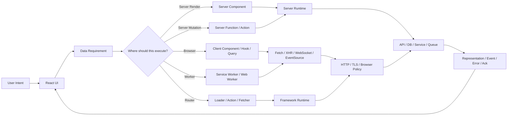

Kamu tidak sedang memilih “cara fetch data”.
Kamu sedang memilih **execution boundary** dan **consistency strategy**.

---

## 2. Apa yang Dimaksud Client-Server Communication dalam Seri Ini?

Dalam seri ini, React client-server communication mencakup semua jalur ketika aplikasi React berinteraksi dengan sistem di luar memori lokal UI.

Yang termasuk:

1. Browser melakukan HTTP request ke API.
2. Framework route loader mengambil data sebelum page dirender.
3. Form mengirim mutation ke server.
4. React Server Component membaca data di server lalu mengirim payload render ke client.
5. Server Function dipanggil dari client melalui framework boundary.
6. Client menerima realtime event melalui SSE atau WebSocket.
7. Service worker mengintersep request, cache, dan offline queue.
8. Client menyinkronkan optimistic mutation dengan server result.
9. Client mengelola error, cancellation, retry, dan stale data.
10. Client mengirim telemetry, correlation id, trace context, dan diagnostic event.

Yang tidak menjadi fokus utama karena sudah masuk seri lain:

- internal React component composition,
- generic hooks pattern,
- authentication lifecycle,
- authorization policy modelling,
- global state management sebagai topik utama.

Namun, beberapa hal tetap disentuh karena menjadi boundary komunikasi:

- cookie dan credential transport,
- CSRF dan safe mutation,
- signed URL,
- API permission failure,
- cache invalidation setelah identity berubah,
- auditability dan PII minimization.

---

## 3. Skill Map

Seorang engineer yang kuat di area ini tidak hanya tahu library. Ia memahami lapisan-lapisan sistem.

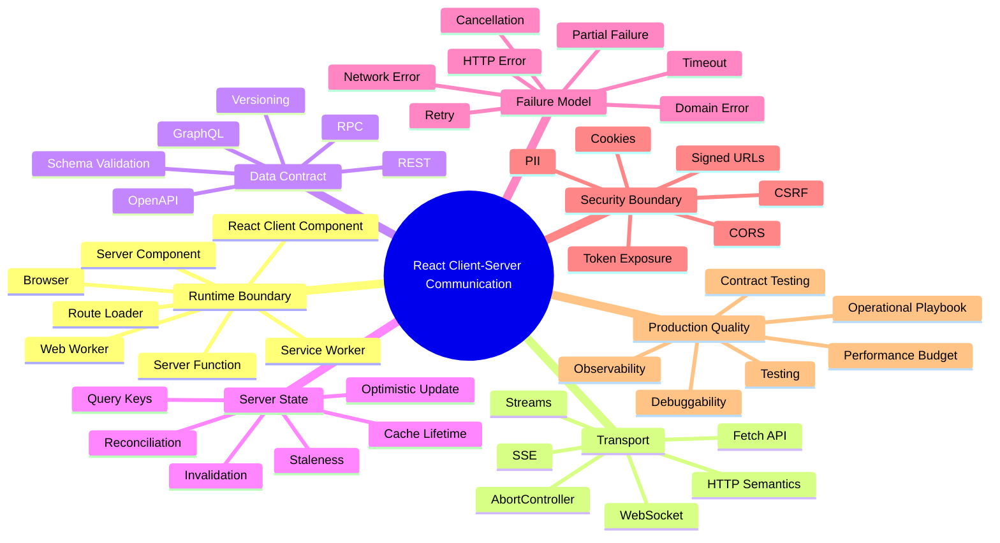

Kita akan membahas seluruh cabang ini sepanjang seri. Bagian pentingnya bukan menghafal definisi, tetapi bisa menjawab:

- request ini seharusnya dieksekusi di browser atau server?
- response ini adalah authoritative state atau snapshot sementara?
- data ini aman dikirim ke client atau harus tetap di server?
- error ini harus di-retry, ditampilkan, diabaikan, atau di-raise ke telemetry?
- cache ini boleh stale berapa lama?
- mutation ini idempotent atau tidak?
- optimistic update ini bisa rollback atau perlu kompensasi?
- apakah navigasi menciptakan waterfall?
- apakah user melihat state yang benar saat tab lain mengubah data?

---

## 4. Core Vocabulary

Sebelum masuk implementasi, kita harus presisi terhadap istilah.

### 4.1 Client

Dalam konteks web React, **client** biasanya berarti browser runtime milik user.

Client memiliki akses ke:

- DOM,
- browser storage,
- cookies yang sesuai policy,
- network APIs seperti Fetch, EventSource, WebSocket,
- user interaction,
- visibility/focus state,
- service worker,
- cache storage,
- local device constraints.

Client tidak boleh dianggap trusted.
Semua data dan instruksi dari client harus dianggap bisa dimanipulasi.

### 4.2 Server

**Server** bukan hanya satu Node.js process.
Server bisa berarti:

- API backend,
- BFF atau Backend-for-Frontend,
- edge function,
- SSR runtime,
- React Server Components runtime,
- server action/function runtime,
- file storage signer,
- GraphQL gateway,
- reverse proxy,
- CDN origin,
- worker queue consumer.

Server biasanya dipercaya lebih tinggi daripada client, tetapi tidak semua server memiliki akses dan trust level yang sama.
Edge runtime mungkin dekat dengan user, tetapi tidak punya akses penuh ke private network. BFF mungkin punya access token server-side. CDN cache mungkin hanya menyimpan representasi publik atau semi-public.

### 4.3 Communication

Communication bukan hanya request-response.

Ada beberapa bentuk:

| Bentuk | Arah | Contoh |
|---|---:|---|
| Request-response | client → server → client | Fetch REST endpoint |
| Form submission | client → server | Login, save profile, submit case |
| Route data loading | navigation → server/client loader | React Router loader |
| Render payload | server → client | React Server Components payload |
| Streaming response | server → client bertahap | partial HTML, streamed JSON, AI response |
| Server-sent events | server → client berkelanjutan | notification feed |
| WebSocket | dua arah | collaboration, chat, live dashboard |
| Background sync | client queue → server | offline mutation replay |
| Telemetry | client → collector | RUM, trace, error report |

### 4.4 State

Tidak semua state sama.

| Jenis State | Pemilik Kebenaran | Contoh |
|---|---|---|
| UI state | client | modal open, selected tab, local draft visibility |
| URL state | browser/location | filters, pagination, selected resource id |
| Server state | server/API/database | user profile, invoice status, case lifecycle |
| Derived state | hasil kalkulasi | count, eligibility result, badge label |
| Cached state | client/cache | snapshot response API |
| Optimistic state | client sementara | item muncul sebelum server confirm |
| Realtime projection | gabungan server event + local cache | live board, notification count |

Client-server communication terutama tentang **server state**, yaitu data yang dimiliki sistem luar dan direpresentasikan di UI.

---

## 5. Runtime Boundary: Lokasi Eksekusi Menentukan Arsitektur

Satu kesalahan umum: menganggap semua data fetching sama karena semua akhirnya “menampilkan data di React”.

Padahal lokasi eksekusi mengubah:

- apa yang bisa diakses,
- apa yang aman,
- kapan dijalankan,
- apakah bisa dibatalkan,
- bagaimana cache bekerja,
- bagaimana error muncul,
- apakah request terlihat di browser DevTools,
- apakah secret terekspos,
- apakah user harus menunggu render,
- apakah output bisa di-stream.

### 5.1 Runtime Matrix

| Runtime | Bisa akses DOM | Bisa akses secret server | Bisa baca browser storage | Cocok untuk | Tidak cocok untuk |
|---|---:|---:|---:|---|---|
| Client Component | Ya | Tidak | Ya | interaksi user, client-side query, realtime UI | private secret, direct DB access |
| React hook/query layer | Ya | Tidak | Ya | server-state cache, mutation lifecycle | security enforcement utama |
| Route loader/action | Tergantung framework/runtime | Tergantung lokasi eksekusi | Tidak langsung jika server-side | navigation data, form mutation | long-lived realtime channel |
| Server Component | Tidak | Ya, jika runtime diberi akses | Tidak | read-heavy data, avoid client bundle bloat | event handler, browser-only API |
| Server Function/Action | Tidak | Ya, jika runtime diberi akses | Tidak | mutation boundary, validated server operation | arbitrary client-side logic |
| Service Worker | Tidak langsung | Tidak | Cache Storage/IndexedDB | request interception, offline, asset cache | trusted authorization |
| Web Worker | Tidak | Tidak | terbatas | CPU work, parsing besar, background transform | DOM manipulation |
| Edge runtime | Tidak | terbatas | Tidak | low-latency read, personalization ringan | heavy DB transaction, long CPU |
| API backend | Tidak | Ya | Tidak | authoritative business operation | direct UI orchestration |

### 5.2 Boundary Rule

Gunakan aturan ini:

> Data boleh bergerak ke client hanya jika client memang perlu mengetahuinya untuk menjalankan pengalaman user yang sah.

Bukan:

> Data boleh bergerak ke client karena lebih mudah di-fetch dari React.

Perbedaan ini sangat penting.
Contoh:

- daftar nama customer untuk autocomplete mungkin boleh dikirim secara terbatas;
- full customer PII untuk semua record tidak boleh dikirim hanya agar filtering bisa dilakukan di client;
- permission matrix internal tidak perlu dikirim jika hanya perlu menjawab `canApprove: true/false`;
- signed upload URL boleh dikirim, secret storage credential tidak boleh.

---

## 6. React Layer Bukan Source of Truth

React tree adalah representasi UI saat ini, bukan database mini.

Kesalahan desain yang sering terjadi:

```tsx
// Anti-pattern konseptual: UI state diperlakukan sebagai kebenaran server.
setInvoice({ ...invoice, status: 'PAID' });
await fetch(`/api/invoices/${invoice.id}/pay`, { method: 'POST' });
```

Masalahnya bukan optimistic update-nya. Optimistic update boleh dan sering perlu.
Masalahnya adalah tidak ada model yang jelas:

- apakah status `PAID` sudah confirmed?
- jika server menolak, rollback ke mana?
- jika server menerima tapi status aktual `PENDING_SETTLEMENT`, UI bagaimana?
- jika tab lain melihat invoice yang sama, apa yang terjadi?
- apakah mutation idempotent jika user klik dua kali?
- apakah request bisa dibatalkan?
- apakah audit event tetap tercatat jika UI rollback?

Model yang lebih benar:

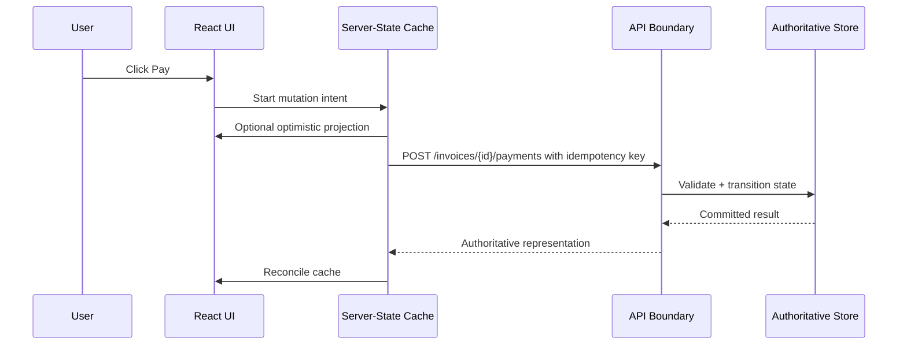

React menampilkan projection.
Server menentukan kebenaran.
Cache menyimpan snapshot.
Mutation adalah protokol sinkronisasi antara local intent dan authoritative result.

---

## 7. Data Requirement Bukan Implementation Detail

Di aplikasi kecil, data fetching sering muncul sebagai detail di component.

Di aplikasi besar, data requirement adalah bagian dari desain screen.

Contoh screen `CaseDetailPage`:

- butuh case summary,
- butuh current lifecycle state,
- butuh assignee,
- butuh allowed actions,
- butuh latest timeline,
- butuh attachments metadata,
- butuh SLA clock,
- butuh realtime update jika case berubah,
- butuh audit-safe mutation untuk approve/reject/escalate.

Kalau semua dipanggil acak dari child component, kamu akan mendapat:

- waterfall,
- duplicated request,
- inconsistent loading state,
- error tersebar,
- race condition antar component,
- stale permission,
- mutation yang mengubah sebagian cache saja,
- debugging production yang sulit.

Data requirement harus bisa dipetakan:

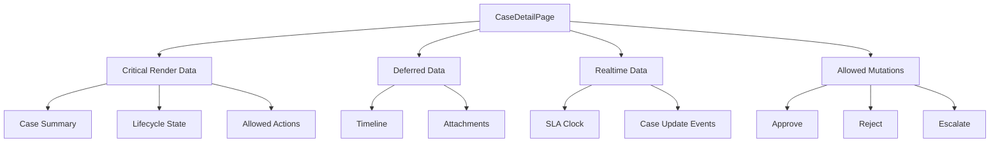

Dari sini baru kita tentukan:

- mana yang route-level loader,
- mana yang query cache,
- mana yang server-rendered,
- mana yang streamed/deferred,
- mana yang realtime,
- mana yang mutation endpoint,
- mana yang harus revalidate setelah mutation.

---

## 8. Boundary Types dalam React Modern

### 8.1 Component-Level Fetching

Biasanya muncul seperti:

```tsx
useEffect(() => {
  let ignore = false;

  fetch('/api/projects')
    .then((response) => response.json())
    .then((data) => {
      if (!ignore) setProjects(data);
    });

  return () => {
    ignore = true;
  };
}, []);
```

Ini mudah dipahami, tetapi cepat rapuh jika:

- request perlu cancellation,
- ada duplicate component,
- navigation berubah cepat,
- user pindah tab,
- data harus di-cache,
- mutation harus invalidate,
- error harus konsisten,
- request perlu retry policy,
- ada pagination/infinite scroll,
- ada optimistic update.

Component-level fetching masih berguna untuk kasus lokal dan sederhana, tetapi bukan default architecture untuk aplikasi kompleks.

### 8.2 Query-Layer Fetching

Query layer seperti TanStack Query, SWR, Apollo Client, Relay, atau custom server-state engine memindahkan remote data ke model:

- resource identity,
- cache,
- stale time,
- garbage collection,
- background refetch,
- mutation lifecycle,
- invalidation,
- optimistic update,
- deduplication,
- retry.

Ini adalah pilihan default yang kuat untuk banyak SPA dan hybrid app.

### 8.3 Route-Level Fetching

Route loader/action mengikat data ke navigation boundary.

Cocok ketika:

- page tidak valid tanpa data tertentu,
- URL menentukan resource,
- form submission adalah bagian dari routing flow,
- loading/error boundary harus mengikuti route,
- prefetch sebelum navigasi berguna.

### 8.4 Server Component Fetching

Server Component memindahkan read operation ke server render boundary.

Cocok ketika:

- data tidak perlu interaktif di client,
- ingin mengurangi bundle client,
- ingin mengakses server-only resource,
- ingin composition dekat data source,
- ingin streaming sebagian UI.

Namun Server Component bukan pengganti semua client-server communication. Begitu ada interaksi client, mutation, realtime, offline, atau cache client, boundary lain tetap diperlukan.

React docs menyatakan Server Components berjalan di environment terpisah dari client app atau SSR server dan dapat berjalan saat build atau per request menggunakan web server. Referensi: https://react.dev/reference/rsc/server-components

### 8.5 Server Function / Server Action

Server Function memungkinkan Client Component memicu fungsi async yang dieksekusi di server melalui framework yang mendukungnya.

Ini cocok untuk mutation boundary yang:

- butuh akses server-side capability,
- butuh validasi dekat business operation,
- butuh form action flow,
- tidak ingin mengekspos detail endpoint manual.

Tetapi jangan salah paham: Server Function tetap boundary network. Ia tetap butuh serialization, validation, authorization, error handling, observability, dan idempotency.

React docs mendeskripsikan Server Functions sebagai fungsi async yang dapat dipanggil oleh Client Components dan dieksekusi di server. Referensi: https://react.dev/reference/rsc/server-functions

### 8.6 Service Worker Boundary

Service worker berada di antara page dan network.

Ia bisa:

- cache asset,
- intercept request,
- serve offline fallback,
- queue mutation,
- implement stale-while-revalidate,
- coordinate background sync.

Namun service worker bukan tempat menaruh secret atau enforcement authorization. Ia tetap berjalan di lingkungan client.

---

## 9. Data Plane vs Control Plane

Untuk memahami komunikasi client-server, pisahkan **data plane** dan **control plane**.

### 9.1 Data Plane

Data plane adalah jalur payload utama aplikasi:

- fetch list users,
- get case detail,
- submit approval,
- upload file,
- receive notification event,
- stream generated response.

### 9.2 Control Plane

Control plane mengatur bagaimana komunikasi itu terjadi:

- retry policy,
- timeout,
- rate limit behavior,
- auth refresh,
- cache invalidation,
- feature flag,
- circuit breaker UI,
- telemetry,
- correlation id,
- request priority,
- offline policy.

Engineer junior sering hanya membangun data plane.
Engineer senior memastikan control plane tidak menjadi afterthought.

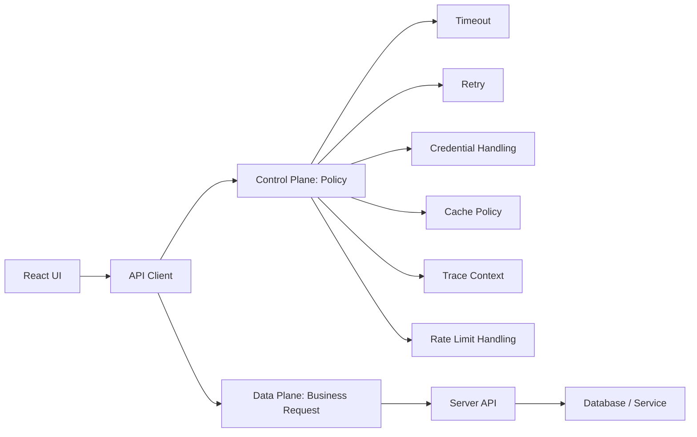

Kamu akan sering melihat bug production yang bukan karena endpoint salah, tetapi karena control plane tidak didesain:

- request menggantung tanpa timeout,
- retry menggandakan payment,
- error 401 memicu loop refresh token,
- stale cache menampilkan action yang tidak boleh lagi,
- mutation sukses tapi UI tidak invalidate list,
- network offline dianggap server error,
- user klik berkali-kali karena tidak ada pending state,
- request dari tab lama overwrite data dari tab baru.

---

## 10. The Five Boundaries

Untuk setiap komunikasi client-server, identifikasi lima boundary berikut.

### 10.1 Trust Boundary

Siapa yang dipercaya?

Client tidak trusted. Server lebih trusted. Tapi server internal pun perlu scoped trust.

Pertanyaan:

- Apakah client boleh menentukan field ini?
- Apakah server menghitung ulang harga/status/permission?
- Apakah token bisa dicuri dari JavaScript?
- Apakah endpoint mengandalkan hidden input atau disabled button sebagai enforcement?
- Apakah ID resource bisa diganti user?

Invariant:

> UI boleh membantu user memilih aksi yang valid, tetapi server wajib memutuskan apakah aksi itu sah.

### 10.2 Serialization Boundary

Apa yang bisa dikirim?

Network hanya mengirim bytes. Object, class instance, Date object, Map, Set, function, Error object, BigInt, dan cyclic reference harus direpresentasikan secara eksplisit.

Pertanyaan:

- Apakah timestamp dikirim sebagai ISO string?
- Apakah decimal money aman sebagai number?
- Apakah enum punya unknown fallback?
- Apakah error punya machine-readable code?
- Apakah schema versioned?

Invariant:

> Semua yang menyeberangi network harus punya representasi kontraktual, bukan kebetulan bentuk object runtime.

### 10.3 Consistency Boundary

Kapan data dianggap benar?

Pertanyaan:

- Apakah response adalah snapshot?
- Apakah cache boleh stale?
- Apakah mutation result menggantikan query lama?
- Apakah data perlu refetch setelah focus?
- Apakah realtime event authoritative atau hanya hint untuk refetch?

Invariant:

> Client cache adalah projection, bukan source of truth.

### 10.4 Latency Boundary

Berapa lama user boleh menunggu?

Pertanyaan:

- Data apa yang blocking render?
- Data apa yang bisa deferred?
- Mana yang bisa prefetch?
- Apakah request paralel atau waterfall?
- Apa timeout user-facing?
- Apa retry budget?

Invariant:

> Tidak semua data memiliki prioritas yang sama.

### 10.5 Failure Boundary

Failure siapa yang terlihat di mana?

Pertanyaan:

- Network offline?
- DNS/TLS gagal?
- Request abort karena navigasi?
- HTTP 404 resource tidak ada?
- HTTP 409 conflict?
- Domain validation error?
- Partial failure?
- Server timeout?
- Client parse error?

Invariant:

> Error harus diklasifikasi sebelum diputuskan UI behavior-nya.

---

## 11. Communication Design Decision Tree

Gunakan decision tree berikut saat mendesain data flow.

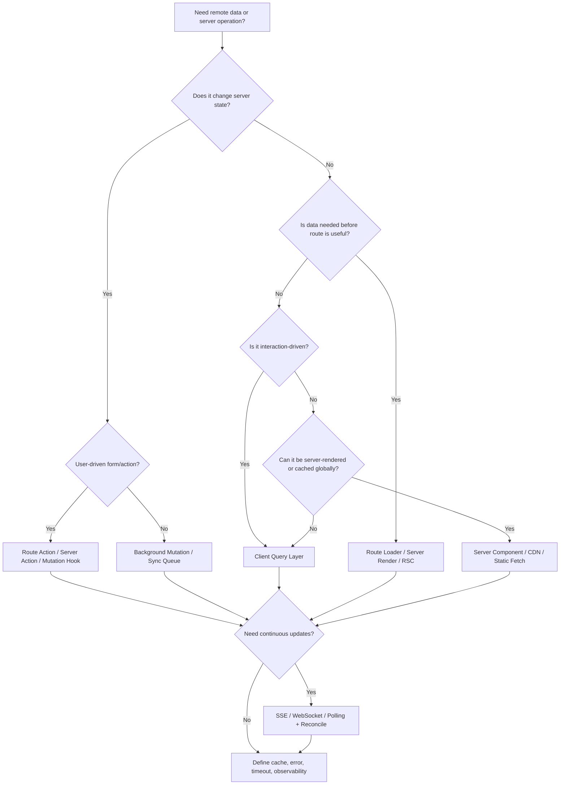

Decision tree ini bukan aturan absolut. Ia memaksa kamu menanyakan hal yang benar lebih awal.

---

## 12. Ownership Model

Client-server communication menjadi kacau ketika ownership tidak jelas.

### 12.1 Server-Owned Fields

Field yang harus dihitung atau diset server:

- `id`,
- `createdAt`,
- `updatedAt`,
- `status`, jika status bagian dari lifecycle authoritative,
- `version`,
- `allowedActions`,
- `auditTrail`,
- `computedAmount`,
- `riskScore`,
- `approvedBy`,
- `approvedAt`.

Client boleh mengirim intent, bukan hasil akhir.

Buruk:

```json
{
  "caseId": "CASE-123",
  "status": "APPROVED",
  "approvedBy": "alice",
  "approvedAt": "2026-07-07T10:00:00Z"
}
```

Lebih baik:

```json
{
  "caseId": "CASE-123",
  "decision": "APPROVE",
  "reason": "Documents complete",
  "idempotencyKey": "01JZ..."
}
```

Server menentukan status final, actor, timestamp, audit event, dan allowed transition.

### 12.2 Client-Owned Fields

Field yang memang milik client:

- temporary UI id,
- draft text sebelum submit,
- selected row,
- collapsed section,
- sort view lokal,
- upload progress,
- optimistic marker,
- local correlation id.

### 12.3 Shared Projection

Beberapa state adalah projection gabungan:

- unread notification count,
- typing indicator,
- upload list dengan progress lokal dan metadata server,
- live case timeline,
- collaborative document cursor.

Untuk shared projection, kamu perlu reconciliation strategy, bukan sekadar `setState`.

---

## 13. Request Lifecycle sebagai State Machine

Setiap request bukan boolean `loading`.
Ia adalah state machine.

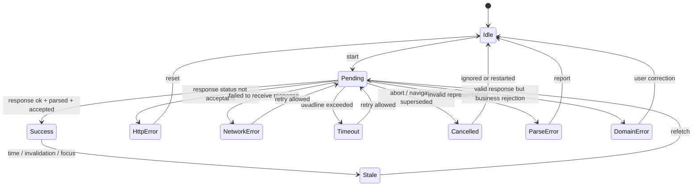

Kamu bisa menyederhanakan UI, tetapi jangan menyederhanakan model internal secara berlebihan.

Minimal, bedakan:

- idle,
- pending,
- success,
- empty,
- validation error,
- recoverable error,
- non-recoverable error,
- cancelled,
- stale.

---

## 14. Why `isLoading` Is Not Enough

`isLoading` menjawab hanya satu pertanyaan:

> “Apakah operasi sedang berlangsung?”

Ia tidak menjawab:

- operasi apa?
- request mana yang terakhir?
- apakah data lama masih bisa ditampilkan?
- apakah pending karena initial load atau background refetch?
- apakah error dari response terbaru atau request lama?
- apakah request dibatalkan karena user pindah halaman?
- apakah mutation masih optimistic?
- apakah retry sedang berjalan?

Untuk aplikasi serius, state remote data biasanya minimal seperti:

```ts
type RemoteData<T> =
  | { tag: 'idle' }
  | { tag: 'pending'; previous?: T }
  | { tag: 'success'; data: T; receivedAt: string; stale: boolean }
  | { tag: 'empty'; receivedAt: string }
  | { tag: 'validation-error'; issues: Array<{ path: string; message: string }> }
  | { tag: 'http-error'; status: number; code?: string; retryable: boolean }
  | { tag: 'network-error'; retryable: boolean }
  | { tag: 'cancelled'; reason: string };
```

Library bisa menyembunyikan detail ini, tetapi kamu tetap harus memahami semantiknya.

---

## 15. API Client sebagai Boundary Object

Jangan biarkan setiap component merakit request sendiri.

Buruk:

```tsx
await fetch(`/api/cases/${id}`, {
  method: 'POST',
  headers: {
    'Content-Type': 'application/json',
    Authorization: `Bearer ${token}`,
  },
  body: JSON.stringify({ status: 'APPROVED' }),
});
```

Masalah:

- duplikasi header,
- tidak ada timeout,
- error parsing tersebar,
- tidak ada correlation id,
- tidak ada response schema validation,
- tidak ada consistent retry,
- endpoint detail bocor ke UI,
- payload intent tidak jelas.

Lebih baik:

```ts
await caseApi.approveCase({
  caseId,
  reason,
  idempotencyKey,
  signal,
});
```

API client bukan hanya wrapper `fetch`.
Ia adalah boundary object yang mengenkapsulasi:

- base URL,
- credential policy,
- headers,
- timeout,
- abort signal,
- error normalization,
- schema validation,
- telemetry,
- idempotency,
- retry policy,
- domain method naming.

---

## 16. BFF dan API Gateway dari Sudut Pandang React

Backend-for-Frontend bukan sekadar “proxy supaya CORS tidak ribet”.

BFF berguna ketika frontend membutuhkan API shape yang berbeda dari service internal.

Contoh:

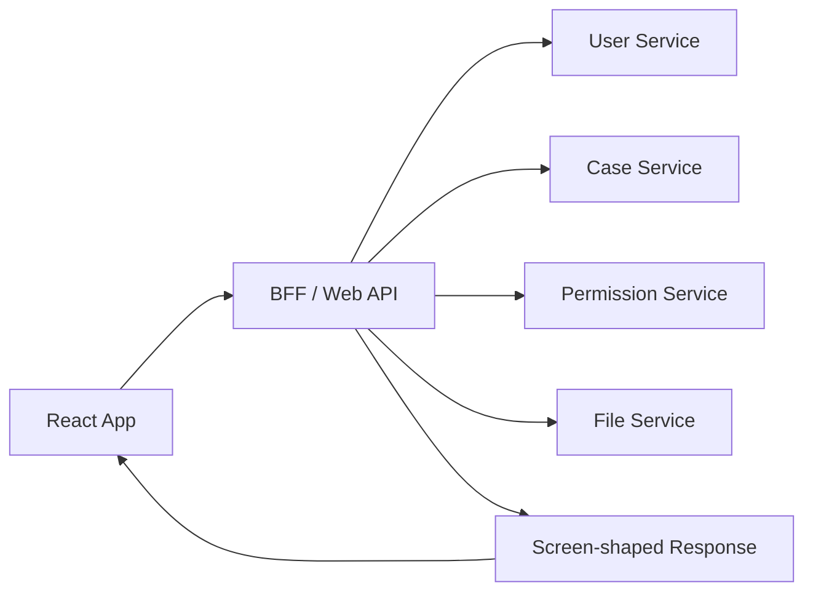

BFF cocok untuk:

- aggregating multiple backend calls,
- hiding internal service topology,
- server-side token handling,
- shaping response sesuai page,
- reducing waterfall,
- enforcing frontend-specific policy,
- producing signed URLs,
- mapping backend errors ke frontend-friendly errors.

Tetapi BFF bisa menjadi masalah jika:

- semua business logic pindah ke BFF tanpa ownership,
- BFF menjadi monolith tidak terawat,
- kontrak BFF tidak versioned,
- caching tidak jelas,
- frontend terlalu bergantung pada one-off endpoint per screen.

---

## 17. Cache sebagai Distributed Systems Problem

Client cache bukan detail performa kecil.
Ia adalah distributed state replica.

Ketika client menyimpan response, ia memiliki copy dari state server pada waktu tertentu.
Pertanyaannya:

- seberapa lama copy itu valid?
- apa yang membuatnya stale?
- siapa yang boleh memperbarui?
- mutation mana yang invalidate?
- apakah event realtime memperbarui atau hanya menandai stale?
- apakah cache dibagi antar tab?
- apakah cache bertahan offline?

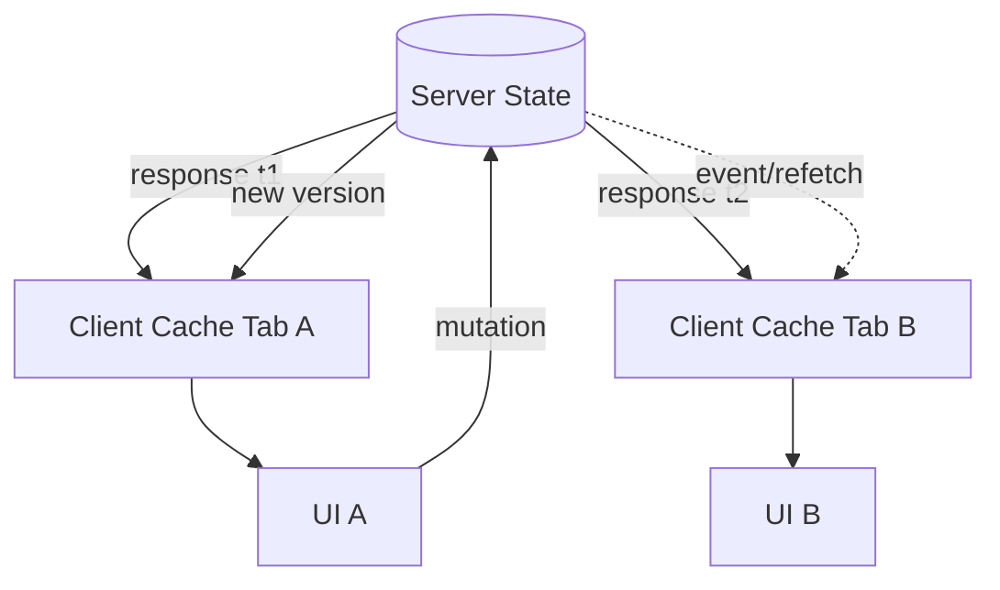

Jika tidak ada policy, user akan melihat realitas berbeda di tab berbeda.
Untuk beberapa aplikasi itu acceptable. Untuk case management, payment, approval, atau regulatory workflow, itu bisa berbahaya.

---

## 18. Latency Budget

Setiap screen harus punya latency budget.

Contoh untuk dashboard:

| Data | Priority | Strategy |
|---|---|---|
| user shell/session summary | blocking | server render / initial loader |
| primary list | high | route loader or query with skeleton |
| notification count | medium | background query |
| analytics widget | low | lazy/deferred |
| activity stream | realtime/deferred | SSE or polling |
| export availability | on demand | fetch on interaction |

Tanpa budget, semua request dianggap sama penting. Akibatnya:

- render blocking berlebihan,
- waterfall,
- user menunggu data yang tidak langsung dibutuhkan,
- loading state berisik,
- backend menerima burst request saat page load.

---

## 19. Failure Budget

Tidak semua request harus berhasil agar page berguna.

Contoh `CaseDetailPage`:

- case summary gagal: page tidak bisa digunakan,
- timeline gagal: tampilkan summary dan retry timeline,
- attachment preview gagal: tampilkan metadata saja,
- notification subscription gagal: fallback polling,
- audit metadata gagal: block privileged action jika perlu defensibility.

Model seperti ini lebih kuat daripada global “Something went wrong”.

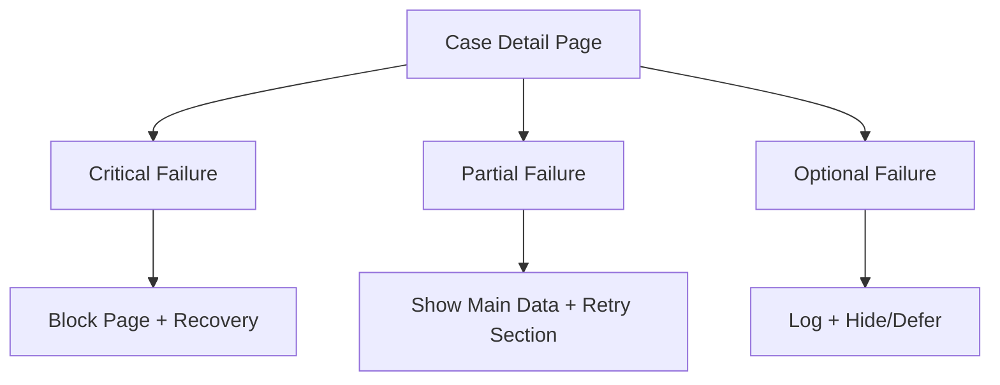

---

## 20. Observability Starts at the Client

Client-server communication harus bisa dijawab saat production incident:

- request apa yang gagal?
- user action apa yang memicunya?
- route mana?
- query key/resource mana?
- correlation id apa?
- status code apa?
- error code domain apa?
- latency berapa?
- retry berapa kali?
- apakah request aborted?
- apakah response parsing gagal?
- apakah cache menampilkan data stale?

Minimal API client harus bisa menyisipkan metadata:

```ts
type RequestContext = {
  operation: string;
  route: string;
  resource?: string;
  correlationId: string;
  idempotencyKey?: string;
  startedAt: number;
};
```

Observability bukan hanya untuk backend. Banyak bug network hanya terlihat dari browser:

- CORS blocked,
- mixed content,
- cookie tidak terkirim karena SameSite/Secure/Domain,
- request dibatalkan navigation,
- service worker serving stale response,
- browser extension interference,
- mobile network unstable,
- tab background throttling.

---

## 21. Security Boundary: UI Is Not Enforcement

UI boleh menyembunyikan tombol `Approve` jika user tidak punya permission.
Tetapi server tetap harus menolak jika request approve dikirim manual.

Client-side permission adalah UX optimization.
Server-side authorization adalah enforcement.

Contoh response aman:

```json
{
  "caseId": "CASE-123",
  "status": "READY_FOR_REVIEW",
  "allowedActions": ["APPROVE", "REJECT", "REQUEST_INFO"]
}
```

Client bisa render tombol berdasarkan `allowedActions`.
Namun endpoint tetap memvalidasi:

- actor,
- role/permission,
- resource ownership,
- lifecycle state,
- conflict/version,
- policy exception,
- audit requirements.

Seri ini tidak akan mengulang teori authorization, tetapi akan membahas bagaimana permission result bergerak melalui client-server boundary.

---

## 22. Contract-First Thinking

React app tidak seharusnya bergantung pada “shape kebetulan” response backend.
Ia bergantung pada contract.

Contract minimal menjawab:

- endpoint/function apa?
- method apa?
- request body shape apa?
- response body shape apa?
- status code apa?
- error code apa?
- field optional atau required?
- format timestamp?
- enum extensibility?
- pagination model?
- versioning strategy?
- deprecation policy?

Tanpa contract, frontend dan backend berkomunikasi lewat asumsi.
Asumsi adalah dependency paling mahal karena tidak bisa dicari compiler.

---

## 23. Production-Grade Communication Invariants

Gunakan invariant berikut sepanjang seri.

### Invariant 1 — Every request has an owner

Setiap request harus bisa dijawab: siapa pemiliknya?

- component?
- route?
- query cache?
- service worker?
- server component?
- mutation queue?

Request tanpa owner sulit dibatalkan, dilacak, atau di-retry.

### Invariant 2 — Every response has a contract

Jangan parse response sebagai `any` lalu berharap UI benar.

### Invariant 3 — Every mutation has a result strategy

Setelah mutation:

- update cache langsung?
- invalidate query?
- redirect?
- refetch resource?
- wait for event?
- rollback optimistic state?

### Invariant 4 — Every failure has a classification

Tidak semua failure sama.
HTTP 400, 401, 403, 404, 409, 422, 429, 500, network offline, timeout, abort, dan parse error harus punya konsekuensi berbeda.

### Invariant 5 — Every cache has an invalidation story

Kalau tidak tahu kapan cache stale, berarti cache hanya kebetulan benar.

### Invariant 6 — Every boundary validates

Client validates for UX.
Server validates for correctness.
Contract validates for compatibility.

### Invariant 7 — Every user-visible action is idempotency-aware

Terutama payment, approval, submit, upload, dan workflow transition.

### Invariant 8 — Every production request is observable

Minimal operation name, route, latency, status/error, dan correlation id.

---

## 24. Anti-Patterns yang Akan Kita Hindari

### 24.1 `fetch` tersebar di mana-mana

Gejala:

- headers copy-paste,
- error handling beda-beda,
- tidak ada timeout,
- sulit mock/test,
- sulit trace.

### 24.2 Semua state remote dimasukkan ke global store

Server state punya lifecycle berbeda dari UI state.
Ia perlu staleness, invalidation, refetch, dan reconciliation.
Global store biasa sering tidak cukup kecuali kamu membangun server-state engine sendiri.

### 24.3 Treat HTTP 200 as business success

HTTP 200 hanya mengatakan response HTTP sukses.
Domain operation bisa tetap gagal jika contract mendesain begitu.
Namun lebih baik domain failure punya status dan error semantics yang jelas.

### 24.4 Mutation tanpa idempotency

User double-click, retry, mobile network replay, atau browser resend bisa menggandakan operasi.

### 24.5 Loading state sebagai blank screen

Jika data lama masih berguna, jangan selalu kosongkan UI saat refetch.

### 24.6 Cache invalidation by hope

“Setelah save, semoga component lain refetch sendiri” bukan strategy.

### 24.7 Endpoint shape mengikuti component tree secara membabi buta

BFF boleh screen-shaped, tetapi jangan membuat endpoint one-off tanpa contract dan ownership.

### 24.8 Error message langsung dari backend ke user

Backend error sering terlalu teknis, bocor detail, atau tidak actionable.
Frontend perlu mapping user-facing.

---

## 25. Example: Mendesain Screen Secara Boundary-First

Kita ambil contoh `RegulatoryCaseReviewPage`.

### 25.1 Requirement

User reviewer membuka halaman case, melihat detail, timeline, attachment, allowed actions, lalu bisa approve/reject/request info.

### 25.2 Boundary Design

| Kebutuhan | Boundary | Alasan |
|---|---|---|
| Case summary | route loader / query | critical render data |
| Allowed actions | same response as summary | permission harus konsisten dengan state |
| Timeline | deferred query | bisa tampil setelah shell |
| Attachment metadata | query | tidak blocking primary decision |
| Attachment download | signed URL endpoint | secret storage tidak ke client |
| Approve/reject | mutation endpoint/server action | authoritative transition |
| SLA update | polling/SSE | berubah seiring waktu |
| Audit log | server generated | client tidak menentukan audit truth |

### 25.3 Data Flow

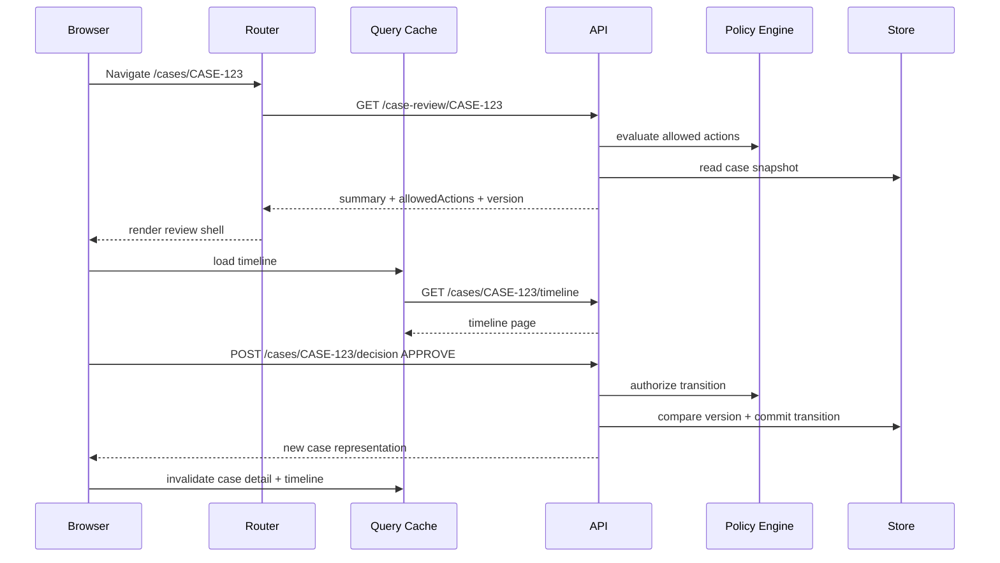

### 25.4 Invariants

- UI tidak menentukan final status.
- Mutation membawa intent dan idempotency key.
- Server memvalidasi state version.
- Allowed actions dikaitkan dengan case version.
- Timeline bisa partial failure tanpa merusak summary.
- Signed URL dibuat on demand.
- Audit event dibuat server-side.

---

## 26. What “Top 1%” Means Here

Dalam area ini, top engineer bukan yang hafal semua library.
Top engineer adalah yang bisa mendesain komunikasi sebagai sistem yang bisa berubah, gagal, diamati, dan dipertahankan.

Ciri-cirinya:

1. Bisa membedakan UI state dan server state tanpa dogma.
2. Bisa memilih boundary eksekusi berdasarkan security, latency, dan ownership.
3. Bisa mendesain API client yang menjadi control point, bukan helper acak.
4. Bisa membaca waterfall dan mengubahnya menjadi parallel/deferred/prefetched flow.
5. Bisa membuat mutation yang idempotent, observable, dan recoverable.
6. Bisa menjelaskan cache invalidation sebagai consistency protocol.
7. Bisa mendesain error taxonomy yang tidak menipu user.
8. Bisa melakukan production debugging dari DevTools sampai trace backend.
9. Bisa menyusun contract yang tahan perubahan backend.
10. Bisa menghapus data dari client yang tidak perlu diketahui client.

---

## 27. Checklist Desain Awal

Sebelum menulis code, jawab ini:

### Data

- Data apa yang dibutuhkan screen?
- Mana critical, deferred, optional, realtime?
- Siapa pemilik kebenaran data?
- Apakah data aman dikirim ke client?
- Apakah response perlu disaring berdasarkan permission?

### Boundary

- Data diambil di client, route loader, server component, atau BFF?
- Mutation lewat endpoint, route action, atau server function?
- Perlukah service worker/offline behavior?
- Perlukah realtime channel?

### Contract

- Apa request shape?
- Apa response shape?
- Apa error shape?
- Apa status code semantics?
- Apa versioning/deprecation strategy?

### Lifecycle

- Kapan request dimulai?
- Kapan dibatalkan?
- Apa timeout?
- Apa retry policy?
- Apakah ada deduplication?
- Apakah response lama boleh tetap tampil?

### Cache

- Query key/resource identity apa?
- Stale time berapa?
- Mutation mengubah cache apa?
- Invalidation apa yang terjadi?
- Apakah cache perlu persist atau cross-tab?

### Failure

- Failure mana blocking?
- Failure mana partial?
- Failure mana silent dengan telemetry?
- Apa user action untuk recovery?
- Apa log/metric/trace yang dibutuhkan?

### Security

- Credential dikirim bagaimana?
- Apakah CSRF relevan?
- Apakah token terekspos JavaScript?
- Apakah server validate semua field?
- Apakah PII diminimalkan?

---

## 28. Mini Lab: Boundary Audit

Ambil satu screen nyata dari aplikasi yang pernah kamu kerjakan.

Isi tabel ini:

| Pertanyaan | Jawaban |
|---|---|
| Screen name |  |
| Critical data |  |
| Deferred data |  |
| Optional data |  |
| Mutations |  |
| Realtime need |  |
| Current fetching location |  |
| Better boundary |  |
| Cache owner |  |
| Invalidation trigger |  |
| Failure modes |  |
| Observability gap |  |
| Security concern |  |

Target lab ini bukan refactor langsung.
Targetnya adalah melihat apakah komunikasi sekarang didesain atau hanya tumbuh.

---

## 29. Ringkasan

Client-server communication di React adalah desain boundary.

Hal yang harus kamu bawa dari part ini:

1. React component bukan source of truth.
2. Server state adalah snapshot/projection dari sistem authoritative.
3. Lokasi eksekusi menentukan security, latency, cache, dan error behavior.
4. Fetching strategy harus mengikuti data requirement, bukan sekadar posisi component.
5. Mutation adalah protokol sinkronisasi intent client dengan hasil authoritative server.
6. Cache adalah replica yang butuh consistency strategy.
7. Error harus diklasifikasi.
8. API client adalah boundary object dan control point.
9. UI bukan enforcement security.
10. Production-grade communication harus observable.

Part berikutnya akan turun satu level lebih konkret: **apa sebenarnya yang menyeberangi network**. Kita akan bongkar request, response, header, body, credentials, cookies, streams, serialization, dan kenapa object JavaScript tidak pernah benar-benar “dikirim ke server”.

---

## References

- React Documentation — Server Components: https://react.dev/reference/rsc/server-components
- React Documentation — Server Functions: https://react.dev/reference/rsc/server-functions
- MDN Web Docs — Fetch API: https://developer.mozilla.org/en-US/docs/Web/API/Fetch_API
- MDN Web Docs — Using the Fetch API: https://developer.mozilla.org/en-US/docs/Web/API/Fetch_API/Using_Fetch
- MDN Web Docs — HTTP messages: https://developer.mozilla.org/en-US/docs/Web/HTTP/Guides/Messages
- RFC 9110 — HTTP Semantics: https://www.rfc-editor.org/rfc/rfc9110.html
