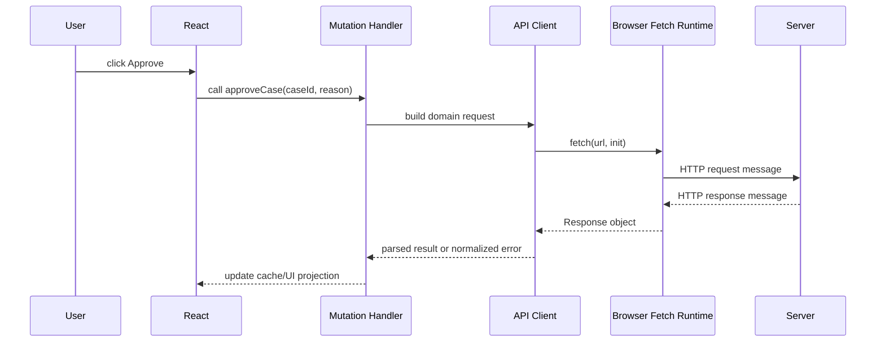
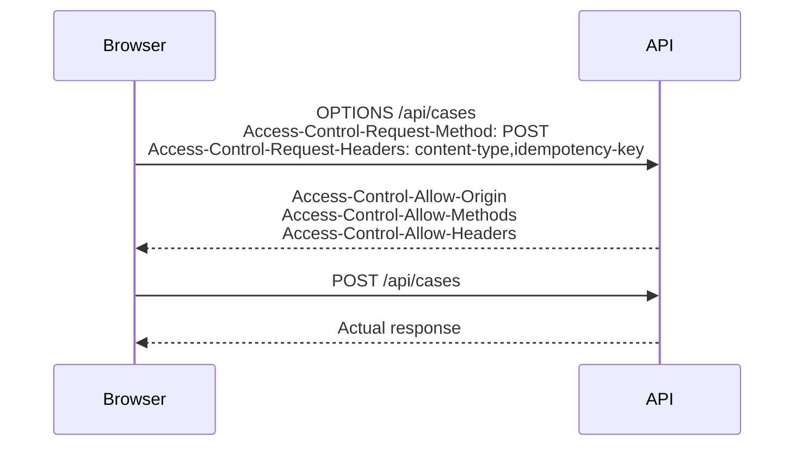
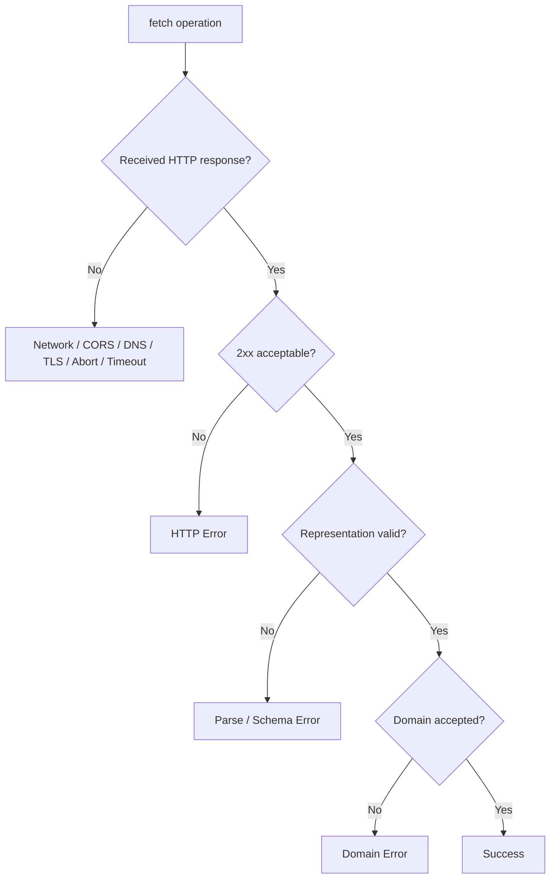
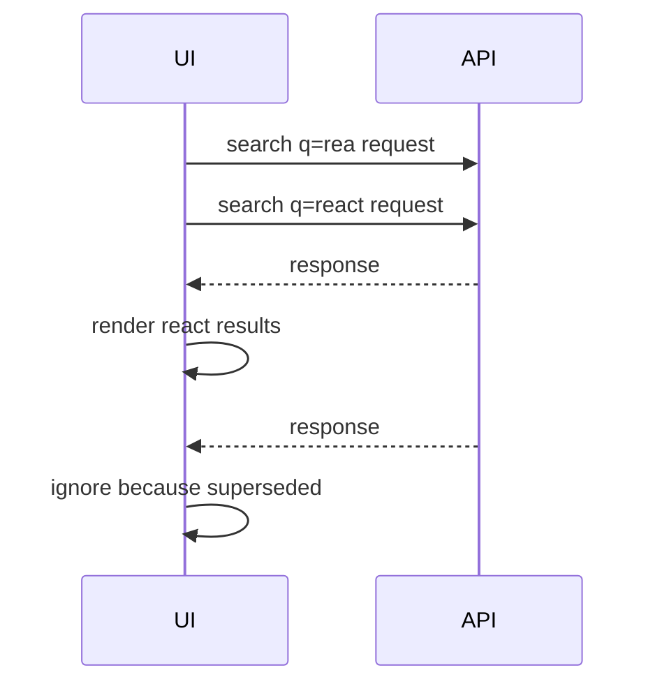
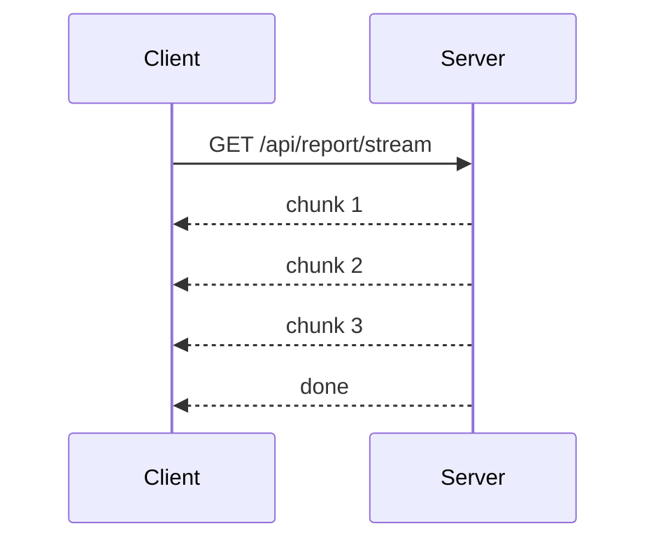
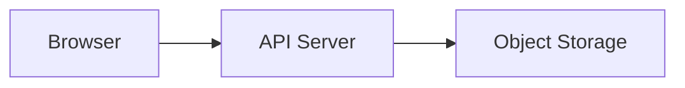
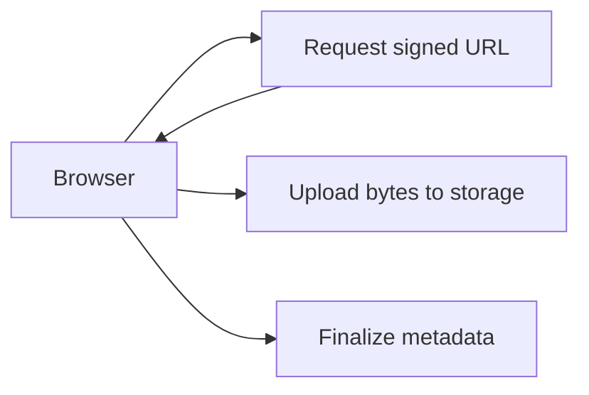
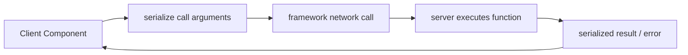

# Part 002 — What Actually Crosses the Network

Kita sering bicara seolah-olah React “mengirim object ke backend” atau backend “mengembalikan user object”.
Itu berguna sebagai shorthand, tetapi berbahaya jika dipercaya secara literal.

Yang benar:

> Network tidak mengirim object JavaScript, component, function, class instance, permission, atau business intent secara langsung. Network mengirim byte yang diberi struktur oleh protocol, biasanya HTTP message, lalu runtime di kedua sisi menafsirkannya kembali menjadi data.

Part ini membongkar apa yang benar-benar menyeberangi boundary.

Jika kamu memahami bagian ini, bug seperti ini akan lebih mudah dibaca:

- `fetch` sukses tetapi UI masuk error,
- HTTP 400 tetapi promise tidak reject,
- cookie tidak terkirim,
- body tidak bisa dibaca dua kali,
- `Date` berubah menjadi string,
- `undefined` hilang dari JSON,
- file upload gagal karena salah `Content-Type`,
- request dibatalkan tetapi server tetap memproses,
- response 204 membuat `response.json()` throw,
- enum baru dari backend merusak UI,
- CDN meng-cache response yang seharusnya user-specific,
- error backend bocor ke user.

---

## 1. Core Thesis

Setiap client-server communication terdiri dari transformasi berlapis:

```mermaid
flowchart LR
  Intent[User / UI Intent] --> AppModel[Application Model]
  AppModel --> Serialize[Serialize to Representation]
  Serialize --> HTTPReq[HTTP Request Message]
  HTTPReq --> Bytes[Bytes over Network]
  Bytes --> HTTPRes[HTTP Response Message]
  HTTPRes --> Parse[Parse Representation]
  Parse --> ClientModel[Client Model / Cache]
  ClientModel --> UI[Rendered UI]
```



Bug bisa muncul di lapisan mana pun:

| Lapisan | Contoh Bug |
|---|---|
| Intent | user klik dua kali, action tidak idempotent |
| App model | field salah, stale version, wrong resource id |
| Serialization | `Date` menjadi string, `BigInt` gagal JSON |
| HTTP request | method/header/body salah |
| Browser policy | CORS, credentials, mixed content |
| Network | offline, DNS, TLS, timeout |
| Server interpretation | validation, auth, content negotiation |
| HTTP response | status code, cache headers, content type |
| Parsing | invalid JSON, empty body, schema mismatch |
| Client projection | stale cache, wrong invalidation, race condition |
| UI render | misleading loading/error state |

Top engineer tidak berhenti pada “API error”. Ia bertanya: error di lapisan mana?

---

## 2. HTTP Message: Unit Dasar Komunikasi Web

HTTP adalah protocol request-response stateless. RFC 9110 mendefinisikan HTTP sebagai protocol application-level yang stateless dan berbasis message. Referensi: https://www.rfc-editor.org/rfc/rfc9110.html

MDN juga menjelaskan bahwa HTTP message terdiri dari request dari client dan response dari server. Referensi: https://developer.mozilla.org/en-US/docs/Web/HTTP/Guides/Messages

Bentuk konseptual request:

```http
POST /api/cases/CASE-123/decision HTTP/1.1
Host: app.example.com
Content-Type: application/json
Accept: application/json
Cookie: session=...
Idempotency-Key: 01JZ...
X-Correlation-Id: req_abc123

{
  "decision": "APPROVE",
  "reason": "Documents complete"
}
```

Bentuk konseptual response:

```http
HTTP/1.1 200 OK
Content-Type: application/json
Cache-Control: no-store
X-Correlation-Id: req_abc123

{
  "caseId": "CASE-123",
  "status": "APPROVED",
  "version": 18,
  "allowedActions": []
}
```

Browser dan server menyembunyikan detail wire format dari kamu, terutama di HTTP/2 dan HTTP/3, tetapi konsep message tetap penting:

- request punya method, target, headers, body;
- response punya status, headers, body;
- headers membawa metadata;
- body membawa representation;
- protocol tidak tahu object JavaScript-mu.

---

## 3. Dari React Event ke HTTP Request

Misal user klik tombol approve:

```tsx
<button onClick={() => approveCase(caseId, reason)}>
  Approve
</button>
```

Yang terjadi bukan “button mengubah database”.

Secara sistem:



React tidak tahu network.
Ia tahu event handler memicu fungsi.
Fungsi itu memanggil API client.
API client membangun request.
Browser runtime mengeksekusi request sesuai web platform dan browser policy.

---

## 4. Anatomy of a Request

Dari sudut pandang Fetch API, request biasanya dibangun dengan:

```ts
await fetch('/api/cases/CASE-123/decision', {
  method: 'POST',
  headers: {
    'Content-Type': 'application/json',
    Accept: 'application/json',
    'Idempotency-Key': idempotencyKey,
  },
  credentials: 'include',
  body: JSON.stringify({
    decision: 'APPROVE',
    reason: 'Documents complete',
  }),
  signal,
});
```

MDN mendeskripsikan Fetch API sebagai interface untuk membuat HTTP request dan memproses response. Referensi: https://developer.mozilla.org/en-US/docs/Web/API/Fetch_API/Using_Fetch

Mari bongkar satu per satu.

---

## 5. URL: Resource Target dan Query State

URL bukan string biasa. URL adalah alamat resource atau operation boundary.

Contoh:

```txt
https://app.example.com/api/cases?status=OPEN&page=2&pageSize=50
```

Bagian penting:

| Bagian | Contoh | Makna |
|---|---|---|
| scheme | `https` | protocol/security context |
| host | `app.example.com` | origin/server target |
| path | `/api/cases` | resource collection |
| query | `status=OPEN&page=2` | parameter representasi |
| fragment | `#section` | client-side only, tidak dikirim ke server dalam HTTP request normal |

### 5.1 Query Parameter sebagai Contract

Query parameter sering dianggap fleksibel, tetapi tetap contract.

Buruk:

```txt
/api/cases?filter=whateverFrontendCurrentlyUses
```

Lebih baik:

```txt
/api/cases?status=OPEN&assigneeId=USR-123&sort=-updatedAt&pageSize=50&pageToken=...
```

Pertanyaan desain:

- Apakah filter optional?
- Apakah sort field whitelist?
- Apakah pagination offset atau cursor?
- Apakah query param masuk cache key?
- Apakah param order dinormalisasi?
- Apakah value URL-encoded dengan benar?

### 5.2 URL as State

Dalam React app, URL sering menjadi state boundary:

```txt
/cases?status=OPEN&owner=me&tab=timeline
```

Jika filter memengaruhi data server, URL harus menjadi bagian dari query key.

```ts
const queryKey = ['cases', { status, owner, pageToken }];
```

Jika tidak, cache bisa mengembalikan data filter lama untuk URL baru.

---

## 6. Method: Intent Semantik

HTTP method bukan dekorasi. Ia memberi semantik.

| Method | Umum Digunakan Untuk | Sifat Penting |
|---|---|---|
| GET | membaca resource | safe, cacheable secara konseptual |
| HEAD | metadata tanpa body | cek existence/cache metadata |
| POST | membuat/submitting operation | tidak otomatis idempotent |
| PUT | mengganti resource | idempotent jika didesain benar |
| PATCH | partial update | semantics bergantung media type/contract |
| DELETE | menghapus resource | idempotency perlu contract jelas |
| OPTIONS | capability/preflight | dipakai CORS/preflight |

### 6.1 Safe vs Idempotent

Dua konsep sering tertukar.

**Safe** berarti request tidak dimaksudkan mengubah server state. GET seharusnya safe.

**Idempotent** berarti mengirim request yang sama berkali-kali menghasilkan efek akhir yang sama.

| Method | Safe | Idempotent secara semantik umum |
|---|---:|---:|
| GET | Ya | Ya |
| PUT | Tidak | Ya |
| DELETE | Tidak | Ya, jika contract mendukung |
| POST | Tidak | Tidak secara default |
| PATCH | Tidak | Tergantung contract |

Kenapa penting untuk React?

- retry GET biasanya aman;
- retry POST bisa menggandakan operasi;
- double-click submit bisa membuat duplicate;
- optimistic UI untuk mutation butuh rollback/reconcile;
- idempotency key perlu untuk action penting.

---

## 7. Headers: Metadata yang Mengubah Behavior

Headers membawa metadata request/response.

Contoh request headers:

```http
Accept: application/json
Content-Type: application/json
Authorization: Bearer eyJ...
Cookie: session=...
Idempotency-Key: 01JZ...
X-Correlation-Id: req_abc123
If-Match: "version-17"
```

Contoh response headers:

```http
Content-Type: application/json
Cache-Control: no-store
ETag: "version-18"
Retry-After: 30
Set-Cookie: session=...; HttpOnly; Secure; SameSite=Lax
```

### 7.1 `Content-Type` vs `Accept`

`Content-Type` menjelaskan body yang kamu kirim.

```http
Content-Type: application/json
```

`Accept` menjelaskan response yang kamu harapkan.

```http
Accept: application/json
```

Kesalahan umum:

- mengirim JSON body tanpa `Content-Type: application/json`,
- mengirim `Content-Type: application/json` untuk `FormData`, padahal browser perlu membuat boundary multipart sendiri,
- menganggap server pasti mengembalikan JSON tanpa memeriksa `Content-Type`.

### 7.2 Authorization Header

```http
Authorization: Bearer <token>
```

Header ini terlihat dari JavaScript jika token dikelola client-side.
Itu berarti token rentan terhadap XSS.

Seri ini tidak mengulang auth lifecycle, tetapi dari sudut komunikasi:

- token di header harus diperlakukan sebagai credential;
- jangan log header credential;
- jangan simpan bearer token sembarangan;
- pastikan error 401/403 dibedakan;
- pastikan refresh flow tidak membuat request storm.

### 7.3 Cookie Header

Cookie tidak kamu set manual lewat `headers.Cookie` di browser Fetch. Browser mengelola cookie sesuai origin, path, SameSite, Secure, HttpOnly, dan `credentials` mode.

Contoh:

```ts
fetch('/api/me', {
  credentials: 'include',
});
```

Jika cookie tidak terkirim, cek:

- apakah origin sama atau cross-origin?
- apakah `credentials` benar?
- apakah cookie `SameSite` mengizinkan konteks request?
- apakah cookie `Secure` tetapi request bukan HTTPS?
- apakah domain/path cocok?
- apakah CORS response mengizinkan credentials?

### 7.4 Idempotency Key

Untuk mutation penting:

```http
Idempotency-Key: 01JZ2Y7K9VKF...
```

Key ini membantu server mengenali retry/double-submit sebagai intent yang sama.

Cocok untuk:

- payment,
- approval,
- file finalize,
- workflow transition,
- order creation,
- destructive operation.

Namun idempotency key hanya berguna jika server menyimpan dan menegakkan semantics-nya.
Client mengirim key; server menjaga contract.

### 7.5 Conditional Request Headers

Contoh:

```http
If-Match: "case-version-17"
```

Ini bisa digunakan untuk optimistic concurrency.
Jika resource sudah berubah, server dapat mengembalikan conflict/precondition failure.

Dari sudut React:

- UI membaca resource version,
- mutation mengirim expected version,
- server menolak jika version tidak cocok,
- UI menampilkan conflict resolution atau refetch.

---

## 8. Body: Representation, Bukan Object

Body adalah bytes.
Formatnya bisa JSON, form data, multipart, blob, text, binary, stream, dan lain-lain.

### 8.1 JSON Body

Umum:

```ts
body: JSON.stringify({
  decision: 'APPROVE',
  reason: 'Documents complete',
});
```

Yang dikirim bukan object, tetapi string JSON:

```json
{"decision":"APPROVE","reason":"Documents complete"}
```

### 8.2 JSON Serialization Traps

`JSON.stringify` punya perilaku yang sering mengejutkan.

| Nilai JS | Hasil JSON |
|---|---|
| `undefined` property | property hilang |
| `Date` | string ISO via `toJSON()` |
| `BigInt` | throw TypeError |
| `Map` | `{}` jika tidak dikonversi |
| `Set` | `{}` jika tidak dikonversi |
| function | hilang |
| class instance | hanya enumerable properties |
| `NaN` / `Infinity` | `null` |

Contoh:

```ts
JSON.stringify({
  name: 'Alice',
  middleName: undefined,
  createdAt: new Date('2026-07-07T10:00:00Z'),
  score: NaN,
});
```

Hasil:

```json
{
  "name": "Alice",
  "createdAt": "2026-07-07T10:00:00.000Z",
  "score": null
}
```

Implikasi contract:

- bedakan absent vs explicit null;
- jangan kirim money sebagai floating point jika precision penting;
- jangan kirim `BigInt` tanpa string encoding;
- jangan mengandalkan class methods setelah parse;
- selalu parse timestamp secara eksplisit.

### 8.3 Form URL Encoded

HTML form klasik:

```http
Content-Type: application/x-www-form-urlencoded

name=Alice&role=reviewer
```

Cocok untuk form sederhana dan progressive enhancement.

### 8.4 Multipart Form Data

Untuk file upload:

```ts
const form = new FormData();
form.append('file', file);
form.append('caseId', caseId);

await fetch('/api/uploads', {
  method: 'POST',
  body: form,
});
```

Jangan set `Content-Type` manual untuk `FormData`.
Browser perlu menambahkan boundary:

```http
Content-Type: multipart/form-data; boundary=----WebKitFormBoundary...
```

Jika kamu set manual tanpa boundary, server tidak bisa parse body dengan benar.

### 8.5 Binary / Blob / Stream

Untuk download atau upload besar, body bisa berupa binary atau stream.

Konsekuensi:

- parsing JSON tidak relevan,
- progress handling berbeda,
- memory pressure penting,
- cancellation penting,
- retry partial upload perlu protocol khusus,
- checksum bisa diperlukan.

---

## 9. Credentials: Apa yang Ikut Bersama Request?

Credential bisa berupa:

- cookie,
- Authorization header,
- TLS client cert,
- signed URL,
- CSRF token,
- custom session header.

Dari browser Fetch, `credentials` mengontrol apakah browser menyertakan credentials seperti cookies untuk request tertentu.

```ts
fetch('/api/me', {
  credentials: 'same-origin',
});
```

Mode umum:

| Mode | Makna Praktis |
|---|---|
| `omit` | jangan kirim credentials |
| `same-origin` | kirim untuk same-origin |
| `include` | kirim juga untuk cross-origin jika policy mengizinkan |

Kesalahan umum:

- cookie auth tidak terkirim di cross-origin karena lupa `credentials: 'include'`,
- server tidak mengirim `Access-Control-Allow-Credentials`,
- CORS memakai wildcard origin dengan credentials,
- SameSite cookie tidak sesuai flow,
- mengira HttpOnly cookie bisa dibaca JavaScript.

---

## 10. Browser Policy Ikut Menentukan Network

Request dari browser tidak sama dengan request dari backend server.
Browser menerapkan policy tambahan.

### 10.1 Same-Origin Policy

Browser membatasi bagaimana script dari satu origin membaca resource dari origin lain.
Origin terdiri dari:

- scheme,
- host,
- port.

Contoh origin berbeda:

```txt
https://app.example.com
https://api.example.com
```

Host berbeda, origin berbeda.

### 10.2 CORS

CORS adalah mekanisme agar server menyatakan apakah browser boleh memberi akses response ke script dari origin tertentu.

Penting:

- CORS bukan authorization;
- CORS adalah browser access control;
- server tetap menerima request tertentu meski browser menolak akses response;
- non-browser clients tidak dibatasi CORS.

### 10.3 Preflight

Request tertentu memicu OPTIONS preflight.

Contoh penyebab umum:

- method selain simple method,
- custom header seperti `Authorization` atau `Idempotency-Key`,
- `Content-Type: application/json` pada cross-origin request.

Flow:



Jika preflight gagal, JavaScript melihatnya sebagai network/CORS failure, bukan HTTP error normal.

### 10.4 Mixed Content

Page HTTPS memanggil HTTP insecure resource bisa diblokir.

```txt
Page: https://app.example.com
Request: http://api.example.com
```

Di production, ini sering muncul dari misconfigured environment variable.

---

## 11. Anatomy of a Response

Fetch mengembalikan `Response` object ketika browser menerima HTTP response.

```ts
const response = await fetch('/api/cases/CASE-123');
```

Response memiliki:

- `status`,
- `statusText`,
- `ok`,
- `headers`,
- `body`,
- method parser seperti `json()`, `text()`, `blob()`, `arrayBuffer()`.

MDN menjelaskan `Response.ok` bernilai true jika status berada di range 200-299. Referensi: https://developer.mozilla.org/en-US/docs/Web/API/Response/ok

### 11.1 Fetch Does Not Reject on HTTP Error

Ini penting.

```ts
const response = await fetch('/api/cases/missing');
```

Jika server mengembalikan 404, promise fetch biasanya tetap resolve dengan `Response`.
`fetch` reject untuk failure level network/protocol/cancellation, bukan karena HTTP status 404/500 semata.

Karena itu, ini berbahaya:

```ts
const data = await fetch('/api/cases/missing').then((r) => r.json());
```

Lebih baik:

```ts
const response = await fetch('/api/cases/missing');

if (!response.ok) {
  throw await normalizeHttpError(response);
}

const data = await response.json();
```

### 11.2 Status Code as Protocol Signal

Status code harus dipakai sebagai signal, bukan sekadar angka.

| Status | Makna Umum untuk Client |
|---:|---|
| 200 | OK dengan body |
| 201 | resource created |
| 202 | accepted, processing async |
| 204 | success tanpa body |
| 304 | not modified untuk cache validation |
| 400 | request invalid secara umum |
| 401 | belum authenticated / credential invalid |
| 403 | authenticated tapi tidak authorized |
| 404 | resource tidak ditemukan atau disembunyikan |
| 409 | conflict dengan state saat ini |
| 412 | precondition failed |
| 422 | validation/domain input issue |
| 429 | rate limited |
| 500 | server error |
| 502/503/504 | gateway/upstream/availability issue |

Jangan membuat semua error menjadi 200 dengan `{ success: false }` kecuali ada alasan contract sangat kuat. Itu menghilangkan sinyal HTTP yang berguna untuk cache, proxy, observability, dan client behavior.

### 11.3 204 No Content Trap

Jika response 204, tidak ada body.

```ts
const response = await fetch('/api/session', { method: 'DELETE' });
const data = await response.json(); // bisa throw karena body kosong
```

Handler harus tahu bahwa 204 berarti sukses tanpa body.

---

## 12. Response Body Is a Stream

`response.body` adalah stream. Method seperti `json()` membaca stream itu.

Implikasi:

- body normalnya hanya bisa dibaca sekali;
- setelah `await response.json()`, kamu tidak bisa `await response.text()` dari response yang sama;
- untuk logging dan parsing ganda, perlu clone atau baca text lalu parse;
- stream besar sebaiknya tidak selalu dimuat penuh ke memory;
- cancellation bisa menghentikan konsumsi body.

Contoh bug:

```ts
const response = await fetch('/api/data');
console.log(await response.text());
return response.json(); // body already consumed
```

Perbaikan:

```ts
const response = await fetch('/api/data');
const raw = await response.text();
console.log(raw);
return JSON.parse(raw);
```

Atau:

```ts
const response = await fetch('/api/data');
const clone = response.clone();
console.log(await clone.text());
return response.json();
```

Gunakan clone dengan hati-hati untuk response besar.

---

## 13. Parsing Is a Boundary

Response JSON bukan otomatis valid business object.

```ts
const data = await response.json();
```

`data` masih unknown.

Harus ada validasi contract:

```ts
type CaseSummary = {
  caseId: string;
  status: 'OPEN' | 'READY_FOR_REVIEW' | 'APPROVED' | 'REJECTED';
  version: number;
};
```

Namun type TypeScript hanya compile-time.
Jika backend mengirim:

```json
{
  "caseId": "CASE-123",
  "status": "ARCHIVED_BY_RETENTION_POLICY",
  "version": "18"
}
```

TypeScript tidak melindungi runtime.

Untuk boundary penting, gunakan runtime schema validation atau defensive parsing.

### 13.1 Unknown Enum Strategy

Enum dari server bisa bertambah.

Buruk:

```tsx
switch (caseStatus) {
  case 'OPEN': return <OpenBadge />;
  case 'APPROVED': return <ApprovedBadge />;
}
```

Jika status baru datang, UI return undefined.

Lebih aman:

```tsx
switch (caseStatus) {
  case 'OPEN':
    return <OpenBadge />;
  case 'APPROVED':
    return <ApprovedBadge />;
  default:
    return <UnknownStatusBadge value={caseStatus} />;
}
```

Untuk workflow kritis, unknown status mungkin harus block action dan trigger telemetry.

---

## 14. Error Body Is Also a Contract

Error response harus punya shape stabil.

Contoh error contract:

```json
{
  "error": {
    "code": "CASE_VERSION_CONFLICT",
    "message": "The case has changed since you opened it.",
    "correlationId": "req_abc123",
    "details": {
      "currentVersion": 18,
      "expectedVersion": 17
    }
  }
}
```

Client bisa mengambil keputusan:

- `CASE_VERSION_CONFLICT`: refetch + tampilkan conflict UI;
- `VALIDATION_FAILED`: tampilkan field errors;
- `RATE_LIMITED`: disable action sampai `Retry-After`;
- `PERMISSION_DENIED`: hide action + show access message;
- `SESSION_EXPIRED`: trigger session recovery.

Buruk:

```json
{
  "message": "Something went wrong"
}
```

Lebih buruk:

```txt
java.lang.NullPointerException at com.company...
```

Error body adalah bagian dari API contract, bukan leftovers backend.

---

## 15. Network Error vs HTTP Error vs Domain Error

Tiga hal ini wajib dibedakan.



### 15.1 Network Error

Contoh:

- user offline,
- DNS gagal,
- TLS gagal,
- CORS blocked,
- browser abort,
- request timeout yang kamu implementasikan dengan AbortController.

Tidak ada status code yang bisa dipercaya dari server karena response tidak tersedia untuk JavaScript.

### 15.2 HTTP Error

Server memberi response dengan status non-success.

Contoh:

- 401,
- 403,
- 404,
- 409,
- 422,
- 429,
- 500.

### 15.3 Domain Error

HTTP layer mungkin sukses, tetapi domain operation tidak menghasilkan state yang diminta.

Contoh:

```json
{
  "accepted": false,
  "reason": "APPROVAL_REQUIRES_SECOND_REVIEW"
}
```

Untuk banyak API, domain error sebaiknya dimodelkan sebagai HTTP error yang tepat. Tetapi ada kasus workflow async di mana response 202/200 membawa status domain yang perlu ditangani.

---

## 16. Abort, Cancellation, dan Superseded Request

AbortController memungkinkan membatalkan request atau konsumsi response. MDN menjelaskan `AbortController.abort()` dapat membatalkan fetch request, konsumsi response body, atau stream. Referensi: https://developer.mozilla.org/en-US/docs/Web/API/AbortController/abort

Contoh:

```ts
const controller = new AbortController();

const promise = fetch('/api/search?q=react', {
  signal: controller.signal,
});

controller.abort();
```

Namun hati-hati:

> Membatalkan request di browser tidak selalu berarti server menghentikan pekerjaan yang sudah mulai diproses.

Abort adalah sinyal dari client runtime. Server mungkin sudah menerima request dan tetap menjalankan side effect.

Implikasi:

- abort aman untuk read request;
- abort tidak boleh dianggap rollback mutation;
- mutation penting tetap perlu idempotency dan server-side transaction;
- UI harus membedakan cancelled vs failed;
- search request lama harus dianggap superseded, bukan error.

### 16.1 Superseded Search Example

User mengetik cepat:

```txt
r → re → rea → reac → react
```

Request untuk `rea` mungkin selesai setelah `react`.
Kalau tidak dikontrol, UI bisa menampilkan hasil lama.

Model:



Solusi:

- abort request lama,
- track request sequence,
- use query key sesuai input,
- ignore late response jika bukan request terbaru.

---

## 17. Time Is Part of the Payload

Server state selalu punya dimensi waktu.

Contoh response:

```json
{
  "caseId": "CASE-123",
  "status": "READY_FOR_REVIEW",
  "version": 17,
  "updatedAt": "2026-07-07T03:12:45.123Z"
}
```

Pertanyaan:

- Apakah timestamp UTC?
- Apakah format ISO 8601?
- Apakah timezone user diterapkan di server atau client?
- Apakah ordering berdasarkan server time atau client time?
- Apakah client clock dipercaya?
- Apakah `updatedAt` cukup untuk conflict detection atau perlu version?

Untuk workflow penting, gunakan server-generated version atau revision, bukan hanya client timestamp.

---

## 18. Representation Is Not Entity

Response API biasanya adalah representation, bukan entity database mentah.

Database entity:

```ts
type CaseEntity = {
  id: string;
  status: string;
  internalRiskScore: number;
  assignedReviewerId: string;
  piiBlobRef: string;
  rowVersion: number;
};
```

Client representation:

```ts
type CaseReviewDto = {
  caseId: string;
  displayStatus: string;
  allowedActions: string[];
  reviewerName: string;
  version: number;
};
```

Jangan mengirim entity mentah hanya karena cepat.

Representation harus mengikuti:

- kebutuhan UI,
- security minimization,
- compatibility,
- cacheability,
- evolvability,
- privacy.

---

## 19. Data Minimization at the Network Boundary

Setiap field yang dikirim ke client harus lulus pertanyaan:

> Apakah client perlu tahu ini untuk pengalaman user yang sah?

Contoh buruk:

```json
{
  "userId": "USR-123",
  "name": "Alice",
  "email": "alice@example.com",
  "internalRoleRank": 900,
  "salaryBand": "L7",
  "permissionRules": [
    { "effect": "allow", "resource": "*", "condition": "..." }
  ]
}
```

Jika UI hanya perlu nama dan apakah bisa approve:

```json
{
  "userId": "USR-123",
  "name": "Alice",
  "capabilities": {
    "canApprove": true
  }
}
```

Field yang tidak dikirim tidak bisa bocor melalui DevTools, browser extension, XSS exfiltration, log client, atau screenshot debugging.

---

## 20. Cache Headers Also Cross the Network

Response bukan hanya body. Headers bisa menentukan caching.

Contoh:

```http
Cache-Control: private, max-age=60
ETag: "case-17"
```

atau:

```http
Cache-Control: no-store
```

Dari sudut React:

- browser cache,
- CDN cache,
- service worker cache,
- query cache,
- framework cache,
- server render cache,

semua bisa berinteraksi.

Kesalahan umum:

- user-specific response diberi cache public,
- API mutable di-cache terlalu lama,
- React query cache dianggap sama dengan HTTP cache,
- CDN meng-cache response yang mengandung permission result,
- tidak ada ETag/version sehingga conflict detection sulit.

Kita akan membahas cache detail di part khusus. Untuk sekarang, ingat:

> Cache metadata adalah bagian dari contract komunikasi.

---

## 21. Correlation ID: Debugging Across Boundary

Production debugging membutuhkan identitas request.

Client mengirim:

```http
X-Correlation-Id: req_abc123
```

Server mengembalikan:

```http
X-Correlation-Id: req_abc123
```

Error body juga bisa membawa:

```json
{
  "error": {
    "code": "CASE_VERSION_CONFLICT",
    "correlationId": "req_abc123"
  }
}
```

Dengan ini, support/engineer bisa menghubungkan:

- user session,
- browser log,
- API gateway log,
- backend trace,
- database operation,
- error report.

Tanpa correlation id, debugging menjadi “cari jarum di log”.

---

## 22. Request Identity vs Resource Identity

Dua identitas berbeda:

### 22.1 Request Identity

Identitas satu percobaan komunikasi.

Contoh:

```txt
correlationId = req_abc123
```

Digunakan untuk observability.

### 22.2 Resource Identity

Identitas data yang diminta.

Contoh:

```ts
queryKey = ['case', 'CASE-123']
```

Digunakan untuk cache dan consistency.

Jangan mencampur keduanya.
Request baru untuk resource sama punya correlation id berbeda, tetapi query key sama.

---

## 23. Mutation Intent vs Mutation Result

Client mengirim intent.
Server mengembalikan result.

Intent:

```json
{
  "decision": "APPROVE",
  "reason": "Documents complete",
  "expectedVersion": 17
}
```

Result:

```json
{
  "caseId": "CASE-123",
  "status": "APPROVED",
  "version": 18,
  "approvedAt": "2026-07-07T03:20:00.000Z",
  "allowedActions": []
}
```

Jangan membuat client mengirim result yang seharusnya server tentukan.

Buruk:

```json
{
  "status": "APPROVED",
  "approvedAt": "2026-07-07T03:20:00.000Z"
}
```

Server harus menjadi authority untuk:

- final status,
- timestamp,
- actor,
- version,
- audit event,
- derived fields,
- allowed next actions.

---

## 24. Transport Is Not Domain

HTTP berhasil bukan berarti domain berhasil.
Transport failure bukan berarti domain operation tidak terjadi.

Contoh 1: HTTP timeout saat submit payment.

Kemungkinan:

- request tidak pernah sampai server,
- request sampai tetapi server belum memproses,
- server memproses dan commit, response hilang,
- server commit tetapi client timeout.

Karena itu, setelah timeout mutation penting, jangan otomatis “coba lagi” tanpa idempotency key atau status check.

Contoh 2: Client abort saat approve.

Kemungkinan:

- server belum menerima,
- server menerima dan tetap approve,
- server approve tetapi UI menganggap cancelled.

Solusi:

- mutation idempotency,
- operation status endpoint,
- server result reconciliation,
- clear user messaging.

---

## 25. Content Negotiation

Client dan server bisa bernegosiasi format.

Request:

```http
Accept: application/json
```

Response:

```http
Content-Type: application/json
```

Untuk API internal frontend, mungkin kamu selalu JSON. Tetapi tetap validasi `Content-Type` penting untuk kasus:

- server error HTML page dari proxy,
- auth redirect mengembalikan HTML login page,
- CDN error page,
- misconfigured endpoint,
- file endpoint mengembalikan JSON error.

Contoh defensive parser:

```ts
function isJsonResponse(response: Response): boolean {
  const contentType = response.headers.get('content-type') ?? '';
  return contentType.includes('application/json');
}
```

---

## 26. The “HTML Login Page as JSON” Bug

Skenario umum di enterprise app:

1. Session expired.
2. Client fetch `/api/cases`.
3. Proxy/auth middleware redirect ke `/login`.
4. Browser menerima HTML login page dengan status 200.
5. Client memanggil `response.json()`.
6. Parse error: `Unexpected token < in JSON`.

Masalah sebenarnya bukan JSON parse. Masalahnya contract boundary rusak.

API endpoint tidak boleh diam-diam mengembalikan HTML login page untuk XHR/fetch API yang mengharapkan JSON.

Lebih baik:

```http
HTTP/1.1 401 Unauthorized
Content-Type: application/json

{
  "error": {
    "code": "SESSION_EXPIRED",
    "message": "Your session has expired."
  }
}
```

---

## 27. Streaming Changes the Mental Model

Pada request-response biasa, client menunggu seluruh response.
Pada streaming, body datang bertahap.

Contoh use case:

- AI-generated text,
- large export progress,
- server-rendered HTML streaming,
- event stream,
- progressive data loading.



Implikasi:

- success tidak selalu menunggu full body selesai;
- UI bisa render partial result;
- cancellation penting;
- parser harus incremental;
- error bisa terjadi setelah sebagian data diterima;
- retry tidak selalu mudah karena sudah ada partial side effect di UI.

---

## 28. File Upload: Metadata and Bytes Are Different

File upload sering tampak sederhana tetapi sebenarnya memiliki dua jenis data:

1. metadata: nama file, ukuran, content type, case id;
2. bytes: isi file.

Ada beberapa desain:

### 28.1 Upload via API Server



Sederhana, tetapi API server menanggung bandwidth.

### 28.2 Direct Upload with Signed URL



Lebih scalable, tetapi butuh:

- signed URL expiration,
- content type constraints,
- size limit,
- checksum,
- finalize step,
- cleanup orphan upload,
- permission validation.

Yang menyeberangi network berbeda di setiap step.

---

## 29. API Shape: Collection, Resource, Operation

Tidak semua endpoint adalah resource murni.

### 29.1 Collection

```http
GET /api/cases?status=OPEN
```

Mengembalikan list/page.

### 29.2 Resource

```http
GET /api/cases/CASE-123
```

Mengembalikan satu representation.

### 29.3 Subresource

```http
GET /api/cases/CASE-123/timeline
```

Mengembalikan bagian dari aggregate.

### 29.4 Operation

```http
POST /api/cases/CASE-123/decision
```

Mengekspresikan command/operation.

Jangan memaksakan semua domain action menjadi CRUD jika lifecycle domain lebih jelas sebagai operation.

Untuk regulatory workflow, `POST /approve` atau `POST /decision` sering lebih jujur daripada `PATCH status=APPROVED`, karena approval bukan sekadar update field; ia adalah transition dengan validation, audit, actor, time, policy, dan side effect.

---

## 30. What Crosses the Network in React Server Components?

Dalam React Server Components, yang dikirim ke client bukan component source code server dan bukan database object mentah.
Framework mengirim payload representasi render/model yang dapat dipakai client untuk membangun tree UI bersama Client Components.

React docs menjelaskan Server Components berjalan di environment terpisah dari client app dan dapat berjalan saat build atau per request. Referensi: https://react.dev/reference/rsc/server-components

Konsekuensi boundary:

- server-only code tidak masuk bundle client jika boundary benar;
- data yang digunakan untuk render output tetap bisa muncul sebagai bagian dari payload/HTML jika ditampilkan;
- secret tetap tidak boleh dirender atau diserialisasi;
- values yang menyeberang harus serializable sesuai boundary framework;
- Client Component tetap menerima props yang dikirim dari server boundary.

Rule:

> Server Component mengurangi kebutuhan client fetch untuk read-heavy UI, tetapi tidak menghapus prinsip serialization dan data minimization.

---

## 31. What Crosses the Network in Server Functions?

Server Function tampak seperti function call:

```tsx
await updateName(formData);
```

Namun secara sistem, ini tetap melewati boundary.



React docs menjelaskan Server Functions sebagai fungsi async yang dapat dipanggil oleh Client Components dan dieksekusi di server. Referensi: https://react.dev/reference/rsc/server-functions

Konsekuensi:

- argument harus aman dan serializable;
- server tetap validate;
- client tidak boleh dipercaya;
- error harus dipetakan;
- mutation tetap butuh idempotency jika penting;
- observability tetap dibutuhkan walau tidak ada endpoint manual yang terlihat di code kamu.

Server Function adalah abstraction, bukan teleportasi.

---

## 32. Contract Drift

Contract drift terjadi ketika client dan server punya asumsi berbeda.

Contoh:

Client berharap:

```ts
type User = {
  id: string;
  name: string;
  role: 'admin' | 'reviewer';
};
```

Server mulai mengirim:

```json
{
  "id": "USR-123",
  "fullName": "Alice Doe",
  "role": "supervisor"
}
```

Bug:

- nama kosong,
- role tidak dikenali,
- conditional UI salah,
- permission UX kacau.

Mitigasi:

- contract-first OpenAPI/GraphQL schema,
- generated client,
- runtime validation at boundary,
- consumer-driven contract tests,
- backward-compatible changes,
- unknown enum handling,
- deprecation policy.

---

## 33. Practical Boundary Parser

Contoh pola API client parsing yang lebih aman:

```ts
type ApiSuccess<T> = {
  ok: true;
  data: T;
  response: Response;
};

type ApiFailure = {
  ok: false;
  error:
    | { tag: 'network-error'; cause: unknown }
    | { tag: 'http-error'; status: number; code?: string; body?: unknown }
    | { tag: 'parse-error'; status: number; raw: string }
    | { tag: 'schema-error'; status: number; issues: unknown };
};
```

Flow:

```ts
async function requestJson<T>(
  input: RequestInfo,
  init: RequestInit,
  parse: (value: unknown) => T,
): Promise<ApiSuccess<T> | ApiFailure> {
  let response: Response;

  try {
    response = await fetch(input, init);
  } catch (cause) {
    return { ok: false, error: { tag: 'network-error', cause } };
  }

  const raw = await response.text();
  const body = raw.length > 0 ? safeJsonParse(raw) : undefined;

  if (!response.ok) {
    return {
      ok: false,
      error: {
        tag: 'http-error',
        status: response.status,
        code: extractErrorCode(body),
        body,
      },
    };
  }

  try {
    return {
      ok: true,
      data: parse(body),
      response,
    };
  } catch (issues) {
    return {
      ok: false,
      error: {
        tag: 'schema-error',
        status: response.status,
        issues,
      },
    };
  }
}
```

Intinya bukan harus menulis persis seperti ini.
Intinya: boundary parsing harus eksplisit.

---

## 34. Network Payload Checklist

Untuk setiap API call, pastikan kamu tahu ini:

### Request

- URL final apa?
- Method apa?
- Query params apa?
- Headers apa?
- Body format apa?
- Credentials ikut atau tidak?
- Apakah cross-origin?
- Apakah preflight terjadi?
- Apakah ada timeout?
- Apakah ada abort signal?
- Apakah ada idempotency key?
- Apakah ada correlation id?

### Response

- Status code apa saja yang mungkin?
- Apakah response selalu JSON?
- Apakah 204 mungkin?
- Error body shape apa?
- Cache headers apa?
- Apakah body stream besar?
- Apakah schema divalidasi?
- Apakah enum bisa bertambah?
- Apakah ada version/ETag?
- Apakah response mengandung PII?

### Client Projection

- Query key/resource identity apa?
- Data masuk cache mana?
- Mutation invalidate apa?
- Bagaimana stale data ditangani?
- Bagaimana late response dicegah overwrite?
- Bagaimana partial failure dirender?

---

## 35. Mini Lab: Inspect Request in DevTools

Ambil satu request nyata dari aplikasi.
Buka browser DevTools → Network → pilih request.

Isi tabel:

| Area | Observasi |
|---|---|
| URL |  |
| Method |  |
| Status |  |
| Request headers |  |
| Response headers |  |
| Request payload |  |
| Response body |  |
| Cookies sent |  |
| CORS/preflight |  |
| Cache headers |  |
| Timing breakdown |  |
| Initiator |  |
| Correlation id |  |
| Error body contract |  |
| Sensitive fields? |  |

Lalu jawab:

1. Apakah request ini punya owner jelas di code?
2. Apakah payload-nya minimal?
3. Apakah error-nya bisa ditangani deterministik?
4. Apakah response aman di-cache?
5. Apakah mutation-nya idempotent?
6. Apakah request bisa di-debug dari client sampai server?

---

## 36. Ringkasan

Yang benar-benar menyeberangi network adalah message dan bytes, bukan object React.

Hal penting dari part ini:

1. HTTP request terdiri dari method, URL, headers, body, dan credential policy.
2. HTTP response terdiri dari status, headers, dan body stream.
3. `fetch` resolve pada HTTP error; kamu harus memeriksa `response.ok`.
4. Body adalah stream dan biasanya hanya bisa dibaca sekali.
5. JSON serialization mengubah atau menghilangkan beberapa nilai JavaScript.
6. Error body adalah contract.
7. Network error, HTTP error, parse error, dan domain error harus dibedakan.
8. Abort tidak sama dengan rollback server operation.
9. Headers seperti `Cache-Control`, `ETag`, `Retry-After`, dan `Set-Cookie` adalah bagian dari behavior.
10. Server Component dan Server Function tetap melibatkan serialization boundary.
11. Representation bukan entity database.
12. Data minimization harus terjadi sebelum payload dikirim ke client.

Part berikutnya akan membahas **browser runtime network stack**: bagaimana browser menjadwalkan request, origin policy, connection reuse, DNS/TLS, HTTP versions, service worker interception, cache layer, priority, DevTools timing, dan kenapa request dari browser berbeda dari request dari backend service.

---

## References

- RFC 9110 — HTTP Semantics: https://www.rfc-editor.org/rfc/rfc9110.html
- MDN Web Docs — HTTP messages: https://developer.mozilla.org/en-US/docs/Web/HTTP/Guides/Messages
- MDN Web Docs — Overview of HTTP: https://developer.mozilla.org/en-US/docs/Web/HTTP/Guides/Overview
- MDN Web Docs — Fetch API: https://developer.mozilla.org/en-US/docs/Web/API/Fetch_API
- MDN Web Docs — Using the Fetch API: https://developer.mozilla.org/en-US/docs/Web/API/Fetch_API/Using_Fetch
- MDN Web Docs — Response.ok: https://developer.mozilla.org/en-US/docs/Web/API/Response/ok
- MDN Web Docs — AbortController.abort(): https://developer.mozilla.org/en-US/docs/Web/API/AbortController/abort
- React Documentation — Server Components: https://react.dev/reference/rsc/server-components
- React Documentation — Server Functions: https://react.dev/reference/rsc/server-functions
