# Part 003 — Browser Runtime Network Stack

Pada Part 001 kita menetapkan boundary: React component bukan network stack. Pada Part 002 kita membedah apa yang benar-benar menyeberangi network: HTTP message, header, body, credentials, representation, dan stream.

Sekarang kita turun satu lapisan:

> Ketika kode React memanggil `fetch()`, apa yang sebenarnya dilakukan browser sebelum request sampai ke server?

Jawaban singkatnya: banyak.

Browser harus membangun request, menerapkan policy, memeriksa cache, memberi kesempatan service worker mengintersep, melakukan CORS/preflight jika perlu, memilih koneksi, melakukan DNS/TCP/TLS/QUIC bila koneksi belum ada, menulis request body, menerima response header, mengekspos stream body, mengelola abort, dan mencatat timing.

Kalau mental model ini hilang, bug production akan terlihat seperti sihir:

- request ada di Network tab tetapi backend tidak menerima body;
- request gagal di browser, tetapi `curl` berhasil;
- cookie terlihat ada, tetapi tidak terkirim;
- API mengembalikan `200`, tetapi JavaScript tidak boleh membaca response;
- request kedua lebih cepat karena koneksi reuse, bukan karena API lebih cepat;
- server sudah memproses mutation walaupun React component sudah unmount;
- preflight `OPTIONS` gagal, lalu request asli tidak pernah dikirim;
- service worker mengembalikan cached response yang membuat UI tampak stale;
- HTTP cache dan app cache saling bertentangan;
- DevTools menunjukkan “stalled”, “queued”, atau “blocked”, tetapi engineer hanya menyalahkan backend.

Part ini membangun peta network stack dari sisi browser, dengan fokus pada keputusan yang perlu diambil React engineer.

Referensi utama: MDN Fetch API, Service Worker API, CORS, Resource Timing, HTTP caching, RFC 9110 HTTP Semantics, RFC 9114 HTTP/3.

---

## 1. Thesis Utama

Ketika React memanggil API, React tidak membuka socket.

React hanya menjalankan JavaScript di environment browser. Browser-lah yang memiliki network authority.

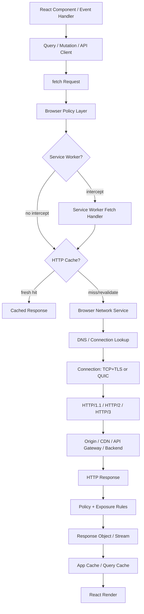

Kunci mental model:

> Browser adalah distributed-systems participant dengan security policy, cache, scheduler, connection pool, stream abstraction, dan observability surface sendiri.

React engineer yang baik tidak bertanya “kenapa fetch error?” secara umum. Ia bertanya:

1. Apakah request dibangun dengan benar?
2. Apakah browser mengizinkan request dikirim?
3. Apakah service worker mengubah request atau response?
4. Apakah response datang dari HTTP cache?
5. Apakah koneksi baru dibuat atau koneksi lama dipakai?
6. Apakah server menerima request asli atau hanya preflight?
7. Apakah browser mengizinkan JavaScript membaca response?
8. Apakah stream sudah dikonsumsi, dibatalkan, atau terputus?
9. Apakah cache aplikasi menerima representasi yang benar?
10. Apakah observability cukup untuk membuktikan semua itu?

---

## 2. Browser Network Stack Bukan Abstraksi Tunggal

Di aplikasi React, kamu biasanya melihat kode seperti ini:

```ts
const response = await fetch('/api/cases');
const data = await response.json();
```

Secara visual, kode itu tampak linear. Secara sistem, itu adalah pipeline multi-stage.

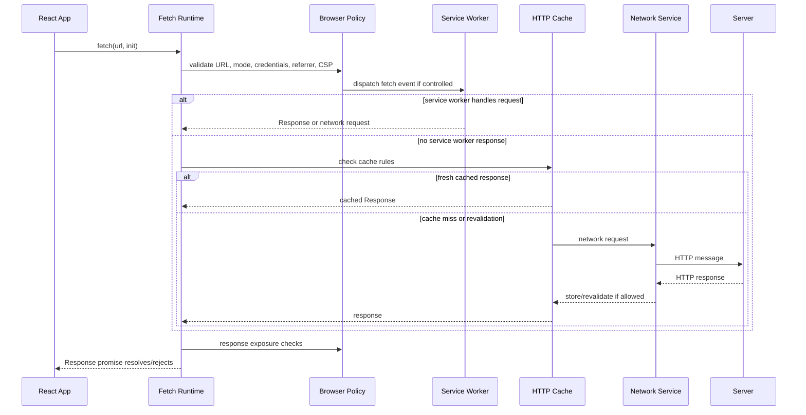

Yang sering mengecoh: `fetch()` promise bisa resolve walaupun status HTTP adalah `404` atau `500`. Promise reject biasanya untuk network-level failure, abort, CORS failure, atau kondisi ketika browser tidak dapat menyelesaikan fetch sebagai operasi web platform. HTTP error tetap response yang valid.

Itulah alasan API client production harus punya normalisasi error sendiri.

```ts
export class HttpError extends Error {
  constructor(
    message: string,
    readonly status: number,
    readonly body: unknown,
    readonly headers: Headers,
  ) {
    super(message);
    this.name = 'HttpError';
  }
}

export async function requestJson<T>(input: RequestInfo | URL, init?: RequestInit): Promise<T> {
  const response = await fetch(input, {
    ...init,
    headers: {
      Accept: 'application/json',
      ...init?.headers,
    },
  });

  const contentType = response.headers.get('content-type') ?? '';
  const hasJson = contentType.includes('application/json');
  const body = response.status === 204 ? undefined : hasJson ? await response.json() : await response.text();

  if (!response.ok) {
    throw new HttpError(`HTTP ${response.status}`, response.status, body, response.headers);
  }

  return body as T;
}
```

Kode itu belum sempurna. Kita akan memperbaikinya di Part 016. Namun sejak awal, prinsipnya jelas:

> Browser memberi primitive. Aplikasi perlu memberi semantics.

---

## 3. Stage 1 — Request Construction

Sebelum request masuk network stack, JavaScript membangun `Request`.

Input yang paling penting:

```ts
fetch('/api/cases?status=open', {
  method: 'GET',
  headers: {
    Accept: 'application/json',
  },
  credentials: 'include',
  cache: 'no-store',
  signal: abortController.signal,
});
```

Di level browser, hal-hal ini bukan detail kecil.

| Field | Efek Sistem |
|---|---|
| `url` | Menentukan origin, path, query, routing, cache key awal, policy boundary. |
| `method` | Menentukan semantics: safe, idempotent, mutation, preflight risk. |
| `headers` | Menentukan negotiation, auth metadata, content type, correlation, conditional request. |
| `body` | Menentukan upload, content length/transfer behavior, stream consumption. |
| `credentials` | Menentukan apakah cookie/client cert/auth header otomatis boleh ikut. |
| `mode` | Menentukan CORS behavior dan response exposure. |
| `cache` | Memberi instruksi terhadap HTTP cache browser. |
| `redirect` | Menentukan apakah redirect diikuti atau diekspos. |
| `signal` | Menghubungkan request ke cancellation. |
| `keepalive` | Memungkinkan request kecil bertahan setelah page unload dengan batasan. |

Dari sisi React engineer, request construction harus dipusatkan. Jangan biarkan setiap component bebas membangun `fetch()` mentah, karena setiap call site akan mengulang keputusan penting.

Buruk:

```tsx
useEffect(() => {
  fetch(`/api/cases/${id}`)
    .then((r) => r.json())
    .then(setCase);
}, [id]);
```

Lebih baik:

```ts
type ApiRequestOptions = {
  signal?: AbortSignal;
  headers?: HeadersInit;
};

export function getCase(caseId: string, options: ApiRequestOptions = {}) {
  return api.get<CaseDto>(`/api/cases/${encodeURIComponent(caseId)}`, options);
}
```

Component seharusnya mengekspresikan kebutuhan data, bukan mengulang policy transport.

---

## 4. Stage 2 — URL Resolution, Origin, and Site Boundary

URL bukan string biasa. URL menentukan boundary security.

Contoh:

```ts
fetch('/api/me');
fetch('https://api.example.com/me');
fetch('https://analytics.vendor.com/event');
```

Ketiganya berbeda secara browser policy:

| Request | Karakter |
|---|---|
| `/api/me` | Same-origin relatif terhadap current document. |
| `https://api.example.com/me` | Bisa same-site tetapi cross-origin jika host/port/scheme berbeda. |
| `https://analytics.vendor.com/event` | Third-party cross-origin. |

**Origin** biasanya kombinasi scheme, host, dan port.

```txt
https://app.example.com:443
^^^^^   ^^^^^^^^^^^^^^^ ^^^
scheme  host            port
```

Perbedaan kecil bisa mengubah policy:

| URL A | URL B | Same Origin? |
|---|---|---|
| `https://app.example.com` | `https://app.example.com` | Ya |
| `https://app.example.com` | `https://api.example.com` | Tidak |
| `https://app.example.com` | `http://app.example.com` | Tidak |
| `https://app.example.com` | `https://app.example.com:8443` | Tidak |

Dampak untuk React:

- cookie mungkin tidak ikut jika credential policy tidak sesuai;
- CORS mungkin dibutuhkan;
- response mungkin opaque;
- preflight mungkin terjadi;
- CDN/cache key bisa berbeda;
- browser storage boundary bisa berbeda;
- local dev bisa berhasil padahal production gagal karena scheme/host berubah.

Rule praktis:

> Untuk aplikasi enterprise, buat matrix origin sejak awal: app origin, API origin, asset origin, auth origin, analytics origin, file origin, websocket origin.

Contoh matrix:

| Purpose | Origin | Credential? | CORS? | Cache? |
|---|---|---:|---:|---:|
| React app shell | `https://app.example.com` | no | no | immutable assets |
| API BFF | `https://app.example.com/api` | yes | no | controlled |
| Direct API | `https://api.example.com` | yes | yes | mostly no-store/private |
| File download | `https://files.example.com` | signed URL | maybe | content-specific |
| Realtime | `wss://events.example.com` | token/cookie | websocket policy | no |

Ini bukan dokumentasi opsional. Ini adalah bagian dari architecture boundary.

---

## 5. Stage 3 — Browser Policy Layer

Sebelum request bebas dikirim dan response bebas dibaca JavaScript, browser menerapkan policy.

Policy yang sering relevan:

- same-origin policy;
- CORS;
- mixed content blocking;
- Content Security Policy;
- referrer policy;
- cookie SameSite/Secure/HttpOnly rules;
- private network access constraints;
- cross-origin resource policy/isolation headers untuk beberapa mode aplikasi;
- permissions policy untuk resource tertentu.

Kita belum akan membahas semua detail security di sini karena ada phase khusus. Namun untuk network stack, kamu harus memahami satu hal:

> Browser policy bisa menggagalkan operasi dari sisi JavaScript walaupun server sebenarnya reachable.

Contoh paling umum: `curl` berhasil, browser gagal.

`curl` tidak menjalankan same-origin policy atau CORS seperti browser.

```bash
curl https://api.example.com/cases
```

Jika berhasil, itu hanya membuktikan API reachable dari mesinmu. Itu tidak membuktikan browser boleh membaca response dari origin aplikasimu.

---

## 6. Stage 4 — CORS and Preflight

CORS bukan fitur backend untuk “mengizinkan API dipanggil”. CORS adalah mekanisme browser untuk menentukan apakah JavaScript dari satu origin boleh membaca response dari origin lain.

Modelnya:

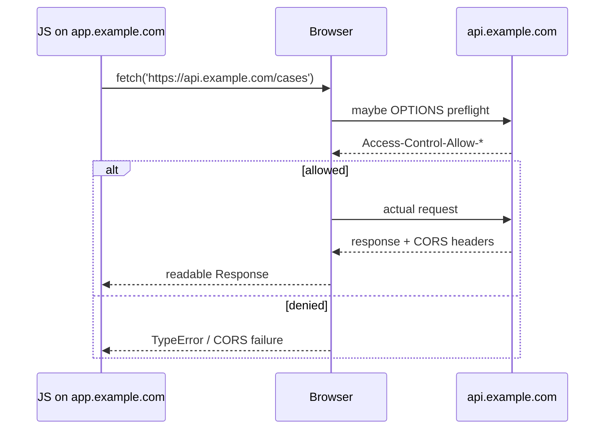

Preflight biasanya muncul ketika request tidak memenuhi kriteria sederhana, misalnya memakai method tertentu, custom header, atau `Content-Type` tertentu.

Contoh yang sering memicu preflight:

```ts
await fetch('https://api.example.com/cases', {
  method: 'POST',
  headers: {
    'Content-Type': 'application/json',
    'X-Correlation-Id': crypto.randomUUID(),
  },
  body: JSON.stringify(payload),
  credentials: 'include',
});
```

Dari sisi production, preflight bukan sekadar noise:

- menambah round trip;
- bisa gagal karena API gateway tidak mengizinkan `OPTIONS`;
- bisa gagal karena header tidak terdaftar di `Access-Control-Allow-Headers`;
- bisa gagal karena credentials dan wildcard origin dikombinasikan salah;
- bisa membuat observability membingungkan karena server melihat `OPTIONS`, bukan request bisnis;
- bisa mengubah latency p95 untuk route yang banyak mutation.

Jangan menyelesaikan CORS dengan refleksi origin sembrono.

Buruk:

```http
Access-Control-Allow-Origin: *
Access-Control-Allow-Credentials: true
```

Untuk credentialed requests, browser tidak menerima wildcard origin dengan credentials. Desain yang benar adalah allowlist origin eksplisit, bukan `*`.

Lebih sehat:

```http
Access-Control-Allow-Origin: https://app.example.com
Access-Control-Allow-Credentials: true
Access-Control-Allow-Methods: GET, POST, PUT, PATCH, DELETE, OPTIONS
Access-Control-Allow-Headers: Content-Type, X-Correlation-Id, Idempotency-Key
Access-Control-Max-Age: 600
Vary: Origin
```

`Vary: Origin` penting ketika response bisa berbeda berdasarkan `Origin`, terutama di depan shared cache/CDN.

---

## 7. Stage 5 — Service Worker Interception

Service worker dapat bertindak seperti programmable proxy di antara aplikasi dan network.

MDN menjelaskan service worker sebagai proxy-like layer yang dapat memodifikasi request/response dan menggantinya dengan cache. Dalam praktik React, ini berarti request yang terlihat seperti network call bisa saja dijawab oleh service worker.

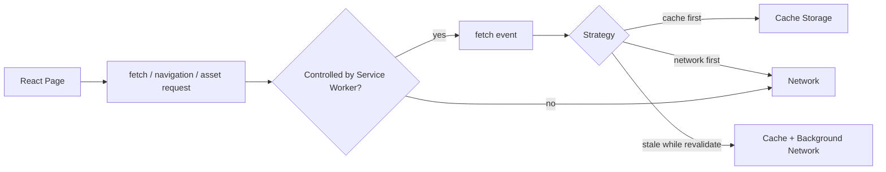

Service worker bisa mengintersep:

- explicit `fetch()` dari app;
- navigation request;
- script/CSS/image/font request;
- API request;
- offline fallback.

Contoh minimal:

```ts
self.addEventListener('fetch', (event) => {
  event.respondWith(fetch(event.request));
});
```

Contoh yang berbahaya jika tidak hati-hati:

```ts
self.addEventListener('fetch', (event) => {
  if (event.request.url.includes('/api/')) {
    event.respondWith(caches.match(event.request));
  }
});
```

Bug: jika cache mengandung data user A, lalu user B login di device yang sama, response stale/sensitif bisa bocor jika cache key dan lifecycle tidak benar.

Rule praktis:

> Jangan cache authenticated API response di service worker kecuali kamu punya explicit cache partitioning, invalidation, logout purge, versioning, dan data classification.

Service worker berguna untuk:

- offline shell;
- static asset caching;
- background sync;
- retry queue;
- stale-while-revalidate untuk public content;
- controlled caching untuk data yang aman;
- request enrichment dengan caution.

Service worker berbahaya untuk:

- blindly caching user-specific API;
- hiding server failures;
- returning stale authorization state;
- confusing debugging because network tab may not show origin request as expected;
- long-lived old code controlling new app code.

---

## 8. Stage 6 — HTTP Cache Before Network

Browser punya HTTP cache sendiri. Ini berbeda dari:

- TanStack Query cache;
- Apollo normalized cache;
- Redux store;
- service worker Cache Storage;
- CDN cache;
- server in-memory cache.

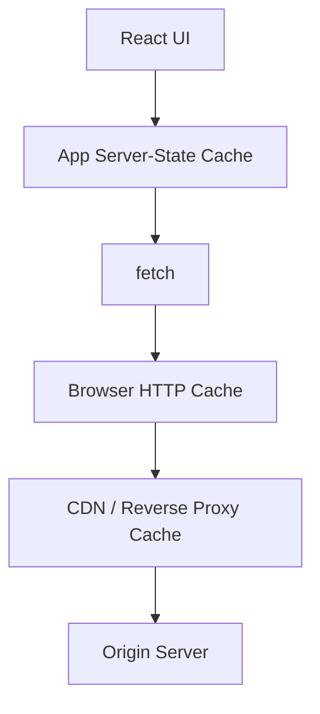

Banyak engineer mencampur semua cache menjadi satu kata: “cache”. Itu sumber bug.

| Cache | Lokasi | Dikontrol oleh | Cocok untuk |
|---|---|---|---|
| Query cache | JS memory | app/library | server-state projection untuk UI |
| Browser HTTP cache | browser | HTTP headers + request cache mode | HTTP resource reuse |
| Service worker cache | browser storage | service worker code | offline/static/custom strategy |
| CDN cache | edge | HTTP headers + CDN config | public/shared edge delivery |
| Server cache | backend | backend code | compute/data access optimization |

Browser HTTP cache mengikuti metadata HTTP seperti `Cache-Control`, `ETag`, `Last-Modified`, dan `Vary`.

Contoh response static asset:

```http
Cache-Control: public, max-age=31536000, immutable
ETag: "app.8f2c9.js"
```

Contoh response user-specific API:

```http
Cache-Control: no-store
```

Contoh response yang boleh revalidate:

```http
Cache-Control: private, max-age=60
ETag: "case-123-v18"
```

Kesalahan umum:

```http
Cache-Control: public, max-age=3600
```

pada response:

```json
{
  "userId": "u_123",
  "name": "Alice",
  "permissions": ["case:approve"]
}
```

Itu bisa menjadi data leak jika response melewati shared cache yang memperlakukan response sebagai public.

Rule praktis:

- Static hashed assets: `public, max-age=31536000, immutable`.
- HTML shell: sering `no-cache` atau short TTL + revalidation.
- User-specific API: `private` atau `no-store`, tergantung kebutuhan.
- Sensitive API: `no-store`.
- Public list/reference data: bisa `public` dengan validator.
- Anything permission-dependent: hati-hati dengan shared cache dan `Vary`.

---

## 9. Stage 7 — DNS, Connection, TLS, QUIC, and Protocol Selection

Jika cache miss dan service worker tidak menjawab, browser perlu koneksi.

Secara sederhana:

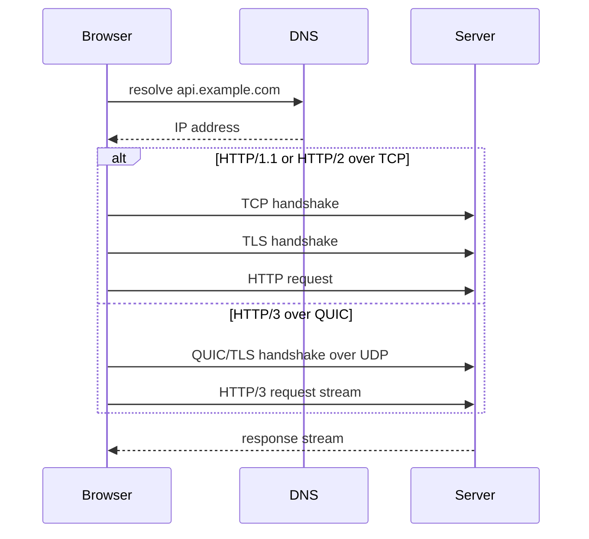

React tidak bisa mengontrol DNS atau TLS handshake secara langsung. Namun React architecture memengaruhi apakah handshake menjadi bottleneck.

Contoh masalah:

```tsx

fetch('https://api.example.com/me');
fetch('https://search.example.com/query?q=a');
fetch('https://events.example.com/bootstrap');
```

Empat origin bisa berarti beberapa DNS lookup dan connection setup. Kalau semuanya terjadi saat user membuka halaman, initial render bisa waterfall.

Mitigasi mungkin:

- consolidate origin jika masuk akal;
- preconnect ke origin kritis;
- preload asset penting;
- route-level data loading;
- server-side data aggregation/BFF;
- avoid late-discovered requests;
- streaming/prefetch untuk data yang predictable.

Contoh resource hints:

```html
<link rel="preconnect" href="https://api.example.com" />
<link rel="dns-prefetch" href="https://cdn.example.com" />
```

Jangan asal tambah `preconnect` ke semua origin. Preconnect memakai resource. Gunakan untuk origin yang benar-benar kritis dan hampir pasti dipakai.

---

## 10. HTTP/1.1 vs HTTP/2 vs HTTP/3 dari Sisi React

HTTP semantics tetap sama, tetapi transport behavior berbeda.

| Aspek | HTTP/1.1 | HTTP/2 | HTTP/3 |
|---|---|---|---|
| Transport umum | TCP + TLS | TCP + TLS | QUIC over UDP |
| Multiplexing | Terbatas, sering banyak koneksi | Banyak stream dalam satu koneksi | Banyak stream di QUIC |
| Head-of-line blocking | Bisa di level koneksi/request | TCP-level HOL masih ada | Mengurangi TCP HOL antar stream |
| Header compression | Tidak seperti H2/H3 | HPACK | QPACK |
| Frontend implication | connection limit lebih terasa | request concurrency lebih baik | latency/packet loss behavior bisa berbeda |

Untuk React engineer, pelajaran praktisnya bukan “pakai HTTP/3 maka cepat”. Pelajarannya:

1. Banyak request kecil tetap punya overhead walaupun multiplexed.
2. Waterfall karena dependency graph tidak otomatis hilang dengan HTTP/2/3.
3. Same-origin consolidation bisa membantu, tetapi domain sharding era HTTP/1.1 sering menjadi anti-pattern di HTTP/2/3.
4. CDN/proxy/API gateway bisa mengubah protocol antar hop.
5. Browser DevTools menunjukkan protocol, tetapi backend hop internal bisa berbeda.

Contoh waterfall yang buruk:

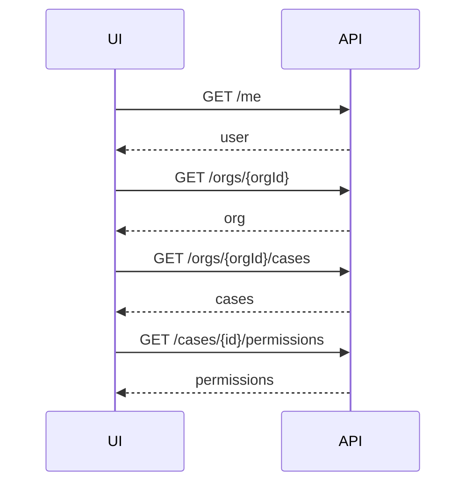

HTTP/2 tidak menyelesaikan dependency waterfall itu. Karena request kedua menunggu data request pertama.

Solusi arsitektural:

- endpoint bootstrap;
- route loader yang fetch parallel;
- BFF aggregation;
- GraphQL query composition;
- server component data read;
- precomputed navigation context;
- query prefetch berdasarkan route.

---

## 11. Stage 8 — Request Body Upload

Request body tidak selalu string kecil.

Bentuk body bisa berupa:

- string;
- JSON string;
- `FormData`;
- `Blob`;
- `File`;
- `URLSearchParams`;
- `ReadableStream` dalam lingkungan yang mendukung;
- `ArrayBuffer`/typed array.

Contoh JSON:

```ts
await fetch('/api/cases', {
  method: 'POST',
  headers: {
    'Content-Type': 'application/json',
    Accept: 'application/json',
  },
  body: JSON.stringify({ title: 'New case' }),
});
```

Contoh file upload:

```ts
const form = new FormData();
form.append('document', file);
form.append('caseId', caseId);

await fetch('/api/case-documents', {
  method: 'POST',
  body: form,
});
```

Perhatikan: untuk `FormData`, jangan set `Content-Type` manual kecuali kamu benar-benar tahu boundary multipart-nya. Browser perlu menentukan `multipart/form-data; boundary=...`.

Buruk:

```ts
await fetch('/api/upload', {
  method: 'POST',
  headers: {
    'Content-Type': 'multipart/form-data',
  },
  body: form,
});
```

Lebih baik:

```ts
await fetch('/api/upload', {
  method: 'POST',
  body: form,
});
```

Upload memunculkan pertanyaan sistem:

- apakah perlu progress indicator?
- apakah request bisa di-resume?
- apakah server memproses stream atau buffer penuh?
- apakah upload idempotent?
- apakah user boleh menutup tab?
- apakah file harus lewat signed URL langsung ke object storage?
- apakah metadata dan binary perlu dipisah?
- apakah virus scanning/asynchronous processing perlu state machine?

React UI hanya permukaan dari proses yang sering jauh lebih panjang.

---

## 12. Stage 9 — Response Headers, Body Stream, and Backpressure

Fetch response terdiri dari metadata dan body stream.

```ts
const response = await fetch('/api/report');
console.log(response.status);
console.log(response.headers.get('content-type'));

const data = await response.json();
```

`await fetch()` resolve ketika response header tersedia, bukan berarti seluruh body sudah selesai diproses. Body dibaca saat kamu memanggil `json()`, `text()`, `blob()`, atau membaca stream.

Konsekuensi:

- response besar bisa masih downloading setelah `fetch()` resolve;
- parsing JSON besar bisa memblokir main thread;
- body hanya bisa dikonsumsi sekali kecuali di-clone;
- abort setelah header bisa membatalkan body read;
- stream bisa dipakai untuk progressive processing dalam kasus tertentu.

Contoh body consumption bug:

```ts
const response = await fetch('/api/cases');

console.log(await response.text());
const data = await response.json(); // error: body already consumed
```

Solusi untuk debugging:

```ts
const response = await fetch('/api/cases');
const copy = response.clone();

console.debug(await copy.text());
const data = await response.json();
```

Jangan clone response besar sembarangan. Clone bisa menggandakan biaya memori/stream handling.

---

## 13. Stage 10 — Abort, Cancellation, and Reality

`AbortController` memberi cara membatalkan fetch dari sisi browser.

```ts
const controller = new AbortController();

const promise = fetch('/api/search?q=react', {
  signal: controller.signal,
});

controller.abort();
```

Namun cancellation punya batas realitas.

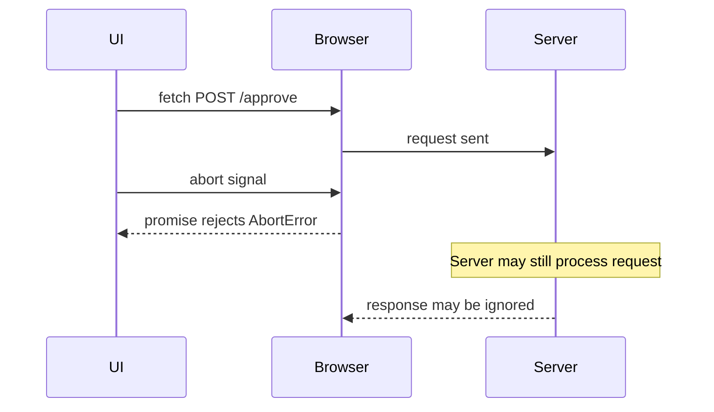

Abort berarti client tidak lagi menunggu hasil. Itu tidak menjamin server membatalkan proses bisnis.

Untuk `GET` search suggestion, abort biasanya aman.
Untuk `POST /approve-case`, abort tidak boleh dipakai sebagai rollback bisnis.

Klasifikasi:

| Operasi | Abort Semantics |
|---|---|
| typeahead search | aman, buang response lama |
| route data load | aman, navigasi baru membatalkan load lama |
| file upload | perlu UX dan server behavior jelas |
| payment/approval mutation | abort hanya client-side; butuh idempotency/status check |
| background telemetry | bisa pakai `sendBeacon`/`keepalive` dengan batasan |

Pattern search:

```ts
let activeController: AbortController | null = null;

export async function searchCases(query: string) {
  activeController?.abort();

  const controller = new AbortController();
  activeController = controller;

  try {
    return await requestJson<SearchResult>(`/api/search?q=${encodeURIComponent(query)}`, {
      signal: controller.signal,
    });
  } finally {
    if (activeController === controller) {
      activeController = null;
    }
  }
}
```

Di React, library seperti query engine/router loader biasanya mengelola cancellation lebih baik daripada manual `useEffect` fetch.

---

## 14. Stage 11 — Redirects

Browser dapat mengikuti redirect secara otomatis tergantung `redirect` mode.

```ts
await fetch('/api/old-endpoint', {
  redirect: 'follow',
});
```

Redirect penting untuk:

- login flow;
- moved API endpoint;
- signed URL download;
- CDN/origin routing;
- trailing slash/canonical URL;
- HTTP-to-HTTPS upgrade.

Tetapi redirect bisa menimbulkan masalah:

- method berubah pada beberapa status redirect historis;
- credentials bisa tidak ikut sesuai origin/policy;
- CORS exposure bisa berubah;
- POST yang redirect bisa menjadi ambiguous;
- client telemetry mungkin hanya melihat final URL;
- API contract menjadi tersembunyi.

Untuk API JSON internal, hindari redirect sebagai mekanisme normal. Gunakan endpoint stabil atau versioning eksplisit. Redirect lebih cocok untuk browser navigation/resource delivery daripada semantics mutation.

---

## 15. Stage 12 — Response Exposure

Server bisa mengirim header, tetapi browser tidak selalu mengekspos semuanya ke JavaScript.

Misal server mengirim:

```http
X-Request-Id: req_123
X-RateLimit-Remaining: 42
```

Untuk cross-origin response, JavaScript mungkin tidak bisa membaca header itu kecuali server menambahkan:

```http
Access-Control-Expose-Headers: X-Request-Id, X-RateLimit-Remaining
```

Dampak untuk React:

- UI tidak bisa menampilkan rate limit remaining;
- API client tidak bisa mengambil correlation id;
- pagination header tidak terlihat;
- retry logic tidak bisa membaca `Retry-After` jika tidak exposed dalam konteks tertentu;
- observability client kehilangan link ke server trace.

Rule:

> Semua header yang dibutuhkan JavaScript harus menjadi bagian dari contract, bukan kebetulan.

Jika kamu memakai header untuk pagination:

```http
Link: </api/cases?page=3>; rel="next"
X-Total-Count: 542
```

pastikan browser bisa membacanya pada cross-origin API.

Namun untuk banyak aplikasi, lebih mudah dan eksplisit menaruh pagination metadata di body:

```json
{
  "items": [],
  "pageInfo": {
    "nextCursor": "eyJpZCI6...",
    "hasNextPage": true
  }
}
```

---

## 16. Timing: Apa yang Bisa Diobservasi dari Browser?

Browser menyediakan beberapa surface observability:

- DevTools Network tab;
- Performance API;
- Resource Timing API;
- Navigation Timing;
- Server-Timing header;
- custom client logs/metrics;
- tracing headers jika diintegrasikan.

Resource timing secara konseptual bisa memecah waktu:

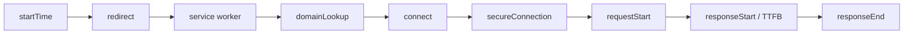

Namun tidak semua informasi selalu tersedia. Cross-origin resource timing bisa dibatasi kecuali server mengirim header yang mengizinkan timing detail.

Header penting:

```http
Timing-Allow-Origin: https://app.example.com
Server-Timing: db;dur=23, app;dur=41, cache;desc="MISS"
```

Dengan `Server-Timing`, backend/CDN bisa mengirim breakdown yang terlihat di browser performance tooling.

Dari sisi production, target observability minimal:

| Data | Kenapa Penting |
|---|---|
| URL route logical, bukan full PII URL | aggregate metric tanpa bocor data |
| method | membedakan read/mutation |
| status | error rate |
| duration | latency |
| retry count | resilience vs overload |
| abort/cancel flag | user navigation vs failure |
| cache hit/miss app-level | stale/performance diagnosis |
| correlation/request id | join client-server logs |
| payload class/size bucket | performance/debug tanpa PII |

Jangan log full request/response body di client telemetry untuk aplikasi sensitif.

---

## 17. Browser Scheduling and Request Priority

Browser tidak selalu mengirim semua request seketika dengan prioritas sama.

Ia menjadwalkan:

- document navigation;
- critical CSS;
- JavaScript bundles;
- images;
- fonts;
- fetch/XHR;
- preloads;
- speculative/prefetch requests;
- service worker startup;
- background sync;
- keepalive requests.

Dari sisi React, masalah muncul ketika data penting ditemukan terlalu terlambat.

Buruk:

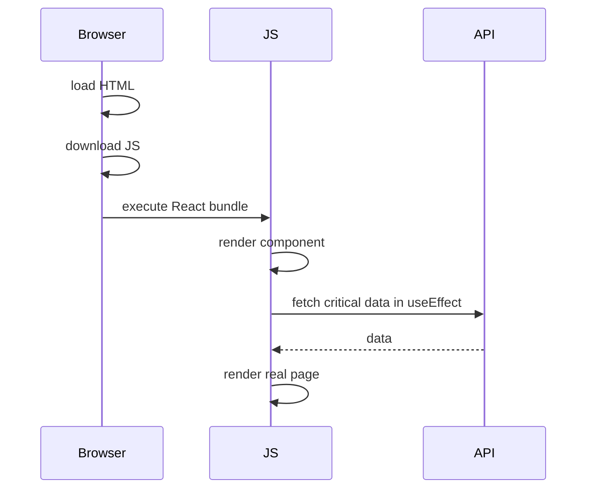

Lebih baik untuk route critical data:

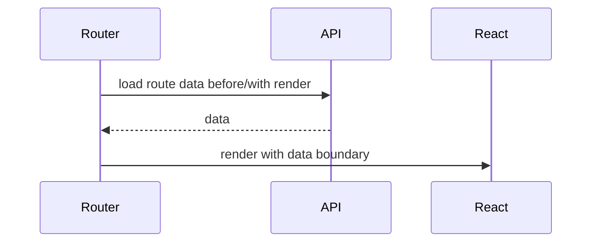

Atau di framework dengan server rendering/server components:

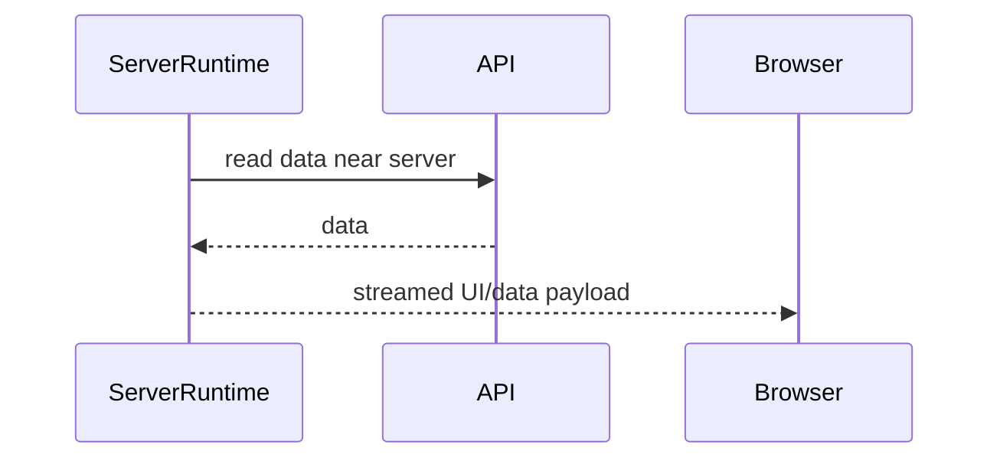

Kamu tidak selalu harus memindahkan fetch ke server. Tetapi kamu harus tahu konsekuensinya.

---

## 18. DevTools Network Tab: Cara Membaca dengan Benar

Network tab bukan sekadar daftar request.

Ketika debugging, baca secara sistematis:

1. **Initiator**: siapa yang memulai request? Component, loader, service worker, script, image?
2. **Method**: apakah method sesuai semantics?
3. **URL**: apakah origin/path/query benar?
4. **Status**: response final atau preflight?
5. **Protocol**: h1/h2/h3?
6. **Request headers**: `Accept`, `Content-Type`, credentials, correlation id?
7. **Response headers**: cache, CORS, content type, request id?
8. **Payload**: body benar? multipart boundary benar?
9. **Timing**: stalled, DNS, connect, SSL, TTFB, download?
10. **Size**: transferred vs resource size? cache hit?
11. **Preview/Response**: body sesuai schema?
12. **Cookies**: sent/blocked reason?

Untuk CORS, jangan hanya lihat request bisnis. Cari `OPTIONS` preflight.

Untuk cache, cek apakah response dari disk/memory cache atau service worker.

Untuk race condition, cek urutan request dan response. Request yang lebih dulu dikirim belum tentu lebih dulu selesai.

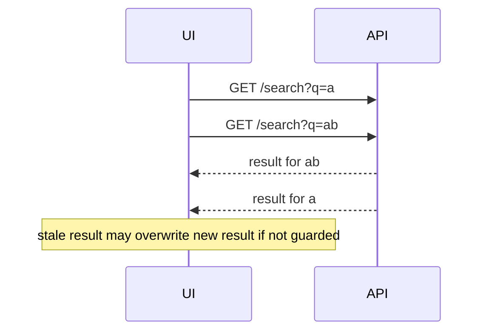

---

## 19. Production Design Implications

Browser network stack mengubah desain aplikasi.

### 19.1 Centralize Network Policy

Jangan sebar `fetch()` mentah.

Buat API client yang menangani:

- base URL;
- headers standar;
- credentials policy;
- correlation id;
- JSON parsing;
- 204 handling;
- error normalization;
- abort/deadline;
- retry policy untuk operasi aman;
- telemetry;
- schema validation di boundary penting.

### 19.2 Separate Read and Mutation Semantics

Read bisa di-cache, dedupe, abort, retry, prefetch.
Mutation perlu idempotency, confirmation, rollback/reconciliation, conflict handling, dan audit trail.

Jangan gunakan abstraction yang memperlakukan semua request sama.

### 19.3 Treat Browser Cache as Another Distributed Cache

HTTP cache bukan musuh, tetapi harus dikontrak.

Jika kamu pakai query cache dan HTTP cache sekaligus, tentukan layering:

- query cache untuk UI server-state freshness;
- HTTP cache untuk byte/representation reuse;
- CDN cache untuk shared public data;
- service worker untuk offline strategy.

Tanpa kontrak, kamu akan memiliki stale bug yang sulit dibuktikan.

### 19.4 Make CORS a Deployment Contract

CORS bukan patch setelah frontend gagal.

Dokumentasikan:

- allowed origins per environment;
- allowed methods;
- allowed headers;
- exposed headers;
- credential policy;
- max age;
- `Vary` behavior;
- local dev strategy;
- production domain migration plan.

### 19.5 Make Timing Observable

Jika frontend hanya bilang “API lambat”, itu tidak cukup.

Minimal bedakan:

- blocked/queued;
- DNS/connect/TLS;
- TTFB;
- download;
- JSON parse;
- render after data;
- cache hit/miss;
- aborted by navigation;
- retry-induced latency.

---

## 20. A Small Production Network Adapter

Kita akan membangun versi lengkap di Part 016. Untuk sekarang, lihat struktur minimal yang menghormati browser stack.

```ts
type ApiClientOptions = {
  baseUrl: string;
  credentials?: RequestCredentials;
  defaultTimeoutMs?: number;
  getCorrelationId?: () => string;
};

type RequestOptions = {
  signal?: AbortSignal;
  timeoutMs?: number;
  headers?: HeadersInit;
  cache?: RequestCache;
};

export function createApiClient(options: ApiClientOptions) {
  async function request<T>(path: string, init: RequestInit & RequestOptions = {}): Promise<T> {
    const controller = new AbortController();
    const timeoutMs = init.timeoutMs ?? options.defaultTimeoutMs ?? 15_000;
    const timeout = setTimeout(() => controller.abort(), timeoutMs);

    const externalSignal = init.signal;
    const abortExternal = () => controller.abort();
    externalSignal?.addEventListener('abort', abortExternal, { once: true });

    const headers = new Headers(init.headers);
    headers.set('Accept', headers.get('Accept') ?? 'application/json');

    const correlationId = options.getCorrelationId?.();
    if (correlationId) headers.set('X-Correlation-Id', correlationId);

    try {
      const response = await fetch(new URL(path, options.baseUrl), {
        ...init,
        headers,
        credentials: init.credentials ?? options.credentials ?? 'same-origin',
        signal: controller.signal,
      });

      const contentType = response.headers.get('content-type') ?? '';
      const isJson = contentType.includes('application/json');
      const body = response.status === 204 ? undefined : isJson ? await response.json() : await response.text();

      if (!response.ok) {
        throw new ApiHttpError(response.status, body, response.headers);
      }

      return body as T;
    } finally {
      clearTimeout(timeout);
      externalSignal?.removeEventListener('abort', abortExternal);
    }
  }

  return {
    get: <T>(path: string, options?: RequestOptions) =>
      request<T>(path, { ...options, method: 'GET' }),

    post: <T>(path: string, body: unknown, options?: RequestOptions) =>
      request<T>(path, {
        ...options,
        method: 'POST',
        headers: {
          'Content-Type': 'application/json',
          ...options?.headers,
        },
        body: JSON.stringify(body),
      }),
  };
}

export class ApiHttpError extends Error {
  constructor(
    readonly status: number,
    readonly body: unknown,
    readonly headers: Headers,
  ) {
    super(`HTTP ${status}`);
    this.name = 'ApiHttpError';
  }
}
```

Catatan penting:

- Ini belum menangani retry.
- Ini belum menangani RFC 9457 Problem Details.
- Ini belum menangani schema validation.
- Ini belum menangani upload/download streaming.
- Ini belum menangani observability lengkap.
- Ini belum membedakan retry untuk safe/idempotent method.

Namun strukturnya sudah benar: component tidak berurusan langsung dengan browser policy detail.

---

## 21. Anti-Patterns

### Anti-Pattern 1 — `fetch()` Langsung di Mana-Mana

Masalah:

- inconsistent headers;
- inconsistent error parsing;
- missing abort;
- duplicated CORS workaround;
- telemetry tidak seragam;
- sulit migration base URL;
- sulit test.

### Anti-Pattern 2 — Menganggap `response.ok` Tidak Perlu

```ts
const data = await fetch('/api/cases').then((r) => r.json());
```

Jika response `500` berisi JSON error, kode tetap parse dan bisa dianggap success.

### Anti-Pattern 3 — Semua Error Disamakan

`TypeError`, `AbortError`, HTTP `409`, HTTP `422`, HTTP `500`, JSON parse error, dan schema mismatch bukan hal yang sama.

### Anti-Pattern 4 — CORS Trial-and-Error

Menambah `mode: 'no-cors'` biasanya bukan solusi. Itu sering menghasilkan opaque response yang tidak bisa dibaca JavaScript.

### Anti-Pattern 5 — Cache Tanpa Ownership

Jika tidak tahu cache mana yang menyimpan apa, kamu tidak bisa menjamin correctness.

### Anti-Pattern 6 — Abort Mutation Tanpa Idempotency

Membatalkan promise tidak membatalkan fakta bahwa server mungkin sudah memproses request.

---

## 22. Checklist: Browser Network Stack Readiness

Gunakan checklist ini ketika review PR atau desain API client.

### Request Construction

- Apakah URL dibangun dengan `URL`/encoding yang benar?
- Apakah method sesuai semantics?
- Apakah `Accept` dan `Content-Type` benar?
- Apakah credentials policy explicit?
- Apakah correlation id dikirim?
- Apakah signal/deadline tersedia?

### Browser Policy

- Apakah origin matrix jelas?
- Apakah CORS config bagian dari deployment contract?
- Apakah exposed headers terdokumentasi?
- Apakah cookie attributes sesuai?
- Apakah local dev dan production domain berbeda dipertimbangkan?

### Cache

- Apakah response user-specific tidak public cache?
- Apakah `Cache-Control` sesuai data classification?
- Apakah query cache dan HTTP cache tidak saling merusak?
- Apakah service worker tidak menyimpan data sensitif sembarangan?

### Network and Performance

- Apakah critical request terlambat ditemukan?
- Apakah route menciptakan waterfall?
- Apakah origin terlalu banyak?
- Apakah preconnect/preload dipakai selektif?
- Apakah response size masuk budget?

### Cancellation

- Apakah read request bisa dibatalkan?
- Apakah mutation punya idempotency/status reconciliation?
- Apakah abort dibedakan dari error?

### Observability

- Apakah latency dipilah: network, server, parse, render?
- Apakah request id bisa dikorelasikan?
- Apakah retry/abort/cache hit terekam?
- Apakah telemetry tidak membocorkan PII?

---

## 23. Mental Model Akhir

React engineer yang matang melihat network stack seperti ini:

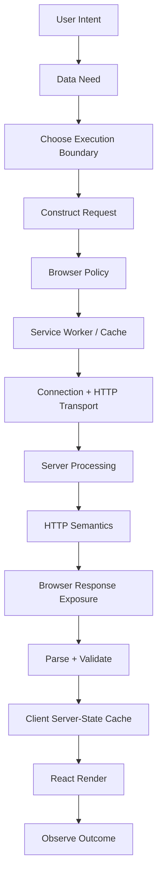

Setiap panah punya failure mode. Setiap failure mode butuh keputusan produk dan teknis.

Itulah mengapa client-server communication bukan sekadar “ambil data dari API”. Ini adalah desain boundary dalam distributed system yang kebetulan dimulai dari browser.

---

## 24. What Comes Next

Part berikutnya membahas **HTTP Semantics for React Engineers**.

Kita akan membahas:

- method semantics: safe, idempotent, cacheable;
- status code sebagai protocol decision signal;
- `GET` vs `POST` vs `PUT` vs `PATCH` vs `DELETE`;
- `202 Accepted`, `204 No Content`, `304 Not Modified`, `409 Conflict`, `412 Precondition Failed`, `422 Unprocessable Content`, `429 Too Many Requests`;
- headers yang harus dipahami React engineer;
- conditional requests;
- content negotiation;
- idempotency;
- Problem Details;
- bagaimana API client menerjemahkan HTTP menjadi UI behavior.

Kalau Part 003 menjawab “bagaimana browser mengirim”, Part 004 menjawab “apa arti pesan yang dikirim”.

---

## References

- MDN — Using the Fetch API: https://developer.mozilla.org/en-US/docs/Web/API/Fetch_API/Using_Fetch
- MDN — RequestInit: https://developer.mozilla.org/en-US/docs/Web/API/RequestInit
- MDN — AbortController: https://developer.mozilla.org/en-US/docs/Web/API/AbortController
- MDN — Using Service Workers: https://developer.mozilla.org/en-US/docs/Web/API/Service_Worker_API/Using_Service_Workers
- MDN — ServiceWorkerGlobalScope fetch event: https://developer.mozilla.org/en-US/docs/Web/API/ServiceWorkerGlobalScope/fetch_event
- MDN — CORS: https://developer.mozilla.org/en-US/docs/Web/HTTP/Guides/CORS
- MDN — HTTP caching: https://developer.mozilla.org/en-US/docs/Web/HTTP/Guides/Caching
- MDN — Cache-Control: https://developer.mozilla.org/en-US/docs/Web/HTTP/Reference/Headers/Cache-Control
- RFC 9110 — HTTP Semantics: https://www.rfc-editor.org/rfc/rfc9110.html
- RFC 9114 — HTTP/3: https://www.rfc-editor.org/rfc/rfc9114.html
