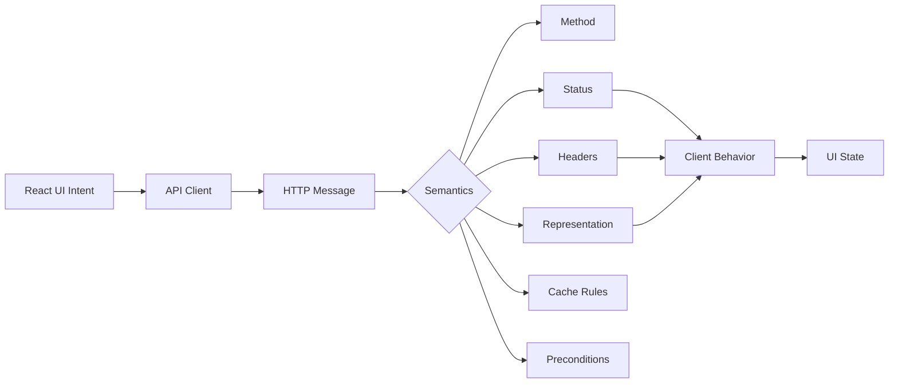
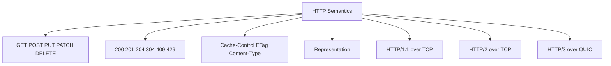
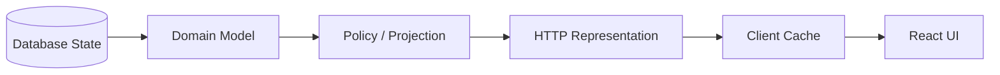
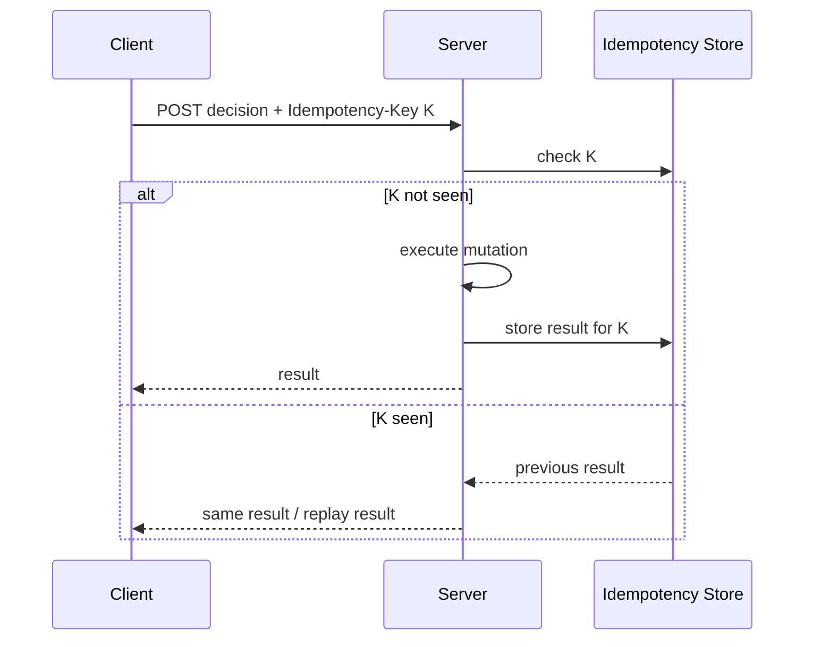
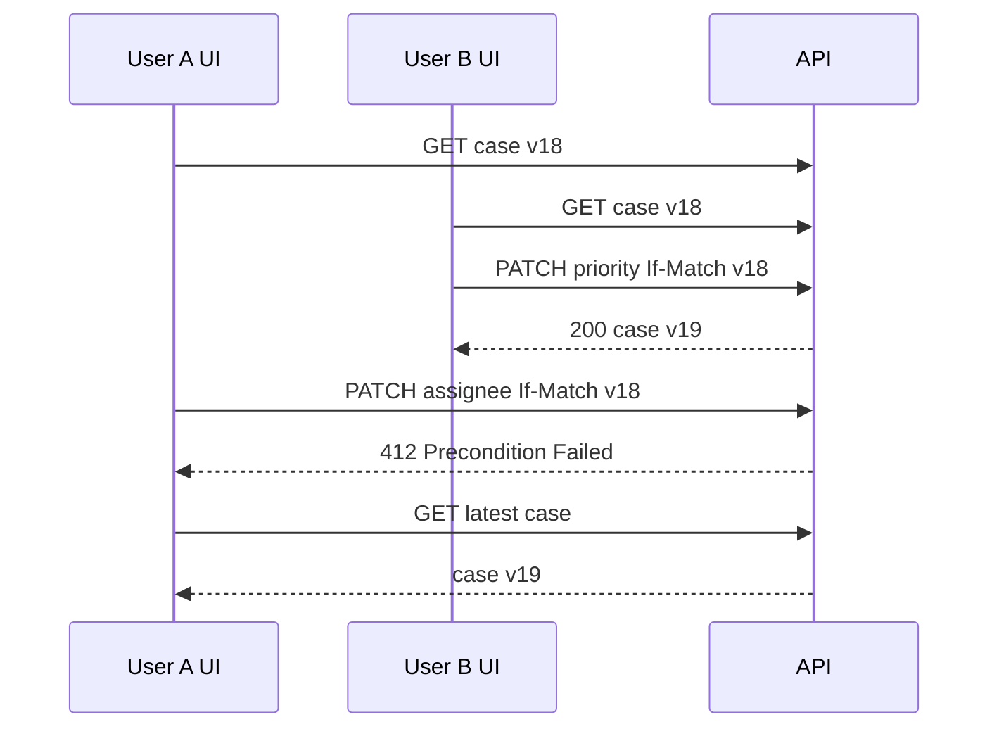
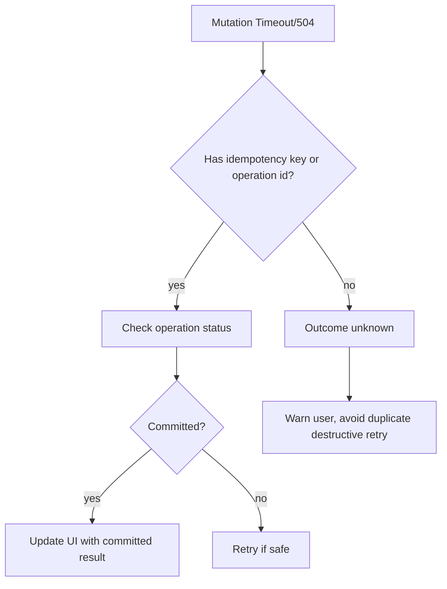
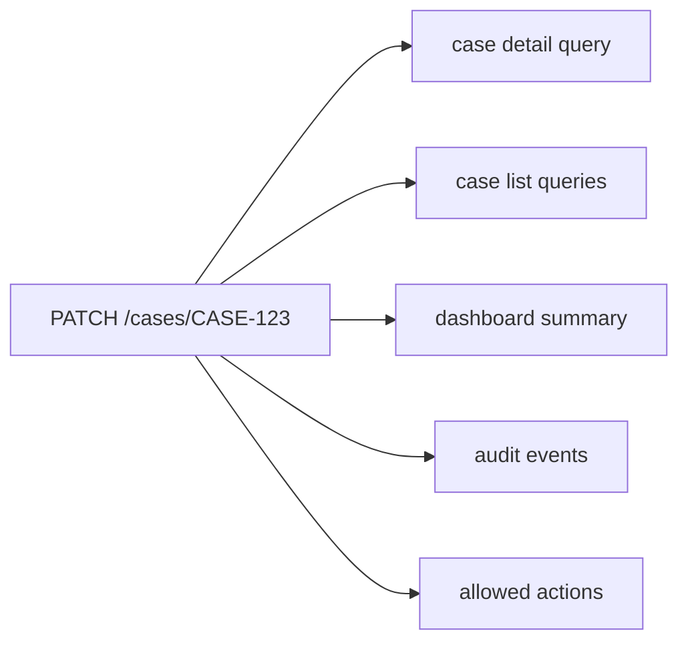
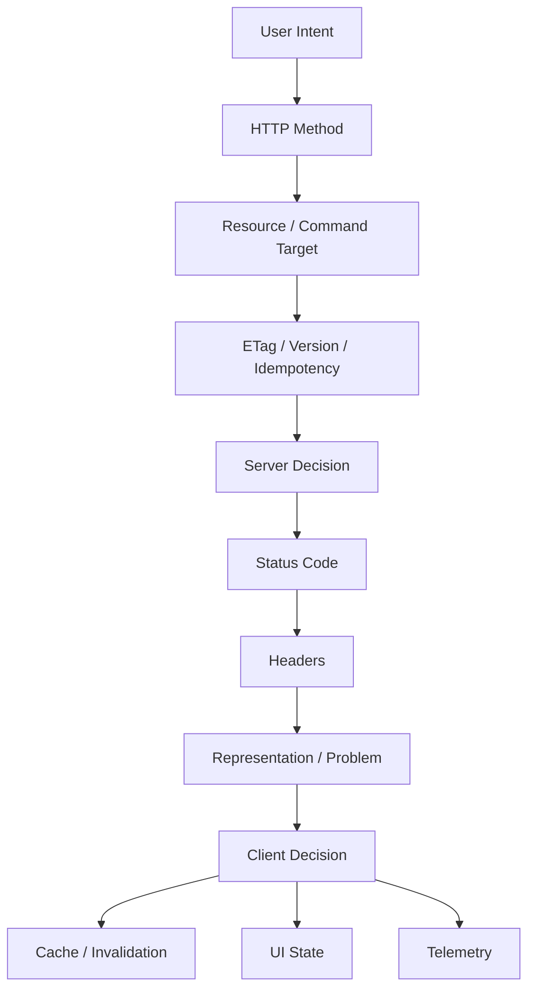

# Part 004 — HTTP Semantics for React Engineers

Part 003 membahas bagaimana browser membawa request dari JavaScript ke network stack. Sekarang kita membahas arti pesan itu.

HTTP bukan hanya transport untuk JSON. HTTP membawa semantics: method, target resource, status code, header, cache directive, conditional request, content negotiation, authentication challenge, retry signal, dan representation metadata.

Engineer yang hanya melihat HTTP sebagai “cara call API” biasanya membuat client yang rapuh:

- retry `POST` yang tidak idempotent;
- memperlakukan `404` sebagai crash padahal bisa berarti empty state;
- parse JSON pada `204 No Content`;
- tidak membedakan `401` dan `403`;
- menganggap `409 Conflict` sama dengan validation error;
- mengabaikan `Retry-After` pada `429`;
- membuat `GET` endpoint yang mengubah server state;
- membuat mutation via query string;
- menyimpan response private di shared cache;
- invalidasi semua cache karena tidak punya resource model;
- menampilkan error backend mentah ke user.

Part ini membangun HTTP semantics dari sudut pandang React application architecture.

Referensi utama: RFC 9110 HTTP Semantics, MDN HTTP status codes, MDN HTTP caching, MDN Cache-Control, RFC 9457 Problem Details for HTTP APIs.

---

## 1. Thesis Utama

HTTP semantics adalah protocol-level contract antara client dan server.



HTTP semantics menjawab:

- apakah operasi ini read atau mutation?
- apakah boleh di-retry?
- apakah boleh di-cache?
- apakah response berarti success final atau accepted untuk proses async?
- apakah user perlu login, tidak punya permission, atau resource tidak ada?
- apakah konflik terjadi karena stale version?
- apakah request terlalu sering dan harus back off?
- apakah client harus memakai representation lama karena server mengembalikan `304`?
- apakah response body ada atau tidak?

Rule utama:

> UI behavior yang benar dimulai dari HTTP semantics yang benar.

---

## 2. HTTP Semantics Berbeda dari HTTP Transport

HTTP semantics bisa berjalan di atas HTTP/1.1, HTTP/2, atau HTTP/3. Transport berubah; semantics method/status/header tetap menjadi kontrak aplikasi.



Implikasi untuk React:

- jangan desain API client berdasarkan asumsi low-level transport;
- desain berdasarkan semantics yang stabil;
- gunakan protocol detail untuk performance/debugging, bukan untuk business meaning;
- HTTP/2/3 tidak memperbaiki method/status misuse;
- cache, retry, idempotency, dan conflict handling tetap masalah semantics.

---

## 3. Resource, Representation, and State

HTTP beroperasi terhadap resource. Client menerima representation dari resource.

Resource:

```txt
/api/cases/CASE-123
```

Representation:

```json
{
  "id": "CASE-123",
  "status": "UNDER_REVIEW",
  "version": 17,
  "assignee": {
    "id": "u_42",
    "name": "Dina"
  }
}
```

Resource bukan object JavaScript. Representation bukan database row mentah. Representation adalah bentuk yang server pilih untuk dikirim ke client pada waktu tertentu.



React biasanya tidak memegang “server state asli”. React memegang snapshot/projection.

Konsekuensi:

- snapshot bisa stale;
- representation bisa berubah antar versi API;
- field bisa disembunyikan karena permission;
- computed field bisa berbeda dari DB;
- partial representation tidak boleh diasumsikan lengkap;
- client mutation harus mempertimbangkan version/concurrency.

---

## 4. Method Semantics

Method adalah sinyal utama intent.

| Method | Makna Umum | Safe? | Idempotent? | Biasanya Cacheable? | React Use Case |
|---|---|---:|---:|---:|---|
| `GET` | Ambil representation | Ya | Ya | Ya | query/list/detail/bootstrap |
| `HEAD` | Ambil metadata tanpa body | Ya | Ya | Ya | check existence/version/size |
| `POST` | Submit data untuk diproses | Tidak | Tidak by default | Jarang | create/action/command/search complex |
| `PUT` | Replace resource state | Tidak | Ya | Tidak umum | full update/replace |
| `PATCH` | Partial modification | Tidak | Tergantung design | Tidak umum | partial update |
| `DELETE` | Hapus resource | Tidak | Ya secara intent | Tidak umum | delete/archive/remove |
| `OPTIONS` | Tanya kemampuan/metadata komunikasi | Ya | Ya | Tidak relevan | CORS preflight |

Catatan: “idempotent” bukan berarti response harus sama. Artinya efek intended dari satu request sama dengan efek dari beberapa request identik.

---

## 5. Safe Method

Method safe tidak dimaksudkan mengubah state server. `GET` dan `HEAD` safe.

Buruk:

```http
GET /api/cases/CASE-123/approve
```

Mengapa buruk?

- browser/proxy/crawler bisa mengulang `GET`;
- prefetch bisa memicu efek samping;
- cache bisa menyimpan response;
- retry otomatis bisa mengubah state berkali-kali;
- observability salah mengklasifikasi mutation sebagai read;
- security review menjadi kabur.

Lebih baik:

```http
POST /api/cases/CASE-123/approval
Content-Type: application/json
Idempotency-Key: 01JZ...

{
  "decision": "APPROVE",
  "reason": "Documents complete"
}
```

React implication:

- `GET` boleh dipakai untuk prefetch, route loader, background refetch;
- mutation jangan disembunyikan di link hover/prefetch;
- query engine boleh dedupe/retry read dengan lebih agresif;
- mutation engine perlu lifecycle berbeda.

---

## 6. Idempotency

Idempotency adalah salah satu konsep paling penting untuk client-server communication.

Contoh idempotent:

```http
PUT /api/users/u_123/profile

{
  "displayName": "Ari"
}
```

Request yang sama dikirim berkali-kali tetap membuat profile menjadi state yang sama.

Contoh tidak idempotent:

```http
POST /api/payments

{
  "amount": 100000,
  "currency": "IDR"
}
```

Jika dikirim dua kali, bisa membuat dua payment.

Untuk mutation yang rawan double-submit, gunakan idempotency key.

```http
POST /api/cases/CASE-123/decision
Idempotency-Key: 01JZ8VZJH8Q2K7M3CX8EP7V5W4
Content-Type: application/json

{
  "decision": "APPROVE",
  "reason": "Documents complete"
}
```

Server menyimpan hasil untuk key tersebut dalam scope tertentu.



React implication:

- disable button saja tidak cukup;
- network retry bisa terjadi setelah timeout;
- user bisa double-click;
- tab bisa restore submission;
- mobile network bisa drop response after server commits;
- optimistic UI butuh reconciliation.

Client policy:

| Operation | Retry? | Butuh Idempotency Key? |
|---|---:|---:|
| `GET /cases` | Ya dengan backoff | Tidak |
| `PUT /profile` | Bisa jika designed idempotent | Biasanya tidak |
| `POST /payments` | Tidak tanpa key | Ya |
| `POST /case-decision` | Tidak tanpa key | Ya |
| `PATCH /settings` | Tergantung | Sering berguna |
| `DELETE /draft/{id}` | Bisa jika idempotent | Tidak selalu |

---

## 7. Cacheability

HTTP caching bukan hanya performance. Ia adalah consistency contract.

Response bisa cacheable jika method/status/header memungkinkan dan cache directive mengizinkan.

Header paling sering:

```http
Cache-Control: public, max-age=300
ETag: "cases-v42"
Vary: Accept-Encoding
```

Untuk React, pahami minimal ini:

| Header | Makna |
|---|---|
| `Cache-Control` | Instruksi caching untuk browser/shared cache. |
| `ETag` | Validator kuat/lemah untuk revalidation/concurrency. |
| `Last-Modified` | Validator waktu modifikasi. |
| `Vary` | Header request yang memengaruhi cache key. |
| `Expires` | Legacy absolute expiry. |
| `Age` | Berapa lama response sudah berada di cache. |

Common patterns:

### Static Hashed Asset

```http
Cache-Control: public, max-age=31536000, immutable
```

### HTML App Shell

```http
Cache-Control: no-cache
ETag: "html-shell-v102"
```

`no-cache` bukan berarti tidak disimpan. Artinya cache harus revalidate sebelum memakai kembali.

### Sensitive User Data

```http
Cache-Control: no-store
```

### User-Specific but Cacheable in Browser Only

```http
Cache-Control: private, max-age=60
ETag: "case-123-v18"
```

`private` berarti response untuk single user cache, bukan shared cache.

### Public Reference Data

```http
Cache-Control: public, max-age=3600, stale-while-revalidate=60
ETag: "countries-v2026-07"
```

React implication:

- TanStack Query stale time tidak sama dengan HTTP `max-age`;
- CDN cache tidak sama dengan browser cache;
- `no-store` bisa mengurangi performance tetapi diperlukan untuk data sensitif;
- `Vary: Authorization` bisa menghancurkan cache efficiency dan tetap perlu hati-hati;
- shared cache + personalized response adalah bahaya.

---

## 8. Conditional Requests

Conditional request memungkinkan client berkata: “beri saya response hanya jika resource berubah” atau “lakukan mutation hanya jika versi yang saya pegang masih current”.

### Revalidation dengan `If-None-Match`

Request:

```http
GET /api/cases/CASE-123 HTTP/1.1
If-None-Match: "case-123-v18"
```

Response jika tidak berubah:

```http
HTTP/1.1 304 Not Modified
ETag: "case-123-v18"
```

Client memakai representation lama.

### Optimistic Concurrency dengan `If-Match`

Request:

```http
PATCH /api/cases/CASE-123 HTTP/1.1
If-Match: "case-123-v18"
Content-Type: application/json

{
  "priority": "HIGH"
}
```

Jika server resource sudah version 19:

```http
HTTP/1.1 412 Precondition Failed
Content-Type: application/problem+json

{
  "type": "https://example.com/problems/stale-resource",
  "title": "Resource version is stale",
  "status": 412,
  "detail": "Case CASE-123 has changed since you loaded it."
}
```

React implication:

- edit form harus menyimpan version/ETag;
- mutation harus mengirim precondition;
- `412` berarti refresh/merge/retry user decision, bukan generic error;
- optimistic UI harus rollback atau reconcile.



Tanpa conditional request, last write wins bisa merusak data.

---

## 9. Status Code as Decision Signal

Status code bukan dekorasi. Status code adalah sinyal keputusan.

```mermaid
flowchart TD
  Response[HTTP Response] --> Class{Status Class}
  Class -->|2xx| Success[Success Handling]
  Class -->|3xx| Redirect/Revalidation Handling
  Class -->|4xx| Client/Domain/Permission Handling
  Class -->|5xx| Server/Retry/Incident Handling
```

Klasifikasi umum:

| Class | Makna Umum | React Behavior |
|---|---|---|
| `1xx` | informational | jarang langsung terlihat di fetch app logic |
| `2xx` | success | parse/commit/update cache |
| `3xx` | redirect/cache | biasanya browser handled, `304` penting untuk cache |
| `4xx` | client-side/request/domain problem | user correction/auth/permission/conflict handling |
| `5xx` | server-side failure | retry/backoff/error boundary/incident telemetry |

Namun class saja tidak cukup. `401`, `403`, `404`, `409`, dan `422` punya behavior berbeda.

---

## 10. 2xx Success Codes

### `200 OK`

Generic success dengan body.

```http
HTTP/1.1 200 OK
Content-Type: application/json

{"id":"CASE-123"}
```

React behavior:

- parse body;
- update query cache;
- render success;
- clear transient error;
- maybe invalidate related queries.

### `201 Created`

Resource baru dibuat.

```http
HTTP/1.1 201 Created
Location: /api/cases/CASE-124
Content-Type: application/json

{"id":"CASE-124","status":"DRAFT"}
```

React behavior:

- add item to list cache or invalidate list;
- navigate to new resource if product flow requires;
- use `Location` or body id.

### `202 Accepted`

Request diterima tetapi belum selesai diproses.

```http
HTTP/1.1 202 Accepted
Location: /api/jobs/JOB-999
Retry-After: 5
Content-Type: application/json

{
  "jobId": "JOB-999",
  "status": "QUEUED"
}
```

React behavior:

- jangan tampilkan final success palsu;
- tampilkan pending processing;
- poll job status atau subscribe event;
- gunakan `Retry-After` jika ada;
- buat state machine: queued/running/succeeded/failed/cancelled.

### `204 No Content`

Success tanpa body.

```http
HTTP/1.1 204 No Content
```

React behavior:

- jangan panggil `response.json()`;
- update UI berdasarkan action known atau invalidate;
- berguna untuk delete/toggle simple.

Bug umum:

```ts
const response = await fetch('/api/cases/CASE-123', { method: 'DELETE' });
const body = await response.json(); // bisa throw pada 204
```

### `206 Partial Content`

Partial response, sering untuk range request/download/streaming media. Untuk API JSON biasa jarang dipakai, tetapi penting untuk file handling.

---

## 11. 3xx Redirect and Revalidation Codes

### `304 Not Modified`

Bukan redirect biasa. Ini sinyal revalidation: representation di cache masih valid.

React app biasanya tidak melihat `304` langsung jika browser HTTP cache menangani request. Namun API client bisa melihatnya pada skenario manual/conditional tertentu.

### `301`, `302`, `303`, `307`, `308`

Redirect behavior penting karena method preservation berbeda. Dalam API JSON internal, redirect sebaiknya tidak menjadi bagian normal contract mutation.

React implication:

- redirect login HTML tidak sama dengan JSON auth error;
- jika API mengembalikan HTML login page ke fetch JSON, parser akan gagal;
- SPA biasanya lebih baik menerima `401` + problem body daripada redirect ke login HTML dari API call;
- navigation request dan API request perlu dibedakan.

Buruk:

```http
HTTP/1.1 302 Found
Location: /login
Content-Type: text/html
```

untuk request:

```http
GET /api/me
Accept: application/json
```

Lebih baik untuk API:

```http
HTTP/1.1 401 Unauthorized
Content-Type: application/problem+json

{
  "type": "https://example.com/problems/authentication-required",
  "title": "Authentication required",
  "status": 401
}
```

---

## 12. 4xx Client and Domain Codes

### `400 Bad Request`

Request malformed atau tidak bisa dipahami secara umum.

React behavior:

- usually developer/client bug;
- log with correlation id;
- show generic error if user cannot fix;
- do not blind retry.

### `401 Unauthorized`

Nama historisnya membingungkan. Artinya authentication dibutuhkan atau gagal.

React behavior:

- refresh session jika flow mendukung;
- redirect/login prompt;
- clear user-specific caches if session invalid;
- jangan tampilkan “you do not have permission” jika user belum authenticated.

### `403 Forbidden`

User authenticated tetapi tidak allowed.

React behavior:

- show forbidden state;
- remove/disable action if policy endpoint confirms;
- log security-relevant denied action carefully;
- jangan auto retry.

### `404 Not Found`

Resource tidak ditemukan atau sengaja disembunyikan.

React behavior tergantung context:

| Context | Behavior |
|---|---|
| detail page `/cases/123` | not found page/empty state |
| optional relation | render missing relation gracefully |
| after delete | maybe success if intended absence |
| permission-hidden resource | generic not found, not forbidden |

### `409 Conflict`

Request konflik dengan current state resource.

Contoh:

```http
HTTP/1.1 409 Conflict
Content-Type: application/problem+json

{
  "type": "https://example.com/problems/invalid-state-transition",
  "title": "Invalid state transition",
  "status": 409,
  "detail": "Case is already closed and cannot be approved."
}
```

React behavior:

- refresh affected resource;
- show conflict-specific message;
- do not classify as field validation;
- maybe present latest state and next allowed actions.

### `412 Precondition Failed`

Conditional request failed, often stale version/ETag.

React behavior:

- show stale data warning;
- fetch latest;
- offer merge/reapply if safe;
- rollback optimistic update.

### `422 Unprocessable Content`

Server understood request syntax and content type, but semantic validation failed.

React behavior:

- map field errors to form fields;
- keep user input;
- do not clear form;
- do not retry automatically.

Example:

```json
{
  "type": "https://example.com/problems/validation-error",
  "title": "Validation failed",
  "status": 422,
  "errors": [
    { "field": "reason", "message": "Reason is required" }
  ]
}
```

### `429 Too Many Requests`

Rate limited.

React behavior:

- respect `Retry-After` if present;
- slow down polling/refetch;
- disable spammy action temporarily;
- avoid synchronized retry storm;
- surface friendly message.

---

## 13. 5xx Server and Gateway Codes

### `500 Internal Server Error`

Unexpected server failure.

React behavior:

- show recoverable error state;
- log correlation id;
- retry only if operation safe/idempotent and policy allows;
- do not expose stack trace.

### `502 Bad Gateway`

Gateway/proxy received invalid response from upstream.

React behavior:

- often transient;
- safe reads can retry with jitter;
- mutation needs idempotency before retry.

### `503 Service Unavailable`

Server temporarily unavailable, often overload/maintenance.

React behavior:

- respect `Retry-After`;
- reduce polling;
- show service unavailable;
- avoid retry storm.

### `504 Gateway Timeout`

Gateway timed out waiting for upstream.

React behavior:

- for read: retry/backoff may be okay;
- for mutation: outcome unknown; perform status check if idempotency key/job id exists;
- avoid telling user “failed” if server may still process.



---

## 14. Fetch Mapping: HTTP Error Is Not Promise Rejection

Browser Fetch behavior matters.

```ts
const response = await fetch('/api/cases/unknown');
console.log(response.status); // 404
console.log(response.ok);     // false
```

The promise resolved. The server responded.

A normalized API client should classify:

```ts
type ApiResult<T> =
  | { ok: true; status: number; data: T; headers: Headers }
  | { ok: false; kind: 'http'; status: number; problem?: ProblemDetails; body?: unknown; headers: Headers }
  | { ok: false; kind: 'network'; error: Error }
  | { ok: false; kind: 'aborted' }
  | { ok: false; kind: 'parse'; status: number; error: Error }
  | { ok: false; kind: 'schema'; status: number; issues: unknown };
```

Exception-only API bisa tetap dipakai, tetapi exception type harus preserve classification.

```ts
try {
  const caseDto = await getCase(caseId);
  render(caseDto);
} catch (error) {
  if (error instanceof UnauthorizedError) {
    redirectToLogin();
  } else if (error instanceof ForbiddenError) {
    showForbidden();
  } else if (error instanceof NotFoundError) {
    showNotFound();
  } else if (error instanceof ConflictError) {
    showConflictAndRefresh();
  } else {
    showGenericFailure();
  }
}
```

Jangan hilangkan status/body/header saat membungkus error.

---

## 15. Problem Details

RFC 9457 mendefinisikan format problem detail untuk membawa error HTTP yang machine-readable.

Content type:

```http
Content-Type: application/problem+json
```

Body umum:

```json
{
  "type": "https://example.com/problems/validation-error",
  "title": "Validation failed",
  "status": 422,
  "detail": "One or more fields are invalid.",
  "instance": "/api/cases/CASE-123/decision",
  "errors": [
    {
      "field": "reason",
      "code": "required",
      "message": "Reason is required."
    }
  ]
}
```

Core fields:

| Field | Makna |
|---|---|
| `type` | Identifier problem type. Sebaiknya stable. |
| `title` | Summary pendek. |
| `status` | HTTP status code. |
| `detail` | Detail human-readable untuk occurrence ini. |
| `instance` | Identifier occurrence/request/resource problem. |

React client sebaiknya tidak hanya switch pada `title`. Gunakan `status`, `type`, dan extension fields yang dikontrak.

```ts
type ProblemDetails = {
  type?: string;
  title?: string;
  status?: number;
  detail?: string;
  instance?: string;
  [extension: string]: unknown;
};

function isValidationProblem(problem: ProblemDetails) {
  return problem.type === 'https://example.com/problems/validation-error';
}
```

Rule:

> Error response adalah contract, bukan string untuk ditampilkan mentah.

---

## 16. Content Negotiation

Client dan server perlu sepakat representation.

Request:

```http
GET /api/cases/CASE-123 HTTP/1.1
Accept: application/json
Accept-Language: id-ID
```

Response:

```http
HTTP/1.1 200 OK
Content-Type: application/json; charset=utf-8
Vary: Accept, Accept-Language
```

Header penting:

| Header | Direction | Fungsi |
|---|---|---|
| `Accept` | request | media type yang diterima client |
| `Content-Type` | request/response | media type body yang dikirim |
| `Accept-Language` | request | bahasa yang diinginkan |
| `Content-Language` | response | bahasa representation |
| `Vary` | response | request headers yang memengaruhi representation/cache key |

Bug umum:

```ts
await fetch('/api/cases', {
  method: 'POST',
  body: JSON.stringify(payload),
});
```

Tanpa `Content-Type`, server mungkin tidak parse body sebagai JSON.

Lebih baik:

```ts
await fetch('/api/cases', {
  method: 'POST',
  headers: {
    Accept: 'application/json',
    'Content-Type': 'application/json',
  },
  body: JSON.stringify(payload),
});
```

Untuk upload `FormData`, jangan set multipart `Content-Type` manual.

---

## 17. Headers React Engineers Must Understand

### Request Headers

| Header | Penggunaan |
|---|---|
| `Accept` | Minta response JSON/problem/stream tertentu. |
| `Content-Type` | Beri tahu format body request. |
| `Authorization` | Bearer/basic/etc jika bukan cookie-based. |
| `Cookie` | Dikirim browser sesuai credential/cookie policy. |
| `If-None-Match` | Cache revalidation. |
| `If-Match` | Optimistic concurrency. |
| `Idempotency-Key` | Safe retry/replay untuk mutation tertentu. |
| `X-Correlation-Id` atau `Traceparent` | Observability/correlation. |

### Response Headers

| Header | Penggunaan |
|---|---|
| `Content-Type` | Cara parse body. |
| `Cache-Control` | Cache behavior. |
| `ETag` | Validator/cache/concurrency. |
| `Location` | Created resource/job/redirect target. |
| `Retry-After` | Backoff untuk `429`/`503`/`202` polling. |
| `WWW-Authenticate` | Authentication challenge. |
| `Vary` | Cache key dimensions. |
| `Server-Timing` | Server-side timing breakdown. |
| `Access-Control-Expose-Headers` | Header yang boleh dibaca JS pada CORS. |

Headers adalah bagian dari API contract. Jika pagination memakai header, document dan expose header tersebut.

---

## 18. Designing UI Behavior from HTTP Semantics

Mapping kasar:

| HTTP Result | UI Behavior |
|---|---|
| `200` read | render data |
| `201` create | navigate/add to cache/show created |
| `202` async command | show pending job state |
| `204` delete/toggle | remove/invalidate without parsing body |
| `304` revalidation | use cached representation |
| `400` malformed | generic failure + telemetry |
| `401` unauthenticated | login/session recovery |
| `403` forbidden | forbidden/permission state |
| `404` detail | not found state |
| `409` conflict | refresh latest + explain state conflict |
| `412` stale version | reload/merge/reapply workflow |
| `422` validation | field-level errors |
| `429` rate limit | backoff/disable/polite retry |
| `500` server error | retry safe read/show failure |
| `503` unavailable | service unavailable + respect retry-after |
| network error | offline/unreachable state |
| abort | usually silent/cancelled transition |
| parse error | contract/server bug telemetry |
| schema mismatch | compatibility bug telemetry/fallback |

The key is not memorizing table. The key is preserving enough information in API client so the UI can make these distinctions.

---

## 19. REST Resource Modeling from React Side

REST is not “URL style”. From React side, good resource modeling gives stable cache keys and predictable invalidation.

Better:

```http
GET /api/cases?status=open&assignee=u_42
GET /api/cases/CASE-123
POST /api/cases
PATCH /api/cases/CASE-123
POST /api/cases/CASE-123/decision
GET /api/cases/CASE-123/audit-events
```

Questionable:

```http
GET /api/getCases
POST /api/updateCaseStatus
POST /api/doApprove
POST /api/listThings
```

Action endpoints are not always bad. Domain commands can be resources too:

```http
POST /api/cases/CASE-123/decision
POST /api/cases/CASE-123/reassignment
POST /api/cases/CASE-123/reopen-request
```

The important thing is contract clarity:

- What resource or command is targeted?
- Is it idempotent?
- What status codes can return?
- What caches are affected?
- What version/precondition is required?
- What event/job/resource is created?

---

## 20. Cache Invalidation Starts at HTTP Semantics

Suppose mutation succeeds:

```http
PATCH /api/cases/CASE-123
```

What should client invalidate?

Maybe:

- `GET /api/cases/CASE-123`;
- `GET /api/cases?status=open`;
- `GET /api/users/u_42/assigned-cases`;
- `GET /api/dashboard/summary`;
- `GET /api/cases/CASE-123/audit-events`;
- permissions/allowed actions for that case.

If API design has no resource model, invalidation becomes guesswork.



HTTP semantics does not automatically invalidate TanStack Query/Apollo cache. But method/resource/status give the signals you use to design invalidation.

Rule:

> Every mutation should declare its affected read models.

This can be documented, encoded in client helpers, or returned as server hints in advanced systems.

---

## 21. Retry Policy Based on Semantics

Retry is not a generic utility.

Bad:

```ts
async function retry<T>(fn: () => Promise<T>) {
  try {
    return await fn();
  } catch {
    return await fn();
  }
}
```

Better policy:

| Condition | Retry? |
|---|---:|
| `GET` network error | yes, bounded with jitter |
| `GET` `503` + `Retry-After` | yes, respect delay |
| `GET` `404` | no |
| `POST` create without idempotency key timeout | no automatic retry |
| `POST` create with idempotency key timeout | status check/retry allowed |
| `PATCH` `409` | no blind retry; refresh/reconcile |
| `PATCH` `412` | no blind retry; refresh/merge |
| `422` | no; user correction needed |
| `429` | wait/backoff, reduce request rate |

Retry needs:

- max attempts;
- exponential backoff;
- jitter;
- deadline;
- method/status classification;
- abort awareness;
- telemetry;
- retry budget to avoid overload.

---

## 22. Example: A Semantics-Aware Response Normalizer

```ts
type HttpFailureKind =
  | 'unauthenticated'
  | 'forbidden'
  | 'not_found'
  | 'validation'
  | 'conflict'
  | 'precondition_failed'
  | 'rate_limited'
  | 'server_failure'
  | 'bad_response'
  | 'unknown_http';

class ApiError extends Error {
  constructor(
    readonly kind: HttpFailureKind,
    readonly status: number,
    readonly problem: ProblemDetails | undefined,
    readonly headers: Headers,
  ) {
    super(problem?.title ?? `HTTP ${status}`);
    this.name = 'ApiError';
  }
}

function classifyHttpFailure(status: number, problem?: ProblemDetails): HttpFailureKind {
  if (status === 401) return 'unauthenticated';
  if (status === 403) return 'forbidden';
  if (status === 404) return 'not_found';
  if (status === 409) return 'conflict';
  if (status === 412) return 'precondition_failed';
  if (status === 422) return 'validation';
  if (status === 429) return 'rate_limited';
  if (status >= 500) return 'server_failure';
  if (status >= 400) return 'unknown_http';
  return 'bad_response';
}

async function parseResponseBody(response: Response): Promise<unknown> {
  if (response.status === 204 || response.status === 205 || response.status === 304) {
    return undefined;
  }

  const contentType = response.headers.get('content-type') ?? '';

  if (contentType.includes('application/json') || contentType.includes('application/problem+json')) {
    return response.json();
  }

  return response.text();
}

export async function executeJson<T>(input: RequestInfo | URL, init?: RequestInit): Promise<T> {
  let response: Response;

  try {
    response = await fetch(input, init);
  } catch (error) {
    if (error instanceof DOMException && error.name === 'AbortError') {
      throw new Error('Request aborted');
    }
    throw new Error('Network failure');
  }

  const body = await parseResponseBody(response);

  if (!response.ok) {
    const problem = isProblemDetails(body) ? body : undefined;
    throw new ApiError(classifyHttpFailure(response.status, problem), response.status, problem, response.headers);
  }

  return body as T;
}

function isProblemDetails(value: unknown): value is ProblemDetails {
  return typeof value === 'object' && value !== null && 'title' in value;
}
```

Kita akan membuat versi lebih kuat nanti, termasuk schema validation, retry, deadlines, and telemetry.

---

## 23. Example: UI Mapping for Mutation

```tsx
async function submitDecision(input: DecisionInput) {
  try {
    await approveCase(input);
    toast.success('Decision submitted.');
    queryClient.invalidateQueries({ queryKey: ['case', input.caseId] });
    queryClient.invalidateQueries({ queryKey: ['cases'] });
  } catch (error) {
    if (error instanceof ApiError) {
      switch (error.kind) {
        case 'validation':
          return applyFieldErrors(error.problem);
        case 'conflict':
          await queryClient.invalidateQueries({ queryKey: ['case', input.caseId] });
          return showConflictDialog(error.problem);
        case 'precondition_failed':
          await queryClient.invalidateQueries({ queryKey: ['case', input.caseId] });
          return showStaleDataDialog();
        case 'unauthenticated':
          return redirectToLogin();
        case 'forbidden':
          return showForbiddenMessage();
        case 'rate_limited':
          return showRateLimitMessage(error.headers.get('Retry-After'));
        default:
          return showGenericFailure();
      }
    }

    showGenericFailure();
  }
}
```

Perhatikan: UI behavior mengikuti semantics, bukan string error.

---

## 24. Common Semantic Mistakes

### Mistake 1 — `POST` untuk Semua Hal

```http
POST /api/getCase
POST /api/listCases
POST /api/deleteCase
```

Akibat:

- caching sulit;
- observability kabur;
- retry policy kabur;
- resource identity kabur;
- invalidation kabur.

### Mistake 2 — `GET` untuk Mutation

Akibat:

- prefetch/crawler/cache bisa memicu state change;
- security risk;
- hard-to-debug duplicate side effects.

### Mistake 3 — Semua Error `400`

```http
HTTP/1.1 400 Bad Request

{"message":"Something wrong"}
```

Akibat:

- UI tidak bisa bedakan validation, conflict, permission, stale version;
- retry policy buruk;
- user experience generik.

### Mistake 4 — `200 OK` untuk Error Domain

```http
HTTP/1.1 200 OK

{
  "success": false,
  "error": "Forbidden"
}
```

Akibat:

- cache/query engine menganggap success;
- monitoring salah menghitung error rate;
- client harus membuat protocol sendiri di atas HTTP.

Ada kasus envelope sukses dipakai, tetapi harus sangat terkontrak. Untuk HTTP API umum, gunakan status code dengan benar.

### Mistake 5 — Parse Body Tanpa Lihat Status/Content-Type

```ts
const data = await response.json();
```

pada semua response adalah bug waiting to happen.

### Mistake 6 — Tidak Ada Concurrency Control

Last write wins bisa menghancurkan data di workflow multi-user.

### Mistake 7 — Tidak Menyediakan Machine-Readable Error

String error tidak cukup untuk UI kompleks.

---

## 25. Design Review Questions

Untuk setiap endpoint yang dipakai React, tanyakan:

1. Apa resource/command targetnya?
2. Method-nya sesuai safe/idempotent semantics?
3. Apa possible status code-nya?
4. Apa shape success body untuk tiap status success?
5. Apakah ada status success tanpa body?
6. Apa error body contract-nya?
7. Apakah memakai Problem Details?
8. Apakah `401`, `403`, `404`, `409`, `412`, `422` dibedakan?
9. Apakah mutation butuh idempotency key?
10. Apakah mutation butuh optimistic concurrency via ETag/version?
11. Apakah response cacheable?
12. Apakah header cache aman untuk data classification?
13. Apakah header yang dibutuhkan JS diekspos CORS?
14. Apakah `Retry-After` dipakai untuk `429`/`503`/`202`?
15. Apa affected read models setelah mutation?
16. Apa observability identifier-nya?

Jika endpoint tidak bisa menjawab pertanyaan ini, masalahnya bukan di React. Masalahnya di API contract.

---

## 26. Mental Model Akhir

HTTP semantics adalah bahasa bersama antara React client dan server.



The strongest React apps do not treat HTTP as a pipe. They treat HTTP as a contract.

When the contract is precise, UI logic becomes simpler:

- read request can be cached, aborted, retried, prefetched;
- mutation request can be confirmed, deduplicated, reconciled;
- validation error maps to fields;
- conflict error maps to refresh/merge;
- auth error maps to session flow;
- server failure maps to backoff and incident telemetry;
- cache rules map to freshness model.

When the contract is vague, frontend becomes a pile of exceptions.

---

## 27. What Comes Next

Part berikutnya membahas **Request-Response Lifecycle**.

Kita akan menggabungkan Part 003 dan Part 004 menjadi lifecycle end-to-end:

- user intent;
- event handler;
- API client;
- browser request;
- server decision;
- response normalization;
- cache update;
- render;
- telemetry;
- failure paths.

Jika Part 003 menjelaskan browser pipeline dan Part 004 menjelaskan arti HTTP message, Part 005 akan menjelaskan bagaimana satu request hidup dan mati dalam aplikasi React production.

---

## References

- RFC 9110 — HTTP Semantics: https://www.rfc-editor.org/rfc/rfc9110.html
- MDN — HTTP response status codes: https://developer.mozilla.org/en-US/docs/Web/HTTP/Reference/Status
- MDN — HTTP caching: https://developer.mozilla.org/en-US/docs/Web/HTTP/Guides/Caching
- MDN — Cache-Control: https://developer.mozilla.org/en-US/docs/Web/HTTP/Reference/Headers/Cache-Control
- MDN — Last-Modified: https://developer.mozilla.org/en-US/docs/Web/HTTP/Reference/Headers/Last-Modified
- MDN — 409 Conflict: https://developer.mozilla.org/en-US/docs/Web/HTTP/Reference/Status/409
- MDN — 429 Too Many Requests: https://developer.mozilla.org/en-US/docs/Web/HTTP/Reference/Status/429
- RFC 9457 — Problem Details for HTTP APIs: https://www.rfc-editor.org/rfc/rfc9457.html
- RFC 9114 — HTTP/3: https://www.rfc-editor.org/rfc/rfc9114.html
