# Part 005 — Request-Response Lifecycle

Di Part 003 kita melihat browser sebagai runtime network. Di Part 004 kita membahas HTTP semantics: method, status, header, cache, representation, dan error envelope.

Sekarang kita menyatukannya menjadi satu alur nyata:

> user melakukan intent di UI, React mengekspresikan kebutuhan data, browser membentuk request, network mengirim pesan, server menjalankan domain logic, response dikembalikan, body diparse, cache/state diperbarui, dan UI dirender ulang.

Kedengarannya sederhana. Tapi di production, lifecycle ini penuh titik patah.

Bug yang terlihat seperti “spinner tidak hilang” bisa berasal dari cancellation yang salah.
Bug yang terlihat seperti “data balik ke nilai lama” bisa berasal dari race antar response.
Bug yang terlihat seperti “API lambat” bisa berasal dari waterfall yang dibuat React component tree.
Bug yang terlihat seperti “server error” bisa berasal dari client yang mengirim body tidak sesuai contract.

Part ini membangun peta eksekusi end-to-end.

---

## 1. Thesis Utama

Request-response bukan function call.

Function call lokal punya beberapa asumsi:

- caller dan callee hidup di process yang sama,
- memory model relatif jelas,
- failure biasanya berupa exception atau return value,
- latency sangat kecil,
- cancellation sering tidak relevan,
- state visibility relatif langsung.

Request-response client-server tidak punya kemewahan itu.

Request-response adalah **pertukaran pesan antar runtime yang terpisah**, dengan latency, partial failure, policy browser, serialization boundary, cache, retry, cancellation, dan ambiguity.

Model yang lebih benar:


Yang dikirim bukan object JavaScript. Yang dikirim adalah **representasi**.

Yang diterima bukan domain object. Yang diterima adalah **pesan HTTP** yang harus ditafsirkan.

---

## 2. Lifecycle Besar dalam 12 Tahap

Untuk React engineer, request-response lifecycle bisa dipetakan menjadi 12 tahap:

| Tahap | Lokasi | Pertanyaan utama |
|---:|---|---|
| 1 | UI | Intent apa yang terjadi? |
| 2 | React | Data/mutation apa yang dibutuhkan? |
| 3 | Client boundary | Siapa yang boleh memulai request? |
| 4 | Request builder | Method, URL, header, body, credential apa yang dipakai? |
| 5 | Browser pipeline | Apakah request diblok, dipreflight, dicache, atau diteruskan? |
| 6 | Network | Apakah koneksi, TLS, proxy, CDN, dan latency sehat? |
| 7 | Server edge | Request masuk ke route/handler mana? |
| 8 | Domain execution | Validasi, otorisasi, transaksi, side effect apa yang terjadi? |
| 9 | Response builder | Status, header, body, cache semantics apa yang dikirim? |
| 10 | Response parser | Body diparse sebagai apa dan gagal bagaimana? |
| 11 | State integration | Cache/query/store/route data diperbarui bagaimana? |
| 12 | UI feedback | Apa yang user lihat setelah response? |

Setiap tahap punya invariant sendiri.

React code yang sehat tidak hanya “berhasil fetch”. Ia tahu di tahap mana kegagalan terjadi.

---

## 3. Tahap 1 — User Intent Bukan Request

Kesalahan umum: setiap event user langsung diterjemahkan menjadi HTTP request.

Padahal user intent adalah sesuatu yang lebih tinggi dari request.

Contoh intent:

- user membuka halaman daftar case,
- user mengetik filter,
- user klik tombol submit,
- user upload dokumen,
- user approve workflow,
- user pindah route,
- user kembali ke tab setelah idle,
- user reconnect setelah offline.

Tidak semua intent harus menghasilkan request langsung.

Beberapa intent harus:

- didebounce,
- dibatalkan,
- digabung,
- diprefetch,
- memakai cached data,
- memicu optimistic update,
- menunggu validasi client,
- disimpan ke offline queue,
- diarahkan ke route loader/action,
- diproses server action/function.

Mental model:

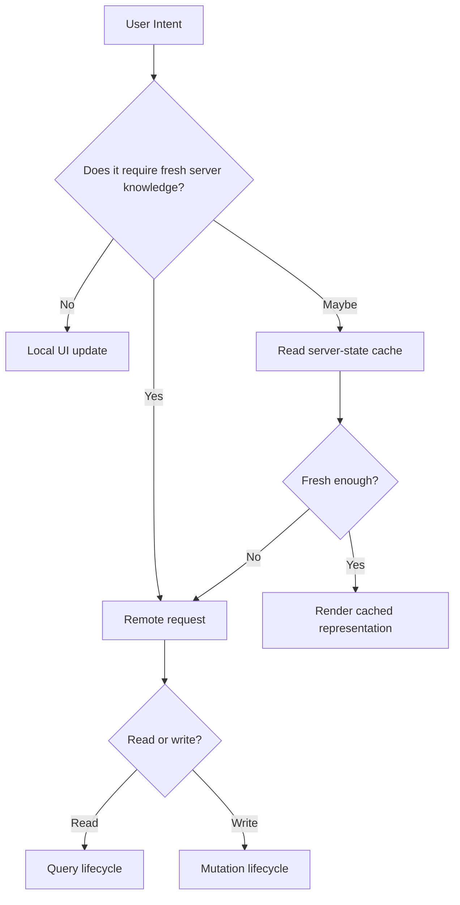

React engineer yang matang tidak bertanya “event ini fetch ke mana?”.

Ia bertanya:

> “Intent ini butuh server truth sekarang, atau cukup local representation sementara?”

---

## 4. Tahap 2 — React Mengekspresikan Data Requirement

Ada beberapa lokasi umum untuk mengekspresikan kebutuhan data:

| Lokasi | Cocok untuk | Risiko |
|---|---|---|
| `useEffect` di component | eksperimen kecil, imperative fetch sederhana | race, waterfall, duplicate request, stale closure |
| custom hook | reusable read model | cache policy sering tersembunyi |
| server-state library | shared server state, refetch, invalidation | query key salah, cache stale, mutation side effect tersebar |
| route loader | data yang terkait navigation | coupling route-data, redirect/error boundary harus dirancang |
| action/fetcher | form/mutation route-level | perlu mapping status/error ke UX |
| Server Component | data read di server render boundary | serialization dan invalidation berbeda dari client fetch |
| Server Function/Action | mutation yang dideklarasikan lintas boundary | framework-specific lifecycle dan progressive enhancement |

Jangan memutuskan lokasi fetch hanya karena “lebih mudah ditulis”.

Gunakan pertanyaan ini:

1. Apakah data dibutuhkan sebelum route render?
2. Apakah data bisa stale selama beberapa detik/menit?
3. Apakah data dipakai oleh banyak component?
4. Apakah request harus dibatalkan saat navigation?
5. Apakah mutation harus optimistic?
6. Apakah response menentukan redirect?
7. Apakah data mengandung sensitive field?
8. Apakah failure harus masuk route error boundary atau local inline error?

Contoh buruk:

```tsx
function CaseDetail({ id }: { id: string }) {
  const [caseData, setCaseData] = React.useState<any>(null);

  React.useEffect(() => {
    fetch(`/api/cases/${id}`)
      .then((r) => r.json())
      .then(setCaseData);
  }, [id]);

  return <pre>{JSON.stringify(caseData, null, 2)}</pre>;
}
```

Masalahnya bukan karena `useEffect` haram.

Masalahnya karena lifecycle tidak lengkap:

- tidak ada abort saat `id` berubah,
- tidak ada status handling,
- tidak ada parse guard,
- tidak ada stale response guard,
- tidak ada error classification,
- tidak ada retry policy,
- tidak ada cache identity,
- tidak ada empty state,
- tidak ada observability.

---

## 5. Tahap 3 — Client Boundary: Siapa yang Memulai Request?

Dalam aplikasi modern, request bisa dimulai oleh banyak actor:

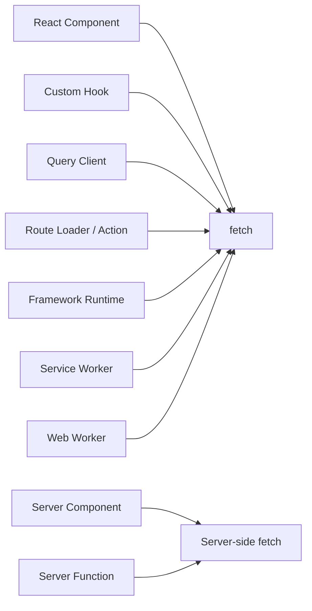

Ini penting karena setiap actor punya lifecycle berbeda.

Component-level request hidup mengikuti component lifecycle.
Route-level request hidup mengikuti navigation lifecycle.
Query-client request hidup mengikuti cache observer lifecycle.
Service-worker request bisa hidup di luar page lifecycle.
Server Component fetch terjadi sebelum client JavaScript menjalankan component interaktif.

Satu API endpoint yang sama bisa dipanggil melalui boundary berbeda, tetapi konsekuensinya tidak sama.

Contoh:

```tsx
// Component-level client fetch.
useEffect(() => {
  const controller = new AbortController();

  void fetch(`/api/cases/${caseId}`, { signal: controller.signal });

  return () => controller.abort();
}, [caseId]);
```

```ts
// Route-level loader concept.
export async function loader({ params, request }: LoaderArgs) {
  const url = new URL(request.url);
  const includeAudit = url.searchParams.get("includeAudit") === "true";

  return fetchCaseDetail(params.caseId, { includeAudit });
}
```

```tsx
// Query-client boundary.
const caseQuery = useQuery({
  queryKey: ["case", caseId],
  queryFn: ({ signal }) => fetchCase(caseId, { signal }),
});
```

Ketiganya bukan hanya beda syntax. Ketiganya punya model ownership berbeda.

---

## 6. Tahap 4 — Request Descriptor

Sebelum request dikirim, client perlu membentuk descriptor.

Descriptor minimal:

```ts
type RequestDescriptor = {
  method: "GET" | "POST" | "PUT" | "PATCH" | "DELETE";
  url: string;
  headers?: Record<string, string>;
  body?: unknown;
  credentials?: RequestCredentials;
  signal?: AbortSignal;
  deadlineMs?: number;
  idempotencyKey?: string;
  correlationId?: string;
};
```

Di browser, `fetch(input, init)` menerima `RequestInfo` dan `RequestInit`. Tapi production client biasanya butuh layer eksplisit di atas Fetch agar kebijakan tidak tersebar di seluruh component.

Kebijakan yang sebaiknya tidak ditulis berulang:

- base URL,
- auth/credential policy,
- content-type negotiation,
- JSON serialization,
- timeout/deadline,
- abort propagation,
- correlation ID,
- idempotency key untuk mutation tertentu,
- retry policy,
- error envelope parsing,
- response validation,
- telemetry hook.

Contoh request builder:

```ts
type JsonValue =
  | string
  | number
  | boolean
  | null
  | JsonValue[]
  | { [key: string]: JsonValue };

type HttpMethod = "GET" | "POST" | "PUT" | "PATCH" | "DELETE";

type ApiRequest = {
  method: HttpMethod;
  path: string;
  query?: Record<string, string | number | boolean | undefined>;
  body?: JsonValue;
  headers?: Record<string, string>;
  signal?: AbortSignal;
};

function buildUrl(baseUrl: string, path: string, query?: ApiRequest["query"]): string {
  const url = new URL(path, baseUrl);

  for (const [key, value] of Object.entries(query ?? {})) {
    if (value !== undefined) {
      url.searchParams.set(key, String(value));
    }
  }

  return url.toString();
}

function buildRequest(baseUrl: string, request: ApiRequest): Request {
  const headers = new Headers(request.headers);

  if (request.body !== undefined && !headers.has("content-type")) {
    headers.set("content-type", "application/json");
  }

  headers.set("accept", "application/json");

  return new Request(buildUrl(baseUrl, request.path, request.query), {
    method: request.method,
    headers,
    body: request.body === undefined ? undefined : JSON.stringify(request.body),
    signal: request.signal,
    credentials: "include",
  });
}
```

Perhatikan: request descriptor bukan hanya URL.

Ia adalah kontrak operasional.

---

## 7. Tahap 5 — Browser Fetch Pipeline

Setelah `fetch()` dipanggil, request tidak langsung “ke server”. Browser menjalankan pipeline.

Pipeline konseptual:

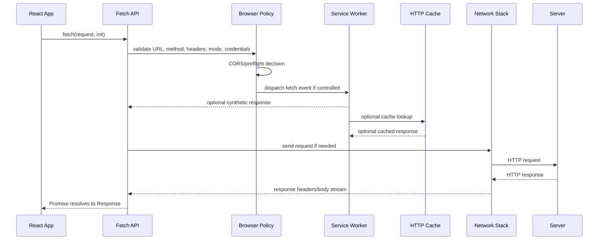

Beberapa implikasi:

1. Request bisa gagal sebelum menyentuh server.
2. Request bisa dijawab oleh Service Worker.
3. Request bisa dijawab dari cache.
4. Request bisa memicu CORS preflight.
5. Request bisa dibatalkan oleh `AbortSignal`.
6. Response body bisa streaming.
7. HTTP error tidak otomatis menjadi rejected Promise.

Poin terakhir sering menyebabkan bug.

`fetch()` reject untuk network-level failure, abort, atau masalah request tertentu. Tapi response HTTP `404`, `409`, atau `500` tetap menghasilkan `Response` object. Client harus memeriksa `response.ok` atau `response.status`.

Contoh wrapper minimal:

```ts
class HttpError extends Error {
  constructor(
    message: string,
    readonly status: number,
    readonly response: Response,
    readonly body: unknown,
  ) {
    super(message);
    this.name = "HttpError";
  }
}

async function parseJsonSafely(response: Response): Promise<unknown> {
  const contentType = response.headers.get("content-type") ?? "";

  if (response.status === 204 || response.status === 205) {
    return null;
  }

  if (!contentType.includes("application/json")) {
    return await response.text();
  }

  return await response.json();
}

async function requestJson<T>(request: Request): Promise<T> {
  const response = await fetch(request);
  const body = await parseJsonSafely(response);

  if (!response.ok) {
    throw new HttpError(`HTTP ${response.status}`, response.status, response, body);
  }

  return body as T;
}
```

Wrapper ini belum lengkap, tapi sudah memperbaiki satu invariant:

> HTTP status harus dimodelkan secara eksplisit.

---

## 8. Tahap 6 — Network Tidak Hanya Latency

Saat request keluar dari browser, request melewati banyak lapisan:

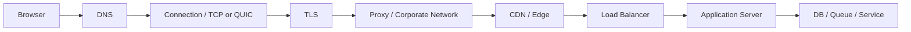

Di DevTools, kamu sering melihat satu bar. Tapi bar itu menyembunyikan banyak hal:

- DNS lookup,
- connection setup,
- TLS handshake,
- request upload,
- server processing,
- response waiting,
- response download,
- decompression,
- main-thread parsing,
- React render.

Tidak semua slow request berasal dari server.

Contoh:

- payload terlalu besar,
- request dipicu serial oleh component waterfall,
- CORS preflight berulang,
- koneksi baru terus dibuat karena origin tersebar,
- response body cepat tapi JSON parsing berat,
- request selesai cepat tapi render list ribuan item lambat,
- network cepat tapi cache invalidation membuat refetch loop.

Karena itu lifecycle harus dibaca sebagai pipeline, bukan stopwatch tunggal.

---

## 9. Tahap 7 — Server Edge dan Request Context

Saat request mencapai server, request biasanya tidak langsung masuk controller.

Ada lapisan:

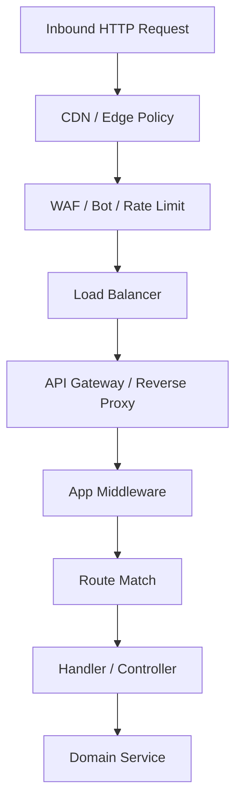

Client tidak perlu tahu semua detail internal server. Tapi client perlu mengirim informasi yang membantu observability dan correctness.

Contoh header yang sering berguna:

| Header | Tujuan |
|---|---|
| `Accept` | representation yang diharapkan client |
| `Content-Type` | format body yang dikirim |
| `If-None-Match` | conditional GET dengan ETag |
| `Idempotency-Key` | dedup command agar retry aman |
| `X-Request-ID` atau `traceparent` | korelasi log/trace |
| `Prefer` | hint behavior tertentu bila API mendukung |

Jangan asal membuat custom header.

Custom header bisa membuat request tidak lagi tergolong simple CORS request dan memicu preflight pada cross-origin scenario. Jadi gunakan header secara sengaja.

---

## 10. Tahap 8 — Domain Execution: Read dan Write Berbeda

Read request dan write request punya lifecycle berbeda.

### Read lifecycle

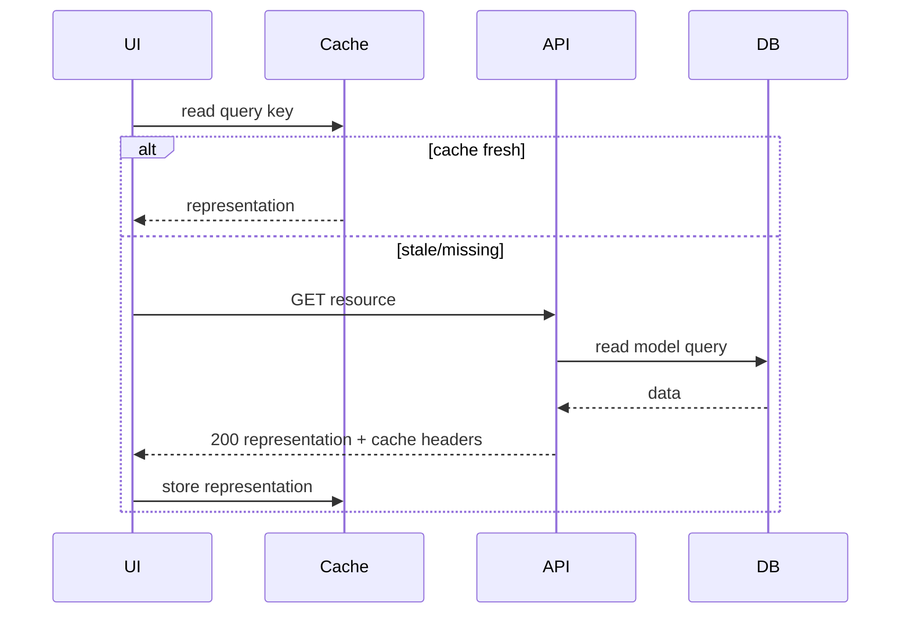

Read operation biasanya fokus pada:

- freshness,
- cacheability,
- filtering/sorting/pagination,
- projection,
- authorization-aware representation,
- partial failure,
- consistency of snapshot.

### Write lifecycle

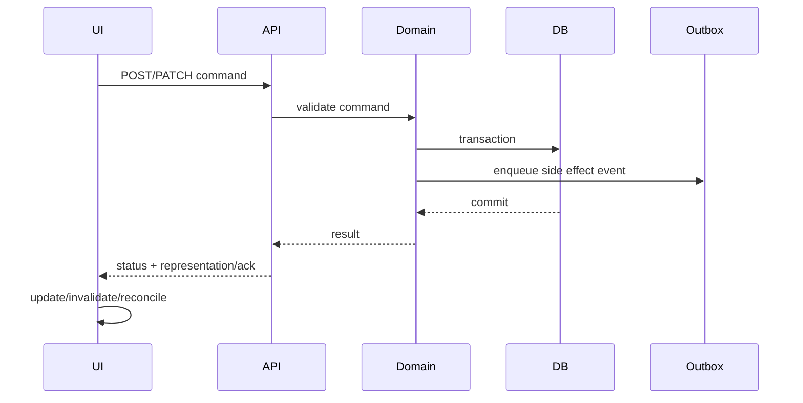

Write operation fokus pada:

- validation,
- idempotency,
- conflict detection,
- transaction boundary,
- side effect boundary,
- resulting representation,
- retry safety,
- auditability.

Jangan memperlakukan mutation seperti query dengan method berbeda.

Mutation mengubah dunia.

---

## 11. Tahap 9 — Response Descriptor

Response bukan hanya body.

Response descriptor minimal:

```ts
type ResponseDescriptor<T> = {
  status: number;
  headers: Headers;
  body: T;
};
```

Tapi secara operasional, response membawa banyak keputusan:

| Elemen | Makna untuk client |
|---|---|
| status code | apakah success, validation error, conflict, unauthorized, retryable, atau server failure |
| `Content-Type` | parser apa yang aman dipakai |
| `Cache-Control` | boleh cache berapa lama dan oleh siapa |
| `ETag` | identity version untuk conditional request |
| `Location` | resource baru atau redirect target |
| `Retry-After` | kapan client boleh retry |
| body | representation, error envelope, atau ack |

Response success pun perlu ditafsirkan.

Contoh:

| Status | Umum dipakai untuk | Client action |
|---:|---|---|
| 200 | representation dikembalikan | parse body, update cache |
| 201 | resource dibuat | baca body/Location, update list/detail |
| 202 | accepted async processing | tampilkan pending/job state |
| 204 | sukses tanpa body | jangan panggil `response.json()` |
| 304 | not modified | pakai cached representation |
| 400 | malformed request | bug/invalid client request |
| 401 | unauthenticated | auth boundary, bukan local retry sembarang |
| 403 | forbidden | permission boundary, tampilkan access state |
| 404 | not found | empty/not-found state |
| 409 | conflict | reconcile atau refresh server truth |
| 422 | validation/domain error | tampilkan field/global error |
| 429 | rate limit | backoff, respect `Retry-After` |
| 500 | server failure | retry terbatas atau failure UI |
| 503 | temporarily unavailable | retry/backoff/degraded mode |

Kesalahan umum:

```ts
const data = await fetch("/api/update", { method: "POST" }).then((r) => r.json());
```

Ini rusak untuk:

- `204 No Content`,
- HTML error page,
- `500` dengan non-JSON body,
- aborted request,
- network failure,
- validation envelope,
- redirect/login HTML,
- stale response race.

---

## 12. Tahap 10 — Response Parsing

Parsing adalah boundary berbahaya.

Kenapa?

Karena client sering menganggap:

> “Kalau server bilang JSON, isinya pasti sesuai tipe TypeScript.”

Tidak benar.

TypeScript tidak memvalidasi runtime JSON.

`as CaseDetail` hanya memberi tahu compiler untuk percaya. Ia tidak memeriksa data.

Contoh bahaya:

```ts
type CaseDetail = {
  id: string;
  status: "OPEN" | "CLOSED";
  createdAt: string;
};

const data = (await response.json()) as CaseDetail;
```

Jika server mengirim:

```json
{
  "id": 123,
  "status": "ARCHIVED",
  "createdAt": null
}
```

TypeScript tetap diam.

Production client perlu memilih strategi:

| Strategi | Cocok untuk | Trade-off |
|---|---|---|
| trust server | internal API stabil, low risk | runtime mismatch bisa meledak di UI |
| lightweight guard | endpoint penting | sedikit boilerplate |
| schema validation | public/critical contract | cost runtime + schema maintenance |
| generated client | OpenAPI/GraphQL/tRPC | tooling dependency |

Contoh lightweight guard:

```ts
type CaseStatus = "OPEN" | "CLOSED" | "ESCALATED";

type CaseSummary = {
  id: string;
  title: string;
  status: CaseStatus;
};

function isCaseStatus(value: unknown): value is CaseStatus {
  return value === "OPEN" || value === "CLOSED" || value === "ESCALATED";
}

function parseCaseSummary(value: unknown): CaseSummary {
  if (typeof value !== "object" || value === null) {
    throw new Error("Expected object for CaseSummary");
  }

  const record = value as Record<string, unknown>;

  if (typeof record.id !== "string") {
    throw new Error("Expected CaseSummary.id to be string");
  }

  if (typeof record.title !== "string") {
    throw new Error("Expected CaseSummary.title to be string");
  }

  if (!isCaseStatus(record.status)) {
    throw new Error("Expected valid CaseSummary.status");
  }

  return {
    id: record.id,
    title: record.title,
    status: record.status,
  };
}
```

Untuk API besar, Part 047–048 akan membahas contract-first dan type-safe generated clients.

---

## 13. Tahap 11 — State Integration

Setelah response diparse, ada pertanyaan lebih penting:

> response ini harus masuk ke state mana?

Pilihan umum:

| Target | Cocok untuk |
|---|---|
| local component state | data kecil, temporary, tidak dishare |
| route data | data yang melekat ke navigation |
| server-state cache | resource shared, refetchable, invalidatable |
| normalized graph cache | object graph kompleks dan fragment-driven |
| external store | client-owned workflow state |
| optimistic layer | mutation pending sebelum server ack |

Contoh anti-pattern:

```tsx
const [cases, setCases] = useState<CaseSummary[]>([]);
const [selectedCase, setSelectedCase] = useState<CaseDetail | null>(null);
const [caseCount, setCaseCount] = useState(0);
```

Jika semua state itu berasal dari server, kamu sedang membuat beberapa copy dari server truth.

Masalah berikutnya:

- list menunjukkan status lama,
- detail menunjukkan status baru,
- count tidak berubah,
- filter cache tidak invalid,
- optimistic update tidak rollback,
- tab lain masih stale.

Better model:

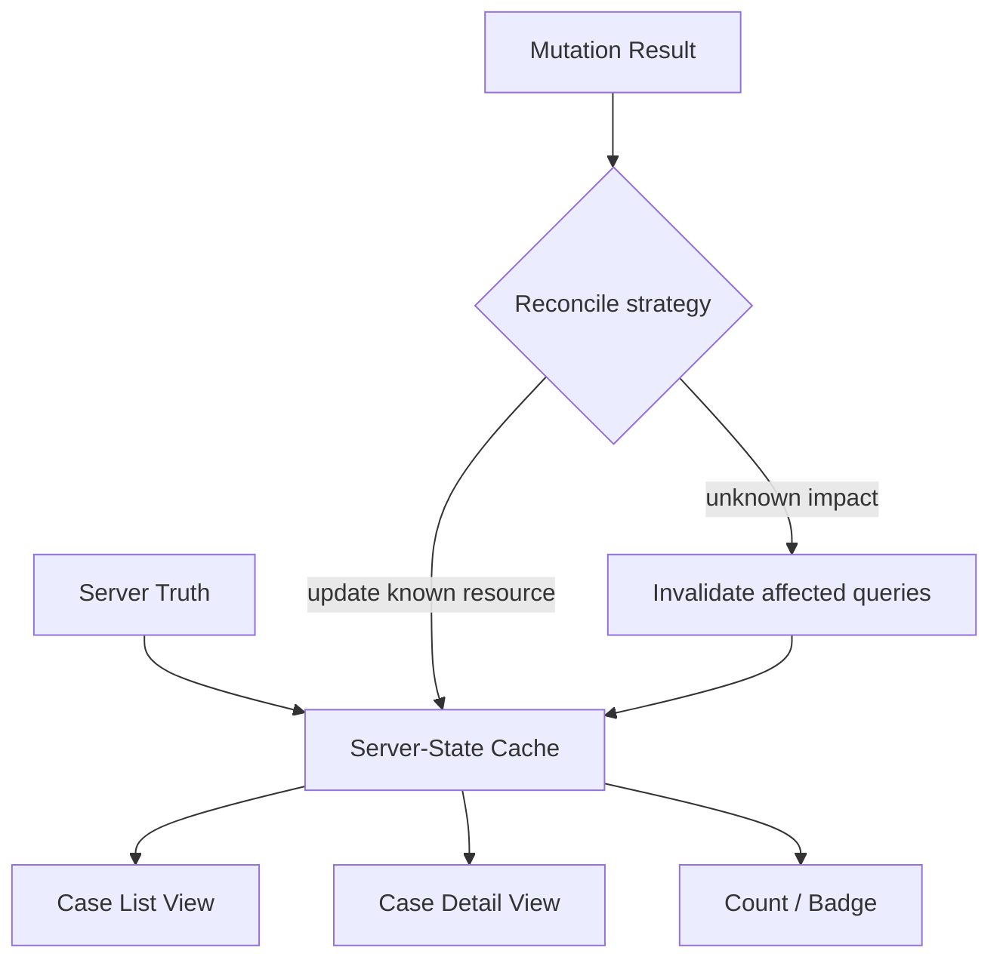

State integration bukan “setState setelah fetch”.

State integration adalah consistency decision.

---

## 14. Tahap 12 — UI Feedback

Dari sudut user, lifecycle request-response terlihat sebagai state UI.

Minimal state:

```ts
type RemoteData<T> =
  | { tag: "idle" }
  | { tag: "loading" }
  | { tag: "success"; data: T; stale?: boolean }
  | { tag: "empty" }
  | { tag: "error"; error: unknown; retryable: boolean };
```

Tapi production UX lebih kaya:

| Kondisi | UI yang sehat |
|---|---|
| first load | skeleton/loading state |
| background refetch | data tetap terlihat, indikator subtle |
| stale cache | tampilkan data lama dengan refresh behavior |
| validation error | field-level errors |
| conflict | refresh/reconcile prompt |
| rate limit | disable sementara + pesan retry |
| offline | queued/pending state |
| partial failure | tampilkan bagian yang berhasil + error lokal |
| mutation pending | pending/optimistic state |
| mutation failed | rollback atau recovery action |

Kesalahan umum adalah menyatukan semua failure menjadi satu pesan:

```tsx
<p>Something went wrong</p>
```

Itu boleh sebagai fallback terakhir, tapi bukan desain lifecycle.

---

## 15. Request-Response Lifecycle dengan Cancellation

Cancellation adalah bagian dari lifecycle, bukan fitur tambahan.

Scenario umum:

- user mengetik search cepat,
- user pindah route,
- component unmount,
- tab background,
- request melewati deadline,
- mutation tidak boleh double-submit,
- query key berubah.

Diagram:

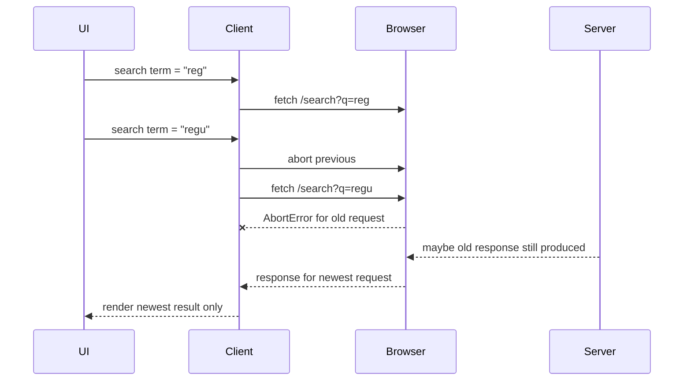

Important: aborting client request does not guarantee server stops processing.

Client cancellation mainly means:

- client tidak lagi menunggu response,
- browser bisa menutup stream/request,
- app tidak boleh apply stale result,
- server mungkin tetap menjalankan work jika tidak mendeteksi disconnect.

Jadi untuk mutation, cancellation tidak sama dengan rollback.

Jika `POST /payments` sudah sampai server dan client abort karena timeout, status sebenarnya ambiguous.

Client harus bertanya:

> “Apakah command ini berhasil, gagal, atau unknown?”

Di situlah idempotency key dan status polling sering dibutuhkan.

---

## 16. Race Condition: Response Terlama Bisa Menang Jika Salah Desain

Contoh classic:

```tsx
function SearchBox() {
  const [term, setTerm] = React.useState("");
  const [results, setResults] = React.useState<string[]>([]);

  React.useEffect(() => {
    if (!term) return;

    fetch(`/api/search?q=${encodeURIComponent(term)}`)
      .then((response) => response.json())
      .then(setResults);
  }, [term]);

  return <input value={term} onChange={(event) => setTerm(event.target.value)} />;
}
```

Jika request `q=a` lambat dan `q=abc` cepat, response `q=a` bisa datang belakangan dan menimpa result terbaru.

Perbaikan minimal:

```tsx
function SearchBox() {
  const [term, setTerm] = React.useState("");
  const [results, setResults] = React.useState<string[]>([]);

  React.useEffect(() => {
    if (!term) {
      setResults([]);
      return;
    }

    const controller = new AbortController();

    async function run() {
      try {
        const response = await fetch(`/api/search?q=${encodeURIComponent(term)}`, {
          signal: controller.signal,
        });

        if (!response.ok) {
          throw new Error(`Search failed with ${response.status}`);
        }

        const nextResults = (await response.json()) as string[];
        setResults(nextResults);
      } catch (error) {
        if (error instanceof DOMException && error.name === "AbortError") {
          return;
        }

        throw error;
      }
    }

    void run();

    return () => controller.abort();
  }, [term]);

  return <input value={term} onChange={(event) => setTerm(event.target.value)} />;
}
```

Lebih baik lagi, gunakan server-state/query layer yang membawa `signal`, dedup, cache key, dan stale protection.

---

## 17. Deadline Berbeda dari Timeout

Timeout biasanya dilihat sebagai “batalkan setelah N ms”.

Deadline lebih kuat:

> request ini hanya berguna sampai waktu tertentu.

Contoh:

- autocomplete berguna dalam 300–800 ms,
- route navigation mungkin punya budget 2–5 detik,
- export job bisa menunggu lebih lama,
- audit submission tidak boleh dianggap gagal hanya karena UI timeout.

Wrapper sederhana:

```ts
function timeoutSignal(ms: number, parent?: AbortSignal): AbortSignal {
  const controller = new AbortController();
  const timeoutId = window.setTimeout(() => controller.abort("timeout"), ms);

  function cleanup() {
    window.clearTimeout(timeoutId);
  }

  controller.signal.addEventListener("abort", cleanup, { once: true });

  if (parent) {
    if (parent.aborted) {
      controller.abort(parent.reason);
    } else {
      parent.addEventListener(
        "abort",
        () => {
          controller.abort(parent.reason);
        },
        { once: true },
      );
    }
  }

  return controller.signal;
}
```

Catatan: browser modern juga punya `AbortSignal.timeout()` di beberapa environment, tetapi wrapper eksplisit masih berguna untuk polyfill, parent signal, dan telemetry.

---

## 18. Idempotency: Lifecycle Write yang Aman Diulang

Untuk `GET`, retry umumnya aman bila server benar-benar menjalankan semantics read.

Untuk mutation, retry bisa berbahaya.

Contoh bahaya:

```ts
await fetch("/api/invoices", {
  method: "POST",
  body: JSON.stringify({ amount: 100000 }),
});
```

Jika request timeout setelah server membuat invoice, client tidak tahu apakah invoice sudah dibuat.

Jika client retry tanpa idempotency, invoice bisa dobel.

Lifecycle lebih aman:

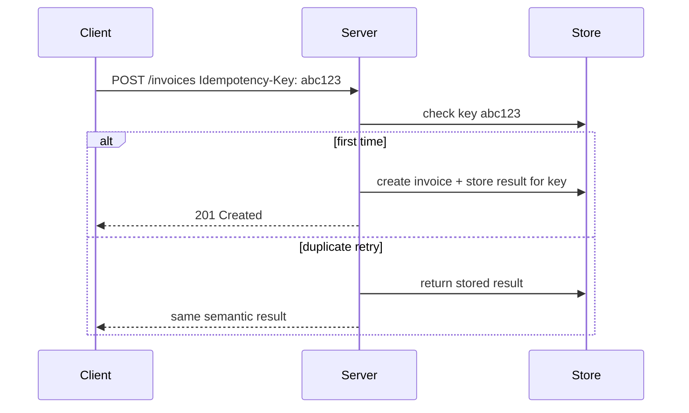

Client-side request descriptor:

```ts
function createIdempotencyKey(): string {
  return crypto.randomUUID();
}

async function createInvoice(input: CreateInvoiceInput, signal?: AbortSignal) {
  const idempotencyKey = createIdempotencyKey();

  return requestJson<CreateInvoiceResult>(
    new Request("/api/invoices", {
      method: "POST",
      headers: {
        "content-type": "application/json",
        "accept": "application/json",
        "idempotency-key": idempotencyKey,
      },
      body: JSON.stringify(input),
      signal,
    }),
  );
}
```

Idempotency bukan hanya server problem.

Client harus tahu mutation mana yang aman di-retry, mana yang tidak.

---

## 19. Correlation ID dan Trace Context

Tanpa korelasi, debugging distributed request menjadi tebak-tebakan.

Minimal, setiap request penting punya identifier.

```ts
function createRequestId(): string {
  return crypto.randomUUID();
}

async function fetchWithRequestId(input: RequestInfo, init: RequestInit = {}) {
  const headers = new Headers(init.headers);
  headers.set("x-request-id", createRequestId());

  return fetch(input, {
    ...init,
    headers,
  });
}
```

Namun di sistem dengan tracing, lebih baik mengikuti trace context yang konsisten di seluruh platform.

Prinsipnya:

- request client punya identity,
- server log menyimpan identity itu,
- error UI bisa menyimpan support/reference code,
- RUM metric bisa dikorelasikan dengan backend trace,
- retry attempt bisa dibedakan dari request original.

Jangan tampilkan raw internal trace detail ke user, tetapi boleh tampilkan support code.

Contoh UX:

> “Gagal menyimpan perubahan. Coba lagi. Reference: `REQ-7F2A9`.”

---

## 20. Mapping Lifecycle ke Error Taxonomy

Error bukan satu kategori.

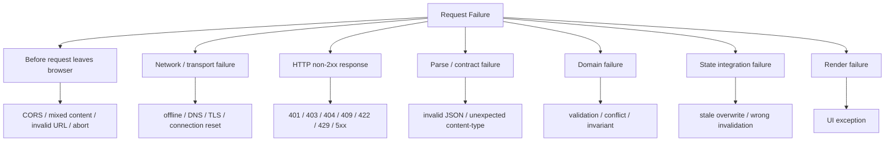

React engineer perlu memutuskan:

| Error | Retry? | User message | Telemetry severity |
|---|---:|---|---|
| abort karena navigation | no | biasanya tidak tampil | debug/none |
| offline | maybe later | offline state | info/warn |
| 400 | no | generic/bug | error |
| 401 | no local retry | sign-in/session flow | warn |
| 403 | no | access denied | warn |
| 404 | no | not found/empty | info |
| 409 | no blind retry | conflict resolution | warn |
| 422 | no | validation field errors | info |
| 429 | delayed | rate limited | warn |
| 500 | limited | try again | error |
| parse error | no | broken response | error |

Jika semua error dilempar sebagai `new Error("Failed")`, kamu kehilangan lifecycle intelligence.

---

## 21. Complete Production-ish Fetch Client

Berikut contoh client yang masih ringkas, tapi lifecycle-aware.

```ts
type ApiErrorKind =
  | "aborted"
  | "network"
  | "http"
  | "parse"
  | "timeout";

class ApiError extends Error {
  constructor(
    readonly kind: ApiErrorKind,
    message: string,
    readonly details?: {
      status?: number;
      requestId?: string;
      body?: unknown;
      cause?: unknown;
    },
  ) {
    super(message);
    this.name = "ApiError";
  }
}

type ApiClientOptions = {
  baseUrl: string;
  defaultTimeoutMs: number;
};

type SendOptions = {
  method?: HttpMethod;
  path: string;
  query?: Record<string, string | number | boolean | undefined>;
  body?: JsonValue;
  headers?: Record<string, string>;
  signal?: AbortSignal;
  timeoutMs?: number;
};

class ApiClient {
  constructor(private readonly options: ApiClientOptions) {}

  async send<T>(options: SendOptions): Promise<T> {
    const requestId = crypto.randomUUID();
    const timeoutMs = options.timeoutMs ?? this.options.defaultTimeoutMs;
    const signal = timeoutSignal(timeoutMs, options.signal);

    const headers = new Headers(options.headers);
    headers.set("accept", "application/json");
    headers.set("x-request-id", requestId);

    if (options.body !== undefined && !headers.has("content-type")) {
      headers.set("content-type", "application/json");
    }

    const request = new Request(buildUrl(this.options.baseUrl, options.path, options.query), {
      method: options.method ?? "GET",
      headers,
      body: options.body === undefined ? undefined : JSON.stringify(options.body),
      credentials: "include",
      signal,
    });

    let response: Response;

    try {
      response = await fetch(request);
    } catch (error) {
      if (signal.aborted) {
        throw new ApiError(
          signal.reason === "timeout" ? "timeout" : "aborted",
          signal.reason === "timeout" ? "Request timed out" : "Request was aborted",
          { requestId, cause: error },
        );
      }

      throw new ApiError("network", "Network request failed", {
        requestId,
        cause: error,
      });
    }

    let parsed: unknown;

    try {
      parsed = await parseJsonSafely(response);
    } catch (error) {
      throw new ApiError("parse", "Response body could not be parsed", {
        requestId,
        status: response.status,
        cause: error,
      });
    }

    if (!response.ok) {
      throw new ApiError("http", `HTTP ${response.status}`, {
        requestId,
        status: response.status,
        body: parsed,
      });
    }

    return parsed as T;
  }
}
```

Ini belum final untuk semua aplikasi, tapi sudah punya beberapa invariant:

- semua request punya `requestId`,
- response HTTP error tidak dianggap sukses,
- abort/timeout/network dibedakan,
- `204` tidak diparse sebagai JSON,
- content-type diperhatikan,
- signal dipropagate,
- base URL dan credential policy tersentralisasi.

Nanti Part 016 akan membangun versi lebih production-grade.

---

## 22. Lifecycle untuk Mutation dengan UI State

Contoh mutation lifecycle:

```tsx
type SaveState =
  | { tag: "idle" }
  | { tag: "saving"; requestId: string }
  | { tag: "saved"; savedAt: Date }
  | { tag: "validation-error"; fields: Record<string, string> }
  | { tag: "conflict"; serverVersion: number }
  | { tag: "failed"; retryable: boolean; reference?: string };
```

Kenapa perlu state seperti ini?

Karena mutation failure tidak setara.

`422` perlu field errors.
`409` perlu conflict resolution.
`500` bisa retry.
`timeout` bisa unknown.
`abort` mungkin user pindah halaman.

Contoh handler:

```tsx
async function submitCaseUpdate(input: UpdateCaseInput) {
  const requestId = crypto.randomUUID();
  setSaveState({ tag: "saving", requestId });

  try {
    const result = await api.send<UpdateCaseResult>({
      method: "PATCH",
      path: `/cases/${input.id}`,
      body: input,
      headers: {
        "idempotency-key": crypto.randomUUID(),
      },
    });

    setSaveState({ tag: "saved", savedAt: new Date() });
    applyCaseUpdateToCache(result.case);
  } catch (error) {
    if (error instanceof ApiError && error.kind === "http") {
      if (error.details?.status === 422) {
        setSaveState({
          tag: "validation-error",
          fields: extractFieldErrors(error.details.body),
        });
        return;
      }

      if (error.details?.status === 409) {
        setSaveState({
          tag: "conflict",
          serverVersion: extractServerVersion(error.details.body),
        });
        return;
      }
    }

    setSaveState({
      tag: "failed",
      retryable: isRetryable(error),
      reference: error instanceof ApiError ? error.details?.requestId : undefined,
    });
  }
}
```

Ini lebih panjang daripada naive fetch, tetapi jauh lebih jelas secara operational.

---

## 23. Request-Response Sequence untuk Page Load

Page load modern sering punya beberapa request class:

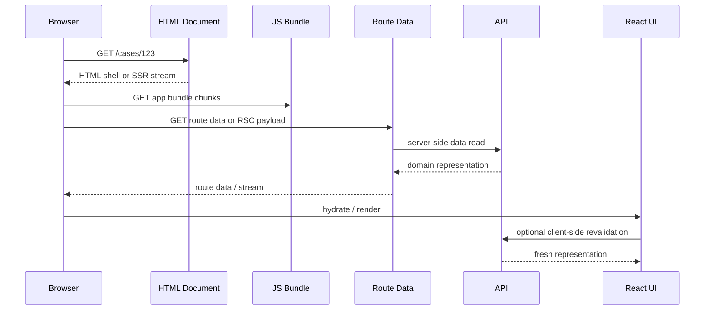

Pertanyaan arsitektural:

- Data mana yang harus masuk HTML/server render?
- Data mana yang boleh dimuat setelah hydration?
- Data mana yang harus diprefetch sebelum navigation?
- Data mana yang harus direvalidasi di background?
- Data mana yang tidak boleh dikirim ke client?

Tanpa model ini, aplikasi mudah jatuh ke:

- blank page terlalu lama,
- duplicate fetch server + client,
- hydration mismatch,
- flash of unauthenticated/unauthorized UI,
- route waterfall,
- stale data setelah navigation.

---

## 24. Request-Response Sequence untuk Form Submission

Form submission bukan sekadar `POST`.

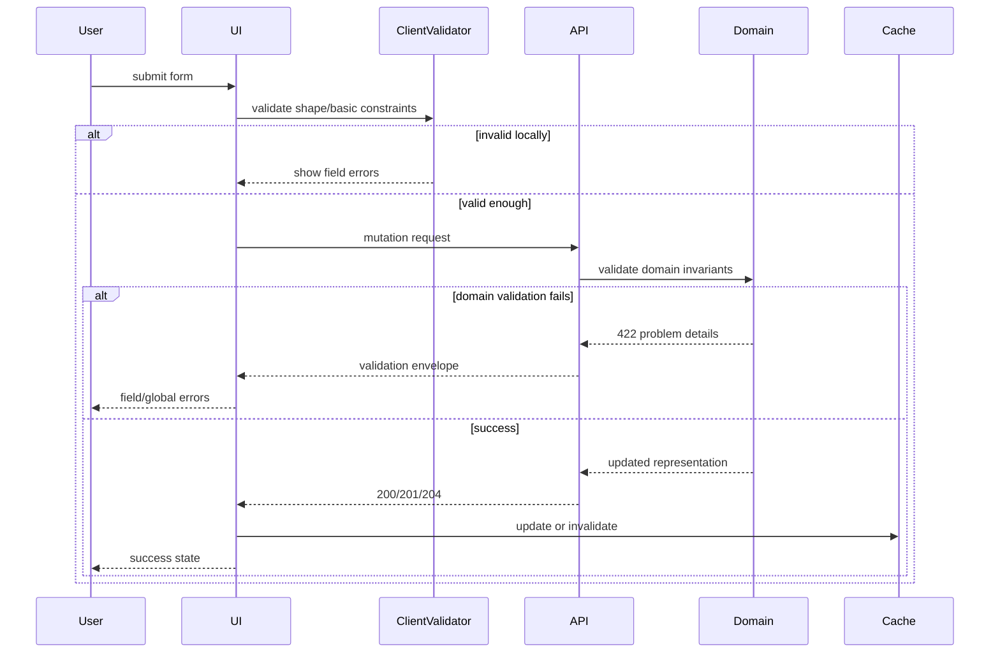

Client validation bukan pengganti server validation.

Client validation adalah latency optimization dan UX improvement.
Server validation adalah authority.

---

## 25. Request-Response Sequence untuk Background Revalidation

Background revalidation berbeda dari first load.

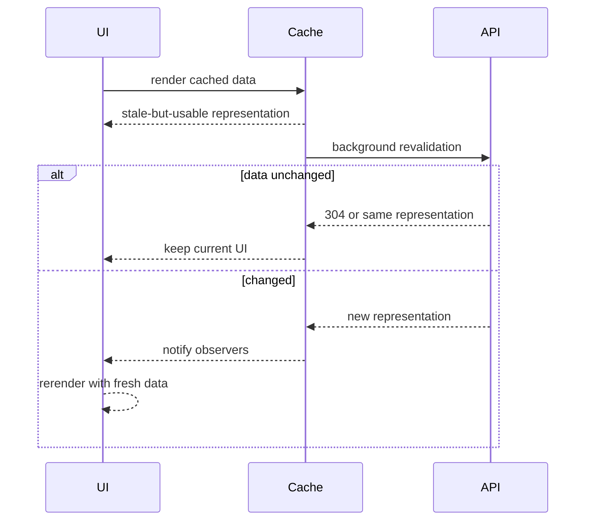

UX yang baik tidak selalu menampilkan spinner besar.

Untuk background refetch, sering lebih baik:

- tetap tampilkan data lama,
- tampilkan indikator kecil,
- hindari layout shift,
- jangan reset pagination/filter,
- jangan menutup modal tiba-tiba,
- jangan overwrite user editing state.

---

## 26. Lifecycle Smells

Berikut tanda request-response lifecycle tidak sehat:

| Smell | Gejala | Akar masalah |
|---|---|---|
| spinner permanen | loading tidak selesai | missing error/abort/finally path |
| stale overwrite | data baru diganti data lama | race condition |
| double submit | command dieksekusi dua kali | no idempotency / no disabled pending state |
| random logout | response HTML login diparse JSON | auth redirect tidak dimodelkan |
| all errors same | user selalu lihat generic error | error taxonomy tidak ada |
| DevTools waterfall panjang | request serial tak perlu | component-level data dependency |
| refetch storm | network terus-menerus | invalidation terlalu luas |
| ghost success | UI sukses tapi server belum commit | optimistic update tanpa confirmation |
| impossible debugging | log tidak bisa dikorelasikan | no request id / trace context |
| cache contradiction | list/detail beda | resource identity tidak jelas |

Smell ini biasanya tidak selesai dengan “ganti library”.

Ia selesai dengan memperbaiki lifecycle model.

---

## 27. Checklist Design Request-Response

Sebelum menulis client call baru, tanyakan:

### Intent

- Intent user apa yang memicu request?
- Apakah request ini read, command, upload, stream, atau sync?
- Apakah request ini boleh diulang?

### Boundary

- Request dimulai dari component, hook, query client, route loader/action, server component, service worker, atau worker?
- Siapa pemilik cancellation?
- Apa yang terjadi saat navigation?

### Contract

- Method dan URL apa?
- Request body shape apa?
- Response success shape apa?
- Error envelope shape apa?
- Status code apa yang meaningful?

### Policy

- Apakah butuh credential/cookie?
- Apakah CORS terlibat?
- Apakah request cacheable?
- Apakah butuh deadline?
- Apakah butuh idempotency key?

### State

- Response masuk local state, route data, query cache, atau store?
- Apa cache key-nya?
- Mutation mengupdate cache langsung atau invalidate?
- Bagaimana rollback?

### Failure

- Apa user lihat untuk 401/403/404/409/422/429/500?
- Error mana yang retryable?
- Apa yang terjadi saat offline?
- Apa yang terjadi jika response terlambat?

### Observability

- Apakah ada request ID?
- Apakah latency diukur?
- Apakah status/error tercatat?
- Apakah bisa dikorelasikan dengan backend logs?

---

## 28. Mini Case Study — Case Detail Page

Kita desain lifecycle untuk halaman detail regulatory case.

Requirement:

- route `/cases/:caseId`,
- tampilkan detail case,
- tampilkan audit summary,
- user bisa update priority,
- update priority harus conflict-aware,
- list cache harus ikut konsisten,
- user pindah route harus cancel read,
- mutation tidak boleh double-submit,
- error harus bisa diaudit.

Lifecycle design:

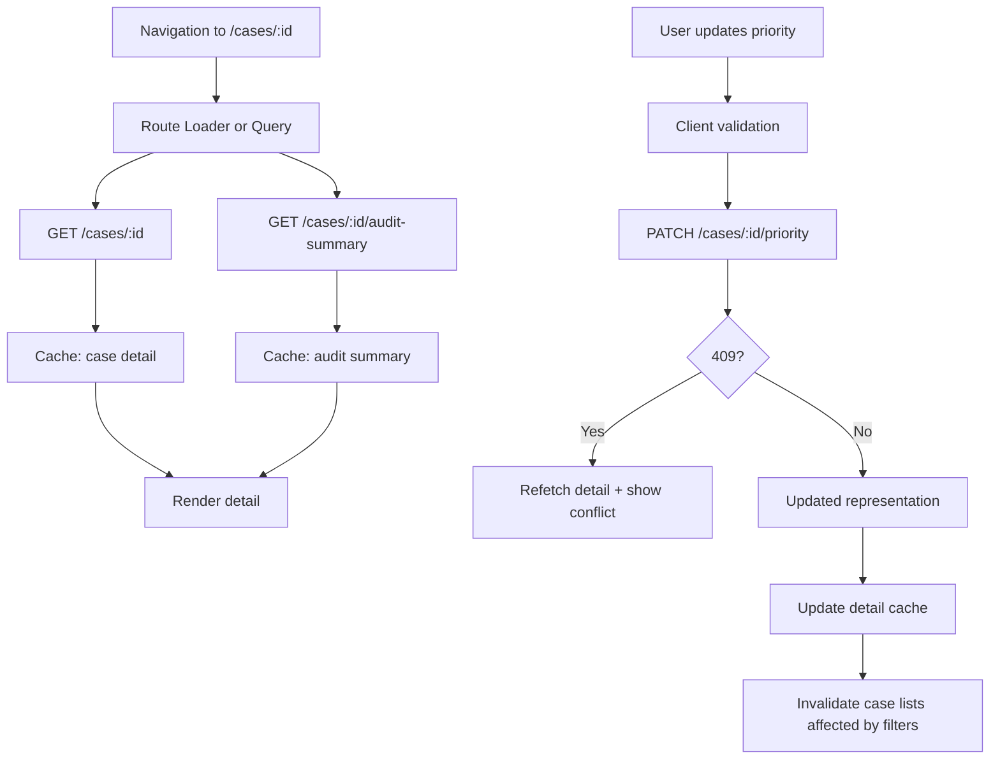

Important decisions:

| Decision | Pilihan |
|---|---|
| read boundary | route loader atau query client |
| cancellation | tied to navigation/query signal |
| detail cache key | `["case", caseId]` |
| audit cache key | `["case", caseId, "audit-summary"]` |
| mutation method | `PATCH` dengan expected version |
| conflict handling | `409`, show reconcile UI |
| idempotency | optional untuk update simple, required untuk create/submit command |
| observability | request ID per read/mutation |
| list consistency | invalidate list queries affected by priority/status filters |

Naive code hanya melakukan `fetch`.
Production design menentukan lifecycle.

---

## 29. Engineering Invariants

Untuk Part 005, simpan invariant berikut:

1. **User intent bukan request.** Intent perlu diterjemahkan menjadi data requirement atau command.
2. **Request-response bukan function call.** Ia adalah message exchange antar runtime.
3. **Boundary menentukan lifecycle.** Component, route, query client, server component, dan service worker punya model berbeda.
4. **HTTP error bukan rejected Promise.** Client harus membaca `status`/`ok`.
5. **Body parsing adalah runtime risk.** TypeScript tidak memvalidasi JSON.
6. **Cancellation tidak selalu membatalkan server work.** Untuk mutation, status bisa ambiguous.
7. **Response masuk consistency model.** Jangan asal `setState` tanpa memikirkan cache/resource identity.
8. **Mutation bukan query dengan method berbeda.** Ia perlu idempotency, conflict, validation, dan side-effect thinking.
9. **Error harus diklasifikasi berdasarkan lifecycle stage.** Network, HTTP, domain, parse, state, dan render error berbeda.
10. **Observability harus dirancang dari client.** Tanpa request ID/trace, debugging production sulit.

---

## 30. Kesimpulan

Request-response lifecycle adalah tulang punggung React client-server communication.

Kamu tidak cukup tahu cara menulis:

```ts
await fetch("/api/data");
```

Kamu harus tahu:

- kenapa request dipicu,
- siapa pemilik lifecycle,
- bagaimana request dibentuk,
- apa yang dilakukan browser sebelum network,
- bagaimana server menafsirkan request,
- apa arti status/header/body response,
- bagaimana body diparse,
- bagaimana response masuk cache/state,
- bagaimana UI menampilkan progress/failure/success,
- bagaimana request diobservasi dan didebug.

Di Part 006, kita akan membahas konsekuensi performa dari lifecycle ini: **latency, throughput, dan waterfall**.

Bukan sekadar “API lambat”, tetapi cara membaca sistem yang membuat aplikasi React terasa cepat atau lambat.

---

## Referensi Resmi

- MDN Web Docs — Fetch API: https://developer.mozilla.org/en-US/docs/Web/API/Fetch_API
- MDN Web Docs — Using the Fetch API: https://developer.mozilla.org/en-US/docs/Web/API/Fetch_API/Using_Fetch
- MDN Web Docs — AbortController: https://developer.mozilla.org/en-US/docs/Web/API/AbortController
- RFC 9110 — HTTP Semantics: https://www.rfc-editor.org/rfc/rfc9110.html
- RFC 9457 — Problem Details for HTTP APIs: https://www.rfc-editor.org/rfc/rfc9457.html
- W3C Trace Context: https://www.w3.org/TR/trace-context/
