# Part 006 — Latency, Throughput, and Waterfalls

Di Part 005 kita membedah lifecycle request-response. Sekarang kita lihat konsekuensi performanya.

Banyak aplikasi React tidak lambat karena satu API sangat lambat. Ia lambat karena banyak keputusan kecil membentuk **critical path** yang buruk:

- fetch dimulai setelah render padahal bisa dimulai sebelum render,
- request penting dibuat serial padahal bisa paralel,
- data kecil menunggu bundle besar,
- route transition menunggu endpoint yang tidak dibutuhkan untuk first view,
- setiap row memicu request sendiri,
- mutation sukses lalu seluruh halaman direfetch,
- CORS preflight terjadi berulang karena header custom yang tidak perlu,
- JSON terlalu besar dan parse/render-nya lebih mahal dari network,
- cache tidak dipakai karena resource identity tidak stabil,
- prefetch dilakukan terlalu agresif dan mengganggu request yang lebih penting.

Part ini membangun mental model untuk membaca dan mendesain performa komunikasi client-server di React.

---

## 1. Thesis Utama

Performance React client-server bukan hanya “API cepat”.

Performance adalah hasil dari tiga hal:

1. **Latency** — berapa lama satu unit kerja selesai dari sudut user.
2. **Throughput** — berapa banyak unit kerja bisa diproses dalam periode tertentu tanpa collapse.
3. **Waterfall** — urutan dependency yang menentukan apakah kerja berjalan paralel atau serial.

Formula sederhananya:

```txt
perceived_speed = useful_work_started_early + critical_work_parallelized + unnecessary_work_removed + stale_data_reused_safely
```

Aplikasi terasa cepat bukan karena semua request selalu cepat.

Aplikasi terasa cepat karena:

- request penting dimulai lebih awal,
- request tidak penting ditunda,
- data yang sudah cukup baik dipakai dulu,
- dependency serial dikurangi,
- payload diperkecil,
- streaming/progressive rendering dipakai saat cocok,
- user diberi feedback sesuai lifecycle.

---

## 2. Latency Bukan Satu Angka

Ketika seseorang bilang “API ini 800 ms”, tanyakan:

> “800 ms itu bagian mana?”

Request timing terdiri dari beberapa fase.

```mermaid
flowchart LR
  A[Queued / Scheduled] --> B[DNS]
  B --> C[Connection]
  C --> D[TLS]
  D --> E[Request Upload]
  E --> F[Server Processing]
  F --> G[Response First Byte]
  G --> H[Response Download]
  H --> I[Decompression]
  I --> J[Parse]
  J --> K[State Integration]
  K --> L[React Render]
  L --> M[Paint / User Perception]
```

DevTools bisa menampilkan sebagian besar fase network. Tetapi aplikasi React juga punya fase setelah response:

- `response.json()` parsing,
- schema validation,
- cache write,
- selector/derived computation,
- reconciliation,
- component render,
- DOM update,
- paint,
- effect lanjutan.

Jadi “network selesai” tidak sama dengan “user melihat data”.

---

## 3. Vocabulary yang Harus Presisi

| Istilah | Makna | Kesalahan umum |
|---|---|---|
| latency | waktu satu operasi dari start sampai selesai | disamakan dengan bandwidth |
| RTT | round-trip time client-server-client | dianggap sama dengan server processing |
| TTFB | time to first byte response | dianggap sama dengan total response time |
| download time | waktu menerima body | diabaikan saat payload besar |
| parse time | waktu mengubah bytes menjadi object | sering tidak terlihat di network tab |
| render time | waktu React/DOM menampilkan data | sering disalahkan ke API |
| throughput | jumlah kerja per satuan waktu | disamakan dengan latency rendah |
| concurrency | jumlah kerja bersamaan | dianggap selalu meningkatkan speed |
| queueing | request menunggu giliran | sering tersembunyi sebagai “stalled” |
| jitter | variasi latency | diabaikan sampai UX terasa random |
| critical path | dependency yang menentukan selesai paling awal | tidak terlihat jika hanya lihat endpoint individu |

Engineer kuat tidak berhenti di “endpoint X lambat”.

Ia memetakan di mana waktu hilang.

---

## 4. Waterfall: Musuh Utama Aplikasi Data-Heavy

Waterfall terjadi saat operasi yang bisa dimulai lebih awal malah menunggu operasi sebelumnya.

Contoh buruk:

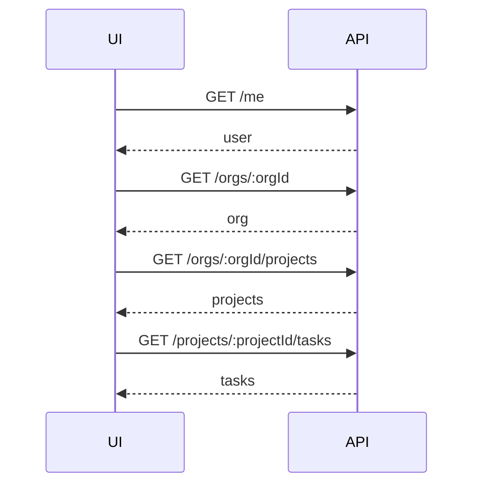

Jika setiap request 300 ms, total bukan 300 ms. Total bisa mendekati 1200 ms sebelum UI berguna.

Waterfall bukan hanya network problem. Ia sering berasal dari desain component.

Contoh:

```tsx
function Dashboard() {
  const me = useMe();

  if (!me.data) return <Spinner />;

  return <OrgPanel orgId={me.data.orgId} />;
}

function OrgPanel({ orgId }: { orgId: string }) {
  const org = useOrg(orgId);

  if (!org.data) return <Spinner />;

  return <ProjectList orgId={org.data.id} />;
}

function ProjectList({ orgId }: { orgId: string }) {
  const projects = useProjects(orgId);

  if (!projects.data) return <Spinner />;

  return <Tasks projectId={projects.data[0]?.id} />;
}
```

Component tree membuat data dependency serial.

Pertanyaannya bukan “hook-nya salah?”

Pertanyaannya:

> “Apakah dependency ini benar-benar harus serial?”

---

## 5. Jenis Waterfall di React

### 5.1 Render-then-fetch waterfall

Pola:

```txt
load JS -> render component -> useEffect runs -> fetch -> render data
```

Masalahnya: request baru dimulai setelah JavaScript load, parse, execute, dan React render pertama.

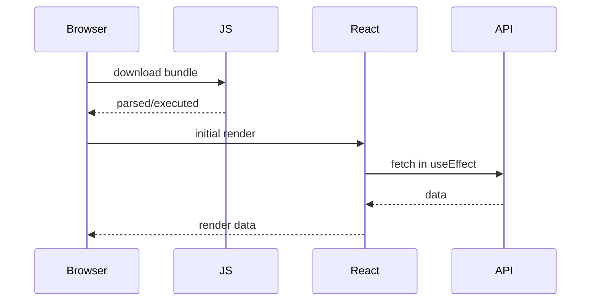

Untuk data route-critical, ini sering terlambat.

Alternatif:

- route loader,
- server rendering,
- Server Components,
- prefetch on link hover/viewport,
- initial data hydration,
- query preloading,
- HTML hints/framework preloads.

### 5.2 Parent-child data waterfall

Parent fetch dulu, child baru tahu parameter fetch berikutnya.

Kadang legitimate. Misalnya child butuh ID dari response parent.

Tapi sering tidak legitimate karena parameter sebenarnya sudah ada dari URL, session, atau route metadata.

### 5.3 N+1 UI waterfall

List fetch, lalu setiap item fetch detail sendiri.

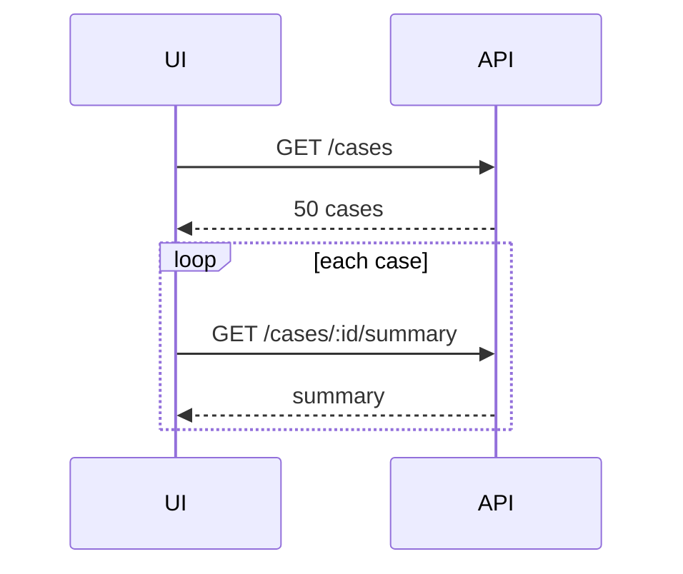

Ini biasanya harus diperbaiki di API contract:

- include projection,
- batch endpoint,
- graph query,
- summary endpoint,
- server-side aggregation,
- pagination dengan embedded summary.

### 5.4 Mutation-refetch waterfall

Mutation selesai, lalu aplikasi invalidate terlalu luas.

```txt
PATCH /case/123/status
GET /cases
GET /cases/123
GET /cases/123/audit
GET /dashboard-counts
GET /notifications
```

Kadang benar. Sering terlalu mahal.

Harus diputuskan:

- response mutation sudah membawa representation baru?
- query mana yang benar-benar terdampak?
- apa yang cukup diupdate lokal?
- mana yang perlu background refetch?
- mana yang harus menunggu user membuka panel?

### 5.5 Bundle-data waterfall

Data cepat, tetapi component code belum ada.

Atau sebaliknya, component code ada, data belum ada.

Route transition modern harus melihat keduanya:

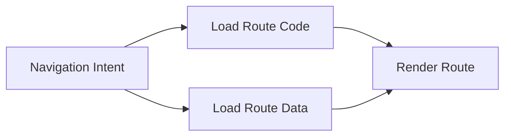

Jika code dan data bisa dimulai bersamaan, jangan buat salah satunya menunggu yang lain.

---

## 6. Latency Budget

Tanpa budget, performance tuning menjadi opini.

Buat budget berdasarkan user interaction.

| Interaction | Target desain | Catatan |
|---|---|---|
| keystroke filtering local | < 100 ms perceived | jangan network per keystroke tanpa debounce/cache |
| autocomplete remote | cepat dan cancellable | stale result tidak boleh menang |
| route transition utama | data penting seawal mungkin | loader/prefetch/cache sangat berpengaruh |
| background refresh | tidak boleh mengganggu UI | indikator subtle, no layout reset |
| form submit | feedback langsung | server ack bisa lebih lama |
| file upload | progress + cancel | throughput dan retry chunk penting |
| export/report async | ack cepat + polling/SSE | jangan block UI menunggu report selesai |
| dashboard initial load | progressive sections | jangan satu endpoint lambat menahan semua |

Budget tidak harus angka universal. Yang penting adalah urutan prioritas.

Contoh untuk page detail:

```txt
0-100 ms   : route transition feedback
100-500 ms : shell/skeleton + cached data if available
500-1500 ms: primary detail visible
1.5s+      : secondary panels progressively load
background: audit/log/recommendation widgets
```

Ini lebih useful daripada target naif “semua API harus < 200 ms”.

---

## 7. Throughput: Saat Banyak Kerja Berjalan Bersamaan

Latency membahas satu operasi.
Throughput membahas kapasitas.

Di client-server React, throughput muncul di beberapa tempat:

- user mengetik cepat dan memicu banyak search request,
- infinite scroll memuat banyak page,
- tab terbuka banyak dan semua refetch on focus,
- dashboard memuat 30 widget,
- upload banyak file,
- WebSocket menerima event burst,
- mutation queue offline disinkronkan saat reconnect,
- banyak user membuka halaman yang sama setelah deploy.

Throughput yang buruk bisa membuat latency memburuk karena queueing.

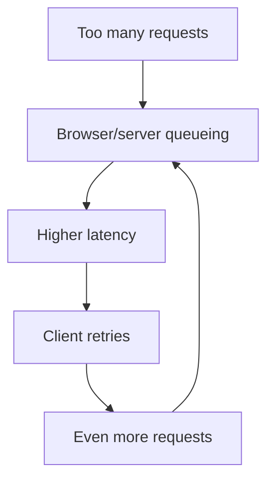

Ini loop berbahaya: overload → timeout → retry → overload lebih parah.

---

## 8. Concurrency Tidak Selalu Lebih Cepat

Parallel request bisa mengurangi waterfall. Tapi concurrency berlebihan bisa merusak.

Trade-off:

| Strategy | Benefit | Risiko |
|---|---|---|
| serial | sederhana, dependency jelas | latency total tinggi |
| full parallel | critical path lebih pendek | bandwidth/CPU/server pressure |
| bounded parallel | kontrol resource | butuh scheduler |
| batch | request count rendah | payload besar, coupling, partial failure sulit |
| streaming | first useful byte lebih cepat | protocol/UI complexity |
| cache reuse | zero network latency | stale/consistency risk |

Contoh bounded concurrency untuk operasi non-critical:

```ts
async function mapWithConcurrency<T, R>(
  items: T[],
  concurrency: number,
  worker: (item: T, index: number) => Promise<R>,
): Promise<R[]> {
  const results: R[] = new Array(items.length);
  let nextIndex = 0;

  async function runWorker() {
    while (nextIndex < items.length) {
      const index = nextIndex;
      nextIndex += 1;
      results[index] = await worker(items[index], index);
    }
  }

  const workers = Array.from(
    { length: Math.min(concurrency, items.length) },
    () => runWorker(),
  );

  await Promise.all(workers);
  return results;
}
```

Jangan gunakan ini untuk menutupi API N+1 yang seharusnya diperbaiki di contract.

Bounded concurrency adalah mitigasi, bukan alasan mempertahankan desain buruk.

---

## 9. Membaca Waterfall DevTools dengan Benar

Waterfall network biasanya punya bagian seperti:

- queueing/stalled,
- DNS lookup,
- initial connection,
- SSL/TLS,
- request sent,
- waiting/TTFB,
- content download.

Interpretasi:

| Gejala | Kemungkinan |
|---|---|
| queueing/stalled tinggi | terlalu banyak request, priority, connection reuse, browser scheduling |
| DNS/connection/TLS sering muncul | origin tersebar, koneksi tidak reused, cold connection |
| request sent lama | upload besar, network lambat |
| waiting/TTFB lama | server processing, upstream dependency, queue server, cold start |
| download lama | payload besar, bandwidth rendah, compression buruk |
| network cepat tapi UI lambat | parse/render/main thread/caching issue |
| banyak request kecil serial | component/route waterfall |
| preflight banyak | CORS + custom method/header/content-type |

PerformanceResourceTiming bisa membantu mengukur resource timing di browser.

Contoh observer:

```ts
type ResourceMetric = {
  name: string;
  initiatorType: string;
  duration: number;
  startTime: number;
  transferSize: number;
  encodedBodySize: number;
  decodedBodySize: number;
};

function observeResourceTiming(onMetric: (metric: ResourceMetric) => void) {
  const observer = new PerformanceObserver((list) => {
    for (const entry of list.getEntries()) {
      if (!(entry instanceof PerformanceResourceTiming)) {
        continue;
      }

      onMetric({
        name: entry.name,
        initiatorType: entry.initiatorType,
        duration: entry.duration,
        startTime: entry.startTime,
        transferSize: entry.transferSize,
        encodedBodySize: entry.encodedBodySize,
        decodedBodySize: entry.decodedBodySize,
      });
    }
  });

  observer.observe({ type: "resource", buffered: true });

  return () => observer.disconnect();
}
```

Catatan penting: untuk cross-origin resources, detail timing tertentu bisa dibatasi kecuali server mengirim header yang mengizinkan timing detail. Jadi jangan heran jika angka tidak lengkap di beberapa origin.

---

## 10. Instrumented Fetch untuk App-Level Latency

Resource timing memberi sudut browser. Tapi app tetap perlu mengukur lifecycle sendiri.

Contoh wrapper:

```ts
type FetchMetric = {
  requestId: string;
  method: string;
  path: string;
  status?: number;
  ok?: boolean;
  durationMs: number;
  errorKind?: "aborted" | "network" | "timeout" | "http" | "parse";
};

async function measuredFetch(
  request: Request,
  emitMetric: (metric: FetchMetric) => void,
): Promise<Response> {
  const startedAt = performance.now();
  const requestId = request.headers.get("x-request-id") ?? crypto.randomUUID();

  try {
    const response = await fetch(request);

    emitMetric({
      requestId,
      method: request.method,
      path: new URL(request.url).pathname,
      status: response.status,
      ok: response.ok,
      durationMs: performance.now() - startedAt,
    });

    return response;
  } catch (error) {
    const errorKind =
      error instanceof DOMException && error.name === "AbortError"
        ? "aborted"
        : "network";

    emitMetric({
      requestId,
      method: request.method,
      path: new URL(request.url).pathname,
      durationMs: performance.now() - startedAt,
      errorKind,
    });

    throw error;
  }
}
```

App-level metric menjawab:

- endpoint mana paling sering gagal,
- endpoint mana paling lambat di real user,
- request mana paling sering aborted,
- route mana memicu request terbanyak,
- status mana paling umum,
- mutation mana sering conflict,
- apakah deploy baru menaikkan latency.

Jangan hanya mengandalkan local DevTools.

Real user punya device, network, geography, extension, memory pressure, dan tab behavior yang berbeda.

---

## 11. Teknik Mengurangi Latency: Urutan yang Benar

Optimasi paling efektif biasanya bukan micro-optimization.

Urutan berpikir:

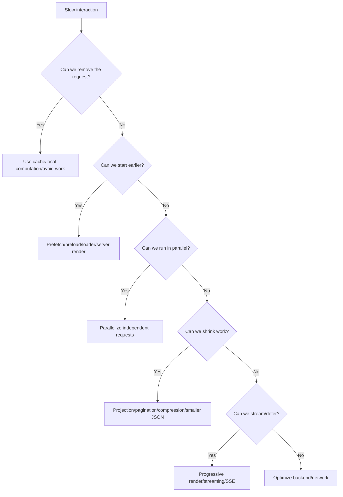

### 11.1 Remove request

Request tercepat adalah request yang tidak dikirim.

Contoh:

- resource sudah fresh di cache,
- data bisa dihitung dari response sebelumnya,
- route tidak membutuhkan panel sekunder sampai dibuka,
- keystroke bisa difilter lokal dulu,
- duplicate in-flight request bisa didedup.

### 11.2 Start earlier

Request yang sama bisa terasa lebih cepat jika dimulai sebelum user menunggu.

- prefetch saat link terlihat,
- prefetch saat hover/focus,
- load route data during navigation,
- server render route-critical data,
- warm query cache setelah login,
- speculative load berdasarkan strong signal.

### 11.3 Parallelize

Request independen jangan dibuat serial.

```ts
const [caseDetail, auditSummary, workflow] = await Promise.all([
  fetchCaseDetail(caseId),
  fetchAuditSummary(caseId),
  fetchWorkflowState(caseId),
]);
```

Tetapi jangan paralelkan request yang tidak dibutuhkan untuk first useful render.

### 11.4 Shrink

Payload besar membayar biaya dua kali:

1. transfer,
2. parse/render.

Strategi:

- pagination,
- projection fields,
- summary endpoint,
- compression,
- avoid huge nested arrays,
- use cursor not giant offset lists,
- avoid returning full domain aggregate for small UI update,
- send server-computed view model when appropriate.

### 11.5 Stream or defer

Jika data besar atau beberapa bagian lambat, jangan tahan seluruh page.

- stream HTML/RSC payload,
- defer non-critical panels,
- use Suspense boundaries,
- load secondary data lazily,
- show progressive sections.

---

## 12. Prefetch: Powerful tetapi Berbahaya

Prefetch adalah memulai request sebelum user benar-benar butuh.

Bagus jika signal kuat:

- user hover link,
- link masuk viewport,
- route berikutnya sangat mungkin,
- wizard step berikutnya deterministik,
- search result detail kemungkinan dibuka,
- dashboard tab default hampir selalu dibuka.

Buruk jika terlalu agresif:

- menghabiskan bandwidth,
- mencemari cache,
- membuat server load naik,
- mengganggu request penting,
- memuat data sensitif sebelum diperlukan,
- melanggar ekspektasi access/audit bila endpoint punya side effect buruk.

Prefetch harus punya policy:

```ts
type PrefetchPolicy = {
  enabled: boolean;
  minConfidence: number;
  maxAgeMs: number;
  networkAware: boolean;
  requiresUserIntent: boolean;
};
```

Rule of thumb:

- prefetch read-only resource,
- jangan prefetch mutation,
- hormati auth/permission boundary,
- batalkan prefetch non-critical bila user melakukan action penting,
- beri stale time yang jelas,
- jangan prefetch semua link dalam halaman besar.

---

## 13. Cache: Latency Optimization dengan Consistency Cost

Cache mengurangi latency karena menghindari network atau mengizinkan stale-while-refresh.

Tapi cache membawa cost:

- data bisa stale,
- invalidation sulit,
- user bisa melihat representation lama,
- permission berubah tapi cache belum bersih,
- mutation impact tidak selalu diketahui,
- tab lain bisa berbeda.

Model cache sehat:

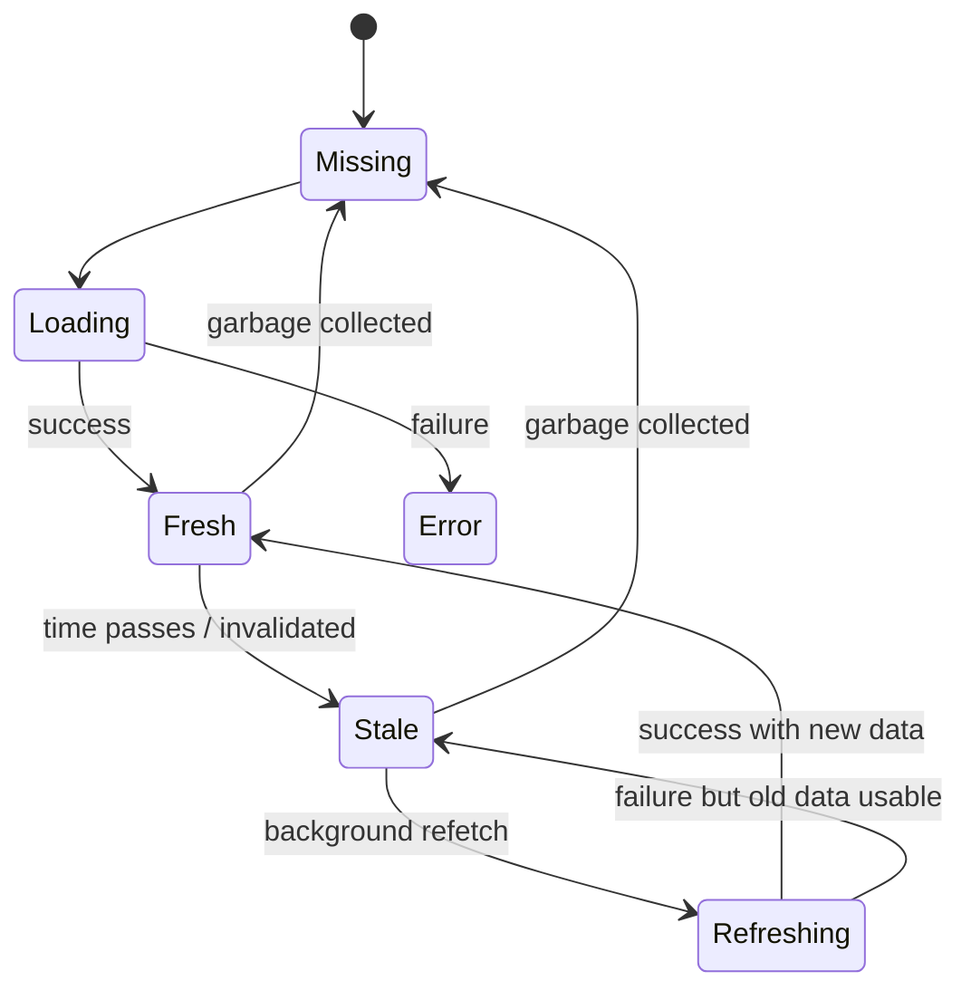

Pertanyaan sebelum cache:

1. Berapa lama data boleh stale?
2. Apa event yang membuat data invalid?
3. Apakah mutation response cukup untuk update cache?
4. Apakah data user-specific?
5. Apakah data permission-sensitive?
6. Apakah cache harus survive reload/tab?
7. Apa yang terjadi saat background refetch gagal?

Cache bukan hanya performance tool. Cache adalah consistency protocol.

---

## 14. Batching vs Overfetching vs Underfetching

Tiga masalah sering tertukar.

### Underfetching

Client harus call banyak endpoint untuk satu screen.

```txt
GET /case/123
GET /case/123/assignee
GET /case/123/audit-summary
GET /case/123/sla
GET /case/123/tags
```

### Overfetching

Client menerima field terlalu banyak.

```json
{
  "id": "case-123",
  "title": "...",
  "fullAuditLog": ["... thousands ..."],
  "allAttachments": ["..."],
  "internalNotes": ["..."],
  "hugeNestedDomainAggregate": {}
}
```

### Bad batching

Client menggabungkan semua agar request count rendah, tetapi membuat payload lambat dan coupling tinggi.

Better design:

- primary view model untuk above-the-fold,
- secondary panels lazy/deferred,
- batch endpoint untuk repeated small resources,
- projection parameter bila contract stabil,
- GraphQL/fragments jika domain cocok,
- route-specific BFF jika banyak composition di client.

Contoh route view model:

```ts
type CaseDetailPageModel = {
  case: {
    id: string;
    title: string;
    status: string;
    priority: string;
    assigneeName: string;
  };
  sla: {
    state: "OK" | "WARNING" | "BREACHED";
    dueAt: string;
  };
  permissions: {
    canEditPriority: boolean;
    canSubmit: boolean;
  };
};
```

Ini bukan berarti semua endpoint harus BFF. Artinya route-critical composition tidak selalu harus terjadi di browser.

---

## 15. CORS Preflight sebagai Latency Tax

Cross-origin request tertentu memicu preflight: browser mengirim `OPTIONS` untuk mengecek apakah actual request diizinkan.

Preflight bisa benar dan perlu. Tapi ia juga bisa menjadi latency tax jika terjadi tanpa sadar.

Pemicu umum:

- method selain simple method tertentu,
- custom headers,
- content type tertentu,
- credentialed cross-origin request dengan policy spesifik.

Dari sisi React engineer:

- jangan tambah custom header tanpa alasan,
- pahami bahwa `Authorization` atau `X-*` header bisa mengubah CORS behavior,
- gunakan same-origin API/BFF jika cocok,
- cache preflight di server bila aman,
- jangan debugging hanya actual request; lihat `OPTIONS` juga.

Waterfall dengan preflight:

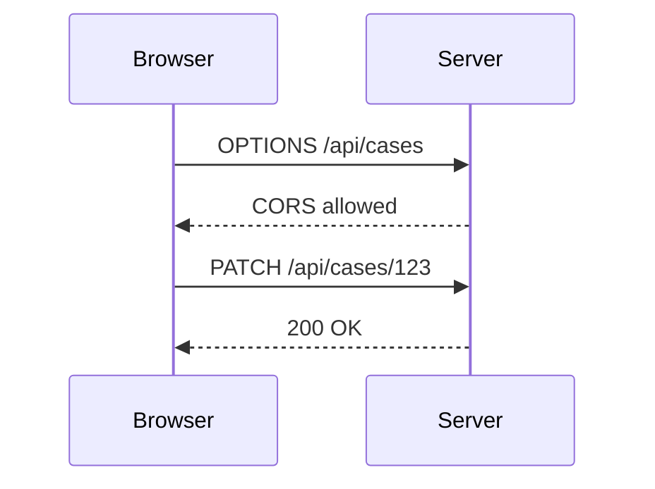

Jika endpoint kecil tapi setiap call butuh preflight, latency relatif bisa naik signifikan.

---

## 16. HTTP/2 dan HTTP/3 Tidak Menghapus Waterfall Aplikasi

Transport modern membantu multiplexing dan connection behavior.

Tetapi transport tidak menghapus dependency yang dibuat aplikasi.

Jika code kamu melakukan:

```ts
const user = await fetchUser();
const org = await fetchOrg(user.orgId);
const projects = await fetchProjects(org.id);
```

HTTP/2 atau HTTP/3 tidak bisa membuat `fetchProjects` mulai sebelum `org.id` diketahui.

Transport bisa membantu request independen berjalan lebih efisien, tetapi dependency graph tetap ditentukan aplikasi.

Jadi optimasi utama tetap:

- perbaiki data dependency,
- mulai request lebih awal,
- paralelkan yang independen,
- ubah contract bila terlalu banyak round trip,
- gunakan cache/stale data saat aman.

---

## 17. React-Specific Critical Path

Untuk React app, critical path sering terlihat seperti ini:

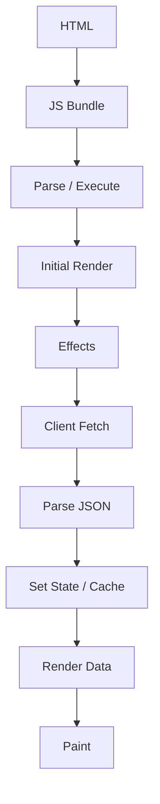

Jika data route-critical hanya dimulai di `useEffect`, ia berada setelah banyak pekerjaan.

Alternatif route-data critical path:

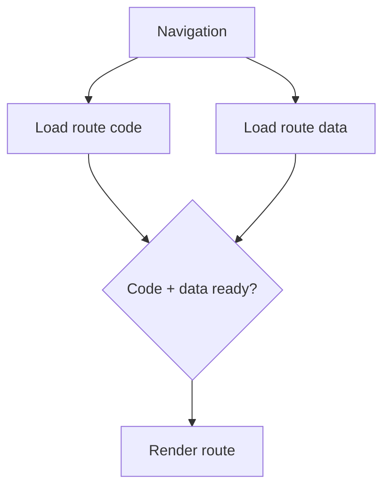

Alternatif server-rendered/streaming path:

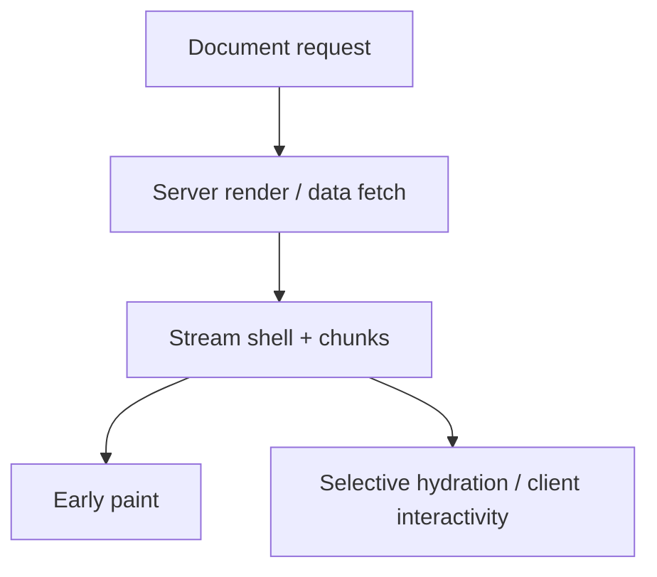

Tidak ada satu path terbaik untuk semua kasus.

Gunakan trade-off:

| Model | Kuat untuk | Risiko |
|---|---|---|
| client fetch in effect | simple local data | render-then-fetch waterfall |
| query prefetch | route transition cepat | cache complexity |
| route loader | navigation-bound data | route coupling |
| SSR | first paint/content | server load/hydration complexity |
| RSC | server-side data access + less client JS | framework/runtime boundary |
| streaming | progressive content | UI/protocol complexity |

---

## 18. Skeleton, Spinner, dan Perceived Latency

Performance tidak hanya angka. Perceived latency penting.

Tetapi jangan salah gunakan skeleton.

Skeleton bagus jika:

- layout sudah cukup pasti,
- data akan datang relatif cepat,
- user perlu tahu area sedang dimuat,
- tidak menyebabkan layout shift besar.

Skeleton buruk jika:

- ditampilkan terlalu lama,
- seluruh page skeleton padahal cached data tersedia,
- skeleton menggantikan data lama saat background refetch,
- skeleton menyembunyikan error/conflict,
- skeleton dipakai untuk menutupi waterfall buruk.

Better states:

| Situation | UI |
|---|---|
| no data yet, first load | skeleton |
| cached data stale | show cached data + refresh indicator |
| background refetch | subtle status, no reset |
| slow secondary panel | section-level skeleton |
| mutation pending | button-level pending / optimistic row state |
| offline | offline banner + queued indicator |

Jangan membuat user membayar latency dua kali: menunggu data lalu kehilangan konteks karena UI reset.

---

## 19. Case Study — Regulatory Case Dashboard

Misal dashboard punya:

- open case count,
- high priority list,
- SLA breach list,
- assigned-to-me list,
- recent audit events,
- notification summary,
- chart by status,
- search box.

Naive design:

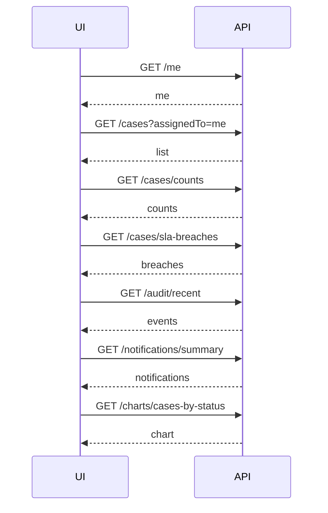

Masalah:

- terlalu banyak serial dependency,
- semua widget dianggap sama penting,
- tidak ada route-critical distinction,
- tidak ada stale cache,
- satu widget lambat bisa menahan whole dashboard bila state digabung,
- background refresh bisa reset semua.

Better design:

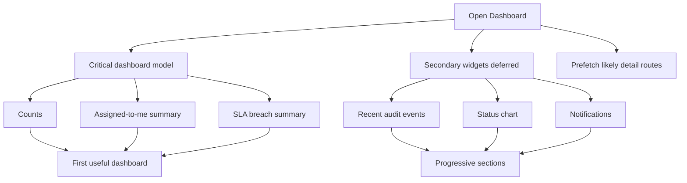

Possible endpoint contract:

```ts
type DashboardCriticalModel = {
  counts: {
    open: number;
    highPriority: number;
    slaBreached: number;
  };
  myCases: Array<{
    id: string;
    title: string;
    status: string;
    priority: string;
    updatedAt: string;
  }>;
  slaBreaches: Array<{
    id: string;
    title: string;
    dueAt: string;
    assigneeName: string;
  }>;
};
```

Secondary widgets bisa lazy:

```tsx
function DashboardPage() {
  const critical = useDashboardCriticalQuery();

  return (
    <DashboardShell>
      <CriticalDashboard data={critical.data} />
      <DeferredPanel title="Recent audit events">
        <RecentAuditEvents />
      </DeferredPanel>
      <DeferredPanel title="Case status chart">
        <CaseStatusChart />
      </DeferredPanel>
    </DashboardShell>
  );
}
```

Intinya bukan “buat satu endpoint besar”.

Intinya: pisahkan data yang menentukan first useful page dari data yang bisa menyusul.

---

## 20. Search Box: Latency, Cancellation, dan Throughput

Remote search adalah contoh kecil yang memuat banyak prinsip.

Naive:

```tsx
useEffect(() => {
  fetch(`/api/search?q=${term}`)
    .then((r) => r.json())
    .then(setResults);
}, [term]);
```

Masalah:

- request per keystroke,
- tidak ada debounce,
- tidak ada abort,
- stale response bisa menang,
- server terkena burst,
- tidak ada minimum query length,
- tidak ada cache untuk term yang sama,
- loading flicker.

Better design:

```tsx
function useDebouncedValue<T>(value: T, delayMs: number): T {
  const [debounced, setDebounced] = React.useState(value);

  React.useEffect(() => {
    const id = window.setTimeout(() => setDebounced(value), delayMs);
    return () => window.clearTimeout(id);
  }, [value, delayMs]);

  return debounced;
}

function SearchBox() {
  const [term, setTerm] = React.useState("");
  const debouncedTerm = useDebouncedValue(term.trim(), 250);
  const [results, setResults] = React.useState<string[]>([]);
  const [loading, setLoading] = React.useState(false);

  React.useEffect(() => {
    if (debouncedTerm.length < 3) {
      setResults([]);
      return;
    }

    const controller = new AbortController();

    async function run() {
      setLoading(true);

      try {
        const response = await fetch(
          `/api/search?q=${encodeURIComponent(debouncedTerm)}`,
          { signal: controller.signal },
        );

        if (!response.ok) {
          throw new Error(`Search failed: ${response.status}`);
        }

        setResults((await response.json()) as string[]);
      } catch (error) {
        if (error instanceof DOMException && error.name === "AbortError") {
          return;
        }

        throw error;
      } finally {
        if (!controller.signal.aborted) {
          setLoading(false);
        }
      }
    }

    void run();

    return () => controller.abort();
  }, [debouncedTerm]);

  return (
    <div>
      <input value={term} onChange={(event) => setTerm(event.target.value)} />
      {loading ? <span>Searching...</span> : null}
      <ul>{results.map((item) => <li key={item}>{item}</li>)}</ul>
    </div>
  );
}
```

Production version sebaiknya memakai query cache, request dedup, stale result guard, dan metric.

---

## 21. Mutation Performance: Jangan Selalu Refetch Everything

Setelah mutation, ada beberapa strategi:

| Strategi | Cocok untuk | Risiko |
|---|---|---|
| update cache from response | response membawa representation final | harus tahu query terdampak |
| invalidate specific queries | impact jelas tapi butuh server truth | network tambahan |
| invalidate broad scope | correctness lebih mudah | refetch storm |
| optimistic update | UX cepat | rollback/conflict complexity |
| background reconciliation | user tetap lanjut | stale sementara |

Contoh mutation update priority:

```ts
type UpdatePriorityResult = {
  case: {
    id: string;
    priority: "LOW" | "MEDIUM" | "HIGH";
    version: number;
    updatedAt: string;
  };
};
```

Jika response sudah membawa case representation baru, client bisa:

- update detail cache `case:123`,
- update item di list cache yang sedang visible,
- invalidate aggregate counts jika priority mempengaruhi count,
- background refetch audit panel.

Jangan otomatis:

```ts
invalidateQueries(); // semua query di seluruh app
```

Itu benar hanya sebagai fallback kasar, bukan default engineering.

---

## 22. Payload Size dan Parse Cost

Payload kecil bukan hanya menghemat bandwidth. Ia juga menghemat parse, memory, GC, dan render.

Gejala payload terlalu besar:

- download lama di network tab,
- `response.json()` terasa berat,
- main thread freeze setelah response,
- list render lambat,
- mobile device jauh lebih lambat dari laptop,
- memory naik drastis,
- DevTools menunjukkan JSON besar tapi UI hanya memakai sedikit field.

Checklist payload:

- apakah response mengirim field yang tidak dipakai?
- apakah nested array terlalu dalam?
- apakah pagination benar-benar diterapkan?
- apakah ada duplicate object besar?
- apakah date/string format terlalu verbose?
- apakah attachment/base64 ikut dalam JSON?
- apakah server mengirim audit log penuh padahal UI hanya butuh count?
- apakah compression aktif untuk textual payload?

Anti-pattern:

```json
{
  "case": {
    "id": "123",
    "title": "...",
    "auditLog": ["10000 items"],
    "attachments": [{ "base64": "..." }],
    "fullWorkflowHistory": ["..."],
    "allPermissionsForAllUsers": ["..."]
  }
}
```

Better:

```json
{
  "case": {
    "id": "123",
    "title": "...",
    "status": "OPEN",
    "auditSummary": {
      "totalEvents": 183,
      "lastEventAt": "2026-07-07T04:30:00Z"
    },
    "attachmentSummary": {
      "total": 12
    }
  }
}
```

Load detail panel saat user membukanya.

---

## 23. Request Priority dan Criticality

Tidak semua request sama penting.

Classify:

| Class | Contoh | Policy |
|---|---|---|
| critical navigation | route model, auth/session shell | start early, avoid blocking by secondary |
| interaction response | save button, search result | deadline/cancel/retry carefully |
| background freshness | refetch stale data | low disruption |
| speculative | prefetch likely route | abort/drop under pressure |
| analytics | RUM/logging | send later/batch/beacon if suitable |
| secondary panel | audit widget, chart | lazy/defer |

Dalam code, jangan semua request memakai policy sama.

```ts
type RequestCriticality = "critical" | "interactive" | "background" | "speculative";

type NetworkPolicy = {
  timeoutMs: number;
  retry: boolean;
  canPrefetch: boolean;
  showGlobalLoading: boolean;
};

const policies: Record<RequestCriticality, NetworkPolicy> = {
  critical: {
    timeoutMs: 5000,
    retry: true,
    canPrefetch: true,
    showGlobalLoading: true,
  },
  interactive: {
    timeoutMs: 3000,
    retry: false,
    canPrefetch: false,
    showGlobalLoading: false,
  },
  background: {
    timeoutMs: 8000,
    retry: true,
    canPrefetch: false,
    showGlobalLoading: false,
  },
  speculative: {
    timeoutMs: 2000,
    retry: false,
    canPrefetch: true,
    showGlobalLoading: false,
  },
};
```

Nilai angka di atas bukan universal. Yang penting adalah request class punya kebijakan berbeda.

---

## 24. Backpressure dari Client

Client juga harus sopan terhadap server.

Backpressure berarti client tidak terus mengirim kerja saat sistem tidak siap.

Contoh:

- disable submit saat mutation pending,
- debounce search,
- cancel obsolete request,
- stop polling saat tab hidden bila tidak critical,
- exponential backoff untuk retry,
- respect `Retry-After`,
- cap parallel uploads,
- pause sync queue saat offline/poor network,
- avoid retry storm after outage.

Bad retry:

```ts
while (true) {
  try {
    return await fetchData();
  } catch {
    // immediately retry forever
  }
}
```

Better conceptual retry:

```ts
function sleep(ms: number) {
  return new Promise((resolve) => window.setTimeout(resolve, ms));
}

async function retryWithBackoff<T>(
  operation: () => Promise<T>,
  options: { attempts: number; baseDelayMs: number; signal?: AbortSignal },
): Promise<T> {
  let lastError: unknown;

  for (let attempt = 1; attempt <= options.attempts; attempt += 1) {
    if (options.signal?.aborted) {
      throw options.signal.reason;
    }

    try {
      return await operation();
    } catch (error) {
      lastError = error;

      if (attempt === options.attempts) {
        break;
      }

      const jitter = Math.random() * options.baseDelayMs;
      const delay = options.baseDelayMs * 2 ** (attempt - 1) + jitter;
      await sleep(delay);
    }
  }

  throw lastError;
}
```

Retry akan dibahas lebih dalam di Part 014.

---

## 25. Polling dan Throughput Cost

Polling terlihat sederhana:

```ts
setInterval(fetchNotifications, 5000);
```

Tapi pada skala besar:

```txt
100,000 active clients / 5 seconds = 20,000 requests per second
```

Polling harus punya policy:

- interval adaptif,
- pause saat tab hidden bila aman,
- backoff saat error,
- jitter agar tidak semua client serentak,
- stop saat user logout,
- switch ke SSE/WebSocket jika use case realtime dan scale cocok,
- poll lightweight endpoint, bukan full payload besar.

Jitter contoh:

```ts
function withJitter(baseMs: number, ratio = 0.2): number {
  const spread = baseMs * ratio;
  return baseMs - spread / 2 + Math.random() * spread;
}
```

Tanpa jitter, client bisa membuat thundering herd setiap interval.

---

## 26. Waterfall Review Checklist

Saat melihat route lambat, jangan langsung rewrite.

Gunakan checklist:

### 26.1 Request count

- Berapa request terjadi untuk satu route transition?
- Berapa yang critical?
- Berapa yang secondary?
- Berapa yang duplicate?
- Berapa yang speculative?

### 26.2 Dependency graph

- Request mana yang benar-benar bergantung pada response sebelumnya?
- Dependency mana yang hanya akibat component nesting?
- Parameter mana sudah tersedia dari URL/session?
- Bisa loader/server compose lebih awal?

### 26.3 Timing phase

- Waktu hilang di queueing, DNS, connection, TTFB, download, parse, atau render?
- Apakah cross-origin timing visible?
- Apakah ada preflight?

### 26.4 Payload

- Berapa transfer size?
- Berapa decoded size?
- Apakah response overfetch?
- Apakah pagination/projection ada?

### 26.5 Cache

- Apakah data fresh sudah tersedia?
- Mengapa request tetap dikirim?
- Apakah stale time terlalu pendek?
- Apakah invalidation terlalu luas?

### 26.6 UX

- Apakah user melihat blank page?
- Apakah data lama bisa dipakai sementara?
- Apakah secondary panel boleh menyusul?
- Apakah loading state terlalu kasar?

---

## 27. Pattern: Route Critical Data First

Untuk route data-heavy, pecah menjadi:

1. critical model,
2. secondary widgets,
3. background freshness,
4. speculative next navigation.

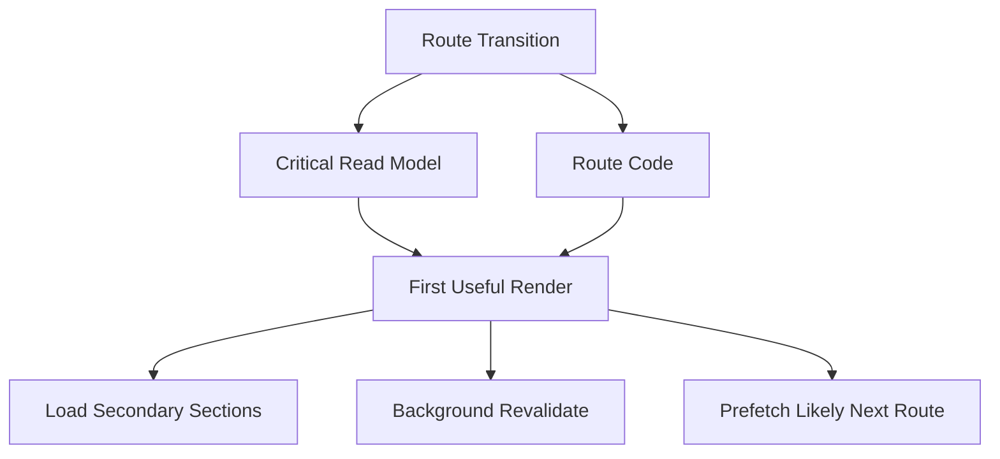

Contoh:

```ts
type CasePageCritical = {
  case: {
    id: string;
    title: string;
    status: string;
    priority: string;
  };
  permissions: {
    canEdit: boolean;
    canEscalate: boolean;
  };
  sla: {
    state: string;
    dueAt: string;
  };
};
```

Secondary:

- full audit log,
- attachment list,
- related cases,
- comments,
- recommendation engine output.

Jangan tahan title/status/permission hanya karena recommendation panel lambat.

---

## 28. Pattern: Parallel Route Loader

Jika memakai route-level loading, jangan serialkan hal independen.

Bad:

```ts
export async function loader({ params }: LoaderArgs) {
  const detail = await getCaseDetail(params.caseId);
  const audit = await getAuditSummary(params.caseId);
  const workflow = await getWorkflowState(params.caseId);

  return { detail, audit, workflow };
}
```

Better:

```ts
export async function loader({ params }: LoaderArgs) {
  const caseId = requireCaseId(params);

  const [detail, audit, workflow] = await Promise.all([
    getCaseDetail(caseId),
    getAuditSummary(caseId),
    getWorkflowState(caseId),
  ]);

  return { detail, audit, workflow };
}
```

Even better jika audit/workflow tidak critical:

```ts
export async function loader({ params }: LoaderArgs) {
  const caseId = requireCaseId(params);

  return {
    detail: await getCaseDetail(caseId),
    auditPromise: getAuditSummary(caseId),
    workflowPromise: getWorkflowState(caseId),
  };
}
```

Framework detail berbeda-beda, tapi prinsipnya sama: jangan block critical render oleh data sekunder.

---

## 29. Pattern: Request Coalescing

Jika banyak component meminta resource yang sama, request harus digabung.

Bad:

```txt
CaseHeader -> GET /cases/123
CaseSidebar -> GET /cases/123
CaseActions -> GET /cases/123
```

Better:

- query cache dengan query key sama,
- route loader menyediakan data,
- parent boundary fetch sekali,
- request dedup in fetch client.

Contoh dedup sederhana:

```ts
class InFlightDeduper {
  private readonly inFlight = new Map<string, Promise<unknown>>();

  run<T>(key: string, operation: () => Promise<T>): Promise<T> {
    const existing = this.inFlight.get(key);

    if (existing) {
      return existing as Promise<T>;
    }

    const promise = operation().finally(() => {
      this.inFlight.delete(key);
    });

    this.inFlight.set(key, promise);
    return promise;
  }
}
```

Dedup hanya aman jika request truly equivalent:

- same method,
- same URL,
- same query,
- same auth context,
- same headers that affect representation,
- same body untuk mutation sangat hati-hati.

Untuk mutation, dedup berbeda dari idempotency.

---

## 30. Pattern: Stale-While-Revalidate UI

Saat cache punya data lama, jangan selalu kosongkan UI.

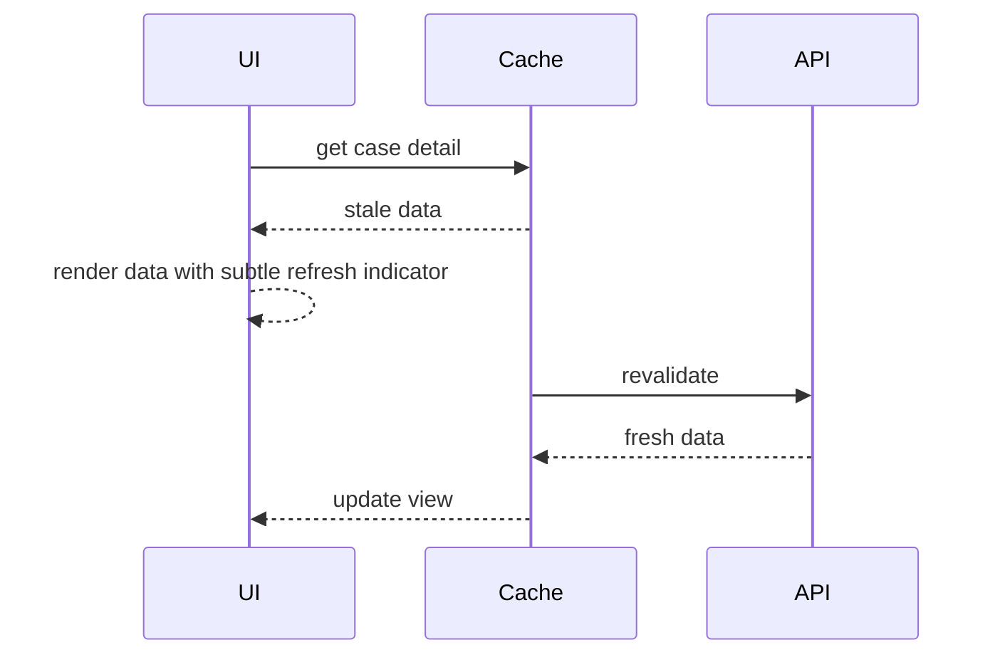

UX benefit:

- user langsung melihat konteks,
- layout stabil,
- background refresh tidak mengganggu,
- perceived latency turun drastis.

Risiko:

- user bisa melihat data lama,
- action buttons mungkin tidak valid lagi,
- permission-sensitive data harus hati-hati,
- mutation perlu version/conflict handling.

Jadi stale-while-revalidate cocok untuk read model yang tolerate stale. Tidak cocok untuk semua boundary.

---

## 31. Pattern: Progressive Panels

Untuk halaman kompleks, gunakan section-level lifecycle.

```tsx
function CaseDetailPage() {
  return (
    <CasePageLayout>
      <CaseHeader />
      <CaseMainFacts />
      <CaseActions />

      <ProgressiveSection title="Audit trail">
        <AuditTrail />
      </ProgressiveSection>

      <ProgressiveSection title="Related cases">
        <RelatedCases />
      </ProgressiveSection>
    </CasePageLayout>
  );
}
```

Setiap section punya:

- data requirement,
- loading state,
- error state,
- retry behavior,
- cache key,
- observability.

Jangan membuat satu global `isLoading` untuk seluruh page jika data punya criticality berbeda.

---

## 32. Performance Failure Modes

| Failure mode | Gejala | Solusi struktural |
|---|---|---|
| render-then-fetch | blank/skeleton lama | loader/prefetch/server render |
| parent-child waterfall | request serial | hoist data requirement / route compose |
| N+1 item request | banyak request kecil | batch/projection/summary endpoint |
| overfetch | download/parse besar | projection/pagination/view model |
| broad invalidation | refetch storm | targeted invalidation/update cache |
| retry storm | outage makin buruk | backoff/jitter/respect retry-after |
| prefetch overload | bandwidth/server naik | confidence-based prefetch |
| polling herd | traffic spike berkala | jitter/adaptive interval/SSE |
| stale overwrite | UI balik ke data lama | cancellation/query identity |
| hidden parse cost | network cepat UI freeze | shrink payload / worker / pagination |
| secondary blocking | page menunggu widget | progressive panels/defer |
| duplicate request | same resource fetched repeatedly | cache/dedup/coalescing |

---

## 33. Observability Dimensions

Untuk setiap route/interaction penting, ukur:

| Metric | Arti |
|---|---|
| request count per route | apakah route terlalu chatty |
| critical request duration | request yang menentukan first useful render |
| total route transition time | perceived navigation cost |
| abort rate | request obsolete/navigation/search churn |
| retry rate | instability atau policy terlalu agresif |
| status distribution | 4xx/5xx/429/conflict behavior |
| payload size | transfer/parse risk |
| cache hit rate | efektivitas stale/fresh policy |
| refetch after mutation count | invalidation cost |
| time to data visible | network + parse + render |
| background refetch failure rate | stale data risk |

Metric tanpa dimension kurang berguna.

Tambahkan dimension seperti:

- route id,
- endpoint group,
- request criticality,
- network type bila tersedia,
- device class bila tersedia,
- app version,
- feature flag,
- status code,
- cache hit/miss,
- aborted vs failed.

---

## 34. A Practical Waterfall Review Example

Misal DevTools menunjukkan:

```txt
GET /api/session               220 ms
GET /api/me                    180 ms
GET /api/cases?assignedTo=42   420 ms
GET /api/cases/counts          300 ms
GET /api/permissions           250 ms
GET /api/notifications         500 ms
GET /api/audit/recent          900 ms
```

Naive conclusion:

> audit endpoint lambat.

Better analysis:

1. Apakah audit critical untuk first render?
2. Apakah `/session`, `/me`, dan `/permissions` bisa digabung atau dihydrate?
3. Apakah `/cases` benar-benar harus menunggu `/me`, atau user id sudah ada di session model?
4. Apakah counts dan cases bisa paralel?
5. Apakah notifications perlu route-blocking?
6. Apakah audit bisa section-level deferred?
7. Apakah `/permissions` harus separate endpoint atau bagian dari route view model?

Potential redesign:

```txt
GET /api/dashboard/critical    450 ms
GET /api/notifications         background
GET /api/audit/recent          deferred panel
```

Atau:

```txt
loader parallel:
  session+permissions hydrated/server-side
  cases + counts parallel
  audit deferred
```

Performance work sering berarti mengubah dependency graph, bukan mengoptimalkan satu endpoint.

---

## 35. Engineering Invariants

Simpan invariant berikut:

1. **Latency bukan satu angka.** Pisahkan queueing, connection, TTFB, download, parse, render, dan paint.
2. **Waterfall adalah dependency bug sampai terbukti sebaliknya.** Banyak serial request berasal dari struktur UI, bukan kebutuhan domain.
3. **Request tercepat adalah request yang tidak dikirim.** Cache, dedup, dan local computation adalah optimasi besar.
4. **Mulai lebih awal sering lebih efektif daripada membuat endpoint sedikit lebih cepat.** Prefetch/loader/server render bisa mengubah critical path.
5. **Parallelism punya batas.** Terlalu banyak concurrency membuat queueing, contention, dan retry storm.
6. **Payload besar membayar biaya transfer dan CPU.** Jangan ukur network saja.
7. **Cache mengurangi latency dengan biaya consistency.** Jangan pakai cache tanpa invalidation model.
8. **Prefetch harus berbasis confidence.** Aggressive prefetch bisa merusak throughput.
9. **Mutation performance bukan selalu refetch everything.** Pilih update, invalidate targeted, atau background reconcile.
10. **Observability harus mengukur perceived lifecycle, bukan hanya server duration.** User menunggu sampai data terlihat.

---

## 36. Kesimpulan

React client-server performance adalah permainan pipeline.

Kamu harus tahu:

- request mana yang critical,
- request mana yang bisa ditunda,
- request mana yang bisa dihapus,
- request mana yang bisa diparalelkan,
- data mana yang bisa stale,
- payload mana yang terlalu besar,
- mutation mana yang menyebabkan refetch storm,
- prefetch mana yang berguna dan mana yang boros,
- error/retry mana yang memperburuk throughput,
- metric mana yang membuktikan semua itu di real user.

Jangan hanya bertanya:

> “Endpoint mana yang lambat?”

Tanyakan:

> “Apa critical path user, dan keputusan client-server mana yang membuatnya panjang?”

Di Part 007, kita akan membahas **client-server ownership model**: siapa pemilik data, siapa pemilik state, siapa pemilik validation, siapa pemilik side effect, dan bagaimana menentukan boundary agar aplikasi React tidak berubah menjadi salinan rapuh dari backend.

---

## Referensi Resmi

- MDN Web Docs — PerformanceResourceTiming: https://developer.mozilla.org/en-US/docs/Web/API/PerformanceResourceTiming
- MDN Web Docs — PerformanceResourceTiming initiatorType: https://developer.mozilla.org/en-US/docs/Web/API/PerformanceResourceTiming/initiatorType
- MDN Web Docs — Fetch API: https://developer.mozilla.org/en-US/docs/Web/API/Fetch_API
- MDN Web Docs — CORS: https://developer.mozilla.org/en-US/docs/Web/HTTP/CORS
- web.dev — Optimize resource loading: https://web.dev/learn/performance/optimize-resource-loading
- web.dev — Understand the critical path: https://web.dev/learn/performance/understanding-the-critical-path
- RFC 9110 — HTTP Semantics: https://www.rfc-editor.org/rfc/rfc9110.html
- RFC 9114 — HTTP/3: https://www.rfc-editor.org/rfc/rfc9114.html
