# Part 007 — Client-Server Ownership Model

Sebelum memilih Fetch API, React Query, Router loader, GraphQL, REST, Server Components, atau WebSocket, kamu harus menjawab pertanyaan yang lebih fundamental:

> Untuk setiap potongan data dan keputusan, siapa pemilik kebenarannya?

Bukan “di mana data disimpan”.
Bukan “library apa yang dipakai”.
Bukan “state ini masuk Context, Redux, Zustand, TanStack Query, atau local component state”.

Pertanyaannya adalah:

> Ketika ada konflik, keterlambatan, stale value, retry, optimistic update, offline mutation, atau response yang berbeda dari asumsi client, pihak mana yang berhak menentukan kebenaran akhir?

Itulah **ownership model**.

React app production biasanya rusak bukan karena engineer tidak tahu `fetch()`.
Ia rusak karena ownership-nya kabur:

- client menganggap dirinya pemilik data yang sebenarnya milik server,
- server mengubah shape tanpa contract yang jelas,
- cache dianggap sama dengan truth,
- optimistic UI dianggap sama dengan committed mutation,
- URL state, form draft, dan server state dicampur dalam satu global store,
- authorization decision dihitung di client lalu dipercaya server,
- realtime event dianggap snapshot lengkap padahal hanya delta,
- retry mutation membuat double submit karena operation tidak idempotent,
- error 409, 422, 401, dan 500 diperlakukan sama sebagai “toast error”.

Part ini membangun fondasi agar kamu bisa melihat data bukan sebagai variable, tetapi sebagai **state yang punya owner, lifecycle, authority, replication rule, dan failure mode**.

---

## 1. Thesis Utama

**Client-server communication adalah sistem replikasi kecil.**

Setiap kali React membaca data dari server, client sedang membuat replica lokal dari state yang dimiliki pihak lain.
Setiap kali React mengirim mutation, client sedang mengajukan command agar owner mengubah state.
Setiap kali React melakukan optimistic update, client sedang membuat prediksi sementara terhadap hasil command.
Setiap kali React menerima realtime event, client sedang mencoba menyelaraskan replica dengan perubahan yang terjadi di luar dirinya.

Model mentalnya:

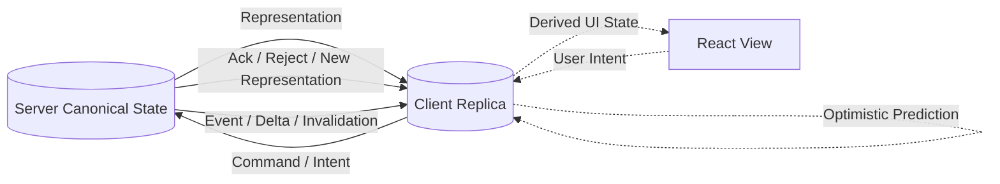

Server state yang ada di React bukan source of truth.
Ia adalah **replica**.

Replica boleh cepat, responsif, dan berguna.
Tapi replica bisa stale, incomplete, speculative, partially updated, atau invalid.

Aplikasi yang matang selalu tahu kapan data di client adalah:

1. **canonical** — kebenaran lokal yang memang dimiliki client,
2. **replica** — salinan dari server,
3. **derived** — hasil perhitungan dari state lain,
4. **draft** — working copy yang belum dikirim,
5. **optimistic** — prediksi sebelum server commit,
6. **pending** — intent yang sedang dieksekusi,
7. **invalidated** — sudah tidak boleh dipercaya penuh,
8. **conflicted** — tidak bisa digabung otomatis,
9. **ephemeral** — hanya relevan untuk UI sesaat.

Kalau kategori ini dicampur, bug-nya tidak terlihat di unit test sederhana, tapi muncul di production ketika user membuka banyak tab, koneksi lambat, server mengubah data, permission berubah, atau mutation gagal setengah jalan.

---

## 2. Ownership Bukan Storage Location

Kesalahan umum:

> “Data ini ada di React state, berarti client owner.”

Salah.

Ownership bukan lokasi penyimpanan.
Ownership adalah **authority to decide final truth**.

Contoh:

| Data | Bisa ada di client? | Owner sebenarnya | Kenapa |
|---|---:|---|---|
| input pencarian di search box | yes | client | server tidak perlu memutuskan apa yang sedang diketik user |
| daftar invoice dari `/api/invoices` | yes | server | server menentukan isi, permission, status, dan versi |
| selected tab | yes | client atau URL | tergantung apakah state harus shareable/bookmarkable |
| access token expiry | yes | identity server/session authority | client hanya mengetahui representasi terbatas |
| total unpaid balance | yes | server | angka finansial tidak boleh dihitung final dari client cache |
| optimistic todo title | yes | client temporarily | hanya prediksi sampai server accept/reject |
| feature flag value | yes | flag service/config owner | client hanya consumer snapshot |
| uploaded file metadata | yes | storage/file service | client tidak menentukan final checksum/scan status |
| validation error | yes | server for domain rules, client for local UX rules | dua jenis validation punya owner berbeda |

React state adalah container.
Query cache adalah replica store.
Global store adalah memory coordination mechanism.
LocalStorage adalah persistence primitive.
URL adalah addressable navigation state.
Tidak satu pun otomatis menjadi owner kebenaran domain.

### Rule

> Data owner adalah pihak yang boleh menolak, mengoreksi, atau mengganti nilai ketika terjadi konflik.

Kalau server boleh mengubah response menjadi nilai lain, maka server owner.
Kalau client boleh mengabaikan server dan tetap benar, maka client owner.
Kalau keduanya punya sebagian authority, kamu butuh split model.

---

## 3. Tiga Boundary: Presentation, Interaction, Authority

Untuk setiap data, pisahkan tiga boundary:

1. **Presentation boundary** — bagaimana data ditampilkan.
2. **Interaction boundary** — bagaimana user mengubah intent/draft.
3. **Authority boundary** — siapa yang memutuskan state final.

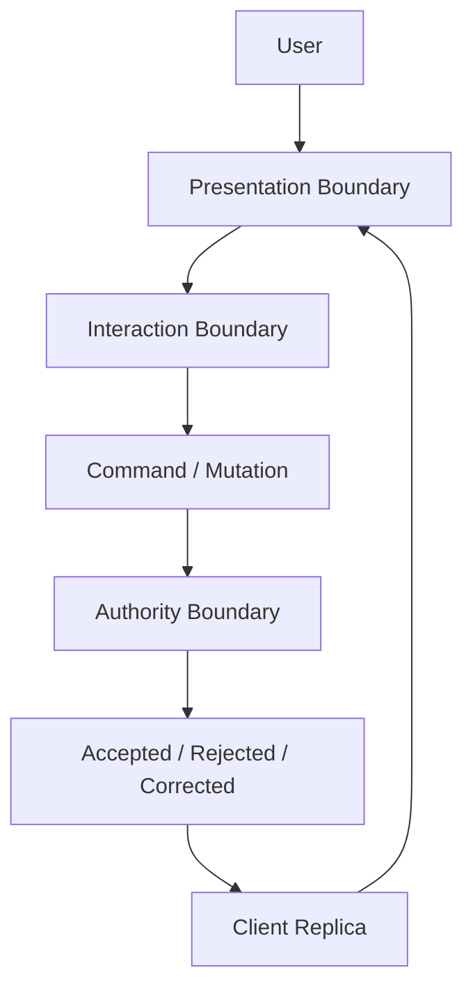

Contoh edit profile:

- Presentation: form menampilkan `name`, `email`, `timezone`.
- Interaction: user mengetik draft di input.
- Authority: server memutuskan apakah email valid, unique, boleh diubah, dan bagaimana normalization dilakukan.

Client boleh punya draft `email = " ALICE@EXAMPLE.COM "`.
Server bisa menyimpan `alice@example.com`.
Server juga bisa reject karena email sudah dipakai.

Jika UI menganggap draft sama dengan committed value, bug muncul:

- tampilan sukses palsu,
- cache berisi nilai yang tidak pernah disimpan,
- halaman lain menampilkan data lama,
- user menutup tab sebelum reconciliation,
- audit trail tidak sesuai dengan apa yang user lihat.

---

## 4. Taxonomy State dalam React Client-Server App

Kita butuh taxonomy yang lebih presisi daripada “local vs global”.

### 4.1 Local UI State

State yang hanya mempengaruhi presentasi lokal.

Contoh:

- modal open/closed,
- accordion expanded,
- hover state,
- focused field,
- local animation phase,
- temporary UI disclosure.

Owner: **client UI**.

Lifecycle: pendek.
Persistence: biasanya tidak perlu.
Server involvement: tidak ada.

Salah desain jika state ini dikirim ke server tanpa alasan.

### 4.2 Form Draft State

Working copy dari input user sebelum mutation.

Contoh:

- form edit profile,
- draft comment,
- partially filled wizard,
- selected files before upload,
- unsaved table row edits.

Owner sementara: **client interaction layer**.
Owner final setelah submit: biasanya **server**.

Draft bukan server state.
Draft juga bukan committed fact.

Pattern yang sehat:

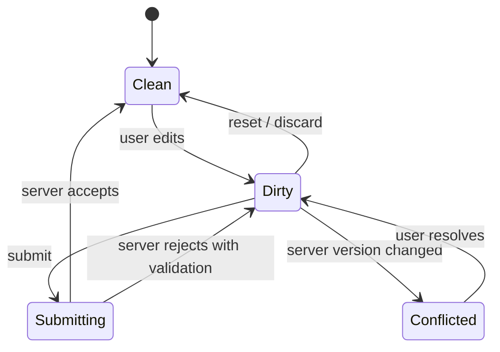

### 4.3 Server State Replica

Data yang berasal dari server dan direplikasi ke client.

Contoh:

- user profile,
- product list,
- case detail,
- account balance,
- notification count,
- dashboard metrics,
- permissions snapshot.

Owner: **server/domain service**.

Client boleh cache, transform, paginate, dan render.
Client tidak boleh menganggap replica sebagai authority final.

Karakteristik server state:

- remote,
- asynchronous,
- shared by many users/devices/tabs,
- can become stale,
- can fail to fetch,
- can be partially available,
- may require authorization,
- may change without current tab initiating it.

### 4.4 Derived State

State yang dihitung dari state lain.

Contoh:

- `total = items.reduce(...)`,
- grouped records,
- filtered table result,
- `canSubmit = isDirty && isValid && !isSubmitting`,
- label computed from status.

Owner: **owner dari input state**.

Derived state sebaiknya tidak disimpan sebagai independent truth kecuali ada alasan performa atau caching yang jelas.

Bug umum:

```tsx
const [items, setItems] = useState<Item[]>([]);
const [total, setTotal] = useState(0);
```

Jika `total` bisa dihitung dari `items`, menyimpannya terpisah berarti membuat dua truth yang bisa diverge.

### 4.5 URL State

State yang menjadi bagian dari addressability.

Contoh:

- pagination page,
- search query,
- selected tab yang shareable,
- filter dashboard,
- sort order,
- entity id,
- active route.

Owner: **URL/navigation model**.

URL state penting karena:

- bisa di-bookmark,
- bisa di-share,
- survive refresh,
- back/forward button bekerja,
- route loader bisa membaca requirement data sebelum render.

Jangan sembunyikan navigational state penting di component memory jika user berharap link bisa merepresentasikan view.

### 4.6 Session and Identity Snapshot

State terkait sesi dan identity.

Contoh:

- logged-in user display name,
- session expiry timestamp,
- tenant id,
- role snapshot,
- active organization,
- CSRF token,
- cookie credential state.

Owner: **identity/session authority**.

Client hanya memegang snapshot atau transport artifact.
Security decision final harus tetap di server.

### 4.7 Optimistic State

State prediksi sebelum server mengonfirmasi mutation.

Contoh:

- item langsung muncul setelah user klik “Add”,
- like count naik sebelum response,
- row status berubah menjadi “approved” sementara,
- comment tampil dengan status pending.

Owner: **client temporarily owns prediction; server owns fact**.

Optimistic state wajib punya strategy:

- rollback,
- reconcile,
- retry,
- conflict display,
- temporary id mapping,
- idempotency key,
- pending marker.

Tanpa itu, optimistic UI berubah menjadi corruption layer.

### 4.8 Realtime Event State

State dari event stream, WebSocket, SSE, push channel, atau subscription.

Owner: **event producer / domain service**.

Client perlu tahu event itu:

- snapshot penuh atau delta,
- ordered atau unordered,
- at-most-once, at-least-once, atau best-effort,
- replayable atau ephemeral,
- punya version/cursor atau tidak,
- boleh dipakai untuk update cache langsung atau hanya invalidation signal.

Realtime event bukan otomatis truth lengkap.

---

## 5. Ownership Matrix

Gunakan matrix ini sebelum menulis code.

| Question | Kalau jawabannya “yes” | Implikasi |
|---|---|---|
| Apakah server boleh menolak nilai ini? | server owner | treat client value as draft/intent |
| Apakah nilai bisa berubah dari device lain? | server/shared owner | cache can become stale |
| Apakah nilai harus survive reload/share link? | URL/persistent owner | encode into URL or persistence |
| Apakah nilai hanya visual sementara? | client UI owner | keep local, do not globalize |
| Apakah nilai mempengaruhi security? | server/security owner | never trust client decision |
| Apakah nilai hasil perhitungan data lain? | derived owner | compute, avoid duplicate storage |
| Apakah nilai bisa optimistic? | temporary client prediction | require rollback/reconcile |
| Apakah nilai bagian dari command outcome? | server mutation owner | require ack/reject handling |
| Apakah nilai perlu auditability? | server/system owner | require explicit command and trace |

Dalam desain production, matrix ini lebih penting daripada diskusi “pakai library X atau Y”.

---

## 6. Source of Truth yang Benar

React documentation klasik sering menyebut “single source of truth” untuk state yang dibagi antar component. Dalam aplikasi client-server, konsep ini harus dinaikkan levelnya.

Di satu component tree, source of truth bisa parent state.
Di satu tab browser, source of truth bisa query cache.
Di satu route, source of truth bisa URL.
Di satu domain, source of truth bisa service/database.
Di satu security boundary, source of truth harus server.

Jadi pertanyaan yang benar bukan:

> Apa single source of truth-nya?

Melainkan:

> Single source of truth untuk boundary apa?

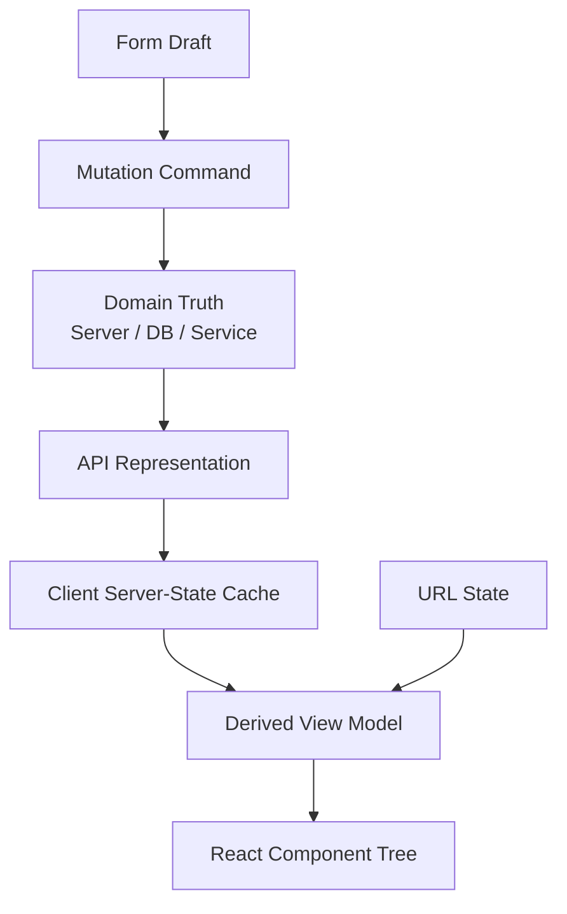

Setiap layer punya truth lokal, tetapi tidak semuanya punya authority domain.

### Contoh salah

```tsx
// Anti-pattern: server state dijadikan global mutable truth tanpa lifecycle.
const useUserStore = create((set) => ({
  user: null,
  setUser: (user) => set({ user }),
}));
```

Masalahnya bukan Zustand/Redux/Context.
Masalahnya: store ini tidak menjawab:

- kapan `user` stale,
- siapa yang refetch,
- bagaimana invalidation setelah mutation,
- apa yang terjadi saat 401,
- apakah tab lain sudah logout,
- apakah permission berubah,
- apakah response parsial,
- apakah data berasal dari tenant yang benar.

### Contoh lebih sehat

```tsx
function useCurrentUser() {
  return useQuery({
    queryKey: ['current-user'],
    queryFn: fetchCurrentUser,
    staleTime: 60_000,
  });
}
```

Query cache tetap bukan owner truth.
Tapi ia mengakui bahwa data remote punya lifecycle: loading, stale, refetch, error, invalidation, garbage collection.

---

## 7. Read Ownership vs Write Ownership

Sering kali data yang sama punya read owner dan write owner yang berbeda secara workflow.

Contoh: profile.

- Read representation: `/me` endpoint memberi snapshot profile.
- Write command: `PATCH /me` menerima perubahan terbatas.
- Domain owner: user service.
- Validation owner: user service + identity policy.
- View owner: React page.
- Draft owner: form.

Jangan desain mutation sebagai “client mengirim seluruh object yang tadi dibaca”.
Itu rawan lost update.

Buruk:

```http
PUT /api/profile
Content-Type: application/json

{
  "id": "u_123",
  "email": "alice@example.com",
  "name": "Alice",
  "role": "admin",
  "createdAt": "2025-01-01T00:00:00Z"
}
```

Client mengirim field yang tidak semestinya dia miliki.
Lebih sehat:

```http
PATCH /api/profile
Content-Type: application/json
If-Match: "profile-version-12"

{
  "displayName": "Alice Tan"
}
```

Read model dan write model tidak harus sama.

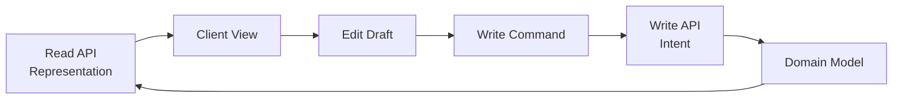

### Rule

> Read model menjawab “apa yang perlu ditampilkan”. Write model menjawab “perubahan apa yang diminta”. Jangan menyamakan keduanya tanpa alasan.

---

## 8. Command, Not Remote Object Mutation

Di React app sederhana, mutation sering dianggap sebagai “ubah object di server”.
Di sistem matang, mutation adalah **command**.

Command punya:

- actor,
- intent,
- target,
- expected version,
- idempotency key,
- validation context,
- authorization context,
- timestamp/correlation id,
- resulting state atau acknowledgement.

Contoh command yang eksplisit:

```json
{
  "commandId": "cmd_01J...",
  "caseId": "case_123",
  "expectedVersion": 17,
  "action": "ESCALATE_CASE",
  "reasonCode": "SLA_BREACH",
  "comment": "Exceeded internal response threshold"
}
```

Ini lebih defensible daripada:

```json
{
  "status": "ESCALATED"
}
```

Kenapa?

Karena command menyimpan intent.
Server bisa menjawab:

- accepted,
- rejected by validation,
- rejected by permission,
- conflict because version changed,
- accepted but normalized,
- accepted asynchronously,
- duplicate command ignored due to idempotency.

React client kemudian bisa merender lifecycle yang benar.

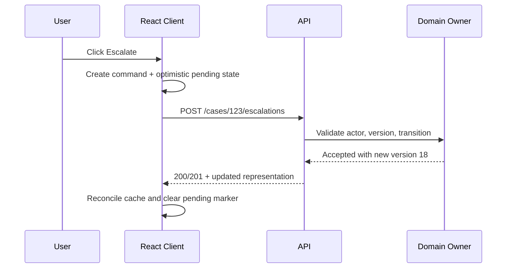

---

## 9. Cache Is a Replica, Not a Database

Client cache sering diperlakukan seperti database mini.
Itu berbahaya kalau tidak sadar batasnya.

Cache boleh:

- mempercepat read,
- menghindari duplicate request,
- menyimpan previous response,
- memberi stale-while-revalidate UX,
- menyatukan consumer banyak component,
- menjadi tempat reconciliation sementara.

Cache tidak boleh:

- menjadi authority domain,
- menyimpan security decision final,
- menyimpan data sensitive tanpa kebijakan,
- mengabaikan invalidation,
- dianggap benar setelah mutation gagal,
- menjadi tempat rule bisnis utama.

### Cache lifecycle

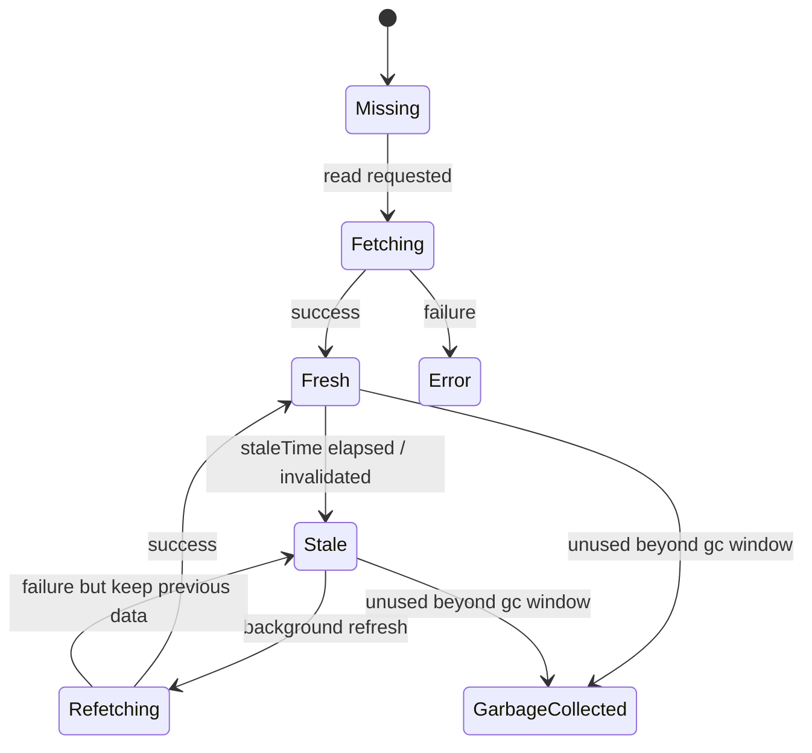

Kalau cache tidak punya lifecycle eksplisit, ia hanya global variable dengan latency.

---

## 10. Ownership dalam Optimistic UI

Optimistic UI bukan “langsung update data”.
Optimistic UI adalah **membuat temporary branch dari state**.

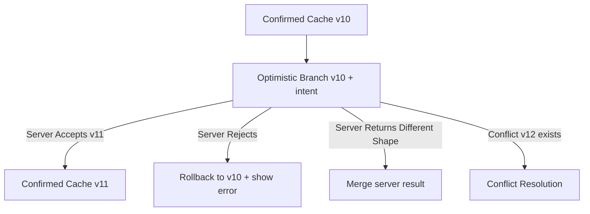

### Good optimistic state stores metadata

Jangan hanya:

```tsx
setTodos([...todos, newTodo]);
```

Lebih matang:

```ts
type TodoView = {
  id: string;
  title: string;
  completed: boolean;
  syncState: 'confirmed' | 'creating' | 'updating' | 'deleting' | 'failed';
  clientMutationId?: string;
  serverVersion?: number;
};
```

Optimistic data perlu tahu status sinkronisasinya.

### Temporary ID mapping

Untuk create mutation:

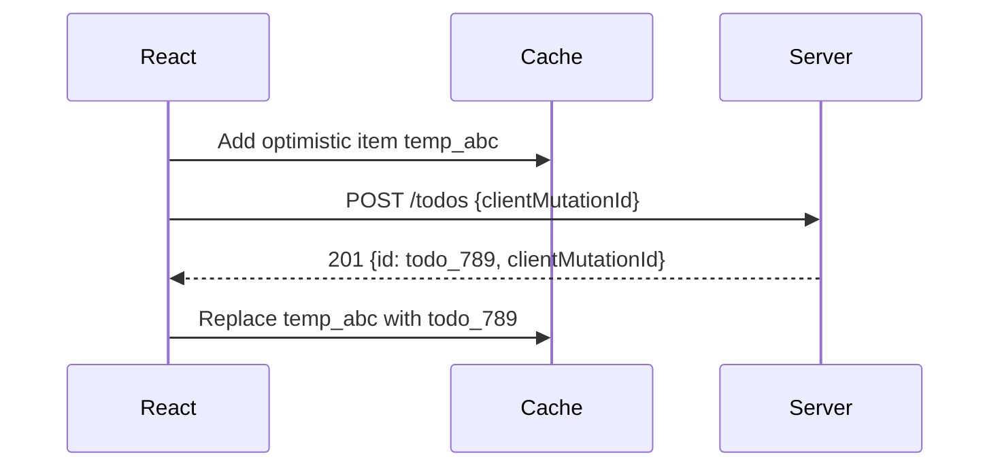

Tanpa mapping, UI bisa menampilkan duplicate item: satu optimistic, satu server result.

---

## 11. Ownership dalam Validation

Validation punya lebih dari satu owner.

### 11.1 Client-owned validation

Client boleh memvalidasi hal-hal untuk UX cepat:

- required field,
- basic format,
- local max length,
- file size before upload,
- disabled submit when no changes,
- immediate feedback.

Ini bukan security boundary.

### 11.2 Server-owned validation

Server harus memvalidasi hal-hal domain dan security:

- uniqueness,
- permission,
- state transition,
- quota,
- business rule,
- tenant isolation,
- ownership of entity,
- race condition,
- version conflict,
- regulatory/business invariants.

React client boleh membantu user, tetapi server tetap authority.

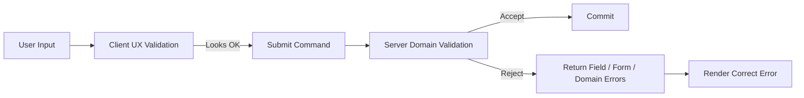

### Anti-pattern

```tsx
if (currentUser.role === 'admin') {
  showDeleteButton();
}

// Later...
await fetch(`/api/users/${id}`, { method: 'DELETE' });
```

Menampilkan tombol berdasarkan client snapshot boleh untuk UX.
Tapi server tetap harus menolak jika actor tidak berhak.
Client permission snapshot adalah hint, bukan authority.

---

## 12. Ownership dalam URL dan Navigation

URL adalah owner natural untuk state yang menentukan “view apa yang sedang dilihat”.

Contoh:

```text
/cases?status=open&sort=priority&page=2
```

Ini lebih baik daripada menyimpan semua filter di memory component jika:

- user perlu share link,
- refresh harus mempertahankan view,
- back/forward harus bekerja,
- server/route loader perlu tahu data requirement,
- analytics perlu membaca context view.

Namun, tidak semua state pantas masuk URL.

| State | URL? | Alasan |
|---|---:|---|
| search query | yes | shareable, reload-safe |
| active entity id | yes | route identity |
| open tooltip | no | ephemeral UI |
| unsaved password field | no | sensitive draft |
| pagination | often yes | navigation state |
| modal route for detail | maybe | jika modal merepresentasikan resource addressable |
| selected table rows | maybe no | kecuali workflow multi-step perlu survive |

### Rule

> Jika state mengubah “alamat konseptual” page, URL kemungkinan owner. Jika hanya mengubah presentasi sementara, component owner.

---

## 13. Ownership dalam Multi-Tab dan Cross-Device

React component tree hanya melihat satu tab.
Server state hidup di dunia yang lebih luas.

Perubahan bisa datang dari:

- tab lain,
- device lain,
- user lain,
- background worker,
- scheduled job,
- admin override,
- server-side rule,
- webhook,
- integration external.

Kalau ownership model kamu hanya mempertimbangkan tab saat ini, app akan salah di production.

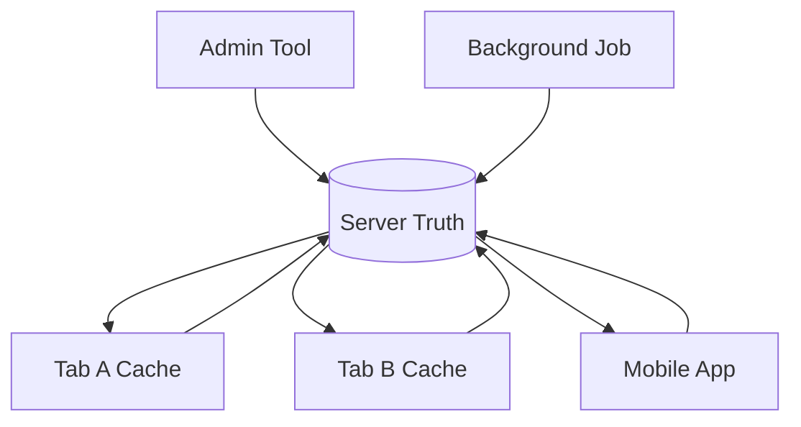

Client harus punya strategy:

- refetch on focus,
- stale time,
- broadcast channel sync,
- invalidation event,
- server-sent events,
- version check before mutation,
- conflict response,
- logout/session sync,
- cache namespace per tenant/user.

---

## 14. Ownership dalam Realtime Updates

Realtime tidak menghapus masalah ownership.
Realtime justru membuatnya lebih eksplisit.

Event bisa berarti:

1. **Invalidate** — “data ini berubah, fetch ulang”.
2. **Patch** — “ubah field ini di cache”.
3. **Append** — “tambahkan item ke collection”.
4. **Replace snapshot** — “ini state terbaru”.
5. **Notify only** — “beri tahu user, jangan ubah cache”.

Client harus tahu event type.

Buruk:

```ts
socket.on('caseUpdated', (event) => {
  setCase(event.case);
});
```

Lebih sehat:

```ts
type CaseEvent =
  | { type: 'case.invalidated'; caseId: string; version: number }
  | { type: 'case.statusChanged'; caseId: string; status: string; version: number }
  | { type: 'case.commentAdded'; caseId: string; commentId: string; version: number };
```

Event harus membawa cukup informasi untuk reconciliation:

- entity identity,
- event type,
- version/cursor,
- timestamp,
- causal context jika perlu,
- idempotency/event id,
- tenant/scope,
- whether payload is full or partial.

---

## 15. Ownership dalam Error Handling

Error juga punya owner.

| Error Type | Owner | Client Responsibility |
|---|---|---|
| network timeout | transport/runtime | retry, cancel, show recoverable state |
| 400 malformed request | client/API client | bug or client validation issue |
| 401 unauthenticated | session authority | refresh/session flow/logout |
| 403 forbidden | authorization server | hide/disable/update permission UX |
| 404 not found | resource owner | show missing/deleted/inaccessible distinction if possible |
| 409 conflict | domain/version owner | refetch, merge, conflict resolution |
| 422 validation | domain validation owner | map errors to fields/form |
| 429 rate limited | server quota owner | backoff, cooldown, user messaging |
| 500 server error | server | preserve user intent, retry if safe, telemetry |

Tidak semua error pantas menjadi toast generik.

Error adalah bagian dari protocol.
Kalau client tidak tahu owner error, ia tidak tahu recovery action.

---

## 16. Decision Framework: Where Should Data Live?

Gunakan pertanyaan ini saat design review.

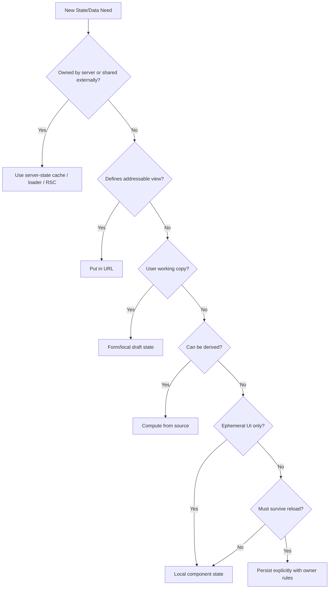

### Red flags

- “Kita taruh saja semua di global store.”
- “Setelah POST sukses, kita update semua UI manual.”
- “Kalau gagal, refresh page saja.”
- “Permission sudah dicek di frontend.”
- “Cache tidak perlu invalidation karena jarang berubah.”
- “Realtime event pasti datang urut.”
- “Optimistic update aman karena biasanya sukses.”
- “TypeScript interface cukup sebagai API contract.”

Kalimat-kalimat ini biasanya menandakan ownership belum jelas.

---

## 17. Practical Pattern: Ownership Map per Feature

Untuk setiap feature besar, buat ownership map.

Contoh: Case detail page.

| Data/Decision | Owner | Client Representation | Mutation Strategy | Failure Strategy |
|---|---|---|---|---|
| case summary | case service | query cache / route loader | no direct mutation | stale/refetch |
| case status | case workflow service | server state replica | command transition | 409 conflict if version mismatch |
| editable note draft | current tab | local form state | submit note command | preserve draft on failure |
| comment list | comment service | paginated query cache | append optimistic pending comment | temp id reconcile |
| attachment upload | storage service | local file queue + server metadata | signed upload + finalize | resumable/retry if supported |
| permission snapshot | authz service | capability hints | no client authority | refetch on 403/identity change |
| selected tab | URL | search param | navigation update | restore on reload |
| toast visibility | UI | local ephemeral | none | auto-dismiss |
| audit event | server | maybe displayed later | command emits audit | server authoritative |

Ownership map memaksa desain menjadi eksplisit.

---

## 18. Implementation Example: Separating Draft, Replica, and Command

Jangan gabungkan server replica dan edit draft dalam object yang sama.

### Problematic version

```tsx
function ProfilePage() {
  const { data: profile } = useProfileQuery();
  const [profileState, setProfileState] = useState(profile);

  // Problem: profile arrives async; local state can desync.
  // Problem: server replica and user draft are mixed.
  // Problem: mutation may send fields user did not intend to change.
}
```

### Better version

```tsx
type ProfileDraft = {
  displayName: string;
  timezone: string;
};

function toDraft(profile: Profile): ProfileDraft {
  return {
    displayName: profile.displayName,
    timezone: profile.timezone,
  };
}

function toCommand(draft: ProfileDraft, profile: Profile): UpdateProfileCommand {
  return {
    expectedVersion: profile.version,
    displayName: draft.displayName.trim(),
    timezone: draft.timezone,
  };
}
```

Component structure:

```tsx
function ProfilePage() {
  const profileQuery = useProfileQuery();

  if (profileQuery.isLoading) return <ProfileSkeleton />;
  if (profileQuery.isError) return <ProfileLoadError />;

  return <ProfileEditor profile={profileQuery.data} />;
}

function ProfileEditor({ profile }: { profile: Profile }) {
  const [draft, setDraft] = useState(() => toDraft(profile));
  const updateProfile = useUpdateProfileMutation();

  const submit = () => {
    updateProfile.mutate(toCommand(draft, profile));
  };

  return (
    <form onSubmit={(event) => { event.preventDefault(); submit(); }}>
      {/* fields bound to draft, not profile */}
    </form>
  );
}
```

Ada tiga object berbeda:

1. `profile` — server replica.
2. `draft` — client working copy.
3. `command` — mutation intent.

Ini sederhana, tapi sangat kuat.

---

## 19. Implementation Example: Server State Cache Is Not Domain Model

Misalnya response:

```ts
type CaseDetailResponse = {
  id: string;
  version: number;
  title: string;
  status: 'OPEN' | 'IN_REVIEW' | 'ESCALATED' | 'CLOSED';
  assignee: { id: string; name: string } | null;
  capabilities: {
    canEscalate: boolean;
    canClose: boolean;
  };
};
```

Client boleh menggunakan `capabilities.canEscalate` untuk menampilkan tombol.
Tapi saat user klik escalate, server tetap harus validate.

```tsx
function EscalateButton({ caseDetail }: { caseDetail: CaseDetailResponse }) {
  const escalate = useEscalateCaseMutation();

  return (
    <button
      disabled={!caseDetail.capabilities.canEscalate || escalate.isPending}
      onClick={() =>
        escalate.mutate({
          caseId: caseDetail.id,
          expectedVersion: caseDetail.version,
        })
      }
    >
      Escalate
    </button>
  );
}
```

Client capability adalah UX optimization.
Server validation adalah authority.

---

## 20. Implementation Example: Mutation Outcome Ownership

Mutation response sebaiknya tidak hanya `{ success: true }`.

Buruk:

```json
{ "success": true }
```

Client lalu harus menebak:

- entity versi berapa sekarang?
- field apa yang berubah?
- apakah server melakukan normalization?
- apakah ada warning?
- apakah cache harus invalidated?
- apakah operation async atau sudah committed?

Lebih baik:

```json
{
  "result": "accepted",
  "case": {
    "id": "case_123",
    "version": 18,
    "status": "ESCALATED",
    "updatedAt": "2026-07-07T04:12:00Z"
  },
  "auditId": "audit_456"
}
```

Atau untuk async command:

```json
{
  "result": "accepted_for_processing",
  "operationId": "op_789",
  "statusUrl": "/api/operations/op_789"
}
```

Outcome menentukan ownership tahap berikutnya.

---

## 21. Anti-Patterns dan Failure Modes

### 21.1 Duplicated Server State in Local State

```tsx
const { data } = useQuery(...);
const [localData, setLocalData] = useState(data);
```

Ini sering membuat replica kedua yang tidak punya lifecycle.

Boleh dilakukan jika memang draft, tetapi rename dan modelkan sebagai draft.

```tsx
const [draft, setDraft] = useState(() => toDraft(data));
```

### 21.2 Global Store as Dumping Ground

Semua state dimasukkan global store agar “mudah diakses”.
Akibatnya ownership hilang.

Pertanyaan yang harus diajukan:

- Apakah state ini remote?
- Apakah stale?
- Apakah shareable via URL?
- Apakah ephemeral?
- Apakah sensitive?
- Apakah derived?
- Apakah perlu invalidation?

### 21.3 Optimistic Without Rollback

Optimistic update tanpa rollback adalah data corruption UX.

Minimal harus ada:

- pending marker,
- error marker,
- rollback path,
- refetch/reconcile path.

### 21.4 Client-Only Authorization

Client boleh menyembunyikan tombol.
Server tetap wajib enforce.

Jika server percaya client, itu bukan optimization; itu vulnerability.

### 21.5 Mutation Without Version

Tanpa version/ETag/updatedAt/precondition, dua client bisa overwrite perubahan satu sama lain.

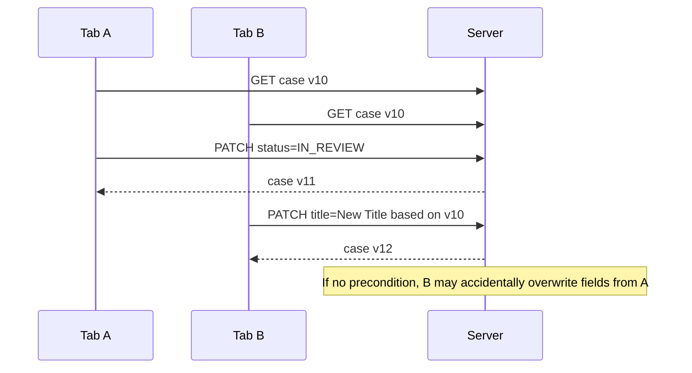

### 21.6 Treating Events as Ordered Truth

WebSocket/SSE event delivery can have reconnects, missed events, duplicate events, or delayed processing depending on implementation.
Client should not assume perfect ordering unless protocol guarantees it and client verifies cursor/version.

---

## 22. Engineering Review Checklist

Sebelum implement feature client-server, jawab ini:

### Data ownership

- Siapa owner canonical data?
- Apakah client value adalah canonical, replica, draft, derived, atau optimistic?
- Apakah data bisa berubah tanpa tab ini tahu?
- Apakah data perlu version?
- Apakah data sensitive?

### Read lifecycle

- Di mana data dibaca: component, route loader, server component, query cache, service worker?
- Kapan data stale?
- Apa refetch trigger-nya?
- Apa yang terjadi saat fetch gagal tetapi previous data ada?
- Apakah URL mempengaruhi query key?

### Write lifecycle

- Mutation ini command apa?
- Apa expected version/precondition-nya?
- Apakah retry aman?
- Apakah perlu idempotency key?
- Apa response success yang cukup untuk reconciliation?
- Apa response conflict/validation yang cukup untuk UX?

### Cache/invalidation

- Query apa yang harus invalidated?
- Apakah mutation response bisa langsung update cache?
- Apakah perlu refetch setelah accept?
- Apakah ada multi-tab invalidation?
- Apakah tenant/user switch membersihkan cache?

### Failure and recovery

- Apa user intent yang harus dipreserve saat gagal?
- Error mana yang field-level vs page-level vs global?
- Apakah retry bisa membuat duplicate mutation?
- Apakah conflict butuh merge UI?
- Apakah telemetry membawa correlation id?

---

## 23. Minimal Ownership Document Template

Gunakan format ini untuk feature besar.

```md
# Feature: <name>

## Canonical owners

| Entity / decision | Owner | Notes |
|---|---|---|
| | | |

## Client replicas

| Query key / route | Source endpoint | Stale policy | Invalidation trigger |
|---|---|---|---|
| | | | |

## Drafts

| Draft | Initialized from | Submit command | Reset condition |
|---|---|---|---|
| | | | |

## Mutations

| Command | Idempotent? | Preconditions | Success response | Failure response |
|---|---:|---|---|---|
| | | | | |

## Realtime / external changes

| Event | Meaning | Client action |
|---|---|---|
| | | |

## Failure model

| Failure | User impact | Recovery |
|---|---|---|
| | | |
```

Ini terlihat formal, tetapi menyelamatkan banyak rewrite.

---

## 24. Mental Model Akhir

React UI adalah proyeksi dari banyak state dengan owner berbeda.

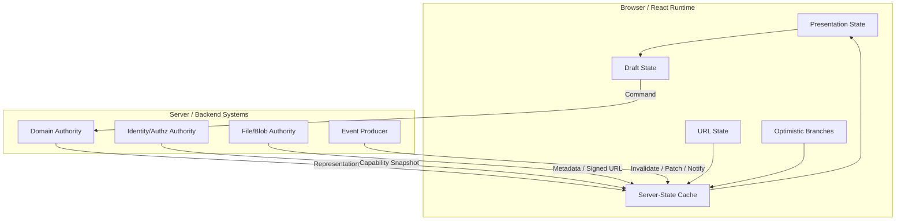

Kalau ownership jelas, pilihan library menjadi lebih mudah:

- React state untuk ephemeral UI dan draft,
- URL untuk addressable view state,
- query cache untuk server-state replica,
- route loader untuk navigation-coupled data,
- mutation command untuk write intent,
- Server Components untuk server-side read boundary,
- SSE/WebSocket untuk event-driven invalidation/sync,
- service worker/local persistence untuk offline replica dengan aturan eksplisit.

Kalau ownership tidak jelas, library apa pun akan menjadi tempat menyembunyikan kompleksitas sampai production membongkarnya.

---

## 25. Ringkasan

Client-server ownership model menjawab pertanyaan paling penting sebelum implementasi:

- siapa pemilik kebenaran,
- siapa pemilik draft,
- siapa pemilik decision,
- siapa pemilik validation,
- siapa pemilik mutation outcome,
- siapa pemilik cache invalidation,
- siapa pemilik conflict resolution.

Prinsip utama:

1. React state bukan otomatis source of truth.
2. Cache adalah replica, bukan domain authority.
3. Draft berbeda dari server state.
4. Optimistic UI adalah branch sementara, bukan committed fact.
5. URL adalah owner untuk addressable view state.
6. Server tetap owner untuk domain, security, validation final, dan auditability.
7. Mutation sebaiknya dimodelkan sebagai command, bukan remote object mutation mentah.
8. Error adalah bagian dari protocol dan punya owner.
9. Realtime event harus jelas apakah invalidate, patch, append, replace, atau notify.
10. Ownership yang jelas membuat invalidation, conflict handling, dan recovery bisa dirancang secara sistematis.

Di Part 008, kita akan mengubah ownership ini menjadi **data contracts and change boundaries**: bagaimana API contract harus didesain agar React client tidak rapuh ketika backend berevolusi.

---

## References

- React Docs — Sharing State Between Components: https://react.dev/learn/sharing-state-between-components
- React Docs — Server Components: https://react.dev/reference/rsc/server-components
- React Docs — Server Functions: https://react.dev/reference/rsc/server-functions
- RFC 9110 — HTTP Semantics: https://www.rfc-editor.org/rfc/rfc9110.html
- RFC 9457 — Problem Details for HTTP APIs: https://www.rfc-editor.org/rfc/rfc9457.html
- MDN — Fetch API: https://developer.mozilla.org/en-US/docs/Web/API/Fetch_API
