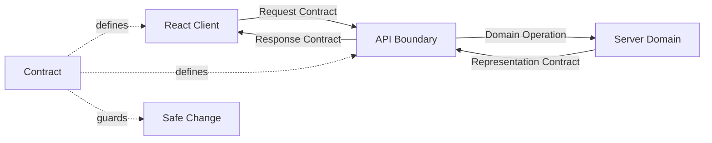
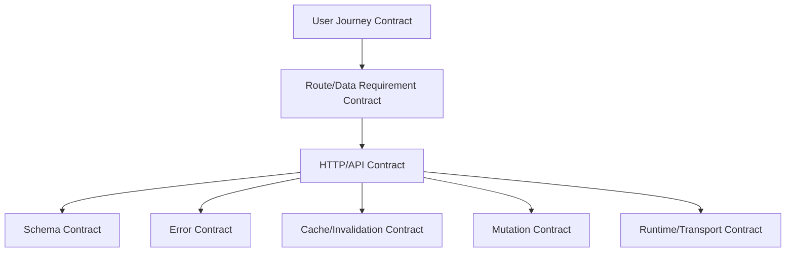
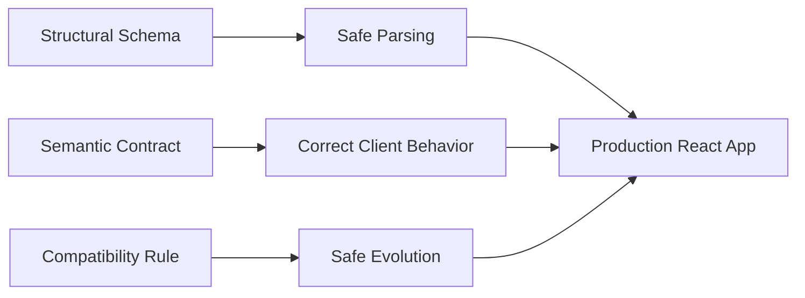
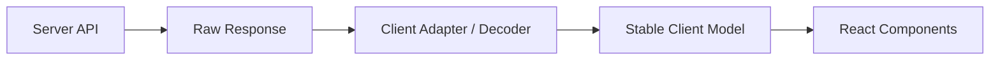
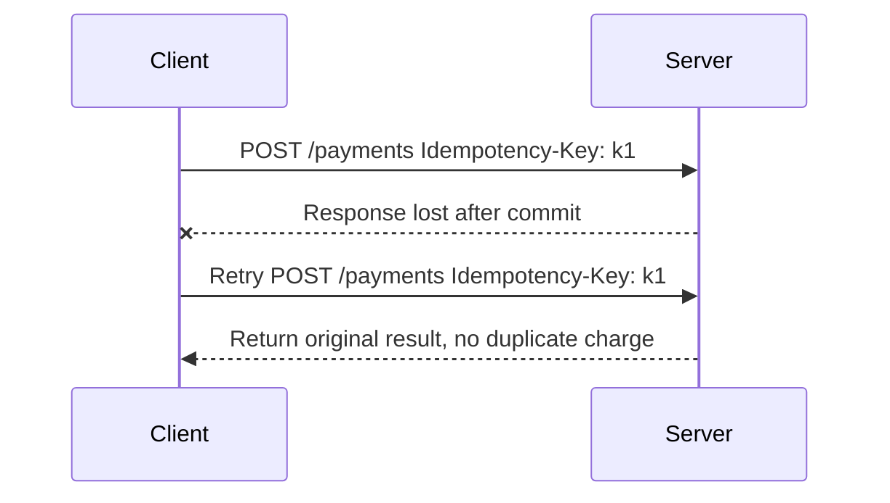
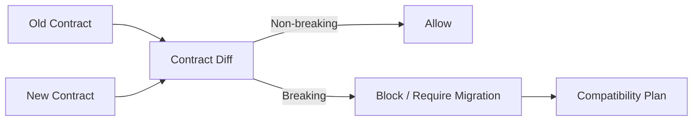
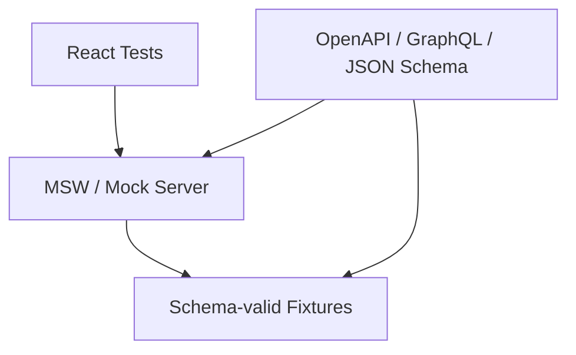
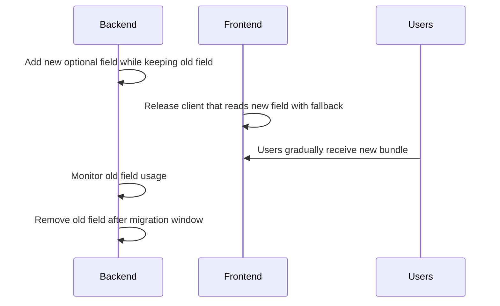
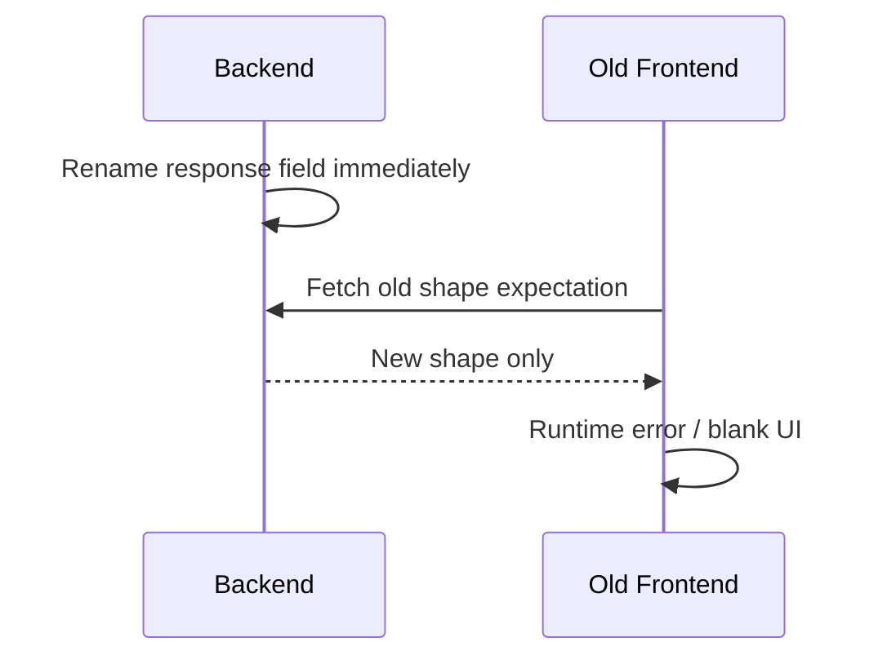
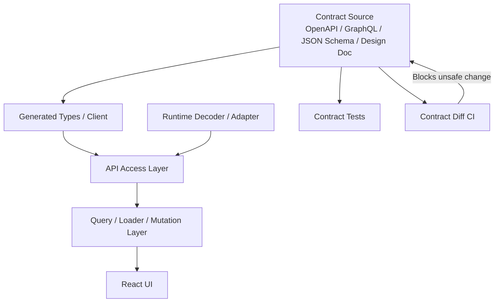

# Part 008 — Data Contracts and Change Boundaries

API contract bukan TypeScript interface.

TypeScript interface hanya satu bayangan lokal dari contract.
Contract yang sebenarnya jauh lebih luas:

- endpoint atau operation identity,
- HTTP method,
- URL path dan query parameter,
- request headers,
- credential behavior,
- request body schema,
- response body schema,
- status code semantics,
- error shape,
- pagination model,
- sorting/filtering semantics,
- cache semantics,
- idempotency rule,
- concurrency/version rule,
- authorization boundary,
- rate limit behavior,
- deprecation policy,
- compatibility guarantee,
- observability fields,
- security and PII constraints.

React app production tidak rusak hanya karena “API error”.
Ia sering rusak karena **contract berubah tanpa change boundary**.

Contoh kecil:

```json
{
  "status": "closed"
}
```

Diubah backend menjadi:

```json
{
  "status": "CLOSED"
}
```

Terlihat kecil.
Tapi di client bisa merusak:

- conditional rendering,
- color mapping,
- filter query,
- optimistic update,
- analytics event,
- test fixture,
- cached data migration,
- route loader expectation,
- GraphQL fragment atau OpenAPI generated type,
- business flow yang bergantung pada status.

Part ini membahas bagaimana mendesain contract dan boundary perubahan agar React client bisa berevolusi bersama backend tanpa rapuh.

---

## 1. Thesis Utama

**Client dan server tidak berbagi memory. Mereka berbagi contract.**

React component tidak memanggil function backend secara langsung.
Ia mengirim message melalui boundary.
Boundary itu hanya aman jika message-nya punya bentuk, arti, lifecycle, dan compatibility rule yang eksplisit.



Jika contract tidak eksplisit, client dan server tetap punya contract — hanya saja contract-nya tersembunyi di asumsi, test manual, Slack message, dan production bugs.

---

## 2. Contract Layer dalam React App

Dalam React client-server communication, contract muncul di beberapa layer.



### 2.1 User journey contract

Apa yang user percaya sedang terjadi?

Contoh:

- klik Save berarti perubahan disimpan sekali,
- klik Cancel berarti draft tidak dikirim,
- refresh page tidak menghapus committed data,
- back button mengembalikan filter,
- offline warning berarti data belum tersinkron.

Ini bukan sekadar UX.
Ini mempengaruhi mutation, idempotency, draft persistence, dan recovery.

### 2.2 Route/data requirement contract

Route butuh data apa untuk render?

Contoh:

```text
/cases/:caseId
requires:
  - case detail
  - current actor capabilities
  - recent comments first page
  - attachment metadata
```

Jika satu dependency gagal, apakah page gagal semua, sebagian, atau fallback?

### 2.3 HTTP/API contract

Operation-level contract:

```http
GET /api/cases/{caseId}
Accept: application/json
```

Mendefinisikan:

- method,
- path,
- path params,
- query params,
- headers,
- status code,
- response shape,
- caching,
- auth requirement.

### 2.4 Schema contract

Shape data:

```ts
type CaseDetail = {
  id: string;
  version: number;
  title: string;
  status: 'OPEN' | 'IN_REVIEW' | 'ESCALATED' | 'CLOSED';
};
```

Tetapi schema TypeScript ini hanya aman jika berasal dari source of truth atau divalidasi di runtime.

### 2.5 Error contract

Bagaimana failure direpresentasikan?

Contoh:

```json
{
  "type": "https://api.example.com/problems/validation-error",
  "title": "Validation failed",
  "status": 422,
  "detail": "One or more fields are invalid.",
  "errors": [
    { "path": "/displayName", "code": "too_short", "message": "Display name is too short" }
  ]
}
```

Tanpa error contract, React app tidak bisa membedakan:

- field error,
- form-level domain error,
- permission error,
- conflict,
- retryable server failure,
- expired session.

### 2.6 Cache contract

Apakah response boleh dicache?
Kapan stale?
Apa invalidation trigger?
Apakah response user-specific?
Apakah response tenant-specific?

Client cache policy tidak boleh bertentangan dengan HTTP/server cache policy.

### 2.7 Mutation contract

Mutation bukan hanya body input.
Ia mencakup:

- command name,
- actor context,
- expected version,
- idempotency key,
- success response,
- validation response,
- conflict response,
- async operation response,
- cache invalidation implication.

### 2.8 Runtime/transport contract

Bagaimana request dikirim?

- credentials included atau omitted,
- CORS allowed headers,
- timeout/deadline,
- abort behavior,
- retry behavior,
- content type,
- streaming atau buffered,
- SSE/WebSocket reconnect semantics.

---

## 3. TypeScript Interface Bukan Contract Final

TypeScript membantu, tapi tidak cukup.

Contoh:

```ts
type User = {
  id: string;
  name: string;
  age: number;
};
```

Masalah:

1. TypeScript hilang di runtime.
2. Data dari network adalah `unknown` sampai divalidasi atau dipercaya.
3. Backend bisa mengirim shape berbeda.
4. Field bisa `null` walau type client bilang tidak.
5. Enum bisa bertambah.
6. Date dikirim sebagai string, bukan `Date` object.
7. Number bisa overflow atau berubah precision.
8. Field sensitive bisa tidak sengaja masuk response.
9. Optional field punya semantic yang berbeda dari `null`.
10. Generated type bisa stale jika build tidak sinkron dengan contract source.

### Network data should start as unknown

```ts
async function fetchJson(url: string): Promise<unknown> {
  const response = await fetch(url);
  return response.json();
}
```

Kemudian parse/validate:

```ts
const raw = await fetchJson('/api/cases/case_123');
const caseDetail = CaseDetailSchema.parse(raw);
```

Apakah kamu memakai Zod, Valibot, io-ts, TypeBox, JSON Schema validator, generated OpenAPI client, atau GraphQL codegen, prinsipnya sama:

> Data dari network tidak menjadi trusted hanya karena TypeScript file berharap demikian.

---

## 4. Structural Contract vs Semantic Contract

Schema menjawab “bentuknya apa”.
Semantic contract menjawab “artinya apa”.

Contoh structural:

```json
{
  "status": "ESCALATED"
}
```

Contoh semantic:

- `ESCALATED` berarti case masuk queue escalation.
- `ESCALATED` tidak berarti assignment otomatis berubah.
- Status hanya bisa berubah dari `OPEN` atau `IN_REVIEW`.
- User tanpa capability `canEscalate` akan mendapat 403.
- Jika version mismatch, server mengembalikan 409.
- Setelah escalation sukses, cache `case-detail`, `case-list`, dan `case-timeline` perlu invalidated atau updated.

Tanpa semantic contract, client bisa menginterpretasikan field secara salah.



---

## 5. Contract Surfaces yang Sering Dilupakan

### 5.1 Null vs missing

```json
{ "assignee": null }
```

Beda dengan:

```json
{}
```

Kemungkinan arti:

| Shape | Kemungkinan arti |
|---|---|
| field missing | tidak disertakan, client lama, projection berbeda, permission tidak ada |
| field null | diketahui kosong/tidak ada |
| empty string | ada tapi kosong |
| empty array | diketahui tidak ada item |
| missing array | tidak diproyeksikan atau tidak diminta |

Client harus tahu bedanya.

### 5.2 Time and timezone

```json
{ "dueAt": "2026-07-07T10:30:00Z" }
```

Pertanyaan contract:

- apakah UTC?
- apakah timezone user dipakai untuk display?
- apakah date-only atau instant?
- apakah server menerima local date?
- apakah daylight saving relevan?
- apakah sorting berdasarkan server instant atau local date?

### 5.3 Money and decimal

Jangan kirim money sebagai floating number jika precision penting.

Buruk:

```json
{ "amount": 12.10 }
```

Lebih eksplisit:

```json
{
  "amountMinor": 1210,
  "currency": "USD"
}
```

Atau decimal string jika domain membutuhkannya:

```json
{
  "amount": "12.10",
  "currency": "USD"
}
```

### 5.4 Enum evolution

Client sering menulis:

```tsx
const color = {
  OPEN: 'blue',
  CLOSED: 'gray',
}[case.status];
```

Kalau backend menambah `REOPENED`, UI bisa rusak.

Lebih aman:

```tsx
const statusMeta: Record<string, { label: string; tone: Tone }> = {
  OPEN: { label: 'Open', tone: 'info' },
  CLOSED: { label: 'Closed', tone: 'neutral' },
};

const meta = statusMeta[case.status] ?? {
  label: case.status,
  tone: 'unknown',
};
```

Untuk exhaustive domain logic, unknown enum harus fail fast.
Untuk UI display, unknown enum sebaiknya degrade gracefully.

### 5.5 Pagination semantics

Pagination contract harus menjawab:

- offset atau cursor?
- stable sort key apa?
- apakah collection berubah saat paging?
- apakah cursor opaque?
- apakah `total` exact atau estimated?
- apakah filter masuk cursor?
- bagaimana duplicate/missing item dicegah?

Buruk:

```json
{
  "items": [...],
  "page": 2,
  "total": 100
}
```

Jika data berubah cepat, offset pagination bisa duplicate/miss.
Cursor sering lebih baik untuk feed atau realtime-ish list.

```json
{
  "items": [...],
  "nextCursor": "opaque_cursor_abc",
  "hasMore": true
}
```

### 5.6 Sorting/filter semantics

`sort=priority` harus punya arti stabil:

- ascending atau descending?
- tie breaker apa?
- null di atas atau bawah?
- apakah case sensitive?
- apakah locale-aware?
- apakah filter OR atau AND?
- apakah search fuzzy atau exact?

Tanpa ini, frontend test dan backend behavior bisa berbeda.

### 5.7 Partial response and projection

Jika endpoint mendukung `fields=...`, contract harus jelas field missing berarti apa.

```http
GET /api/cases/case_123?fields=id,title,status
```

Response tidak boleh diperlakukan sama dengan full `CaseDetail` jika field lain missing.

Buat type berbeda:

```ts
type CaseSummary = {
  id: string;
  title: string;
  status: CaseStatus;
};

type CaseDetail = CaseSummary & {
  description: string;
  assignee: Assignee | null;
  timeline: TimelineItem[];
};
```

---

## 6. Backward-Compatible vs Breaking Changes

Contract evolution harus punya definisi breaking change yang jelas.

### 6.1 Biasanya backward-compatible

| Change | Catatan |
|---|---|
| menambah optional response field | aman jika client ignore unknown fields |
| menambah endpoint baru | aman |
| menambah optional request field | aman jika default behavior jelas |
| menambah enum value | hanya aman jika client disiapkan untuk unknown value |
| menambah response header | aman |
| memperluas validation yang tidak mengubah existing valid inputs | aman |

### 6.2 Biasanya breaking

| Change | Kenapa breaking |
|---|---|
| menghapus response field | client mungkin depend |
| rename field | client parser gagal |
| mengubah type field | string ke object, number ke string, etc |
| mengubah enum value lama | mapping rusak |
| mengubah default sorting | list UI berubah |
| mengubah pagination semantics | infinite query rusak |
| mengubah error shape | form error mapping rusak |
| mengubah status code | retry/session/error flow rusak |
| memperketat validation untuk input yang dulu valid | existing client bisa gagal |
| mengubah cache headers | stale behavior berubah |
| mengubah meaning field | paling berbahaya karena sulit terdeteksi type |

### 6.3 Semantically breaking but structurally same

Ini paling sering lolos dari codegen.

Contoh:

```json
{ "priority": 1 }
```

Dulu `1 = highest`.
Sekarang `1 = lowest`.

Type tidak berubah.
Contract tetap rusak.

Karena itu contract harus mencakup semantic, bukan hanya schema.

---

## 7. Change Boundary

Change boundary adalah tempat kamu memutuskan bagaimana perubahan server tidak langsung merusak seluruh React app.



Jangan biarkan semua component membaca raw API shape jika API masih sering berubah.

### Pattern: API DTO to View Model

```ts
type CaseApiDto = {
  id: string;
  title: string;
  status: string;
  assigned_user?: {
    id: string;
    display_name: string;
  } | null;
};

type CaseViewModel = {
  id: string;
  title: string;
  status: CaseStatusView;
  assigneeName: string;
};

function toCaseViewModel(dto: CaseApiDto): CaseViewModel {
  return {
    id: dto.id,
    title: dto.title,
    status: toCaseStatusView(dto.status),
    assigneeName: dto.assigned_user?.display_name ?? 'Unassigned',
  };
}
```

Adapter bukan boilerplate sia-sia.
Adapter adalah anti-corruption layer.

### Kapan adapter penting?

- API digunakan oleh banyak component.
- Backend dimiliki team lain.
- Field naming tidak sesuai UI model.
- Ada legacy API.
- Ada multiple API version.
- Ada data normalization.
- Ada security redaction.
- Ada unknown enum/value.
- Ada partial response.
- Ada transform date/money/status.

### Kapan adapter bisa ringan?

- Feature kecil.
- API stabil.
- Type generated dari contract source.
- UI sangat dekat dengan representation.
- Tidak ada semantic transform.

---

## 8. Contract-First vs Code-First

Ada dua pendekatan besar.

### 8.1 Contract-first

Contract ditulis/ditinjau sebelum implementation.

Contoh source:

- OpenAPI spec,
- GraphQL schema,
- protobuf schema,
- JSON Schema,
- AsyncAPI untuk event,
- custom API design doc.

Kelebihan:

- frontend/backend bisa parallel,
- mock server mudah,
- generated client/types,
- review breaking change lebih jelas,
- documentation otomatis,
- contract testing lebih kuat.

Kekurangan:

- butuh disiplin,
- spec bisa drift dari implementation jika tidak divalidasi,
- kadang lambat untuk eksperimen kecil.

### 8.2 Code-first

Server implementation menghasilkan contract.

Kelebihan:

- cepat untuk internal app,
- dekat dengan source code,
- cocok jika framework generate schema akurat.

Kekurangan:

- risk contract muncul belakangan,
- frontend sering tahu setelah endpoint jadi,
- breaking change bisa tidak disadari,
- documentation bisa tertinggal.

### 8.3 Practical rule

Untuk production system dengan banyak consumer:

> Contract boleh dihasilkan dari code, tetapi compatibility harus diuji sebagai contract.

Yang penting bukan ideologinya.
Yang penting contract tidak diam-diam berubah.

---

## 9. OpenAPI as HTTP Contract

OpenAPI cocok untuk HTTP API yang resource/operation-based.
Ia mendeskripsikan path, method, parameter, request body, response, schema, security, dan metadata lain.

Contoh sederhana:

```yaml
openapi: 3.1.0
info:
  title: Case API
  version: 1.0.0
paths:
  /cases/{caseId}:
    get:
      operationId: getCase
      parameters:
        - name: caseId
          in: path
          required: true
          schema:
            type: string
      responses:
        '200':
          description: Case detail
          content:
            application/json:
              schema:
                $ref: '#/components/schemas/CaseDetail'
        '404':
          description: Case not found
components:
  schemas:
    CaseDetail:
      type: object
      required: [id, version, title, status]
      properties:
        id:
          type: string
        version:
          type: integer
        title:
          type: string
        status:
          type: string
          enum: [OPEN, IN_REVIEW, ESCALATED, CLOSED]
```

OpenAPI sangat berguna untuk:

- generated TypeScript client,
- generated mocks,
- schema validation,
- API docs,
- breaking change diff,
- contract tests,
- security review,
- endpoint inventory.

Namun OpenAPI tidak otomatis menyelesaikan semantic ambiguity.
Kamu tetap perlu description, examples, status code semantics, error model, and compatibility policy.

---

## 10. JSON Schema and Runtime Validation

JSON Schema berguna untuk mendeskripsikan dan memvalidasi JSON document.
Dalam frontend, runtime validation berguna saat:

- API belum stabil,
- data berasal dari external system,
- contract penting untuk safety,
- error harus fail fast,
- generated types tidak cukup,
- cached/persisted data mungkin berasal dari versi lama.

Pattern:

```ts
async function getCase(caseId: string): Promise<CaseDetail> {
  const response = await fetch(`/api/cases/${caseId}`);
  const json: unknown = await response.json();
  return CaseDetailSchema.parse(json);
}
```

### Validation policy

Tidak semua response harus divalidasi sama beratnya di runtime.

| Context | Validation Level |
|---|---|
| internal stable API, generated client, strong integration tests | maybe light |
| external API | strong |
| security-sensitive data | strong |
| persisted cache migration | strong |
| high-volume low-risk list | selective |
| admin/regulatory workflow | strong and observable |

Kalau validation gagal, jangan hanya crash.
Telemetry harus membawa:

- endpoint,
- operation id,
- schema version,
- field path,
- correlation id,
- app version,
- user/tenant scope jika aman dan tidak membocorkan PII.

---

## 11. GraphQL Contract Model

GraphQL punya contract yang berbeda dari REST/OpenAPI.
Client mengirim query yang menentukan data yang dibutuhkan.
Server schema mendefinisikan type, field, argument, mutation, dan subscription.

Contoh:

```graphql
query CaseDetail($caseId: ID!) {
  case(id: $caseId) {
    id
    version
    title
    status
    assignee {
      id
      name
    }
  }
}
```

Kekuatan GraphQL untuk React:

- component/route bisa menyatakan data requirement dengan fragment,
- overfetch/underfetch bisa berkurang,
- generated types bisa spesifik per query,
- normalized cache bisa update entity-level,
- schema introspection/codegen membantu tooling.

Tapi contract concerns tetap ada:

- nullable vs non-nullable field,
- enum evolution,
- deprecation,
- resolver error behavior,
- partial data with errors,
- cache normalization key,
- pagination convention,
- mutation payload design,
- authorization field-level behavior.

GraphQL bukan escape dari contract discipline.
Ia hanya memindahkan contract ke schema dan operation document.

---

## 12. Error Contract

Error contract wajib stabil.
Tanpa ini, React app hanya bisa menampilkan “Something went wrong”.

### Recommended shape

Problem Details style cocok sebagai basis untuk HTTP APIs.

```json
{
  "type": "https://api.example.com/problems/conflict",
  "title": "Resource conflict",
  "status": 409,
  "detail": "The case was modified by another user.",
  "instance": "/api/cases/case_123",
  "code": "CASE_VERSION_CONFLICT",
  "correlationId": "req_abc123",
  "currentVersion": 18
}
```

Untuk validation:

```json
{
  "type": "https://api.example.com/problems/validation-error",
  "title": "Validation failed",
  "status": 422,
  "code": "VALIDATION_ERROR",
  "correlationId": "req_abc123",
  "errors": [
    {
      "path": "/title",
      "code": "required",
      "message": "Title is required"
    },
    {
      "path": "/dueDate",
      "code": "must_be_future_date",
      "message": "Due date must be in the future"
    }
  ]
}
```

### Error taxonomy for client behavior

| Status | Contract Meaning | Client Behavior |
|---:|---|---|
| 400 | malformed request / client bug | show generic, log high-signal bug |
| 401 | unauthenticated | session refresh/login/logout flow |
| 403 | authenticated but not allowed | show permission state, refresh capabilities |
| 404 | resource missing or inaccessible | show not found/deleted/inaccessible UX |
| 409 | version/state conflict | refetch, merge, conflict UI |
| 412 | precondition failed | refetch and retry only with user confirmation if needed |
| 422 | domain validation failed | map to field/form errors |
| 429 | rate limited | backoff/cooldown; respect Retry-After |
| 500 | server bug/failure | retry if safe, preserve intent, telemetry |
| 503 | unavailable | retry/backoff, maintenance/degraded UX |

### Error stability rules

- `code` should be stable and machine-readable.
- `message` can be user-facing only if localization/wording policy supports it.
- `correlationId` should be present for support/debugging.
- Field error paths should be predictable.
- New error codes should not crash old clients.
- Security-sensitive details should not leak.

---

## 13. Mutation Contract

Mutation contract harus menjawab lebih dari request body.

### 13.1 Synchronous accepted mutation

```http
POST /api/cases/case_123/escalations
Content-Type: application/json
Idempotency-Key: 01J...

{
  "expectedVersion": 17,
  "reasonCode": "SLA_BREACH",
  "comment": "Exceeded threshold"
}
```

Response:

```http
200 OK
Content-Type: application/json

{
  "result": "accepted",
  "case": {
    "id": "case_123",
    "version": 18,
    "status": "ESCALATED"
  },
  "auditId": "audit_456"
}
```

Client behavior:

- clear pending optimistic marker,
- update or invalidate case detail,
- update or invalidate case list,
- append timeline if response includes it or refetch timeline,
- show success only after accepted.

### 13.2 Async accepted mutation

```http
202 Accepted
Content-Type: application/json

{
  "result": "accepted_for_processing",
  "operationId": "op_789",
  "statusUrl": "/api/operations/op_789"
}
```

Client behavior berbeda:

- jangan tampilkan “completed”,
- tampilkan “processing”,
- poll/subscribe operation status,
- define timeout and recovery,
- preserve user intent until final state known.

### 13.3 Idempotency

Jika mutation bisa di-retry karena timeout/network failure, contract harus menjawab apakah retry aman.

Idempotency key mengubah retry dari “mungkin double submit” menjadi “same operation identity”.



React client tidak bisa memperbaiki non-idempotent API hanya dengan retry library.
Idempotency adalah contract server-client.

---

## 14. Concurrency and Version Contract

Lost update terjadi ketika dua actor mengubah data berdasarkan versi lama.

Contract harus mendefinisikan:

- version field,
- ETag,
- `If-Match`,
- updatedAt precondition,
- conflict response,
- merge policy.

### ETag/If-Match style

```http
GET /api/cases/case_123
```

```http
200 OK
ETag: "case-17"

{ "id": "case_123", "version": 17, "title": "Old" }
```

Update:

```http
PATCH /api/cases/case_123
If-Match: "case-17"
Content-Type: application/json

{ "title": "New" }
```

Conflict:

```http
412 Precondition Failed
Content-Type: application/json

{
  "type": "https://api.example.com/problems/precondition-failed",
  "status": 412,
  "code": "VERSION_MISMATCH",
  "currentVersion": 18
}
```

Client behavior:

- refetch current data,
- compare draft with latest,
- auto-merge if safe,
- ask user if conflict semantic matters,
- avoid silent overwrite.

---

## 15. Cache Contract

Client cache behavior harus berdasarkan contract, bukan feeling.

### Questions

- Apakah response public atau user-specific?
- Apakah response tenant-specific?
- Apakah response boleh disimpan browser cache?
- Apakah query cache boleh menyimpan setelah logout?
- Kapan stale?
- Apakah stale data boleh ditampilkan?
- Apakah background refetch aman?
- Mutation apa yang invalidates data ini?
- Apakah response tergantung header seperti `Accept-Language` atau user role?

### Contract examples

For public static-ish resource:

```http
Cache-Control: public, max-age=300, stale-while-revalidate=60
```

For user-specific sensitive data:

```http
Cache-Control: no-store
```

For client query cache, document separately:

```ts
const caseDetailPolicy = {
  staleTimeMs: 30_000,
  gcTimeMs: 10 * 60_000,
  refetchOnWindowFocus: true,
  invalidatedBy: [
    'case.updated',
    'case.escalated',
    'comment.added',
    'permission.changed',
  ],
};
```

HTTP cache and application cache are different layers.
They must not accidentally fight each other.

---

## 16. Versioning Strategies

Versioning bukan hanya `/v1`.

### 16.1 URL versioning

```text
/api/v1/cases
/api/v2/cases
```

Kelebihan:

- explicit,
- easy routing,
- easy parallel support.

Kekurangan:

- version explosion,
- whole API versioned even if one field changes,
- migration can be heavy.

### 16.2 Header/media type versioning

```http
Accept: application/vnd.example.case+json; version=2
```

Kelebihan:

- representation-focused,
- cleaner URLs.

Kekurangan:

- harder to debug manually,
- tooling/proxy behavior can be trickier,
- needs discipline.

### 16.3 Additive evolution without version bump

Best when possible:

- add optional fields,
- add new endpoints,
- add new enum values only if clients tolerate unknown,
- deprecate before remove,
- support old and new fields during migration.

### 16.4 Capability-based evolution

Server tells client supported features:

```json
{
  "capabilities": {
    "canBulkEscalate": true,
    "supportsAttachmentScanStatus": true
  }
}
```

Useful for gradual rollout, multi-version clients, mobile apps, or embedded apps.

### 16.5 Practical policy

For internal React web app deployed with backend:

- prefer additive changes,
- avoid breaking changes without coordinated deploy,
- use contract tests,
- keep adapters,
- use feature flags for rollout,
- keep old fields during migration window,
- monitor unknown enum/parse failures.

For public API:

- stricter versioning,
- documented deprecation policy,
- compatibility guarantee,
- changelog,
- consumer communication.

---

## 17. Deprecation Contract

Deprecation is a protocol, not a comment.

A healthy deprecation includes:

1. announce field/endpoint deprecated,
2. provide replacement,
3. expose deprecation metadata if useful,
4. track usage,
5. migrate clients,
6. keep compatibility window,
7. remove only after confidence.

OpenAPI example:

```yaml
properties:
  oldStatus:
    type: string
    deprecated: true
    description: Use status instead.
  status:
    type: string
```

Runtime headers can help:

```http
Deprecation: true
Sunset: Wed, 31 Dec 2026 23:59:59 GMT
Link: <https://docs.example.com/migrations/status>; rel="deprecation"
```

React app can log usage of deprecated fields in development or telemetry, but avoid noisy production logs.

---

## 18. Contract Testing

Types are not enough.
Tests should catch drift.

### 18.1 Consumer-driven contract tests

Frontend defines expectations.
Backend verifies it still satisfies them.

Useful when frontend and backend are deployed separately.

### 18.2 Schema validation tests

Backend responses are validated against OpenAPI/JSON Schema.
Frontend mock fixtures are validated too.

### 18.3 Generated client compile tests

If OpenAPI/GraphQL schema changes, regenerate client and compile frontend.
This catches structural breaks.

### 18.4 Fixture drift tests

Mock data used in React tests should be generated from schema or validated against it.
Otherwise tests pass against fantasy payloads.

### 18.5 Contract diff in CI

CI can detect:

- removed field,
- changed type,
- removed enum,
- status response removed,
- required field added,
- endpoint removed,
- request parameter changed.

But semantic changes still require review.



---

## 19. Mocking Contract for React Development

Mocking is dangerous if mocks are not contract-bound.

Bad mock:

```ts
const user = {
  id: 1,
  fullname: 'Alice',
};
```

Maybe real API returns:

```json
{
  "id": "u_123",
  "displayName": "Alice",
  "avatarUrl": null
}
```

Mock should be generated or validated.

Use mock service boundary:



A good mock tests real client behavior:

- loading,
- slow response,
- timeout,
- abort,
- 401,
- 403,
- 409,
- 422 field errors,
- 500,
- malformed response,
- partial data,
- pagination end,
- retry after 429.

If mocks only return happy path, they train the UI to lie.

---

## 20. Contract at the Edge of Generated Clients

Generated clients are useful, but still need architecture.

Bad usage:

```tsx
const response = await api.getCase({ caseId });
setCase(response.data);
```

Better layering:

```ts
export async function getCase(caseId: string): Promise<CaseViewModel> {
  const response = await generatedClient.getCase({ caseId });
  return toCaseViewModel(response.data);
}
```

Why?

- generated type follows API shape,
- UI model follows product shape,
- adapter handles unknown/legacy values,
- telemetry can be centralized,
- errors can be normalized,
- retries/timeouts can be policy-based,
- auth/session behavior is centralized.

Generated client should not leak everywhere.
It should sit inside API access layer.

---

## 21. Designing Stable Response Shapes

### 21.1 Prefer explicit object envelopes for complex responses

Instead of:

```json
[
  { "id": "case_1" },
  { "id": "case_2" }
]
```

Use:

```json
{
  "items": [
    { "id": "case_1" },
    { "id": "case_2" }
  ],
  "nextCursor": null,
  "metadata": {
    "generatedAt": "2026-07-07T00:00:00Z"
  }
}
```

Envelope allows evolution:

- pagination,
- metadata,
- warnings,
- partial result markers,
- trace/debug ids,
- aggregation info.

### 21.2 Include stable identifiers

Every entity used in React lists/cache should have stable id.

Bad:

```json
{ "name": "Alice" }
```

Better:

```json
{ "id": "u_123", "displayName": "Alice" }
```

### 21.3 Include version when mutation/conflict matters

```json
{
  "id": "case_123",
  "version": 18,
  "status": "ESCALATED"
}
```

### 21.4 Avoid ambiguous booleans

```json
{ "active": true }
```

What does active mean?

Prefer domain status if there are multiple states:

```json
{ "status": "ACTIVE" }
```

Or capabilities:

```json
{
  "capabilities": {
    "canEdit": true,
    "canArchive": false
  }
}
```

### 21.5 Separate facts from capabilities

Facts:

```json
{ "status": "OPEN" }
```

Capabilities:

```json
{ "canEscalate": true }
```

Do not force client to derive authorization-sensitive capabilities from facts.
Server should provide capability hints when needed, while still enforcing actions server-side.

---

## 22. Data Minimization and Contract Security

Contract also determines what client can see.

Questions:

- Does this response expose PII unnecessarily?
- Does list endpoint include fields only needed in detail view?
- Does error detail leak internal state?
- Does response include hidden authorization data?
- Does cache store sensitive data across logout?
- Are signed URLs scoped and expiring?
- Are IDs guessable and does that matter?
- Is tenant/user context explicit enough?

### Principle

> Do not send data to React just because “frontend can hide it”.

Hidden DOM, hidden JSON, devtools-visible payload, cached response, and logged error are still exposure.

---

## 23. Compatibility Strategy for React Deployments

React web apps have deployment realities:

- user may keep old tab open,
- service worker may serve old bundle,
- CDN may cache old assets,
- backend may deploy before frontend,
- frontend may deploy before backend,
- canary users may hit mixed versions,
- mobile webview may retain older assets,
- enterprise users may sit behind caches/proxies.

Therefore backend cannot assume all clients update instantly.

### Safe rollout pattern



### Unsafe rollout



Even in internal systems, mixed-version windows exist.

---

## 24. Contract Review Checklist

Gunakan checklist ini saat API review dengan frontend/backend.

### Operation

- Apa operation identity-nya?
- Apa method/path/query/header/body-nya?
- Apakah operation read atau command?
- Apakah retry aman?
- Apakah credentials/cookies dibutuhkan?
- Apakah CORS/preflight implications dipahami?

### Request

- Field mana required?
- Field mana optional?
- Apa arti missing vs null?
- Apa validation rule client vs server?
- Apakah request membawa expected version?
- Apakah request membawa idempotency key?

### Response

- Apa success status code?
- Apa response body cukup untuk cache reconciliation?
- Apakah response punya stable id?
- Apakah response punya version?
- Apakah enum bisa bertambah?
- Apakah unknown fields ignored?
- Apakah date/money/timezone explicit?

### Error

- Apa error status code yang mungkin?
- Apa stable machine-readable error code?
- Apa field error shape?
- Apa conflict shape?
- Apa rate limit shape?
- Apa correlation id?

### Cache

- Apakah HTTP cache allowed?
- Apakah app query cache allowed?
- Apa stale policy?
- Mutation apa yang invalidates?
- Apakah user/tenant/session switch clear cache?

### Evolution

- Apakah perubahan ini backward-compatible?
- Apakah ada old clients?
- Apakah perlu dual-write/dual-read?
- Apakah perlu feature flag?
- Apakah contract diff/test tersedia?
- Apakah deprecation window jelas?

### Security

- Apakah response minimal?
- Apakah sensitive fields bocor?
- Apakah error terlalu detail?
- Apakah authorization hanya hint atau enforced?
- Apakah signed URL scoped dan expiring?

---

## 25. Practical Contract Document Template

```md
# API Contract: <operation name>

## Purpose

What user journey or system workflow does this operation support?

## Ownership

- Canonical owner:
- Client representation:
- Mutation owner:
- Cache owner:

## Request

Method:
Path:
Query:
Headers:
Credentials:
Body:

## Response: success

Status:
Body schema:
Example:
Cache policy:
Reconciliation rule:

## Response: errors

| Status | Code | Meaning | Client behavior |
|---:|---|---|---|
| | | | |

## Concurrency

Version/ETag/precondition:
Conflict behavior:

## Idempotency

Idempotency key required?
Retry behavior:
Duplicate behavior:

## Evolution

Compatibility guarantee:
Deprecated fields:
Planned changes:

## Security

PII:
Authorization:
Tenant scope:
Logging constraints:

## Observability

Correlation id:
Metrics:
Frontend events:
Backend traces:
```

This template is intentionally practical.
It makes hidden assumptions visible.

---

## 26. Worked Example: Escalate Case Contract

### Operation

```http
POST /api/cases/{caseId}/escalations
```

Purpose: user requests escalation of a case.

### Request

```json
{
  "expectedVersion": 17,
  "reasonCode": "SLA_BREACH",
  "comment": "Exceeded internal response threshold"
}
```

Headers:

```http
Content-Type: application/json
Idempotency-Key: 01JABC...
```

### Success

```http
200 OK
Content-Type: application/json

{
  "result": "accepted",
  "case": {
    "id": "case_123",
    "version": 18,
    "status": "ESCALATED",
    "updatedAt": "2026-07-07T04:12:00Z"
  },
  "auditId": "audit_456"
}
```

Client behavior:

- clear pending state,
- update case detail cache with returned case,
- invalidate case list queries where status/filter may be affected,
- invalidate or append case timeline depending on response design,
- show success message with non-sensitive wording.

### Validation error

```http
422 Unprocessable Content
Content-Type: application/problem+json

{
  "type": "https://api.example.com/problems/validation-error",
  "title": "Validation failed",
  "status": 422,
  "code": "VALIDATION_ERROR",
  "errors": [
    {
      "path": "/reasonCode",
      "code": "invalid_reason",
      "message": "Reason code is not valid for this case."
    }
  ]
}
```

Client behavior:

- keep draft,
- map field errors,
- do not invalidate case cache,
- do not show success.

### Conflict

```http
409 Conflict
Content-Type: application/problem+json

{
  "type": "https://api.example.com/problems/case-version-conflict",
  "title": "Case changed",
  "status": 409,
  "code": "CASE_VERSION_CONFLICT",
  "currentVersion": 18
}
```

Client behavior:

- refetch case,
- preserve comment draft,
- ask user to retry if transition still allowed,
- update capability hints.

### Forbidden

```http
403 Forbidden
Content-Type: application/problem+json

{
  "type": "https://api.example.com/problems/forbidden",
  "title": "Forbidden",
  "status": 403,
  "code": "CASE_ESCALATION_FORBIDDEN"
}
```

Client behavior:

- clear optimistic state,
- refresh capabilities,
- show permission-specific message,
- do not expose internal policy reason if sensitive.

This is contract design.
Not just endpoint design.

---

## 27. Mental Model Akhir

React app yang matang tidak bergantung pada “backend kebetulan mengirim shape yang sama”.
Ia punya boundary.



Boundary yang baik membuat perubahan backend menjadi event yang bisa dikelola, bukan kejutan runtime.

---

## 28. Ringkasan

Data contract adalah kesepakatan operasional antara React client dan server.
Ia mencakup shape, semantics, error, cache, mutation, concurrency, security, dan evolution.

Prinsip utama:

1. TypeScript interface bukan contract final.
2. Network data harus dianggap `unknown` sampai divalidasi atau dipercaya melalui contract kuat.
3. Schema contract dan semantic contract berbeda.
4. Null, missing, enum, time, money, pagination, dan error shape harus eksplisit.
5. Breaking change tidak selalu terlihat dari type change.
6. Adapter layer adalah change boundary yang melindungi UI dari raw API drift.
7. OpenAPI, JSON Schema, dan GraphQL membantu, tetapi tidak menggantikan review semantic.
8. Mutation contract harus mencakup idempotency, version, success, conflict, dan validation.
9. Cache contract harus jelas di HTTP cache dan app cache layer.
10. Safe evolution membutuhkan additive change, deprecation, contract diff, testing, dan rollout strategy.

Dengan Part 007 dan Part 008, Phase 1 selesai: kita sudah punya mental model runtime, HTTP, lifecycle, performance, ownership, dan contract boundary.

Mulai Part 009, kita masuk ke primitive utama di browser: **Fetch API deep dive**.

---

## References

- OpenAPI Specification: https://swagger.io/specification/
- OpenAPI Initiative: https://www.openapis.org/
- JSON Schema Specification: https://json-schema.org/specification
- JSON Schema Docs: https://json-schema.org/docs
- GraphQL Specification: https://spec.graphql.org/
- RFC 9110 — HTTP Semantics: https://www.rfc-editor.org/rfc/rfc9110.html
- RFC 9457 — Problem Details for HTTP APIs: https://www.rfc-editor.org/rfc/rfc9457.html
- MDN — HTTP response status codes: https://developer.mozilla.org/en-US/docs/Web/HTTP/Status
- MDN — Fetch API: https://developer.mozilla.org/en-US/docs/Web/API/Fetch_API
