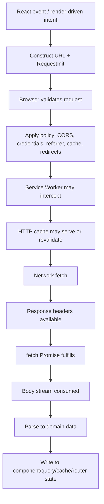
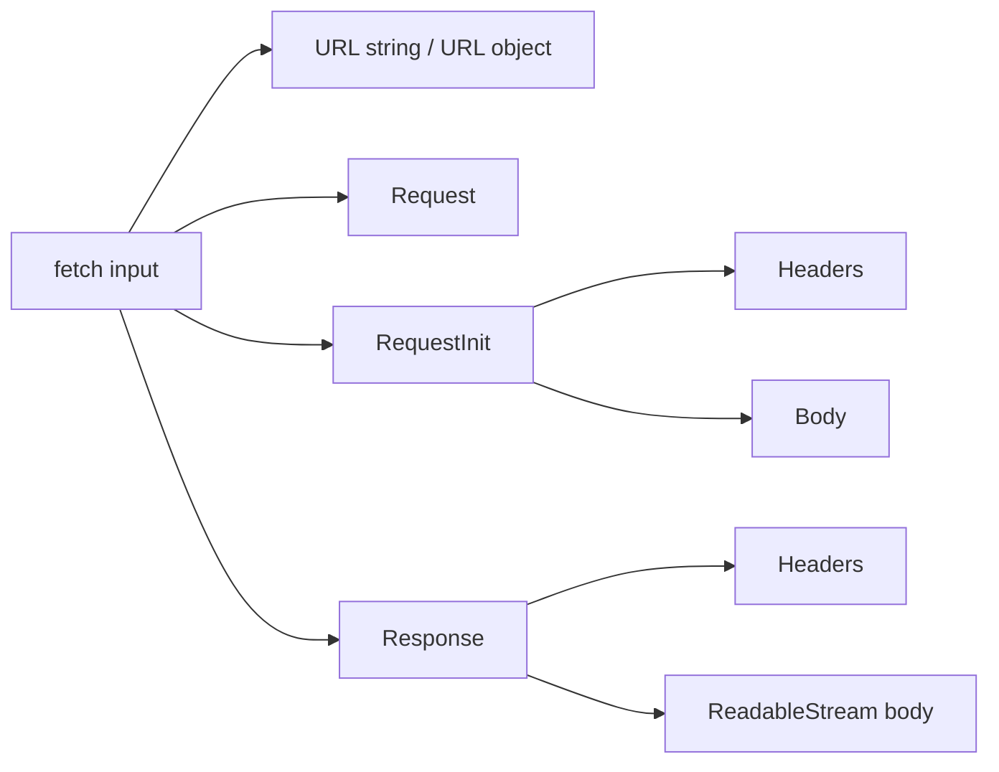
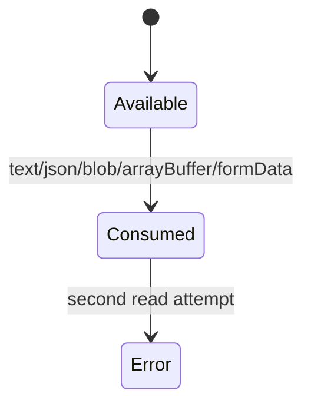
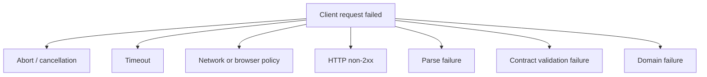
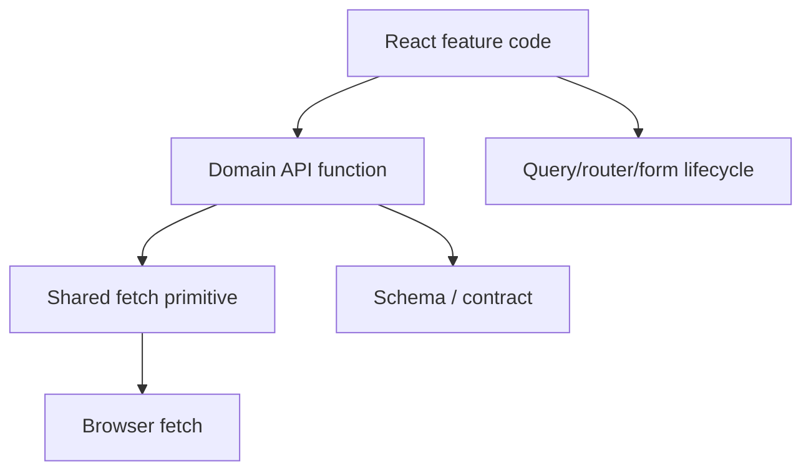
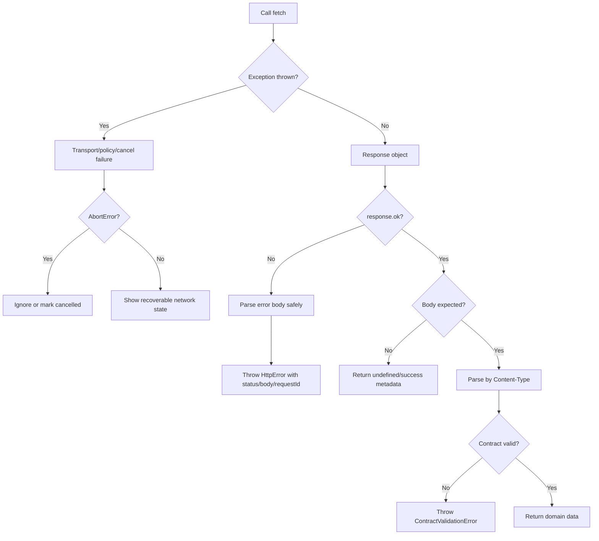

# Part 009 — Fetch API Deep Dive

`fetch()` terlihat seperti function sederhana:

```ts
const response = await fetch('/api/orders')
const data = await response.json()
```

Tapi itu hanya permukaan.

Di production React app, `fetch()` bukan sekadar cara mengambil JSON. Ia adalah pintu masuk ke browser network pipeline:

- URL resolution,
- request construction,
- header normalization,
- CORS enforcement,
- credential policy,
- HTTP cache interaction,
- Service Worker interception,
- redirect handling,
- abort propagation,
- stream consumption,
- response visibility filtering,
- parsing,
- error interpretation,
- integration ke React rendering lifecycle.

Kalau mental model-nya salah, bug-nya sering terlihat seperti ini:

- UI stuck loading padahal server mengirim `500`.
- Error boundary tidak jalan karena HTTP error tidak dianggap exception.
- Response tidak bisa dibaca dua kali karena body stream sudah consumed.
- `no-cors` dipakai untuk “memperbaiki CORS”, lalu response jadi opaque dan data tidak bisa dibaca.
- Request lama menimpa request baru ketika user mengetik cepat.
- Logout terjadi, tapi request lama masih menulis data ke cache.
- File upload gagal karena developer memaksa `Content-Type: multipart/form-data` tanpa boundary.
- Retry membuat mutation dobel karena request tidak idempotent.
- Monitoring hanya tahu “TypeError: Failed to fetch”, tanpa tahu apakah masalahnya DNS, CORS, TLS, offline, abort, atau blocked by browser policy.

Part ini membangun Fetch sebagai **primitive eksekusi network**, bukan helper JSON.

---

## 1. Mental Model: Fetch adalah Pipeline, Bukan Function Call

Function call lokal punya properti sederhana:

```ts
const result = calculate(input)
```

- input masuk,
- function berjalan,
- output keluar,
- exception berarti function gagal.

`fetch()` berbeda.



Bagian penting: promise dari `fetch()` biasanya **fulfill ketika response tersedia**, termasuk saat HTTP status `404`, `409`, `422`, atau `500`.

HTTP status error bukan otomatis JavaScript exception.

```ts
const response = await fetch('/api/orders/404')

console.log(response.ok)     // false
console.log(response.status) // 404

// kode ini tetap lanjut kecuali kamu sendiri throw
```

Yang biasanya membuat `fetch()` reject adalah kegagalan request pada level browser/network/policy, misalnya:

- DNS/TLS/network failure,
- request dibatalkan lewat `AbortController`,
- CORS policy menolak exposure response,
- browser memblokir request karena policy tertentu,
- URL invalid,
- body request invalid untuk method tertentu,
- stream/body error.

Jadi invariant pertama:

> `fetch()` failure tidak sama dengan HTTP failure. HTTP failure adalah response. Network/policy/cancellation failure adalah exception.

Dalam React app, ini mengubah cara kita menulis client.

Buruk:

```ts
const data = await fetch('/api/orders').then((r) => r.json())
```

Masalah:

- `500` tetap diparse sebagai JSON,
- response HTML error page bisa meledak sebagai parse error,
- domain error tidak punya struktur,
- status code hilang,
- trace id hilang,
- retry logic tidak bisa membedakan error,
- React UI tidak tahu apakah error recoverable.

Lebih sehat:

```ts
const response = await fetch('/api/orders', {
  headers: {
    Accept: 'application/json',
  },
})

if (!response.ok) {
  throw await HttpError.fromResponse(response)
}

const data = await response.json()
```

Tapi bahkan ini belum cukup. Kita akan bangun perlahan.

---

## 2. Fetch Surface Area

Fetch API terdiri dari beberapa object utama:



### 2.1 `fetch(input, init?)`

Bentuk umum:

```ts
fetch(input, init)
```

`input` bisa berupa:

```ts
await fetch('/api/orders')
await fetch(new URL('/api/orders', window.location.origin))
await fetch(new Request('/api/orders', { method: 'GET' }))
```

`init` adalah konfigurasi request:

```ts
await fetch('/api/orders', {
  method: 'POST',
  headers: {
    'Content-Type': 'application/json',
    Accept: 'application/json',
  },
  body: JSON.stringify({ itemId: 'item_123', quantity: 2 }),
  credentials: 'include',
  signal: abortController.signal,
})
```

Part 010 akan membedah `RequestInit` lebih detail. Di part ini kita fokus ke semantic besar Fetch.

### 2.2 `Request`

`Request` adalah object yang merepresentasikan request sebelum dikirim.

```ts
const request = new Request('/api/orders', {
  method: 'POST',
  headers: { 'Content-Type': 'application/json' },
  body: JSON.stringify({ itemId: 'item_123' }),
})

const response = await fetch(request)
```

Kapan `Request` berguna?

- saat ingin compose request di wrapper,
- saat Service Worker menginspeksi/meneruskan request,
- saat ingin clone request,
- saat ingin menstandarkan construction logic,
- saat testing low-level network client.

Untuk React application code biasa, string URL + init biasanya cukup.

### 2.3 `Response`

`Response` adalah object hasil request.

```ts
const response = await fetch('/api/orders')

response.status      // 200, 404, 500, ...
response.statusText  // implementation-dependent reason phrase
response.ok          // true untuk 200-299
response.headers     // Headers object
response.url         // final response URL after redirects if exposed
response.redirected  // boolean
response.type        // basic, cors, opaque, opaqueredirect, error
response.body        // ReadableStream | null
response.bodyUsed    // boolean
```

Response punya dua lapis:

1. **metadata**: status, headers, type, url,
2. **body stream**: data yang belum tentu sudah dibaca.

Inilah penyebab banyak bug:

```ts
const response = await fetch('/api/orders')

console.log(await response.text())
console.log(await response.json()) // error: body already consumed
```

Body response adalah stream satu arah. Setelah dibaca, ia consumed.

Kalau perlu membaca dua kali, clone sebelum konsumsi:

```ts
const response = await fetch('/api/orders')
const copy = response.clone()

const raw = await copy.text()
const json = await response.json()

console.log({ raw, json })
```

Tapi clone bukan gratis. Untuk payload besar, membaca dua stream berarti overhead memory/processing. Di production, pakai clone hanya untuk debugging, logging terbatas, atau fallback parse yang terkontrol.

---

## 3. Promise Semantics: Kapan `fetch()` Fulfill dan Reject

Ini bagian yang wajib tertanam.

### 3.1 HTTP error tidak reject

```ts
const response = await fetch('/api/missing')

if (response.status === 404) {
  // ini jalur normal dari perspektif fetch
}
```

Kenapa? Karena request berhasil mencapai server dan server mengirim response valid. Dari perspektif network primitive, itu successful exchange.

HTTP error adalah **application/protocol-level response**, bukan kegagalan primitive.

### 3.2 Reject berarti request tidak menghasilkan accessible response

Contoh:

```ts
try {
  await fetch('https://api.example.invalid/orders')
} catch (error) {
  // TypeError: Failed to fetch, atau error lain tergantung browser/runtime
}
```

Problem: browser sengaja tidak selalu memberi detail penuh ke JavaScript karena alasan security/privacy. `TypeError: Failed to fetch` bisa berarti banyak hal.

Jangan membuat code seperti ini:

```ts
catch (error) {
  if (String(error).includes('CORS')) {
    // fragile
  }
}
```

Lebih baik buat taxonomy sendiri:

```ts
type ClientNetworkErrorKind =
  | 'aborted'
  | 'timeout'
  | 'network-or-policy'
  | 'invalid-request'
  | 'unknown'
```

Kemudian klasifikasikan berdasarkan sinyal yang bisa dipercaya:

```ts
function classifyFetchException(error: unknown): ClientNetworkErrorKind {
  if (error instanceof DOMException && error.name === 'AbortError') {
    return 'aborted'
  }

  if (error instanceof DOMException && error.name === 'TimeoutError') {
    return 'timeout'
  }

  if (error instanceof TypeError) {
    return 'network-or-policy'
  }

  return 'unknown'
}
```

Catatan: detail error bisa berbeda antar browser/runtime. Jangan jadikan message string sebagai contract.

---

## 4. Response Body adalah Stream

Response body bukan “JSON object”. Ia adalah stream bytes yang bisa diparse menjadi beberapa bentuk.

```ts
const response = await fetch('/api/report')

await response.text()
await response.json()
await response.blob()
await response.arrayBuffer()
await response.formData()
```

Setiap method ini mengonsumsi body.



### 4.1 `response.json()` bukan validator

Ini penting.

```ts
const data = await response.json()
```

Method ini hanya melakukan JSON parse. Ia tidak menjamin:

- shape sesuai TypeScript type,
- field wajib ada,
- enum valid,
- timestamp valid,
- angka tidak overflow untuk business rule,
- error object sesuai contract.

Buruk:

```ts
type Order = {
  id: string
  status: 'draft' | 'submitted' | 'paid'
}

const order = (await response.json()) as Order
```

`as Order` hanya instruksi ke TypeScript compiler. Runtime tidak berubah.

Lebih aman:

```ts
import { z } from 'zod'

const OrderSchema = z.object({
  id: z.string(),
  status: z.enum(['draft', 'submitted', 'paid']),
})

const json = await response.json()
const order = OrderSchema.parse(json)
```

Runtime validation bukan harus dilakukan untuk semua endpoint di semua layer. Tapi untuk boundary penting, terutama:

- user profile/current session,
- permission/feature flag payload,
- payment/financial/regulatory data,
- workflow state,
- API yang sering berevolusi,
- data dari third-party service,
- cache rehydration,
- migration boundary.

### 4.2 Parsing harus membaca `Content-Type`

Jangan selalu asumsikan response adalah JSON.

```ts
async function parseResponseBody(response: Response): Promise<unknown> {
  const contentType = response.headers.get('content-type') ?? ''

  if (response.status === 204 || response.status === 205) {
    return undefined
  }

  if (contentType.includes('application/json')) {
    return response.json()
  }

  if (contentType.startsWith('text/')) {
    return response.text()
  }

  return response.blob()
}
```

Masalah nyata:

- backend mengembalikan HTML error page dari gateway,
- load balancer mengembalikan plain text,
- endpoint `204 No Content` membuat `response.json()` gagal,
- file endpoint mengembalikan PDF/blob,
- CORS error membuat body tidak available,
- network proxy menyisipkan error response non-JSON.

### 4.3 Empty body harus ditangani eksplisit

Banyak mutation endpoint mengembalikan `204`.

```ts
const response = await fetch('/api/orders/ord_123', {
  method: 'DELETE',
})

await response.json() // bisa gagal kalau body kosong
```

Lebih baik:

```ts
async function readJsonOrUndefined(response: Response): Promise<unknown> {
  if (response.status === 204 || response.status === 205) {
    return undefined
  }

  const text = await response.text()
  if (text.length === 0) {
    return undefined
  }

  return JSON.parse(text)
}
```

Trade-off: membaca sebagai text dulu memberi kontrol terhadap empty body dan logging, tapi untuk payload besar bisa menambah memory pressure. Untuk JSON API biasa, ini wajar. Untuk file/stream besar, jangan.

---

## 5. Response Type dan Visibility

`response.type` memberi tahu jenis response yang terlihat oleh JavaScript.

Nilai yang sering ditemui:

- `basic`: same-origin response,
- `cors`: cross-origin response yang lolos CORS,
- `opaque`: response dari `no-cors` request; body/status/headers tidak bisa dibaca,
- `opaqueredirect`: redirect manual tertentu yang tidak terekspos penuh,
- `error`: synthetic error response.

Bug paling umum:

```ts
await fetch('https://api.example.com/data', {
  mode: 'no-cors',
})
```

Developer berharap ini “mengabaikan CORS”. Yang terjadi: browser membuat request terbatas, lalu JavaScript menerima opaque response.

```ts
const response = await fetch('https://api.example.com/data', {
  mode: 'no-cors',
})

console.log(response.type)   // opaque
console.log(response.status) // 0
console.log(response.ok)     // false
await response.json()        // tidak bisa membaca data bermakna
```

Invariant:

> `no-cors` bukan solusi untuk membaca API cross-origin. Ia justru membuat response tidak dapat dibaca oleh JavaScript.

Solusi CORS ada di server/API gateway:

- set `Access-Control-Allow-Origin` sesuai origin,
- set `Access-Control-Allow-Credentials` bila memakai cookies lintas origin,
- expose header yang perlu dibaca lewat `Access-Control-Expose-Headers`,
- izinkan method/header yang dipakai client,
- tangani preflight `OPTIONS`.

Dari sisi React app, tugas kita adalah mengirim request yang benar dan memahami batas visibility.

---

## 6. Headers: Metadata, Negotiation, dan Policy Surface

Headers bukan dekorasi. Headers adalah metadata contract.

Request headers umum:

```ts
await fetch('/api/orders', {
  headers: {
    Accept: 'application/json',
    'Content-Type': 'application/json',
    'Idempotency-Key': crypto.randomUUID(),
    'X-Request-Id': crypto.randomUUID(),
  },
})
```

Tapi tidak semua header bisa diset oleh JavaScript. Browser mengontrol beberapa forbidden request headers, misalnya header terkait connection, host, cookie tertentu, origin tertentu, dan fetch metadata tertentu.

Kenapa? Karena browser harus menjaga invariant security:

- page tidak boleh memalsukan origin secara bebas,
- page tidak boleh mengatur transport-level details tertentu,
- page tidak boleh memanipulasi credential/cookie machinery secara arbitrary,
- browser harus bisa menerapkan CORS dan security policy konsisten.

### 6.1 `Accept` vs `Content-Type`

`Accept` artinya: “client ingin menerima format ini”.

```http
Accept: application/json
```

`Content-Type` artinya: “body request ini berformat ini”.

```http
Content-Type: application/json
```

Untuk `GET`, biasanya cukup `Accept`.

```ts
await fetch('/api/orders', {
  headers: {
    Accept: 'application/json',
  },
})
```

Untuk JSON mutation:

```ts
await fetch('/api/orders', {
  method: 'POST',
  headers: {
    Accept: 'application/json',
    'Content-Type': 'application/json',
  },
  body: JSON.stringify({ itemId: 'item_123', quantity: 2 }),
})
```

### 6.2 Jangan set `Content-Type` sembarangan

Untuk `FormData`, jangan set `Content-Type` manual.

Buruk:

```ts
const form = new FormData()
form.append('file', file)

await fetch('/api/uploads', {
  method: 'POST',
  headers: {
    'Content-Type': 'multipart/form-data',
  },
  body: form,
})
```

Browser perlu menambahkan boundary:

```http
Content-Type: multipart/form-data; boundary=----WebKitFormBoundary...
```

Kalau kamu set manual tanpa boundary, server bisa gagal parse.

Benar:

```ts
const form = new FormData()
form.append('file', file)

await fetch('/api/uploads', {
  method: 'POST',
  body: form,
})
```

---

## 7. Credentials: Cookies Bukan Sekadar Header

Fetch punya `credentials` option.

```ts
await fetch('/api/me', {
  credentials: 'same-origin',
})
```

Nilai umum:

- `omit`: jangan kirim credential,
- `same-origin`: kirim credential untuk same-origin,
- `include`: kirim credential juga untuk cross-origin jika policy server mengizinkan.

Credential mencakup:

- cookies,
- TLS client certificates,
- HTTP auth headers tertentu.

Untuk React app, ini penting saat memilih auth transport:

- cookie-based session,
- bearer token di `Authorization`,
- BFF pattern,
- cross-origin API,
- same-site deployment,
- embedded app,
- multi-tenant subdomain.

Contoh cookie-based same-origin:

```ts
await fetch('/api/me', {
  credentials: 'same-origin',
})
```

Contoh API di subdomain berbeda yang memakai cookie:

```ts
await fetch('https://api.example.com/me', {
  credentials: 'include',
})
```

Tapi `credentials: 'include'` saja tidak cukup. Server juga harus mengizinkan CORS credentials dengan origin spesifik. `Access-Control-Allow-Origin: *` tidak kompatibel dengan credentialed CORS response.

Jangan menganggap masalah credential sebagai masalah React. Ini boundary browser + server policy.

---

## 8. Abort, Cancellation, dan React Lifecycle

`fetch()` menerima `AbortSignal`.

```ts
const controller = new AbortController()

const promise = fetch('/api/orders', {
  signal: controller.signal,
})

controller.abort()

await promise // reject dengan AbortError
```

Di React, cancellation bukan kosmetik. Ia melindungi invariant:

> Response lama tidak boleh menulis state yang sudah tidak relevan.

Contoh search input:

```ts
useEffect(() => {
  const controller = new AbortController()

  async function run() {
    const response = await fetch(`/api/search?q=${encodeURIComponent(query)}`, {
      signal: controller.signal,
    })

    if (!response.ok) {
      throw new Error('Search failed')
    }

    const data = await response.json()
    setResults(data)
  }

  run().catch((error) => {
    if (error instanceof DOMException && error.name === 'AbortError') {
      return
    }

    setError(error)
  })

  return () => controller.abort()
}, [query])
```

Ini menghindari beberapa failure:

- request untuk query lama selesai setelah query baru,
- component unmount tapi request masih berjalan,
- user pindah route tapi response masih menulis state,
- cache di-update dengan response yang tidak lagi relevan.

Namun cancellation bukan satu-satunya solusi. Di server-state engine seperti TanStack Query, cancellation biasanya dikelola oleh query function + signal. Di route loader framework, cancellation bisa mengikuti navigation lifecycle.

Prinsipnya sama:

> Setiap request harus punya owner lifecycle.

Owner bisa:

- component,
- route,
- query cache,
- mutation flow,
- background sync job,
- service worker,
- realtime subscription manager.

Request tanpa owner lifecycle adalah sumber leak.

---

## 9. Membaca Response dengan Aman

Kita butuh helper kecil sebelum membangun client besar.

```ts
export type ParsedResponse = {
  body: unknown
  contentType: string | null
}

export async function parseResponse(response: Response): Promise<ParsedResponse> {
  const contentType = response.headers.get('content-type')

  if (response.status === 204 || response.status === 205) {
    return { body: undefined, contentType }
  }

  if (!response.body) {
    return { body: undefined, contentType }
  }

  const text = await response.text()

  if (text.length === 0) {
    return { body: undefined, contentType }
  }

  if (contentType?.includes('application/json')) {
    try {
      return { body: JSON.parse(text), contentType }
    } catch (cause) {
      throw new ResponseParseError({
        message: 'Response body is not valid JSON',
        status: response.status,
        contentType,
        rawBodyPreview: text.slice(0, 500),
        cause,
      })
    }
  }

  return { body: text, contentType }
}
```

Custom error:

```ts
export class ResponseParseError extends Error {
  readonly status: number
  readonly contentType: string | null
  readonly rawBodyPreview: string

  constructor(input: {
    message: string
    status: number
    contentType: string | null
    rawBodyPreview: string
    cause?: unknown
  }) {
    super(input.message, { cause: input.cause })
    this.name = 'ResponseParseError'
    this.status = input.status
    this.contentType = input.contentType
    this.rawBodyPreview = input.rawBodyPreview
  }
}
```

Kenapa preview, bukan full body?

Karena response bisa mengandung:

- PII,
- credential leak dari upstream error,
- HTML besar,
- binary yang tidak layak dilog,
- payload raksasa.

Production logging harus bounded.

---

## 10. Error Taxonomy untuk Fetch Client

Minimal taxonomy:



### 10.1 Abort error

Request sengaja dibatalkan.

UI biasanya tidak perlu menampilkan toast merah untuk abort akibat route change.

```ts
if (error instanceof DOMException && error.name === 'AbortError') {
  return
}
```

### 10.2 Timeout error

Fetch tidak punya timeout bawaan berupa `timeout: 5000` seperti beberapa library. Kita bisa pakai `AbortSignal.timeout()` jika tersedia, atau compose sendiri.

```ts
const response = await fetch('/api/orders', {
  signal: AbortSignal.timeout(5000),
})
```

Untuk compatibility lebih luas:

```ts
function timeoutSignal(ms: number): AbortSignal {
  const controller = new AbortController()
  const timeoutId = window.setTimeout(() => controller.abort(), ms)

  controller.signal.addEventListener('abort', () => {
    window.clearTimeout(timeoutId)
  })

  return controller.signal
}
```

Namun helper ini belum compose dengan signal lain. Part 012 akan membahas cancellation lebih dalam.

### 10.3 HTTP error

HTTP error punya response.

```ts
export class HttpError extends Error {
  readonly status: number
  readonly headers: Headers
  readonly body: unknown
  readonly requestId: string | null

  constructor(input: {
    message: string
    status: number
    headers: Headers
    body: unknown
    requestId: string | null
  }) {
    super(input.message)
    this.name = 'HttpError'
    this.status = input.status
    this.headers = input.headers
    this.body = input.body
    this.requestId = input.requestId
  }
}
```

Factory:

```ts
async function makeHttpError(response: Response): Promise<HttpError> {
  const parsed = await parseResponse(response)
  const requestId = response.headers.get('x-request-id')
    ?? response.headers.get('traceparent')

  return new HttpError({
    message: `HTTP ${response.status}`,
    status: response.status,
    headers: response.headers,
    body: parsed.body,
    requestId,
  })
}
```

### 10.4 Contract validation failure

```ts
export class ContractValidationError extends Error {
  readonly issues: unknown

  constructor(input: { message: string; issues: unknown }) {
    super(input.message)
    this.name = 'ContractValidationError'
    this.issues = input.issues
  }
}
```

Contract validation failure berarti server mengirim response yang secara HTTP mungkin `200`, tetapi tidak sesuai contract client.

Ini bukan “user error”. Ini bug integrasi.

---

## 11. Building Block: `requestJson`

Kita mulai dari wrapper kecil.

```ts
type RequestJsonOptions<TResponse> = {
  url: string | URL
  init?: RequestInit
  parse?: (value: unknown) => TResponse
}

export async function requestJson<TResponse>(
  options: RequestJsonOptions<TResponse>,
): Promise<TResponse> {
  let response: Response

  try {
    response = await fetch(options.url, {
      ...options.init,
      headers: {
        Accept: 'application/json',
        ...options.init?.headers,
      },
    })
  } catch (error) {
    throw normalizeFetchException(error)
  }

  if (!response.ok) {
    throw await makeHttpError(response)
  }

  const parsed = await parseResponse(response)

  if (options.parse) {
    try {
      return options.parse(parsed.body)
    } catch (error) {
      throw new ContractValidationError({
        message: 'Response does not match client contract',
        issues: error,
      })
    }
  }

  return parsed.body as TResponse
}
```

Normalize exception:

```ts
export class FetchTransportError extends Error {
  readonly kind: 'aborted' | 'timeout' | 'network-or-policy' | 'unknown'

  constructor(input: {
    kind: FetchTransportError['kind']
    message: string
    cause?: unknown
  }) {
    super(input.message, { cause: input.cause })
    this.name = 'FetchTransportError'
    this.kind = input.kind
  }
}

function normalizeFetchException(error: unknown): FetchTransportError {
  if (error instanceof DOMException && error.name === 'AbortError') {
    return new FetchTransportError({
      kind: 'aborted',
      message: 'Request was aborted',
      cause: error,
    })
  }

  if (error instanceof DOMException && error.name === 'TimeoutError') {
    return new FetchTransportError({
      kind: 'timeout',
      message: 'Request timed out',
      cause: error,
    })
  }

  if (error instanceof TypeError) {
    return new FetchTransportError({
      kind: 'network-or-policy',
      message: 'Request failed before an accessible response was received',
      cause: error,
    })
  }

  return new FetchTransportError({
    kind: 'unknown',
    message: 'Unexpected fetch failure',
    cause: error,
  })
}
```

Penggunaan:

```ts
const OrderSchema = z.object({
  id: z.string(),
  status: z.enum(['draft', 'submitted', 'paid']),
})

type Order = z.infer<typeof OrderSchema>

const order = await requestJson<Order>({
  url: '/api/orders/ord_123',
  parse: (value) => OrderSchema.parse(value),
})
```

Ini belum final production client. Tapi sudah punya fondasi:

- HTTP error dibedakan dari transport error,
- parsing dikontrol,
- validation boundary tersedia,
- `Accept` default ada,
- response metadata tidak hilang.

---

## 12. Jangan Membuat “Interceptor Framework” Terlalu Cepat

Banyak tim langsung membuat abstraction seperti ini:

```ts
api.interceptors.request.use(addAuth)
api.interceptors.response.use(parseJson)
api.interceptors.response.use(refreshToken)
api.interceptors.response.use(showToast)
api.interceptors.response.use(logAnalytics)
```

Masalahnya bukan interceptor selalu buruk. Masalahnya interceptor sering menyembunyikan ownership.

Pertanyaan yang harus dijawab:

- Apakah setiap request perlu toast?
- Apakah every `401` harus refresh token?
- Apakah mutation dan query retry rule sama?
- Apakah file download boleh diparse JSON?
- Apakah request dari route loader sama dengan background sync?
- Apakah request internal admin sama dengan public API?
- Apakah logging boleh menyimpan body?
- Apakah optimistic update harus terjadi di fetch client atau query layer?

Fetch wrapper yang sehat harus kecil dan eksplisit.



Jangan taruh semua behavior di shared primitive.

Taruh yang benar-benar universal di fetch primitive:

- base URL resolution,
- default `Accept`,
- timeout/deadline policy default,
- error normalization,
- response parsing helper,
- request id/correlation id,
- safe telemetry hook.

Taruh behavior domain di domain API function:

- endpoint path,
- method,
- request body schema,
- response schema,
- domain error mapping,
- idempotency key requirement,
- cache invalidation hint.

Taruh behavior UI di React/query/router layer:

- loading state,
- optimistic update,
- retry decision based on user intent,
- toast/modal,
- redirect,
- focus refetch,
- route cancellation.

---

## 13. Domain API Function Pattern

Jangan panggil `fetch()` random di setiap component.

Buruk:

```tsx
function OrderDetail({ orderId }: { orderId: string }) {
  useEffect(() => {
    fetch(`/api/orders/${orderId}`)
      .then((r) => r.json())
      .then(setOrder)
  }, [orderId])

  // ...
}
```

Lebih baik:

```ts
export async function getOrder(
  orderId: string,
  options?: { signal?: AbortSignal },
): Promise<Order> {
  return requestJson<Order>({
    url: `/api/orders/${encodeURIComponent(orderId)}`,
    init: {
      method: 'GET',
      signal: options?.signal,
    },
    parse: (value) => OrderSchema.parse(value),
  })
}
```

Component:

```tsx
function OrderDetail({ orderId }: { orderId: string }) {
  const [order, setOrder] = useState<Order | null>(null)
  const [error, setError] = useState<unknown>(null)

  useEffect(() => {
    const controller = new AbortController()

    getOrder(orderId, { signal: controller.signal })
      .then(setOrder)
      .catch((error) => {
        if (error instanceof FetchTransportError && error.kind === 'aborted') {
          return
        }
        setError(error)
      })

    return () => controller.abort()
  }, [orderId])

  // ...
}
```

Ketika nanti pindah ke TanStack Query:

```ts
function useOrder(orderId: string) {
  return useQuery({
    queryKey: ['orders', orderId],
    queryFn: ({ signal }) => getOrder(orderId, { signal }),
  })
}
```

Domain API function tetap sama. Lifecycle owner berubah dari component effect ke query cache.

Ini desain yang baik: transport primitive tidak tahu React Query, domain function tidak tahu UI, UI tidak tahu raw fetch details.

---

## 14. Base URL dan URL Construction

Bug URL sering kecil tapi mahal.

Buruk:

```ts
fetch('/api/orders/' + orderId)
```

Kalau `orderId` mengandung `/`, `?`, `#`, atau whitespace, URL bisa berubah makna.

Lebih aman:

```ts
fetch(`/api/orders/${encodeURIComponent(orderId)}`)
```

Untuk query params:

```ts
const url = new URL('/api/orders', window.location.origin)
url.searchParams.set('status', status)
url.searchParams.set('page', String(page))
url.searchParams.set('limit', String(limit))

await fetch(url)
```

Jangan build query manual:

```ts
// brittle
fetch(`/api/orders?status=${status}&page=${page}`)
```

Masalah:

- encoding,
- repeated params,
- empty values,
- array semantics,
- canonical query key,
- cache identity,
- analytics grouping.

Pattern untuk URL builder:

```ts
function buildUrl(
  path: string,
  query?: Record<string, string | number | boolean | null | undefined>,
): URL {
  const url = new URL(path, window.location.origin)

  for (const [key, value] of Object.entries(query ?? {})) {
    if (value === null || value === undefined) continue
    url.searchParams.set(key, String(value))
  }

  return url
}
```

Penggunaan:

```ts
await requestJson<OrderPage>({
  url: buildUrl('/api/orders', { status: 'paid', page: 1 }),
})
```

---

## 15. Fetch dan React Strict Mode

Di development, React Strict Mode bisa menjalankan effect setup+cleanup lebih dari sekali untuk membantu menemukan side effect yang tidak aman.

Kalau effect melakukan fetch tanpa cancellation, kamu bisa melihat request dobel di development.

Jangan langsung menyimpulkan React “bug”. Ini sinyal bahwa effect kamu tidak idempotent atau tidak punya cleanup yang benar.

Buruk:

```tsx
useEffect(() => {
  fetch('/api/orders').then(...)
}, [])
```

Lebih sehat:

```tsx
useEffect(() => {
  const controller = new AbortController()

  fetch('/api/orders', { signal: controller.signal })
    .then(...)
    .catch((error) => {
      if (error instanceof DOMException && error.name === 'AbortError') return
      throw error
    })

  return () => controller.abort()
}, [])
```

Namun solusi strategis untuk data fetching yang luas biasanya bukan manual effect. Gunakan route loader atau server-state engine yang memang punya ownership lifecycle.

---

## 16. Fetch di Browser vs Fetch di Server Runtime

React ecosystem modern sering memakai `fetch()` di beberapa runtime:

- browser,
- Node.js server,
- edge runtime,
- server components/framework loader,
- service worker,
- test environment.

Nama API sama, tetapi environment berbeda.

Perbedaan penting:

| Area | Browser fetch | Server/Node/Edge fetch |
|---|---|---|
| CORS | enforced by browser | biasanya tidak sama seperti browser |
| Cookies | dikelola browser jar | harus diteruskan/dikelola runtime/framework |
| Relative URL | relatif ke page origin | bisa butuh absolute URL tergantung runtime |
| Cache | HTTP cache browser + framework | bisa framework/server cache custom |
| Credential policy | browser semantics | runtime/framework-specific behavior |
| Visibility | response bisa filtered by CORS | biasanya full response |
| Security boundary | untrusted page sandbox | trusted server context |

Jangan menulis utilitas universal yang diam-diam menganggap semua runtime sama.

Contoh problem:

```ts
export async function getCurrentUser() {
  return requestJson<User>({ url: '/api/me' })
}
```

Di browser mungkin benar. Di server runtime, relative URL bisa gagal atau memanggil origin yang salah. Cookies user juga tidak otomatis ikut kecuali framework meneruskannya.

Pattern lebih sehat:

```ts
type ApiRuntimeContext = {
  baseUrl: string
  headers?: HeadersInit
}

export function createApiClient(context: ApiRuntimeContext) {
  return {
    getCurrentUser(options?: { signal?: AbortSignal }) {
      return requestJson<User>({
        url: new URL('/api/me', context.baseUrl),
        init: {
          headers: context.headers,
          signal: options?.signal,
        },
        parse: (value) => UserSchema.parse(value),
      })
    },
  }
}
```

Runtime context harus eksplisit.

---

## 17. Common Fetch Footguns

### 17.1 `response.ok` dilupakan

```ts
const data = await fetch('/api/orders').then((r) => r.json())
```

Fix:

```ts
const response = await fetch('/api/orders')
if (!response.ok) throw await makeHttpError(response)
const data = await response.json()
```

### 17.2 Body dibaca dua kali

```ts
const body = await response.json()
console.log(await response.text())
```

Fix: baca sekali, atau `clone()` sebelum baca.

### 17.3 `no-cors` dipakai untuk membaca API

```ts
fetch('https://api.example.com/data', { mode: 'no-cors' })
```

Fix: konfigurasi CORS di server.

### 17.4 `Content-Type` salah untuk `FormData`

```ts
headers: { 'Content-Type': 'multipart/form-data' }
```

Fix: biarkan browser set boundary.

### 17.5 Tidak ada timeout/deadline

```ts
await fetch('/api/slow')
```

Fix:

```ts
await fetch('/api/slow', { signal: AbortSignal.timeout(10_000) })
```

### 17.6 Mutation di-retry tanpa idempotency

```ts
await retry(() => fetch('/api/payments', { method: 'POST', body }))
```

Fix: idempotency key + server support.

```ts
await fetch('/api/payments', {
  method: 'POST',
  headers: {
    'Content-Type': 'application/json',
    'Idempotency-Key': idempotencyKey,
  },
  body: JSON.stringify(input),
})
```

### 17.7 Error message dijadikan contract

```ts
if (error.message === 'Failed to fetch') {
  // fragile
}
```

Fix: classify berdasarkan type dan custom error wrapper.

---

## 18. Production Fetch Client Shape

Arah akhir yang kita inginkan:

```ts
const api = createHttpClient({
  baseUrl: window.location.origin,
  defaultHeaders: {
    Accept: 'application/json',
  },
  getCorrelationId: () => crypto.randomUUID(),
  onTelemetry: (event) => reportNetworkEvent(event),
})
```

Domain function:

```ts
export async function submitOrder(
  input: SubmitOrderInput,
  options?: { signal?: AbortSignal; idempotencyKey?: string },
): Promise<Order> {
  return api.request({
    method: 'POST',
    path: '/api/orders',
    headers: {
      'Idempotency-Key': options?.idempotencyKey ?? crypto.randomUUID(),
    },
    json: SubmitOrderInputSchema.parse(input),
    signal: options?.signal,
    parse: (value) => OrderSchema.parse(value),
  })
}
```

React Query integration:

```ts
function useSubmitOrder() {
  const queryClient = useQueryClient()

  return useMutation({
    mutationFn: submitOrder,
    onSuccess: (order) => {
      queryClient.setQueryData(['orders', order.id], order)
      queryClient.invalidateQueries({ queryKey: ['orders'] })
    },
  })
}
```

Perhatikan layering:

- HTTP client tahu transport,
- domain function tahu endpoint contract,
- mutation hook tahu cache/UI lifecycle.

---

## 19. Mermaid: Fetch Decision Flow



---

## 20. Operational Checklist

Sebelum memakai `fetch()` langsung di React feature, jawab:

1. Siapa owner lifecycle request ini?
2. Apakah request bisa dibatalkan?
3. Apakah response lama boleh menulis state?
4. Apakah HTTP non-2xx ditangani sebagai response, bukan exception?
5. Apakah body kosong valid?
6. Apakah `Content-Type` dicek sebelum parse?
7. Apakah response schema divalidasi di boundary penting?
8. Apakah credentials policy eksplisit?
9. Apakah CORS visibility dipahami?
10. Apakah retry aman untuk method ini?
11. Apakah mutation punya idempotency key jika retry mungkin terjadi?
12. Apakah request punya timeout/deadline?
13. Apakah trace/request id terbawa ke error?
14. Apakah logging bounded dan tidak membocorkan PII?
15. Apakah URL/query param dibangun dengan encoding benar?

Kalau jawabannya banyak “belum”, jangan buru-buru menulis component. Perbaiki boundary dulu.

---

## 21. Latihan

### Latihan 1 — Safe JSON Reader

Buat function:

```ts
async function safeReadJson(response: Response): Promise<unknown>
```

Requirement:

- return `undefined` untuk `204`, `205`, dan empty body,
- parse JSON hanya jika `Content-Type` JSON,
- throw parse error dengan preview maksimal 500 karakter,
- tidak membaca body dua kali.

### Latihan 2 — HTTP Error Preserves Metadata

Buat `HttpError` yang menyimpan:

- status,
- response headers,
- parsed error body,
- request id dari `x-request-id` jika ada,
- boolean `retryable` berdasarkan status.

Rule awal:

- retryable: `408`, `429`, `500`, `502`, `503`, `504`,
- not retryable: `400`, `401`, `403`, `404`, `409`, `422`.

### Latihan 3 — Request Owner Lifecycle

Buat component search dengan input text.

Requirement:

- setiap perubahan query membatalkan request sebelumnya,
- response lama tidak boleh menimpa hasil baru,
- abort tidak menampilkan error UI,
- network error menampilkan retry.

### Latihan 4 — Runtime Boundary

Buat API client yang bisa dipakai di browser dan server runtime dengan explicit context:

```ts
createApiClient({
  baseUrl,
  headers,
})
```

Jangan baca `window.location` langsung di module-level code.

---

## 22. Ringkasan

Fetch API adalah primitive rendah yang kuat, tetapi tidak memberi application semantics otomatis.

Yang harus kamu tambahkan sendiri:

- HTTP error handling,
- safe parsing,
- timeout/deadline,
- cancellation ownership,
- contract validation,
- credential policy,
- CORS awareness,
- retry/idempotency policy,
- telemetry,
- URL construction,
- React lifecycle integration.

Mental model paling penting:

> `fetch()` menghasilkan accessible response atau exception. Accessible response belum tentu success. Body response adalah stream satu kali baca. Browser policy menentukan apa yang boleh terlihat oleh JavaScript.

Part berikutnya membedah `RequestInit`, `Headers`, `body`, `mode`, `credentials`, `cache`, `redirect`, `keepalive`, dan `signal` sebagai control plane request.

---

## Referensi

- MDN — Using the Fetch API: `https://developer.mozilla.org/en-US/docs/Web/API/Fetch_API/Using_Fetch`
- MDN — Window fetch method: `https://developer.mozilla.org/en-US/docs/Web/API/Window/fetch`
- MDN — Fetch API: `https://developer.mozilla.org/en-US/docs/Web/API/Fetch_API`
- MDN — RequestInit: `https://developer.mozilla.org/en-US/docs/Web/API/RequestInit`
- MDN — AbortController signal: `https://developer.mozilla.org/en-US/docs/Web/API/AbortController/signal`
- MDN — Request credentials: `https://developer.mozilla.org/en-US/docs/Web/API/Request/credentials`
- WHATWG — Fetch Standard: `https://fetch.spec.whatwg.org/`
