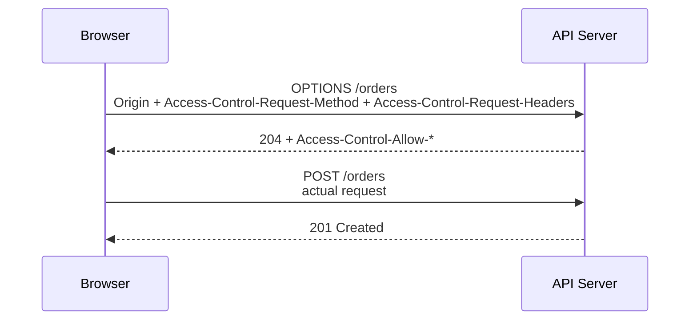
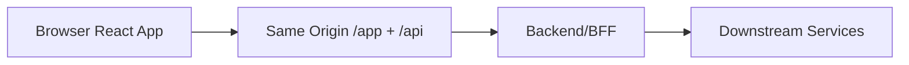
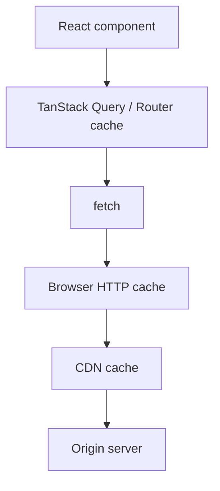
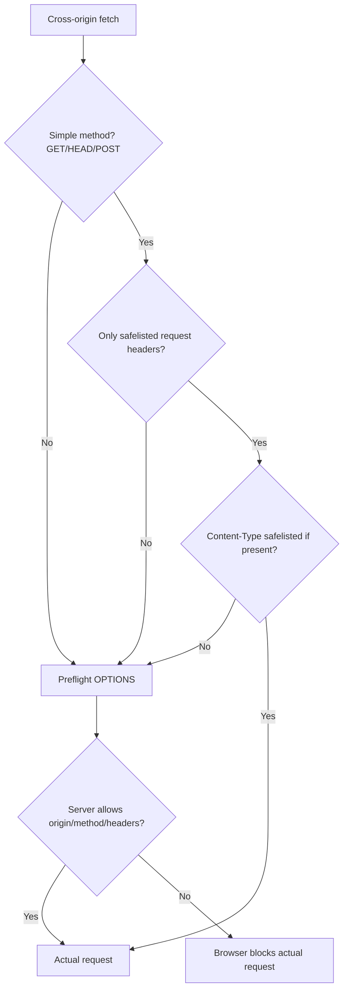

# Part 010 — Request Init, Headers, Body, and Mode

Part sebelumnya membahas Fetch sebagai pipeline.

Sekarang kita masuk ke control plane-nya: `RequestInit`.

```ts
await fetch('/api/orders', {
  method: 'POST',
  headers: {
    Accept: 'application/json',
    'Content-Type': 'application/json',
  },
  body: JSON.stringify({ itemId: 'item_123', quantity: 2 }),
  credentials: 'same-origin',
  mode: 'same-origin',
  cache: 'no-store',
  redirect: 'follow',
  signal: AbortSignal.timeout(10_000),
})
```

Ini terlihat seperti object konfigurasi biasa. Sebenarnya ini adalah deklarasi ke browser:

- method apa yang digunakan,
- metadata apa yang dikirim,
- body apa yang dikirim,
- credential boleh ikut atau tidak,
- cross-origin policy apa yang diterapkan,
- cache browser boleh dipakai atau tidak,
- redirect diikuti atau ditolak,
- referrer dikirim atau disembunyikan,
- request boleh hidup melewati page unload atau tidak,
- request bisa dibatalkan kapan,
- response seperti apa yang boleh terlihat ke JavaScript.

Dengan kata lain:

> `RequestInit` adalah contract antara application intent dan browser network machinery.

Kalau asal mengisi `RequestInit`, kamu tidak hanya membuat request. Kamu sedang menentukan security boundary, cache behavior, observability, privacy, dan failure semantics.

---

## 1. Anatomy of `RequestInit`

Field utama yang sering relevan untuk React application code:

| Field | Fungsi | Biasanya dipakai untuk |
|---|---|---|
| `method` | HTTP method | `GET`, `POST`, `PUT`, `PATCH`, `DELETE` |
| `headers` | request metadata | `Accept`, `Content-Type`, correlation id, idempotency key |
| `body` | request payload | JSON, `FormData`, `Blob`, `URLSearchParams`, stream |
| `mode` | cross-origin request mode | `cors`, `same-origin`, `no-cors` |
| `credentials` | credential sending/receiving policy | cookie session, cross-origin API |
| `cache` | browser HTTP cache behavior | default cache, no-store, reload, revalidation |
| `redirect` | redirect handling | follow, error, manual |
| `referrer` | explicit referrer value | privacy-sensitive request |
| `referrerPolicy` | referrer exposure rule | reduce path/query leakage |
| `integrity` | subresource integrity metadata | fetch known static asset securely |
| `keepalive` | allow request to outlive page | analytics/beacon-like fire-and-forget |
| `signal` | cancellation/deadline | route change, search debounce, timeout |
| `priority` | priority hint where supported | tuning relative importance |

Beberapa field lain ada di platform dan bisa experimental, browser-specific, atau hanya relevan untuk fitur tertentu. Prinsipnya: gunakan yang kamu pahami efek policy-nya. Jangan copy-paste `RequestInit` dari internet lalu menjadikannya global default.

---

## 2. `method`: Intent, Safety, dan Idempotency

`method` bukan string kosmetik.

```ts
await fetch('/api/orders', { method: 'GET' })
await fetch('/api/orders', { method: 'POST' })
await fetch('/api/orders/ord_123', { method: 'PATCH' })
await fetch('/api/orders/ord_123', { method: 'DELETE' })
```

HTTP method membawa semantic:

| Method | Safe? | Idempotent? | Typical use |
|---|---:|---:|---|
| `GET` | Ya | Ya | read resource |
| `HEAD` | Ya | Ya | read metadata |
| `POST` | Tidak | Tidak secara default | create, command, submit |
| `PUT` | Tidak | Ya secara semantic | replace resource |
| `PATCH` | Tidak | Tergantung design | partial update |
| `DELETE` | Tidak | Biasanya idempotent secara intent | delete resource |

Safe berarti request tidak dimaksudkan mengubah state server.

Idempotent berarti mengirim request yang sama berkali-kali memiliki efek akhir yang sama. Ini penting untuk retry.

### 2.1 React implication

Query/data fetching layer boleh lebih agresif untuk `GET`:

- dedupe,
- prefetch,
- background refetch,
- retry,
- cache.

Mutation harus lebih hati-hati:

- tidak semua `POST` boleh retry,
- optimistic update butuh rollback,
- user confirmation bisa diperlukan,
- duplicate submission harus dicegah,
- idempotency key perlu dipakai untuk command sensitif.

### 2.2 Jangan pakai `GET` untuk mutation

Buruk:

```ts
await fetch('/api/orders/ord_123/cancel')
```

Masalah:

- browser/proxy/cache bisa menganggap safe,
- link previewer bisa memicu action,
- prefetch bisa mengubah data,
- retry/dedupe jadi tidak aman,
- audit trail kabur.

Lebih benar:

```ts
await fetch('/api/orders/ord_123/cancellation', {
  method: 'POST',
  headers: { 'Content-Type': 'application/json' },
  body: JSON.stringify({ reason: 'customer_requested' }),
})
```

Atau jika model resource-nya memang state transition:

```ts
await fetch('/api/orders/ord_123', {
  method: 'PATCH',
  headers: { 'Content-Type': 'application/json' },
  body: JSON.stringify({ status: 'cancelled' }),
})
```

Pilih berdasarkan domain contract, bukan preferensi frontend.

---

## 3. `headers`: Metadata Contract

`headers` bisa diberikan sebagai plain object, array tuple, atau `Headers` instance.

```ts
await fetch('/api/orders', {
  headers: {
    Accept: 'application/json',
  },
})
```

```ts
await fetch('/api/orders', {
  headers: [
    ['Accept', 'application/json'],
    ['X-Request-Id', crypto.randomUUID()],
  ],
})
```

```ts
const headers = new Headers()
headers.set('Accept', 'application/json')
headers.set('X-Request-Id', crypto.randomUUID())

await fetch('/api/orders', { headers })
```

### 3.1 Header names are case-insensitive

HTTP header names case-insensitive. Namun di code, pilih satu style konsisten.

```ts
headers.set('Accept', 'application/json')
headers.get('accept') // tetap bisa bekerja pada Headers object
```

Dalam DevTools HTTP/2/HTTP/3, header sering terlihat lowercase. Jangan menulis logic yang bergantung pada casing.

### 3.2 `Accept` is not `Content-Type`

`Accept` menjelaskan response yang client harapkan.

```ts
headers: {
  Accept: 'application/json',
}
```

`Content-Type` menjelaskan request body.

```ts
headers: {
  'Content-Type': 'application/json',
}
```

Untuk `GET`, jangan asal set `Content-Type` karena tidak ada body.

```ts
await fetch('/api/orders', {
  headers: {
    Accept: 'application/json',
  },
})
```

Untuk JSON mutation:

```ts
await fetch('/api/orders', {
  method: 'POST',
  headers: {
    Accept: 'application/json',
    'Content-Type': 'application/json',
  },
  body: JSON.stringify({ itemId: 'item_123' }),
})
```

### 3.3 Forbidden request headers

Browser tidak mengizinkan JavaScript mengatur semua header.

Contoh kategori yang dikontrol browser:

- `Host`,
- `Connection`,
- beberapa cookie-related header,
- beberapa CORS/fetch metadata header,
- beberapa transport-level header.

Kenapa?

Karena page JavaScript berjalan dalam sandbox. Browser harus menjaga agar page tidak bisa memalsukan metadata transport/security yang dipakai untuk policy enforcement.

Jadi kalau ini tidak bekerja:

```ts
await fetch('/api/orders', {
  headers: {
    Host: 'evil.example.com',
    Cookie: 'session=abc',
  },
})
```

Itu bukan bug React. Itu browser security model.

### 3.4 CORS-safelisted request headers

Untuk cross-origin request, beberapa header dianggap sederhana/safelisted jika memenuhi constraint tertentu, misalnya:

- `Accept`,
- `Accept-Language`,
- `Content-Language`,
- `Content-Type` dengan value tertentu,
- `Range` dengan constraint tertentu.

Header custom seperti ini biasanya memicu preflight:

```ts
await fetch('https://api.example.com/orders', {
  method: 'POST',
  headers: {
    'Content-Type': 'application/json',
    'X-Request-Id': crypto.randomUUID(),
  },
  body: JSON.stringify({ itemId: 'item_123' }),
})
```

Preflight bukan error. Preflight adalah browser bertanya ke server:

> “Origin ini boleh mengirim method/header ini?”



Kalau server/API gateway tidak menangani preflight, request actual tidak akan dikirim.

### 3.5 Response headers may be hidden

Cross-origin response tidak otomatis mengekspos semua headers ke JavaScript.

Misalnya backend mengirim:

```http
X-Request-Id: req_123
X-RateLimit-Remaining: 42
```

Tetapi client:

```ts
response.headers.get('x-request-id') // null pada CORS response jika tidak exposed
```

Server perlu:

```http
Access-Control-Expose-Headers: X-Request-Id, X-RateLimit-Remaining
```

Kalau observability kamu bergantung pada `X-Request-Id`, pastikan header itu exposed untuk cross-origin frontend.

---

## 4. `body`: Payload Bukan Selalu JSON

`body` adalah request payload.

Common body types:

| Body type | Use case | Content-Type behavior |
|---|---|---|
| `string` | JSON string, text | kamu biasanya set manual |
| `URLSearchParams` | form-urlencoded | browser bisa set `application/x-www-form-urlencoded;charset=UTF-8` |
| `FormData` | file upload/form | browser set multipart boundary |
| `Blob` | binary payload | tergantung blob type |
| `ArrayBuffer` / typed arrays | binary protocol | set sesuai protocol |
| `ReadableStream` | streaming upload | advanced/runtime-dependent |

### 4.1 JSON body

```ts
await fetch('/api/orders', {
  method: 'POST',
  headers: {
    Accept: 'application/json',
    'Content-Type': 'application/json',
  },
  body: JSON.stringify({ itemId: 'item_123', quantity: 2 }),
})
```

Pitfall: `JSON.stringify(undefined)` menghasilkan `undefined`, bukan string JSON valid.

```ts
JSON.stringify(undefined) // undefined
```

Kalau wrapper kamu menerima `json?: unknown`, bedakan antara “tidak ada body” dan “body JSON null”.

```ts
type JsonRequest =
  | { json: unknown; body?: never }
  | { body: BodyInit; json?: never }
  | { json?: never; body?: never }
```

### 4.2 `null` vs empty body

```ts
body: JSON.stringify(null) // "null"
```

Berbeda dari:

```ts
body: undefined // no body
```

Server contract harus jelas. Untuk mutation command, empty body dan JSON null sebaiknya tidak ambigu.

### 4.3 `FormData`

```ts
const form = new FormData()
form.append('title', title)
form.append('file', file)

await fetch('/api/documents', {
  method: 'POST',
  body: form,
})
```

Jangan set `Content-Type` manual.

```ts
// salah untuk FormData
headers: {
  'Content-Type': 'multipart/form-data',
}
```

Browser perlu membuat boundary.

### 4.4 `URLSearchParams`

Untuk form-urlencoded:

```ts
const params = new URLSearchParams()
params.set('username', username)
params.set('password', password)

await fetch('/login', {
  method: 'POST',
  body: params,
})
```

Ini berguna untuk endpoint legacy, OAuth/token style endpoints tertentu, atau form-compatible backend.

### 4.5 GET/HEAD body

Jangan mengirim body untuk `GET`/`HEAD`.

```ts
await fetch('/api/orders', {
  method: 'GET',
  body: JSON.stringify({ status: 'paid' }), // invalid/problematic
})
```

Gunakan query params:

```ts
const url = new URL('/api/orders', window.location.origin)
url.searchParams.set('status', 'paid')

await fetch(url, { method: 'GET' })
```

---

## 5. `mode`: Browser Cross-Origin Contract

`mode` menentukan cross-origin behavior.

Common values:

| Mode | Meaning | Use case |
|---|---|---|
| `same-origin` | hanya izinkan same-origin | internal app API yang tidak boleh lintas origin |
| `cors` | izinkan cross-origin dengan CORS | API lintas origin yang benar |
| `no-cors` | request terbatas, response opaque | beacon/assets tertentu, bukan membaca API JSON |

### 5.1 `same-origin`

```ts
await fetch('/api/orders', {
  mode: 'same-origin',
})
```

Kalau URL berubah menjadi cross-origin, browser menolak.

Ini bagus untuk API internal yang seharusnya tidak pernah keluar origin. Ia bisa menjadi guardrail.

### 5.2 `cors`

```ts
await fetch('https://api.example.com/orders', {
  mode: 'cors',
})
```

Ini default untuk banyak cross-origin fetch. Browser akan menerapkan CORS policy.

CORS bukan auth. CORS adalah browser read-access policy.

Server tetap harus melakukan authentication/authorization. Jangan pernah menganggap CORS sebagai security utama untuk API.

### 5.3 `no-cors`

`no-cors` sering disalahgunakan.

```ts
const response = await fetch('https://api.example.com/orders', {
  mode: 'no-cors',
})

console.log(response.type)   // opaque
console.log(response.status) // 0
```

Response opaque tidak memberikan body/status/header yang berguna ke JavaScript.

Gunakan `no-cors` hanya kalau kamu memang tidak perlu membaca response. Untuk API JSON React app, hampir selalu salah.

### 5.4 Mode as architecture signal

Untuk internal same-origin BFF:

```ts
fetch('/api/orders', {
  mode: 'same-origin',
  credentials: 'same-origin',
})
```

Untuk public API cross-origin tanpa cookies:

```ts
fetch('https://api.example.com/orders', {
  mode: 'cors',
  credentials: 'omit',
})
```

Untuk cross-origin cookie session:

```ts
fetch('https://api.example.com/me', {
  mode: 'cors',
  credentials: 'include',
})
```

Masing-masing membutuhkan server policy berbeda.

---

## 6. `credentials`: Cookie and Credential Policy

`credentials` mengontrol apakah browser mengirim credential dan apakah browser menghormati `Set-Cookie` response tertentu.

Values:

| Value | Meaning |
|---|---|
| `omit` | jangan kirim credentials |
| `same-origin` | kirim untuk same-origin |
| `include` | kirim juga untuk cross-origin jika policy mengizinkan |

### 6.1 Same-origin cookie session

```ts
await fetch('/api/me', {
  credentials: 'same-origin',
})
```

Ini cocok untuk BFF/same-origin deployment:



### 6.2 Cross-origin cookie session

```ts
await fetch('https://api.example.com/me', {
  mode: 'cors',
  credentials: 'include',
})
```

Server harus mengirim CORS headers yang tepat:

```http
Access-Control-Allow-Origin: https://app.example.com
Access-Control-Allow-Credentials: true
```

Dan cookie harus punya attribute yang sesuai untuk konteks cross-site jika memang cross-site.

### 6.3 Bearer token case

Kalau memakai bearer token manual:

```ts
await fetch('https://api.example.com/me', {
  headers: {
    Authorization: `Bearer ${accessToken}`,
  },
  credentials: 'omit',
})
```

Tapi jangan menyimpulkan bearer token selalu lebih aman. Token storage, refresh, XSS exposure, rotation, and revocation adalah desain lain. Seri auth membahas lebih dalam; di sini fokus kita adalah transport behavior.

### 6.4 Rule of thumb

- Same-origin app API: `credentials: 'same-origin'`.
- Public third-party API tanpa cookies: `credentials: 'omit'`.
- Cross-origin cookie API: `credentials: 'include'` plus CORS credentials server-side.
- Jangan global default `include` tanpa alasan kuat.

---

## 7. `cache`: Browser HTTP Cache Control

`cache` memberi sinyal bagaimana request berinteraksi dengan browser HTTP cache.

Common values:

| Value | Rough meaning |
|---|---|
| `default` | gunakan normal HTTP cache semantics |
| `no-store` | jangan pakai/simpan HTTP cache |
| `reload` | bypass cache untuk request, bisa update cache |
| `no-cache` | revalidate sebelum pakai cached response |
| `force-cache` | gunakan cache jika ada walau stale dalam beberapa kondisi |
| `only-if-cached` | hanya cache; punya constraint mode tertentu |

### 7.1 Jangan campuradukkan cache browser dan query cache

React app bisa punya beberapa cache layer:



`cache: 'no-store'` hanya memengaruhi Fetch/browser HTTP cache behavior. Itu tidak otomatis menghapus TanStack Query cache atau framework data cache.

### 7.2 API data biasa

Untuk most authenticated API data, banyak tim memilih:

```ts
await fetch('/api/orders', {
  cache: 'no-store',
})
```

Lalu application cache dikelola oleh query/router layer.

Tapi ini bukan aturan absolut.

Untuk static/config/versioned resources, HTTP cache bisa sangat efektif.

```ts
await fetch('/config/app-config.v42.json', {
  cache: 'force-cache',
})
```

### 7.3 Revalidation-aware request

Kalau server mengirim `ETag`, browser bisa revalidate.

```http
ETag: "orders-v123"
Cache-Control: max-age=0, must-revalidate
```

Client dengan `cache: 'default'` atau `no-cache` bisa memanfaatkan conditional request tergantung browser/cache state.

Namun di React application architecture, jangan mengandalkan implicit browser cache untuk domain consistency kalau query cache juga aktif. Pilih ownership.

### 7.4 `only-if-cached`

`only-if-cached` punya constraint ketat dan biasanya hanya bekerja dengan `mode: 'same-origin'`. Ini jarang diperlukan dalam application code biasa.

Kalau kamu ingin offline-first behavior, Service Worker + Cache Storage biasanya lebih eksplisit daripada berharap `fetch cache` mode menyelesaikan semuanya.

---

## 8. `redirect`: Follow, Error, Manual

`redirect` mengontrol bagaimana fetch menangani HTTP redirect.

Values:

| Value | Meaning |
|---|---|
| `follow` | browser mengikuti redirect |
| `error` | redirect membuat fetch reject |
| `manual` | expose redirect terbatas/filtered tergantung mode/runtime |

Default umumnya `follow`.

```ts
await fetch('/api/orders', {
  redirect: 'follow',
})
```

### 8.1 Redirect can hide auth problems

Misalnya API mengembalikan redirect ke login HTML:

```http
302 Location: /login
```

Fetch follow redirect, lalu kamu menerima HTML login page dengan status `200`.

Kemudian:

```ts
await response.json() // parse error
```

Dari UI terlihat “JSON parse failed”, padahal akar masalahnya session expired atau gateway redirect.

Untuk API, lebih sehat server mengembalikan:

```http
401 Unauthorized
Content-Type: application/problem+json
```

Bukan redirect HTML.

### 8.2 Use redirect error for strict API client

Untuk internal API client, kamu bisa memilih:

```ts
await fetch('/api/orders', {
  redirect: 'error',
})
```

Ini membuat redirect menjadi failure cepat. Cocok jika API contract melarang redirect.

Trade-off: beberapa deployment/gateway mungkin melakukan canonical redirect (`http` ke `https`, trailing slash, region redirect). Pastikan contract infrastruktur jelas sebelum menjadikan ini default.

### 8.3 Manual redirect is not full access

`redirect: 'manual'` di browser tidak memberi kamu full redirect response seperti server-side HTTP client. Browser tetap menerapkan filtered response untuk security.

Jangan membangun auth/navigation protocol kompleks berdasarkan asumsi bahwa browser fetch bisa membaca semua redirect detail lintas origin.

---

## 9. `referrer` and `referrerPolicy`

Referrer bisa membocorkan informasi.

Contoh user berada di:

```txt
https://app.example.com/cases/case_123?token=abc
```

Lalu browser melakukan request ke third-party asset/API. Tanpa policy yang tepat, sebagian URL asal bisa terkirim sebagai referrer, tergantung default browser/policy.

Gunakan `referrerPolicy` untuk request sensitif.

```ts
await fetch('https://analytics.example.net/event', {
  method: 'POST',
  referrerPolicy: 'no-referrer',
  body: JSON.stringify(event),
})
```

Common policies:

| Policy | Meaning singkat |
|---|---|
| `no-referrer` | jangan kirim referrer |
| `origin` | kirim origin saja |
| `same-origin` | kirim referrer hanya same-origin |
| `strict-origin` | kirim origin untuk HTTPS→HTTPS, tidak untuk downgrade |
| `strict-origin-when-cross-origin` | umum sebagai default modern |

Untuk regulatory/case management app, hindari menaruh sensitive identifier di URL jika tidak perlu. Referrer policy adalah mitigation, bukan alasan untuk membuat URL bocor.

---

## 10. `integrity`: Subresource Integrity for Fetch

`integrity` memungkinkan browser memverifikasi content hash untuk resource tertentu.

```ts
await fetch('/assets/config.json', {
  integrity: 'sha384-...',
})
```

Ini lebih umum untuk static assets/subresources daripada API data dinamis.

Kapan berguna?

- static configuration pinned by hash,
- third-party static resource,
- high-integrity bootstrap resource,
- supply-chain-sensitive asset.

Kapan tidak cocok?

- API JSON dinamis,
- user-specific data,
- frequently changing response tanpa hash management,
- response terkompresi/ditransformasi di jalur yang membuat hash mismatch.

---

## 11. `keepalive`: Request yang Boleh Melewati Page Unload

`keepalive` memungkinkan request tertentu tetap berjalan saat page unload/navigation.

Use case:

- analytics event,
- session end signal,
- lightweight audit ping,
- best-effort telemetry.

```ts
await fetch('/api/telemetry/page-exit', {
  method: 'POST',
  body: JSON.stringify({ path: location.pathname }),
  headers: {
    'Content-Type': 'application/json',
  },
  keepalive: true,
})
```

Tapi jangan pakai `keepalive` untuk critical mutation.

Buruk:

```ts
fetch('/api/payments', {
  method: 'POST',
  body: JSON.stringify(payment),
  keepalive: true,
})
```

Kenapa?

- ukuran body dibatasi,
- lifecycle best-effort,
- user feedback tidak jelas,
- retry/confirmation sulit,
- duplicate/partial processing bisa sulit ditangani,
- tidak cocok untuk flow bisnis kritis.

Untuk critical mutation, buat UX yang eksplisit: pending, success/failure, retry, idempotency, audit trail.

---

## 12. `signal`: Cancellation and Deadline

`signal` menerima `AbortSignal`.

```ts
const controller = new AbortController()

await fetch('/api/orders', {
  signal: controller.signal,
})
```

### 12.1 Component-owned request

```tsx
useEffect(() => {
  const controller = new AbortController()

  getOrder(orderId, { signal: controller.signal })
    .then(setOrder)
    .catch((error) => {
      if (error instanceof DOMException && error.name === 'AbortError') return
      setError(error)
    })

  return () => controller.abort()
}, [orderId])
```

### 12.2 Query-owned request

```ts
useQuery({
  queryKey: ['orders', orderId],
  queryFn: ({ signal }) => getOrder(orderId, { signal }),
})
```

### 12.3 Timeout/deadline

```ts
await fetch('/api/orders', {
  signal: AbortSignal.timeout(10_000),
})
```

Timeout adalah client-side deadline. Ia tidak menjamin server menghentikan processing. Untuk mutation, server masih bisa memproses setelah client abort.

Jadi:

- timeout query biasanya aman untuk retry,
- timeout mutation harus dipadukan dengan idempotency key dan status reconciliation.

---

## 13. Building a Typed Request Builder

Tujuan: cegah kombinasi invalid.

Kita ingin API seperti ini:

```ts
api.requestJson({
  method: 'POST',
  path: '/api/orders',
  json: { itemId: 'item_123' },
  idempotencyKey: crypto.randomUUID(),
  signal,
})
```

Bukan:

```ts
fetch('/api/orders', {
  method: 'GET',
  body: JSON.stringify({ status: 'paid' }),
  headers: {
    'Content-Type': 'multipart/form-data',
  },
})
```

### 13.1 Types

```ts
type HttpMethod = 'GET' | 'HEAD' | 'POST' | 'PUT' | 'PATCH' | 'DELETE'

type BodylessMethod = 'GET' | 'HEAD'
type BodyAllowedMethod = Exclude<HttpMethod, BodylessMethod>

type BaseRequestOptions = {
  path: string
  headers?: HeadersInit
  signal?: AbortSignal
  credentials?: RequestCredentials
  mode?: RequestMode
}

type BodylessRequestOptions = BaseRequestOptions & {
  method: BodylessMethod
  query?: Record<string, string | number | boolean | null | undefined>
  json?: never
  body?: never
}

type JsonRequestOptions = BaseRequestOptions & {
  method: BodyAllowedMethod
  query?: Record<string, string | number | boolean | null | undefined>
  json: unknown
  body?: never
}

type RawBodyRequestOptions = BaseRequestOptions & {
  method: BodyAllowedMethod
  query?: Record<string, string | number | boolean | null | undefined>
  body: BodyInit
  json?: never
}

type RequestOptions =
  | BodylessRequestOptions
  | JsonRequestOptions
  | RawBodyRequestOptions
```

### 13.2 URL builder

```ts
function buildUrl(
  baseUrl: string,
  path: string,
  query?: Record<string, string | number | boolean | null | undefined>,
): URL {
  const url = new URL(path, baseUrl)

  for (const [key, value] of Object.entries(query ?? {})) {
    if (value === null || value === undefined) continue
    url.searchParams.set(key, String(value))
  }

  return url
}
```

### 13.3 Init builder

```ts
function buildRequestInit(options: RequestOptions): RequestInit {
  const headers = new Headers(options.headers)
  headers.set('Accept', headers.get('Accept') ?? 'application/json')

  let body: BodyInit | undefined

  if ('json' in options) {
    headers.set('Content-Type', headers.get('Content-Type') ?? 'application/json')
    body = JSON.stringify(options.json)
  } else if ('body' in options) {
    body = options.body
  }

  return {
    method: options.method,
    headers,
    body,
    signal: options.signal,
    mode: options.mode,
    credentials: options.credentials,
  }
}
```

Masalah subtle: `headers.get('Accept') ?? 'application/json'` aman, tetapi `Headers.set` butuh string. Jika header sudah ada dengan casing berbeda, `Headers` akan normalize.

### 13.4 Client

```ts
export function createHttpClient(config: {
  baseUrl: string
  defaultCredentials?: RequestCredentials
  defaultMode?: RequestMode
}) {
  return {
    async request(options: RequestOptions): Promise<Response> {
      const url = buildUrl(config.baseUrl, options.path, options.query)
      const init = buildRequestInit({
        ...options,
        credentials: options.credentials ?? config.defaultCredentials,
        mode: options.mode ?? config.defaultMode,
      } as RequestOptions)

      return fetch(url, init)
    },
  }
}
```

Ini masih simplified. Di production, hindari cast jika bisa dengan overload/helper lebih rapi. Tapi ide besarnya: shape request membatasi misuse.

---

## 14. CORS Preflight Decision Model

Preflight terjadi jika request cross-origin tidak memenuhi kriteria “simple request”.

Simplified model:



Important consequences:

1. Adding `Authorization` usually triggers preflight.
2. Adding custom `X-*` headers usually triggers preflight.
3. `Content-Type: application/json` on cross-origin `POST` usually triggers preflight.
4. Preflight failure appears to JavaScript as fetch failure, not as readable HTTP response.
5. Browser may cache successful preflight based on server policy.

Jangan optimize dengan menghilangkan header penting hanya untuk menghindari preflight. Optimalkan server/gateway CORS handling.

---

## 15. RequestInit Defaults: What Should Be Global?

Tidak semua option cocok jadi default global.

### 15.1 Reasonable defaults for same-origin app API

```ts
const defaultInit: RequestInit = {
  mode: 'same-origin',
  credentials: 'same-origin',
  redirect: 'error',
  cache: 'no-store',
}
```

Cocok jika:

- API memang same-origin,
- API tidak seharusnya redirect,
- server-state cache dikelola app/query layer,
- data user-specific.

Tidak cocok jika:

- app perlu fetch CDN/static resource,
- API lintas origin,
- redirect adalah bagian dari infrastructure,
- HTTP cache sengaja dipakai.

### 15.2 Reasonable defaults for cross-origin API without cookies

```ts
const defaultInit: RequestInit = {
  mode: 'cors',
  credentials: 'omit',
  redirect: 'error',
  cache: 'no-store',
}
```

### 15.3 Avoid these global defaults

Hindari:

```ts
credentials: 'include'
```

sebagai default global tanpa alasan. Ini memperluas credential surface.

Hindari:

```ts
mode: 'no-cors'
```

untuk API. Hampir selalu salah.

Hindari:

```ts
cache: 'reload'
```

sebagai default global. Bisa menghancurkan performa dan meniadakan caching yang valid.

Hindari:

```ts
redirect: 'follow'
```

untuk API yang seharusnya tidak redirect, jika redirect HTML login sering menyamarkan auth failure.

---

## 16. RequestInit by Use Case

### 16.1 Read authenticated same-origin JSON

```ts
await fetch('/api/orders?status=paid', {
  method: 'GET',
  mode: 'same-origin',
  credentials: 'same-origin',
  cache: 'no-store',
  headers: {
    Accept: 'application/json',
  },
  signal,
})
```

### 16.2 Create resource with JSON

```ts
await fetch('/api/orders', {
  method: 'POST',
  mode: 'same-origin',
  credentials: 'same-origin',
  cache: 'no-store',
  headers: {
    Accept: 'application/json',
    'Content-Type': 'application/json',
    'Idempotency-Key': crypto.randomUUID(),
  },
  body: JSON.stringify({ itemId: 'item_123', quantity: 2 }),
  signal,
})
```

### 16.3 Upload file

```ts
const form = new FormData()
form.append('file', file)
form.append('documentType', 'evidence')

await fetch('/api/documents', {
  method: 'POST',
  mode: 'same-origin',
  credentials: 'same-origin',
  body: form,
  signal,
})
```

No manual `Content-Type`.

### 16.4 Cross-origin bearer token API

```ts
await fetch('https://api.example.com/orders', {
  method: 'GET',
  mode: 'cors',
  credentials: 'omit',
  headers: {
    Accept: 'application/json',
    Authorization: `Bearer ${accessToken}`,
  },
  signal,
})
```

Expect preflight.

### 16.5 Cross-origin cookie API

```ts
await fetch('https://api.example.com/me', {
  method: 'GET',
  mode: 'cors',
  credentials: 'include',
  headers: {
    Accept: 'application/json',
  },
  signal,
})
```

Server must allow specific origin and credentials.

### 16.6 Best-effort telemetry

```ts
fetch('/api/telemetry', {
  method: 'POST',
  headers: {
    'Content-Type': 'application/json',
  },
  body: JSON.stringify({ type: 'page_hidden', at: Date.now() }),
  keepalive: true,
})
```

Do not block navigation on this. Do not use for critical mutation.

---

## 17. Security and Privacy Review

Every `RequestInit` should pass these questions.

### 17.1 Credentials

- Does this request need cookies/credentials?
- Is `include` necessary, or would `same-origin`/`omit` be safer?
- Is CORS server policy explicit, not wildcard with credentials?
- Are cookies configured with appropriate `SameSite`, `Secure`, and `HttpOnly` attributes?

### 17.2 Headers

- Are we sending unnecessary custom headers that expand preflight surface?
- Are correlation/request IDs safe to expose?
- Are we trying to set forbidden headers?
- Are PII or secrets accidentally placed in headers?

### 17.3 Body

- Is body schema validated before send?
- Is file upload size/type checked client-side and server-side?
- Are sensitive fields sent only when required?
- Are idempotency keys used for retryable commands?

### 17.4 Referrer

- Could URL path/query leak case IDs, tokens, or user identifiers?
- Should this request use stricter `referrerPolicy`?
- Should sensitive data be removed from URL design entirely?

### 17.5 Redirect

- Can API redirect to HTML login and break JSON parsing?
- Should redirects be treated as error for API calls?
- Are cross-origin redirects expected?

---

## 18. Observability Fields in RequestInit

A mature client often injects correlation headers.

```ts
function createRequestHeaders(input?: HeadersInit): Headers {
  const headers = new Headers(input)

  if (!headers.has('Accept')) {
    headers.set('Accept', 'application/json')
  }

  if (!headers.has('X-Request-Id')) {
    headers.set('X-Request-Id', crypto.randomUUID())
  }

  return headers
}
```

But think carefully:

- Some organizations prefer W3C `traceparent` generated by tracing instrumentation.
- Some proxies overwrite request IDs.
- Some CORS responses must expose the final response request ID.
- Client-generated IDs and server-generated IDs may differ.

For debugging production bugs, best shape is often:

```ts
type NetworkEvent = {
  operation: string
  method: string
  urlTemplate: string
  status?: number
  durationMs: number
  requestId?: string
  responseRequestId?: string
  errorKind?: string
}
```

Avoid logging full URL if query contains sensitive data. Prefer route template:

```txt
/api/orders/:orderId
```

instead of:

```txt
/api/orders/ord_123?customerEmail=alice@example.com
```

---

## 19. A Safer `createRequest` Helper

```ts
type CreateRequestInput = {
  baseUrl: string
  path: string
  method: HttpMethod
  query?: Record<string, string | number | boolean | null | undefined>
  headers?: HeadersInit
  json?: unknown
  body?: BodyInit
  mode?: RequestMode
  credentials?: RequestCredentials
  cache?: RequestCache
  redirect?: RequestRedirect
  referrerPolicy?: ReferrerPolicy
  keepalive?: boolean
  signal?: AbortSignal
}

function createRequest(input: CreateRequestInput): Request {
  if ((input.method === 'GET' || input.method === 'HEAD') && (input.body || 'json' in input)) {
    throw new Error(`${input.method} request must not include a body`)
  }

  if (input.body && 'json' in input) {
    throw new Error('Use either body or json, not both')
  }

  const url = buildUrl(input.baseUrl, input.path, input.query)
  const headers = new Headers(input.headers)

  if (!headers.has('Accept')) {
    headers.set('Accept', 'application/json')
  }

  let body: BodyInit | undefined

  if ('json' in input) {
    headers.set('Content-Type', headers.get('Content-Type') ?? 'application/json')
    body = JSON.stringify(input.json)
  } else if (input.body) {
    body = input.body
  }

  return new Request(url, {
    method: input.method,
    headers,
    body,
    mode: input.mode,
    credentials: input.credentials,
    cache: input.cache,
    redirect: input.redirect,
    referrerPolicy: input.referrerPolicy,
    keepalive: input.keepalive,
    signal: input.signal,
  })
}
```

Use it:

```ts
const request = createRequest({
  baseUrl: window.location.origin,
  path: '/api/orders',
  method: 'POST',
  json: { itemId: 'item_123' },
  credentials: 'same-origin',
  mode: 'same-origin',
  redirect: 'error',
  cache: 'no-store',
  signal,
})

const response = await fetch(request)
```

This helper protects a few invariants:

- no body for `GET`/`HEAD`,
- no mixed `json` and raw `body`,
- default `Accept`,
- correct JSON `Content-Type`,
- URL encoding through builder,
- explicit policy fields.

---

## 20. Failure Modes by Field

| Field | Bad value/pattern | Failure mode |
|---|---|---|
| `method` | `GET` for mutation | accidental state change via prefetch/cache/link |
| `headers` | custom headers cross-origin | preflight not handled by server |
| `headers` | manual `Content-Type` for `FormData` | server cannot parse multipart boundary |
| `body` | body with `GET` | invalid/problematic request |
| `mode` | `no-cors` for API JSON | opaque response; body unreadable |
| `credentials` | global `include` | expanded credential exposure |
| `cache` | global `reload` | degraded performance |
| `cache` | implicit browser cache + query cache | confusing consistency behavior |
| `redirect` | follow API redirect to login HTML | JSON parse error masks auth issue |
| `referrerPolicy` | default with sensitive URLs | potential referrer leakage |
| `keepalive` | critical mutation | uncertain lifecycle and feedback |
| `signal` | omitted for owned request | stale response/state write/leak |

---

## 21. Implementation Exercise: Request Policy Matrix

Buat matrix policy untuk aplikasi kamu.

Contoh:

| Operation class | mode | credentials | cache | redirect | retry | idempotency |
|---|---|---|---|---|---|---|
| Same-origin read | `same-origin` | `same-origin` | `no-store` | `error` | yes | n/a |
| Same-origin mutation | `same-origin` | `same-origin` | `no-store` | `error` | limited | required for command |
| File upload | `same-origin` | `same-origin` | `no-store` | `error` | no/limited | recommended |
| Public cross-origin read | `cors` | `omit` | `default` | `follow`/`error` | yes | n/a |
| Cross-origin cookie read | `cors` | `include` | `no-store` | `error` | yes | n/a |
| Telemetry | `same-origin`/`cors` | depends | `no-store` | `follow` | no | event id |

Tugas:

1. Tentukan default per operation class, bukan global tunggal.
2. Tulis alasan setiap default.
3. Tandai option yang tidak boleh dioverride oleh feature code.
4. Tandai option yang boleh dioverride dengan review.
5. Tentukan telemetry minimal untuk setiap operation class.

---

## 22. Ringkasan

`RequestInit` adalah tempat React app menyatakan policy request kepada browser.

Hal yang harus diingat:

- `method` menentukan safety/idempotency expectation.
- `headers` adalah metadata contract dan bisa memicu CORS preflight.
- `body` harus sesuai method dan content type.
- `mode` bukan solusi CORS; `no-cors` membuat response opaque.
- `credentials` memperluas atau membatasi credential surface.
- `cache` hanya satu layer dari beberapa cache dalam React app.
- `redirect` bisa menyembunyikan auth/gateway problem jika tidak dikontrol.
- `referrerPolicy` penting untuk privacy-sensitive URL.
- `keepalive` cocok untuk best-effort telemetry, bukan critical mutation.
- `signal` adalah lifecycle/deadline boundary.

Request yang baik bukan request yang “berhasil di laptop”. Request yang baik adalah request yang policy-nya eksplisit, failure mode-nya dipahami, dan ownership-nya jelas.

Part berikutnya membahas response parsing dan body streams lebih dalam: bagaimana membaca payload besar, streaming, clone, tee, progress, NDJSON, dan bagaimana menghindari memory trap di React app.

---

## Referensi

- MDN — RequestInit: `https://developer.mozilla.org/en-US/docs/Web/API/RequestInit`
- MDN — Using the Fetch API: `https://developer.mozilla.org/en-US/docs/Web/API/Fetch_API/Using_Fetch`
- MDN — HTTP headers: `https://developer.mozilla.org/en-US/docs/Web/HTTP/Reference/Headers`
- MDN — Forbidden request header: `https://developer.mozilla.org/en-US/docs/Glossary/Forbidden_request_header`
- MDN — CORS-safelisted request header: `https://developer.mozilla.org/en-US/docs/Glossary/CORS-safelisted_request_header`
- MDN — CORS-safelisted response header: `https://developer.mozilla.org/en-US/docs/Glossary/CORS-safelisted_response_header`
- MDN — Request credentials: `https://developer.mozilla.org/en-US/docs/Web/API/Request/credentials`
- MDN — Request keepalive: `https://developer.mozilla.org/en-US/docs/Web/API/Request/keepalive`
- WHATWG — Fetch Standard: `https://fetch.spec.whatwg.org/`
