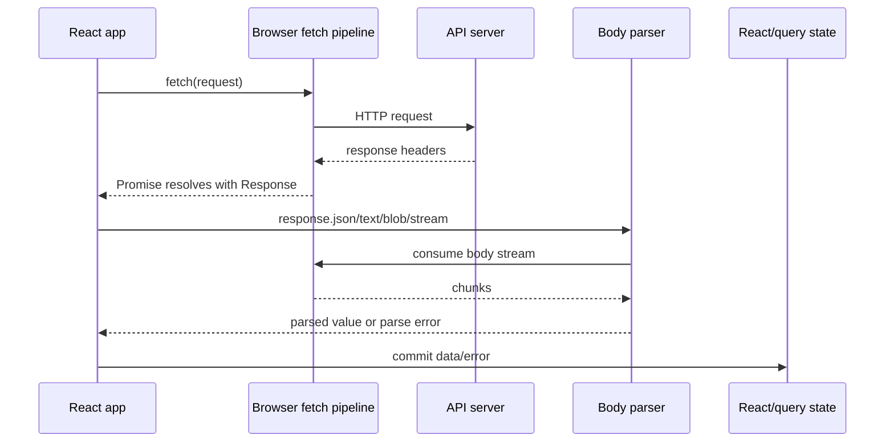
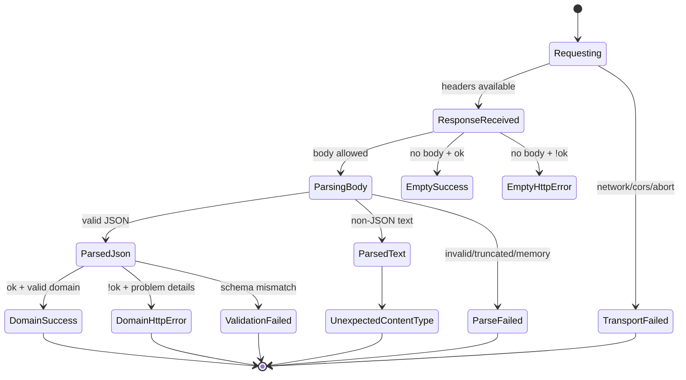

# Part 011 — Response Parsing and Body Streams

Banyak engineer memperlakukan response seperti object biasa:

```ts
const data = await fetch('/api/orders').then((r) => r.json())
```

Untuk demo, ini cukup.

Untuk production, ini terlalu polos.

Response dari network bukan sekadar JSON. Response adalah paket metadata, status, header, body stream, visibility policy, cache signal, error contract, dan parsing risk.

Mental model yang benar:

> `fetch()` menyelesaikan fase request sampai response tersedia. Membaca body adalah fase lain yang bisa gagal, lambat, mahal, dan hanya bisa dilakukan dengan aturan tertentu.

Part ini membahas bagaimana membaca response dengan benar sebelum data masuk ke React state, query cache, form state, atau UI.

---

## 1. Response Is Not Data

`Response` adalah envelope.

Envelope berisi:

| Bagian | Contoh | Fungsi |
|---|---|---|
| status | `200`, `404`, `500` | hasil HTTP-level |
| statusText | `OK`, `Not Found` | reason phrase; jangan dijadikan logic utama |
| headers | `content-type`, `etag`, `cache-control` | metadata parsing/cache/security |
| body | stream byte | payload mentah |
| type | `basic`, `cors`, `opaque`, `opaqueredirect` | visibility ke JavaScript |
| url | final URL | berguna untuk redirect/debug |
| redirected | `true`/`false` | menandai response hasil redirect |
| ok | `status >= 200 && status <= 299` | shortcut success HTTP |

Contoh:

```ts
const response = await fetch('/api/orders')

console.log(response.status)
console.log(response.ok)
console.log(response.headers.get('content-type'))
console.log(response.body) // ReadableStream | null
```

Yang sering dilupakan:

```ts
const response = await fetch('/api/orders')
```

Baris di atas **belum tentu berarti body selesai dibaca**.

Ia berarti browser sudah punya response object. Body mungkin masih mengalir, belum selesai, atau nanti gagal saat dikonsumsi.

---

## 2. Response Lifecycle



Ada dua failure boundary:

1. `fetch()` bisa gagal sebelum response tersedia.
2. body parsing bisa gagal setelah response tersedia.

Contoh:

```ts
const response = await fetch('/api/report')

// Network sudah menghasilkan Response.
// Tapi baris berikut masih bisa gagal karena:
// - body terputus,
// - body bukan JSON valid,
// - body sudah pernah dibaca,
// - stream dibatalkan,
// - memory pressure.
const payload = await response.json()
```

Karena itu wrapper production harus memisahkan:

- transport failure,
- HTTP status failure,
- parse failure,
- domain failure.

---

## 3. Body Is a Stream, Not a String

Dalam Fetch, response body adalah `ReadableStream`.

```ts
const response = await fetch('/api/export')
const stream = response.body
```

Stream berarti payload bisa datang bertahap.

Ini penting untuk:

- file besar,
- response lambat,
- streaming UI,
- NDJSON,
- AI/token streaming,
- progress indicator,
- memory control.

Tapi sebagian besar API client langsung melakukan ini:

```ts
const data = await response.json()
```

Itu artinya:

1. baca seluruh stream sampai selesai,
2. decode bytes menjadi teks,
3. parse JSON,
4. baru resolve ke application code.

Untuk payload kecil, aman.

Untuk payload besar, ini bisa menjadi bottleneck.

---

## 4. One-Shot Body Consumption

Response body bersifat one-shot.

Setelah dibaca, ia tidak bisa dibaca lagi.

```ts
const response = await fetch('/api/orders')

const text = await response.text()
const json = await response.json() // TypeError: body already consumed
```

Kesalahan umum:

```ts
async function badClient(path: string) {
  const response = await fetch(path)

  console.debug(await response.text())

  // Body sudah habis dibaca untuk debug.
  return response.json()
}
```

Solusi jika perlu membaca dua kali: gunakan `clone()` sebelum konsumsi.

```ts
async function client(path: string) {
  const response = await fetch(path)
  const copy = response.clone()

  console.debug(await copy.text())

  return response.json()
}
```

Tapi `clone()` bukan gratis. Ia membuat cabang stream. Untuk payload besar, clone bisa meningkatkan memory pressure atau buffering.

Rule praktis:

> Jangan clone response besar untuk logging. Ambil snippet terbatas atau metadata saja.

---

## 5. Locked and Disturbed Streams

Stream bisa berada dalam state:

| State | Arti |
|---|---|
| unlocked | belum ada reader aktif |
| locked | sudah ada reader aktif |
| disturbed | sudah mulai dibaca/dikonsumsi |
| closed | selesai |
| errored | gagal |

Contoh locked stream:

```ts
const response = await fetch('/api/events')
const reader = response.body?.getReader()

// Selama reader aktif, consumer lain tidak bisa membaca stream yang sama.
await response.text() // error, stream locked/disturbed
```

Pattern benar:

```ts
const response = await fetch('/api/events')
const reader = response.body?.getReader()

try {
  while (reader) {
    const { done, value } = await reader.read()
    if (done) break
    // process chunk
  }
} finally {
  reader?.releaseLock()
}
```

Jangan mencampur high-level body readers (`json()`, `text()`, `blob()`) dengan manual stream reader pada response yang sama.

---

## 6. Body Reader Methods

Fetch menyediakan beberapa method konsumsi body:

| Method | Output | Cocok untuk |
|---|---|---|
| `response.json()` | parsed JS value | JSON API kecil/menengah |
| `response.text()` | string | error body, HTML, plain text, NDJSON manual |
| `response.blob()` | `Blob` | file/image/download browser-side |
| `response.arrayBuffer()` | `ArrayBuffer` | binary parsing, crypto, custom format |
| `response.formData()` | `FormData` | multipart/form-data response tertentu |

Perbedaan penting:

```ts
const value = await response.json()
```

`value` adalah hasil parse JSON, bukan raw JSON string.

```ts
const text = await response.text()
const value = JSON.parse(text)
```

Ini memberi kamu kesempatan untuk:

- menyimpan raw snippet untuk debug,
- membedakan empty body vs invalid JSON,
- membatasi ukuran body yang dibaca,
- membuat error message lebih baik.

---

## 7. Do Not Parse by Assumption

Bad pattern:

```ts
async function getUser() {
  const r = await fetch('/api/me')
  return r.json()
}
```

Masalah:

- `204 No Content` akan gagal diparse sebagai JSON.
- `401` mungkin mengembalikan HTML login page.
- `500` mungkin mengembalikan plain text dari gateway.
- `Content-Type` bisa salah.
- body bisa kosong.
- response opaque tidak bisa dibaca.

Better pattern:

```ts
function isJsonContentType(value: string | null): boolean {
  if (!value) return false
  const lower = value.toLowerCase()
  return lower.includes('application/json') || lower.includes('+json')
}
```

Kemudian parse berdasarkan status dan content type.

---

## 8. Empty Response Semantics

Tidak semua successful response punya body.

Status yang lazim tanpa body:

| Status | Meaning |
|---|---|
| `204 No Content` | success, no body |
| `205 Reset Content` | success, reset view/form |
| `304 Not Modified` | cache validation response, body tidak dikirim ke app seperti normal API payload |

Parser naive akan rusak:

```ts
const response = await fetch('/api/orders/123', { method: 'DELETE' })
const data = await response.json() // bisa gagal jika server mengirim 204
```

Production parser harus punya explicit handling:

```ts
function responseAllowsBody(response: Response): boolean {
  return ![204, 205, 304].includes(response.status)
}
```

Namun status saja tidak cukup. `200` juga bisa punya body kosong karena bug server, proxy, feature flag, atau conditional behavior.

---

## 9. A Safe JSON Parser

Berikut parser dasar untuk JSON API production.

```ts
export type ParsedResponse<T> =
  | { kind: 'empty'; response: Response }
  | { kind: 'json'; response: Response; data: T }
  | { kind: 'text'; response: Response; text: string }

export async function parseResponseBody<T>(
  response: Response,
): Promise<ParsedResponse<T>> {
  if (!responseAllowsBody(response)) {
    return { kind: 'empty', response }
  }

  const contentType = response.headers.get('content-type')
  const text = await response.text()

  if (text.length === 0) {
    return { kind: 'empty', response }
  }

  if (!isJsonContentType(contentType)) {
    return { kind: 'text', response, text }
  }

  try {
    return { kind: 'json', response, data: JSON.parse(text) as T }
  } catch (cause) {
    throw new ApiParseError({
      message: 'Response body is not valid JSON',
      status: response.status,
      contentType,
      bodySnippet: text.slice(0, 1_000),
      cause,
    })
  }
}
```

Support class:

```ts
export class ApiParseError extends Error {
  readonly status: number
  readonly contentType: string | null
  readonly bodySnippet: string
  readonly cause: unknown

  constructor(input: {
    message: string
    status: number
    contentType: string | null
    bodySnippet: string
    cause: unknown
  }) {
    super(input.message)
    this.name = 'ApiParseError'
    this.status = input.status
    this.contentType = input.contentType
    this.bodySnippet = input.bodySnippet
    this.cause = input.cause
  }
}
```

Ini belum lengkap, tapi sudah lebih baik daripada `response.json()` langsung.

---

## 10. Separating HTTP Failure from Parse Failure

Jangan gabungkan semua error menjadi `throw new Error('Request failed')`.

Buat layer yang eksplisit:

```ts
export class HttpError<TBody = unknown> extends Error {
  readonly response: Response
  readonly body: TBody | undefined

  constructor(response: Response, body: TBody | undefined) {
    super(`HTTP ${response.status}`)
    this.name = 'HttpError'
    this.response = response
    this.body = body
  }
}
```

Lalu client:

```ts
export async function requestJson<T>(
  path: string,
  init?: RequestInit,
): Promise<T | undefined> {
  const response = await fetch(path, init)
  const parsed = await parseResponseBody<T>(response)

  const body = parsed.kind === 'json' ? parsed.data : undefined

  if (!response.ok) {
    throw new HttpError(response, body)
  }

  if (parsed.kind === 'empty') return undefined
  if (parsed.kind === 'json') return parsed.data

  throw new ApiParseError({
    message: 'Expected JSON response but received non-JSON body',
    status: response.status,
    contentType: response.headers.get('content-type'),
    bodySnippet: parsed.text.slice(0, 1_000),
    cause: undefined,
  })
}
```

Kenapa HTTP error tetap diparse?

Karena error response sering membawa payload penting:

```json
{
  "type": "https://example.com/problems/validation-error",
  "title": "Validation failed",
  "status": 422,
  "errors": {
    "email": ["Email is already used"]
  }
}
```

Tanpa parse body error, UI tidak bisa menampilkan pesan field-level.

---

## 11. Content Negotiation From the Client Side

Client sebaiknya mengirim `Accept`.

```ts
await fetch('/api/orders', {
  headers: {
    Accept: 'application/json',
  },
})
```

Untuk API error yang memakai Problem Details:

```ts
await fetch('/api/orders', {
  headers: {
    Accept: 'application/json, application/problem+json',
  },
})
```

Server tetap bisa salah konfigurasi. Jadi `Accept` bukan alasan untuk skip check `Content-Type`.

Invariant:

> `Accept` menyatakan apa yang client inginkan. `Content-Type` menyatakan apa yang server benar-benar kirim.

Parser harus percaya pada actual response, bukan asumsi request.

---

## 12. Runtime Validation Boundary

TypeScript tidak memvalidasi network payload.

```ts
type User = {
  id: string
  name: string
}

const user = await requestJson<User>('/api/me')
```

Generic `<User>` hanya memberi instruksi ke compiler. Payload runtime tetap bisa:

```json
{
  "id": 123,
  "displayName": null
}
```

Production boundary yang lebih aman:

```ts
import { z } from 'zod'

const UserSchema = z.object({
  id: z.string(),
  name: z.string(),
})

type User = z.infer<typeof UserSchema>

async function getMe(): Promise<User> {
  const value = await requestJson<unknown>('/api/me')
  return UserSchema.parse(value)
}
```

Gunakan runtime validation secara selektif:

| Area | Validation priority |
|---|---|
| auth/session/profile | tinggi |
| permission/capability payload | tinggi |
| payment/financial/regulatory data | sangat tinggi |
| public catalog | medium |
| internal dashboard non-critical | medium/low |
| telemetry response | low |

Validasi semua payload secara membabi buta bisa mahal. Tapi tidak memvalidasi boundary penting membuat bug kontrak masuk terlalu dalam ke UI.

---

## 13. Body Size and Memory Pressure

`response.json()` dan `response.text()` membaca body sampai selesai.

Untuk payload besar, konsekuensinya:

- seluruh body harus tersedia di memory,
- decode string bisa menggandakan memory sementara,
- JSON parse membuat object graph baru,
- React state/cache menyimpan object lagi,
- DevTools/logging bisa menambah copy.

Bad pattern:

```ts
const response = await fetch('/api/export-large')
const json = await response.json()
setState(json)
```

Untuk data besar, pertimbangkan:

- pagination,
- cursor/infinite query,
- server aggregation,
- NDJSON streaming,
- file download instead of JSON blob,
- partial rendering,
- virtualization,
- background worker parsing.

Rule:

> Kalau payload terlalu besar untuk dipahami user dalam satu layar, sering kali ia juga terlalu besar untuk dikirim sebagai satu JSON response.

---

## 14. Streaming Text with `TextDecoderStream`

Untuk response text yang datang bertahap:

```ts
export async function readTextStream(
  response: Response,
  onChunk: (chunk: string) => void,
): Promise<void> {
  if (!response.body) return

  const stream = response.body.pipeThrough(new TextDecoderStream())
  const reader = stream.getReader()

  try {
    while (true) {
      const { done, value } = await reader.read()
      if (done) break
      onChunk(value)
    }
  } finally {
    reader.releaseLock()
  }
}
```

Usage:

```ts
const response = await fetch('/api/logs/stream')

await readTextStream(response, (chunk) => {
  appendToLogBuffer(chunk)
})
```

Di React, jangan `setState` untuk setiap chunk kecil tanpa batching/throttling.

Bad:

```ts
onChunk={(chunk) => setLogs((x) => x + chunk)}
```

Untuk stream cepat, ini bisa menyebabkan render storm.

Better:

```ts
function createBufferedAppender(
  flush: (value: string) => void,
  intervalMs = 100,
) {
  let buffer = ''
  let timer: number | null = null

  return (chunk: string) => {
    buffer += chunk

    if (timer !== null) return

    timer = window.setTimeout(() => {
      const value = buffer
      buffer = ''
      timer = null
      flush(value)
    }, intervalMs)
  }
}
```

---

## 15. NDJSON Streaming

NDJSON adalah newline-delimited JSON: satu JSON object per baris.

Contoh response:

```json
{"type":"started","jobId":"job_123"}
{"type":"progress","percent":10}
{"type":"progress","percent":50}
{"type":"completed","resultUrl":"/exports/job_123.csv"}
```

Parser streaming:

```ts
export async function readNdjsonStream<T>(
  response: Response,
  onItem: (item: T) => void,
): Promise<void> {
  if (!response.body) return

  const reader = response.body
    .pipeThrough(new TextDecoderStream())
    .getReader()

  let buffer = ''

  try {
    while (true) {
      const { done, value } = await reader.read()

      if (done) break

      buffer += value

      let newlineIndex: number
      while ((newlineIndex = buffer.indexOf('\n')) >= 0) {
        const line = buffer.slice(0, newlineIndex).trim()
        buffer = buffer.slice(newlineIndex + 1)

        if (line.length === 0) continue

        onItem(JSON.parse(line) as T)
      }
    }

    const trailing = buffer.trim()
    if (trailing.length > 0) {
      onItem(JSON.parse(trailing) as T)
    }
  } finally {
    reader.releaseLock()
  }
}
```

React integration:

```ts
function useJobProgress(jobId: string) {
  const [events, setEvents] = React.useState<JobEvent[]>([])

  React.useEffect(() => {
    const controller = new AbortController()
    const append = createBufferedAppender((jsonText) => {
      const parsed = JSON.parse(`[${jsonText}]`) as JobEvent[]
      setEvents((previous) => [...previous, ...parsed])
    })

    async function run() {
      const response = await fetch(`/api/jobs/${jobId}/events`, {
        signal: controller.signal,
        headers: { Accept: 'application/x-ndjson' },
      })

      await readNdjsonStream<JobEvent>(response, (item) => {
        append(`${JSON.stringify(item)},`)
      })
    }

    run().catch((error) => {
      if (controller.signal.aborted) return
      console.error(error)
    })

    return () => controller.abort()
  }, [jobId])

  return events
}
```

Catatan: contoh di atas menunjukkan konsep buffering, bukan library final. Dalam production, lebih baik buffer array item, bukan string JSON buatan.

---

## 16. Safer NDJSON Buffering for React

Versi yang lebih masuk akal:

```ts
function createItemBatcher<T>(
  flush: (items: T[]) => void,
  intervalMs = 100,
) {
  let buffer: T[] = []
  let timer: number | null = null

  return (item: T) => {
    buffer.push(item)

    if (timer !== null) return

    timer = window.setTimeout(() => {
      const items = buffer
      buffer = []
      timer = null
      flush(items)
    }, intervalMs)
  }
}
```

Usage:

```ts
const addItem = createItemBatcher<JobEvent>((items) => {
  setEvents((previous) => [...previous, ...items])
})

await readNdjsonStream<JobEvent>(response, addItem)
```

Invariant:

> Streaming response tidak boleh otomatis berarti streaming render per byte/chunk.

Kamu perlu boundary antara network chunk dan UI update.

---

## 17. Download Progress

Fetch bisa membaca download progress melalui stream.

```ts
export async function downloadWithProgress(
  url: string,
  onProgress: (input: { loaded: number; total?: number }) => void,
): Promise<Blob> {
  const response = await fetch(url)

  if (!response.ok) {
    throw new Error(`Download failed: HTTP ${response.status}`)
  }

  const totalHeader = response.headers.get('content-length')
  const total = totalHeader ? Number(totalHeader) : undefined

  if (!response.body) {
    return response.blob()
  }

  const reader = response.body.getReader()
  const chunks: Uint8Array[] = []
  let loaded = 0

  try {
    while (true) {
      const { done, value } = await reader.read()
      if (done) break

      chunks.push(value)
      loaded += value.byteLength
      onProgress({ loaded, total })
    }
  } finally {
    reader.releaseLock()
  }

  return new Blob(chunks)
}
```

Limitasi:

- `content-length` bisa tidak ada karena compression/chunked transfer/gateway.
- progress bisa tidak linear.
- membaca semua chunks lalu membuat `Blob` tetap butuh memory.
- untuk file sangat besar, gunakan native browser download atau streaming ke filesystem API jika tersedia dan cocok.

---

## 18. Upload Progress Is Different

Fetch download progress dapat dibuat dengan membaca response stream.

Upload progress lebih rumit. Browser Fetch API tidak menyediakan callback upload progress umum seperti XHR.

Untuk upload dengan progress bar yang akurat, opsi umum:

1. gunakan `XMLHttpRequest` untuk upload progress,
2. gunakan upload multipart/chunked dengan progress per chunk,
3. gunakan server-side progress endpoint,
4. gunakan signed URL plus storage SDK jika sesuai.

Jangan membuat progress palsu yang terlihat akurat tetapi tidak mewakili transfer sebenarnya.

Better UX:

- tampilkan `preparing`, `uploading`, `processing`, `completed`,
- bedakan upload selesai dari server processing selesai,
- gunakan resumable upload untuk file besar,
- simpan upload id agar retry bisa aman.

---

## 19. Blob and Object URL Lifecycle

Untuk file/image hasil fetch:

```ts
const response = await fetch('/api/invoices/inv_123/pdf')
const blob = await response.blob()
const url = URL.createObjectURL(blob)
```

Di React:

```tsx
function PdfPreview({ invoiceId }: { invoiceId: string }) {
  const [url, setUrl] = React.useState<string | null>(null)

  React.useEffect(() => {
    let objectUrl: string | null = null
    const controller = new AbortController()

    async function run() {
      const response = await fetch(`/api/invoices/${invoiceId}/pdf`, {
        signal: controller.signal,
      })
      const blob = await response.blob()
      objectUrl = URL.createObjectURL(blob)
      setUrl(objectUrl)
    }

    run().catch((error) => {
      if (!controller.signal.aborted) console.error(error)
    })

    return () => {
      controller.abort()
      if (objectUrl) URL.revokeObjectURL(objectUrl)
    }
  }, [invoiceId])

  if (!url) return <p>Loading PDF...</p>
  return <iframe src={url} title="Invoice PDF" />
}
```

Invariant:

> Every object URL created by the app must have an owner responsible for revocation.

Tanpa `URL.revokeObjectURL`, long-lived React pages bisa leak memory.

---

## 20. ArrayBuffer for Binary Protocols

Gunakan `arrayBuffer()` saat butuh byte-level processing.

```ts
const response = await fetch('/api/files/checksum-input')
const buffer = await response.arrayBuffer()

const digest = await crypto.subtle.digest('SHA-256', buffer)
```

Cocok untuk:

- checksum,
- custom binary format,
- image/audio processing,
- encryption/decryption,
- WebAssembly input.

Tapi jangan gunakan `arrayBuffer()` untuk JSON. Itu hanya menambah pekerjaan.

---

## 21. Response Clone and Service Worker-Style Caching

`response.clone()` sering dipakai saat response perlu:

- dikembalikan ke caller,
- sekaligus disimpan ke cache,
- atau dibaca untuk logging terbatas.

Contoh Service Worker style:

```ts
async function cacheThenReturn(request: Request) {
  const response = await fetch(request)

  const cache = await caches.open('api-v1')
  cache.put(request, response.clone())

  return response
}
```

Di application code biasa, clone harus jarang.

Pertanyaan sebelum clone:

1. Apakah payload bisa besar?
2. Apakah body benar-benar perlu dibaca dua kali?
3. Apakah cukup membaca header/status saja?
4. Apakah logging bisa memakai snippet terbatas?
5. Apakah cache layer lebih tepat dilakukan di TanStack Query/CDN/HTTP cache?

---

## 22. Opaque Responses Cannot Be Parsed

Jika fetch menggunakan `mode: 'no-cors'`, response yang terlihat oleh JavaScript biasanya opaque.

```ts
const response = await fetch('https://third-party.example.com/data', {
  mode: 'no-cors',
})

console.log(response.type) // opaque
console.log(response.status) // often 0
await response.json() // tidak bisa membaca body berguna
```

`no-cors` bukan cara bypass CORS untuk API JSON.

Jika React app perlu membaca response cross-origin:

- server harus mengizinkan CORS,
- client menggunakan `mode: 'cors'`,
- credential policy harus benar,
- response headers yang dibutuhkan harus exposed.

---

## 23. Parsing Error Bodies Without Making Things Worse

Saat request gagal, kamu sering ingin membaca error body.

Bad:

```ts
if (!response.ok) {
  throw new Error(await response.text())
}

return response.json()
```

Masalah:

- error body bisa sangat besar,
- bisa berisi HTML penuh,
- bisa berisi PII,
- bisa tidak aman untuk ditampilkan ke user,
- body sudah hilang untuk consumer lain.

Better:

```ts
async function readErrorSnippet(response: Response, limit = 2_000) {
  const text = await response.text()
  return text.length > limit ? `${text.slice(0, limit)}...` : text
}
```

Lebih baik lagi: parse structured error jika content type mendukung, fallback ke snippet.

```ts
type ProblemDetails = {
  type?: string
  title?: string
  status?: number
  detail?: string
  instance?: string
  [key: string]: unknown
}

async function parseErrorBody(response: Response): Promise<unknown> {
  const parsed = await parseResponseBody<ProblemDetails>(response)
  if (parsed.kind === 'json') return parsed.data
  if (parsed.kind === 'text') {
    return { title: 'Unexpected error response', snippet: parsed.text.slice(0, 1_000) }
  }
  return undefined
}
```

Do not display raw server body directly to user.

---

## 24. Normalizing API Result Shape

A production client often returns normalized result:

```ts
type ApiSuccess<T> = {
  ok: true
  status: number
  headers: Headers
  data: T | undefined
}

type ApiFailure = {
  ok: false
  status?: number
  error: unknown
  response?: Response
}

type ApiResult<T> = ApiSuccess<T> | ApiFailure
```

Exception-based style:

```ts
const user = await api.get<User>('/api/me')
```

Result-based style:

```ts
const result = await api.getResult<User>('/api/me')

if (!result.ok) {
  showError(result.error)
  return
}

renderUser(result.data)
```

Exception style cocok untuk integration dengan query libraries karena mereka mengenali rejected promise sebagai failure.

Result style cocok untuk form/domain flow yang ingin local branching eksplisit.

Jangan campur tanpa aturan.

---

## 25. React Integration: Commit Only Parsed, Validated Data

Bad:

```tsx
useEffect(() => {
  fetch('/api/me').then((response) => {
    setResponse(response)
  })
}, [])
```

`Response` bukan state UI yang baik.

Better:

```tsx
useEffect(() => {
  const controller = new AbortController()

  async function run() {
    const value = await requestJson<unknown>('/api/me', {
      signal: controller.signal,
    })

    const user = UserSchema.parse(value)
    setUser(user)
  }

  run().catch((error) => {
    if (!controller.signal.aborted) setError(error)
  })

  return () => controller.abort()
}, [])
```

State React sebaiknya menerima:

- parsed data,
- validated data,
- domain error,
- view model,
- progress state.

Bukan raw `Response`, raw `Request`, atau raw stream reader kecuali component memang owner stream lifecycle.

---

## 26. State Machine for Response Consumption



Kalau client kamu tidak membedakan state-state ini, UI akan menampilkan error yang salah.

Contoh buruk:

> “Something went wrong” untuk invalid JSON dari API yang baru deploy.

Pesan user boleh sederhana. Tapi telemetry developer harus spesifik.

---

## 27. Building a Production `readJsonResponse`

```ts
type ReadJsonOptions<T> = {
  schema?: { parse(value: unknown): T }
  maxErrorSnippetBytes?: number
}

export async function readJsonResponse<T = unknown>(
  response: Response,
  options: ReadJsonOptions<T> = {},
): Promise<T | undefined> {
  const parsed = await parseResponseBody<unknown>(response)

  if (!response.ok) {
    const body = parsed.kind === 'json' ? parsed.data : parsed.kind === 'text' ? parsed.text : undefined
    throw new HttpError(response, body)
  }

  if (parsed.kind === 'empty') return undefined

  if (parsed.kind !== 'json') {
    throw new ApiParseError({
      message: 'Expected JSON response',
      status: response.status,
      contentType: response.headers.get('content-type'),
      bodySnippet: parsed.text.slice(0, options.maxErrorSnippetBytes ?? 1_000),
      cause: undefined,
    })
  }

  if (options.schema) {
    return options.schema.parse(parsed.data)
  }

  return parsed.data as T
}
```

Usage:

```ts
const user = await readJsonResponse(
  await fetch('/api/me', { signal }),
  { schema: UserSchema },
)
```

Atau wrapper:

```ts
export async function getJson<T>(
  path: string,
  options: RequestInit & ReadJsonOptions<T> = {},
) {
  const { schema, maxErrorSnippetBytes, ...init } = options
  const response = await fetch(path, init)
  return readJsonResponse<T>(response, { schema, maxErrorSnippetBytes })
}
```

---

## 28. Telemetry for Parsing Failures

Log minimal untuk parse failure:

| Field | Kenapa |
|---|---|
| operation name | mapping ke feature |
| URL template, bukan full URL sensitive | grouping |
| method | debugging |
| status | distinguish 2xx invalid JSON vs 5xx HTML |
| content-type | contract mismatch |
| content-length if present | payload size clue |
| response type | CORS/opaque clue |
| body snippet redacted | diagnosis |
| trace/correlation id | join server logs |
| browser/network info | edge-case diagnosis |

Jangan log:

- full access token,
- cookies,
- raw PII body,
- full payment/regulatory payload,
- huge HTML response.

Untuk regulatory/enterprise system, parse failure adalah contract incident, bukan sekadar frontend bug.

---

## 29. Testing Response Parsing

Test matrix:

| Case | Expected |
|---|---|
| `200 application/json` valid | returns data |
| `200 application/json` invalid | parse error |
| `200 text/html` | unexpected content error |
| `204` empty | returns undefined/empty |
| `404 application/problem+json` | HttpError with parsed body |
| `500 text/html` | HttpError with snippet |
| body consumed twice | explicit failure in test |
| aborted while reading | abort error path |
| large response | no accidental clone/logging |
| opaque response | visibility failure |

Example with MSW-like handler:

```ts
it('throws parse error for invalid JSON success response', async () => {
  server.use(
    http.get('/api/me', () => {
      return new Response('{bad json', {
        status: 200,
        headers: { 'content-type': 'application/json' },
      })
    }),
  )

  await expect(getJson('/api/me')).rejects.toMatchObject({
    name: 'ApiParseError',
    status: 200,
  })
})
```

---

## 30. Practical Design Rules

Use these rules as defaults:

1. Do not call `response.json()` directly in feature components.
2. Parse through a shared API boundary.
3. Handle empty responses explicitly.
4. Check `Content-Type`; do not assume JSON.
5. Parse error bodies separately from success bodies.
6. Do not log full bodies by default.
7. Do not clone large responses casually.
8. Use streaming for large or incremental data.
9. Batch stream-to-React state updates.
10. Validate important network payloads at runtime.
11. Treat parse failures as contract failures.
12. Keep raw `Response` out of UI state unless the component owns transport lifecycle.

---

## 31. Anti-Patterns

### Anti-pattern: universal JSON parse

```ts
const data = await response.json()
```

without status/content/empty handling.

### Anti-pattern: response body as log message

```ts
throw new Error(await response.text())
```

without redaction/limit.

### Anti-pattern: clone for every request

```ts
const copy = response.clone()
console.log(await copy.text())
return response.json()
```

This punishes successful traffic.

### Anti-pattern: streaming directly into render storm

```ts
onChunk={(chunk) => setText((x) => x + chunk)}
```

Use batching.

### Anti-pattern: TypeScript generic as trust boundary

```ts
return response.json() as Promise<User>
```

This is compile-time optimism, not runtime truth.

---

## 32. Checklist for a Response Parser

A production parser should answer:

- What statuses are bodyless?
- What content types count as JSON?
- How are `application/problem+json` bodies handled?
- How are invalid success bodies reported?
- How are invalid error bodies reported?
- Is body snippet redacted and bounded?
- Are empty `200` responses allowed?
- Are redirects visible and diagnosed?
- Are opaque responses diagnosed?
- Are large payloads protected?
- Is runtime validation applied where needed?
- Does parsing preserve correlation id?
- Does parsing produce telemetry useful to backend engineers?

---

## 33. Ringkasan

Response parsing adalah boundary antara dunia tidak dipercaya dan state aplikasi.

Yang harus diingat:

- `Response` bukan data.
- body adalah one-shot `ReadableStream`.
- `json()`, `text()`, `blob()`, `arrayBuffer()` mengonsumsi body.
- `clone()` berguna tetapi tidak gratis.
- status sukses tidak menjamin body valid.
- body kosong harus diperlakukan eksplisit.
- content type menentukan strategi parsing.
- error body harus diparse dengan aman, bukan langsung dilempar ke user.
- streaming harus dibatasi oleh batching agar tidak membuat render storm.
- TypeScript tidak memvalidasi network payload runtime.

Client-server communication yang matang bukan hanya tahu cara mengambil data. Ia tahu cara menerima payload yang salah, kosong, terlalu besar, terlambat, terputus, opaque, tidak sesuai schema, atau berubah format setelah deploy backend.

Part berikutnya membahas cancellation: `AbortController`, timeout, deadline, signal composition, cleanup React, dan kenapa membatalkan request tidak sama dengan membatalkan side effect di server.

---

## Referensi

- MDN — Using the Fetch API: `https://developer.mozilla.org/en-US/docs/Web/API/Fetch_API/Using_Fetch`
- MDN — Response.json(): `https://developer.mozilla.org/en-US/docs/Web/API/Response/json`
- MDN — ReadableStream: `https://developer.mozilla.org/en-US/docs/Web/API/ReadableStream`
- MDN — ReadableStream.getReader(): `https://developer.mozilla.org/en-US/docs/Web/API/ReadableStream/getReader`
- MDN — TextDecoderStream: `https://developer.mozilla.org/en-US/docs/Web/API/TextDecoderStream`
- MDN — Streams API concepts: `https://developer.mozilla.org/en-US/docs/Web/API/Streams_API/Concepts`
- WHATWG — Fetch Standard: `https://fetch.spec.whatwg.org/`
- RFC 9457 — Problem Details for HTTP APIs: `https://www.rfc-editor.org/rfc/rfc9457`
