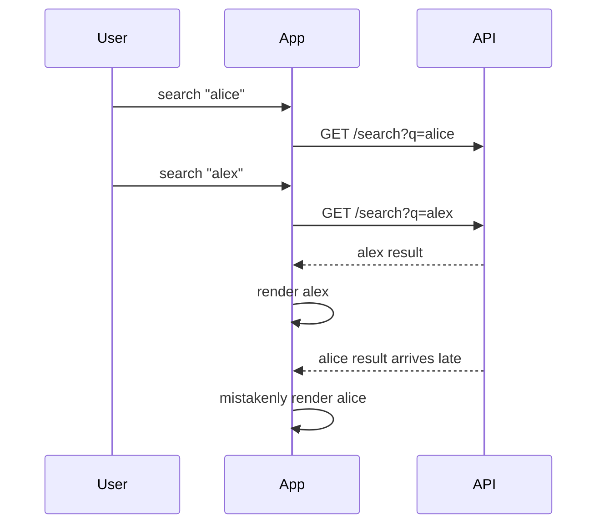
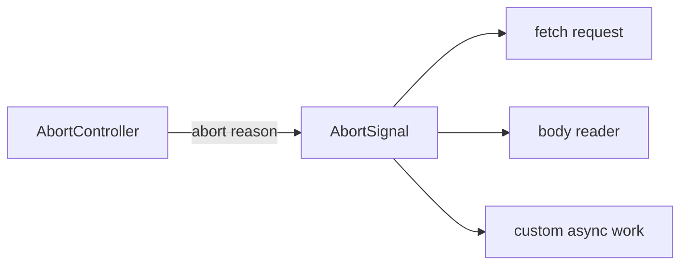
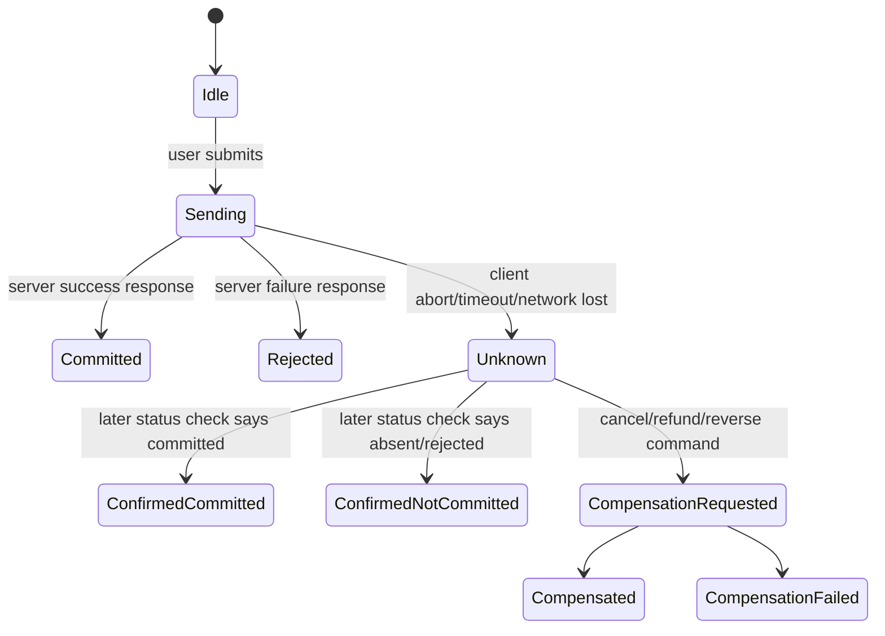

# Part 012 — AbortController, Timeout, and Cancellation

Cancellation sering diajarkan sebagai cleanup kecil:

```ts
useEffect(() => {
  const controller = new AbortController()

  fetch('/api/me', { signal: controller.signal })

  return () => controller.abort()
}, [])
```

Itu benar, tetapi belum cukup.

Dalam production React app, cancellation adalah bagian dari correctness model.

Ia menentukan:

- response lama boleh menulis state atau tidak,
- request yang sudah tidak relevan harus menghabiskan bandwidth atau tidak,
- timeout user experience diputuskan di mana,
- query baru membatalkan query lama atau berjalan paralel,
- navigation membatalkan loader atau tidak,
- mutation boleh dibatalkan atau hanya UI-nya yang berhenti menunggu,
- retry masih masuk akal atau sudah melewati deadline,
- server side effect sudah terjadi atau belum.

Mental model utama:

> Cancellation is not just stopping work. Cancellation is declaring that a result no longer has authority.

---

## 1. Why Cancellation Exists

Tanpa cancellation, React app mudah mengalami bug berikut:

### 1. Stale response overwrite

User mencari `alice`, lalu cepat mengetik `alex`.



### 2. Wasted work

User pindah halaman, tetapi request halaman lama tetap berjalan.

### 3. Infinite waiting

Server/gateway tidak merespons, UI terus loading.

### 4. Incorrect retry

Client retry setelah user sudah membatalkan flow.

### 5. Mutation ambiguity

User cancel saat request pembayaran sedang berjalan. Apakah pembayaran batal? Belum tentu.

Cancellation menyelesaikan sebagian dari masalah ini. Tapi tidak semuanya.

---

## 2. AbortController and AbortSignal Anatomy

Core API:

```ts
const controller = new AbortController()
const signal = controller.signal

controller.abort()
```

Fetch menerima signal:

```ts
await fetch('/api/orders', { signal })
```

Saat signal aborted:

- fetch dapat reject,
- body consumption dapat abort,
- stream dapat berhenti,
- code bisa memeriksa `signal.aborted`,
- reason dapat dibaca melalui `signal.reason` pada browser modern.

Basic guard:

```ts
try {
  await fetch('/api/me', { signal })
} catch (error) {
  if (signal.aborted) {
    return
  }

  throw error
}
```

Signal adalah read-only side. Controller adalah write side.



---

## 3. Signal Is One-Shot

AbortSignal hanya bisa bergerak dari not aborted ke aborted.

Ia tidak bisa di-reset.

Bad:

```ts
const controller = new AbortController()

async function search(q: string) {
  controller.abort()

  // Bug: signal sudah aborted. Request baru langsung gagal.
  return fetch(`/api/search?q=${q}`, {
    signal: controller.signal,
  })
}
```

Better:

```ts
let currentController: AbortController | null = null

async function search(q: string) {
  currentController?.abort('superseded')

  const controller = new AbortController()
  currentController = controller

  return fetch(`/api/search?q=${encodeURIComponent(q)}`, {
    signal: controller.signal,
  })
}
```

Rule:

> One operation attempt owns one controller.

Jika operation diulang, buat controller baru.

---

## 4. Cancellation Taxonomy

Tidak semua cancellation sama.

| Cancellation source | Contoh | Meaning |
|---|---|---|
| unmount | component hilang | result no longer has UI owner |
| dependency change | `userId` berubah | old result no longer matches input |
| navigation | route pindah | page-level data no longer relevant |
| timeout | deadline habis | user/app budget exceeded |
| superseded | search/filter baru | old operation replaced |
| manual user cancel | user klik cancel | user intent withdrawn |
| global shutdown | logout/app reset | all active work invalid |
| resource budget | too many inflight requests | protect app/browser/server |

Kenapa taxonomy penting?

Karena UI dan telemetry berbeda.

| Source | User message? | Log as error? | Retry? |
|---|---:|---:|---:|
| unmount | no | no | no |
| dependency change | no | no | no |
| superseded search | no | no | no |
| timeout | maybe | yes/metric | maybe |
| manual cancel | maybe “Cancelled” | no | no |
| logout | no | no | no |
| resource budget | maybe | yes | controlled |

Jika semua cancellation disebut “error”, observability akan penuh noise.

---

## 5. Timeout Is a Policy, Not a Magic Number

Timeout bukan sekadar:

```ts
setTimeout(() => controller.abort(), 10_000)
```

Timeout adalah budget.

Budget harus menjawab:

- berapa lama user rela menunggu?
- operation ini interactive atau background?
- apakah server masih memproses setelah timeout?
- apakah retry masih boleh?
- apakah timeout dihitung per attempt atau total deadline?
- apakah fallback tersedia?

Contoh budget:

| Operation | Suggested budget |
|---|---:|
| autocomplete | 300–1000 ms |
| route critical data | 3–10 s |
| save draft | 5–15 s |
| export job creation | 10–30 s |
| file upload | dynamic/progress-based |
| background prefetch | low priority, cancellable |

Angka di atas bukan hukum. Gunakan telemetry dan UX context.

---

## 6. `AbortSignal.timeout()`

Browser modern menyediakan:

```ts
const signal = AbortSignal.timeout(5_000)

await fetch('/api/me', { signal })
```

Ini membuat signal yang otomatis abort setelah durasi tertentu.

Keuntungan:

- sederhana,
- tidak perlu manual `setTimeout`,
- reason timeout lebih eksplisit di platform modern.

Limitasi:

- tidak semua environment lama mendukung,
- timeout signal juga one-shot,
- hanya satu source cancellation jika dipakai sendiri.

Biasanya kamu perlu menggabungkan timeout dengan signal lain.

---

## 7. Composing Signals with `AbortSignal.any()`

Satu request sering punya beberapa alasan batal:

- component unmount,
- user cancel,
- timeout,
- route navigation,
- logout.

Dengan `AbortSignal.any()`:

```ts
const signal = AbortSignal.any([
  componentSignal,
  userCancelSignal,
  AbortSignal.timeout(10_000),
])

await fetch('/api/report', { signal })
```

Jika salah satu signal abort, combined signal abort.

Fallback helper:

```ts
export function anySignal(signals: AbortSignal[]): AbortSignal {
  if (typeof AbortSignal.any === 'function') {
    return AbortSignal.any(signals)
  }

  const controller = new AbortController()

  const abort = (signal: AbortSignal) => {
    if (!controller.signal.aborted) {
      controller.abort(signal.reason)
    }
  }

  for (const signal of signals) {
    if (signal.aborted) {
      abort(signal)
      break
    }

    signal.addEventListener('abort', () => abort(signal), { once: true })
  }

  return controller.signal
}
```

---

## 8. Manual Timeout Helper

Untuk environment yang belum punya `AbortSignal.timeout()`:

```ts
export function timeoutSignal(ms: number, reason = 'timeout'): AbortSignal {
  const controller = new AbortController()

  const timer = window.setTimeout(() => {
    controller.abort(reason)
  }, ms)

  controller.signal.addEventListener(
    'abort',
    () => {
      window.clearTimeout(timer)
    },
    { once: true },
  )

  return controller.signal
}
```

Namun helper ini tidak memberi cara membatalkan timer dari luar kecuali signal abort sendiri.

Versi operation helper yang lebih eksplisit:

```ts
export async function withTimeout<T>(
  ms: number,
  run: (signal: AbortSignal) => Promise<T>,
): Promise<T> {
  const controller = new AbortController()
  const timer = window.setTimeout(() => controller.abort('timeout'), ms)

  try {
    return await run(controller.signal)
  } finally {
    window.clearTimeout(timer)
  }
}
```

Usage:

```ts
const data = await withTimeout(5_000, (signal) =>
  fetch('/api/me', { signal }).then((r) => r.json()),
)
```

---

## 9. Deadline vs Timeout

Timeout per attempt:

```txt
attempt 1: 5s
attempt 2: 5s
attempt 3: 5s
Total: maybe 15s+backoff
```

Deadline total:

```txt
total budget: 8s
attempts must fit inside 8s
```

For interactive UI, deadline is often better.

```ts
class Deadline {
  private readonly endsAt: number

  constructor(durationMs: number) {
    this.endsAt = performance.now() + durationMs
  }

  remainingMs() {
    return Math.max(0, this.endsAt - performance.now())
  }

  signal(): AbortSignal {
    return AbortSignal.timeout(this.remainingMs())
  }
}
```

Usage with retry:

```ts
const deadline = new Deadline(8_000)

for (let attempt = 1; attempt <= 3; attempt++) {
  const remaining = deadline.remainingMs()
  if (remaining <= 0) throw new Error('Deadline exceeded')

  try {
    return await fetch('/api/search', {
      signal: AbortSignal.timeout(remaining),
    })
  } catch (error) {
    if (attempt === 3) throw error
    await sleep(Math.min(250 * attempt, deadline.remainingMs()))
  }
}
```

Caveat: `AbortSignal.timeout(0)` means immediate abort. Guard zero/negative budgets intentionally.

---

## 10. React `useEffect` Cleanup Pattern

Canonical pattern:

```tsx
function UserProfile({ userId }: { userId: string }) {
  const [state, setState] = React.useState<UserState>({ status: 'idle' })

  React.useEffect(() => {
    const controller = new AbortController()

    async function run() {
      setState({ status: 'loading' })

      try {
        const response = await fetch(`/api/users/${userId}`, {
          signal: controller.signal,
        })
        const user = await readJsonResponse<User>(response)

        if (controller.signal.aborted) return

        setState({ status: 'success', user })
      } catch (error) {
        if (controller.signal.aborted) return
        setState({ status: 'error', error })
      }
    }

    run()

    return () => {
      controller.abort('component-disposed')
    }
  }, [userId])

  return renderUserState(state)
}
```

Why check `signal.aborted` after parsing?

Because abort can happen after response arrives but before parse or before state commit.

The authority check belongs near commit.

---

## 11. Sequence Guard vs Abort

Abort stops work when possible.

Sequence guard prevents stale commit even if abort does not stop everything.

```tsx
function useSearch(query: string) {
  const [results, setResults] = React.useState<SearchResult[]>([])
  const sequenceRef = React.useRef(0)

  React.useEffect(() => {
    const sequence = ++sequenceRef.current
    const controller = new AbortController()

    async function run() {
      const response = await fetch(`/api/search?q=${encodeURIComponent(query)}`, {
        signal: controller.signal,
      })
      const data = await readJsonResponse<SearchResult[]>(response)

      if (controller.signal.aborted) return
      if (sequence !== sequenceRef.current) return

      setResults(data ?? [])
    }

    run().catch((error) => {
      if (!controller.signal.aborted && sequence === sequenceRef.current) {
        console.error(error)
      }
    })

    return () => controller.abort('query-changed')
  }, [query])

  return results
}
```

For highly interactive search, use both:

- abort old request to save resources,
- sequence guard to protect correctness.

---

## 12. Abort and Body Consumption

Abort can affect body reading too.

```ts
const controller = new AbortController()
const response = await fetch('/api/large-report', {
  signal: controller.signal,
})

const reader = response.body!.getReader()

setTimeout(() => controller.abort('too-slow'), 1_000)

while (true) {
  const { done, value } = await reader.read()
  if (done) break
  process(value)
}
```

Depending on timing, abort may happen:

- before request starts,
- while waiting for headers,
- while reading body,
- after body fully read,
- after app already committed state.

A robust app handles all of these.

---

## 13. Cancellation-Aware Stream Reader

```ts
export async function readStreamWithSignal(
  response: Response,
  options: {
    signal: AbortSignal
    onChunk: (chunk: Uint8Array) => void
  },
) {
  if (!response.body) return

  const reader = response.body.getReader()

  const abort = () => {
    reader.cancel(options.signal.reason).catch(() => {
      // ignore cancellation cleanup failure
    })
  }

  if (options.signal.aborted) {
    abort()
    return
  }

  options.signal.addEventListener('abort', abort, { once: true })

  try {
    while (true) {
      if (options.signal.aborted) return

      const { done, value } = await reader.read()
      if (done) return

      options.onChunk(value)
    }
  } finally {
    options.signal.removeEventListener('abort', abort)
    reader.releaseLock()
  }
}
```

Stream cancellation should release ownership.

---

## 14. Abort Error Detection

Naive:

```ts
catch (error) {
  if ((error as Error).name === 'AbortError') return
  throw error
}
```

This often works, but not all abort-like paths look identical across abstraction layers.

Better if you own the signal:

```ts
catch (error) {
  if (signal.aborted) return
  throw error
}
```

For libraries/wrappers:

```ts
export function isAbortLikeError(error: unknown): boolean {
  return (
    error instanceof DOMException &&
    (error.name === 'AbortError' || error.name === 'TimeoutError')
  )
}
```

But prefer context-aware check:

```ts
if (signal.aborted) {
  // We know this operation was intentionally cancelled.
}
```

---

## 15. Building a Cancellation-Aware Fetch Client

```ts
type RequestPolicy = {
  timeoutMs?: number
  signal?: AbortSignal
}

export async function fetchWithPolicy(
  input: RequestInfo | URL,
  init: RequestInit & RequestPolicy = {},
): Promise<Response> {
  const { timeoutMs, signal, ...requestInit } = init

  const signals: AbortSignal[] = []

  if (signal) signals.push(signal)
  if (timeoutMs != null) signals.push(AbortSignal.timeout(timeoutMs))

  const effectiveSignal =
    signals.length === 0
      ? undefined
      : signals.length === 1
        ? signals[0]
        : AbortSignal.any(signals)

  return fetch(input, {
    ...requestInit,
    signal: effectiveSignal,
  })
}
```

Usage:

```ts
const response = await fetchWithPolicy('/api/me', {
  timeoutMs: 5_000,
  signal: routeSignal,
  headers: { Accept: 'application/json' },
})
```

If supporting older browsers, use wrappers from earlier section for `any` and `timeout`.

---

## 16. Cancellation-Aware JSON Client

```ts
export async function getJson<T>(
  path: string,
  options: RequestInit & {
    timeoutMs?: number
    signal?: AbortSignal
    schema?: { parse(value: unknown): T }
  } = {},
): Promise<T | undefined> {
  const { schema, ...init } = options

  const response = await fetchWithPolicy(path, {
    ...init,
    headers: {
      Accept: 'application/json, application/problem+json',
      ...init.headers,
    },
  })

  const value = await readJsonResponse<T>(response, { schema })

  if (options.signal?.aborted) {
    throw options.signal.reason ?? new DOMException('Aborted', 'AbortError')
  }

  return value
}
```

One subtle issue: if `fetchWithPolicy` creates an internal timeout signal, the caller's `options.signal` may not show timeout abort. In production, return or attach effective signal to request context if later stages must inspect it.

Better internal shape:

```ts
type EffectiveRequest = {
  signal?: AbortSignal
  timeoutMs?: number
}
```

Keep effective signal in a local variable and check that after parse.

---

## 17. Request Context Pattern

```ts
type RequestContext = {
  operation: string
  signal: AbortSignal
  startedAt: number
  deadlineMs?: number
}

function createRequestContext(input: {
  operation: string
  signal?: AbortSignal
  timeoutMs?: number
}): RequestContext {
  const signals: AbortSignal[] = []
  if (input.signal) signals.push(input.signal)
  if (input.timeoutMs != null) signals.push(AbortSignal.timeout(input.timeoutMs))

  return {
    operation: input.operation,
    signal:
      signals.length === 0
        ? new AbortController().signal
        : signals.length === 1
          ? signals[0]
          : AbortSignal.any(signals),
    startedAt: performance.now(),
    deadlineMs: input.timeoutMs,
  }
}
```

Then:

```ts
async function getUser(userId: string, parentSignal?: AbortSignal) {
  const context = createRequestContext({
    operation: 'users.get',
    signal: parentSignal,
    timeoutMs: 5_000,
  })

  const response = await fetch(`/api/users/${userId}`, {
    signal: context.signal,
    headers: { Accept: 'application/json' },
  })

  const user = await readJsonResponse<User>(response)

  if (context.signal.aborted) {
    throw context.signal.reason
  }

  return user
}
```

This gives every request a lifecycle owner.

---

## 18. Mutation Cancellation Is Not Undo

Critical principle:

> Aborting a fetch does not guarantee the server did not receive or commit the mutation.

Example:

```ts
const controller = new AbortController()

const promise = fetch('/api/payments', {
  method: 'POST',
  body: JSON.stringify({ amount: 100 }),
  signal: controller.signal,
})

controller.abort('user-cancelled')
```

Possible realities:

| Reality | What happened |
|---|---|
| request not sent | no server side effect |
| request partially sent | server may reject or still process |
| request fully sent, response not received | side effect may have committed |
| response received but app aborted before parsing | side effect committed; UI ignored response |

Therefore mutation cancellation must be modeled as:

- stop waiting,
- stop UI ownership,
- maybe send compensating command,
- maybe poll status,
- maybe rely on idempotency key,
- maybe show “status unknown”.

Do not say “cancelled” for a mutation unless server confirmed cancellation.

---

## 19. Mutation Ambiguity State Machine



For important writes, introduce operation id/idempotency key:

```ts
await fetch('/api/payments', {
  method: 'POST',
  headers: {
    'Content-Type': 'application/json',
    'Idempotency-Key': crypto.randomUUID(),
  },
  body: JSON.stringify(command),
  signal,
})
```

Then if timeout happens:

```ts
const status = await fetch(`/api/operations/${operationId}`).then((r) => r.json())
```

A cancellation-aware mutation does not lie to the user.

---

## 20. UI Language for Cancelled Work

For read operations:

- “Search cancelled” usually unnecessary.
- Just show the new search/loading state.

For user-initiated long job:

- “Upload cancelled” if client cancelled before completion.
- “Stopping…” if server cancellation is requested.
- “Status unknown. Checking…” if network timeout after command sent.

For sensitive operations:

- avoid “Cancelled” unless confirmed.
- prefer “We could not confirm the result. Please check status.”

This is especially important for payments, regulatory submissions, enforcement actions, approvals, and irreversible workflows.

---

## 21. Cancellation in Query Libraries

Modern server-state libraries commonly pass an `AbortSignal` to query functions.

Conceptual example:

```ts
useQuery({
  queryKey: ['user', userId],
  queryFn: ({ signal }) =>
    getJson<User>(`/api/users/${userId}`, { signal }),
})
```

Your API client must accept signal; otherwise the query library can mark a query obsolete but cannot stop transport.

Good query function:

```ts
async function fetchUser(userId: string, signal?: AbortSignal) {
  const response = await fetch(`/api/users/${userId}`, { signal })
  return readJsonResponse<User>(response)
}
```

Bad query function:

```ts
async function fetchUser(userId: string) {
  return fetch(`/api/users/${userId}`).then((r) => r.json())
}
```

The second ignores lifecycle ownership.

---

## 22. Route-Level Cancellation

Route loaders/actions in modern frameworks often receive request/signal-like lifecycle context.

Pattern:

```ts
export async function loader({ params, request }: LoaderArgs) {
  const response = await fetch(`/api/users/${params.userId}`, {
    signal: request.signal,
    headers: { Accept: 'application/json' },
  })

  return readJsonResponse<User>(response)
}
```

If user navigates away, the route system can abort pending work.

But the same mutation rule applies:

- aborting a loader read is usually safe,
- aborting an action write does not guarantee the write did not happen.

---

## 23. Cancellation and Retry

Retry loop must respect signal.

Bad:

```ts
for (let i = 0; i < 3; i++) {
  try {
    return await fetch(url)
  } catch {
    await sleep(1_000)
  }
}
```

If user navigates away, this loop continues.

Better:

```ts
function sleep(ms: number, signal?: AbortSignal) {
  return new Promise<void>((resolve, reject) => {
    if (signal?.aborted) {
      reject(signal.reason)
      return
    }

    const timer = window.setTimeout(resolve, ms)

    signal?.addEventListener(
      'abort',
      () => {
        window.clearTimeout(timer)
        reject(signal.reason)
      },
      { once: true },
    )
  })
}

async function retryingFetch(
  url: string,
  options: RequestInit & { signal?: AbortSignal } = {},
) {
  for (let attempt = 1; attempt <= 3; attempt++) {
    if (options.signal?.aborted) throw options.signal.reason

    try {
      return await fetch(url, options)
    } catch (error) {
      if (options.signal?.aborted) throw error
      if (attempt === 3) throw error
      await sleep(250 * attempt, options.signal)
    }
  }

  throw new Error('unreachable')
}
```

Retry is part of the same cancellation domain.

---

## 24. Cancellation and Concurrency Control

Autocomplete example:

```ts
class LatestOnlyRunner {
  private controller: AbortController | null = null
  private sequence = 0

  async run<T>(task: (signal: AbortSignal) => Promise<T>): Promise<T | undefined> {
    this.controller?.abort('superseded')

    const controller = new AbortController()
    const sequence = ++this.sequence
    this.controller = controller

    try {
      const result = await task(controller.signal)
      if (controller.signal.aborted) return undefined
      if (sequence !== this.sequence) return undefined
      return result
    } catch (error) {
      if (controller.signal.aborted) return undefined
      throw error
    }
  }

  cancel(reason = 'manual-cancel') {
    this.controller?.abort(reason)
  }
}
```

Usage:

```ts
const runner = new LatestOnlyRunner()

runner.run((signal) =>
  getJson<SearchResult[]>(`/api/search?q=${q}`, { signal, timeoutMs: 1_000 }),
)
```

This pattern encodes:

- latest request has authority,
- previous request loses authority,
- previous transport is aborted when possible.

---

## 25. In-Flight Request Registry

For complex apps, maintain a registry by operation/key.

```ts
type InflightEntry = {
  controller: AbortController
  startedAt: number
  operation: string
}

class InflightRegistry {
  private readonly entries = new Map<string, InflightEntry>()

  start(key: string, operation: string): AbortSignal {
    this.cancel(key, 'superseded')

    const controller = new AbortController()
    this.entries.set(key, {
      controller,
      operation,
      startedAt: performance.now(),
    })

    controller.signal.addEventListener(
      'abort',
      () => this.entries.delete(key),
      { once: true },
    )

    return controller.signal
  }

  finish(key: string) {
    this.entries.delete(key)
  }

  cancel(key: string, reason = 'cancelled') {
    const entry = this.entries.get(key)
    if (!entry) return
    entry.controller.abort(reason)
    this.entries.delete(key)
  }

  cancelAll(reason = 'global-cancel') {
    for (const [key, entry] of this.entries) {
      entry.controller.abort(reason)
      this.entries.delete(key)
    }
  }
}
```

Use cases:

- cancel all on logout,
- latest-only per search key,
- limit concurrent exports,
- cancel background prefetch on interaction.

Be careful not to rebuild what query libraries already provide unless you need cross-cutting ownership.

---

## 26. Cancellation and Service Workers

Abort from page fetch can affect request lifetime as seen by browser, but service workers and caches may introduce extra layers.

Important questions:

- Does the service worker pass the signal to its own fetch?
- Does it return cached response immediately?
- Does it continue background update after client abort?
- Does cache write happen after UI no longer needs it?

Service worker strategy must define whether cancellation is client-local or network-wide.

Example principle:

> UI abort should stop UI-owned work; background cache refresh may continue only if explicitly owned by service worker policy.

---

## 27. Observability for Cancellation

Do not log every abort as error.

Metric categories:

| Category | Example label |
|---|---|
| user/superseded | `cancel.superseded` |
| navigation/unmount | `cancel.lifecycle` |
| timeout | `cancel.timeout` |
| budget/concurrency | `cancel.resource_budget` |
| global logout/reset | `cancel.global_reset` |
| unknown abort | `cancel.unknown` |

For timeout, record:

- operation,
- timeout budget,
- elapsed time,
- attempt count,
- connection info if available,
- response phase if known: before headers vs body parsing,
- route/feature,
- trace id.

For manual/user cancellation, usually no error log.

---

## 28. Testing Cancellation

Test cases:

| Case | Expected |
|---|---|
| abort before fetch | immediate reject/no commit |
| abort during request | no state commit |
| abort during body parse | no state commit |
| dependency change | old response cannot overwrite new |
| timeout | timeout path surfaced |
| manual cancel mutation | status unknown unless server confirms |
| retry + abort during sleep | retry loop stops |
| stream + abort | reader cancelled/released |
| query signal passed | underlying fetch observes abort |

Example test:

```ts
it('does not commit stale result after abort', async () => {
  const controller = new AbortController()
  const commit = vi.fn()

  const promise = fetch('/api/slow', { signal: controller.signal })
    .then((r) => readJsonResponse(r))
    .then((data) => {
      if (!controller.signal.aborted) commit(data)
    })

  controller.abort('test')

  await expect(promise).resolves.toBeUndefined()
  expect(commit).not.toHaveBeenCalled()
})
```

For MSW, simulate delayed response and assert cleanup.

---

## 29. Production Failure Modes

| Failure mode | Root cause | Prevention |
|---|---|---|
| stale search results | old response commits late | abort + sequence guard |
| memory leak | stream reader not released | `finally` release/cancel |
| spinner forever | no timeout/deadline | operation budget |
| retry after navigation | retry loop ignores signal | cancellation-aware sleep |
| noisy error logs | abort logged as error | cancellation taxonomy |
| false mutation cancel | client abort interpreted as undo | operation status/idempotency |
| lost timeout context | internal signal hidden | request context/effective signal |
| aborted signal reused | controller stored globally | one controller per attempt |
| render storm | stream chunk commits too often | batching/throttle |
| background request leak | prefetch not cancelled | ownership policy |

---

## 30. Practical Cancellation Policy

Define defaults per operation:

| Operation | Timeout | Cancellation | Commit rule |
|---|---:|---|---|
| autocomplete | short | latest-only | latest sequence only |
| route read | medium | abort on navigation | route owner only |
| detail refresh | medium | abort on unmount/key change | matching resource key |
| background prefetch | short/low | abort on user interaction | cache only if still useful |
| form submit | medium | user may stop waiting | do not claim undo |
| critical mutation | longer + status check | cancellation creates unknown | confirm status |
| file upload | progress-based | explicit user cancel | upload protocol decides |
| streaming logs | no fixed or heartbeat | abort on close/unmount | batched append only |

---

## 31. Checklist for Fetch Cancellation

Before shipping a networked React feature, answer:

- Who owns this request lifecycle?
- What aborts it?
- What is its timeout/deadline?
- Is timeout per attempt or total operation?
- Does retry respect signal?
- Can stale response commit state?
- Is there a sequence/resource key guard?
- Are aborts logged separately from failures?
- Does stream reader release lock on abort?
- Does parser stop/ignore commit after abort?
- For mutation, what does cancel mean?
- Is idempotency needed?
- Is status check needed after timeout?
- Are user messages truthful?

---

## 32. Ringkasan

`AbortController` adalah primitive kecil dengan konsekuensi arsitektural besar.

Yang harus diingat:

- cancellation menyatakan result kehilangan authority.
- `AbortSignal` one-shot; jangan reuse untuk attempt baru.
- timeout adalah policy/budget, bukan angka random.
- `AbortSignal.timeout()` dan `AbortSignal.any()` membantu composition di browser modern.
- cleanup React harus abort request dan mencegah stale commit.
- abort tidak selalu menghentikan server work.
- mutation cancellation bukan undo.
- retry, stream, parser, query function, dan route loader harus signal-aware.
- log timeout sebagai reliability signal, tetapi jangan log lifecycle abort sebagai error.

React app yang matang bukan app yang tidak pernah membatalkan request. React app yang matang tahu kapan result sudah tidak punya hak lagi untuk mengubah UI, cache, atau workflow.

Part berikutnya membahas error taxonomy: network error, abort, timeout, HTTP error, parse error, validation error, domain error, conflict, rate limit, dan bagaimana UI + telemetry harus membedakannya.

---

## Referensi

- MDN — AbortController.abort(): `https://developer.mozilla.org/en-US/docs/Web/API/AbortController/abort`
- MDN — AbortSignal: `https://developer.mozilla.org/en-US/docs/Web/API/AbortSignal`
- MDN — AbortSignal.timeout(): `https://developer.mozilla.org/en-US/docs/Web/API/AbortSignal/timeout_static`
- MDN — Fetch API: `https://developer.mozilla.org/en-US/docs/Web/API/Fetch_API`
- MDN — Using the Fetch API: `https://developer.mozilla.org/en-US/docs/Web/API/Fetch_API/Using_Fetch`
- MDN — ReadableStream.getReader(): `https://developer.mozilla.org/en-US/docs/Web/API/ReadableStream/getReader`
- WHATWG — Fetch Standard: `https://fetch.spec.whatwg.org/`
