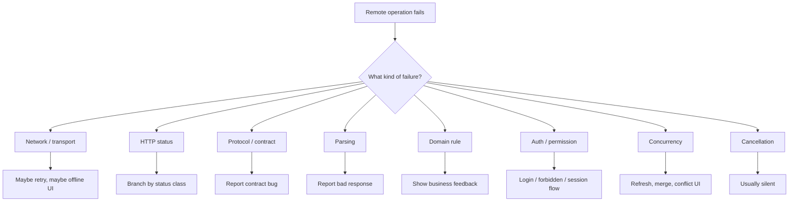
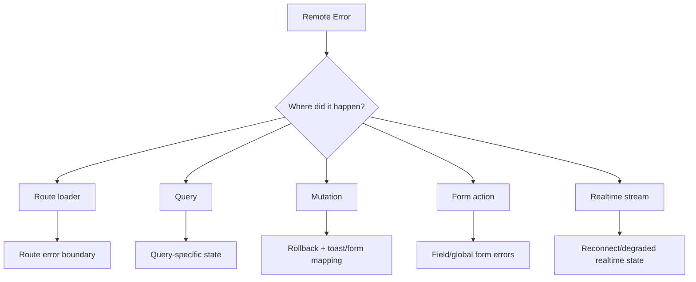
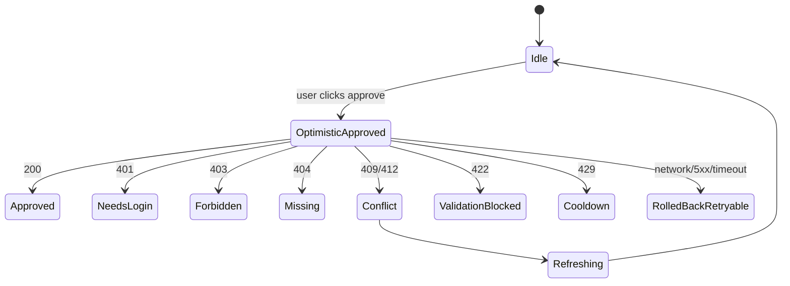

# Part 013 — Error Taxonomy: Network, HTTP, Domain

> A production React app does not fail because `fetch` failed. It fails because the application cannot decide what the failure means.

Di part sebelumnya kita sudah membahas `Response`, body stream, dan cancellation. Sekarang kita masuk ke topik yang sering disepelekan: **error taxonomy**.

Di aplikasi kecil, error sering dianggap satu hal:

```ts
try {
  const data = await fetch('/api/orders').then(r => r.json());
} catch (error) {
  setError('Something went wrong');
}
```

Di production, ini tidak cukup.

Karena React client harus bisa menjawab beberapa pertanyaan yang berbeda:

1. Apakah request benar-benar sampai ke server?
2. Apakah server memproses request tetapi menolak hasilnya?
3. Apakah response sukses secara HTTP tetapi gagal secara domain?
4. Apakah body tidak bisa diparse?
5. Apakah request dibatalkan oleh user/navigation?
6. Apakah aman untuk retry?
7. Apakah cache harus di-invalidasi?
8. Apakah user perlu login ulang, minta permission, memperbaiki input, atau hanya menunggu?
9. Apakah error harus dilaporkan sebagai incident?
10. Apakah error ini bagian dari ekspektasi bisnis normal?

Kalau semua kegagalan dilebur menjadi `Error`, UI akan salah mengambil tindakan.

Error taxonomy adalah fondasi untuk retry, cache invalidation, observability, form handling, realtime reconciliation, dan incident debugging.

---

## 1. Mental Model: Error Is a Decision Input

Error bukan sekadar pesan.

Error adalah **input ke control flow**.



Top 1% frontend engineer tidak hanya bertanya:

> “Kenapa error?”

Tapi bertanya:

> “Apa keputusan yang valid berdasarkan jenis error ini?”

Itulah beda antara error handling dan failure design.

---

## 2. The First Trap: Fetch Does Not Reject on HTTP Error

`fetch()` tidak sama dengan RPC function call.

Request seperti ini:

```ts
const response = await fetch('/api/orders/404');
```

bisa **resolve** walaupun server mengirim `404`, `409`, `422`, atau `500`.

`fetch()` biasanya reject untuk kegagalan request-level seperti network error, bad scheme, invalid URL, blocked request, atau abort. HTTP error tetap menghasilkan `Response`.

Jadi ini salah:

```ts
try {
  const response = await fetch('/api/orders/123');
  const order = await response.json();
  return order;
} catch {
  // Not all HTTP errors arrive here.
}
```

Yang benar:

```ts
const response = await fetch('/api/orders/123');

if (!response.ok) {
  throw await toHttpError(response);
}

return response.json();
```

Invariant penting:

> `catch` menangkap kegagalan operasi `fetch`; `response.ok` menangkap hasil HTTP non-2xx.

Kalau tim tidak memahami ini, aplikasi akan memperlakukan `404` sebagai success path sampai parsing atau UI runtuh di tempat lain.

---

## 3. Error Taxonomy Overview

Kita akan memakai taxonomy berikut:

| Category | Terjadi ketika | Biasanya retry? | Biasanya terlihat ke user? | Contoh |
|---|---|---:|---:|---|
| `network` | Browser gagal mendapatkan HTTP response yang bisa dibaca | Kadang | Ya, dengan offline/degraded UI | DNS fail, TLS fail, offline, CORS blocked |
| `timeout` | Deadline client habis | Kadang | Ya | Request terlalu lama |
| `abort` | Request sengaja dibatalkan | Tidak | Biasanya tidak | Navigation, unmount, user cancel |
| `http` | Server mengirim HTTP response non-2xx | Tergantung status | Tergantung | 404, 409, 422, 429, 500 |
| `problem` | Server mengirim structured problem detail | Tergantung `type/status` | Ya | RFC 9457 problem details |
| `parse` | Body tidak sesuai parser | Tidak | Umumnya generic | HTML error page saat expected JSON |
| `contract` | Shape/semantics response tidak sesuai contract | Tidak | Generic + report | Missing field, wrong enum |
| `domain` | Business rule gagal | Tidak | Ya | insufficient balance, invalid transition |
| `authn` | Identity/session tidak valid | Tidak | Ya, login/session flow | 401 |
| `authz` | User valid tapi tidak punya akses | Tidak | Ya, forbidden UX | 403 |
| `concurrency` | State versi client kalah/konflik | Tidak otomatis | Ya, conflict/reload UI | 409, 412 |
| `rate-limit` | Server membatasi request | Setelah delay | Ya/degraded | 429 + Retry-After |
| `server` | Server failure | Kadang | Ya | 500/502/503/504 |

Taxonomy ini bukan dekorasi. Ia menentukan:

- retry policy,
- UI state,
- telemetry severity,
- cache behavior,
- mutation rollback,
- form field mapping,
- session recovery,
- incident routing.

---

## 4. Network Error

Network error berarti browser tidak memberikan response HTTP yang bisa dipakai aplikasi.

Contoh penyebab:

- user offline,
- DNS gagal,
- TLS handshake gagal,
- koneksi reset,
- request diblokir browser policy,
- CORS gagal,
- mixed content diblokir,
- certificate invalid,
- service worker crash,
- ad blocker/privacy extension memblokir request,
- request aborted.

Dari sisi JavaScript, banyak kasus ini muncul sebagai `TypeError` dari `fetch`, tanpa detail low-level yang kaya.

```ts
try {
  await fetch('/api/orders');
} catch (error) {
  // Often TypeError: Failed to fetch
}
```

Browser sengaja tidak selalu mengekspos detail penuh karena alasan keamanan.

### 4.1 Network Error Is Not Always Server Down

Kesalahan umum:

> “Failed to fetch berarti backend down.”

Belum tentu.

Bisa jadi:

- CORS misconfigured,
- endpoint menggunakan HTTPS certificate bermasalah,
- user offline,
- request diblokir corporate proxy,
- extension memblokir URL,
- preflight gagal,
- service worker merespons dengan error,
- browser menolak credential policy.

Maka UI tidak boleh langsung berkata:

> “Server error.”

Lebih akurat:

> “Cannot connect. Check your connection or try again.”

Telemetry boleh menyimpan konteks request, tetapi jangan mengarang root cause.

### 4.2 Network Error Handling Pattern

```ts
export type NetworkError = {
  kind: 'network';
  message: string;
  cause: unknown;
  request: RequestInfo;
  retryable: true;
};

function toNetworkError(error: unknown, request: RequestInfo): NetworkError {
  return {
    kind: 'network',
    message: 'Network request failed before an HTTP response was available.',
    cause: error,
    request,
    retryable: true,
  };
}
```

Network error biasanya **mungkin retryable**, tetapi retry harus dikontrol oleh deadline, backoff, dan idempotency.

Khusus mutation, network error itu ambigu:

> Client tidak tahu apakah server menerima request sebelum koneksi putus.

Untuk mutation non-idempotent, jangan retry secara buta.

---

## 5. Timeout Error

JavaScript `fetch()` tidak memiliki timeout bawaan berbasis duration di `RequestInit`. Timeout biasanya dibuat dengan `AbortController` atau `AbortSignal.timeout()`.

Timeout bukan network error biasa.

Timeout berarti:

> Client memilih berhenti menunggu sebelum operasi selesai terlihat.

Server mungkin:

- belum menerima request,
- sedang memproses request,
- sudah commit side effect,
- sudah mengirim response tapi response terlambat sampai,
- akan tetap melanjutkan pekerjaan walaupun client abort.

### 5.1 Timeout Type

```ts
export type TimeoutError = {
  kind: 'timeout';
  timeoutMs: number;
  message: string;
  retryable: boolean;
};
```

`retryable` tidak otomatis `true`.

Untuk `GET`, timeout sering retryable.

Untuk `POST /payments`, timeout sangat berbahaya jika tidak ada idempotency key.

### 5.2 Deadline, Not Just Timeout

Timeout per request sering salah.

Misalnya user action punya SLA 5 detik:

```txt
User clicks Save
  validation: 300ms
  upload metadata: 1200ms
  submit mutation: 2500ms
  refetch: 1000ms
```

Kalau setiap step diberi timeout 5 detik, total bisa jauh lebih lama dari batas UX.

Lebih baik pikirkan **deadline**:

```ts
const deadline = Date.now() + 5_000;

function remainingMs(deadline: number) {
  return Math.max(0, deadline - Date.now());
}
```

Deadline adalah batas total operasi. Timeout adalah batas satu attempt.

Part 014 akan membahas ini lebih dalam.

---

## 6. Abort Error

Abort error adalah cancellation yang disengaja.

Contoh:

- user pindah route,
- component unmount,
- user menekan tombol cancel,
- input search berubah,
- request lama digantikan request baru,
- deadline habis.

Abort tidak selalu error yang perlu ditampilkan.

```ts
try {
  await fetch(url, { signal });
} catch (error) {
  if (isAbortError(error)) {
    return;
  }

  throw error;
}
```

### 6.1 Silent vs Visible Abort

| Abort cause | UI treatment |
|---|---|
| Route changed | Silent |
| Component unmounted | Silent |
| Newer search query replaced older request | Silent |
| User clicked Cancel Upload | Show canceled state if useful |
| Timeout via abort | Show timeout state |

Jangan menggabungkan semua abort ke satu message.

`AbortController.abort(reason)` memungkinkan alasan cancellation dikirim ke signal pada browser modern.

```ts
controller.abort({ kind: 'navigation' });
```

Lalu wrapper bisa membedakan:

```ts
function isAbortError(error: unknown): boolean {
  return error instanceof DOMException && error.name === 'AbortError';
}
```

Tetapi jangan bergantung sepenuhnya pada nama error lintas environment tanpa fallback, terutama di test/runtime non-browser.

---

## 7. HTTP Error

HTTP error berarti server mengirim response yang valid secara HTTP tetapi status-nya bukan success untuk operasi kita.

```ts
const response = await fetch('/api/orders/123');

if (!response.ok) {
  throw await toHttpError(response);
}
```

### 7.1 HTTP Status Class Mental Model

| Status | Meaning for React client |
|---|---|
| `1xx` | Informational; jarang terlihat langsung di app code |
| `2xx` | Request diterima sebagai success semantik HTTP |
| `3xx` | Redirect; sering diikuti otomatis oleh browser tergantung config |
| `4xx` | Client/request/user/context problem |
| `5xx` | Server/upstream/service problem |

Tetapi status class saja tidak cukup.

`404` untuk detail page berarti not found UI. `404` untuk background prefetch mungkin silent. `404` untuk endpoint yang seharusnya ada bisa berarti deployment mismatch.

HTTP status adalah sinyal. Maknanya tetap bergantung pada operasi.

---

## 8. Status Code as Control Flow

### 8.1 400 Bad Request

Biasanya request tidak valid secara syntax/shape.

React treatment:

- report sebagai client bug jika request dibentuk oleh app,
- tampilkan generic error jika input user tidak bisa dimap ke field,
- jangan retry otomatis.

### 8.2 401 Unauthorized

Nama status ini historis. Dalam praktik API modern, 401 berarti request butuh authentication valid.

React treatment:

- refresh token/session jika arsitektur mendukung,
- redirect login jika session invalid,
- jangan tampilkan “permission denied” kalau masalahnya belum authenticated.

### 8.3 403 Forbidden

User dikenali, tetapi tidak punya akses.

React treatment:

- forbidden UI,
- hide unavailable actions pada future render,
- jangan retry,
- audit/telemetry jika permission seharusnya ada.

### 8.4 404 Not Found

Bisa berarti beberapa hal:

- resource memang tidak ada,
- user tidak boleh mengetahui resource ada,
- route/API version mismatch,
- stale link,
- object sudah dihapus.

React treatment:

- detail route: show not found,
- list child resource: remove item or mark missing,
- mutation target: refresh parent list,
- background refetch: maybe invalidate cache.

### 8.5 409 Conflict

Biasanya konflik state atau constraint.

Contoh:

- optimistic update kalah,
- version mismatch,
- duplicate unique key,
- invalid state transition karena state berubah.

React treatment:

- jangan retry buta,
- refetch canonical state,
- tampilkan conflict resolution,
- rollback optimistic UI.

### 8.6 412 Precondition Failed

Sangat penting untuk concurrency.

Biasanya dipakai dengan conditional request seperti `If-Match` dan `ETag`.

React treatment:

- local version stale,
- refetch entity,
- merge atau minta user review perubahan.

### 8.7 422 Unprocessable Content

Sering dipakai untuk validation/domain input yang syntactically valid tetapi gagal secara semantic.

React treatment:

- map ke form field errors,
- jangan retry,
- jangan laporkan sebagai incident kecuali payload error tidak sesuai contract.

### 8.8 429 Too Many Requests

Client/server sedang rate-limited.

React treatment:

- hormati `Retry-After` jika ada,
- disable action sementara,
- tampilkan countdown/degraded state,
- jangan membuat retry storm.

### 8.9 500 Internal Server Error

Server gagal menangani request.

React treatment:

- show generic error,
- retry hanya untuk operasi aman dan bounded,
- report telemetry.

### 8.10 502/503/504

Biasanya gateway/upstream unavailable/timeout.

React treatment:

- retry dengan backoff untuk safe operations,
- fallback cache jika ada,
- degrade UI.

---

## 9. Problem Details: Structured Error Body

HTTP status memberi kategori. Body memberi detail.

Untuk API modern, gunakan structured problem format.

RFC 9457 mendefinisikan Problem Details untuk membawa detail error machine-readable dalam HTTP API.

Bentuk umum:

```json
{
  "type": "https://api.example.com/problems/order-state-conflict",
  "title": "Order state conflict",
  "status": 409,
  "detail": "Order cannot be approved because it has already been cancelled.",
  "instance": "/orders/ord_123/approval-attempts/att_456"
}
```

Dalam aplikasi React, `title` dan `detail` tidak otomatis aman untuk ditampilkan. Itu keputusan produk/security.

### 9.1 Problem Detail Extension

API boleh menambahkan fields.

Contoh validation:

```json
{
  "type": "https://api.example.com/problems/validation-error",
  "title": "Validation failed",
  "status": 422,
  "errors": [
    {
      "field": "email",
      "code": "invalid_format",
      "message": "Email format is invalid."
    }
  ]
}
```

Contoh concurrency:

```json
{
  "type": "https://api.example.com/problems/version-conflict",
  "title": "Version conflict",
  "status": 409,
  "currentVersion": 18,
  "attemptedVersion": 17,
  "mergeStrategy": "manual"
}
```

Contoh rate limit:

```json
{
  "type": "https://api.example.com/problems/rate-limit-exceeded",
  "title": "Rate limit exceeded",
  "status": 429,
  "retryAfterSeconds": 30,
  "limit": 100,
  "windowSeconds": 60
}
```

### 9.2 Client Parser for Problem Details

```ts
type ProblemDetails = {
  type?: string;
  title?: string;
  status?: number;
  detail?: string;
  instance?: string;
  [extension: string]: unknown;
};

function isProblemDetails(value: unknown): value is ProblemDetails {
  if (!value || typeof value !== 'object') return false;

  const record = value as Record<string, unknown>;

  return (
    ('type' in record && typeof record.type === 'string') ||
    ('title' in record && typeof record.title === 'string') ||
    ('status' in record && typeof record.status === 'number')
  );
}
```

Jangan terlalu strict sehingga response problem valid gagal diparse hanya karena server tidak mengirim semua field.

Tetapi untuk extension yang dipakai control flow, validasi lebih ketat.

```ts
type ValidationProblem = ProblemDetails & {
  type: 'https://api.example.com/problems/validation-error';
  status: 422;
  errors: Array<{
    field: string;
    code: string;
    message: string;
  }>;
};
```

---

## 10. Parse Error

Parse error terjadi ketika body tidak bisa dibaca sesuai ekspektasi client.

Contoh:

- expected JSON, server mengirim HTML error page,
- response kosong tetapi client memanggil `response.json()`,
- JSON malformed,
- content encoding rusak,
- body sudah dibaca sebelumnya,
- stream terputus di tengah.

### 10.1 Parse Error Is Usually a Contract/Infrastructure Signal

Kalau endpoint mengatakan `Content-Type: application/json`, tetapi mengirim HTML, ini bukan validation error user.

Ini biasanya:

- reverse proxy error page,
- backend exception page,
- auth gateway redirect ke HTML login,
- CDN/WAF response,
- deployment mismatch.

React treatment:

- tampilkan generic error,
- report telemetry dengan status/content-type/body preview terbatas,
- jangan retry kecuali status/operation mendukung,
- jangan tampilkan raw body ke user.

### 10.2 Safe Parse Pattern

```ts
type ParseResult<T> =
  | { ok: true; value: T }
  | { ok: false; error: ParseFailure };

type ParseFailure = {
  kind: 'parse';
  expected: 'json' | 'text' | 'blob' | 'arrayBuffer';
  contentType: string | null;
  status: number;
  message: string;
  bodyPreview?: string;
};

async function parseJsonSafe<T>(response: Response): Promise<ParseResult<T>> {
  const contentType = response.headers.get('content-type');

  try {
    if (response.status === 204 || response.status === 205) {
      return { ok: true, value: undefined as T };
    }

    const text = await response.text();

    if (text.length === 0) {
      return { ok: true, value: undefined as T };
    }

    return { ok: true, value: JSON.parse(text) as T };
  } catch (error) {
    return {
      ok: false,
      error: {
        kind: 'parse',
        expected: 'json',
        contentType,
        status: response.status,
        message: error instanceof Error ? error.message : 'Failed to parse JSON response.',
      },
    };
  }
}
```

Catatan: membaca `text()` dulu lalu `JSON.parse()` memberi peluang mengambil body preview untuk observability. Tetapi jangan menyimpan PII sembarangan.

---

## 11. Contract Error

Parse error menjawab:

> “Apakah body bisa dibaca?”

Contract error menjawab:

> “Apakah data yang dibaca sesuai kontrak aplikasi?”

Contoh:

```json
{
  "id": "ord_123",
  "status": "APPROVED"
}
```

Client mengharapkan:

```ts
type Order = {
  id: string;
  status: 'draft' | 'submitted' | 'approved' | 'rejected';
};
```

`APPROVED` uppercase bisa parse sebagai JSON, tetapi gagal contract.

### 11.1 Runtime Validation Boundary

TypeScript tidak memvalidasi data runtime.

```ts
const order = await response.json() as Order;
```

Kode di atas hanya assertion. Ia tidak membuktikan server mengirim `Order`.

Untuk boundary penting, gunakan runtime validation.

Contoh dengan pseudo schema:

```ts
const OrderSchema = object({
  id: string(),
  status: union([
    literal('draft'),
    literal('submitted'),
    literal('approved'),
    literal('rejected'),
  ]),
});

const parsed = OrderSchema.safeParse(json);

if (!parsed.success) {
  throw {
    kind: 'contract',
    message: 'Order response does not match client contract.',
    issues: parsed.error.issues,
  };
}
```

### 11.2 Which Boundaries Deserve Runtime Validation?

Tidak semua response harus divalidasi dengan biaya runtime besar.

Prioritaskan:

- data yang mengontrol permission UI,
- money/payment/entitlement,
- workflow state machine,
- feature flags,
- experiment assignment,
- destructive actions,
- persisted drafts,
- cross-version API migration,
- public API consumed by multiple clients.

Untuk view-only low-risk data, sampling validation atau contract tests mungkin cukup.

---

## 12. Domain Error

Domain error terjadi ketika request valid secara HTTP dan contract, tetapi operasi gagal karena aturan bisnis.

Contoh:

- “Cannot approve cancelled order.”
- “Insufficient balance.”
- “Case is already assigned.”
- “Document must be verified before submission.”
- “Quota exceeded.”

Domain error bukan bug. Ia bagian dari model bisnis.

### 12.1 Do Not Treat Domain Errors as Exceptions Everywhere

Di UI, domain error sering harus menjadi state biasa.

```ts
type SubmitOrderResult =
  | { kind: 'submitted'; orderId: string }
  | { kind: 'blocked'; reason: 'missing_documents'; missingDocumentIds: string[] }
  | { kind: 'conflict'; currentStatus: string };
```

Untuk form/action, domain failure kadang lebih baik dikembalikan sebagai typed result daripada dilempar sebagai exception.

Tetapi pada shared network client, tetap boleh direpresentasikan sebagai structured error agar query/mutation lifecycle bisa menangani rollback.

### 12.2 Domain Error Must Be Actionable

Domain error buruk:

```json
{
  "message": "Invalid state"
}
```

Domain error baik:

```json
{
  "type": "https://api.example.com/problems/invalid-order-transition",
  "title": "Invalid order transition",
  "status": 409,
  "fromStatus": "cancelled",
  "attemptedTransition": "approve",
  "allowedTransitions": ["archive"],
  "userAction": "refresh_required"
}
```

Client tidak boleh menebak domain recovery dari string message.

---

## 13. Authentication Error vs Authorization Error

Jangan campur `401` dan `403`.

### 13.1 Authentication Failure

Authentication menjawab:

> “Siapa user ini?”

Failure mode:

- session expired,
- token invalid,
- cookie missing,
- refresh failed,
- account disabled,
- MFA required.

Client action:

- trigger session recovery,
- redirect login,
- clear sensitive cache,
- block mutation queue,
- preserve intended destination.

### 13.2 Authorization Failure

Authorization menjawab:

> “Apakah user ini boleh melakukan operasi ini?”

Failure mode:

- role tidak cukup,
- ownership mismatch,
- tenant mismatch,
- policy denied,
- resource scoped out.

Client action:

- forbidden UI,
- remove/disable action,
- refetch capability/permission summary,
- log security-relevant event if unexpected.

### 13.3 Security Boundary Warning

UI permission check hanya ergonomics.

Server tetap authoritative.

React app boleh menyembunyikan tombol, tetapi tidak boleh menganggap tombol tersembunyi berarti operasi aman.

---

## 14. Concurrency Error

Concurrency error muncul ketika client bertindak berdasarkan state lama.

Contoh:

1. User membuka order status `pending`.
2. User lain cancel order.
3. Client pertama menekan approve.
4. Server menolak karena state sudah `cancelled`.

Status yang sering dipakai:

- `409 Conflict`,
- `412 Precondition Failed`,
- kadang `428 Precondition Required`.

### 14.1 Version Token Pattern

Server mengirim version:

```json
{
  "id": "ord_123",
  "status": "pending",
  "version": 17
}
```

Client mengirim mutation:

```http
PATCH /orders/ord_123
If-Match: "17"
Content-Type: application/json

{ "status": "approved" }
```

Server menolak jika version saat ini bukan 17.

React treatment:

- rollback optimistic update,
- refetch canonical order,
- tampilkan “This order changed while you were editing.”,
- sediakan merge/retry jika operasi masih valid.

### 14.2 Concurrency Error Is Not a Server Error

`409` bukan incident by default.

Ia bisa normal pada multi-user workflow.

Tetapi spike `409` bisa menandakan UX buruk, stale cache terlalu lama, atau missing realtime invalidation.

---

## 15. Rate Limit Error

Rate limit error adalah sinyal koordinasi.

Server berkata:

> “Jangan lanjutkan dengan laju ini.”

Biasanya memakai `429 Too Many Requests`, sering dengan `Retry-After`.

### 15.1 Client Must Respect Backpressure

Error handling buruk:

```ts
if (response.status === 429) {
  retryImmediately();
}
```

Ini memperparah overload.

Lebih baik:

```ts
const retryAfter = parseRetryAfter(response.headers.get('retry-after'));

throw {
  kind: 'rate-limit',
  retryAfterMs: retryAfter ?? 30_000,
};
```

### 15.2 UI for Rate Limit

Treatment:

- disable button sementara,
- show countdown kalau user action eksplisit,
- background queries berhenti sejenak,
- global request scheduler menurunkan concurrency,
- telemetry menandai endpoint yang throttled.

Rate limit bukan hanya error. Ia adalah feedback loop.

---

## 16. Server Error

Server error mencakup `5xx`.

Tetapi `500`, `502`, `503`, dan `504` tidak sama.

| Status | Common meaning | Client treatment |
|---|---|---|
| `500` | Application error | retry cautiously, report |
| `502` | Bad gateway/upstream invalid | retry safe ops, degrade |
| `503` | Service unavailable/overloaded/maintenance | respect `Retry-After`, fallback |
| `504` | Gateway timeout | retry safe ops if deadline allows |

### 16.1 Server Error Should Not Leak Internals

Client should not display:

```txt
NullPointerException at OrderService.java:218
```

UI display:

```txt
We couldn't load the order. Try again.
```

Telemetry may capture request id, correlation id, endpoint, status, and safe body metadata.

---

## 17. Error Envelope for React Applications

A robust client needs a normalized error shape.

```ts
export type ApiError =
  | NetworkFailure
  | TimeoutFailure
  | AbortFailure
  | HttpFailure
  | ParseFailure
  | ContractFailure
  | DomainFailure
  | AuthnFailure
  | AuthzFailure
  | ConcurrencyFailure
  | RateLimitFailure;
```

Example definitions:

```ts
type ErrorSeverity = 'silent' | 'info' | 'warning' | 'error' | 'critical';

type ErrorBase = {
  kind: string;
  message: string;
  retryable: boolean;
  severity: ErrorSeverity;
  requestId?: string;
  correlationId?: string;
  endpoint?: string;
  method?: string;
};

type HttpFailure = ErrorBase & {
  kind: 'http';
  status: number;
  statusText: string;
  problem?: ProblemDetails;
};

type DomainFailure = ErrorBase & {
  kind: 'domain';
  code: string;
  userAction?: string;
  details?: Record<string, unknown>;
};

type ValidationFailure = ErrorBase & {
  kind: 'validation';
  status: 422;
  fieldErrors: Array<{
    field: string;
    code: string;
    message: string;
  }>;
};
```

### 17.1 Why Discriminated Union Matters

Bad:

```ts
throw new Error('Request failed');
```

Better:

```ts
throw {
  kind: 'validation',
  status: 422,
  fieldErrors,
  retryable: false,
  severity: 'info',
};
```

Then UI can do:

```ts
switch (error.kind) {
  case 'validation':
    return showFieldErrors(error.fieldErrors);
  case 'authn':
    return redirectToLogin();
  case 'rate-limit':
    return showCooldown(error.retryAfterMs);
  case 'network':
    return showConnectionProblem();
  default:
    return showGenericError();
}
```

This is not overengineering. This is the minimum needed for reliable behavior.

---

## 18. Building `toApiError(response)`

```ts
export async function toApiError(response: Response): Promise<ApiError> {
  const requestId = response.headers.get('x-request-id') ?? undefined;
  const correlationId = response.headers.get('x-correlation-id') ?? undefined;
  const contentType = response.headers.get('content-type');

  const parsed = await parseJsonOrText(response.clone());
  const problem = parsed.kind === 'json' && isProblemDetails(parsed.value)
    ? parsed.value
    : undefined;

  const base = {
    requestId,
    correlationId,
    method: undefined,
    endpoint: response.url,
  };

  if (response.status === 401) {
    return {
      ...base,
      kind: 'authn',
      message: 'Authentication required.',
      retryable: false,
      severity: 'warning',
      status: 401,
      problem,
    };
  }

  if (response.status === 403) {
    return {
      ...base,
      kind: 'authz',
      message: 'Permission denied.',
      retryable: false,
      severity: 'warning',
      status: 403,
      problem,
    };
  }

  if (response.status === 409 || response.status === 412) {
    return {
      ...base,
      kind: 'concurrency',
      message: problem?.title ?? 'Resource conflict.',
      retryable: false,
      severity: 'info',
      status: response.status,
      problem,
    };
  }

  if (response.status === 422) {
    return toValidationOrDomainError(response, problem, parsed, base);
  }

  if (response.status === 429) {
    return {
      ...base,
      kind: 'rate-limit',
      message: 'Too many requests.',
      retryable: true,
      severity: 'warning',
      status: 429,
      retryAfterMs: parseRetryAfter(response.headers.get('retry-after')),
      problem,
    };
  }

  if (response.status >= 500) {
    return {
      ...base,
      kind: 'http',
      message: 'Server error.',
      retryable: isPotentiallyTransient(response.status),
      severity: 'error',
      status: response.status,
      statusText: response.statusText,
      problem,
    };
  }

  return {
    ...base,
    kind: 'http',
    message: problem?.title ?? `HTTP ${response.status}`,
    retryable: false,
    severity: 'warning',
    status: response.status,
    statusText: response.statusText,
    problem,
  };
}
```

Helper:

```ts
type ParsedBody =
  | { kind: 'empty' }
  | { kind: 'json'; value: unknown }
  | { kind: 'text'; value: string }
  | { kind: 'unreadable'; error: unknown };

async function parseJsonOrText(response: Response): Promise<ParsedBody> {
  try {
    const text = await response.text();

    if (!text) {
      return { kind: 'empty' };
    }

    try {
      return { kind: 'json', value: JSON.parse(text) };
    } catch {
      return { kind: 'text', value: text.slice(0, 2_000) };
    }
  } catch (error) {
    return { kind: 'unreadable', error };
  }
}

function isPotentiallyTransient(status: number): boolean {
  return status === 500 || status === 502 || status === 503 || status === 504;
}
```

Catatan penting: `response.clone()` perlu dilakukan sebelum body asli dibaca. Body stream adalah one-shot.

---

## 19. UI Error Mapping

Error taxonomy harus sampai ke UI decision, bukan berhenti di network client.

```ts
function getUserMessage(error: ApiError): string {
  switch (error.kind) {
    case 'network':
      return 'Cannot connect. Check your connection and try again.';
    case 'timeout':
      return 'The request took too long. Try again.';
    case 'authn':
      return 'Your session expired. Please sign in again.';
    case 'authz':
      return 'You do not have permission to do this.';
    case 'validation':
      return 'Please fix the highlighted fields.';
    case 'concurrency':
      return 'This data changed while you were working. Refresh and try again.';
    case 'rate-limit':
      return 'Too many attempts. Please wait before trying again.';
    default:
      return 'Something went wrong. Try again.';
  }
}
```

### 19.1 Error Message Layers

Pisahkan:

| Layer | Audience | Example |
|---|---|---|
| User message | End user | “Please fix the highlighted fields.” |
| Developer message | Engineer | `Expected Order.status enum but got APPROVED` |
| Telemetry attributes | System | `status=422 endpoint=/orders` |
| Server log | Backend/operator | stack trace, request id |

Jangan expose developer/server message langsung ke user.

---

## 20. React Query / Server-State Integration

Server-state engine seperti TanStack Query tidak memaksa error shape. Maka kita harus membuat query function melempar normalized error.

```ts
async function apiGet<T>(url: string, init?: RequestInit): Promise<T> {
  let response: Response;

  try {
    response = await fetch(url, init);
  } catch (error) {
    throw toNetworkOrAbortError(error, url);
  }

  if (!response.ok) {
    throw await toApiError(response);
  }

  const parsed = await parseJsonSafe<T>(response);

  if (!parsed.ok) {
    throw parsed.error;
  }

  return parsed.value;
}
```

Then:

```ts
const orderQuery = useQuery({
  queryKey: ['order', orderId],
  queryFn: () => apiGet<Order>(`/api/orders/${orderId}`),
  retry: (failureCount, error) => shouldRetry(error, failureCount),
});
```

Retry policy sekarang bisa memakai taxonomy, bukan string matching.

---

## 21. Mutation Error Mapping

Mutation error lebih kompleks karena ada optimistic UI.

```ts
const mutation = useMutation({
  mutationFn: approveOrder,
  onMutate: async (orderId) => {
    await queryClient.cancelQueries({ queryKey: ['order', orderId] });
    const previous = queryClient.getQueryData(['order', orderId]);

    queryClient.setQueryData(['order', orderId], (old: Order | undefined) =>
      old ? { ...old, status: 'approved' } : old
    );

    return { previous };
  },
  onError: (error, orderId, context) => {
    if (context?.previous) {
      queryClient.setQueryData(['order', orderId], context.previous);
    }

    if (isValidationError(error)) {
      showFieldErrors(error.fieldErrors);
      return;
    }

    if (isConcurrencyError(error)) {
      queryClient.invalidateQueries({ queryKey: ['order', orderId] });
      showConflictMessage();
      return;
    }

    showToast(getUserMessage(error));
  },
});
```

Invariant:

> Mutation error handling must restore local illusion to a safe state.

---

## 22. Observability Fields

Every normalized error should carry enough safe context.

Recommended fields:

```ts
type ErrorTelemetry = {
  kind: string;
  endpoint: string;
  method: string;
  status?: number;
  requestId?: string;
  correlationId?: string;
  retryable: boolean;
  attempt?: number;
  durationMs?: number;
  route?: string;
  queryKeyHash?: string;
  mutationName?: string;
  online?: boolean;
  visibilityState?: DocumentVisibilityState;
};
```

Do not log by default:

- full access token,
- cookie,
- raw PII payload,
- full response body,
- password fields,
- uploaded file content,
- unredacted query params containing sensitive data.

### 22.1 Request ID Propagation

Server should return request ID:

```http
X-Request-Id: req_01JABC...
```

Client stores it in error envelope and telemetry.

This allows support/engineering to correlate user-visible failure with backend logs.

---

## 23. Error Boundary Is Not Enough

React Error Boundaries catch render errors, not all async errors automatically.

Remote-data error handling often lives in:

- query state,
- mutation state,
- route loader boundary,
- form action result,
- toast/notification system,
- app-level session manager.

Bad design:

```tsx
<ErrorBoundary>
  <App />
</ErrorBoundary>
```

Then assume all API failures are handled.

Good design:



---

## 24. Anti-Patterns

### 24.1 String Matching Error Messages

Bad:

```ts
if (error.message.includes('401')) {
  logout();
}
```

Use structured fields.

### 24.2 Throwing Raw Response

Bad:

```ts
throw response;
```

It forces every caller to parse response differently.

### 24.3 Treating 4xx as User Fault Always

A `400` from a generated client may mean frontend sent invalid payload. That is a client bug.

### 24.4 Retrying All Errors

Retrying validation/auth/domain errors wastes server resources and creates bad UX.

### 24.5 Showing Backend Detail Directly

Never display raw stack traces, SQL errors, gateway HTML, or infrastructure detail to user.

### 24.6 Swallowing Abort and Timeout Together

Timeout is often visible. Navigation abort is usually silent. Treat them separately.

---

## 25. Production Checklist

Before shipping a networked React feature, answer:

- What are possible HTTP statuses?
- Which errors are user-correctable?
- Which errors are retryable?
- Which errors require login/session recovery?
- Which errors require permission UI?
- Which errors invalidate cache?
- Which errors rollback optimistic state?
- Which errors need request ID?
- Which errors are expected domain outcomes?
- Which errors should page engineering?
- Is the error body structured?
- Can field errors map to form controls?
- Are raw backend messages hidden?
- Are PII and tokens redacted in telemetry?
- Is cancellation silent where appropriate?

---

## 26. Mini Case Study: Approve Order

Operation:

```http
POST /orders/:id/approve
```

Possible outcomes:

| Outcome | Category | UI |
|---|---|---|
| `200 approved` | success | show approved |
| `401` | authn | login/session expired |
| `403` | authz | forbidden |
| `404` | not found | order no longer exists / hidden |
| `409 invalid transition` | domain/concurrency | refresh order, show state changed |
| `422 missing required docs` | domain validation | show missing docs |
| `429` | rate-limit | cooldown |
| `500` | server | rollback optimistic status, retry option |
| network fail | network ambiguity | rollback, show connection issue |
| timeout | ambiguous mutation | rollback local illusion, check operation status if idempotency key exists |

State machine:



This is why taxonomy matters. Without it, every branch becomes “Something went wrong.”

---

## 27. Source Notes

This part is grounded in these primary/reference materials:

- MDN Fetch API: `fetch()` resolves for HTTP responses and rejects for request/network-level failures.
- MDN Response API: `ok`, `status`, body reading behavior.
- RFC 9110 HTTP Semantics: status codes, method semantics, idempotency, `Retry-After`.
- RFC 9457 Problem Details for HTTP APIs: structured machine-readable error bodies.
- MDN AbortController/AbortSignal: cancellation behavior.

---

## 28. What You Should Retain

Error handling in advanced React client-server communication is not:

```txt
try/catch + toast
```

It is:

```txt
failure taxonomy + typed envelope + UI mapping + retry policy + telemetry + safe recovery
```

The invariant:

> A React client should never decide retry, rollback, login recovery, field mapping, or incident severity from a raw string message.

In the next part, we will use this taxonomy to design **retry, backoff, jitter, and deadlines** without creating retry storms or duplicate mutations.
