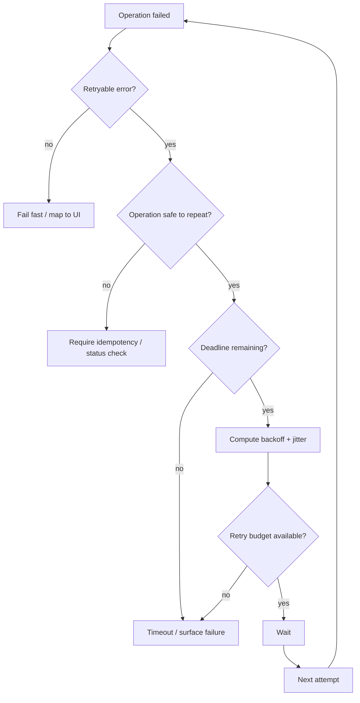
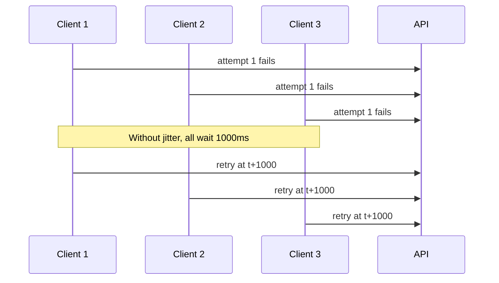
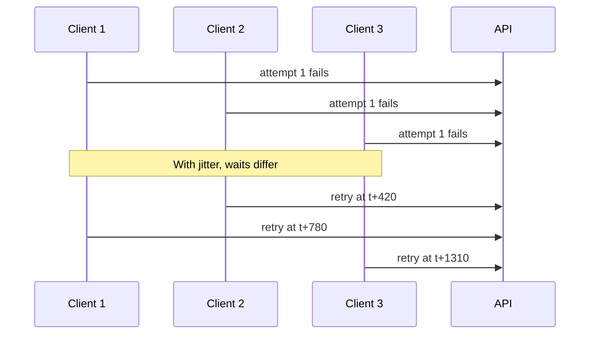
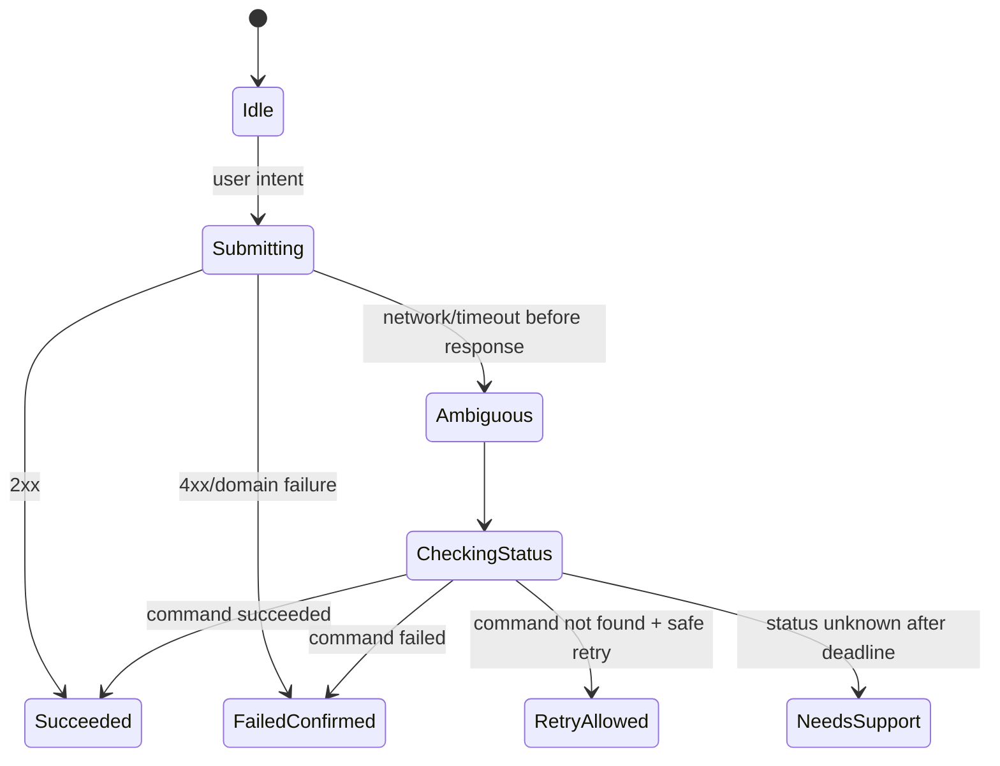

# Part 014 — Retry, Backoff, Jitter, and Deadlines

> Retrying is not resilience by default. Retrying is load amplification unless bounded by semantics, budget, and time.

Di Part 013 kita membangun taxonomy error. Sekarang kita memakainya untuk menjawab pertanyaan yang lebih berbahaya:

> “Kapan client boleh mencoba lagi?”

Di React app, retry sering ditulis seperti ini:

```ts
async function getWithRetry(url: string) {
  try {
    return await fetch(url);
  } catch {
    return await fetch(url);
  }
}
```

Ini terlihat membantu. Di production, ini bisa memperparah incident.

Jika server sedang overload dan semua client retry serentak, retry berubah menjadi distributed denial-of-service dari aplikasi sendiri.

Advanced engineer memahami bahwa retry adalah **control system**:



Retry policy harus mempertimbangkan:

- error kind,
- HTTP method semantics,
- idempotency,
- request body replayability,
- user action context,
- deadline,
- retry budget,
- server backpressure,
- cache state,
- observability.

---

## 1. Retry Is a Contract, Not a Loop

Retry policy buruk:

```ts
for (let i = 0; i < 3; i++) {
  try {
    return await callApi();
  } catch {}
}
```

Kenapa buruk?

- Menelan error asli.
- Tidak membedakan validation vs network vs server error.
- Tidak menghormati `Retry-After`.
- Tidak memakai jitter.
- Tidak punya deadline.
- Bisa mengulang mutation non-idempotent.
- Bisa membuat request storm.

Retry policy yang benar adalah explicit:

```ts
type RetryDecision =
  | { retry: false; reason: string }
  | { retry: true; delayMs: number; reason: string };
```

Dan dibuat dari input nyata:

```ts
type RetryContext = {
  attempt: number;
  maxAttempts: number;
  error: ApiError;
  method: string;
  idempotent: boolean;
  requestBodyReplayable: boolean;
  deadlineAt: number;
  now: number;
};
```

---

## 2. The Retry Safety Matrix

| Operation | Example | Safe automatic retry? | Condition |
|---|---|---:|---|
| Read | `GET /orders/123` | Usually yes | Deadline + backoff |
| Cache revalidation | `GET` with ETag | Yes | Safe and cheap enough |
| Search query | `GET /search?q=x` | Usually yes | Cancel stale query first |
| Create without idempotency | `POST /orders` | No | Risk duplicate creation |
| Create with idempotency key | `POST /orders` | Yes, carefully | Same key, bounded attempts |
| Update by version | `PATCH /orders/123` with `If-Match` | Sometimes | If server semantics safe |
| Delete | `DELETE /orders/123` | Semantically idempotent but UX-sensitive | Server contract required |
| Payment | `POST /payments` | Only with strong idempotency | Must verify status |
| Upload chunk | `PUT /uploads/:id/parts/:n` | Yes | Part identity deterministic |
| Submit workflow transition | `POST /cases/:id/submit` | Only if idempotent command | Command ID required |

The big invariant:

> Retry is safe only when repeated attempts cannot create a different business effect than one successful attempt.

HTTP method helps, but business semantics decide.

---

## 3. HTTP Method Semantics and Idempotency

HTTP defines method semantics. Some methods are considered idempotent at protocol semantics level, meaning multiple identical requests have the same intended effect as one request.

Common mental model:

| Method | Usually safe? | Usually idempotent? | Notes |
|---|---:|---:|---|
| `GET` | Yes | Yes | Should not mutate server state semantically |
| `HEAD` | Yes | Yes | Like GET without body |
| `OPTIONS` | Yes | Yes | Capability/metadata |
| `PUT` | No | Yes | Replace target resource |
| `DELETE` | No | Yes | Repeating delete often still ends deleted |
| `POST` | No | No | Often creates or triggers command |
| `PATCH` | No | Not guaranteed | Depends on patch semantics |

Important nuance:

- “Safe” means intended read-only semantics.
- “Idempotent” means repeated identical calls have same intended effect.
- Idempotent does not mean harmless.
- Server implementation can still be buggy.
- Business operation can override generic assumption.

Example:

```http
DELETE /orders/123
```

Repeating it may result in:

- first call: `204 No Content`,
- second call: `404 Not Found`.

The final state is same: order absent. UI must still handle second response correctly.

---

## 4. Error Kinds and Retryability

From Part 013:

| Error kind | Retry? | Why |
|---|---:|---|
| `abort` | No | Intentional cancellation |
| `timeout` | Maybe | Depends on operation ambiguity |
| `network` | Maybe | Could be transient; mutation ambiguous |
| `authn` | No direct retry | Recover session first |
| `authz` | No | Permission will not fix by retry |
| `validation` | No | User/input must change |
| `domain` | No | Business state must change |
| `concurrency` | No blind retry | Refetch/merge first |
| `rate-limit` | Yes after delay | Respect backpressure |
| `http 500` | Maybe | Transient or persistent |
| `http 502/503/504` | Usually maybe | Gateway/upstream transient |
| `parse` | Usually no | Contract/proxy issue |
| `contract` | No | Client/server mismatch |

Retry decision must be conservative.

```ts
function isRetryableError(error: ApiError): boolean {
  switch (error.kind) {
    case 'network':
    case 'timeout':
      return true;
    case 'rate-limit':
      return true;
    case 'http':
      return error.status === 500 || error.status === 502 || error.status === 503 || error.status === 504;
    default:
      return false;
  }
}
```

But this function is not enough. It only says error might be retryable. Operation semantics still matter.

---

## 5. Retry-After and Server Backpressure

For `429 Too Many Requests` and `503 Service Unavailable`, server may send `Retry-After`.

`Retry-After` can be:

- delay seconds,
- HTTP date.

Examples:

```http
Retry-After: 30
```

```http
Retry-After: Wed, 21 Oct 2026 07:28:00 GMT
```

Client parser:

```ts
export function parseRetryAfter(header: string | null, now = Date.now()): number | undefined {
  if (!header) return undefined;

  const seconds = Number(header);

  if (Number.isFinite(seconds) && seconds >= 0) {
    return seconds * 1_000;
  }

  const dateMs = Date.parse(header);

  if (Number.isFinite(dateMs)) {
    return Math.max(0, dateMs - now);
  }

  return undefined;
}
```

Policy:

```ts
if (error.kind === 'rate-limit') {
  const retryAfterMs = error.retryAfterMs ?? defaultBackoffMs;
  return {
    retry: true,
    delayMs: clamp(retryAfterMs, 1_000, 60_000),
    reason: 'server-rate-limit',
  };
}
```

Do not ignore server backpressure.

---

## 6. Backoff

Backoff means waiting longer between attempts.

Without backoff:

```txt
attempt 1: t+0ms
attempt 2: t+10ms
attempt 3: t+20ms
attempt 4: t+30ms
```

During outage, this hammers the dependency.

With exponential backoff:

```txt
attempt 1: t+0ms
attempt 2: t+200ms
attempt 3: t+400ms
attempt 4: t+800ms
attempt 5: t+1600ms
```

Basic formula:

```ts
function exponentialBackoffMs(attempt: number, baseMs: number, capMs: number): number {
  return Math.min(capMs, baseMs * 2 ** attempt);
}
```

Where `attempt` is usually zero-based for retry delay after failure.

Example:

```ts
exponentialBackoffMs(0, 200, 5_000); // 200
exponentialBackoffMs(1, 200, 5_000); // 400
exponentialBackoffMs(2, 200, 5_000); // 800
```

---

## 7. Jitter

Backoff alone is not enough.

If 100,000 clients fail at the same time, deterministic exponential backoff makes them retry together again.

Jitter adds randomness so retries spread out.



With jitter:



### 7.1 Jitter Variants

#### Full Jitter

```ts
function fullJitterDelayMs(attempt: number, baseMs: number, capMs: number): number {
  const max = exponentialBackoffMs(attempt, baseMs, capMs);
  return Math.floor(Math.random() * max);
}
```

#### Equal Jitter

```ts
function equalJitterDelayMs(attempt: number, baseMs: number, capMs: number): number {
  const max = exponentialBackoffMs(attempt, baseMs, capMs);
  const half = max / 2;
  return Math.floor(half + Math.random() * half);
}
```

#### Decorrelated Jitter

```ts
function decorrelatedJitterDelayMs(previousDelayMs: number, baseMs: number, capMs: number): number {
  const max = previousDelayMs * 3;
  return Math.min(capMs, Math.floor(baseMs + Math.random() * (max - baseMs)));
}
```

Practical default for frontend:

- base: `200ms` to `500ms`,
- cap: `5s` to `30s`,
- attempts: `2` to `4`,
- use jitter,
- lower retry count on mobile/expensive operations,
- never infinite retry on foreground user action.

---

## 8. Deadlines

Timeout answers:

> “How long can one attempt run?”

Deadline answers:

> “How long can the whole operation take?”

Example bad policy:

```txt
maxAttempts = 3
timeoutPerAttempt = 5s
backoffs = 1s + 2s
Total worst case = 5 + 1 + 5 + 2 + 5 = 18s
```

For a Save button, 18 seconds may be unacceptable.

### 8.1 Deadline-Aware Retry

```ts
type Deadline = {
  startedAt: number;
  deadlineAt: number;
};

function remainingMs(deadline: Deadline, now = Date.now()): number {
  return Math.max(0, deadline.deadlineAt - now);
}
```

Retry decision:

```ts
function hasEnoughTime(deadline: Deadline, delayMs: number, minAttemptMs: number): boolean {
  return remainingMs(deadline) > delayMs + minAttemptMs;
}
```

Do not start a retry that cannot reasonably finish inside the UX budget.

### 8.2 Attempt Timeout from Deadline

```ts
function attemptTimeoutMs(deadline: Deadline, maxAttemptMs: number): number {
  return Math.min(maxAttemptMs, remainingMs(deadline));
}
```

This prevents each attempt from consuming a full independent timeout.

---

## 9. Retry Budget

Retry budget limits aggregate retries.

Why? Because if every request retries three times, an outage can multiply load by four.

Simple local retry budget:

```ts
class RetryBudget {
  private tokens: number;

  constructor(private readonly capacity: number) {
    this.tokens = capacity;
  }

  tryTake(): boolean {
    if (this.tokens <= 0) return false;
    this.tokens -= 1;
    return true;
  }

  refill(count = 1): void {
    this.tokens = Math.min(this.capacity, this.tokens + count);
  }
}
```

For frontend, budget can be scoped by:

- page/session,
- endpoint,
- operation class,
- tab,
- user action.

Example:

```ts
const readRetryBudget = new RetryBudget(20);
const mutationRetryBudget = new RetryBudget(3);
```

The goal is not perfect distributed rate control. The goal is to avoid one tab becoming a retry cannon.

---

## 10. Idempotency Keys

For non-idempotent commands, retry requires server support.

Idempotency key pattern:

```http
POST /orders
Idempotency-Key: cmd_01JABCDEF...
Content-Type: application/json

{
  "customerId": "cus_123",
  "items": [...]
}
```

Server stores outcome for that key. If the same key arrives again, server returns the same logical outcome instead of creating duplicate orders.

### 10.1 Client Command Identity

Generate one command ID per user intent, not per attempt.

Bad:

```ts
async function createOrder(input: CreateOrderInput) {
  return retry(() =>
    fetch('/api/orders', {
      method: 'POST',
      headers: {
        'Idempotency-Key': crypto.randomUUID(),
      },
      body: JSON.stringify(input),
    })
  );
}
```

This creates a new key each retry. It defeats the purpose.

Good:

```ts
async function createOrder(input: CreateOrderInput) {
  const commandId = crypto.randomUUID();

  return retry(() =>
    fetch('/api/orders', {
      method: 'POST',
      headers: {
        'Idempotency-Key': commandId,
        'Content-Type': 'application/json',
      },
      body: JSON.stringify(input),
    })
  );
}
```

But even this loses command ID if the page reloads. For critical operations, persist pending command metadata.

### 10.2 Idempotency Scope

A good idempotency key contract defines:

- key uniqueness scope,
- TTL,
- whether payload mismatch for same key is rejected,
- stored response behavior,
- conflict response,
- observability fields,
- how client checks status after timeout.

Without this, client-side retry remains unsafe.

---

## 11. Ambiguous Mutation Outcome

The hardest case:

```txt
Client sends POST /payments
Network fails before response
```

Client does not know:

- request never reached server,
- request reached server but failed,
- request reached server and succeeded,
- server succeeded but response was lost.

This is called ambiguous outcome.

### 11.1 Wrong UI

```txt
Payment failed. Try again.
```

If user tries again and no idempotency exists, duplicate charge risk.

### 11.2 Better UI

```txt
We could not confirm the payment status. Checking status...
```

Then:

- query operation status by command ID,
- reconcile with server,
- only allow retry if server says command absent or idempotency key is safe.

State machine:



Advanced frontend does not lie about uncertainty.

---

## 12. Request Body Replayability

Some request bodies can be replayed. Some cannot.

Replayable:

- string body,
- JSON serialized from object,
- small `Blob` that can be reused,
- deterministic `FormData` if constructed again.

Potentially non-replayable:

- consumed stream,
- one-shot file stream,
- body with expiring signature,
- body generated from mutable state,
- request whose timestamp/signature must be recalculated.

Retry wrapper must create a fresh request per attempt.

Bad:

```ts
const request = new Request('/api/orders', {
  method: 'POST',
  body: JSON.stringify(input),
});

await retry(() => fetch(request));
```

Depending on body usage, this can fail because request body is consumed.

Good:

```ts
await retry(() =>
  fetch('/api/orders', {
    method: 'POST',
    body: JSON.stringify(input),
    headers: { 'Content-Type': 'application/json' },
  })
);
```

Better abstraction:

```ts
type RequestFactory = () => Promise<Request> | Request;
```

Each attempt asks the factory for a fresh request.

---

## 13. A Production Retry Policy

Let's define types.

```ts
type HttpMethod = 'GET' | 'POST' | 'PUT' | 'PATCH' | 'DELETE' | 'HEAD' | 'OPTIONS';

type RetryPolicyInput = {
  error: ApiError;
  method: HttpMethod;
  attempt: number;
  maxAttempts: number;
  idempotent: boolean;
  bodyReplayable: boolean;
  deadlineAt: number;
  previousDelayMs?: number;
};

type RetryPolicyResult =
  | { retry: false; reason: string }
  | { retry: true; delayMs: number; reason: string };
```

Implement policy:

```ts
function decideRetry(input: RetryPolicyInput): RetryPolicyResult {
  const {
    error,
    method,
    attempt,
    maxAttempts,
    idempotent,
    bodyReplayable,
    deadlineAt,
  } = input;

  if (attempt >= maxAttempts) {
    return { retry: false, reason: 'max-attempts-reached' };
  }

  if (!isRetryableError(error)) {
    return { retry: false, reason: `non-retryable-error:${error.kind}` };
  }

  if (!isOperationRetrySafe({ method, idempotent })) {
    return { retry: false, reason: 'operation-not-retry-safe' };
  }

  if (!bodyReplayable) {
    return { retry: false, reason: 'body-not-replayable' };
  }

  const serverDelayMs = getServerSuggestedDelayMs(error);
  const computedDelayMs = serverDelayMs ?? fullJitterDelayMs(attempt, 300, 10_000);
  const delayMs = clamp(computedDelayMs, 0, 30_000);

  const minimumAttemptTimeMs = 500;

  if (Date.now() + delayMs + minimumAttemptTimeMs > deadlineAt) {
    return { retry: false, reason: 'deadline-exceeded' };
  }

  return { retry: true, delayMs, reason: serverDelayMs ? 'server-delay' : 'backoff-jitter' };
}
```

Helper:

```ts
function isOperationRetrySafe(input: { method: HttpMethod; idempotent: boolean }): boolean {
  if (input.idempotent) return true;

  return input.method === 'GET' || input.method === 'HEAD' || input.method === 'OPTIONS';
}

function getServerSuggestedDelayMs(error: ApiError): number | undefined {
  if (error.kind === 'rate-limit') return error.retryAfterMs;

  if (error.kind === 'http' && error.status === 503) {
    return error.retryAfterMs;
  }

  return undefined;
}

function clamp(value: number, min: number, max: number): number {
  return Math.min(max, Math.max(min, value));
}
```

---

## 14. Retry Executor

A generic executor:

```ts
type RetryExecutorOptions<T> = {
  requestName: string;
  method: HttpMethod;
  idempotent: boolean;
  bodyReplayable: boolean;
  deadlineMs: number;
  maxAttempts: number;
  run: (attempt: number, signal: AbortSignal) => Promise<T>;
  classifyError: (error: unknown) => ApiError;
  onAttempt?: (event: RetryAttemptEvent) => void;
};

type RetryAttemptEvent = {
  requestName: string;
  attempt: number;
  delayMs?: number;
  decision?: string;
  errorKind?: string;
};
```

Implementation:

```ts
export async function runWithRetry<T>(options: RetryExecutorOptions<T>): Promise<T> {
  const startedAt = Date.now();
  const deadlineAt = startedAt + options.deadlineMs;
  let previousDelayMs: number | undefined;

  for (let attempt = 0; ; attempt++) {
    const remaining = deadlineAt - Date.now();

    if (remaining <= 0) {
      throw {
        kind: 'timeout',
        message: 'Operation deadline exceeded before next attempt.',
        retryable: false,
        severity: 'warning',
      } satisfies TimeoutFailure;
    }

    const attemptController = new AbortController();
    const attemptTimeout = setTimeout(() => {
      attemptController.abort({ kind: 'attempt-timeout' });
    }, remaining);

    try {
      options.onAttempt?.({
        requestName: options.requestName,
        attempt,
      });

      return await options.run(attempt, attemptController.signal);
    } catch (rawError) {
      const error = options.classifyError(rawError);

      const decision = decideRetry({
        error,
        method: options.method,
        attempt,
        maxAttempts: options.maxAttempts,
        idempotent: options.idempotent,
        bodyReplayable: options.bodyReplayable,
        deadlineAt,
        previousDelayMs,
      });

      options.onAttempt?.({
        requestName: options.requestName,
        attempt,
        errorKind: error.kind,
        delayMs: decision.retry ? decision.delayMs : undefined,
        decision: decision.reason,
      });

      if (!decision.retry) {
        throw error;
      }

      previousDelayMs = decision.delayMs;
      await sleep(decision.delayMs);
    } finally {
      clearTimeout(attemptTimeout);
    }
  }
}

function sleep(ms: number): Promise<void> {
  return new Promise(resolve => setTimeout(resolve, ms));
}
```

Caveat: this implementation uses one deadline controller per attempt. In real app, also compose with external signal from route/component/user cancellation.

---

## 15. Composing External Cancellation with Retry

User navigation should cancel the whole retry loop.

```ts
function throwIfAborted(signal: AbortSignal): void {
  if (signal.aborted) {
    throw signal.reason ?? new DOMException('Aborted', 'AbortError');
  }
}

function sleepWithSignal(ms: number, signal: AbortSignal): Promise<void> {
  return new Promise((resolve, reject) => {
    if (signal.aborted) {
      reject(signal.reason ?? new DOMException('Aborted', 'AbortError'));
      return;
    }

    const timeout = setTimeout(resolve, ms);

    signal.addEventListener('abort', () => {
      clearTimeout(timeout);
      reject(signal.reason ?? new DOMException('Aborted', 'AbortError'));
    }, { once: true });
  });
}
```

Retry loop should check external signal before waiting and before attempt.

```ts
throwIfAborted(externalSignal);
await sleepWithSignal(decision.delayMs, externalSignal);
throwIfAborted(externalSignal);
```

Otherwise a route change can leave hidden retries running.

---

## 16. Integrating with Fetch Client

```ts
type ApiRequestOptions<TBody> = {
  method?: HttpMethod;
  body?: TBody;
  headers?: HeadersInit;
  signal?: AbortSignal;
  deadlineMs?: number;
  retry?: {
    maxAttempts: number;
    idempotent?: boolean;
  };
};

async function apiRequest<TResponse, TBody = unknown>(
  url: string,
  options: ApiRequestOptions<TBody> = {}
): Promise<TResponse> {
  const method = options.method ?? 'GET';
  const bodyText = options.body === undefined ? undefined : JSON.stringify(options.body);
  const idempotent = options.retry?.idempotent ?? isMethodIdempotentByDefault(method);

  return runWithRetry({
    requestName: `${method} ${url}`,
    method,
    idempotent,
    bodyReplayable: true,
    deadlineMs: options.deadlineMs ?? 10_000,
    maxAttempts: options.retry?.maxAttempts ?? defaultMaxAttempts(method),
    classifyError: classifyUnknownError,
    run: async (_attempt, attemptSignal) => {
      const signal = composeSignals([attemptSignal, options.signal].filter(Boolean) as AbortSignal[]);

      const response = await fetch(url, {
        method,
        headers: {
          ...(bodyText ? { 'Content-Type': 'application/json' } : {}),
          ...headersToObject(options.headers),
        },
        body: bodyText,
        signal,
      });

      if (!response.ok) {
        throw await toApiError(response);
      }

      return parseResponse<TResponse>(response);
    },
  });
}
```

Helpers:

```ts
function isMethodIdempotentByDefault(method: HttpMethod): boolean {
  return method === 'GET' || method === 'HEAD' || method === 'OPTIONS' || method === 'PUT' || method === 'DELETE';
}

function defaultMaxAttempts(method: HttpMethod): number {
  if (method === 'GET' || method === 'HEAD') return 3;
  return 1;
}
```

`POST` default retry is 1 attempt unless explicitly idempotent.

---

## 17. React Query Retry Integration

TanStack Query has retry support. Do not blindly set `retry: 3` everywhere.

Better:

```ts
function queryRetry(failureCount: number, error: unknown): boolean {
  const apiError = classifyUnknownError(error);

  const decision = decideRetry({
    error: apiError,
    method: 'GET',
    attempt: failureCount,
    maxAttempts: 3,
    idempotent: true,
    bodyReplayable: true,
    deadlineAt: Date.now() + 10_000,
  });

  return decision.retry;
}

function queryRetryDelay(attempt: number, error: unknown): number {
  const apiError = classifyUnknownError(error);

  if (apiError.kind === 'rate-limit' && apiError.retryAfterMs !== undefined) {
    return clamp(apiError.retryAfterMs, 1_000, 30_000);
  }

  return fullJitterDelayMs(attempt, 300, 10_000);
}
```

Usage:

```ts
useQuery({
  queryKey: ['order', orderId],
  queryFn: () => apiRequest<Order>(`/api/orders/${orderId}`),
  retry: queryRetry,
  retryDelay: queryRetryDelay,
});
```

For mutations:

```ts
useMutation({
  mutationFn: approveOrder,
  retry: (failureCount, error) => {
    const apiError = classifyUnknownError(error);

    return decideRetry({
      error: apiError,
      method: 'POST',
      attempt: failureCount,
      maxAttempts: 2,
      idempotent: true, // only because approveOrder uses command id/idempotency key
      bodyReplayable: true,
      deadlineAt: Date.now() + 8_000,
    }).retry;
  },
});
```

Never enable mutation retry without validating operation semantics.

---

## 18. Search-as-You-Type: Retry vs Cancellation

For search input:

```txt
q = "a"
q = "ap"
q = "app"
q = "appl"
q = "apple"
```

The best retry is often no retry. Instead:

- debounce input,
- abort stale request,
- dedupe identical query,
- keep previous data,
- retry only final/stable query if it fails transiently.

```ts
const query = useQuery({
  queryKey: ['search', normalizedTerm],
  queryFn: ({ signal }) => searchProducts(normalizedTerm, { signal }),
  enabled: normalizedTerm.length >= 2,
  retry: (failureCount, error) => {
    if (isAbortErrorLike(error)) return false;
    return queryRetry(failureCount, error);
  },
});
```

Cancellation beats retry for stale intent.

---

## 19. Polling and Retry

Polling loop and retry loop can multiply each other.

Bad:

```txt
poll every 5s
  each poll retries 3 times
```

If endpoint fails, one UI can generate many requests.

Better:

- polling interval backs off on failure,
- retry count inside each poll is low,
- pause when tab hidden if appropriate,
- respect rate limits,
- stop polling on terminal domain states.

```ts
function nextPollIntervalMs(errorCount: number): number {
  if (errorCount === 0) return 5_000;
  return Math.min(60_000, fullJitterDelayMs(errorCount, 5_000, 60_000));
}
```

---

## 20. Offline Behavior

When browser knows it is offline, immediate retry is usually pointless.

```ts
if (typeof navigator !== 'undefined' && navigator.onLine === false) {
  return { retry: false, reason: 'browser-offline' };
}
```

But `navigator.onLine` is not a perfect truth source. Treat it as a hint.

Offline strategies:

- reads: use cached data if safe,
- non-critical mutations: queue offline with command IDs,
- critical mutations: block and explain,
- realtime: enter disconnected state and reconnect with backoff.

Offline-first will be covered deeper in Part 057.

---

## 21. Circuit Breaker Lite for Frontend

Backend services use circuit breakers. Frontend can use a lighter version.

Goal:

> If endpoint is obviously failing, stop hammering it for a short cooldown.

```ts
type CircuitState = 'closed' | 'open' | 'half-open';

class EndpointCircuit {
  private state: CircuitState = 'closed';
  private failures = 0;
  private openedUntil = 0;

  canRequest(now = Date.now()): boolean {
    if (this.state === 'open' && now < this.openedUntil) return false;

    if (this.state === 'open' && now >= this.openedUntil) {
      this.state = 'half-open';
      return true;
    }

    return true;
  }

  recordSuccess(): void {
    this.state = 'closed';
    this.failures = 0;
  }

  recordFailure(): void {
    this.failures += 1;

    if (this.failures >= 5) {
      this.state = 'open';
      this.openedUntil = Date.now() + 30_000;
    }
  }
}
```

Use carefully. Frontend circuit breakers can cause stale UI if too aggressive.

Best use cases:

- noisy background polling,
- optional recommendation widgets,
- analytics enrichment,
- non-critical side panels.

Avoid for:

- login,
- payment,
- save critical form,
- emergency/regulated operations.

---

## 22. Retry Telemetry

Every retry should be observable.

Log event shape:

```ts
type RetryTelemetryEvent = {
  event: 'api.retry';
  requestName: string;
  endpoint: string;
  method: string;
  attempt: number;
  delayMs: number;
  errorKind: string;
  status?: number;
  decision: string;
  deadlineRemainingMs: number;
  idempotent: boolean;
};
```

Metrics:

- retry attempts per endpoint,
- retry success rate,
- final failure rate after retry,
- retry delay distribution,
- rate-limit frequency,
- ambiguous mutation count,
- timeout count,
- deadline exceeded count.

Important question:

> Did retry improve user success, or did it only add load and latency?

Without telemetry, retry policy is guesswork.

---

## 23. UX Rules for Retry

### 23.1 Foreground User Action

Example: user clicks Save.

Rules:

- short deadline,
- low retry count,
- visible progress if noticeable,
- do not retry validation/domain/authz,
- be careful with ambiguous mutation,
- preserve user input.

### 23.2 Background Query

Example: refetch notification count.

Rules:

- retry quietly,
- backoff more aggressively,
- avoid toasts,
- keep stale data if acceptable,
- pause on hidden tab if appropriate.

### 23.3 Critical Workflow Mutation

Example: submit regulatory case.

Rules:

- command ID required,
- server status endpoint required,
- retry only with idempotency,
- explicit ambiguous state,
- audit trail,
- never duplicate side effects.

### 23.4 Infinite Retry Is a Product Decision

Do not hide infinite retry in infrastructure code.

If a workflow needs persistent retry, model it as:

- offline queue,
- background sync,
- command journal,
- user-visible pending state,
- eventual reconciliation.

Not as `while (true)`.

---

## 24. Common Anti-Patterns

### 24.1 Retry Storm

```ts
retry: true
```

Every client retries aggressively during outage.

Fix:

- max attempts,
- backoff,
- jitter,
- budget,
- server backpressure.

### 24.2 Retrying Non-Idempotent POST

```ts
retry(() => fetch('/api/payments', { method: 'POST', body }))
```

Fix:

- idempotency key,
- command status endpoint,
- bounded retry.

### 24.3 Resetting Idempotency Key Per Attempt

Already covered. Generate per user intent, not per attempt.

### 24.4 Retrying After 401

Fix session first. Do not replay request with same invalid credentials forever.

### 24.5 Retrying After 403

Permission does not improve by waiting.

### 24.6 Retrying 422

User input or domain state must change.

### 24.7 Ignoring `Retry-After`

Server told you to slow down. Listen.

### 24.8 Retry Without Deadline

User waits too long, and hidden attempts continue after route changes.

### 24.9 Retry Without Observability

You cannot know whether retry helps or harms.

---

## 25. Production Defaults

These are not universal, but safe starting points.

### 25.1 Foreground Read

```ts
{
  maxAttempts: 3,
  deadlineMs: 8_000,
  baseDelayMs: 300,
  capDelayMs: 3_000,
  jitter: 'full'
}
```

### 25.2 Background Read

```ts
{
  maxAttempts: 2,
  deadlineMs: 15_000,
  baseDelayMs: 1_000,
  capDelayMs: 30_000,
  jitter: 'full',
  pauseWhenHidden: true
}
```

### 25.3 Foreground Mutation Without Idempotency

```ts
{
  maxAttempts: 1,
  deadlineMs: 8_000,
  retry: false
}
```

### 25.4 Foreground Mutation With Idempotency

```ts
{
  maxAttempts: 2,
  deadlineMs: 10_000,
  baseDelayMs: 500,
  capDelayMs: 2_000,
  jitter: 'full',
  ambiguousOutcomeCheck: true
}
```

### 25.5 Realtime Reconnect

```ts
{
  baseDelayMs: 500,
  capDelayMs: 30_000,
  jitter: 'decorrelated',
  resetOnStableConnectionMs: 60_000
}
```

Realtime reconnect will be covered deeper in Parts 054–056.

---

## 26. End-to-End Example: Safe GET With Retry

```ts
type ApiClientConfig = {
  baseUrl: string;
};

class ApiClient {
  constructor(private readonly config: ApiClientConfig) {}

  async get<T>(path: string, signal?: AbortSignal): Promise<T> {
    return apiRequest<T>(`${this.config.baseUrl}${path}`, {
      method: 'GET',
      signal,
      deadlineMs: 8_000,
      retry: {
        maxAttempts: 3,
        idempotent: true,
      },
    });
  }
}
```

Usage:

```ts
function useOrder(orderId: string) {
  return useQuery({
    queryKey: ['order', orderId],
    queryFn: ({ signal }) => api.get<Order>(`/orders/${orderId}`, signal),
    retry: queryRetry,
    retryDelay: queryRetryDelay,
  });
}
```

Behavior:

- network error: retry with jitter,
- 500/502/503/504: retry if deadline remains,
- 429: respect `Retry-After`,
- 404: no retry; show not found,
- 401: no retry; session flow,
- 403: no retry; forbidden,
- 422: no retry; invalid request/contract issue for GET,
- abort: no retry.

---

## 27. End-to-End Example: Idempotent Command

```ts
type ApproveOrderCommand = {
  orderId: string;
  expectedVersion: number;
};

async function approveOrder(command: ApproveOrderCommand): Promise<Order> {
  const commandId = crypto.randomUUID();

  return apiRequest<Order, { expectedVersion: number }>(`/api/orders/${command.orderId}/approve`, {
    method: 'POST',
    headers: {
      'Idempotency-Key': commandId,
      'If-Match': String(command.expectedVersion),
    },
    body: {
      expectedVersion: command.expectedVersion,
    },
    deadlineMs: 10_000,
    retry: {
      maxAttempts: 2,
      idempotent: true,
    },
  });
}
```

But this is only correct if server implements:

- idempotency key storage,
- same response for duplicate key,
- conflict on same key different payload,
- version check,
- observable command status.

Otherwise the client is pretending.

---

## 28. Decision Framework

Before enabling retry, answer in order:

1. Did we classify the error?
2. Is the error transient?
3. Is the operation safe to repeat?
4. If mutation, is there idempotency support?
5. Is the request body replayable?
6. Is there deadline remaining?
7. Is retry budget available?
8. Did server send `Retry-After`?
9. Will retry improve UX or hide a real issue?
10. Is retry observable?

If any answer is unknown, default to no automatic retry.

---

## 29. Source Notes

This part is grounded in these primary/reference materials:

- RFC 9110 HTTP Semantics: method semantics, idempotency guidance, status codes, and `Retry-After`.
- MDN Fetch API: fetch rejection and HTTP response behavior.
- MDN AbortController and AbortSignal: cancellation primitives.
- AWS Architecture Blog / Builders Library: exponential backoff, jitter, retries, timeouts, and overload behavior.
- TanStack Query documentation: retry and retryDelay hooks for query behavior.

---

## 30. What You Should Retain

Retry is not:

```txt
repeat failed request N times
```

Retry is:

```txt
repeat only when the error is transient, the operation is safe, the body is replayable, the deadline allows it, the server has not asked us to slow down more, and the retry budget allows it
```

The invariant:

> A React client should retry less often than you instinctively want, but with better semantics, jitter, idempotency, and observability.

In the next part, we will move from retrying individual requests to controlling duplicate in-flight work: **request deduplication and in-flight control**.
