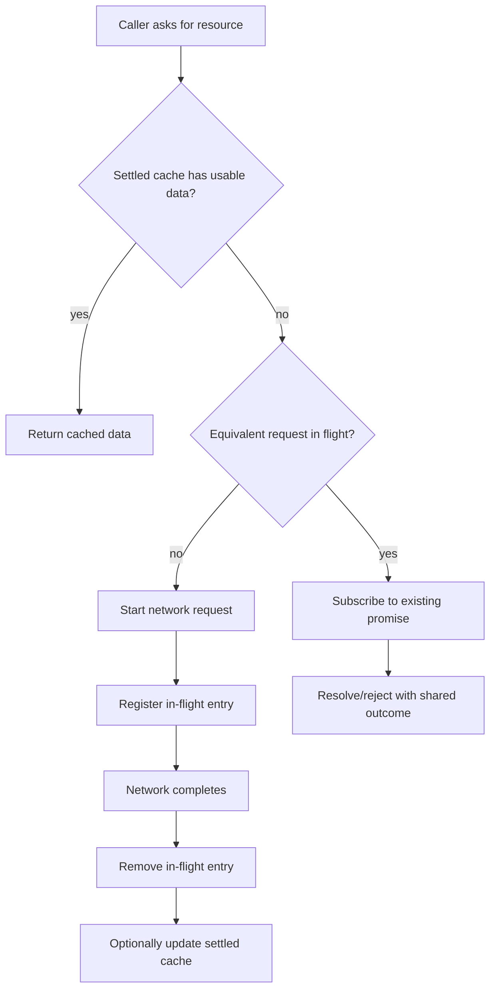
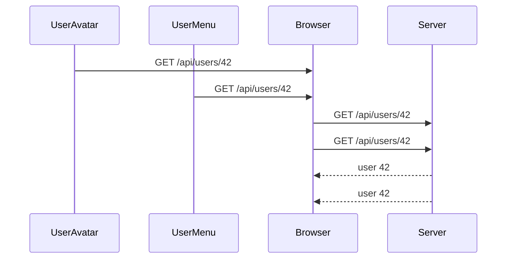
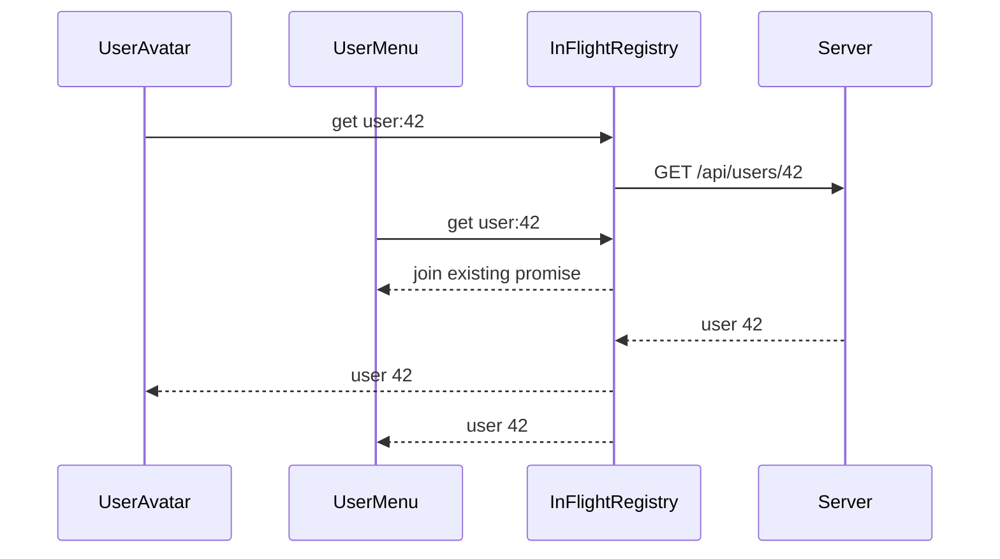
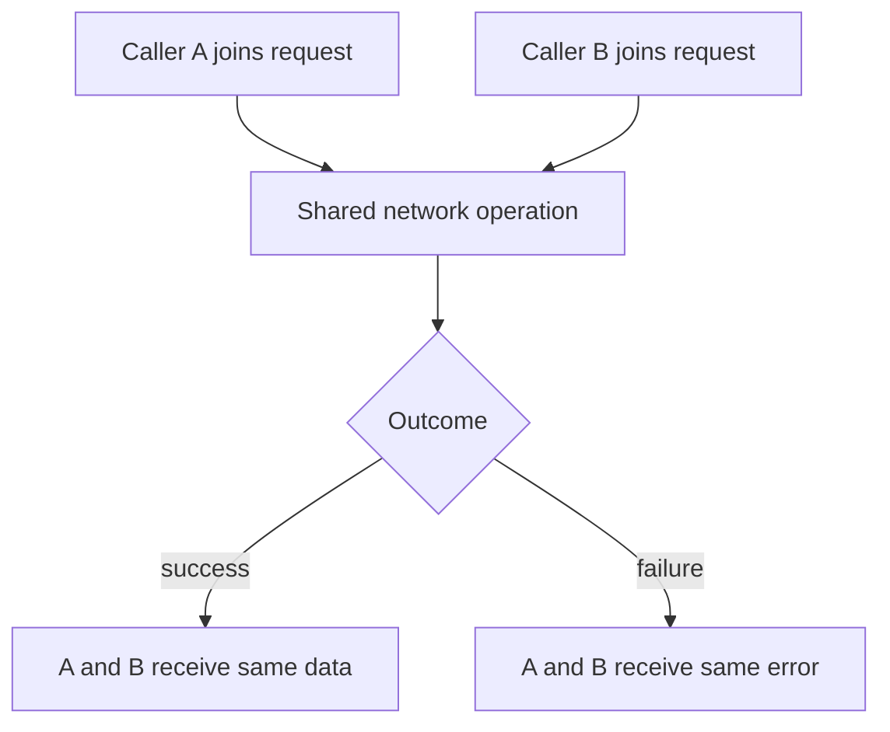
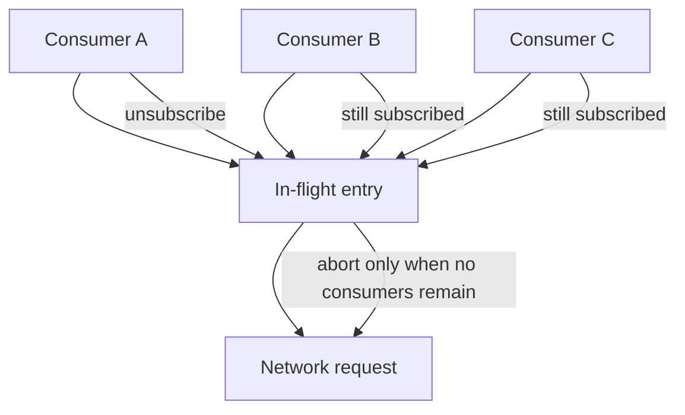
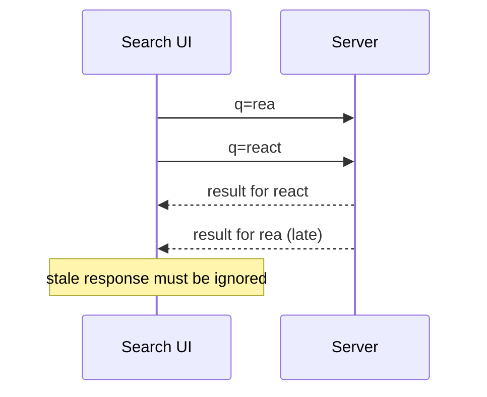
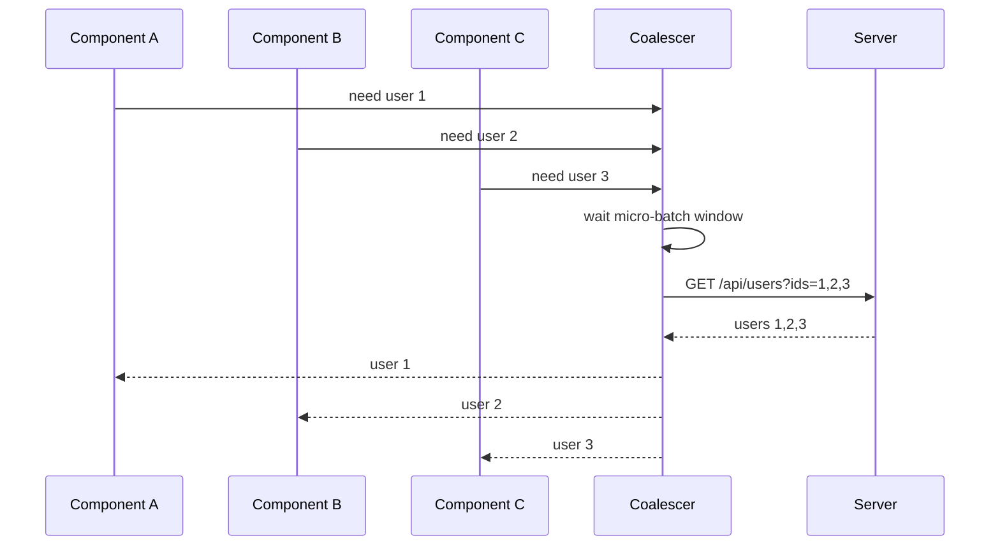
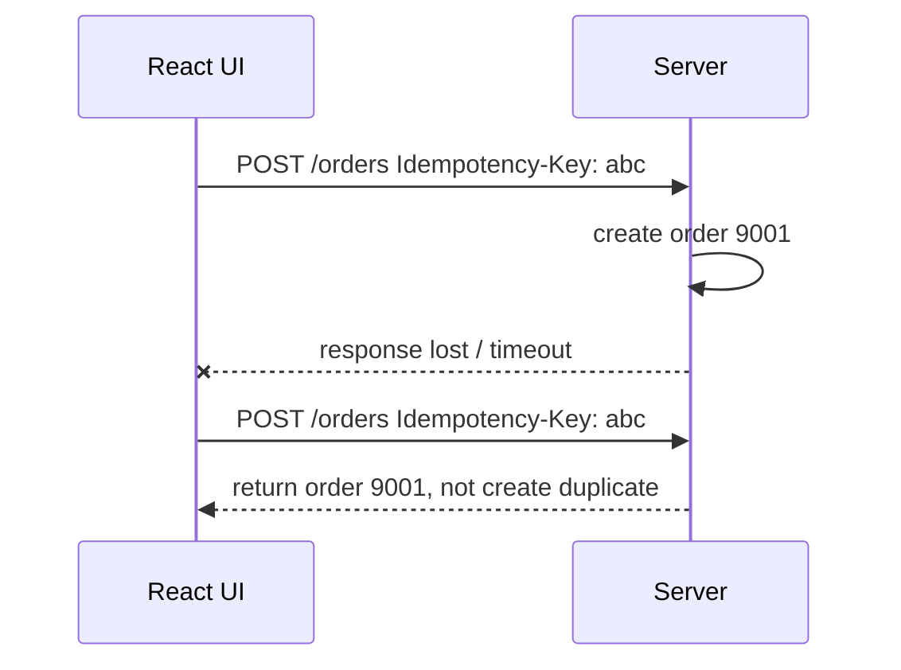
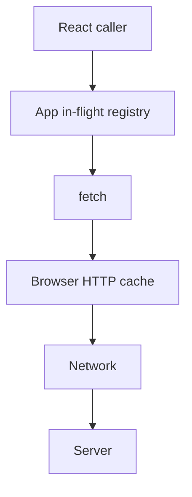
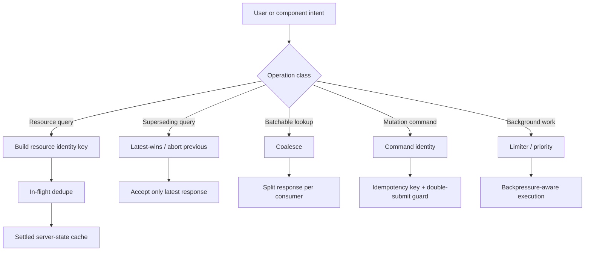

# Part 015 — Request Deduplication and In-Flight Control

> A request is not just a packet. In a React app, a request is a live operation with identity, ownership, subscribers, cancellation, and consequences.

Di Part 014 kita membangun retry policy. Sekarang kita masuk ke problem yang kelihatannya lebih kecil, tetapi sering menjadi sumber bug besar:

> “Bagaimana kalau request yang sama sedang berjalan berkali-kali?”

Di aplikasi nyata, ini terjadi terus:

- parent dan child component fetch resource yang sama,
- route transition memicu loader dan component effect sekaligus,
- React Strict Mode membuat effect terlihat berjalan dua kali di development,
- user klik tombol submit dua kali,
- tab refocus memicu revalidation bersamaan dengan manual refresh,
- infinite scroll meminta page yang sama dua kali,
- typeahead mengirim request lama dan baru secara tumpang tindih,
- retry berjalan ketika user sudah pindah screen,
- beberapa widget dashboard membaca endpoint yang sama dengan parameter yang sama,
- optimistic mutation dan background refetch saling menimpa.

Request deduplication bukan sekadar “pakai cache”. Deduplication adalah kontrol atas **in-flight work**.

Cache menjawab:

> “Apakah kita sudah punya hasil?”

In-flight dedupe menjawab:

> “Apakah pekerjaan yang sama sedang berjalan sehingga caller baru cukup ikut menunggu pekerjaan itu?”

Keduanya berbeda.



Tujuan bagian ini adalah membangun mental model dan implementasi yang cukup kuat untuk dipakai di production, bahkan sebelum memakai library server-state seperti TanStack Query.

---

## 1. The Basic Problem: Duplicate Work

Misalkan dua component melakukan hal ini:

```tsx
function UserAvatar({ userId }: { userId: string }) {
  useEffect(() => {
    fetch(`/api/users/${userId}`);
  }, [userId]);

  return null;
}

function UserMenu({ userId }: { userId: string }) {
  useEffect(() => {
    fetch(`/api/users/${userId}`);
  }, [userId]);

  return null;
}
```

Secara visual tidak terlihat bermasalah. Tetapi browser bisa mengirim dua request identik:



Dampaknya:

- latency UI bisa tidak turun walau request paralel,
- server menerima load yang tidak perlu,
- observability menjadi noisy,
- rate limit lebih cepat kena,
- response bisa tiba dengan urutan tidak terduga,
- refetch/invalidation menjadi sulit diprediksi.

Yang kita inginkan:



Deduplication bukan karena network tidak mampu paralel. Deduplication dilakukan karena dua operasi tersebut memiliki **same logical identity**.

---

## 2. Define Operation Identity Before Deduping

Kesalahan umum:

```ts
const key = url;
```

Ini terlalu kasar.

Dua request ke URL sama belum tentu equivalent:

```http
GET /api/orders?page=1
Accept-Language: en-US
Authorization: Bearer token-user-a
```

Berbeda dari:

```http
GET /api/orders?page=1
Accept-Language: id-ID
Authorization: Bearer token-user-b
```

Key dedup harus merepresentasikan **resource view**, bukan hanya string URL.

Komponen key biasanya:

- HTTP method,
- normalized URL,
- normalized query params,
- body fingerprint untuk method tertentu,
- tenant/user/session scope,
- locale,
- feature flag / API version,
- selected representation header seperti `Accept`,
- credential mode bila memengaruhi response,
- cache namespace.

Contoh key:

```ts
type RequestKeyParts = {
  method: string;
  url: string;
  query?: Record<string, string | number | boolean | null | undefined>;
  bodyHash?: string;
  scope: {
    userId?: string;
    tenantId?: string;
    locale?: string;
    apiVersion?: string;
  };
};
```

Yang tidak boleh dilakukan:

```ts
// Bad: memasukkan raw Authorization ke key yang bisa bocor ke log.
const key = `${method}:${url}:${headers.Authorization}`;
```

Gunakan scope yang aman:

```ts
const key = stableKey({
  method: 'GET',
  url: '/api/orders',
  query: { page: 1 },
  scope: {
    userId: currentUser.id,
    tenantId: currentTenant.id,
    locale: i18n.locale,
  },
});
```

Key harus:

- deterministic,
- stable terhadap urutan property object,
- tidak menyimpan secret,
- cukup spesifik agar tidak leak data antar-user,
- cukup umum agar request benar-benar bisa join.

---

## 3. Stable Key Builder

`JSON.stringify` biasa tidak aman untuk object dengan urutan key berbeda:

```ts
JSON.stringify({ a: 1, b: 2 }) !== JSON.stringify({ b: 2, a: 1 });
```

Gunakan canonical stringify sederhana:

```ts
function canonicalize(value: unknown): unknown {
  if (Array.isArray(value)) {
    return value.map(canonicalize);
  }

  if (value && typeof value === 'object') {
    const input = value as Record<string, unknown>;
    return Object.keys(input)
      .sort()
      .reduce<Record<string, unknown>>((acc, key) => {
        const next = input[key];
        if (next !== undefined) {
          acc[key] = canonicalize(next);
        }
        return acc;
      }, {});
  }

  return value;
}

export function stableKey(parts: RequestKeyParts): string {
  return JSON.stringify(canonicalize(parts));
}
```

Untuk production besar, jangan asal membuat key dari seluruh body besar. Untuk body besar:

- dedupe hanya GET/HEAD by default,
- untuk POST query-like endpoint, gunakan explicit `dedupeKey`,
- untuk upload, jangan dedupe kecuali ada protocol khusus,
- untuk mutation, gunakan idempotency key, bukan in-flight dedupe biasa.

---

## 4. In-Flight Promise Registry

Implementasi minimal:

```ts
type InFlightEntry<T> = {
  promise: Promise<T>;
  startedAt: number;
};

export class InFlightRegistry {
  private readonly entries = new Map<string, InFlightEntry<unknown>>();

  run<T>(key: string, producer: () => Promise<T>): Promise<T> {
    const existing = this.entries.get(key);
    if (existing) {
      return existing.promise as Promise<T>;
    }

    const promise = producer().finally(() => {
      this.entries.delete(key);
    });

    this.entries.set(key, {
      promise,
      startedAt: Date.now(),
    });

    return promise;
  }
}
```

Usage:

```ts
const inFlight = new InFlightRegistry();

function getUser(userId: string) {
  const key = stableKey({
    method: 'GET',
    url: `/api/users/${userId}`,
    scope: { userId: 'current-user-id' },
  });

  return inFlight.run(key, async () => {
    const response = await fetch(`/api/users/${userId}`);
    if (!response.ok) throw new Error('Failed to load user');
    return response.json() as Promise<User>;
  });
}
```

Ini sudah menyelesaikan duplicate GET sederhana.

Namun ini belum cukup untuk production.

---

## 5. Promise Sharing Has Consequences

Ketika dua caller join promise yang sama, mereka juga berbagi outcome yang sama.

Jika request berhasil, semua caller berhasil.

Jika request gagal, semua caller gagal.

Ini masuk akal untuk GET yang equivalent. Tetapi ada konsekuensi UI:



Pertanyaan yang harus dijawab:

- Apakah caller B boleh menerima error yang dipicu request milik caller A?
- Apakah caller A boleh membatalkan request yang juga ditunggu caller B?
- Apakah retry caller A harus ikut memengaruhi caller B?
- Apakah analytics harus menghitung satu request atau dua consumer?
- Apakah loading state component A dan B harus berjalan independen?

Dedupe yang kuat memisahkan:

- **network operation**: pekerjaan actual,
- **consumer subscription**: siapa yang menunggu hasil,
- **consumer cancellation**: caller tidak tertarik lagi,
- **operation cancellation**: pekerjaan network dihentikan.

---

## 6. Cancellation Ownership: Consumer Cancel vs Operation Abort

Kesalahan umum:

```ts
const controller = new AbortController();

inFlight.run(key, () => fetch(url, { signal: controller.signal }));

// Component unmount:
controller.abort();
```

Jika request dibagi oleh beberapa consumer, satu component unmount tidak selalu boleh abort request untuk semua.

Model yang lebih benar:



Implementasi dengan reference counting:

```ts
type SharedOperation<T> = {
  promise: Promise<T>;
  controller: AbortController;
  consumers: number;
  startedAt: number;
};

export class SharedInFlightRegistry {
  private readonly entries = new Map<string, SharedOperation<unknown>>();

  subscribe<T>(
    key: string,
    producer: (signal: AbortSignal) => Promise<T>,
  ): { promise: Promise<T>; unsubscribe: () => void } {
    let entry = this.entries.get(key) as SharedOperation<T> | undefined;

    if (!entry) {
      const controller = new AbortController();
      const promise = producer(controller.signal).finally(() => {
        this.entries.delete(key);
      });

      entry = {
        promise,
        controller,
        consumers: 0,
        startedAt: Date.now(),
      };

      this.entries.set(key, entry);
    }

    entry.consumers += 1;
    let active = true;

    return {
      promise: entry.promise,
      unsubscribe: () => {
        if (!active) return;
        active = false;
        entry!.consumers -= 1;

        if (entry!.consumers === 0) {
          entry!.controller.abort(new DOMException('No consumers remain', 'AbortError'));
        }
      },
    };
  }
}
```

Di React:

```tsx
function useSharedUser(userId: string) {
  const [state, setState] = useState<
    | { status: 'loading' }
    | { status: 'success'; data: User }
    | { status: 'error'; error: unknown }
  >({ status: 'loading' });

  useEffect(() => {
    const key = stableKey({
      method: 'GET',
      url: `/api/users/${userId}`,
      scope: { userId: 'current-user-id' },
    });

    const sub = sharedRegistry.subscribe(key, async (signal) => {
      const response = await fetch(`/api/users/${userId}`, { signal });
      if (!response.ok) throw new Error('Failed to load user');
      return response.json() as Promise<User>;
    });

    let alive = true;

    sub.promise.then(
      (data) => {
        if (alive) setState({ status: 'success', data });
      },
      (error) => {
        if (alive) setState({ status: 'error', error });
      },
    );

    return () => {
      alive = false;
      sub.unsubscribe();
    };
  }, [userId]);

  return state;
}
```

Perhatikan dua lapis perlindungan:

1. `alive` mencegah setState setelah component tidak relevan.
2. `unsubscribe()` mengurangi consumer count dan bisa abort operation bila tidak ada consumer tersisa.

---

## 7. Dedupe Window

Tidak semua dedupe harus berlaku selama request masih berjalan saja. Kadang kita ingin request yang terjadi dalam window sangat pendek memakai promise/result yang sama.

Contoh:

- double-click refresh,
- tab refocus dan manual refresh hampir bersamaan,
- component mount berurutan dalam 10 ms,
- route layout dan nested route meminta data sama.

Kita bisa menambahkan short dedupe window:

```ts
type DedupeEntry<T> = {
  promise: Promise<T>;
  createdAt: number;
};

export class WindowedDedupe {
  private readonly entries = new Map<string, DedupeEntry<unknown>>();

  constructor(private readonly windowMs: number) {}

  run<T>(key: string, producer: () => Promise<T>): Promise<T> {
    const now = Date.now();
    const existing = this.entries.get(key);

    if (existing && now - existing.createdAt <= this.windowMs) {
      return existing.promise as Promise<T>;
    }

    const promise = producer().finally(() => {
      setTimeout(() => {
        const current = this.entries.get(key);
        if (current?.promise === promise) {
          this.entries.delete(key);
        }
      }, this.windowMs);
    });

    this.entries.set(key, { promise, createdAt: now });
    return promise;
  }
}
```

Namun hati-hati: dedupe window yang terlalu panjang berubah menjadi stale cache tanpa policy cache yang jelas.

Gunakan dedupe window untuk:

- mengurangi duplicate burst,
- bukan menggantikan server-state cache,
- bukan menyembunyikan invalidation bug.

---

## 8. Latest-Wins Race Control

Dedupe menyelesaikan request yang sama. Tetapi banyak UI punya request yang **berbeda tetapi saling menggantikan**.

Contoh typeahead:

```tsx
useEffect(() => {
  fetch(`/api/search?q=${query}`).then(...);
}, [query]);
```

User mengetik:

```text
r -> re -> rea -> reac -> react
```

Request `rea` bisa selesai setelah `react`. Jika tidak dikendalikan, UI menampilkan hasil lama.

Ini bukan masalah dedupe; ini masalah **supersession**.



Gunakan sequence number:

```ts
function useSearch(query: string) {
  const [results, setResults] = useState<SearchResult[]>([]);
  const requestSeq = useRef(0);

  useEffect(() => {
    if (!query.trim()) {
      setResults([]);
      return;
    }

    const seq = ++requestSeq.current;
    const controller = new AbortController();

    fetch(`/api/search?q=${encodeURIComponent(query)}`, {
      signal: controller.signal,
    })
      .then((response) => response.json())
      .then((data) => {
        if (seq === requestSeq.current) {
          setResults(data.results);
        }
      })
      .catch((error) => {
        if (error instanceof DOMException && error.name === 'AbortError') return;
        if (seq === requestSeq.current) {
          // show error only if this is the latest request
        }
      });

    return () => {
      controller.abort();
    };
  }, [query]);

  return results;
}
```

Pattern ini disebut latest-wins.

Gunakan untuk:

- search,
- autocomplete,
- filters,
- dashboard drilldown,
- dependent dropdown,
- live preview,
- route transition yang menggantikan screen lama.

Jangan gunakan latest-wins untuk mutation yang harus diproses semua.

---

## 9. Request Coalescing vs Deduplication

Deduplication:

> Banyak caller meminta operasi yang sama, lalu berbagi satu request.

Coalescing:

> Banyak caller meminta operasi berbeda yang bisa digabung menjadi satu request lebih besar.

Contoh:

```text
GET /api/users/1
GET /api/users/2
GET /api/users/3
```

Bisa digabung menjadi:

```text
GET /api/users?ids=1,2,3
```

Diagram:



Implementation sketch:

```ts
type PendingItem<T> = {
  id: string;
  resolve: (value: T) => void;
  reject: (error: unknown) => void;
};

class UserBatchLoader {
  private queue = new Map<string, PendingItem<User>>();
  private timer: ReturnType<typeof setTimeout> | null = null;

  load(id: string): Promise<User> {
    const existing = this.queue.get(id);
    if (existing) {
      return new Promise((resolve, reject) => {
        // For simplicity, real implementation should support multiple listeners per id.
        const previousResolve = existing.resolve;
        const previousReject = existing.reject;
        existing.resolve = (value) => {
          previousResolve(value);
          resolve(value);
        };
        existing.reject = (error) => {
          previousReject(error);
          reject(error);
        };
      });
    }

    const promise = new Promise<User>((resolve, reject) => {
      this.queue.set(id, { id, resolve, reject });
    });

    this.scheduleFlush();
    return promise;
  }

  private scheduleFlush() {
    if (this.timer) return;
    this.timer = setTimeout(() => this.flush(), 5);
  }

  private async flush() {
    const items = Array.from(this.queue.values());
    this.queue.clear();
    this.timer = null;

    const ids = items.map((item) => item.id);

    try {
      const response = await fetch(`/api/users?ids=${ids.join(',')}`);
      if (!response.ok) throw new Error('Failed to load users');
      const users = (await response.json()) as User[];
      const byId = new Map(users.map((user) => [user.id, user]));

      for (const item of items) {
        const user = byId.get(item.id);
        if (user) item.resolve(user);
        else item.reject(new Error(`User ${item.id} missing from batch response`));
      }
    } catch (error) {
      for (const item of items) item.reject(error);
    }
  }
}
```

Coalescing cocok untuk:

- N+1 data access dari UI,
- list rows yang membutuhkan lookup detail,
- permission checks batch,
- user/avatar lookup,
- feature flag batch,
- metadata lookup.

Namun coalescing membutuhkan dukungan server endpoint. Jangan membuat client menggabungkan request kalau server contract tidak menjamin mapping result per item.

---

## 10. Concurrency Limiting

Browser dan server punya batas. Walau HTTP/2 dan HTTP/3 memperbaiki multiplexing, mengirim 100 request serentak dari React app tetap buruk.

Contoh buruk:

```ts
await Promise.all(items.map((item) => fetch(`/api/details/${item.id}`)));
```

Ini bisa:

- memicu rate limit,
- menunda request penting,
- membuat response besar menumpuk di memory,
- membuat UI update burst,
- memperburuk tail latency.

Gunakan concurrency limiter:

```ts
export function createLimiter(maxConcurrent: number) {
  let active = 0;
  const queue: Array<() => void> = [];

  function next() {
    active -= 1;
    const job = queue.shift();
    if (job) job();
  }

  return function limit<T>(task: () => Promise<T>): Promise<T> {
    return new Promise<T>((resolve, reject) => {
      const run = () => {
        active += 1;
        task().then(resolve, reject).finally(next);
      };

      if (active < maxConcurrent) {
        run();
      } else {
        queue.push(run);
      }
    });
  };
}
```

Usage:

```ts
const limit = createLimiter(6);

const details = await Promise.all(
  items.map((item) =>
    limit(async () => {
      const response = await fetch(`/api/details/${item.id}`);
      if (!response.ok) throw new Error('Failed to load detail');
      return response.json() as Promise<ItemDetail>;
    }),
  ),
);
```

Limiter harus dipakai hati-hati:

- jangan membatasi request critical path terlalu rendah,
- beri prioritas untuk interaction request,
- batalkan queue saat screen tidak relevan,
- ukur sebelum dan sesudah.

---

## 11. Prioritization: Not All Requests Are Equal

React app sering punya beberapa kelas request:

| Class | Example | Priority |
|---|---|---|
| User blocking | Submit form, open detail page | Highest |
| Navigation critical | Route loader | High |
| Above-the-fold data | Hero dashboard cards | High |
| Background revalidation | Refocus refresh | Medium |
| Prefetch | Likely next page | Low |
| Analytics | Interaction event | Lowest |

Jika semua masuk limiter yang sama, prefetch bisa memblokir submit.

Model yang lebih baik:

```ts
type Priority = 'high' | 'normal' | 'low';

type QueueTask<T> = {
  priority: Priority;
  run: () => Promise<T>;
  resolve: (value: T) => void;
  reject: (error: unknown) => void;
};
```

Sederhana:

```ts
const priorityOrder: Record<Priority, number> = {
  high: 0,
  normal: 1,
  low: 2,
};
```

Saat dequeue:

```ts
queue.sort((a, b) => priorityOrder[a.priority] - priorityOrder[b.priority]);
```

Untuk aplikasi besar, priority queue sebaiknya stabil dan tidak melakukan sort berulang untuk setiap operasi. Tetapi mental modelnya tetap: request bukan hanya network; request adalah work item.

---

## 12. Mutation Deduplication Is Different

GET dedupe berbagi hasil.

Mutation dedupe berurusan dengan **side effect**.

Contoh buruk:

```tsx
<button onClick={() => fetch('/api/orders', { method: 'POST', body })}>
  Create order
</button>
```

Double-click bisa membuat dua order.

Dedupe mutation tidak boleh sekadar key URL:

```ts
// Bad: dua create order berbeda bisa salah dianggap sama.
key = 'POST:/api/orders';
```

Mutation perlu explicit command identity.

```ts
type MutationCommand = {
  commandId: string;
  type: 'CreateOrder';
  payload: CreateOrderInput;
};
```

Gunakan idempotency key:

```ts
async function createOrder(input: CreateOrderInput) {
  const commandId = crypto.randomUUID();

  const response = await fetch('/api/orders', {
    method: 'POST',
    headers: {
      'Content-Type': 'application/json',
      'Idempotency-Key': commandId,
    },
    body: JSON.stringify(input),
  });

  if (!response.ok) throw new Error('Failed to create order');
  return response.json() as Promise<Order>;
}
```

Namun commandId harus bertahan selama ambiguity window.

Jika request timeout setelah server berhasil membuat order, retry dengan idempotency key yang sama memungkinkan server mengembalikan hasil operasi yang sama, bukan membuat order baru.



Frontend juga tetap perlu local double-submit guard:

```tsx
function CreateOrderButton({ input }: { input: CreateOrderInput }) {
  const [pending, setPending] = useState(false);

  async function submit() {
    if (pending) return;
    setPending(true);

    try {
      await createOrder(input);
    } finally {
      setPending(false);
    }
  }

  return (
    <button disabled={pending} onClick={submit}>
      {pending ? 'Creating…' : 'Create order'}
    </button>
  );
}
```

Button disable bukan reliability guarantee. Itu hanya UX guard. Reliability guarantee harus datang dari server-side idempotency.

---

## 13. Local Command Registry

Untuk mutation yang rawan duplicate, simpan command yang sedang pending:

```ts
type PendingCommand = {
  commandId: string;
  key: string;
  startedAt: number;
  promise: Promise<unknown>;
};

class CommandRegistry {
  private readonly pending = new Map<string, PendingCommand>();

  run<T>(key: string, create: (commandId: string) => Promise<T>): Promise<T> {
    const existing = this.pending.get(key);
    if (existing) return existing.promise as Promise<T>;

    const commandId = crypto.randomUUID();
    const promise = create(commandId).finally(() => {
      this.pending.delete(key);
    });

    this.pending.set(key, {
      commandId,
      key,
      startedAt: Date.now(),
      promise,
    });

    return promise;
  }
}
```

Usage:

```ts
const commands = new CommandRegistry();

function submitPayment(invoiceId: string, input: PaymentInput) {
  return commands.run(`SubmitPayment:${invoiceId}`, async (commandId) => {
    const response = await fetch(`/api/invoices/${invoiceId}/payment`, {
      method: 'POST',
      headers: {
        'Content-Type': 'application/json',
        'Idempotency-Key': commandId,
      },
      body: JSON.stringify(input),
    });

    if (!response.ok) throw new Error('Payment failed');
    return response.json() as Promise<PaymentResult>;
  });
}
```

Command registry cocok untuk:

- submit payment,
- create resource,
- approve/reject workflow,
- assign case,
- close ticket,
- send invitation,
- destructive operation.

Tetapi jangan membuat key terlalu kasar. `SubmitPayment:${invoiceId}` benar jika hanya satu pembayaran boleh pending per invoice. Jika partial payment boleh banyak, key harus lebih spesifik.

---

## 14. Request Identity Matrix

Gunakan matrix ini saat menentukan strategi.

| Operation | Same key behavior | Cancel behavior | Retry behavior | Notes |
|---|---|---|---|---|
| GET resource | Join in-flight | Abort when no consumers | Usually retryable | Include user/tenant/locale scope |
| GET search | Latest-wins, often abort previous | Abort superseded request | Limited retry | Query string is part of identity |
| GET batch lookup | Coalesce | Abort batch only if all consumers gone | Retry per batch carefully | Need per-item result mapping |
| POST create | Do not share by URL | Do not abort server assumption blindly | Retry only with idempotency key | Command identity required |
| PUT replace | Can be idempotent semantically | Depends on versioning | Retry if body replayable | Use version/ETag when relevant |
| PATCH update | Often not safely repeatable | Depends on operation | Require idempotency/concurrency control | Merge semantics matter |
| DELETE | HTTP says idempotent, business may still need confirmation | Ambiguous UX | Usually retryable with caution | Audit/log side effects may differ |
| Analytics event | Usually fire-and-forget | Drop if irrelevant | Rare retry | Use batching/keepalive carefully |

HTTP method semantics help, but application semantics decide final policy.

---

## 15. Interaction with Browser Cache

Browser HTTP cache and in-flight dedupe are different layers.



Browser cache might satisfy `fetch` without network, but your app still sees separate promises.

In-flight registry can avoid duplicate app-level work even if browser cache would be fast.

Do not assume:

- browser cache will dedupe your business operation,
- CDN cache will understand user-specific data,
- HTTP cache will solve React Strict Mode duplicate effects,
- app cache and HTTP cache have same invalidation model.

Best practice:

- use HTTP cache for representation-level caching,
- use server-state cache for application-level freshness,
- use in-flight dedupe for duplicate active work,
- use idempotency for repeatable mutations.

---

## 16. Strict Mode and Duplicate Effects

React Strict Mode may expose effect bugs during development by intentionally re-running certain logic. Do not “fix” this by disabling Strict Mode.

Bad reaction:

```tsx
// Bad: module-level flag hides the bug and breaks multiple instances.
let alreadyLoaded = false;

useEffect(() => {
  if (alreadyLoaded) return;
  alreadyLoaded = true;
  fetch('/api/profile');
}, []);
```

Better:

- make effect cleanup correct,
- abort irrelevant request,
- move route-level data to loader when appropriate,
- use server-state query engine,
- add in-flight dedupe for genuinely duplicate GET,
- do not put non-idempotent mutation in mount effect.

Mount effect should almost never create irreversible side effects.

---

## 17. Preventing Stale Writes into Cache

Suppose two refetches for same resource happen:

```text
Request A starts at t=0
Request B starts at t=100
Request B returns at t=200 with version 5
Request A returns at t=300 with version 4
```

If A writes after B, cache regresses.

Guard with version or request timestamp:

```ts
type CacheEntry<T> = {
  value: T;
  updatedAt: number;
  version?: string | number;
};

function shouldAccept<T>(current: CacheEntry<T> | undefined, incoming: CacheEntry<T>) {
  if (!current) return true;

  if (current.version !== undefined && incoming.version !== undefined) {
    return String(incoming.version) >= String(current.version);
  }

  return incoming.updatedAt >= current.updatedAt;
}
```

Request timestamp is a fallback. Server version is stronger.

Better server contracts expose one of:

- `version`,
- `updatedAt`,
- `revision`,
- `ETag`,
- monotonically increasing sequence,
- event position.

---

## 18. Observability for In-Flight Control

Dedupe without metrics can hide problems.

Track:

- `request_started`,
- `request_joined_inflight`,
- `request_dedup_hit`,
- `request_coalesced_count`,
- `request_aborted_no_consumers`,
- `request_superseded`,
- `request_queue_wait_ms`,
- `request_concurrency_active`,
- `mutation_duplicate_suppressed`,
- `stale_response_ignored`.

Example hook:

```ts
type NetworkEvent =
  | { type: 'inflight_started'; key: string }
  | { type: 'inflight_joined'; key: string; ageMs: number }
  | { type: 'inflight_completed'; key: string; durationMs: number }
  | { type: 'inflight_aborted'; key: string; reason: string }
  | { type: 'stale_response_ignored'; key: string };

type NetworkObserver = (event: NetworkEvent) => void;
```

Do not log full URL with secrets. Sanitize query params.

---

## 19. Production-Grade In-Flight Registry

A more complete version:

```ts
type InFlightObserver = (event: {
  type: 'start' | 'join' | 'success' | 'error' | 'abort';
  key: string;
  ageMs?: number;
  durationMs?: number;
  consumers?: number;
}) => void;

type RegistryOptions = {
  observer?: InFlightObserver;
  now?: () => number;
};

type Entry<T> = {
  promise: Promise<T>;
  controller: AbortController;
  startedAt: number;
  consumers: number;
};

export class ProductionInFlightRegistry {
  private readonly entries = new Map<string, Entry<unknown>>();
  private readonly now: () => number;

  constructor(private readonly options: RegistryOptions = {}) {
    this.now = options.now ?? (() => Date.now());
  }

  subscribe<T>(
    key: string,
    producer: (signal: AbortSignal) => Promise<T>,
  ): { promise: Promise<T>; unsubscribe: () => void } {
    const now = this.now();
    let entry = this.entries.get(key) as Entry<T> | undefined;

    if (entry) {
      entry.consumers += 1;
      this.options.observer?.({
        type: 'join',
        key,
        ageMs: now - entry.startedAt,
        consumers: entry.consumers,
      });
    } else {
      const controller = new AbortController();
      const startedAt = now;

      const promise = producer(controller.signal)
        .then((value) => {
          this.options.observer?.({
            type: 'success',
            key,
            durationMs: this.now() - startedAt,
          });
          return value;
        })
        .catch((error) => {
          this.options.observer?.({
            type: controller.signal.aborted ? 'abort' : 'error',
            key,
            durationMs: this.now() - startedAt,
          });
          throw error;
        })
        .finally(() => {
          this.entries.delete(key);
        });

      entry = {
        promise,
        controller,
        startedAt,
        consumers: 1,
      };

      this.entries.set(key, entry);
      this.options.observer?.({ type: 'start', key, consumers: 1 });
    }

    let active = true;

    return {
      promise: entry.promise,
      unsubscribe: () => {
        if (!active) return;
        active = false;

        const current = this.entries.get(key);
        if (!current) return;

        current.consumers -= 1;

        if (current.consumers <= 0) {
          current.controller.abort(new DOMException('No consumers remain', 'AbortError'));
        }
      },
    };
  }

  has(key: string): boolean {
    return this.entries.has(key);
  }

  size(): number {
    return this.entries.size;
  }
}
```

Ini masih bukan pengganti TanStack Query, SWR, Relay, Apollo, atau router data cache. Ini adalah primitive yang membantu kita memahami apa yang library-library itu lakukan di bawah permukaan.

---

## 20. Dedupe Policy Object

Jangan semua request otomatis dedupe. Buat policy eksplisit:

```ts
type DedupePolicy =
  | { mode: 'none' }
  | { mode: 'inflight'; key: string }
  | { mode: 'window'; key: string; windowMs: number }
  | { mode: 'latest-wins'; group: string };
```

Contoh:

```ts
const getProfilePolicy: DedupePolicy = {
  mode: 'inflight',
  key: stableKey({
    method: 'GET',
    url: '/api/profile',
    scope: { userId: currentUser.id },
  }),
};

const searchPolicy: DedupePolicy = {
  mode: 'latest-wins',
  group: 'global-search',
};

const createOrderPolicy: DedupePolicy = {
  mode: 'none',
};
```

Policy membuat keputusan terlihat saat code review.

---

## 21. Common Failure Modes

### 21.1 Cross-user data leak

Key tidak memasukkan user/tenant scope. User B join request user A.

Mitigation:

- selalu include auth scope non-secret,
- clear registry saat logout/switch tenant,
- jangan share registry lintas identity boundary.

### 21.2 One consumer aborts request for everyone

Unmount satu component abort shared request.

Mitigation:

- bedakan consumer unsubscribe dan operation abort,
- abort operation hanya saat no consumers remain.

### 21.3 Mutation accidentally deduped

POST create memakai key URL sehingga double command dianggap sama atau command berbeda digabung.

Mitigation:

- default dedupe hanya GET/HEAD,
- mutation memakai idempotency key,
- command registry explicit.

### 21.4 Stale response overwrites fresh response

Request lama selesai setelah request baru.

Mitigation:

- latest-wins token,
- cache version guard,
- abort superseded request.

### 21.5 Dedupe hides invalidation bug

UI terlihat benar karena request join, tetapi cache invalidation salah.

Mitigation:

- observability dedupe hit,
- test invalidation terpisah,
- gunakan stale time/cache policy eksplisit.

### 21.6 Unbounded registry memory

Promise tidak pernah settle karena producer bug.

Mitigation:

- deadline/timeout,
- max age cleanup,
- observer alert untuk long-running entries.

---

## 22. Testing In-Flight Behavior

Test dedupe harus menguji jumlah call, bukan hanya data.

```ts
it('dedupes equivalent in-flight GET requests', async () => {
  let calls = 0;
  const registry = new InFlightRegistry();

  const producer = async () => {
    calls += 1;
    await new Promise((resolve) => setTimeout(resolve, 10));
    return { id: 'u1' };
  };

  const a = registry.run('GET:/users/u1', producer);
  const b = registry.run('GET:/users/u1', producer);

  await expect(Promise.all([a, b])).resolves.toEqual([
    { id: 'u1' },
    { id: 'u1' },
  ]);

  expect(calls).toBe(1);
});
```

Test latest-wins:

```ts
it('ignores stale response', async () => {
  let seq = 0;
  let accepted: string | null = null;

  function accept(value: string, requestSeq: number) {
    if (requestSeq === seq) accepted = value;
  }

  const first = ++seq;
  const second = ++seq;

  accept('second', second);
  accept('first', first);

  expect(accepted).toBe('second');
});
```

Test mutation double-submit:

```ts
it('suppresses duplicate pending command by command key', async () => {
  const registry = new CommandRegistry();
  let calls = 0;

  const a = registry.run('ApproveCase:case-1', async () => {
    calls += 1;
    return 'ok';
  });

  const b = registry.run('ApproveCase:case-1', async () => {
    calls += 1;
    return 'ok';
  });

  await Promise.all([a, b]);
  expect(calls).toBe(1);
});
```

---

## 23. Review Checklist

Saat review code yang melakukan fetch, tanyakan:

- Apakah request ini query, command, search, prefetch, atau analytics?
- Apakah dua caller boleh berbagi hasil?
- Apa key logical identity-nya?
- Apakah key memasukkan tenant/user/locale/version yang relevan?
- Apakah key bebas secret?
- Apakah request boleh dibatalkan oleh satu consumer?
- Apakah stale response bisa menimpa data baru?
- Apakah mutation bisa double-submit?
- Apakah retry aman untuk operation ini?
- Apakah ada limit untuk request burst?
- Apakah dedupe terlihat di metrics?
- Apakah logout/switch tenant membersihkan registry?

---

## 24. Mental Model Final

In-flight control adalah lapisan kecil, tetapi menentukan stabilitas aplikasi besar.

Ringkasnya:



Prinsip utamanya:

1. Sama URL tidak selalu sama operation.
2. Sama operation tidak selalu boleh dibatalkan oleh satu caller.
3. Query dedupe dan mutation idempotency adalah dua hal berbeda.
4. Race control berbeda dari dedupe.
5. Concurrency limiting adalah backpressure, bukan performance decoration.
6. Semakin besar aplikasi, semakin penting membuat request identity eksplisit.

Di Part 016 kita akan merakit primitive dari Part 009 sampai Part 015 menjadi satu production fetch client.

---

## References

- MDN Web Docs — Using the Fetch API.
- MDN Web Docs — AbortController and AbortSignal.
- MDN Web Docs — RequestInit.
- RFC 9110 — HTTP Semantics.
- WHATWG Fetch Standard.
