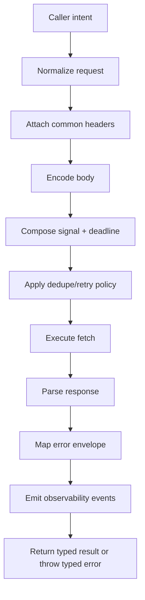
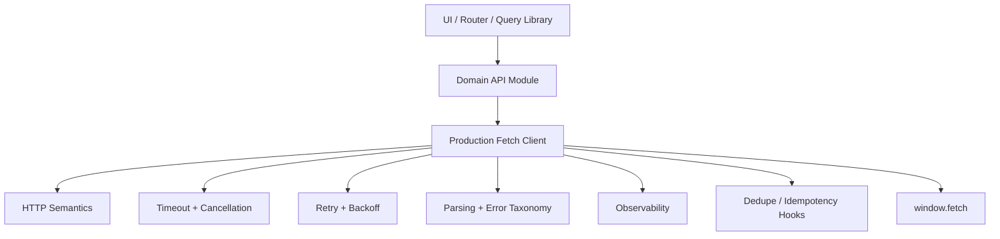

# Part 016 — Building a Production Fetch Client

> A production fetch client is not a prettier `fetch`. It is a policy boundary for remote work.

Dari Part 009 sampai Part 015 kita sudah membangun primitive:

- Fetch API semantics,
- `RequestInit`, headers, body, mode, credentials,
- response parsing dan body streams,
- timeout dan cancellation,
- error taxonomy,
- retry/backoff/deadline,
- request deduplication dan in-flight control.

Sekarang kita gabungkan menjadi satu client kecil yang layak menjadi fondasi aplikasi React production.

Tujuan kita bukan membuat framework. Tujuan kita adalah membuat boundary yang:

- jelas,
- typed,
- testable,
- observable,
- tidak menyembunyikan HTTP semantics,
- tidak mencampur domain logic terlalu dalam,
- aman untuk query dan mutation,
- bisa dipakai oleh React component, router loader, query library, dan service module.

---

## 1. What a Fetch Client Should Own

Fetch client sebaiknya memiliki tanggung jawab ini:



Fetch client sebaiknya **tidak** memiliki tanggung jawab ini:

- mengatur semua React state,
- menyimpan normalized entity graph,
- memutuskan semua cache invalidation domain,
- mengetahui semua business workflow,
- menggantikan router loader,
- menggantikan TanStack Query/Relay/Apollo,
- menyimpan secret di client,
- memaksa semua API mengikuti satu shape palsu.

Boundary yang sehat:

```text
React UI / Router / Query Library
  -> Domain API module
    -> Production Fetch Client
      -> window.fetch
```

Contoh:

```ts
// UI tidak memanggil raw fetch.
const order = await orderApi.getOrder(orderId);

// Domain API module memakai client.
const order = await api.get<Order>(`/api/orders/${orderId}`);
```

---

## 2. Design Goals

Client yang kita bangun harus memenuhi invariant berikut.

### 2.1 No invisible success

HTTP 400/500 tidak boleh dianggap success hanya karena `fetch()` resolve.

### 2.2 No unbounded waiting

Setiap request harus punya deadline atau timeout.

### 2.3 No body double-read bugs

Parsing harus satu tempat dan memperlakukan body kosong dengan benar.

### 2.4 No raw error chaos

Caller menerima error taxonomy yang stabil.

### 2.5 No unsafe retry

Retry harus membaca operation semantics, bukan sekadar attempt count.

### 2.6 No accidental mutation replay

Mutation harus explicit tentang idempotency.

### 2.7 No secret leakage

Logging, keying, dan observability tidak boleh menyimpan token/raw sensitive payload.

### 2.8 No framework lock-in

Client bisa dipakai di:

- React component,
- React Router loader/action,
- TanStack Query queryFn/mutationFn,
- background sync module,
- test harness.

---

## 3. Core Types

Kita mulai dari type.

```ts
type HttpMethod =
  | 'GET'
  | 'HEAD'
  | 'POST'
  | 'PUT'
  | 'PATCH'
  | 'DELETE';

export type RequestPriority = 'high' | 'normal' | 'low';

export type ApiRequestOptions<TBody = unknown> = {
  method?: HttpMethod;
  path: string;
  query?: Record<string, string | number | boolean | null | undefined>;
  headers?: Record<string, string>;
  body?: TBody;
  signal?: AbortSignal;
  timeoutMs?: number;
  retry?: RetryPolicy;
  dedupe?: DedupePolicy;
  idempotencyKey?: string;
  priority?: RequestPriority;
  parseAs?: 'json' | 'text' | 'blob' | 'arrayBuffer' | 'void';
  metadata?: RequestMetadata;
};

export type RequestMetadata = {
  operationName?: string;
  operationKind?: 'query' | 'mutation' | 'prefetch' | 'analytics';
  redaction?: 'standard' | 'sensitive';
};
```

Retry policy:

```ts
export type RetryPolicy = {
  maxAttempts: number;
  baseDelayMs: number;
  maxDelayMs: number;
  respectRetryAfter?: boolean;
  retryableStatusCodes?: number[];
  retryNetworkErrors?: boolean;
};
```

Dedupe policy dari Part 015:

```ts
export type DedupePolicy =
  | { mode: 'none' }
  | { mode: 'inflight'; key: string }
  | { mode: 'window'; key: string; windowMs: number };
```

Error taxonomy:

```ts
export type ApiErrorKind =
  | 'network'
  | 'timeout'
  | 'abort'
  | 'http'
  | 'problem'
  | 'parse'
  | 'contract'
  | 'unknown';

export class ApiError extends Error {
  readonly kind: ApiErrorKind;
  readonly status?: number;
  readonly method?: string;
  readonly url?: string;
  readonly requestId?: string;
  readonly problem?: ProblemDetails;
  readonly cause?: unknown;
  readonly retryable: boolean;

  constructor(input: {
    message: string;
    kind: ApiErrorKind;
    status?: number;
    method?: string;
    url?: string;
    requestId?: string;
    problem?: ProblemDetails;
    cause?: unknown;
    retryable?: boolean;
  }) {
    super(input.message);
    this.name = 'ApiError';
    this.kind = input.kind;
    this.status = input.status;
    this.method = input.method;
    this.url = input.url;
    this.requestId = input.requestId;
    this.problem = input.problem;
    this.cause = input.cause;
    this.retryable = input.retryable ?? false;
  }
}
```

Problem Details:

```ts
export type ProblemDetails = {
  type?: string;
  title?: string;
  status?: number;
  detail?: string;
  instance?: string;
  [extension: string]: unknown;
};
```

---

## 4. URL and Query Normalization

Jangan membangun URL dengan string concatenation sembarang.

```ts
function buildUrl(baseUrl: string, path: string, query?: ApiRequestOptions['query']) {
  const url = new URL(path, baseUrl);

  if (query) {
    for (const [key, value] of Object.entries(query)) {
      if (value === undefined || value === null) continue;
      url.searchParams.set(key, String(value));
    }
  }

  return url;
}
```

Hal yang harus diputuskan secara konsisten:

- apakah `null` query dikirim atau dihapus,
- apakah array query memakai repeated key atau comma-separated,
- apakah boolean memakai `true/false` atau `1/0`,
- apakah URL relatif selalu terhadap `baseUrl`,
- apakah trailing slash signifikan.

Untuk aplikasi besar, query serializer sebaiknya contract-driven.

---

## 5. Header Construction

Common headers:

```ts
type HeaderContext = {
  requestId: string;
  idempotencyKey?: string;
  bodyPresent: boolean;
  extra?: Record<string, string>;
};

function buildHeaders(ctx: HeaderContext): Headers {
  const headers = new Headers();

  headers.set('Accept', 'application/json');
  headers.set('X-Request-Id', ctx.requestId);

  if (ctx.bodyPresent) {
    headers.set('Content-Type', 'application/json');
  }

  if (ctx.idempotencyKey) {
    headers.set('Idempotency-Key', ctx.idempotencyKey);
  }

  for (const [key, value] of Object.entries(ctx.extra ?? {})) {
    headers.set(key, value);
  }

  return headers;
}
```

Catatan penting:

- Jangan set `Authorization` jika auth layer memakai cookie HttpOnly.
- Jangan log header sensitive.
- Jangan override `Content-Type` untuk `FormData`; browser harus memasang boundary multipart sendiri.
- Jangan menganggap semua API mengembalikan JSON hanya karena kita mengirim `Accept: application/json`.

Body encoder:

```ts
function encodeBody(body: unknown): BodyInit | undefined {
  if (body === undefined || body === null) return undefined;

  if (
    typeof body === 'string' ||
    body instanceof FormData ||
    body instanceof Blob ||
    body instanceof ArrayBuffer ||
    body instanceof URLSearchParams
  ) {
    return body;
  }

  return JSON.stringify(body);
}
```

Untuk `FormData`, header builder harus tahu agar tidak memasang `Content-Type: application/json`.

```ts
function isJsonBody(body: unknown): boolean {
  if (body === undefined || body === null) return false;
  if (typeof body === 'string') return false;
  if (body instanceof FormData) return false;
  if (body instanceof Blob) return false;
  if (body instanceof ArrayBuffer) return false;
  if (body instanceof URLSearchParams) return false;
  return true;
}
```

---

## 6. Signal Composition and Timeout

Client harus bisa menerima signal dari caller dan menambahkan timeout sendiri.

Modern browser mendukung `AbortSignal.timeout()` dan `AbortSignal.any()`, tetapi kita tetap buat helper dengan fallback sederhana.

```ts
function timeoutSignal(timeoutMs: number): AbortSignal {
  if (typeof AbortSignal.timeout === 'function') {
    return AbortSignal.timeout(timeoutMs);
  }

  const controller = new AbortController();
  const timer = setTimeout(() => {
    controller.abort(new DOMException('Request timed out', 'TimeoutError'));
  }, timeoutMs);

  controller.signal.addEventListener(
    'abort',
    () => {
      clearTimeout(timer);
    },
    { once: true },
  );

  return controller.signal;
}

function anySignal(signals: AbortSignal[]): AbortSignal {
  const active = signals.filter(Boolean);

  if (active.length === 1) return active[0];

  if (typeof AbortSignal.any === 'function') {
    return AbortSignal.any(active);
  }

  const controller = new AbortController();

  for (const signal of active) {
    if (signal.aborted) {
      controller.abort(signal.reason);
      break;
    }

    signal.addEventListener(
      'abort',
      () => controller.abort(signal.reason),
      { once: true },
    );
  }

  return controller.signal;
}
```

Compose:

```ts
function buildSignal(input: { signal?: AbortSignal; timeoutMs?: number }) {
  const signals: AbortSignal[] = [];

  if (input.signal) signals.push(input.signal);
  if (input.timeoutMs) signals.push(timeoutSignal(input.timeoutMs));

  if (signals.length === 0) return undefined;
  return anySignal(signals);
}
```

---

## 7. Response Parsing

Parsing harus memperlakukan body kosong dengan benar.

```ts
async function parseResponse<T>(response: Response, parseAs: ApiRequestOptions['parseAs']): Promise<T> {
  if (parseAs === 'void' || response.status === 204 || response.status === 205) {
    return undefined as T;
  }

  if (parseAs === 'text') {
    return (await response.text()) as T;
  }

  if (parseAs === 'blob') {
    return (await response.blob()) as T;
  }

  if (parseAs === 'arrayBuffer') {
    return (await response.arrayBuffer()) as T;
  }

  const text = await response.text();

  if (!text.trim()) {
    return undefined as T;
  }

  try {
    return JSON.parse(text) as T;
  } catch (cause) {
    throw new ApiError({
      kind: 'parse',
      message: 'Response body is not valid JSON',
      status: response.status,
      cause,
      retryable: false,
    });
  }
}
```

Mengapa tidak langsung `response.json()`?

Karena kita ingin:

- menangani empty body,
- membuat error taxonomy sendiri,
- membaca Problem Details dari body error,
- mencegah caller membaca body dua kali,
- mengatur parse mode explicit.

---

## 8. HTTP Error Mapping

Fetch resolve untuk HTTP 404/500. Client harus mengubah response non-2xx menjadi typed error.

```ts
function getRequestId(response: Response): string | undefined {
  return (
    response.headers.get('x-request-id') ??
    response.headers.get('x-correlation-id') ??
    undefined
  );
}

function isProblemJson(response: Response): boolean {
  const contentType = response.headers.get('content-type') ?? '';
  return contentType.includes('application/problem+json');
}

async function toHttpError(response: Response, method: string, url: string): Promise<ApiError> {
  const requestId = getRequestId(response);

  if (isProblemJson(response)) {
    let problem: ProblemDetails | undefined;

    try {
      problem = await parseResponse<ProblemDetails>(response, 'json');
    } catch {
      problem = undefined;
    }

    return new ApiError({
      kind: 'problem',
      message: problem?.title ?? `HTTP ${response.status}`,
      status: response.status,
      method,
      url,
      requestId,
      problem,
      retryable: isRetryableStatus(response.status),
    });
  }

  return new ApiError({
    kind: 'http',
    message: `HTTP ${response.status}`,
    status: response.status,
    method,
    url,
    requestId,
    retryable: isRetryableStatus(response.status),
  });
}

function isRetryableStatus(status: number): boolean {
  return status === 408 || status === 425 || status === 429 || status >= 500;
}
```

Catatan:

- `401` biasanya bukan retry transport; itu auth flow.
- `403` bukan retry; itu authorization/business boundary.
- `409` bisa retry hanya jika caller punya concurrency recovery strategy.
- `422` validation error, bukan retry.
- `429` harus menghormati backpressure server jika ada `Retry-After`.

---

## 9. Network Error Mapping

```ts
function mapFetchError(error: unknown, method: string, url: string): ApiError {
  if (error instanceof ApiError) return error;

  if (error instanceof DOMException) {
    if (error.name === 'AbortError') {
      return new ApiError({
        kind: 'abort',
        message: 'Request was aborted',
        method,
        url,
        cause: error,
        retryable: false,
      });
    }

    if (error.name === 'TimeoutError') {
      return new ApiError({
        kind: 'timeout',
        message: 'Request timed out',
        method,
        url,
        cause: error,
        retryable: true,
      });
    }
  }

  return new ApiError({
    kind: 'network',
    message: 'Network request failed',
    method,
    url,
    cause: error,
    retryable: true,
  });
}
```

Tidak semua `TypeError` dari fetch berarti internet mati. CORS failure, DNS failure, TLS failure, blocked mixed content, dan browser policy bisa terlihat mirip dari JavaScript. Karena browser sengaja membatasi detail untuk keamanan, error mapping harus konservatif.

---

## 10. Retry Engine

Kita gunakan policy dari Part 014.

```ts
const defaultRetryPolicy: RetryPolicy = {
  maxAttempts: 1,
  baseDelayMs: 200,
  maxDelayMs: 2_000,
  respectRetryAfter: true,
  retryNetworkErrors: false,
  retryableStatusCodes: [408, 425, 429, 500, 502, 503, 504],
};

function sleep(ms: number, signal?: AbortSignal): Promise<void> {
  return new Promise((resolve, reject) => {
    if (signal?.aborted) {
      reject(signal.reason);
      return;
    }

    const timer = setTimeout(resolve, ms);

    signal?.addEventListener(
      'abort',
      () => {
        clearTimeout(timer);
        reject(signal.reason);
      },
      { once: true },
    );
  });
}

function jitterDelay(base: number, attempt: number, max: number) {
  const exponential = Math.min(max, base * 2 ** attempt);
  return Math.floor(Math.random() * exponential);
}

function shouldRetry(error: ApiError, attempt: number, policy: RetryPolicy, method: HttpMethod) {
  if (attempt >= policy.maxAttempts) return false;
  if (error.kind === 'abort') return false;

  const methodReplayable = method === 'GET' || method === 'HEAD' || method === 'PUT' || method === 'DELETE';
  if (!methodReplayable && error.kind !== 'network' && error.kind !== 'timeout') {
    return false;
  }

  if (error.status !== undefined) {
    return policy.retryableStatusCodes?.includes(error.status) ?? false;
  }

  if (error.kind === 'network' || error.kind === 'timeout') {
    return policy.retryNetworkErrors ?? false;
  }

  return false;
}
```

Untuk POST/PATCH, retry otomatis harus disabled kecuali caller menyatakan idempotency key dan body replayable.

---

## 11. Observability Events

Client harus mengeluarkan event yang bisa dihubungkan ke logs, metrics, traces, dan RUM.

```ts
type ApiClientEvent =
  | {
      type: 'request_start';
      requestId: string;
      method: string;
      url: string;
      operationName?: string;
      attempt: number;
    }
  | {
      type: 'request_success';
      requestId: string;
      method: string;
      url: string;
      status: number;
      durationMs: number;
      attempt: number;
    }
  | {
      type: 'request_error';
      requestId: string;
      method: string;
      url: string;
      errorKind: ApiErrorKind;
      status?: number;
      durationMs: number;
      attempt: number;
    }
  | {
      type: 'request_retry';
      requestId: string;
      method: string;
      url: string;
      attempt: number;
      delayMs: number;
      reason: string;
    };

type ApiClientObserver = (event: ApiClientEvent) => void;
```

Sanitize URL sebelum emit:

```ts
function sanitizeUrl(url: URL): string {
  const copy = new URL(url.toString());

  for (const key of ['token', 'access_token', 'refresh_token', 'code', 'password']) {
    if (copy.searchParams.has(key)) {
      copy.searchParams.set(key, '[REDACTED]');
    }
  }

  return copy.pathname + copy.search;
}
```

---

## 12. The ApiClient Class

Sekarang kita rakit.

```ts
type ApiClientConfig = {
  baseUrl: string;
  defaultTimeoutMs?: number;
  defaultHeaders?: () => Record<string, string> | Promise<Record<string, string>>;
  fetchImpl?: typeof fetch;
  observer?: ApiClientObserver;
};

export class ApiClient {
  private readonly fetchImpl: typeof fetch;
  private readonly defaultTimeoutMs: number;

  constructor(private readonly config: ApiClientConfig) {
    this.fetchImpl = config.fetchImpl ?? fetch;
    this.defaultTimeoutMs = config.defaultTimeoutMs ?? 15_000;
  }

  get<T>(path: string, options: Omit<ApiRequestOptions, 'method' | 'path' | 'body'> = {}) {
    return this.request<T>({ ...options, method: 'GET', path });
  }

  post<TResponse, TBody = unknown>(
    path: string,
    body?: TBody,
    options: Omit<ApiRequestOptions<TBody>, 'method' | 'path' | 'body'> = {},
  ) {
    return this.request<TResponse, TBody>({ ...options, method: 'POST', path, body });
  }

  put<TResponse, TBody = unknown>(
    path: string,
    body?: TBody,
    options: Omit<ApiRequestOptions<TBody>, 'method' | 'path' | 'body'> = {},
  ) {
    return this.request<TResponse, TBody>({ ...options, method: 'PUT', path, body });
  }

  patch<TResponse, TBody = unknown>(
    path: string,
    body?: TBody,
    options: Omit<ApiRequestOptions<TBody>, 'method' | 'path' | 'body'> = {},
  ) {
    return this.request<TResponse, TBody>({ ...options, method: 'PATCH', path, body });
  }

  delete<T>(path: string, options: Omit<ApiRequestOptions, 'method' | 'path' | 'body'> = {}) {
    return this.request<T>({ ...options, method: 'DELETE', path });
  }

  async request<TResponse, TBody = unknown>(
    options: ApiRequestOptions<TBody>,
  ): Promise<TResponse> {
    const method = options.method ?? 'GET';
    const url = buildUrl(this.config.baseUrl, options.path, options.query);
    const sanitizedUrl = sanitizeUrl(url);
    const requestId = crypto.randomUUID();
    const timeoutMs = options.timeoutMs ?? this.defaultTimeoutMs;
    const signal = buildSignal({ signal: options.signal, timeoutMs });
    const retry = options.retry ?? defaultRetryPolicy;

    const headers = buildHeaders({
      requestId,
      idempotencyKey: options.idempotencyKey,
      bodyPresent: isJsonBody(options.body),
      extra: {
        ...(await this.config.defaultHeaders?.()),
        ...options.headers,
      },
    });

    const body = encodeBody(options.body);
    const init: RequestInit = {
      method,
      headers,
      body,
      signal,
      credentials: 'same-origin',
    };

    return this.executeWithRetry<TResponse>({
      requestId,
      method,
      url,
      sanitizedUrl,
      init,
      parseAs: options.parseAs ?? 'json',
      retry,
      signal,
      operationName: options.metadata?.operationName,
      idempotencyKey: options.idempotencyKey,
    });
  }

  private async executeWithRetry<T>(input: {
    requestId: string;
    method: HttpMethod;
    url: URL;
    sanitizedUrl: string;
    init: RequestInit;
    parseAs: ApiRequestOptions['parseAs'];
    retry: RetryPolicy;
    signal?: AbortSignal;
    operationName?: string;
    idempotencyKey?: string;
  }): Promise<T> {
    let attempt = 1;

    while (true) {
      const startedAt = performance.now();

      this.config.observer?.({
        type: 'request_start',
        requestId: input.requestId,
        method: input.method,
        url: input.sanitizedUrl,
        operationName: input.operationName,
        attempt,
      });

      try {
        const response = await this.fetchImpl(input.url, input.init);
        const durationMs = performance.now() - startedAt;

        if (!response.ok) {
          throw await toHttpError(response, input.method, input.sanitizedUrl);
        }

        const parsed = await parseResponse<T>(response, input.parseAs);

        this.config.observer?.({
          type: 'request_success',
          requestId: input.requestId,
          method: input.method,
          url: input.sanitizedUrl,
          status: response.status,
          durationMs,
          attempt,
        });

        return parsed;
      } catch (rawError) {
        const durationMs = performance.now() - startedAt;
        const error = mapFetchError(rawError, input.method, input.sanitizedUrl);

        this.config.observer?.({
          type: 'request_error',
          requestId: input.requestId,
          method: input.method,
          url: input.sanitizedUrl,
          errorKind: error.kind,
          status: error.status,
          durationMs,
          attempt,
        });

        if (!shouldRetrySafely(error, attempt, input.retry, input.method, input.idempotencyKey)) {
          throw error;
        }

        const delayMs = jitterDelay(input.retry.baseDelayMs, attempt, input.retry.maxDelayMs);

        this.config.observer?.({
          type: 'request_retry',
          requestId: input.requestId,
          method: input.method,
          url: input.sanitizedUrl,
          attempt,
          delayMs,
          reason: error.kind,
        });

        await sleep(delayMs, input.signal);
        attempt += 1;
      }
    }
  }
}
```

Safer retry for mutation:

```ts
function shouldRetrySafely(
  error: ApiError,
  attempt: number,
  policy: RetryPolicy,
  method: HttpMethod,
  idempotencyKey?: string,
) {
  const safeOrIdempotentMethod =
    method === 'GET' || method === 'HEAD' || method === 'PUT' || method === 'DELETE';

  const replayableMutation =
    (method === 'POST' || method === 'PATCH') && Boolean(idempotencyKey);

  if (!safeOrIdempotentMethod && !replayableMutation) {
    return false;
  }

  return shouldRetry(error, attempt, policy, method);
}
```

---

## 13. Adding In-Flight Dedupe

Kita tidak wajib memasukkan dedupe ke semua request. Tambahkan wrapper:

```ts
export class DedupeApiClient extends ApiClient {
  constructor(
    config: ApiClientConfig,
    private readonly registry: ProductionInFlightRegistry,
  ) {
    super(config);
  }

  override async request<TResponse, TBody = unknown>(
    options: ApiRequestOptions<TBody>,
  ): Promise<TResponse> {
    if (!options.dedupe || options.dedupe.mode === 'none') {
      return super.request<TResponse, TBody>(options);
    }

    if (options.dedupe.mode === 'inflight') {
      const sub = this.registry.subscribe<TResponse>(options.dedupe.key, () => {
        return super.request<TResponse, TBody>({
          ...options,
          dedupe: { mode: 'none' },
        });
      });

      return sub.promise;
    }

    return super.request<TResponse, TBody>(options);
  }
}
```

Catatan: implementasi ini tidak menyalurkan signal registry ke `super.request`. Versi production final harus menggabungkan operation signal dari registry dengan caller signal seperti Part 015. Di sini tujuan kita menunjukkan boundary, bukan membuat package final.

---

## 14. Domain API Module

Jangan expose generic client ke seluruh component. Bungkus dengan domain API.

```ts
type Order = {
  id: string;
  status: 'draft' | 'submitted' | 'paid' | 'cancelled';
  total: number;
  version: number;
};

type CreateOrderInput = {
  customerId: string;
  items: Array<{ sku: string; quantity: number }>;
};

export function createOrderApi(api: ApiClient) {
  return {
    getOrder(orderId: string, signal?: AbortSignal) {
      return api.get<Order>(`/api/orders/${orderId}`, {
        signal,
        metadata: {
          operationName: 'Order.GetOrder',
          operationKind: 'query',
        },
        dedupe: {
          mode: 'inflight',
          key: `Order.GetOrder:${orderId}`,
        },
      });
    },

    createOrder(input: CreateOrderInput, signal?: AbortSignal) {
      return api.post<Order, CreateOrderInput>('/api/orders', input, {
        signal,
        idempotencyKey: crypto.randomUUID(),
        metadata: {
          operationName: 'Order.CreateOrder',
          operationKind: 'mutation',
        },
        retry: {
          maxAttempts: 2,
          baseDelayMs: 300,
          maxDelayMs: 1_000,
          retryNetworkErrors: true,
          retryableStatusCodes: [408, 429, 500, 502, 503, 504],
        },
      });
    },
  };
}
```

Domain API module adalah tempat yang tepat untuk:

- path,
- request/response type,
- operation name,
- dedupe key,
- idempotency behavior,
- retry override,
- response validation,
- domain-specific error translation.

---

## 15. React Integration Without Library

Untuk query sederhana:

```tsx
function useOrder(orderApi: ReturnType<typeof createOrderApi>, orderId: string) {
  const [state, setState] = useState<
    | { status: 'loading' }
    | { status: 'success'; data: Order }
    | { status: 'error'; error: ApiError }
  >({ status: 'loading' });

  useEffect(() => {
    const controller = new AbortController();
    let alive = true;

    setState({ status: 'loading' });

    orderApi.getOrder(orderId, controller.signal).then(
      (data) => {
        if (alive) setState({ status: 'success', data });
      },
      (error) => {
        if (!alive) return;
        if (error instanceof ApiError && error.kind === 'abort') return;
        setState({ status: 'error', error });
      },
    );

    return () => {
      alive = false;
      controller.abort();
    };
  }, [orderApi, orderId]);

  return state;
}
```

Ini usable, tapi untuk aplikasi besar, server-state library lebih baik karena menangani cache, refetch, invalidation, stale time, dan mutation lifecycle.

---

## 16. TanStack Query Integration Shape

Client ini cocok dipakai sebagai `queryFn`:

```tsx
function useOrderQuery(orderApi: ReturnType<typeof createOrderApi>, orderId: string) {
  return useQuery({
    queryKey: ['order', orderId],
    queryFn: ({ signal }) => orderApi.getOrder(orderId, signal),
    staleTime: 30_000,
  });
}
```

Mutation:

```tsx
function useCreateOrderMutation(orderApi: ReturnType<typeof createOrderApi>) {
  const queryClient = useQueryClient();

  return useMutation({
    mutationFn: (input: CreateOrderInput) => orderApi.createOrder(input),
    onSuccess: (order) => {
      queryClient.setQueryData(['order', order.id], order);
      queryClient.invalidateQueries({ queryKey: ['orders'] });
    },
  });
}
```

Boundary tetap jelas:

- query library mengatur server-state lifecycle,
- API client mengatur transport policy,
- domain module mengatur endpoint contract,
- UI mengatur presentation.

---

## 17. React Router Loader Integration Shape

Route loader bisa memakai client yang sama:

```ts
export async function orderLoader({ params, request }: LoaderFunctionArgs) {
  const orderId = params.orderId;
  if (!orderId) throw new Response('Missing orderId', { status: 400 });

  return orderApi.getOrder(orderId, request.signal);
}
```

Dengan ini, cancellation dari navigation bisa diteruskan ke fetch client.

---

## 18. Runtime Validation Boundary

TypeScript hanya compile-time. Response dari server tetap unknown saat runtime.

Minimal:

```ts
type Validator<T> = (value: unknown) => T;
```

Tambahkan ke options:

```ts
type ApiRequestOptions<TBody = unknown, TResponse = unknown> = {
  // existing fields...
  validate?: Validator<TResponse>;
};
```

Setelah parse:

```ts
const parsed = await parseResponse<unknown>(response, input.parseAs);
const data = input.validate ? input.validate(parsed) : parsed;
return data as T;
```

Jika validation gagal:

```ts
throw new ApiError({
  kind: 'contract',
  message: 'Response did not match expected contract',
  status: response.status,
  method,
  url,
  cause: error,
  retryable: false,
});
```

Gunakan runtime validation pada boundary yang kritis:

- payment,
- regulatory workflow,
- authorization decision payload,
- feature flags,
- migrations,
- cross-team APIs,
- public APIs.

Tidak semua endpoint harus divalidasi penuh di client, tetapi contract-critical endpoint sebaiknya punya guard.

---

## 19. Handling Authentication Without Owning Auth

Fetch client boleh memasang credential mode atau memanggil header provider, tetapi jangan menjadi identity system.

Cookie-based auth:

```ts
const api = new ApiClient({
  baseUrl: window.location.origin,
  defaultTimeoutMs: 15_000,
});
```

Bearer token provider:

```ts
const api = new ApiClient({
  baseUrl: 'https://api.example.com',
  defaultHeaders: async () => {
    const token = await tokenProvider.getAccessToken();
    return token ? { Authorization: `Bearer ${token}` } : {};
  },
});
```

Namun token refresh flow harus hati-hati:

- jangan infinite loop pada 401,
- jangan refresh token paralel tanpa dedupe,
- jangan retry mutation setelah auth refresh kecuali safe/idempotent,
- jangan log token,
- jangan expose secret ke frontend jika tidak perlu.

Detail auth dibahas di seri React Authentication/Authorization. Di sini cukup ingat: fetch client hanya transport boundary.

---

## 20. File Upload and Non-JSON Requests

Production client harus tidak rusak untuk `FormData`.

```ts
async function uploadAvatar(file: File) {
  const form = new FormData();
  form.set('avatar', file);

  return api.post<{ url: string }, FormData>('/api/profile/avatar', form, {
    parseAs: 'json',
    timeoutMs: 60_000,
    metadata: {
      operationName: 'Profile.UploadAvatar',
      operationKind: 'mutation',
      redaction: 'sensitive',
    },
  });
}
```

Perbaiki header builder:

```ts
function buildHeaders(ctx: HeaderContext & { jsonBody: boolean }): Headers {
  const headers = new Headers();

  headers.set('Accept', 'application/json');
  headers.set('X-Request-Id', ctx.requestId);

  if (ctx.jsonBody) {
    headers.set('Content-Type', 'application/json');
  }

  if (ctx.idempotencyKey) {
    headers.set('Idempotency-Key', ctx.idempotencyKey);
  }

  for (const [key, value] of Object.entries(ctx.extra ?? {})) {
    headers.set(key, value);
  }

  return headers;
}
```

Upload progress tidak tersedia secara langsung dengan plain Fetch upload progress di semua kasus. Jika upload progress menjadi requirement besar, evaluasi XHR, streams support, atau direct-to-object-storage signed upload pattern.

---

## 21. Configuration Per Environment

Jangan hardcode API base URL tersebar di code.

```ts
const api = new ApiClient({
  baseUrl: import.meta.env.VITE_API_BASE_URL,
  defaultTimeoutMs: 15_000,
  observer: (event) => {
    networkTelemetry.record(event);
  },
});
```

Environment config harus menjawab:

- local dev pakai backend mana,
- staging/prod base URL,
- same-origin atau cross-origin,
- credentials mode,
- request timeout default,
- telemetry enabled/disabled,
- API version header,
- mock mode/test mode.

---

## 22. Testing the Client

Karena `fetchImpl` injectable, test tidak perlu browser network.

```ts
it('throws ApiError for HTTP 500', async () => {
  const fetchImpl: typeof fetch = async () =>
    new Response(JSON.stringify({ message: 'fail' }), {
      status: 500,
      headers: { 'Content-Type': 'application/json' },
    });

  const api = new ApiClient({
    baseUrl: 'https://api.example.test',
    fetchImpl,
  });

  await expect(api.get('/boom')).rejects.toMatchObject({
    name: 'ApiError',
    kind: 'http',
    status: 500,
  });
});
```

Test parse empty:

```ts
it('parses 204 as undefined', async () => {
  const fetchImpl: typeof fetch = async () => new Response(null, { status: 204 });

  const api = new ApiClient({
    baseUrl: 'https://api.example.test',
    fetchImpl,
  });

  await expect(api.delete('/resource/1', { parseAs: 'void' })).resolves.toBeUndefined();
});
```

Test timeout with fake timers if your test framework supports it.

---

## 23. Production Client Folder Structure

A clean structure:

```text
src/
  api/
    client/
      ApiClient.ts
      ApiError.ts
      retry.ts
      parseResponse.ts
      headers.ts
      url.ts
      observability.ts
      dedupe.ts
    modules/
      orderApi.ts
      userApi.ts
      caseApi.ts
      attachmentApi.ts
    index.ts
```

Avoid:

```text
src/utils/request.ts
src/helpers/fetcher.ts
src/services/api.ts
src/lib/http.ts
```

Bukan karena nama tersebut salah, tetapi karena sering berubah menjadi dumping ground tanpa ownership.

---

## 24. Anti-Patterns

### 24.1 Global catch that logs out on every 401

```ts
if (response.status === 401) logout();
```

Buruk karena:

- bisa terjadi pada optional endpoint,
- bisa terjadi saat token refresh race,
- bisa memotong unsaved work,
- mencampur transport dengan session policy.

### 24.2 Always parse JSON

```ts
return response.json();
```

Rusak untuk:

- 204,
- empty response,
- file download,
- invalid error body,
- text endpoint,
- streaming endpoint.

### 24.3 Retry everything three times

```ts
retry: 3
```

Tidak cukup. Retry perlu semantics.

### 24.4 One giant interceptor chain

Interceptor yang terlalu magic membuat request behavior sulit diprediksi.

Lebih baik gunakan explicit options dan small middleware yang observable.

### 24.5 Generic `ApiResponse<T>` everywhere

```ts
type ApiResponse<T> = {
  success: boolean;
  data?: T;
  error?: string;
};
```

Bentuk ini bisa berguna jika memang contract server begitu. Tetapi jangan membungkus semua HTTP menjadi envelope palsu yang menghapus status code, headers, cache semantics, dan Problem Details.

---

## 25. Final Review Checklist

Sebelum fetch client dipakai luas, cek:

- Apakah non-2xx selalu menjadi typed error?
- Apakah empty body aman?
- Apakah timeout default ada?
- Apakah caller signal diteruskan?
- Apakah timeout dan caller abort bisa digabung?
- Apakah retry default konservatif?
- Apakah POST/PATCH tidak retry tanpa idempotency?
- Apakah `Retry-After` dipertimbangkan untuk 429/503?
- Apakah header sensitive tidak masuk log?
- Apakah URL telemetry disanitasi?
- Apakah `FormData` tidak dipaksa JSON content type?
- Apakah request id/correlation id tersedia?
- Apakah fetch implementation injectable untuk test?
- Apakah domain API module menyembunyikan path dari UI?
- Apakah client bisa dipakai oleh router loader/query library?
- Apakah logout/switch tenant membersihkan state terkait dedupe/cache di layer atas?

---

## 26. Mental Model Final

Production fetch client adalah **policy boundary**, bukan abstraction demi abstraction.



Setelah Part 016, Phase 2 selesai.

Kita sekarang punya fondasi transport yang kuat. Phase berikutnya akan masuk ke konsekuensi React rendering model: bagaimana remote data berinteraksi dengan component lifecycle, effect hazards, race conditions, loading/error states, Suspense, server state, query keys, dan composition.

---

## References

- MDN Web Docs — Using the Fetch API.
- MDN Web Docs — RequestInit.
- MDN Web Docs — AbortSignal, AbortSignal.timeout(), and AbortSignal.any().
- MDN Web Docs — Response.
- RFC 9110 — HTTP Semantics.
- RFC 9457 — Problem Details for HTTP APIs.
- WHATWG Fetch Standard.
