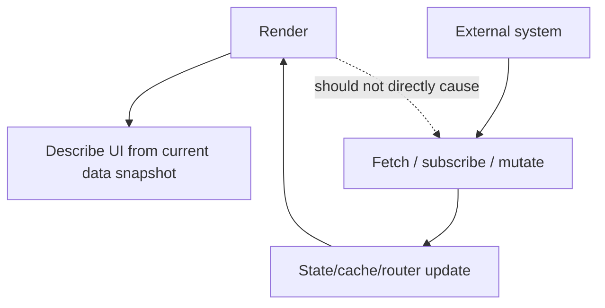
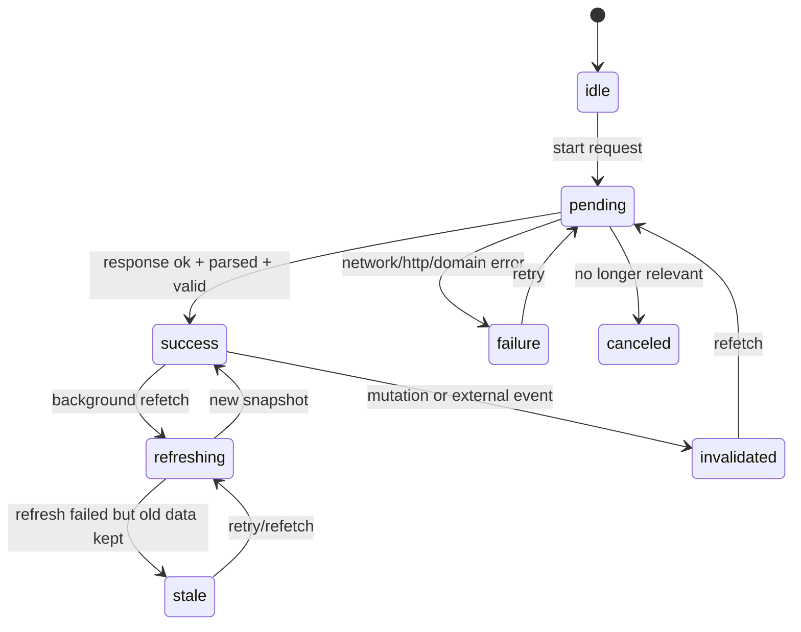
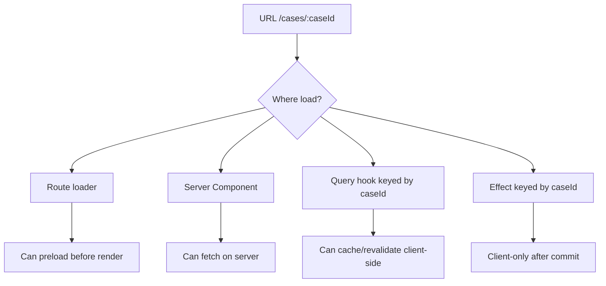
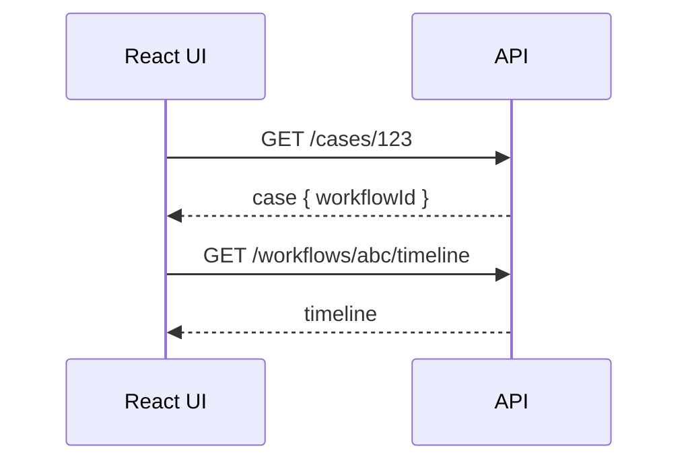
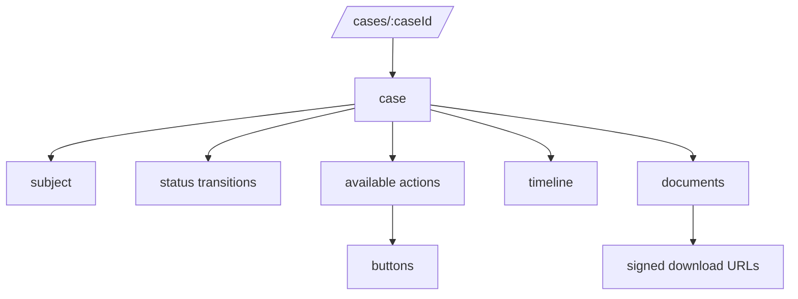
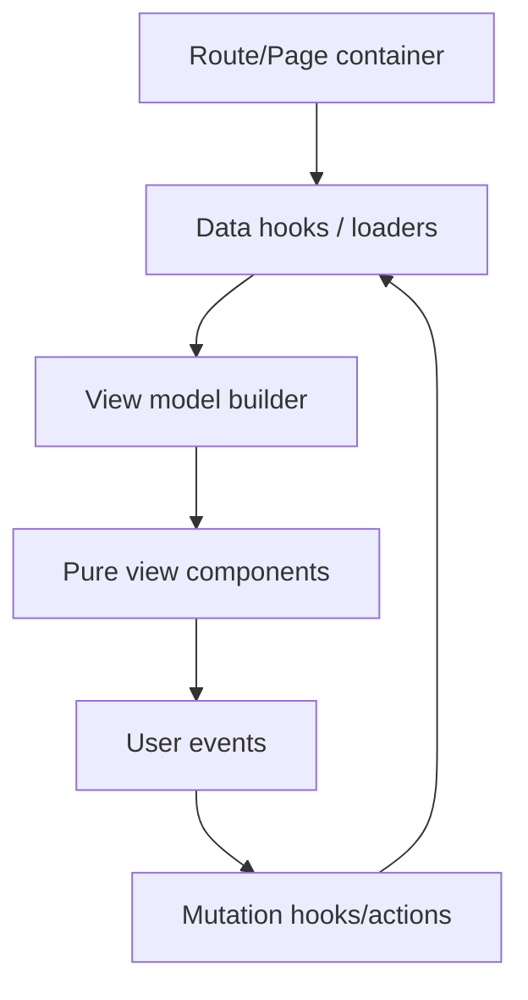
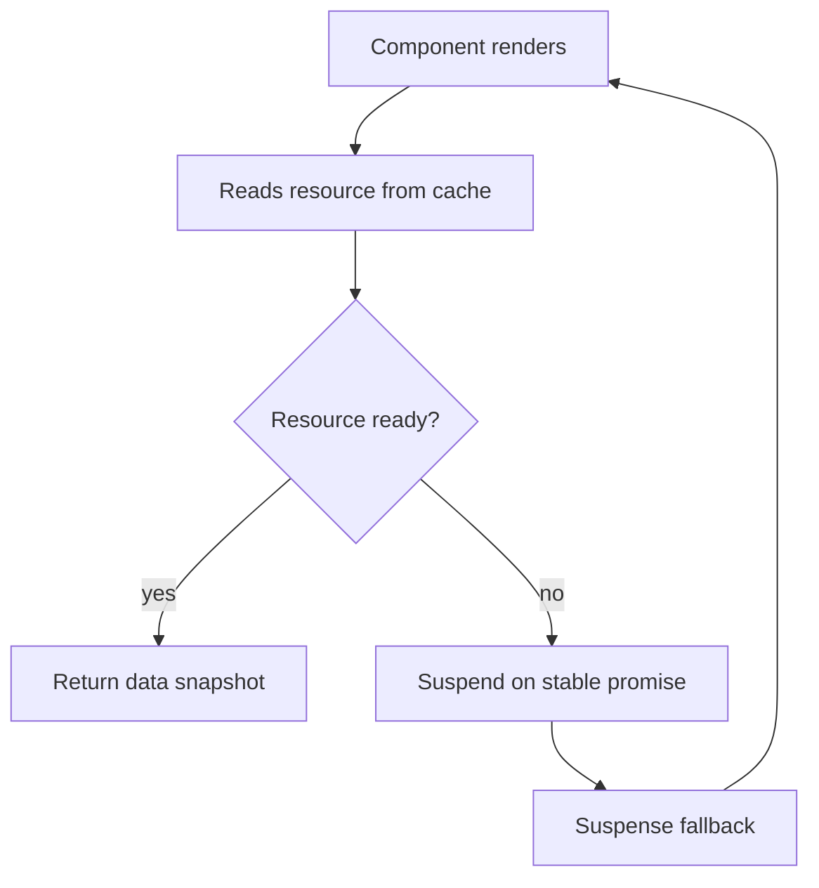
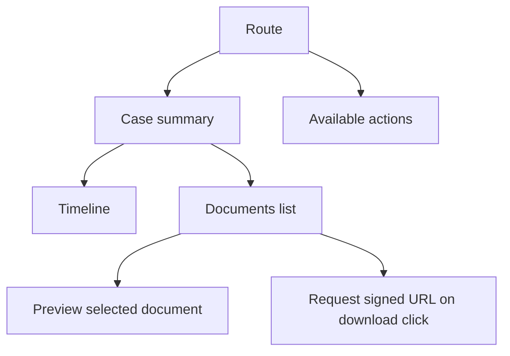
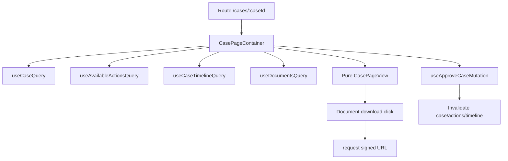
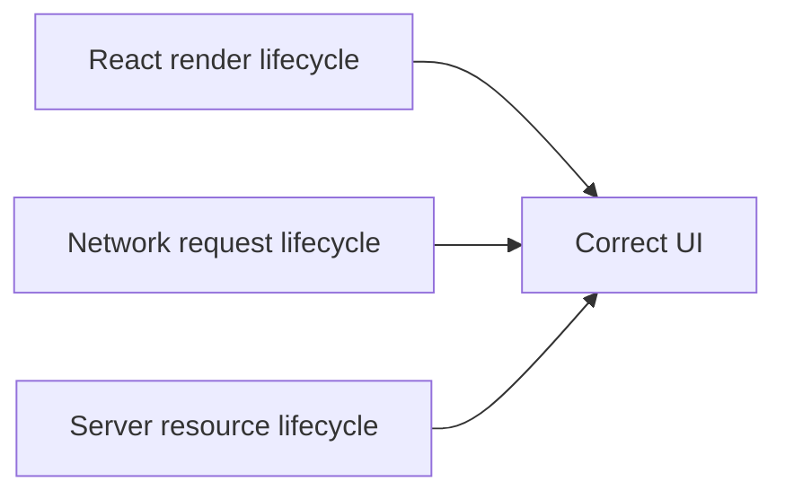

# Part 017 — Fetching Inside React Components

> Remote data is not a variable you read. It is an external system you observe through a fallible, delayed, cancellable, partially consistent boundary.

Di Part 001–016 kita sudah membangun fondasi network layer:

- browser network stack,
- HTTP semantics,
- request-response lifecycle,
- Fetch API,
- parsing,
- cancellation,
- error taxonomy,
- retry,
- deduplication,
- production fetch client.

Sekarang kita masuk ke Phase 3: **React rendering model meets remote data**.

Pertanyaan utama Part 017:

> Ketika sebuah React component butuh data dari server, di mana request seharusnya dibuat, siapa yang mengontrol lifecycle-nya, dan bagaimana hasilnya masuk ke UI tanpa membuat render model menjadi rapuh?

Ini bukan pertanyaan kecil. Banyak aplikasi React production lambat, flaky, dan sulit di-debug bukan karena API-nya buruk, tapi karena remote data diperlakukan seperti local variable.

Remote data memiliki sifat berbeda:

- datang belakangan,
- bisa gagal,
- bisa stale,
- bisa berubah di server tanpa client tahu,
- bisa tertukar karena race,
- bisa dibatalkan,
- bisa sukses di server tapi gagal dikonfirmasi ke client,
- bisa memiliki kontrak yang berubah,
- bisa memicu side effect saat mutation.

React component, sebaliknya, bekerja dengan model:

- render harus pure,
- UI adalah fungsi dari state/props/current external snapshot,
- commit terjadi setelah render,
- effect berjalan setelah commit,
- render bisa diulang,
- render bisa dibuang,
- state update bisa diprioritaskan,
- Strict Mode di development bisa mengekspos efek samping yang tidak idempotent.

Kalau dua model ini tidak dijahit dengan benar, hasilnya:

- duplicate request,
- stale UI,
- flicker,
- loading state yang salah,
- infinite loop,
- waterfall,
- cache invalidation acak,
- optimistic update yang tidak bisa rollback,
- error handling yang tidak konsisten,
- form submit ganda,
- request yang masih hidup setelah component tidak relevan.

Part ini membangun mental model untuk fetching di sekitar component. Part 018 akan membedah hazard spesifik `useEffect`.

---

## 1. The Core Boundary: React Render Is Not Network Execution

React component function sebaiknya dipahami sebagai **render computation**, bukan process worker.

```tsx
function UserProfile({ userId }: { userId: string }) {
  const user = ???
  return <h1>{user.name}</h1>
}
```

Pertanyaan `???` terlihat sederhana, tapi ada beberapa kemungkinan besar:

```text
1. Data sudah diberikan oleh parent sebagai props.
2. Data sudah ada di route loader.
3. Data dibaca dari query cache.
4. Data dibaca dari server component boundary.
5. Data di-fetch setelah component mount lewat effect.
6. Data di-fetch akibat user event.
7. Data di-stream secara realtime.
8. Data adalah draft local dari form.
```

Semua opsi itu menghasilkan JSX yang mirip, tetapi ownership dan failure behavior-nya berbeda jauh.

Render function tidak boleh dianggap sebagai tempat bebas untuk menjalankan work eksternal. Di Client Component biasa, memanggil `fetch()` langsung saat render adalah smell besar karena render dapat dieksekusi ulang dan tidak selalu commit.

```tsx
// Problematic in a normal Client Component render path.
function UserProfile({ userId }: { userId: string }) {
  const promise = fetch(`/api/users/${userId}`)
  // Now render has created an external side effect.
  return <div />
}
```

Masalahnya bukan hanya “ini async”. Masalah utamanya adalah **render tidak boleh menjadi sumber side effect yang tidak terkendali**.

React dapat:

- memanggil component untuk menghitung UI,
- membuang hasil render,
- render ulang karena state/props berubah,
- menjalankan render di mode concurrent,
- menjalankan ulang untuk membantu mendeteksi impurity di development.

Kalau render menciptakan request, maka request bisa terjadi tanpa UI yang akhirnya commit.

Boundary yang sehat:



Render membaca snapshot. Eksekusi network harus berada di mekanisme yang memang didesain untuk external synchronization:

- framework data loader,
- Server Component async boundary,
- route loader/action,
- query library,
- event handler,
- effect dengan cleanup yang benar,
- explicit resource cache yang integrated dengan Suspense.

---

## 2. Component Is a View Boundary, Not Always a Data Boundary

Kesalahan umum:

> “Component ini menampilkan user, berarti component ini harus fetch user.”

Kadang benar. Sering salah.

Component adalah view boundary. Data boundary harus ditentukan oleh:

- kapan data dibutuhkan,
- apakah data menentukan route,
- apakah data bisa di-prefetch,
- apakah data dibagi oleh banyak component,
- apakah data punya lifecycle cache,
- apakah data harus konsisten setelah mutation,
- apakah data bisa di-render di server,
- apakah data sensitif,
- apakah data tergantung credential/cookie,
- apakah loading state harus lokal atau page-level.

Contoh:

```tsx
function UserAvatar({ userId }: { userId: string }) {
  // Does this component own user fetching?
}
```

Jawabannya tergantung konteks.

### Case A — Avatar kecil di list besar

Kalau avatar muncul 100 kali dalam list, setiap `UserAvatar` melakukan fetch sendiri bisa membuat N+1 request.

Lebih baik:

- list endpoint mengembalikan avatar URL,
- parent menyediakan data,
- query cache melakukan batch/coalescing,
- backend menyediakan include/expand field.

### Case B — Profile page utama

Kalau route `/users/:id` tidak berguna tanpa user data, route loader atau page-level query lebih masuk akal.

### Case C — Tooltip on hover

Kalau detail hanya dibutuhkan ketika user hover/focus, event-driven lazy fetch lebih tepat.

### Case D — Server-rendered page

Kalau data menentukan initial content dan SEO/perceived performance penting, Server Component atau framework loader bisa lebih baik daripada effect setelah paint.

Rule praktis:

> Colocate data requirement dekat consumer, tapi jangan otomatis colocate network execution di setiap leaf component.

Colocation yang baik menyatakan “component ini butuh resource X”. Orchestration yang baik menentukan “resource X diambil kapan, oleh siapa, dengan cache key apa, dan bagaimana failure-nya memengaruhi UI”.

---

## 3. The Fetch Placement Decision Matrix

Gunakan matrix ini sebelum menulis `useEffect`.

| Need | Better placement | Why |
|---|---|---|
| Data required before route is useful | Route loader / framework data API / Server Component | Avoid client-only loading shell and route waterfalls |
| Data required by many components | Query cache / parent orchestration / normalized cache | Shared lifecycle, dedupe, invalidation |
| Data triggered by click/submit | Event handler / action / mutation hook | User intent is explicit; no dependency guessing |
| Data depends on URL params | Route loader or query keyed by params | URL is resource identity |
| Data is purely cosmetic and optional | Lazy component-level query/effect | Failure should not block main flow |
| Data needs polling/realtime | Subscription/query library/realtime layer | Lifecycle is not simple request-response |
| Data can be server-rendered safely | Server Component/SSR loader | Better initial content and less client waterfall |
| Data is sensitive or uses secret | Server boundary | Secret must not cross to browser |
| Data is form draft | Local component/form state | Server data is not draft state |
| Data is optimistic mutation result | Mutation layer + cache update | Needs rollback and reconciliation |

A good React engineer does not ask only:

> “How do I fetch this in component?”

They ask:

> “What lifecycle owns this data?”

---

## 4. Remote Data as a State Machine

A robust component does not have only `data` and `loading`.

Remote data has a lifecycle.



A naive component usually models:

```ts
type NaiveState<T> = {
  loading: boolean
  data?: T
  error?: unknown
}
```

This shape is underspecified.

Can `loading=true` and `data` exist together?

Yes, for background refresh.

Can `error` exist with `data`?

Yes, when refresh failed but previous data remains usable.

Can request be canceled without showing error?

Yes.

Can mutation be pending while query data exists?

Yes.

Can data be optimistic and not yet confirmed?

Yes.

Better mental model:

```ts
type RemoteData<T, E = unknown> =
  | { status: 'idle' }
  | { status: 'pending'; requestId: string }
  | { status: 'success'; data: T; stale: boolean; updatedAt: number }
  | { status: 'refreshing'; data: T; requestId: string; updatedAt: number }
  | { status: 'failure'; error: E; canRetry: boolean }
  | { status: 'canceled'; reason: string }
```

Query libraries often hide this complexity behind booleans like:

- `isLoading`,
- `isFetching`,
- `isError`,
- `isSuccess`,
- `isRefetching`,
- `dataUpdatedAt`.

But as an engineer, you still need to understand the state machine underneath.

---

## 5. Render From Snapshot, Execute From Intent

A clean architecture separates:

1. **Resource identity** — what is being requested?
2. **Execution policy** — when/how is it fetched?
3. **Snapshot** — what does the UI currently know?
4. **View model** — how does snapshot become UI state?
5. **Mutation policy** — how does user intent change server state?

Example:

```tsx
type UserProfileProps = {
  userId: string
}

function UserProfileScreen({ userId }: UserProfileProps) {
  const userQuery = useUserQuery(userId)

  if (userQuery.status === 'pending') return <ProfileSkeleton />
  if (userQuery.status === 'failure') return <RetryPanel error={userQuery.error} />

  return <UserProfileView user={userQuery.data} isRefreshing={userQuery.isFetching} />
}
```

Here `UserProfileView` does not know network execution.

```tsx
type UserProfileViewProps = {
  user: User
  isRefreshing: boolean
}

function UserProfileView({ user, isRefreshing }: UserProfileViewProps) {
  return (
    <section aria-busy={isRefreshing}>
      <h1>{user.name}</h1>
      <p>{user.email}</p>
      {isRefreshing && <span>Refreshing…</span>}
    </section>
  )
}
```

This split matters because rendering becomes deterministic.

The fetch lifecycle is owned by `useUserQuery`. The view is owned by `UserProfileView`.

---

## 6. Component-Level Fetching: When It Is Acceptable

Component-level fetching is acceptable when:

- the data is local to the component,
- no route-level preloading is needed,
- SSR/initial render is not critical,
- failure can be contained locally,
- duplicate requests are deduped or harmless,
- cancellation is handled,
- dependencies are explicit,
- request identity is stable,
- loading UX is intentionally scoped.

Example: lazy metadata panel.

```tsx
function AuditTrailPanel({ caseId }: { caseId: string }) {
  const auditTrail = useAuditTrailQuery(caseId, {
    enabled: true,
    staleTimeMs: 30_000,
  })

  if (auditTrail.status === 'pending') return <PanelSkeleton />
  if (auditTrail.status === 'failure') return <InlineError error={auditTrail.error} />

  return <AuditTrail events={auditTrail.data.events} />
}
```

This is fine because the panel owns a bounded, optional, local resource.

Bad version:

```tsx
function AuditTrailPanel({ caseId }: { caseId: string }) {
  const [events, setEvents] = useState<AuditEvent[]>([])

  fetch(`/api/cases/${caseId}/audit`) // runs during render; do not do this
    .then(r => r.json())
    .then(json => setEvents(json.events))

  return <AuditTrail events={events} />
}
```

This creates side effects during render and can trigger render loops.

---

## 7. Fetching in Event Handlers

Not every request belongs to an effect.

If request is caused by an explicit user action, the event handler is usually the right boundary.

```tsx
function ExportButton({ caseId }: { caseId: string }) {
  const [status, setStatus] = useState<'idle' | 'pending' | 'failed'>('idle')

  async function handleExport() {
    setStatus('pending')

    try {
      const result = await casesApi.requestExport({ caseId })
      window.location.assign(result.downloadUrl)
      setStatus('idle')
    } catch (error) {
      setStatus('failed')
    }
  }

  return (
    <button onClick={handleExport} disabled={status === 'pending'}>
      {status === 'pending' ? 'Preparing…' : 'Export'}
    </button>
  )
}
```

This is better than:

```tsx
// Smell: using state as an indirect event bus.
useEffect(() => {
  if (!shouldExport) return
  void exportCase()
}, [shouldExport])
```

Event-driven requests should usually remain event-driven.

Effects are for synchronization caused by render state, not for hiding imperative user actions behind boolean flags.

---

## 8. Fetching on Route Change

When URL determines resource identity, the route should participate in data orchestration.

Example route:

```text
/cases/:caseId
```

Resource identity:

```ts
const key = ['case', caseId]
```

Possible placements:



If the route content cannot be meaningful without the case record, prefer loader/server/query mechanisms that avoid blank initial shells.

Effect-based fetching after mount often creates this sequence:

```text
1. Render route shell.
2. Commit empty UI.
3. Effect runs.
4. Request starts.
5. Response arrives.
6. Render actual UI.
```

That may be acceptable for optional widgets. It is often poor for primary route data.

---

## 9. Waterfall by Component Tree

React trees naturally create dependency if fetching happens too low.

Naive tree:

```tsx
function CasePage({ caseId }: { caseId: string }) {
  return (
    <Page>
      <CaseHeader caseId={caseId} />
      <CaseParties caseId={caseId} />
      <CaseTimeline caseId={caseId} />
    </Page>
  )
}
```

If each child fetches after mount:

```text
render page -> mount children -> effects start -> requests start
```

This may be parallel if all children mount together.

But if child rendering depends on parent data:

```tsx
function CasePage({ caseId }: { caseId: string }) {
  const caseQuery = useCaseQuery(caseId)

  if (!caseQuery.data) return <Skeleton />

  return <CaseTimeline workflowId={caseQuery.data.workflowId} />
}
```

Then timeline fetch starts only after case fetch completes.



Sometimes dependency is real. Often it is accidental.

Options:

- API returns the required nested summary,
- route loader fetches both resources in parallel,
- backend exposes aggregate endpoint,
- client precomputes dependent key from URL,
- query library prefetches likely child resources,
- server component composes data before streaming.

Top engineers do not only optimize `useEffect`. They redesign the data dependency graph.

---

## 10. Data Requirement Graph

Before placing fetches, draw the graph.

Example regulatory case page:



Now classify edges:

| Edge | Type | Placement idea |
|---|---|---|
| route → case | primary | route loader/server/query |
| case → subject | primary summary | include in case response or parallel query |
| case → permissions | authorization-sensitive | server-computed capability endpoint |
| case → timeline | secondary but visible | parallel query after route identity known |
| documents → signed URLs | on-demand | event-driven or lazy query |
| permissions → actions | render gating | must not be client-authoritative |

This prevents blind component fetching.

The graph tells you:

- which data blocks route rendering,
- which can stream later,
- which can be prefetched,
- which should be lazy,
- which should be event-driven,
- which must remain server-authoritative.

---

## 11. Query Hooks as Resource Adapters

A good query hook is not just `useEffect` wrapped in a function. It is a resource adapter.

```tsx
function useCaseQuery(caseId: string) {
  return useQuery({
    queryKey: ['case', caseId],
    queryFn: ({ signal }) => casesApi.getCase(caseId, { signal }),
    staleTime: 30_000,
  })
}
```

Responsibilities:

- define query key,
- call typed API client,
- forward cancellation signal,
- choose staleness policy,
- expose stable result shape,
- hide endpoint details from components,
- remain domain-specific enough to be readable.

Avoid generic hook soup:

```tsx
// Too generic; pushes resource semantics to component callers.
useApi('/api/cases/' + id)
```

Prefer domain resource hooks:

```tsx
useCaseQuery(caseId)
useCaseTimelineQuery(caseId)
useAvailableCaseActionsQuery(caseId)
```

This makes invalidation, prefetching, and test setup understandable.

---

## 12. Component Contract: Data In, Events Out

For complex screens, use this layering:



Example:

```tsx
function CasePageContainer({ caseId }: { caseId: string }) {
  const caseQuery = useCaseQuery(caseId)
  const actionsQuery = useAvailableCaseActionsQuery(caseId)
  const transitionMutation = useTransitionCaseMutation(caseId)

  const vm = buildCasePageViewModel({
    caseResult: caseQuery,
    actionsResult: actionsQuery,
    transitionState: transitionMutation.status,
  })

  return (
    <CasePageView
      model={vm}
      onTransition={(command) => transitionMutation.mutate(command)}
      onRetry={() => {
        void caseQuery.refetch()
        void actionsQuery.refetch()
      }}
    />
  )
}
```

The view component receives:

- model,
- callbacks,
- stable props.

It does not know:

- endpoint URLs,
- retry policies,
- idempotency keys,
- cache invalidation details,
- response parsing.

This is the same principle as backend architecture: controllers should not contain all domain logic. React containers should not contain all network policy either.

---

## 13. View Model Layer

Remote API shape often should not be rendered directly.

API response:

```ts
type CaseDto = {
  id: string
  status: 'OPEN' | 'UNDER_REVIEW' | 'CLOSED'
  subject: {
    id: string
    displayName: string
  }
  sla: {
    dueAt: string
    breached: boolean
  }
}
```

View model:

```ts
type CaseHeaderModel = {
  title: string
  statusLabel: string
  statusTone: 'neutral' | 'warning' | 'danger' | 'success'
  slaText: string
  showBreachBadge: boolean
}
```

Builder:

```ts
function buildCaseHeaderModel(dto: CaseDto): CaseHeaderModel {
  return {
    title: dto.subject.displayName,
    statusLabel: formatStatus(dto.status),
    statusTone: mapStatusTone(dto.status, dto.sla.breached),
    slaText: formatDueAt(dto.sla.dueAt),
    showBreachBadge: dto.sla.breached,
  }
}
```

Why this matters for client-server communication:

- API changes are isolated,
- UI vocabulary is explicit,
- null handling is centralized,
- status mapping is testable,
- contract drift becomes visible,
- components remain stable.

Do not let every component invent its own interpretation of server data.

---

## 14. Data Fetching and React Strict Mode

In development, React Strict Mode can run extra setup/cleanup cycles for effects to reveal bugs. This means effect-based fetching may appear to run twice in development.

Correct response is not:

```tsx
const didRun = useRef(false)

useEffect(() => {
  if (didRun.current) return
  didRun.current = true
  void fetchData()
}, [])
```

This hides lifecycle bugs.

Better response:

- make effects idempotent,
- add cleanup,
- use AbortController,
- dedupe requests by resource key,
- move primary data fetching to router/query/framework layer,
- ensure server mutations are not accidentally triggered by mount effects.

Strict Mode is not the production behavior, but it often reveals production-relevant assumptions.

A fetch effect without cleanup is not safe just because production currently runs once.

---

## 15. Fetching and Suspense

Suspense is not “automatic loading state for any random promise”.

Suspense works when the data source is integrated with React’s suspension model, usually through:

- framework loaders,
- Server Components,
- streaming SSR,
- library-level resource caches,
- `use`/async boundaries where supported by framework/runtime.

The wrong mental model:

```tsx
function Component() {
  const promise = fetch('/api/user')
  throw promise
}
```

This can create unstable behavior unless the promise is cached by resource identity outside render.

Better mental model:



The key is **stable resource identity**.

Suspense is powerful, but it does not remove the need for:

- cache key design,
- error boundary design,
- retry design,
- invalidation,
- cancellation,
- ownership model.

Those are still application architecture concerns.

---

## 16. Loading UI Is a Product Contract

A loading spinner is not a data strategy.

For every remote component, decide:

| Scenario | UI behavior |
|---|---|
| Initial load | skeleton, blocking fallback, partial shell, or optimistic placeholder |
| Background refresh | keep stale data, subtle indicator |
| Empty result | empty state with next action |
| Recoverable failure | retry panel |
| Unauthorized | auth boundary or permission message |
| Not found | route-level 404 or inline missing state |
| Validation failure | field-level messages |
| Rate limited | cooldown messaging |
| Offline | queued/suspended/offline banner |
| Canceled | usually no visible error |

Bad UI state model:

```tsx
if (loading) return <Spinner />
if (error) return <Error />
return <Data />
```

Better:

```tsx
if (result.status === 'pending' && !result.data) {
  return <CaseSkeleton />
}

if (result.status === 'failure' && !result.data) {
  return <CaseLoadFailure error={result.error} onRetry={result.refetch} />
}

if (!result.data) {
  return <EmptyCaseState />
}

return (
  <CaseView
    case={result.data}
    refreshState={result.isFetching ? 'refreshing' : 'idle'}
    stale={result.isStale}
  />
)
```

A top-tier UI treats loading and failure as first-class product states.

---

## 17. Query Identity Must Be Stable and Semantic

Query key is the address of server-state snapshot.

Bad key:

```ts
['case', filters]
```

If `filters` is rebuilt every render and not canonicalized, behavior can become unstable depending on library hashing rules.

Better:

```ts
type CaseSearchParams = {
  status?: string
  ownerId?: string
  page: number
  pageSize: number
}

function caseSearchKey(params: CaseSearchParams) {
  return [
    'cases',
    'search',
    {
      status: params.status ?? null,
      ownerId: params.ownerId ?? null,
      page: params.page,
      pageSize: params.pageSize,
    },
  ] as const
}
```

Even better for URL-driven resources:

```ts
function parseCaseSearchParams(searchParams: URLSearchParams): CaseSearchParams {
  return {
    status: searchParams.get('status') ?? undefined,
    ownerId: searchParams.get('ownerId') ?? undefined,
    page: Number(searchParams.get('page') ?? 1),
    pageSize: Number(searchParams.get('pageSize') ?? 25),
  }
}
```

Then:

```tsx
const params = parseCaseSearchParams(searchParams)
const cases = useCasesSearchQuery(params)
```

Resource identity should be:

- deterministic,
- serializable,
- domain meaningful,
- aligned with cache invalidation,
- stable across rerenders,
- not tied to incidental object identity.

---

## 18. Derived Data Should Not Trigger Fetch Loops

A common pattern:

```tsx
const [filters, setFilters] = useState({ status: 'OPEN' })
const [query, setQuery] = useState('')

useEffect(() => {
  setFilters({ ...filters, q: query })
}, [query])

useEffect(() => {
  void fetchCases(filters)
}, [filters])
```

This creates unnecessary state transitions and can cause loops/stale filters.

Better:

```tsx
const filters = useMemo(
  () => ({ status: 'OPEN', q: query.trim() || undefined }),
  [query]
)

const cases = useCasesSearchQuery(filters)
```

Even better for shareable/search pages:

```tsx
const [searchParams, setSearchParams] = useSearchParams()
const filters = parseCaseSearchParams(searchParams)
const cases = useCasesSearchQuery(filters)
```

Do not store derived network parameters as independent mutable state unless they have independent lifecycle.

---

## 19. Mutation Is Not Fetching With POST

From a component point of view, query and mutation are fundamentally different.

Query:

```text
Read resource snapshot.
Can usually retry safely.
Can cache.
Can dedupe.
Can refetch.
Can be canceled if no longer relevant.
```

Mutation:

```text
Command server to change state.
May not be safe to retry.
May have ambiguous outcome.
Requires idempotency.
Requires reconciliation.
Invalidates or updates queries.
May produce domain events.
```

Bad component:

```tsx
useEffect(() => {
  if (approved) {
    void fetch(`/api/cases/${caseId}/approve`, { method: 'POST' })
  }
}, [approved, caseId])
```

This turns render state into a command bus. If `approved` becomes true due to rehydration, remount, retry, or Strict Mode behavior, the mutation can fire unexpectedly.

Better:

```tsx
function ApproveButton({ caseId }: { caseId: string }) {
  const approve = useApproveCaseMutation(caseId)

  return (
    <button
      disabled={approve.status === 'pending'}
      onClick={() => approve.mutate({ caseId })}
    >
      Approve
    </button>
  )
}
```

Mutation should be tied to explicit intent or route action, not accidental render synchronization.

---

## 20. Component-Level API Module

Do not scatter raw endpoint strings across components.

Bad:

```tsx
await fetch(`/api/v1/cases/${caseId}/timeline?limit=50`, {
  credentials: 'include',
})
```

Better:

```ts
export const casesApi = {
  getTimeline(caseId: string, options?: RequestOptions) {
    return http.get<CaseTimelineDto>(`/api/v1/cases/${caseId}/timeline`, {
      query: { limit: 50 },
      signal: options?.signal,
    })
  },
}
```

Then:

```tsx
function useCaseTimelineQuery(caseId: string) {
  return useQuery({
    queryKey: ['case', caseId, 'timeline'],
    queryFn: ({ signal }) => casesApi.getTimeline(caseId, { signal }),
  })
}
```

This provides three layers:

```text
component -> domain hook -> API module -> fetch client
```

Each layer has a clear responsibility.

---

## 21. Handling Optional Data Dependencies

Not all queries should run immediately.

Example:

```tsx
function DocumentPreview({ documentId }: { documentId?: string }) {
  const preview = useDocumentPreviewQuery(documentId, {
    enabled: Boolean(documentId),
  })

  if (!documentId) return <SelectDocumentEmptyState />
  if (preview.status === 'pending') return <PreviewSkeleton />
  if (preview.status === 'failure') return <PreviewError error={preview.error} />

  return <Preview data={preview.data} />
}
```

Do not encode “not ready” as an invalid request.

Bad:

```tsx
fetch(`/api/documents/${documentId}/preview`) // documentId could be undefined
```

The lifecycle should distinguish:

- no resource selected,
- resource selected and loading,
- resource selected and failed,
- resource selected and loaded.

These are different UI states.

---

## 22. Fetching and Authorization Data

This series does not repeat the React Auth/ACL series. But one boundary matters here:

> Client-rendered permission UI is not authorization.

A component may fetch available actions:

```ts
type AvailableCaseActionsDto = {
  actions: Array<'ASSIGN' | 'APPROVE' | 'REJECT' | 'REQUEST_INFO'>
  policyVersion: string
}
```

Then render:

```tsx
function CaseActions({ actions }: { actions: AvailableCaseActionsDto }) {
  return (
    <Toolbar>
      {actions.actions.includes('APPROVE') && <ApproveButton />}
      {actions.actions.includes('REJECT') && <RejectButton />}
    </Toolbar>
  )
}
```

But server must still enforce mutation authorization.

Client-server communication implication:

- fetch capabilities for UX,
- enforce permission on mutation endpoint,
- handle `403` as a real domain/network state,
- invalidate capabilities after role/case/status changes,
- avoid embedding secret policy logic in client.

---

## 23. Progressive Disclosure Fetching

For complex enterprise screens, fetch progressively.

Example case detail screen:

1. Primary case summary.
2. Available actions.
3. Timeline.
4. Documents list.
5. Document previews on demand.
6. Signed download URL only on click.



Do not fetch signed URLs for every document on page load if they expire quickly and may expose unnecessary access surface.

Client-server communication is also security design.

---

## 24. Error Boundary or Inline Error?

Not every fetch error should crash a subtree.

Use local inline error when:

- widget is optional,
- retry is local,
- page can remain useful,
- error is expected/recoverable.

Use route-level error boundary when:

- route cannot function,
- loader fails before route render,
- entity not found,
- user lacks access to the whole route,
- response violates critical contract.

Use app-level error boundary when:

- rendering throws unexpected error,
- invariant broken,
- app shell cannot recover locally.

Example:

```tsx
function CaseTimelinePanel({ caseId }: { caseId: string }) {
  const timeline = useCaseTimelineQuery(caseId)

  if (timeline.status === 'failure') {
    return (
      <PanelError
        title="Timeline could not be loaded"
        error={timeline.error}
        onRetry={timeline.refetch}
      />
    )
  }

  return <Timeline events={timeline.data?.events ?? []} />
}
```

This is better than throwing every HTTP error into the nearest error boundary.

---

## 25. Initial Data, Placeholder Data, and Previous Data

React UI often needs to avoid layout jump and flicker.

Three concepts matter:

### Initial data

Data already known at mount time.

Examples:

- route loader result,
- SSR embedded data,
- parent-provided summary,
- cache hydration.

### Placeholder data

Temporary shape used while real data loads.

Example:

```ts
const placeholderUser: User = {
  id: 'placeholder',
  name: 'Loading…',
  email: '',
}
```

Use carefully. Placeholder can accidentally look real.

### Previous data

Old data retained while fetching new parameters.

Example: search pagination.

```tsx
function CaseSearchResults({ params }: { params: CaseSearchParams }) {
  const cases = useCasesSearchQuery(params, {
    keepPreviousData: true,
  })

  return (
    <section aria-busy={cases.isFetching}>
      <CaseTable rows={cases.data?.items ?? []} />
    </section>
  )
}
```

UX decision:

- clear old data when identity changes drastically,
- keep old data when transition is incremental,
- show stale marker if needed,
- avoid displaying previous data as if it matched current filter.

---

## 26. Fetching and Forms

Forms combine server state and local draft state.

Server state:

```ts
case.assigneeId
```

Draft state:

```ts
selectedAssigneeId
```

Do not bind form draft directly to query data without understanding reset behavior.

Bad:

```tsx
<input value={caseQuery.data.assigneeName} onChange={...} />
```

Better:

```tsx
function AssignmentForm({ caseId }: { caseId: string }) {
  const caseQuery = useCaseQuery(caseId)
  const [draft, setDraft] = useState<AssignmentDraft | null>(null)

  useEffect(() => {
    if (!caseQuery.data) return
    setDraft({ assigneeId: caseQuery.data.assigneeId ?? '' })
  }, [caseQuery.data?.id])

  // Note: reset only when entity identity changes, not every background refresh.
}
```

The dependency is `caseQuery.data?.id`, not the whole data object, because a background refresh should not wipe user edits.

This is a core client-server invariant:

> Server state refresh must not accidentally destroy local draft state.

---

## 27. Rendering Partial Data

APIs often return partial data for performance.

```ts
type CaseListItemDto = {
  id: string
  subjectName: string
  status: string
}

type CaseDetailDto = CaseListItemDto & {
  description: string
  timeline: TimelineEventDto[]
  documents: DocumentDto[]
}
```

If a user navigates from list to detail, you can render initial shell from list item while detail loads.

```tsx
function CaseDetailRoute({ caseId }: { caseId: string }) {
  const listSummary = useCaseListSummaryFromCache(caseId)
  const detail = useCaseDetailQuery(caseId)

  if (!detail.data && listSummary) {
    return <CaseDetailSkeleton summary={listSummary} />
  }

  if (!detail.data) return <CaseDetailSkeleton />

  return <CaseDetailView detail={detail.data} />
}
```

This improves perceived performance but creates responsibility:

- label partial data correctly,
- avoid enabling actions based only on stale summary,
- reconcile when detail contradicts summary,
- handle deleted/not-found cases.

Partial data is a product and consistency decision.

---

## 28. Request Ownership Across Mount/Unmount

Component unmount does not mean server work stops.

If a component starts request and unmounts:

- client may abort transport,
- browser may close stream,
- server may continue processing,
- mutation may still commit,
- response may never reach client.

For queries, aborting on unmount is usually fine.

For mutations, aborting is more subtle.

Example:

```tsx
function SaveButton() {
  const save = useSaveMutation()

  return <button onClick={() => save.mutate()}>Save</button>
}
```

If user navigates away while save is in-flight, what should happen?

Options:

- block navigation,
- allow mutation to continue,
- use background mutation queue,
- abort only if server supports cancellation,
- show global pending indicator,
- persist optimistic change,
- reconcile on next visit.

Component-local lifecycle is often too small for important mutations.

A top-tier design assigns mutation ownership to the workflow, not merely the button.

---

## 29. Example: Manual Component Fetch Hook

Sometimes you do need a small custom hook without a full query library.

This is acceptable for bounded cases.

```tsx
type AsyncResult<T> =
  | { status: 'idle' }
  | { status: 'pending' }
  | { status: 'success'; data: T }
  | { status: 'failure'; error: unknown }

function useRemoteResource<T>(
  key: readonly unknown[],
  fetcher: (signal: AbortSignal) => Promise<T>,
): AsyncResult<T> {
  const [result, setResult] = useState<AsyncResult<T>>({ status: 'idle' })
  const stableKey = JSON.stringify(key)

  useEffect(() => {
    const controller = new AbortController()
    let ignore = false

    setResult({ status: 'pending' })

    fetcher(controller.signal)
      .then((data) => {
        if (!ignore) setResult({ status: 'success', data })
      })
      .catch((error) => {
        if (ignore) return
        if (error instanceof DOMException && error.name === 'AbortError') return
        setResult({ status: 'failure', error })
      })

    return () => {
      ignore = true
      controller.abort('component resource changed')
    }
  }, [stableKey, fetcher])

  return result
}
```

This hook demonstrates concepts, but it is not enough for large production use because it lacks:

- cache,
- dedupe,
- stale time,
- background refresh,
- retries,
- mutation integration,
- prefetch,
- SSR hydration,
- devtools,
- garbage collection,
- invalidation.

Use it as a learning bridge, not as a replacement for a server-state engine.

---

## 30. Example: Production-Oriented Query Hook Boundary

Using the fetch client from Part 016:

```ts
export type GetCaseOptions = {
  signal?: AbortSignal
}

export const casesApi = {
  getCase(caseId: string, options: GetCaseOptions = {}) {
    return http.get<CaseDto>(`/api/cases/${caseId}`, {
      signal: options.signal,
      timeoutMs: 8_000,
      headers: {
        Accept: 'application/json',
      },
    })
  },
}
```

Domain hook:

```tsx
export function useCaseQuery(caseId: string) {
  return useQuery({
    queryKey: ['case', caseId],
    queryFn: ({ signal }) => casesApi.getCase(caseId, { signal }),
    staleTime: 30_000,
    gcTime: 5 * 60_000,
    retry: (failureCount, error) => {
      if (isHttpError(error) && error.status < 500) return false
      return failureCount < 2
    },
  })
}
```

Container:

```tsx
function CasePage({ caseId }: { caseId: string }) {
  const caseResult = useCaseQuery(caseId)

  if (caseResult.isPending) return <CaseSkeleton />
  if (caseResult.isError) return <CaseError error={caseResult.error} />

  return (
    <CaseView
      case={caseResult.data}
      refreshState={caseResult.isFetching ? 'refreshing' : 'idle'}
    />
  )
}
```

Notice the layering:

- component has no URL,
- hook has query key and policy,
- API module knows endpoint,
- fetch client knows HTTP mechanics,
- server owns canonical data.

---

## 31. Anti-Patterns Checklist

Watch for these patterns:

### Raw fetch in render

```tsx
function Component() {
  fetch('/api/data')
  return null
}
```

### Effect without cleanup

```tsx
useEffect(() => {
  fetchData().then(setData)
}, [id])
```

### Missing dependency

```tsx
useEffect(() => {
  fetch(`/api/users/${userId}`)
}, [])
```

### Object dependency recreated every render

```tsx
useEffect(() => {
  fetchSearch(filters)
}, [{ status, ownerId }])
```

### Mutation in mount effect

```tsx
useEffect(() => {
  approveCase(caseId)
}, [caseId])
```

### Loading boolean that loses stale data distinction

```tsx
const [loading, setLoading] = useState(false)
```

### Endpoint strings in many components

```tsx
fetch('/api/v1/cases/' + id)
```

### Child-level N+1 fetching

```tsx
items.map(item => <UserAvatar userId={item.userId} />)
```

### Fetching signed URLs before user intent

```tsx
useEffect(() => {
  documents.forEach(d => fetchSignedUrl(d.id))
}, [documents])
```

### Treating client capabilities as authorization

```tsx
if (canApprove) showButton()
// server endpoint still must enforce
```

---

## 32. Production Review Questions

Before approving a component data-fetching implementation, ask:

1. What is the resource identity?
2. Is the resource identity stable and serializable?
3. Is this data route-critical, optional, lazy, or event-driven?
4. Does fetching after mount create a waterfall?
5. Should this be server-rendered or loader-driven?
6. Is there dedupe for repeated mounts?
7. What happens on unmount?
8. What happens if parameter changes before response arrives?
9. What happens in Strict Mode development?
10. Are query and mutation lifecycles separated?
11. Does background refresh wipe draft state?
12. Is old data retained intentionally or accidentally?
13. Are errors classified correctly?
14. Is unauthorized/not-found/rate-limit handled distinctly?
15. Does this component leak endpoint details?
16. Is cache invalidation aligned with server ownership?
17. Are sensitive URLs or secrets fetched too early?
18. Is observability attached to the request boundary?
19. Can this be tested without a real server?
20. Can another engineer predict this component’s network behavior by reading it?

The last question is underrated. Production systems fail when behavior is invisible.

---

## 33. Mini Case Study: Case Detail Page

Suppose we build a case detail screen:

```text
/cases/CASE-123
```

Requirements:

- show case header,
- show SLA,
- show available actions,
- show timeline,
- show documents,
- allow approve/reject,
- allow document download,
- support background refresh after mutation.

Bad architecture:

```text
CaseHeader fetches case.
SlaBadge fetches case again.
ActionBar fetches permissions.
Timeline fetches timeline after case header renders.
Documents fetches documents.
Each DocumentRow fetches signed URL.
ApproveButton POSTs inside effect when local approved=true.
```

Good architecture:



Key properties:

- route identity drives query keys,
- no duplicate case fetch,
- signed URL requested only on click,
- mutation has explicit intent,
- invalidation is centralized,
- view receives model and callbacks,
- stale/refreshing state is visible,
- authorization still enforced server-side.

---

## 34. Mental Model Summary

Fetching inside React components is not about where to paste `fetch()`.

It is about aligning three lifecycles:



The component sees only snapshots. The server owns canonical state. The network is the unreliable bridge.

A strong implementation makes these explicit:

- resource identity,
- ownership,
- placement,
- state machine,
- cancellation,
- error contract,
- stale data behavior,
- mutation consequences,
- cache/invalidation,
- user intent.

---

## 35. Part 017 Checklist

You are ready to move on if you can explain:

- why render is not the place for arbitrary network side effects,
- why component boundary and data boundary are not always the same,
- when to use route loader, Server Component, query hook, effect, or event handler,
- how remote data differs from local state,
- why query identity must be stable,
- why mutation is not just `POST` fetching,
- how to prevent component trees from creating waterfalls,
- why view components should receive data and callbacks instead of endpoint details,
- how server state refresh can accidentally destroy form draft state,
- why loading/error states are product contracts.

Next, Part 018 will zoom into the most common implementation trap: **`useEffect` fetching hazards**.
