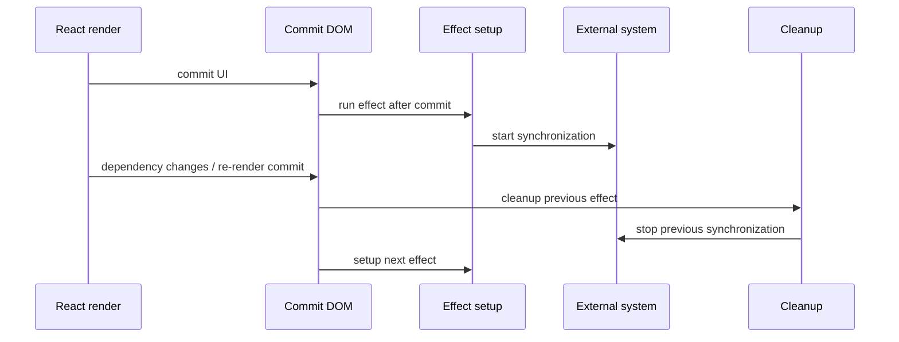
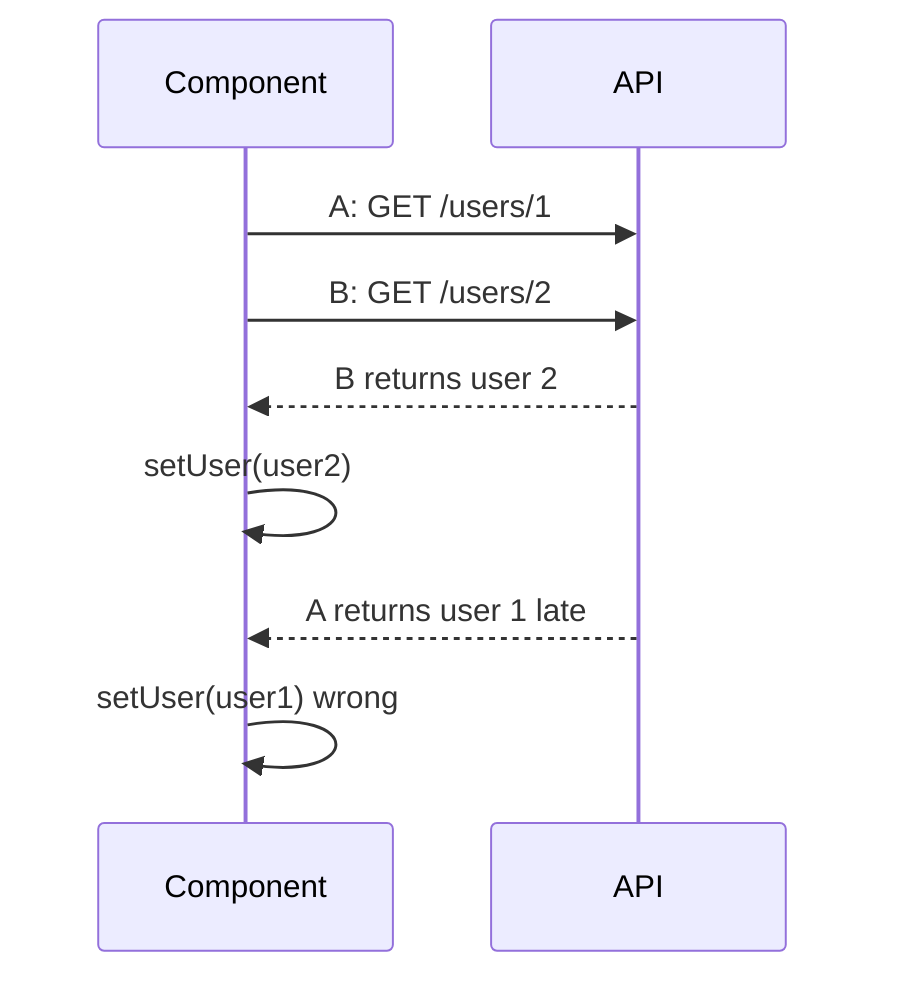
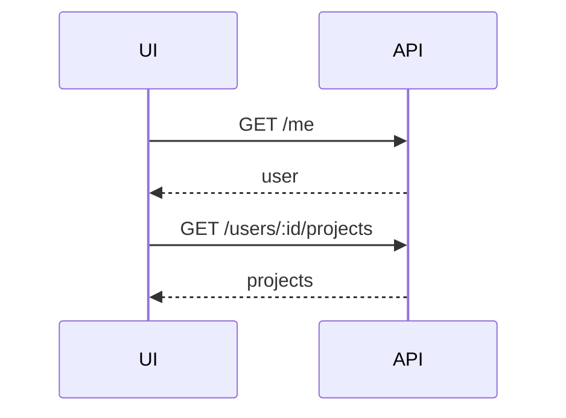
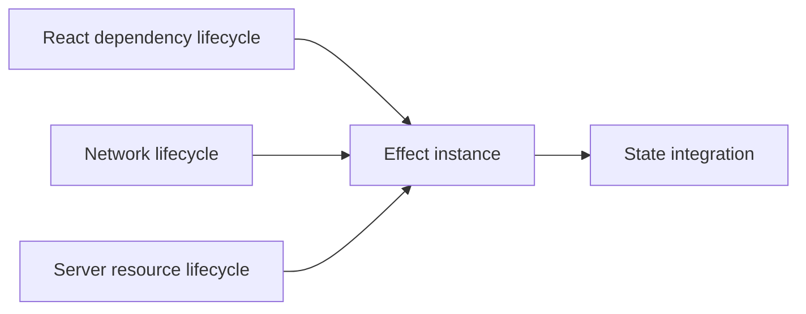

# Part 018 — `useEffect` Fetching Hazards

> `useEffect` is a synchronization primitive, not a universal data layer.

Part 017 membahas tempat fetching di sekitar React component. Sekarang kita fokus pada perangkap paling umum: fetching di `useEffect`.

`useEffect` tidak salah. Banyak situasi valid untuk memakai effect:

- sinkronisasi dengan external system,
- subscription,
- browser API,
- imperative widget,
- analytics,
- client-only optional data,
- fetch sederhana yang tidak route-critical,
- bridging legacy API ke React state.

Masalahnya muncul ketika `useEffect` dipakai sebagai default untuk semua remote data.

Efeknya:

- fetch berjalan setelah render/commit,
- tidak membantu server rendering,
- mudah membuat waterfall,
- mudah race saat dependency berubah,
- mudah stale karena dependency salah,
- mudah duplicate di development Strict Mode,
- mutation bisa terpicu tanpa intent eksplisit,
- cleanup sering dilupakan,
- retry/cancellation sering tidak konsisten,
- loading state menjadi campur aduk.

React docs sendiri menempatkan Effect sebagai mekanisme untuk menyinkronkan component dengan external system. Untuk data fetching, React menyatakan effect bisa dipakai, tetapi framework data fetching biasanya lebih efisien daripada menulis effect manual di component.

Jadi posisi kita:

> Boleh fetch di `useEffect`, tetapi jangan jadikan itu default architecture.

---

## 1. What `useEffect` Actually Does

Bentuk dasar:

```tsx
useEffect(() => {
  // setup
  return () => {
    // cleanup
  }
}, [dependencies])
```

Secara mental:



Important invariant:

> Cleanup belongs to the previous effect instance.

This is the key to race prevention.

When dependency changes from `userId=1` to `userId=2`, the effect for `userId=1` must become irrelevant before the effect for `userId=2` is allowed to update UI.

---

## 2. The Naive Fetch Effect

Common code:

```tsx
function UserProfile({ userId }: { userId: string }) {
  const [user, setUser] = useState<User | null>(null)
  const [loading, setLoading] = useState(false)
  const [error, setError] = useState<unknown>(null)

  useEffect(() => {
    setLoading(true)
    setError(null)

    fetch(`/api/users/${userId}`)
      .then((response) => response.json())
      .then((data) => setUser(data))
      .catch((err) => setError(err))
      .finally(() => setLoading(false))
  }, [userId])

  if (loading) return <Spinner />
  if (error) return <ErrorPanel error={error} />
  if (!user) return null

  return <h1>{user.name}</h1>
}
```

Looks fine. It is not production-safe.

Hazards:

1. no abort,
2. no stale response guard,
3. no HTTP error handling,
4. no empty response handling,
5. no parsing error classification,
6. old request can update new UI,
7. `finally` can set loading false for the wrong request,
8. duplicate development fetches can confuse debugging,
9. no timeout,
10. no retry policy,
11. no dedupe,
12. no stale vs initial loading distinction,
13. no cache,
14. route renders empty before data starts loading.

Part 018 is about seeing every hidden edge.

---

## 3. Hazard 1 — Response Race Condition

Scenario:

```text
T0: userId = 1, request A starts.
T1: user quickly navigates to userId = 2, request B starts.
T2: request B returns first, UI shows user 2.
T3: request A returns later, UI incorrectly shows user 1.
```

Diagram:



This is not theoretical. Any dependency-driven fetch can race:

- search query typing,
- route param changes,
- tab switching,
- filters,
- pagination,
- dependent dropdowns,
- autocomplete,
- refresh button spam,
- background refetch colliding with manual refetch.

Minimal stale guard:

```tsx
useEffect(() => {
  let ignore = false

  async function load() {
    setStatus('pending')

    try {
      const response = await fetch(`/api/users/${userId}`)
      const data = await response.json()

      if (!ignore) {
        setUser(data)
        setStatus('success')
      }
    } catch (error) {
      if (!ignore) {
        setError(error)
        setStatus('failure')
      }
    }
  }

  void load()

  return () => {
    ignore = true
  }
}, [userId])
```

The `ignore` flag does not stop the network. It stops stale state integration.

---

## 4. Hazard 2 — Abort Is Not the Same as Ignore

AbortController stops the fetch operation from the client side when possible.

```tsx
useEffect(() => {
  const controller = new AbortController()

  async function load() {
    try {
      const response = await fetch(`/api/users/${userId}`, {
        signal: controller.signal,
      })
      const data = await response.json()
      setUser(data)
    } catch (error) {
      if (error instanceof DOMException && error.name === 'AbortError') {
        return
      }
      setError(error)
    }
  }

  void load()

  return () => {
    controller.abort('userId changed or component unmounted')
  }
}, [userId])
```

But abort has limitations:

- server may already have received request,
- server may continue processing,
- mutation may still commit,
- abort may happen during body parsing,
- some intermediate systems may not propagate cancellation,
- abort produces a client-side cancellation, not a domain rollback.

For robust query effects, combine both:

```tsx
useEffect(() => {
  const controller = new AbortController()
  let ignore = false

  async function load() {
    setState({ status: 'pending' })

    try {
      const data = await usersApi.getUser(userId, {
        signal: controller.signal,
      })

      if (!ignore) {
        setState({ status: 'success', data })
      }
    } catch (error) {
      if (ignore) return
      if (isAbortError(error)) return

      setState({ status: 'failure', error })
    }
  }

  void load()

  return () => {
    ignore = true
    controller.abort('effect cleanup')
  }
}, [userId])
```

Use `ignore` to protect React state. Use `AbortController` to release network resources.

---

## 5. Hazard 3 — `finally` Can Corrupt State

Naive code:

```tsx
useEffect(() => {
  setLoading(true)

  fetchUser(userId)
    .then(setUser)
    .catch(setError)
    .finally(() => setLoading(false))
}, [userId])
```

Race:

```text
A starts -> loading true
B starts -> loading true
B completes -> loading false
A completes later -> loading false again, maybe set old data/error
```

Even if data is guarded, `finally` may still set loading incorrectly.

Better:

```tsx
useEffect(() => {
  let ignore = false
  const requestId = crypto.randomUUID()

  setState({ status: 'pending', requestId })

  fetchUser(userId)
    .then((data) => {
      if (!ignore) setState({ status: 'success', data })
    })
    .catch((error) => {
      if (!ignore) setState({ status: 'failure', error })
    })

  return () => {
    ignore = true
  }
}, [userId])
```

Better still: model request status as a state machine instead of independent booleans.

Independent booleans are vulnerable to impossible combinations.

```ts
type Bad = {
  loading: boolean
  data?: User
  error?: unknown
}
```

Can become:

```ts
{ loading: false, data: oldUser, error: timeoutError }
```

Maybe valid for stale refresh. Maybe bug. The shape does not say.

---

## 6. Hazard 4 — Missing Dependencies Create Stale Closures

Bad:

```tsx
function UserProfile({ userId, locale }: Props) {
  useEffect(() => {
    fetch(`/api/${locale}/users/${userId}`)
  }, [userId])
}
```

If `locale` changes, effect does not refetch. The closure captured old `locale`.

Another bad case:

```tsx
function Search({ token, query }: Props) {
  useEffect(() => {
    searchApi.search(query, { token })
  }, [query])
}
```

The effect depends on `token` too.

Do not silence dependency linting casually. The lint rule usually points at a real synchronization bug.

Correct:

```tsx
useEffect(() => {
  void searchApi.search(query, { token })
}, [query, token])
```

But adding dependencies can expose another problem: unstable values.

---

## 7. Hazard 5 — Unstable Dependencies Cause Request Storms

Bad:

```tsx
function SearchPage({ status, ownerId }: Props) {
  const filters = { status, ownerId }

  useEffect(() => {
    void searchCases(filters)
  }, [filters])
}
```

`filters` is a new object every render, so effect runs every render.

Fix with `useMemo`:

```tsx
const filters = useMemo(
  () => ({ status, ownerId }),
  [status, ownerId]
)

useEffect(() => {
  void searchCases(filters)
}, [filters])
```

Or avoid the object dependency:

```tsx
useEffect(() => {
  void searchCases({ status, ownerId })
}, [status, ownerId])
```

For resource identity, canonicalize parameters:

```ts
function canonicalizeSearchParams(input: SearchFilters): SearchFilters {
  return {
    status: input.status || undefined,
    ownerId: input.ownerId || undefined,
    page: input.page ?? 1,
    pageSize: input.pageSize ?? 25,
  }
}
```

React effects are dependency-driven. If dependencies are unstable, network behavior is unstable.

---

## 8. Hazard 6 — Derived State Feedback Loop

Bad:

```tsx
const [params, setParams] = useState({ page: 1 })
const [query, setQuery] = useState('')

useEffect(() => {
  setParams({ ...params, q: query })
}, [query, params])

useEffect(() => {
  void fetchResults(params)
}, [params])
```

This can loop because `setParams` creates a new object, which changes `params`, which reruns the effect.

Better:

```tsx
const params = useMemo(
  () => ({ page: 1, q: query.trim() || undefined }),
  [query]
)

useEffect(() => {
  void fetchResults(params)
}, [params])
```

Better with query library:

```tsx
const params = useMemo(() => buildSearchParams(query), [query])
const results = useSearchResultsQuery(params)
```

Better with URL-driven state:

```tsx
const [searchParams] = useSearchParams()
const params = parseSearchParams(searchParams)
const results = useSearchResultsQuery(params)
```

Rule:

> Do not store derived fetch parameters in state unless the user can independently edit that state as a draft.

---

## 9. Hazard 7 — Effect Fetching Creates Client-Only Waterfalls

Effect runs after commit. Therefore initial flow is often:

```text
HTML/JS loads
React renders shell
React commits shell
Effect starts fetch
Server responds
React renders content
```

For primary route data, this is often slower than:

- server fetch before render,
- route loader before route content,
- prefetch on navigation intent,
- query cache hydration,
- parallel data composition.

Waterfall example:

```tsx
function Dashboard() {
  const [user, setUser] = useState<User | null>(null)

  useEffect(() => {
    fetchUser().then(setUser)
  }, [])

  if (!user) return <Skeleton />

  return <Projects userId={user.id} />
}

function Projects({ userId }: { userId: string }) {
  const [projects, setProjects] = useState<Project[]>([])

  useEffect(() => {
    fetchProjects(userId).then(setProjects)
  }, [userId])

  return <ProjectList projects={projects} />
}
```

Network:



If projects only need current user identity from session, backend could expose `/me/projects`, or route loader could fetch both in parallel, or Server Component could compose them.

Do not accept waterfall as inevitable just because component nesting looks natural.

---

## 10. Hazard 8 — Strict Mode Double Execution Misdiagnosis

In React development Strict Mode, effects can run setup+cleanup one extra time on mount to help detect missing cleanup.

Developers often respond by adding a ref guard:

```tsx
const ran = useRef(false)

useEffect(() => {
  if (ran.current) return
  ran.current = true

  void fetchData()
}, [])
```

This is usually the wrong lesson.

It hides missing cleanup and makes the effect no longer behave like a true synchronization process.

Better:

```tsx
useEffect(() => {
  const controller = new AbortController()
  let ignore = false

  void load(controller.signal).then((data) => {
    if (!ignore) setData(data)
  })

  return () => {
    ignore = true
    controller.abort('strict mode cleanup')
  }
}, [])
```

If duplicate GET requests are harmful, add request deduplication at the resource/fetch-client/query layer, not with component-local “run once” hacks.

If duplicate POST requests are harmful, do not put POST mutation in mount effect.

---

## 11. Hazard 9 — Mutations in Effects

Bad:

```tsx
function AutoApprove({ caseId, shouldApprove }: Props) {
  useEffect(() => {
    if (!shouldApprove) return

    void casesApi.approve(caseId)
  }, [caseId, shouldApprove])

  return null
}
```

This is dangerous because mutation is tied to rendered state, not explicit command ownership.

Questions this code cannot answer clearly:

- What if component remounts?
- What if `shouldApprove` is true from cached state?
- What if Strict Mode replays effect in development?
- What if request succeeds but response is aborted?
- What if user navigates away?
- What is idempotency key?
- What queries should invalidate after success?
- How is failure shown?

Safer mutation boundary:

```tsx
function ApproveButton({ caseId }: { caseId: string }) {
  const approve = useApproveCaseMutation()

  return (
    <button
      disabled={approve.status === 'pending'}
      onClick={() => approve.mutate({ caseId })}
    >
      Approve
    </button>
  )
}
```

Effect-based mutation is valid only for carefully designed synchronization cases, for example:

- sending analytics with idempotent event key,
- autosave with debounce/idempotency/versioning,
- subscription presence heartbeat,
- background sync queue.

Even then, it needs explicit idempotency and cleanup semantics.

---

## 12. Hazard 10 — Search Without Debounce or Cancellation

Naive search:

```tsx
useEffect(() => {
  if (!query) return
  void searchApi.search(query).then(setResults)
}, [query])
```

Typing `regulation` can start many requests:

```text
r
re
reg
regu
regul
regula
regulat
regulati
regulatio
regulation
```

Problems:

- backend load,
- rate limiting,
- response race,
- flickering result list,
- expensive parsing,
- user sees stale intermediate results.

Better:

```tsx
function useDebouncedValue<T>(value: T, delayMs: number): T {
  const [debounced, setDebounced] = useState(value)

  useEffect(() => {
    const timeoutId = window.setTimeout(() => {
      setDebounced(value)
    }, delayMs)

    return () => window.clearTimeout(timeoutId)
  }, [value, delayMs])

  return debounced
}
```

Then:

```tsx
const debouncedQuery = useDebouncedValue(query, 300)

useEffect(() => {
  if (!debouncedQuery.trim()) {
    setState({ status: 'idle' })
    return
  }

  const controller = new AbortController()
  let ignore = false

  setState({ status: 'pending' })

  searchApi
    .search({ q: debouncedQuery }, { signal: controller.signal })
    .then((data) => {
      if (!ignore) setState({ status: 'success', data })
    })
    .catch((error) => {
      if (ignore || isAbortError(error)) return
      setState({ status: 'failure', error })
    })

  return () => {
    ignore = true
    controller.abort('search query changed')
  }
}, [debouncedQuery])
```

For large apps, use query library with debounced key and cancellation signal.

---

## 13. Hazard 11 — `async` Effect Callback

Do not write:

```tsx
useEffect(async () => {
  const data = await fetchData()
  setData(data)
}, [])
```

The effect callback must return either nothing or a cleanup function. An `async` function returns a Promise, not a cleanup function.

Correct:

```tsx
useEffect(() => {
  let ignore = false

  async function load() {
    const data = await fetchData()
    if (!ignore) setData(data)
  }

  void load()

  return () => {
    ignore = true
  }
}, [])
```

This also gives you a place to attach cleanup.

---

## 14. Hazard 12 — HTTP Error Treated as Success

Fetch promise rejects for network-level failure, not for HTTP status like `404` or `500`.

Bad:

```tsx
const response = await fetch('/api/cases/123')
const data = await response.json()
setCase(data)
```

If server returns `404` with problem body, this code may parse it as if it were a case.

Use the fetch client from Part 016:

```tsx
const data = await casesApi.getCase(caseId, { signal })
```

Or minimally:

```tsx
const response = await fetch(`/api/cases/${caseId}`, { signal })

if (!response.ok) {
  throw await parseHttpError(response)
}

const data = await response.json()
```

React component should not need to remember all HTTP semantics. Put them behind the API/fetch client boundary.

---

## 15. Hazard 13 — Empty Response Parsing

Bad:

```tsx
await fetch('/api/cases/123/archive', { method: 'POST' })
  .then((r) => r.json())
```

If server returns `204 No Content`, `r.json()` fails because there is no body.

Your fetch client should know:

- `204` usually has no content,
- `205` usually has no content,
- `HEAD` has no response body,
- content-type may be missing,
- response may be text/problem+json/blob.

Effect fetching often duplicates parsing code poorly.

That is one reason Part 016 built a central fetch client.

---

## 16. Hazard 14 — Credentials and CORS Confusion

Client code:

```tsx
fetch('https://api.example.com/me')
```

This may omit cookies depending on origin and `credentials` configuration.

```tsx
fetch('https://api.example.com/me', {
  credentials: 'include',
})
```

But credentialed cross-origin requests also require correct server CORS response. Otherwise browser blocks response visibility.

Effect code often surfaces this as:

```text
TypeError: Failed to fetch
```

A strong client wrapper should classify likely causes and attach diagnostics:

- request URL origin,
- credentials mode,
- response visibility absent,
- abort status,
- online/offline state,
- timeout,
- trace id if available.

Do not debug CORS as if it were a React state bug.

---

## 17. Hazard 15 — Local Loading Flicker

Naive effect:

```tsx
useEffect(() => {
  setLoading(true)
  fetchData().then((data) => {
    setData(data)
    setLoading(false)
  })
}, [params])
```

Every params change clears UI into spinner. That may be wrong for pagination/filtering.

Better states:

```ts
type SearchState =
  | { status: 'idle' }
  | { status: 'initial-loading' }
  | { status: 'success'; data: SearchResult; refreshing: boolean }
  | { status: 'failure'; error: unknown }
```

When old data exists:

```tsx
setState((prev) => {
  if (prev.status === 'success') {
    return { ...prev, refreshing: true }
  }
  return { status: 'initial-loading' }
})
```

Then render:

```tsx
if (state.status === 'initial-loading') return <TableSkeleton />

if (state.status === 'success') {
  return (
    <section aria-busy={state.refreshing}>
      <ResultsTable rows={state.data.items} />
    </section>
  )
}
```

Loading is not boolean. It is a UX contract.

---

## 18. Hazard 16 — Retrying From Effects Without Budget

Bad:

```tsx
useEffect(() => {
  let attempts = 0

  async function load() {
    try {
      setData(await fetchData())
    } catch {
      attempts += 1
      if (attempts < 10) load()
    }
  }

  void load()
}, [id])
```

Problems:

- no backoff,
- no jitter,
- no deadline,
- no abort,
- retry may continue after unmount,
- retries non-idempotent requests accidentally,
- request storm during outage.

Better:

- central retry policy in fetch client/query library,
- retry only safe methods by default,
- respect `Retry-After`,
- stop on client/domain errors,
- use exponential backoff with jitter,
- bind retries to AbortSignal/deadline.

Effect should not independently invent distributed systems policy.

---

## 19. Hazard 17 — No Timeout

Fetch has no simple default timeout option in older patterns. Without an explicit deadline, a request can remain pending for longer than your UI contract.

Use Part 012/016 primitives:

```tsx
useEffect(() => {
  const controller = new AbortController()
  const timeout = AbortSignal.timeout(8_000)
  const signal = AbortSignal.any([controller.signal, timeout])
  let ignore = false

  void casesApi.getCase(caseId, { signal })
    .then((data) => {
      if (!ignore) setState({ status: 'success', data })
    })
    .catch((error) => {
      if (ignore || isAbortError(error)) return
      setState({ status: 'failure', error })
    })

  return () => {
    ignore = true
    controller.abort('component cleanup')
  }
}, [caseId])
```

Better: hide this in the fetch client so every component does not reimplement it.

---

## 20. Hazard 18 — Cleanup That Updates State

Bad:

```tsx
useEffect(() => {
  setConnected(true)

  return () => {
    setConnected(false)
  }
}, [])
```

Sometimes this is harmless. Sometimes it causes state updates during unmount or misleading intermediate state.

For fetch cleanup, generally do not set UI state in cleanup. Cleanup should:

- mark previous effect irrelevant,
- abort request,
- unsubscribe,
- clear timers,
- release resources.

Let the next effect setup or next render determine visible state.

---

## 21. Hazard 19 — Dependency Array as Scheduling Hack

Bad:

```tsx
useEffect(() => {
  void loadInitialData()
  // eslint-disable-next-line react-hooks/exhaustive-deps
}, [])
```

This says: “run once”. But the effect reads values that may change.

Sometimes you truly want mount-only behavior, for example subscribing to a singleton service. But for data fetching, mount-only often means stale assumptions:

- user changed,
- token refreshed,
- route param changed,
- locale changed,
- feature flag changed,
- base URL changed,
- organization/tenant changed.

Instead, make the real resource identity explicit:

```tsx
useEffect(() => {
  void loadTenantDashboard(tenantId, locale)
}, [tenantId, locale])
```

If that reruns too often, fix identity stability. Do not lie to React.

---

## 22. Hazard 20 — Fetching Data That Should Be Derived Locally

Sometimes there should be no network request.

Bad:

```tsx
useEffect(() => {
  void api.calculateTotal(items).then(setTotal)
}, [items])
```

If total is simple and deterministic:

```tsx
const total = useMemo(
  () => items.reduce((sum, item) => sum + item.price * item.quantity, 0),
  [items]
)
```

Server should own calculations when:

- pricing rules are sensitive,
- tax/regulatory logic is authoritative,
- result must be auditable,
- computation depends on server-only data,
- result drives persisted decision.

But do not round-trip to server for derivations that belong to the UI.

Part of client-server communication expertise is knowing when not to communicate.

---

## 23. The Minimal Safe Effect Fetch Pattern

For small local query use cases:

```tsx
type UserState =
  | { status: 'pending' }
  | { status: 'success'; data: User }
  | { status: 'failure'; error: unknown }

function UserProfile({ userId }: { userId: string }) {
  const [state, setState] = useState<UserState>({ status: 'pending' })

  useEffect(() => {
    const controller = new AbortController()
    let ignore = false

    setState({ status: 'pending' })

    async function load() {
      try {
        const data = await usersApi.getUser(userId, {
          signal: controller.signal,
        })

        if (!ignore) {
          setState({ status: 'success', data })
        }
      } catch (error) {
        if (ignore || isAbortError(error)) return

        setState({ status: 'failure', error })
      }
    }

    void load()

    return () => {
      ignore = true
      controller.abort('user resource changed')
    }
  }, [userId])

  if (state.status === 'pending') return <ProfileSkeleton />
  if (state.status === 'failure') return <ProfileError error={state.error} />

  return <ProfileView user={state.data} />
}
```

This pattern includes:

- explicit status,
- cleanup,
- abort,
- stale response guard,
- API module boundary,
- no raw endpoint in component,
- no async effect callback.

Still missing:

- cache,
- dedupe,
- retry,
- stale while revalidate,
- route preloading,
- SSR hydration,
- shared state across components.

So this is minimal safe, not optimal universal.

---

## 24. Better: Extract Resource Hook

```tsx
function useUserResource(userId: string) {
  const [state, setState] = useState<UserState>({ status: 'pending' })

  useEffect(() => {
    const controller = new AbortController()
    let ignore = false

    setState({ status: 'pending' })

    usersApi.getUser(userId, { signal: controller.signal })
      .then((data) => {
        if (!ignore) setState({ status: 'success', data })
      })
      .catch((error) => {
        if (ignore || isAbortError(error)) return
        setState({ status: 'failure', error })
      })

    return () => {
      ignore = true
      controller.abort('user resource changed')
    }
  }, [userId])

  return state
}
```

Component:

```tsx
function UserProfile({ userId }: { userId: string }) {
  const user = useUserResource(userId)

  if (user.status === 'pending') return <ProfileSkeleton />
  if (user.status === 'failure') return <ProfileError error={user.error} />

  return <ProfileView user={user.data} />
}
```

This improves readability, but do not confuse extraction with architecture. You still need policies.

---

## 25. Better Still: Use Server-State Engine for Shared Data

For data shared across components or routes:

```tsx
function useUserQuery(userId: string) {
  return useQuery({
    queryKey: ['user', userId],
    queryFn: ({ signal }) => usersApi.getUser(userId, { signal }),
    staleTime: 60_000,
  })
}
```

Component:

```tsx
function UserProfile({ userId }: { userId: string }) {
  const user = useUserQuery(userId)

  if (user.isPending) return <ProfileSkeleton />
  if (user.isError) return <ProfileError error={user.error} />

  return <ProfileView user={user.data} />
}
```

The query engine owns:

- cache,
- dedupe,
- background refetch,
- stale time,
- garbage collection,
- focus refetch,
- retry,
- cancellation signal,
- devtools,
- invalidation.

This is why manual effect fetching does not scale well.

---

## 26. Effect Fetching Decision Checklist

Before using `useEffect` for fetching, ask:

1. Is this data route-critical?
2. Would loader/server fetching avoid a visible shell?
3. Can this request be prefetched?
4. Will child effects create a waterfall?
5. Is the data shared by multiple components?
6. Is cache needed?
7. Is dedupe needed?
8. Is retry needed?
9. Is stale-while-revalidate needed?
10. Is cancellation needed?
11. What happens when dependency changes quickly?
12. Are dependencies complete and stable?
13. Is this query or mutation?
14. If mutation, where is idempotency key?
15. What happens in Strict Mode development?
16. Does unmount imply abort, ignore, or continue?
17. Is old data retained or cleared intentionally?
18. How are HTTP errors classified?
19. How are parsing/contract errors classified?
20. Can this be tested deterministically?

If many answers are non-trivial, `useEffect` is probably too low-level for the resource.

---

## 27. Testing Effect Fetching Hazards

To test a fetch effect, test the lifecycle, not just happy path.

Cases:

1. initial pending then success,
2. HTTP error,
3. network error,
4. invalid JSON,
5. unmount before response,
6. dependency changes before first response,
7. later request returns before earlier request,
8. abort is not shown as error,
9. timeout maps to retryable/non-retryable status,
10. stale response does not overwrite current data.

Pseudo-test for race:

```tsx
it('does not let old response overwrite new user', async () => {
  const first = deferred<User>()
  const second = deferred<User>()

  usersApi.getUser = vi
    .fn()
    .mockReturnValueOnce(first.promise)
    .mockReturnValueOnce(second.promise)

  const { rerender, findByText, queryByText } = render(
    <UserProfile userId="1" />
  )

  rerender(<UserProfile userId="2" />)

  second.resolve({ id: '2', name: 'User Two' })
  expect(await findByText('User Two')).toBeInTheDocument()

  first.resolve({ id: '1', name: 'User One' })

  await waitFor(() => {
    expect(queryByText('User One')).not.toBeInTheDocument()
  })
})
```

If your effect cannot pass this test, it is not safe under parameter churn.

---

## 28. Timeline: Correct Effect With Cleanup

```mermaid
sequenceDiagram
  participant React
  participant EffectA as Effect A userId=1
  participant EffectB as Effect B userId=2
  participant API

  React->>EffectA: setup
  EffectA->>API: GET /users/1
  React->>EffectA: cleanup before dependency change
  EffectA->>EffectA: ignore=true; abort
  React->>EffectB: setup
  EffectB->>API: GET /users/2
  API-->>EffectB: user 2
  EffectB->>React: set user 2
  API-->>EffectA: user 1 late
  EffectA->>EffectA: ignored
```

This is the lifecycle you want.

---

## 29. Operational Failure Modes

Effect fetching bugs show up in production as:

### Symptom: user sees data from previous route

Likely causes:

- stale response race,
- missing dependency,
- cache key collision,
- previous data retained without stale marker.

### Symptom: API request count doubles in development

Likely causes:

- Strict Mode extra effect cycle,
- missing cleanup,
- no dedupe.

### Symptom: search results flicker while typing

Likely causes:

- no debounce,
- no cancellation,
- old responses overwriting new,
- clearing data on every keystroke.

### Symptom: spinner never disappears

Likely causes:

- promise never settles,
- no timeout,
- loading boolean corrupted by race,
- abort swallowed without state transition.

### Symptom: user action executes twice

Likely causes:

- mutation hidden in effect,
- remount,
- Strict Mode dev behavior,
- double click not disabled,
- no idempotency key.

### Symptom: data reload wipes form edits

Likely causes:

- effect resets draft on every query data object change,
- dependency too broad,
- server state and draft state not separated.

---

## 30. Practical Rules

Use these rules as defaults:

1. Do not fetch in render for normal Client Components.
2. Do not use `useEffect` as your default data layer.
3. Use route/framework/server fetching for route-critical data.
4. Use query library for shared server state.
5. Use event handlers for explicit user actions.
6. Use effect for bounded client-only synchronization.
7. Always cleanup async effects.
8. Combine ignore flag and abort for effect queries.
9. Never hide mutation behind mount effect casually.
10. Treat dependency lint warnings as design feedback.
11. Stabilize dependencies rather than omitting them.
12. Model remote state explicitly.
13. Keep endpoint details outside components.
14. Centralize HTTP parsing/error logic.
15. Test races and unmounts.

---

## 31. Refactoring Guide: From Effect Fetch to Resource Boundary

Starting point:

```tsx
useEffect(() => {
  fetch(`/api/cases/${caseId}`)
    .then((r) => r.json())
    .then(setCase)
}, [caseId])
```

Step 1 — move endpoint to API module:

```ts
casesApi.getCase(caseId, { signal })
```

Step 2 — add cleanup:

```tsx
useEffect(() => {
  const controller = new AbortController()
  let ignore = false

  casesApi.getCase(caseId, { signal: controller.signal })
    .then((data) => {
      if (!ignore) setCase(data)
    })

  return () => {
    ignore = true
    controller.abort()
  }
}, [caseId])
```

Step 3 — model state:

```tsx
const [state, setState] = useState<RemoteState<CaseDto>>({ status: 'pending' })
```

Step 4 — extract hook:

```tsx
const caseResource = useCaseResource(caseId)
```

Step 5 — replace with query engine if shared/cached:

```tsx
const caseQuery = useCaseQuery(caseId)
```

Step 6 — move to route loader/server if route-critical:

```tsx
const caseData = useLoaderData<typeof loader>()
```

The target is not always Step 6. The target is the right ownership boundary.

---

## 32. When `useEffect` Fetching Is Still Fine

Use it when all or most are true:

- data is optional,
- data is not needed for initial route shell,
- no SSR/SEO requirement,
- no shared cache required,
- no complex invalidation,
- no mutation side effect,
- simple lifecycle,
- clear cleanup,
- failure is local,
- duplicate request is harmless or deduped,
- you can test race/unmount behavior.

Examples:

- load optional help text,
- fetch browser-only capability metadata,
- call feature flag client after mount,
- lazy load preview for selected item,
- load non-critical enhancement,
- sync with external JS widget data source.

Even then, use the safe pattern.

---

## 33. Mental Model Summary

`useEffect` fetching is risky because it joins three moving systems:



Bugs happen when an old effect instance is allowed to update the new UI.

The fix is not one trick. The fix is a set of invariants:

- every effect instance has cleanup,
- every request has resource identity,
- every response is checked before state integration,
- every dependency is honest,
- every mutation has explicit intent,
- every retry has budget,
- every loading state has semantics,
- every API response passes through a contract boundary.

---

## 34. Part 018 Checklist

You are ready to move on if you can explain:

- what `useEffect` is actually for,
- why effect fetching happens after commit,
- why that can create waterfalls,
- how response races happen,
- why ignore and abort solve different problems,
- why `finally` can corrupt loading state,
- how stale closures come from missing dependencies,
- how unstable dependencies cause request storms,
- why mutations in effects are dangerous,
- how Strict Mode exposes missing cleanup,
- why Fetch does not reject on HTTP status,
- why a minimal safe fetch effect is still not a full data layer,
- when effect fetching is acceptable,
- when to move fetching to router/framework/query/server boundaries.

Next, Part 019 will go deeper into **race conditions and stale closures**, with precise timelines, failure reproduction, and hardened patterns for latest-wins, request sequencing, and state reconciliation.
