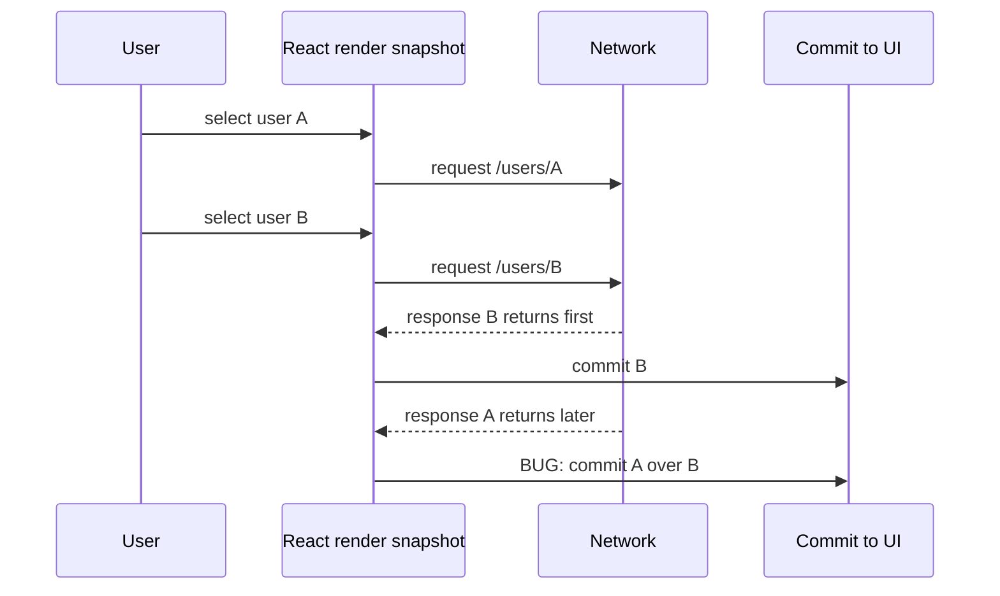
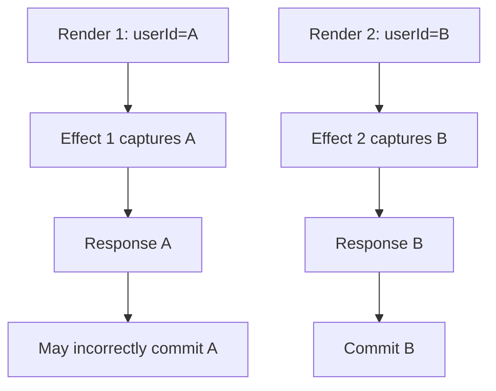
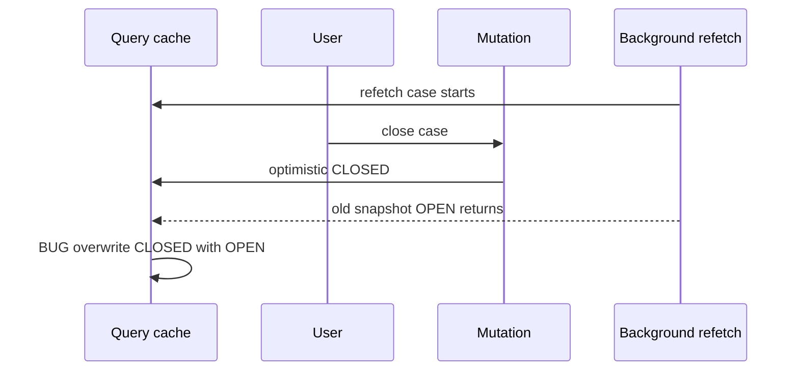
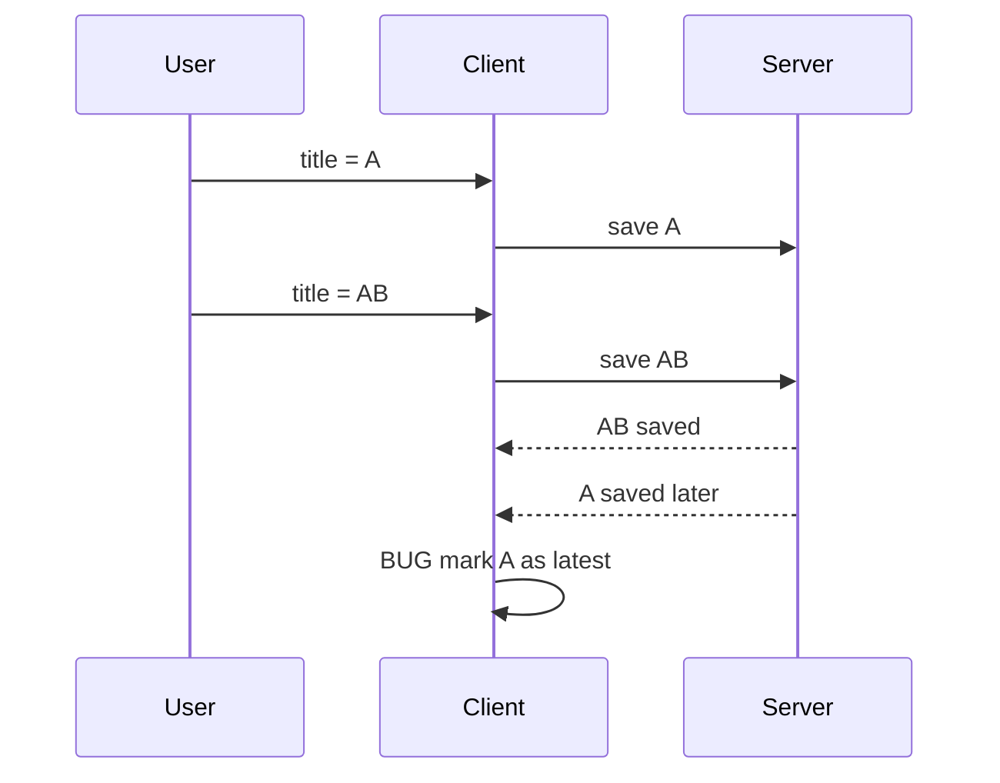
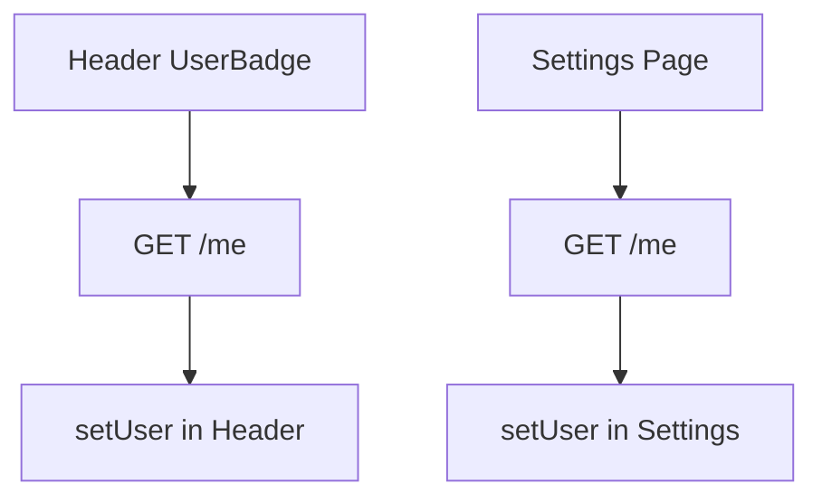

# Part 019 — Race Conditions and Stale Closures

> A request is not a function call. It is a message sent into an unreliable, reordered, delayed world.

Part 018 showed why manual `useEffect` fetching is dangerous when treated casually. Now we go deeper into the most common class of bugs behind “wrong data displayed”, “loading stuck”, “old response overwrote new response”, and “save succeeded but UI reverted”.

The topic is not just React. It is distributed systems at UI scale.

A React app sends requests based on a render snapshot. The server replies later. Meanwhile:

- the user may type another character,
- the route may change,
- the component may unmount,
- the user may submit again,
- auth state may rotate,
- cache may update from another tab,
- a background refetch may finish,
- a slower older request may arrive after a faster newer one.

React itself is deterministic. The network is not.

The production skill is knowing which updates are still valid by the time they arrive.

---

## 1. The Core Mental Model

Every remote data operation has three separate times:

1. **Intent time** — when the user or app decided to request something.
2. **Execution time** — when the browser actually sent/received bytes.
3. **Commit time** — when the response is allowed to change UI state.

Most bugs happen because code assumes those three times are the same.

They are not.



The invariant should be:

> A response may update UI only if it still corresponds to the current intent, resource identity, and lifecycle scope.

That sounds simple. It is violated constantly.

---

## 2. Race Condition Taxonomy

A race condition is not merely “two things happen at once”. For frontend client-server communication, a race means:

> The final UI depends on timing instead of explicit ordering rules.

Timing-dependent behavior is unacceptable because production latency is variable.

Common race classes:

| Race | Symptom | Root cause |
|---|---|---|
| Response ordering race | Old request overwrites newer result | No request identity check |
| Unmount race | State update after component lifecycle ended | Missing cleanup or cancellation |
| Parameter drift | Response for previous params applied to current params | Closure captured old values |
| Stale closure | Callback reads old state/props | Function belongs to old render snapshot |
| Mutation race | Double submit creates duplicate or conflicting write | No idempotency or in-flight guard |
| Refetch/mutation race | Background refetch overwrites optimistic mutation | Cache update policy missing |
| Navigation race | Data for previous route flashes on new route | Route identity not bound to request |
| Auth race | Request sent with expired/old credential state | Token/session refresh not serialized |
| Subscription race | Event stream update conflicts with fetched snapshot | No version or merge rule |
| Cross-tab race | Another tab mutates same entity | No freshness/version strategy |

Each race needs a different mitigation. “Add AbortController” is not enough.

---

## 3. Closure Snapshots in React

Every render creates a new lexical world.

```tsx
function UserProfile({ userId }: { userId: string }) {
  const [user, setUser] = useState<User | null>(null)

  useEffect(() => {
    fetch(`/api/users/${userId}`)
      .then((r) => r.json())
      .then((data) => {
        setUser(data)
      })
  }, [userId])

  return <UserCard user={user} />
}
```

The callback inside `.then()` captures the `userId` from the render that created the effect. It does not magically update when props change.

That is usually good. Closures make code understandable.

The danger is when the asynchronous callback commits state without verifying whether its snapshot is still current.



React does not know that response A is obsolete. Your code has to encode that rule.

---

## 4. The False Comfort of “Last SetState Wins”

React state updates are ordered by when you call them, not by the business meaning of the data.

If request A starts before request B but response A finishes after B, then A’s `setState` happens last.

That makes A win.

But product intent says B should win.

This is the difference between **arrival order** and **intent order**.

```tsx
// Arrival-order semantics. Usually wrong for search/detail pages.
setResult(data)
```

Better:

```tsx
// Intent-order semantics. Only current intent can commit.
if (requestId === latestRequestId.current) {
  setResult(data)
}
```

You need an explicit ordering model.

---

## 5. Minimal Latest-Wins Pattern

For search, autocomplete, route detail pages, filters, and tabs, the common policy is latest-wins.

```tsx
function useUser(userId: string) {
  const [state, setState] = useState<
    | { status: 'pending' }
    | { status: 'success'; data: User }
    | { status: 'error'; error: Error }
  >({ status: 'pending' })

  const seq = useRef(0)

  useEffect(() => {
    const requestSeq = ++seq.current

    setState({ status: 'pending' })

    fetch(`/api/users/${encodeURIComponent(userId)}`)
      .then(async (response) => {
        if (!response.ok) throw new Error(`HTTP ${response.status}`)
        return response.json() as Promise<User>
      })
      .then((data) => {
        if (requestSeq !== seq.current) return
        setState({ status: 'success', data })
      })
      .catch((error) => {
        if (requestSeq !== seq.current) return
        setState({ status: 'error', error })
      })
  }, [userId])

  return state
}
```

This does not cancel the old network request. It prevents the old response from committing.

That distinction matters.

---

## 6. Ignore Flag Pattern

React docs often show a scoped ignore flag for simple effect fetches.

```tsx
useEffect(() => {
  let ignore = false

  async function load() {
    const response = await fetch(`/api/users/${userId}`)
    const data = await response.json()

    if (!ignore) {
      setUser(data)
    }
  }

  load()

  return () => {
    ignore = true
  }
}, [userId])
```

Why it works:

- each effect setup has its own `ignore` variable,
- cleanup flips the variable for that specific effect instance,
- when the old promise resolves, it sees its own `ignore === true`,
- the new effect has a different `ignore` variable.

This is good for simple latest-wins cases.

But it has limitations:

- the network still runs,
- server work may still happen,
- mutation side effects are not undone,
- bandwidth is still consumed,
- logs/traces may still show the old request,
- it does not solve duplicate POSTs,
- it does not give shared cancellation to callers.

Use ignore flags for commit control. Use abort for lifecycle control. Use idempotency/concurrency rules for mutation correctness.

---

## 7. AbortController Is Not a Race Condition Solver by Itself

Abort cancels the client’s interest in the request.

It does not guarantee the server did nothing.

```tsx
useEffect(() => {
  const controller = new AbortController()

  async function load() {
    try {
      const response = await fetch(`/api/users/${userId}`, {
        signal: controller.signal,
      })
      const data = await response.json()
      setUser(data)
    } catch (error) {
      if (error instanceof DOMException && error.name === 'AbortError') return
      setError(error)
    }
  }

  load()

  return () => controller.abort()
}, [userId])
```

This is better than ignore-only because it gives the browser a chance to stop unnecessary work.

But you still often want an identity guard:

```tsx
useEffect(() => {
  const controller = new AbortController()
  const requestSeq = ++seq.current

  async function load() {
    try {
      const response = await fetch(`/api/users/${userId}`, {
        signal: controller.signal,
      })
      const data = await response.json()

      if (controller.signal.aborted) return
      if (requestSeq !== seq.current) return

      setUser(data)
    } catch (error) {
      if (controller.signal.aborted) return
      if (requestSeq !== seq.current) return
      setError(normalizeError(error))
    }
  }

  load()

  return () => controller.abort()
}, [userId])
```

Why both?

- Abort handles lifecycle.
- Sequence handles ordering.
- Error normalization handles UI semantics.

Do not collapse three concerns into one boolean.

---

## 8. Request Identity

A request identity is the semantic name of what the request is trying to retrieve or mutate.

For a query:

```ts
const key = ['user', userId]
```

For a filtered list:

```ts
const key = ['cases', { status, assigneeId, page, sort }]
```

For a mutation:

```ts
const command = {
  type: 'case.assign',
  caseId,
  assigneeId,
  idempotencyKey,
}
```

Bad identity design creates subtle races:

```tsx
// Bad: query identity hidden inside closure.
useEffect(() => {
  fetch(`/api/cases?status=${status}&page=${page}`)
}, [status]) // page missing
```

Better:

```tsx
const query = useMemo(
  () => ({ status, page, sort }),
  [status, page, sort]
)

useEffect(() => {
  fetchCases(query)
}, [query])
```

Even better when using a server-state library:

```tsx
useQuery({
  queryKey: ['cases', { status, page, sort }],
  queryFn: ({ signal }) => fetchCases({ status, page, sort, signal }),
})
```

The query key is not just a cache key. It is a concurrency boundary.

---

## 9. Stale Closure from Missing Dependencies

The dependency array is not an optimization list. It is a declaration of which render values the effect depends on.

Bad:

```tsx
function CaseList({ status, assigneeId }: Props) {
  useEffect(() => {
    fetchCases({ status, assigneeId })
  }, [status])
}
```

This effect captures `assigneeId`, but does not declare it.

The UI may show cases for:

- current `status`,
- old `assigneeId`.

That is not a UI bug. That is a data integrity bug.

Better:

```tsx
useEffect(() => {
  fetchCases({ status, assigneeId })
}, [status, assigneeId])
```

If adding a dependency causes too many fetches, the fix is not to remove the dependency. The fix is to redesign the dependency value, debounce intent, move fetching to a data layer, or make the input stable.

---

## 10. Stale Closure from Event Handlers

Event handlers also capture render values.

```tsx
function SaveButton({ caseId }: { caseId: string }) {
  const [draft, setDraft] = useState({ title: '' })

  async function save() {
    await updateCase(caseId, draft)
  }

  return <button onClick={save}>Save</button>
}
```

This is usually fine because the handler used by the DOM is updated after render.

But it becomes dangerous when the handler is passed to long-lived external systems:

```tsx
useEffect(() => {
  websocket.on('server:save-requested', () => {
    updateCase(caseId, draft)
  })
}, [])
```

This captures the initial `caseId` and initial `draft` forever.

Better options:

1. Re-subscribe when dependencies change.
2. Store latest values in refs.
3. Use framework-supported effect event patterns where available.
4. Move the long-lived subscription outside component state.

Ref-based latest value pattern:

```tsx
function useLatest<T>(value: T) {
  const ref = useRef(value)
  ref.current = value
  return ref
}

function CaseEditor({ caseId }: { caseId: string }) {
  const [draft, setDraft] = useState({ title: '' })
  const latest = useLatest({ caseId, draft })

  useEffect(() => {
    const unsubscribe = websocket.on('server:save-requested', () => {
      const { caseId, draft } = latest.current
      updateCase(caseId, draft)
    })

    return unsubscribe
  }, [latest])
}
```

Be careful: refs bypass React’s dependency safety. Use them when you intentionally need latest values inside long-lived callbacks, not to silence dependency warnings.

---

## 11. Race from Derived State

A common anti-pattern:

```tsx
const [users, setUsers] = useState<User[]>([])
const [selectedUser, setSelectedUser] = useState<User | null>(null)

useEffect(() => {
  fetchUsers().then(setUsers)
}, [])

useEffect(() => {
  setSelectedUser(users.find((u) => u.id === selectedUserId) ?? null)
}, [users, selectedUserId])
```

This stores both source data and derived data.

The race appears when:

- `selectedUserId` changes,
- `users` refetches,
- old list returns,
- derived selected user points to stale list item.

Prefer deriving during render:

```tsx
const selectedUser = users.find((u) => u.id === selectedUserId) ?? null
```

Or store only stable identity:

```tsx
const [selectedUserId, setSelectedUserId] = useState<string | null>(null)
```

Remote data should reduce duplication. Duplication creates more commit points. More commit points create more races.

---

## 12. Search Race: The Canonical Example

Bad search implementation:

```tsx
function SearchUsers() {
  const [query, setQuery] = useState('')
  const [results, setResults] = useState<User[]>([])

  useEffect(() => {
    if (!query) return

    fetch(`/api/users/search?q=${encodeURIComponent(query)}`)
      .then((r) => r.json())
      .then(setResults)
  }, [query])

  return <SearchBox value={query} onChange={setQuery} results={results} />
}
```

Bug:

- user types `a`, request A starts,
- user types `al`, request AL starts,
- AL returns first,
- A returns later,
- UI shows results for `a` while input says `al`.

Production version:

```tsx
type SearchState =
  | { status: 'idle' }
  | { status: 'pending'; query: string }
  | { status: 'success'; query: string; results: User[] }
  | { status: 'empty'; query: string }
  | { status: 'error'; query: string; message: string }

function SearchUsers() {
  const [query, setQuery] = useState('')
  const [state, setState] = useState<SearchState>({ status: 'idle' })
  const seq = useRef(0)

  useEffect(() => {
    const normalized = query.trim()

    if (normalized.length < 2) {
      seq.current += 1
      setState({ status: 'idle' })
      return
    }

    const controller = new AbortController()
    const requestSeq = ++seq.current

    setState({ status: 'pending', query: normalized })

    const timeout = window.setTimeout(async () => {
      try {
        const response = await fetch(
          `/api/users/search?q=${encodeURIComponent(normalized)}`,
          { signal: controller.signal }
        )

        if (!response.ok) throw new Error(`HTTP ${response.status}`)

        const results = (await response.json()) as User[]

        if (controller.signal.aborted) return
        if (requestSeq !== seq.current) return

        setState(
          results.length === 0
            ? { status: 'empty', query: normalized }
            : { status: 'success', query: normalized, results }
        )
      } catch (error) {
        if (controller.signal.aborted) return
        if (requestSeq !== seq.current) return

        setState({
          status: 'error',
          query: normalized,
          message: 'Search failed. Try again.',
        })
      }
    }, 250)

    return () => {
      window.clearTimeout(timeout)
      controller.abort()
    }
  }, [query])

  return <SearchBox value={query} onChange={setQuery} state={state} />
}
```

This encodes several policies:

- minimum query length,
- debounce,
- cancellation,
- latest-wins,
- state tagged with query,
- empty state separated from success,
- error tied to query.

The important detail: result state includes the query it belongs to.

That makes stale display detectable.

---

## 13. Route Parameter Race

Detail pages often have this bug:

```tsx
function CasePage() {
  const { caseId } = useParams()
  const [caseRecord, setCaseRecord] = useState<Case | null>(null)

  useEffect(() => {
    fetchCase(caseId).then(setCaseRecord)
  }, [caseId])

  return <CaseDetails caseRecord={caseRecord} />
}
```

When route changes from `/cases/1` to `/cases/2`, the UI may temporarily show case 1 under route 2.

Better state shape:

```tsx
type CasePageState =
  | { status: 'pending'; caseId: string }
  | { status: 'success'; caseId: string; data: Case }
  | { status: 'not-found'; caseId: string }
  | { status: 'error'; caseId: string; message: string }
```

Render guard:

```tsx
if (state.caseId !== caseId) {
  return <CasePageSkeleton />
}
```

The UI state carries the resource identity. This prevents old data from masquerading as current data.

---

## 14. Race Between Refetch and Mutation

This bug is more subtle.

Scenario:

1. Query loads case status: `OPEN`.
2. User changes status to `CLOSED` optimistically.
3. Background refetch started earlier returns old `OPEN`.
4. Cache accepts old response.
5. UI reverts to `OPEN`.



Mitigations:

- cancel related queries before optimistic update,
- tag data with version or updatedAt,
- reject older snapshots,
- invalidate after mutation settles,
- merge server response using domain rules,
- avoid blind replacement for entities under active mutation.

Example with a version guard:

```ts
type VersionedCase = {
  id: string
  status: 'OPEN' | 'CLOSED'
  version: number
}

function acceptNewer(current: VersionedCase | undefined, incoming: VersionedCase) {
  if (!current) return incoming
  return incoming.version >= current.version ? incoming : current
}
```

If your API does not expose version/ETag/updatedAt, the client cannot reliably detect stale snapshots. It can only approximate with request order.

Production-grade systems prefer server-provided concurrency tokens.

---

## 15. Mutation Race: Double Submit

Bad:

```tsx
async function onSubmit(values: FormValues) {
  await fetch('/api/orders', {
    method: 'POST',
    body: JSON.stringify(values),
  })
}
```

If the user double-clicks, browser retries after transient failure, or a mobile tap fires twice, you may create duplicate orders.

Client-side in-flight guard:

```tsx
const [submitting, setSubmitting] = useState(false)

async function onSubmit(values: FormValues) {
  if (submitting) return

  setSubmitting(true)
  try {
    await createOrder(values)
  } finally {
    setSubmitting(false)
  }
}
```

This improves UX but is not sufficient.

Server-side idempotency is the real fix:

```tsx
async function onSubmit(values: FormValues) {
  const idempotencyKey = crypto.randomUUID()

  await fetch('/api/orders', {
    method: 'POST',
    headers: {
      'Content-Type': 'application/json',
      'Idempotency-Key': idempotencyKey,
    },
    body: JSON.stringify(values),
  })
}
```

Client guard protects the user experience. Idempotency protects the system.

---

## 16. Mutation Race: Out-of-Order Saves

Autosave creates ordering problems.



There are two separate issues:

1. UI acknowledgment order.
2. Server write order.

Client-only latest-wins can fix the UI acknowledgment but not server state.

```tsx
const saveSeq = useRef(0)

async function saveDraft(draft: Draft) {
  const seq = ++saveSeq.current
  setSaveState({ status: 'saving', seq })

  try {
    const saved = await api.saveDraft(draft)

    if (seq !== saveSeq.current) return

    setSaveState({ status: 'saved', seq, savedAt: saved.updatedAt })
  } catch (error) {
    if (seq !== saveSeq.current) return
    setSaveState({ status: 'error', seq })
  }
}
```

Server correctness needs one of:

- optimistic concurrency control,
- version precondition,
- server-side sequence number,
- last-write-wins with monotonic timestamp from server,
- CRDT/merge model for collaborative editing.

For ordinary business apps, use version preconditions.

```http
PATCH /api/cases/123
If-Match: "case-version-7"
Content-Type: application/json

{ "title": "Updated title" }
```

If the version is stale, server returns a conflict response. The UI then shows conflict resolution instead of silently overwriting.

---

## 17. Auth Refresh Race

A common production race:

1. Multiple requests receive `401` because the access token expired.
2. Every request tries to refresh the token.
3. Refresh endpoint is hit many times.
4. Some retries use old tokens.
5. User gets logged out incorrectly.

Bad mental model:

> Every request can independently fix auth.

Better mental model:

> Token refresh is a shared critical section.

Sketch:

```ts
let refreshPromise: Promise<void> | null = null

async function ensureFreshSession() {
  if (!refreshPromise) {
    refreshPromise = refreshSession().finally(() => {
      refreshPromise = null
    })
  }

  return refreshPromise
}

async function requestWithAuth(input: RequestInfo, init: RequestInit = {}) {
  let response = await fetch(input, init)

  if (response.status !== 401) return response

  await ensureFreshSession()

  response = await fetch(input, init)
  return response
}
```

This is simplified. Real auth behavior depends on cookie/session/token architecture. The concurrency principle is stable: shared repair should be serialized.

---

## 18. Cache Race Across Components

Without a shared server-state layer, two components can fetch the same resource independently.



This creates:

- duplicate network traffic,
- inconsistent loading states,
- inconsistent error handling,
- different freshness windows,
- difficult invalidation after mutation.

A query cache centralizes identity:

```tsx
function useMe() {
  return useQuery({
    queryKey: ['me'],
    queryFn: ({ signal }) => api.getMe({ signal }),
  })
}
```

Now concurrent consumers share the same resource semantics.

The purpose of a query cache is not convenience. It is concurrency control for server state.

---

## 19. Race from Not Distinguishing Initial Load and Refetch

Bad state:

```ts
type State = {
  loading: boolean
  data?: Case[]
}
```

When refetch starts, many apps set `loading: true` and hide existing data.

This causes flicker and destroys context.

Better:

```ts
type State =
  | { status: 'initial-loading' }
  | { status: 'success'; data: Case[]; refreshing: boolean }
  | { status: 'error'; error: AppError }
```

Initial load and refresh are different states.

Race consequence:

- if refresh fails, old data may still be useful,
- if initial load fails, there is no data to show,
- if refresh succeeds after a mutation, it may need merge/version handling.

Part 020 will formalize these states.

---

## 20. Effect Cleanup in Strict Mode

In development, Strict Mode intentionally runs an extra setup-cleanup cycle for Effects to surface bugs.

Do not fix duplicate development requests by disabling Strict Mode or adding global hacks.

Instead, make effects cleanup-correct.

Bad:

```tsx
useEffect(() => {
  socket.connect()
}, [])
```

Better:

```tsx
useEffect(() => {
  socket.connect()

  return () => {
    socket.disconnect()
  }
}, [])
```

For fetch:

```tsx
useEffect(() => {
  const controller = new AbortController()

  load({ signal: controller.signal })

  return () => controller.abort()
}, [])
```

Strict Mode is telling you: if setup can run, cleanup must undo it.

---

## 21. Race Control Patterns

### Pattern 1 — Latest Wins

Use for:

- search,
- filters,
- typeahead,
- route details,
- preview panels.

Rule:

> Only the latest intent may commit.

Implementation:

- sequence ref,
- AbortController,
- query key identity,
- route loader identity.

### Pattern 2 — First Wins

Use for:

- submit button in-flight,
- payment action,
- destructive operation,
- one-time confirmation.

Rule:

> Ignore or block additional intents while the first is unresolved.

Implementation:

```tsx
if (inFlightRef.current) return
inFlightRef.current = true
```

But pair with server idempotency.

### Pattern 3 — Queue

Use for:

- offline mutations,
- ordered autosave,
- audit events,
- client-generated commands.

Rule:

> Preserve order; execute one at a time.

### Pattern 4 — Merge by Version

Use for:

- realtime updates,
- background refetch,
- optimistic updates,
- entity caches.

Rule:

> Newer domain version wins, not arrival order.

### Pattern 5 — Conflict

Use for:

- collaborative edits,
- regulatory/case management workflows,
- approval transitions,
- status changes with business constraints.

Rule:

> Do not guess. Surface conflict and require resolution.

---

## 22. Designing a Race-Resistant Async Hook

A reusable hook should encode lifecycle and ordering.

```tsx
type AsyncState<T> =
  | { status: 'idle' }
  | { status: 'pending'; requestId: number }
  | { status: 'success'; requestId: number; data: T }
  | { status: 'error'; requestId: number; error: AppError }

type Loader<TArgs, TResult> = (
  args: TArgs,
  options: { signal: AbortSignal }
) => Promise<TResult>

function useLatestAsync<TArgs, TResult>(loader: Loader<TArgs, TResult>) {
  const [state, setState] = useState<AsyncState<TResult>>({ status: 'idle' })
  const seq = useRef(0)
  const controllerRef = useRef<AbortController | null>(null)

  const run = useCallback(
    async (args: TArgs) => {
      controllerRef.current?.abort()

      const controller = new AbortController()
      controllerRef.current = controller

      const requestId = ++seq.current
      setState({ status: 'pending', requestId })

      try {
        const data = await loader(args, { signal: controller.signal })

        if (controller.signal.aborted) return
        if (requestId !== seq.current) return

        setState({ status: 'success', requestId, data })
      } catch (error) {
        if (controller.signal.aborted) return
        if (requestId !== seq.current) return

        setState({
          status: 'error',
          requestId,
          error: normalizeAppError(error),
        })
      }
    },
    [loader]
  )

  useEffect(() => {
    return () => {
      controllerRef.current?.abort()
    }
  }, [])

  return { state, run }
}
```

This hook is not a replacement for TanStack Query. It is a teaching artifact showing what server-state libraries do repeatedly:

- track identity,
- track lifecycle,
- abort obsolete work,
- ignore obsolete results,
- normalize error,
- expose renderable state.

---

## 23. Race-Resistant Data Fetching with Query Libraries

A query library moves much of this logic out of components.

```tsx
function useCase(caseId: string) {
  return useQuery({
    queryKey: ['case', caseId],
    queryFn: ({ signal }) => api.getCase(caseId, { signal }),
  })
}
```

Advantages:

- query identity is explicit,
- duplicate consumers share cache,
- cancellation signal can flow to fetch,
- stale and fresh states are separated,
- background refetch is modeled,
- invalidation is centralized,
- retries can be configured consistently,
- tests can exercise cache behavior.

But a query library does not remove the need for thinking.

You still need to decide:

- what belongs in the query key,
- whether old data should remain visible,
- whether optimistic update is safe,
- how mutation conflicts are handled,
- how errors map to product states,
- whether server versions are required.

Libraries automate mechanics. They do not define correctness.

---

## 24. Testing Race Conditions

Race bugs must be tested by controlling order.

Do not test only the happy path.

### Test: older response must not overwrite newer response

Pseudo-test:

```tsx
it('does not let older search result overwrite newer result', async () => {
  const first = deferred<User[]>()
  const second = deferred<User[]>()

  server.use(
    http.get('/api/users/search', ({ request }) => {
      const url = new URL(request.url)
      const q = url.searchParams.get('q')

      if (q === 'a') return first.response()
      if (q === 'al') return second.response()

      return HttpResponse.json([])
    })
  )

  render(<SearchUsers />)

  await user.type(screen.getByRole('searchbox'), 'a')
  await user.type(screen.getByRole('searchbox'), 'l')

  second.resolve([{ id: '2', name: 'Alice' }])
  await screen.findByText('Alice')

  first.resolve([{ id: '1', name: 'Aaron' }])

  expect(screen.queryByText('Aaron')).not.toBeInTheDocument()
  expect(screen.getByText('Alice')).toBeInTheDocument()
})
```

The exact test utility does not matter. The principle does:

> Make response order explicit in tests.

### Test dimensions

| Scenario | Expected behavior |
|---|---|
| Old response after new response | Old response ignored |
| Component unmount before response | No commit, no warning, request aborted if possible |
| Dependency changes repeatedly | Only final intent visible |
| Mutation double click | One command or same idempotency key semantics |
| Background refetch after optimistic update | No stale overwrite |
| Expired auth across parallel requests | Single refresh path |
| Network abort | No error toast |
| Timeout | Deadline error state, not infinite loading |

---

## 25. Observability for Races

Race bugs are hard to reproduce unless you log identity.

Every request log should include:

- operation name,
- resource identity,
- request ID/client correlation ID,
- query key or route identity,
- startedAt,
- completedAt,
- duration,
- abort/timeout flag,
- HTTP status,
- app error code,
- retry attempt,
- whether response committed or was ignored,
- active route when committed,
- user intent source.

Example event:

```ts
networkObserver.emit({
  type: 'response_ignored',
  operation: 'searchUsers',
  requestId,
  resourceKey: ['users.search', { query }],
  reason: 'obsolete_request',
  durationMs,
})
```

Ignored responses are not always errors. But a spike in ignored responses may indicate:

- too aggressive fetching,
- missing debounce,
- waterfall from unnecessary renders,
- poor route prefetch strategy,
- user experience causing repeated intent changes.

---

## 26. Race-Safe Design Checklist

For every client-server operation, answer these questions:

1. What is the operation identity?
2. What is the resource identity?
3. What render values does it capture?
4. Which changes make it obsolete?
5. Should obsolete work be aborted, ignored, or allowed to complete?
6. Which response is allowed to commit?
7. Is the correct rule latest-wins, first-wins, queue, merge, or conflict?
8. Is the operation idempotent?
9. If mutation outcome is ambiguous, how does the UI recover?
10. Can a background refetch overwrite an optimistic mutation?
11. Does the server expose version/ETag/updatedAt for stale detection?
12. Does the state shape carry the resource identity?
13. Does the error state belong to current intent?
14. Are aborts hidden from user-facing errors?
15. Are race scenarios tested with controlled response ordering?

---

## 27. What Top Engineers Notice

Junior pattern:

> “I fetched data and set state.”

Senior pattern:

> “I defined the identity, lifecycle, ordering, cancellation, commit rules, and recovery behavior.”

Top-level pattern:

> “I made the UI a replica with explicit consistency semantics.”

React client-server communication is not just API calling. It is state replication under latency.

That is why stale closures and race conditions are not side issues. They are the core of correctness.

---

## 28. Summary

Key takeaways:

- React closures capture render snapshots.
- Network responses arrive out of order.
- `setState` order is not business intent order.
- Abort cancels interest; it does not guarantee server-side undo.
- Latest-wins, first-wins, queue, merge, and conflict are different policies.
- Query keys are concurrency boundaries.
- Mutations need idempotency and versioning beyond UI guards.
- State should carry resource identity when stale display is dangerous.
- Race conditions must be tested with controlled response order.

Next, Part 020 turns these lifecycle rules into renderable UI states: loading, empty, error, success, stale, refreshing, partial, optimistic, and disabled.

---

## Further Reading

- React `useEffect`: https://react.dev/reference/react/useEffect
- React Strict Mode: https://react.dev/reference/react/StrictMode
- MDN `AbortController`: https://developer.mozilla.org/en-US/docs/Web/API/AbortController
- MDN Fetch API: https://developer.mozilla.org/en-US/docs/Web/API/Fetch_API
- RFC 9110 HTTP Semantics: https://www.rfc-editor.org/rfc/rfc9110
