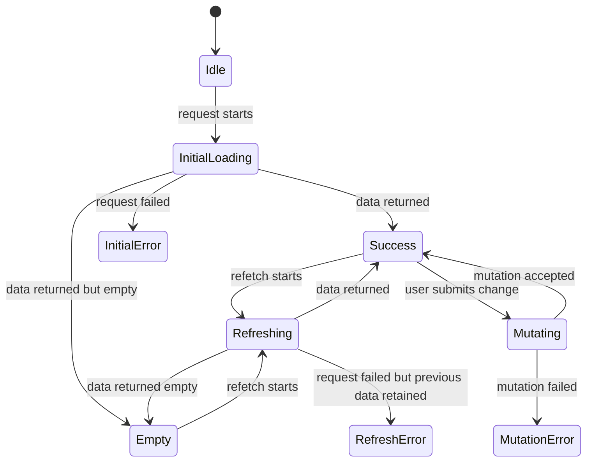
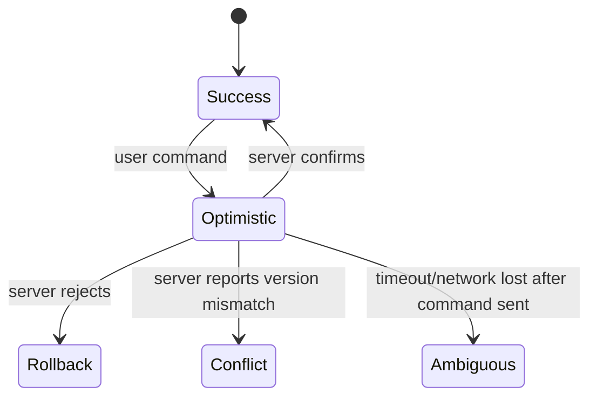

# Part 020 — Loading, Empty, Error, and Success States

> Remote data UI is not four booleans. It is a state machine with product consequences.

Most React codebases begin with this:

```tsx
const [loading, setLoading] = useState(false)
const [error, setError] = useState<string | null>(null)
const [data, setData] = useState<Item[] | null>(null)
```

It works for demos. It fails in production.

Why?

Because remote data has more states than loading/error/data:

- not requested yet,
- initial loading,
- refreshing with old data,
- successful with non-empty data,
- successful with empty data,
- failed with no data,
- failed while old data remains visible,
- unauthorized,
- forbidden,
- not found,
- validation failed,
- optimistic pending,
- partially loaded,
- stale but usable,
- disabled because dependencies are missing,
- offline queued,
- retrying after a transient failure.

If you model all of that with three nullable variables, invalid combinations will appear.

Examples:

```ts
loading === true && error !== null && data !== null
loading === false && error === null && data === null
loading === false && error !== null && data.length > 0
```

Some of these combinations may be valid. Some are contradictions. The code does not say which.

Production React systems need explicit remote state modeling.

---

## 1. The Invariant

The central invariant:

> Every user-visible remote data state must correspond to a valid lifecycle state of the underlying operation.

Do not render arbitrary combinations of flags. Render states that make sense.



The exact machine varies by product. The existence of a machine should not.

---

## 2. Boolean State Is a Trap

Bad:

```ts
type RemoteState<T> = {
  loading: boolean
  error: Error | null
  data: T | null
}
```

This shape allows impossible states.

Better:

```ts
type RemoteState<T> =
  | { status: 'idle' }
  | { status: 'pending' }
  | { status: 'success'; data: T }
  | { status: 'empty' }
  | { status: 'error'; error: AppError }
```

Now every state is intentional.

But production apps usually need richer states.

```ts
type RemoteResource<T> =
  | { status: 'disabled'; reason: string }
  | { status: 'idle' }
  | { status: 'initial-loading'; startedAt: number }
  | { status: 'success'; data: T; receivedAt: number; stale: boolean }
  | { status: 'empty'; receivedAt: number }
  | { status: 'refreshing'; data: T; receivedAt: number; startedAt: number }
  | { status: 'refresh-error'; data: T; error: AppError; receivedAt: number }
  | { status: 'initial-error'; error: AppError }
```

This looks verbose. It is cheaper than debugging impossible UI.

---

## 3. Initial Loading vs Refreshing

Initial loading means:

> The UI has no usable data yet.

Refreshing means:

> The UI has usable data, but a newer snapshot is being requested.

These should render differently.

Bad:

```tsx
if (isLoading) return <FullPageSpinner />
return <CaseTable cases={cases} />
```

If `isLoading` becomes true during background refetch, the table disappears. That creates flicker and destroys user context.

Better:

```tsx
if (state.status === 'initial-loading') {
  return <CaseTableSkeleton />
}

if (state.status === 'success') {
  return <CaseTable cases={state.data} />
}

if (state.status === 'refreshing') {
  return (
    <>
      <CaseTable cases={state.data} aria-busy="true" />
      <InlineRefreshIndicator />
    </>
  )
}
```

The user keeps context while the app refreshes.

---

## 4. Empty Is Not Error

Empty state means the request succeeded and returned no meaningful records.

Error state means the request failed or produced invalid data.

Do not blur them.

Bad:

```tsx
if (!cases.length) {
  return <p>No cases found.</p>
}
```

This code cannot distinguish:

- not loaded yet,
- empty result,
- failed request with fallback empty array,
- unauthorized masked as empty,
- filter too restrictive,
- search query too short.

Better:

```tsx
switch (state.status) {
  case 'initial-loading':
    return <CaseTableSkeleton />

  case 'empty':
    return <EmptyCases filter={state.filter} />

  case 'initial-error':
    return <LoadCasesError error={state.error} />

  case 'success':
    return <CaseTable cases={state.data} />
}
```

Empty state is product communication.

A good empty state answers:

1. What happened?
2. Is it expected?
3. What can the user do next?
4. Is this empty because of filters/search/permissions?

Examples:

| Context | Bad empty state | Better empty state |
|---|---|---|
| No assigned cases | “No data” | “You have no assigned cases.” |
| Search result | “No data” | “No cases match `fraud review`. Try a broader search.” |
| Filtered list | “No items” | “No open cases assigned to Maya.” |
| New workspace | “Empty” | “Create your first workflow to begin routing cases.” |
| Permission scoped | “No data” | “No visible records for your current access scope.” |

---

## 5. Error Is Not One State

From Part 013, errors have categories:

- network unavailable,
- timeout,
- abort,
- HTTP 400 validation,
- HTTP 401 unauthenticated,
- HTTP 403 forbidden,
- HTTP 404 not found,
- HTTP 409 conflict,
- HTTP 412 precondition failed,
- HTTP 429 rate limited,
- HTTP 5xx server failure,
- parsing error,
- contract error,
- domain rule failure.

Rendering all of them as “Something went wrong” is lazy and harmful.

A better mapping:

| Error | UI behavior |
|---|---|
| Abort | Usually no user-facing error |
| Timeout | Retry affordance, maybe degraded message |
| Network offline | Offline banner, keep cached data if available |
| 401 | Re-authentication flow |
| 403 | Permission explanation or access request |
| 404 detail page | Not-found state |
| 404 list item | Remove item or show stale item unavailable |
| 409/412 | Conflict resolution |
| 422 validation | Field-level errors |
| 429 | Rate-limit message, retry-after handling |
| 5xx | Retry, incident-friendly copy, support correlation ID |
| Contract parse failure | Safe fallback and telemetry |

Error UI is part of system behavior. It should encode the recovery path.

---

## 6. Initial Error vs Refresh Error

Initial error:

> The app has no data to show.

Refresh error:

> The app has old data and failed to get newer data.

They are different.

```ts
type CasesState =
  | { status: 'initial-loading' }
  | { status: 'initial-error'; error: AppError }
  | { status: 'success'; data: Case[]; stale: false }
  | { status: 'refreshing'; data: Case[] }
  | { status: 'refresh-error'; data: Case[]; error: AppError; stale: true }
```

Render:

```tsx
function CasesScreen({ state }: { state: CasesState }) {
  switch (state.status) {
    case 'initial-loading':
      return <CaseTableSkeleton />

    case 'initial-error':
      return <FullPageError error={state.error} retryLabel="Reload cases" />

    case 'success':
      return <CaseTable cases={state.data} />

    case 'refreshing':
      return (
        <>
          <CaseTable cases={state.data} aria-busy="true" />
          <RefreshStatus>Updating…</RefreshStatus>
        </>
      )

    case 'refresh-error':
      return (
        <>
          <StaleDataBanner error={state.error} />
          <CaseTable cases={state.data} stale />
        </>
      )
  }
}
```

A refresh failure should not usually blank a working screen.

---

## 7. Stale Data Is a First-Class State

Stale means:

> The data is usable, but the app knows it may not be the newest representation.

Stale is not necessarily bad.

It is often the right trade-off.

Examples:

- user sees cached dashboard instantly,
- background refetch updates later,
- offline user sees last known data,
- detail page shows old snapshot with “refresh failed” banner,
- list preserves context while filters update.

But stale must be visible when correctness matters.

Regulatory/case-management example:

- stale dashboard count: usually acceptable,
- stale enforcement deadline: dangerous,
- stale approval status: dangerous,
- stale assignee display: maybe acceptable with refresh indicator,
- stale permission result: dangerous.

Do not globally decide “stale is okay”. Decide by domain risk.

---

## 8. Pending States for Mutations

Query states describe reading. Mutation states describe commands.

A mutation can be:

- idle,
- validating locally,
- submitting,
- optimistic pending,
- accepted,
- rejected by validation,
- rejected by conflict,
- failed transiently,
- ambiguous outcome,
- queued offline.

Bad:

```tsx
const [saving, setSaving] = useState(false)
```

Better:

```ts
type SaveState =
  | { status: 'idle' }
  | { status: 'submitting'; commandId: string }
  | { status: 'optimistic'; commandId: string; rollback: () => void }
  | { status: 'success'; savedAt: string }
  | { status: 'validation-error'; fields: Record<string, string> }
  | { status: 'conflict'; serverVersion: Case; localDraft: CaseDraft }
  | { status: 'transient-error'; error: AppError; canRetry: true }
  | { status: 'ambiguous'; commandId: string; message: string }
```

The state tells the UI what recovery is possible.

---

## 9. Optimistic State

Optimistic UI means:

> The client temporarily renders the expected result before server confirmation.

This is not just “update the UI early”. It is a branch in the state machine.



Optimistic update needs:

- command identity,
- rollback snapshot or inverse patch,
- server confirmation mapping,
- conflict behavior,
- invalidation after settle,
- protection from stale refetch overwrite.

Example:

```ts
type OptimisticCaseState = {
  status: 'success'
  data: Case
  optimistic?: {
    commandId: string
    type: 'assign-case'
    previous: Case
    submittedAt: number
  }
}
```

Do not show optimistic state exactly like confirmed state when the domain is sensitive.

A case assignment pending server confirmation may need:

- subtle pending badge,
- disabled repeated action,
- rollback on rejection,
- audit-friendly error copy.

---

## 10. Partial Data State

Partial data appears when:

- a response intentionally returns summary fields,
- a detail subresource fails,
- streaming data arrives in chunks,
- route data has critical and non-critical sections,
- permissions hide some fields,
- GraphQL returns partial data with errors depending on client/server behavior,
- CDN/cache has stale shell but missing dynamic content.

Do not pretend partial is full success.

```ts
type CaseDetailState =
  | { status: 'loading' }
  | {
      status: 'partial'
      case: CaseSummary
      missing: Array<'timeline' | 'attachments' | 'relatedCases'>
      errors: AppError[]
    }
  | { status: 'success'; case: CaseFull }
  | { status: 'error'; error: AppError }
```

Render partial state honestly:

```tsx
if (state.status === 'partial') {
  return (
    <CaseLayout case={state.case}>
      {state.missing.includes('timeline') ? (
        <PanelError title="Timeline unavailable" />
      ) : (
        <Timeline />
      )}
    </CaseLayout>
  )
}
```

Partial rendering is often better than full failure, but only when the missing part is non-critical.

---

## 11. Disabled State

Sometimes a query should not run.

Examples:

- `userId` is not known yet,
- route param is invalid,
- feature flag disabled,
- dependent query waits for parent result,
- user lacks permission,
- search query is too short,
- form is invalid.

Do not model this as loading.

```ts
type RemoteState<T> =
  | { status: 'disabled'; reason: 'missing-user-id' | 'query-too-short' }
  | { status: 'initial-loading' }
  | { status: 'success'; data: T }
  | { status: 'error'; error: AppError }
```

UI can then render correctly:

```tsx
if (state.status === 'disabled' && state.reason === 'query-too-short') {
  return <p>Type at least 2 characters to search.</p>
}
```

Disabled is an intentional non-request. Loading is an active request.

---

## 12. Not Found vs Empty

For a collection:

```http
GET /cases?status=closed
```

An empty list usually means success with zero results.

For a detail resource:

```http
GET /cases/123
```

A missing record is not the same UI state as an empty list.

```ts
type CaseDetailState =
  | { status: 'loading' }
  | { status: 'success'; data: Case }
  | { status: 'not-found'; caseId: string }
  | { status: 'forbidden'; caseId: string }
  | { status: 'error'; error: AppError }
```

This distinction matters for routing:

- `not-found` may show a 404 page,
- `forbidden` may show access request,
- `empty` may show onboarding or filter help.

---

## 13. Unauthorized vs Forbidden

From the user’s perspective:

- unauthenticated means “we do not know who you are or your session expired”,
- forbidden means “we know who you are, and you cannot access this”.

The UI should not collapse them.

```ts
type AuthzAwareState<T> =
  | { status: 'loading' }
  | { status: 'success'; data: T }
  | { status: 'unauthenticated' }
  | { status: 'forbidden'; requiredPermission?: string }
  | { status: 'error'; error: AppError }
```

In sensitive apps, forbidden copy should avoid leaking whether the resource exists.

Bad:

> Case 123 exists but you are not allowed to view it.

Safer:

> This record is unavailable or outside your access scope.

The exact copy depends on product/security policy.

---

## 14. Accessibility of Remote States

Remote state changes are UI changes. They must be understandable to assistive technology.

Useful primitives:

- `aria-busy` for a region being updated,
- `role="status"` for non-urgent status updates,
- `role="alert"` for important/time-sensitive errors,
- focus management after major route or form errors,
- preserving content during refresh to avoid disorientation.

Example:

```tsx
<section aria-busy={state.status === 'refreshing'}>
  <h2>Cases</h2>
  <CaseTable cases={cases} />

  {state.status === 'refreshing' && (
    <p role="status">Refreshing cases…</p>
  )}

  {state.status === 'refresh-error' && (
    <p role="alert">Could not refresh. Showing last known data.</p>
  )}
</section>
```

Do not announce every tiny background request. Announce changes that affect user understanding or task completion.

---

## 15. Skeleton, Spinner, Shimmer, and Placeholder

Loading UI is not decoration. It communicates expected wait and layout stability.

| Pattern | Best for | Avoid when |
|---|---|---|
| Skeleton | Initial load with predictable layout | Data shape unknown or very fast response |
| Spinner | Short blocking action | Long page load without context |
| Progress bar | Upload/download with measurable progress | Fake progress that misleads |
| Inline pending text | Small background operation | Critical blocking operation |
| Disabled button + label | Form submit | Submit can safely happen concurrently |
| Placeholder copy | Empty or not-started state | Actual request is in flight |

Rules:

- avoid full-screen spinners after data is already visible,
- preserve layout to reduce visual jump,
- avoid infinite loading without timeout/retry path,
- distinguish “waiting for user input” from “waiting for network”.

---

## 16. Data State Should Carry Identity

From Part 019, stale displays often happen because state lacks identity.

Bad:

```ts
type State = {
  status: 'success'
  data: Case
}
```

Better:

```ts
type State = {
  status: 'success'
  caseId: string
  data: Case
  receivedAt: number
}
```

Then rendering can guard:

```tsx
if (state.status === 'success' && state.caseId !== routeCaseId) {
  return <CasePageSkeleton />
}
```

This is especially important for:

- detail routes,
- search results,
- dependent queries,
- permission-scoped resources,
- multi-tenant apps,
- tabs that reuse the same component instance.

---

## 17. TypeScript Exhaustiveness

Discriminated unions make invalid states harder to render accidentally.

```tsx
function assertNever(value: never): never {
  throw new Error(`Unhandled state: ${JSON.stringify(value)}`)
}

function RemoteView<T>({ state }: { state: RemoteResource<T> }) {
  switch (state.status) {
    case 'disabled':
      return <DisabledReason reason={state.reason} />
    case 'idle':
      return <IdlePrompt />
    case 'initial-loading':
      return <Skeleton />
    case 'success':
      return <DataView data={state.data} />
    case 'empty':
      return <EmptyState />
    case 'refreshing':
      return <DataView data={state.data} refreshing />
    case 'refresh-error':
      return <DataView data={state.data} stale error={state.error} />
    case 'initial-error':
      return <ErrorState error={state.error} />
    default:
      return assertNever(state)
  }
}
```

When a new state is added, TypeScript forces render logic to acknowledge it.

This is not pedantry. This is how you prevent unhandled production lifecycle states.

---

## 18. Mapping HTTP/App Errors to Remote State

The fetch client should normalize errors. The UI layer should map normalized errors to product states.

```ts
type AppError =
  | { kind: 'network'; retryable: true }
  | { kind: 'timeout'; retryable: true }
  | { kind: 'unauthenticated' }
  | { kind: 'forbidden'; code?: string }
  | { kind: 'not-found' }
  | { kind: 'validation'; fields: Record<string, string> }
  | { kind: 'conflict'; serverVersion?: unknown }
  | { kind: 'rate-limited'; retryAfterMs?: number }
  | { kind: 'server'; requestId?: string; retryable: true }
  | { kind: 'contract'; retryable: false }
```

Mapping:

```ts
function toInitialErrorState(error: AppError): CaseDetailState {
  switch (error.kind) {
    case 'unauthenticated':
      return { status: 'unauthenticated' }
    case 'forbidden':
      return { status: 'forbidden' }
    case 'not-found':
      return { status: 'not-found' }
    default:
      return { status: 'error', error }
  }
}
```

Do not let every component reinterpret raw HTTP status codes independently.

---

## 19. Integrating with TanStack Query Style State

Query libraries expose state fields such as pending, error, success, fetching, stale, previous data, and mutation state. The exact API names depend on version and configuration.

The architectural move is to translate library state into product state.

Example:

```tsx
function CasesRoute() {
  const query = useCasesQuery()

  if (query.isPending) {
    return <CaseTableSkeleton />
  }

  if (query.isError) {
    return <CasesInitialError error={query.error} />
  }

  if (query.data.length === 0) {
    return <EmptyCases />
  }

  return (
    <>
      {query.isFetching && <RefreshStatus />}
      <CaseTable cases={query.data} stale={query.isStale} />
    </>
  )
}
```

Do not leak library flags everywhere. Wrap them into domain-aware views when the screen is important.

---

## 20. State Modeling by Screen Criticality

Not every component needs a giant state machine.

Use more rigor where mistakes are costly.

| Surface | State rigor needed |
|---|---|
| Marketing widget | Low |
| Autocomplete | Medium: latest-wins, empty, error |
| Dashboard cards | Medium: stale/refresh-aware |
| Payment submit | High: idempotency, ambiguous outcome |
| Case status transition | High: conflict/version/authz |
| Regulatory deadline | High: stale visibility and auditability |
| Admin permission editor | Very high: validation, conflict, rollback |

Top engineers do not over-engineer everything. They apply precision where failure matters.

---

## 21. Good Remote State Copy

UI copy should match state.

### Loading

Bad:

> Loading…

Better:

> Loading assigned cases…

### Refreshing

Bad:

> Loading…

Better:

> Updating list. Showing current results.

### Empty

Bad:

> No data.

Better:

> No open cases match the current filters.

### Initial Error

Bad:

> Error.

Better:

> We could not load cases. Retry or check your connection.

### Refresh Error

Bad:

> Error.

Better:

> Could not refresh. Showing last known data from 09:42.

### Conflict

Bad:

> Failed.

Better:

> This case changed since you opened it. Review the latest version before saving.

Good copy encodes the recovery model.

---

## 22. Production Anti-Patterns

### Anti-pattern 1 — Nullable everything

```tsx
if (!data) return <Spinner />
```

This hides whether the app is loading, empty, unauthorized, or broken.

### Anti-pattern 2 — Empty array fallback for failed requests

```tsx
catch {
  setCases([])
}
```

This turns errors into false empty states.

### Anti-pattern 3 — Full-page spinner on every refetch

This destroys context and makes the app feel unstable.

### Anti-pattern 4 — Error toast only

A toast disappears. The screen still needs a persistent state if the operation failed.

### Anti-pattern 5 — Loading state not tied to request identity

This creates stuck loading when old request finishes after new request begins.

### Anti-pattern 6 — Optimistic state indistinguishable from confirmed state

This is risky for sensitive domains.

### Anti-pattern 7 — Hiding authorization errors as empty lists everywhere

Sometimes necessary for security, but dangerous as a default because it destroys diagnosability.

---

## 23. A Complete Remote Resource Helper

A generic helper can encode common transitions.

```ts
type ResourceState<T> =
  | { status: 'idle' }
  | { status: 'initial-loading'; startedAt: number }
  | { status: 'success'; data: T; receivedAt: number; stale: false }
  | { status: 'empty'; receivedAt: number }
  | { status: 'refreshing'; data: T; receivedAt: number; startedAt: number }
  | { status: 'refresh-error'; data: T; receivedAt: number; error: AppError }
  | { status: 'initial-error'; error: AppError }

function startLoad<T>(state: ResourceState<T>, now = Date.now()): ResourceState<T> {
  if (state.status === 'success') {
    return {
      status: 'refreshing',
      data: state.data,
      receivedAt: state.receivedAt,
      startedAt: now,
    }
  }

  if (state.status === 'refresh-error') {
    return {
      status: 'refreshing',
      data: state.data,
      receivedAt: state.receivedAt,
      startedAt: now,
    }
  }

  return { status: 'initial-loading', startedAt: now }
}

function receiveData<T>(data: T, isEmpty: (data: T) => boolean): ResourceState<T> {
  const now = Date.now()

  if (isEmpty(data)) {
    return { status: 'empty', receivedAt: now }
  }

  return { status: 'success', data, receivedAt: now, stale: false }
}

function receiveError<T>(state: ResourceState<T>, error: AppError): ResourceState<T> {
  if (state.status === 'refreshing') {
    return {
      status: 'refresh-error',
      data: state.data,
      receivedAt: state.receivedAt,
      error,
    }
  }

  return { status: 'initial-error', error }
}
```

This is intentionally small. The purpose is to show state transitions instead of scattered `setLoading(false)` calls.

---

## 24. Rendering Strategy Matrix

| State | Should keep old data? | Should block interaction? | Should announce? | Should retry? |
|---|---:|---:|---:|---:|
| Initial loading | No old data | Usually yes | Sometimes | Not yet |
| Refreshing | Yes | Usually no | Low priority | Not yet |
| Empty | No data | No | No | No, unless refresh available |
| Initial error | No data | Yes | Yes | Yes |
| Refresh error | Yes | No | Maybe | Yes |
| Validation error | Draft data | Only invalid submit | Yes near fields | After correction |
| Conflict | Local + server data | Yes for affected action | Yes | After resolution |
| Optimistic | Show predicted data | Block duplicate action | Maybe | Depends |
| Ambiguous mutation | Preserve cautious state | Yes for same command | Yes | Verify status first |
| Offline queued | Show local pending | Maybe | Yes | Auto when online |

This matrix should be decided per product area, not guessed inside components.

---

## 25. Observability of UI States

Track state transitions for important flows.

Useful events:

```ts
type UiStateEvent = {
  screen: string
  resource: string
  from: string
  to: string
  operation: string
  durationMs?: number
  errorKind?: string
  requestId?: string
  stale?: boolean
}
```

Examples:

- `cases.initial_loading -> cases.success`,
- `cases.success -> cases.refreshing`,
- `cases.refreshing -> cases.refresh_error`,
- `case.save.optimistic -> case.save.conflict`,
- `case.detail.initial_loading -> case.detail.forbidden`.

Why track this?

Because UI state distribution reveals real product health:

- many initial errors may indicate outage,
- many refresh errors may indicate flaky network/CDN,
- many empty states may indicate onboarding/filter issues,
- many conflicts may indicate concurrent workflow contention,
- long initial loading may indicate waterfall or backend latency.

---

## 26. Testing Remote UI States

Test states, not implementation details.

| Test | Assertion |
|---|---|
| Initial load pending | Skeleton visible, table absent |
| Success with rows | Rows visible, loading absent |
| Success with empty list | Empty state visible, not error |
| Initial error | Error panel visible, retry available |
| Refreshing | Old data remains visible, refresh indicator visible |
| Refresh error | Old data remains visible, stale warning visible |
| 401 | Login/session state rendered |
| 403 | Forbidden/unavailable state rendered |
| 404 detail | Not-found state rendered |
| Validation error | Field-level messages rendered |
| Conflict | Conflict resolution UI rendered |
| Abort | No error state rendered |

Example shape:

```tsx
it('keeps old data visible when refresh fails', async () => {
  render(<CasesScreen />)

  await screen.findByText('Case A')

  server.use(
    http.get('/api/cases', () => new HttpResponse(null, { status: 500 }))
  )

  await user.click(screen.getByRole('button', { name: /refresh/i }))

  expect(screen.getByText('Case A')).toBeInTheDocument()
  expect(screen.getByText(/could not refresh/i)).toBeInTheDocument()
})
```

The exact tooling is less important than the lifecycle guarantee.

---

## 27. Design Review Checklist

For every important remote screen, ask:

1. What is the initial state before any request?
2. What does initial loading look like?
3. What does background refresh look like?
4. Is empty different from error?
5. Does empty state explain filters/search/scope?
6. Are 401, 403, 404, 409, and 422 mapped intentionally?
7. Does refresh failure preserve old data?
8. Is stale data visible where correctness matters?
9. Is optimistic state distinguishable from confirmed state?
10. Is ambiguous mutation outcome handled?
11. Does state carry resource identity?
12. Are aborts hidden from user-facing errors?
13. Are loading regions accessible?
14. Are errors announced appropriately?
15. Are impossible boolean combinations eliminated?
16. Are state transitions tested?
17. Are important transitions observable?

---

## 28. Summary

Key takeaways:

- Loading, empty, error, and success are not enough for production remote data.
- Initial loading and refreshing are different states.
- Empty is a successful response, not a fallback for errors.
- Initial error and refresh error should render differently.
- Stale data is a product decision, not merely a cache detail.
- Mutation states need command-aware modeling.
- Accessibility must be part of remote state design.
- Discriminated unions make invalid UI states harder to express.
- Important screens deserve explicit state machines.

Part 021 builds on this by introducing Suspense, transitions, and async rendering: React features that change where loading boundaries live and how UI stays responsive while remote data changes.

---

## Further Reading

- React Conditional Rendering: https://react.dev/learn/conditional-rendering
- React `useTransition`: https://react.dev/reference/react/useTransition
- React `<Suspense>`: https://react.dev/reference/react/Suspense
- MDN `aria-busy`: https://developer.mozilla.org/en-US/docs/Web/Accessibility/ARIA/Reference/Attributes/aria-busy
- MDN `status` role: https://developer.mozilla.org/en-US/docs/Web/Accessibility/ARIA/Reference/Roles/status_role
- MDN `alert` role: https://developer.mozilla.org/en-US/docs/Web/Accessibility/ARIA/Reference/Roles/alert_role
