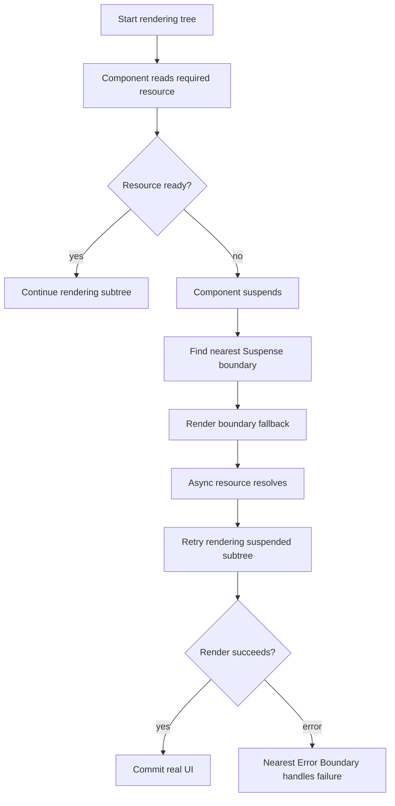
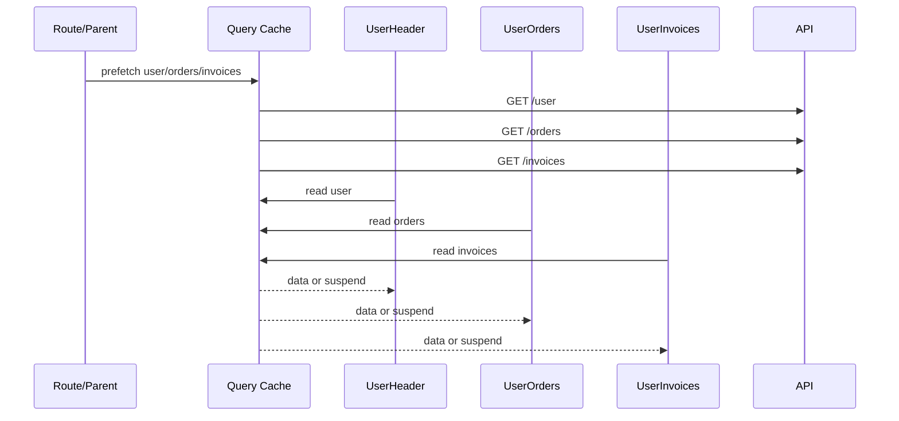
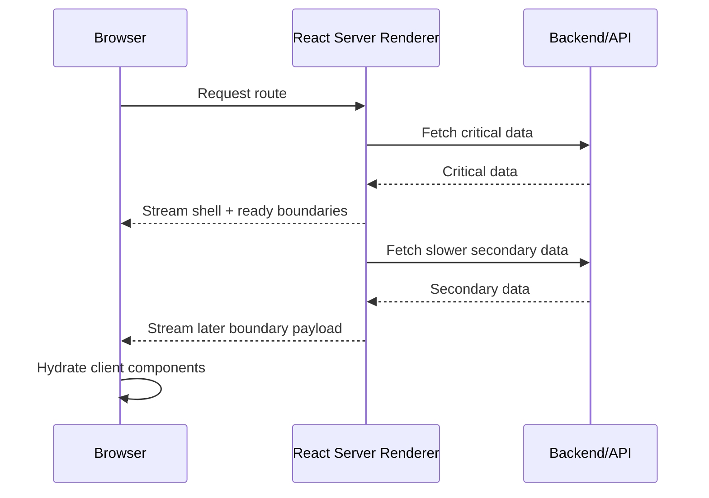

# Part 021 — Suspense, Transitions, and Async Rendering

> Target mental model: **React rendering is not a blocking function call.** Network data is not “available later inside the same render”. Suspense and transitions are tools for coordinating asynchronous readiness with the render tree, not magic HTTP clients.

A junior React app often treats loading as a boolean:

```tsx
if (isLoading) return <Spinner />;
return <Screen data={data} />;
```

A senior React app treats loading as a **rendering contract**:

- which region may be temporarily replaced;
- which previously visible region must stay visible;
- which update is urgent;
- which update is interruptible;
- which error boundary owns the failure;
- which network result is allowed to commit;
- which stale data is acceptable while fresh data is pending.

Suspense and transitions sit exactly at that boundary.

They do **not** remove the need for good transport design from previous parts. You still need cancellation, error taxonomy, retry rules, idempotency, cache identity, and contract validation. Suspense only changes **how pending async work is represented in the render tree**.

---

## 1. The Problem Suspense Is Solving

Without Suspense, every component that needs remote data tends to carry its own local protocol:

```tsx
function UserPanel({ userId }: { userId: string }) {
  const [status, setStatus] = useState<'loading' | 'success' | 'error'>('loading');
  const [user, setUser] = useState<User | null>(null);
  const [error, setError] = useState<unknown>(null);

  useEffect(() => {
    let ignore = false;

    fetchUser(userId)
      .then((nextUser) => {
        if (!ignore) {
          setUser(nextUser);
          setStatus('success');
        }
      })
      .catch((err) => {
        if (!ignore) {
          setError(err);
          setStatus('error');
        }
      });

    return () => {
      ignore = true;
    };
  }, [userId]);

  if (status === 'loading') return <UserPanelSkeleton />;
  if (status === 'error') return <UserPanelError error={error} />;
  return <UserPanelView user={user!} />;
}
```

This works, but it spreads async policy across the tree.

You end up duplicating:

- loading placeholders;
- error fallbacks;
- race guards;
- stale data decisions;
- retry UI;
- partial reveal strategy;
- parent/child coordination;
- route transition behavior.

Suspense changes the primitive. A component can say: “I cannot finish rendering yet.” React can then decide which boundary fallback should appear.

Conceptually:

```txt
manual loading flag: component decides how to render pending state
Suspense: component declares not-ready; nearest boundary decides pending UI
```

That is a major architectural shift.

---

## 2. Suspense Is a Rendering Boundary, Not a Fetch Library

Suspense is often explained as “loading state for async data”. That is too vague and frequently misleading.

A better definition:

> A Suspense boundary defines a region of UI that may be replaced by a fallback while some Suspense-enabled child is not ready to render.

It does not automatically make arbitrary `fetch()` calls suspend.

This does **not** suspend:

```tsx
function UserPanel({ userId }: { userId: string }) {
  const [user, setUser] = useState<User | null>(null);

  useEffect(() => {
    fetchUser(userId).then(setUser);
  }, [userId]);

  if (!user) return <UserPanelSkeleton />;
  return <UserPanelView user={user} />;
}
```

The `fetch()` is happening after render inside an Effect. Suspense cannot coordinate that request because the component already rendered.

Suspense is triggered by Suspense-enabled sources, such as:

- framework data loading integrated with React;
- `React.lazy()` while loading component code;
- reading a Promise with React's `use` API where supported;
- data libraries that intentionally integrate with Suspense;
- Server Components and streaming framework behavior.

The rule is simple:

> Suspense works when async readiness is part of render, not when async work is hidden after render in an Effect.

---

## 3. The Core Render-Time Model

Think of rendering as a speculative calculation.

React starts rendering a tree. A component attempts to read something required for rendering. If that value is not ready, the component suspends. React walks up to the nearest `<Suspense>` boundary and renders the fallback for that region.



Important consequences:

1. Suspense fallback belongs to the **boundary**, not the suspending component.
2. Suspense is about **render readiness**, not necessarily network state.
3. Re-rendering can retry the suspended subtree.
4. Error handling is separate; rejected async data should route to an error boundary.
5. Boundary placement becomes a product decision.

---

## 4. Boundary Placement Is UX Architecture

Suspense boundaries define what the user loses while waiting.

Bad boundary:

```tsx
<Suspense fallback={<FullPageSpinner />}>
  <AppShell />
</Suspense>
```

If anything inside suspends, the whole application shell can disappear.

Better boundary:

```tsx
<AppShell>
  <Suspense fallback={<SidebarSkeleton />}>
    <Sidebar />
  </Suspense>

  <Suspense fallback={<MainContentSkeleton />}>
    <MainContent />
  </Suspense>
</AppShell>
```

Now loading is isolated. The app shell remains stable.

### Boundary placement heuristic

Place a boundary around a region that has one coherent loading contract.

Good Suspense region:

- a card whose content can appear later;
- a tab panel;
- a route outlet;
- a sidebar module;
- a dashboard widget;
- a comments section;
- a detail panel below an already rendered list.

Risky Suspense region:

- the entire app shell;
- global navigation;
- authenticated layout chrome;
- a form being edited;
- a destructive action confirmation;
- any area where fallback would destroy user context.

Suspense is not only about performance. It is about **continuity**.

---

## 5. Fallback Is Not Decoration

A Suspense fallback is a temporary replacement for unavailable UI.

That means fallback design must preserve enough context.

Bad:

```tsx
<Suspense fallback={<Spinner />}>
  <InvoiceTable />
</Suspense>
```

A spinner tells the user nothing about shape, scope, or progress.

Better:

```tsx
<Suspense fallback={<InvoiceTableSkeleton rows={10} />}>
  <InvoiceTable />
</Suspense>
```

Even better when old data exists:

```tsx
<InvoicePageHeader />
<Suspense fallback={<InvoiceTableSkeleton rows={10} />}>
  <InvoiceTable />
</Suspense>
```

The page frame remains stable. Only the uncertain region is replaced.

### Fallback invariant

> A fallback should communicate **which region is pending** without destroying unrelated user context.

---

## 6. Suspense and Error Boundaries Are Siblings, Not Replacements

Suspense handles “not ready yet”. Error boundaries handle “cannot render successfully”.

You usually need both.

```tsx
<ErrorBoundary fallback={<UserPanelError />}>
  <Suspense fallback={<UserPanelSkeleton />}>
    <UserPanel userId={userId} />
  </Suspense>
</ErrorBoundary>
```

A useful mental model:

```txt
pending promise  -> Suspense fallback
rejected promise -> Error Boundary fallback
render error     -> Error Boundary fallback
```

Do not collapse every failure into Suspense fallback. A loading skeleton that appears forever after a rejected request is a production bug disguised as calm UI.

---

## 7. `useTransition`: Marking Non-Urgent Updates

Some updates should block immediate feedback. Others should be interruptible.

Typing in an input is urgent. Recomputing or refetching a large results panel is less urgent.

`useTransition` lets you mark state updates as transitions.

```tsx
import { useState, useTransition } from 'react';

function SearchPage() {
  const [text, setText] = useState('');
  const [query, setQuery] = useState('');
  const [isPending, startTransition] = useTransition();

  function onChange(nextText: string) {
    setText(nextText); // urgent: input must update immediately

    startTransition(() => {
      setQuery(nextText); // non-urgent: results may lag
    });
  }

  return (
    <>
      <input value={text} onChange={(e) => onChange(e.target.value)} />
      {isPending && <span>Updating results…</span>}
      <SearchResults query={query} />
    </>
  );
}
```

The key idea:

> A transition does not make the network faster. It changes how React prioritizes rendering caused by the update.

### Use transition when

- input/navigation feedback must stay responsive;
- the next screen may suspend;
- a state change triggers expensive rendering;
- the user should keep seeing old UI while new UI prepares;
- interrupting obsolete work is acceptable.

### Do not use transition when

- the update is the direct controlled value of an input;
- the update must be immediately visible for correctness;
- you are trying to hide slow backend performance;
- you need ordering guarantees for mutations;
- you are replacing transport cancellation or dedupe.

---

## 8. Transition vs Loading Spinner

A normal loading spinner says:

> We have no UI ready for this state.

A transition says:

> Keep the previous UI interactive while the next UI prepares.

This matters for client-server communication.

Without transition:

```txt
User changes filter
Old list disappears
Spinner appears
New list appears
```

With transition-oriented design:

```txt
User changes filter
Old list remains visible, possibly dimmed
Pending indicator appears
New list replaces old list when ready
```

That is a better experience for many data-heavy applications.

```tsx
function OrdersRoute() {
  const [filter, setFilter] = useState<OrderFilter>({ status: 'open' });
  const [isPending, startTransition] = useTransition();

  function applyFilter(nextFilter: OrderFilter) {
    startTransition(() => {
      setFilter(nextFilter);
    });
  }

  return (
    <section aria-busy={isPending}>
      <OrderFilters value={filter} onChange={applyFilter} />
      <Suspense fallback={<OrdersTableSkeleton />}>
        <OrdersTable filter={filter} />
      </Suspense>
    </section>
  );
}
```

But be precise: if `OrdersTable` fetches in `useEffect`, this Suspense boundary will not automatically coordinate the request. You need a Suspense-enabled data source or framework integration.

---

## 9. `useDeferredValue`: Letting Derived Consumption Lag

`useTransition` marks an update. `useDeferredValue` marks a consumed value as allowed to lag.

```tsx
import { useDeferredValue, useState } from 'react';

function SearchPage() {
  const [query, setQuery] = useState('');
  const deferredQuery = useDeferredValue(query);

  const isStale = query !== deferredQuery;

  return (
    <>
      <input value={query} onChange={(e) => setQuery(e.target.value)} />
      <div style={{ opacity: isStale ? 0.6 : 1 }}>
        <SearchResults query={deferredQuery} />
      </div>
    </>
  );
}
```

Use this when a parent receives a fast-changing value, but a child can render slightly behind.

Common case:

- search input updates immediately;
- result list lags gracefully;
- stale visual marker tells user results are catching up.

It is a display scheduling tool, not a data consistency protocol.

---

## 10. Suspense With Promises and `use`

React's `use` API can read a Promise during render. While the Promise is pending, the nearest Suspense fallback can show. If the Promise rejects, the nearest Error Boundary handles the failure.

A simplified example:

```tsx
import { Suspense, use } from 'react';

function UserDetails({ userPromise }: { userPromise: Promise<User> }) {
  const user = use(userPromise);
  return <h1>{user.name}</h1>;
}

export function UserPage({ userPromise }: { userPromise: Promise<User> }) {
  return (
    <ErrorBoundary fallback={<p>Could not load user.</p>}>
      <Suspense fallback={<p>Loading user…</p>}>
        <UserDetails userPromise={userPromise} />
      </Suspense>
    </ErrorBoundary>
  );
}
```

This looks simple, but the architecture is not simple.

You still need to decide:

- who creates the Promise;
- whether the Promise is stable across renders;
- how request identity is derived;
- how cancellation works;
- how errors are normalized;
- whether stale data is acceptable;
- whether the same request should dedupe;
- how SSR or RSC will transfer data.

The most dangerous version is creating an uncached Promise directly inside render:

```tsx
function BadUserDetails({ userId }: { userId: string }) {
  const user = use(fetchUser(userId)); // dangerous if fetchUser creates new Promise every render
  return <h1>{user.name}</h1>;
}
```

If `fetchUser(userId)` creates a new Promise every render, you can create repeated work or unstable suspension. The resource must be cached, framework-managed, or otherwise stable.

### Better resource pattern

```tsx
type ResourceKey = string;

const userResource = new Map<ResourceKey, Promise<User>>();

function getUserPromise(userId: string): Promise<User> {
  const key = `user:${userId}`;
  const existing = userResource.get(key);
  if (existing) return existing;

  const promise = fetchUser(userId);
  userResource.set(key, promise);
  return promise;
}

function UserDetails({ userId }: { userId: string }) {
  const user = use(getUserPromise(userId));
  return <h1>{user.name}</h1>;
}
```

This is intentionally minimal. Production implementations need invalidation, error eviction, cancellation policy, tenant/user scoping, auth refresh behavior, and memory bounds.

That is why query libraries and frameworks exist.

---

## 11. Suspense and Query Libraries

A server-state library can integrate with Suspense by making query reads suspend while data is pending.

Conceptually:

```tsx
function UserPanel({ userId }: { userId: string }) {
  const { data } = useSuspenseQuery({
    queryKey: ['user', userId],
    queryFn: () => fetchUser(userId),
  });

  return <UserPanelView user={data} />;
}
```

Then boundary placement moves outside:

```tsx
<ErrorBoundary fallback={<UserError />}>
  <Suspense fallback={<UserSkeleton />}>
    <UserPanel userId={userId} />
  </Suspense>
</ErrorBoundary>
```

The data library owns:

- query identity;
- cache reuse;
- in-flight dedupe;
- stale time;
- garbage collection;
- retry policy;
- background refetching;
- invalidation after mutation.

Suspense owns:

- render fallback;
- reveal timing;
- boundary replacement.

Do not mix these responsibilities.

---

## 12. Suspense Waterfalls

Suspense can accidentally create waterfalls.

Example:

```tsx
<Suspense fallback={<PageSkeleton />}>
  <UserHeader userId={userId} />
  <UserOrders userId={userId} />
  <UserInvoices userId={userId} />
</Suspense>
```

If each child starts its request only when rendered, and rendering stops after the first suspension, sibling requests may not begin when you expect.

The fix is not always “add more Suspense”. The deeper fix is to start independent work earlier.

Bad shape:

```txt
render UserHeader -> starts user request -> suspends
wait user
render UserOrders -> starts orders request -> suspends
wait orders
render UserInvoices -> starts invoices request -> suspends
wait invoices
```

Better shape:

```txt
route loader / parent / query prefetch starts user, orders, invoices together
children read already-started resources
Suspense controls reveal
```

### Parallel preloading pattern

```tsx
function preloadUserPage(userId: string) {
  void queryClient.prefetchQuery({
    queryKey: ['user', userId],
    queryFn: () => fetchUser(userId),
  });

  void queryClient.prefetchQuery({
    queryKey: ['orders', userId],
    queryFn: () => fetchOrders(userId),
  });

  void queryClient.prefetchQuery({
    queryKey: ['invoices', userId],
    queryFn: () => fetchInvoices(userId),
  });
}
```

Then the UI can read without serializing request start.



Suspense is best when request start is not accidentally delayed by component depth.

---

## 13. Reveal Strategy: Together vs Progressive

A single boundary reveals everything together.

```tsx
<Suspense fallback={<DashboardSkeleton />}>
  <RevenueCard />
  <OrdersCard />
  <AlertsCard />
</Suspense>
```

This is good when partial content would be misleading.

Separate boundaries reveal progressively.

```tsx
<Suspense fallback={<RevenueSkeleton />}>
  <RevenueCard />
</Suspense>

<Suspense fallback={<OrdersSkeleton />}>
  <OrdersCard />
</Suspense>

<Suspense fallback={<AlertsSkeleton />}>
  <AlertsCard />
</Suspense>
```

This is good when modules are independent.

Nested boundaries give a coarse shell and fine-grained details.

```tsx
<Suspense fallback={<AccountPageSkeleton />}>
  <AccountSummary />

  <Suspense fallback={<ActivityListSkeleton />}>
    <ActivityList />
  </Suspense>
</Suspense>
```

### Decision table

| Situation | Boundary strategy |
|---|---|
| Data must be interpreted together | Single boundary |
| Widgets are independent | Multiple sibling boundaries |
| Shell should appear before details | Nested boundaries |
| Old content should remain visible | Transition + stale display |
| Error in one widget should not kill page | Local Error Boundary + local Suspense |

---

## 14. Async Rendering and Commit Safety

React can start rendering work that does not commit. It can interrupt, retry, and discard render work.

Therefore:

- render must stay pure;
- network side effects should not be triggered blindly from render unless using a framework/resource protocol designed for it;
- mutations must not happen during render;
- subscriptions must be managed in Effects or external stores;
- request identity must be stable;
- stale work must not commit domain-invalid results.

Bad:

```tsx
function SubmitOnRender({ payload }: { payload: Payload }) {
  void fetch('/api/submit', {
    method: 'POST',
    body: JSON.stringify(payload),
  });

  return <p>Submitting…</p>;
}
```

This is catastrophic. Render is not a command execution boundary. React may render more than once.

Mutations belong in event handlers, form actions, route actions, server functions, or explicit mutation APIs—not ordinary render execution.

---

## 15. Suspense Is Bad for Some Loading States

Suspense is not always the best representation.

Avoid Suspense for:

- button-level mutation pending state;
- autosave status;
- upload progress;
- optimistic list insertion;
- field-level validation;
- partial form submission;
- retrying a failed mutation while preserving inputs;
- background refetch where old data should remain visible.

Those states need explicit local/server-state modeling.

Example:

```tsx
function SaveButton({ mutation }: { mutation: SaveMutation }) {
  return (
    <button disabled={mutation.isPending}>
      {mutation.isPending ? 'Saving…' : 'Save'}
    </button>
  );
}
```

A Suspense fallback replacing the whole form during save would be hostile UX.

The principle:

> Use Suspense for render readiness. Use explicit state for user-visible command lifecycle.

---

## 16. Suspense With Stale Data

A common product need:

> When filters change, keep old results visible until new results are ready.

This is not the same as initial loading.

You need distinguish:

- no data yet;
- data exists but is stale;
- fresh data is pending;
- refresh failed but stale data is still usable.

Example model:

```tsx
type RemoteView<T> =
  | { kind: 'initial-loading' }
  | { kind: 'success'; data: T; isRefreshing: boolean }
  | { kind: 'stale-error'; data: T; error: AppError }
  | { kind: 'initial-error'; error: AppError };
```

Suspense can handle the first load. A query library often handles stale while revalidating.

```tsx
function OrdersTableContainer({ filter }: { filter: OrderFilter }) {
  const { data, isFetching } = useQuery({
    queryKey: ['orders', filter],
    queryFn: () => fetchOrders(filter),
    placeholderData: (previous) => previous,
  });

  return (
    <section aria-busy={isFetching}>
      <OrdersTable orders={data ?? []} dimmed={isFetching} />
    </section>
  );
}
```

Do not force all loading into Suspense if the better user experience is stale display.

---

## 17. Route Transitions

Route changes are a natural use case for transitions because navigation often causes data fetching and route-level rendering.

Desired behavior:

- current route remains usable briefly;
- next route prepares;
- pending navigation indicator appears;
- transition can be interrupted by another navigation;
- route fallback is scoped to route outlet, not app shell.

Conceptual structure:

```tsx
<AppShell>
  <GlobalNavigation />
  <Suspense fallback={<RouteSkeleton />}>
    <RouteOutlet />
  </Suspense>
</AppShell>
```

With a framework router, loaders/actions may provide richer pending state than raw Suspense. The rule is not “always Suspense”. The rule is:

> Navigation pending state belongs to the router/framework boundary when navigation is the unit of work.

---

## 18. Server Components, Streaming, and Suspense

With Server Components and SSR streaming, Suspense boundaries can affect what the server sends first and what is revealed later.

Simplified model:



This allows useful UI to arrive before every slow detail is ready.

But streaming is not a substitute for API design. If one giant backend endpoint blocks all data, no UI boundary can make independent data arrive independently.

Server streaming works best when backend data dependencies are shaped around independent reveal units.

---

## 19. Suspense Boundary Placement Checklist

Before adding a Suspense boundary, answer these:

1. What exact region can disappear temporarily?
2. What user context must remain stable?
3. Is this initial load, refresh, navigation, or mutation?
4. Should old data remain visible?
5. Should siblings reveal together or independently?
6. Where should error be caught?
7. Who starts the request?
8. Is request start parallelized or serialized by render?
9. Is the Promise/resource stable across renders?
10. What happens if the user navigates away?
11. What happens if auth changes while suspended?
12. How is this tested under slow network?

If you cannot answer those, Suspense will hide complexity rather than manage it.

---

## 20. Implementation Pattern: Suspense-Ready Resource Wrapper

This is not a recommendation to build your own query library. It is a teaching tool.

```tsx
type ResourceState<T> =
  | { status: 'pending'; promise: Promise<T> }
  | { status: 'success'; data: T }
  | { status: 'error'; error: unknown };

function createResource<T>(loader: () => Promise<T>) {
  let state: ResourceState<T>;

  const promise = loader().then(
    (data) => {
      state = { status: 'success', data };
      return data;
    },
    (error) => {
      state = { status: 'error', error };
      throw error;
    },
  );

  state = { status: 'pending', promise };

  return {
    read(): T {
      if (state.status === 'pending') {
        throw state.promise;
      }

      if (state.status === 'error') {
        throw state.error;
      }

      return state.data;
    },
  };
}
```

Usage:

```tsx
const userResource = createResource(() => fetchUser('u_123'));

function UserPanel() {
  const user = userResource.read();
  return <UserPanelView user={user} />;
}

function Page() {
  return (
    <ErrorBoundary fallback={<UserError />}>
      <Suspense fallback={<UserSkeleton />}>
        <UserPanel />
      </Suspense>
    </ErrorBoundary>
  );
}
```

Why this works conceptually:

- pending throws a Promise;
- error throws an Error;
- success returns data.

Why this is insufficient for production:

- no keying;
- no invalidation;
- no auth scoping;
- no cancellation;
- no retry;
- no garbage collection;
- no stale data policy;
- no mutation integration;
- no observability.

This simple implementation explains why production server-state engines exist.

---

## 21. Production Pattern: Boundary + Query + Transition

A practical pattern for filterable remote lists:

```tsx
function OrdersPage() {
  const [draftFilter, setDraftFilter] = useState<OrderFilter>({ status: 'open' });
  const [committedFilter, setCommittedFilter] = useState(draftFilter);
  const [isPending, startTransition] = useTransition();

  function applyFilter() {
    startTransition(() => {
      setCommittedFilter(draftFilter);
    });
  }

  return (
    <PageFrame>
      <OrderFilterForm
        value={draftFilter}
        onChange={setDraftFilter}
        onApply={applyFilter}
        isApplying={isPending}
      />

      <ErrorBoundary fallback={<OrdersError />}>
        <Suspense fallback={<OrdersTableSkeleton />}>
          <OrdersTable filter={committedFilter} pending={isPending} />
        </Suspense>
      </ErrorBoundary>
    </PageFrame>
  );
}
```

Key separation:

- `draftFilter`: local form state;
- `committedFilter`: server query identity;
- transition: non-urgent query identity update;
- Suspense: initial/render readiness;
- ErrorBoundary: render/query failure;
- table: data display.

This is structurally cleaner than coupling every keystroke directly to a remote fetch.

---

## 22. Failure Modes

### Failure mode: fallback replaces too much UI

Symptom:

- navigation disappears;
- form inputs reset;
- user loses context;
- app feels unstable.

Cause:

- boundary placed too high.

Fix:

- move Suspense boundary around the specific uncertain region.

### Failure mode: Suspense waterfall

Symptom:

- independent requests run serially;
- DevTools waterfall shows sequential start times;
- page is slower after “modernizing” to Suspense.

Cause:

- request start is coupled to child render order.

Fix:

- prefetch at route/parent level;
- use query cache preloading;
- split boundaries carefully;
- avoid creating promises lazily too deep when parallelism matters.

### Failure mode: infinite suspension

Symptom:

- fallback never resolves;
- repeated requests;
- CPU/network churn.

Cause:

- new Promise created every render;
- resource not cached;
- rejected Promise not routed properly;
- error retry loop.

Fix:

- stable resource identity;
- cache Promise by key;
- error boundary;
- controlled retry.

### Failure mode: mutation hidden behind Suspense

Symptom:

- form disappears while submitting;
- user cannot see what is being saved;
- ambiguous mutation outcome.

Cause:

- treating command lifecycle as render readiness.

Fix:

- explicit mutation state;
- idempotency key;
- optimistic/rollback model;
- preserve draft state.

---

## 23. Testing Suspense and Transitions

Test these cases deliberately:

1. Initial request resolves slowly.
2. Initial request rejects.
3. Refresh starts while stale data exists.
4. User changes filter twice quickly.
5. Slow first request resolves after faster second request.
6. Component unmounts while suspended.
7. Error boundary fallback renders with useful recovery action.
8. Navigation away cancels or ignores obsolete work.
9. Suspense fallback does not remove app shell.
10. Accessibility state communicates pending work.

Pseudo-test shape:

```tsx
it('keeps previous results visible during a transition', async () => {
  render(<OrdersPage />);

  await screen.findByText('Order A');

  userEvent.click(screen.getByRole('button', { name: /closed/i }));
  userEvent.click(screen.getByRole('button', { name: /apply/i }));

  expect(screen.getByText('Order A')).toBeInTheDocument();
  expect(screen.getByText(/updating/i)).toBeInTheDocument();

  await screen.findByText('Order B');
});
```

The test is not just checking output. It verifies the product invariant: old data remains visible while new data prepares.

---

## 24. Design Rules

1. Suspense handles render readiness, not arbitrary side effects.
2. Transitions mark non-urgent updates; they do not make APIs faster.
3. Boundary placement is UX architecture.
4. Error boundaries must accompany Suspense for rejected work.
5. Do not create unstable Promises during render.
6. Start independent network work early enough to avoid waterfalls.
7. Keep mutation lifecycle explicit.
8. Prefer stale display over blank fallback for refresh when old data is valid.
9. App shell should rarely be inside a volatile Suspense boundary.
10. Measure waterfalls after introducing Suspense; do not assume improvement.

---

## 25. What You Should Now Be Able To Do

After this part, you should be able to:

- explain why Suspense is a rendering boundary, not a fetch client;
- choose boundary placement based on UX continuity;
- combine Suspense with Error Boundary correctly;
- distinguish `useTransition` from `useDeferredValue`;
- avoid Suspense waterfalls by starting work earlier;
- avoid unstable render-time Promise creation;
- decide when explicit mutation/loading state is better than Suspense;
- test async rendering behavior as a product invariant.

In the next part, we separate **server state** from **client state**. That distinction is what prevents query caches, global stores, form drafts, and URL parameters from collapsing into one unmaintainable state blob.

---

## References

- React Docs — `<Suspense>`: https://react.dev/reference/react/Suspense
- React Docs — `useTransition`: https://react.dev/reference/react/useTransition
- React Docs — `useDeferredValue`: https://react.dev/reference/react/useDeferredValue
- React Docs — `use`: https://react.dev/reference/react/use
- React 19 Release Notes: https://react.dev/blog/2024/12/05/react-19
- TanStack Query React Docs: https://tanstack.com/query/latest/docs/framework/react/overview
