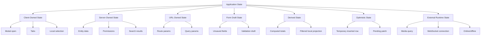
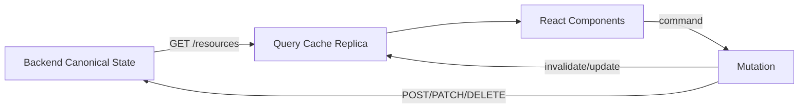
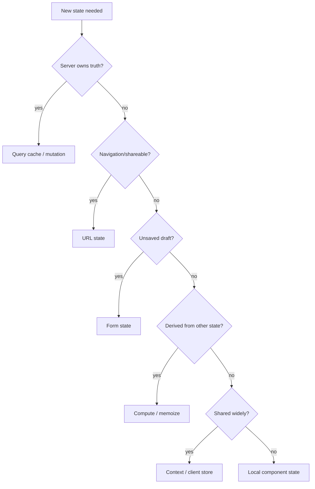

# Part 022 — Server State vs Client State

> Target mental model: **not all state belongs to React state.** Some state is owned by the server, some by the browser URL, some by a form, some by a cache, some by the user session, and some should not be stored at all.

Most frontend state bugs start with a category error.

A team says:

> “Where should we put this data? Zustand? Redux? Context? React Query? URL? Local state?”

That question is often too late. The better first question is:

> “Who owns the truth, who owns the working copy, and what invalidates it?”

Client-server communication becomes stable only when ownership is explicit.

---

## 1. The Core Distinction

### Client state

Client state is state whose source of truth exists in the client runtime.

Examples:

- whether a modal is open;
- active tab;
- expanded row;
- unsaved form input;
- local wizard step;
- selected table rows;
- drag position;
- theme preference before persistence;
- transient toast queue;
- local optimistic placeholder.

The server does not need to be consulted to know whether a modal is open.

### Server state

Server state is state whose source of truth exists outside the client runtime.

Examples:

- current user profile from backend;
- invoice list;
- account balance;
- permission set;
- order status;
- comments;
- audit log;
- feature flags from a remote service;
- resource version/ETag;
- paginated search results.

The client can cache a copy, but it does not own the truth.

A production React app is full of **replicas**.

```txt
server truth -> transport -> client cache replica -> component view
```

The replica can be fresh, stale, invalid, optimistic, partial, unauthorized, or obsolete.

That is why server state needs different machinery than client state.

---

## 2. Why This Distinction Matters

Client state problems are usually about UI coordination.

- Who can open the modal?
- Should state reset when route changes?
- Does this input preserve draft value?
- Is this value derived or stored?

Server state problems are distributed systems problems.

- Is this data fresh?
- Who else changed it?
- Can this request be retried?
- How do we invalidate cache?
- What if mutation succeeded but response was lost?
- What if this user loses permission while data is cached?
- What if page 1 and page 2 were fetched under different filters?

Putting server state into a generic local store does not remove these problems. It hides them.

---

## 3. State Categories in a Real React App

The useful taxonomy is larger than just client vs server.



Each category has different rules.

---

## 4. Decision Matrix

| State kind | Source of truth | Storage tendency | Invalidated by | Example |
|---|---|---|---|---|
| Local UI state | Component/client | `useState`, reducer | unmount, route change, user action | modal open |
| Shared client state | Client runtime | Context, store | user action, app lifecycle | sidebar collapsed |
| Server state | Backend/service | query cache | stale time, mutation, focus, reconnect | invoice list |
| URL state | Browser URL | router/search params | navigation | `?page=2&sort=date` |
| Form draft | User editing session | form library/local reducer | submit, reset, route leave | unsaved profile form |
| Derived state | Other state | compute, memo | dependency change | total selected amount |
| Optimistic state | Client speculative branch | mutation layer/cache patch | server ack/reject | temporary comment |
| External runtime state | Browser/external system | subscription hook | external event | online status |

A top-tier engineer does not ask “what library?”. They first classify the state.

---

## 5. Server State Has Different Invariants

Server state is difficult because it has properties local UI state does not have.

### It is remote

Access requires network, latency, failure handling, and parsing.

### It is shared

Other users, jobs, services, or tabs can change it.

### It can become stale

Freshness is not binary. Some stale data is acceptable; some is dangerous.

### It needs synchronization

The client must decide when to refetch, invalidate, or reconcile.

### It has ownership boundaries

The backend owns canonical validation and business rules.

### It can be partially visible

A user may see only fields allowed by permission, tenant, feature flag, or data policy.

### It has identity

Resources need stable keys: ID, filter, pagination cursor, tenant, locale, auth scope, version.

These are not solved by `useState`.

---

## 6. Client State Has Different Invariants

Client state is not “less important”. It just obeys different rules.

Client state should be:

- close to the component that owns it;
- reset deliberately;
- preserved deliberately;
- derived instead of duplicated when possible;
- serializable to URL only when shareable/bookmarkable;
- independent from backend truth unless explicitly committed.

Example:

```tsx
function UserCard({ user }: { user: User }) {
  const [expanded, setExpanded] = useState(false);

  return (
    <article>
      <button onClick={() => setExpanded((v) => !v)}>
        {expanded ? 'Collapse' : 'Expand'}
      </button>
      <UserSummary user={user} />
      {expanded && <UserDetails user={user} />}
    </article>
  );
}
```

`expanded` is client state. Refetching the user should not necessarily reset it. Updating `expanded` should not hit the server.

---

## 7. The Biggest Anti-Pattern: Copying Server State Into Local State

Bad:

```tsx
function UserEditor({ userId }: { userId: string }) {
  const { data: user } = useQuery({
    queryKey: ['user', userId],
    queryFn: () => fetchUser(userId),
  });

  const [localUser, setLocalUser] = useState(user);

  // ...edit localUser directly
}
```

This has a subtle bug: `user` arrives after first render, but `useState(user)` only uses the initial value. Even if you sync it in an Effect, you now have a different problem: when should remote updates overwrite local edits?

The fix is not “add `useEffect`”. The fix is to classify the state.

For a form, create an explicit draft initialized from server data at a deliberate boundary.

```tsx
function UserEditor({ userId }: { userId: string }) {
  const { data: user } = useSuspenseQuery({
    queryKey: ['user', userId],
    queryFn: () => fetchUser(userId),
  });

  return <UserEditorForm key={user.id} initialUser={user} />;
}

function UserEditorForm({ initialUser }: { initialUser: User }) {
  const [draft, setDraft] = useState(() => ({
    name: initialUser.name,
    email: initialUser.email,
  }));

  // draft is now explicitly a form draft, not a hidden server-state clone
}
```

The `key` expresses reset semantics. If user ID changes, the form draft resets.

For advanced forms, you need even more explicit policy:

- preserve draft when background user refetches;
- warn if server version changed during edit;
- patch only dirty fields;
- detect conflict with ETag/version;
- reset only after successful submit.

---

## 8. Server State Is a Cache Replica

A query cache is not a global store with prettier hooks.

It is a managed replica of remote data.



This has consequences.

The query cache may contain:

- fresh data;
- stale but usable data;
- placeholder data;
- optimistic data;
- partial data;
- failed query state;
- in-flight query Promise;
- invalidated data waiting for refetch.

That is why cache state has fields like status, fetch status, stale status, error, updated timestamp, and observers.

A local store usually does not model those concerns unless you build them yourself.

---

## 9. Query Key Is State Identity

For server state, key design is architecture.

Bad:

```tsx
useQuery({
  queryKey: ['orders'],
  queryFn: () => fetchOrders({ status, page, sort }),
});
```

This says all order result variants are the same resource. They are not.

Better:

```tsx
useQuery({
  queryKey: ['orders', { status, page, sort }],
  queryFn: () => fetchOrders({ status, page, sort }),
});
```

Even better in multi-tenant systems:

```tsx
useQuery({
  queryKey: ['tenant', tenantId, 'orders', { status, page, sort }],
  queryFn: () => fetchOrders({ tenantId, status, page, sort }),
});
```

Security-sensitive state must include the scope that changes visibility.

Examples of key dimensions:

- tenant ID;
- resource ID;
- filter;
- sort;
- cursor/page;
- locale;
- API version;
- permission scope when response shape depends on authorization;
- feature flag variant when response shape changes;
- user ID for user-specific resources.

### Query key invariant

> If two requests can produce meaningfully different visible data, their cache identity must differ.

---

## 10. URL State Is Not Just Client State

URL state is owned by the browser navigation model.

Examples:

- route path: `/orders/123`;
- search params: `?status=open&page=2`;
- hash fragment;
- nested route selection.

URL state should be used when state is:

- shareable;
- bookmarkable;
- reload-resilient;
- navigation-significant;
- meaningful to browser back/forward;
- useful for deep links.

Example:

```tsx
function OrdersPage() {
  const [searchParams, setSearchParams] = useSearchParams();

  const status = searchParams.get('status') ?? 'open';
  const page = Number(searchParams.get('page') ?? '1');

  const ordersQuery = useQuery({
    queryKey: ['orders', { status, page }],
    queryFn: () => fetchOrders({ status, page }),
  });

  function setStatus(nextStatus: string) {
    setSearchParams({ status: nextStatus, page: '1' });
  }

  // ...
}
```

Here the URL drives the server query identity.

Do not duplicate URL state into local state without a clear synchronization rule.

Bad:

```tsx
const [page, setPage] = useState(Number(searchParams.get('page') ?? '1'));
```

Now browser back/forward can diverge from the component.

---

## 11. Form Draft Is Its Own Category

Form state is often initialized from server state but owned by the user editing session.

```txt
server user -> form initial values -> user draft -> submit command -> server mutation
```

The draft is not server state. It is not canonical. It is not necessarily shareable. It may contain invalid intermediate values.

Example:

```tsx
type ProfileDraft = {
  displayName: string;
  bio: string;
};

function ProfileForm({ profile }: { profile: Profile }) {
  const [draft, setDraft] = useState<ProfileDraft>(() => ({
    displayName: profile.displayName,
    bio: profile.bio ?? '',
  }));

  const isDirty =
    draft.displayName !== profile.displayName ||
    draft.bio !== (profile.bio ?? '');

  return (
    <form>
      <input
        value={draft.displayName}
        onChange={(e) =>
          setDraft((d) => ({ ...d, displayName: e.target.value }))
        }
      />
      <textarea
        value={draft.bio}
        onChange={(e) => setDraft((d) => ({ ...d, bio: e.target.value }))}
      />
      <button disabled={!isDirty}>Save</button>
    </form>
  );
}
```

Important distinction:

- `profile`: server-state snapshot;
- `draft`: client-owned working copy;
- `isDirty`: derived state;
- submit: mutation command.

Do not treat the draft as a cache update until the user submits or until you intentionally implement autosave.

---

## 12. Derived State Should Usually Not Be Stored

Bad:

```tsx
const [orders, setOrders] = useState<Order[]>([]);
const [openOrders, setOpenOrders] = useState<Order[]>([]);
```

This creates duplication. Now every update must keep both arrays consistent.

Better:

```tsx
const openOrders = useMemo(
  () => orders.filter((order) => order.status === 'open'),
  [orders],
);
```

For server state:

```tsx
const { data: orders = [] } = useQuery({
  queryKey: ['orders'],
  queryFn: fetchOrders,
});

const overdueOrders = useMemo(
  () => orders.filter(isOverdue),
  [orders],
);
```

Derived state should be recomputed from its source unless computation is expensive enough to justify memoization.

### Derived-state invariant

> If a value can be computed from existing state without losing information, do not store it as independent state.

---

## 13. Optimistic State Is Speculative

Optimistic UI is not ordinary client state. It is a speculative branch over server state.

Example:

```tsx
const mutation = useMutation({
  mutationFn: addComment,
  onMutate: async (input) => {
    await queryClient.cancelQueries({ queryKey: ['comments', input.postId] });

    const previous = queryClient.getQueryData<Comment[]>([
      'comments',
      input.postId,
    ]);

    const optimisticComment: Comment = {
      id: `temp:${crypto.randomUUID()}`,
      postId: input.postId,
      body: input.body,
      status: 'pending',
    };

    queryClient.setQueryData<Comment[]>(
      ['comments', input.postId],
      (old = []) => [optimisticComment, ...old],
    );

    return { previous };
  },
  onError: (_error, input, context) => {
    queryClient.setQueryData(['comments', input.postId], context?.previous);
  },
  onSettled: (_data, _error, input) => {
    queryClient.invalidateQueries({ queryKey: ['comments', input.postId] });
  },
});
```

Optimistic state must answer:

- what exact cache entry is patched;
- how to rollback;
- what happens if the server returns a different canonical representation;
- how pending items are identified;
- whether the mutation is idempotent;
- whether user can submit the same command again;
- whether ordering matters.

Do not put optimistic state into a random global store detached from server cache unless you are building a full reconciliation layer.

---

## 14. External Runtime State

Some state belongs to external systems:

- online/offline status;
- media query matches;
- WebSocket connection status;
- browser storage events;
- document visibility;
- service worker updates;
- broadcast channel messages.

React needs a subscription boundary.

For external stores, the correct primitive is usually `useSyncExternalStore` or a library that wraps it.

Conceptual example:

```tsx
function subscribe(callback: () => void) {
  window.addEventListener('online', callback);
  window.addEventListener('offline', callback);

  return () => {
    window.removeEventListener('online', callback);
    window.removeEventListener('offline', callback);
  };
}

function getSnapshot() {
  return navigator.onLine;
}

function useOnlineStatus() {
  return useSyncExternalStore(subscribe, getSnapshot, () => true);
}
```

This is not server state, but it affects server communication decisions.

For example:

- pause refetch while offline;
- queue mutations;
- show reconnecting state;
- invalidate queries after reconnect.

---

## 15. Global Store Is Not a Cache Strategy

A common trap:

```tsx
const useStore = create((set) => ({
  users: [],
  setUsers: (users) => set({ users }),
}));
```

Then every component manually fetches, writes, invalidates, and reuses `users`.

This quickly grows hidden policies:

- when is `users` stale?
- can two pages use different filters?
- what happens after updating one user?
- are errors attached to users or requests?
- does loading refer to initial load or refresh?
- can old data be shown while refetching?
- who dedupes in-flight requests?
- what if current user changes tenant?

A global store can be useful for client-owned state. It is dangerous when used as an ad-hoc server-state cache.

If you use a client store for server data, make the missing server-state machinery explicit:

```tsx
type UsersCacheEntry = {
  data: User[] | null;
  status: 'idle' | 'loading' | 'success' | 'error';
  error: AppError | null;
  updatedAt: number | null;
  staleAt: number | null;
  inFlightRequestId: string | null;
};
```

At that point, you are rebuilding part of a query cache.

---

## 16. State Ownership and Authorization

Authorization makes state ownership more serious.

Server state visibility can change when:

- user logs in;
- user logs out;
- token refresh changes claims;
- tenant changes;
- role assignment changes;
- feature flag changes;
- backend policy changes.

If cached data was fetched under one auth scope, do not casually reuse it under another.

Query key may need auth/tenant scope:

```tsx
useQuery({
  queryKey: ['tenant', tenantId, 'case', caseId],
  queryFn: () => fetchCase({ tenantId, caseId }),
});
```

On logout or tenant switch:

```tsx
function onLogout() {
  queryClient.clear();
  resetClientStores();
  navigate('/login');
}
```

Do not keep previous user's server-state cache visible after identity change.

Security invariant:

> Server-state cache must be scoped to the identity and authorization context under which the data was fetched.

---

## 17. State Ownership and Versioning

Server state often has a version:

- `updatedAt`;
- numeric version;
- ETag;
- revision;
- sequence number;
- cursor;
- event offset.

The client should preserve version metadata when performing mutation.

Example:

```tsx
type CaseDto = {
  id: string;
  title: string;
  status: CaseStatus;
  version: number;
};

type UpdateCaseCommand = {
  id: string;
  version: number;
  patch: Partial<Pick<CaseDto, 'title' | 'status'>>;
};
```

Mutation:

```tsx
await api.updateCase({
  id: currentCase.id,
  version: currentCase.version,
  patch: { status: 'closed' },
});
```

If the backend rejects with conflict, the client should not blindly overwrite.

```tsx
if (error.kind === 'conflict') {
  showConflictResolutionDialog({
    localDraft,
    serverVersion: error.latest,
  });
}
```

This is server-state thinking. Local state alone cannot model concurrent modification.

---

## 18. State Placement Heuristics

Use component state when:

- only one component/subtree needs it;
- it is short-lived;
- it does not need URL persistence;
- it does not represent backend truth.

Use Context or a client store when:

- many distant components need the same client-owned state;
- updates are frequent but not remote-resource synchronization;
- examples include theme, layout, selected workspace, command palette state.

Use URL state when:

- the state affects navigation;
- it should survive reload;
- it should be shareable;
- browser back/forward should work.

Use query/server-state cache when:

- state comes from a backend;
- it needs freshness/invalidation;
- multiple components use the same remote resource;
- request dedupe/retry/background refresh matters.

Use form state when:

- state is an editable draft;
- invalid intermediate values must be allowed;
- submit/reset/dirty/touched semantics matter.

Use derived state when:

- value can be computed from other state;
- duplication would create consistency bugs.

---

## 19. Example: Orders Page State Decomposition

Suppose we have an orders page.

Features:

- filter by status;
- search query;
- paginated table;
- selected rows;
- batch approve mutation;
- edit order modal;
- stale data while refreshing;
- deep link support.

Bad architecture:

```tsx
type OrdersStore = {
  status: string;
  search: string;
  page: number;
  orders: Order[];
  selectedIds: string[];
  isLoading: boolean;
  editModalOpen: boolean;
  editingOrder: Order | null;
};
```

Everything is mixed.

Better decomposition:

| Concern | State category | Owner |
|---|---|---|
| `status`, `search`, `page` | URL state | Router/search params |
| orders list | server state | Query cache |
| selected rows | client state | Component/store scoped to page |
| edit modal open | client state | Component/page state |
| edit form values | form draft | Form state |
| batch approve pending | mutation state | Mutation hook |
| optimistic approved rows | optimistic state | Query/mutation layer |
| stale while refresh | server-state cache metadata | Query cache |

A better model:

```tsx
function OrdersPage() {
  const params = useOrdersSearchParams();

  const ordersQuery = useQuery({
    queryKey: ['orders', params],
    queryFn: () => fetchOrders(params),
    placeholderData: (previous) => previous,
  });

  const [selectedIds, setSelectedIds] = useState<Set<string>>(() => new Set());
  const [editingOrderId, setEditingOrderId] = useState<string | null>(null);

  return (
    <OrdersLayout>
      <OrdersFilters params={params} />
      <OrdersTable
        orders={ordersQuery.data?.items ?? []}
        isRefreshing={ordersQuery.isFetching}
        selectedIds={selectedIds}
        onSelectionChange={setSelectedIds}
        onEdit={setEditingOrderId}
      />
      {editingOrderId && (
        <EditOrderModal
          orderId={editingOrderId}
          onClose={() => setEditingOrderId(null)}
        />
      )}
    </OrdersLayout>
  );
}
```

Each state has one reason to exist.

---

## 20. Example: Detail Page With Draft and Conflict

```tsx
function CaseDetailPage({ caseId }: { caseId: string }) {
  const caseQuery = useSuspenseQuery({
    queryKey: ['case', caseId],
    queryFn: () => fetchCase(caseId),
  });

  return <CaseEditor key={caseQuery.data.id} initialCase={caseQuery.data} />;
}

function CaseEditor({ initialCase }: { initialCase: CaseDto }) {
  const [draft, setDraft] = useState(() => createDraft(initialCase));

  const mutation = useMutation({
    mutationFn: () =>
      updateCase({
        id: initialCase.id,
        version: initialCase.version,
        patch: diffCaseDraft(initialCase, draft),
      }),
    onSuccess: (updatedCase) => {
      queryClient.setQueryData(['case', updatedCase.id], updatedCase);
    },
  });

  return (
    <form
      onSubmit={(event) => {
        event.preventDefault();
        mutation.mutate();
      }}
    >
      <CaseFields value={draft} onChange={setDraft} />
      {mutation.error?.kind === 'conflict' && <ConflictWarning />}
      <button disabled={mutation.isPending}>Save</button>
    </form>
  );
}
```

State classification:

- `initialCase`: server snapshot;
- `draft`: user working copy;
- `mutation.isPending`: command lifecycle;
- `version`: concurrency boundary;
- query cache update: server-state replica refresh.

This design can be reasoned about under conflict, retry, and background refetch.

---

## 21. The “State Smell” Checklist

A state design is probably wrong if:

1. You store the same fact in two places.
2. You copy query data into local state without reset policy.
3. A global store has `isLoading` but no query identity.
4. URL changes do not update visible data.
5. Browser back button breaks filters.
6. A form loses user edits after background refetch.
7. Cached data survives logout or tenant switch.
8. Mutation success does not update or invalidate relevant queries.
9. Derived totals go stale.
10. Optimistic updates cannot rollback.
11. Error state is detached from the request that produced it.
12. Pagination/filter params are missing from query key.
13. Permissions change but cached restricted data remains visible.
14. Stale data and loading are represented by the same boolean.
15. Every component fetches the same resource independently.

These are not style issues. They are state ownership bugs.

---

## 22. Minimal State Design Algorithm

When adding new state, ask:

```txt
1. Is this fact owned by the server?
   yes -> query/cache/mutation model
   no  -> continue

2. Is it part of navigation/shareable URL?
   yes -> URL/router state
   no  -> continue

3. Is it an unsaved user draft?
   yes -> form/local reducer state
   no  -> continue

4. Can it be computed from existing state?
   yes -> derived value, maybe memoized
   no  -> continue

5. Is it needed across distant components?
   yes -> context/client store
   no  -> component state
```

Diagram:



---

## 23. How This Connects to Client-Server Communication

Once state ownership is clear, API communication becomes simpler.

### Query

A query reads server state.

It needs:

- stable identity;
- cancellation;
- parsing;
- error mapping;
- freshness policy;
- authorization scope;
- invalidation rules.

### Mutation

A mutation sends a command.

It needs:

- idempotency policy;
- pending state;
- validation error mapping;
- conflict handling;
- cache update/invalidation;
- optimistic strategy if used.

### Form

A form edits a draft.

It needs:

- initialization boundary;
- dirty tracking;
- reset policy;
- submit command;
- server validation mapping;
- conflict behavior.

### URL

URL drives resource identity.

It needs:

- parse/serialize rules;
- default values;
- back/forward behavior;
- query key integration.

When these are mixed, every fetch becomes fragile.

---

## 24. Design Rules

1. Server state is a replica, not local truth.
2. Query keys are resource identity.
3. Form drafts are not server cache entries.
4. URL state should drive bookmarkable server queries.
5. Derived values should not become independent state.
6. Optimistic state is speculative and must rollback or reconcile.
7. Global stores are fine for client state, risky for server-state caching.
8. Authorization context must scope server-state cache.
9. Mutation state is command lifecycle, not render readiness.
10. State placement starts with ownership, not library preference.

---

## 25. What You Should Now Be Able To Do

After this part, you should be able to:

- classify state into server, client, URL, form, derived, optimistic, or external runtime state;
- explain why server state needs caching and invalidation semantics;
- avoid copying server state into local state accidentally;
- design query keys that reflect true resource identity;
- separate form drafts from canonical backend data;
- decide when URL state should drive remote data fetching;
- detect state ownership smells before they become production bugs;
- model authorization and tenant boundaries in cache design.

In the next part, we go deeper into **query keys, resource identity, and cache addressing**. That is where the abstract ownership model becomes a concrete cache design discipline.

---

## References

- React Docs — Managing State: https://react.dev/learn/managing-state
- React Docs — Preserving and Resetting State: https://react.dev/learn/preserving-and-resetting-state
- React Docs — `useSyncExternalStore`: https://react.dev/reference/react/useSyncExternalStore
- TanStack Query React Docs — Overview: https://tanstack.com/query/latest/docs/framework/react/overview
- TanStack Query GitHub: https://github.com/TanStack/query
