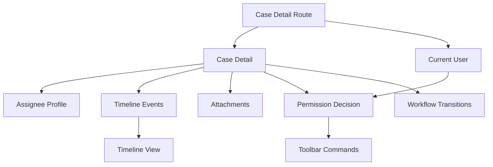
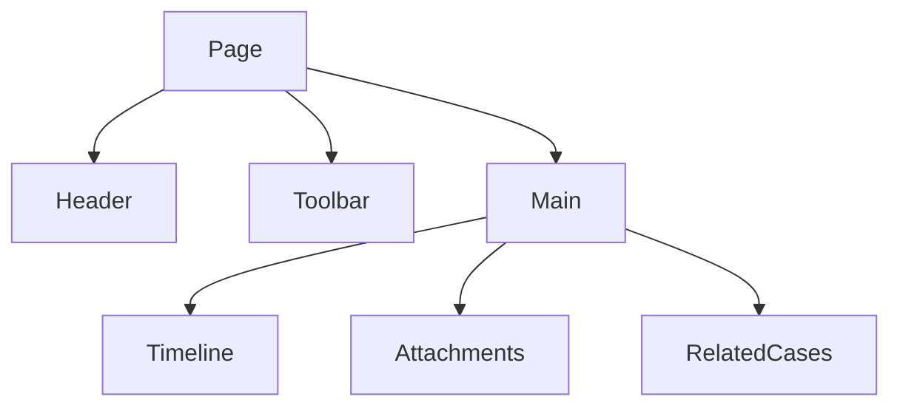
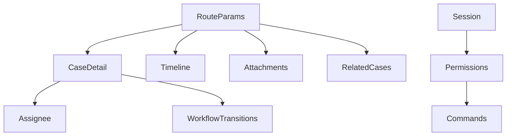
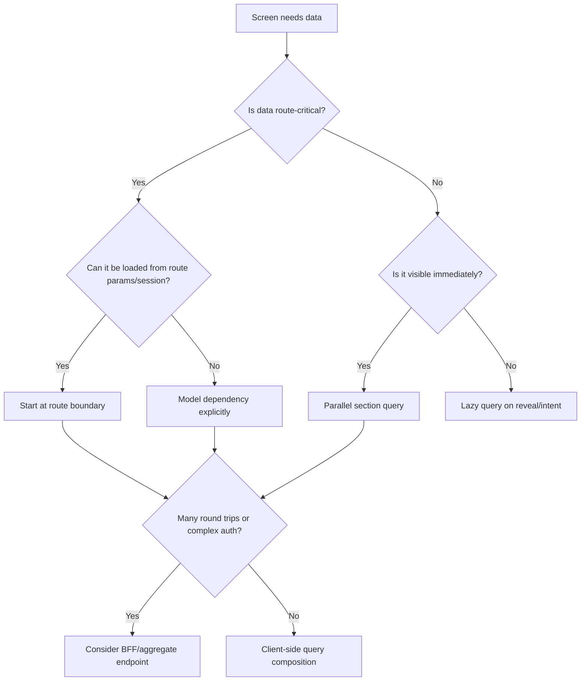
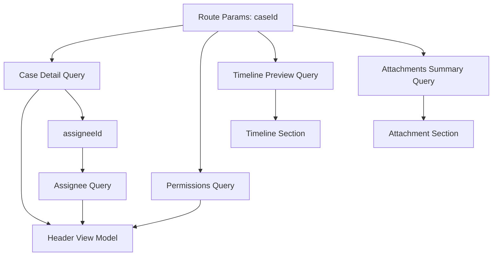

# Part 024 — Composing Data Requirements

> Target mental model: **a screen is not a component tree that happens to fetch. A screen is a data dependency graph that happens to render through components.** If you compose data accidentally through nested components, the network graph becomes accidental too.

Most real screens need more than one remote resource.

A case detail page might need:

- case detail;
- assigned officer profile;
- current user's permissions;
- workflow transitions;
- timeline events;
- attachments;
- comments;
- related cases;
- SLA counters;
- audit metadata;
- feature flags;
- reference data for dropdowns.

A naive React tree turns this into nested fetches.

```txt
Page fetches case
  Header fetches assignee
  Toolbar fetches permissions
  Timeline fetches events
    EventRow fetches actor
  Attachments fetches files
  RelatedCases fetches related list
```

That may work in local development.

It fails under real latency.

This part is about designing the data graph before the component tree traps you.

---

## 1. Data Requirement vs Component Requirement

A component requirement says:

> “This component needs `user.name`.”

A data requirement says:

> “This route needs case detail, assignee profile, permission decision, and timeline summary before primary content is useful.”

Those are not the same level.

If every component independently discovers and fetches its own data, the app gets:

- request waterfalls;
- duplicate requests;
- inconsistent loading boundaries;
- inconsistent error handling;
- hidden authorization dependencies;
- difficult prefetching;
- hard-to-test screens;
- fragile SSR/streaming behavior;
- impossible product-level loading design.

Component encapsulation is good.

Network encapsulation is dangerous when it hides critical dependencies.

---

## 2. Start With the Screen Contract

Before writing hooks, define the screen contract.

```ts
type CaseDetailScreenData = {
  case: CaseDetail
  permissions: CasePermissions
  transitions: WorkflowTransition[]
  timelinePreview: TimelineEvent[]
  assignee?: UserSummary
}
```

Then decide how it is loaded:

- one backend endpoint;
- multiple parallel queries;
- dependent queries;
- route loader;
- server component;
- streamed partial data;
- client-side progressive sections;
- mix of above.

The screen contract does not require a single API call. It requires explicit dependency design.

---

## 3. Draw the Data Dependency Graph

A dependency graph makes waterfalls visible.



Now classify dependencies.

### Independent

Can start immediately.

```txt
current user
reference data
feature flags
```

### Case-dependent

Needs `caseId`, already available from route params.

```txt
case detail
timeline
attachments
workflow transitions
```

### Data-dependent

Needs data returned by another request.

```txt
assignee profile requires case.assigneeId
related entity requires case.relatedEntityId
```

### Authorization-dependent

Needs permission context before exposing commands or fields.

```txt
available actions
restricted notes
redacted fields
```

A data graph gives you a performance and correctness map.

---

## 4. Component Tree Is the Wrong Default Graph

A component tree expresses rendering ownership.

A data graph expresses network dependencies.

They often differ.

Component tree:



Data graph:



If the component tree controls fetching, the network graph is an accident.

If the data graph controls fetching, the component tree can stay clean.

---

## 5. Query Composition Modes

There are five common modes.

### Single aggregate query

```tsx
useCaseDetailScreen(caseId)
```

Backend returns the complete screen data.

### Parallel queries

```tsx
useQueries({
  queries: [
    caseQuery(caseId),
    timelineQuery(caseId),
    permissionsQuery(caseId),
  ],
})
```

Independent requests start together.

### Dependent queries

```tsx
const caseQuery = useCase(caseId)
const assigneeQuery = useUser(caseQuery.data?.assigneeId, {
  enabled: Boolean(caseQuery.data?.assigneeId),
})
```

Second query needs result of first.

### Section-level progressive queries

Primary content loads first. Secondary sections load independently.

```txt
case detail: blocking
timeline: progressive
related cases: progressive
activity analytics: lazy
```

### Server-side composition

Server Component, route loader, or BFF composes data before the client sees it.

```txt
client asks for screen
server fans out to services
client receives ready or streamed representation
```

Each mode has trade-offs.

---

## 6. Parallelize Everything That Is Truly Independent

If three requests only need route params and session context, they should not wait for each other.

Bad:

```tsx
const caseQuery = useCase(caseId)
const timelineQuery = useTimeline(caseQuery.data?.id)
const attachmentsQuery = useAttachments(caseQuery.data?.id)
```

If `caseId` is already known, timeline and attachments do not need `caseQuery.data.id`.

Better:

```tsx
const caseQuery = useCase(caseId)
const timelineQuery = useTimeline(caseId)
const attachmentsQuery = useAttachments(caseId)
```

Or:

```tsx
const [caseQuery, timelineQuery, attachmentsQuery] = useQueries({
  queries: [
    caseQueryOptions(caseId),
    timelineQueryOptions(caseId),
    attachmentsQueryOptions(caseId),
  ],
})
```

Dependent queries are sometimes necessary. But many are accidental.

Rule:

> Do not wait for data you already know.

---

## 7. Dependent Queries Are Latency Multipliers

A dependent query creates a serial chain.

```txt
A -> B -> C
```

If each request takes 300 ms, the chain takes about 900 ms before all data is ready.

A parallel graph:

```txt
A
B
C
```

can complete in about 300 ms plus overhead.

Dependent queries are legitimate when:

- B needs an id only known after A;
- B requires a server-computed cursor from A;
- B must wait for authorization returned by A;
- B's request is invalid without A's result;
- B depends on a version/ETag from A.

They are not legitimate when:

- B only needs route params;
- B can derive id from URL;
- B waits because hook is nested too deeply;
- B waits because a component was hidden behind a conditional;
- B waits because no one designed a screen-level data graph.

---

## 8. Flattening Accidental Dependencies

Consider:

```tsx
function CasePage() {
  const caseQuery = useCase(caseId)

  if (!caseQuery.data) return <Loading />

  return <Timeline caseId={caseQuery.data.id} />
}

function Timeline({ caseId }: { caseId: string }) {
  const timelineQuery = useTimeline(caseId)
  return <TimelineView query={timelineQuery} />
}
```

`Timeline` waits for `CasePage` to finish, even though `caseId` came from the route.

Flatten:

```tsx
function CasePage() {
  const caseQuery = useCase(caseId)
  const timelineQuery = useTimeline(caseId)

  return (
    <CaseLayout
      caseQuery={caseQuery}
      timelineQuery={timelineQuery}
    />
  )
}
```

Or use route-level loader/query prefetch.

The point is not to move every hook to the page forever. The point is to avoid accidental network ordering.

---

## 9. Route-Level Data Ownership

Routes are natural data boundaries because route params often define resource identity.

```txt
/cases/:caseId
```

The route knows `caseId` before rendering children.

Therefore the route can start primary queries early.

```tsx
function CaseRoute() {
  const { caseId } = useParams()

  const caseQuery = useCase(caseId)
  const permissionsQuery = useCasePermissions(caseId)
  const timelineQuery = useTimelinePreview(caseId)

  return (
    <CaseRouteContext.Provider value={{ caseQuery, permissionsQuery, timelineQuery }}>
      <CasePage />
    </CaseRouteContext.Provider>
  )
}
```

But avoid turning route context into a dumping ground.

Route-level ownership is best for:

- primary route resource;
- permission gate;
- navigation-critical data;
- shell/header data;
- prefetchable data;
- shared data used by many children.

Deep components can still fetch optional or isolated data.

---

## 10. Blocking vs Progressive Data

Not every data requirement should block first render.

Classify each requirement.

| Requirement | Blocking? | Why |
|---|---:|---|
| case title/status | yes | primary identity of page |
| permission to view page | yes | security and UX gate |
| available actions | maybe | toolbar can skeleton/disable briefly |
| full timeline | no | section can stream or load progressively |
| attachments | no | secondary section |
| related cases | no | useful but not primary |
| audit metadata | maybe | depends on product context |
| reference dropdowns | no until form opens | lazy |

A screen with one global spinner for everything is often slower than necessary.

A screen with too many independent skeletons can feel chaotic.

Design the loading contract intentionally.

---

## 11. The Data Readiness State Machine

For composed data, `isLoading` is not enough.

Create a screen-level readiness model.

```ts
type CaseScreenState =
  | { tag: 'blocking-loading' }
  | { tag: 'not-found' }
  | { tag: 'forbidden' }
  | { tag: 'blocking-error'; error: AppError }
  | {
      tag: 'ready'
      case: CaseDetail
      permissions: CasePermissions
      timeline: RemoteSection<TimelineEvent[]>
      attachments: RemoteSection<Attachment[]>
    }

type RemoteSection<T> =
  | { tag: 'loading' }
  | { tag: 'ready'; data: T; stale?: boolean }
  | { tag: 'empty' }
  | { tag: 'error'; error: AppError; previousData?: T }
```

Then map query results into this model.

The UI consumes a coherent product state, not raw query booleans scattered everywhere.

---

## 12. Composing Query Results into a View Model

A view model is a derived object optimized for rendering.

```ts
type CaseHeaderViewModel = {
  title: string
  statusLabel: string
  assigneeName: string
  canAssign: boolean
  canClose: boolean
  lastUpdatedText: string
}
```

Build it from server-state queries.

```ts
function buildCaseHeaderViewModel(input: {
  case: CaseDetail
  permissions: CasePermissions
  assignee?: UserSummary
}): CaseHeaderViewModel {
  return {
    title: input.case.title,
    statusLabel: formatStatus(input.case.status),
    assigneeName: input.assignee?.displayName ?? 'Unassigned',
    canAssign: input.permissions.actions.includes('assign'),
    canClose: input.permissions.actions.includes('close'),
    lastUpdatedText: formatRelativeTime(input.case.updatedAt),
  }
}
```

Keep view models pure.

They should not fetch.

They should not mutate.

They should not read global state invisibly.

---

## 13. Avoid Copying Query Data Into Local State

Bad composition often looks like this:

```tsx
const caseQuery = useCase(caseId)
const [caseData, setCaseData] = useState<CaseDetail | null>(null)

useEffect(() => {
  if (caseQuery.data) setCaseData(caseQuery.data)
}, [caseQuery.data])
```

This creates a second replica.

Now you must answer:

- which one is fresh?
- which one updates after invalidation?
- which one participates in optimistic updates?
- which one resets on route change?

Use derived values instead.

```tsx
const vm = caseQuery.data
  ? buildCaseViewModel(caseQuery.data)
  : null
```

Local state is for client-owned drafts and interactions, not for mirroring server cache.

---

## 14. Batching and Backend Composition

Sometimes the right frontend composition is to stop composing on the frontend.

If a screen always needs five resources together, a backend-composed endpoint may be better.

```txt
GET /api/case-detail-screen/:caseId
```

Response:

```ts
type CaseDetailScreenResponse = {
  case: CaseDetail
  permissions: CasePermissions
  transitions: WorkflowTransition[]
  timelinePreview: TimelineEvent[]
  attachmentsSummary: AttachmentsSummary
}
```

Benefits:

- fewer round trips;
- consistent authorization;
- server-side fanout can be closer to services;
- one versioned screen contract;
- simpler client readiness state;
- easier SSR/streaming.

Costs:

- endpoint can become screen-specific;
- backend coupling to UI needs;
- larger payloads if poorly designed;
- harder reuse across screens;
- cache invalidation may be coarser;
- backend team must own composition performance.

This is the Backend-for-Frontend trade-off.

Do not reject BFF endpoints because they are “not pure REST”. A user waits for a screen, not for your resource taxonomy.

---

## 15. When to Use a BFF or Aggregate Endpoint

Use server-side composition when:

- the screen needs many small resources;
- dependent queries create unavoidable latency;
- authorization rules must be applied consistently;
- data comes from multiple backend services;
- mobile or high-latency clients suffer from round trips;
- the response is strongly tied to one user journey;
- SSR/streaming needs server-controlled data orchestration;
- product requires one coherent error/loading contract.

Prefer client-side composition when:

- resources are independently cacheable;
- sections are optional/lazy;
- users navigate between views reusing the same data;
- backend composition would duplicate many variants;
- the data graph is shallow;
- endpoint ownership is unclear;
- independent refetching is valuable.

The decision is architectural, not ideological.

---

## 16. Data Composition Decision Tree



Use this decision tree during design reviews.

---

## 17. `useQueries` for Dynamic Parallelism

When the number of queries is dynamic, use a controlled parallel query pattern.

```tsx
function useUsers(userIds: string[]) {
  const uniqueIds = [...new Set(userIds)].sort()

  return useQueries({
    queries: uniqueIds.map((id) => ({
      queryKey: userKeys.detail(id),
      queryFn: ({ signal }) => userApi.getUser(id, { signal }),
      staleTime: 5 * 60_000,
    })),
  })
}
```

But do not blindly fire 200 detail queries.

If the screen needs many users, ask for a batch endpoint.

```txt
GET /api/users?ids=1,2,3,4
```

or:

```txt
POST /api/users/batch-lookup
```

with an idempotent lookup body.

Dynamic parallelism is useful for small sets. It is not a substitute for bulk API design.

---

## 18. N+1 Requests in React

N+1 is not only a backend ORM problem.

Frontend N+1:

```tsx
function Timeline({ events }: { events: TimelineEvent[] }) {
  return events.map((event) => <TimelineRow key={event.id} actorId={event.actorId} />)
}

function TimelineRow({ actorId }: { actorId: string }) {
  const actorQuery = useUser(actorId)
  return <span>{actorQuery.data?.displayName}</span>
}
```

For 100 events, you might trigger dozens of user lookups.

Better options:

1. include actor summaries in timeline response;
2. batch actor lookup;
3. prefetch unique actors at timeline level;
4. use normalized entity cache intentionally;
5. lazy-load actors only on hover/details.

Example batch composition:

```tsx
function useTimelineWithActors(caseId: string) {
  const timelineQuery = useTimeline(caseId)

  const actorIds = useMemo(
    () => [...new Set(timelineQuery.data?.map((e) => e.actorId) ?? [])].sort(),
    [timelineQuery.data]
  )

  const actorsQuery = useUsersBatch(actorIds, {
    enabled: actorIds.length > 0,
  })

  return { timelineQuery, actorsQuery }
}
```

Even this has a dependency. The better endpoint might return actor summaries directly.

---

## 19. Request Waterfall Patterns

Common accidental waterfalls:

### Parent gate waterfall

```tsx
if (!parentQuery.data) return <Spinner />
return <ChildThatFetches />
```

The child cannot start until parent finishes.

### Conditional mount waterfall

```tsx
{activeTab === 'timeline' && <Timeline />}
```

Timeline fetch waits until tab activation. That may be desired or not.

### Derived id waterfall

```tsx
const userId = caseQuery.data?.assigneeId
useUser(userId, { enabled: Boolean(userId) })
```

Legitimate if assignee id is unknown otherwise.

### Permission waterfall

```tsx
if (!permissionsQuery.data?.canViewTimeline) return null
return <Timeline />
```

May be necessary. But if server already enforces permissions, timeline can start and return 403/empty appropriately. Choose deliberately.

### Lazy import plus fetch waterfall

```tsx
const Timeline = lazy(() => import('./Timeline'))
```

If Timeline fetches internally, you wait for JS chunk, then network data.

Prefetch both when likely.

---

## 20. Prefetching as Composition

Prefetching is starting a query before the component needs it.

Examples:

- hover over case link;
- row visible in viewport;
- user opens command palette;
- route loader before navigation completes;
- after login, prefetch shell data;
- after viewing list, prefetch first detail page.

```tsx
function CaseLink({ caseId, children }: Props) {
  const queryClient = useQueryClient()

  return (
    <Link
      to={`/cases/${caseId}`}
      onMouseEnter={() => {
        queryClient.prefetchQuery({
          queryKey: caseKeys.detail(caseId),
          queryFn: ({ signal }) => caseApi.getCase(caseId, { signal }),
          staleTime: 30_000,
        })
      }}
    >
      {children}
    </Link>
  )
}
```

Prefetching needs good query keys. Otherwise the prefetched data is not the data the screen uses.

---

## 21. Route Transition Composition

During navigation, compose data around the route transition.

```txt
user clicks case row
  prefetch case detail
  prefetch permissions
  navigate
  render with warm cache
  load secondary sections progressively
```

This is different from:

```txt
user clicks case row
  navigate
  mount page
  page fetches case
  case loaded
  child fetches timeline
```

The second graph is slower because it waits for rendering to discover network needs.

A strong router/data layer makes data requirements explicit before render.

---

## 22. Error Composition

Multiple queries can fail differently.

A screen must decide which failures block the whole page.

Example:

| Query | Error | Screen behavior |
|---|---|---|
| case detail | 404 | show not found |
| case detail | 403 | show forbidden |
| permissions | 500 | show restricted fallback or blocking error |
| timeline | 500 | show timeline section error |
| attachments | 404 | treat as empty if contract allows |
| related cases | timeout | show retryable section error |

Do not collapse all errors into one global screen error.

Map errors by role in the screen contract.

```ts
function buildCaseScreenState(input: Queries): CaseScreenState {
  if (input.case.error?.kind === 'not-found') return { tag: 'not-found' }
  if (input.case.error?.kind === 'forbidden') return { tag: 'forbidden' }
  if (input.case.error) return { tag: 'blocking-error', error: input.case.error }
  if (!input.case.data) return { tag: 'blocking-loading' }

  return {
    tag: 'ready',
    case: input.case.data,
    permissions: input.permissions.data ?? defaultSafePermissions(),
    timeline: sectionFromQuery(input.timeline),
    attachments: sectionFromQuery(input.attachments),
  }
}
```

Error composition is product design plus architecture.

---

## 23. Authorization Composition

Authorization is often both a data dependency and a rendering boundary.

Avoid this pattern:

```tsx
if (canCloseCase) {
  return <CloseButton />
}
```

when `canCloseCase` was guessed locally from role names.

Prefer server-provided permission decisions or allowed transitions.

```ts
type CasePermissions = {
  canView: boolean
  actions: Array<'assign' | 'close' | 'reopen' | 'comment'>
  fieldVisibility: Record<string, 'visible' | 'redacted' | 'hidden'>
}
```

Then compose UI from that contract.

```tsx
<CommandBar actions={permissions.actions} />
```

But do not make every section wait for a separate permission query if the backend can include permission metadata with the primary resource.

A useful API shape:

```ts
type CaseDetailResponse = {
  data: CaseDetail
  meta: {
    permissions: CasePermissions
    version: string
  }
}
```

Security is still enforced server-side. Client permission data is for UX and safe rendering.

---

## 24. Reference Data Composition

Reference data includes:

- countries;
- enum labels;
- workflow states;
- queue lists;
- departments;
- static configuration;
- allowed dropdown options.

Reference data often has longer freshness windows.

```tsx
useQuery({
  queryKey: referenceKeys.countries(),
  queryFn: referenceApi.getCountries,
  staleTime: 24 * 60 * 60_000,
})
```

But not all reference data is global.

Queue list may be tenant-specific:

```ts
['tenants', tenantId, 'reference-data', 'queues']
```

Allowed workflow transitions may be case-specific:

```ts
['cases', 'detail', caseId, 'workflow-transitions']
```

Do not overgeneralize reference data.

Ask who owns it and what scopes it.

---

## 25. Forms and Data Composition

Forms combine server data, client draft state, validation contracts, and mutation lifecycle.

Example edit case form needs:

- case detail initial values;
- reference data for dropdowns;
- permission/field visibility;
- server validation schema or constraints;
- submit mutation;
- conflict version.

The form draft is not the query data.

```tsx
const caseQuery = useCase(caseId)
const referenceQuery = useCaseFormReferenceData(tenantId)
const permissionsQuery = useCasePermissions(caseId)

const form = useForm({
  values: caseQuery.data ? toCaseFormValues(caseQuery.data) : undefined,
})
```

Be explicit about reinitialization.

If server data refetches while the user is editing, should the form reset?

Usually no.

Instead:

- initialize once when data first arrives;
- keep dirty draft local;
- warn if server version changed;
- submit with `If-Match` or version field;
- handle conflict.

Data composition for forms is also concurrency design.

---

## 26. Composing Mutations with Queries

A mutation affects the data graph.

Example: close case.

Before mutation:

```txt
case detail
case lists
workflow transitions
timeline
dashboard counts
```

After mutation:

- detail status changes;
- open list may remove the case;
- closed list may include it;
- transitions change;
- timeline gets closure event;
- counts change.

Mutation composition plan:

```ts
const closeCaseMutation = useMutation({
  mutationFn: closeCase,
  onSuccess: async (updatedCase) => {
    queryClient.setQueryData(caseKeys.detail(updatedCase.id), updatedCase)

    await Promise.all([
      queryClient.invalidateQueries({ queryKey: caseKeys.lists() }),
      queryClient.invalidateQueries({ queryKey: caseKeys.transitions(updatedCase.id) }),
      queryClient.invalidateQueries({ queryKey: caseKeys.timeline(updatedCase.id) }),
      queryClient.invalidateQueries({ queryKey: dashboardKeys.counts() }),
    ])
  },
})
```

Do not let mutation components invent invalidation ad hoc.

Put mutation impact in the domain module.

---

## 27. Composing Data With Suspense

Suspense can make async rendering cleaner, but it does not remove dependency design.

Suspense boundary placement should follow the product loading contract.

```tsx
<Suspense fallback={<CaseHeaderSkeleton />}>
  <CaseHeader />
</Suspense>

<Suspense fallback={<TimelineSkeleton />}>
  <Timeline />
</Suspense>
```

This allows independent sections to reveal independently.

But if each Suspense child starts fetching only after it renders, you can still create waterfalls.

Use preloading, route loaders, framework data APIs, or query prefetch to start critical work before Suspense boundaries are encountered.

Suspense is a rendering primitive, not a data graph planner.

---

## 28. Server Components and Data Composition

Server Components can move data composition to the server side.

Conceptually:

```tsx
async function CasePage({ caseId }: { caseId: string }) {
  const [caseData, timeline, permissions] = await Promise.all([
    getCase(caseId),
    getTimeline(caseId),
    getPermissions(caseId),
  ])

  return (
    <CasePageView
      case={caseData}
      timeline={timeline}
      permissions={permissions}
    />
  )
}
```

This has benefits:

- server can access backend services directly;
- no browser CORS/token exposure for internal calls;
- lower client JavaScript burden;
- easier server-side parallelism;
- streaming can progressively reveal UI;
- initial HTML can contain useful content.

But client interactivity still needs careful boundaries.

If a Client Component later refetches the same data under a different key or contract, you get duplication.

Server composition and client cache composition must be aligned.

---

## 29. GraphQL Composition

GraphQL lets a client request a graph-shaped payload.

That can reduce overfetching and underfetching when the schema is well designed.

Example:

```graphql
query CaseDetailScreen($caseId: ID!) {
  case(id: $caseId) {
    id
    title
    status
    assignee {
      id
      displayName
    }
    permissions {
      actions
    }
    timeline(limit: 20) {
      id
      type
      createdAt
      actor {
        id
        displayName
      }
    }
  }
}
```

GraphQL does not automatically remove composition problems.

You still need:

- field ownership;
- error policy;
- pagination model;
- authorization model;
- normalized cache strategy;
- fragment discipline;
- schema evolution rules;
- backend resolver performance.

GraphQL moves composition into the query document and schema layer. It does not make dependency design optional.

---

## 30. REST Composition

REST-style APIs often expose resources separately.

```txt
GET /cases/:id
GET /cases/:id/timeline
GET /cases/:id/attachments
GET /users/:id
GET /cases/:id/permissions
```

This can be clean and cacheable.

But screens often need combinations.

Practical REST composition options:

### Include parameter

```txt
GET /cases/:id?include=assignee,permissions,timelinePreview
```

### Dedicated aggregate endpoint

```txt
GET /case-detail-screens/:id
```

### Batch endpoint

```txt
POST /users/batch-lookup
```

### Independent resource queries

```txt
GET /cases/:id
GET /cases/:id/timeline
```

The right choice depends on latency, cacheability, ownership, and reuse.

---

## 31. Avoid the “One Giant Hook” Trap

A screen hook can coordinate data.

```tsx
function useCaseDetailScreen(caseId: string) {
  const caseQuery = useCase(caseId)
  const permissionsQuery = useCasePermissions(caseId)
  const timelineQuery = useTimelinePreview(caseId)

  return buildCaseScreenState({
    caseQuery,
    permissionsQuery,
    timelineQuery,
  })
}
```

This is useful.

But it can become a giant hook that knows every tab, modal, dropdown, and optional section.

Keep layers:

- route hook: blocking and shared data;
- section hooks: section-specific data;
- form hooks: form draft + reference data;
- mutation hooks: command lifecycle + invalidation;
- view model builders: pure composition.

A good screen hook coordinates. It does not become a second application framework.

---

## 32. Composition Boundaries

Use these boundaries deliberately.

### Route boundary

Owns primary resource and authorization gate.

### Layout boundary

Owns shell data shared across nested routes.

### Section boundary

Owns optional data for a visible section.

### Interaction boundary

Owns data fetched after user intent: modal open, hover, command palette.

### Form boundary

Owns draft initialization, reference data, validation, mutation.

### Server boundary

Owns secure composition, fanout, sensitive data filtering, SSR/RSC.

### Cache boundary

Owns dedupe, freshness, invalidation, persistence.

Confusion happens when one boundary secretly performs another boundary's job.

---

## 33. Example: Case Detail Composition Plan



Implementation sketch:

```tsx
function useCaseDetailRouteData(caseId: string) {
  const caseQuery = useCase(caseId)
  const permissionsQuery = useCasePermissions(caseId)
  const timelinePreviewQuery = useTimelinePreview(caseId)
  const attachmentsSummaryQuery = useAttachmentsSummary(caseId)

  const assigneeId = caseQuery.data?.assigneeId
  const assigneeQuery = useUserSummary(assigneeId, {
    enabled: Boolean(assigneeId),
    staleTime: 5 * 60_000,
  })

  return buildCaseDetailRouteState({
    caseQuery,
    permissionsQuery,
    timelinePreviewQuery,
    attachmentsSummaryQuery,
    assigneeQuery,
  })
}
```

Then rendering:

```tsx
function CaseDetailRoute() {
  const { caseId } = useRequiredParams(['caseId'])
  const state = useCaseDetailRouteData(caseId)

  if (state.tag === 'blocking-loading') return <CasePageSkeleton />
  if (state.tag === 'not-found') return <NotFound />
  if (state.tag === 'forbidden') return <Forbidden />
  if (state.tag === 'blocking-error') return <RetryablePageError error={state.error} />

  return <CaseDetailPage state={state} />
}
```

The page receives a coherent state.

---

## 34. Example: Search Page Composition

Search pages are different from detail pages.

They often involve:

- URL state;
- debounced draft state;
- list query;
- facets;
- saved views;
- selection state;
- bulk action permissions;
- export job mutation.

Composition plan:

```txt
URL params -> committed search identity -> list query
user input -> draft state -> debounce/submit -> URL update
list result -> selected ids validation
permissions -> available bulk actions
facets -> maybe query independently or from list response
```

Do not use raw input directly as server-state identity unless immediate search is intended.

```tsx
function CaseSearchRoute() {
  const params = useCaseSearchParamsFromUrl()
  const listQuery = useCaseSearch(params)
  const facetsQuery = useCaseFacets(params.withoutPagination())
  const permissionsQuery = useBulkActionPermissions(params.tenantId)

  return <CaseSearchPage state={buildCaseSearchState({ listQuery, facetsQuery, permissionsQuery })} />
}
```

For high-traffic search, consider server-side search sessions, saved query ids, or cursor contracts.

---

## 35. Example: Command Palette Composition

A command palette is interaction-triggered.

It should not fetch heavy data on app boot unless product requires it.

```tsx
function CommandPalette() {
  const [open, setOpen] = useState(false)
  const [query, setQuery] = useState('')
  const debounced = useDebouncedValue(query, 150)

  const resultsQuery = useCommandSearch(debounced, {
    enabled: open && debounced.length >= 2,
  })

  return <CommandPaletteView open={open} query={query} resultsQuery={resultsQuery} />
}
```

Composition rules:

- open state is client state;
- typed text is draft state;
- debounced query is server-state identity;
- results are server state;
- command execution is mutation state.

---

## 36. Testing Composed Data

Test the data graph, not only components.

Important cases:

1. independent queries start without waiting for each other;
2. dependent query waits only for true dependency;
3. primary resource 404 maps to page not found;
4. secondary section failure does not block page;
5. mutation invalidates all affected keys;
6. URL params produce expected query key;
7. user/tenant switch clears or scopes cache;
8. stale previous data is handled intentionally;
9. loading states match product contract;
10. slow secondary data does not hide primary content.

With MSW or equivalent, control response order.

```ts
server.use(
  http.get('/api/cases/:id', async () => {
    await delay(300)
    return HttpResponse.json(caseFixture)
  }),
  http.get('/api/cases/:id/timeline', async () => {
    await delay(50)
    return HttpResponse.json(timelineFixture)
  })
)
```

Then verify timeline request did not wait for case detail if it only needed `caseId`.

---

## 37. Observability for Data Composition

Production observability should reveal the data graph.

Log or measure:

- route id;
- query key hash/name;
- request start/end;
- cache hit/miss;
- stale vs fresh status;
- waterfall depth;
- blocking data duration;
- section data duration;
- mutation invalidation fanout;
- error role: blocking vs section;
- retry count;
- abort/cancel reason.

A useful metric:

```txt
route_data_ready_ms
```

Another:

```txt
secondary_section_ready_ms{section="timeline"}
```

And:

```txt
client_request_waterfall_depth{route="case-detail"}
```

If you cannot see the waterfall, you cannot improve it reliably.

---

## 38. Review Checklist

For every screen, ask:

1. What is the primary route resource?
2. Which data blocks first useful render?
3. Which data can load progressively?
4. Which data is independent and can start immediately?
5. Which dependencies are truly data-dependent?
6. Are any dependencies accidental because of component nesting?
7. Are query keys canonical and shared with prefetch/loaders?
8. Should the backend compose this data instead?
9. Are authorization decisions included at the right boundary?
10. Are secondary errors isolated?
11. Are mutation impacts mapped to the data graph?
12. Is form draft state separated from server cache?
13. Is URL state canonicalized into query identity?
14. Can tests control response ordering and verify no waterfall?
15. Can observability show blocking vs secondary readiness?

If you cannot answer these, the data graph is implicit.

Implicit data graphs become production mysteries.

---

## 39. Design Rules

1. A screen is a data dependency graph before it is a component tree.
2. Route params should start route-critical queries early.
3. Do not wait for data you already know.
4. Use dependent queries only for true dependencies.
5. Compose loading and error states by product role.
6. Use query keys consistently across fetch, prefetch, loader, and mutation.
7. Avoid frontend N+1; batch or include when needed.
8. Consider BFF/aggregate endpoints when round trips dominate.
9. Keep form drafts separate from server-state replicas.
10. Suspense improves rendering composition, not data graph design by itself.
11. Server Components can move composition server-side, but boundaries still matter.
12. Mutation impact belongs to the domain data graph, not random buttons.
13. Test response ordering to expose accidental waterfalls.
14. Instrument route data readiness in production.

---

## 40. What You Should Now Be Able To Do

After this part, you should be able to:

- model a screen as a data dependency graph;
- distinguish component requirements from data requirements;
- decide what blocks render and what can be progressive;
- flatten accidental waterfalls;
- use parallel and dependent queries deliberately;
- identify frontend N+1 request patterns;
- choose between client composition and backend composition;
- build screen-level readiness models and view models;
- compose authorization, reference data, forms, and mutations safely;
- test and observe composed data behavior.

This closes Phase 3: **React Rendering Model Meets Remote Data**.

In the next part, we enter Phase 4 and move into server-state engines in detail, starting with **Query Client Architecture**.

---

## References

- TanStack Query React Docs — Parallel Queries: https://tanstack.com/query/v5/docs/framework/react/guides/parallel-queries
- TanStack Query React Docs — Dependent Queries: https://tanstack.com/query/v5/docs/framework/react/guides/dependent-queries
- TanStack Query React Docs — Query Keys: https://tanstack.com/query/v5/docs/framework/react/guides/query-keys
- TanStack Query React Docs — Prefetching & Router Integration: https://tanstack.com/query/v5/docs/framework/react/guides/prefetching
- React Docs — Server Components: https://react.dev/reference/rsc/server-components
- React Docs — Suspense: https://react.dev/reference/react/Suspense
